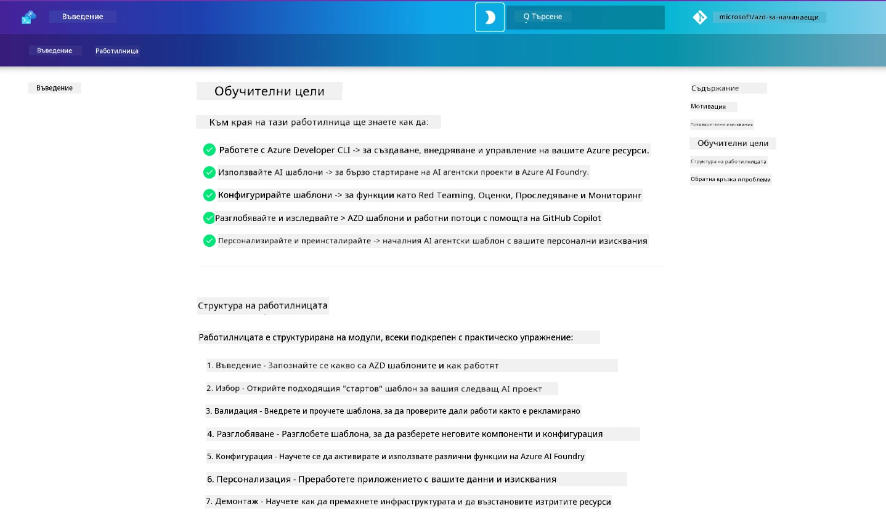

<div align="center">
  <div style="background: linear-gradient(135deg, #0078d4, #106ebe); border-radius: 10px; padding: 20px; margin: 20px 0; box-shadow: 0 4px 15px rgba(0, 120, 212, 0.3); border: 2px solid #005a9e;">
    <h2 style="color: white; margin: 0; font-size: 24px; text-shadow: 1px 1px 2px rgba(0,0,0,0.3);">
      🎯 Работилница AZD за разработчици на изкуствен интелект
    </h2>
    <p style="color: white; margin: 10px 0 0 0; font-size: 16px; text-shadow: 1px 1px 2px rgba(0,0,0,0.3);">
      <strong>Практическа работилница за изграждане на AI приложения с Azure Developer CLI.</strong><br>
      Завършете 7 модула, за да овладеете шаблони на AZD и работни процеси за внедряване на AI.
    </p>
    <div style="margin-top: 15px;">
      <span style="background: rgba(255,255,255,0.2); padding: 5px 10px; border-radius: 15px; color: white; font-size: 14px;">
        📅 Последна актуализация: март 2026
      </span>
    </div>
  </div>
</div>

# Работилница AZD за разработчици на изкуствен интелект

Добре дошли в практическата работилница за изучаване на Azure Developer CLI (AZD) с фокус върху внедряването на AI приложения. Тази работилница ви помага да усвоите приложно разбиране на шаблоните на AZD в 3 стъпки:

1. **Откриване** - намерете шаблона, който е подходящ за вас.
1. **Внедряване** - внедрете и валидирайте, че работи.
1. **Персонализиране** - модифицирайте и развивайте, за да го направите свое!

По време на тази работилница ще бъдете запознати и с основни инструменти и работни процеси за разработчици, които да ви помогнат да оптимизирате цялостния си процес на разработка.

<br/>

## Ръководство в браузъра

Уроците в работилницата са във формат Markdown. Можете да ги разглеждате директно в GitHub или да стартирате браузърна визуализация, както е показано на снимката по-долу.



За да използвате тази опция - форкнете хранилището във вашия профил и стартирайте GitHub Codespaces. След като терминалът на VS Code се активира, въведете тази команда:

Тази браузърна визуализация работи в GitHub Codespaces, dev контейнери или локално копие с инсталирани Python и MkDocs.

```bash title="" linenums="0"
mkdocs serve > /dev/null 2>&1 &
```

След няколко секунди ще видите изскачащ диалог. Изберете опцията `Open in browser`. Уеб-базираното ръководство ще се отвори в нов таб на браузъра. Някои предимства на тази визуализация:

1. **Вградена търсачка** - намирайте ключови думи или уроци бързо.
1. **Икона за копиране** - задръжте курсора върху блокове с код, за да видите тази опция
1. **Смяна на тема** - превключвайте между тъмна и светла тема
1. **Получете помощ** - кликнете иконата на Discord в долния ред, за да се присъедините!

<br/>

## Обзор на работилницата

**Продължителност:** 3-4 часа  
**Ниво:** Начинаещи до междинно  
**Предварителни изисквания:** Познания за Azure, концепции за AI, VS Code и командни инструменти.

Това е практическа работилница, в която учите чрез правене. След като завършите упражненията, препоръчваме да прегледате учебната програма AZD For Beginners, за да продължите обучението си с най-добри практики за сигурност и продуктивност.

| Време| Модул  | Цел |
|:---|:---|:---|
| 15 минути | [Въведение](docs/instructions/0-Introduction.md) | Настройване на контекста, разбиране на целите |
| 30 минути | [Избор на AI шаблон](docs/instructions/1-Select-AI-Template.md) | Проучване на опции и избор на начален шаблон | 
| 30 минути | [Валидиране на AI шаблон](docs/instructions/2-Validate-AI-Template.md) | Внедряване на стандартно решение в Azure |
| 30 минути | [Деконструкция на AI шаблон](docs/instructions/3-Deconstruct-AI-Template.md) | Изследване на структурата и конфигурацията |
| 30 минути | [Конфигуриране на AI шаблон](docs/instructions/4-Configure-AI-Template.md) | Активиране и изпитване на наличните функции |
| 30 минути | [Персонализиране на AI шаблон](docs/instructions/5-Customize-AI-Template.md) | Адаптиране на шаблона според вашите нужди |
| 30 минути | [Изключване на инфраструктурата](docs/instructions/6-Teardown-Infrastructure.md) | Почистване и освобождаване на ресурси |
| 15 минути | [Обобщение и следващи стъпки](docs/instructions/7-Wrap-up.md) | Ресурси за обучение, предизвикателство на работилницата |

<br/>

## Какво ще научите

Помислете за шаблона AZD като образователна среда за изследване на различни възможности и инструменти за цялостна разработка на Microsoft Foundry. В края на тази работилница ще имате интуитивно разбиране за различни инструменти и концепции в този контекст.

| Концепция  | Цел |
|:---|:---|
| **Azure Developer CLI** | Разбиране на команди и работни процеси на инструмента |
| **AZD шаблони**| Разбиране на структурата и конфигурацията на проекта |
| **Azure AI Agent**| Подготовка и внедряване на проект в Microsoft Foundry |
| **Azure AI Search**| Активиране на инженеринг на контекста с агенти |
| **Наблюдаемост**| Изследване на проследяване, мониторинг и оценки |
| **Red Teaming**| Изследване на атаки и мерки за защита |

<br/>

## Структура на работилницата

Работилницата е структурирана така, че да ви води от откриване на шаблон, през внедряване, деконструкция и персонализиране - използвайки официалния начален шаблон [Getting Started with AI Agents](https://github.com/Azure-Samples/get-started-with-ai-agents) като основа.

### [Модул 1: Избор на AI шаблон](docs/instructions/1-Select-AI-Template.md) (30 минути)

- Какво са AI шаблони?
- Къде мога да намеря AI шаблони?
- Как мога да започна да изграждам AI агенти?
- **Лабораторно упражнение**: Бърз старт в Codespaces или dev контейнер

### [Модул 2: Валидиране на AI шаблон](docs/instructions/2-Validate-AI-Template.md) (30 минути)

- Каква е архитектурата на AI шаблона?
- Какъв е работният процес на AZD разработка?
- Как мога да получа помощ при разработката с AZD?
- **Лабораторно упражнение**: Внедряване и валидиране на AI Agents шаблон

### [Модул 3: Деконструкция на AI шаблон](docs/instructions/3-Deconstruct-AI-Template.md) (30 минути)

- Разгледайте средата си в `.azure/`
- Разгледайте настройките на ресурсите в `infra/`
- Разгледайте конфигурацията на AZD в `azure.yaml` файловете
- **Лабораторно упражнение**: Промяна на променливи на средата и повторно внедряване

### [Модул 4: Конфигуриране на AI шаблон](docs/instructions/4-Configure-AI-Template.md) (30 минути)
- Изследване: Retrieval Augmented Generation
- Изследване: Оценка на агенти и Red Teaming
- Изследване: Проследяване и мониторинг
- **Лабораторно упражнение**: Изследване на AI агент + наблюдаемост

### [Модул 5: Персонализиране на AI шаблон](docs/instructions/5-Customize-AI-Template.md) (30 минути)
- Определяне: PRD със сценарийни изисквания
- Конфигуриране: Променливи на средата за AZD
- Реализация: Lifecycle hooks за допълнителни задачи
- **Лабораторно упражнение**: Персонализирайте шаблона за моя сценарий

### [Модул 6: Изключване на инфраструктура](docs/instructions/6-Teardown-Infrastructure.md) (30 минути)
- Преглед: Какво са AZD шаблони?
- Преглед: Защо да използваме Azure Developer CLI?
- Следващи стъпки: Пробвайте друг шаблон!
- **Лабораторно упражнение**: Деактивиране на инфраструктурата и почистване

<br/>

## Предизвикателство на работилницата

Искате ли предизвикателство да направите повече? Ето няколко предложения за проекти - или споделете идеите си с нас!!

| Проект | Описание |
|:---|:---|
|1. **Деконструиране на сложен AI шаблон** | Използвайте описания работен процес и инструменти и вижте дали можете да внедрите, валидирате и персонализирате различен AI шаблон за решение. _Какво научихте?_|
|2. **Персонализиране със своя сценарий**  | Опитайте да напишете PRD (Документ за продуктови изисквания) за различен сценарий. След това използвайте GitHub Copilot в хранилището на шаблона в Agent Model - и го помолете да генерира работен процес на персонализация за вас. _Какво научихте? Как бихте подобрили тези предложения?_|
| | |

## Имаш обратна връзка?

1. Публикувайте проблем в това хранилище - маркирайте го с `Workshop` за удобство.
1. Присъединете се към Discord на Microsoft Foundry - свържете се с колеги!


| | | 
|:---|:---|
| **📚 Начална страница на курса**| [AZD For Beginners](../README.md)|
| **📖 Документация** | [Започнете с AI шаблони](https://learn.microsoft.com/en-us/azure/ai-foundry/how-to/develop/ai-template-get-started)|
| **🛠️ AI шаблони** | [Microsoft Foundry Templates](https://ai.azure.com/templates) |
|**🚀 Следващи стъпки** | [Започнете работилницата](#обзор-на-работилницата) |
| | |

<br/>

---

**Навигация:** [Главен курс](../README.md) | [Въведение](docs/instructions/0-Introduction.md) | [Модул 1: Избор на шаблон](docs/instructions/1-Select-AI-Template.md)

**Готови ли сте да започнете да изграждате AI приложения с AZD?**

[Започнете работилницата: Въведение →](docs/instructions/0-Introduction.md)

---

<!-- CO-OP TRANSLATOR DISCLAIMER START -->
**Отказ от отговорност**:  
Този документ е преведен с помощта на AI преводаческа услуга [Co-op Translator](https://github.com/Azure/co-op-translator). Въпреки че се стремим към точност, моля имайте предвид, че автоматизираните преводи могат да съдържат грешки или неточности. Оригиналният документ на неговия носител се счита за авторитетен източник. За критична информация се препоръчва професионален човешки превод. Не носим отговорност за каквито и да е недоразумения или неправилни тълкувания, произтичащи от използването на този превод.
<!-- CO-OP TRANSLATOR DISCLAIMER END -->