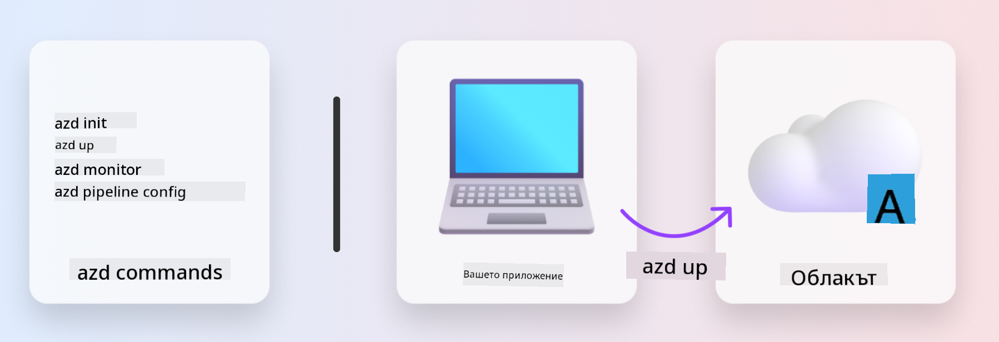

<!--
CO_OP_TRANSLATOR_METADATA:
{
  "original_hash": "06d6207eff634aefcaa41739490a5324",
  "translation_date": "2025-09-25T01:59:48+00:00",
  "source_file": "workshop/docs/instructions/1-Select-AI-Template.md",
  "language_code": "bg"
}
-->
# 1. Изберете шаблон

!!! tip "В КРАЯ НА ТОЗИ МОДУЛ ЩЕ МОЖЕТЕ ДА"

    - [ ] Опишете какво представляват AZD шаблоните
    - [ ] Откриете и използвате AZD шаблони за AI
    - [ ] Започнете работа с шаблона AI Agents
    - [ ] **Лаборатория 1:** Бърз старт с AZD и GitHub Codespaces

---

## 1. Аналогия с изграждане

Създаването на модерно AI приложение, готово за корпоративна употреба, _от нулата_ може да бъде предизвикателно. Това е малко като да построите новия си дом сами, тухла по тухла. Да, възможно е! Но не е най-ефективният начин да постигнете желания краен резултат!

Вместо това, често започваме с вече съществуващ _проектен план_ и работим с архитект, за да го персонализираме според нашите изисквания. Точно този подход трябва да се използва при изграждането на интелигентни приложения. Първо, намерете добра проектна архитектура, която отговаря на вашия проблем. След това работете със специалист, за да персонализирате и разработите решението за вашия конкретен сценарий.

Но къде можем да намерим тези проектни планове? И как да намерим архитект, който е готов да ни научи как да персонализираме и внедрим тези планове сами? В този уъркшоп ще отговорим на тези въпроси, като ви запознаем с три технологии:

1. [Azure Developer CLI](https://aka.ms/azd) - инструмент с отворен код, който ускорява пътя на разработчика от локална разработка (build) до внедряване в облака (ship).
1. [Azure AI Foundry Templates](https://ai.azure.com/templates) - стандартизирани хранилища с отворен код, съдържащи примерен код, инфраструктура и конфигурационни файлове за внедряване на AI архитектура.
1. [GitHub Copilot Agent Mode](https://code.visualstudio.com/docs/copilot/chat/chat-agent-mode) - кодиращ агент, базиран на знания за Azure, който може да ни насочва в навигацията на кодовата база и правенето на промени - използвайки естествен език.

С тези инструменти в ръка можем да _открием_ подходящия шаблон, _внедрим_ го, за да валидираме, че работи, и _персонализираме_ го, за да отговаря на нашите специфични сценарии. Нека се потопим и научим как работят тези технологии.

---

## 2. Azure Developer CLI

[Azure Developer CLI](https://learn.microsoft.com/en-us/azure/developer/azure-developer-cli/) (или `azd`) е инструмент с отворен код, който може да ускори вашето пътуване от код към облак с набор от команди, удобни за разработчици, които работят последователно във вашата IDE (разработка) и CI/CD (devops) среди.

С `azd`, вашето внедряване може да бъде толкова просто, колкото:

- `azd init` - Инициализира нов AI проект от съществуващ AZD шаблон.
- `azd up` - Осигурява инфраструктура и внедрява вашето приложение в една стъпка.
- `azd monitor` - Получавате мониторинг в реално време и диагностика за вашето внедрено приложение.
- `azd pipeline config` - Настройва CI/CD процеси за автоматизирано внедряване в Azure.

**🎯 | УПРАЖНЕНИЕ**: <br/> Изследвайте инструмента `azd` във вашата GitHub Codespaces среда сега. Започнете, като въведете тази команда, за да видите какво може да направи инструментът:

```bash title="" linenums="0"
azd help
```



---

## 3. AZD шаблон

За да постигне това, `azd` трябва да знае каква инфраструктура да осигури, какви конфигурационни настройки да наложи и какво приложение да внедри. Тук идват [AZD шаблоните](https://learn.microsoft.com/en-us/azure/developer/azure-developer-cli/azd-templates?tabs=csharp).

AZD шаблоните са хранилища с отворен код, които комбинират примерен код с инфраструктура и конфигурационни файлове, необходими за внедряване на архитектурата на решението. 
Използвайки подхода _Infrastructure-as-Code_ (IaC), те позволяват дефинициите на ресурсите и конфигурационните настройки на шаблона да бъдат контролирани чрез версии (точно както изходния код на приложението) - създавайки повторяеми и последователни работни процеси за потребителите на този проект.

Когато създавате или използвате AZD шаблон за _вашия_ сценарий, обмислете следните въпроси:

1. Какво изграждате? → Има ли шаблон с начален код за този сценарий?
1. Как е архитектурно организирано вашето решение? → Има ли шаблон с необходимите ресурси?
1. Как се внедрява вашето решение? → Помислете за `azd deploy` с предварителни/последващи обработващи действия!
1. Как можете да го оптимизирате допълнително? → Помислете за вграден мониторинг и автоматизирани процеси!

**🎯 | УПРАЖНЕНИЕ**: <br/> 
Посетете галерията [Awesome AZD](https://azure.github.io/awesome-azd/) и използвайте филтрите, за да разгледате над 250+ налични шаблона. Вижте дали можете да намерите такъв, който отговаря на вашите изисквания за сценарий.


---

## 4. Шаблони за AI приложения

---

