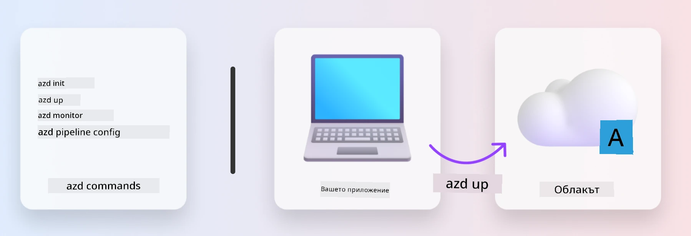
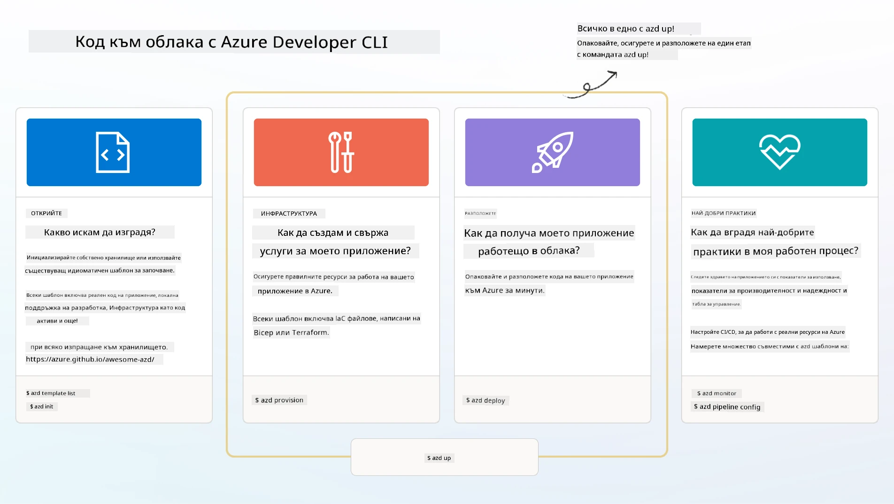

# 1. Изберете шаблон

!!! tip "КЪМ КРАЯ НА ТОЗИ МОДУЛ ЩЕ МОЖЕТЕ ДА"

    - [ ] Опишете какво представляват AZD шаблоните
    - [ ] Открийте и използвайте AZD шаблони за AI
    - [ ] Започнете с шаблона AI Agents
    - [ ] **Лаборатория 1:** AZD Quickstart с GitHub Codespaces

---

## 1. Аналогия с строител

Създаването на модерно корпоративно готово AI приложение _от нулата_ може да бъде обезсърчително. Това е малко като да строите новия си дом сами, тухла по тухла. Да, възможно е! Но това не е най-ефективният начин да постигнете желания краен резултат!

Вместо това често започваме с вече съществуващ _план/чернова_, и работим с архитект, за да го персонализираме според нашите изисквания. И точно това е подходът, който трябва да приложим при изграждането на интелигентни приложения. Първо, намерете добра архитектура, която отговаря на вашия проблем. След това работете със софтуерен архитект, за да персонализирате и разработите решението за вашия конкретен сценарий.

Но къде можем да намерим тези проекти/чертежи? И как да намерим архитект, който е готов да ни научи как да персонализираме и разгръщаме тези чертежи сами? В този workshop отговаряме на тези въпроси, като ви запознаваме с три технологии:

1. [Azure Developer CLI](https://aka.ms/azd) - инструмент с отворен код, който ускорява пътя на разработчика от локална разработка (build) до разгръщане в облака (ship).
1. [Microsoft Foundry Templates](https://ai.azure.com/templates) - стандартизирани репозитории с отворен код, съдържащи примерен код, инфраструктура и конфигурационни файлове за разгръщане на архитектура за AI решение.
1. [GitHub Copilot Agent Mode](https://code.visualstudio.com/docs/copilot/chat/chat-agent-mode) - кодиращ агент, базиран на знания от Azure, който може да ни насочва при навигация в кода и извършване на промени чрез естествен език.

С тези инструменти в ръка, вече можем да _открием_ правилния шаблон, да го _разгърнем_ за да валидираме, че работи, и да го _персонализираме_ според нашите конкретни сценарии. Нека да се потопим и да научим как работят те.


---

## 2. Azure Developer CLI

The [Azure Developer CLI](https://learn.microsoft.com/en-us/azure/developer/azure-developer-cli/) (or `azd`) е инструмент с отворен код, който може да ускори вашето пътуване от код до облак с набор от команди, удобни за разработчици, които работят последователно във вашето IDE (development) и CI/CD (devops) среди.

С `azd`, вашето разгръщане може да бъде толкова просто:

- `azd init` - Инициализира нов AI проект от съществуващ AZD шаблон.
- `azd up` - Провизира инфраструктура и разгръща вашето приложение в една стъпка.
- `azd monitor` - Получавайте наблюдение и диагностика в реално време за вашето разпределено приложение.
- `azd pipeline config` - Настройте CI/CD пайплайни за автоматизиране на разгръщането в Azure.

**🎯 | УПРАЖНЕНИЕ**: <br/> Разгледайте инструмента на командния ред `azd` във вашата среда GitHub Codespaces сега. Започнете като въведете тази команда, за да видите какво може инструментът:

```bash title="" linenums="0"
azd help
```



---

## 3. AZD шаблон

За да може `azd` да постигне това, той трябва да знае каква инфраструктура да провизира, какви конфигурационни настройки да прилага и кое приложение да разположи. Тук се намесват [AZD templates](https://learn.microsoft.com/en-us/azure/developer/azure-developer-cli/azd-templates?tabs=csharp). 

AZD шаблоните са репозитории с отворен код, които комбинират примерен код с инфраструктурни и конфигурационни файлове, необходими за разгръщане на архитектурата на решението.
Чрез използване на подхода _Infrastructure-as-Code_ (IaC), те позволяват дефинициите на ресурси и конфигурационните настройки в шаблона да бъдат версионирани (по същия начин като изходния код на приложението) - създавайки повторяеми и последователни работни потоци за потребителите на този проект.

Когато създавате или използвате AZD шаблон за _вашия_ сценарий, помислете върху следните въпроси:

1. Какво изграждате? → Има ли шаблон, който съдържа началния код за този сценарий?
1. Как е архитектурирано вашето решение? → Има ли шаблон, който съдържа необходимите ресурси?
1. Как се разгръща вашето решение? → Мислете за `azd deploy` с предварителни/пост-обработващи hooks!
1. Как можете да го оптимизирате допълнително? → Помислете за вградено наблюдение и автоматизирани пайплайни!

**🎯 | УПРАЖНЕНИЕ**: <br/> 
Посетете галерията [Awesome AZD](https://azure.github.io/awesome-azd/) и използвайте филтрите, за да разгледате над 250 шаблона, налични в момента. Вижте дали можете да намерите такъв, който съответства на _вашите_ изисквания за сценарий.



---

## 4. Шаблони за AI приложения

За AI-задвижвани приложения Microsoft предоставя специализирани шаблони, включващи **Microsoft Foundry** и **Foundry Agents**. Тези шаблони ускоряват пътя ви към изграждане на интелигентни, готови за продукция приложения.

### Microsoft Foundry & Foundry Agents шаблони

Изберете шаблон по-долу за разгръщане. Всеки шаблон е наличен в [Awesome AZD](https://azure.github.io/awesome-azd/) и може да бъде инициализиран с една команда.

| Шаблон | Описание | Команда за разгръщане |
|----------|-------------|----------------|
| **[AI Chat with RAG](https://azure.github.io/awesome-azd/?tags=ai&tags=rag)** | Чат приложение с Retrieval Augmented Generation, използващо Microsoft Foundry | `azd init -t azure-samples/azure-search-openai-demo` |
| **[Foundry Agent Service Starter](https://azure.github.io/awesome-azd/?tags=ai&tags=agents)** | Създайте AI агенти с Foundry Agents за автономно изпълнение на задачи | `azd init -t azure-samples/foundry-agent-service-starter` |
| **[Multi-Agent Orchestration](https://azure.github.io/awesome-azd/?tags=ai&tags=agents)** | Координирайте множество Foundry Agents за сложни работни потоци | `azd init -t azure-samples/multi-agent-orchestration` |
| **[AI Document Intelligence](https://azure.github.io/awesome-azd/?tags=ai&tags=document)** | Извличане и анализ на документи с модели на Microsoft Foundry | `azd init -t azure-samples/ai-document-processing` |
| **[Conversational AI Bot](https://azure.github.io/awesome-azd/?tags=ai&tags=bot)** | Създаване на интелигентни чатботове с интеграция на Microsoft Foundry | `azd init -t azure-samples/ai-chat-protocol` |
| **[AI Image Generation](https://azure.github.io/awesome-azd/?tags=ai&tags=dalle)** | Генериране на изображения чрез DALL-E чрез Microsoft Foundry | `azd init -t azure-samples/ai-image-generation` |
| **[Semantic Kernel Agent](https://azure.github.io/awesome-azd/?tags=ai&tags=semantic-kernel)** | AI агенти, използващи Semantic Kernel с Foundry Agents | `azd init -t azure-samples/semantic-kernel-agent` |
| **[AutoGen Multi-Agent](https://azure.github.io/awesome-azd/?tags=ai&tags=autogen)** | Многoагентни системи, използващи фреймуърка AutoGen | `azd init -t azure-samples/autogen-multi-agent` |

### Бърз старт

1. **Разгледайте шаблоните**: Посетете [https://azure.github.io/awesome-azd/](https://azure.github.io/awesome-azd/) и филтрирайте по `AI`, `Agents` или `Microsoft Foundry`
2. **Изберете вашия шаблон**: Изберете такъв, който отговаря на вашия случай на употреба
3. **Инициализирайте**: Стартирайте командата `azd init` за избрания от вас шаблон
4. **Разгърнете**: Стартирайте `azd up` за провизиране и разгръщане

**🎯 | УПРАЖНЕНИЕ**: <br/>
Изберете един от горните шаблони според вашия сценарий:

- **Строите чатбот?** → Започнете с **AI Chat with RAG** или **Conversational AI Bot**
- **Искате автономни агенти?** → Опитайте **Foundry Agent Service Starter** или **Multi-Agent Orchestration**
- **Обработвате документи?** → Използвайте **AI Document Intelligence**
- **Искате AI помощ при кодиране?** → Разгледайте **Semantic Kernel Agent** или **AutoGen Multi-Agent**

```bash title="Example: Deploy the AI Chat with RAG template" linenums="0"
azd init -t azure-samples/azure-search-openai-demo
azd up
```

!!! info "Разгледайте още шаблони"
    Галерията [Awesome AZD Gallery](https://azure.github.io/awesome-azd/) съдържа над 250 шаблона. Използвайте филтрите, за да намерите шаблони, които съответстват на вашите конкретни изисквания за език, фреймуърк и Azure услуги.

---

<!-- CO-OP TRANSLATOR DISCLAIMER START -->
**Отказ от отговорност**:
Този документ е преведен с помощта на AI услуга за превод [Co-op Translator](https://github.com/Azure/co-op-translator). Въпреки че се стремим към точност, моля, имайте предвид, че автоматизираните преводи могат да съдържат грешки или неточности. Оригиналният документ на езика, на който е написан, трябва да се счита за авторитетен източник. За критична информация се препоръчва професионален превод, извършен от квалифициран преводач. Не носим отговорност за каквито и да е недоразумения или погрешни тълкувания, произтичащи от използването на този превод.
<!-- CO-OP TRANSLATOR DISCLAIMER END -->