# 2. Валидация на шаблон

> Валидиран спрямо `azd 1.23.12` през март 2026 г.

!!! tip "КЪМ КРАЯ НА ТОЗИ МОДУЛ ЩЕ МОЖЕТЕ ДА"

    - [ ] Анализирате архитектурата на AI решение
    - [ ] Разбирате работния процес на внедряване с AZD
    - [ ] Използвате GitHub Copilot за помощ при ползване на AZD
    - [ ] **Лабораторно упражнение 2:** Внедряване и валидация на шаблона AI Agents

---


## 1. Въведение

[Azure Developer CLI](https://learn.microsoft.com/en-us/azure/developer/azure-developer-cli/) или `azd` е инструмент с отворен код за команден ред, който опростява работния процес на разработчиците при изграждане и внедряване на приложения в Azure.

[AZD шаблоните](https://learn.microsoft.com/azure/developer/azure-developer-cli/azd-templates) са стандартизирани хранилища, които включват примерен код на приложение, активи за _инфраструктура като код_ и конфигурационни файлове за `azd` за цялостна архитектура на решение. Осигуряването на инфраструктурата става толкова просто, колкото изпълнение на команда `azd provision` – докато използването на `azd up` позволява едновременно осигуряване на инфраструктура **и** внедряване на приложението!

В резултат, стартирането на процеса на разработка на вашето приложение може да е толкова просто, колкото да намерите подходящия _AZD Starter шаблон_, който най-близко отговаря на вашите нужди за приложение и инфраструктура – и след това да персонализирате хранилището, за да отговори на изискванията на сценария ви.

Преди да започнем, нека се уверим, че имате инсталиран Azure Developer CLI.

1. Отворете терминал във VS Code и напишете следната команда:

      ```bash title="" linenums="0"
      azd version
      ```

1. Трябва да видите нещо подобно!

      ```bash title="" linenums="0"
      azd version 1.23.12 (commit <current-build>)
      ```

**Вече сте готови да изберете и внедрите шаблон с azd**

---

## 2. Избор на шаблон

Платформата Microsoft Foundry предоставя [набор от препоръчителни AZD шаблони](https://learn.microsoft.com/en-us/azure/ai-foundry/how-to/develop/ai-template-get-started), които покриват популярни сценарии за решения като _автоматизация на многоагентни работни потоци_ и _мултимодална обработка на съдържание_. Можете също да откриете тези шаблони, като посетите портала Microsoft Foundry.

1. Посетете [https://ai.azure.com/templates](https://ai.azure.com/templates)
1. Влезте в портала Microsoft Foundry при подканата – ще видите нещо такова.

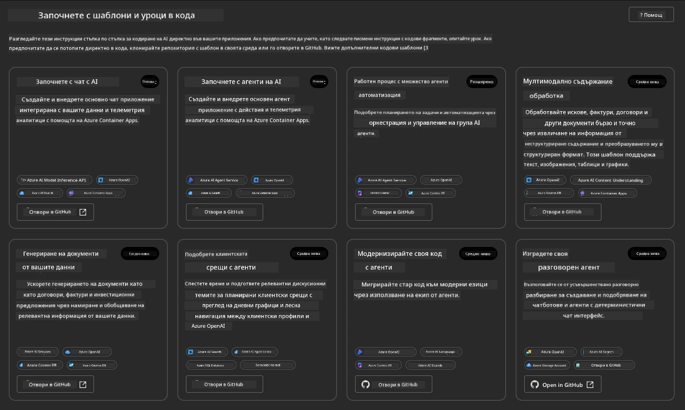


Опциите **Basic** са вашите стартови шаблони:

1. [ ] [Започнете с AI чат](https://github.com/Azure-Samples/get-started-with-ai-chat), който внедрява основно чат приложение _с вашите данни_ в Azure Container Apps. Използвайте това, за да разгледате основен сценарий с AI чатбот.
1. [X] [Започнете с AI агенти](https://github.com/Azure-Samples/get-started-with-ai-agents), който също внедрява стандартен AI агент (с Foundry Agents). Използвайте го, за да се запознаете с агентни AI решения, включващи инструменти и модели.

Посетете втория линк в нов таб на браузъра (или кликнете `Open in GitHub` за съответната карта). Трябва да видите хранилището за този AZD шаблон. Отделете минута да разгледате README. Архитектурата на приложението изглежда така:

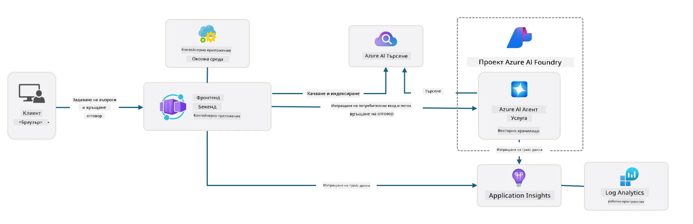

---

## 3. Активиране на шаблона

Нека опитаме да внедрим този шаблон и да се уверим, че е валиден. Ще следваме насоките в секцията [Започване](https://github.com/Azure-Samples/get-started-with-ai-agents?tab=readme-ov-file#getting-started).

1. Изберете работна среда за хранилището на шаблона:

      - **GitHub Codespaces**: Кликнете [на този линк](https://github.com/codespaces/new/Azure-Samples/get-started-with-ai-agents) и потвърдете `Create codespace`
      - **Локално клониране или dev контейнер**: Клонирайте `Azure-Samples/get-started-with-ai-agents` и го отворете във VS Code

1. Изчакайте терминалът във VS Code да е подготвен, след което напишете следната команда:

   ```bash title="" linenums="0"
   azd up
   ```

Завършете стъпките от работния процес, които тази команда ще задейства:

1. Ще бъдете подканени да влезете в Azure – следвайте инструкциите за удостоверяване
1. Въведете уникално име на средата – например аз използвах `nitya-mshack-azd`
1. Това ще създаде папка `.azure/` – ще видите подпапка с името на средата
1. Ще бъдете подканени да изберете име на абонамент – изберете подразбирания
1. Ще бъдете подканени за местоположение – използвайте `East US 2`

Сега изчакайте завършването на осигуряването. **Това отнема 10-15 минути**

1. Когато приключи, вашият конзолен изход ще покаже съобщение за УСПЕХ като това:
      ```bash title="" linenums="0"
      SUCCESS: Your up workflow to provision and deploy to Azure completed in 10 minutes 17 seconds.
      ```
1. Вашият Azure портал вече ще има осигурена ресурсна група с това име на среда:

      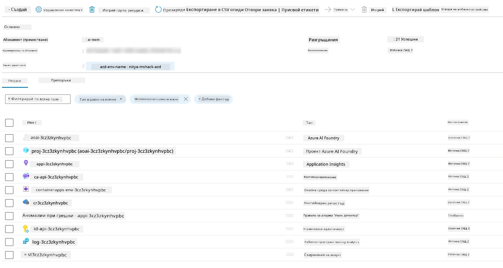

1. **Вече сте готови да валидирате внедрената инфраструктура и приложение**.

---

## 4. Валидация на шаблона

1. Посетете страницата Ресурсни групи (Resource Groups) в Azure Portal [Resource Groups](https://portal.azure.com/#browse/resourcegroups) – влезте, ако бъдете подканени
1. Кликнете на ресурсната група за вашето име на среда – ще видите горната страница

      - кликнете на ресурса Azure Container Apps
      - кликнете на URL за приложението в секцията _Essentials_ (горе вдясно)

1. Трябва да видите хостнат потребителски интерфейс за приложението, подобно на това:

   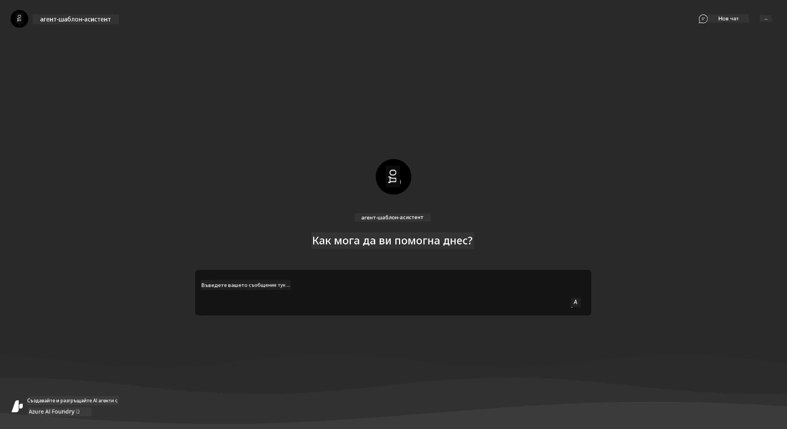

1. Опитайте да зададете няколко [примерни въпроса](https://github.com/Azure-Samples/get-started-with-ai-agents/blob/main/docs/sample_questions.md)

      1. Попитайте: ```Каква е столицата на Франция?```
      1. Попитайте: ```Кой е най-добрият палатка под 200 долара за двама души и какви характеристики включва?```

1. Трябва да получите отговори, подобни на показаните по-долу. _Но как работи това?_

      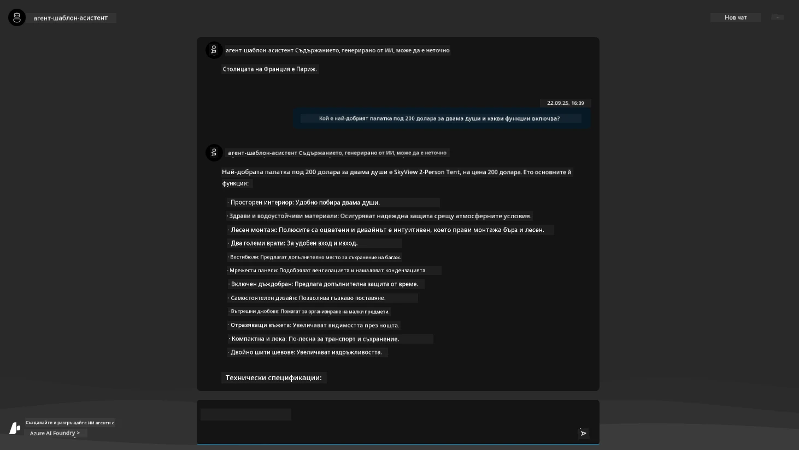

---

## 5. Валидация на агента

Приложението Azure Container App внедрява крайна точка, която се свързва с AI агента, осигурен в Microsoft Foundry проекта за този шаблон. Нека разгледаме какво означава това.

1. Върнете се на страницата с преглед (Overview) в Azure портала за вашата ресурсна група

1. Кликнете на ресурса `Microsoft Foundry` в списъка

1. Трябва да видите това. Кликнете бутона `Go to Microsoft Foundry Portal`.
   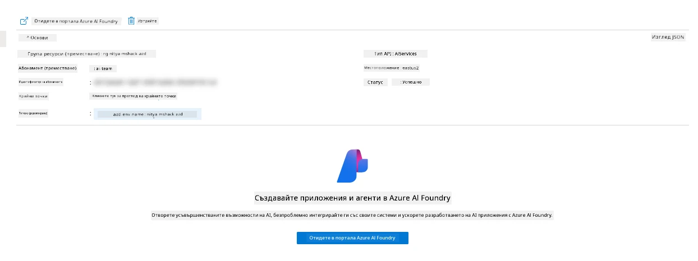

1. Трябва да видите страницата на Foundry проекта за вашето AI приложение
   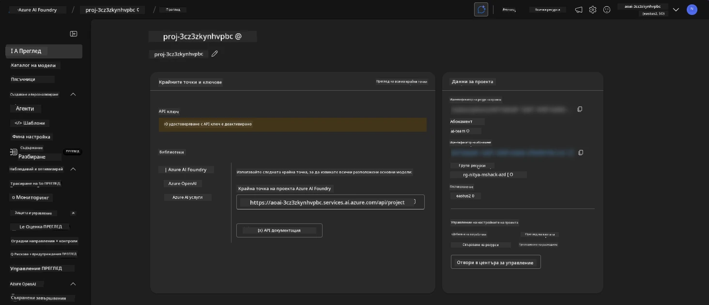

1. Кликнете на `Agents` – ще видите основния агент, осигурен в проекта ви
   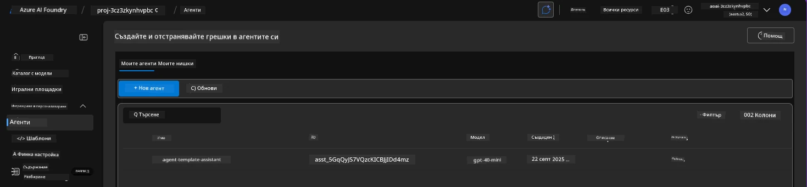

1. Изберете го – и ще видите детайлите за агента. Обърнете внимание на следното:

      - Агентът използва File Search по подразбиране (винаги)
      - Агентът `Knowledge` показва, че има качени 32 файла (за търсене във файлове)
      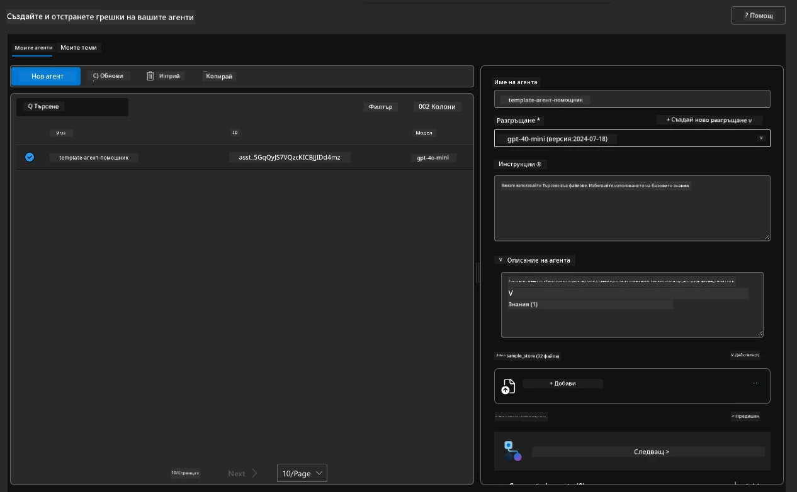

1. Потърсете опцията `Data+indexes` в лявото меню и кликнете за подробности.

      - Трябва да видите 32-те качени файла с данни за знание.
      - Те съответстват на 12 клиентски файла и 20 файла с продукти под `src/files`
      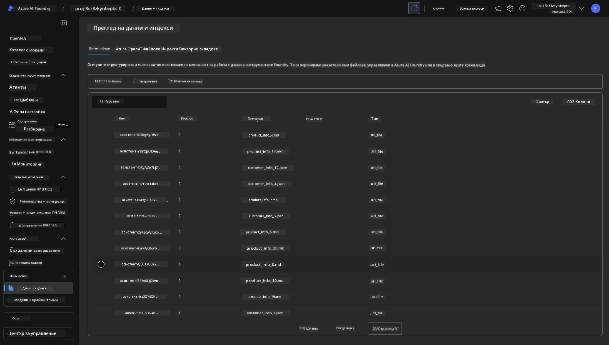

**Вие валидирахте работата на агента!**

1. Отговорите на агента са базирани на знанието в тези файлове.
1. Сега можете да задавате въпроси, свързани с тези данни, и да получавате обосновани отговори.
1. Пример: `customer_info_10.json` описва 3 покупки, направени от "Amanda Perez"

Върнете се в таба на браузъра с крайна точка на Container App и попитайте: `Какви продукти притежава Amanda Perez?`. Трябва да видите нещо подобно:

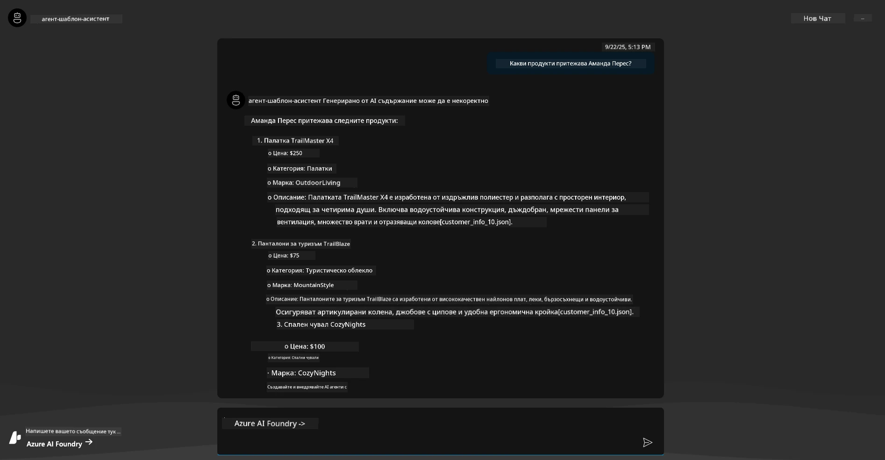

---

## 6. Игрален портал за Агенти (Agent Playground)

Нека изградим още малко интуиция за възможностите на Microsoft Foundry, като тестваме агента в Agents Playground.

1. Върнете се на страницата `Agents` в Microsoft Foundry – изберете основния агент
1. Кликнете на опцията `Try in Playground` – ще получите потребителски интерфейс на площадка като този
1. Задайте същия въпрос: `Какви продукти притежава Amanda Perez?`

    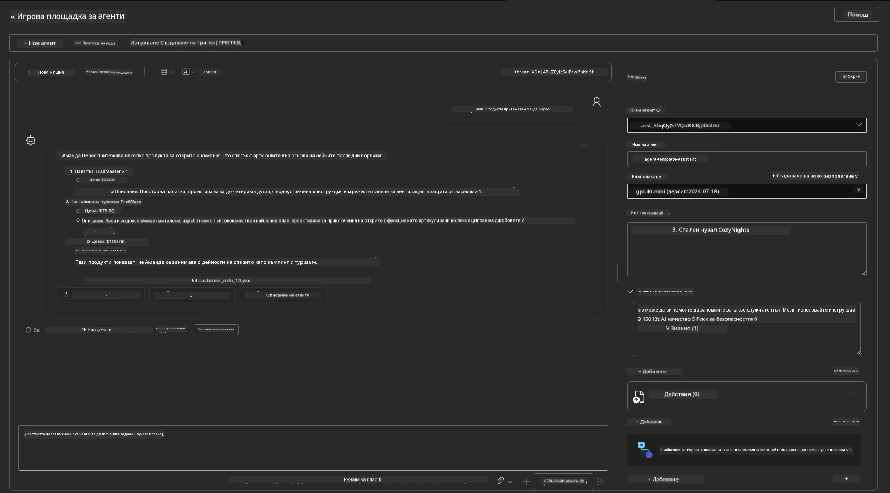

Получавате същия (или подобен) отговор – но също така получавате допълнителна информация, която може да използвате, за да разберете качеството, разходите и производителността на вашето агентно приложение. Например:

1. Забележете, че отговорът цитира файловете с данни, използвани за "обосновка" на отговора
1. Задръжте курсора над някой от тези етикети на файлове – съвпадат ли данните с вашия въпрос и показания отговор?

Виждате също ред със _статистика_ под отговора.

1. Задръжте курсора върху някоя метрика – например Safety. Ще видите нещо подобно
1. Съвпада ли оценката с вашата интуиция за нивото на безопасност на отговора?

      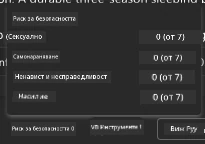

---

## 7. Вградена наблюдаемост

Наблюдаемостта се отнася до инструментализирането на вашето приложение да генерира данни, които могат да се използват за разбиране, отстраняване на грешки и оптимизиране на работата му. За да добиете представа за това:

1. Кликнете бутона `View Run Info` – ще видите този изглед. Това е пример за [Agent tracing](https://learn.microsoft.com/en-us/azure/ai-foundry/how-to/develop/trace-agents-sdk#view-trace-results-in-the-azure-ai-foundry-agents-playground) в действие. _Можете също така да получите този изглед, като кликнете на Thread Logs в главното меню_.

   - Вижте стъпките на изпълнение и инструментите, ангажирани от агента
   - Разберете общия брой токени (в сравнение с използването на токени за изход) за отговора
   - Разберете латентността и къде се прекарва времето в изпълнението

      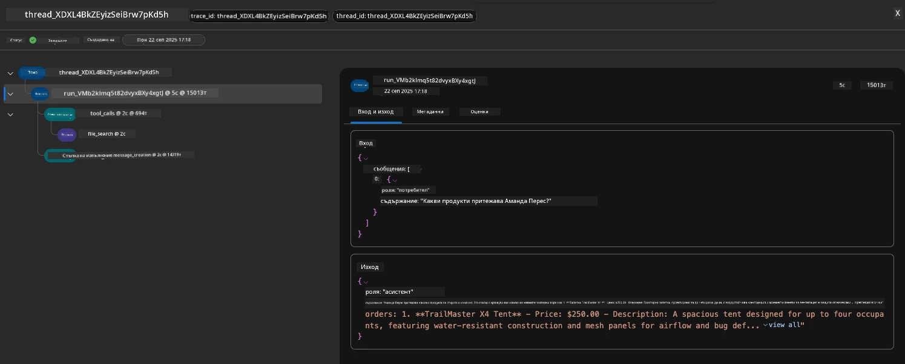

1. Кликнете на таба `Metadata`, за да видите допълнителни атрибути за изпълнението, които могат да предоставят полезен контекст за отстраняване на проблеми по-късно.

      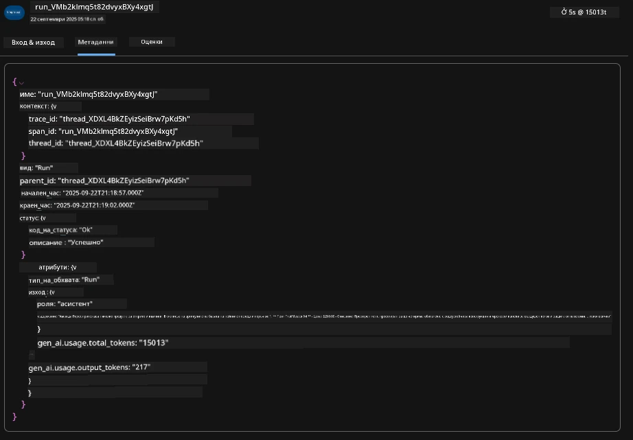


1. Кликнете на таба `Evaluations`, за да видите автоматични оценки на отговора на агента. Те включват оценки за безопасност (например, Самонараняване) и специфични за агента оценки (например, Разрешаване на намерения, Спазване на задача).

      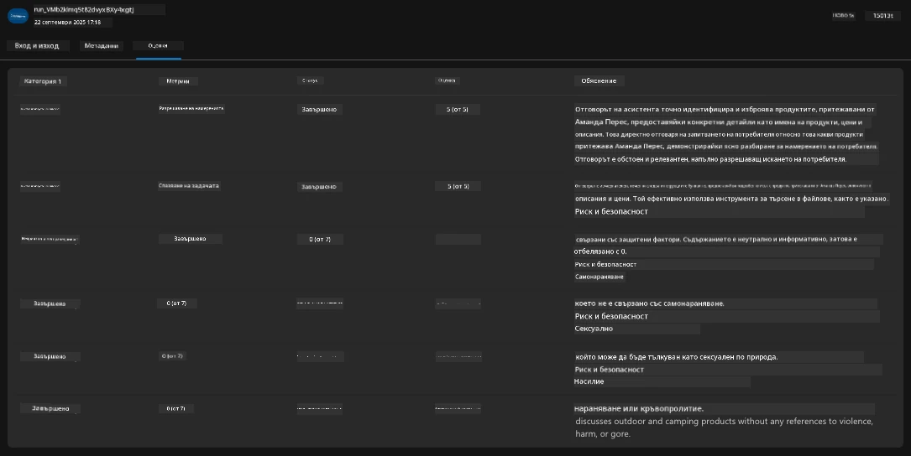

1. И накрая, но не на последно място, кликнете на таба `Monitoring` в страничното меню.

      - Изберете таба `Resource usage` във визуализираната страница – и разгледайте метриките.
      - Следете използването на приложението по отношение на разходите (токени) и натоварването (заявки).
      - Следете латентността на приложението до първия байт (обработка на вход) и последния байт (изход).

      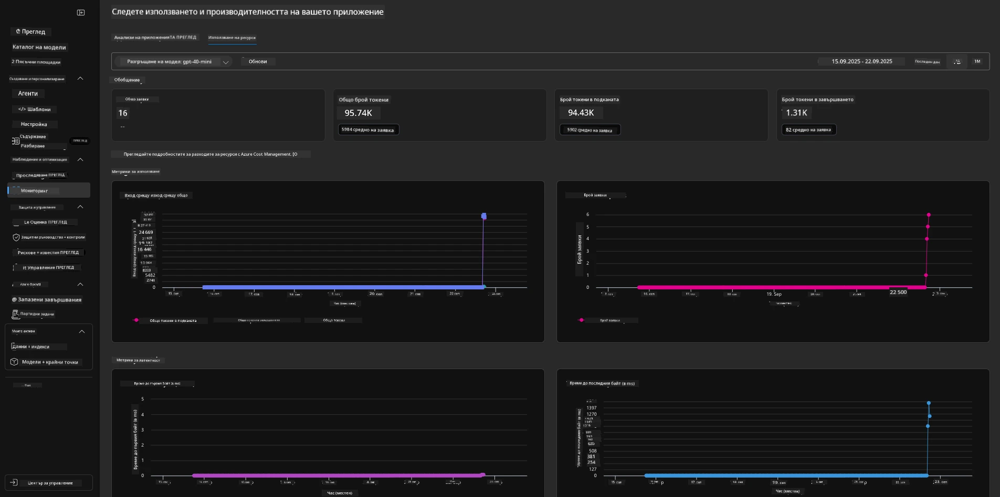

---

## 8. Променливи на средата

Досега проведохме внедряването в браузър и валидирахме, че инфраструктурата ни е осигурена и приложението работи. Но за да работим с кода на приложението _първо_, трябва да конфигурираме локалната си развойна среда с релевантните променливи, необходими за работа с тези ресурси. Използването на `azd` улеснява това.

1. Azure Developer CLI [използва променливи на средата](https://learn.microsoft.com/en-us/azure/developer/azure-developer-cli/manage-environment-variables?tabs=bash), за да съхранява и управлява конфигурационните настройки за внедряване на приложения.

1. Променливите на средата се съхраняват в `.azure/<env-name>/.env` – това ограничава обхвата им до средата `env-name`, използвана при внедряване, и ви помага да изолирате среди между различни цели за внедряване в едно и също хранилище.

1. Променливите на средата се зареждат автоматично от командата `azd`, когато изпълнява определена команда (например `azd up`). Обърнете внимание, че `azd` не чете автоматично променливи на средата на _ниво ОС_ (например, зададени в шел), вместо това използвайте `azd set env` и `azd get env` за прехвърляне на информация в скриптове.


Нека изпробваме няколко команди:

1. Вземете всички променливи на средата, зададени за `azd` в тази среда:

      ```bash title="" linenums="0"
      azd env get-values
      ```
      
      Трябва да видите нещо подобно:

      ```bash title="" linenums="0"
      AZURE_AI_AGENT_DEPLOYMENT_NAME="gpt-4.1-mini"
      AZURE_AI_AGENT_NAME="agent-template-assistant"
      AZURE_AI_EMBED_DEPLOYMENT_NAME="text-embedding-3-small"
      AZURE_AI_EMBED_DIMENSIONS=100
      ...
      ```

1. Вземете конкретна стойност – например, искам да разбера дали сме задали стойност на `AZURE_AI_AGENT_MODEL_NAME`

      ```bash title="" linenums="0"
      azd env get-value AZURE_AI_AGENT_MODEL_NAME 
      ```
      
      Трябва да видите нещо подобно – не беше зададена по подразбиране!

      ```bash title="" linenums="0"
      ERROR: key 'AZURE_AI_AGENT_MODEL_NAME' not found in the environment values
      ```

1. Задайте нова променлива на средата за `azd`. Тук обновяваме името на модела на агента. _Забележка: всички направени промени ще се отразят незабавно във файла `.azure/<env-name>/.env`.

      ```bash title="" linenums="0"
      azd env set AZURE_AI_AGENT_MODEL_NAME gpt-4.1
      azd env set AZURE_AI_AGENT_MODEL_VERSION 2025-04-14
      azd env set AZURE_AI_AGENT_DEPLOYMENT_CAPACITY 150
      ```

      Сега трябва да намерим зададената стойност:

      ```bash title="" linenums="0"
      azd env get-value AZURE_AI_AGENT_MODEL_NAME 
      ```

1. Обърнете внимание, че някои ресурси са постоянни (напр. внедрявания на модели) и ще изискват повече от просто `azd up`, за да бъдат принудително внедрени отново. Нека опитаме да демонтираме оригиналното внедряване и да го внедрим наново с променените променливи на средата.

1. **Обновяване (Refresh)** Ако преди това сте внедрили инфраструктура с azd шаблон – можете да _обновите_ състоянието на локалните променливи на средата въз основа на актуалното състояние на вашето Azure внедряване с тази команда:

      ```bash title="" linenums="0"
      azd env refresh
      ```

      Това е мощен начин да се _синхронизират_ променливи на средата между две или повече локални развойни среди (например екип с няколко разработчици) - позволявайки на разгърнатата инфраструктура да служи като основната истина за състоянието на променливите на средата. Членовете на екипа просто _обновяват_ променливите, за да се синхронизират отново.

---

## 9. Поздравления 🏆

Току-що завършихте цялостен работен процес, в който:

- [X] Избрахте AZD шаблона, който искате да използвате
- [X] Отворихте шаблона в поддържана развойна среда
- [X] Разгърнахте шаблона и потвърдихте, че работи

---

<!-- CO-OP TRANSLATOR DISCLAIMER START -->
**Отказ от отговорност**:  
Този документ е преведен с помощта на AI преводна услуга [Co-op Translator](https://github.com/Azure/co-op-translator). Въпреки че се стремим към точност, моля, имайте предвид, че автоматичните преводи може да съдържат грешки или неточности. Оригиналният документ на неговия език е да се счита за авторитетен източник. За критична информация се препоръчва професионален човешки превод. Ние не носим отговорност за никакви недоразумения или неправилни тълкувания, произтичащи от използването на този превод.
<!-- CO-OP TRANSLATOR DISCLAIMER END -->