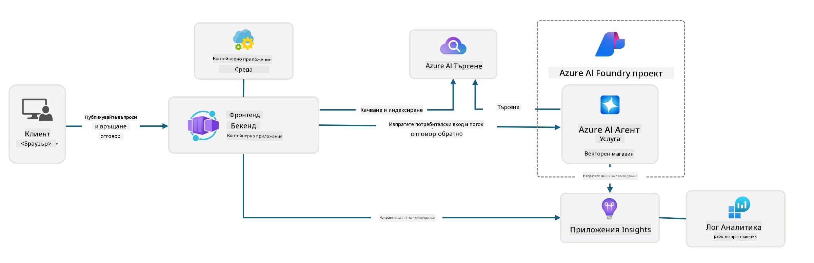

<!--
CO_OP_TRANSLATOR_METADATA:
{
  "original_hash": "4e403f041411361140d6beb88ab2a181",
  "translation_date": "2025-09-25T02:28:05+00:00",
  "source_file": "workshop/docs/instructions/3-Deconstruct-AI-Template.md",
  "language_code": "bg"
}
-->
# 3. Разглобяване на шаблон

!!! tip "ДО КРАЯ НА ТОЗИ МОДУЛ ЩЕ МОЖЕТЕ ДА"

    - [ ] Елемент
    - [ ] Елемент
    - [ ] Елемент
    - [ ] **Лаборатория 3:** 

---

С шаблоните на AZD и Azure Developer CLI (`azd`) можем бързо да започнем нашето AI развитие с помощта на стандартизирани хранилища, които предоставят примерен код, инфраструктура и конфигурационни файлове - под формата на готов за разгръщане _стартов_ проект.

**Но сега трябва да разберем структурата на проекта и базата на кода - и да можем да персонализираме шаблона на AZD - без предварителен опит или разбиране на AZD!**

---

## 1. Активиране на GitHub Copilot

### 1.1 Инсталиране на GitHub Copilot Chat

Време е да изследваме [GitHub Copilot с режим Agent](https://code.visualstudio.com/docs/copilot/chat/chat-agent-mode). Сега можем да използваме естествен език, за да опишем задачата си на високо ниво и да получим помощ при изпълнението. За тази лаборатория ще използваме [Copilot Free план](https://github.com/github-copilot/signup), който има месечен лимит за завършвания и чат взаимодействия.

Разширението може да бъде инсталирано от пазара, но вече трябва да е налично във вашата среда Codespaces. _Кликнете върху `Open Chat` от падащото меню на иконата Copilot - и напишете подкана като `What can you do?`_ - може да бъдете подканени да влезете. **GitHub Copilot Chat е готов**.

### 1.2. Инсталиране на MCP сървъри

За да бъде режимът Agent ефективен, той се нуждае от достъп до правилните инструменти, които да му помогнат да извлича знания или да предприема действия. Тук MCP сървърите могат да помогнат. Ще конфигурираме следните сървъри:

1. [Azure MCP Server](../../../../../workshop/docs/instructions)
1. [Microsoft Docs MCP Server](../../../../../workshop/docs/instructions)

За да ги активирате:

1. Създайте файл, наречен `.vscode/mcp.json`, ако не съществува
1. Копирайте следното в този файл - и стартирайте сървърите!
   ```json title=".vscode/mcp.json"
   {
      "servers": {
         "Azure MCP Server": {
            "command": "npx",
            "args": [
            "-y",
            "@azure/mcp@latest",
            "server",
            "start"
            ]
         },
         "microsoft.docs.mcp": {
            "type": "http",
            "url": "https://learn.microsoft.com/api/mcp"
         }
      }
   }
   ```

??? warning "Може да получите грешка, че `npx` не е инсталиран (кликнете, за да разширите за поправка)"

      За да поправите това, отворете файла `.devcontainer/devcontainer.json` и добавете този ред към секцията с функции. След това реконструирайте контейнера. Сега трябва да имате инсталиран `npx`.

      ```title="" linenums="0"
         "features": {
            "ghcr.io/devcontainers/features/node:1": {},
            ...
         },
      ```

---

### 1.3. Тестване на GitHub Copilot Chat

**Първо използвайте `az login`, за да се удостоверите с Azure от командния ред на VS Code.**

Сега трябва да можете да запитате за състоянието на вашия Azure абонамент и да задавате въпроси за разположени ресурси или конфигурация. Опитайте тези подкани:

1. `List my Azure resource groups`
1. `#foundry list my current deployments`

Можете също така да задавате въпроси за документацията на Azure и да получавате отговори, базирани на Microsoft Docs MCP сървъра. Опитайте тези подкани:

1. `#microsoft_docs_search What is Azure Developer CLI?`
1. `#microsoft_docs_search Show me a Python tutorial to chat with deployed model`

Или можете да поискате кодови фрагменти за изпълнение на задача. Опитайте тази подкана:

1. `Give me a Python code example that uses AAD for an interactive chat client`

В режим `Ask` това ще предостави код, който можете да копирате и опитате. В режим `Agent` това може да отиде една стъпка по-далеч и да създаде съответните ресурси за вас - включително скриптове за настройка и документация - за да ви помогне да изпълните задачата.

**Сега сте готови да започнете да изследвате хранилището на шаблона**

---

## 2. Разглобяване на архитектурата

??? prompt "ASK: Обяснете архитектурата на приложението в docs/images/architecture.png в 1 параграф"

      Това приложение е AI-базирано чат приложение, изградено на Azure, което демонстрира модерна архитектура, базирана на агенти. Решението се фокусира върху Azure Container App, който хоства основния код на приложението, обработва потребителския вход и генерира интелигентни отговори чрез AI агент.
      
      Архитектурата използва Azure AI Foundry Project като основа за AI възможности, свързвайки се с Azure AI Services, които предоставят основните езикови модели (като GPT-4o-mini) и функционалност на агента. Потребителските взаимодействия преминават през фронтенд, базиран на React, към бекенд FastAPI, който комуникира с AI агент услугата за генериране на контекстуални отговори.
      
      Системата включва възможности за извличане на знания чрез търсене на файлове или Azure AI Search услуга, позволявайки на агента да достъпва и цитира информация от качени документи. За оперативно съвършенство архитектурата включва цялостно наблюдение чрез Application Insights и Log Analytics Workspace за проследяване, регистриране и оптимизация на производителността.
      
      Azure Storage предоставя blob хранилище за данни на приложението и качени файлове, докато Managed Identity осигурява сигурен достъп между Azure ресурси без съхранение на идентификационни данни. Цялото решение е проектирано за мащабируемост и поддръжка, като контейнеризираното приложение автоматично се мащабира според търсенето, предоставяйки вградена сигурност, наблюдение и CI/CD възможности чрез екосистемата на управляваните услуги на Azure.



---

## 3. Структура на хранилището

!!! prompt "ASK: Обяснете структурата на папките на шаблона. Започнете с визуална йерархична диаграма."

??? info "ОТГОВОР: Визуална йерархична диаграма"

      ```bash title="" 
      get-started-with-ai-agents/
      ├── 📋 Конфигурация и настройка
      │   ├── azure.yaml                    # Конфигурация на Azure Developer CLI
      │   ├── docker-compose.yaml           # Контейнери за локално развитие
      │   ├── pyproject.toml                # Конфигурация на Python проект
      │   ├── requirements-dev.txt          # Зависимости за развитие
      │   └── .devcontainer/                # Настройка на dev контейнер за VS Code
      │
      ├── 🏗️ Инфраструктура (infra/)
      │   ├── main.bicep                    # Основен инфраструктурен шаблон
      │   ├── api.bicep                     # Ресурси, специфични за API
      │   ├── main.parameters.json          # Параметри на инфраструктурата
      │   └── core/                         # Модулни инфраструктурни компоненти
      │       ├── ai/                       # Конфигурации на AI услуги
      │       ├── host/                     # Хостинг инфраструктура
      │       ├── monitor/                  # Наблюдение и регистриране
      │       ├── search/                   # Настройка на Azure AI Search
      │       ├── security/                 # Сигурност и идентичност
      │       └── storage/                  # Конфигурации на хранилище
      │
      ├── 💻 Източник на приложението (src/)
      │   ├── api/                          # Бекенд API
      │   │   ├── main.py                   # Входна точка на приложението FastAPI
      │   │   ├── routes.py                 # Определения на API маршрути
      │   │   ├── search_index_manager.py   # Функционалност за търсене
      │   │   ├── data/                     # Обработка на данни за API
      │   │   ├── static/                   # Статични уеб ресурси
      │   │   └── templates/                # HTML шаблони
      │   ├── frontend/                     # Фронтенд React/TypeScript
      │   │   ├── package.json              # Зависимости на Node.js
      │   │   ├── vite.config.ts            # Конфигурация на Vite
      │   │   └── src/                      # Изходен код на фронтенда
      │   ├── data/                         # Примерни файлове с данни
      │   │   └── embeddings.csv            # Предварително изчислени embeddings
      │   ├── files/                        # Файлове на база знания
      │   │   ├── customer_info_*.json      # Примерни данни за клиенти
      │   │   └── product_info_*.md         # Документация за продукти
      │   ├── Dockerfile                    # Конфигурация на контейнер
      │   └── requirements.txt              # Зависимости на Python
      │
      ├── 🔧 Автоматизация и скриптове (scripts/)
      │   ├── postdeploy.sh/.ps1           # Настройка след разгръщане
      │   ├── setup_credential.sh/.ps1     # Конфигурация на идентификационни данни
      │   ├── validate_env_vars.sh/.ps1    # Валидация на среда
      │   └── resolve_model_quota.sh/.ps1  # Управление на квоти за модели
      │
      ├── 🧪 Тестване и оценка
      │   ├── tests/                        # Юнит и интеграционни тестове
      │   │   └── test_search_index_manager.py
      │   ├── evals/                        # Рамка за оценка на агенти
      │   │   ├── evaluate.py               # Стартер за оценка
      │   │   ├── eval-queries.json         # Тестови запитвания
      │   │   └── eval-action-data-path.json
      │   ├── sandbox/                      # Игрална площадка за развитие
      │   │   ├── 1-quickstart.py           # Пример за бърз старт
      │   │   └── aad-interactive-chat.py   # Примери за удостоверяване
      │   └── airedteaming/                 # Оценка на безопасността на AI
      │       └── ai_redteaming.py          # Тестове за червен екип
      │
      ├── 📚 Документация (docs/)
      │   ├── deployment.md                 # Ръководство за разгръщане
      │   ├── local_development.md          # Инструкции за локална настройка
      │   ├── troubleshooting.md            # Чести проблеми и решения
      │   ├── azure_account_setup.md        # Предварителни условия за Azure
      │   └── images/                       # Ресурси за документация
      │
      └── 📄 Метаданни на проекта
         ├── README.md                     # Преглед на проекта
         ├── CODE_OF_CONDUCT.md           # Насоки за общността
         ├── CONTRIBUTING.md              # Ръководство за принос
         ├── LICENSE                      # Условия за лиценз
         └── next-steps.md                # Ръководство след разгръщане
      ```

### 3.1. Основна архитектура на приложението

Този шаблон следва модела на **уеб приложение с пълен стек** с:

- **Бекенд**: Python FastAPI с интеграция на Azure AI
- **Фронтенд**: TypeScript/React с Vite система за изграждане
- **Инфраструктура**: Azure Bicep шаблони за облачни ресурси
- **Контейнеризация**: Docker за консистентно разгръщане

### 3.2 Инфраструктура като код (bicep)

Слоят инфраструктура използва **Azure Bicep** шаблони, организирани модулно:

   - **`main.bicep`**: Оркестрира всички Azure ресурси
   - **`core/` модули**: Повторно използваеми компоненти за различни услуги
      - AI услуги (Azure OpenAI, AI Search)
      - Хостинг на контейнери (Azure Container Apps)
      - Наблюдение (Application Insights, Log Analytics)
      - Сигурност (Key Vault, Managed Identity)

### 3.3 Източник на приложението (`src/`)

**Бекенд API (`src/api/`)**:

- REST API, базиран на FastAPI
- Интеграция с Azure AI Agent услуга
- Управление на индекс за търсене за извличане на знания
- Възможности за качване и обработка на файлове

**Фронтенд (`src/frontend/`)**:

- Модерен React/TypeScript SPA
- Vite за бързо развитие и оптимизирани сборки
- Интерфейс за чат за взаимодействия с агента

**База знания (`src/files/`)**:

- Примерни данни за клиенти и продукти
- Демонстрира извличане на знания, базирано на файлове
- Примери във формат JSON и Markdown

### 3.4 DevOps и автоматизация

**Скриптове (`scripts/`)**:

- Скриптове за PowerShell и Bash за различни платформи
- Валидация и настройка на среда
- Конфигурация след разгръщане
- Управление на квоти за модели

**Интеграция с Azure Developer CLI**:

- Конфигурация `azure.yaml` за `azd` работни потоци
- Автоматизирано осигуряване и разгръщане
- Управление на променливи на средата

### 3.5 Тестване и осигуряване на качество

**Рамка за оценка (`evals/`)**:

- Оценка на производителността на агента
- Тестове за качество на запитвания и отговори
- Автоматизиран процес на оценка

**Безопасност на AI (`airedteaming/`)**:

- Тестове за червен екип за безопасност на AI
- Сканиране за уязвимости в сигурността
- Практики за отговорен AI

---

## 4. Поздравления 🏆

Успешно използвахте GitHub Copilot Chat с MCP сървъри, за да изследвате хранилището.

- [X] Активирахте GitHub Copilot за Azure
- [X] Разбрахте архитектурата на приложението
- [X] Изследвахте структурата на шаблона на AZD

Това ви дава представа за _инфраструктурата като код_ активите за този шаблон. Следващата стъпка е да разгледаме конфигурационния файл за AZD.

---

