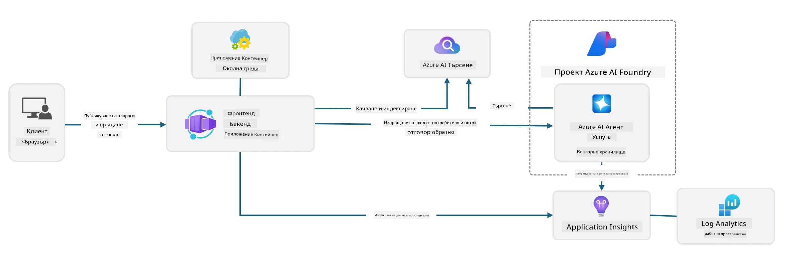

# 3. Декомпозиране на шаблон

!!! tip "КЪМ КРАЯТА НА ТОЗИ МОДУЛ ЩЕ МОЖЕТЕ ДА"

    - [ ] Активирате GitHub Copilot с MCP сървъри за помощ в Azure
    - [ ] Разберете структурата на папките и компонентите на AZD шаблона
    - [ ] Разгледате модели на организация в infrastructure-as-code (Bicep)
    - [ ] **Лаб 3:** Използвайте GitHub Copilot, за да разгледате и разберете архитектурата на хранилището 

---


С помощта на AZD шаблони и Azure Developer CLI (`azd`) можем бързо да стартираме нашето AI развитие с стандартизирани хранилища, които предоставят примерен код, инфраструктура и конфигурационни файлове - във формата на готов за разгръщане _starter_ проект.

**Но сега трябва да разберем структурата на проекта и кода - и да можем да персонализираме AZD шаблона - без никакъв предварителен опит или познания за AZD!**

---

## 1. Активиране на GitHub Copilot

### 1.1 Инсталиране на GitHub Copilot Chat

Време е да разгледате [GitHub Copilot with Agent Mode](https://code.visualstudio.com/docs/copilot/chat/chat-agent-mode). Сега можем да използваме естествен език, за да опишем задачата си на високо ниво и да получим помощ при изпълнението. За този лабораторен упражнение ще използваме [Copilot Free plan](https://github.com/github-copilot/signup), който има месечен лимит за изпълнения и чат взаимодействия.

Разширението може да бъде инсталирано от marketplace-а, но трябва вече да е налично във вашата Codespaces среда. _Кликнете `Open Chat` от падащото меню на иконата на Copilot - и напишете промпт като `What can you do?`_ - може да бъдете подканени да влезете. **GitHub Copilot Chat е готов.**

### 1.2 Инсталиране на MCP сървъри

За да бъде Agent режимът ефективен, той се нуждае от достъп до правилните инструменти, които да му помогнат да извлича знания или да предприема действия. Тук MCP сървърите могат да помогнат. Ще конфигурираме следните сървъри:

1. [Azure MCP Server](../../../../../workshop/docs/instructions)
1. [Microsoft Docs MCP Server](../../../../../workshop/docs/instructions)

За да ги активирате:

1. Създайте файл с име `.vscode/mcp.json`, ако не съществува
1. Копирайте следното в този файл - и стартирайте сървърите!
   ```json title=".vscode/mcp.json"
   {
      "servers": {
         "Azure MCP Server": {
            "command": "npx",
            "args": [
            "-y",
            "@azure/mcp@latest",
            "server",
            "start"
            ]
         },
         "microsoft.docs.mcp": {
            "type": "http",
            "url": "https://learn.microsoft.com/api/mcp"
         }
      }
   }
   ```

??? warning "ВЪЗМОЖНО Е ДА ПОЛУЧИТЕ ГРЕШКА, ЧЕ `npx` НЕ Е ИНСТАЛИРАН (кликнете за разширение и поправка)"

      За да го поправите, отворете файла `.devcontainer/devcontainer.json` и добавете този ред в раздела features. След това реконструирайте контейнера. Трябва да имате инсталиран `npx`.

      ```title="" linenums="0"
         "features": {
            "ghcr.io/devcontainers/features/node:1": {},
            ...
         },
      ```

---

### 1.3 Тествайте GitHub Copilot Chat

**Първо използвайте `az login`, за да се удостоверите в Azure от командния ред на VS Code.**

Сега трябва да можете да запитвате състоянието на вашия Azure абонамент и да задавате въпроси за разположени ресурси или конфигурация. Опитайте следните подсказки:

1. `Изброй моите групи ресурси в Azure`
1. `#foundry изброи моите текущи разгръщания`

Можете също да задавате въпроси за документацията на Azure и да получавате отговори, базирани на Microsoft Docs MCP сървъра. Опитайте тези подсказки:

1. `#microsoft_docs_search Какво е Azure Developer CLI?`
1. `#microsoft_docs_search Покажи ми ръководство на Python за чат с разположен модел`

Или можете да поискате фрагменти от код, които да завършат задача. Опитайте този подсказ:

1. `Дай ми пример на Python код, който използва AAD за интерактивен чат клиент`

В режим `Ask` това ще предостави код, който можете да копирате и пробвате. В режим `Agent` това може да отиде една стъпка по-далеч и да създаде релевантните ресурси за вас - включително скриптове за настройка и документация - за да ви помогне да изпълните задачата.

**Вече сте готови да започнете да разглеждате шаблонното хранилище**

---

## 2. Декомпозиране на архитектурата

??? prompt "ПОПИТАЙТЕ: Обяснете архитектурата на приложението в docs/images/architecture.png в 1 абзац"

      Това приложение е AI-базирано чат приложение, разработено в Azure, което демонстрира модерен архитектурен модел, базиран на агенти. Решението се съсредоточава около Azure Container App, който хоства основния код на приложението, който обработва входа от потребителя и генерира интелигентни отговори чрез AI агент.
      
      Архитектурата използва Microsoft Foundry Project като основа за AI възможности, свързвайки се със услугите Azure AI, които предоставят подлежащите езикови модели (като GPT-4o-mini) и функционалност за агенти. Потребителските взаимодействия преминават през фронтенд, базиран на React, към бекенд на FastAPI, който комуникира с услугата на AI агента за генериране на контекстуални отговори.
      
      Системата включва възможности за извличане на знания чрез търсене във файлове или чрез Azure AI Search услуга, позволявайки на агента да достъпва и цитира информация от качени документи. За оперативно съвършенство архитектурата включва всеобхватен мониторинг чрез Application Insights и Log Analytics Workspace за трасировка, логване и оптимизация на производителността.
      
      Azure Storage предоставя blob съхранение за данни на приложението и качвания на файлове, докато Managed Identity осигурява сигурен достъп между Azure ресурсите без съхранение на идентификационни данни. Цялото решение е проектирано за мащабируемост и поддръжка, като контейнеризираното приложение автоматично се мащабира според търсенето и предоставя вградена сигурност, мониторинг и CI/CD възможности чрез управляемите услуги на Azure.



---

## 3. Структура на репозитория

!!! prompt "ПОПИТАЙТЕ: Обяснете структурата на папките на шаблона. Започнете с визуална йерархична диаграма."

??? info "ОТГОВОР: Визуална йерархична диаграма"

      ```bash title="" 
      get-started-with-ai-agents/
      ├── 📋 Конфигурация & Настройка
      │   ├── azure.yaml                    # Конфигурация за Azure Developer CLI
      │   ├── docker-compose.yaml           # Локални контейнери за разработка
      │   ├── pyproject.toml                # Конфигурация на Python проект
      │   ├── requirements-dev.txt          # Зависимости за разработка
      │   └── .devcontainer/                # Настройка на dev контейнер за VS Code
      │
      ├── 🏗️ Инфраструктура (infra/)
      │   ├── main.bicep                    # Основен шаблон за инфраструктура
      │   ├── api.bicep                     # Ресурси, специфични за API
      │   ├── main.parameters.json          # Параметри за инфраструктурата
      │   └── core/                         # Модулни компоненти за инфраструктура
      │       ├── ai/                       # Конфигурации на AI услуги
      │       ├── host/                     # Хостинг инфраструктура
      │       ├── monitor/                  # Мониторинг и логване
      │       ├── search/                   # Настройка на Azure AI Search
      │       ├── security/                 # Сигурност и идентичност
      │       └── storage/                  # Конфигурации на storage акаунти
      │
      ├── 💻 Изходен код на приложението (src/)
      │   ├── api/                          # Backend API
      │   │   ├── main.py                   # Точка на влизане за FastAPI приложението
      │   │   ├── routes.py                 # Дефиниции на API маршрути
      │   │   ├── search_index_manager.py   # Функционалност за търсене
      │   │   ├── data/                     # Обработка на данни за API-то
      │   │   ├── static/                   # Статични уеб ресурси
      │   │   └── templates/                # HTML шаблони
      │   ├── frontend/                     # React/TypeScript фронтенд
      │   │   ├── package.json              # Зависимости на Node.js
      │   │   ├── vite.config.ts            # Конфигурация за билд на Vite
      │   │   └── src/                      # Изходен код на фронтенда
      │   ├── data/                         # Примерни файлове с данни
      │   │   └── embeddings.csv            # Предварително изчислени embeddings
      │   ├── files/                        # Файлове на базата знания
      │   │   ├── customer_info_*.json      # Примери с данни за клиенти
      │   │   └── product_info_*.md         # Документация за продукти
      │   ├── Dockerfile                    # Конфигурация на контейнера
      │   └── requirements.txt              # Зависимости на Python
      │
      ├── 🔧 Автоматизация & Скриптове (scripts/)
      │   ├── postdeploy.sh/.ps1           # Настройка след разгръщане
      │   ├── setup_credential.sh/.ps1     # Конфигурация на идентификационни данни
      │   ├── validate_env_vars.sh/.ps1    # Валидация на променливи на околната среда
      │   └── resolve_model_quota.sh/.ps1  # Управление на квота за модели
      │
      ├── 🧪 Тестване & Оценка
      │   ├── tests/                        # Unit и интеграционни тестове
      │   │   └── test_search_index_manager.py
      │   ├── evals/                        # Рамка за оценка на агентите
      │   │   ├── evaluate.py               # Рънър за оценка
      │   │   ├── eval-queries.json         # Тестови заявки
      │   │   └── eval-action-data-path.json
      │   ├── sandbox/                      # Пясъчник / игрална среда за разработка
      │   │   ├── 1-quickstart.py           # Примери за започване
      │   │   └── aad-interactive-chat.py   # Примери за удостоверяване
      │   └── airedteaming/                 # Оценка на безопасността на AI
      │       └── ai_redteaming.py          # Red team тестване
      │
      ├── 📚 Документация (docs/)
      │   ├── deployment.md                 # Ръководство за разгръщане
      │   ├── local_development.md          # Инструкции за локална настройка
      │   ├── troubleshooting.md            # Често срещани проблеми и решения
      │   ├── azure_account_setup.md        # Предварителни изисквания за Azure
      │   └── images/                       # Ресурси за документацията
      │
      └── 📄 Метаданни на проекта
         ├── README.md                     # Преглед на проекта
         ├── CODE_OF_CONDUCT.md           # Насоки на общността
         ├── CONTRIBUTING.md              # Ръководство за приноси
         ├── LICENSE                      # Условия на лиценза
         └── next-steps.md                # Насоки след разгръщане
      ```

### 3.1. Основна архитектура на приложението

Този шаблон следва модел на **full-stack уеб приложение** с:

- **Backend**: Python FastAPI с интеграция на Azure AI
- **Frontend**: TypeScript/React с Vite билд система
- **Инфраструктура**: Azure Bicep шаблони за облачни ресурси
- **Контейнеризация**: Docker за последователно разгръщане

### 3.2 Инфраструктура като код (Bicep)

Инфраструктурният слой използва **Azure Bicep** шаблони, организирани модулно:

   - **`main.bicep`**: Оркестрира всички Azure ресурси
   - **`core/` модули**: Повторно използваеми компоненти за различни услуги
      - AI услуги (Azure OpenAI, AI Search)
      - Хостване на контейнери (Azure Container Apps)
      - Мониторинг (Application Insights, Log Analytics)
      - Сигурност (Key Vault, Managed Identity)

### 3.3 Изходен код на приложението (`src/`)

**Backend API (`src/api/`)**:

- REST API, базиран на FastAPI
- Интеграция с Foundry Agents
- Управление на search индекс за извличане на знания
- Качване и обработка на файлове

**Frontend (`src/frontend/`)**:

- Модерен React/TypeScript SPA
- Vite за бърза разработка и оптимизирани билдове
- Чат интерфейс за взаимодействие с агенти

**База знания (`src/files/`)**:

- Примери с данни за клиенти и продукти
- Демонстрира извличане на знания от файлове
- Примери в JSON и Markdown формат


### 3.4 DevOps & Автоматизация

**Скриптове (`scripts/`)**:

- Крос-платформени PowerShell и Bash скриптове
- Валидация и настройка на средата
- Конфигурация след разгръщане
- Управление на квоти за модели

**Интеграция с Azure Developer CLI**:

- Конфигурация `azure.yaml` за `azd` работни процеси
- Автоматизирано провизиране и разгръщане
- Управление на променливи на средата

### 3.5 Тестване и осигуряване на качеството

**Рамка за оценка (`evals/`)**:

- Оценка на производителността на агенти
- Тестване на качеството на отговори на запитвания
- Автоматизиран pipeline за оценка

**AI безопасност (`airedteaming/`)**:

- Red team тестване за безопасност на AI
- Сканиране за уязвимости в сигурността
- Практики за отговорно използване на AI

---

## 4. Поздравления 🏆

Успешно използвахте GitHub Copilot Chat с MCP сървъри, за да разгледате хранилището.

- [X] Активирахте GitHub Copilot за Azure
- [X] Разбрахте архитектурата на приложението
- [X] Разгледахте структурата на AZD шаблона

Това ви дава представа за активите от типа _infrastructure as code_ за този шаблон. След това ще разгледаме конфигурационния файл за AZD.

---

<!-- CO-OP TRANSLATOR DISCLAIMER START -->
**Отказ от отговорност**:
Този документ е преведен с помощта на услуга за превод с изкуствен интелект [Co-op Translator](https://github.com/Azure/co-op-translator). Въпреки че се стремим към точност, моля, имайте предвид, че автоматизираните преводи могат да съдържат грешки или неточности. Оригиналният документ на езика, на който е написан, трябва да се счита за авторитетен източник. За критична информация се препоръчва професионален човешки превод. Не носим отговорност за каквито и да е недоразумения или погрешни тълкувания, произтичащи от използването на този превод.
<!-- CO-OP TRANSLATOR DISCLAIMER END -->