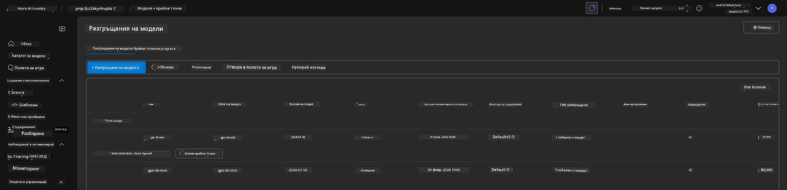
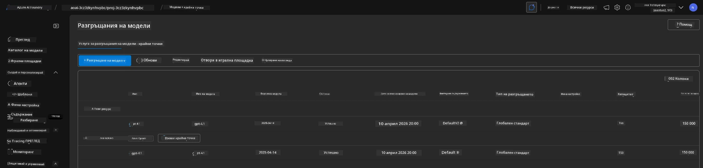

# 6. Разграждане на инфраструктурата

!!! tip "ДО КРАЯ НА ТОЗИ МОДУЛ ЩЕ МОЖЕТЕ ДА"

    - [ ] Елемент
    - [ ] Елемент
    - [ ] Елемент

---

## Допълнителни упражнения

Преди да разградим проекта, отделете няколко минути за свободно изследване.

!!! danger "NITYA-TODO: Очертайте някои предложения за опити"

---

## Депровизиране на инфраструктурата

1. Разграждането на инфраструктурата е толкова лесно, колкото:
      
      ```bash title="" linenums="0"
      azd down --purge
      ```
1. Флагът `--purge` гарантира, че се изтриват и меко изтритите ресурси на Cognitive Service, като по този начин се освобождава квотата, задържана от тези ресурси. След като процесът приключи, ще видите нещо подобно:
      
      ```bash title="" linenums="0"
      ? Total resources to delete: 11, are you sure you want to continue? Yes
      Deleting your resources can take some time.
      (✓) Done: Deleted resource group rg-nitya-mshack-azd
      (✓) Done: Purging Cognitive Account: aoai-3cz3zkynhvpbc

      SUCCESS: Your application was removed from Azure in 11 minutes 4 seconds.
      ```

1. (По избор) Ако сега изпълните `azd up` отново, ще забележите, че моделът gpt-4.1 се разгръща, тъй като променливата на средата беше променена (и запазена) в локалната папка `.azure`.

      Ето как изглежда разгръщането на моделите **преди**:

      

      А ето го **след**:
      

---

