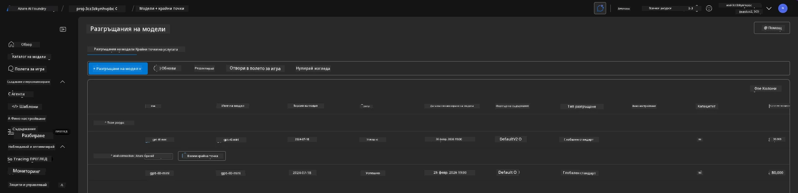
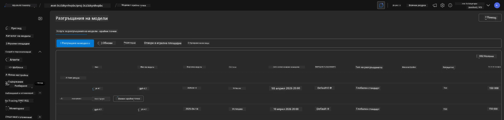

# 6. Teardown Infrastructure

!!! tip "В КРАЯ НА ТОЗИ МОДУЛ ЩЕ МОЖЕТЕ"

    - [ ] Разберете защо е важно почистването на ресурси и управлението на разходите
    - [ ] Използвайте `azd down`, за да деинсталирате инфраструктурата безопасно
    - [ ] Възстановявайте софт-изтрити ресурси на Cognitive Services при необходимост
    - [ ] **Лабораторно упражнение 6:** Почистете ресурсите в Azure и потвърдете премахването

---

## Bonus Exercises

Before we tear down the project, take a few minutes to do some open-ended exploration.

!!! info "Опитайте тези подсказки за изследване"

    **Експериментирайте с GitHub Copilot:**
    
    1. Попитайте: `Какви други AZD шаблони бих могъл да пробвам за сценарии с множество агенти?`
    2. Попитайте: `Как да персонализирам инструкциите на агентите за приложение в здравеопазването?`
    3. Попитайте: `Кои променливи на средата контролират оптимизацията на разходите?`
    
    **Разгледайте портала на Azure:**
    
    1. Прегледайте метриките в Application Insights за вашето внедряване
    2. Проверете анализа на разходите за предоставените ресурси
    3. Разгледайте още веднъж площадката за агенти (agent playground) в портала Microsoft Foundry

---

## Deprovision Infra

1. Премахването на инфраструктурата е толкова просто, колкото:
      
      ```bash title="" linenums="0"
      azd down --purge
      ```
1. The `--purge` flag ensures that it also purges soft-deleted Cognitive Service resources, thereby releasing quota held by these resources. Once complete you will see something like this:
      
      ```bash title="" linenums="0"
      ? Total resources to delete: 11, are you sure you want to continue? Yes
      Deleting your resources can take some time.
      (✓) Done: Deleted resource group rg-nitya-mshack-azd
      (✓) Done: Purging Cognitive Account: aoai-3cz3zkynhvpbc

      SUCCESS: Your application was removed from Azure in 11 minutes 4 seconds.
      ```

1. (По избор) Ако сега стартирате `azd up` отново, ще забележите, че моделът gpt-4.1 се разгръща, тъй като променливата на средата беше променена (и запазена) в локалната папка `.azure`. 

      Ето разполагането на модела **преди**:

      

      А ето го **след**:
      

---

<!-- CO-OP TRANSLATOR DISCLAIMER START -->
Отказ от отговорност:
Този документ е преведен с помощта на услуга за превод с изкуствен интелект Co-op Translator (https://github.com/Azure/co-op-translator). Въпреки че се стремим към точност, моля, имайте предвид, че автоматичните преводи могат да съдържат грешки или неточности. Оригиналният документ на оригиналния език трябва да се счита за авторитетен източник. За критична информация се препоръчва професионален човешки превод. Не носим отговорност за каквито и да е недоразумения или погрешни тълкувания, произтичащи от използването на този превод.
<!-- CO-OP TRANSLATOR DISCLAIMER END -->