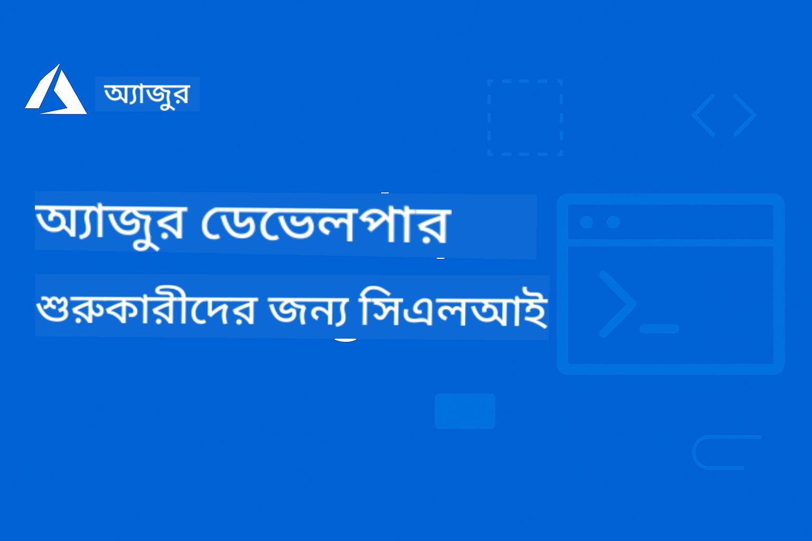

<!--
CO_OP_TRANSLATOR_METADATA:
{
  "original_hash": "6c3d0f9ef66c2cd692a55a2811d9c3e5",
  "translation_date": "2025-09-15T15:00:36+00:00",
  "source_file": "README.md",
  "language_code": "bn"
}
-->
# AZD নবাগতদের জন্য

 

[](https://GitHub.com/microsoft/azd-for-beginners/watchers/)
[](https://GitHub.com/microsoft/azd-for-beginners/network/)
[](https://GitHub.com/microsoft/azd-for-beginners/stargazers/)

[](https://discord.gg/microsoft-azure)

[](https://discord.gg/kzRShWzttr)

এই রিসোর্সগুলো ব্যবহার শুরু করতে নিচের ধাপগুলো অনুসরণ করুন:
1. **রিপোজিটরি ফর্ক করুন**: ক্লিক করুন [](https://GitHub.com/microsoft/azd-for-beginners/fork)
2. **রিপোজিটরি ক্লোন করুন**:   `git clone https://github.com/microsoft/azd-for-beginners.git`
3. [**Azure Discord কমিউনিটিতে যোগ দিন এবং বিশেষজ্ঞ ও অন্যান্য ডেভেলপারদের সাথে পরিচিত হন**](https://discord.com/invite/ByRwuEEgH4)

### বহু-ভাষার সমর্থন

#### GitHub Action এর মাধ্যমে সমর্থিত (স্বয়ংক্রিয় এবং সর্বদা আপডেটেড)

[French](../fr/README.md) | [Spanish](../es/README.md) | [German](../de/README.md) | [Russian](../ru/README.md) | [Arabic](../ar/README.md) | [Persian (Farsi)](../fa/README.md) | [Urdu](../ur/README.md) | [Chinese (Simplified)](../zh/README.md) | [Chinese (Traditional, Macau)](../mo/README.md) | [Chinese (Traditional, Hong Kong)](../hk/README.md) | [Chinese (Traditional, Taiwan)](../tw/README.md) | [Japanese](../ja/README.md) | [Korean](../ko/README.md) | [Hindi](../hi/README.md) | [Bengali](./README.md) | [Marathi](../mr/README.md) | [Nepali](../ne/README.md) | [Punjabi (Gurmukhi)](../pa/README.md) | [Portuguese (Portugal)](../pt/README.md) | [Portuguese (Brazil)](../br/README.md) | [Italian](../it/README.md) | [Polish](../pl/README.md) | [Turkish](../tr/README.md) | [Greek](../el/README.md) | [Thai](../th/README.md) | [Swedish](../sv/README.md) | [Danish](../da/README.md) | [Norwegian](../no/README.md) | [Finnish](../fi/README.md) | [Dutch](../nl/README.md) | [Hebrew](../he/README.md) | [Vietnamese](../vi/README.md) | [Indonesian](../id/README.md) | [Malay](../ms/README.md) | [Tagalog (Filipino)](../tl/README.md) | [Swahili](../sw/README.md) | [Hungarian](../hu/README.md) | [Czech](../cs/README.md) | [Slovak](../sk/README.md) | [Romanian](../ro/README.md) | [Bulgarian](../bg/README.md) | [Serbian (Cyrillic)](../sr/README.md) | [Croatian](../hr/README.md) | [Slovenian](../sl/README.md) | [Ukrainian](../uk/README.md) | [Burmese (Myanmar)](../my/README.md)

**যদি আপনি অতিরিক্ত ভাষার অনুবাদ চান, সমর্থিত ভাষার তালিকা [এখানে](https://github.com/Azure/co-op-translator/blob/main/getting_started/supported-languages.md) পাওয়া যাবে।**

## পরিচিতি

Azure Developer CLI (azd) এর জন্য একটি বিস্তৃত গাইডে আপনাকে স্বাগতম। এই রিপোজিটরি শিক্ষার্থী থেকে শুরু করে পেশাদার ডেভেলপারদের জন্য ডিজাইন করা হয়েছে, যাতে তারা Azure Developer CLI শিখতে এবং দক্ষতার সাথে ক্লাউড ডিপ্লয়মেন্ট করতে পারে। **বিশেষত Azure AI Foundry ব্যবহার করে AI অ্যাপ্লিকেশন ডিপ্লয়মেন্টের উপর জোর দিয়ে।** এই কাঠামোবদ্ধ শিক্ষার রিসোর্সটি Azure ক্লাউড ডিপ্লয়মেন্ট, সাধারণ সমস্যার সমাধান এবং সফল AZD টেমপ্লেট ডিপ্লয়মেন্টের জন্য সেরা অনুশীলন বাস্তবায়নের হাতে-কলমে অভিজ্ঞতা প্রদান করে।

### **AI ডেভেলপারদের জন্য এই গাইড কেন গুরুত্বপূর্ণ**
আমাদের সাম্প্রতিক Azure AI Foundry Discord কমিউনিটির জরিপ অনুযায়ী, **৪৫% ডেভেলপার AZD ব্যবহার করে AI ওয়ার্কলোড পরিচালনা করতে আগ্রহী** কিন্তু তারা নিম্নলিখিত চ্যালেঞ্জগুলোর সম্মুখীন হন:
- জটিল বহু-সার্ভিস AI আর্কিটেকচার
- প্রোডাকশন AI ডিপ্লয়মেন্টের সেরা অনুশীলন
- Azure AI সার্ভিস ইন্টিগ্রেশন এবং কনফিগারেশন
- AI ওয়ার্কলোডের জন্য খরচ অপ্টিমাইজেশন
- AI-নির্দিষ্ট ডিপ্লয়মেন্ট সমস্যার সমাধান

## শেখার লক্ষ্য

এই রিপোজিটরির মাধ্যমে কাজ করে আপনি:
- Azure Developer CLI এর মৌলিক বিষয় এবং মূল ধারণাগুলো আয়ত্ত করবেন
- Infrastructure as Code ব্যবহার করে Azure রিসোর্স ডিপ্লয় এবং প্রভিশন করতে শিখবেন
- সাধারণ AZD ডিপ্লয়মেন্ট সমস্যার সমাধান করার দক্ষতা অর্জন করবেন
- প্রি-ডিপ্লয়মেন্ট যাচাই এবং সক্ষমতা পরিকল্পনা বুঝবেন
- নিরাপত্তা সেরা অনুশীলন এবং খরচ অপ্টিমাইজেশন কৌশল বাস্তবায়ন করবেন
- প্রোডাকশন-রেডি অ্যাপ্লিকেশন Azure-এ ডিপ্লয় করার আত্মবিশ্বাস তৈরি করবেন

## শেখার ফলাফল

এই কোর্স সম্পন্ন করার পর আপনি:
- সফলভাবে Azure Developer CLI ইনস্টল, কনফিগার এবং ব্যবহার করতে পারবেন
- AZD টেমপ্লেট ব্যবহার করে অ্যাপ্লিকেশন তৈরি এবং ডিপ্লয় করতে পারবেন
- অথেনটিকেশন, ইনফ্রাস্ট্রাকচার এবং ডিপ্লয়মেন্ট সমস্যার সমাধান করতে পারবেন
- প্রি-ডিপ্লয়মেন্ট চেক সম্পাদন করতে পারবেন, যার মধ্যে সক্ষমতা পরিকল্পনা এবং SKU নির্বাচন অন্তর্ভুক্ত
- মনিটরিং, নিরাপত্তা এবং খরচ ব্যবস্থাপনার সেরা অনুশীলন বাস্তবায়ন করতে পারবেন
- CI/CD পাইপলাইনে AZD ওয়ার্কফ্লো ইন্টিগ্রেট করতে পারবেন

## বিষয়সূচি

- [Azure Developer CLI কী?](../..)
- [দ্রুত শুরু](../..)
- [শেখার পথ](../..)
  - [AI ডেভেলপারদের জন্য (এখান থেকে শুরু করুন!)](../..)
  - [শিক্ষার্থী ও নবাগতদের জন্য](../..)
  - [ডেভেলপারদের জন্য](../..)
  - [DevOps ইঞ্জিনিয়ারদের জন্য](../..)
- [ডকুমেন্টেশন](../..)
  - [শুরু করা](../..)
  - [ডিপ্লয়মেন্ট ও প্রভিশনিং](../..)
  - [প্রি-ডিপ্লয়মেন্ট চেক](../..)
  - [AI ও Azure AI Foundry](../..)
  - [সমস্যা সমাধান](../..)
- [উদাহরণ ও টেমপ্লেট](../..)
  - [বৈশিষ্ট্যযুক্ত: Azure AI Foundry টেমপ্লেট](../..)
  - [বৈশিষ্ট্যযুক্ত: Azure AI Foundry E2E দৃশ্যপট](../..)
  - [অতিরিক্ত AZD টেমপ্লেট](../..)
  - [হ্যান্ডস-অন ল্যাব ও ওয়ার্কশপ](../..)
- [রিসোর্স](../..)
- [অবদান](../..)
- [সহায়তা](../..)
- [কমিউনিটি](../..)

## Azure Developer CLI কী?

Azure Developer CLI (azd) একটি ডেভেলপার-কেন্দ্রিক কমান্ড-লাইন ইন্টারফেস যা Azure-এ অ্যাপ্লিকেশন তৈরি এবং ডিপ্লয় করার প্রক্রিয়াকে দ্রুততর করে। এটি প্রদান করে:

- **টেমপ্লেট-ভিত্তিক ডিপ্লয়মেন্ট** - সাধারণ অ্যাপ্লিকেশন প্যাটার্নের জন্য প্রি-বিল্ট টেমপ্লেট ব্যবহার করুন
- **Infrastructure as Code** - Bicep বা Terraform ব্যবহার করে Azure রিসোর্স পরিচালনা করুন
- **ইন্টিগ্রেটেড ওয়ার্কফ্লো** - অ্যাপ্লিকেশন প্রভিশন, ডিপ্লয় এবং মনিটর করুন
- **ডেভেলপার-বন্ধুত্বপূর্ণ** - ডেভেলপারদের উৎপাদনশীলতা এবং অভিজ্ঞতার জন্য অপ্টিমাইজড

### **AZD + Azure AI Foundry: AI ডিপ্লয়মেন্টের জন্য আদর্শ**

**AI সমাধানের জন্য AZD কেন?** AZD AI ডেভেলপারদের শীর্ষ চ্যালেঞ্জগুলো সমাধান করে:

- **AI-রেডি টেমপ্লেট** - Azure OpenAI, Cognitive Services এবং ML ওয়ার্কলোডের জন্য প্রি-কনফিগারড টেমপ্লেট
- **নিরাপদ AI ডিপ্লয়মেন্ট** - AI সার্ভিস, API কী এবং মডেল এন্ডপয়েন্টের জন্য বিল্ট-ইন নিরাপত্তা প্যাটার্ন
- **প্রোডাকশন AI প্যাটার্ন** - স্কেলযোগ্য, খরচ-সাশ্রয়ী AI অ্যাপ্লিকেশন ডিপ্লয়মেন্টের সেরা অনুশীলন
- **এন্ড-টু-এন্ড AI ওয়ার্কফ্লো** - মডেল ডেভেলপমেন্ট থেকে প্রোডাকশন ডিপ্লয়মেন্ট পর্যন্ত সঠিক মনিটরিং সহ
- **খরচ অপ্টিমাইজেশন** - AI ওয়ার্কলোডের জন্য স্মার্ট রিসোর্স বরাদ্দ এবং স্কেলিং কৌশল
- **Azure AI Foundry ইন্টিগ্রেশন** - AI Foundry মডেল ক্যাটালগ এবং এন্ডপয়েন্টের সাথে সহজ সংযোগ

## দ্রুত শুরু

### প্রয়োজনীয়তা
- Azure সাবস্ক্রিপশন
- Azure CLI ইনস্টল করা
- Git (টেমপ্লেট ক্লোন করার জন্য)

### ইনস্টলেশন
```bash
# Windows (PowerShell)
powershell -ex AllSigned -c "Invoke-RestMethod 'https://aka.ms/install-azd.ps1' | Invoke-Expression"

# macOS/Linux
curl -fsSL https://aka.ms/install-azd.sh | bash
```

### আপনার প্রথম ডিপ্লয়মেন্ট
```bash
# Initialize a new project
azd init --template todo-nodejs-mongo

# Provision Azure resources and deploy
azd up
```

### আপনার প্রথম AI ডিপ্লয়মেন্ট
```bash
# Initialize an AI-powered chat application with Azure OpenAI
azd init --template azure-search-openai-demo

# Configure AI services and deploy
azd up

# Or try other AI templates:
azd init --template openai-chat-app-quickstart
azd init --template ai-document-processing
azd init --template contoso-chat
```

## শেখার পথ

### AI ডেভেলপারদের জন্য (এখান থেকে শুরু করুন!)
1. **দ্রুত শুরু**: [azure-search-openai-demo](https://github.com/Azure-Samples/azure-search-openai-demo) টেমপ্লেট চেষ্টা করুন
2. **মৌলিক বিষয় শিখুন**: [AZD Basics](docs/getting-started/azd-basics.md) + [Azure AI Foundry Integration](docs/ai-foundry/azure-ai-foundry-integration.md)
3. **হ্যান্ডস-অন অনুশীলন**: [AI Workshop Lab](docs/ai-foundry/ai-workshop-lab.md) সম্পন্ন করুন
4. **প্রোডাকশন রেডি**: [Production AI Best Practices](docs/ai-foundry/production-ai-practices.md) পর্যালোচনা করুন
5. **উন্নত**: [contoso-chat](https://github.com/Azure-Samples/contoso-chat) এন্টারপ্রাইজ টেমপ্লেট ডিপ্লয় করুন

### শিক্ষার্থী ও নবাগতদের জন্য
1. [AZD Basics](docs/getting-started/azd-basics.md) দিয়ে শুরু করুন
2. [ইনস্টলেশন গাইড](docs/getting-started/installation.md) অনুসরণ করুন
3. [আপনার প্রথম প্রকল্প](docs/getting-started/first-project.md) সম্পন্ন করুন
4. [সাধারণ ওয়েব অ্যাপ উদাহরণ](../../examples/simple-web-app) দিয়ে অনুশীলন করুন

### ডেভেলপারদের জন্য
1. [কনফিগারেশন গাইড](docs/getting-started/configuration.md) পর্যালোচনা করুন
2. [ডিপ্লয়মেন্ট গাইড](docs/deployment/deployment-guide.md) অধ্যয়ন করুন
3. [ডাটাবেস অ্যাপ উদাহরণ](../../examples/database-app) নিয়ে কাজ করুন
4. [কন্টেইনার অ্যাপ উদাহরণ](../../examples/container-app) অন্বেষণ করুন

### DevOps ইঞ্জিনিয়ারদের জন্য
1. [রিসোর্স প্রভিশনিং](docs/deployment/provisioning.md) আয়ত্ত করুন
2. [প্রি-ফ্লাইট চেক](docs/pre-deployment/preflight-checks.md) বাস্তবায়ন করুন
3. [ক্ষমতা পরিকল্পনা](docs/pre-deployment/capacity-planning.md) অনুশীলন করুন
4. উন্নত [মাইক্রোসার্ভিস উদাহরণ](../../examples/microservices) ব্যবহার করুন

## ডকুমেন্টেশন

### শুরু করা
- [**AZD Basics**](docs/getting-started/azd-basics.md) - মূল ধারণা এবং পরিভাষা
- [**ইনস্টলেশন ও সেটআপ**](docs/getting-started/installation.md) - প্ল্যাটফর্ম-নির্দিষ্ট ইনস্টলেশন গাইড
- [**কনফিগারেশন**](docs/getting-started/configuration.md) - পরিবেশ সেটআপ এবং অথেনটিকেশন
- [**আপনার প্রথম প্রকল্প**](docs/getting-started/first-project.md) - ধাপে ধাপে টিউটোরিয়াল

### ডিপ্লয়মেন্ট ও প্রভিশনিং
- [**ডিপ্লয়মেন্ট গাইড**](docs/deployment/deployment-guide.md) - সম্পূর্ণ ডিপ্লয়মেন্ট ওয়ার্কফ্লো
- [**রিসোর্স প্রভিশনিং**](docs/deployment/provisioning.md) - Azure রিসোর্স ব্যবস্থাপনা

### প্রি-ডিপ্লয়মেন্ট চেক
- [**ক্ষমতা পরিকল্পনা**](docs/pre-deployment/capacity-planning.md) - Azure রিসোর্স সক্ষমতা যাচাই
- [**SKU নির্বাচন**](docs/pre-deployment/sku-selection.md) - সঠিক Azure SKU নির্বাচন
- [**প্রি-ফ্লাইট চেক**](docs/pre-deployment/preflight-checks.md) - স্বয়ংক্রিয় যাচাই স্ক্রিপ্ট

### AI ও Azure AI Foundry
- [**Azure AI Foundry ইন্টিগ্রেশন**](docs/ai-foundry/azure-ai-foundry-integration.md) - AZD কে Azure AI Foundry সার্ভিসের সাথে সংযুক্ত করুন
- [**AI মডেল ডিপ্লয়মেন্ট প্যাটার্ন**](docs/ai-foundry/ai-model-deployment.md) - AZD ব্যবহার করে AI মডেল ডিপ্লয় এবং পরিচালনা করুন
- [**AI Workshop Lab**](docs/ai-foundry/ai-workshop-lab.md) - হাতে-কলমে ল্যাব: AI সমাধানকে AZD-রেডি করা
- [**প্রোডাকশন AI সেরা অনুশীলন**](docs/ai-foundry/production-ai-practices.md) - AI ওয়ার্কলোডের জন্য নিরাপত্তা, স্কেলিং এবং মনিটরিং

### সমস্যা সমাধান
- [**সাধারণ সমস্যা**](docs/troubleshooting/common-issues.md) - প্রায়ই সম্মুখীন হওয়া সমস্যাগুলো এবং সমাধান
- [**ডিবাগিং গাইড**](docs/troubleshooting/debugging.md) - ধাপে ধাপে ডিবাগিং কৌশল
- [**এআই-সম্পর্কিত সমস্যা সমাধান**](docs/troubleshooting/ai-troubleshooting.md) - এআই সার্ভিস এবং মডেল ডিপ্লয়মেন্ট সংক্রান্ত সমস্যা

## উদাহরণ ও টেমপ্লেট

### [বৈশিষ্ট্যযুক্ত: Azure AI Foundry টেমপ্লেট](https://ai.azure.com/resource/build/templates)
**এআই অ্যাপ্লিকেশন ডিপ্লয় করতে এখান থেকে শুরু করুন!**

| টেমপ্লেট | বিবরণ | জটিলতা | সার্ভিস |
|----------|-------------|------------|----------|
| [**এআই চ্যাট দিয়ে শুরু করুন**](https://github.com/Azure-Samples/get-started-with-ai-chat) | Azure Container Apps ব্যবহার করে আপনার ডেটা এবং টেলিমেট্রি ইনসাইটের সাথে ইন্টিগ্রেটেড একটি বেসিক চ্যাট অ্যাপ্লিকেশন তৈরি এবং ডিপ্লয় করুন |⭐⭐ | AzureOpenAI + Azure AI Model Inference API + Azure AI Search + Azure Container Apps + Application Insights |
| [**এআই এজেন্ট দিয়ে শুরু করুন**](https://github.com/Azure-Samples/get-started-with-ai-agents) | Azure Container Apps ব্যবহার করে অ্যাকশন এবং টেলিমেট্রি ইনসাইট সহ একটি বেসিক এজেন্ট অ্যাপ্লিকেশন তৈরি এবং ডিপ্লয় করুন। |⭐⭐ | Azure AI Agent Service + AzureOpenAI + Azure AI Search + Azure Container Apps + Application Insights|
| [**মাল্টি-এজেন্ট ওয়ার্কফ্লো অটোমেশন**](https://github.com/Azure-Samples/get-started-with-ai-chat) | এআই এজেন্টদের একটি গ্রুপ পরিচালনা এবং সমন্বয় করে টাস্ক প্ল্যানিং এবং অটোমেশন উন্নত করুন।|⭐⭐⭐ | AzureOpenAI + Azure AI Agent Service + Semantic Kernel + Azure CosmosDB + Azure Container Apps|
| [**আপনার ডেটা থেকে ডকুমেন্ট তৈরি করুন**](https://github.com/Azure-Samples/get-started-with-ai-chat) | আপনার ডেটা থেকে প্রাসঙ্গিক তথ্য খুঁজে এবং সারসংক্ষেপ করে চুক্তি, চালান এবং বিনিয়োগ প্রস্তাবের মতো ডকুমেন্ট তৈরি দ্রুততর করুন। |⭐⭐⭐  | AzureOpenAI + Azure AI Search + Azure AI Services + Azure CosmosDB|
| [**ক্লায়েন্ট মিটিং এজেন্ট দিয়ে উন্নত করুন**](https://github.com/Azure-Samples/get-started-with-ai-chat) | এজেন্টদের একটি টিম ব্যবহার করে লিগ্যাসি কোডকে আধুনিক ভাষায় স্থানান্তর করুন। |⭐⭐⭐| AzureOpenAI + Azure AI Search + Azure CosmosDB + Azure SQL Database |
| [**এজেন্ট দিয়ে আপনার কোড আধুনিক করুন**](https://github.com/Azure-Samples/get-started-with-ai-chat) | Azure Container Apps ব্যবহার করে আপনার ডেটা এবং টেলিমেট্রি ইনসাইটের সাথে ইন্টিগ্রেটেড একটি বেসিক চ্যাট অ্যাপ্লিকেশন তৈরি এবং ডিপ্লয় করুন। |⭐⭐⭐ | AzureOpenAI + Azure Agent Service + Semantic Kernel + Azure CosmosDB + Azure Container Apps|
| [**আপনার কথোপকথন এজেন্ট তৈরি করুন**](https://github.com/Azure-Samples/get-started-with-ai-chat) | উন্নত কথোপকথন বোঝার ক্ষমতা ব্যবহার করে ডিটারমিনিস্টিক এবং মানব-নিয়ন্ত্রণযোগ্য ওয়ার্কফ্লো সহ চ্যাটবট এবং এজেন্ট তৈরি এবং উন্নত করুন। |⭐⭐⭐ | AI Language + AzureOpenAI + AI Search + Azure Storage + Azure Container Registry|
| [**কথোপকথন ডেটা থেকে ইনসাইট আনলক করুন**](https://github.com/Azure-Samples/get-started-with-ai-chat) | উন্নত বিষয়বস্তু বোঝার ক্ষমতা ব্যবহার করে বড় অডিও এবং টেক্সট-ভিত্তিক ডেটা সেট থেকে ইনসাইট আবিষ্কার করে কন্টাক্ট সেন্টারের দক্ষতা উন্নত করুন। |⭐⭐⭐ | AzureOpenAI + AI Search + Semantic Kernel + Azure Agent Service + AI AI Content Understanding|
| [**মাল্টি-মোডাল বিষয়বস্তু প্রক্রিয়াকরণ**](https://github.com/Azure-Samples/get-started-with-ai-chat) | অগঠিত বিষয়বস্তু থেকে তথ্য বের করে এবং এটি একটি গঠিত ফরম্যাটে ম্যাপ করে দাবি, চালান, চুক্তি এবং অন্যান্য ডকুমেন্ট দ্রুত এবং সঠিকভাবে প্রক্রিয়া করুন। এই টেমপ্লেট টেক্সট, ইমেজ, টেবিল এবং গ্রাফ সমর্থন করে। |⭐⭐⭐⭐ | AzureOpenAI + Azure Content Understanding + Azure CosmosDB + Azure Container Apps|

### বৈশিষ্ট্যযুক্ত: Azure AI Foundry E2E দৃশ্যপট
**এআই অ্যাপ্লিকেশন ডিপ্লয় করতে এখান থেকে শুরু করুন!**

| টেমপ্লেট | বিবরণ | জটিলতা | সার্ভিস |
|----------|-------------|------------|----------|
| [**openai-chat-app-quickstart**](https://github.com/Azure-Samples/openai-chat-app-quickstart) | Azure OpenAI সহ একটি সাধারণ চ্যাট ইন্টারফেস | ⭐ | AzureOpenAI + Container Apps |
| [**azure-search-openai-demo**](https://github.com/Azure-Samples/azure-search-openai-demo) | RAG-সক্ষম চ্যাট অ্যাপ Azure OpenAI সহ | ⭐⭐ | AzureOpenAI + Search + App Service |
| [**ai-document-processing**](https://github.com/Azure-Samples/ai-document-processing) | এআই সার্ভিস ব্যবহার করে ডকুমেন্ট বিশ্লেষণ | ⭐⭐ | Azure Document Intelligence + Functions |
| [**agent-openai-python-prompty**](https://github.com/Azure-Samples/agent-openai-python-prompty) | ফাংশন কলিং সহ এআই এজেন্ট ফ্রেমওয়ার্ক | ⭐⭐⭐ | AzureOpenAI + Azure Container Apps + Functions |
| [**contoso-chat**](https://github.com/Azure-Samples/contoso-chat) | এআই অর্কেস্ট্রেশন সহ এন্টারপ্রাইজ চ্যাট | ⭐⭐⭐ | AzureOpenAI + Azure AI Search + Container Apps |

### অতিরিক্ত AZD টেমপ্লেট
- [**উদাহরণ ডিরেক্টরি**](examples/README.md) - ব্যবহারিক উদাহরণ, টেমপ্লেট এবং বাস্তব জীবনের দৃশ্যপট
- [**Azure-Samples AZD টেমপ্লেট**](https://github.com/Azure-Samples/azd-templates) - অফিসিয়াল মাইক্রোসফট নমুনা টেমপ্লেট  
- [**Awesome AZD গ্যালারি**](https://azure.github.io/awesome-azd/) - কমিউনিটি-অবদানকৃত টেমপ্লেট

### হ্যান্ডস-অন ল্যাব ও কর্মশালা
- [**এআই ওয়ার্কশপ ল্যাব**](docs/ai-foundry/ai-workshop-lab.md) - **নতুন**: আপনার এআই সমাধান AZD-ডিপ্লয়যোগ্য করুন
- [**AZD ফর বিগিনারস কর্মশালা**](workshop/README.md) - এআই এজেন্ট AZD টেমপ্লেট ডিপ্লয়মেন্টে ফোকাস

## রিসোর্স

### দ্রুত রেফারেন্স
- [**কমান্ড চিট শিট**](resources/cheat-sheet.md) - গুরুত্বপূর্ণ azd কমান্ড
- [**গ্লসারি**](resources/glossary.md) - Azure এবং azd শব্দভাণ্ডার
- [**FAQ**](resources/faq.md) - প্রায়শই জিজ্ঞাসিত প্রশ্ন
- [**স্টাডি গাইড**](resources/study-guide.md) - বিস্তৃত শেখার লক্ষ্য এবং অনুশীলন

### বাহ্যিক রিসোর্স
- [Azure Developer CLI ডকুমেন্টেশন](https://learn.microsoft.com/en-us/azure/developer/azure-developer-cli/)
- [Azure আর্কিটেকচার সেন্টার](https://learn.microsoft.com/en-us/azure/architecture/)
- [Azure প্রাইসিং ক্যালকুলেটর](https://azure.microsoft.com/pricing/calculator/)
- [Azure স্ট্যাটাস](https://status.azure.com/)

## অবদান

আমরা অবদানকে স্বাগত জানাই! বিস্তারিত জানতে আমাদের [অবদান গাইড](CONTRIBUTING.md) পড়ুন:
- কীভাবে সমস্যা এবং ফিচার অনুরোধ জমা দিতে হয়
- কোড অবদান নির্দেশিকা
- ডকুমেন্টেশন উন্নতি
- কমিউনিটি স্ট্যান্ডার্ড

## সাপোর্ট

- **সমস্যা**: [বাগ রিপোর্ট করুন এবং ফিচার অনুরোধ করুন](https://github.com/microsoft/azd-for-beginners/issues)
- **আলোচনা**: [মাইক্রোসফট Azure Discord কমিউনিটি Q&A এবং আলোচনা](https://discord.gg/microsoft-azure)
- **এআই-সম্পর্কিত সাপোর্ট**: AZD + AI Foundry আলোচনার জন্য [#Azure চ্যানেলে](https://discord.gg/microsoft-azure) যোগ দিন
- **ইমেইল**: ব্যক্তিগত অনুসন্ধানের জন্য
- **মাইক্রোসফট লার্ন**: [অফিসিয়াল Azure Developer CLI ডকুমেন্টেশন](https://learn.microsoft.com/en-us/azure/developer/azure-developer-cli/)

### কমিউনিটি ইনসাইট Azure AI Foundry Discord থেকে

**#Azure চ্যানেলের পোল ফলাফল:**
- **৪৫%** ডেভেলপার AZD ব্যবহার করতে চান এআই ওয়ার্কলোডের জন্য
- **শীর্ষ চ্যালেঞ্জ**: মাল্টি-সার্ভিস ডিপ্লয়মেন্ট, ক্রেডেনশিয়াল ম্যানেজমেন্ট, প্রোডাকশন রেডিনেস
- **সবচেয়ে অনুরোধকৃত**: এআই-সম্পর্কিত টেমপ্লেট, সমস্যা সমাধানের গাইড, সেরা অনুশীলন

**আমাদের কমিউনিটিতে যোগ দিন:**
- আপনার AZD + AI অভিজ্ঞতা শেয়ার করুন এবং সাহায্য পান
- নতুন এআই টেমপ্লেটের প্রাথমিক প্রিভিউ অ্যাক্সেস করুন
- এআই ডিপ্লয়মেন্ট সেরা অনুশীলনে অবদান রাখুন
- ভবিষ্যতের এআই + AZD ফিচার ডেভেলপমেন্টে প্রভাব ফেলুন

## লাইসেন্স

এই প্রকল্পটি MIT লাইসেন্সের অধীনে লাইসেন্সকৃত - বিস্তারিত জানতে [LICENSE](../../LICENSE) ফাইল দেখুন।

## অন্যান্য কোর্স

আমাদের টিম অন্যান্য কোর্স তৈরি করে! দেখুন:

- [**নতুন** মডেল কনটেক্সট প্রোটোকল (MCP) ফর বিগিনারস](https://github.com/microsoft/mcp-for-beginners?WT.mc_id=academic-105485-koreyst)
- [এআই এজেন্ট ফর বিগিনারস](https://github.com/microsoft/ai-agents-for-beginners?WT.mc_id=academic-105485-koreyst)
- [জেনারেটিভ এআই ফর বিগিনারস ব্যবহার করে .NET](https://github.com/microsoft/Generative-AI-for-beginners-dotnet?WT.mc_id=academic-105485-koreyst)
- [জেনারেটিভ এআই ফর বিগিনারস](https://github.com/microsoft/generative-ai-for-beginners?WT.mc_id=academic-105485-koreyst)
- [জেনারেটিভ এআই ফর বিগিনারস ব্যবহার করে জাভা](https://github.com/microsoft/generative-ai-for-beginners-java?WT.mc_id=academic-105485-koreyst)
- [ML ফর বিগিনারস](https://aka.ms/ml-beginners?WT.mc_id=academic-105485-koreyst)
- [ডেটা সায়েন্স ফর বিগিনারস](https://aka.ms/datascience-beginners?WT.mc_id=academic-105485-koreyst)
- [এআই ফর বিগিনারস](https://aka.ms/ai-beginners?WT.mc_id=academic-105485-koreyst)
- [সাইবারসিকিউরিটি ফর বিগিনারস](https://github.com/microsoft/Security-101??WT.mc_id=academic-96948-sayoung)
- [ওয়েব ডেভেলপমেন্ট ফর বিগিনারস](https://aka.ms/webdev-beginners?WT.mc_id=academic-105485-koreyst)
- [IoT ফর বিগিনারস](https://aka.ms/iot-beginners?WT.mc_id=academic-105485-koreyst)
- [XR ডেভেলপমেন্ট ফর বিগিনারস](https://github.com/microsoft/xr-development-for-beginners?WT.mc_id=academic-105485-koreyst)
- [গিটহাব কপাইলট মাস্টারি এআই পেয়ারড প্রোগ্রামিংয়ের জন্য](https://aka.ms/GitHubCopilotAI?WT.mc_id=academic-105485-koreyst)
- [গিটহাব কপাইলট মাস্টারি C#/.NET ডেভেলপারদের জন্য](https://github.com/microsoft/mastering-github-copilot-for-dotnet-csharp-developers?WT.mc_id=academic-105485-koreyst)
- [আপনার নিজস্ব কপাইলট অ্যাডভেঞ্চার চয়েস করুন](https://github.com/microsoft/CopilotAdventures?WT.mc_id=academic-105485-koreyst)

---

**নেভিগেশন**
- **পরবর্তী পাঠ**: [AZD বেসিকস](docs/getting-started/azd-basics.md)

---

**অস্বীকৃতি**:  
এই নথিটি AI অনুবাদ পরিষেবা [Co-op Translator](https://github.com/Azure/co-op-translator) ব্যবহার করে অনুবাদ করা হয়েছে। আমরা যথাসম্ভব সঠিক অনুবাদ প্রদানের চেষ্টা করি, তবে অনুগ্রহ করে মনে রাখবেন যে স্বয়ংক্রিয় অনুবাদে ত্রুটি বা অসঙ্গতি থাকতে পারে। মূল ভাষায় থাকা নথিটিকে প্রামাণিক উৎস হিসেবে বিবেচনা করা উচিত। গুরুত্বপূর্ণ তথ্যের জন্য, পেশাদার মানব অনুবাদ সুপারিশ করা হয়। এই অনুবাদ ব্যবহারের ফলে কোনো ভুল বোঝাবুঝি বা ভুল ব্যাখ্যা হলে আমরা তার জন্য দায়ী থাকব না।