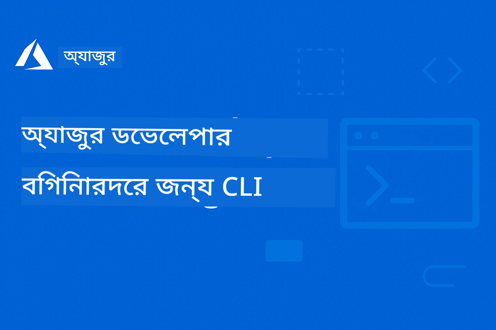

# নবাগতদের জন্য AZD: একটি কাঠামোবদ্ধ শেখার যাত্রা

 

[](https://GitHub.com/microsoft/azd-for-beginners/watchers/)
[](https://GitHub.com/microsoft/azd-for-beginners/network/)
[](https://GitHub.com/microsoft/azd-for-beginners/stargazers/)

[](https://discord.gg/microsoft-azure)
[](https://discord.gg/nTYy5BXMWG)

## এই কোর্স শুরু করার জন্য

আপনার AZD শেখার যাত্রা শুরু করার জন্য এই ধাপগুলি অনুসরণ করুন:

1. **রিপোজিটরি ফর্ক করুন**: ক্লিক করুন [](https://GitHub.com/microsoft/azd-for-beginners/fork)
2. **রিপোজিটরি ক্লোন করুন**: `git clone https://github.com/microsoft/azd-for-beginners.git`
3. **কমিউনিটিতে যোগ দিন**: [Azure Discord Communities](https://discord.com/invite/ByRwuEEgH4) বিশেষজ্ঞ সহায়তার জন্য
4. **আপনার শেখার পথ নির্বাচন করুন**: নিচের থেকে আপনার অভিজ্ঞতার স্তরের সাথে সঙ্গতিপূর্ণ একটি অধ্যায় নির্বাচন করুন

### বহু-ভাষার সমর্থন

#### স্বয়ংক্রিয় অনুবাদ (সবসময় হালনাগাদ)

<!-- CO-OP TRANSLATOR LANGUAGES TABLE START -->
[Arabic](../ar/README.md) | [Bengali](./README.md) | [Bulgarian](../bg/README.md) | [Burmese (Myanmar)](../my/README.md) | [Chinese (Simplified)](../zh-CN/README.md) | [Chinese (Traditional, Hong Kong)](../zh-HK/README.md) | [Chinese (Traditional, Macau)](../zh-MO/README.md) | [Chinese (Traditional, Taiwan)](../zh-TW/README.md) | [Croatian](../hr/README.md) | [Czech](../cs/README.md) | [Danish](../da/README.md) | [Dutch](../nl/README.md) | [Estonian](../et/README.md) | [Finnish](../fi/README.md) | [French](../fr/README.md) | [German](../de/README.md) | [Greek](../el/README.md) | [Hebrew](../he/README.md) | [Hindi](../hi/README.md) | [Hungarian](../hu/README.md) | [Indonesian](../id/README.md) | [Italian](../it/README.md) | [Japanese](../ja/README.md) | [Kannada](../kn/README.md) | [Korean](../ko/README.md) | [Lithuanian](../lt/README.md) | [Malay](../ms/README.md) | [Malayalam](../ml/README.md) | [Marathi](../mr/README.md) | [Nepali](../ne/README.md) | [Nigerian Pidgin](../pcm/README.md) | [Norwegian](../no/README.md) | [Persian (Farsi)](../fa/README.md) | [Polish](../pl/README.md) | [Portuguese (Brazil)](../pt-BR/README.md) | [Portuguese (Portugal)](../pt-PT/README.md) | [Punjabi (Gurmukhi)](../pa/README.md) | [Romanian](../ro/README.md) | [Russian](../ru/README.md) | [Serbian (Cyrillic)](../sr/README.md) | [Slovak](../sk/README.md) | [Slovenian](../sl/README.md) | [Spanish](../es/README.md) | [Swahili](../sw/README.md) | [Swedish](../sv/README.md) | [Tagalog (Filipino)](../tl/README.md) | [Tamil](../ta/README.md) | [Telugu](../te/README.md) | [Thai](../th/README.md) | [Turkish](../tr/README.md) | [Ukrainian](../uk/README.md) | [Urdu](../ur/README.md) | [Vietnamese](../vi/README.md)

> **স্থানীয়ভাবে ক্লোন করতে চান?**

> এই রিপোজিটরিতে ৫০+ ভাষার অনুবাদ রয়েছে যা ডাউনলোড সাইজ বাড়ায়। অনুবাদ ছাড়াই ক্লোন করতে sparse checkout ব্যবহার করুন:
> ```bash
> git clone --filter=blob:none --sparse https://github.com/microsoft/AZD-for-beginners.git
> cd AZD-for-beginners
> git sparse-checkout set --no-cone '/*' '!translations' '!translated_images'
> ```
> এটি আপনাকে কোর্স সম্পূর্ণ করার জন্য প্রয়োজনীয় সবকিছু অনেক দ্রুত ডাউনলোড করার সুযোগ দেয়।
<!-- CO-OP TRANSLATOR LANGUAGES TABLE END -->

## কোর্স ওভারভিউ

ধাপে ধাপে শেখার জন্য ডিজাইন করা কাঠামোবদ্ধ অধ্যায়ের মাধ্যমে Azure Developer CLI (azd) দক্ষ হয়ে ওঠুন। **বিশেষ ফোকাস Microsoft Foundry এর সাথে AI অ্যাপ্লিকেশন ডেপ্লয়মেন্টে।**

### কেন এই কোর্স আধুনিক ডেভেলপারদের জন্য অপরিহার্য

Microsoft Foundry Discord কমিউনিটির অন্তর্দৃষ্টির উপর ভিত্তি করে, **৪৫% ডেভেলপার AZD ব্যবহার করে AI ওয়ার্কলোড করতে চান** তবে চ্যালেঞ্জের সম্মুখীন হচ্ছেন:
- জটিল বহু-সার্ভিস AI আর্কিটেকচার
- প্রোডাকশন AI ডেপ্লয়মেন্ট সর্বোত্তম অভ্যাস
- Azure AI সার্ভিস সংযোগ এবং কনফিগারেশন
- AI ওয়ার্কলোডের জন্য খরচ অপ্টিমাইজেশন
- AI-নির্দিষ্ট ডেপ্লয়মেন্ট সমস্যা সমাধান

### শেখার উদ্দেশ্য

এই কাঠামোবদ্ধ কোর্স সম্পন্ন করে আপনি:
- **AZD মৌলিক জ্ঞান আয়ত্ত করুন**: মূল ধারণা, ইনস্টলেশন এবং কনফিগারেশন
- **AI অ্যাপ্লিকেশন ডেপ্লয় করুন**: AZD ও Microsoft Foundry সার্ভিস ব্যবহার করে
- **ইনফ্রাস্ট্রাকচার এস কোড** বাস্তবায়ন করুন: Bicep টেমপ্লেটস দিয়ে Azure রিসোর্স ম্যানেজ করুন
- **ডেপ্লয়মেন্ট ত্রুটি সমাধান করুন**: সাধারণ সমস্যা নির্ণয় এবং ডিবাগিং
- **প্রোডাকশনের জন্য অপ্টিমাইজ করুন**: সিকিউরিটি, স্কেলিং, মনিটরিং, ও খরচ ব্যবস্থাপনা
- **বহু-এজেন্ট সমাধান তৈরি করুন**: জটিল AI আর্কিটেকচার ডেপ্লয় করুন

## 📚 শেখার অধ্যায়সমূহ

*অভিজ্ঞতা ও লক্ষ্য অনুসারে আপনার শেখার পথ নির্বাচন করুন*

### 🚀 অধ্যায় ১: ভিত্তি ও দ্রুত শুরু
**প্রয়োজনীয়তা**: Azure সাবস্ক্রিপশন, মৌলিক কমান্ড লাইন জ্ঞান  
**সময়কাল**: ৩০-৪৫ মিনিট  
**জটিলতা**: ⭐

#### আপনি যা শিখবেন
- Azure Developer CLI এর মৌলিক ধারণা
- আপনার প্ল্যাটফর্মে AZD ইনস্টল করা
- আপনার প্রথম সফল ডেপ্লয়মেন্ট

#### শেখার সম্পদ
- **🎯 এখানে শুরু করুন**: [Azure Developer CLI কী?](../..)
- **📖 তত্ত্ব**: [AZD মৌলিক বিষয়](docs/getting-started/azd-basics.md) - মূল ধারণা ও শব্দাবলী
- **⚙️ সেটআপ**: [ইনস্টলেশন ও সেটআপ](docs/getting-started/installation.md) - প্ল্যাটফর্ম-নির্দিষ্ট গাইড
- **🛠️ হাতে কলমে**: [আপনার প্রথম প্রকল্প](docs/getting-started/first-project.md) - ধাপে ধাপে টিউটোরিয়াল
- **📋 দ্রুত রেফারেন্স**: [কমান্ড দ্রুত তথ্য](resources/cheat-sheet.md)

#### ব্যবহারিক অনুশীলন
```bash
# দ্রুত ইনস্টলেশন পরীক্ষা
azd version

# আপনার প্রথম অ্যাপ্লিকেশন স্থাপন করুন
azd init --template todo-nodejs-mongo
azd up
```

**💡 অধ্যায় ফলাফল**: AZD ব্যবহার করে একটি সাধারণ ওয়েব অ্যাপ্লিকেশন সফলভাবে Azure-এ ডেপ্লয় করুন

**✅ সফলতার যাচাই:**
```bash
# অধ্যায় ১ সম্পন্ন করার পর, আপনি সক্ষম হবেন:
azd version              # ইনস্টল করা সংস্করণ দেখায়
azd init --template todo-nodejs-mongo  # প্রকল্প শুরু করে
azd up                  # আজুরে মোতায়েন করে
azd show                # চলমান অ্যাপের URL প্রদর্শন করে
# অ্যাপ্লিকেশন ব্রাউজারে খুলে এবং কাজ করে
azd down --force --purge  # সম্পদগুলি পরিষ্কার করে
```

**📊 সময় বিনিয়োগ:** ৩০-৪৫ মিনিট  
**📈 শেখার দক্ষতা:** মূল অ্যাপ্লিকেশন স্বাধীনভাবে ডেপ্লয় করতে সক্ষম

**✅ সফলতার যাচাই:**
```bash
# অধ্যায় ১ সম্পন্ন করার পর, আপনি সক্ষম হওয়া উচিত:
azd version              # ইনস্টলকৃত সংস্করণ প্রদর্শন করে
azd init --template todo-nodejs-mongo  # প্রকল্প শুরু করে
azd up                  # আজুরে স্থাপন করে
azd show                # চলমান অ্যাপ URL প্রদর্শন করে
# অ্যাপ্লিকেশন ব্রাউজারে খুলে এবং কাজ করে
azd down --force --purge  # সম্পদগুলো পরিষ্কার করে
```

**📊 সময় বিনিয়োগ:** ৩০-৪৫ মিনিট  
**📈 শেখার দক্ষতা:** মূল অ্যাপ্লিকেশন স্বাধীনভাবে ডেপ্লয় করতে সক্ষম

---

### 🤖 অধ্যায় ২: AI-প্রথম উন্নয়ন (AI ডেভেলপারদের জন্য সুপারিশকৃত)
**প্রয়োজনীয়তা**: অধ্যায় ১ সম্পন্ন  
**সময়কাল**: ১-২ ঘণ্টা  
**জটিলতা**: ⭐⭐

#### আপনি যা শিখবেন
- AZD এর সাথে Microsoft Foundry সংযোগ
- AI-সক্ষম অ্যাপ্লিকেশন ডেপ্লয়মেন্ট
- AI সার্ভিস কনফিগারেশন বুঝতে পারা

#### শেখার সম্পদ
- **🎯 এখানে শুরু করুন**: [Microsoft Foundry সংযোগ](docs/microsoft-foundry/microsoft-foundry-integration.md)
- **📖 প্যাটার্নস**: [AI মডেল ডেপ্লয়মেন্ট](docs/microsoft-foundry/ai-model-deployment.md) - AI মডেল ডেপ্লয় ও পরিচালনা
- **🛠️ কর্মশালা**: [AI কর্মশালা ল্যাব](docs/microsoft-foundry/ai-workshop-lab.md) - AZD-র জন্য আপনার AI সমাধান প্রস্তুত করুন
- **🎥 ইন্টারেক্টিভ গাইড**: [কর্মশালা উপকরণ](workshop/README.md) - MkDocs * DevContainer পরিবেশ সহ ব্রাউজারভিত্তিক শেখা
- **📋 টেমপ্লেটস**: [Microsoft Foundry টেমপ্লেটস](../..)
- **📝 উদাহরণসমূহ**: [AZD ডেপ্লয়মেন্ট উদাহরণ](examples/README.md)

#### ব্যবহারিক অনুশীলন
```bash
# আপনার প্রথম AI অ্যাপ্লিকেশন ডিপ্লয় করুন
azd init --template azure-search-openai-demo
azd up

# অতিরিক্ত AI টেমপ্লেটগুলি চেষ্টা করুন
azd init --template openai-chat-app-quickstart
azd init --template agent-openai-python-prompty
```

**💡 অধ্যায় ফলাফল**: RAG ক্ষমতাসম্পন্ন AI-চালিত চ্যাট অ্যাপ্লিকেশন ডেপ্লয় ও কনফিগার করুন

**✅ সফলতার যাচাই:**
```bash
# অধ্যায় ২-এর পর, আপনি সক্ষম হওয়া উচিত:
azd init --template azure-search-openai-demo
azd up
# এআই চ্যাট ইন্টারফেস পরীক্ষা করুন
# প্রশ্ন জিজ্ঞাসা করুন এবং উত্স সহ এআই-পাওয়ারড প্রতিক্রিয়া পান
# অনুসন্ধান ইন্টিগ্রেশন কাজ করে কিনা যাচাই করুন
azd monitor  # অ্যাপ্লিকেশন ইনসাইটস টেলিমেট্রি প্রদর্শন করে কিনা পরীক্ষা করুন
azd down --force --purge
```

**📊 সময় বিনিয়োগ:** ১-২ ঘণ্টা  
**📈 শেখার দক্ষতা:** প্রোডাকশন-উপযুক্ত AI অ্যাপ্লিকেশন ডেপ্লয় ও কনফিগার করতে সক্ষম  
**💰 খরচ সচেতনতা:** মাসিক $৮০-১৫০ ডেভেলপমেন্ট খরচ, $৩০০-৩৫০০ প্রোডাকশন খরচ সম্পর্কে ধারণা

#### 💰 AI ডেপ্লয়মেন্টের জন্য খরচ বিবেচনা

**ডেভেলপমেন্ট পরিবেশ (প্রায় $৮০-১৫০/মাস):**
- Azure OpenAI (Pay-as-you-go): $০-৫০/মাস (টোকেন ব্যবহারের উপর ভিত্তি করে)
- AI সার্চ (বেসিক টিয়ার): $৭৫/মাস
- কন্টেইনার অ্যাপস (কনজাম্পশন): $০-২০/মাস
- স্টোরেজ (স্ট্যান্ডার্ড): $১-৫/মাস

**প্রোডাকশন পরিবেশ (প্রায় $৩০০-৩,৫০০+/মাস):**
- Azure OpenAI (সুসংগত পারফরম্যান্সের জন্য PTU): $৩,০০০+/মাস অথবা হাই ভলিউম সহ Pay-as-you-go
- AI সার্চ (স্ট্যান্ডার্ড টিয়ার): $২৫০/মাস
- কন্টেইনার অ্যাপস (ডেডিকেটেড): $৫০-১০০/মাস
- অ্যাপ্লিকেশন ইনসাইটস: $৫-৫০/মাস
- স্টোরেজ (প্রিমিয়াম): $১০-৫০/মাস

**💡 খরচ অপ্টিমাইজেশন টিপস:**
- শেখার জন্য **ফ্রি টিয়ার** Azure OpenAI ব্যবহার করুন (৫০,০০০ টোকেন/মাস অন্তর্ভুক্ত)
- সক্রিয় ডেভেলপমেন্ট না হলে `azd down` কমান্ড দিয়ে রিসোর্স ডিএলকেট করুন
- শুরুতে কনজাম্পশন ভিত্তিক বিলিং ব্যবহার করুন, প্রোডাকশনের জন্য PTU-তে আপগ্রেড করুন
- ডেপ্লয়মেন্টের আগে `azd provision --preview` দিয়ে খরচ অনুমান করুন
- অটো-স্কেলিং সক্ষম করুন: শুধুমাত্র প্রকৃত ব্যবহারের জন্য অর্থ প্রদান করুন

**খরচ পর্যবেক্ষণ:**
```bash
# অনুমানিত মাসিক খরচ পরীক্ষা করুন
azd provision --preview

# আজুর পোর্টালে প্রকৃত খরচ পর্যবেক্ষণ করুন
az consumption budget list --resource-group <your-rg>
```

---

### ⚙️ অধ্যায় ৩: কনফিগারেশন ও অথেন্টিকেশন
**প্রয়োজনীয়তা**: অধ্যায় ১ সম্পন্ন  
**সময়কাল**: ৪৫-৬০ মিনিট  
**জটিলতা**: ⭐⭐

#### আপনি যা শিখবেন
- পরিবেশ কনফিগারেশন ও ব্যবস্থাপনা
- অথেন্টিকেশন ও সিকিউরিটির সর্বোত্তম অভ্যাস
- রিসোর্স নামকরণ ও সংগঠন

#### শেখার সম্পদ
- **📖 কনফিগারেশন**: [কনফিগারেশন গাইড](docs/getting-started/configuration.md) - পরিবেশ সেটআপ
- **🔐 সিকিউরিটি**: [অথেন্টিকেশন প্যাটার্নস ও ম্যানেজড আইডেন্টিটি](docs/getting-started/authsecurity.md) - অথেন্টিকেশন প্যাটার্নস
- **📝 উদাহরণসমূহ**: [ডাটাবেস অ্যাপ উদাহরণ](examples/database-app/README.md) - AZD ডাটাবেস উদাহরণ

#### ব্যবহারিক অনুশীলন
- একাধিক পরিবেশ (ডেভ, স্টেজিং, প্রোড) কনফিগার করুন
- ম্যানেজড আইডেন্টিটি অথেন্টিকেশন সেটআপ করুন
- পরিবেশ-নির্দিষ্ট কনফিগারেশন বাস্তবায়ন করুন

**💡 অধ্যায় ফলাফল**: সঠিক অথেন্টিকেশন ও নিরাপত্তাসহ একাধিক পরিবেশ পরিচালনা করুন

---

### 🏗️ অধ্যায় ৪: ইনফ্রাস্ট্রাকচার অ্যাজ কোড ও ডেপ্লয়মেন্ট
**প্রয়োজনীয়তা**: অধ্যায় ১-৩ সম্পন্ন  
**সময়কাল**: ১-১.৫ ঘণ্টা  
**জটিলতা**: ⭐⭐⭐

#### আপনি যা শিখবেন
- উন্নত ডেপ্লয়মেন্ট প্যাটার্নস
- Bicep দিয়ে ইনফ্রাস্ট্রাকচার অ্যাজ কোড
- রিসোর্স প্রোভিশনিং স্ট্র্যাটেজি

#### শেখার সম্পদ
- **📖 ডেপ্লয়মেন্ট**: [ডেপ্লয়মেন্ট গাইড](docs/deployment/deployment-guide.md) - সম্পূর্ণ কর্মপ্রবাহ
- **🏗️ প্রোভিশনিং**: [রিসোর্স প্রোভিশনিং](docs/deployment/provisioning.md) - Azure রিসোর্স ব্যবস্থাপনা
- **📝 উদাহরণসমূহ**: [কন্টেইনার অ্যাপ উদাহরণ](../../examples/container-app) - কন্টেইনারাইজড ডেপ্লয়মেন্ট

#### ব্যবহারিক অনুশীলন
- কাস্টম Bicep টেমপ্লেট তৈরি করুন
- বহু-সার্ভিস অ্যাপ্লিকেশন ডেপ্লয় করুন
- ব্লু-গ্রীন ডেপ্লয়মেন্ট স্ট্র্যাটেজি বাস্তবায়ন করুন

**💡 অধ্যায় ফলাফল**: কাস্টম ইনফ্রাস্ট্রাকচার টেমপ্লেট ব্যবহার করে জটিল বহু-সার্ভিস অ্যাপ্লিকেশন ডেপ্লয় করুন

---

### 🎯 অধ্যায় ৫: বহু-এজেন্ট AI সমাধান (উন্নত)
**প্রয়োজনীয়তা**: অধ্যায় ১-২ সম্পন্ন  
**সময়কাল**: ২-৩ ঘণ্টা  
**জটিলতা**: ⭐⭐⭐⭐
#### আপনি যা শিখবেন
- মাল্টি-এজেন্ট আর্কিটেকচার প্যাটার্নস
- এজেন্ট অর্কেস্ট্রেশন এবং সমন্বয়
- প্রোডাকশন-রেডি AI ডিপ্লয়মেন্টস

#### শেখার সম্পদসমূহ
- **🤖 ফিচার্ড প্রজেক্ট**: [রিটেইল মাল্টি-এজেন্ট সলিউশন](examples/retail-scenario.md) - সম্পূর্ণ বাস্তবায়ন
- **🛠️ ARM টেমপ্লেটস**: [ARM টেমপ্লেট প্যাকেজ](../../examples/retail-multiagent-arm-template) - এক-ক্লিক ডিপ্লয়মেন্ট
- **📖 আর্কিটেকচার**: [মাল্টি-এজেন্ট সমন্বয় প্যাটার্নস](/docs/pre-deployment/coordination-patterns.md) - প্যাটার্নস

#### ব্যবহারিক অনুশীলন
```bash
# পূর্ণ রিটেইল বহু-এজেন্ট সমাধান স্থাপন করুন
cd examples/retail-multiagent-arm-template
./deploy.sh

# এজেন্ট কনফিগারেশন অন্বেষণ করুন
az deployment group show --resource-group <rg-name> --name <deployment-name>
```

**💡 অধ্যায় ফলাফল**: কাস্টমার এবং ইনভেন্টরি এজেন্টসহ একটি প্রোডাকশন-রেডি মাল্টি-এজেন্ট AI সলিউশন ডিপ্লয় এবং পরিচালনা করুন

---

### 🔍 অধ্যায় ৬: প্রি-ডিপ্লয়মেন্ট ভ্যালিডেশন ও পরিকল্পনা
**পূর্বশর্ত**: অধ্যায় ৪ সম্পন্ন  
**সময়কাল**: ১ ঘন্টা  
**জটিলতা**: ⭐⭐

#### আপনি যা শিখবেন
- ক্ষমতা পরিকল্পনা এবং রিসোর্স ভ্যালিডেশন
- SKU নির্বাচন কৌশল
- প্রি-ফ্লাইট চেক এবং অটোমেশন

#### শেখার সম্পদসমূহ
- **📊 পরিকল্পনা**: [ক্ষমতা পরিকল্পনা](docs/pre-deployment/capacity-planning.md) - রিসোর্স ভ্যালিডেশন
- **💰 নির্বাচন**: [SKU নির্বাচন](docs/pre-deployment/sku-selection.md) - খরচ-সাশ্রয়ী পছন্দসমূহ
- **✅ ভ্যালিডেশন**: [প্রি-ফ্লাইট চেকস](docs/pre-deployment/preflight-checks.md) - স্বয়ংক্রিয় স্ক্রিপ্টস

#### ব্যবহারিক অনুশীলন
- ক্ষমতা ভ্যালিডেশন স্ক্রিপ্ট চালান
- খরচ কমানোর জন্য SKU নির্বাচন অপ্টিমাইজ করুন
- অটোমেটেড প্রি-ডিপ্লয়মেন্ট চেকস বাস্তবায়ন করুন

**💡 অধ্যায় ফলাফল**: ডিপ্লয়মেন্টের আগে ভ্যালিডেট ও অপ্টিমাইজ করুন

---

### 🚨 অধ্যায় ৭: ট্রাবলশুটিং ও ডিবাগিং
**পূর্বশর্ত**: যেকোনো ডিপ্লয়মেন্ট অধ্যায় সম্পন্ন  
**সময়কাল**: ১-১.৫ ঘন্টা  
**জটিলতা**: ⭐⭐

#### আপনি যা শিখবেন
- সিস্টেম্যাটিক ডিবাগিং পদ্ধতি
- সাধারণ সমস্যা ও সমাধানসমূহ
- AI-নির্দিষ্ট ট্রাবলশুটিং

#### শেখার সম্পদসমূহ
- **🔧 সাধারণ সমস্যা**: [সাধারণ সমস্যা](docs/troubleshooting/common-issues.md) - FAQ এবং সমাধান
- **🕵️ ডিবাগিং**: [ডিবাগিং গাইড](docs/troubleshooting/debugging.md) - ধাপে ধাপে কৌশল
- **🤖 AI সমস্যা**: [AI-নির্দিষ্ট ট্রাবলশুটিং](docs/troubleshooting/ai-troubleshooting.md) - AI সার্ভিস সমস্যাসমূহ

#### ব্যবহারিক অনুশীলন
- ডিপ্লয়মেন্ট ব্যর্থতা নির্ণয় করুন
- অথেনটিকেশন সমস্যা সমাধান করুন
- AI সার্ভিস কানেক্টিভিটি ডিবাগ করুন

**💡 অধ্যায় ফলাফল**: স্বাধীনভাবে সাধারণ ডিপ্লয়মেন্ট সমস্যা নির্ণয় ও সমাধান করুন

---

### 🏢 অধ্যায় ৮: প্রোডাকশন ও এন্টারপ্রাইজ প্যাটার্নস  
**পূর্বশর্ত**: অধ্যায় ১-৪ সম্পন্ন  
**সময়কাল**: ২-৩ ঘন্টা  
**জটিলতা**: ⭐⭐⭐⭐

#### আপনি যা শিখবেন
- প্রোডাকশন ডিপ্লয়মেন্ট কৌশল
- এন্টারপ্রাইজ সিকিউরিটি প্যাটার্নস
- মনিটরিং ও খরচ অপ্টিমাইজেশন

#### শেখার সম্পদসমূহ
- **🏭 প্রোডাকশন**: [প্রোডাকশন AI সেরা অভ্যাস](docs/microsoft-foundry/production-ai-practices.md) - এন্টারপ্রাইজ প্যাটার্নস
- **📝 উদাহরণ**: [মাইক্রোসার্ভিসেস উদাহরণ](../../examples/microservices) - জটিল আর্কিটেকচারস
- **📊 মনিটরিং**: [অ্যাপ্লিকেশন ইনসাইটস ইন্টিগ্রেশন](docs/pre-deployment/application-insights.md) - মনিটরিং

#### ব্যবহারিক অনুশীলন
- এন্টারপ্রাইজ সিকিউরিটি প্যাটার্নস বাস্তবায়ন করুন
- ব্যাপক মনিটরিং সেটআপ করুন
- সঠিক গভর্নেন্স সহ প্রোডাকশনে ডিপ্লয় করুন

**💡 অধ্যায় ফলাফল**: পূর্ণ প্রোডাকশন সক্ষমতা সহ এন্টারপ্রাইজ-রেডি অ্যাপ্লিকেশন ডিপ্লয় করুন

---

## 🎓 কর্মশালা ওভারভিউ: প্র্যাকটিক্যাল শেখার অভিজ্ঞতা

> **⚠️ কর্মশালা অবস্থা: সক্রিয় উন্নয়ন**  
> কর্মশালা সামগ্রী বর্তমানে উন্নয়ন ও সংশোধনাধীন। মূল মডিউলগুলি কার্যকরী, তবে কয়েকটি অগ্রগামী অংশ অসম্পূর্ণ। আমরা সক্রিয়ভাবে সমস্ত বিষয়বস্তু সম্পন্ন করার কাজ করছি। [অগ্রগতি ট্র্যাক করুন →](workshop/README.md)

### ইন্টারেক্টিভ কর্মশালা সামগ্রী  
**ব্রাউজার-ভিত্তিক সরঞ্জাম এবং গাইডেড অনুশীলনসহ ব্যাপক হাতেকলমে শেখার অভিজ্ঞতা**

আমাদের কর্মশালা সামগ্রী একটি কাঠামোবদ্ধ, ইন্টারেক্টিভ শেখার অভিজ্ঞতা প্রদান করে যা উপরের অধ্যায়ভিত্তিক পাঠক্রমকে সম্পূরক করে। এটি স্বতঃস্ফূর্ত শেখার জন্য এবং ইনস্ট্রাক্টর-নেতৃত্বাধীন সেশন দুটোতেই ডিজাইন করা হয়েছে।

#### 🛠️ কর্মশালার বৈশিষ্ট্যসমূহ
- **ব্রাউজার-ভিত্তিক ইন্টারফেস**: খোঁজ, কপি, এবং থিম বৈশিষ্ট্যের সঙ্গে সম্পূর্ণ MkDocs-চালিত কর্মশালা  
- **GitHub Codespaces ইন্টিগ্রেশন**: এক-ক্লিক ডেভেলপমেন্ট পরিবেশ সেটআপ  
- **কাঠামোবদ্ধ শেখার পথ**: ৭-ধাপের গাইডেড অনুশীলন (মোট ৩.৫ ঘণ্টা)  
- **আবিষ্কার → ডিপ্লয়মেন্ট → কাস্টমাইজেশন**: প্রগতিশীল পদ্ধতি  
- **ইন্টারেক্টিভ ডেভকন্টেনার পরিবেশ**: পূর্ব-কনফিগারড সরঞ্জাম ও নির্ভরতাসমূহ

#### 📚 কর্মশালার কাঠামো  
কর্মশালা অনুসরণ করে **আবিষ্কার → ডিপ্লয়মেন্ট → কাস্টমাইজেশন** পদ্ধতি:

১. **আবিষ্কার ধাপ** (৪৫ মিনিট)  
   - মাইক্রোসফট ফাউন্ড্রী টেমপ্লেট ও সার্ভিসসমূহ অন্বেষণ  
   - মাল্টি-এজেন্ট আর্কিটেকচার প্যাটার্নস বোঝা  
   - ডিপ্লয়মেন্টের প্রয়োজনীয়তা ও পূর্বশর্তগুলি পর্যালোচনা

২. **ডিপ্লয়মেন্ট ধাপ** (২ ঘন্টা)  
   - AZD দিয়ে AI অ্যাপ্লিকেশনগুলোর হ্যান্ডস-অন ডিপ্লয়মেন্ট  
   - Azure AI সার্ভিস ও এন্ডপয়েন্ট কনফিগারেশন  
   - সিকিউরিটি ও অথেনটিকেশন প্যাটার্নস বাস্তবায়ন

৩. **কাস্টমাইজেশন ধাপ** (৪৫ মিনিট)  
   - নির্দিষ্ট ব্যবহার ক্ষেত্রে অ্যাপ্লিকেশন পরিবর্তন  
   - প্রোডাকশন ডিপ্লয়মেন্টের জন্য অপ্টিমাইজেশন  
   - মনিটরিং ও খরচ ব্যবস্থাপনা বাস্তবায়ন

#### 🚀 কর্মশালা শুরু করুন
```bash
# অপশন ১: গিটহাব কোডস্পেসেস (প্রস্তাবিত)
# রিপোজিটরিতে "Code" → "Create codespace on main" ক্লিক করুন

# অপশন ২: লোকাল ডেভেলপমেন্ট
git clone https://github.com/microsoft/azd-for-beginners.git
cd azd-for-beginners/workshop
# workshop/README.md এ সেটআপ নির্দেশিকা অনুসরণ করুন
```

#### 🎯 কর্মশালা শেখার ফলাফল  
কর্মশালা সম্পন্ন করে অংশগ্রহনকারীরা পারবেন:  
- **প্রোডাকশন AI অ্যাপ্লিকেশনস ডিপ্লয় করুন**: AZD এবং মাইক্রোসফট ফাউন্ড্রী সার্ভিস ব্যবহার করে  
- **মাল্টি-এজেন্ট আর্কিটেকচারস মাস্টার করুন**: সমন্বিত AI এজেন্ট সমাধান বাস্তবায়ন  
- **সিকিউরিটি সেরা অভ্যাস বাস্তবায়ন করুন**: অথেনটিকেশন ও অ্যাক্সেস কন্ট্রোল কনফিগার করুন  
- **স্কেলের জন্য অপ্টিমাইজ করুন**: খরচ-সাশ্রয়ী ও পারফরমেন্ট ডিপ্লয়মেন্ট ডিজাইন  
- **ডিপ্লয়মেন্ট ট্রাবলশুট করুন**: সাধারণ সমস্যা স্বতন্ত্রভাবে সমাধান করুন

#### 📖 কর্মশালা সম্পদসমূহ  
- **🎥 ইন্টারেক্টিভ গাইড**: [কর্মশালা সামগ্রী](workshop/README.md) - ব্রাউজার-ভিত্তিক শেখার পরিবেশ  
- **📋 ধাপে ধাপে নির্দেশিকা**: [গাইডেড অনুশীলন](../../workshop/docs/instructions) - বিস্তারিত পারিপার্শ্বিক  
- **🛠️ AI কর্মশালা ল্যাব**: [AI কর্মশালা ল্যাব](docs/microsoft-foundry/ai-workshop-lab.md) - AI-কেন্দ্রিক অনুশীলন  
- **💡 দ্রুত শুরু**: [কর্মশালা সেটআপ গাইড](workshop/README.md#quick-start) - পরিবেশ কনফিগারেশন

**উত্তম সঞ্চালনার জন্য**: কর্পোরেট প্রশিক্ষণ, বিশ্ববিদ্যালয় কোর্স, স্ব-গতিময় শেখা, এবং ডেভেলপার বুটক্যাম্প।

---

## 📖 Azure Developer CLI কী?

Azure Developer CLI (azd) হল একটি ডেভেলপার-কেন্দ্রিক কমান্ড-লাইন ইন্টারফেস যা Azure-তে অ্যাপ্লিকেশন তৈরির ও ডিপ্লয়মেন্টের প্রক্রিয়াকে দ্রুততর করে। এটি প্রদান করে:

- **টেমপ্লেট-ভিত্তিক ডিপ্লয়মেন্টস** - সাধারণ অ্যাপ্লিকেশন প্যাটার্নের জন্য প্রস্তুত টেমপ্লেট ব্যবহার  
- **ইনফ্রাস্ট্রাকচার অ্যাজ কোড** - Bicep বা Terraform ব্যবহার করে Azure রিসোর্স পরিচালনা  
- **অন্তর্ভুক্ত ওয়ার্কফ্লো** - অ্যাপ্লিকেশন প্রভিশন, ডিপ্লয়, এবং মনিটরিং নির্বিঘ্নে  
- **ডেভেলপার-বান্ধব** - ডেভেলপার প্রোডাক্টিভিটি ও অভিজ্ঞতার জন্য অপ্টিমাইজড

### **AZD + Microsoft Foundry: AI ডিপ্লয়মেন্টের জন্য আদর্শ**

**কেন AI সলিউশনের জন্য AZD?** AZD সমাধান করে AI ডেভেলপারদের প্রধান চ্যালেঞ্জগুলি:

- **AI-রেডি টেমপ্লেটস** - Azure OpenAI, Cognitive Services, এবং ML ওয়ার্কলোডের জন্য পূর্ব-নির্ধারিত টেমপ্লেট  
- **নিরাপদ AI ডিপ্লয়মেন্টস** - AI সার্ভিস, API কী, এবং মডেল এন্ডপয়েন্টের জন্য বিল্ট-ইন সিকিউরিটি প্যাটার্নগুলি  
- **প্রোডাকশন AI প্যাটার্নস** - স্কেলযোগ্য, খরচ-সাশ্রয়ী AI অ্যাপ্লিকেশন ডিপ্লয়মেন্টের সেরা অভ্যাস  
- **এন্ড-টু-এন্ড AI ওয়ার্কফ্লো** - মডেল ডেভেলপমেন্ট থেকে প্রোডাকশন ডিপ্লয়মেন্ট পর্যন্ত সঠিক মনিটরিংসহ  
- **খরচ অপ্টিমাইজেশন** - AI ওয়ার্কলোডের জন্য স্মার্ট রিসোর্স বরাদ্দ এবং স্কেলিং স্ট্র্যাটেজি  
- **Microsoft Foundry ইন্টিগ্রেশন** - Microsoft Foundry মডেল ক্যাটালগ ও এন্ডপয়েন্টের সাথে সিমলেস সংযোগ

---

## 🎯 টেমপ্লেটস ও উদাহরণ লাইব্রেরি

### ফিচার্ড: Microsoft Foundry টেমপ্লেটস  
**যদি আপনি AI অ্যাপ্লিকেশন ডিপ্লয় করতে চান, এখানে শুরু করুন!**

> **টীকা:** এই টেমপ্লেটগুলো বিভিন্ন AI প্যাটার্ন প্রদর্শন করে। কিছু হলো বাহ্যিক Azure স্যাম্পলস, অন্যগুলো লোকাল বাস্তবায়ন।

| টেমপ্লেট | অধ্যায় | জটিলতা | সার্ভিস | ধরন |
|----------|---------|------------|----------|------|
| [**AI চ্যাট শুরু করুন**](https://github.com/Azure-Samples/get-started-with-ai-chat) | অধ্যায় ২ | ⭐⭐ | AzureOpenAI + Azure AI Model Inference API + Azure AI Search + Azure Container Apps + Application Insights | বাহ্যিক |
| [**AI এজেন্টস শুরু করুন**](https://github.com/Azure-Samples/get-started-with-ai-agents) | অধ্যায় ২ | ⭐⭐ | Azure AI Agent Service + AzureOpenAI + Azure AI Search + Azure Container Apps + Application Insights| বাহ্যিক |
| [**Azure Search + OpenAI ডেমো**](https://github.com/Azure-Samples/azure-search-openai-demo) | অধ্যায় ২ | ⭐⭐ | AzureOpenAI + Azure AI Search + App Service + Storage | বাহ্যিক |
| [**OpenAI চ্যাট অ্যাপ দ্রুত শুরু**](https://github.com/Azure-Samples/openai-chat-app-quickstart) | অধ্যায় ২ | ⭐ | AzureOpenAI + Container Apps + Application Insights | বাহ্যিক |
| [**Agent OpenAI Python Prompty**](https://github.com/Azure-Samples/agent-openai-python-prompty) | অধ্যায় ৫ | ⭐⭐⭐ | AzureOpenAI + Azure Functions + Prompty | বাহ্যিক |
| [**Contoso Chat RAG**](https://github.com/Azure-Samples/contoso-chat) | অধ্যায় ৮ | ⭐⭐⭐⭐ | AzureOpenAI + AI Search + Cosmos DB + Container Apps | বাহ্যিক |
| [**রিটেইল মাল্টি-এজেন্ট সলিউশন**](examples/retail-scenario.md) | অধ্যায় ৫ | ⭐⭐⭐⭐ | AzureOpenAI + AI Search + Storage + Container Apps + Cosmos DB | **লোকাল** |

### ফিচার্ড: পূর্ণাঙ্গ শেখার সিনারিও
**শেখার অধ্যায়সমূহের সাথে ম্যাপ করা প্রোডাকশন-রেডি অ্যাপ্লিকেশন টেমপ্লেট**

| টেমপ্লেট | শেখার অধ্যায় | জটিলতা | মূল শেখা বিষয় |
|----------|------------------|------------|--------------|
| [**openai-chat-app-quickstart**](https://github.com/Azure-Samples/openai-chat-app-quickstart) | অধ্যায় ২ | ⭐ | মৌলিক AI ডিপ্লয়মেন্ট প্যাটার্ন |
| [**azure-search-openai-demo**](https://github.com/Azure-Samples/azure-search-openai-demo) | অধ্যায় ২ | ⭐⭐ | Azure AI Search সহ RAG বাস্তবায়ন |
| [**ai-document-processing**](https://github.com/Azure-Samples/ai-document-processing) | অধ্যায় ৪ | ⭐⭐ | ডকুমেন্ট ইন্টেলিজেন্স ইন্টিগ্রেশন |
| [**agent-openai-python-prompty**](https://github.com/Azure-Samples/agent-openai-python-prompty) | অধ্যায় ৫ | ⭐⭐⭐ | এজেন্ট ফ্রেমওয়ার্ক এবং ফাংশন কলিং |
| [**contoso-chat**](https://github.com/Azure-Samples/contoso-chat) | অধ্যায় ৮ | ⭐⭐⭐ | এন্টারপ্রাইজ AI অর্কেস্ট্রেশন |
| [**retail-multi-agent-solution**](examples/retail-scenario.md) | অধ্যায় ৫ | ⭐⭐⭐⭐ | কাস্টমার এবং ইনভেন্টরি এজেন্টসহ মাল্টি-এজেন্ট আর্কিটেকচার |

### উদাহরণ ধরণ অনুসারে শেখা

> **📌 লোকাল বনাম বাহ্যিক উদাহরণ:**  
> **লোকাল উদাহরণ** (এই রিপোজিটরিতে) = এখনই ব্যবহার করার জন্য প্রস্তুত  
> **বাহ্যিক উদাহরণ** (Azure স্যাম্পলস) = লিঙ্ক করা রিপোজিটরি থেকে ক্লোন করতে হবে

#### লোকাল উদাহরণ (তৎক্ষণাৎ ব্যবহারযোগ্য)
- [**রিটেইল মাল্টি-এজেন্ট সলিউশন**](examples/retail-scenario.md) - ARM টেমপ্লেটসহ সম্পূর্ণ প্রোডাকশন-রেডি বাস্তবায়ন
  - মাল্টি-এজেন্ট আর্কিটেকচার (কাস্টমার + ইনভেন্টরি এজেন্ট)
  - বিস্তৃত মনিটরিং ও মূল্যায়ন
  - এক-ক্লিক ডিপ্লয়মেন্ট ARM টেমপ্লেটের মাধ্যমে

#### লোকাল উদাহরণ - কন্টেইনার অ্যাপ্লিকেশনস (অধ্যায় ২-৫)  
**এই রিপোজিটরিতে ব্যাপক কন্টেইনার ডিপ্লয়মেন্ট উদাহরণসমূহ:**  
- [**কন্টেইনার অ্যাপ উদাহরণসমূহ**](examples/container-app/README.md) - কন্টেইনারাইজড ডিপ্লয়মেন্টের পূর্ণাঙ্গ গাইড  
  - [সরল Flask API](../../examples/container-app/simple-flask-api) - বস্তুত REST API স্কেল-টু-জিরো সহ  
  - [মাইক্রোসার্ভিসেস আর্কিটেকচার](../../examples/container-app/microservices) - প্রোডাকশন-রেডি মাল্টি-সার্ভিস ডিপ্লয়মেন্ট  
  - দ্রুত শুরু, প্রোডাকশন, এবং উন্নত ডিপ্লয়মেন্ট প্যাটার্নস  
  - মনিটরিং, সিকিউরিটি, এবং খরচ অপ্টিমাইজেশন নির্দেশিকা

#### বাহ্যিক উদাহরণ - সরল অ্যাপ্লিকেশনস (অধ্যায় ১-২)  
**এই Azure স্যাম্পলস রিপোজিটরি ক্লোন করে শুরু করুন:**  
- [সরল ওয়েব অ্যাপ - Node.js + MongoDB](https://github.com/Azure-Samples/todo-nodejs-mongo) - মৌলিক ডিপ্লয়মেন্ট প্যাটার্ন  
- [স্ট্যাটিক ওয়েবসাইট - React SPA](https://github.com/Azure-Samples/todo-csharp-sql-swa-func) - স্ট্যাটিক কনটেন্ট ডিপ্লয়মেন্ট  
- [কন্টেইনার অ্যাপ - Python Flask](https://github.com/Azure-Samples/container-apps-store-api-microservice) - REST API ডিপ্লয়মেন্ট

#### বাহ্যিক উদাহরণ - ডাটাবেস ইন্টিগ্রেশন (অধ্যায় ৩-৪)  
- [ডাটাবেস অ্যাপ - C# + SQL](https://github.com/Azure-Samples/todo-csharp-sql) - ডাটাবেস সংযোগ প্যাটার্ন  
- [ফাংশন + Cosmos DB](https://github.com/Azure-Samples/todo-python-mongo-swa-func) - সার্ভারলেস ডেটা ওয়ার্কফ্লো

#### বাহ্যিক উদাহরণ - উন্নত প্যাটার্নস (অধ্যায় ৪-৮)  
- [জাভা মাইক্রোসার্ভিসেস](https://github.com/Azure-Samples/java-microservices-aca-lab) - মাল্টি-সার্ভিস আর্কিটেকচারস  
- [কন্টেইনার অ্যাপস জবস](https://github.com/Azure-Samples/container-apps-jobs) - ব্যাকগ্রাউন্ড প্রোসেসিং  
- [এন্টারপ্রাইজ ML পাইপলাইন](https://github.com/Azure-Samples/mlops-v2) - প্রোডাকশন-রেডি ML প্যাটার্নস

### বাহ্যিক টেমপ্লেট কালেকশনসমূহ
- [**সরকারি AZD টেমপ্লেট গ্যালারি**](https://azure.github.io/awesome-azd/) - সরকারি ও কমিউনিটি টেমপ্লেটের নির্বাচিত সংগ্রহ
- [**Azure Developer CLI টেমপ্লেটস**](https://learn.microsoft.com/en-us/azure/developer/azure-developer-cli/azd-templates) - Microsoft Learn টেমপ্লেট ডকুমেন্টেশন  
- [**উদাহরণ ডিরেক্টরি**](examples/README.md) - স্থানীয় শেখার উদাহরণসমূহ বিস্তারিত ব্যাখ্যাসহ

---

## 📚 শেখার উৎস ও রেফারেন্সসমূহ

### দ্রুত রেফারেন্স
- [**কমান্ড চিট শিট**](resources/cheat-sheet.md) - অধ্যায়ের ভিত্তিতে সাজানো প্রয়োজনীয় azd কমান্ডসমূহ  
- [**শব্দকোষ**](resources/glossary.md) - Azure ও azd শব্দার্থ  
- [**প্রশ্নোত্তর**](resources/faq.md) - শেখার অধ্যায় অনুযায়ী সাধারণ প্রশ্নাবলী  
- [**অধ্যয়ন নির্দেশিকা**](resources/study-guide.md) - বিস্তৃত অনুশীলন

### হ্যান্ডস-অন ওয়ার্কশপসমূহ
- [**AI ওয়ার্কশপ ল্যাব**](docs/microsoft-foundry/ai-workshop-lab.md) - আপনার AI সমাধানগুলো AZD-ডিপ্লয়েবল করুন (২-৩ ঘণ্টা)  
- [**ইন্টারেক্টিভ ওয়ার্কশপ গাইড**](workshop/README.md) - MkDocs ও DevContainer পরিবেশে ব্রাউজারভিত্তিক ওয়ার্কশপ  
- [**গঠিত শেখার পথ**](../../workshop/docs/instructions) - ৭ ধাপের গাইডেড অনুশীলন (আবিষ্কার → ডিপ্লয়মেন্ট → কাস্টমাইজেশন)  
- [**শুরু করার জন্য AZD ওয়ার্কশপ**](workshop/README.md) - গিটহাব কোডস্পেস ইন্টিগ্রেশনসহ সম্পূর্ণ হ্যান্ডস-অন ওয়ার্কশপ সামগ্রী

### বাইরের শেখার উৎস
- [Azure Developer CLI ডকুমেন্টেশন](https://learn.microsoft.com/en-us/azure/developer/azure-developer-cli/)  
- [Azure আর্কিটেকচার সেন্টার](https://learn.microsoft.com/en-us/azure/architecture/)  
- [Azure প্রাইসিং ক্যালকুলেটর](https://azure.microsoft.com/pricing/calculator/)  
- [Azure স্ট্যাটাস](https://status.azure.com/)

---

## 🔧 দ্রুত সমস্যা সমাধান গাইড

**শুরুকারীদের মুখোমুখি হওয়া সাধারণ সমস্যা এবং তাৎক্ষণিক সমাধান:**

### ❌ "azd: command not found"

```bash
# প্রথমে AZD ইনস্টল করুন
# উইন্ডোজ (PowerShell):
winget install microsoft.azd

# ম্যাকওএস:
brew tap azure/azd && brew install azd

# লিনাক্স:
curl -fsSL https://aka.ms/install-azd.sh | bash

# ইনস্টলেশন যাচাই করুন
azd version
```

### ❌ "কোনো সাবস্ক্রিপশন পাওয়া যায়নি" অথবা "সাবস্ক্রিপশন সেট করা হয়নি"

```bash
# উপলব্ধ সাবস্ক্রিপশন তালিকা করুন
az account list --output table

# ডিফল্ট সাবস্ক্রিপশন সেট করুন
az account set --subscription "<subscription-id-or-name>"

# AZD পরিবেশের জন্য সেট করুন
azd env set AZURE_SUBSCRIPTION_ID "<subscription-id>"

# যাচাই করুন
az account show
```

### ❌ "InsufficientQuota" অথবা "কোটা অতিক্রান্ত হয়েছে"

```bash
# বিভিন্ন Azure অঞ্চল চেষ্টা করুন
azd env set AZURE_LOCATION "westus2"
azd up

# অথবা ডেভেলপমেন্টে ছোট SKUs ব্যবহার করুন
# সম্পাদনা করুন infra/main.parameters.json:
{
  "sku": "B1"  // Instead of "P1V2"
}
```

### ❌ "azd up" মাঝপথে ব্যর্থ হচ্ছে

```bash
# বিকল্প ১: পরিষ্কার করুন এবং পুনরায় চেষ্টা করুন
azd down --force --purge
azd up

# বিকল্প ২: শুধু অবকাঠামো ঠিক করুন
azd provision

# বিকল্প ৩: বিস্তারিত লগ পরীক্ষা করুন
azd show
azd logs
```

### ❌ "Authentication failed" অথবা "টোকেনের মেয়াদ উত্তীর্ণ"

```bash
# পুনরায় প্রমাণীকরণ
az logout
az login

azd auth logout
azd auth login

# প্রমাণীকরণ যাচাই করুন
az account show
```

### ❌ "Resource already exists" অথবা নাম সংক্রান্ত দ্বন্দ্ব

```bash
# AZD ইউনিক নাম তৈরি করে, কিন্তু যদি সংঘর্ষ ঘটে:
azd down --force --purge

# তাহলে নতুন পরিবেশ নিয়ে পুনরায় চেষ্টা করুন
azd env new dev-v2
azd up
```

### ❌ টেমপ্লেট ডিপ্লয়মেন্ট ধীর গতিতে চলছে

**স্বাভাবিক অপেক্ষার সময়:**
- সাধারণ ওয়েব অ্যাপ: ৫-১০ মিনিট  
- ডাটাবেসসহ অ্যাপ: ১০-১৫ মিনিট  
- AI অ্যাপ্লিকেশন: ১৫-২৫ মিনিট (OpenAI প্রোভিশনিং ধীর)

```bash
# অগ্রগতি পরীক্ষা করুন
azd show

# যদি >৩০ মিনিট আটকে থাকেন, তাহলে Azure পোর্টাল পরীক্ষা করুন:
azd monitor
# ব্যর্থ স্থাপনাগুলো খুঁজুন
```

### ❌ "Permission denied" অথবা "নিষিদ্ধ"

```bash
# আপনার Azure ভূমিকা পরীক্ষা করুন
az role assignment list --assignee $(az account show --query user.name -o tsv)

# আপনার অন্তত "Contributor" ভূমিকা প্রয়োজন
# আপনার Azure প্রশাসকের কাছে অনুরোধ করুন প্রদান করার জন্য:
# - Contributor (সামগ্রীগুলোর জন্য)
# - User Access Administrator (ভূমিকা বরাদ্দের জন্য)
```

### ❌ ডিপ্লয়কৃত অ্যাপ্লিকেশন URL খুঁজে পাচ্ছে না

```bash
# সমস্ত সার্ভিস এন্ডপয়েন্ট দেখান
azd show

# অথবা Azure পোর্টাল খুলুন
azd monitor

# নির্দিষ্ট সার্ভিস পরীক্ষা করুন
azd env get-values
# *_URL ভেরিয়েবলগুলি দেখুন
```

### 📚 পূর্ণ সমস্যা সমাধান সংস্থানসমূহ

- **সাধারণ সমস্যা গাইড:** [বিস্তৃত সমাধান](docs/troubleshooting/common-issues.md)  
- **AI-নির্দিষ্ট সমস্যা:** [AI সমস্যা সমাধান](docs/troubleshooting/ai-troubleshooting.md)  
- **ডিবাগিং গাইড:** [পর্যায়ক্রমে ডিবাগিং](docs/troubleshooting/debugging.md)  
- **সাহায্য নিন:** [Azure Discord](https://discord.gg/microsoft-azure) #azure-developer-cli

---

## 🔧 দ্রুত সমস্যা সমাধান গাইড

**শুরুকারীদের মুখোমুখি হওয়া সাধারণ সমস্যা এবং তাৎক্ষণিক সমাধান:**

<details>
<summary><strong>❌ "azd: command not found"</strong></summary>

```bash
# প্রথমে AZD ইনস্টল করুন
# উইন্ডোজ (PowerShell):
winget install microsoft.azd

# ম্যাকওএস:
brew tap azure/azd && brew install azd

# লিনাক্স:
curl -fsSL https://aka.ms/install-azd.sh | bash

# ইনস্টলেশন যাচাই করুন
azd version
```
</details>

<details>
<summary><strong>❌ "কোনো সাবস্ক্রিপশন পাওয়া যায়নি" অথবা "সাবস্ক্রিপশন সেট করা হয়নি"</strong></summary>

```bash
# উপলব্ধ সাবস্ক্রিপশন তালিকা করুন
az account list --output table

# ডিফল্ট সাবস্ক্রিপশন সেট করুন
az account set --subscription "<subscription-id-or-name>"

# AZD পরিবেশের জন্য সেট করুন
azd env set AZURE_SUBSCRIPTION_ID "<subscription-id>"

# যাচাই করুন
az account show
```
</details>

<details>
<summary><strong>❌ "InsufficientQuota" অথবা "কোটা অতিক্রান্ত হয়েছে"</strong></summary>

```bash
# ভিন্ন Azure অঞ্চল চেষ্টা করুন
azd env set AZURE_LOCATION "westus2"
azd up

# অথবা উন্নয়নে ছোট SKUs ব্যবহার করুন
# infra/main.parameters.json সম্পাদনা করুন:
{
  "sku": "B1"  // Instead of "P1V2"
}
```
</details>

<details>
<summary><strong>❌ "azd up" মাঝপথে ব্যর্থ হচ্ছে</strong></summary>

```bash
# বিকল্প ১: পরিষ্কার করুন এবং পুনরায় চেষ্টা করুন
azd down --force --purge
azd up

# বিকল্প ২: কেবল অবকাঠামো ঠিক করুন
azd provision

# বিকল্প ৩: বিস্তারিত লগ চেক করুন
azd show
azd logs
```
</details>

<details>
<summary><strong>❌ "Authentication failed" অথবা "টোকেনের মেয়াদ উত্তীর্ণ"</strong></summary>

```bash
# পুনঃপ্রমাণীকরণ করুন
az logout
az login

azd auth logout
azd auth login

# প্রমাণীকরণ যাচাই করুন
az account show
```
</details>

<details>
<summary><strong>❌ "Resource already exists" অথবা নাম সংক্রান্ত দ্বন্দ্ব</strong></summary>

```bash
# AZD অনন্য নাম তৈরি করে, কিন্তু যদি সংঘাত ঘটে:
azd down --force --purge

# তারপরে নতুন পরিবেশ দিয়ে পুনরায় চেষ্টা করুন
azd env new dev-v2
azd up
```
</details>

<details>
<summary><strong>❌ টেমপ্লেট ডিপ্লয়মেন্ট ধীর গতিতে চলছে</strong></summary>

**স্বাভাবিক অপেক্ষার সময়:**
- সাধারণ ওয়েব অ্যাপ: ৫-১০ মিনিট  
- ডাটাবেসসহ অ্যাপ: ১০-১৫ মিনিট  
- AI অ্যাপ্লিকেশন: ১৫-২৫ মিনিট (OpenAI প্রোভিশনিং ধীর)

```bash
# অগ্রগতি পরীক্ষা করুন
azd show

# ৩০ মিনিটের বেশি আটকে থাকলে, Azure পোর্টাল পরীক্ষা করুন:
azd monitor
# বিফল মোতায়েনগুলি সন্ধান করুন
```
</details>

<details>
<summary><strong>❌ "Permission denied" অথবা "নিষিদ্ধ"</strong></summary>

```bash
# আপনার Azure ভূমিকা পরীক্ষা করুন
az role assignment list --assignee $(az account show --query user.name -o tsv)

# আপনার কমপক্ষে "Contributor" ভূমিকা থাকা প্রয়োজন
# আপনার Azure প্রশাসককে অনুরোধ করুন:
# - Contributor (রিসোর্সের জন্য)
# - User Access Administrator (রোল অ্যাসাইনমেন্টের জন্য)
```
</details>

<details>
<summary><strong>❌ ডিপ্লয়কৃত অ্যাপ্লিকেশন URL খুঁজে পাচ্ছে না</strong></summary>

```bash
# সমস্ত সার্ভিস এন্ডপয়েন্ট দেখান
azd show

# অথবা Azure পোর্টাল খুলুন
azd monitor

# নির্দিষ্ট সার্ভিস পরীক্ষা করুন
azd env get-values
# *_URL ভ্যারিয়েবলগুলি খুঁজুন
```
</details>

### 📚 পূর্ণ সমস্যা সমাধান সংস্থানসমূহ

- **সাধারণ সমস্যা গাইড:** [বিস্তৃত সমাধান](docs/troubleshooting/common-issues.md)  
- **AI-নির্দিষ্ট সমস্যা:** [AI সমস্যা সমাধান](docs/troubleshooting/ai-troubleshooting.md)  
- **ডিবাগিং গাইড:** [পর্যায়ক্রমে ডিবাগিং](docs/troubleshooting/debugging.md)  
- **সাহায্য নিন:** [Azure Discord](https://discord.gg/microsoft-azure) #azure-developer-cli

---

## 🎓 কোর্স সমাপ্তি ও সার্টিফিকেশন

### অগ্রগতির ট্র্যাকিং
প্রতিটি অধ্যায়ের মাধ্যমে আপনার শেখার অগ্রগতি ট্র্যাক করুন:

- [ ] **অধ্যায় ১**: ভিত্তি ও দ্রুত শুরু ✅  
- [ ] **অধ্যায় ২**: AI-প্রথম উন্নয়ন ✅  
- [ ] **অধ্যায় ৩**: কনফিগারেশন ও প্রমাণীকরণ ✅  
- [ ] **অধ্যায় ৪**: কোড হিসাবে অবকাঠামো ও ডিপ্লয়মেন্ট ✅  
- [ ] **অধ্যায় ৫**: বহু-এজেন্ট AI সমাধান ✅  
- [ ] **অধ্যায় ৬**: প্রি-ডিপ্লয়মেন্ট যাচাই ও পরিকল্পনা ✅  
- [ ] **অধ্যায় ৭**: সমস্যা সমাধান ও ডিবাগিং ✅  
- [ ] **অধ্যায় ৮**: প্রোডাকশন ও এন্টারপ্রাইজ প্যাটার্নস ✅

### শেখার যাচাই
প্রতিটি অধ্যায় শেষ করে আপনার জ্ঞান যাচাই করুন:  
১. **প্রায়োগিক অনুশীলন:** অধ্যায়ের হ্যান্ডস-অন ডিপ্লয়মেন্ট সম্পন্ন করুন  
২. **জ্ঞান পরীক্ষা:** আপনার অধ্যায়ের FAQ পর্যালোচনা করুন  
৩. **কমিউনিটি আলোচনা:** Azure Discord-এ আপনার অভিজ্ঞতা শেয়ার করুন  
৪. **পরবর্তী অধ্যায়:** পরের জটিলতা স্তরে অগ্রসর হন

### কোর্স সমাপ্তির সুবিধাসমূহ
সমস্ত অধ্যায় শেষ করার পর, আপনি পাবেন:  
- **প্রোডাকশন অভিজ্ঞতা:** বাস্তব AI অ্যাপ্লিকেশনগুলো Azure-এ ডিপ্লয় করেছেন  
- **পেশাদার দক্ষতা:** এন্টারপ্রাইজ-রেডি ডিপ্লয়মেন্ট সক্ষমতা  
- **কমিউনিটি স্বীকৃতি:** Azure ডেভেলপার কমিউনিটির সক্রিয় সদস্য  
- **ক্যারিয়ার উন্নতি:** চাহিদাসম্পন্ন AZD ও AI ডিপ্লয়মেন্ট দক্ষতা

---

## 🤝 কমিউনিটি ও সহায়তা

### সাহায্য ও সমর্থন পান
- **প্রযুক্তিগত সমস্যা:** [বাগ রিপোর্ট ও ফিচার অনুরোধ](https://github.com/microsoft/azd-for-beginners/issues)  
- **শিক্ষণ সংক্রান্ত প্রশ্ন:** [Microsoft Azure Discord কমিউনিটি](https://discord.gg/microsoft-azure) এবং [](https://discord.gg/nTYy5BXMWG)  
- **AI-নির্দিষ্ট সহায়তা:** যোগ দিন [](https://discord.gg/nTYy5BXMWG)  
- **ডকুমেন্টেশন:** [অফিশিয়াল Azure Developer CLI ডকুমেন্টেশন](https://learn.microsoft.com/en-us/azure/developer/azure-developer-cli/)

### Microsoft Foundry Discord থেকে কমিউনিটি অন্তর্দৃষ্টি

**#Azure চ্যানেলের সাম্প্রতিক পোল ফলাফল:**  
- **৪৫%** ডেভেলপাররা AI ওয়ার্কলোডের জন্য AZD ব্যবহার করতে চান  
- **সর্বোচ্চ চ্যালেঞ্জসমূহ:** বহু-সার্ভিস ডিপ্লয়মেন্ট, ক্রেডেনশিয়াল ম্যানেজমেন্ট, প্রোডাকশন প্রস্তুতি  
- **সর্বাধিক অনুরোধকৃত:** AI-নির্দিষ্ট টেমপ্লেটস, সমস্যা সমাধান গাইড, সেরা চর্চা

**যোগ দিন আমাদের কমিউনিটিতে:**  
- আপনার AZD + AI অভিজ্ঞতা শেয়ার করুন এবং সাহায্য পান  
- নতুন AI টেমপ্লেটসের প্রাথমিক সংস্করণে প্রবেশাধিকার পান  
- AI ডিপ্লয়মেন্টের সেরা চর্চায় অবদান রাখুন  
- ভবিষ্যতের AI + AZD ফিচার উন্নয়নে প্রভাব ফেলুন

### কোর্সে অংশগ্রহণ করা
আমরা অবদানকে স্বাগত জানাই! অনুগ্রহ করে আমাদের [অংশগ্রহণের নির্দেশিকা](CONTRIBUTING.md) পড়ুন যেখানে বিস্তারিত আছে:  
- **বিষয়বস্তু উন্নতি:** বিদ্যমান অধ্যায় ও উদাহরণ উন্নত করুন  
- **নতুন উদাহরণ:** বাস্তব পৃথিবীর পরিস্থিতি ও টেমপ্লেট যোগ করুন  
- **অনুবাদ:** বহু-ভাষার সমর্থন রক্ষা করুন  
- **বাগ রিপোর্ট:** যথার্থতা ও পরিষ্কারতা বৃদ্ধি করুন  
- **কমিউনিটি মান:** আমাদের অন্তর্ভুক্তিমূলক কমিউনিটি নীতিমালা অনুসরণ করুন

---

## 📄 কোর্স তথ্য

### লাইসেন্স
এ প্রকল্পটি MIT লাইসেন্সের অধীনে লাইসেন্সপ্রাপ্ত - বিস্তারিত জানতে [LICENSE](../../LICENSE) ফাইল দেখুন।

### Microsoft শেখার সংশ্লিষ্ট উৎস

আমাদের দল অন্যান্য বিস্তৃত শেখার কোর্স তৈরি করে:

<!-- CO-OP TRANSLATOR OTHER COURSES START -->
### LangChain  
[](https://aka.ms/langchain4j-for-beginners)  
[](https://aka.ms/langchainjs-for-beginners?WT.mc_id=m365-94501-dwahlin)  
[](https://github.com/microsoft/langchain-for-beginners?WT.mc_id=m365-94501-dwahlin)  
---

### Azure / Edge / MCP / Agents  
[](https://github.com/microsoft/AZD-for-beginners?WT.mc_id=academic-105485-koreyst)  
[](https://github.com/microsoft/edgeai-for-beginners?WT.mc_id=academic-105485-koreyst)  
[](https://github.com/microsoft/mcp-for-beginners?WT.mc_id=academic-105485-koreyst)  
[](https://github.com/microsoft/ai-agents-for-beginners?WT.mc_id=academic-105485-koreyst)

---

### Generative AI সিরিজ  
[](https://github.com/microsoft/generative-ai-for-beginners?WT.mc_id=academic-105485-koreyst)  
[-9333EA?style=for-the-badge&labelColor=E5E7EB&color=9333EA)](https://github.com/microsoft/Generative-AI-for-beginners-dotnet?WT.mc_id=academic-105485-koreyst)  
[-C084FC?style=for-the-badge&labelColor=E5E7EB&color=C084FC)](https://github.com/microsoft/generative-ai-for-beginners-java?WT.mc_id=academic-105485-koreyst)  
[-E879F9?style=for-the-badge&labelColor=E5E7EB&color=E879F9)](https://github.com/microsoft/generative-ai-with-javascript?WT.mc_id=academic-105485-koreyst)

---

### Core Learning
[](https://aka.ms/ml-beginners?WT.mc_id=academic-105485-koreyst)
[](https://aka.ms/datascience-beginners?WT.mc_id=academic-105485-koreyst)
[](https://aka.ms/ai-beginners?WT.mc_id=academic-105485-koreyst)
[](https://github.com/microsoft/Security-101?WT.mc_id=academic-96948-sayoung)
[](https://aka.ms/webdev-beginners?WT.mc_id=academic-105485-koreyst)
[](https://aka.ms/iot-beginners?WT.mc_id=academic-105485-koreyst)
[](https://github.com/microsoft/xr-development-for-beginners?WT.mc_id=academic-105485-koreyst)

---
 
### কপাইলট সিরিজ
[](https://aka.ms/GitHubCopilotAI?WT.mc_id=academic-105485-koreyst)
[](https://github.com/microsoft/mastering-github-copilot-for-dotnet-csharp-developers?WT.mc_id=academic-105485-koreyst)
[](https://github.com/microsoft/CopilotAdventures?WT.mc_id=academic-105485-koreyst)
<!-- CO-OP TRANSLATOR OTHER COURSES END -->

---

## 🗺️ কোর্স নেভিগেশন

**🚀 শেখা শুরু করতে প্রস্তুত?**

**শুরুকারীরা**: [অধ্যায় ১: ভিত্তি ও দ্রুত শুরু](../..) দিয়ে শুরু করুন  
**AI ডেভেলপাররা**: [অধ্যায় ২: AI-প্রথম ডেভেলপমেন্ট](../..) এ ঝাঁপ দিন  
**অভিজ্ঞ ডেভেলপাররা**: [অধ্যায় ৩: কনফিগারেশন ও প্রমাণীকরণ](../..) দিয়ে শুরু করুন

**পরবর্তী ধাপ**: [অধ্যায় ১ শুরু করুন - AZD বেসিক্স](docs/getting-started/azd-basics.md) →

---

<!-- CO-OP TRANSLATOR DISCLAIMER START -->
**অস্বীকারোক্তি**:  
এই ডকুমেন্টটি [Co-op Translator](https://github.com/Azure/co-op-translator) নামের এআই অনুবাদ সার্ভিস ব্যবহার করে অনূদিত হয়েছে। আমরা যথাসাধ্য সঠিকতার চেষ্টা করি, তবে স্বয়ংক্রিয় অনুবাদে ভুল বা অসঙ্গতি থাকতে পারে। মূল ডকুমেন্টটির নিজস্ব ভাষায় থাকা তথ্যই প্রামাণিক উৎস হিসেবে বিবেচনা করা উচিত। গুরুত্বপূর্ণ তথ্যের জন্য পেশাদার মানব অনুবাদকের সাহায্য নেওয়া সুপারিশ করা হয়। এই অনুবাদের ব্যবহারে কোনও ভুল বোঝাবুঝি বা ভুল ব্যাখ্যার জন্য আমরা দায়ী নই।
<!-- CO-OP TRANSLATOR DISCLAIMER END -->