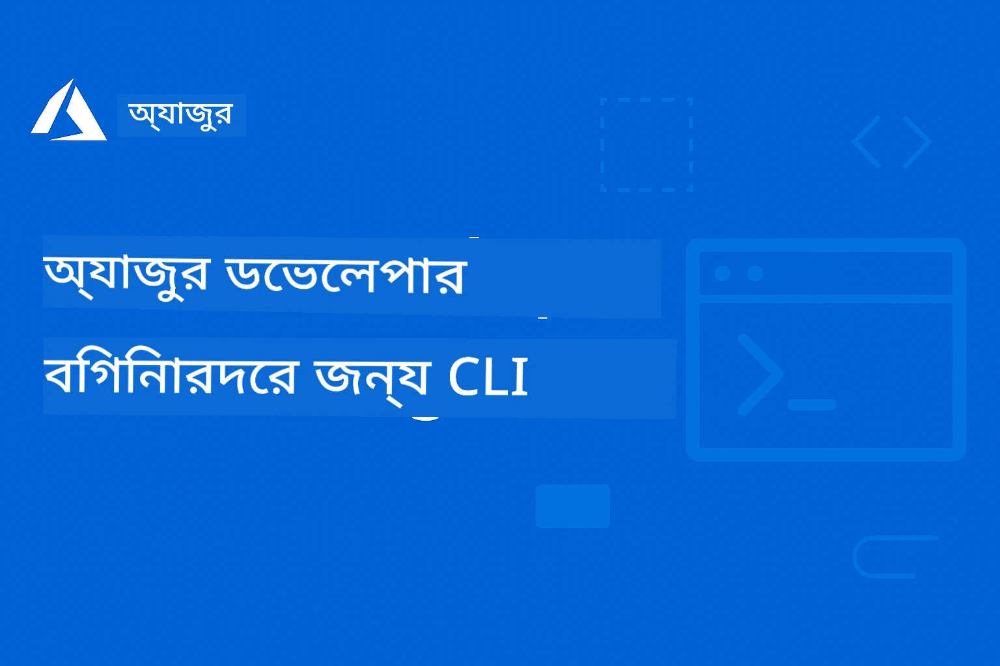

# AZD নবীনদের জন্য: একটি কাঠামোগত শেখার যাত্রা

 

[](https://GitHub.com/microsoft/azd-for-beginners/watchers/)
[](https://GitHub.com/microsoft/azd-for-beginners/network/)
[](https://GitHub.com/microsoft/azd-for-beginners/stargazers/)

[](https://discord.com/invite/nkVh3dp)
[](https://discord.gg/nTYy5BXMWG)

---

### স্বয়ংক্রিয় অনুবাদসমূহ (সব সময় আপ-টু-ডেট)

<!-- CO-OP TRANSLATOR LANGUAGES TABLE START -->
[আরবি](../ar/README.md) | [বাংলা](./README.md) | [বুলগেরীয়](../bg/README.md) | [বার্মিজ (মায়ানমার)](../my/README.md) | [চীনা (সরলীকৃত)](../zh-CN/README.md) | [চীনা (প্রথাগত, হং কং)](../zh-HK/README.md) | [চীনা (প্রথাগত, ম্যাকাও)](../zh-MO/README.md) | [চীনা (প্রথাগত, তাইওয়ান)](../zh-TW/README.md) | [ক্রোয়েশীয়](../hr/README.md) | [চেক](../cs/README.md) | [ড্যানিশ](../da/README.md) | [ডাচ](../nl/README.md) | [এস্থোনীয়](../et/README.md) | [ফিনিশ](../fi/README.md) | [ফরাসি](../fr/README.md) | [জার্মান](../de/README.md) | [গ্রিক](../el/README.md) | [হিব্রু](../he/README.md) | [হিন্দি](../hi/README.md) | [হাঙ্গেরীয়](../hu/README.md) | [ইন্দোনেশীয়](../id/README.md) | [ইতালিয়ান](../it/README.md) | [জাপানি](../ja/README.md) | [কন্নড়](../kn/README.md) | [খমের](../km/README.md) | [কোরিয়ান](../ko/README.md) | [লিথুয়ানিয়ান](../lt/README.md) | [মালায়](../ms/README.md) | [মালয়ালাম](../ml/README.md) | [মরাঠি](../mr/README.md) | [নেপালি](../ne/README.md) | [নাইজেরিয়ান পিডগিন](../pcm/README.md) | [নরওয়েজীয়](../no/README.md) | [ফার্সি (পার্সিয়ান)](../fa/README.md) | [পোলিশ](../pl/README.md) | [পোর্তুগিজ (ব্রাজিল)](../pt-BR/README.md) | [পোর্তুগিজ (পর্তুগাল)](../pt-PT/README.md) | [পাঞ্জাবি (গুরমুখি)](../pa/README.md) | [রোমানিয়ান](../ro/README.md) | [রাশিয়ান](../ru/README.md) | [সার্বিয়ান (সিরিলিক)](../sr/README.md) | [স্লোভাক](../sk/README.md) | [স্লোভেনীয়](../sl/README.md) | [স্প্যানিশ](../es/README.md) | [সোয়াহিলি](../sw/README.md) | [সুইডিশ](../sv/README.md) | [তাগালোগ (ফিলিপিনো)](../tl/README.md) | [তামিল](../ta/README.md) | [তেলুগু](../te/README.md) | [থাই](../th/README.md) | [তুর্কি](../tr/README.md) | [ইউক্রেনীয়](../uk/README.md) | [উর্দু](../ur/README.md) | [ভিয়েতনামি](../vi/README.md)

> **লোকালি ক্লোন করতে চান?**
>
> এই রিপোজিটোরিতে 50+ ভাষার অনুবাদ রয়েছে যা ডাউনলোড সাইজ উল্লেখযোগ্যভাবে বাড়ায়। অনুবাদ ব্যতীত ক্লোন করতে sparse checkout ব্যবহার করুন:
>
> **Bash / macOS / Linux:**
> ```bash
> git clone --filter=blob:none --sparse https://github.com/microsoft/AZD-for-beginners.git
> cd AZD-for-beginners
> git sparse-checkout set --no-cone '/*' '!translations' '!translated_images'
> ```
>
> **CMD (Windows):**
> ```cmd
> git clone --filter=blob:none --sparse https://github.com/microsoft/AZD-for-beginners.git
> cd AZD-for-beginners
> git sparse-checkout set --no-cone "/*" "!translations" "!translated_images"
> ```
>
> এটি আপনাকে দ্রুত ডাউনলোডের সাথে কোর্স সম্পন্ন করতে যা যা দরকার তা দেবে।
<!-- CO-OP TRANSLATOR LANGUAGES TABLE END -->

## 🆕 আজ azd-এ What's New

Azure Developer CLI শুধুমাত্র প্রচলিত ওয়েব অ্যাপ এবং API-এর বাইরে বেড়েছে। আজ, azd হল Azure-এ সাবধানভাবে যে কোনো অ্যাপ্লিকেশন ডিপ্লয় করার একক টুল—এতে AI-চালিত অ্যাপ্লিকেশন এবং বুদ্ধিমান এজেন্টও অন্তর্ভুক্ত।

এর মানে আপনার জন্য:

- **AI এজেন্টগুলো এখন azd-এর প্রথম-শ্রেণীর ওয়ার্কলোড।** আপনি একই `azd init` → `azd up` ওয়ার্কফ্লো ব্যবহার করে AI এজেন্ট প্রকল্প ইনিশিয়ালাইজ, ডিপ্লয় এবং পরিচালনা করতে পারবেন।
- **Microsoft Foundry ইন্টিগ্রেশন** টেমপ্লেট ইকোসিস্টেমে সরাসরি মডেল ডিপ্লয়মেন্ট, এজেন্ট হোস্টিং এবং AI সার্ভিস কনফিগারেশন নিয়ে আসে।
- **মূল ওয়ার্কফ্লো পরিবর্তন হয়নি।** আপনি একটি টুডো অ্যাপ, একটি মাইক্রোসার্ভিস বা একটি মাল্টি-এজেন্ট AI সল্যুশন ডিপ্লয় করুন না কেন, কমান্ডগুলো একই।

আপনি যদি আগেই azd ব্যবহার করে থাকেন, তাহলে AI সাপোর্ট একটি স্বাভাবিক এক্সটেনশন—কোনো আলাদা টুল বা উন্নত ট্র্যাক নয়। আপনি যদি নতুন শুরু করেন, তবে আপনি একটাই ওয়ার্কফ্লো শিখবেন যা সব কাজেই কার্যকর।

---

## 🚀 Azure Developer CLI (azd) কী?

**Azure Developer CLI (azd)** হল একটি ডেভেলপার-বন্ধুভাবাপন্ন কমান্ড-লাইন টুল যা Azure-এ অ্যাপ্লিকেশন ডিপ্লয় করা সহজ করে তোলে। ডজনগুলো Azure রিসোর্স ম্যানুয়ালি তৈরি এবং সংযুক্ত করার পরিবর্তে, আপনি একক কমান্ডে সম্পূর্ণ অ্যাপ্লিকেশন ডিপ্লয় করতে পারেন।

### `azd up`-এর জাদু

```bash
# এই একক কমান্ড সব কিছুর কাজ করে:
# ✅ সব Azure রিসোর্স তৈরি করে
# ✅ নেটওয়ার্কিং এবং সিকিউরিটি কনফিগার করে
# ✅ আপনার অ্যাপ্লিকেশন কোড তৈরি করে
# ✅ Azure-এ ডিপ্লয় করে
# ✅ একটি কাজ করা URL প্রদান করে
azd up
```

**এটাই!** Azure পোর্টালে ক্লিক করার দরকার নেই, কোনো জটিল ARM টেমপ্লেট প্রথমে শিখতে হবে না, কোনো ম্যানুয়াল কনফিগারেশন নয় — কেবল Azure-এ কাজকারী অ্যাপ্লিকেশন।

---

## ❓ Azure Developer CLI বনাম Azure CLI: পার্থক্য কী?

এটি নবীনরা সবচেয়ে বেশি জিজ্ঞাসা করে। সহজ উত্তর নিচে:

| বৈশিষ্ট্য | **Azure CLI (`az`)** | **Azure Developer CLI (`azd`)** |
|---------|---------------------|--------------------------------|
| **উদ্দেশ্য** | পৃথক Azure রিসোর্স পরিচালনা করা | সম্পূর্ণ অ্যাপ্লিকেশন ডিপ্লয় করা |
| **চিন্তাধারা** | ইনফ্রাসট্রাকচার-কেন্দ্রিক | অ্যাপ্লিকেশন-কেন্দ্রিক |
| **উদাহরণ** | `az webapp create --name myapp...` | `azd up` |
| **শিখার বাঁক** | Azure সার্ভিসগুলো জানতে হবে | কেবল আপনার অ্যাপ জানতে হবে |
| **সেরা জন্য** | DevOps, ইনফ্রাসট্রাকচার | ডেভেলপার, প্রোটোটাইপিং |

### সরল উপমা

- **Azure CLI** এমন যেন আপনার কাছে বাড়ি বানানোর জন্য সব সরঞ্জাম আছে — হাতুড়ি, করাত, পেরেক। আপনি যা খুশি বানাতে পারবেন, কিন্তু নির্মাণ সম্পর্কে জানতে হবে।
- **Azure Developer CLI** এমন যেন আপনি একজন কনট্রাক্টর নেন — আপনি জানিয়ে দেন আপনি কি চান, তারা নির্মাণ সামলায়।

### কোনটা কখন ব্যবহার করবেন

| পরিস্থিতি | এটি ব্যবহার করুন |
|----------|----------|
| "আমি দ্রুত আমার ওয়েব অ্যাপ ডিপ্লয় করতে চাই" | `azd up` |
| "আমাকে কেবল একটি স্টোরেজ অ্যাকাউন্ট তৈরি করতে হবে" | `az storage account create` |
| "আমি একটি পূর্ণ AI অ্যাপ্লিকেশন তৈরি করছি" | `azd init --template azure-search-openai-demo` |
| "আমাকে একটি নির্দিষ্ট Azure রিসোর্স ডিবাগ করতে হবে" | `az resource show` |
| "আমি মিনিটের মধ্যে প্রোডাকশন-রেডি ডিপ্লয় চাই" | `azd up --environment production` |

### এগুলো একসাথে কাজ করে!

AZD ভিতরে Azure CLI ব্যবহার করে। আপনি উভয়ই ব্যবহার করতে পারেন:
```bash
# AZD এর সাথে আপনার অ্যাপ ডিপ্লয় করুন
azd up

# তারপর Azure CLI এর মাধ্যমে নির্দিষ্ট রিসোর্সগুলি সূক্ষ্মভাবে সামঞ্জস্য করুন
az webapp config set --name myapp --always-on true
```

---

## 🌟 Awesome AZD-এ টেমপ্লেট খুঁজুন

শূন্য থেকে শুরু করবেন না! **Awesome AZD** হলো সম্প্রদায়-সংকলিত রেডি-টু-ডিপ্লয় টেমপ্লেটের সংগ্রহ:

| রিসোর্স | বর্ণনা |
|----------|-------------|
| 🔗 [**Awesome AZD Gallery**](https://azure.github.io/awesome-azd/) | এক-ক্লিকে ডিপ্লয়ের সাথে 200+ টেমপ্লেট ব্রাউজ করুন |
| 🔗 [**Submit a Template**](https://github.com/Azure/awesome-azd/issues) | আপনার টেমপ্লেটটি সম্প্রদায়ে যোগ করুন |
| 🔗 [**GitHub Repository**](https://github.com/Azure/awesome-azd) | সোর্সে স্টার দিন এবং অন্বেষণ করুন |

### Awesome AZD-এ জনপ্রিয় AI টেমপ্লেটসমূহ

```bash
# মাইক্রোসফট ফাউন্ড্রি মডেল + AI অনুসন্ধানের সাথে RAG চ্যাট
azd init --template azure-search-openai-demo

# দ্রুত AI চ্যাট অ্যাপ্লিকেশন
azd init --template openai-chat-app-quickstart

# ফাউন্ড্রি এজেন্ট সহ AI এজেন্টসমূহ
azd init --template get-started-with-ai-agents
```

---

## 🎯 3 ধাপে শুরু করা

শুরু করার আগে, আপনার মেশিনটি যে টেমপ্লেটটি আপনি ডিপ্লয় করতে চান সেটির জন্য প্রস্তুত আছে কিনা নিশ্চিত করুন:

**Windows:**
```powershell
.\validate-setup.ps1
```

**macOS / Linux:**
```bash
bash ./validate-setup.sh
```

যদি কোনো প্রয়োজনীয় চেক ব্যর্থ হয়, প্রথমে তা ঠিক করুন এবং তারপর দ্রুত শুরু করুন।

### ধাপ 1: AZD ইনস্টল করুন (২ মিনিট)

**Windows:**
```powershell
winget install microsoft.azd
```

**macOS:**
```bash
brew tap azure/azd && brew install azd
```

**Linux:**
```bash
curl -fsSL https://aka.ms/install-azd.sh | bash
```

### ধাপ 2: AZD-এর জন্য প্রমাণীকরণ (Authenticate)

```bash
# ঐচ্ছিক, যদি আপনি এই কোর্সে সরাসরি Azure CLI কমান্ড ব্যবহার করার পরিকল্পনা করেন
az login

# AZD ওয়ার্কফ্লোগুলোর জন্য আবশ্যক
azd auth login
```

আপনি যদি নিশ্চিত না হন কোনটি দরকার, তাহলে [Installation & Setup](docs/chapter-01-foundation/installation.md#authentication-setup) এ সম্পূর্ণ সেটআপ ফ্লো অনুসরণ করুন।

### ধাপ 3: আপনার প্রথম অ্যাপ ডিপ্লয় করুন

```bash
# একটি টেম্পলেট থেকে আরম্ভ করুন
azd init --template todo-nodejs-mongo

# আজুরে মোতায়েন করুন (সবকিছু তৈরি করে!)
azd up
```

**🎉 এটাই!** আপনার অ্যাপ এখন Azure-এ লাইভ।

### ক্লিন আপ (ভুলে যেয়েন না!)

```bash
# Remove all resources when done experimenting
azd down --force --purge
```

---

## 📚 এই কোর্সটি কীভাবে ব্যবহার করবেন

এই কোর্সটি **ক্রমবর্ধমান শেখার** জন্য ডিজাইন করা হয়েছে - যেখানে আপনি আরামদায়ক সেখানে থেকে শুরু করুন এবং ধাপে ধাপে উপরে উঠুন:

| আপনার অভিজ্ঞতা | এখান থেকে শুরু করুন |
|-----------------|------------|
| **Azure-এ একেবারে নতুন** | [অধ্যায় ১: ভিত্তি](#-chapter-1-foundation--quick-start) |
| **Azure জানেন, AZD নতুন** | [অধ্যায় ১: ভিত্তি](#-chapter-1-foundation--quick-start) |
| **AI অ্যাপ ডিপ্লয় করতে চান** | [অধ্যায় ২: AI-ফার্স্ট ডেভেলপমেন্ট](#-chapter-2-ai-first-development-recommended-for-ai-developers) |
| **হ্যাণ্ডস-অন অনুশীলন চান** | [🎓 ইন্টারেক্টিভ ওয়ার্কশপ](workshop/README.md) - ৩-৪ ঘন্টার গাইডেড ল্যাব |
| **প্রোডাকশন প্যাটার্ন দরকার** | [অধ্যায় ৮: প্রোডাকশন ও এন্টারপ্রাইজ](#-chapter-8-production--enterprise-patterns) |

### দ্রুত সেটআপ

1. **এই রিপোজিটোরি Fork করুন**: [](https://GitHub.com/microsoft/azd-for-beginners/fork)
2. **ক্লোন করুন**: `git clone https://github.com/YOUR-USERNAME/azd-for-beginners.git`
3. **সাহায্য পান**: [Azure Discord Community](https://discord.com/invite/ByRwuEEgH4)

> **লোকালি ক্লোন করতে চান?**
>
> এই রিপোজিটোরিতে 50+ ভাষার অনুবাদ রয়েছে যা ডাউনলোড সাইজ উল্লেখযোগ্যভাবে বাড়ায়। অনুবাদ ছাড়া ক্লোন করতে sparse checkout ব্যবহার করুন:
> ```bash
> git clone --filter=blob:none --sparse https://github.com/microsoft/AZD-for-beginners.git
> cd AZD-for-beginners
> git sparse-checkout set --no-cone '/*' '!translations' '!translated_images'
> ```
> এটি আপনাকে দ্রুত ডাউনলোডের সাথে কোর্স সম্পন্ন করতে যা যা দরকার তা দেবে।


## কোর্স ওভারভিউ

কাঠামোবদ্ধ অধ্যায়গুলোর মাধ্যমে Azure Developer CLI (azd) মাস্টার করুন যা ক্রমবর্ধমান শেখার জন্য ডিজাইন করা। **Microsoft Foundry ইন্টিগ্রেশনের মাধ্যমে AI অ্যাপ্লিকেশন ডিপ্লয়মেন্টে বিশেষ গুরুত্ব।**

### কেন এই কোর্সটি আধুনিক ডেভেলপারদের জন্য অত্যাবশ্যক

Microsoft Foundry Discord সম্প্রদায়ের অভিব্যক্তির উপর ভিত্তি করে, **45% ডেভেলপার AZD-কে AI ওয়ার্কলোডের জন্য ব্যবহার করতে চান** কিন্তু নিম্নলিখিত সমস্যার সম্মুখীন হন:
- জটিল মাল্টি-সার্ভিস AI আর্কিটেকচার
- প্রোডাকশন AI ডিপ্লয়ের সেরা অনুশীলনসমূহ  
- Azure AI সার্ভিস ইন্টিগ্রেশন ও কনফিগারেশন
- AI ওয়ার্কলোডের জন্য খরচ অপ্টিমাইজেশন
- AI-সংক্রান্ত ডিপ্লয়মেন্ট সমস্যা সমাধান

### শেখার লক্ষ্যসমূহ

এই কাঠামোবদ্ধ কোর্স সম্পন্ন করে, আপনি পারবেন:
- **AZD মৌলিক বিষয়গুলো আয়ত্ত করা**: কোর ধারণা, ইনস্টলেশন, এবং কনফিগারেশন
- **AI অ্যাপলিকেশন ডিপ্লয় করা**: Microsoft Foundry সার্ভিসগুলোর সাথে AZD ব্যবহার করে
- **Infrastructure as Code বাস্তবায়ন করা**: Bicep টেমপ্লেট দিয়ে Azure রিসোর্স পরিচালনা
- **ডিপ্লয়মেন্টসমূহ ক্লিয়ার করা**: সাধারণ সমস্যা সমাধান এবং ডিবাগ করা
- **প্রোডাকশনের জন্য অপ্টিমাইজ করা**: সিকিউরিটি, স্কেলিং, মনিটরিং, এবং খরচ ব্যবস্থাপনা
- **মাল্টি-এজেন্ট সল্যুশন নির্মাণ করা**: জটিল AI আর্কিটেকচার ডিপ্লয় করা

## শুরু করার আগে: অ্যাকাউন্ট, অ্যাক্সেস, এবং অনুমানসমূহ

অধ্যায় ১ শুরু করার আগে নিশ্চিত করুন যে নীচের জিনিসগুলো আপনার কাছে আছে। এই গাইডের পরে দেয়া ইনস্টলেশন ধাপগুলো ধরে নেয় যে এই মৌলিক বিষয়গুলো ইতিমধ্যেই রয়েছে।
- **একটি Azure সাবস্ক্রিপশন**: আপনি কাজের সাবস্ক্রিপশন বা নিজের অ্যাকাউন্ট থেকে বিদ্যমান একটি সাবস্ক্রিপশন ব্যবহার করতে পারেন, অথবা শুরু করতে একটি [ফ্রি ট্রায়াল](https://aka.ms/azurefreetrial) তৈরি করতে পারেন।
- **Azure রিসোর্স তৈরি করার অনুমতি**: বেশিরভাগ অনুশীলনের জন্য, লক্ষ্য সাবস্ক্রিপশন বা রিসোর্স গ্রুপে আপনার কমপক্ষে **Contributor** অ্যাক্সেস থাকা উচিত। কিছু অধ্যায় রিসোর্স গ্রুপ, managed identities, এবং RBAC অ্যাসাইনমেন্ট তৈরি করতে পারার অনুমানও করতে পারে।
- [**একটি GitHub অ্যাকাউন্ট**](https://github.com): রেপোজিটরিটি fork করা, আপনার নিজের পরিবর্তন ট্র্যাক করা, এবং ওয়ার্কশপের জন্য GitHub Codespaces ব্যবহার করার জন্য এটি উপকারী।
- **টেমপ্লেট রানটাইম পূর্বশর্তসমূহ**: কিছু টেমপ্লেটে Node.js, Python, Java, বা Docker-এর মতো লোকাল টুলসের প্রয়োজন হতে পারে। শুরু করার আগে setup validator চালান যাতে অনুপস্থিত টুলগুলো আগে থেকেই ধরা পড়ে।
- **বেসিক টার্মিনাল পরিচিতি**: আপনাকে বিশেষজ্ঞ হতে হবে না, তবে `git clone`, `azd auth login`, এবং `azd up` এর মতো কমান্ড চালাতে স্বাচ্ছন্দ্য বোধ করা উচিত।

> **এন্টারপ্রাইজ সাবস্ক্রিপশনে কাজ করছেন?**
> যদি আপনার Azure পরিবেশ কোনো অ্যাডমিনিস্ট্রেটরের মাধ্যমে পরিচালিত হয়, তাহলে আগেই নিশ্চিত করুন যে আপনি যে সাবস্ক্রিপশন বা রিসোর্স গ্রুপটি ব্যবহার করতে যাচ্ছেন সেখানে আপনি রিসোর্স ডেপ্লয় করতে পারবেন। যদি না পারেন, শুরু করার আগে একটি স্যান্ডবক্স সাবস্ক্রিপশন অথবা Contributor অ্যাক্সেস চাইতে বলুন।

> **Azure-এ নতুন?**
> আপনার নিজের Azure ট্রায়াল বা pay-as-you-go সাবস্ক্রিপশন https://aka.ms/azurefreetrial এ শুরু করুন যাতে আপনি টেন্যান্ট-লেভেল অনুমোদনের অপেক্ষায় না থেকে অনুশীলনগুলো শুরু থেকে শেষ পর্যন্ত সম্পন্ন করতে পারেন।

## 🗺️ কোর্স মানচিত্র: অধ্যায় অনুযায়ী দ্রুত নেভিগেশন

প্রতিটি অধ্যায়ের জন্য শেখার উদ্দেশ্য, দ্রুত শুরু নির্দেশ এবং অনুশীলনসহ একটি নিবেদিত README রয়েছে:

| অধ্যায় | বিষয় | পাঠ | সময়কাল | জটিলতা |
|---------|-------|---------|----------|------------|
| **[অধ্যায় ১: ভিত্তি](docs/chapter-01-foundation/README.md)** | শুরু করা | [AZD মৌলিক](docs/chapter-01-foundation/azd-basics.md) &#124; [ইনস্টলেশন](docs/chapter-01-foundation/installation.md) &#124; [প্রথম প্রকল্প](docs/chapter-01-foundation/first-project.md) | 30-45 মিনিট | ⭐ |
| **[অধ্যায় ২: AI Development](docs/chapter-02-ai-development/README.md)** | এআই-প্রথম অ্যাপ | [Foundry একীকরণ](docs/chapter-02-ai-development/microsoft-foundry-integration.md) &#124; [AI এজেন্ট](docs/chapter-02-ai-development/agents.md) &#124; [মডেল ডিপ্লয়মেন্ট](docs/chapter-02-ai-development/ai-model-deployment.md) &#124; [ওয়ার্কশপ](docs/chapter-02-ai-development/ai-workshop-lab.md) | 1-2 ঘন্টা | ⭐⭐ |
| **[অধ্যায় ৩: কনফিগারেশন](docs/chapter-03-configuration/README.md)** | প্রমাণীকরণ ও নিরাপত্তা | [কনফিগারেশন](docs/chapter-03-configuration/configuration.md) &#124; [প্রমাণীকরণ ও নিরাপত্তা](docs/chapter-03-configuration/authsecurity.md) | 45-60 মিনিট | ⭐⭐ |
| **[অধ্যায় ৪: অবকাঠামো](docs/chapter-04-infrastructure/README.md)** | IaC & ডেপ্লয়মেন্ট | [ডেপ্লয়মেন্ট গাইড](docs/chapter-04-infrastructure/deployment-guide.md) &#124; [প্রোভিশনিং](docs/chapter-04-infrastructure/provisioning.md) | 1-1.5 ঘন্টা | ⭐⭐⭐ |
| **[অধ্যায় ৫: মাল্টি-এজেন্ট](docs/chapter-05-multi-agent/README.md)** | এআই এজেন্ট সমাধান | [রিটেইল সিনারিও](examples/retail-scenario.md) &#124; [সমন্বয় প্যাটার্ন](docs/chapter-06-pre-deployment/coordination-patterns.md) | 2-3 ঘন্টা | ⭐⭐⭐⭐ |
| **[অধ্যায় ৬: প্রি-ডেপ্লয়মেন্ট](docs/chapter-06-pre-deployment/README.md)** | পরিকল্পনা ও যাচাইকরণ | [প্রীফ্লাইট চেক](docs/chapter-06-pre-deployment/preflight-checks.md) &#124; [ক্ষমতা পরিকল্পনা](docs/chapter-06-pre-deployment/capacity-planning.md) &#124; [SKU নির্বাচন](docs/chapter-06-pre-deployment/sku-selection.md) &#124; [অ্যাপ ইনসাইটস](docs/chapter-06-pre-deployment/application-insights.md) | 1 ঘন্টা | ⭐⭐ |
| **[অধ্যায় ৭: ট্রাবলশুটিং](docs/chapter-07-troubleshooting/README.md)** | ডিবাগ & ফিক্স | [সাধারণ সমস্যা](docs/chapter-07-troubleshooting/common-issues.md) &#124; [ডিবাগিং](docs/chapter-07-troubleshooting/debugging.md) &#124; [এআই সমস্যা](docs/chapter-07-troubleshooting/ai-troubleshooting.md) | 1-1.5 ঘন্টা | ⭐⭐ |
| **[অধ্যায় ৮: প্রোডাকশন](docs/chapter-08-production/README.md)** | এন্টারপ্রাইজ প্যাটার্ন | [প্রোডাকশন প্রাকটিস](docs/chapter-08-production/production-ai-practices.md) | 2-3 ঘন্টা | ⭐⭐⭐⭐ |
| **[🎓 ওয়ার্কশপ](workshop/README.md)** | হাতেকলমে ল্যাব | [পরিচিতি](workshop/docs/instructions/0-Introduction.md) &#124; [নির্বাচন](workshop/docs/instructions/1-Select-AI-Template.md) &#124; [যাচাইকরণ](workshop/docs/instructions/2-Validate-AI-Template.md) &#124; [ডিকনস্ট্রাকশন](workshop/docs/instructions/3-Deconstruct-AI-Template.md) &#124; [কনফিগারেশন](workshop/docs/instructions/4-Configure-AI-Template.md) &#124; [কাস্টমাইজেশন](workshop/docs/instructions/5-Customize-AI-Template.md) &#124; [টিয়ারডাউন](workshop/docs/instructions/6-Teardown-Infrastructure.md) &#124; [সমাপন](workshop/docs/instructions/7-Wrap-up.md) | 3-4 ঘন্টার মধ্যে | ⭐⭐ |

**মোট কোর্স সময়কাল:** ~10-14 ঘন্টা | **দক্ষতার অগ্রগতি:** Beginner → Production-Ready

---

## 📚 শেখার অধ্যায়সমূহ

*আপনার অভিজ্ঞতা এবং লক্ষ্য অনুসারে শেখার পথ নির্বাচন করুন*

### 🚀 অধ্যায় 1: ভিত্তি ও দ্রুত শুরু
**প্রয়োজনীয়তা**: Azure সাবস্ক্রিপশন, টার্মিনালে মৌলিক জ্ঞান  
**সময়কাল**: 30-45 মিনিট  
**জটিলতা**: ⭐

#### আপনি যা শিখবেন
- Azure Developer CLI-এর মৌলিক ধারণা বোঝা
- আপনার প্ল্যাটফর্মে AZD ইনস্টল করা
- আপনার প্রথম সফল ডেপ্লয়মেন্ট

#### শেখার উপকরণ
- **🎯 এখান থেকে শুরু করুন**: [Azure Developer CLI কী?](#what-is-azure-developer-cli)
- **📖 তত্ত্ব**: [AZD মৌলিক](docs/chapter-01-foundation/azd-basics.md) - মূল ধারণা ও পরিভাষা
- **⚙️ সেটআপ**: [ইনস্টলেশন ও সেটআপ](docs/chapter-01-foundation/installation.md) - প্ল্যাটফর্ম-নির্দিষ্ট গাইড
- **🛠️ হাতেকলমে**: [আপনার প্রথম প্রকল্প](docs/chapter-01-foundation/first-project.md) - ধাপে ধাপে টিউটোরিয়াল
- **📋 দ্রুত রেফারেন্স**: [কমান্ড চিট শিট](resources/cheat-sheet.md)

#### ব্যবহারিক অনুশীলন
```bash
# দ্রুত ইনস্টলেশন যাচাই
azd version

# আপনার প্রথম অ্যাপ্লিকেশন মোতায়েন করুন
azd init --template todo-nodejs-mongo
azd up
```

**💡 অধ্যায়ের ফলাফল**: AZD ব্যবহার করে Azure-এ একটি সহজ ওয়েব অ্যাপ সফলভাবে ডেপ্লয় করতে সক্ষম হওয়া

**✅ সাফল্য যাচাই:**
```bash
# অধ্যায় ১ শেষ করার পরে, আপনি সক্ষম হবেন:
azd version              # ইনস্টল করা সংস্করণ প্রদর্শন করে
azd init --template todo-nodejs-mongo  # প্রকল্প আরম্ভ করে
azd up                  # Azure-এ স্থাপন করে
azd show                # চলমান অ্যাপের URL প্রদর্শন করে
# অ্যাপ্লিকেশন ব্রাউজারে খুলে এবং কাজ করে
azd down --force --purge  # রিসোর্সগুলো পরিষ্কার করে
```

**📊 সময় বিনিয়োগ:** 30-45 মিনিট  
**📈 পরে দক্ষতার স্তর:** স্বাধীনভাবে ভিত্তি সমর্থনযোগ্য অ্যাপ্লিকেশন ডেপ্লয় করতে পারে  
**📈 পরে দক্ষতার স্তর:** স্বাধীনভাবে ভিত্তি সমর্থনযোগ্য অ্যাপ্লিকেশন ডেপ্লয় করতে পারে

---

### 🤖 অধ্যায় 2: AI-প্রথম ডেভেলপমেন্ট (AI ডেভেলপারদের জন্য সুপারিশকৃত)
**প্রয়োজনীয়তা**: অধ্যায় 1 সমাপ্ত  
**সময়কাল**: 1-2 ঘন্টা  
**জটিলতা**: ⭐⭐

#### আপনি যা শিখবেন
- AZD-র সঙ্গে Microsoft Foundry একীকরণ
- AI-চালিত অ্যাপ্লিকেশন ডেপ্লয় করা
- AI সার্ভিস কনফিগারেশনগুলো বোঝা

#### শেখার উপকরণ
- **🎯 এখান থেকে শুরু করুন**: [Microsoft Foundry একীকরণ](docs/chapter-02-ai-development/microsoft-foundry-integration.md)
- **🤖 AI এজেন্ট**: [AI এজেন্ট গাইড](docs/chapter-02-ai-development/agents.md) - AZD দিয়ে ইন্টেলিজেন্ট এজেন্ট ডেপ্লয় করা
- **📖 প্যাটার্ন**: [AI মডেল ডিপ্লয়মেন্ট](docs/chapter-02-ai-development/ai-model-deployment.md) - AI মডেল ডেপ্লয় ও পরিচালনা
- **🛠️ ওয়ার্কশপ**: [AI ওয়ার্কশপ ল্যাব](docs/chapter-02-ai-development/ai-workshop-lab.md) - আপনার AI সমাধিগুলো AZD-র জন্য প্রস্তুত করা
- **🎥 ইন্টারেক্টিভ গাইড**: [ওয়ার্কশপ উপকরণ](workshop/README.md) - MkDocs * DevContainer Environment সহ ব্রাউজার-ভিত্তিক শেখা
- **📋 টেমপ্লেটস**: [Microsoft Foundry টেমপ্লেট](#কর্মশালা-সম্পদ)
- **📝 উদাহরণ**: [AZD ডেপ্লয়মেন্ট উদাহরণসমূহ](examples/README.md)

#### ব্যবহারিক অনুশীলন
```bash
# আপনার প্রথম এআই অ্যাপ্লিকেশন মোতায়েন করুন
azd init --template azure-search-openai-demo
azd up

# অতিরিক্ত এআই টেমপ্লেটগুলো চেষ্টা করুন
azd init --template openai-chat-app-quickstart
azd init --template agent-openai-python-prompty
```

**💡 অধ্যায়ের ফলাফল**: RAG সক্ষমতা সহ একটি AI-চালিত চ্যাট অ্যাপ্লিকেশন ডেপ্লয় ও কনফিগার করা

**✅ সাফল্য যাচাই:**
```bash
# অধ্যায় ২-এর পরে, আপনি সক্ষম হবেন:
azd init --template azure-search-openai-demo
azd up
# AI চ্যাট ইন্টারফেস পরীক্ষা করুন
# প্রশ্ন জিজ্ঞাসা করুন এবং সূত্রসহ AI-চালিত উত্তর পান
# যাচাই করুন যে সার্চ ইন্টিগ্রেশন কাজ করছে
azd monitor  # পরীক্ষা করুন যে Application Insights টেলিমেট্রি দেখাচ্ছে
azd down --force --purge
```

**📊 সময় বিনিয়োগ:** 1-2 ঘন্টা  
**📈 পরে দক্ষতার স্তর:** প্রোডাকশন-রেডি AI অ্যাপ্লিকেশন ডেপ্লয় ও কনফিগার করতে পারে  
**💰 খরচ সচেতনতা:** $80-150/মাস ডেভ খরচ, $300-3500/মাস প্রোডাকশন খরচ সম্পর্কে ধারণা রাখুন

#### 💰 AI ডেপ্লয়মেন্টের জন্য খরচ বিবেচনা

**উন্নয়ন পরিবেশ (প্রাক্কলিত $80-150/মাস):**
- Microsoft Foundry Models (Pay-as-you-go): $0-50/মাস (token ব্যবহার অনুযায়ী)
- AI Search (Basic tier): $75/মাস
- Container Apps (Consumption): $0-20/মাস
- Storage (Standard): $1-5/মাস

**প্রোডাকশন পরিবেশ (প্রাক্কলিত $300-3,500+/মাস):**
- Microsoft Foundry Models (সামঞ্জস্যপূর্ণ পারফরম্যান্সের জন্য PTU): $3,000+/মাস অথবা উচ্চ ভলিউমে Pay-as-you-go
- AI Search (Standard tier): $250/মাস
- Container Apps (Dedicated): $50-100/মাস
- Application Insights: $5-50/মাস
- Storage (Premium): $10-50/মাস

**💡 খরচ অপ্টিমাইজেশনের টিপস:**
- শেখার জন্য **Free Tier** Microsoft Foundry Models ব্যবহার করুন (Azure OpenAI 50,000 tokens/মাস অন্তর্ভুক্ত)
- সক্রিয়ভাবে ডেভেলপ করা না হলে রিসোর্সগুলো deallocate করতে `azd down` চালান
- প্রাথমিকভাবে consumption-based বিলিং ব্যবহার করুন, শুধুমাত্র প্রোডাকশনের জন্য PTU-তে আপগ্রেড করুন
- ডেপ্লয়মেন্টের আগে খরচ আন্দাজ করতে `azd provision --preview` চালান
- অটো-স্কেলিং সক্ষম করুন: কেবল বাস্তব ব্যবহার অনুযায়ী পারিশ্রমিক দিন

**কস্ট মনিটরিং:**
```bash
# অনুমানকৃত মাসিক খরচ পরীক্ষা করুন
azd provision --preview

# Azure পোর্টালে প্রকৃত খরচ পর্যবেক্ষণ করুন
az consumption budget list --resource-group <your-rg>
```

---

### ⚙️ অধ্যায় 3: কনফিগারেশন ও প্রমাণীকরণ
**প্রয়োজনীয়তা**: অধ্যায় 1 সমাপ্ত  
**সময়কাল**: 45-60 মিনিট  
**জটিলতা**: ⭐⭐

#### আপনি যা শিখবেন
- পরিবেশ কনফিগারেশন ও ব্যবস্থাপনা
- প্রমাণীকরণ ও নিরাপত্তার সেরা অনুশীলন
- রিসোর্স নামকরণ ও সংগঠন

#### শেখার উপকরণ
- **📖 কনফিগারেশন**: [কনফিগারেশন গাইড](docs/chapter-03-configuration/configuration.md) - পরিবেশ সেটআপ
- **🔐 নিরাপত্তা**: [প্রমাণীকরণ প্যাটার্ন ও managed identity](docs/chapter-03-configuration/authsecurity.md) - প্রমাণীকরণ প্যাটার্ন
- **📝 উদাহরণ**: [ডাটাবেস অ্যাপ উদাহরণ](examples/database-app/README.md) - AZD ডাটাবেস উদাহরণ

#### ব্যবহারিক অনুশীলন
- একাধিক পরিবেশ কনফিগার করা (dev, staging, prod)
- managed identity প্রমাণীকরণ সেটআপ করা
- পরিবেশ-নির্দিষ্ট কনফিগারেশন বাস্তবায়ন করা

**💡 অধ্যায়ের ফলাফল**: সঠিক প্রমাণীকরণ ও নিরাপত্তা সহ একাধিক পরিবেশ পরিচালনা করা

---

### 🏗️ অধ্যায় 4: অবকাঠামো কোড হিসেবে & ডেপ্লয়মেন্ট
**প্রয়োজনীয়তা**: অধ্যায় 1-3 সমাপ্ত  
**সময়কাল**: 1-1.5 ঘন্টা  
**জটিলতা**: ⭐⭐⭐

#### আপনি যা শিখবেন
- উন্নত ডেপ্লয়মেন্ট প্যাটার্ন
- Bicep ব্যবহার করে Infrastructure as Code
- রিসোর্স প্রোভিশনিং কৌশল

#### শেখার উপকরণ
- **📖 ডেপ্লয়মেন্ট**: [ডেপ্লয়মেন্ট গাইড](docs/chapter-04-infrastructure/deployment-guide.md) - সম্পূর্ণ ওয়ার্কফ্লো
- **🏗️ প্রোভিশনিং**: [রিসোর্স প্রোভিশনিং](docs/chapter-04-infrastructure/provisioning.md) - Azure রিসোর্স ম্যানেজমেন্ট
- **📝 উদাহরণ**: [Container App উদাহরণ](../../examples/container-app) - কনটেইনারাইজড ডেপ্লয়মেন্ট

#### ব্যবহারিক অনুশীলন
- কাস্টম Bicep টেমপ্লেট তৈরি করা
- বহু-সার্ভিস অ্যাপ্লিকেশন ডেপ্লয় করা
- ব্লু-গ্রীন ডেপ্লয়মেন্ট কৌশল বাস্তবায়ন করা

**💡 অধ্যায়ের ফলাফল**: কাস্টম অবকাঠামো টেমপ্লেট ব্যবহার করে জটিল বহু-সার্ভিস অ্যাপ্লিকেশন ডেপ্লয় করা

---

### 🎯 অধ্যায় 5: মাল্টি-এজেন্ট AI সমাধান (উন্নত)
**প্রয়োজনীয়তা**: অধ্যায় 1-2 সমাপ্ত  
**সময়কাল**: 2-3 ঘন্টা  
**জটিলতা**: ⭐⭐⭐⭐

#### আপনি যা শিখবেন
- মাল্টি-এজেন্ট আর্কিটেকচার প্যাটার্ন
- এজেন্ট ওর্কেস্ট্রেশন এবং সমন্বয়
- প্রোডাকশন-রেডি AI ডেপ্লয়মেন্ট

#### শেখার উপকরণ
- **🤖 প্রধান প্রকল্প**: [রিটেইল মাল্টি-এজেন্ট সল্যুশন](examples/retail-scenario.md) - সম্পূর্ণ ইমপ্লিমেন্টেশন
- **🛠️ ARM টেমপ্লেটস**: [ARM টেমপ্লেট প্যাকেজ](../../examples/retail-multiagent-arm-template) - এক-ক্লিক ডেপ্লয়মেন্ট
- **📖 আর্কিটেকচার**: [মাল্টি-এজেন্ট সমন্বয় প্যাটার্ন](docs/chapter-06-pre-deployment/coordination-patterns.md) - প্যাটার্নসমূহ

#### ব্যবহারিক অনুশীলন
```bash
# সম্পূর্ণ খুচরা বহু-এজেন্ট সমাধান স্থাপন করুন
cd examples/retail-multiagent-arm-template
./deploy.sh

# এজেন্ট কনফিগারেশনগুলো অন্বেষণ করুন
az deployment group show --resource-group <rg-name> --name <deployment-name>
```

**💡 অধ্যায়ের ফলাফল**: Customer ও Inventory এজেন্টসহ প্রোডাকশন-রেডি মাল্টি-এজেন্ট AI সল্যুশন ডেপ্লয় ও পরিচালনা করা

---

### 🔍 অধ্যায় 6: প্রি-ডেপ্লয়মেন্ট যাচাইকরণ ও পরিকল্পনা
**প্রয়োজনীয়তা**: অধ্যায় 4 সমাপ্ত  
**সময়কাল**: 1 ঘন্টা  
**জটিলতা**: ⭐⭐
#### আপনি কী শিখবেন
- সক্ষমতা পরিকল্পনা এবং সম্পদ যাচাইকরণ
- SKU নির্বাচন কৌশল
- প্রি-ফ্লাইট চেক এবং অটোমেশন

#### শিক্ষণ সামগ্রী
- **📊 পরিকল্পনা**: [Capacity Planning](docs/chapter-06-pre-deployment/capacity-planning.md) - সম্পদ যাচাইকরণ
- **💰 নির্বাচন**: [SKU Selection](docs/chapter-06-pre-deployment/sku-selection.md) - খরচ-সাশ্রয়ী বিকল্প
- **✅ যাচাইকরণ**: [Pre-flight Checks](docs/chapter-06-pre-deployment/preflight-checks.md) - স্বয়ংক্রিয় স্ক্রিপ্ট

#### ব্যবহারিক অনুশীলন
- সক্ষমতা যাচাইকরণ স্ক্রিপ্ট চালান
- খরচের জন্য SKU নির্বাচন অপ্টিমাইজ করুন
- স্বয়ংক্রিয় প্রি-ডিপ্লয়মেন্ট চেক বাস্তবায়ন করুন

**💡 অধ্যায়ের ফলাফল**: বাস্তবায়নের আগে যাচাই করুন এবং অপ্টিমাইজ করুন

---

### 🚨 অধ্যায় ৭: সমস্যার সমাধান ও ডিবাগিং
**পূর্বশর্ত**: যেকোনো ডিপ্লয়মেন্ট অধ্যায় সম্পন্ন করা  
**সময়কাল**: ১-১.৫ ঘন্টা  
**জটিলতা**: ⭐⭐

#### আপনি কী শিখবেন
- পদ্ধতিগত ডিবাগিং পদ্ধতি
- সাধারণ সমস্যা এবং সমাধান
- AI-নির্দিষ্ট সমস্যার সমাধান

#### শিক্ষণ সামগ্রী
- **🔧 সাধারণ সমস্যা**: [Common Issues](docs/chapter-07-troubleshooting/common-issues.md) - সর্বাধিক জিজ্ঞাসিত প্রশ্ন ও সমাধান
- **🕵️ ডিবাগিং**: [Debugging Guide](docs/chapter-07-troubleshooting/debugging.md) - ধাপে ধাপে কৌশল
- **🤖 AI সমস্যা**: [AI-Specific Troubleshooting](docs/chapter-07-troubleshooting/ai-troubleshooting.md) - AI পরিষেবা সমস্যা

#### ব্যবহারিক অনুশীলন
- ডিপ্লয়মেন্ট ব্যর্থতা নির্ণয় করুন
- প্রমাণীকরণ সমস্যা সমাধান করুন
- AI পরিষেবা সংযোগ ডিবাগ করুন

**💡 অধ্যায়ের ফলাফল**: সাধারণ ডিপ্লয়মেন্ট সমস্যাগুলো স্বতন্ত্রভাবে নির্ণয় এবং সমাধান করুন

---

### 🏢 অধ্যায় ৮: প্রোডাকশন ও এন্টারপ্রাইজ প্যাটার্নস
**পূর্বশর্ত**: অধ্যায় ১-৪ সম্পন্ন করা  
**সময়কাল**: ২-৩ ঘন্টা  
**জটিলতা**: ⭐⭐⭐⭐

#### আপনি কী শিখবেন
- প্রোডাকশন ডিপ্লয়মেন্ট কৌশল
- এন্টারপ্রাইজ সিকিউরিটি প্যাটার্নস
- পর্যবেক্ষণ এবং খরচ অপ্টিমাইজেশন

#### শিক্ষণ সামগ্রী
- **🏭 প্রোডাকশন**: [Production AI Best Practices](docs/chapter-08-production/production-ai-practices.md) - এন্টারপ্রাইজ প্যাটার্নস
- **📝 উদাহরণ**: [Microservices Example](../../examples/microservices) - জটিল স্থাপত্য
- **📊 পর্যবেক্ষণ**: [Application Insights integration](docs/chapter-06-pre-deployment/application-insights.md) - পর্যবেক্ষণ

#### ব্যবহারিক অনুশীলন
- এন্টারপ্রাইজ সিকিউরিটি প্যাটার্নস বাস্তবায়ন করুন
- ব্যাপক পর্যবেক্ষণ সেট আপ করুন
- সঠিক গভর্ন্যান্স সহ প্রোডাকশনে ডিপ্লয় করুন

**💡 অধ্যায়ের ফলাফল**: সম্পূর্ণ প্রোডাকশন সক্ষমতা সহ এন্টারপ্রাইজ-মোতাবেক অ্যাপ্লিকেশন তৈরি করুন

---

## 🎓 কর্মশালা পরিচিতি: ব্যবহারিক শেখার অভিজ্ঞতা

> **⚠️ কর্মশালা স্থিতি: সক্রিয় উন্নয়ন**  
> কর্মশালার উপকরণগুলি বর্তমানে উন্নয়ন ও উন্নতকরণ পর্যায়ে রয়েছে। মূল মডিউলগুলি কার্যকর, কিন্তু কয়েকটি উন্নত অংশ অসম্পূর্ণ। আমরা সক্রিয়ভাবে সমস্ত সামগ্রী সম্পূর্ণ করার কাজ করছি। [অগ্রগতি ট্র্যাক করুন →](workshop/README.md)

### ইন্টারেক্টিভ কর্মশালা উপকরণ
**ব্রাউজার ভিত্তিক সরঞ্জাম এবং গাইডেড অনুশীলনসহ সম্পূর্ণ ব্যবহারিক শেখার পরিবেশ**

আমাদের কর্মশালা সামগ্রী অধ্যায়ভিত্তিক পাঠক্রমের পরিপূরক হিসাবে একটি কাঠামোবদ্ধ, ইন্টারেক্টিভ শেখার অভিজ্ঞতা প্রদান করে। কর্মশালাটি স্ব-গতিতে শেখার পাশাপাশি প্রশিক্ষক-নেতৃত্বাধীন সেশনের জন্য ডিজাইন করা হয়েছে।

#### 🛠️ কর্মশালার বৈশিষ্ট্য
- **ব্রাউজার-ভিত্তিক ইন্টারফেস**: পূর্ণ MkDocs-চালিত কর্মশালা, অনুসন্ধান, অনুলিপি এবং থিম বিকল্প সহ
- **GitHub Codespaces ইন্টিগ্রেশন**: এক-ক্লিক ডেভেলপমেন্ট পরিবেশ সেটআপ
- **কাঠামোবদ্ধ শেখার পথ**: ৮-মডিউল গাইডেড অনুশীলন (মোট ৩-৪ ঘন্টা)
- **ক্রমাগত পদ্ধতি**: পরিচিতি → নির্বাচন → যাচাইকরণ → ডিকনস্ট্রাকশন → কনফিগারেশন → কাস্টমাইজেশন → টিয়ারডাউন → সামারি
- **ইন্টারেক্টিভ DevContainer পরিবেশ**: পূর্ব-কনফিগার করা সরঞ্জাম ও নির্ভরশীলতা

#### 📚 কর্মশালা মডিউল কাঠামো
কর্মশালা একটি **৮-মডিউল প্রগ্রেসিভ পদ্ধতি** অনুসরণ করে, যা আপনাকে আবিষ্কার থেকে ডিপ্লয়মেন্ট উৎকর্ষ পর্যন্ত নিয়ে যায়:

| মডিউল | বিষয় | আপনি কী করবেন | সময়কাল |
|--------|-------|----------------|----------|
| **0. পরিচিতি** | কর্মশালা পরিচিতি | শেখার উদ্দেশ্য, পূর্বশর্ত, এবং কর্মশালা কাঠামো বুঝুন | ১৫ মিনিট |
| **1. নির্বাচন** | টেমপ্লেট আবিষ্কার | AZD টেমপ্লেটসমূহ অন্বেষণ করুন এবং আপনার পরিস্থিতির জন্য সঠিক AI টেমপ্লেট নির্বাচন করুন | ২০ মিনিট |
| **2. যাচাইকরণ** | ডিপ্লয় ও যাচাইকরণ | `azd up` দিয়ে টেমপ্লেট ডিপ্লয় করুন এবং অবকাঠামো কাজ করছে কিনা যাচাই করুন | ৩০ মিনিট |
| **3. ডিকনস্ট্রাকশন** | গঠন বোঝা | GitHub Copilot ব্যবহার করে টেমপ্লেট স্থাপত্য, Bicep ফাইল এবং কোড সংগঠন অন্বেষণ করুন | ৩০ মিনিট |
| **4. কনফিগারেশন** | azure.yaml গভীর অধ্যয়ন | `azure.yaml` কনফিগারেশন, লাইফসাইকেল হুকস, এবং পরিবেশ পরিবর্তনশীল সমাধান করুন | ৩০ মিনিট |
| **5. কাস্টমাইজেশন** | এটি নিজের মতো করুন | AI সার্চ, ট্রেসিং, মূল্যায়ন সক্ষম করুন এবং আপনার পরিস্থিতির জন্য কাস্টমাইজ করুন | ৪৫ মিনিট |
| **6. টিয়ারডাউন** | পরিষ্করণ | `azd down --purge` দিয়ে নিরাপদে সম্পদ ডিপ্রোভিশন করুন | ১৫ মিনিট |
| **7. সামারি** | পরবর্তী ধাপ | অর্জন, মূল ধারণা পর্যালোচনা করুন এবং আপনার শেখার যাত্রা চালিয়ে যান | ১৫ মিনিট |

**কর্মশালা প্রবাহ:**
```
Introduction → Selection → Validation → Deconstruction → Configuration → Customization → Teardown → Wrap-up
     ↓            ↓           ↓              ↓               ↓              ↓            ↓           ↓
  Overview    Find the     Deploy &      Explore        Master         Customize     Clean up    Review &
             right        verify        code &        azure.yaml      for your      resources   next steps
             template                   structure                     scenario
```

#### 🚀 কর্মশালা শুরু
```bash
# বিকল্প ১: GitHub Codespaces (প্রস্তাবিত)
# রিপোজিটরিতে "Code" → "Create codespace on main" ক্লিক করুন

# বিকল্প ২: লোকাল ডেভেলপমেন্ট
git clone https://github.com/microsoft/azd-for-beginners.git
cd azd-for-beginners/workshop
# workshop/README.md-এ সেটআপ নির্দেশনা অনুসরণ করুন
```

#### 🎯 কর্মশালা শেখার ফলাফল
কর্মশালা সম্পন্ন করে অংশগ্রহণকারীরা:
- **প্রোডাকশন AI অ্যাপ্লিকেশন ডিপ্লয়মেন্ট**: Microsoft Foundry পরিষেবাসহ AZD ব্যবহার করুন
- **মাল্টি-এজেন্ট স্থাপত্য দক্ষতা অর্জন**: সমন্বিত AI এজেন্ট সমাধান বাস্তবায়ন করুন
- **সিকিউরিটি সেরা অনুশীলন বাস্তবায়ন**: প্রমাণীকরণ এবং অ্যাক্সেস নিয়ন্ত্রণ কনফিগার করুন
- **স্কেলিং এর জন্য অপ্টিমাইজেশন**: খরচ-সাশ্রয়ী ও পারফরম্যান্ট ডিপ্লয়মেন্ট ডিজাইন করুন
- **ডিপ্লয়মেন্ট সমস্যা সমাধান করুন**: সাধারণ সমস্যা স্বতন্ত্রভাবে সমাধান করুন

#### 📖 কর্মশালা সম্পদ
- **🎥 ইন্টারেক্টিভ গাইড**: [Workshop Materials](workshop/README.md) - ব্রাউজার-ভিত্তিক শেখার পরিবেশ
- **📋 মডিউলভিত্তিক নির্দেশনা**:
  - [0. Introduction](workshop/docs/instructions/0-Introduction.md) - কর্মশালা পরিচিতি ও উদ্দেশ্য
  - [1. Selection](workshop/docs/instructions/1-Select-AI-Template.md) - AI টেমপ্লেট খুঁজে বের করা ও নির্বাচন
  - [2. Validation](workshop/docs/instructions/2-Validate-AI-Template.md) - টেমপ্লেট ডিপ্লয় ও যাচাই
  - [3. Deconstruction](workshop/docs/instructions/3-Deconstruct-AI-Template.md) - টেমপ্লেট স্থাপত্য অন্বেষণ
  - [4. Configuration](workshop/docs/instructions/4-Configure-AI-Template.md) - azure.yaml দক্ষতা অর্জন
  - [5. Customization](workshop/docs/instructions/5-Customize-AI-Template.md) - আপনার পরিস্থিতিতে কাস্টমাইজেশন
  - [6. Teardown](workshop/docs/instructions/6-Teardown-Infrastructure.md) - সম্পদ পরিষ্কারকরণ
  - [7. Wrap-up](workshop/docs/instructions/7-Wrap-up.md) - পর্যালোচনা ও পরবর্তী ধাপ
- **🛠️ AI কর্মশালা ল্যাব**: [AI Workshop Lab](docs/chapter-02-ai-development/ai-workshop-lab.md) - AI-কেন্দ্রিক অনুশীলন
- **💡 দ্রুত শুরু**: [Workshop Setup Guide](workshop/README.md#quick-start) - পরিবেশ কনফিগারেশন

**উপযুক্ত**: কর্পোরেট প্রশিক্ষণ, বিশ্ববিদ্যালয় কোর্স, স্ব-গতিতে শেখা এবং ডেভেলপার বুটক্যাম্প।

---

## 📖 গভীর অধ্যয়ন: AZD ক্ষমতা

মৌলিক থেকে এগিয়ে, AZD প্রোডাকশন ডিপ্লয়মেন্টের জন্য শক্তিশালী বৈশিষ্ট্য সরবরাহ করে:

- **টেমপ্লেট-ভিত্তিক ডিপ্লয়মেন্ট** - সাধারণ অ্যাপ্লিকেশন প্যাটার্নের জন্য পূর্বনির্মিত টেমপ্লেট ব্যবহার করুন
- **ইনফ্রাস্ট্রাকচার অ্যাজ কোড** - Bicep বা Terraform ব্যবহার করে Azure সম্পদ পরিচালনা করুন  
- **সমন্বিত ওয়ার্কফ্লো** - নির্বিঘ্নে প্রোভিশন, ডিপ্লয় এবং পর্যবেক্ষণ করুন
- **ডেভেলপার-সুবিধাজনক** - ডেভেলপার উৎপাদনশীলতা এবং অভিজ্ঞতার জন্য অপ্টিমাইজড

### **AZD + Microsoft Foundry: AI ডিপ্লয়মেন্টের জন্য আদর্শ**

**কেন AZD AI সমাধানের জন্য?** AZD AI ডেভেলপারদের প্রধান চ্যালেঞ্জগুলো মোকাবেলা করে:

- **AI-রেডি টেমপ্লেট** - Microsoft Foundry মডেল, Cognitive Services, এবং ML ওয়ার্কলোডের জন্য পূর্বনির্মিত টেমপ্লেট
- **নিরাপদ AI ডিপ্লয়মেন্ট** - AI পরিষেবা, API কী, এবং মডেল এন্ডপয়েন্টের জন্য সংহত সিকিউরিটি প্যাটার্ন  
- **প্রোডাকশন AI প্যাটার্নস** - স্কেলেবল এবং খরচ-সাশ্রয়ী AI অ্যাপ্লিকেশন ডিপ্লয়মেন্টের সেরা অনুশীলন
- **এন্ড-টু-এন্ড AI ওয়ার্কফ্লো** - মডেল উন্নয়ন থেকে প্রোডাকশন ডিপ্লয়মেন্ট পর্যন্ত সঠিক পর্যবেক্ষণসহ
- **খরচ অপ্টিমাইজেশন** - AI ওয়ার্কলোডের জন্য স্মার্ট রিসোর্স বরাদ্দ এবং স্কেলিং কৌশল
- **Microsoft Foundry ইন্টিগ্রেশন** - Microsoft Foundry মডেল ক্যাটালগ এবং এন্ডপয়েন্টের সাথে নির্বিঘ্ন সংযোগ

---

## 🎯 টেমপ্লেট ও উদাহরণ লাইব্রেরি

### নির্বাচিত: Microsoft Foundry টেমপ্লেটস
**AI অ্যাপ্লিকেশন ডিপ্লয় করলে এখান থেকে শুরু করুন!**

> **নোট:** এই টেমপ্লেটগুলো বিভিন্ন AI প্যাটার্ন প্রদর্শন করে। কিছু বাইরের Azure Samples, অনেকে লোকাল ইমপ্লিমেন্টেশন।

| টেমপ্লেট | অধ্যায় | জটিলতা | পরিষেবা | ধরন |
|----------|---------|------------|----------|------|
| [**Get started with AI chat**](https://github.com/Azure-Samples/get-started-with-ai-chat) | অধ্যায় ২ | ⭐⭐ | AzureOpenAI + Azure AI Model Inference API + Azure AI Search + Azure Container Apps + Application Insights | বাইরের |
| [**Get started with AI agents**](https://github.com/Azure-Samples/get-started-with-ai-agents) | অধ্যায় ২ | ⭐⭐ | Foundry Agents + AzureOpenAI + Azure AI Search + Azure Container Apps + Application Insights| বাইরের |
| [**Azure Search + OpenAI Demo**](https://github.com/Azure-Samples/azure-search-openai-demo) | অধ্যায় ২ | ⭐⭐ | AzureOpenAI + Azure AI Search + App Service + Storage | বাইরের |
| [**OpenAI Chat App Quickstart**](https://github.com/Azure-Samples/openai-chat-app-quickstart) | অধ্যায় ২ | ⭐ | AzureOpenAI + Container Apps + Application Insights | বাইরের |
| [**Agent OpenAI Python Prompty**](https://github.com/Azure-Samples/agent-openai-python-prompty) | অধ্যায় ৫ | ⭐⭐⭐ | AzureOpenAI + Azure Functions + Prompty | বাইরের |
| [**Contoso Chat RAG**](https://github.com/Azure-Samples/contoso-chat) | অধ্যায় ৮ | ⭐⭐⭐⭐ | AzureOpenAI + AI Search + Cosmos DB + Container Apps | বাইরের |
| [**Retail Multi-Agent Solution**](examples/retail-scenario.md) | অধ্যায় ৫ | ⭐⭐⭐⭐ | AzureOpenAI + AI Search + Storage + Container Apps + Cosmos DB | **লোকাল** |

### নির্বাচিত: পূর্ণ শিক্ষণমূলক দৃশ্যপট
**শিক্ষণ অধ্যায়গুলোর সাথে মানানসই প্রোডাকশন-রেডি অ্যাপ্লিকেশন টেমপ্লেট**

| টেমপ্লেট | শেখার অধ্যায় | জটিলতা | প্রধান শেখা বিষয় |
|----------|------------------|------------|--------------|
| [**openai-chat-app-quickstart**](https://github.com/Azure-Samples/openai-chat-app-quickstart) | অধ্যায় ২ | ⭐ | বেসিক AI ডিপ্লয়মেন্ট প্যাটার্নস |
| [**azure-search-openai-demo**](https://github.com/Azure-Samples/azure-search-openai-demo) | অধ্যায় ২ | ⭐⭐ | Azure AI Search সহ RAG বাস্তবায়ন |
| [**ai-document-processing**](https://github.com/Azure-Samples/ai-document-processing) | অধ্যায় ৪ | ⭐⭐ | ডকুমেন্ট ইন্টেলিজেন্স ইন্টিগ্রেশন |
| [**agent-openai-python-prompty**](https://github.com/Azure-Samples/agent-openai-python-prompty) | অধ্যায় ৫ | ⭐⭐⭐ | এজেন্ট ফ্রেমওয়ার্ক এবং ফাংশন কলিং |
| [**contoso-chat**](https://github.com/Azure-Samples/contoso-chat) | অধ্যায় ৮ | ⭐⭐⭐ | এন্টারপ্রাইজ AI অর্কেস্ট্রেশন |
| [**retail-multi-agent-solution**](examples/retail-scenario.md) | অধ্যায় ৫ | ⭐⭐⭐⭐ | কাস্টমার এবং ইনভেন্টরি এজেন্ট সহ মাল্টি-এজেন্ট স্থাপত্য |

### উদাহরণ-ভিত্তিক শেখা

> **📌 লোকাল বনাম বাইরের উদাহরণ:**  
> **লোকাল উদাহরণ** (এই রিপোজিটোরি) = অবিলম্বে ব্যবহারের জন্য প্রস্তুত  
> **বাইরের উদাহরণ** (Azure Samples) = সংযুক্ত রিপোজিটোরি থেকে ক্লোন করুন

#### লোকাল উদাহরণ (ব্যবহারের জন্য প্রস্তুত)
- [**Retail Multi-Agent Solution**](examples/retail-scenario.md) - ARM টেমপ্লেট সহ সম্পূর্ণ প্রোডাকশন-রেডি বাস্তবায়ন
  - মাল্টি-এজেন্ট স্থাপত্য (কাস্টমার + ইনভেন্টরি এজেন্ট)
  - ব্যাপক পর্যবেক্ষণ এবং মূল্যায়ন
  - এক-ক্লিক ARM টেমপ্লেট ডিপ্লয়মেন্ট

#### লোকাল উদাহরণ - কনটেইনার অ্যাপ্লিকেশন (অধ্যায় ২-৫)
**এই রিপোজিটোরিতে ব্যাপক কনটেইনার ডিপ্লয়মেন্ট উদাহরণ:**
- [**Container App Examples**](examples/container-app/README.md) - কনটেইনারাইজড ডিপ্লয়মেন্টের পূর্ণ গাইড
  - [Simple Flask API](../../examples/container-app/simple-flask-api) - স্কেল-টু-জিরো সহ বেসিক REST API
  - [Microservices Architecture](../../examples/container-app/microservices) - প্রোডাকশন-রেডি মাল্টি-সার্ভিস ডিপ্লয়মেন্ট
  - দ্রুত শুরু, প্রোডাকশন এবং উন্নত ডিপ্লয়মেন্ট প্যাটার্নস
  - পর্যবেক্ষণ, সিকিউরিটি, এবং খরচ অপ্টিমাইজেশন নির্দেশিকা

#### বাইরের উদাহরণ - সাধারণ অ্যাপ্লিকেশন (অধ্যায় ১-২)
**শুরু করার জন্য এই Azure Samples রিপোজিটোরিগুলো ক্লোন করুন:**
- [Simple Web App - Node.js + MongoDB](https://github.com/Azure-Samples/todo-nodejs-mongo) - বেসিক ডিপ্লয়মেন্ট প্যাটার্নস
- [Static Website - React SPA](https://github.com/Azure-Samples/todo-csharp-sql-swa-func) - স্ট্যাটিক কনটেন্ট ডিপ্লয়মেন্ট
- [Container App - Python Flask](https://github.com/Azure-Samples/container-apps-store-api-microservice) - REST API ডিপ্লয়মেন্ট

#### বাইরের উদাহরণ - ডাটাবেস ইন্টিগ্রেশন (অধ্যায় ৩-৪)  

- [ডাটাবেজ অ্যাপ - C# + SQL](https://github.com/Azure-Samples/todo-csharp-sql) - ডাটাবেজ সংযোগের নকশা প্যাটার্নগুলি  
- [ফাংশন + কসমস ডিবি](https://github.com/Azure-Samples/todo-python-mongo-swa-func) - সার্ভারবিহীন ডেটা কর্মপ্রবাহ

#### এক্সটার্নাল উদাহরণ - উন্নত প্যাটার্ন (অধ্যায় ৪-৮)  
- [জাভা মাইক্রোসার্ভিসেস](https://github.com/Azure-Samples/java-microservices-aca-lab) - বহুসেবামূলক আর্কিটেকচার  
- [কনটেইনার অ্যাপস জবস](https://github.com/Azure-Samples/container-apps-jobs) - পটভূমি প্রক্রিয়াকরণ  
- [এন্টারপ্রাইজ এমএল পাইপলাইন](https://github.com/Azure-Samples/mlops-v2) - প্রোডাকশন-রেডি এমএল প্যাটার্নস

### এক্সটার্নাল টেমপ্লেট সংগ্রহ  
- [**সরকারি AZD টেমপ্লেট গ্যালারি**](https://azure.github.io/awesome-azd/) - অফিসিয়াল এবং কমিউনিটি টেমপ্লেটের সঙ্কলিত সংকলন  
- [**Azure Developer CLI টেমপ্লেটস**](https://learn.microsoft.com/en-us/azure/developer/azure-developer-cli/azd-templates) - মাইক্রোসফট লার্ন টেমপ্লেট ডকুমেন্টেশন  
- [**উদাহরণ ডিরেক্টরি**](examples/README.md) - বিস্তারিত ব্যাখ্যাসহ স্থানীয় শেখার উদাহরণসমূহ

---

## 📚 শেখার সম্পদ ও রেফারেন্স

### দ্রুত রেফারেন্স  
- [**কমান্ড চিট শীট**](resources/cheat-sheet.md) - অধ্যায় অনুযায়ী সংগঠিত অপরিহার্য azd কমান্ড  
- [**শব্দকোষ**](resources/glossary.md) - আজুর এবং azd টার্মিনোলজি  
- [**প্রশ্নোত্তর**](resources/faq.md) - শেখার অধ্যায় অনুসারে সাধারণ প্রশ্নসমূহ  
- [**অধ্যয়ন গাইড**](resources/study-guide.md) - ব্যাপক অনুশীলনী

### হ্যান্ডস-অন কর্মশালা  
- [**এআই কর্মশালা ল্যাব**](docs/chapter-02-ai-development/ai-workshop-lab.md) - আপনার AI সমাধানগুলো AZD-ডিপ্লয়েবল করুন (২-৩ ঘণ্টা)  
- [**ইন্টারেক্টিভ কর্মশালা**](workshop/README.md) - ৮-মডিউল নির্দেশিত অনুশীলন MkDocs এবং GitHub Codespaces সহ  
  - অনুসরণ করে: পরিচিতি → নির্বাচন → যাচাইকরণ → বিশ্লেষণ → কনফিগারেশন → কাস্টমাইজেশন → বন্ধ → সারমর্ম

### বাইরের শেখার সম্পদ  
- [Azure Developer CLI ডকুমেন্টেশন](https://learn.microsoft.com/en-us/azure/developer/azure-developer-cli/)  
- [Azure আর্কিটেকচার সেন্টার](https://learn.microsoft.com/en-us/azure/architecture/)  
- [Azure মূল্য নির্ধারণ ক্যালকুলেটর](https://azure.microsoft.com/pricing/calculator/)  
- [Azure স্ট্যাটাস](https://status.azure.com/)

### আপনার এডিটরের জন্য AI এজেন্ট দক্ষতা  
- [**Microsoft Azure দক্ষতা skills.sh এ**](https://skills.sh/microsoft/github-copilot-for-azure) - Azure AI, Foundry, ডিপ্লয়মেন্ট, ডায়াগনস্টিক, খরচ অপ্টিমাইজেশন এবং আরও অনেক বিষয়ে ৩৭টি ওপেন এজেন্ট দক্ষতা। এগুলো GitHub Copilot, Cursor, Claude Code বা যেকোনো সহযোগিতামূলক এজেন্টে ইনস্টল করুন:  
  ```bash
  npx skills add microsoft/github-copilot-for-azure
  ```
  
---

## 🔧 দ্রুত সমস্যার সমাধান গাইড

**শিক্ষানবিসদের প্রধান সমস্যাসমূহ এবং তাৎক্ষণিক সমাধানসমূহ:**

<details>
<summary><strong>❌ "azd: command not found"</strong></summary>

```bash
# প্রথমে AZD ইনস্টল করুন
# উইন্ডোজ (PowerShell):
winget install microsoft.azd

# ম্যাকওএস:
brew tap azure/azd && brew install azd

# লিনাক্স:
curl -fsSL https://aka.ms/install-azd.sh | bash

# ইনস্টলেশন যাচাই করুন
azd version
```
</details>

<details>
<summary><strong>❌ "No subscription found" বা "Subscription not set"</strong></summary>

```bash
# উপরলব্ধ সাবস্ক্রিপশনগুলি তালিকাভুক্ত করুন
az account list --output table

# ডিফল্ট সাবস্ক্রিপশন সেট করুন
az account set --subscription "<subscription-id-or-name>"

# AZD পরিবেশের জন্য সেট করুন
azd env set AZURE_SUBSCRIPTION_ID "<subscription-id>"

# যাচাই করুন
az account show
```
</details>

<details>
<summary><strong>❌ "InsufficientQuota" বা "Quota exceeded"</strong></summary>

```bash
# বিভিন্ন Azure অঞ্চল ব্যবহার করে দেখুন
azd env set AZURE_LOCATION "westus2"
azd up

# অথবা ডেভেলপমেন্টে ছোট SKUs ব্যবহার করুন
# infra/main.parameters.json ফাইল সম্পাদনা করুন:
{
  "sku": "B1"  // Instead of "P1V2"
}
```
</details>

<details>
<summary><strong>❌ "azd up" অর্ধপথে ব্যর্থ হয়ে যায়</strong></summary>

```bash
# বিকল্প 1: পরিষ্কার করুন এবং পুনরায় চেষ্টা করুন
azd down --force --purge
azd up

# বিকল্প 2: শুধু অবকাঠামো ঠিক করুন
azd provision

# বিকল্প 3: বিস্তারিত অবস্থা পরীক্ষা করুন
azd show

# বিকল্প 4: Azure Monitor-এ লগগুলি পরীক্ষা করুন
azd monitor --logs
```
</details>

<details>
<summary><strong>❌ "Authentication failed" বা "Token expired"</strong></summary>

```bash
# AZD-এর জন্য পুনরায় প্রমাণীকরণ করুন
azd auth logout
azd auth login

# ঐচ্ছিক: যদি আপনি az কমান্ড চালান, তাহলে Azure CLI-ও রিফ্রেশ করুন
az logout
az login

# প্রমাণীকরণ যাচাই করুন
az account show
```
</details>

<details>
<summary><strong>❌ "Resource already exists" বা নামের বিরোধ</strong></summary>

```bash
# AZD অনন্য নাম তৈরি করে, কিন্তু যদি সংঘর্ষ ঘটে:
azd down --force --purge

# তাহলে নতুন পরিবেশে পুনরায় চেষ্টা করুন
azd env new dev-v2
azd up
```
</details>

<details>
<summary><strong>❌ টেমপ্লেট ডিপ্লয়মেন্ট অনেকক্ষণ লাগছে</strong></summary>

**সাধারণ অপেক্ষার সময়:**  
- সাধারণ ওয়েব অ্যাপ: ৫-১০ মিনিট  
- ডাটাবেজসহ অ্যাপ: ১০-১৫ মিনিট  
- AI অ্যাপ্লিকেশনসমূহ: ১৫-২৫ মিনিট (OpenAI প্রোভিশন ধীর)  

```bash
# অগ্রগতি পরীক্ষা করুন
azd show

# যদি ৩০ মিনিটের বেশি আটকে থাকেন, Azure পোর্টাল পরীক্ষা করুন:
azd monitor --overview
# ব্যর্থ ডেপ্লয়মেন্টগুলো খুঁজুন
```
</details>

<details>
<summary><strong>❌ "Permission denied" বা "Forbidden"</strong></summary>

```bash
# আপনার Azure ভূমিকা পরীক্ষা করুন
az role assignment list --assignee $(az account show --query user.name -o tsv)

# আপনাকে অন্তত "Contributor" ভূমিকা প্রয়োজন
# আপনার Azure প্রশাসককে অনুরোধ করুন নিম্নলিখিত অনুমতিগুলো দিতে:
# - Contributor (রিসোর্সগুলোর জন্য)
# - User Access Administrator (ভূমিকা বরাদ্দের জন্য)
```
</details>

<details>
<summary><strong>❌ ডিপ্লয় হওয়া অ্যাপ্লিকেশনের URL পাওয়া যাচ্ছে না</strong></summary>

```bash
# সমস্ত সার্ভিসের এন্ডপয়েন্টগুলো দেখান
azd show

# অথবা Azure পোর্টাল খুলুন
azd monitor

# নির্দিষ্ট সার্ভিস পরীক্ষা করুন
azd env get-values
# *_URL ভ্যারিয়েবলগুলো খুঁজুন
```
</details>

### 📚 সম্পূর্ণ সমস্যা সমাধান সম্পদ

- **সাধারণ সমস্যার গাইড:** [বিস্তারিত সমাধান](docs/chapter-07-troubleshooting/common-issues.md)  
- **AI-নির্দিষ্ট সমস্যা:** [AI সমস্যা সমাধান](docs/chapter-07-troubleshooting/ai-troubleshooting.md)  
- **ডিবাগিং গাইড:** [পর্যায়ক্রমে ডিবাগিং](docs/chapter-07-troubleshooting/debugging.md)  
- **সহায়তা নিন:** [Azure Discord](https://discord.gg/microsoft-azure) #azure-developer-cli

---

## 🎓 কোর্স সম্পন্ন ও শংসাপত্র

### অগ্রগতি অনুসরণ  
প্রতিটি অধ্যায়ের মাধ্যমে আপনার শেখার অগ্রগতি ট্র্যাক করুন:

- [ ] **অধ্যায় ১**: ভিত্তি ও দ্রুত শুরু ✅  
- [ ] **অধ্যায় ২**: AI-প্রথম উন্নয়ন ✅  
- [ ] **অধ্যায় ৩**: কনফিগারেশন ও প্রমাণীকরণ ✅  
- [ ] **অধ্যায় ৪**: অবকাঠামো কোড ও ডিপ্লয়মেন্ট ✅  
- [ ] **অধ্যায় ৫**: বহু-এজেন্ট AI সমাধান ✅  
- [ ] **অধ্যায় ৬**: প্রাক-ডিপ্লয়মেন্ট যাচাইকরণ ও পরিকল্পনা ✅  
- [ ] **অধ্যায় ৭**: সমস্যা সমাধান ও ডিবাগিং ✅  
- [ ] **অধ্যায় ৮**: প্রোডাকশন ও এন্টারপ্রাইজ প্যাটার্নস ✅

### শেখার যাচাইকরণ  
প্রতিটি অধ্যায় শেষ করার পর, আপনার জ্ঞান যাচাই করুন:  
১। **ব্যবহারিক অনুশীলন**: অধ্যায়ের হ্যান্ডস-অন ডিপ্লয়মেন্ট সম্পন্ন করুন  
২। **জ্ঞান পরীক্ষা**: অধ্যায়ের FAQ খণ্ড পর্যালোচনা করুন  
৩। **কমিউনিটি আলোচনা**: Azure Discord এ আপনার অভিজ্ঞতা শেয়ার করুন  
৪। **পরবর্তী অধ্যায়**: পরবর্তী জটিলতা স্তরে এগিয়ে যান

### কোর্স সম্পন্ন করার সুফল  
সকল অধ্যায় শেষ করার পর, আপনি পাবেন:  
- **প্রোডাকশন অভিজ্ঞতা**: বাস্তব AI অ্যাপ্লিকেশন Azure এ ডিপ্লয় করেছেন  
- **পেশাদার দক্ষতা**: এন্টারপ্রাইজ-প্রস্তুত ডিপ্লয়মেন্ট সক্ষমতা  
- **কমিউনিটি স্বীকৃতি**: Azure ডেভেলপার কমিউনিটির সক্রিয় সদস্য  
- **ক্যারিয়ার উন্নয়ন**: চাহিদাসম্পন্ন AZD ও AI ডিপ্লয়মেন্ট দক্ষতা  

---

## 🤝 কমিউনিটি ও সহায়তা

### সাহায্য ও সহায়তা নিন  
- **প্রযুক্তিগত সমস্যা:** [বাগ রিপোর্ট ও ফিচার অনুরোধ করুন](https://github.com/microsoft/azd-for-beginners/issues)  
- **শেখার প্রশ্ন:** [Microsoft Azure Discord Community](https://discord.gg/microsoft-azure) এবং [](https://discord.gg/nTYy5BXMWG)  
- **AI-নির্দিষ্ট সহায়তা:** যোগ দিন [](https://discord.gg/nTYy5BXMWG)  
- **ডকুমেন্টেশন:** [সরকারি Azure Developer CLI ডকুমেন্টেশন](https://learn.microsoft.com/en-us/azure/developer/azure-developer-cli/)

### Microsoft Foundry Discord থেকে কমিউনিটি অন্তর্দৃষ্টি

**#Azure চ্যানেলের সাম্প্রতিক জরিপ ফলাফল:**  
- **৪৫%** ডেভেলপার AZD ব্যবহার করতে চান AI কর্মজীবনের জন্য  
- **সর্বোচ্চ চ্যালেঞ্জ:** বহুসেবা ডিপ্লয়মেন্ট, ক্রেডেনশিয়াল ম্যানেজমেন্ট, প্রোডাকশন রেডিনেস  
- **সর্বাধিক অনুরোধকৃত:** AI-নির্দিষ্ট টেমপ্লেট, সমস্যা সমাধান গাইড, সেরা অনুশীলন

**আমাদের কমিউনিটিতে যোগ দিন, যেখানে আপনি:**  
- আপনার AZD + AI অভিজ্ঞতা শেয়ার করতে পারবেন এবং সাহায্য পাবেন  
- নতুন AI টেমপ্লেটের প্রারম্ভিক সংস্করণ অ্যাক্সেস করতে পারবেন  
- AI ডিপ্লয়মেন্টের সেরা অনুশীলনে অবদান রাখতে পারবেন  
- ভবিষ্যতের AI + AZD ফিচার উন্নয়নে প্রভাব ফেলতে পারবেন

### কোর্সে অবদান রাখা  
আমরা অবদান স্বাগত জানাই! বিস্তারিত জানতে আমাদের [অবদান নির্দেশিকা](CONTRIBUTING.md) পড়ুন:  
- **কন্টেন্ট উন্নতি:** বিদ্যমান অধ্যায় ও উদাহরণ উন্নত করুন  
- **নতুন উদাহরণ:** বাস্তব বিশ্বের দৃশ্য ও টেমপ্লেট যোগ করুন  
- **অনুবাদ:** বহু-ভাষা সমর্থন বজায় রাখতে সাহায্য করুন  
- **বাগ রিপোর্ট:** সঠিকতা ও স্বচ্ছতা বৃদ্ধি করুন  
- **কমিউনিটি মানদণ্ড:** আমাদের অন্তর্ভুক্তিমূলক কমিউনিটি নির্দেশিকা অনুসরণ করুন

---

## 📄 কোর্স তথ্য

### লাইসেন্স  
এই প্রকল্পটি MIT লাইসেন্সের আওতায় লাইসেন্সকৃত - বিস্তারিত দেখতে [LICENSE](../../LICENSE) ফাইল দেখুন।

### সম্পর্কিত Microsoft শেখার সম্পদ  

আমাদের দল অন্যান্য ব্যাপক শেখার কোর্স প্রস্তুত করে থাকে:

<!-- CO-OP TRANSLATOR OTHER COURSES START -->
### ল্যাংচেইন  
[](https://aka.ms/langchain4j-for-beginners)  
[](https://aka.ms/langchainjs-for-beginners?WT.mc_id=m365-94501-dwahlin)  
[](https://github.com/microsoft/langchain-for-beginners?WT.mc_id=m365-94501-dwahlin)  
---

### Azure / Edge / MCP / Agents  
[](https://github.com/microsoft/AZD-for-beginners?WT.mc_id=academic-105485-koreyst)  
[](https://github.com/microsoft/edgeai-for-beginners?WT.mc_id=academic-105485-koreyst)  
[](https://github.com/microsoft/mcp-for-beginners?WT.mc_id=academic-105485-koreyst)  
[](https://github.com/microsoft/ai-agents-for-beginners?WT.mc_id=academic-105485-koreyst)  

---

### জেনারেটিভ AI সিরিজ  
[](https://github.com/microsoft/generative-ai-for-beginners?WT.mc_id=academic-105485-koreyst)  
[-9333EA?style=for-the-badge&labelColor=E5E7EB&color=9333EA)](https://github.com/microsoft/Generative-AI-for-beginners-dotnet?WT.mc_id=academic-105485-koreyst)  
[-C084FC?style=for-the-badge&labelColor=E5E7EB&color=C084FC)](https://github.com/microsoft/generative-ai-for-beginners-java?WT.mc_id=academic-105485-koreyst)  
[-E879F9?style=for-the-badge&labelColor=E5E7EB&color=E879F9)](https://github.com/microsoft/generative-ai-with-javascript?WT.mc_id=academic-105485-koreyst)  

---

### কোর শেখা  
[](https://aka.ms/ml-beginners?WT.mc_id=academic-105485-koreyst)
[](https://aka.ms/datascience-beginners?WT.mc_id=academic-105485-koreyst)
[](https://aka.ms/ai-beginners?WT.mc_id=academic-105485-koreyst)
[](https://github.com/microsoft/Security-101?WT.mc_id=academic-96948-sayoung)
[](https://aka.ms/webdev-beginners?WT.mc_id=academic-105485-koreyst)
[](https://aka.ms/iot-beginners?WT.mc_id=academic-105485-koreyst)
[](https://github.com/microsoft/xr-development-for-beginners?WT.mc_id=academic-105485-koreyst)

---
 
### কপিলট সিরিজ
[](https://aka.ms/GitHubCopilotAI?WT.mc_id=academic-105485-koreyst)
[](https://github.com/microsoft/mastering-github-copilot-for-dotnet-csharp-developers?WT.mc_id=academic-105485-koreyst)
[](https://github.com/microsoft/CopilotAdventures?WT.mc_id=academic-105485-koreyst)
<!-- CO-OP TRANSLATOR OTHER COURSES END -->

---

## 🗺️ কোর্স নেভিগেশন

**🚀 শেখা শুরু করতে প্রস্তুত?**

**শুরু প্রবীণদের জন্য**: শুরু করুন [অধ্যায় ১: ভিত্তি ও দ্রুত শুরু](#-chapter-1-foundation--quick-start)  
**কৃত্রিম বুদ্ধিমত্তা বিকাশকারীদের জন্য**: যান [অধ্যায় ২: AI-প্রথম উন্নয়ন](#-chapter-2-ai-first-development-recommended-for-ai-developers)  
**অভিজ্ঞ বিকাশকারীদের জন্য**: শুরু করুন [অধ্যায় ৩: কনফিগারেশন ও প্রমাণীকরণ](#️-chapter-3-configuration--authentication)

**পরবর্তী ধাপ**: [অধ্যায় ১ শুরু করুন - AZD বেসিক্স](docs/chapter-01-foundation/azd-basics.md) →

---

<!-- CO-OP TRANSLATOR DISCLAIMER START -->
**অস্বীকৃতি**:
এই নথিটি AI অনুবাদ সেবা [Co-op Translator](https://github.com/Azure/co-op-translator) ব্যবহার করে অনূদিত হয়েছে। আমরা যথাসম্ভব সঠিক অনুবাদের চেষ্টা করি, তবে স্বয়ংক্রিয় অনুবাদে ভুল বা অসঙ্গতি থাকতে পারে। মূল নথিটি তার মৌলিক ভাষায় সর্বজনীন এবং বিশ্বাসযোগ্য উৎস হিসেবে বিবেচিত হওয়া উচিত। গুরুত্বপূর্ণ তথ্যের জন্য পেশাদার মানবঅনুবাদের পরামর্শ দেওয়া হয়। এই অনুবাদের ব্যবহারে সৃষ্ট কোনো ভুল বোঝাবুঝি বা বিভ্রাটের জন্য আমরা দায়ী নই।
<!-- CO-OP TRANSLATOR DISCLAIMER END -->