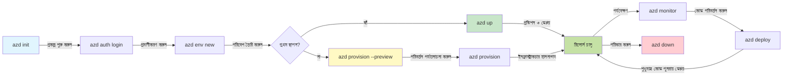
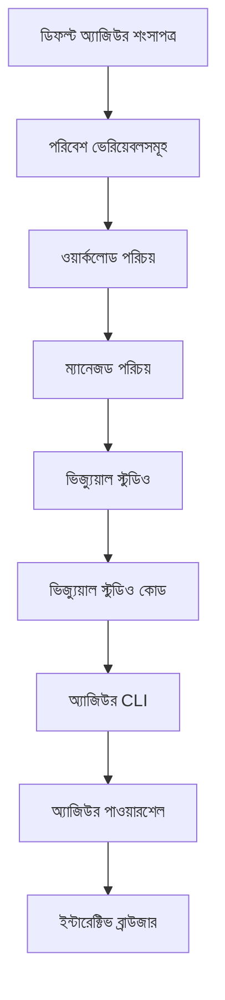

# AZD Basics - Azure Developer CLI বোঝা

# AZD Basics - মূল ধারণা ও মৌলিক বিষয়াবলি

**অধ্যায় নেভিগেশন:**
- **📚 কোর্স হোম**: [AZD For Beginners](../../README.md)
- **📖 বর্তমান অধ্যায়**: অধ্যায় ১ - ভিত্তি ও দ্রুত শুরু
- **⬅️ পূর্ববর্তী**: [কোর্স সারসংক্ষেপ](../../README.md#-chapter-1-foundation--quick-start)
- **➡️ পরবর্তী**: [ইনস্টলেশন ও সেটআপ](installation.md)
- **🚀 পরের অধ্যায়**: [অধ্যায় ২: AI-প্রথম উন্নয়ন](../chapter-02-ai-development/microsoft-foundry-integration.md)

## ভূমিকা

এই পাঠটি আপনাকে Azure Developer CLI (azd) সম্পর্কে পরিচয় করিয়ে দিচ্ছে, যা একটি শক্তিশালী কমান্ড-লাইন টুল যা লোকাল ডেভেলপমেন্ট থেকে Azure ডিপ্লয়মেন্ট পর্যন্ত আপনার যাত্রাকে ত্বরান্বিত করে। আপনি মৌলিক ধারণা, মূল বৈশিষ্ট্য এবং azd কীভাবে ক্লাউড-নেটিভ অ্যাপ্লিকেশন ডিপ্লয়কে সহজ করে তা শিখবেন।

## শেখার লক্ষ্যসমূহ

পাঠ শেষে আপনি:
- Azure Developer CLI কী এবং এর প্রধান উদ্দেশ্য কী তা বোঝবেন
- টেমপ্লেট, এনভায়রনমেন্ট, এবং সার্ভিসের মূল ধারণাগুলো জানবেন
- টেমপ্লেট-চালিত ডেভেলপমেন্ট এবং Infrastructure as Code সহ মূল বৈশিষ্ট্যগুলো অন্বেষণ করবেন
- azd প্রকল্পের কাঠামো এবং ওয়ার্কফ্লো বোঝেন
- আপনার ডেভেলপমেন্ট পরিবেশের জন্য azd ইনস্টল ও কনফিগার করতে প্রস্তুত হবেন

## শেখার ফলাফল

এই পাঠটি সম্পন্ন করার পরে, আপনি সক্ষম হবেন:
- আধুনিক ক্লাউড ডেভেলপমেন্ট ওয়ার্কফ্লোতে azd-এর ভূমিকা ব্যাখ্যা করতে
- azd প্রকল্প কাঠামোর উপাদানগুলো চিহ্নিত করতে
- টেমপ্লেট, এনভায়রনমেন্ট, এবং সার্ভিস কিভাবে একসাথে কাজ করে তা বর্ণনা করতে
- azd ব্যবহার করে Infrastructure as Code-এর সুবিধাসমূহ বুঝতে
- বিভিন্ন azd কমান্ড এবং তাদের উদ্দেশ্য চিনতে

## Azure Developer CLI (azd) কী?

Azure Developer CLI (azd) হলো একটি কমান্ড-লাইন টুল যা লোকাল ডেভেলপমেন্ট থেকে Azure ডিপ্লয়মেন্ট পর্যন্ত আপনার যাত্রাকে দ্রুততর করার জন্য ডিজাইন করা। এটা Azure-এ ক্লাউড-নেটিভ অ্যাপ্লিকেশন বিল্ড, ডিপ্লয় এবং পরিচালনার প্রক্রিয়াকে সহজ করে তোলে।

### 🎯 কেন AZD ব্যবহার করবেন? একটি বাস্তব-জগতের তুলনা

চলুন একটি সাধারণ ওয়েব অ্যাপ ডাটাবেসসহ ডিপ্লয় করার তুলনা করি:

#### ❌ AZD ছাড়া: ম্যানুয়াল Azure ডিপ্লয়মেন্ট (৩০+ মিনিট)

```bash
# ধাপ ১: রিসোর্স গ্রুপ তৈরি করুন
az group create --name myapp-rg --location eastus

# ধাপ ২: অ্যাপ সার্ভিস প্ল্যান তৈরি করুন
az appservice plan create --name myapp-plan \
  --resource-group myapp-rg \
  --sku B1 --is-linux

# ধাপ ৩: ওয়েব অ্যাপ তৈরি করুন
az webapp create --name myapp-web-unique123 \
  --resource-group myapp-rg \
  --plan myapp-plan \
  --runtime "NODE:18-lts"

# ধাপ ৪: Cosmos DB অ্যাকাউন্ট তৈরি করুন (১০-১৫ মিনিট)
az cosmosdb create --name myapp-cosmos-unique123 \
  --resource-group myapp-rg \
  --kind MongoDB

# ধাপ ৫: ডেটাবেস তৈরি করুন
az cosmosdb mongodb database create \
  --account-name myapp-cosmos-unique123 \
  --resource-group myapp-rg \
  --name tododb

# ধাপ ৬: কলেকশন তৈরি করুন
az cosmosdb mongodb collection create \
  --account-name myapp-cosmos-unique123 \
  --resource-group myapp-rg \
  --database-name tododb \
  --name todos

# ধাপ ৭: কানেকশন স্ট্রিং পান
CONN_STR=$(az cosmosdb keys list \
  --name myapp-cosmos-unique123 \
  --resource-group myapp-rg \
  --type connection-strings \
  --query "connectionStrings[0].connectionString" -o tsv)

# ধাপ ৮: অ্যাপ সেটিংস কনফিগার করুন
az webapp config appsettings set \
  --name myapp-web-unique123 \
  --resource-group myapp-rg \
  --settings MONGODB_URI="$CONN_STR"

# ধাপ ৯: লগিং সক্ষম করুন
az webapp log config --name myapp-web-unique123 \
  --resource-group myapp-rg \
  --application-logging filesystem \
  --detailed-error-messages true

# ধাপ ১০: অ্যাপ্লিকেশন ইনসাইটস সেট আপ করুন
az monitor app-insights component create \
  --app myapp-insights \
  --location eastus \
  --resource-group myapp-rg

# ধাপ ১১: অ্যাপ ইনসাইটসকে ওয়েব অ্যাপের সাথে লিঙ্ক করুন
INSTRUMENTATION_KEY=$(az monitor app-insights component show \
  --app myapp-insights \
  --resource-group myapp-rg \
  --query "instrumentationKey" -o tsv)

az webapp config appsettings set \
  --name myapp-web-unique123 \
  --resource-group myapp-rg \
  --settings APPINSIGHTS_INSTRUMENTATIONKEY="$INSTRUMENTATION_KEY"

# ধাপ ১২: লোকালি অ্যাপ্লিকেশন বিল্ড করুন
npm install
npm run build

# ধাপ ১৩: ডিপ্লয়মেন্ট প্যাকেজ তৈরি করুন
zip -r app.zip . -x "*.git*" "node_modules/*"

# ধাপ ১৪: অ্যাপ্লিকেশন ডিপ্লয় করুন
az webapp deployment source config-zip \
  --resource-group myapp-rg \
  --name myapp-web-unique123 \
  --src app.zip

# ধাপ ১৫: অপেক্ষা করুন এবং প্রার্থনা করুন এটি কাজ করুক 🙏
# (স্বয়ংক্রিয় যাচাইকরণ নেই, ম্যানুয়াল পরীক্ষার প্রয়োজন)
```

**সমস্যাসমূহ:**
- ❌ স্মরণ করতে এবং সঠিক ক্রমে চালাতে ১৫+ কমান্ড
- ❌ ৩০-৪৫ মিনিট ম্যানুয়াল কাজ
- ❌ ভুল করার সহজ সম্ভাবনা (টাইপো, ভুল প্যারামিটার)
- ❌ টার্মিনাল ইতিহাসে সংযোগ স্ট্রিং এক্সপোজড হওয়া
- ❌ কোনো ব্যর্থতার ক্ষেত্রে স্বয়ংক্রিয় রোলব্যাক নেই
- ❌ টিম সদস্যদের জন্য পুনরায় তৈরি করা কঠিন
- ❌ প্রতিবার ভিন্ন (পুনরুৎপাদনযোগ্য নয়)

#### ✅ AZD সহ: স্বয়ংক্রিয় ডিপ্লয়মেন্ট (৫টি কমান্ড, ১০-১৫ মিনিট)

```bash
# ধাপ ১: টেমপ্লেট থেকে শুরু করুন
azd init --template todo-nodejs-mongo

# ধাপ ২: প্রমাণীকরণ করুন
azd auth login

# ধাপ ৩: পরিবেশ তৈরি করুন
azd env new dev

# ধাপ ৪: পরিবর্তনগুলি পূর্বদর্শন করুন (ঐচ্ছিক কিন্তু সুপারিশকৃত)
azd provision --preview

# ধাপ ৫: সবকিছু মোতায়েন করুন
azd up

# ✨ সম্পন্ন! সবকিছু মোতায়েন, কনফিগার এবং পর্যবেক্ষণ করা হয়েছে
```

**সুবিধাসমূহ:**
- ✅ **৫টি কমান্ড** বনাম ১৫+ ম্যানুয়াল ধাপ
- ✅ **১০-১৫ মিনিট** মোট সময় (অধিকাংশ সময় Azure অপেক্ষায়)
- ✅ **শূন্য ত্রুটি** - স্বয়ংক্রিয় এবং পরীক্ষিত
- ✅ **সিক্রেটগুলো সুরক্ষিতভাবে ব্যবস্থাপিত** Key Vault দ্বারা
- ✅ ব্যর্থতার ক্ষেত্রে **স্বয়ংক্রিয় রোলব্যাক**
- ✅ **সম্পূর্ণ পুনরুৎপাদনযোগ্য** - প্রতিবার একই ফলাফল
- ✅ **টিম-রেডি** - যে কেউ একই কমান্ড দিয়ে ডিপ্লয় করতে পারে
- ✅ **Infrastructure as Code** - ভার্সন কন্ট্রোল করা Bicep টেমপ্লেট
- ✅ **ইন-বিল্ট মনিটরিং** - Application Insights স্বয়ংক্রিয়ভাবে কনফিগার

### 📊 সময় ও ত্রুটি হ্রাস

| মেট্রিক | ম্যানুয়াল ডিপ্লয়মেন্ট | AZD ডিপ্লয়মেন্ট | উন্নতি |
|:-------|:------------------|:---------------|:------------|
| **কমান্ড** | ১৫+ | ৫ | ৬৭% কম |
| **সময়** | ৩০-৪৫ মিনিট | ১০-১৫ মিনিট | ৬০% দ্রুত |
| **ত্রুটি হার** | ~৪০% | <৫% | ৮৮% হ্রাস |
| **সঙ্গতি** | কম (ম্যানুয়াল) | ১০০% (স্বয়ংক্রিয়) | নিখুঁত |
| **টিম অনবোর্ডিং** | ২-৪ ঘণ্টা | ৩০ মিনিট | ৭৫% দ্রুত |
| **রোলব্যাক সময়** | ৩০+ মিনিট (ম্যানুয়াল) | ২ মিনিট (স্বয়ংক্রিয়) | ৯৩% দ্রুত |

## মূল ধারণা

### টেমপ্লেট
টেমপ্লেটগুলো azd-এর ভিত্তি। এগুলোতে থাকে:
- **অ্যাপ্লিকেশন কোড** - আপনার সোর্স কোড এবং ডিপেন্ডেন্সি
- **ইনফ্রাস্ট্রাকচার সংজ্ঞা** - Bicep বা Terraform-এ সংজ্ঞায়িত Azure রিসোর্স
- **কনফিগারেশন ফাইল** - সেটিংস এবং এনভায়রনমেন্ট ভেরিয়েবলসমূহ
- **ডিপ্লয়মেন্ট স্ক্রিপ্ট** - স্বয়ংক্রিয় ডিপ্লয়মেন্ট ওয়ার্কফ্লো

### এনভায়রনমেন্ট
এনভায়রনমেন্টগুলো বিভিন্ন ডিপ্লয়মেন্ট লক্ষ্য প্রতিনিধিত্ব করে:
- **ডেভেলপমেন্ট** - টেস্টিং ও ডেভেলপমেন্টের জন্য
- **স্টেজিং** - প্রি-প্রোডাকশন পরিবেশ
- **প্রোডাকশন** - লাইভ প্রোডাকশন পরিবেশ

প্রতিটি এনভায়রনমেন্টের নিজস্ব থাকে:
- Azure রিসোর্স গ্রুপ
- কনফিগারেশন সেটিংস
- ডিপ্লয়মেন্ট স্টেট

### সার্ভিসসমূহ
সার্ভিসগুলো আপনার অ্যাপ্লিকেশনের নির্মাণ ব্লক:
- **ফ্রন্টএন্ড** - ওয়েব অ্যাপ্লিকেশন, SPA
- **ব্যাকএন্ড** - API, মাইক্রোসার্ভিস
- **ডাটাবেস** - ডেটা স্টোরেজ সমাধান
- **স্টোরেজ** - ফাইল এবং ব্লব স্টোরেজ

## মূল বৈশিষ্ট্যসমূহ

### ১। টেমপ্লেট-চালিত ডেভেলপমেন্ট
```bash
# উপলব্ধ টেমপ্লেট ব্রাউজ করুন
azd template list

# একটি টেমপ্লেট থেকে শুরু করুন
azd init --template <template-name>
```

### ২। ইনফ্রাস্ট্রাকচার অ্যাজ কোড
- **Bicep** - Azure-এর ডোমেইন-নির্দিষ্ট ভাষা
- **Terraform** - মাল্টি-ক্লাউড ইনফ্রাস্ট্রাকচার টুল
- **ARM Templates** - Azure Resource Manager টেমপ্লেট

### ৩। ইন্টিগ্রেটেড ওয়ার্কফ্লো
```bash
# সম্পূর্ণ ডিপ্লয়মেন্ট ওয়ার্কফ্লো
azd up            # প্রোভিশন + ডিপ্লয় — প্রথমবারের সেটআপের জন্য এটি স্বয়ংক্রিয়

# 🧪 নতুন: ডিপ্লয়মেন্টের আগে অবকাঠামো পরিবর্তনের পূর্বরূপ দেখুন (নিরাপদ)
azd provision --preview    # পরিবর্তন না করেই অবকাঠামোর ডিপ্লয়মেন্ট অনুকরণ করুন

azd provision     # অবকাঠামো আপডেট করলে Azure রিসোর্স তৈরি করতে এটি ব্যবহার করুন
azd deploy        # অ্যাপ্লিকেশন কোড ডিপ্লয় করুন বা আপডেটের পরে পুনরায় ডিপ্লয় করুন
azd down          # রিসোর্সগুলো পরিষ্কার করুন
```

#### 🛡️ প্রিভিউ দিয়ে নিরাপদ ইনফ্রাস্ট্রাকচার পরিকল্পনা
The `azd provision --preview` কমান্ড নিরাপদ ডিপ্লয়মেন্টের জন্য গেম-চেঞ্জার:
- **Dry-run analysis** - কি তৈরি, পরিবর্তিত, বা মুছে ফেলা হবে তা দেখায়
- **Zero risk** - আপনার Azure পরিবেশে কোনো বাস্তব পরিবর্তন করা হয় না
- **Team collaboration** - ডিপ্লয়মেন্টের আগে প্রিভিউ ফলাফল শেয়ার করা যায়
- **Cost estimation** - কমিটমেন্টের আগে রিসোর্স খরচ বুঝতে সাহায্য করে

```bash
# উদাহরণ পূর্বদর্শন কর্মপ্রবাহ
azd provision --preview           # দেখুন কী পরিবর্তন হবে
# আউটপুট পর্যালোচনা করুন, দলের সঙ্গে আলোচনা করুন
azd provision                     # আত্মবিশ্বাসের সঙ্গে পরিবর্তন প্রয়োগ করুন
```

### 📊 ভিজ্যুয়াল: AZD ডেভেলপমেন্ট ওয়ার্কফ্লো


**ওয়ার্কফ্লো ব্যাখ্যা:**
1. **Init** - টেমপ্লেট দিয়ে শুরু করুন বা নতুন প্রকল্প তৈরি করুন
2. **Auth** - Azure-এ প্রমাণীকরণ করুন
3. **Environment** - একটি বিচ্ছিন্ন ডিপ্লয়মেন্ট এনভায়রনমেন্ট তৈরি করুন
4. **Preview** - 🆕 সবসময় প্রথমে ইনফ্রাস্ট্রাকচার পরিবর্তনগুলি প্রিভিউ করুন (নিরাপদ অভ্যাস)
5. **Provision** - Azure রিসোর্স তৈরি/আপডেট করুন
6. **Deploy** - আপনার অ্যাপ্লিকেশন কোড পুশ করুন
7. **Monitor** - অ্যাপ্লিকেশনের পারফরম্যান্স পর্যবেক্ষণ করুন
8. **Iterate** - পরিবর্তন করুন এবং কোড পুনরায় ডিপ্লয় করুন
9. **Cleanup** - কাজ শেষ হলে রিসোর্সগুলো মুছে ফেলুন

### ৪। এনভায়রনমেন্ট ম্যানেজমেন্ট
```bash
# পরিবেশ তৈরি এবং পরিচালনা করুন
azd env new <environment-name>
azd env select <environment-name>
azd env list
```

## 📁 প্রকল্প কাঠামো

একটি সাধারণ azd প্রকল্প কাঠামো:
```
my-app/
├── .azd/                    # azd configuration
│   └── config.json
├── .azure/                  # Azure deployment artifacts
├── .devcontainer/          # Development container config
├── .github/workflows/      # GitHub Actions
├── .vscode/               # VS Code settings
├── infra/                 # Infrastructure code
│   ├── main.bicep        # Main infrastructure template
│   ├── main.parameters.json
│   └── modules/          # Reusable modules
├── src/                  # Application source code
│   ├── api/             # Backend services
│   └── web/             # Frontend application
├── azure.yaml           # azd project configuration
└── README.md
```

## 🔧 কনফিগারেশন ফাইলসমূহ

### azure.yaml
প্রধান প্রকল্প কনফিগারেশন ফাইল:
```yaml
name: my-awesome-app
metadata:
  template: my-template@1.0.0

services:
  web:
    project: ./src/web
    language: js
    host: appservice
  api:
    project: ./src/api
    language: js
    host: appservice

hooks:
  preprovision:
    shell: pwsh
    run: echo "Preparing to provision..."
```

### .azure/config.json
পরিবেশ-নির্দিষ্ট কনফিগারেশন:
```json
{
  "version": 1,
  "defaultEnvironment": "dev",
  "environments": {
    "dev": {
      "subscriptionId": "your-subscription-id",
      "location": "eastus"
    }
  }
}
```

## 🎪 সাধারণ ওয়ার্কফ্লো ও হ্যান্ডস-অন অনুশীলন

> **💡 শেখার টিপ:** এই অনুশীলনগুলো ধারাবাহিকভাবে অনুসরণ করুন যাতে আপনার AZD দক্ষতা ধীরে ধীরে বৃদ্ধি পায়।

### 🎯 অনুশীলন ১: আপনার প্রথম প্রকল্প ইনিশিয়ালাইজ করুন

**লক্ষ্য:** একটি AZD প্রকল্প তৈরি করুন এবং এর কাঠামো অন্বেষণ করুন

**ধাপসমূহ:**
```bash
# প্রমাণিত টেমপ্লেট ব্যবহার করুন
azd init --template todo-nodejs-mongo

# উত্পন্ন ফাইলগুলো অন্বেষণ করুন
ls -la  # লুকানো ফাইলসহ সব ফাইল দেখুন

# তৈরি হওয়া মূল ফাইলসমূহ:
# - azure.yaml (প্রধান কনফিগারেশন)
# - infra/ (অবকাঠামো কোড)
# - src/ (অ্যাপ্লিকেশন কোড)
```

**✅ সফল:** আপনার কাছে azure.yaml, infra/, এবং src/ ডিরেক্টরি আছে

---

### 🎯 অনুশীলন ২: Azure-এ ডিপ্লয় করুন

**লক্ষ্য:** এন্ড-টু-এন্ড ডিপ্লয়মেন্ট সম্পূর্ণ করা

**ধাপসমূহ:**
```bash
# 1. প্রমাণীকরণ করুন
az login && azd auth login

# 2. পরিবেশ তৈরি করুন
azd env new dev
azd env set AZURE_LOCATION eastus

# 3. পরিবর্তনগুলি পূর্বদর্শন করুন (প্রস্তাবিত)
azd provision --preview

# 4. সবকিছু ডিপ্লয় করুন
azd up

# 5. ডিপ্লয়মেন্ট যাচাই করুন
azd show    # আপনার অ্যাপের URL দেখুন
```

**প্রত্যাশিত সময়:** ১০-১৫ মিনিট  
**✅ সফল:** অ্যাপ্লিকেশন URL ব্রাউজারে খুলবে

---

### 🎯 অনুশীলন ৩: একাধিক এনভায়রনমেন্ট

**লক্ষ্য:** dev এবং staging-এ ডিপ্লয় করা

**ধাপসমূহ:**
```bash
# ইতিমধ্যে dev আছে, staging তৈরি করুন
azd env new staging
azd env set AZURE_LOCATION westus2
azd up

# তাদের মধ্যে স্যুইচ করুন
azd env list
azd env select dev
```

**✅ সফল:** Azure পোর্টালে দুটি আলাদা রিসোর্স গ্রুপ

---

### 🛡️ ক্লিন স্লেট: `azd down --force --purge`

যখন আপনাকে সম্পূর্ণরূপে রিসেট করতে হবে:

```bash
azd down --force --purge
```

**এটি কী করে:**
- `--force`: কোনও কনফার্মেশন প্রম্পট নেই
- `--purge`: সমস্ত লোকাল স্টেট এবং Azure রিসোর্স মুছে ফেলে

**কখন ব্যবহার করবেন:**
- ডিপ্লয়মেন্ট পথে পথে ব্যর্থ হলে
- প্রকল্প পরিবর্তন করার সময়
- তাজা শুরু দরকার হলে

---

## 🎪 মূল ওয়ার্কফ্লো রেফারেন্স

### নতুন প্রকল্প শুরু করা
```bash
# পদ্ধতি 1: বিদ্যমান টেমপ্লেট ব্যবহার করুন
azd init --template todo-nodejs-mongo

# পদ্ধতি 2: শূন্য থেকে শুরু করুন
azd init

# পদ্ধতি 3: বর্তমান ডিরেক্টরি ব্যবহার করুন
azd init .
```

### ডেভেলপমেন্ট সাইকেল
```bash
# উন্নয়ন পরিবেশ সেট আপ করুন
azd auth login
azd env new dev
azd env select dev

# সবকিছু ডেপ্লয় করুন
azd up

# পরিবর্তন করুন এবং পুনরায় ডেপ্লয় করুন
azd deploy

# কাজ শেষ হলে পরিষ্কার করুন
azd down --force --purge # Azure Developer CLI-এ থাকা একটি কমান্ড আপনার পরিবেশের জন্য একটি **সম্পূর্ণ রিসেট** — বিশেষ করে উপকারী যখন আপনি ব্যর্থ ডেপ্লয়মেন্ট সমস্যাগুলি সমাধান করছেন, পরিত্যক্ত রিসোর্সগুলো পরিষ্কার করছেন, বা নতুন করে পুনরায় ডেপ্লয়ের জন্য প্রস্তুতি নিচ্ছেন।
```

## `azd down --force --purge` বোঝা
The `azd down --force --purge` কমান্ড আপনার azd এনভায়রনমেন্ট এবং সমস্ত সংশ্লিষ্ট রিসোর্স সম্পূর্ণভাবে tear down করার একটি শক্তিশালী উপায়। প্রতিটি ফ্ল্যাগ কি করে তার বিশ্লেষণ এখানে দেওয়া হলো:
```
--force
```
- কনফার্মেশন প্রম্পটগুলি স্কিপ করে।
- অটোমেশন বা স্ক্রিপ্টিংয়ের জন্য উপযুক্ত যেখানে ম্যানুয়াল ইনপুট সম্ভব নয়।
- CLI অনিয়ম সনাক্ত করলেও টিয়ারডাউন বাধা ছাড়াই এগিয়ে নিয়ে যায়।

```
--purge
```
মুছে ফেলে **সব সংযুক্ত মেটাডেটা**, যার মধ্যে রয়েছে:
- এনভায়রনমেন্ট স্টেট
- লোকাল `.azure` ফোল্ডার
- ক্যাশড ডিপ্লয়মেন্ট তথ্য
- azd-কে পূর্ববর্তী ডিপ্লয়মেন্ট 'মনে রাখার' থেকে বিরত রাখে, যা মিসম্যাচড রিসোর্স গ্রুপ বা স্টেল রেজিস্ট্রি রেফারেন্সের মতো সমস্যা তৈরি করতে পারে।

### কেন উভয়ই ব্যবহার করবেন?
যখন অনবরত রয়ে যাওয়া স্টেট বা আংশিক ডিপ্লয়মেন্টের কারণে `azd up`–এ সমস্যায় পড়েন, এই সংমিশ্রণ একটি **পরিষ্কার সূচনা** নিশ্চিত করে।

এটি বিশেষভাবে সহায়ক যখন Azure পোর্টালে ম্যানুয়ালি রিসোর্স মুছে ফেলা হয়েছে বা টেমপ্লেট, এনভায়রনমেন্ট, বা রিসোর্স গ্রুপ নামকরণের কনভেনশন পরিবর্তন করার সময়।

### একাধিক এনভায়রনমেন্ট পরিচালনা করা
```bash
# স্টেজিং পরিবেশ তৈরি করুন
azd env new staging
azd env select staging
azd up

# dev-এ ফিরে যান
azd env select dev

# পরিবেশগুলো তুলনা করুন
azd env list
```

## 🔐 প্রমাণীকরণ ও শংসাপত্র

সফল azd ডিপ্লয়মেন্টের জন্য প্রমাণীকরণ বোঝা অত্যন্ত গুরুত্বপূর্ণ। Azure বিভিন্ন প্রমাণীকরণ পদ্ধতি ব্যবহার করে, এবং azd অন্যান্য Azure টুলগুলোর মতো ক্রেডেনশিয়াল চেইন ব্যবহার করে।

### Azure CLI প্রমাণীকরণ (`az login`)

azd ব্যবহার করার আগে, আপনাকে Azure-এ প্রমাণীকরণ করতে হবে। সবচেয়ে সাধারণ পদ্ধতিটি হলো Azure CLI ব্যবহার করা:

```bash
# ইন্টারঅ্যাক্টিভ লগইন (ব্রাউজার খুলবে)
az login

# নির্দিষ্ট টেন্যান্ট দিয়ে লগইন
az login --tenant <tenant-id>

# সার্ভিস প্রিন্সিপাল দিয়ে লগইন
az login --service-principal -u <app-id> -p <password> --tenant <tenant-id>

# বর্তমান লগইন অবস্থা পরীক্ষা করুন
az account show

# উপলব্ধ সাবস্ক্রিপশন তালিকা দেখান
az account list --output table

# ডিফল্ট সাবস্ক্রিপশন সেট করুন
az account set --subscription <subscription-id>
```

### প্রমাণীকরণের প্রবাহ
1. **ইন্টারেক্টিভ লগইন**: প্রমাণীকরণের জন্য আপনার ডিফল্ট ব্রাউজার খুলে
2. **ডিভাইস কোড ফ্লো**: ব্রাউজার অ্যাক্সেসহীন পরিবেশের জন্য
3. **সার্ভিস প্রিন্সিপ্যাল**: অটোমেশন এবং CI/CD পরিস্থিতির জন্য
4. **ম্যানেজড আইডেন্টিটি**: Azure-হোস্টেড অ্যাপ্লিকেশনগুলোর জন্য

### DefaultAzureCredential Chain
`DefaultAzureCredential` হল একটি ক্রেডেনশিয়াল টাইপ যা স্বয়ংক্রিয়ভাবে নির্দিষ্ট ক্রেডেনশিয়াল উৎসগুলো একটি নির্দিষ্ট ক্রমে চেষ্টা করে সহজতর প্রমাণীকরণ অভিজ্ঞতা প্রদান করে:

#### ক্রেডেনশিয়াল চেইন অর্ডার

#### ১। এনভায়রনমেন্ট ভেরিয়েবল
```bash
# সার্ভিস প্রিন্সিপালের জন্য পরিবেশ ভেরিয়েবল সেট করুন
export AZURE_CLIENT_ID="<app-id>"
export AZURE_CLIENT_SECRET="<password>"
export AZURE_TENANT_ID="<tenant-id>"
```

#### ২। ওয়ার্কলোড আইডেন্টিটি (Kubernetes/GitHub Actions)
স্বয়ংক্রিয়ভাবে ব্যবহৃত হয়:
- Azure Kubernetes Service (AKS) - Workload Identity সহ
- GitHub Actions - OIDC ফেডারেশন সহ
- অন্যান্য ফেডারেটেড আইডেন্টিটি পরিস্থিতি

#### ৩। Managed Identity
নিচের মতো Azure রিসোর্সগুলির জন্য:
- ভার্চুয়াল মেশিন
- App Service
- Azure Functions
- Container Instances

```bash
# পরিচালিত পরিচয়সহ Azure রিসোর্সে চলছে কি না পরীক্ষা করুন
az account show --query "user.type" --output tsv
# ফলাফল: যদি পরিচালিত পরিচয় ব্যবহার করা হয় তবে "servicePrincipal" ফেরত দেয়
```

#### ৪। ডেভেলপার টুলস ইন্টিগ্রেশন
- **Visual Studio**: স্বয়ংক্রিয়ভাবে সাইন-ইন করা অ্যাকাউন্ট ব্যবহার করে
- **VS Code**: Azure Account এক্সটেনশন ক্রেডেনশিয়াল ব্যবহার করে
- **Azure CLI**: Uses `az login` credentials (most common for local development)

### AZD প্রমাণীকরণ সেটআপ

```bash
# পদ্ধতি 1: Azure CLI ব্যবহার করুন (উন্নয়নের জন্য সুপারিশকৃত)
az login
azd auth login  # বিদ্যমান Azure CLI শংসাপত্র ব্যবহার করে

# পদ্ধতি 2: সরাসরি azd প্রমাণীকরণ
azd auth login --use-device-code  # হেডলেস পরিবেশের জন্য

# পদ্ধতি 3: প্রমাণীকরণ অবস্থা পরীক্ষা করুন
azd auth login --check-status

# পদ্ধতি 4: লগআউট করুন এবং পুনরায় প্রমাণীকরণ করুন
azd auth logout
azd auth login
```

### প্রমাণীকরণের সেরা অনুশীলন

#### লোকাল ডেভেলপমেন্টের জন্য
```bash
# 1. Azure CLI দিয়ে লগইন করুন
az login

# 2. সঠিক সাবস্ক্রিপশন যাচাই করুন
az account show
az account set --subscription "Your Subscription Name"

# 3. বিদ্যমান প্রমাণপত্রাদি দিয়ে azd ব্যবহার করুন
azd auth login
```

#### CI/CD পাইপলাইনের জন্য
```yaml
# GitHub Actions example
- name: Azure Login
  uses: azure/login@v1
  with:
    creds: ${{ secrets.AZURE_CREDENTIALS }}

- name: Deploy with azd
  run: |
    azd auth login --client-id ${{ secrets.AZURE_CLIENT_ID }} \
                    --client-secret ${{ secrets.AZURE_CLIENT_SECRET }} \
                    --tenant-id ${{ secrets.AZURE_TENANT_ID }}
    azd up --no-prompt
```

#### প্রোডাকশন এনভায়রনমেন্টের জন্য
- Azure রিসোর্সে চলার সময় **Managed Identity** ব্যবহার করুন
- অটোমেশন পরিস্থিতির জন্য **Service Principal** ব্যবহার করুন
- কোড বা কনফিগারেশন ফাইলে ক্রেডেনশিয়াল সংরক্ষণ এড়িয়ে চলুন
- সংবেদনশীল কনফিগারেশনের জন্য **Azure Key Vault** ব্যবহার করুন

### সাধারণ প্রমাণীকরণ সমস্যা ও সমাধান

#### সমস্যা: "No subscription found"
```bash
# সমাধান: ডিফল্ট সাবস্ক্রিপশন সেট করুন
az account list --output table
az account set --subscription "<subscription-id>"
azd env set AZURE_SUBSCRIPTION_ID "<subscription-id>"
```

#### সমস্যা: "Insufficient permissions"
```bash
# সমাধান: প্রয়োজনীয় ভূমিকা যাচাই করুন এবং বরাদ্দ করুন
az role assignment list --assignee $(az account show --query user.name --output tsv)

# সাধারণ প্রয়োজনীয় ভূমিকা:
# - Contributor (রিসোর্স ব্যবস্থাপনার জন্য)
# - User Access Administrator (ভূমিকা বরাদ্দের জন্য)
```

#### সমস্যা: "Token expired"
```bash
# সমাধান: পুনরায় প্রমাণীকরণ
az logout
az login
azd auth logout
azd auth login
```

### বিভিন্ন পরিস্থিতিতে প্রমাণীকরণ

#### লোকাল ডেভেলপমেন্ট
```bash
# ব্যক্তিগত উন্নয়ন অ্যাকাউন্ট
az login
azd auth login
```

#### টিম ডেভেলপমেন্ট
```bash
# সংস্থার জন্য নির্দিষ্ট টেন্যান্ট ব্যবহার করুন
az login --tenant contoso.onmicrosoft.com
azd auth login
```

#### মাল্টি-টেন্যান্ট পরিস্থিতি
```bash
# টেন্যান্টগুলোর মধ্যে সুইচ করুন
az login --tenant tenant1.onmicrosoft.com
# টেন্যান্ট 1-এ ডিপ্লয় করুন
azd up

az login --tenant tenant2.onmicrosoft.com  
# টেন্যান্ট 2-এ ডিপ্লয় করুন
azd up
```

### নিরাপত্তা বিবেচ্য বিষয়সমূহ

1. **ক্রেডেনশিয়াল সঞ্চয়:** কখনই সোর্স কোডে ক্রেডেনশিয়াল সংরক্ষণ করবেন না
2. **স্কোপ সীমাবদ্ধতা:** সার্ভিস প্রিন্সিপ্যালগুলোর জন্য সর্বনিম্ন-অধিকার নীতি ব্যবহার করুন
3. **টোকেন রোটেশন:** নিয়মিতভাবে সার্ভিস প্রিন্সিপ্যাল সিক্রেট রোটেট করুন
4. **অডিট ট্রেইল:** প্রমাণীকরণ ও ডিপ্লয়মেন্ট কার্যক্রম মনিটর করুন
5. **নেটওয়ার্ক নিরাপত্তা:** সম্ভব হলে প্রাইভেট এন্ডপয়েন্ট ব্যবহার করুন

### প্রমাণীকরণ ট্রাবলশুটিং

```bash
# প্রমাণীকরণ সমস্যা ডিবাগ করুন
azd auth login --check-status
az account show
az account get-access-token

# সাধারণ ডায়াগনস্টিক কমান্ড
whoami                          # বর্তমান ব্যবহারকারীর প্রেক্ষাপট
az ad signed-in-user show      # Azure AD ব্যবহারকারীর বিবরণ
az group list                  # রিসোর্স অ্যাক্সেস পরীক্ষা করুন
```

## `azd down --force --purge` বোঝা

### আবিষ্কার
```bash
azd template list              # টেমপ্লেট ব্রাউজ করুন
azd template show <template>   # টেমপ্লেটের বিবরণ
azd init --help               # প্রাথমিকীকরণ বিকল্পসমূহ
```

### প্রকল্প ব্যবস্থাপনা
```bash
azd show                     # প্রকল্পের সারসংক্ষেপ
azd env show                 # বর্তমান পরিবেশ
azd config list             # কনফিগারেশন সেটিংস
```

### মনিটরিং
```bash
azd monitor                  # Azure পোর্টালের মনিটরিং খুলুন
azd monitor --logs           # অ্যাপ্লিকেশন লগ দেখুন
azd monitor --live           # লাইভ মেট্রিক্স দেখুন
azd pipeline config          # CI/CD সেট আপ করুন
```

## সেরা অনুশীলন

### ১। অর্থবহ নাম ব্যবহার করুন
```bash
# ভালো
azd env new production-east
azd init --template web-app-secure

# পরিহার করুন
azd env new env1
azd init --template template1
```

### ২। টেমপ্লেট ব্যবহার করুন
- বিদ্যমান টেমপ্লেট দিয়ে শুরু করুন
- আপনার চাহিদা অনুযায়ী কাস্টমাইজ করুন
- আপনার প্রতিষ্ঠানের জন্য পুনঃব্যবহারযোগ্য টেমপ্লেট তৈরি করুন

### ৩। এনভায়রনমেন্ট বিচ্ছিন্নতা
- dev/staging/prod এর জন্য আলাদা এনভায়রনমেন্ট ব্যবহার করুন
- লোকাল মেশিন থেকে সরাসরি প্রোডাকশনে কখনই ডিপ্লয় করবেন না
- প্রোডাকশন ডিপ্লয়মেন্টের জন্য CI/CD পাইপলাইন ব্যবহার করুন

### ৪। কনফিগারেশন ম্যানেজমেন্ট
- সংবেদনশীল ডেটার জন্য এনভায়রনমেন্ট ভেরিয়েবল ব্যবহার করুন
- কনফিগারেশন ভার্সন কন্ট্রোলএ রাখুন
- এনভায়রনমেন্ট-নির্দিষ্ট সেটিংস ডকুমেন্ট করুন

## শেখার অগ্রগতি

### শুরুতর (সপ্তাহ ১-২)
1. azd ইনস্টল করুন এবং প্রমাণীকরণ করুন
2. একটি সাধারণ টেমপ্লেট ডিপ্লয় করুন
3. প্রকল্প কাঠামো বুঝুন
4. বেসিক কমান্ড শিখুন (up, down, deploy)

### Intermediate (সপ্তাহ ৩-৪)
1. টেমপ্লেট কাস্টমাইজ করুন
2. একাধিক এনভায়রনমেন্ট পরিচালনা করুন
3. ইনফ্রাস্ট্রাকচার কোড বুঝুন
4. CI/CD পাইপলাইন সেটআপ করুন

### উন্নত (সপ্তাহ ৫+)
1. কাস্টম টেমপ্লেট তৈরি করুন
2. উন্নত ইনফ্রাস্ট্রাকচার প্যাটার্ন
3. মাল্টি-রিজিয়ন ডিপ্লয়মেন্ট
4. এন্টারপ্রাইজ-গ্রেড কনফিগারেশন

## পরবর্তী ধাপ

**📖 অধ্যায় ১ শেখা চালিয়ে যান:**
- [ইনস্টলেশন ও সেটআপ](installation.md) - azd ইনস্টল ও কনফিগার করুন
- [আপনার প্রথম প্রকল্প](first-project.md) - হাতে-কলমে টিউটোরিয়াল সম্পূর্ণ করুন
- [কনফিগারেশন নির্দেশিকা](configuration.md) - উন্নত কনফিগারেশন বিকল্পসমূহ

**🎯 পরবর্তী অধ্যায়ের জন্য প্রস্তুত?**
- [অধ্যায় 2: AI-প্রথম ডেভেলপমেন্ট](../chapter-02-ai-development/microsoft-foundry-integration.md) - AI অ্যাপ্লিকেশন তৈরি করা শুরু করুন

## অতিরিক্ত সম্পদ

- [Azure Developer CLI Overview](https://learn.microsoft.com/en-us/azure/developer/azure-developer-cli/)
- [Template Gallery](https://azure.github.io/awesome-azd/)
- [Community Samples](https://github.com/Azure-Samples)

---

## 🙋 প্রায়শই জিজ্ঞাস্য প্রশ্নাবলী

### সাধারণ প্রশ্ন

**Q: AZD এবং Azure CLI-এর মধ্যে পার্থক্য কি?**

A: Azure CLI (`az`) হচ্ছে পৃথক Azure রিসোর্স পরিচালনার জন্য। AZD (`azd`) হচ্ছে সম্পূর্ণ অ্যাপ্লিকেশন পরিচালনার জন্য:

```bash
# Azure CLI - নিম্ন-স্তরের রিসোর্স ব্যবস্থাপনা
az webapp create --name myapp --resource-group rg
az sql server create --name myserver --resource-group rg
# ...আরও অনেক কমান্ড প্রয়োজন

# AZD - অ্যাপ্লিকেশন-স্তরের ব্যবস্থাপনা
azd up  # সমস্ত রিসোর্সসহ পুরো অ্যাপটি ডিপ্লয় করে
```

**এভাবে ভাবুন:**
- `az` = একক লেগো ইটের উপর কাজ করা
- `azd` = সম্পূর্ণ লেগো সেট নিয়ে কাজ করা

---

**Q: AZD ব্যবহার করতে কি আমাকে Bicep বা Terraform জানতে হবে?**

A: না! টেমপ্লেট দিয়ে শুরু করুন:
```bash
# বিদ্যমান টেমপ্লেট ব্যবহার করুন - কোনও IaC জ্ঞানের প্রয়োজন নেই
azd init --template todo-nodejs-mongo
azd up
```

পরবর্তীতে আপনি Bicep শিখে ইনফ্রাস্ট্রাকচার কাস্টমাইজ করতে পারেন। টেমপ্লেটগুলো শেখার জন্য কার্যকর উদাহরণ সরবরাহ করে।

---

**Q: AZD টেমপ্লেট চালাতে খরচ কত হবে?**

A: খরচ টেমপ্লেট অনুসারে ভিন্ন হয়। বেশিরভাগ ডেভেলপমেন্ট টেমপ্লেটের খরচ $50-150/মাস:

```bash
# ডিপ্লয় করার আগে খরচের পূর্বরূপ দেখুন
azd provision --preview

# ব্যবহার না করার সময় অবশ্যই পরিষ্কার করুন
azd down --force --purge  # সমস্ত রিসোর্স অপসারণ করে
```

**প্রো টিপ:** যেখানে উপলব্ধ সেখানে ফ্রি টিয়ার ব্যবহার করুন:
- App Service: F1 (ফ্রি) টিয়ার
- Azure OpenAI: 50,000 টোকেন/মাস ফ্রি
- Cosmos DB: 1000 RU/s ফ্রি টিয়ার

---

**Q: আমি কি বিদ্যমান Azure রিসোর্সের সাথে AZD ব্যবহার করতে পারি?**

A: হ্যাঁ, কিন্তু নতুন শুরু করা সহজ। AZD সবচেয়ে ভাল কাজ করে যখন এটি সম্পূর্ণ লাইফসাইকল পরিচালনা করে। বিদ্যমান রিসোর্সের জন্য:
```bash
# বিকল্প ১: বিদ্যমান সম্পদগুলি আমদানি করুন (উন্নত)
azd init
# তারপর infra/ পরিবর্তন করে বিদ্যমান সম্পদগুলোকে রেফারেন্স করুন

# বিকল্প ২: নতুনভাবে শুরু করুন (প্রস্তাবিত)
azd init --template matching-your-stack
azd up  # নতুন পরিবেশ তৈরি করে
```

---

**Q: আমি কিভাবে আমার প্রকল্পটি টিমমেটদের সাথে শেয়ার করব?**

A: AZD প্রকল্পটি Git-এ কমিট করুন (তবে .azure ফোল্ডারটি কমিট করবেন না):
```bash
# ডিফল্টভাবে ইতিমধ্যে .gitignore-এ রয়েছে
.azure/        # গোপন এবং পরিবেশ সংক্রান্ত তথ্য ধারণ করে
*.env          # পরিবেশ ভেরিয়েবল

# এরপর টিম সদস্যরা:
git clone <your-repo>
azd auth login
azd env new <their-name>-dev
azd up
```

প্রত্যেকে একই টেমপ্লেট থেকে একই ধরনের ইনফ্রাস্ট্রাকচার পায়।

---

### ট্রাবলশুটিং প্রশ্ন

**Q: "azd up" মাঝ পথে ব্যর্থ হয়েছে। আমি কি করব?**

A: ত্রুটিটি দেখুন, ঠিক করুন, তারপর আবার চেষ্টা করুন:
```bash
# বিস্তারিত লগ দেখুন
azd show

# সাধারণ সমাধান:

# 1. কোটা অতিক্রম হলে:
azd env set AZURE_LOCATION "westus2"  # ভিন্ন অঞ্চল ব্যবহার করুন

# 2. যদি রিসোর্স নাম সংঘর্ষ ঘটে:
azd down --force --purge  # নতুন করে শুরু করুন
azd up  # পুনরায় চেষ্টা করুন

# 3. যদি প্রমাণীকরণ মেয়াদ উত্তীর্ণ হলে:
az login
azd auth login
azd up
```

**সর্বাধিক সাধারণ সমস্যা:** ভুল Azure সাবস্ক্রিপশন নির্বাচিত
```bash
az account list --output table
az account set --subscription "<correct-subscription>"
```

---

**Q: আমি কিভাবে শুধুমাত্র কোড পরিবর্তনগুলি পুনরায় প্রোভিশন না করে ডিপ্লয় করব?**

A: `azd up` এর পরিবর্তে `azd deploy` ব্যবহার করুন:
```bash
azd up          # প্রথমবার: প্রোভিশন + ডিপ্লয় (ধীর)

# কোড পরিবর্তন করুন...

azd deploy      # পরবর্তী বার: শুধুমাত্র ডিপ্লয় (দ্রুত)
```

গতির তুলনা:
- `azd up`: 10-15 minutes (ইনফ্রাস্ট্রাকচার প্রোভিশন করে)
- `azd deploy`: 2-5 minutes (শুধু কোড)

---

**Q: আমি কি ইনফ্রাস্ট্রাকচার টেমপ্লেট কাস্টমাইজ করতে পারি?**

A: হ্যাঁ! `infra/` এর Bicep ফাইলগুলো সম্পাদনা করুন:
```bash
# azd init করার পরে
cd infra/
code main.bicep  # VS Code-এ সম্পাদনা করুন

# পরিবর্তনগুলি পূর্বরূপ দেখুন
azd provision --preview

# পরিবর্তনগুলি প্রয়োগ করুন
azd provision
```

**টিপ:** ছোট থেকেই শুরু করুন - প্রথমে SKU পরিবর্তন করুন:
```bicep
// infra/main.bicep
sku: {
  name: 'B1'  // Change to 'P1V2' for production
}
```

---

**Q: আমি কিভাবে AZD দ্বারা তৈরী সবকিছু মুছে ফেলব?**

A: একটি কমান্ড সব রিসোর্স মুছে ফেলে:
```bash
azd down --force --purge

# এটি মুছে ফেলে:
# - সমস্ত Azure রিসোর্স
# - রিসোর্স গ্রুপ
# - স্থানীয় পরিবেশের অবস্থা
# - ক্যাশকৃত ডিপ্লয়মেন্ট ডেটা
```

**প্রতিবার এটি চালান যখন:**
- টেমপ্লেট টেস্ট করা শেষ হলে
- অন্য প্রকল্পে স্যুইচ করলে
- নতুন করে শুরু করতে চাইলে

**খরচ সাশ্রয়:** ব্যবহার না করা রিসোর্স মুছে ফেলা = $0 চার্জ

---

**Q: যদি আমি ভুলবশত Azure পোর্টালে রিসোর্স মুছে ফেলি তাহলে কি হবে?**

A: AZD এর স্টেট সিংক থেকে বেরিয়ে যেতে পারে। সব মুছে দিয়ে নতুন করে শুরু করার পদ্ধতি:
```bash
# 1. স্থানীয় স্টেট মুছুন
azd down --force --purge

# 2. নতুন করে শুরু করুন
azd up

# বিকল্প: AZD-কে সনাক্ত করে ঠিক করতে দিন
azd provision  # অনুপস্থিত রিসোর্স তৈরি করবে
```

---

### উন্নত প্রশ্ন

**Q: আমি কি CI/CD পাইপলাইনে AZD ব্যবহার করতে পারি?**

A: হ্যাঁ! GitHub Actions উদাহরণ:
```yaml
# .github/workflows/deploy.yml
name: Deploy with AZD

on:
  push:
    branches: [main]

jobs:
  deploy:
    runs-on: ubuntu-latest
    steps:
      - uses: actions/checkout@v2
      
      - name: Install azd
        run: curl -fsSL https://aka.ms/install-azd.sh | bash
      
      - name: Azure Login
        run: |
          azd auth login \
            --client-id ${{ secrets.AZURE_CLIENT_ID }} \
            --client-secret ${{ secrets.AZURE_CLIENT_SECRET }} \
            --tenant-id ${{ secrets.AZURE_TENANT_ID }}
      
      - name: Deploy
        run: azd up --no-prompt
```

---

**Q: আমি কীভাবে সিক্রেট এবং সংবেদনশীল ডেটা পরিচালনা করব?**

A: AZD স্বয়ংক্রিয়ভাবে Azure Key Vault-এর সাথে ইন্টিগ্রেট করে:
```bash
# গোপন তথ্য কোডে নয়, Key Vault-এ সংরক্ষণ করা হয়
azd env set DATABASE_PASSWORD "$(openssl rand -base64 32)"

# AZD স্বয়ংক্রিয়ভাবে:
# 1. Key Vault তৈরি করে
# 2. গোপন তথ্য সংরক্ষণ করে
# 3. Managed Identity-এর মাধ্যমে অ্যাপকে অ্যাক্সেস দেয়
# 4. রানটাইমে ইনজেক্ট করে
```

**কখনও কমিট করবেন না:**
- `.azure/` ফোল্ডার (পরিবেশ ডেটা থাকে)
- `.env` ফাইল (লোকাল সিক্রেট)
- Connection strings

---

**Q: আমি কি একাধিক রিজিওনে ডিপ্লয় করতে পারি?**

A: হ্যাঁ, প্রতিটি রিজিওনের জন্য environment তৈরি করুন:
```bash
# পূর্ব যুক্তরাষ্ট্র পরিবেশ
azd env new prod-eastus
azd env set AZURE_LOCATION eastus
azd up

# পশ্চিম ইউরোপ পরিবেশ
azd env new prod-westeurope
azd env set AZURE_LOCATION westeurope
azd up

# প্রতিটি পরিবেশ স্বাধীন
azd env list
```

বহু-রিজিওন অ্যাপসের জন্য, একাধিক রিজিওনে একসাথে ডেপ্লয় করার জন্য Bicep টেমপ্লেট কাস্টমাইজ করুন।

---

**Q: আমি আটকে গেলে কোথায় সাহায্য পেতে পারি?**

1. **AZD Documentation:** https://learn.microsoft.com/azure/developer/azure-developer-cli/
2. **GitHub Issues:** https://github.com/Azure/azure-dev/issues
3. **Discord:** [Azure Discord](https://discord.gg/microsoft-azure) - #azure-developer-cli চ্যানেল
4. **Stack Overflow:** Tag `azure-developer-cli`
5. **এই কোর্স:** [সমস্যা সমাধান গাইড](../chapter-07-troubleshooting/common-issues.md)

**প্রো টিপ:** জিজ্ঞাসা করার আগে, চালান:
```bash
azd show       # বর্তমান অবস্থা দেখায়
azd version    # আপনার সংস্করণ দেখায়
```
আপনার প্রশ্নে দ্রুত সাহায্যের জন্য এই তথ্যগুলো অন্তর্ভুক্ত করুন।

---

## 🎓 পরবর্তী কী?

এখন আপনি AZD-এর মৌলিক বিষয়গুলো বুঝে গেছেন। আপনার পথ বেছে নিন:

### 🎯 নতুনদের জন্য:
1. **পরবর্তী:** [ইনস্টলেশন ও সেটআপ](installation.md) - আপনার মেশিনে AZD ইনস্টল করুন
2. **এরপর:** [আপনার প্রথম প্রকল্প](first-project.md) - আপনার প্রথম অ্যাপ ডিপ্লয় করুন
3. **অনুশীলন:** এই লেসনের সব ৩টি অনুশীলন সম্পূর্ণ করুন

### 🚀 AI ডেভেলপারদের জন্য:
1. **সরাসরি যান:** [অধ্যায় 2: AI-প্রথম ডেভেলপমেন্ট](../chapter-02-ai-development/microsoft-foundry-integration.md)
2. **ডিপ্লয়:** `azd init --template get-started-with-ai-chat` দিয়ে শুরু করুন
3. **শিখুন:** ডিপ্লয় করার সময়ই তৈরি করুন

### 🏗️ অভিজ্ঞ ডেভেলপারদের জন্য:
1. **রিভিউ:** [কনফিগারেশন নির্দেশিকা](configuration.md) - উন্নত সেটিংস
2. **এক্সপ্লোর করুন:** [ইনফ্রাস্ট্রাকচার অ্যাজ কোড](../chapter-04-infrastructure/provisioning.md) - Bicep গভীর ডাইভ
3. **বিল্ড করুন:** আপনার স্ট্যাকের জন্য কাস্টম টেমপ্লেট তৈরি করুন

---

**অধ্যায় নেভিগেশন:**
- **📚 Course Home**: [AZD নতুনদের জন্য](../../README.md)
- **📖 Current Chapter**: অধ্যায় 1 - ভিত্তি ও দ্রুত শুরু  
- **⬅️ Previous**: [Course Overview](../../README.md#-chapter-1-foundation--quick-start)
- **➡️ Next**: [ইনস্টলেশন ও সেটআপ](installation.md)
- **🚀 Next Chapter**: [অধ্যায় 2: AI-প্রথম ডেভেলপমেন্ট](../chapter-02-ai-development/microsoft-foundry-integration.md)

---

<!-- CO-OP TRANSLATOR DISCLAIMER START -->
অস্বীকৃতি:
এই নথিটি AI অনুবাদ সেবা [Co-op Translator](https://github.com/Azure/co-op-translator) ব্যবহার করে অনুবাদ করা হয়েছে। যদিও আমরা যথাসাধ্য সঠিকতা নিশ্চিত করার চেষ্টা করি, অনুগ্রহ করে লক্ষ্য করুন যে স্বয়ংক্রিয় অনুবাদে ত্রুটি বা অসঙ্গতি থাকতে পারে। মূল নথিটি তার নিজ ভাষায়ই কর্তৃত্বসম্পন্ন উৎস হিসেবে বিবেচিত হওয়া উচিত। গুরুত্বপূর্ণ তথ্যের জন্য পেশাদার মানব অনুবাদ করা সুপারিশ করা হয়। এই অনুবাদ ব্যবহারের ফলে উদ্ভূত কোনো ভুল বোঝাবুঝি বা ব্যাখ্যাগত ভুলের জন্য আমরা দায়ী নয়।
<!-- CO-OP TRANSLATOR DISCLAIMER END -->