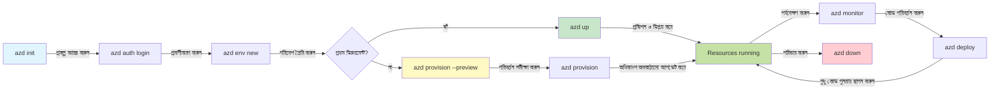
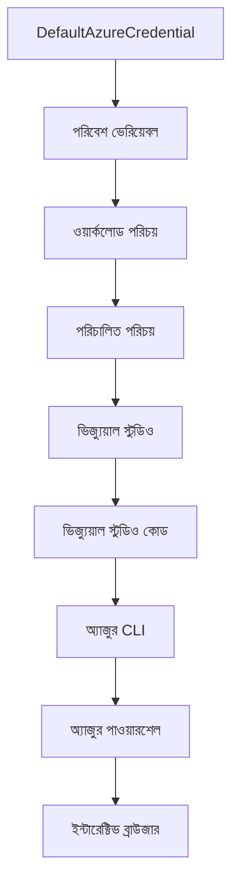

# AZD বেসিক্স - Azure Developer CLI বোঝা

# AZD বেসিক্স - মূল ধারণা এবং ভিত্তি

**অধ্যায় নেভিগেশন:**
- **📚 কোর্স হোম**: [AZD For Beginners](../../README.md)
- **📖 বর্তমান অধ্যায়**: অধ্যায় ১ - ভিত্তি ও দ্রুত শুরু
- **⬅️ পূর্ববর্তী**: [কোর্স ওভারভিউ](../../README.md#-chapter-1-foundation--quick-start)
- **➡️ পরবর্তী**: [ইনস্টলেশন ও সেটআপ](installation.md)
- **🚀 পরবর্তী অধ্যায়**: [অধ্যায় ২: AI-ফার্স্ট ডেভেলপমেন্ট](../chapter-02-ai-development/microsoft-foundry-integration.md)

## পরিচিতি

এই পাঠে আপনাকে Azure Developer CLI (azd) পরিচয় করানো হবে, একটি শক্তিশালী কমান্ড-লাইন টুল যা আপনার স্থানীয় ডেভেলপমেন্ট থেকে Azure ডিপ্লয়মেন্ট পর্যন্ত যাত্রা দ্রুততর করে। আপনি শেখাবেন মূল ধারণা, মূল বৈশিষ্ট্য, এবং বুঝবেন azd কীভাবে ক্লাউড-নেটিভ অ্যাপ্লিকেশন ডিপ্লয়মেন্ট সহজ করে তোলে।

## শেখার লক্ষ্যসমূহ

এই পাঠ শেষে আপনি:
- জানতে পারবেন Azure Developer CLI কী এবং এর প্রধান উদ্দেশ্য কী
- টেমপ্লেট, পরিবেশ, এবং সার্ভিসের মূল ধারণা শেখা
- টেমপ্লেট-চালিত ডেভেলপমেন্ট এবং ইনফ্রাস্ট্রাকচার অ্যাজ কোডসহ প্রধান বৈশিষ্ট্যগুলি অন্বেষণ করা
- azd প্রকল্পের কাঠামো এবং ওয়ার্কফ্লো বুঝতে পারবেন
- আপনার ডেভেলপমেন্ট পরিবেশে azd ইনস্টল ও কনফিগার করতে প্রস্তুত হবেন

## শেখার ফলাফল

এই পাঠ সম্পন্ন করার পর আপনি সক্ষম হবেন:
- আধুনিক ক্লাউড ডেভেলপমেন্ট ওয়ার্কফ্লোতে azd এর ভূমিকা ব্যাখ্যা করতে
- azd প্রকল্প কাঠামোর উপাদানগুলি সনাক্ত করতে
- টেমপ্লেট, পরিবেশ, এবং সার্ভিস কিভাবে একসাথে কাজ করে তা বর্ণনা করতে
- azd দিয়ে ইনফ্রাস্ট্রাকচার অ্যাজ কোডের সুবিধাগুলি বুঝতে
- বিভিন্ন azd কমান্ড এবং তাদের উদ্দেশ্য চিনতে

## Azure Developer CLI (azd) কী?

Azure Developer CLI (azd) হলো একটি কমান্ড-লাইন টুল যা আপনার স্থানীয় ডেভেলপমেন্ট থেকে Azure ডিপ্লয়মেন্ট পর্যন্ত যাত্রা দ্রুত করে। এটি Azure-তে ক্লাউড-নেটিভ অ্যাপ্লিকেশন তৈরি, ডিপ্লয়, এবং পরিচালনা করার প্রক্রিয়া সহজ করে তোলে।

### azd দিয়ে কী ডিপ্লয় করতে পারেন?

azd বিস্তর ওয়ার্কলোড সমর্থন করে—এবং তালিকাটি ক্রমবর্ধমান। আজ আপনি azd ব্যবহার করে ডিপ্লয় করতে পারেন:

| ওয়ার্কলোড টাইপ | উদাহরণ | একই ওয়ার্কফ্লো? |
|---------------|----------|----------------|
| **প্রচলিত অ্যাপ্লিকেশন** | ওয়েব অ্যাপ, REST API, স্ট্যাটিক সাইট | ✅ `azd up` |
| **সার্ভিস এবং মাইক্রোসার্ভিস** | কনটেইনার অ্যাপ, ফাংশন অ্যাপ, বহু-সার্ভিস ব্যাকএন্ড | ✅ `azd up` |
| **AI-চালিত অ্যাপ্লিকেশন** | Microsoft Foundry মডেল সহ চ্যাট অ্যাপ, AI সার্চ সহ RAG সলিউশন | ✅ `azd up` |
| **বুদ্ধিমান এজেন্ট** | Foundry-হোস্টেড এজেন্ট, বহু-এজেন্ট অর্কেস্ট্রেশন | ✅ `azd up` |

মূল দৃষ্টিকোণ হলো **azd লাইফসাইকেল যাই ডিপ্লয় করুন না কেন একই থাকে**। আপনি একটি প্রকল্প শুরু করবেন, ইনফ্রাস্ট্রাকচার সরবরাহ করবেন, কোড ডিপ্লয় করবেন, অ্যাপ মনিটর করবেন এবং পরিষ্কার করবেন—হোক সেটা একটি সহজ ওয়েবসাইট অথবা একটি জটিল AI এজেন্ট।

এই ধারাবাহিকতা ডিজাইন অনুযায়ী। azd AI ক্ষমতাগুলিকে আপনার অ্যাপ্লিকেশনের আরেক ধরনের সার্ভিস হিসাবে বিবেচনা করে, যেটা পুরোপুরি ভিন্ন কিছু নয়। Microsoft Foundry মডেল দ্বারা সমর্থিত একটি চ্যাট এন্ডপয়েন্ট azd এর দৃষ্টিকোণে কেবল আরেকটি সার্ভিস যা কনফিগার এবং ডিপ্লয় করতে হয়।

### 🎯 কেন AZD ব্যবহার করবেন? বাস্তব-জগতের তুলনা

চলুন একটি সাধারণ ওয়েব অ্যাপ এবং ডাটাবেস ডিপ্লয়মেন্ট তুলনা করি:

#### ❌ AZD ছাড়া: ম্যানুয়াল Azure ডিপ্লয়মেন্ট (৩০+ মিনিট)

```bash
# ধাপ ১: রিসোর্স গ্রুপ তৈরি করুন
az group create --name myapp-rg --location eastus

# ধাপ ২: অ্যাপ সার্ভিস প্ল্যান তৈরি করুন
az appservice plan create --name myapp-plan \
  --resource-group myapp-rg \
  --sku B1 --is-linux

# ধাপ ৩: ওয়েব অ্যাপ তৈরি করুন
az webapp create --name myapp-web-unique123 \
  --resource-group myapp-rg \
  --plan myapp-plan \
  --runtime "NODE:18-lts"

# ধাপ ৪: কোসমস ডিবি অ্যাকাউন্ট তৈরি করুন (১০-১৫ মিনিট)
az cosmosdb create --name myapp-cosmos-unique123 \
  --resource-group myapp-rg \
  --kind MongoDB

# ধাপ ৫: ডাটাবেস তৈরি করুন
az cosmosdb mongodb database create \
  --account-name myapp-cosmos-unique123 \
  --resource-group myapp-rg \
  --name tododb

# ধাপ ৬: কালেকশন তৈরি করুন
az cosmosdb mongodb collection create \
  --account-name myapp-cosmos-unique123 \
  --resource-group myapp-rg \
  --database-name tododb \
  --name todos

# ধাপ ৭: কানেকশন স্ট্রিং পান
CONN_STR=$(az cosmosdb keys list \
  --name myapp-cosmos-unique123 \
  --resource-group myapp-rg \
  --type connection-strings \
  --query "connectionStrings[0].connectionString" -o tsv)

# ধাপ ৮: অ্যাপ সেটিংস কনফিগার করুন
az webapp config appsettings set \
  --name myapp-web-unique123 \
  --resource-group myapp-rg \
  --settings MONGODB_URI="$CONN_STR"

# ধাপ ৯: লগিং সক্ষম করুন
az webapp log config --name myapp-web-unique123 \
  --resource-group myapp-rg \
  --application-logging filesystem \
  --detailed-error-messages true

# ধাপ ১০: অ্যাপ্লিকেশন ইনসাইটস সেট আপ করুন
az monitor app-insights component create \
  --app myapp-insights \
  --location eastus \
  --resource-group myapp-rg

# ধাপ ১১: অ্যাপ ইনসাইটস ওয়েব অ্যাপের সাথে যুক্ত করুন
INSTRUMENTATION_KEY=$(az monitor app-insights component show \
  --app myapp-insights \
  --resource-group myapp-rg \
  --query "instrumentationKey" -o tsv)

az webapp config appsettings set \
  --name myapp-web-unique123 \
  --resource-group myapp-rg \
  --settings APPINSIGHTS_INSTRUMENTATIONKEY="$INSTRUMENTATION_KEY"

# ধাপ ১২: অ্যাপ্লিকেশন স্থানীয়ভাবে তৈরি করুন
npm install
npm run build

# ধাপ ১৩: ডেপ্লয়মেন্ট প্যাকেজ তৈরি করুন
zip -r app.zip . -x "*.git*" "node_modules/*"

# ধাপ ১৪: অ্যাপ্লিকেশন ডেপ্লয় করুন
az webapp deployment source config-zip \
  --resource-group myapp-rg \
  --name myapp-web-unique123 \
  --src app.zip

# ধাপ ১৫: অপেক্ষা করুন এবং প্রার্থনা করুন যেন এটি কাজ করে 🙏
# (কোনো স্বয়ংক্রিয় যাচাই নেই, ম্যানুয়াল টেস্টিং প্রয়োজন)
```

**সমস্যাসমূহ:**
- ❌ ১৫+ কমান্ড মনে রাখতে ও সঠিক ক্রমে চালাতে হবে
- ❌ ৩০-৪৫ মিনিট ম্যানুয়াল কাজের সময়
- ❌ ভুল হওয়ার সুযোগ বেশি (টাইপোগ্রাফিক ভুল, ভুল প্যারামিটার)
- ❌ টার্মিনাল ইতিহাসে সংযোগ স্ট্রিংস প্রকাশ পায়
- ❌ কিছু ভুল হলে স্বয়ংক্রিয় রোলব্যাক নেই
- ❌ টিম সদস্যদের জন্য অনুলিপি কঠিন
- ❌ প্রতিবার ভিন্ন (পুনরুৎপাদনযোগ্য নয়)

#### ✅ AZD দিয়ে: স্বয়ংক্রিয় ডিপ্লয়মেন্ট (৫টি কমান্ড, ১০-১৫ মিনিট)

```bash
# ধাপ 1: টেমপ্লেট থেকে প্রারম্ভ করুন
azd init --template todo-nodejs-mongo

# ধাপ 2: প্রমাণীকরণ করুন
azd auth login

# ধাপ 3: পরিবেশ তৈরি করুন
azd env new dev

# ধাপ 4: পরিবর্তনগুলি প্রিভিউ করুন (ঐচ্ছিক কিন্তু সুপারিশকৃত)
azd provision --preview

# ধাপ 5: সবকিছু স্থাপন করুন
azd up

# ✨ সম্পন্ন! সবকিছু স্থাপিত, কনফিগার করা এবং মনিটর করা হয়েছে
```

**সুবিধাসমূহ:**
- ✅ **৫টি কমান্ড** বনাম ১৫+ ম্যানুয়াল ধাপ
- ✅ **১০-১৫ মিনিট** মোট সময় (প্রধানত Azure এর জন্য অপেক্ষা)
- ✅ **কম ম্যানুয়াল ভুল** - স্থায়ী, টেমপ্লেট-চালিত ওয়ার্কফ্লো
- ✅ **নিরাপদ সিক্রেট হ্যান্ডলিং** - অনেক টেমপ্লেট Azure পরিচালিত সিক্রেট স্টোরেজ ব্যবহার করে
- ✅ **পুনরাবৃত্তি সক্ষম ডিপ্লয়মেন্ট** - প্রতিবার একই ওয়ার্কফ্লো
- ✅ **সম্পূর্ণ পুনরুৎপাদনযোগ্য** - প্রত্যেকবার একই ফলাফল
- ✅ **টিম-সক্ষম** - যেকোনো ব্যক্তি একই কমান্ড দিয়ে ডিপ্লয় করতে পারে
- ✅ **ইনফ্রাস্ট্রাকচার অ্যাজ কোড** - সংস্করণ নিয়ন্ত্রিত Bicep টেমপ্লেট
- ✅ **অটোমেটেড মনিটরিং** - Application Insights স্বয়ংক্রিয়ভাবে কনফিগার করা হচ্ছে

### 📊 সময় ও ত্রুটি হ্রাস

| মেট্রিক | ম্যানুয়াল ডিপ্লয়মেন্ট | AZD ডিপ্লয়মেন্ট | উন্নতি |
|:-------|:------------------|:---------------|:------------|
| **কমান্ড** | ১৫+ | ৫ | ৬৭% কম |
| **সময়** | ৩০-৪৫ মিনিট | ১০-১৫ মিনিট | ৬০% দ্রুততর |
| **ত্রুটি হার** | ~৪০% | <৫% | ৮৮% হ্রাস |
| **কনসিস্টেন্সি** | কম (ম্যানুয়াল) | ১০০% (স্বয়ংক্রিয়) | নিখুঁত |
| **টিম অনবোর্ডিং** | ২-৪ ঘণ্টা | ৩০ মিনিট | ৭৫% দ্রুততর |
| **রোলব্যাক সময়** | ৩০+ মিনিট (ম্যানুয়াল) | ২ মিনিট (স্বয়ংক্রিয়) | ৯৩% দ্রুততর |

## মূল ধারণা

### টেমপ্লেট
টেমপ্লেট হলো azd এর ভিত্তি। এগুলোতে থাকে:
- **অ্যাপ্লিকেশন কোড** - আপনার সোর্স কোড এবং নির্ভরতাসমূহ
- **ইনফ্রাস্ট্রাকচার সংজ্ঞা** - Azure রিসোর্সগুলি Bicep বা Terraform এ সংজ্ঞায়িত
- **কনফিগারেশন ফাইল** - সেটিংস এবং পরিবেশ পরিবর্তনশীল
- **ডিপ্লয়মেন্ট স্ক্রিপ্ট** - স্বয়ংক্রিয় ডিপ্লয়মেন্ট ওয়ার্কফ্লো

### পরিবেশ
পরিবেশ বিভিন্ন ডিপ্লয়মেন্ট টার্গেট উপস্থাপন করে:
- **ডেভেলপমেন্ট** - পরীক্ষার জন্য ও ডেভেলপমেন্টের জন্য
- **স্টেজিং** - প্রি-প্রোডাকশন পরিবেশ
- **প্রোডাকশন** - লাইভ প্রোডাকশন পরিবেশ

প্রতিটি পরিবেশের নিজস্ব থাকে:
- Azure রিসোর্স গ্রুপ
- কনফিগারেশন সেটিংস
- ডিপ্লয়মেন্ট অবস্থা

### সার্ভিস
সার্ভিস হলো আপনার অ্যাপ্লিকেশনের নির্মাণ ব্লক:
- **ফ্রন্টএন্ড** - ওয়েব অ্যাপ্লিকেশন, SPA গুলো
- **ব্যাকএন্ড** - API, মাইক্রোসার্ভিসগুলি
- **ডাটাবেস** - ডেটা স্টোরেজ সলিউশন
- **স্টোরেজ** - ফাইল ও ব্লব স্টোরেজ

## প্রধান বৈশিষ্ট্য

### ১. টেমপ্লেট-চালিত ডেভেলপমেন্ট
```bash
# উপলব্ধ টেমপ্লেট ব্রাউজ করুন
azd template list

# একটি টেমপ্লেট থেকে শুরু করুন
azd init --template <template-name>
```

### ২. ইনফ্রাস্ট্রাকচার অ্যাজ কোড
- **Bicep** - Azure এর ডোমেইন-স্পেসিফিক ভাষা
- **Terraform** - মাল্টি-ক্লাউড ইনফ্রাস্ট্রাকচার টুল
- **ARM টেমপ্লেট** - Azure Resource Manager টেমপ্লেট

### ৩. ইন্টিগ্রেটেড ওয়ার্কফ্লো
```bash
# সম্পূর্ণ মোতায়েন কর্মপ্রবাহ
azd up            # প্রোভিশন + মোতায়েন এটি প্রথমবার সেটআপের জন্য হ্যান্ডস-অফ

# 🧪 নতুন: মোতায়েনের পূর্বে অবকাঠামো পরিবর্তনের পূর্বদর্শন (নিরাপদ)
azd provision --preview    # পরিবর্তন না করে অবকাঠামো মোতায়েন অনুকরণ করুন

azd provision     # Azure সম্পদ তৈরি করুন যদি আপনি অবকাঠামো আপডেট করেন এটি ব্যবহার করুন
azd deploy        # অ্যাপ্লিকেশন কোড মোতায়েন করুন বা আপডেটের পরে পুনরায় মোতায়েন করুন
azd down          # সম্পদ পরিষ্কার করুন
```

#### 🛡️ প্রিভিউ সহ নিরাপদ ইনফ্রাস্ট্রাকচার পরিকল্পনা
`azd provision --preview` কমান্ড নিরাপদ ডিপ্লয়মেন্টের জন্য একটি খেলা-পরিবর্তনকারী:
- **ড্রাই-রানের বিশ্লেষণ** - কী তৈরি, সংশোধিত, অথবা মুছে ফেলা হবে দেখায়
- **শূন্য ঝুঁকি** - Azure পরিবেশে কোনো আসল পরিবর্তন হয় না
- **টিম সহযোগিতা** - ডিপ্লয়মেন্টের আগে প্রিভিউ ফলাফল শেয়ার করুন
- **খরচের অনুমান** - প্রতিশ্রুতির আগে রিসোর্স খরচ বুঝুন

```bash
# উদাহরণ প্রিভিউ ওয়ার্কফ্লো
azd provision --preview           # দেখুন কী পরিবর্তন হবে
# আউটপুট পর্যালোচনা করুন, দলের সাথে আলোচনা করুন
azd provision                     # আত্মবিশ্বাসের সাথে পরিবর্তন প্রয়োগ করুন
```

### 📊 ভিজ্যুয়াল: AZD ডেভেলপমেন্ট ওয়ার্কফ্লো


**ওয়ার্কফ্লো ব্যাখ্যা:**
1. **Init** - টেমপ্লেট বা নতুন প্রকল্প দিয়ে শুরু করুন
2. **Auth** - Azure এর সাথে প্রমাণীকরণ
3. **Environment** - পৃথক ডিপ্লয়মেন্ট পরিবেশ তৈরি
4. **Preview** - 🆕 সব সময় ইনফ্রাস্ট্রাকচার পরিবর্তন আগে প্রিভিউ করুন (নিরাপদ অনুশীলন)
5. **Provision** - Azure রিসোর্স তৈরি/আপডেট
6. **Deploy** - আপনার অ্যাপ্লিকেশন কোড পাঠান
7. **Monitor** - অ্যাপ্লিকেশনের কর্মক্ষমতা পর্যবেক্ষণ করুন
8. **Iterate** - পরিবর্তন করুন এবং কোড পুনরায় ডিপ্লয় করুন
9. **Cleanup** - কাজ শেষ হলে রিসোর্সগুলো সরিয়ে ফেলুন

### ৪. পরিবেশ ব্যবস্থাপনা
```bash
# পরিবেশ তৈরি এবং পরিচালনা করুন
azd env new <environment-name>
azd env select <environment-name>
azd env list
```

### ৫. এক্সটেনশন এবং AI কমান্ড

azd পার্শ্বফল হিসেবে ক্ষমতা বাড়াতে এক্সটেনশন সিস্টেম ব্যবহার করে। এটি AI ওয়ার্কলোডের জন্য বিশেষভাবে উপযোগী:

```bash
# উপলব্ধ এক্সটেনশন তালিকা করুন
azd extension list

# Foundry এজেন্টস এক্সটেনশন ইনস্টল করুন
azd extension install azure.ai.agents

# একটি ম্যানিফেস্ট থেকে একটি এআই এজেন্ট প্রকল্প আরম্ভ করুন
azd ai agent init -m agent-manifest.yaml

# এআই-সহায়ক উন্নয়নের জন্য MCP সার্ভার চালু করুন (আলফা)
azd mcp start
```

> এক্সটেনশন বিস্তারিত আলোচনা করা হয়েছে [অধ্যায় ২: AI-ফার্স্ট ডেভেলপমেন্ট](../chapter-02-ai-development/agents.md) এবং [AZD AI CLI কমান্ডসমূহ](../chapter-08-production/production-ai-practices.md#azd-ai-cli-commands-and-extensions) রেফারেন্সে।

## 📁 প্রকল্প কাঠামো

একটি সাধারণ azd প্রকল্প কাঠামো:
```
my-app/
├── .azd/                    # azd configuration
│   └── config.json
├── .azure/                  # Azure deployment artifacts
├── .devcontainer/          # Development container config
├── .github/workflows/      # GitHub Actions
├── .vscode/               # VS Code settings
├── infra/                 # Infrastructure code
│   ├── main.bicep        # Main infrastructure template
│   ├── main.parameters.json
│   └── modules/          # Reusable modules
├── src/                  # Application source code
│   ├── api/             # Backend services
│   └── web/             # Frontend application
├── azure.yaml           # azd project configuration
└── README.md
```

## 🔧 কনফিগারেশন ফাইল

### azure.yaml
প্রধান প্রকল্প কনফিগারেশন ফাইল:
```yaml
name: my-awesome-app
metadata:
  template: my-template@1.0.0

services:
  web:
    project: ./src/web
    language: js
    host: appservice
  api:
    project: ./src/api
    language: js
    host: appservice

hooks:
  preprovision:
    shell: pwsh
    run: echo "Preparing to provision..."
```

### .azure/config.json
পরিবেশ-নির্দিষ্ট কনফিগারেশন:
```json
{
  "version": 1,
  "defaultEnvironment": "dev",
  "environments": {
    "dev": {
      "subscriptionId": "your-subscription-id",
      "location": "eastus"
    }
  }
}
```

## 🎪 সাধারণ ওয়ার্কফ্লো হাতেকলমে অনুশীলনসহ

> **💡 শেখার টিপ্:** আপনার AZD দক্ষতা পর্যায়ক্রমে গড়ে তুলতে এই অনুশীলনগুলো ক্রম অনুসারে অনুসরণ করুন।

### 🎯 অনুশীলন ১: প্রথম প্রকল্প শুরু করা

**লক্ষ্য:** একটি AZD প্রকল্প তৈরি এবং তার কাঠামো অন্বেষণ করা

**ধাপসমূহ:**
```bash
# একটি প্রমাণিত টেমপ্লেট ব্যবহার করুন
azd init --template todo-nodejs-mongo

# তৈরি করা ফাইলগুলি অন্বেষণ করুন
ls -la  # লুকানো ফাইলসহ সমস্ত ফাইল দেখুন

# তৈরি করা মূল ফাইলগুলো:
# - azure.yaml (মূল কনফিগ)
# - infra/ (ইনফ্রাস্ট্রাকচার কোড)
# - src/ (অ্যাপ্লিকেশন কোড)
```

**✅ সাফল্য:** আপনার কাছে azure.yaml, infra/, এবং src/ ডিরেক্টরি আছে

---

### 🎯 অনুশীলন ২: Azure-তে ডিপ্লয় করা

**লক্ষ্য:** শুরু থেকে শেষ পর্যন্ত ডিপ্লয়মেন্ট সম্পন্ন করা

**ধাপসমূহ:**
```bash
# 1. প্রমাণীকরণ
az login && azd auth login

# 2. পরিবেশ তৈরি করুন
azd env new dev
azd env set AZURE_LOCATION eastus

# 3. পরিবর্তনগুলি পূর্বদর্শন করুন (প্রস্তাবিত)
azd provision --preview

# 4. সবকিছু স্থাপন করুন
azd up

# 5. স্থাপন যাচাই করুন
azd show    # আপনার অ্যাপ URL দেখুন
```

**প্রত্যাশিত সময়:** ১০-১৫ মিনিট  
**✅ সাফল্য:** ব্রাউজারে অ্যাপ্লিকেশন URL খুলে যাবে

---

### 🎯 অনুশীলন ৩: একাধিক পরিবেশ

**লক্ষ্য:** dev এবং staging-এ ডিপ্লয় করা

**ধাপসমূহ:**
```bash
# ইতিমধ্যেই dev আছে, staging তৈরি করুন
azd env new staging
azd env set AZURE_LOCATION westus2
azd up

# তাদের মধ্যে স্যুইচ করুন
azd env list
azd env select dev
```

**✅ সাফল্য:** Azure পোর্টালে দুটি পৃথক রিসোর্স গ্রুপ তৈরি হয়েছে

---

### 🛡️ ক্লিন স্লেট: `azd down --force --purge`

যখন সম্পূর্ণরূপে রিসেট করতে হবে:

```bash
azd down --force --purge
```

**এটি কি করে:**
- `--force`: কোনো নিশ্চিতকরণ না চাইয়া কাজ করে
- `--purge`: সব স্থানীয় অবস্থা এবং Azure রিসোর্স মুছে ফেলে

**কোন সময় ব্যবহার করবেন:**
- ডিপ্লয়মেন্ট মাঝপথে ব্যর্থ হলে
- প্রকল্প পরিবর্তন করলে
- নতুন শুরু দরকার হলে

---

## 🎪 মূল ওয়ার্কফ্লো রেফারেন্স

### নতুন প্রকল্প শুরু করা
```bash
# পদ্ধতি ১: বিদ্যমান টেমপ্লেট ব্যবহার করুন
azd init --template todo-nodejs-mongo

# পদ্ধতি ২: সম্পূর্ণ নতুন থেকে শুরু করুন
azd init

# পদ্ধতি ৩: বর্তমান ডিরেক্টরি ব্যবহার করুন
azd init .
```

### ডেভেলপমেন্ট সাইকেল
```bash
# উন্নয়ন পরিবেশ সেট আপ করুন
azd auth login
azd env new dev
azd env select dev

# সবকিছু স্থাপন করুন
azd up

# পরিবর্তন করুন এবং পুনরায় স্থাপন করেন
azd deploy

# কাজ শেষ হলে পরিষ্কার করুন
azd down --force --purge # Azure Developer CLI-তে কমান্ডটি আপনার পরিবেশের জন্য একটি **হার্ড রিসেট** — বিশেষ করে যখন আপনি ব্যর্থ স্থাপনা সমাধান করছেন, পরিত্যক্ত সম্পদ পরিষ্কার করছেন, অথবা নতুন করে পুনরায় স্থাপনার প্রস্তুতি নিচ্ছেন তখন এটি খুবই উপকারী।
```

## `azd down --force --purge` বোঝা

`azd down --force --purge` কমান্ড হলো আপনার azd পরিবেশ এবং সব সংশ্লিষ্ট রিসোর্স সম্পূর্ণরূপে বন্ধ করার একটি শক্তিশালী উপায়। প্রতিটি ফ্ল্যাগের কাজের বিবরণ নিচে:

```
--force
```
- নিশ্চিতকরণ প্রম্পট এড়িয়ে যায়।
- স্বয়ংক্রিয়তা বা স্ক্রিপ্টিংয়ের জন্য উপযোগী যেখানে ম্যানুয়াল ইনপুট সম্ভব নয়।
- কোনো বিরতি ছাড়াই বন্ধ করার প্রক্রিয়া নিশ্চিত করে, এমনকি CLI অসঙ্গতি সনাক্ত করলে।

```
--purge
```
মুছে ফেলে **সব সংযুক্ত মেটাডেটা**, যার মধ্যে রয়েছে:
পরিবেশ অবস্থা
লোকাল `.azure` ফোল্ডার
ক্যাশ করা ডিপ্লয়মেন্ট তথ্য
azd কে পূর্ববর্তী ডিপ্লয়মেন্ট “মনে রাখতে” বাধা দেয়, যা ভুল রিসোর্স গ্রুপ বা পুরনো রেজিস্ট্রি রেফারেন্সের মতো সমস্যা সৃষ্টি করতে পারে।

### কেন দুটো ফ্ল্যাগ একসঙ্গে ব্যবহার করবেন?

যখন `azd up` এ মৃত অবস্থান বা আংশিক ডিপ্লয়মেন্টের কারণে সমস্যা হয়, তখন এই কম্বো নিশ্চিত করে একটি **পরিপাটি শুরু**।

এটি বিশেষ করে Azure পোর্টালে ম্যানুয়াল রিসোর্স মুছে ফেলার পর অথবা টেমপ্লেট, পরিবেশ, বা রিসোর্স গ্রুপ নামকরণের পরিবর্তন করার সময় কাজে লাগে।

### একাধিক পরিবেশ ব্যবস্থাপনা
```bash
# স্টেজিং পরিবেশ তৈরি করুন
azd env new staging
azd env select staging
azd up

# ডেভ-এ ফিরে যান
azd env select dev

# পরিবেশগুলোর তুলনা করুন
azd env list
```

## 🔐 প্রমাণীকরণ এবং ক্রেডেনশিয়াল

সফল azd ডিপ্লয়মেন্টের জন্য প্রমাণীকরণ বোঝা অত্যাবশ্যক। Azure বিভিন্ন প্রমাণীকরণ পদ্ধতি ব্যবহার করে এবং azd অন্যান্য Azure সরঞ্জাম দ্বারা ব্যবহৃত একই ক্রেডেনশিয়াল চেইন ব্যবহার করে।

### Azure CLI Authentication (`az login`)

azd ব্যবহার করার আগে Azure-এ প্রমাণীকরণ করা প্রয়োজন। সবচেয়ে সাধারণ পদ্ধতি হলো Azure CLI ব্যবহার:

```bash
# ইন্টারেক্টিভ লগইন (ব্রাউজার খুলবে)
az login

# নির্দিষ্ট টেন্যান্ট দিয়ে লগইন করুন
az login --tenant <tenant-id>

# সার্ভিস প্রিন্সিপালের মাধ্যমে লগইন করুন
az login --service-principal -u <app-id> -p <password> --tenant <tenant-id>

# বর্তমান লগইন অবস্থা পরীক্ষা করুন
az account show

# উপলব্ধ সাবস্ক্রিপশন তালিকা করুন
az account list --output table

# ডিফল্ট সাবস্ক্রিপশন সেট করুন
az account set --subscription <subscription-id>
```

### প্রমাণীকরণ প্রবাহ
১. **ইন্টারেক্টিভ লগইন:** আপনার ডিফল্ট ব্রাউজার খুলে প্রমাণীকরণ সম্পন্ন করা
২. **ডিভাইস কোড ফ্লো:** ব্রাউজার অ্যাক্সেস না থাকা পরিবেশের জন্য
৩. **সার্ভিস প্রিন্সিপাল:** অটোমেশন এবং CI/CD ক্ষেত্রে
৪. **ম্যানেজড আইডেন্টিটি:** Azure-হোস্টেড অ্যাপ্লিকেশনের জন্য

### DefaultAzureCredential চেইন

`DefaultAzureCredential` হলো একটি ক্রেডেনশিয়াল টাইপ যা সহজীকৃত প্রমাণীকরণ অভিজ্ঞতা দেয় স্বয়ংক্রিয়ভাবে বিভিন্ন ক্রেডেনশিয়াল সূত্র নির্দিষ্ট ক্রমে চেষ্টা করে:

#### ক্রেডেনশিয়াল চেইনের ক্রম

#### ১. পরিবেশ ভেরিয়েবল
```bash
# সার্ভিস প্রিন্সিপালের জন্য পরিবেশ ভেরিয়েবল সেট করুন
export AZURE_CLIENT_ID="<app-id>"
export AZURE_CLIENT_SECRET="<password>"
export AZURE_TENANT_ID="<tenant-id>"
```

#### ২. ওয়ার্কলোড আইডেন্টিটি (Kubernetes/GitHub Actions)
অটোমেটিক্যালি ব্যবহার হয়:
- Azure Kubernetes Service (AKS) ওয়ার্কলোড আইডেন্টিটির সাথে
- GitHub Actions OIDC ফেডারেশন সহ
- অন্যান্য ফেডারেটেড আইডেন্টিটি ব্যবস্থায়

#### ৩. ম্যানেজড আইডেন্টিটি
Azure রিসোর্স যেমন:
- ভার্চুয়াল মেশিন
- অ্যাপ সার্ভিস
- Azure Functions
- কনটেইনার ইনস্ট্যান্সগুলোর জন্য

```bash
# ম্যানেজড আইডেন্টিটি সহ Azure রিসোর্সে চলছে কিনা পরীক্ষা করুন
az account show --query "user.type" --output tsv
# রিটার্ন করে: যদি ম্যানেজড আইডেন্টিটি ব্যবহার করা হয় তবে "servicePrincipal"
```

#### ৪. ডেভেলপার টুল ইন্টিগ্রেশন
- **Visual Studio:** স্বয়ংক্রিয়ভাবে সাইন ইন করা অ্যাকাউন্ট ব্যবহার করে
- **VS Code:** Azure Account এক্সটেনশন ক্রেডেনশিয়াল ব্যবহার করে
- **Azure CLI:** `az login` ক্রেডেনশিয়াল ব্যবহার করে (স্থানীয় ডেভেলপমেন্টের জন্য সবচেয়ে সাধারণ)

### AZD প্রমাণীকরণ সেটআপ

```bash
# পদ্ধতি ১: Azure CLI ব্যবহার করুন (উন্নয়নের জন্য প্রস্তাবিত)
az login
azd auth login  # বিদ্যমান Azure CLI শংসাপত্রগুলি ব্যবহার করে

# পদ্ধতি ২: সরাসরি azd প্রমাণীকরণ
azd auth login --use-device-code  # হেডলেস পরিবেশের জন্য

# পদ্ধতি ৩: প্রমাণীকরণ স্থিতি চেক করুন
azd auth login --check-status

# পদ্ধতি ৪: লগআউট করুন এবং পুনরায় প্রমাণীকরণ করুন
azd auth logout
azd auth login
```

### প্রমাণীকরণের সেরা অনুশীলন

#### স্থানীয় ডেভেলপমেন্টের জন্য
```bash
# 1. Azure CLI দিয়ে লগইন করুন
az login

# 2. সঠিক সাবস্ক্রিপশন যাচাই করুন
az account show
az account set --subscription "Your Subscription Name"

# 3. বিদ্যমান কারিগরি তথ্য দিয়ে azd ব্যবহার করুন
azd auth login
```

#### CI/CD পাইপলাইনগুলোর জন্য
```yaml
# GitHub Actions example
- name: Azure Login
  uses: azure/login@v1
  with:
    creds: ${{ secrets.AZURE_CREDENTIALS }}

- name: Deploy with azd
  run: |
    azd auth login --client-id ${{ secrets.AZURE_CLIENT_ID }} \
                    --client-secret ${{ secrets.AZURE_CLIENT_SECRET }} \
                    --tenant-id ${{ secrets.AZURE_TENANT_ID }}
    azd up --no-prompt
```

#### প্রোডাকশন পরিবেশের জন্য
- Azure রিসোর্সে চলাকালে **ম্যানেজড আইডেন্টিটি** ব্যবহার করুন
- অটোমেশন ক্ষেত্রে **সার্ভিস প্রিন্সিপাল** ব্যবহার করুন
- কোড বা কনফিগারেশন ফাইলে ক্রেডেনশিয়াল সংরক্ষণ এড়ান
- সংবেদনশীল কনফিগারেশনের জন্য **Azure Key Vault** ব্যবহার করুন

### সাধারণ প্রমাণীকরণ সমস্যা এবং সমাধান

#### সমস্যা: "কোনো সাবস্ক্রিপশন পাওয়া যায়নি"
```bash
# সমাধান: ডিফল্ট সাবস্ক্রিপশন সেট করুন
az account list --output table
az account set --subscription "<subscription-id>"
azd env set AZURE_SUBSCRIPTION_ID "<subscription-id>"
```

#### সমস্যা: "অপর্যাপ্ত অনুমতি"
```bash
# সমাধান: প্রয়োজনীয় ভূমিকা যাচাই এবং নিয়োগ করুন
az role assignment list --assignee $(az account show --query user.name --output tsv)

# সাধারণ প্রয়োজনীয় ভূমিকা:
# - কন্ট্রিবিউটর (সম্পদ পরিচালনার জন্য)
# - ব্যবহারকারী অ্যাক্সেস প্রশাসক (ভূমিকা নিয়োগের জন্য)
```

#### সমস্যা: "টোকেনের মেয়াদ উত্তীর্ণ"
```bash
# সমাধান: পুনরায় প্রমাণীকরণ করুন
az logout
az login
azd auth logout
azd auth login
```

### বিভিন্ন পরিস্থিতিতে প্রমাণীকরণ

#### স্থানীয় ডেভেলপমেন্ট
```bash
# ব্যক্তিগত উন্নয়ন অ্যাকাউন্ট
az login
azd auth login
```

#### টিম ডেভেলপমেন্ট
```bash
# সংস্থার জন্য নির্দিষ্ট ভাড়াটেকে ব্যবহার করুন
az login --tenant contoso.onmicrosoft.com
azd auth login
```

#### বহু-টেন্যান্ট পরিস্থিতি
```bash
# টেন্যান্টদের মধ্যে সুইচ করুন
az login --tenant tenant1.onmicrosoft.com
# টেন্যান্ট ১-এ ডিপ্লয় করুন
azd up

az login --tenant tenant2.onmicrosoft.com  
# টেন্যান্ট ২-এ ডিপ্লয় করুন
azd up
```

### নিরাপত্তা বিবেচনা
1. **প্রমাণপত্র সংরক্ষণ**: সোর্স কোডে কখনো প্রমাণপত্র সংরক্ষণ করবেন না  
2. **মূল্যমান সীমাবদ্ধকরণ**: সার্ভিস প্রিন্সিপালের জন্য সর্বনিম্ন-অনুমতি নীতি ব্যবহার করুন  
3. **টোকেন রোটেশন**: নিয়মিত সার্ভিস প্রিন্সিপাল সিক্রেটস রোটেট করুন  
4. **অডিট ট্রেল**: প্রমাণীকরণ এবং ডিপ্লয়মেন্ট কার্যক্রম মনিটার করুন  
5. **নেটওয়ার্ক সিকিউরিটি**: সম্ভব হলে প্রাইভেট এন্ডপয়েন্ট ব্যবহার করুন  

### প্রমাণীকরণ সমাধান সমস্যাগুলো

```bash
# প্রমাণীকরণ সমস্যাগুলি ডিবাগ করুন
azd auth login --check-status
az account show
az account get-access-token

# সাধারণ নির্ণায়ক কমান্ডসমূহ
whoami                          # বর্তমান ব্যবহারকারী প্রসঙ্গ
az ad signed-in-user show      # আজুর এডি ব্যবহারকারীর বিবরণ
az group list                  # রিসোর্স অ্যাক্সেস পরীক্ষা করুন
```

## `azd down --force --purge` বুঝতে

### আবিষ্কার
```bash
azd template list              # টেমপ্লেট ব্রাউজ করুন
azd template show <template>   # টেমপ্লেটের বিবরণ
azd init --help               # ইনিশিয়ালাইজেশন বিকল্পসমূহ
```

### প্রকল্প ব্যবস্থাপনা
```bash
azd show                     # প্রকল্পের সংক্ষিপ্ত বিবরণ
azd env list                # উপলভ্য পরিবেশ এবং নির্বাচিত ডিফল্ট
azd config show            # কনফিগারেশন সেটিংস
```

### মনিটরিং
```bash
azd monitor                  # Azure পোর্টাল নজরদারি খুলুন
azd monitor --logs           # অ্যাপ্লিকেশন লগ দেখুন
azd monitor --live           # লাইভ মেট্রিক্স দেখুন
azd pipeline config          # CI/CD সেট আপ করুন
```

## শ্রেষ্ঠ অভ্যাসসমূহ

### ১. অর্থবহ নাম ব্যবহার করুন
```bash
# ভাল
azd env new production-east
azd init --template web-app-secure

# এড়িয়ে চলুন
azd env new env1
azd init --template template1
```

### ২. টেমপ্লেট ব্যাবহার করুন
- বিদ্যমান টেমপ্লেট থেকে শুরু করুন
- আপনার প্রয়োজন অনুযায়ী কাস্টমাইজ করুন
- আপনার প্রতিষ্ঠানের জন্য পুনঃব্যবহারযোগ্য টেমপ্লেট তৈরি করুন

### ৩. পরিবেশ আলাদা করুন
- dev/staging/prod এর জন্য আলাদা আলাদা পরিবেশ ব্যবহার করুন
- স্থানীয় মেশিন থেকে সরাসরি প্রোডাকশনে কখনো ডিপ্লয় করবেন না
- প্রোডাকশন ডিপ্লয়মেন্টের জন্য CI/CD পাইপলাইন ব্যবহার করুন

### ৪. কনফিগারেশন ম্যানেজমেন্ট
- সংবেদনশীল ডেটার জন্য পরিবেশ ভেরিয়েবল ব্যবহার করুন
- কনফিগারেশন ভার্সন কন্ট্রোলে রাখুন
- পরিবেশ-নির্দিষ্ট সেটিংস ডকুমেন্ট করুন

## শেখার পর্যায়ক্রম

### নতুনদের জন্য (সপ্তাহ ১-২)
১. azd ইনস্টল করুন এবং প্রমাণীকরণ করুন  
২. একটি সাধারণ টেমপ্লেট ডিপ্লয় করুন  
৩. প্রকল্প গঠন বুঝুন  
৪. বেসিক কমান্ড শেখা (up, down, deploy)  

### মাঝামাঝি (সপ্তাহ ৩-৪)
১. টেমপ্লেট কাস্টমাইজ করুন  
২. একাধিক পরিবেশ পরিচালনা করুন  
৩. অবকাঠামো কোড বুঝুন  
৪. CI/CD পাইপলাইন সেটআপ করুন  

### উন্নত (সপ্তাহ ৫+)
১. কাস্টম টেমপ্লেট তৈরি করুন  
২. উন্নত অবকাঠামো প্যাটার্ন  
৩. মাল্টি-রিজিয়ন ডিপ্লয়মেন্ট  
৪. এন্টারপ্রাইজ-গ্রেড কনফিগারেশন  

## পরবর্তী ধাপ

**📖 অধ্যায় ১ শেখা চালিয়ে যান:**  
- [ইনস্টলেশন ও সেটআপ](installation.md) - azd ইনস্টল ও কনফিগার করুন  
- [আপনার প্রথম প্রকল্প](first-project.md) - হাতে কলমে টিউটোরিয়াল সম্পন্ন করুন  
- [কনফিগারেশন গাইড](configuration.md) - উন্নত কনফিগারেশন বিকল্প  

**🎯 পরবর্তী অধ্যায়ের জন্য প্রস্তুত?**  
- [অধ্যায় ২: AI-প্রথম উন্নয়ন](../chapter-02-ai-development/microsoft-foundry-integration.md) - AI অ্যাপ্লিকেশন তৈরি শুরু করুন  

## অতিরিক্ত উৎস

- [Azure Developer CLI ওভারভিউ](https://learn.microsoft.com/en-us/azure/developer/azure-developer-cli/)  
- [টেমপ্লেট গ্যালারি](https://azure.github.io/awesome-azd/)  
- [কমিউনিটি স্যাম্পলস](https://github.com/Azure-Samples)  

---

## 🙋 প্রায়শই জিজ্ঞাসিত প্রশ্নাবলী

### সাধারণ প্রশ্ন

**প্র: AZD এবং Azure CLI এর মধ্যে পার্থক্য কী?**

উ: Azure CLI (`az`) নির্দিষ্ট Azure রিসোর্স ম্যানেজ করার জন্য। AZD (`azd`) সম্পূর্ণ অ্যাপ্লিকেশন ম্যানেজ করার জন্য:

```bash
# Azure CLI - নিম্নস্তরের রিসোর্স ব্যবস্থাপনা
az webapp create --name myapp --resource-group rg
az sql server create --name myserver --resource-group rg
# ...আরও অনেক কমান্ড প্রয়োজন

# AZD - অ্যাপ্লিকেশন স্তরের ব্যবস্থাপনা
azd up  # সমস্ত রিসোর্সসহ পুরো অ্যাপ মোতায়েন করে
```

**এইভাবে ভাবুন:**  
- `az` = পৃথক লেগো ব্লক নিয়ে কাজ  
- `azd` = সম্পূর্ণ লেগো সেট নিয়ে কাজ  

---

**প্র: AZD ব্যবহার করার জন্য কি Bicep বা Terraform জানা প্রয়োজন?**

উ: না! টেমপ্লেট দিয়ে শুরু করুন:  
```bash
# বিদ্যমান টেম্পলেট ব্যবহার করুন - কোনো IaC জ্ঞানের প্রয়োজন নেই
azd init --template todo-nodejs-mongo
azd up
```
  
বাইসপ পরে শিখে অবকাঠামো কাস্টমাইজ করতে পারেন। টেমপ্লেট গুলো শেখার জন্য কাজ করা উদাহরণ দেয়।  

---

**প্র: AZD টেমপ্লেট চালাতে কত খরচ হয়?**

উ: টেমপ্লেট অনুযায়ী খরচ ভিন্ন হয়। বেশিরভাগ ডেভেলপমেন্ট টেমপ্লেট $50-150/মাস খরচ হতে পারে:

```bash
# বিতরণ করার আগে খরচের পূর্বরূপ দেখুন
azd provision --preview

# ব্যবহার না করলে সর্বদা পরিস্কার করুন
azd down --force --purge  # সমস্ত সম্পদ অপসারণ করে
```

**পেশাদার টিপ:** যেখানে সম্ভব ফ্রি স্তর ব্যবহার করুন:
- অ্যাপ সার্ভিস: F1 (ফ্রি) টিয়ার
- Microsoft Foundry মডেল: Azure OpenAI প্রতি মাসে ৫০,০০০ টোকেন ফ্রি
- Cosmos DB: ১০০০ RU/s ফ্রি স্তর

---

**প্র: AZD কি আমি বিদ্যমান Azure রিসোর্স নিয়ে ব্যবহার করতে পারি?**

উ: হ্যাঁ, কিন্তু নতুন থেকে শুরু করা সহজ। AZD পুরো জীবনচক্র পরিচালনা করলে সবচেয়ে ভাল কাজ করে। বিদ্যমান রিসোর্স জন্য:

```bash
# বিকল্প ১: বিদ্যমান রিসোর্স আমদানি করুন (উন্নত)
azd init
# তারপর infra/ সংশোধন করে বিদ্যমান রিসোর্স উল্লেখ করুন

# বিকল্প ২: নতুন শুরু করুন (প্রস্তাবিত)
azd init --template matching-your-stack
azd up  # নতুন পরিবেশ তৈরি করে
```

---

**প্র: কিভাবে আমার প্রকল্প সহকর্মীদের সাথে শেয়ার করব?**

উ: AZD প্রকল্প Git এ কমিট করুন (কিন্তু `.azure` ফোল্ডার নয়):

```bash
# পূর্বে ডিফল্টরূপে .gitignore এ আছে
.azure/        # গোপন তথ্য এবং পরিবেশ ডেটা ধারণ করে
*.env          # পরিবেশ ভেরিয়েবলসমূহ

# তারপর দলের সদস্যরা:
git clone <your-repo>
azd auth login
azd env new <their-name>-dev
azd up
```
  
সবার কাছেই একই অবকাঠামো একই টেমপ্লেট থেকে পাওয়া যাবে।

---

### সমস্যা সমাধানের প্রশ্ন

**প্র: "azd up" আংশিকভাবে ব্যর্থ হয়েছে। কি করব?**

উ: ত্রুটি চেক করুন, ঠিক করুন এবং পুনরায় চেষ্টা করুন:

```bash
# বিস্তারিত লগ দেখুন
azd show

# সাধারণ সমাধানসমূহ:

# ১। যদি কোটা অতিক্রম হয়:
azd env set AZURE_LOCATION "westus2"  # ভিন্ন অঞ্চল চেষ্টা করুন

# ২। যদি রিসোর্স নামের দ্বন্দ্ব হয়:
azd down --force --purge  # পরিষ্কার শুরু করুন
azd up  # পুনরায় চেষ্টা করুন

# ৩। যদি অথেন্টিকেশন মেয়াদ উত্তীর্ণ হয়:
az login
azd auth login
azd up
```
  
**সর্বাধিক সাধারণ সমস্যা:** ভুল Azure সাবস্ক্রিপশন নির্বাচন করা হয়েছে  
```bash
az account list --output table
az account set --subscription "<correct-subscription>"
```

---

**প্র: কেবল কোড পরিবর্তন ডিপ্লয় করতে পারি কি, অবকাঠামো পুনর্বিন্যাস ছাড়া?**

উ: `azd up` এর বদলে `azd deploy` ব্যবহার করুন:

```bash
azd up          # প্রথম বার: প্রোভিশন + ডিপ্লয় (ধীর)

# কোড পরিবর্তন করুন...

azd deploy      # পরবর্তী বার: শুধুমাত্র ডিপ্লয় (দ্রুত)
```
  
গতি তুলনা:  
- `azd up`: ১০-১৫ মিনিট (অবকাঠামো প্রোভিশন করে)  
- `azd deploy`: ২-৫ মিনিট (কেবল কোড)  

---

**প্র: অবকাঠামো টেমপ্লেট কাস্টমাইজ করতে পারি?**

উ: হ্যাঁ! `infra/` ডিরেক্টরির Bicep ফাইলগুলো সম্পাদনা করুন:

```bash
# আজদ ইনিট করার পরে
cd infra/
code main.bicep  # VS কোডে সম্পাদনা করুন

# পরিবর্তনগুলি পূর্বদর্শন করুন
azd provision --preview

# পরিবর্তনগুলি প্রয়োগ করুন
azd provision
```
  
**টিপ:** ছোট থেকে শুরু করুন - প্রথমে SKU পরিবর্তন করুন:  
```bicep
// infra/main.bicep
sku: {
  name: 'B1'  // Change to 'P1V2' for production
}
```

---

**প্র: AZD কি তৈরি করেছিল সবকিছু আমি কিভাবে মুছব?**

উ: একটি কমান্ডে সব রিসোর্স সরানো যায়:

```bash
azd down --force --purge

# এটি মুছে ফেলে:
# - সব Azure সম্পদ
# - রিসোর্স গ্রুপ
# - স্থানীয় পরিবেশের অবস্থা
# - ক্যাশ করা মোতায়েন তথ্য
```
  
**সবসময় চালান যখন:**  
- টেমপ্লেট পরীক্ষা শেষ  
- ভিন্ন প্রকল্পে স্যুইচ করছেন  
- নতুন করে শুরু করতে চান  

**খরচ সঞ্চয়:** ব্যবহার না করা রিসোর্স ডিলিট করলে খরচ হয় না  

---

**প্র: ভুলক্রমে Azure পোর্টালে রিসোর্স মুছে ফেললে?**

উ: AZD এর স্টেট সিঙ্ক থেকে বাইরে যেতে পারে। পরিষ্কার শুরু কখনোই ভালো:

```bash
# ১. স্থানীয় অবস্থা অপসারণ করুন
azd down --force --purge

# ২. নতুন করে শুরু করুন
azd up

# বিকল্প: AZD-কে সনাক্ত এবং মেরামত করতে দিন
azd provision  # অনুপস্থিত সম্পদ তৈরি করবে
```

---

### উন্নত প্রশ্ন

**প্র: AZD কি CI/CD পাইপলাইনে ব্যবহার করা যায়?**

উ: হ্যাঁ! GitHub Actions এর একটি উদাহরণ:

```yaml
# .github/workflows/deploy.yml
name: Deploy with AZD

on:
  push:
    branches: [main]

jobs:
  deploy:
    runs-on: ubuntu-latest
    steps:
      - uses: actions/checkout@v2
      
      - name: Install azd
        run: curl -fsSL https://aka.ms/install-azd.sh | bash
      
      - name: Azure Login
        run: |
          azd auth login \
            --client-id ${{ secrets.AZURE_CLIENT_ID }} \
            --client-secret ${{ secrets.AZURE_CLIENT_SECRET }} \
            --tenant-id ${{ secrets.AZURE_TENANT_ID }}
      
      - name: Deploy
        run: azd up --no-prompt
```

---

**প্র: সিক্রেট এবং সংবেদনশীল ডেটা কিভাবে হ্যান্ডেল করব?**

উ: AZD স্বয়ংক্রিয়ভাবে Azure Key Vault এর সাথে ইন্টিগ্রেটেড:

```bash
# গোপনীয় তথ্য কোডে নয়, ক Schlüssel Vault-এ সংরক্ষিত হয়
azd env set DATABASE_PASSWORD "$(openssl rand -base64 32)"

# AZD স্বয়ংক্রিয়ভাবে:
# 1. ক Schlüssel Vault তৈরি করে
# 2. গোপনীয় তথ্য সংরক্ষিত করে
# 3. ম্যানেজড আইডেন্টিটির মাধ্যমে অ্যাপের অ্যাক্সেস প্রদান করে
# 4. রানটাইমে ইনজেক্ট করে
```
  
**কখনো কমিট করবেন না:**  
- `.azure/` ফোল্ডার (পরিবেশ ডেটা থাকে)  
- `.env` ফাইল (স্থানীয় সিক্রেট)  
- কানেকশন স্ট্রিং  

---

**প্র: একাধিক অঞ্চলে ডিপ্লয় করতে পারি?**

উ: হ্যাঁ, প্রতিটি অঞ্চলের জন্য আলাদা পরিবেশ তৈরি করুন:

```bash
# পূর্ব যুক্তরাষ্ট্র পরিবেশ
azd env new prod-eastus
azd env set AZURE_LOCATION eastus
azd up

# পশ্চিম ইউরোপ পরিবেশ
azd env new prod-westeurope
azd env set AZURE_LOCATION westeurope
azd up

# প্রতিটি পরিবেশ স্বতন্ত্র
azd env list
```
  
বাস্তব মাল্টি-রিজিয়ন অ্যাপ্লিকেশনের জন্য, Bicep টেমপ্লেট কাস্টমাইজ করে একসাথে একাধিক অঞ্চলে ডিপ্লয় করুন।  

---

**প্র: আটকা পড়লে সাহায্য কোথায় পাব?**

১. **AZD ডকুমেন্টেশন:** https://learn.microsoft.com/azure/developer/azure-developer-cli/  
২. **GitHub Issues:** https://github.com/Azure/azure-dev/issues  
৩. **Discord:** [Azure Discord](https://discord.gg/microsoft-azure) - #azure-developer-cli চ্যানেল  
৪. **Stack Overflow:** ট্যাগ `azure-developer-cli`  
৫. **এই কোর্স:** [সমস্যা সমাধান গাইড](../chapter-07-troubleshooting/common-issues.md)  

**পেশাদার টিপ:** প্রশ্ন করার আগে চালান:  
```bash
azd show       # বর্তমান অবস্থা দেখায়
azd version    # আপনার সংস্করণ দেখায়
```
  
দ্রুত সাহায্যের জন্য এই তথ্য প্রশ্নে অন্তর্ভুক্ত করুন।  

---

## 🎓 পরবর্তী কি?

এখন আপনি AZD এর মূল বিষয় বুঝেছেন। আপনার পথ বেছে নিন:

### 🎯 নতুনদের জন্য:  
১. **পরবর্তী:** [ইনস্টলেশন ও সেটআপ](installation.md) - আপনার মেশিনে AZD ইনস্টল করুন  
২. **তারপর:** [আপনার প্রথম প্রকল্প](first-project.md) - আপনার প্রথম অ্যাপ্লিকেশন ডিপ্লয় করুন  
৩. **চর্চা:** এই লেশনের ৩টি অনুশীলন সম্পন্ন করুন  

### 🚀 AI ডেভেলপারদের জন্য:  
১. **সরাসরি যান:** [অধ্যায় ২: AI-প্রথম উন্নয়ন](../chapter-02-ai-development/microsoft-foundry-integration.md)  
২. **ডিপ্লয় করুন:** `azd init --template get-started-with-ai-chat` দিয়ে শুরু করুন  
৩. **শেখুন:** ডিপ্লয়মেন্টের সময়ই তৈরি করুন  

### 🏗️ অভিজ্ঞ ডেভেলপারদের জন্য:  
১. **পর্যালোচনা করুন:** [কনফিগারেশন গাইড](configuration.md) - উন্নত সেটিংস  
২. **অনুসন্ধান করুন:** [Infrastructure as Code](../chapter-04-infrastructure/provisioning.md) - Bicep বিস্তারিত  
৩. **নির্মাণ করুন:** আপনার স্ট্যাকের জন্য কাস্টম টেমপ্লেট তৈরি করুন  

---

**অধ্যায় নেভিগেশন:**  
- **📚 কোর্স হোম**: [AZD নতুনদের জন্য](../../README.md)  
- **📖 চলতি অধ্যায়**: অধ্যায় ১ - ভিত্তি ও দ্রুত শুরু  
- **⬅️ পূর্ববর্তী**: [কোর্স ওভারভিউ](../../README.md#-chapter-1-foundation--quick-start)  
- **➡️ পরবর্তী**: [ইনস্টলেশন ও সেটআপ](installation.md)  
- **🚀 পরবর্তী অধ্যায়**: [অধ্যায় ২: AI-প্রথম উন্নয়ন](../chapter-02-ai-development/microsoft-foundry-integration.md)

---

<!-- CO-OP TRANSLATOR DISCLAIMER START -->
**ডিসক্লেমার**:  
এই ডকুমেন্টটি AI অনুবাদ সেবা [Co-op Translator](https://github.com/Azure/co-op-translator) ব্যবহার করে অনূদিত হয়েছে। যদিও আমরা সঠিকতার জন্য সচেষ্ট, স্বয়ংক্রিয় অনুবাদে ত্রুটি বা ভুল থাকতে পারে। মূল ডকুমেন্ট তার স্বাভাবিক ভাষায়ই কর্তৃপক্ষ স্বরূপ বিবেচিত হওয়া উচিত। গুরুতর তথ্যের জন্য পেশাদার মানব অনুবাদের পরামর্শ দেওয়া হয়। এই অনুবাদের ব্যবহারে কোনো ভুল বোঝাবুঝি বা ভুল ব্যাখ্যার জন্য আমরা দায়ী নই।
<!-- CO-OP TRANSLATOR DISCLAIMER END -->