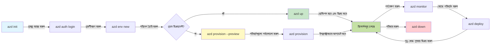
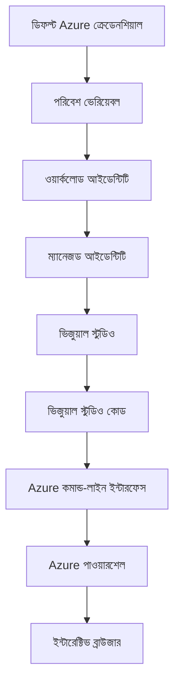

# AZD Basics - Azure Developer CLI বোঝা

# AZD Basics - মূল ধারণা ও মৌলিক বিষয়গুলি

**চ্যাপ্টার ন্যাভিগেশন:**
- **📚 কোর্স হোম**: [নতুনদের জন্য AZD](../../README.md)
- **📖 বর্তমান অধ্যায়**: Chapter 1 - ভিত্তি ও দ্রুত শুরু
- **⬅️ পূর্ববর্তী**: [কোর্স সংক্ষিপ্ত বিবরণ](../../README.md#-chapter-1-foundation--quick-start)
- **➡️ পরবর্তী**: [ইনস্টলেশন ও সেটআপ](installation.md)
- **🚀 পরবর্তী অধ্যায়**: [অধ্যায় ২: AI-প্রথম উন্নয়ন](../chapter-02-ai-development/microsoft-foundry-integration.md)

## পরিচিতি

এই পাঠটিতে আপনাকে Azure Developer CLI (azd) এর সাথে পরিচিত করানো হবে — একটি শক্তিশালী কমান্ড-লাইন সরঞ্জাম যা লোকাল ডেভেলপমেন্ট থেকে Azure ডিপ্লয়মেন্ট পর্যন্ত আপনার যাত্রাকে ত্বরান্বিত করে। আপনি শিখবেন মৌলিক ধারণা, মূল বৈশিষ্ট্যসমূহ, এবং azd কিভাবে ক্লাউড-নেটিভ অ্যাপ্লিকেশন ডিপ্লয় করা সহজ করে তোলে।

## শেখার লক্ষ্য

এই পাঠ শেষে আপনি:
- Azure Developer CLI কী এবং এর প্রধান উদ্দেশ্যটি বোঝবেন
- টেমপ্লেট, এনভায়রনমেন্ট এবং সার্ভিসগুলির মূল ধারণা শিখবেন
- টেমপ্লেট-চালিত ডেভেলপমেন্ট ও Infrastructure as Code-এর মতো প্রধান বৈশিষ্ট্যগুলি অন্বেষণ করবেন
- azd প্রজেক্ট স্ট্রাকচার এবং ওয়ার্কফ্লো বুঝবে
- আপনার ডেভেলপমেন্ট পরিবেশের জন্য azd ইনস্টল ও কনফিগার করার জন্য প্রস্তুত থাকবেন

## শেখার ফলাফল

এই পাঠ সম্পন্ন করার পরে আপনি সক্ষম হবেন:
- আধুনিক ক্লাউড ডেভেলপমেন্ট ওয়ার্কফ্লোতে azd-এর ভূমিকা ব্যাখ্যা করতে
- একটি azd প্রজেক্ট স্ট্রাকচারের উপাদানগুলি চিহ্নিত করতে
- টেমপ্লেট, এনভায়রনমেন্ট, এবং সার্ভিসগুলি কিভাবে একসাথে কাজ করে তা বর্ণনা করতে
- azd-র সাথে Infrastructure as Code-এর সুবিধাগুলি বুঝতে
- বিভিন্ন azd কমান্ড এবং তাদের উদ্দেশ্য চিনতে

## Azure Developer CLI (azd) কী?

Azure Developer CLI (azd) হল একটি কমান্ড-লাইন টুল যা লোকাল ডেভেলপমেন্ট থেকে Azure ডিপ্লয়মেন্ট পর্যন্ত আপনার যাত্রাকে ত্বরান্বিত করার জন্য ডিজাইন করা হয়েছে। এটি Azure-এ ক্লাউড-নেটিভ অ্যাপ্লিকেশন নির্মাণ, ডিপ্লয় এবং পরিচালনা করার প্রক্রিয়াটিকে সরল করে।

### azd দিয়ে কী ডিপ্লয় করা যায়?

azd বিস্তৃত ধরণের কর্মভার (workloads) সমর্থন করে—এবং তালিকাটি ক্রমাগত বাড়ছে। আজ আপনি azd ব্যবহার করে ডিপ্লয় করতে পারেন:

| Workload Type | Examples | Same Workflow? |
|---------------|----------|----------------|
| **প্রচলিত অ্যাপ্লিকেশন** | Web apps, REST APIs, static sites | ✅ `azd up` |
| **সার্ভিস ও মাইক্রোসার্ভিস** | Container Apps, Function Apps, multi-service backends | ✅ `azd up` |
| **AI-চালিত অ্যাপ্লিকেশন** | Chat apps with Microsoft Foundry Models, RAG solutions with AI Search | ✅ `azd up` |
| **বুদ্ধিমান এজেন্ট** | Foundry-hosted agents, multi-agent orchestrations | ✅ `azd up` |

মূল ধারণা হল যে **আপনি যা ডিপ্লয় করছেন তার ওপর নির্ভর করে azd লাইফসাইকেল একই থাকে**। আপনি একটি প্রজেক্ট ইনিশিয়ালাইজ করেন, ইনফ্রাস্ট্রাকচার প্রোভিশন করেন, আপনার কোড ডিপ্লয় করেন, আপনার অ্যাপ মনিটর করেন, এবং ক্লিনআপ করেন—চাই সেটা একটি সাধারণ ওয়েবসাইট হোক বা একটি জটিল AI এজেন্ট।

এই ধারাবাহিকতাটি ডিজাইনের অংশ। azd AI সক্ষমতাগুলোকে আপনার অ্যাপ্লিকেশন যে একটি সার্ভিস ব্যবহার করতে পারে এমন আরেক ধরনের সার্ভিস হিসেবে দেখে, কোনো মৌলিকভাবে ভিন্ন বিষয় হিসেবে নয়। Microsoft Foundry Models দ্বারা ব্যাকড করা একটি চ্যাট এন্ডপয়েন্ট azd-এর দৃষ্টিকোণ থেকে কেবল আরেকটি কনফিগার ও ডিপ্লয় করার সার্ভিস।

### 🎯 কেন AZD ব্যবহার করবেন? বাস্তব উদাহরণ দিয়ে তুলনা

চলুন একটি সাধারণ ওয়েব অ্যাপ ডাটাবেসসহ ডিপ্লয় করার তুলনা করি:

#### ❌ AZD ছাড়া: ম্যানুয়াল Azure ডিপ্লয়মেন্ট (30+ মিনিট)

```bash
# ধাপ 1: রিসোর্স গ্রুপ তৈরি করুন
az group create --name myapp-rg --location eastus

# ধাপ 2: অ্যাপ সার্ভিস প্ল্যান তৈরি করুন
az appservice plan create --name myapp-plan \
  --resource-group myapp-rg \
  --sku B1 --is-linux

# ধাপ 3: ওয়েব অ্যাপ তৈরি করুন
az webapp create --name myapp-web-unique123 \
  --resource-group myapp-rg \
  --plan myapp-plan \
  --runtime "NODE:18-lts"

# ধাপ 4: Cosmos DB অ্যাকাউন্ট তৈরি করুন (10-15 মিনিট)
az cosmosdb create --name myapp-cosmos-unique123 \
  --resource-group myapp-rg \
  --kind MongoDB

# ধাপ 5: ডাটাবেস তৈরি করুন
az cosmosdb mongodb database create \
  --account-name myapp-cosmos-unique123 \
  --resource-group myapp-rg \
  --name tododb

# ধাপ 6: কলেকশন তৈরি করুন
az cosmosdb mongodb collection create \
  --account-name myapp-cosmos-unique123 \
  --resource-group myapp-rg \
  --database-name tododb \
  --name todos

# ধাপ 7: সংযোগ স্ট্রিং পান
CONN_STR=$(az cosmosdb keys list \
  --name myapp-cosmos-unique123 \
  --resource-group myapp-rg \
  --type connection-strings \
  --query "connectionStrings[0].connectionString" -o tsv)

# ধাপ 8: অ্যাপ সেটিংস কনফিগার করুন
az webapp config appsettings set \
  --name myapp-web-unique123 \
  --resource-group myapp-rg \
  --settings MONGODB_URI="$CONN_STR"

# ধাপ 9: লগিং সক্রিয় করুন
az webapp log config --name myapp-web-unique123 \
  --resource-group myapp-rg \
  --application-logging filesystem \
  --detailed-error-messages true

# ধাপ 10: Application Insights সেট আপ করুন
az monitor app-insights component create \
  --app myapp-insights \
  --location eastus \
  --resource-group myapp-rg

# ধাপ 11: App Insights কে ওয়েব অ্যাপের সাথে লিঙ্ক করুন
INSTRUMENTATION_KEY=$(az monitor app-insights component show \
  --app myapp-insights \
  --resource-group myapp-rg \
  --query "instrumentationKey" -o tsv)

az webapp config appsettings set \
  --name myapp-web-unique123 \
  --resource-group myapp-rg \
  --settings APPINSIGHTS_INSTRUMENTATIONKEY="$INSTRUMENTATION_KEY"

# ধাপ 12: লোকালি অ্যাপ্লিকেশন বিল্ড করুন
npm install
npm run build

# ধাপ 13: ডিপ্লয়মেন্ট প্যাকেজ তৈরি করুন
zip -r app.zip . -x "*.git*" "node_modules/*"

# ধাপ 14: অ্যাপ্লিকেশন ডিপ্লয় করুন
az webapp deployment source config-zip \
  --resource-group myapp-rg \
  --name myapp-web-unique123 \
  --src app.zip

# ধাপ 15: অপেক্ষা করুন এবং প্রার্থনা করুন যে এটি কাজ করুক 🙏
# (কোনো স্বয়ংক্রিয় যাচাই নেই, ম্যানুয়াল টেস্টিং প্রয়োজন)
```

**সমস্যাসমূহ:**
- ❌ মনে রাখা ও ক্রমানুসারে চালানোর জন্য 15+ কমান্ড
- ❌ 30-45 মিনিট ম্যানুয়াল কাজ
- ❌ ভুল করার সহজ সম্ভাবনা (টাইপো, ভুল প্যারামিটার)
- ❌ টার্মিনাল ইতিহাসে সংযোগ স্ট্রিং গোপনীয়তা উন্মুক্ত থাকে
- ❌ কিছু ব্যর্থ হলে স্বয়ংক্রিয় রোলব্যাক নেই
- ❌ টিম সদস্যদের জন্য পুনরাবৃত্তি করা কঠিন
- ❌ প্রতিবারই আলাদা (পুনরুত্পাদনীয় নয়)

#### ✅ AZD সহ: স্বয়ংক্রিয় ডিপ্লয়মেন্ট (5 commands, 10-15 minutes)

```bash
# ধাপ ১: টেমপ্লেট থেকে শুরু করুন
azd init --template todo-nodejs-mongo

# ধাপ ২: প্রমাণীকরণ করুন
azd auth login

# ধাপ ৩: পরিবেশ তৈরি করুন
azd env new dev

# ধাপ ৪: পরিবর্তনগুলির পূর্বদর্শন করুন (ঐচ্ছিক কিন্তু সুপারিশকৃত)
azd provision --preview

# ধাপ ৫: সবকিছু মোতায়েন করুন
azd up

# ✨ সম্পন্ন! সবকিছু মোতায়েন, কনফিগার এবং মনিটর করা হয়েছে
```

**ফায়দা:**
- ✅ **5 commands** বনাম 15+ ম্যানুয়াল ধাপ
- ✅ **10-15 minutes** মোট সময় (প্রধানত Azure অপেক্ষা করে)
- ✅ **কম মানুয়াল ত্রুটি** - স্থিতিশীল, টেমপ্লেট-চালিত ওয়ার্কফ্লো
- ✅ **নিরাপদ সিক্রেট হ্যান্ডলিং** - অনেক টেমপ্লেট Azure-managed secret storage ব্যবহার করে
- ✅ **পুনরাবৃত্তিযোগ্য ডিপ্লয়মেন্ট** - প্রতিবার একই ওয়ার্কফ্লো
- ✅ **সম্পূর্ণ পুনরুত্পাদনীয়** - প্রতিবার একই ফলাফল
- ✅ **টিম-রেডি** - যে কেউ একই কমান্ড দিয়ে ডিপ্লয় করতে পারে
- ✅ **Infrastructure as Code** - ভার্সন কন্ট্রোল্ড Bicep টেমপ্লেট
- ✅ **বিল্ট-ইন মনিটরিং** - Application Insights স্বয়ংক্রিয়ভাবে কনফিগার করা আছে

### 📊 সময় ও ত্রুটি হ্রাস

| Metric | Manual Deployment | AZD Deployment | Improvement |
|:-------|:------------------|:---------------|:------------|
| **Commands** | 15+ | 5 | 67% fewer |
| **Time** | 30-45 min | 10-15 min | 60% faster |
| **Error Rate** | ~40% | <5% | 88% reduction |
| **Consistency** | Low (manual) | 100% (automated) | Perfect |
| **Team Onboarding** | 2-4 hours | 30 minutes | 75% faster |
| **Rollback Time** | 30+ min (manual) | 2 min (automated) | 93% faster |

## মূল ধারণা

### টেমপ্লেট
টেমপ্লেটগুলো হল azd-এর ভিত্তি। এগুলো অন্তর্ভুক্ত করে:
- **Application code** - আপনার সোর্স কোড এবং ডিপেন্ডেন্সি
- **Infrastructure definitions** - Bicep বা Terraform-এ সংজ্ঞায়িত Azure রিসোর্স
- **Configuration files** - সেটিংস এবং এনভায়রনমেন্ট ভ্যারিয়েবল
- **Deployment scripts** - স্বয়ংক্রিয় ডিপ্লয়মেন্ট ওয়ার্কফ্লো

### এনভায়রনমেন্টসমূহ
এনভায়রনমেন্টগুলো বিভিন্ন ডিপ্লয়মেন্ট লক্ষ্যবস্তুকে উপস্থাপন করে:
- **Development** - টেস্টিং এবং ডেভেলপমেন্টের জন্য
- **Staging** - প্রি-প্রোডাকশন পরিবেশ
- **Production** - লাইভ প্রোডাকশন পরিবেশ

প্রতিটি এনভায়রনমেন্ট নিজস্ব বজায় রাখে:
- Azure resource group
- কনফিগারেশন সেটিংস
- ডিপ্লয়মেন্ট অবস্থা

### সার্ভিসসমূহ
সার্ভিসগুলো আপনার অ্যাপ্লিকেশনের বিল্ডিং ব্লক:
- **Frontend** - ওয়েব অ্যাপ্লিকেশন, SPAs
- **Backend** - APIs, মাইক্রোসার্ভিস
- **Database** - ডেটা স্টোরেজ সলিউশন
- **Storage** - ফাইল এবং ব্লব স্টোরেজ

## মূল বৈশিষ্ট্য

### 1. টেমপ্লেট-চালিত ডেভেলপমেন্ট
```bash
# উপলব্ধ টেমপ্লেটগুলো দেখুন
azd template list

# টেমপ্লেট থেকে শুরু করুন
azd init --template <template-name>
```

### 2. ইনফ্রাস্ট্রাকচার অ্যাজ কোড
- **Bicep** - Azure-এর ডোমেইন-নির্দিষ্ট ভাষা
- **Terraform** - মাল্টি-ক্লাউড ইনফ্রাস্ট্রাকচার টুল
- **ARM Templates** - Azure Resource Manager টেমপ্লেট

### 3. একীভূত ওয়ার্কফ্লো
```bash
# সম্পূর্ণ ডিপ্লয়মেন্ট ওয়ার্কফ্লো
azd up            # প্রভিশন + ডিপ্লয় — প্রথমবারের সেটআপে এটি সম্পূর্ণ স্বয়ংক্রিয়

# 🧪 নতুন: ডিপ্লয় করার আগে ইনফ্রাস্ট্রাকচারের পরিবর্তনগুলি প্রাকদর্শন (নিরাপদ)
azd provision --preview    # পরিবর্তন না করেই ইনফ্রাস্ট্রাকচারের ডিপ্লয়মেন্ট সিমুলেট করুন

azd provision     # ইনফ্রাস্ট্রাকচার আপডেট করলে Azure রিসোর্স তৈরি করতে এটি ব্যবহার করুন
azd deploy        # অ্যাপ্লিকেশন কোড ডিপ্লয় করুন বা আপডেটের পরে আবার ডিপ্লয় করুন
azd down          # রিসোর্সগুলো পরিষ্কার করুন
```

#### 🛡️ প্রিভিউ সহ নিরাপদ ইনফ্রাস্ট্রাকচার পরিকল্পনা
`azd provision --preview` কমান্ড নিরাপদ ডিপ্লয়মেন্টের জন্য একটি গেম-চেঞ্জার:
- **Dry-run analysis** - দেখায় কী তৈরি হবে, পরিবর্তিত হবে, বা মুছে ফেলা হবে
- **Zero risk** - আপনার Azure পরিবেশে কোনো বাস্তব পরিবর্তন করা হয় না
- **Team collaboration** - ডিপ্লয়মেন্টের আগে প্রিভিউ ফলাফল শেয়ার করুন
- **Cost estimation** - কমিটমেন্টের আগে রিসোর্স খরচ বোঝুন

```bash
# উদাহরণ প্রাকদর্শন কর্মপ্রবাহ
azd provision --preview           # কী পরিবর্তন হবে তা দেখুন
# আউটপুট পর্যালোচনা করুন, দলের সঙ্গে আলোচনা করুন
azd provision                     # নিশ্চিতভাবে পরিবর্তনগুলি প্রয়োগ করুন
```

### 📊 ভিসুয়াল: AZD ডেভেলপমেন্ট ওয়ার্কফ্লো



**ওয়ার্কফ্লো ব্যাখ্যা:**
1. **Init** - টেমপ্লেট বা নতুন প্রজেক্ট দিয়ে শুরু করুন
2. **Auth** - Azure-এ প্রমাণীকরণ করুন
3. **Environment** - বিচ্ছিন্ন ডিপ্লয়মেন্ট এনভায়রনমেন্ট তৈরি করুন
4. **Preview** - 🆕 সর্বদা প্রথমে ইনফ্রাস্ট্রাকচারের পরিবর্তন প্রিভিউ করুন (নিরাপদ অভ্যাস)
5. **Provision** - Azure রিসোর্স তৈরি/আপডেট করুন
6. **Deploy** - আপনার অ্যাপ্লিকেশন কোড পাঠান
7. **Monitor** - অ্যাপ্লিকেশনের পারফরম্যান্স পর্যবেক্ষণ করুন
8. **Iterate** - পরিবর্তন করুন এবং কোড পুনরায় ডিপ্লয় করুন
9. **Cleanup** - কাজ শেষ হলে রিসোর্স মুছে ফেলুন

### 4. এনভায়রনমেন্ট ব্যবস্থাপনা
```bash
# পরিবেশ তৈরি এবং পরিচালনা করুন
azd env new <environment-name>
azd env select <environment-name>
azd env list
```

### 5. এক্সটেনশন এবং AI কমান্ডসমূহ

azd কোর CLI-এর বাইরে ক্ষমতা যোগ করার জন্য একটি এক্সটেনশন সিস্টেম ব্যবহার করে। এটি বিশেষভাবে AI ওয়ার্কলোডগুলোর জন্য উপকারী:

```bash
# উপলব্ধ এক্সটেনশনগুলির তালিকা
azd extension list

# Foundry agents এক্সটেনশন ইনস্টল করুন
azd extension install azure.ai.agents

# ম্যানিফেস্ট থেকে একটি AI এজেন্ট প্রকল্প আরম্ভ করুন
azd ai agent init -m agent-manifest.yaml

# একটি ডিপ্লয় করা এজেন্ট পরীক্ষা করুন (লেটেন্সি এবং টাইম-টু-ফার্স্ট-বাইট দেখায়)
azd ai agent invoke

# AI-সহায়িত উন্নয়নের জন্য MCP সার্ভার শুরু করুন (আলফা)
azd mcp start
```

**The agent lifecycle, end to end.** একবার আপনি `azure.ai.agents` ইনস্টল করলে, একটি একক ওয়ার্কফ্লো আইডিয়া থেকে চালিত, মনিটরকৃত এজেন্ট পর্যন্ত নিয়ে যায়। প্রথম দিনেই আপনাকে এগুলো সব দরকার হবে না—শুধু জানুন এগুলো আছে:

| Stage | Command | What it does |
|-------|---------|--------------|
| **Scaffold** | `azd ai agent init -m <manifest>` | একটি ম্যানিফেস্ট থেকে একটি এজেন্ট প্রজেক্ট তৈরি করে |
| **Test** | `azd ai agent invoke` | এজেন্টকে কল করে এবং উত্তর সময় দেখায় |
| **Measure** | `azd ai agent eval generate` | এজেন্টের জন্য একটি মূল্যায়ন ডেটাসেট তৈরি করে |
| **Improve** | `azd ai agent optimize` | আপনার ডেটার বিরুদ্ধে এজেন্ট নির্দেশনা অপটিমাইজ করে |
| **Inspect** | `azd ai agent endpoint show` | লাইভ এন্ডপয়েন্ট কনফিগারেশন দেখায় |
| **Clean up** | `azd ai agent delete` | হোস্ট করা এজেন্ট এবং এর সব ভার্সন মুছে দেয় |

> এক্সটেনশনসমূহ বিস্তারিতভাবে কভার করা হয়েছে [অধ্যায় 2: AI-প্রথম উন্নয়ন](../chapter-02-ai-development/agents.md) এবং [AZD AI CLI Commands](../chapter-08-production/production-ai-practices.md#azd-ai-cli-commands-and-extensions) রেফারেন্সে।

## 📁 প্রজেক্ট স্ট্রাকচার

একটি টিপিক্যাল azd প্রজেক্ট স্ট্রাকচার:
```
my-app/
├── .azd/                    # azd configuration
│   └── config.json
├── .azure/                  # Azure deployment artifacts
├── .devcontainer/          # Development container config
├── .github/workflows/      # GitHub Actions
├── .vscode/               # VS Code settings
├── infra/                 # Infrastructure code
│   ├── main.bicep        # Main infrastructure template
│   ├── main.parameters.json
│   └── modules/          # Reusable modules
├── src/                  # Application source code
│   ├── api/             # Backend services
│   └── web/             # Frontend application
├── azure.yaml           # azd project configuration
└── README.md
```

## 🔧 কনফিগারেশন ফাইলসমূহ

### azure.yaml
The main project configuration file:
```yaml
name: my-awesome-app
metadata:
  template: my-template@1.0.0

services:
  web:
    project: ./src/web
    language: js
    host: appservice
  api:
    project: ./src/api
    language: js
    host: appservice

hooks:
  preprovision:
    shell: pwsh
    run: echo "Preparing to provision..."
```

### .azure/config.json
Environment-specific configuration:
```json
{
  "version": 1,
  "defaultEnvironment": "dev",
  "environments": {
    "dev": {
      "subscriptionId": "your-subscription-id",
      "location": "eastus"
    }
  }
}
```

## 🎪 সাধারণ ওয়ার্কফ্লো সহ হ্যান্ডস-অন এক্সারসাইজ

> **💡 শেখার টিপ:** এই এক্সারসাইজগুলো ক্রমে অনুসরণ করুন যাতে আপনার AZD দক্ষতা ধাপে ধাপে উন্নত হয়।

### 🎯 অনুশীলন ১: আপনার প্রথম প্রজেক্ট ইনিশিয়ালাইজ করুন

**লক্ষ্য:** একটি AZD প্রজেক্ট তৈরি করুন এবং এর স্ট্রাকচার অন্বেষণ করুন

**ধাপসমূহ:**
```bash
# একটি প্রমাণিত টেমপ্লেট ব্যবহার করুন
azd init --template todo-nodejs-mongo

# জেনারেট করা ফাইলগুলো অন্বেষণ করুন
ls -la  # লুকানো ফাইলসহ সব ফাইল দেখুন

# তৈরি হওয়া প্রধান ফাইলগুলো:
# - azure.yaml (মুখ্য কনফিগ)
# - infra/ (অবকাঠামো কোড)
# - src/ (অ্যাপ্লিকেশন কোড)
```

**✅ সাফল্য:** আপনার কাছে azure.yaml, infra/, এবং src/ ডিরেক্টরিগুলো আছে

---

### 🎯 অনুশীলন ২: Azure-এ ডিপ্লয় করুন

**লক্ষ্য:** এন্ড-টু-এন্ড ডিপ্লয়মেন্ট সম্পন্ন করা

**ধাপসমূহ:**
```bash
# 1. প্রমাণীকরণ করুন
az login && azd auth login

# 2. পরিবেশ তৈরি করুন
azd env new dev
azd env set AZURE_LOCATION eastus

# 3. পরিবর্তনগুলি পূর্বদর্শন করুন (সুপারিশকৃত)
azd provision --preview

# 4. সবকিছু স্থাপন করুন
azd up

# 5. স্থাপন যাচাই করুন
azd show    # আপনার অ্যাপের URL দেখুন
```

**প্রত্যাশিত সময়:** 10-15 minutes  
**✅ সাফল্য:** অ্যাপ্লিকেশন URL ব্রাউজারে খুলবে

---

### 🎯 অনুশীলন ৩: একাধিক পরিবেশ

**লক্ষ্য:** dev এবং staging এ ডিপ্লয় করা

**ধাপসমূহ:**
```bash
# ইতিমধ্যেই dev আছে, staging তৈরি করুন
azd env new staging
azd env set AZURE_LOCATION westus2
azd up

# তাদের মধ্যে স্যুইচ করুন
azd env list
azd env select dev
```

**✅ সাফল্য:** Azure পোর্টালে দুইটি আলাদা রিসোর্স গ্রুপ দেখা যাবে

---

### 🛡️ ক্লিন স্লেট: `azd down --force --purge`

যখন আপনাকে সম্পূর্ণরূপে রিসেট করতে হবে:

```bash
azd down --force --purge
```

**এটি কি করে:**
- `--force`: নিশ্চিতকরণ প্রম্পট নেই
- `--purge`: সব লোকাল স্টেট এবং Azure রিসোর্স মুছে দেয়

**ব্যবহার করুন যখন:**
- ডিপ্লয়মেন্ট মাঝপথে ব্যর্থ হয়েছে
- প্রজেক্ট পরিবর্তন করা হচ্ছে
- নতুন করে শুরু করতে হবে

---

## 🎪 অরিজিনাল ওয়ার্কফ্লো রেফারেন্স

### নতুন প্রজেক্ট শুরু করা
```bash
# পদ্ধতি ১: বিদ্যমান টেমপ্লেট ব্যবহার করুন
azd init --template todo-nodejs-mongo

# পদ্ধতি ২: শূন্য থেকে শুরু করুন
azd init

# পদ্ধতি ৩: বর্তমান ডিরেক্টরি ব্যবহার করুন
azd init .
```

### ডেভেলপমেন্ট সাইকেল
```bash
# উন্নয়ন পরিবেশ সেট আপ করুন
azd auth login
azd env new dev
azd env select dev

# সবকিছু স্থাপন করুন
azd up

# পরিবর্তন করুন এবং পুনরায় স্থাপন করুন
azd deploy

# শেষ হলে পরিষ্কার করুন
azd down --force --purge # Azure Developer CLI-এ কমান্ডটি আপনার পরিবেশের জন্য একটি **হার্ড রিসেট**—বিশেষত উপকারী যখন আপনি ব্যর্থ ডিপ্লয়মেন্ট সমস্যা সমাধান করছেন, অনাথ সম্পদগুলো পরিষ্কার করছেন, বা নতুন করে পুনরায় স্থাপনের প্রস্তুতি নিচ্ছেন।
```

## `azd down --force --purge` বোঝা
`azd down --force --purge` কমান্ডটি আপনার azd এনভায়রনমেন্ট এবং সমস্ত সংশ্লিষ্ট রিসোর্স সম্পূর্ণরূপে Tear down করার একটি শক্তিশালী উপায়। এখানে প্রতিটি ফ্ল্যাগ কী করে তার বিবরণ দেওয়া হলো:
```
--force
```
- নিশ্চিতকরণ প্রম্পটগুলো বাদ দেয়।
- অটোমেশন বা স্ক্রিপ্টিং-এর জন্য উপযোগী যেখানে ম্যানুয়াল ইনপুট feasible নয়।
- CLI যদি অসমঞ্জস্য সনাক্ত করে তবুও teardown বিঘ্নিত না হয়ে এগিয়ে যাবে তা নিশ্চিত করে।

```
--purge
```
**সব সংযুক্ত মেটাডেটা মুছে ফেলে**, যার মধ্যে রয়েছে:
পরিবেশ অবস্থা
স্থানীয় `.azure` ফোল্ডার
ক্যাশ করা ডিপ্লয়মেন্ট তথ্য
azd-কে পূর্বের ডিপ্লয়মেন্ট "মনে রাখার" থেকে বিরত রাখে, যা মিস-ম্যাচড রিসোর্স গ্রুপ বা পুরনো রেজিস্ট্রি রেফারেন্সের মতো সমস্যার কারণ হতে পারে।


### কেন উভয় ব্যবহার করবেন?
যখন `azd up` চালানোর সময় অবশিষ্ট স্টেট বা আংশিক ডিপ্লয়মেন্টের কারণে আপনি বাধায় পড়েন, এই কম্বোটি একটি **ক্লিন স্লেট** নিশ্চিত করে।

এটি বিশেষভাবে সহায়ক যখন Azure পোর্টালে ম্যানুয়ালি রিসোর্স মুছে ফেলা হয়েছে বা টেমপ্লেট, এনভায়রনমেন্ট, বা রিসোর্স গ্রুপ নামকরণ কনভেনশন পরিবর্তন করার পরে।

### একাধিক পরিবেশ পরিচালনা
```bash
# স্টেজিং পরিবেশ তৈরি করুন
azd env new staging
azd env select staging
azd up

# dev-এ ফিরে যান
azd env select dev

# পরিবেশগুলো তুলনা করুন
azd env list
```

## 🔐 প্রমাণীকরণ এবং ক্রেডেনশিয়ালস

সফল azd ডিপ্লয়মেন্টের জন্য প্রমাণীকরণ বোঝা অত্যন্ত গুরুত্বপূর্ণ। Azure বহু প্রমাণীকরণ পদ্ধতি ব্যবহার করে, এবং azd অন্যান্য Azure টুলগুলির মতো ক্রেডেনশিয়াল চেইনটি ব্যবহার করে।

### Azure CLI Authentication (`az login`)

azd ব্যবহার করার আগে, আপনাকে Azure-এ প্রমাণীকরণ করতে হবে। সবচেয়ে সাধারণ পদ্ধতি হল Azure CLI ব্যবহার করা:

```bash
# ইন্টারেক্টিভ লগইন (ব্রাউজার খুলে)
az login

# নির্দিষ্ট টেন্যান্ট দিয়ে লগইন
az login --tenant <tenant-id>

# সার্ভিস প্রিন্সিপালের মাধ্যমে লগইন
az login --service-principal -u <app-id> -p <password> --tenant <tenant-id>

# বর্তমান লগইনের অবস্থা পরীক্ষা করুন
az account show

# উপলব্ধ সাবস্ক্রিপশনগুলো তালিকাভুক্ত করুন
az account list --output table

# ডিফল্ট সাবস্ক্রিপশন সেট করুন
az account set --subscription <subscription-id>
```

### প্রমাণীকরণের প্রবাহ
1. **Interactive Login**: প্রমাণীকরণের জন্য আপনার ডিফল্ট ব্রাউজার খুলে
2. **Device Code Flow**: ব্রাউজার অ্যাক্সেস নেই এমন পরিবেশের জন্য
3. **Service Principal**: অটোমেশন এবং CI/CD পরিবেশের জন্য
4. **Managed Identity**: Azure-এ হোস্ট করা অ্যাপ্লিকেশনগুলির জন্য

### DefaultAzureCredential চেইন

`DefaultAzureCredential` হল একটি ক্রেডেনশিয়াল টাইপ যা নির্দিষ্ট ক্রমে স্বয়ংক্রিয়ভাবে একাধিক ক্রেডেনশিয়াল সোর্স চেষ্টা করে একটি সরলীকৃত প্রমাণীকরণ অভিজ্ঞতা প্রদান করে:

#### ক্রেডেনশিয়াল চেইন অর্ডার


#### 1. Environment Variables
```bash
# সার্ভিস প্রিন্সিপালের জন্য পরিবেশ পরিবর্তনশীল সেট করুন
export AZURE_CLIENT_ID="<app-id>"
export AZURE_CLIENT_SECRET="<password>"
export AZURE_TENANT_ID="<tenant-id>"
```

#### 2. Workload Identity (Kubernetes/GitHub Actions)
স্বয়ংক্রিয়ভাবে ব্যবহৃত হয়:
- Azure Kubernetes Service (AKS) with Workload Identity
- GitHub Actions with OIDC federation
- অন্যান্য ফেডারেটেড আইডেন্টিটি সিনারিও

#### 3. Managed Identity
নিম্নলিখিত Azure রিসোর্সগুলির জন্য:
- Virtual Machines
- App Service
- Azure Functions
- Container Instances

```bash
# পরিচালিত পরিচয় সহ Azure রিসোর্সে চলছে কিনা পরীক্ষা করুন
az account show --query "user.type" --output tsv
# ফিরিয়ে দেয়: "servicePrincipal" যদি পরিচালিত পরিচয় ব্যবহার করা হয়
```

#### 4. Developer Tools Integration
- **Visual Studio**: স্বয়ংক্রিয়ভাবে সাইন-ইন করা অ্যাকাউন্ট ব্যবহার করে
- **VS Code**: Azure Account এক্সটেনশন ক্রেডেনশিয়াল ব্যবহার করে
- **Azure CLI**: `az login` ক্রেডেনশিয়াল ব্যবহার করে (লোকাল ডেভেলপমেন্টের জন্য সবচেয়ে সাধারণ)

### AZD Authentication Setup

```bash
# পদ্ধতি ১: Azure CLI ব্যবহার করুন (উন্নয়নের জন্য সুপারিশকৃত)
az login
azd auth login  # বিদ্যমান Azure CLI ক্রেডেনশিয়াল ব্যবহার করে

# পদ্ধতি ২: সরাসরি azd প্রমাণীকরণ
azd auth login --use-device-code  # হেডলেস পরিবেশের জন্য

# পদ্ধতি ৩: প্রমাণীকরণ অবস্থা পরীক্ষা করুন
azd auth login --check-status

# পদ্ধতি ৪: লগআউট করে পুনরায় প্রমাণীকরণ করুন
azd auth logout
azd auth login
```

### প্রমাণীকরণ সেরা অনুশীলন

#### লোকাল ডেভেলপমেন্টের জন্য
```bash
# 1. Azure CLI দিয়ে লগইন করুন
az login

# 2. সঠিক সাবস্ক্রিপশন যাচাই করুন
az account show
az account set --subscription "Your Subscription Name"

# 3. বিদ্যমান ক্রেডেনশিয়াল দিয়ে azd ব্যবহার করুন
azd auth login
```

#### CI/CD পাইপলাইনগুলির জন্য
```yaml
# GitHub Actions example
- name: Azure Login
  uses: azure/login@v1
  with:
    creds: ${{ secrets.AZURE_CREDENTIALS }}

- name: Deploy with azd
  run: |
    azd auth login --client-id ${{ secrets.AZURE_CLIENT_ID }} \
                    --client-secret ${{ secrets.AZURE_CLIENT_SECRET }} \
                    --tenant-id ${{ secrets.AZURE_TENANT_ID }}
    azd up --no-prompt
```

#### প্রোডাকশন পরিবেশগুলির জন্য
- Azure রিসোর্সগুলিতে চালানোর সময় **Managed Identity** ব্যবহার করুন
- অটোমেশন কর্মকাণ্ডের জন্য **Service Principal** ব্যবহার করুন
- কোড বা কনফিগারেশন ফাইলগুলোতে ক্রিডেনশিয়াল সংরক্ষণ করা এড়িয়ে চলুন
- সংবেদনশীল কনফিগারেশনের জন্য **Azure Key Vault** ব্যবহার করুন

### সাধারণ প্রমাণীকরণ সমস্যা এবং সমাধান

#### সমস্যা: "No subscription found"
```bash
# সমাধান: ডিফল্ট সাবস্ক্রিপশন সেট করুন
az account list --output table
az account set --subscription "<subscription-id>"
azd env set AZURE_SUBSCRIPTION_ID "<subscription-id>"
```

#### সমস্যা: "Insufficient permissions"
```bash
# সমাধান: প্রয়োজনীয় ভূমিকা পরীক্ষা করে বরাদ্দ করুন
az role assignment list --assignee $(az account show --query user.name --output tsv)

# সাধারণ প্রয়োজনীয় ভূমিকা:
# - Contributor (রিসোর্স ব্যবস্থাপনার জন্য)
# - User Access Administrator (ভূমিকা বরাদ্দের জন্য)
```

#### সমস্যা: "Token expired"
```bash
# সমাধান: পুনরায় প্রমাণীকরণ করুন
az logout
az login
azd auth logout
azd auth login
```

### বিভিন্ন পরিস্থিতিতে প্রমাণীকরণ

#### স্থানীয় ডেভেলপমেন্ট
```bash
# ব্যক্তিগত উন্নয়ন অ্যাকাউন্ট
az login
azd auth login
```

#### টিম ডেভেলপমেন্ট
```bash
# সংস্থার জন্য নির্দিষ্ট টেন্যান্ট ব্যবহার করুন
az login --tenant contoso.onmicrosoft.com
azd auth login
```

#### মাল্টি-টেন্যান্ট পরিস্থিতি
```bash
# টেন্যান্টগুলোর মধ্যে সুইচ করুন
az login --tenant tenant1.onmicrosoft.com
# টেন্যান্ট 1-এ ডিপ্লয় করুন
azd up

az login --tenant tenant2.onmicrosoft.com  
# টেন্যান্ট 2-এ ডিপ্লয় করুন
azd up
```

### নিরাপত্তা বিবেচ্য বিষয়

1. **Credential Storage**: সোর্স কোডে কখনই ক্রিডেনশিয়াল সংরক্ষণ করবেন না
2. **Scope Limitation**: সার্ভিস প্রিন্সিপালের জন্য সর্বনিম্ন-অনুমতি নীতি ব্যবহার করুন
3. **Token Rotation**: নিয়মিতভাবে সার্ভিস প্রিন্সিপাল সিক্রেট রোটেট করুন
4. **Audit Trail**: প্রমাণীকরণ এবং ডিপ্লয়মেন্ট কার্যক্রম মনিটর করুন
5. **Network Security**: যেখানে সম্ভব প্রাইভেট এন্ডপয়েন্ট ব্যবহার করুন

### প্রমাণীকরণ সমস্যার সমাধান

```bash
# প্রমাণীকরণ সমস্যা ডিবাগ করুন
azd auth login --check-status
az account show
az account get-access-token

# সাধারণ ডায়াগনস্টিক কমান্ডসমূহ
whoami                          # বর্তমান ব্যবহারকারীর প্রেক্ষাপট
az ad signed-in-user show      # Microsoft Entra ID ব্যবহারকারীর বিবরণ
az group list                  # রিসোর্স অ্যাক্সেস পরীক্ষা করুন
```

## `azd down --force --purge` বোঝা

### আবিষ্কার
```bash
azd template list              # টেমপ্লেট ব্রাউজ করুন
azd template show <template>   # টেমপ্লেটের বিবরণ
azd init --help               # প্রারম্ভিক বিকল্পসমূহ
```

### প্রজেক্ট ব্যবস্থাপনা
```bash
azd show                     # প্রকল্প সংক্ষিপ্ত বিবরণ
azd env list                # উপলব্ধ পরিবেশ এবং নির্বাচিত ডিফল্ট
azd config show            # কনফিগারেশন সেটিংস
```

### মনিটরিং
```bash
azd monitor                  # Azure পোর্টালের মনিটরিং খুলুন
azd monitor --logs           # অ্যাপ্লিকেশনের লগ দেখুন
azd monitor --live           # লাইভ মেট্রিক্স দেখুন
azd pipeline config          # CI/CD সেট আপ করুন
```

## সেরা অনুশীলনসমূহ

### 1. মানসম্পন্ন নাম ব্যবহার করুন
```bash
# ভালো
azd env new production-east
azd init --template web-app-secure

# এড়িয়ে চলুন
azd env new env1
azd init --template template1
```

### 2. টেমপ্লেট কাজে লাগান
- বিদ্যমান টেমপ্লেট দিয়ে শুরু করুন
- আপনার প্রয়োজন অনুযায়ী কাস্টমাইজ করুন
- আপনার প্রতিষ্ঠানের জন্য পুনঃব্যবহারযোগ্য টেমপ্লেট তৈরি করুন

### 3. পরিবেশ আলাদা রাখা
- dev/staging/prod এর জন্য আলাদা পরিবেশ ব্যবহার করুন
- লোকাল মেশিন থেকে সরাসরি প্রোডাকশনে ডিপ্লয় কখনই করবেন না
- প্রোডাকশন ডিপ্লয়মেন্টের জন্য CI/CD পাইপলাইন ব্যবহার করুন

### 4. কনফিগারেশন ম্যানেজমেন্ট
- সংবেদনশীল ডেটার জন্য এনভায়রনমেন্ট ভ্যারিয়েবল ব্যবহার করুন
- কনফিগারেশন ভার্সন কন্ট্রোলে রাখুন
- পরিবেশ-নির্দিষ্ট সেটিংস ডকুমেন্ট করুন

## শেখার অগ্রগতি

### শুরুয়ারী (১–২ সপ্তাহ)
1. azd ইনস্টল করুন এবং প্রমাণীকরণ করুন
2. একটি সহজ টেমপ্লেট ডিপ্লয় করুন
3. প্রজেক্ট স্ট্রাকচার বুঝুন
4. মৌলিক কমান্ডগুলি শিখুন (up, down, deploy)

### ইন্টারমিডিয়েট (৩–৪ সপ্তাহ)
1. টেমপ্লেট কাস্টমাইজ করুন
2. একাধিক পরিবেশ পরিচালনা করুন
3. ইনফ্রাস্ট্রাকচার কোড বুঝুন
4. CI/CD পাইপলাইন সেটআপ করুন

### অ্যাডভান্সড (৫+ সপ্তাহ)
1. কাস্টম টেমপ্লেট তৈরি করুন
2. উন্নত ইনফ্রাস্ট্রাকচার প্যাটার্ন
3. মাল্টি-রিজিয়ন ডিপ্লয়মেন্ট
4. এন্টারপ্রাইজ-গ্রেড কনফিগারেশন

## পরবর্তী ধাপ

**📖 অধ্যায় ১ শেখা চালিয়ে যান:**
- [ইনস্টলেশন ও সেটআপ](installation.md) - azd ইনস্টল ও কনফিগার করুন
- [আপনার প্রথম প্রকল্প](first-project.md) - হ্যান্ডস-অন টিউটোরিয়াল সম্পূর্ণ করুন
- [কনফিগারেশন গাইড](configuration.md) - উন্নত কনফিগারেশন অপশনসমূহ

**🎯 পরবর্তী অধ্যায়ের জন্য প্রস্তুত?**
- [অধ্যায় ২: AI-ফার্স্ট ডেভেলপমেন্ট](../chapter-02-ai-development/microsoft-foundry-integration.md) - AI অ্যাপ্লিকেশন নির্মাণ শুরু করুন

## অতিরিক্ত উৎস

- [Azure Developer CLI ওভারভিউ](https://learn.microsoft.com/en-us/azure/developer/azure-developer-cli/)
- [টেমপ্লেট গ্যালারি](https://azure.github.io/awesome-azd/)
- [কমিউনিটি স্যাম্পলস](https://github.com/Azure-Samples)

---

## 🙋 প্রায়শই জিজ্ঞাস্য প্রশ্নাবলি

### সাধারণ প্রশ্নসমূহ

**প্রশ্ন: AZD এবং Azure CLI এর মধ্যে পার্থক্য কী?**

উত্তর: Azure CLI (`az`) হল একক Azure রিসোর্স পরিচালনার জন্য। AZD (`azd`) হল সম্পূর্ণ অ্যাপ্লিকেশন পরিচালনার জন্য:

```bash
# Azure CLI - নিম্নস্তরের রিসোর্স ব্যবস্থাপনা
az webapp create --name myapp --resource-group rg
az sql server create --name myserver --resource-group rg
# ...আরও অনেক কমান্ডের প্রয়োজন

# AZD - অ্যাপ্লিকেশন স্তরের ব্যবস্থাপনা
azd up  # সমস্ত রিসোর্সসহ পুরো অ্যাপ স্থাপন করে
```

**এভাবে ভাবুন:**
- `az` = পৃথক লেগো ইটের উপর অপারেশন
- `azd` = সম্পূর্ণ লেগো সেট নিয়ে কাজ করা

---

**প্রশ্ন: AZD ব্যবহার করতে আমার কি Bicep বা Terraform জানা লাগবে?**

উত্তর: না! টেমপ্লেট দিয়ে শুরু করুন:
```bash
# বিদ্যমান টেমপ্লেট ব্যবহার করুন - IaC সম্পর্কিত কোনো জ্ঞানের প্রয়োজন নেই
azd init --template todo-nodejs-mongo
azd up
```

পরে আপনি ইনফ্রাস্ট্রাকচার কাস্টমাইজ করার জন্য Bicep শিখতে পারবেন। টেমপ্লেটগুলো শেখার জন্য কাজ করা উদাহরণ প্রদান করে।

---

**প্রশ্ন: AZD টেমপ্লেট চালাতে কত খরচ হয়?**

উত্তর: খরচ টেমপ্লেট অনুযায়ী ভিন্ন হয়। বেশিরভাগ ডেভেলপমেন্ট টেমপ্লেটের খরচ $50-150/মাস:
```bash
# ডেপ্লয় করার আগে খরচগুলো দেখুন
azd provision --preview

# ব্যবহার না করার সময় সবসময় পরিষ্কার করুন
azd down --force --purge  # সমস্ত রিসোর্স মুছে ফেলে
```

**প্রো টিপ:** যেখানে সম্ভব ফ্রি টিয়ার ব্যবহার করুন:
- App Service: F1 (Free) টিয়ার
- Microsoft Foundry Models: Azure OpenAI 50,000 tokens/মাস ফ্রি
- Cosmos DB: 1000 RU/s ফ্রি টিয়ার

---

**প্রশ্ন: কি আমি বিদ্যমান Azure রিসোর্সগুলোর সাথে AZD ব্যবহার করতে পারি?**

উত্তর: হ্যাঁ, কিন্তু নতুনভাবে শুরু করাই সহজ। AZD সবচেয়ে ভাল কাজ করে যখন এটি পুরো লাইফসাইকেল পরিচালনা করে। বিদ্যমান রিসোর্সগুলোর ক্ষেত্রে:
```bash
# বিকল্প 1: বিদ্যমান রিসোর্স আমদানি করুন (উন্নত)
azd init
# তারপর infra/ পরিবর্তন করুন যাতে তা বিদ্যমান রিসোর্সগুলোকে রেফারেন্স করে

# বিকল্প 2: নতুন করে শুরু করুন (প্রস্তাবিত)
azd init --template matching-your-stack
azd up  # নতুন পরিবেশ তৈরি করে
```

---

**প্রশ্ন: আমি কীভাবে আমার প্রজেক্ট টিমমেটদের সাথে শেয়ার করব?**

উত্তর: AZD প্রজেক্টটি Git-এ কমিট করুন (কিন্তু .azure ফোল্ডারটি নয়):
```bash
# .gitignore-এ ডিফল্টভাবে ইতোমধ্যে আছে
.azure/        # গোপন এবং পরিবেশভিত্তিক ডেটা ধারণ করে
*.env          # পরিবেশ ভেরিয়েবলসমূহ

# তারপর টিম সদস্যরা:
git clone <your-repo>
azd auth login
azd env new <their-name>-dev
azd up
```

প্রত্যেকে একই টেমপ্লেট থেকে একই ইনফ্রাস্ট্রাকচার পায়।

---

### সমস্যার সমাধান সম্পর্কিত প্রশ্নসমূহ

**প্রশ্ন: "azd up" মাঝপথে ব্যর্থ হয়েছে। আমি কী করব?**

উত্তর: ত্রুটিটি চেক করুন, সেটি ঠিক করুন, তারপর পুনরায় চেষ্টা করুন:
```bash
# বিস্তারিত লগ দেখুন
azd show

# সাধারণ সমাধানসমূহ:

# 1. যদি কোটা অতিক্রম হয়:
azd env set AZURE_LOCATION "westus2"  # ভিন্ন অঞ্চল চেষ্টা করুন

# 2. যদি রিসোর্স নামের সংঘাত ঘটে:
azd down --force --purge  # নতুন করে শুরু করুন
azd up  # আবার চেষ্টা করুন

# 3. যদি প্রমাণীকরণ মেয়াদ শেষ হয়ে যায়:
az login
azd auth login
azd up
```

**সর্বাধিক সাধারণ সমস্যা:** ভুল Azure সাবস্ক্রিপশন নির্বাচন করা হয়েছে
```bash
az account list --output table
az account set --subscription "<correct-subscription>"
```

---

**প্রশ্ন: পুনরায় প্রোভিশন ছাড়া কেবল কোড পরিবর্তনই কীভাবে ডিপ্লয় করব?**

উত্তর: `azd up` এর বদলে `azd deploy` ব্যবহার করুন:
```bash
azd up          # প্রথমবার: প্রস্তুতকরণ + স্থাপন (ধীর)

# কোড পরিবর্তন করুন...

azd deploy      # পরবর্তী বার: শুধুমাত্র স্থাপন (দ্রুত)
```

গতি তুলনা:
- `azd up`: 10-15 মিনিট (ইনফ্রাস্ট্রাকচার প্রোভাইজন করে)
- `azd deploy`: 2-5 মিনিট (শুধু কোড)

---

**প্রশ্ন: আমি কি ইনফ্রাস্ট্রাকচার টেমপ্লেটগুলো কাস্টমাইজ করতে পারি?**

উত্তর: হ্যাঁ! `infra/` এর Bicep ফাইলগুলো এডিট করুন:
```bash
# azd init-এর পরে
cd infra/
code main.bicep  # VS Code-এ সম্পাদনা করুন

# পরিবর্তনগুলি পূর্বদর্শন করুন
azd provision --preview

# পরিবর্তনগুলি প্রয়োগ করুন
azd provision
```

**টিপ:** ছোট থেকে শুরু করুন - প্রথমে SKUs পরিবর্তন করুন:
```bicep
// infra/main.bicep
sku: {
  name: 'B1'  // Change to 'P1V2' for production
}
```

---

**প্রশ্ন: AZD যা কিছু তৈরি করেছে সবকিছু কীভাবে মুছে ফেলব?**

উত্তর: একটি কমান্ড সব রিসোর্স মুছে দেয়:
```bash
azd down --force --purge

# এটি নিম্নলিখিতগুলো মুছে দেয়:
# - সমস্ত Azure রিসোর্স
# - রিসোর্স গ্রুপ
# - স্থানীয় পরিবেশের অবস্থা
# - ক্যাশকৃত ডিপ্লয়মেন্ট ডেটা
```

**এটি সব সময় চালান যখন:**
- একটি টেমপ্লেট টেস্ট করা শেষ হয়েছে
- অন্য প্রজেক্টে স্যুইচ করা হচ্ছে
- নতুন করে শুরু করতে চান

**খরচ সাশ্রয়:** ব্যবহার না করা রিসোর্স মুছে ফেলা = $0 চার্জ

---

**প্রশ্ন: যদি আমি ভুলবশত Azure Portal-এ রিসোর্স মুছে ফেলি তাহলে কী হবে?**

উত্তর: AZD স্টেট সিঙ্ক থেকে বেরিয়ে যেতে পারে। ক্লিন-স্লেট পদ্ধতি:
```bash
# 1. স্থানীয় অবস্থা মুছুন
azd down --force --purge

# 2. নতুনভাবে শুরু করুন
azd up

# বিকল্প: AZD-কে সনাক্ত করে ঠিক করতে দিন
azd provision  # অনুপস্থিত রিসোর্সগুলো তৈরি করবে
```

---

### অ্যাডভান্সড প্রশ্নসমূহ

**প্রশ্ন: কি আমি CI/CD পাইপলাইনে AZD ব্যবহার করতে পারি?**

উত্তর: হ্যাঁ! GitHub Actions উদাহরণ:
```yaml
# .github/workflows/deploy.yml
name: Deploy with AZD

on:
  push:
    branches: [main]

jobs:
  deploy:
    runs-on: ubuntu-latest
    steps:
      - uses: actions/checkout@v2
      
      - name: Install azd
        run: curl -fsSL https://aka.ms/install-azd.sh | bash
      
      - name: Azure Login
        run: |
          azd auth login \
            --client-id ${{ secrets.AZURE_CLIENT_ID }} \
            --client-secret ${{ secrets.AZURE_CLIENT_SECRET }} \
            --tenant-id ${{ secrets.AZURE_TENANT_ID }}
      
      - name: Deploy
        run: azd up --no-prompt
```

---

**প্রশ্ন: আমি কীভাবে সিক্রেট ও সংবেদনশীল ডেটা পরিচালনা করব?**

উত্তর: AZD স্বয়ংক্রিয়ভাবে Azure Key Vault-র সাথে ইন্টিগ্রেট করে:
```bash
# গোপন তথ্যগুলো কোডে নয়, Key Vault-এ সংরক্ষিত থাকে
azd env set DATABASE_PASSWORD "$(openssl rand -base64 32)"

# AZD স্বয়ংক্রিয়ভাবে:
# 1. Key Vault তৈরি করে
# 2. গোপন তথ্য সংরক্ষণ করে
# 3. Managed Identity-এর মাধ্যমে অ্যাপকে অ্যাক্সেস প্রদান করে
# 4. রানটাইমে ইনজেক্ট করে
```

**কখনই কমিট করবেন না:**
- `.azure/` ফোল্ডার (এনভায়রনমেন্ট ডেটা ধারণ করে)
- `.env` ফাইল (লোকাল সিক্রেট)
- কানেকশন স্ট্রিংস

---

**প্রশ্ন: কি আমি একাধিক রিজিয়নে ডিপ্লয় করতে পারি?**

উত্তর: হ্যাঁ, প্রতিটি রিজিয়নের জন্য পরিবেশ তৈরি করুন:
```bash
# পূর্ব যুক্তরাষ্ট্র পরিবেশ
azd env new prod-eastus
azd env set AZURE_LOCATION eastus
azd up

# পশ্চিম ইউরোপ পরিবেশ
azd env new prod-westeurope
azd env set AZURE_LOCATION westeurope
azd up

# প্রতিটি পরিবেশ স্বতন্ত্র
azd env list
```

যথার্থ মাল্টি-রিজিয়ন অ্যাপগুলোর জন্য, একসাথে একাধিক রিজিয়নে ডিপ্লয় করার জন্য Bicep টেমপ্লেট কাস্টমাইজ করুন।

---

**প্রশ্ন: আটকে গেলে আমি কোথায় সাহায্য পেতে পারি?**

1. **AZD ডকুমেন্টেশন:** https://learn.microsoft.com/azure/developer/azure-developer-cli/
2. **GitHub Issues:** https://github.com/Azure/azure-dev/issues
3. **Discord:** [Azure Discord](https://discord.gg/microsoft-azure) - #azure-developer-cli চ্যানেল
4. **Stack Overflow:** ট্যাগ `azure-developer-cli`
5. **এই কোর্স:** [সমস্যা সমাধান গাইড](../chapter-07-troubleshooting/common-issues.md)

**প্রো টিপ:** প্রশ্ন করার আগে, চালান:
```bash
azd show       # বর্তমান অবস্থা দেখায়
azd version    # আপনার সংস্করণ দেখায়
```
এই তথ্যটি আপনার প্রশ্নে অন্তর্ভুক্ত করুন যাতে দ্রুত সহায়তা পাওয়া যায়।

---

## 🎓 এখন কী?

আপনি এখন AZD-এর মূল বিষয়গুলো বুঝে গেছেন। আপনার পথ নির্বাচন করুন:

### 🎯 শুরুকারীদের জন্য:
1. **পরবর্তী:** [ইনস্টলেশন ও সেটআপ](installation.md) - আপনার মেশিনে AZD ইনস্টল করুন
2. **তারপর:** [আপনার প্রথম প্রকল্প](first-project.md) - আপনার প্রথম অ্যাপ ডিপ্লয় করুন
3. **অভ্যাস:** এই পাঠের সব ৩টি অনুশীলন সম্পূর্ণ করুন

### 🚀 AI ডেভেলপারদের জন্য:
1. **সরাসরি যান:** [অধ্যায় ২: AI-ফার্স্ট ডেভেলপমেন্ট](../chapter-02-ai-development/microsoft-foundry-integration.md)
2. **ডিপ্লয়:** `azd init --template get-started-with-ai-chat` দিয়ে শুরু করুন
3. **শিখুন:** ডিপ্লয়ের সময়ই তৈরি করুন

### 🏗️ অভিজ্ঞ ডেভেলপারদের জন্য:
1. **পর্যালোচনা:** [কনফিগারেশন গাইড](configuration.md) - উন্নত সেটিংস
2. **অন্বেষণ করুন:** [Infrastructure as Code](../chapter-04-infrastructure/provisioning.md) - Bicep গভীর অনুশীলন
3. **নির্মাণ করুন:** আপনার স্ট্যাকের জন্য কাস্টম টেমপ্লেট তৈরি করুন

---

**অধ্যায় নেভিগেশন:**
- **📚 কোর্স হোম**: [AZD শুরুকারীদের জন্য](../../README.md)
- **📖 বর্তমান অধ্যায়**: অধ্যায় ১ - ফাউন্ডেশন ও কুইক স্টার্ট  
- **⬅️ পূর্ববর্তী**: [কোর্স ওভারভিউ](../../README.md#-chapter-1-foundation--quick-start)
- **➡️ পরবর্তী**: [ইনস্টলেশন ও সেটআপ](installation.md)
- **🚀 পরবর্তী অধ্যায়**: [অধ্যায় ২: AI-ফার্স্ট ডেভেলপমেন্ট](../chapter-02-ai-development/microsoft-foundry-integration.md)

---

<!-- CO-OP TRANSLATOR DISCLAIMER START -->
**অস্বীকৃতি**:
এই নথিটি AI অনুবাদ পরিষেবা [Co-op Translator](https://github.com/Azure/co-op-translator) ব্যবহার করে অনূদিত হয়েছে। যদিও আমরা শুদ্ধতার জন্য চেষ্টা করি, অনুগ্রহ করে মনে রাখবেন যে স্বয়ংক্রিয় অনুবাদে ত্রুটি বা অসঙ্গতি থাকতে পারে। মূল নথিটি তার স্বভাষায় কর্তৃত্বপূর্ণ উৎস হিসেবে বিবেচিত হওয়া উচিত। গুরুত্বপূর্ণ তথ্যের জন্য পেশাদার মানব অনুবাদ সুপারিশ করা হয়। এই অনুবাদের ব্যবহারে প্রয়োজনীয় ভুল বোঝাবুঝি বা ভুল ব্যাখ্যার জন্য আমরা দায়বদ্ধ নই।
<!-- CO-OP TRANSLATOR DISCLAIMER END -->