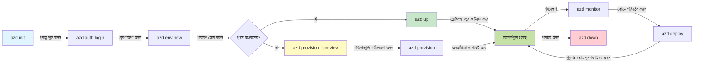
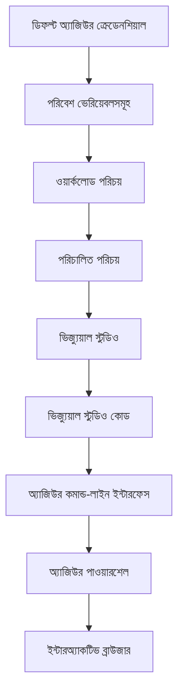

# AZD বেসিক্স - Azure Developer CLI বোঝা

# AZD বেসিক্স - মূল ধারণা এবং অনিবাহী বিষয়সমূহ

**চ্যাপ্টার নেভিগেশন:**
- **📚 Course Home**: [AZD For Beginners](../../README.md)
- **📖 Current Chapter**: Chapter 1 - Foundation & Quick Start
- **⬅️ Previous**: [Course Overview](../../README.md#-chapter-1-foundation--quick-start)
- **➡️ Next**: [Installation & Setup](installation.md)
- **🚀 Next Chapter**: [Chapter 2: AI-First Development](../chapter-02-ai-development/microsoft-foundry-integration.md)

## ভূমিকা

এই পাঠে আপনাকে পরিচয় করানো হবে Azure Developer CLI (azd)-এর সাথে, একটি শক্তিশালী কমান্ড-লাইন টুল যা লোকাল ডেভেলপমেন্ট থেকে Azure ডিপ্লয়মেন্টে আপনার যাত্রাকে দ্রুত করে তোলে। আপনি শেখাবেন মৌলিক ধারণাগুলো, প্রধান বৈশিষ্ট্যগুলো, এবং কিভাবে azd ক্লাউড-নেটিভ অ্যাপ্লিকেশন ডিপ্লয়মেন্ট সহজ করে।

## শিখার লক্ষ্য

এই পাঠের শেষে, আপনি:
- বুঝতে পারবেন Azure Developer CLI কী এবং এর মূল উদ্দেশ্য
- টেমপ্লেট, এনভায়রনমেন্ট, এবং সার্ভিসের মূল ধারণাগুলো শিখবেন
- টেমপ্লেট-চালিত ডেভেলপমেন্ট এবং Infrastructure as Code সহ মূল বৈশিষ্ট্যগুলো অন্বেষণ করবেন
- azd প্রকল্প কাঠামো এবং ওয়ার্কফ্লো বুঝতে সক্ষম হবেন
- আপনার ডেভেলপমেন্ট পরিবেশের জন্য azd ইনস্টল ও কনফিগার করতে প্রস্তুত আবেন

## শিখার ফলাফল

এই পাঠ সম্পন্ন করার পরে, আপনি সক্ষম হবেন:
- আধুনিক ক্লাউড ডেভেলপমেন্ট ওয়ার্কফ্লোতে azd-এর ভূমিকা ব্যাখ্যা করতে
- একটি azd প্রকল্প কাঠামোর উপাদানগুলো সনাক্ত করতে
- বর্ণনা করতে কিভাবে টেমপ্লেট, এনভায়রনমেন্ট, এবং সার্ভিস একসাথে কাজ করে
- azd দিয়ে Infrastructure as Code-এর সুবিধাগুলো বুঝতে
- বিভিন্ন azd কমান্ড এবং তাদের উদ্দেশ্যগুলো চিনতে

## Azure Developer CLI (azd) কী?

Azure Developer CLI (azd) হল একটি কমান্ড-লাইন টুল যা লোকাল ডেভেলপমেন্ট থেকে Azure ডিপ্লয়মেন্টে আপনার যাত্রাকে ত্বরান্বিত করার জন্য ডিজাইন করা। এটি Azure-এ ক্লাউড-নেটিভ অ্যাপ্লিকেশন তৈরি, ডিপ্লয় এবং ব্যবস্থাপনা করার প্রক্রিয়াকে সরল করে।

### azd দিয়ে কী ডিপ্লয় করা যায়?

azd বিভিন্ন ধরনের ওয়ার্কলোডকে সমর্থন করে—এবং তালিকা ক্রমাগত বাড়ছে। আজ, আপনি azd ব্যবহার করে ডিপ্লয় করতে পারেন:

| Workload Type | Examples | Same Workflow? |
|---------------|----------|----------------|
| **Traditional applications** | Web apps, REST APIs, static sites | ✅ `azd up` |
| **Services and microservices** | Container Apps, Function Apps, multi-service backends | ✅ `azd up` |
| **AI-powered applications** | Chat apps with Microsoft Foundry Models, RAG solutions with AI Search | ✅ `azd up` |
| **Intelligent agents** | Foundry-hosted agents, multi-agent orchestrations | ✅ `azd up` |

মূল ধারণা হলো যে **azd-এর লাইফসাইকেল যাই ডিপ্লয় করা হোক না কেন একই থাকে**। আপনি একটি প্রকল্প ইনিশিয়ালাইজ করেন, ইনফ্রাস্ট্রাকচার প্রোভিশন করেন, আপনার কোড ডিপ্লয় করেন, আপনার অ্যাপ মনিটর করেন, এবং ক্লিন-আপ করেন—চাই সেটা একটি সিম্পল ওয়েবসাইট হোক বা একটি জটিল AI এজেন্ট।

এই ধারাবাহিকতা উদ্দেশ্যপ্রণোদিত। azd AI সক্ষমতাগুলোকে আপনার অ্যাপ্লিকেশন ব্যবহার করতে পারে এমন আরেক ধরনের সার্ভিস হিসেবেই বিবেচনা করে, কোনো ভিন্ন ধরণের কিছু নয়। Microsoft Foundry Models দ্বারা ব্যাককৃত একটি চ্যাট এন্ডপয়েন্ট azd-এর দৃষ্টিকোণ থেকে কেবল আরেকটি সার্ভিস কনফিগার এবং ডিপ্লয় করার বিষয়।

### 🎯 কেন AZD ব্যবহার করবেন? বাস্তব-জগতের তুলনা

চলুন একটি সাধারণ ওয়েব অ্যাপ ডাটাবেস সহ ডিপ্লয় করার তুলনা করি:

#### ❌ AZD ছাড়া: ম্যানুয়াল Azure ডিপ্লয়মেন্ট (৩০+ মিনিট)

```bash
# ধাপ 1: রিসোর্স গ্রুপ তৈরি করুন
az group create --name myapp-rg --location eastus

# ধাপ 2: অ্যাপ সার্ভিস প্ল্যান তৈরি করুন
az appservice plan create --name myapp-plan \
  --resource-group myapp-rg \
  --sku B1 --is-linux

# ধাপ 3: ওয়েব অ্যাপ তৈরি করুন
az webapp create --name myapp-web-unique123 \
  --resource-group myapp-rg \
  --plan myapp-plan \
  --runtime "NODE:18-lts"

# ধাপ 4: Cosmos DB অ্যাকাউন্ট তৈরি করুন (১০–১৫ মিনিট)
az cosmosdb create --name myapp-cosmos-unique123 \
  --resource-group myapp-rg \
  --kind MongoDB

# ধাপ 5: ডাটাবেস তৈরি করুন
az cosmosdb mongodb database create \
  --account-name myapp-cosmos-unique123 \
  --resource-group myapp-rg \
  --name tododb

# ধাপ 6: কলেকশন তৈরি করুন
az cosmosdb mongodb collection create \
  --account-name myapp-cosmos-unique123 \
  --resource-group myapp-rg \
  --database-name tododb \
  --name todos

# ধাপ 7: সংযোগ স্ট্রিং পান
CONN_STR=$(az cosmosdb keys list \
  --name myapp-cosmos-unique123 \
  --resource-group myapp-rg \
  --type connection-strings \
  --query "connectionStrings[0].connectionString" -o tsv)

# ধাপ 8: অ্যাপ সেটিংস কনফিগার করুন
az webapp config appsettings set \
  --name myapp-web-unique123 \
  --resource-group myapp-rg \
  --settings MONGODB_URI="$CONN_STR"

# ধাপ 9: লগিং সক্ষম করুন
az webapp log config --name myapp-web-unique123 \
  --resource-group myapp-rg \
  --application-logging filesystem \
  --detailed-error-messages true

# ধাপ 10: অ্যাপ্লিকেশন ইনসাইটস সেট আপ করুন
az monitor app-insights component create \
  --app myapp-insights \
  --location eastus \
  --resource-group myapp-rg

# ধাপ 11: অ্যাপ ইনসাইটসকে ওয়েব অ্যাপের সাথে লিঙ্ক করুন
INSTRUMENTATION_KEY=$(az monitor app-insights component show \
  --app myapp-insights \
  --resource-group myapp-rg \
  --query "instrumentationKey" -o tsv)

az webapp config appsettings set \
  --name myapp-web-unique123 \
  --resource-group myapp-rg \
  --settings APPINSIGHTS_INSTRUMENTATIONKEY="$INSTRUMENTATION_KEY"

# ধাপ 12: লোকালি অ্যাপ্লিকেশন বিল্ড করুন
npm install
npm run build

# ধাপ 13: ডিপ্লয়মেন্ট প্যাকেজ তৈরি করুন
zip -r app.zip . -x "*.git*" "node_modules/*"

# ধাপ 14: অ্যাপ্লিকেশন ডিপ্লয় করুন
az webapp deployment source config-zip \
  --resource-group myapp-rg \
  --name myapp-web-unique123 \
  --src app.zip

# ধাপ 15: অপেক্ষা করুন এবং আশা করুন এটা কাজ করবে 🙏
# (কোনও স্বয়ংক্রিয় যাচাই নেই, ম্যানুয়াল টেস্টিং প্রয়োজন)
```

**সমস্যাগুলো:**
- ❌ ১৫+ কমান্ড মনে রেখে নির্দিষ্ট ক্রমে চালাতে হয়
- ❌ ৩০-৪৫ মিনিটের ম্যানুয়াল কাজ
- ❌ ভুল করার সহজতা (টাইপো, ভুল প্যারামিটার)
- ❌ টার্মিনাল ইতিহাসে কানেকশন স্ট্রিং সংকটপ্রদর্শিত হয়
- ❌ কোনো স্বয়ংক্রিয় রোলব্যাক নেই যদি কিছু ব্যর্থ হয়
- ❌ টিম সদস্যদের জন্য পুনরাবৃত্ত করা কঠিন
- ❌ প্রতিবার আলাদা হয় (পুনরুৎপাদনযোগ্য নয়)

#### ✅ AZD সহ: স্বয়ংক্রিয় ডিপ্লয়মেন্ট (5 কমান্ড, ১০-১৫ মিনিট)

```bash
# ধাপ 1: টেমপ্লেট থেকে শুরু করুন
azd init --template todo-nodejs-mongo

# ধাপ 2: প্রমাণীকরণ করুন
azd auth login

# ধাপ 3: পরিবেশ তৈরি করুন
azd env new dev

# ধাপ 4: পরিবর্তনগুলোর পূর্বরূপ দেখুন (ঐচ্ছিক তবে সুপারিশকৃত)
azd provision --preview

# ধাপ 5: সবকিছু ডিপ্লয় করুন
azd up

# ✨ সম্পন্ন! সবকিছু ডিপ্লয় করা হয়েছে, কনফিগার করা হয়েছে এবং পর্যবেক্ষণ করা হচ্ছে
```

**ফায়দাগুলো:**
- ✅ **5 commands** বনাম 15+ ম্যানুয়াল ধাপ
- ✅ **10-15 minutes** মোট সময় (প্রধানত Azure অপেক্ষায়)
- ✅ **Zero errors** - স্বয়ংক্রিয় এবং পরীক্ষিত
- ✅ **Secrets managed securely** via Key Vault
- ✅ **Automatic rollback** ব্যর্থতার ক্ষেত্রে
- ✅ **Fully reproducible** - প্রতিবার একই ফলাফল
- ✅ **Team-ready** - একই কমান্ড দিয়ে যেকেউ ডিপ্লয় করতে পারে
- ✅ **Infrastructure as Code** - ভার্সন কন্ট্রোল করা Bicep টেমপ্লেট
- ✅ **Built-in monitoring** - Application Insights স্বয়ংক্রিয়ভাবে কনফিগার করা হয়

### 📊 সময় ও ত্রুটি হ্রাস

| Metric | Manual Deployment | AZD Deployment | Improvement |
|:-------|:------------------|:---------------|:------------|
| **Commands** | 15+ | 5 | 67% fewer |
| **Time** | 30-45 min | 10-15 min | 60% faster |
| **Error Rate** | ~40% | <5% | 88% reduction |
| **Consistency** | Low (manual) | 100% (automated) | Perfect |
| **Team Onboarding** | 2-4 hours | 30 minutes | 75% faster |
| **Rollback Time** | 30+ min (manual) | 2 min (automated) | 93% faster |

## মূল ধারণা

### টেমপ্লেট
টেমপ্লেটগুলো azd-এর ভিত্তি। এগুলো ধারণ করে:
- **অ্যাপ্লিকেশন কোড** - আপনার সোর্স কোড এবং ডিপেন্ডেন্সি
- **ইনফ্রাস্ট্রাকচার সংজ্ঞা** - Bicep বা Terraform-এ নির্ধারিত Azure রিসোর্সসমূহ
- **কনফিগারেশন ফাইল** - সেটিংস এবং এনভায়রনমেন্ট ভেরিয়েবল
- **ডিপ্লয়মেন্ট স্ক্রিপ্ট** - স্বয়ংক্রিয় ডিপ্লয়মেন্ট ওয়ার্কফ্লো

### এনভায়রনমেন্ট (Environments)
এনভায়রনমেন্টগুলো বিভিন্ন ডিপ্লয়মেন্ট লক্ষ্যকে উপস্থাপন করে:
- **Development** - টেস্টিং এবং ডেভেলপমেন্টের জন্য
- **Staging** - প্রি-প্রোডাকশন পরিবেশ
- **Production** - লাইভ প্রোডাকশন পরিবেশ

প্রতিটি এনভায়রনমেন্ট রক্ষণাবেক্ষণ করে তার নিজস্ব:
- Azure resource group
- কনফিগারেশন সেটিংস
- ডিপ্লয়মেন্ট স্টেট

### সার্ভিসগুলো
সার্ভিসগুলো আপনার অ্যাপ্লিকেশনের বিল্ডিং ব্লক:
- **Frontend** - ওয়েব অ্যাপ্লিকেশন, SPA
- **Backend** - API, মাইক্রোসার্ভিস
- **Database** - ডেটা স্টোরেজ সলিউশন
- **Storage** - ফাইল এবং ব্লব স্টোরেজ

## মূল বৈশিষ্ট্য

### 1. টেমপ্লেট-চালিত ডেভেলপমেন্ট
```bash
# উপলব্ধ টেমপ্লেট ব্রাউজ করুন
azd template list

# টেমপ্লেট থেকে শুরু করুন
azd init --template <template-name>
```

### 2. Infrastructure as Code
- **Bicep** - Azure-এর ডোমেইন-স্পেসিফিক ভাষা
- **Terraform** - মাল্টি-ক্লাউড ইনফ্রাস্ট্রাকচার টুল
- **ARM Templates** - Azure Resource Manager টেমপ্লেট

### 3. ইন্টিগ্রেটেড ওয়ার্কফ্লো
```bash
# সম্পূর্ণ স্থাপনের কর্মপ্রবাহ
azd up            # প্রভিশন + ডিপ্লয় — প্রথমবারের সেটআপের জন্য হস্তক্ষেপ-হীন

# 🧪 নতুন: স্থাপন করার আগে অবকাঠামোর পরিবর্তন প্রিভিউ (নিরাপদ)
azd provision --preview    # পরিবর্তন না করে অবকাঠামো স্থাপন অনুকরণ করুন

azd provision     # অবকাঠামো আপডেট করলে Azure রিসোর্স তৈরি করতে এটি ব্যবহার করুন
azd deploy        # অ্যাপ্লিকেশন কোড ডিপ্লয় করুন বা আপডেটের পরে পুনরায় ডিপ্লয় করুন
azd down          # রিসোর্সগুলো পরিস্কার করুন
```

#### 🛡️ Preview-এর সাথে নিরাপদ ইনফ্রাস্ট্রাকচার পরিকল্পনা
`azd provision --preview` কমান্ড নিরাপদ ডিপ্লয়মেন্টের জন্য একটি গেম-চেঞ্জার:
- **ড্রাই-রান বিশ্লেষণ** - কি তৈরি, পরিবর্তিত বা মুছে ফেলা হবে তা দেখায়
- **শূন্য ঝুঁকি** - আপনার Azure পরিবেশে কোন আসল পরিবর্তন করা হয় না
- **দলগত সহযোগিতা** - ডিপ্লয়মেন্টের আগে প্রিভিউ ফলাফল শেয়ার করুন
- **খরচের অনুমান** - অঙ্গীকার করার আগে রিসোর্সের খরচ বুঝুন

```bash
# উদাহরণ প্রাকদর্শন কার্যপ্রবাহ
azd provision --preview           # দেখুন কী পরিবর্তন হবে
# আউটপুট পর্যালোচনা করুন, দলের সঙ্গে আলোচনা করুন
azd provision                     # আত্মবিশ্বাসের সঙ্গে পরিবর্তনগুলো প্রয়োগ করুন
```

### 📊 ভিজ্যুয়াল: AZD ডেভেলপমেন্ট ওয়ার্কফ্লো


**ওয়ার্কফ্লো ব্যাখ্যা:**
1. **Init** - টেমপ্লেট বা নতুন প্রকল্প দিয়ে শুরু করুন
2. **Auth** - Azure-এ অথেন্টিকেট করুন
3. **Environment** - আলাদা ডিপ্লয়মেন্ট এনভায়রনমেন্ট তৈরি করুন
4. **Preview** - 🆕 সর্বদা প্রথমে ইনফ্রাস্ট্রাকচার পরিবর্তনগুলো প্রিভিউ করুন (নিরাপদ অনুশীলন)
5. **Provision** - Azure রিসোর্স তৈরি/আপডেট করুন
6. **Deploy** - আপনার অ্যাপ্লিকেশন কোড পুশ করুন
7. **Monitor** - অ্যাপ্লিকেশন পারফরম্যান্স পর্যবেক্ষণ করুন
8. **Iterate** - পরিবর্তন করে কোড পুনরায় ডিপ্লয় করুন
9. **Cleanup** - কাজ শেষ হলে রিসোর্স মুছে ফেলুন

### 4. এনভায়রনমেন্ট ম্যানেজমেন্ট
```bash
# পরিবেশ তৈরি এবং পরিচালনা করুন
azd env new <environment-name>
azd env select <environment-name>
azd env list
```

### 5. এক্সটেনশন এবং AI কমান্ডসমূহ

azd একটি এক্সটেনশন সিস্টেম ব্যবহার করে কোর CLI-এর বাইরে ক্ষমতা যোগ করার জন্য। এটি বিশেষ করে AI ওয়ার্কলোডের জন্য উপযোগী:

```bash
# উপলব্ধ এক্সটেনশনগুলির তালিকা দেখান
azd extension list

# Foundry agents এক্সটেনশন ইনস্টল করুন
azd extension install azure.ai.agents

# মেনিফেস্ট থেকে একটি এআই এজেন্ট প্রকল্প প্রাথমিকীকরণ করুন
azd ai agent init -m agent-manifest.yaml

# এআই-সহায়িত উন্নয়নের জন্য MCP সার্ভার চালু করুন (আলফা)
azd mcp start
```

> এক্সটেনশনগুলো বিশদভাবে কভার করা হয়েছে [Chapter 2: AI-First Development](../chapter-02-ai-development/agents.md) এবং [AZD AI CLI Commands](../chapter-08-production/production-ai-practices.md#azd-ai-cli-commands-and-extensions) রেফারেন্সে।

## 📁 প্রকল্প কাঠামো

একটি সাধারণ azd প্রকল্প কাঠামো:
```
my-app/
├── .azd/                    # azd configuration
│   └── config.json
├── .azure/                  # Azure deployment artifacts
├── .devcontainer/          # Development container config
├── .github/workflows/      # GitHub Actions
├── .vscode/               # VS Code settings
├── infra/                 # Infrastructure code
│   ├── main.bicep        # Main infrastructure template
│   ├── main.parameters.json
│   └── modules/          # Reusable modules
├── src/                  # Application source code
│   ├── api/             # Backend services
│   └── web/             # Frontend application
├── azure.yaml           # azd project configuration
└── README.md
```

## 🔧 কনফিগারেশন ফাইলসমূহ

### azure.yaml
প্রধান প্রকল্প কনফিগারেশন ফাইল:
```yaml
name: my-awesome-app
metadata:
  template: my-template@1.0.0

services:
  web:
    project: ./src/web
    language: js
    host: appservice
  api:
    project: ./src/api
    language: js
    host: appservice

hooks:
  preprovision:
    shell: pwsh
    run: echo "Preparing to provision..."
```

### .azure/config.json
এনভায়রনমেন্ট-নির্দিষ্ট কনফিগারেশন:
```json
{
  "version": 1,
  "defaultEnvironment": "dev",
  "environments": {
    "dev": {
      "subscriptionId": "your-subscription-id",
      "location": "eastus"
    }
  }
}
```

## 🎪 সাধারণ ওয়ার্কফ্লো এবং হ্যান্ডস-অন এক্সারসাইজ

> **💡 শিক্ষার টিপ:** ধারাবাহিকভাবে আপনার AZD দক্ষতা গড়তে এই এক্সারসাইজগুলো ক্রমানুসারে অনুসরণ করুন।

### 🎯 এক্সারসাইজ 1: আপনার প্রথম প্রকল্প ইনিশিয়ালাইজ করুন

**লক্ষ্য:** একটি AZD প্রকল্প তৈরি করুন এবং এর কাঠামো অন্বেষণ করুন

**ধাপসমূহ:**
```bash
# একটি প্রমাণিত টেমপ্লেট ব্যবহার করুন
azd init --template todo-nodejs-mongo

# উত্পন্ন ফাইলগুলো অন্বেষণ করুন
ls -la  # লুকানো ফাইলসহ সকল ফাইল দেখুন

# তৈরি হওয়া প্রধান ফাইলসমূহ:
# - azure.yaml (মুখ্য কনফিগ)
# - infra/ (অবকাঠামো কোড)
# - src/ (অ্যাপ্লিকেশন কোড)
```

**✅ সফলতা:** আপনার কাছে আছে azure.yaml, infra/, এবং src/ ডিরেক্টরিগুলো

---

### 🎯 এক্সারসাইজ 2: Azure-এ ডিপ্লয় করুন

**লক্ষ্য:** এন্ড-টু-এন্ড ডিপ্লয়মেন্ট সম্পন্ন করুন

**ধাপসমূহ:**
```bash
# 1. প্রমাণীকরণ করুন
az login && azd auth login

# 2. পরিবেশ তৈরি করুন
azd env new dev
azd env set AZURE_LOCATION eastus

# 3. পরিবর্তনগুলো পূর্বদর্শন করুন (প্রস্তাবিত)
azd provision --preview

# 4. সবকিছু ডিপ্লয় করুন
azd up

# 5. ডিপ্লয় যাচাই করুন
azd show    # আপনার অ্যাপের URL দেখুন
```

**অানুমানিক সময়:** 10-15 মিনিট  
**✅ সফলতা:** অ্যাপ্লিকেশনের URL ব্রাউজারে খুলে যায়

---

### 🎯 এক্সারসাইজ 3: একাধিক এনভায়রনমেন্ট

**লক্ষ্য:** dev এবং staging-এ ডিপ্লয় করুন

**ধাপসমূহ:**
```bash
# ইতিমধ্যে dev আছে, staging তৈরি করুন
azd env new staging
azd env set AZURE_LOCATION westus2
azd up

# দুইটির মধ্যে পরিবর্তন করুন
azd env list
azd env select dev
```

**✅ সফলতা:** Azure পোর্টালে দুটি পৃথক রিসোর্স গ্রুপ দেখা যায়

---

### 🛡️ সম্পূর্ণ রিসেট: `azd down --force --purge`

যখন আপনাকে পুরোপুরি রিসেট করতে হবে:

```bash
azd down --force --purge
```

**এটি যা করে:**
- `--force`: কোনো কনফর্মেশন প্রম্পট নেই
- `--purge`: সব লোকাল স্টেট এবং Azure রিসোর্স মুছে ফেলে

**কখন ব্যবহার করবেন:**
- ডিপ্লয়মেন্ট মাঝখানে ব্যর্থ হলে
- প্রজেক্ট পরিবর্তন করার সময়
- নতুন শুরু প্রয়োজন হলে

---

## 🎪 মূল ওয়ার্কফ্লো রেফারেন্স

### নতুন প্রকল্প শুরু করা
```bash
# পদ্ধতি 1: বিদ্যমান টেমপ্লেট ব্যবহার করুন
azd init --template todo-nodejs-mongo

# পদ্ধতি 2: শূন্য থেকে শুরু করুন
azd init

# পদ্ধতি 3: বর্তমান ডিরেক্টরি ব্যবহার করুন
azd init .
```

### ডেভেলপমেন্ট সাইকেল
```bash
# উন্নয়ন পরিবেশ সেট আপ করুন
azd auth login
azd env new dev
azd env select dev

# সবকিছু ডেপ্লয় করুন
azd up

# পরিবর্তন করুন এবং পুনরায় ডেপ্লয় করুন
azd deploy

# কাজ শেষ হলে পরিষ্কার করুন
azd down --force --purge # Azure Developer CLI-এর এই কমান্ডটি আপনার পরিবেশের জন্য একটি হার্ড রিসেট — বিশেষ করে তখন উপকারী যখন আপনি ব্যর্থ ডেপ্লয়মেন্ট সমস্যা সমাধান করছেন, পরিত্যক্ত রিসোর্স পরিষ্কার করছেন, বা নতুন করে পুনরায় ডেপ্লয়ের প্রস্তুতি নিচ্ছেন।
```

## `azd down --force --purge` বোঝা
`azd down --force --purge` কমান্ডটি আপনার azd এনভায়রনমেন্ট এবং সম্পর্কিত সকল রিসোর্স সম্পূর্ণরূপে tear down করার একটি শক্তিশালী উপায়। এখানে প্রতিটি ফ্ল্যাগ কী করে তার বিশ্লেষণ:

```
--force
```
- নিশ্চিতকরণ প্রম্পটগুলো স্কিপ করে।
- স্বয়ংক্রিয় বা স্ক্রিপ্টিং-এর জন্য উপযোগী যেখানে ম্যানুয়াল ইনপুট সম্ভব নয়।
- টিয়ারডাউন বিঘ্ন ছাড়াই এগিয়ে যায়, এমনকি CLI যদি অসামঞ্জস্যতা শনাক্ত করে তখনও।

```
--purge
```
সব সম্পর্কিত মেটাডেটা মুছে ফেলে, যার মধ্যে রয়েছে:
পরিবেশের অবস্থা
স্থানীয় `.azure` ফোল্ডার
ক্যাশ করা ডিপ্লয়মেন্ট তথ্য
azd-কে পূর্বের ডিপ্লয়মেন্ট "মনে রাখা" থেকে প্রতিরোধ করে, যা মিশ্রিত রিসোর্স গ্রুপ বা স্টেল রেজিস্ট্রি রেফারেন্সের মত সমস্যার কারণ হতে পারে।

### কেন দুটো ব্যবহার করা হয়?
যখন `azd up`-এর সাথে স্থ lingering state বা আংশিক ডিপ্লয়মেন্টের কারণে আপনি সমস্যায় পড়েন, এই কম্বো একটি **পরিষ্কার অবস্থা** নিশ্চিত করে।

এটি বিশেষভাবে সহায়ক যখন Azure পোর্টালে ম্যানুয়ালি রিসোর্স মুছে ফেলা হয়েছে বা টেমপ্লেট, এনভায়রনমেন্ট, বা রিসোর্স গ্রুপ নামকরণ কনভেনশনে পরিবর্তন করা হয়েছে।

### একাধিক এনভায়রনমেন্ট ম্যানেজ করা
```bash
# স্টেজিং পরিবেশ তৈরি করুন
azd env new staging
azd env select staging
azd up

# dev-এ ফিরে যান
azd env select dev

# পরিবেশগুলো তুলনা করুন
azd env list
```

## 🔐 অথেন্টিকেশন এবং ক্রেডেনশিয়ালস

অথেন্টিকেশন বোঝা সফল azd ডিপ্লয়মেন্টের জন্য গুরুত্বপূর্ণ। Azure বিভিন্ন অথেন্টিকেশন পদ্ধতি ব্যবহার করে, এবং azd একই ক্রেডেনশিয়াল চেইন ব্যবহার করে যা অন্যান্য Azure টুলগুলো ব্যবহার করে।

### Azure CLI অথেন্টিকেশন (`az login`)

azd ব্যবহার করার আগে, আপনাকে Azure-এ অথেন্টিকেট করা প্রয়োজন। সবচেয়ে সাধারণ পদ্ধতি হল Azure CLI ব্যবহার করা:

```bash
# ইন্টারঅ্যাকটিভ লগইন (ব্রাউজার খুলে)
az login

# নির্দিষ্ট টেন্যান্ট দিয়ে লগইন
az login --tenant <tenant-id>

# সার্ভিস প্রিন্সিপাল দিয়ে লগইন
az login --service-principal -u <app-id> -p <password> --tenant <tenant-id>

# বর্তমান লগইন স্ট্যাটাস পরীক্ষা করুন
az account show

# উপলব্ধ সাবস্ক্রিপশনগুলো তালিকাভুক্ত করুন
az account list --output table

# ডিফল্ট সাবস্ক্রিপশন সেট করুন
az account set --subscription <subscription-id>
```

### অথেন্টিকেশন ফ্লো
1. **Interactive Login**: আপনার ডিফল্ট ব্রাউজার খুলে অথেন্টিকেশন করে
2. **Device Code Flow**: এমন পরিবেশের জন্য যেখানে ব্রাউজার অ্যাক্সেস নেই
3. **Service Principal**: অটোমেশন এবং CI/CD পরিস্থিতির জন্য
4. **Managed Identity**: Azure-হোস্টেড অ্যাপ্লিকেশনের জন্য

### DefaultAzureCredential চেইন

`DefaultAzureCredential` হল একটি ক্রেডেনশিয়াল টাইপ যা নির্দিষ্ট অর্ডারে স্বয়ংক্রিয়ভাবে একাধিক ক্রেডেনশিয়াল সোর্স চেষ্টা করে সরলীকৃত অথেন্টিকেশন অভিজ্ঞতা প্রদান করে:

#### ক্রেডেনশিয়াল চেইন অর্ডার

#### 1. Environment Variables
```bash
# সার্ভিস প্রিন্সিপালের জন্য পরিবেশ ভেরিয়েবল সেট করুন
export AZURE_CLIENT_ID="<app-id>"
export AZURE_CLIENT_SECRET="<password>"
export AZURE_TENANT_ID="<tenant-id>"
```

#### 2. Workload Identity (Kubernetes/GitHub Actions)
স্বয়ংক্রিয়ভাবে ব্যবহার করা হয়:
- Azure Kubernetes Service (AKS) עם Workload Identity
- GitHub Actions μαζί OIDC federation
- অন্যান্য ফেডারেটেড আইডেন্টিটি পরিস্থিতি

#### 3. Managed Identity
Azure রিসোর্সগুলোর জন্য, যেমন:
- Virtual Machines
- App Service
- Azure Functions
- Container Instances

```bash
# ম্যানেজড আইডেন্টিটিসহ Azure রিসোর্সে চলছে কি না পরীক্ষা করুন
az account show --query "user.type" --output tsv
# ফেরত দেয়: "servicePrincipal" যদি ম্যানেজড আইডেন্টিটি ব্যবহার করা হয়
```

#### 4. Developer Tools Integration
- **Visual Studio**: স্বয়ংক্রিয়ভাবে সাইন-ইন করা অ্যাকাউন্ট ব্যবহার করে
- **VS Code**: Azure Account এক্সটেনশনের ক্রেডেনশিয়াল ব্যবহার করে
- **Azure CLI**: `az login` ক্রেডেনশিয়াল ব্যবহার করে (লোকাল ডেভেলপমেন্টের জন্য সবচেয়ে সাধারণ)

### AZD অথেন্টিকেশন সেটআপ

```bash
# পদ্ধতি ১: Azure CLI ব্যবহার করুন (উন্নয়নের জন্য সুপারিশ করা হয়েছে)
az login
azd auth login  # বিদ্যমান Azure CLI ক্রেডেনশিয়াল ব্যবহার করে

# পদ্ধতি ২: সরাসরি azd প্রমাণীকরণ
azd auth login --use-device-code  # হেডলেস পরিবেশগুলোর জন্য

# পদ্ধতি ৩: প্রমাণীকরণের অবস্থা যাচাই করুন
azd auth login --check-status

# পদ্ধতি ৪: লগআউট করুন এবং পুনরায় প্রমাণীকরণ করুন
azd auth logout
azd auth login
```

### অথেন্টিকেশন সেরা অনুশীলনসমূহ

#### লোকাল ডেভেলপমেন্টের জন্য
```bash
# 1. Azure CLI দিয়ে লগইন করুন
az login

# 2. সঠিক সাবস্ক্রিপশন যাচাই করুন
az account show
az account set --subscription "Your Subscription Name"

# 3. বিদ্যমান ক্রেডেনশিয়াল দিয়ে azd ব্যবহার করুন
azd auth login
```

#### CI/CD পাইপলাইনগুলোর জন্য
```yaml
# GitHub Actions example
- name: Azure Login
  uses: azure/login@v1
  with:
    creds: ${{ secrets.AZURE_CREDENTIALS }}

- name: Deploy with azd
  run: |
    azd auth login --client-id ${{ secrets.AZURE_CLIENT_ID }} \
                    --client-secret ${{ secrets.AZURE_CLIENT_SECRET }} \
                    --tenant-id ${{ secrets.AZURE_TENANT_ID }}
    azd up --no-prompt
```

#### প্রোডাকশন এনভায়রনমেন্টের জন্য
- Azure রিসোর্সে চলার সময় **Managed Identity** ব্যবহার করুন
- অটোমেশন পরিস্থিতির জন্য **Service Principal** ব্যবহার করুন
- কোড বা কনফিগারেশন ফাইলে ক্রেডেনশিয়াল সংরক্ষণ এড়িয়ে চলুন
- সংবেদনশীল কনফিগারেশনের জন্য **Azure Key Vault** ব্যবহার করুন

### সাধারণ অথেন্টিকেশন সমস্যা এবং সমাধান

#### সমস্যা: "No subscription found"
```bash
# সমাধান: ডিফল্ট সাবস্ক্রিপশন সেট করুন
az account list --output table
az account set --subscription "<subscription-id>"
azd env set AZURE_SUBSCRIPTION_ID "<subscription-id>"
```

#### সমস্যা: "Insufficient permissions"
```bash
# সমাধান: প্রয়োজনীয় ভূমিকা পরীক্ষা করুন এবং বরাদ্দ করুন
az role assignment list --assignee $(az account show --query user.name --output tsv)

# সাধারণত প্রয়োজনীয় ভূমিকা:
# - কন্ট্রিবিউটর (রিসোর্স ব্যবস্থাপনার জন্য)
# - ব্যবহারকারী অ্যাক্সেস প্রশাসক (ভূমিকা বরাদ্দের জন্য)
```

#### সমস্যা: "Token expired"
```bash
# সমাধান: পুনরায় প্রমাণীকরণ করুন
az logout
az login
azd auth logout
azd auth login
```

### বিভিন্ন পরিস্থিতিতে অথেন্টিকেশন

#### লোকাল ডেভেলপমেন্ট
```bash
# ব্যক্তিগত উন্নয়ন অ্যাকাউন্ট
az login
azd auth login
```

#### টিম ডেভেলপমেন্ট
```bash
# সংস্থার জন্য নির্দিষ্ট টেন্যান্ট ব্যবহার করুন
az login --tenant contoso.onmicrosoft.com
azd auth login
```

#### মাল্টি-টেন্যান্ট পরিস্থিতি
```bash
# বিভিন্ন টেন্যান্টের মধ্যে পরিবর্তন করুন
az login --tenant tenant1.onmicrosoft.com
# টেন্যান্ট ১-এ স্থাপন করুন
azd up

az login --tenant tenant2.onmicrosoft.com  
# টেন্যান্ট ২-এ স্থাপন করুন
azd up
```

### সুরক্ষা বিবেচনা
1. **ক্রেডেনশিয়াল স্টোরেজ**: সোর্স কোডে কখনোই ক্রেডেনশিয়াল সংরক্ষণ করবেন না
2. **স্কোপ সীমাবদ্ধকরণ**: সার্ভিস প্রিন্সিপালের জন্য সর্বনিম্ন-অধিকার নীতি ব্যবহার করুন
3. **টোকেন রোটেশন**: সার্ভিস প্রিন্সিপাল সিক্রেটগুলি নিয়মিত রোটেট করুন
4. **অডিট ট্রেইল**: প্রমাণীকরণ এবং ডিপ্লয়মেন্ট কার্যক্রম মনিটর করুন
5. **নেটওয়ার্ক সিকিউরিটি**: সম্ভব হলে প্রাইভেট এন্ডপয়েন্ট ব্যবহার করুন

### প্রমাণীকরণ সমস্যাগুলি সমাধান

```bash
# প্রমাণীকরণ সমস্যাগুলি ডিবাগ করুন
azd auth login --check-status
az account show
az account get-access-token

# সাধারণ ডায়াগনস্টিক কমান্ডসমূহ
whoami                          # বর্তমান ব্যবহারকারীর প্রসঙ্গ
az ad signed-in-user show      # Azure AD ব্যবহারকারীর বিবরণ
az group list                  # রিসোর্স অ্যাক্সেস পরীক্ষা করুন
```

## বোঝা `azd down --force --purge`

### আবিষ্কার
```bash
azd template list              # টেমপ্লেট ব্রাউজ করুন
azd template show <template>   # টেমপ্লেটের বিবরণ
azd init --help               # শুরু করার বিকল্পসমূহ
```

### প্রকল্প ব্যবস্থাপনা
```bash
azd show                     # প্রকল্পের সারসংক্ষেপ
azd env show                 # বর্তমান পরিবেশ
azd config list             # কনফিগারেশন সেটিংস
```

### মনিটরিং
```bash
azd monitor                  # Azure পোর্টালের মনিটরিং খুলুন
azd monitor --logs           # অ্যাপ্লিকেশনের লগ দেখুন
azd monitor --live           # লাইভ মেট্রিক্স দেখুন
azd pipeline config          # CI/CD সেট আপ করুন
```

## সেরা অনুশীলন

### 1. অর্থবহ নাম ব্যবহার করুন
```bash
# ভালো
azd env new production-east
azd init --template web-app-secure

# এড়িয়ে চলুন
azd env new env1
azd init --template template1
```

### 2. টেমপ্লেট ব্যবহার করুন
- বিদ্যমান টেমপ্লেট দিয়ে শুরু করুন
- আপনার প্রয়োজন অনুযায়ী কাস্টমাইজ করুন
- আপনার প্রতিষ্ঠানটির জন্য পুনঃব্যবহারযোগ্য টেমপ্লেট তৈরি করুন

### 3. পরিবেশ আলাদা রাখুন
- dev/staging/prod-এর জন্য আলাদা পরিবেশ ব্যবহার করুন
- লোকাল মেশিন থেকে সরাসরি প্রোডাকশনে কখনো ডিপ্লয় করবেন না
- প্রোডাকশন ডিপ্লয়মেন্টের জন্য CI/CD পাইপলাইন ব্যবহার করুন

### 4. কনফিগারেশন ব্যবস্থাপনা
- সংবেদনশীল ডেটার জন্য পরিবেশ ভেরিয়েবল ব্যবহার করুন
- কনফিগারেশন ভিশন কন্ট্রোলে রাখুন
- পরিবেশ-নির্দিষ্ট সেটিংস ডকুমেন্ট করুন

## শেখার অগ্রগতি

### নবীন (সপ্তাহ 1-2)
1. azd ইনস্টল করুন এবং প্রমাণীকরণ করুন
2. একটি সহজ টেমপ্লেট ডিপ্লয় করুন
3. প্রকল্পের কাঠামো বুঝুন
4. প্রাথমিক কমান্ড শিখুন (up, down, deploy)

### মধ্যবর্তী (সপ্তাহ 3-4)
1. টেমপ্লেট কাস্টমাইজ করুন
2. একাধিক পরিবেশ পরিচালনা করুন
3. ইনফ্রাস্ট্রাকচার কোড বুঝুন
4. CI/CD পাইপলাইন সেটআপ করুন

### উন্নত (সপ্তাহ 5+)
1. কাস্টম টেমপ্লেট তৈরি করুন
2. উন্নত ইনফ্রাস্ট্রাকচার প্যাটার্ন
3. একাধিক অঞ্চলে ডিপ্লয়মেন্ট
4. এন্টারপ্রাইজ-গ্রেড কনফিগারেশন

## পরবর্তী ধাপ

**📖 অধ্যায় ১ শেখা চালিয়ে যান:**
- [ইনস্টলেশন ও সেটআপ](installation.md) - azd ইনস্টল করে কনফিগার করুন
- [আপনার প্রথম প্রকল্প](first-project.md) - হ্যান্ডস-অন টিউটোরিয়াল সম্পন্ন করুন
- [কনফিগারেশন গাইড](configuration.md) - উন্নত কনফিগারেশন বিকল্পসমূহ

**🎯 পরবর্তী অধ্যায়ের জন্য প্রস্তুত?**
- [অধ্যায় 2: AI-প্রথম ডেভেলপমেন্ট](../chapter-02-ai-development/microsoft-foundry-integration.md) - AI অ্যাপ্লিকেশন তৈরি শুরু করুন

## অতিরিক্ত সম্পদ

- [Azure Developer CLI ওভারভিউ](https://learn.microsoft.com/en-us/azure/developer/azure-developer-cli/)
- [টেমপ্লেট গ্যালারি](https://azure.github.io/awesome-azd/)
- [কমিউনিটি স্যাম্পলস](https://github.com/Azure-Samples)

---

## 🙋 প্রায়শই জিজ্ঞাসিত প্রশ্নসমূহ

### সাধারণ প্রশ্ন

**প্রশ্ন: AZD এবং Azure CLI এর মধ্যে পার্থক্য কী?**

উত্তর: Azure CLI (`az`) পৃথক Azure রিসোর্স পরিচালনার জন্য। AZD (`azd`) সম্পূর্ণ অ্যাপ্লিকেশন পরিচালনার জন্য:

```bash
# Azure CLI - নিম্ন-স্তরের রিসোর্স ব্যবস্থাপনা
az webapp create --name myapp --resource-group rg
az sql server create --name myserver --resource-group rg
# ...আরও অনেক কমান্ড প্রয়োজন

# AZD - অ্যাপ্লিকেশন-স্তরের ব্যবস্থাপনা
azd up  # সমস্ত রিসোর্সসহ পুরো অ্যাপটি স্থাপন করে
```

**এভাবে ভাবুন:**
- `az` = পৃথক লেগো ইটের উপর কাজ করা
- `azd` = সম্পূর্ণ লেগো সেট নিয়ে কাজ করা

---

**প্রশ্ন: AZD ব্যবহার করতে Bicep বা Terraform জানতে হবে কি?**

উত্তর: না! টেমপ্লেট দিয়ে শুরু করুন:
```bash
# বিদ্যমান টেমপ্লেট ব্যবহার করুন - IaC সম্পর্কে কোনো জ্ঞান দরকার নেই
azd init --template todo-nodejs-mongo
azd up
```

পরে Bicep শিখে ইনফ্রাস্ট্রাকচার কাস্টমাইজ করতে পারবেন। টেমপ্লেটগুলি শেখার জন্য কাজ করা উদাহরণ প্রদান করে।

---

**প্রশ্ন: AZD টেমপ্লেট চালাতে কত খরচ হবে?**

উত্তর: খরচ টেমপ্লেট অনুযায়ী ভিন্ন। বেশিরভাগ ডেভেলপমেন্ট টেমপ্লেট প্রতি মাসে $50-150 খরচ হয়:
```bash
# ডেপ্লয় করার আগে খরচগুলি দেখুন
azd provision --preview

# ব্যবহার না করলে সর্বদা পরিষ্কার করুন
azd down --force --purge  # সব সম্পদ মুছে ফেলে
```

**প্রো টিপ:** যেখানে উপলব্ধ, ফ্রি টিয়ার ব্যবহার করুন:
- App Service: F1 (Free) টিয়ার
- Microsoft Foundry Models: Azure OpenAI 50,000 টোকেন/মাস ফ্রি
- Cosmos DB: 1000 RU/s ফ্রি টিয়ার

---

**প্রশ্ন: আমি কি বিদ্যমান Azure রিসোর্সের সাথে AZD ব্যবহার করতে পারি?**

উত্তর: হ্যাঁ, তবে নতুন করে শুরু করা সহজ। AZD সর্বোত্তমভাবে কাজ করে যখন এটি পুরো লাইফসাইকেল পরিচালনা করে। বিদ্যমান রিসোর্সগুলোর জন্য:
```bash
# বিকল্প ১: বিদ্যমান রিসোর্সগুলি আমদানি করুন (উন্নত)
azd init
# তারপর infra/ পরিবর্তন করুন যাতে এটি বিদ্যমান রিসোর্সগুলিকে রেফারেন্স করে

# বিকল্প ২: নতুনভাবে শুরু করুন (প্রস্তাবিত)
azd init --template matching-your-stack
azd up  # নতুন পরিবেশ তৈরি করে
```

---

**প্রশ্ন: আমি কিভাবে আমার প্রকল্প সহকর্মীদের সাথে শেয়ার করব?**

উত্তর: AZD প্রকল্প Git-এ কমিট করুন (কিন্তু `.azure` ফোল্ডারটি নয়):
```bash
# ডিফল্টভাবে ইতোমধ্যেই .gitignore-এ আছে
.azure/        # গোপন তথ্য এবং পরিবেশগত ডেটা ধারণ করে
*.env          # পরিবেশ ভেরিয়েবলসমূহ

# তখনকার টিম সদস্যরা:
git clone <your-repo>
azd auth login
azd env new <their-name>-dev
azd up
```

প্রত্যেকে একই টেমপ্লেট থেকে অভিন্ন ইনফ্রাস্ট্রাকচার পায়।

---

### সমস্যা সমাধান প্রশ্নসমূহ

**প্রশ্ন: "azd up" মাঝপথে ব্যর্থ হয়েছে। আমি কি করব?**

উত্তর: ত্রুটিটি পরীক্ষা করুন, এটি ঠিক করুন, তারপর পুনরায় চেষ্টা করুন:
```bash
# বিস্তারিত লগ দেখুন
azd show

# সাধারণ সমাধান:

# 1. যদি কোটা অতিক্রম করা হয়:
azd env set AZURE_LOCATION "westus2"  # ভিন্ন অঞ্চল ব্যবহার করে দেখুন

# 2. যদি রিসোর্স নামের সংঘর্ষ ঘটে:
azd down --force --purge  # নতুন করে শুরু করুন
azd up  # পুনরায় চেষ্টা করুন

# 3. যদি প্রমাণীকরণ মেয়াদোত্তীর্ণ হয়:
az login
azd auth login
azd up
```

**সবচেয়ে সাধারণ সমস্যাঃ** ভুল Azure সাবস্ক্রিপশন নির্বাচিত হয়েছে
```bash
az account list --output table
az account set --subscription "<correct-subscription>"
```

---

**প্রশ্ন: পুনরায় প্রোভিশন না করে কিভাবে শুধুমাত্র কোড পরিবর্তনগুলো ডিপ্লয় করব?**

উত্তর: `azd deploy` ব্যবহার করুন `azd up` এর পরিবর্তে:
```bash
azd up          # প্রথমবার: প্রস্তুতকরণ + মোতায়েন (ধীর)

# কোড পরিবর্তন করুন...

azd deploy      # পরবর্তী সময়গুলো: শুধু মোতায়েন (দ্রুত)
```

গতির তুলনা:
- `azd up`: 10-15 মিনিট (ইনফ্রাস্ট্রাকচার প্রোভিশন করে)
- `azd deploy`: 2-5 মিনিট (শুধু কোড)

---

**প্রশ্ন: আমি কি ইনফ্রাস্ট্রাকচার টেমপ্লেট কাস্টমাইজ করতে পারি?**

উত্তর: হ্যাঁ! `infra/` এর Bicep ফাইলগুলো সম্পাদনা করুন:
```bash
# azd init-এর পরে
cd infra/
code main.bicep  # VS Code-এ সম্পাদনা করুন

# পরিবর্তনগুলির পূর্বরূপ দেখুন
azd provision --preview

# পরিবর্তনগুলি প্রয়োগ করুন
azd provision
```

**টিপ:** ছোট শুরু করুন - প্রথমে SKUs পরিবর্তন করুন:
```bicep
// infra/main.bicep
sku: {
  name: 'B1'  // Change to 'P1V2' for production
}
```

---

**প্রশ্ন: আমি কিভাবে AZD দ্বারা তৈরি সবকিছু মুছে ফেলব?**

উত্তর: একটি কমান্ড সব রিসোর্স মুছে দেয়:
```bash
azd down --force --purge

# এটি নিম্নলিখিতগুলো মুছে দেয়:
# - সমস্ত Azure রিসোর্স
# - রিসোর্স গ্রুপ
# - স্থানীয় পরিবেশের অবস্থা
# - ক্যাশকৃত ডিপ্লয়মেন্ট ডেটা
```

**সবসময় এটি চালান যখন:**
- একটি টেমপ্লেট টেস্ট করা শেষ করেছেন
- ভিন্ন প্রকল্পে স্যুইচ করছেন
- নতুন করে শুরু করতে চান

**খরচ সাশ্রয়:** অনাবশ্যক রিসোর্স মুছে দিলে = $0 চার্জ

---

**প্রশ্ন: যদি ভুলক্রমে Azure Portal-এ রিসোর্স মুছে ফেলি তাহলে কি হবে?**

উত্তর: AZD-এর স্টেট সিঙ্ক থেকে বাইরে যেতে পারে। সম্পূর্ণ ক্লিন স্লেট পদ্ধতি:
```bash
# 1. লোকাল স্টেট মুছে ফেলুন
azd down --force --purge

# 2. নতুন করে শুরু করুন
azd up

# বিকল্প: AZD-কে সনাক্ত করে ঠিক করতে দিন
azd provision  # অনুপস্থিত রিসোর্সগুলো তৈরি করবে
```

---

### উন্নত প্রশ্নসমূহ

**প্রশ্ন: আমি কি CI/CD পাইপলাইনে AZD ব্যবহার করতে পারি?**

উত্তর: হ্যাঁ! GitHub Actions উদাহরণ:
```yaml
# .github/workflows/deploy.yml
name: Deploy with AZD

on:
  push:
    branches: [main]

jobs:
  deploy:
    runs-on: ubuntu-latest
    steps:
      - uses: actions/checkout@v2
      
      - name: Install azd
        run: curl -fsSL https://aka.ms/install-azd.sh | bash
      
      - name: Azure Login
        run: |
          azd auth login \
            --client-id ${{ secrets.AZURE_CLIENT_ID }} \
            --client-secret ${{ secrets.AZURE_CLIENT_SECRET }} \
            --tenant-id ${{ secrets.AZURE_TENANT_ID }}
      
      - name: Deploy
        run: azd up --no-prompt
```

---

**প্রশ্ন: আমি কীভাবে সিক্রেট এবং সংবেদনশীল ডেটা পরিচালনা করব?**

উত্তর: AZD স্বয়ংক্রিয়ভাবে Azure Key Vault-এর সঙ্গে ইন্টিগ্রেট করে:
```bash
# গোপন তথ্য কোডে নয়, Key Vault-এ সংরক্ষণ করা হয়
azd env set DATABASE_PASSWORD "$(openssl rand -base64 32)"

# AZD স্বয়ংক্রিয়ভাবে:
# 1. Key Vault তৈরি করে
# 2. গোপন তথ্য সংরক্ষণ করে
# 3. Managed Identity-এর মাধ্যমে অ্যাপকে অ্যাক্সেস প্রদান করে
# 4. রানটাইমে ইনজেক্ট করে
```

**কখনও কমিট করবেন না:**
- `.azure/` ফোল্ডার (পরিবেশ-সংক্রান্ত ডেটা থাকে)
- `.env` ফাইল (স্থানীয় সিক্রেট)
- কানেকশন স্ট্রিংস

---

**প্রশ্ন: আমি কি একাধিক অঞ্চলে ডিপ্লয় করতে পারি?**

উত্তর: হ্যাঁ, প্রতিটি অঞ্চলের জন্য একটি পরিবেশ তৈরি করুন:
```bash
# পূর্ব যুক্তরাষ্ট্র পরিবেশ
azd env new prod-eastus
azd env set AZURE_LOCATION eastus
azd up

# পশ্চিম ইউরোপ পরিবেশ
azd env new prod-westeurope
azd env set AZURE_LOCATION westeurope
azd up

# প্রতিটি পরিবেশ স্বাধীন
azd env list
```

সত্যিকারের মুল্টি-রিজিয়ন অ্যাপের জন্য, একাধিক অঞ্চলে একসাথে ডিপ্লয় করার জন্য Bicep টেমপ্লেট কাস্টমাইজ করুন।

---

**প্রশ্ন: আমি আটকে গেলে কোথায় সাহায্য পাব?**

1. **AZD ডকুমেন্টেশন:** https://learn.microsoft.com/azure/developer/azure-developer-cli/
2. **GitHub Issues:** https://github.com/Azure/azure-dev/issues
3. **Discord:** [Azure Discord](https://discord.gg/microsoft-azure) - #azure-developer-cli চ্যানেল
4. **Stack Overflow:** ট্যাগ `azure-developer-cli`
5. **এই কোর্স:** [Troubleshooting Guide](../chapter-07-troubleshooting/common-issues.md)

**প্রো টিপ:** জিজ্ঞেস করার আগে চালান:
```bash
azd show       # বর্তমান অবস্থা দেখায়
azd version    # আপনার সংস্করণ দেখায়
```

দ্রুত সহায়তার জন্য আপনার প্রশ্নে এই তথ্যটি অন্তর্ভুক্ত করুন।

---

## 🎓 পরবর্তী কী?

এখন আপনি AZD এর মৌলিক বিষয়গুলি বোঝেন। আপনার পথ নির্বাচন করুন:

### 🎯 নবীনদের জন্য:
1. **পরবর্তী:** [ইনস্টলেশন ও সেটআপ](installation.md) - আপনার মেশিনে AZD ইনস্টল করুন
2. **তারপর:** [আপনার প্রথম প্রকল্প](first-project.md) - আপনার প্রথম অ্যাপ ডিপ্লয় করুন
3. **অভ্যাস:** এই লেসনের সব 3টি অনুশীলন সম্পন্ন করুন

### 🚀 AI ডেভেলপারদের জন্য:
1. **এলিয়ে যান:** [অধ্যায় 2: AI-প্রথম ডেভেলপমেন্ট](../chapter-02-ai-development/microsoft-foundry-integration.md)
2. **ডিপ্লয় করুন:** `azd init --template get-started-with-ai-chat` দিয়ে শুরু করুন
3. **শিখুন:** ডিপ্লয় করার সময়ই তৈরি করুন

### 🏗️ অভিজ্ঞ ডেভেলপারদের জন্য:
1. **রিভিউ করুন:** [কনফিগারেশন গাইড](configuration.md) - উন্নত সেটিংস
2. **এক্সপ্লোর করুন:** [Infrastructure as Code](../chapter-04-infrastructure/provisioning.md) - Bicep গভীর ডাইভ
3. **গঠন করুন:** আপনার স্ট্যাকের জন্য কাস্টম টেমপ্লেট তৈরি করুন

---

**অধ্যায় নেভিগেশন:**
- **📚 কোর্স হোম**: [AZD For Beginners](../../README.md)
- **📖 বর্তমান অধ্যায়**: অধ্যায় 1 - ভিত্তি ও দ্রুত শুরু  
- **⬅️ পূর্ববর্তী**: [কোর্স ওভারভিউ](../../README.md#-chapter-1-foundation--quick-start)
- **➡️ পরবর্তী**: [ইনস্টলেশন ও সেটআপ](installation.md)
- **🚀 পরবর্তী অধ্যায়**: [অধ্যায় 2: AI-প্রথম ডেভেলপমেন্ট](../chapter-02-ai-development/microsoft-foundry-integration.md)

---

<!-- CO-OP TRANSLATOR DISCLAIMER START -->
দায়-অস্বীকার:
এই নথিটি AI অনুবাদ সেবা Co-op Translator (https://github.com/Azure/co-op-translator) ব্যবহার করে অনুবাদ করা হয়েছে। আমরা যথাসম্ভব সঠিকতার চেষ্টা করি, তবু দয়া করে মনে রাখুন যে স্বয়ংক্রিয় অনুবাদে ত্রুটি বা অননুমোদিত অসঙ্গতি থাকতে পারে। মূল নথিটিকে তার নিজভাষায় কর্তৃত্বশালী উৎস হিসেবে বিবেচনা করা উচিত। গুরুত্বপূর্ণ তথ্যের জন্য পেশাদার মানব অনুবাদ সুপারিশ করা হয়। এই অনুবাদ ব্যবহারের ফলে যে কোনও ভুল বোঝাবুঝি বা ভুল ব্যাখ্যার জন্য আমরা দায়ী নই।
<!-- CO-OP TRANSLATOR DISCLAIMER END -->