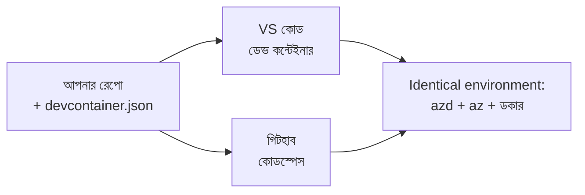

# azd এর জন্য ডেভ কন্টেইনার এবং GitHub Codespaces

**অধ্যায় নেভিগেশন:**
- **📚 কোর্স হোম**: [শুরুদের জন্য AZD](../../README.md)
- **📖 চলতি অধ্যায়**: অধ্যায় ১ - ভিত্তি ও দ্রুত শুরু
- **⬅️ পূর্ববর্তী**: [নিজের অ্যাপ আনুন](bring-your-own-app.md)
- **🚀 পরবর্তী অধ্যায়**: [অধ্যায় ২: AI-প্রথম উন্নয়ন](../chapter-02-ai-development/README.md)

> জুলাই ২০২৬-এ `azd 1.27.1` এর বিরুদ্ধে যাচাই করা হয়েছে।

## ভূমিকা

প্রতিটি মেশিনে azd, সঠিক ভাষার রানটাইম, Docker, এবং Azure CLI ইনস্টল করা একটি দায়িত্বপূর্ণ কাজ — এবং "আমার মেশিনে কাজ করে" এমন একটি টিউটোরিয়াল অন্য কারো জন্য ব্যর্থ হওয়ার প্রথম কারণ। একটি **ডেভ কন্টেইনার** এই সমস্যার সমাধান করে আপনার পুরো টুলচেইন একটি ফাইলে বর্ণনা করে। যে কেউ VS Code বা GitHub Codespaces-এ প্রকল্পটি খুলল, ঠিক একই পরিবেশ পায়, যেখানে azd ইতিমধ্যেই ইনস্টল করা আছে। এই পাঠে আপনি একটি কিভাবে যোগ করবেন তা শিখবেন।

## শেখার লক্ষ্যসমূহ

এই পাঠ শেষ করার পর, আপনি:
- বুঝতে পারবেন ডেভ কন্টেইনার কী এবং এটি azd-র জন্য কেন সাহায্য করে
- একটি ন্যূনতম `.devcontainer/devcontainer.json` একটি প্রকল্পে যোগ করবেন
- Dev Container *features* ব্যবহার করে azd, Azure CLI, এবং Docker অন্তর্ভুক্ত করবেন
- GitHub Codespaces বা VS Code-এ প্রকল্পটি খুলবেন

## শেখার ফলাফলসমূহ

এই পাঠ সমাপ্তির পর, আপনি সক্ষম হবেন:
- একটি azd প্রকল্পের জন্য `devcontainer.json` তৈরি করতে
- ম্যানুয়াল ইনস্টল ছাড়াই azd এবং Azure টুলিং যোগ করতে
- একটি কন্টেইনার বা Codespace-এর ভিতর থেকে `azd up` চালাতে

---

## ডেভ কন্টেইনার কী?

একটি ডেভ কন্টেইনার একটি Docker-ভিত্তিক উন্নয়ন পরিবেশ যা আপনার রিপোজিটরিতে `.devcontainer/devcontainer.json` ফাইল দ্বারা সংজ্ঞায়িত। যখন আপনি প্রকল্পটি খুলবেন:

- **VS Code** (Dev Containers বর্ধনসহ) কন্টেইনার তৈরি করে এবং এতে সংযুক্ত হয়।
- **GitHub Codespaces** একই কন্টেইনার ক্লাউডে তৈরি করে এবং আপনাকে ব্রাউজার-ভিত্তিক এডিটর দেয়।

যেকোন উপায়ই হোক, প্রত্যেক অবদানকারী একই টুলস্যুট পায় — "আপনি azd ইনস্টল করেছেন কিনা?" সমস্যা হয় না।



---

## ধাপ ১: devcontainer ফাইল তৈরি করুন

আপনার প্রকল্পের মূল ফোল্ডারে `.devcontainer/devcontainer.json` তৈরি করুন:

```json
{
  "name": "azd-project",
  "image": "mcr.microsoft.com/devcontainers/base:bookworm",
  "features": {
    "ghcr.io/devcontainers/features/azure-cli:1": {},
    "ghcr.io/azure/azure-dev/azd:latest": {},
    "ghcr.io/devcontainers/features/docker-in-docker:2": {},
    "ghcr.io/devcontainers/features/node:1": {}
  },
  "customizations": {
    "vscode": {
      "extensions": [
        "ms-azuretools.azure-dev",
        "ms-azuretools.vscode-bicep"
      ]
    }
  },
  "forwardPorts": [3000],
  "postCreateCommand": "azd version"
}
```

প্রতিটি অংশ কী কাজ করে:

| কী | উদ্দেশ্য |
|-----|---------|
| `image` | কন্টেইনারের জন্য বেস OS |
| `features` | প্রি-বিল্ট ইনস্টলার — এখানে: Azure CLI, **azd**, Docker, এবং Node.js |
| `customizations.vscode.extensions` | azd এবং Bicep VS Code এক্সটেনশানগুলি স্বয়ংক্রিয় ইনস্টল করে |
| `forwardPorts` | আপনার অ্যাপের পোর্ট ব্রাউজারে প্রকাশ করে |
| `postCreateCommand` | কন্টেইনার তৈরি হওয়ার পরে একবার চালানো হয় (এখানে, একটি স্যানিটি চেক) |

> `ghcr.io/azure/azure-dev/azd:latest` ফিচারটি কন্টেইনারে azd পাওয়ার অফিসিয়াল উপায়। পুনরুত্পাদনশীলতার জন্য একটি নির্দিষ্ট সংস্করণ (যেমন `azd:1.27.1`) পিন করুন।

---

## ধাপ ২: আপনার অ্যাপের ভাষার ফিচারের সঙ্গে মেলান

আপনার অ্যাপ যা ব্যবহার করে তার জন্য `node` ফিচারটি বদলান:

```jsonc
// Python project
"ghcr.io/devcontainers/features/python:1": {},

// .NET project
"ghcr.io/devcontainers/features/dotnet:2": {},

// Java project
"ghcr.io/devcontainers/features/java:1": {},

// Go project
"ghcr.io/devcontainers/features/go:1": {}
```

যদি আপনার `host` `containerapp`, `aks`, বা কন্টেইনার ইমেজ তৈরি করে এমন কিছু হয় তাহলে `docker-in-docker` বজায় রাখুন—azd-কে Docker প্রয়োজন ইমেজ তৈরি ও পুশ করার জন্য।

---

## ধাপ ৩: এটি খুলুন

**VS Code-এ:**
1. **Dev Containers** এক্সটেনশন ইনস্টল করুন।
2. প্রকল্প ফোল্ডারটি খুলুন।
3. প্রম্পট পেলে **Reopen in Container** ক্লিক করুন (অথবা *Dev Containers: Reopen in Container* চালান)।

**GitHub Codespaces-এ:**
1. রিপো GitHub-এ পুশ করুন।
2. **Code → Codespaces → Create codespace on main** এ ক্লিক করুন।
3. কন্টেইনার বিল্ডের জন্য অপেক্ষা করুন — টার্মিনালে azd প্রস্তুত থাকবে।

---

## ধাপ ৪: কন্টেইনারের ভিতর থেকে ডিপ্লয় করুন

কন্টেইনারে azd প্রি-ইনস্টল করা আছে, তাই স্বাভাবিক ওয়ার্কফ্লো কাজ করে:

```bash
azd auth login --use-device-code   # ডিভাইস কোড কোডস্পেসের ভিতরে সুবিধাজনক
azd up
```

> **কেন `--use-device-code`?** একটি রিমোট কন্টেইনার বা Codespace-এ কোনো লোকাল ব্রাউজার রিডাইরেক্ট করার জন্য নেই, তাই ডিভাইস-কোড লগইন হল নির্ভরযোগ্য উপায়। আপনি সাইন-ইনের জন্য একটি কোড ব্রাউজার ট্যাবে পেস্ট করবেন।

---

## সাধারণ সমস্যা

| সমস্যা | সমাধান |
|---------|-----|
| `azd up` ইমেজ তৈরি করতে পারে না | `docker-in-docker` ফিচার যোগ করুন |
| Codespaces-এ ব্রাউজার লগইন আটকে যায় | `azd auth login --use-device-code` ব্যবহার করুন |
| টিমমেম্বারদের মধ্যে টুল ভিন্ন | ফিচার সংস্করণ পিন করুন (যেমন `azd:1.27.1`) |
| ব্রাউজারে অ্যাপ পৌঁছনো যায় না | `forwardPorts`-এ পোর্ট যোগ করুন |

---

## সারসংক্ষেপ

- একটি ডেভ কন্টেইনার আপনার azd টুলচেইন সবাইয়ের জন্য পুনরুত্পাদনীয় করে তোলে।
- Dev Container *features* এর মাধ্যমে azd, Azure CLI, এবং Docker যোগ করুন।
- আপনার অ্যাপের ভাষার ফিচারের সঙ্গে মেলান এবং কন্টেইনার হোস্টের জন্য `docker-in-docker` রাখুন।
- Codespaces-এ চালানোর সময় ডিভাইস-কোড লগইন ব্যবহার করুন।

---

## 🔗 নেভিগেশন

| দিক | উৎস |
|-----------|----------|
| **পূর্ববর্তী** | [নিজের অ্যাপ আনুন](bring-your-own-app.md) |
| **অধ্যায় হোম** | [অধ্যায় ১: ভিত্তি ও দ্রুত শুরু](README.md) |
| **পরবর্তী অধ্যায়** | [অধ্যায় ২: AI-প্রথম উন্নয়ন](../chapter-02-ai-development/README.md) |

## 📖 সম্পর্কিত উত্সসমূহ

- [ইনস্টলেশন ও সেটআপ](installation.md)
- [কমান্ড চিটশীট](../../resources/cheat-sheet.md)
- [আনুষ্ঠানিক ডেভ কন্টেইনার স্পেসিফিকেশন](https://containers.dev/)
- [azd Dev Container ফিচার](https://github.com/Azure/azure-dev/tree/main/ext/devcontainer)

---

<!-- CO-OP TRANSLATOR DISCLAIMER START -->
**অস্বীকৃতি**:
এই নথিটি AI অনুবাদ পরিষেবা [Co-op Translator](https://github.com/Azure/co-op-translator) ব্যবহার করে অনূদিত হয়েছে। যদিও আমরা শুদ্ধতার জন্য চেষ্টা করি, অনুগ্রহ করে মনে রাখবেন যে স্বয়ংক্রিয় অনুবাদে ত্রুটি বা অসঙ্গতি থাকতে পারে। মূল নথিটি তার স্বভাষায় কর্তৃত্বপূর্ণ উৎস হিসেবে বিবেচিত হওয়া উচিত। গুরুত্বপূর্ণ তথ্যের জন্য পেশাদার মানব অনুবাদ সুপারিশ করা হয়। এই অনুবাদের ব্যবহারে প্রয়োজনীয় ভুল বোঝাবুঝি বা ভুল ব্যাখ্যার জন্য আমরা দায়বদ্ধ নই।
<!-- CO-OP TRANSLATOR DISCLAIMER END -->