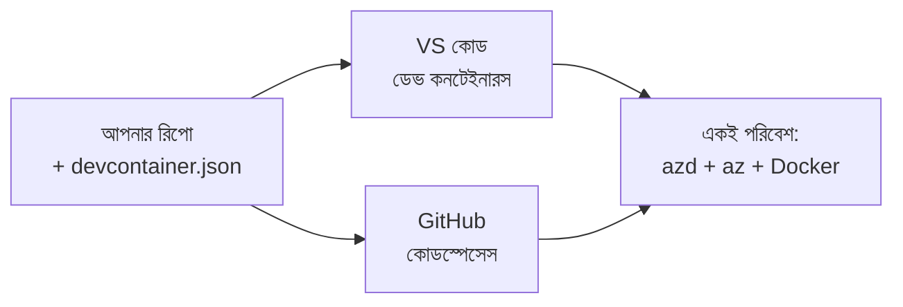

# azd-এর জন্য Dev Containers ও GitHub Codespaces

**অধ্যায় নেভিগেশন:**
- **📚 কোর্স হোম**: [নতুনদের জন্য AZD](../../README.md)
- **📖 বর্তমান অধ্যায়**: অধ্যায় 1 - ভিত্তি ও দ্রুত শুরু
- **⬅️ পূর্ববর্তী**: [নিজস্ব অ্যাপ](bring-your-own-app.md)
- **🚀 পরবর্তী অধ্যায়**: [অধ্যায় ২: AI-প্রাথমিক উন্নয়ন](../chapter-02-ai-development/README.md)

> `azd 1.25.6` অনুযায়ী যাচাইকৃত, জুন 2026।

## ভূমিকা

প্রতিটি মেশিনে azd, সঠিক ভাষার রънটাইম, Docker এবং Azure CLI ইনস্টল করা ঝামেলার কাজ — এবং এটা সবচেয়ে বড় কারণ যে একটি টিউটোরিয়াল যা "আমার মেশিনে কাজ করে" অন্য কারো কাছে ব্যর্থ হয়ে যায়। একটি **dev container** এটি সমাধান করে কারণ এটি একটি ফাইলে আপনার পুরো টুলচেইন বর্ণনা করে। যে কেউ প্রজেক্টটি VS Code বা GitHub Codespaces-এ খুলবে তারা একেবারে একই পরিবেশ পাবে, azd আগেই ইনস্টল করা থাকবে। এই লেসনে দেখানো হবে কিভাবে একটি dev container যোগ করবেন।

## শেখার লক্ষ্য

এই লেসনের শেষে আপনি:
- বুঝতে পারবেন dev container কী এবং এটি azd-এ কেন সহায়ক
- একটি ন্যূনতম `.devcontainer/devcontainer.json` প্রজেক্টে যোগ করতে পারবেন
- Dev Container *ফিচার* ব্যবহার করে azd, Azure CLI, এবং Docker অন্তর্ভুক্ত করতে পারবেন
- প্রজেক্টটি GitHub Codespaces বা VS Code-এ খুলতে পারবেন

## শেখার ফলাফল

এই লেসন সম্পন্ন করার পরে, আপনি সক্ষম হবেন:
- একটি azd প্রজেক্টের জন্য `devcontainer.json` লেখার
- ম্যানুয়াল ইনস্টল ছাড়াই azd এবং Azure টুলিং যোগ করার
- কন্টেইনার বা Codespace-এর ভিতর থেকে `azd up` চালানোর

---

## Dev Container কী?

একটি dev container হল Docker-ভিত্তিক একটি ডেভেলপমেন্ট পরিবেশ যা আপনার রেপোজিটরির `.devcontainer/devcontainer.json` ফাইলে সংজ্ঞায়িত করা হয়। যখন আপনি প্রজেক্টটি খুলবেন:

- **VS Code** (Dev Containers এক্সটেনশনসহ) কন্টেইনারটি বিল্ড করে এবং এটিতে সংযুক্ত করে।
- **GitHub Codespaces** একই কন্টেইনারটি ক্লাউডে বিল্ড করে এবং আপনাকে একটি ব্রাউজার-ভিত্তিক এডিটর দেয়।

যেকোনো ক্ষেত্রে, প্রতিটি অবদানকারী একই টুলগুলো পায়—কোন "azd ইনস্টল করেছেন?" ধাঁচের ডিবাগিং নয়।



---

## ধাপ ১: devcontainer ফাইল তৈরি করুন

প্রজেক্টের রুটে `.devcontainer/devcontainer.json` ফাইল তৈরি করুন:

```json
{
  "name": "azd-project",
  "image": "mcr.microsoft.com/devcontainers/base:bookworm",
  "features": {
    "ghcr.io/devcontainers/features/azure-cli:1": {},
    "ghcr.io/azure/azure-dev/azd:latest": {},
    "ghcr.io/devcontainers/features/docker-in-docker:2": {},
    "ghcr.io/devcontainers/features/node:1": {}
  },
  "customizations": {
    "vscode": {
      "extensions": [
        "ms-azuretools.azure-dev",
        "ms-azuretools.vscode-bicep"
      ]
    }
  },
  "forwardPorts": [3000],
  "postCreateCommand": "azd version"
}
```

প্রতিটি অংশ কী করে:

| কী | উদ্দেশ্য |
|-----|---------|
| `image` | কন্টেইনারের জন্য বেস OS |
| `features` | প্রি-বিল্ট ইন্সটলার—এখানে: Azure CLI, **azd**, Docker, এবং Node.js |
| `customizations.vscode.extensions` | azd এবং Bicep VS Code এক্সটেনশনগুলো স্বয়ংক্রিয়ভাবে ইনস্টল করে |
| `forwardPorts` | আপনার অ্যাপের পোর্টকে ব্রাউজারে এক্সপোজ করে |
| `postCreateCommand` | কন্টেইনার বিল্ড হওয়ার পরে একবার চালায় (এখানে, একটি স্যানিটি চেক) |

> `ghcr.io/azure/azure-dev/azd:latest` ফিচারটি কন্টেইনারে azd পাওয়ার অফিসিয়াল উপায়। পুনরুত্পাদনযোগ্যতার জন্য একটি নির্দিষ্ট সংস্করণ পিন করুন (উদাহরণস্বরূপ `azd:1.25.6`)।

---

## ধাপ ২: আপনার অ্যাপের ভাষার সাথে ফিচারটি মেলান

আপনার অ্যাপ যা ব্যবহার করে তা অনুযায়ী `node` ফিচারটি প্রতিস্থাপন করুন:

```jsonc
// Python project
"ghcr.io/devcontainers/features/python:1": {},

// .NET project
"ghcr.io/devcontainers/features/dotnet:2": {},

// Java project
"ghcr.io/devcontainers/features/java:1": {},

// Go project
"ghcr.io/devcontainers/features/go:1": {}
```

আপনার `host` যদি `containerapp`, `aks`, বা এমন কিছু হয় যা কন্টেইনার ইমেজ তৈরি করে, তাহলে `docker-in-docker` রাখুন—azd ইমেজ বিল্ড ও পুশ করতে Docker প্রয়োজন।

---

## ধাপ ৩: এটি খুলুন

**VS Code-এ:**
1. **Dev Containers** এক্সটেনশন ইনস্টল করুন।
2. প্রজেক্ট ফোল্ডারটি খুলুন।
3. প্রম্পট পেলে **Reopen in Container** ক্লিক করুন (অথবা *Dev Containers: Reopen in Container* চালান)।

**GitHub Codespaces-এ:**
1. রিপোটি GitHub-এ পুশ করুন।
2. ক্লিক করুন **Code → Codespaces → Create codespace on main**।
3. কন্টেইনার বিল্ড হওয়ার জন্য অপেক্ষা করুন—টার্মিনালে azd প্রস্তুত থাকবে।

---

## ধাপ ৪: কন্টেইনারের ভিতর থেকে ডিপ্লয় করুন

কন্টেইনারে azd পূর্বেই ইনস্টল করা থাকে, তাই সাধারণ ওয়ার্কফ্লোটি কেবল কাজ করবে:

```bash
azd auth login --use-device-code   # ডিভাইস কোড Codespaces-এ ব্যবহার করতে সুবিধাজনক
azd up
```

> **কেন `--use-device-code`?** একটি রিমোট কন্টেইনার বা Codespace-এ লোকাল ব্রাউজার রিডাইরেক্ট করার সুযোগ নেই, তাই ডিভাইস-কোড লগইনটি নির্ভরযোগ্য পন্থা। আপনি সাইন-ইন সম্পন্ন করতে একটি কোড ব্রাউজার ট্যাবে পেস্ট করবেন।

---

## সাধারণ সমস্যাগুলি

| সমস্যা | সমাধান |
|---------|-----|
| `azd up` can't build an image | `docker-in-docker` ফিচার যোগ করুন |
| Browser login hangs in Codespaces | Use `azd auth login --use-device-code` |
| Tools differ between teammates | ফিচার ভার্সন পিন করুন (উদাহরণ: `azd:1.25.6`) |
| App not reachable in browser | পোর্টটি `forwardPorts`-এ যোগ করুন |

---

## সারসংক্ষেপ

- একটি dev container আপনার azd টুলচেইন সকলের জন্য পুনরুত্পাদনযোগ্য করে।
- Dev Container *ফিচার* ব্যবহার করে azd, Azure CLI, এবং Docker যোগ করুন।
- আপনার অ্যাপের ভাষার ফিচারের সাথে মিলান এবং কন্টেইনার হোস্টগুলোর জন্য `docker-in-docker` রাখুন।
- Codespaces-এ চালানোর সময় ডিভাইস-কোড লগইন ব্যবহার করুন।

---

## 🔗 নেভিগেশন

| দিক | রিসোর্স |
|-----------|----------|
| **পূর্ববর্তী** | [নিজস্ব অ্যাপ](bring-your-own-app.md) |
| **অধ্যায় হোম** | [অধ্যায় 1: ভিত্তি ও দ্রুত শুরু](README.md) |
| **পরবর্তী অধ্যায়** | [অধ্যায় ২: AI-প্রাথমিক উন্নয়ন](../chapter-02-ai-development/README.md) |

## 📖 সম্পর্কিত রিসোর্স

- [ইনস্টলেশন ও সেটআপ](installation.md)
- [কমান্ড চিটশিট](../../resources/cheat-sheet.md)
- [অফিশিয়াল Dev Containers স্পেসিফিকেশন](https://containers.dev/)
- [azd Dev Container ফিচার](https://github.com/Azure/azure-dev/tree/main/ext/devcontainer)

---

<!-- CO-OP TRANSLATOR DISCLAIMER START -->
**অস্বীকৃতি**:
এই নথিটি AI অনুবাদ পরিষেবা [Co-op Translator](https://github.com/Azure/co-op-translator) ব্যবহার করে অনূদিত হয়েছে। যদিও আমরা শুদ্ধতার জন্য চেষ্টা করি, অনুগ্রহ করে মনে রাখবেন যে স্বয়ংক্রিয় অনুবাদে ত্রুটি বা অসঙ্গতি থাকতে পারে। মূল নথিটি তার স্বভাষায় কর্তৃত্বপূর্ণ উৎস হিসেবে বিবেচিত হওয়া উচিত। গুরুত্বপূর্ণ তথ্যের জন্য পেশাদার মানব অনুবাদ সুপারিশ করা হয়। এই অনুবাদের ব্যবহারে প্রয়োজনীয় ভুল বোঝাবুঝি বা ভুল ব্যাখ্যার জন্য আমরা দায়বদ্ধ নই।
<!-- CO-OP TRANSLATOR DISCLAIMER END -->