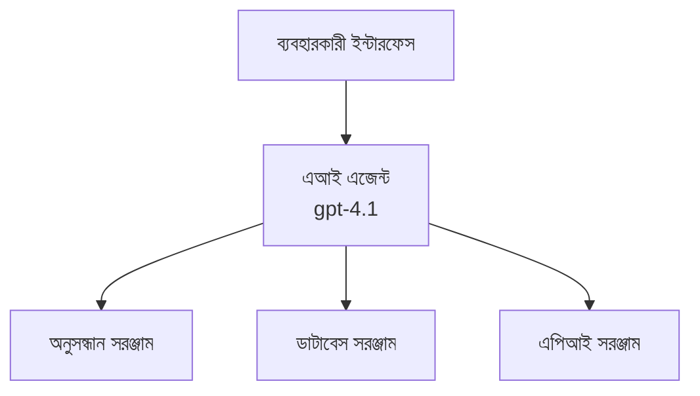
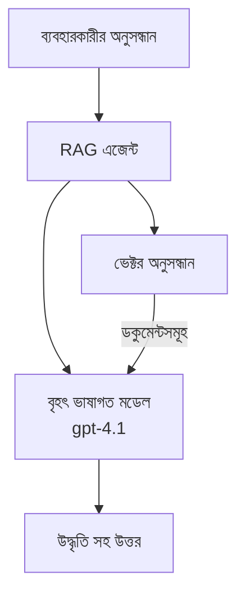

# Azure Developer CLI দিয়ে AI এজেন্ট

**চ্যাপ্টার ন্যাভিগেশন:**
- **📚 কোর্স হোম**: [AZD শুরুদের জন্য](../../README.md)
- **📖 বর্তমান অধ্যায়**: চ্যাপ্টার 2 - এআই-প্রথম উন্নয়ন
- **⬅️ পূর্ববর্তী**: [Microsoft Foundry ইন্টিগ্রেশন](microsoft-foundry-integration.md)
- **➡️ পরবর্তী**: [AI মডেল ডিপ্লয়মেন্ট](ai-model-deployment.md)
- **🚀 অ্যাডভান্সড**: [মাল্টি-এজেন্ট সমাধান](../../examples/retail-scenario.md)

---

## পরিচিতি

AI এজেন্ট হলো স্বনির্ভর প্রোগ্রামগুলো যা তাদের পরিবেশ অনুভব করতে পারে, সিদ্ধান্ত নিতে পারে এবং নির্দিষ্ট লক্ষ্য পূরণের জন্য কর্ম গ্রহণ করতে পারে। সাধারণ প্রম্পট-প্রতিরোধকারী চ্যাটবটগুলোর মত নয়, এজেন্টগুলো পারে:

- **টুল ব্যবহার করে** - API কল করা, ডেটাবেস সার্চ করা, কোড এক্সিকিউট করা
- **পরিকল্পনা ও যুক্তি** - জটিল কাজকে ধাপে ভাগ করা
- **প্রেক্ষাপট থেকে শেখে** - স্মৃতি বজায় রাখা এবং আচরণ অভিযোজিত করা
- **সহযোগিতা** - অন্যান্য এজেন্টদের সঙ্গে কাজ করা (মাল্টি-এজেন্ট সিস্টেম)

এই গাইডটি দেখায় কিভাবে Azure Developer CLI (azd) ব্যবহার করে Azure-এ AI এজেন্ট ডিপ্লয় করবেন।

## শেখার লক্ষ্য

এই গাইডটি সম্পন্ন করার পর আপনি:
- বুঝতে পারবেন AI এজেন্ট কী এবং সেগুলি কিভাবে চ্যাটবট থেকে আলাদা
- AZD ব্যবহার করে পূর্বনির্মিত AI এজেন্ট টেমপ্লেট ডিপ্লয় করবেন
- কাস্টম এজেন্টের জন্য Foundry Agents কনফিগার করবেন
- মৌলিক এজেন্ট প্যাটার্নগুলি বাস্তবায়ন করবেন (টুল ব্যবহার, RAG, মাল্টি-এজেন্ট)
- ডিপ্লয় করা এজেন্ট পর্যবেক্ষণ ও ডিবাগ করবেন

## শেখার ফলাফল

সমাপ্তির পর আপনি সক্ষম হবেন:
- একক কমান্ডে Azure-এ AI এজেন্ট অ্যাপ্লিকেশন ডিপ্লয় করতে
- এজেন্ট টুল ও ক্ষমতাসমূহ কনফিগার করতে
- এজেন্টের সঙ্গে রিট্রিভাল-অগমেন্টেড জেনারেশন (RAG) বাস্তবায়ন করতে
- জটিল ওয়ার্কফ্লোর জন্য মাল্টি-এজেন্ট আর্কিটেকচার ডিজাইন করতে
- সাধারণ এজেন্ট ডিপ্লয়মেন্ট সমস্যাগুলি সমাধান করতে

---

## 🤖 একটি এজেন্টকে চ্যাটবট থেকে আলাদা করে কী?

| বৈশিষ্ট্য | চ্যাটবট | AI এজেন্ট |
|---------|---------|----------|
| **আচরণ** | প্রম্পটে প্রতিক্রিয়া করে | স্বয়ংক্রিয় কর্ম গ্রহণ করে |
| **টুলস** | নেই | API কল করতে পারে, সার্চ করতে পারে, কোড চালাতে পারে |
| **স্মৃতি** | কেবল সেশন-ভিত্তিক | সেশন জুড়ে স্থায়ী স্মৃতি |
| **পরিকল্পনা** | একক উত্তর | বহু-ধাপ যুক্তি |
| **সহযোগিতা** | একক সত্তা | অন্যান্য এজেন্টদের সঙ্গে কাজ করতে পারে |

### সহজ উপমা

- **চ্যাটবট** = তথ্য ডেস্কে প্রশ্নের উত্তর দেয় এমন একটি সাহায্যকারী ব্যক্তি
- **AI এজেন্ট** = আপনার জন্য কল করা, অ্যাপয়েন্টমেন্ট বুক করা এবং কাজ সম্পন্ন করতে সক্ষম একটি ব্যক্তিগত সহকারী

---

## 🚀 দ্রুত শুরু: আপনার প্রথম এজেন্ট ডিপ্লয় করুন

### অপশন ১: Foundry Agents টেমপ্লেট (প্রস্তাবিত)

```bash
# AI এজেন্টের টেমপ্লেট প্রাথমিককরণ করুন
azd init --template get-started-with-ai-agents

# Azure-এ স্থাপন করুন
azd up
```

**কি ডিপ্লয় হবে:**
- ✅ Foundry Agents
- ✅ Microsoft Foundry Models (gpt-4.1)
- ✅ Azure AI Search (for RAG)
- ✅ Azure Container Apps (web interface)
- ✅ Application Insights (monitoring)

**সময়:** ~15-20 মিনিট
**খরচ:** ~$100-150/মাস (ডেভেলপমেন্ট)

### অপশন ২: Prompty সহ OpenAI এজেন্ট

```bash
# Prompty-ভিত্তিক এজেন্ট টেমপ্লেট শুরু করুন
azd init --template agent-openai-python-prompty

# Azure-এ স্থাপন করুন
azd up
```

**কি ডিপ্লয় হবে:**
- ✅ Azure Functions (serverless agent execution)
- ✅ Microsoft Foundry Models
- ✅ Prompty configuration files
- ✅ Sample agent implementation

**সময়:** ~10-15 মিনিট
**খরচ:** ~$50-100/মাস (ডেভেলপমেন্ট)

### অপশন ৩: RAG চ্যাট এজেন্ট

```bash
# RAG চ্যাট টেমপ্লেট প্রাথমিককরণ করুন
azd init --template azure-search-openai-demo

# Azure-এ স্থাপন করুন
azd up
```

**কি ডিপ্লয় হবে:**
- ✅ Microsoft Foundry Models
- ✅ Azure AI Search with sample data
- ✅ Document processing pipeline
- ✅ Chat interface with citations

**সময়:** ~15-25 মিনিট
**খরচ:** ~$80-150/মাস (ডেভেলপমেন্ট)

### অপশন ৪: AZD AI Agent Init (মেনিফেস্ট-ভিত্তিক)

If you have an agent manifest file, you can use the `azd ai` command to scaffold a Foundry Agent Service project directly:

```bash
# AI এজেন্ট এক্সটেনশন ইনস্টল করুন
azd extension install azure.ai.agents

# একটি এজেন্ট ম্যানিফেস্ট থেকে ইনিশিয়ালাইজ করুন
azd ai agent init -m agent-manifest.yaml

# Azure-এ ডিপ্লয় করুন
azd up
```

**When to use `azd ai agent init` vs `azd init --template`:**

| Approach | Best For | How It Works |
|----------|----------|------|
| `azd init --template` | Starting from a working sample app | Clones a full template repo with code + infra |
| `azd ai agent init -m` | Building from your own agent manifest | Scaffolds project structure from your agent definition |

> **টিপ:** `azd init --template` শেখার সময় ব্যবহার করুন (উপরের অপশন 1-3)। আপনার নিজস্ব মেনিফেস্ট দিয়ে প্রোডাকশন এজেন্ট তৈরি করলে `azd ai agent init` ব্যবহার করুন। পূর্ণ রেফারেন্সের জন্য দেখুন [AZD AI CLI কমান্ডসমূহ](../chapter-08-production/production-ai-practices.md#azd-ai-cli-commands-and-extensions)।

---

## 🏗️ এজেন্ট আর্কিটেকচার প্যাটার্ন

### প্যাটার্ন 1: একক এজেন্ট টুলের সাথে

সবচেয়ে সহজ প্যাটার্ন - একে এমন একটি এজেন্ট যা একাধিক টুল ব্যবহার করতে পারে।


**উপযুক্ত:**
- গ্রাহক সমর্থন বট
- গবেষণা সহকারী
- ডেটা বিশ্লেষণ এজেন্ট

**AZD টেমপ্লেট:** `azure-search-openai-demo`

### প্যাটার্ন 2: RAG এজেন্ট (রিট্রিভাল-অগমেন্টেড জেনারেশন)

উত্তর জেনারেট করার আগে প্রাসঙ্গিক ডকুমেন্টগুলি উদ্ধার করে এমন একটি এজেন্ট।


**উপযুক্ত:**
- এন্টারপ্রাইজ জ্ঞানভিত্তিক সিস্টেম
- ডকুমেন্ট Q&A সিস্টেম
- কমপ্লায়েন্স এবং আইনি গবেষণা

**AZD টেমপ্লেট:** `azure-search-openai-demo`

### প্যাটার্ন 3: মাল্টি-এজেন্ট সিস্টেম

জটিল কাজগুলোতে একসাথে কাজ করে এমন একাধিক বিশেষায়িত এজেন্ট।


**উপযুক্ত:**
- জটিল কনটেন্ট জেনারেশন
- বহু-ধাপ ওয়ার্কফ্লো
- ভিন্ন ভিন্ন দক্ষতার প্রয়োজন এমন টাস্ক

**আরও জানতে:** [সমন্বয় প্যাটার্ন](../chapter-06-pre-deployment/coordination-patterns.md)

---

## ⚙️ এজেন্ট টুল কনফিগার করা

এজেন্টগুলো শক্তিশালী হয় যখন তারা টুল ব্যবহার করতে পারে। সাধারণ টুল কিভাবে কনফিগার করবেন তা এখানে:

### Foundry Agents-এ টুল কনফিগারেশন

```python
# agent_config.py
from azure.ai.projects import AIProjectClient
from azure.ai.projects.models import FunctionTool, CodeInterpreterTool

# কাস্টম টুলগুলি সংজ্ঞায়িত করুন
search_tool = FunctionTool(
    name="search_knowledge_base",
    description="Search the company knowledge base for relevant documents",
    parameters={
        "type": "object",
        "properties": {
            "query": {
                "type": "string",
                "description": "The search query"
            }
        },
        "required": ["query"]
    }
)

# টুলসহ এজেন্ট তৈরি করুন
agent = project_client.agents.create_agent(
    model="gpt-4.1",
    name="Support Agent",
    instructions="You are a helpful support agent. Use the search tool to find relevant information.",
    tools=[search_tool, CodeInterpreterTool()]
)
```

### পরিবেশ কনফিগারেশন

```bash
# এজেন্ট-নির্দিষ্ট পরিবেশ ভেরিয়েবলগুলি সেট আপ করুন
azd env set AZURE_OPENAI_MODEL "gpt-4.1"
azd env set AGENT_INSTRUCTIONS "You are a helpful assistant..."
azd env set ENABLE_CODE_INTERPRETER "true"
azd env set ENABLE_FILE_SEARCH "true"

# আপডেট করা কনফিগারেশন দিয়ে ডিপ্লয় করুন
azd deploy
```

---

## 📊 এজেন্ট পর্যবেক্ষণ

### Application Insights ইন্টিগ্রেশন

সব AZD এজেন্ট টেমপ্লেট মনিটরিং-এর জন্য Application Insights অন্তর্ভুক্ত করে:

```bash
# মনিটরিং ড্যাশবোর্ড খুলুন
azd monitor --overview

# লাইভ লগ দেখুন
azd monitor --logs

# লাইভ মেট্রিক্স দেখুন
azd monitor --live
```

### ট্র্যাক করার মূল মেট্রিক্স

| মেট্রিক | বর্ণনা | লক্ষ্য |
|--------|-------------|--------|
| প্রতিক্রিয়া বিলম্ব | উত্তর জেনারেট করার সময় | < 5 সেকেন্ড |
| টোকেন ব্যবহার | প্রতি রিকোয়েস্ট টোকেন | খরচের জন্য পর্যবেক্ষণ করুন |
| টুল কল সাফল্য হার | সফল টুল এক্সিকিউশনের % | > 95% |
| এরর হার | ব্যর্থ এজেন্ট অনুরোধ | < 1% |
| ইউজার সন্তুষ্টি | ফিডব্যাক স্কোর | > 4.0/5.0 |

### এজেন্টের জন্য কাস্টম লগিং

```python
import os
from azure.monitor.opentelemetry import configure_azure_monitor
from opentelemetry import trace

# OpenTelemetry ব্যবহার করে Azure Monitor কনফিগার করুন
configure_azure_monitor(
    connection_string=os.environ["APPLICATIONINSIGHTS_CONNECTION_STRING"]
)

tracer = trace.get_tracer(__name__)

def log_agent_interaction(user_query, agent_response, tools_used, latency_ms):
    with tracer.start_as_current_span("agent_interaction") as span:
        span.set_attributes({
            "user_query": user_query,
            "response_length": len(agent_response),
            "tools_used": tools_used,
            "latency_ms": latency_ms
        })
```

> **নোট:** প্রয়োজনীয় প্যাকেজগুলো ইনস্টল করুন: `pip install azure-monitor-opentelemetry opentelemetry`

---

## 💰 খরচ বিবেচনা

### প্যাটার্ন অনুযায়ী অনুমানকৃত মাসিক খরচ

| প্যাটার্ন | ডেভ এনভায়রনমেন্ট | প্রোডাকশন |
|---------|-----------------|------------|
| একক এজেন্ট | $50-100 | $200-500 |
| RAG এজেন্ট | $80-150 | $300-800 |
| মাল্টি-এজেন্ট (2-3 এজেন্ট) | $150-300 | $500-1,500 |
| এন্টারপ্রাইজ মাল্টি-এজেন্ট | $300-500 | $1,500-5,000+ |

### খরচ অপ্টিমাইজেশন টিপস

1. **সরল কাজের জন্য gpt-4.1-mini ব্যবহার করুন**
   ```bash
   azd env set AZURE_OPENAI_MODEL "gpt-4.1-mini"
   ```

2. **পুনরাবৃত্তি কোয়েরির জন্য ক্যাশিং বাস্তবায়ন করুন**
   ```python
   from functools import lru_cache
   
   @lru_cache(maxsize=1000)
   def get_cached_response(query_hash):
       return agent.run(query_hash)
   ```

3. **প্রতি রান টোকেন সীমা নির্ধারণ করুন**
   ```python
   # এজেন্ট চালানোর সময় max_completion_tokens সেট করুন, তৈরি করার সময় নয়
   run = project_client.agents.create_run(
       thread_id=thread.id,
       agent_id=agent.id,
       max_completion_tokens=1000  # উত্তরের দৈর্ঘ্য সীমিত করুন
   )
   ```

4. **অব্যবহারের সময় জিরো-স্কেল করুন**
   ```bash
   # কনটেইনার অ্যাপস স্বয়ংক্রিয়ভাবে শূন্য পর্যন্ত স্কেল করে
   azd env set MIN_REPLICAS "0"
   ```

---

## 🔧 এজেন্ট ট্রাবলশুটিং

### সাধারণ সমস্যা ও সমাধান

<details>
<summary><strong>❌ এজেন্ট টুল কলগুলিতে সাড়া দিচ্ছে না</strong></summary>

```bash
# যন্ত্রগুলি সঠিকভাবে নিবন্ধিত আছে কি না পরীক্ষা করুন
azd show

# OpenAI ডিপ্লয়মেন্ট যাচাই করুন
az cognitiveservices account deployment list \
  --name $AZURE_OPENAI_NAME \
  --resource-group $RG_NAME

# এজেন্ট লগগুলি পরীক্ষা করুন
azd monitor --logs
```

**সাধারণ কারণসমূহ:**
- টুল ফাংশনের সিগনেচারে মিল নেই
- প্রয়োজনীয় অনুমতি অনুপস্থিত
- API এন্ডপয়েন্ট অ্যাক্সেসযোগ্য নয়
</details>

<details>
<summary><strong>❌ এজেন্ট প্রতিক্রিয়ায় উচ্চ বিলম্ব</strong></summary>

```bash
# বটলনেকগুলির জন্য Application Insights পরীক্ষা করুন
azd monitor --live

# দ্রুততর মডেল ব্যবহার করার কথা বিবেচনা করুন
azd env set AZURE_OPENAI_MODEL "gpt-4.1-mini"
azd deploy
```

**অপটিমাইজেশন টিপস:**
- স্ট্রিমিং রেসপন্স ব্যবহার করুন
- রেসপন্স ক্যাশিং বাস্তবায়ন করুন
- কনটেক্সট উইন্ডো সাইজ কমান
</details>

<details>
<summary><strong>❌ এজেন্ট ভুল বা হ্যালুসিনেটেড তথ্য ফেরত দিচ্ছে</strong></summary>

```python
# ভাল সিস্টেম প্রম্পটের মাধ্যমে উন্নত করুন
instructions = """
You are a helpful assistant. IMPORTANT:
- Only answer based on provided context
- If you don't know, say "I don't know"
- Always cite your sources
- Never make up information
"""

# গ্রাউন্ডিংয়ের জন্য পুনরুদ্ধার যোগ করুন
agent = project_client.agents.create_agent(
    model="gpt-4.1",
    instructions=instructions,
    tools=[FileSearchTool()]  # উত্তরসমূহকে নথিপত্রের ওপর ভিত্তি করুন
)
```
</details>

<details>
<summary><strong>❌ টোকেন সীমা অতিক্রম ত্রুটি</strong></summary>

```python
# কনটেক্সট উইন্ডো ব্যবস্থাপনা বাস্তবায়ন করুন
def truncate_context(messages, max_tokens=8000, model="gpt-4.1"):
    """Keep only recent messages within token limit."""
    import tiktoken
    encoding = tiktoken.encoding_for_model(model)
    total_tokens = 0
    truncated = []
    
    for msg in reversed(messages):
        msg_tokens = len(encoding.encode(msg.content))
        if total_tokens + msg_tokens > max_tokens:
            break
        truncated.insert(0, msg)
        total_tokens += msg_tokens
    
    return truncated
```
</details>

---

## 🎓 অনুশীলনী কার্যক্রম

### অনুশীলন 1: একটি মৌলিক এজেন্ট ডিপ্লয় করুন (20 মিনিট)

**লক্ষ্য:** AZD ব্যবহার করে আপনার প্রথম AI এজেন্ট ডিপ্লয় করা

```bash
# ধাপ ১: টেমপ্লেট ইনিশিয়ালাইজ করুন
azd init --template get-started-with-ai-agents

# ধাপ ২: Azure-এ লগ ইন করুন
azd auth login

# ধাপ ৩: ডিপ্লয় করুন
azd up

# ধাপ ৪: এজেন্টটি পরীক্ষা করুন
# ডিপ্লয়মেন্টের পরে প্রত্যাশিত আউটপুট:
#   ডিপ্লয়মেন্ট সম্পূর্ণ!
#   এন্ডপয়েন্ট: https://<app-name>.<region>.azurecontainerapps.io
# আউটপুটে প্রদর্শিত URLটি খুলুন এবং একটি প্রশ্ন জিজ্ঞাসা করে দেখুন

# ধাপ ৫: মনিটরিং দেখুন
azd monitor --overview

# ধাপ ৬: পরিস্কার করুন
azd down --force --purge
```

**সফলতার মানদণ্ড:**
- [ ] এজেন্ট প্রশ্নের উত্তর দেয়
- [ ] `azd monitor` এর মাধ্যমে মনিটরিং ড্যাশবোর্ড অ্যাক্সেস করতে পারে
- [ ] রিসোর্সগুলি সফলভাবে পরিষ্কার করা হয়েছে

### অনুশীলন 2: একটি কাস্টম টুল যোগ করুন (30 মিনিট)

**লক্ষ্য:** একটি কাস্টম টুল দিয়ে এজেন্ট সম্প্রসারিত করা

1. এজেন্ট টেমপ্লেট ডিপ্লয় করুন:
   ```bash
   azd init --template get-started-with-ai-agents
   azd up
   ```
2. আপনার এজেন্ট কোডে একটি নতুন টুল ফাংশন তৈরি করুন:
   ```python
   def get_weather(location: str) -> str:
       """Get current weather for a location."""
       # আবহাওয়া সেবায় API কল
       return f"Weather in {location}: Sunny, 72°F"
   ```
3. টুলটি এজেন্টের সাথে রেজিস্টার করুন:
   ```python
   from azure.ai.projects.models import FunctionTool

   weather_tool = FunctionTool(
       name="get_weather",
       description="Get current weather for a location",
       parameters={
           "type": "object",
           "properties": {
               "location": {"type": "string", "description": "City name"}
           },
           "required": ["location"]
       }
   )

   agent = project_client.agents.create_agent(
       model="gpt-4.1",
       name="Weather Agent",
       tools=[weather_tool]
   )
   ```
4. পুনরায় ডিপ্লয় এবং পরীক্ষা করুন:
   ```bash
   azd deploy
   # জিজ্ঞাসা: "সিয়াটলে আবহাওয়া কেমন?"
   # প্রত্যাশিত: এজেন্ট get_weather("Seattle") কল করে এবং আবহাওয়ার তথ্য ফেরত দেয়
   ```

**সফলতার মানদণ্ড:**
- [ ] এজেন্ট আবহাওয়া সম্পর্কিত প্রশ্ন চিনতে পারে
- [ ] টুলটি সঠিকভাবে কল হচ্ছে
- [ ] উত্তরটি আবহাওয়ার তথ্য অন্তর্ভুক্ত করে

### অনুশীলন 3: একটি RAG এজেন্ট তৈরি করুন (45 মিনিট)

**লক্ষ্য:** এমন একটি এজেন্ট তৈরি করা যা আপনার ডকুমেন্ট থেকে প্রশ্নের উত্তর দেয়

```bash
# ধাপ ১: RAG টেমপ্লেট মোতায়েন করুন
azd init --template azure-search-openai-demo
azd up

# ধাপ ২: আপনার ডকুমেন্ট আপলোড করুন
# PDF/TXT ফাইলগুলোকে data/ ডিরেক্টরিতে রাখুন, তারপর চালান:
python scripts/prepdocs.py

# ধাপ ৩: ডোমেইন-নির্দিষ্ট প্রশ্ন দিয়ে পরীক্ষা করুন
# azd up আউটপুট থেকে ওয়েব অ্যাপের URL খুলুন
# আপনার আপলোড করা ডকুমেন্ট সম্পর্কে প্রশ্ন করুন
# উত্তরে উদ্ধৃতি রেফারেন্স যেমন [doc.pdf] থাকা উচিত
```

**সফলতার মানদণ্ড:**
- [ ] এজেন্ট আপলোড করা ডকুমেন্ট থেকে উত্তর দেয়
- [ ] উত্তরগুলিতে সূত্র দেখানো আছে
- [ ] আউট-অফ-স্কোপ প্রশ্নে হ্যালুসিনেশন নেই

---

## 📚 পরবর্তী ধাপ

এখন যখন আপনি AI এজেন্টগুলো বুঝে গেছেন, এই অ্যাডভান্সড বিষয়গুলি অন্বেষণ করুন:

| বিষয় | বিবরণ | লিঙ্ক |
|-------|-------------|------|
| **মাল্টি-এজেন্ট সিস্টেম** | একাধিক সহযোগী এজেন্টসহ সিস্টেম তৈরি করুন | [রিটেইল মাল্টি-এজেন্ট উদাহরণ](../../examples/retail-scenario.md) |
| **সমন্বয় প্যাটার্ন** | অর্কেস্ট্রেশন এবং কমিউনিকেশন প্যাটার্ন শিখুন | [সমন্বয় প্যাটার্ন](../chapter-06-pre-deployment/coordination-patterns.md) |
| **প্রোডাকশন ডিপ্লয়মেন্ট** | এন্টারপ্রাইজ-রেডি এজেন্ট ডিপ্লয়মেন্ট | [প্রোডাকশন AI অনুশীলন](../chapter-08-production/production-ai-practices.md) |
| **এজেন্ট মূল্যায়ন** | এজেন্ট পারফরম্যান্স টেস্ট ও মূল্যায়ন করুন | [AI ট্রাবলশুটিং](../chapter-07-troubleshooting/ai-troubleshooting.md) |
| **AI ওয়ার্কশপ ল্যাব** | অনুশীলনী: আপনার AI সমাধানকে AZD-র জন্য প্রস্তুত করুন | [AI ওয়ার্কশপ ল্যাব](ai-workshop-lab.md) |

---

## 📖 অতিরিক্ত সম্পদ

### অফিসিয়াল ডকুমেন্টেশন
- [Azure AI Agent Service](https://learn.microsoft.com/azure/ai-services/agents/)
- [Azure AI Foundry Agent Service Quickstart](https://learn.microsoft.com/azure/ai-services/agents/quickstart)
- [Semantic Kernel Agent Framework](https://learn.microsoft.com/semantic-kernel/)

### AZD টেমপ্লেটস ফর এজেন্টস
- [Get Started with AI Agents](https://github.com/Azure-Samples/get-started-with-ai-agents)
- [Agent OpenAI Python Prompty](https://github.com/Azure-Samples/agent-openai-python-prompty)
- [Azure Search OpenAI Demo](https://github.com/Azure-Samples/azure-search-openai-demo)

### কমিউনিটি রিসোর্স
- [Awesome AZD - Agent Templates](https://azure.github.io/awesome-azd/?tags=ai-agents)
- [Azure AI Discord](https://discord.gg/microsoft-azure)
- [Microsoft Foundry Discord](https://discord.gg/nTYy5BXMWG)

### আপনার এডিটরের জন্য এজেন্ট স্কিলস
- [**Microsoft Azure Agent Skills**](https://skills.sh/microsoft/github-copilot-for-azure) - GitHub Copilot, Cursor, বা যে কোনো সাপোর্টেড এজেন্টে Azure ডেভেলপমেন্টের জন্য পুনরায় ব্যবহারযোগ্য AI এজেন্ট স্কিলস ইনস্টল করুন। এতে [Azure AI](https://skills.sh/microsoft/github-copilot-for-azure/azure-ai), [Microsoft Foundry](https://skills.sh/microsoft/github-copilot-for-azure/microsoft-foundry), [deployment](https://skills.sh/microsoft/github-copilot-for-azure/azure-deploy), এবং [diagnostics](https://skills.sh/microsoft/github-copilot-for-azure/azure-diagnostics) এর জন্য স্কিলস অন্তর্ভুক্ত:
  ```bash
  npx skills add microsoft/github-copilot-for-azure
  ```

---

**নেভিগেশন**
- **পূর্ববর্তী পাঠ**: [Microsoft Foundry ইন্টিগ্রেশন](microsoft-foundry-integration.md)
- **পরবর্তী পাঠ**: [AI মডেল ডিপ্লয়মেন্ট](ai-model-deployment.md)

---

<!-- CO-OP TRANSLATOR DISCLAIMER START -->
অস্বীকৃতি:
এই নথিটি কৃত্রিম বুদ্ধিমত্তা (AI) অনুবাদ সেবা [Co-op Translator](https://github.com/Azure/co-op-translator) ব্যবহার করে অনূদিত করা হয়েছে। আমরা যথাসাধ্য নির্ভুলতার চেষ্টা করলেও, অনুগ্রহ করে মনে রাখবেন যে স্বয়ংক্রিয় অনুবাদে ত্রুটি বা অসঙ্গতি থাকতে পারে। মূল নথিটি তার নিজ ভাষায় কর্তৃত্বপ্রাপ্ত উৎস হিসেবে বিবেচিত হওয়া উচিত। গুরুত্বপূর্ণ তথ্যের জন্য পেশাদার মানব অনুবাদ পরামর্শনীয়। এই অনুবাদের ব্যবহারের ফলে সৃষ্ট কোনো ভুল বোঝাবুঝি বা ভুল ব্যাখ্যার জন্য আমরা দায়ী থাকব না।
<!-- CO-OP TRANSLATOR DISCLAIMER END -->