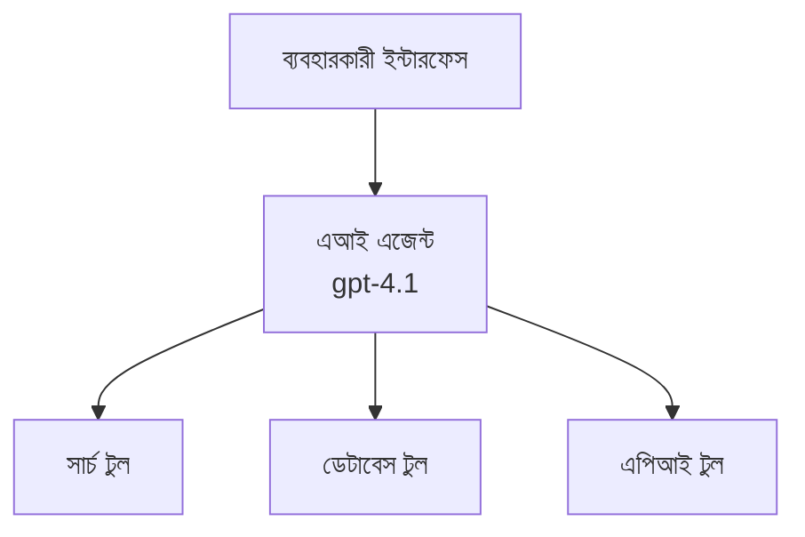
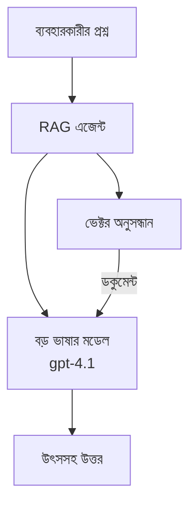
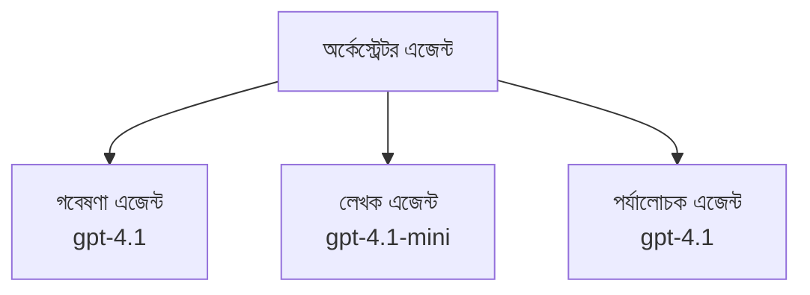

# AI Agents with Azure Developer CLI

**Chapter Navigation:**
- **📚 কোর্স হোম**: [AZD For Beginners](../../README.md)
- **📖 বর্তমান অধ্যায়**: Chapter 2 - AI-First Development
- **⬅️ আগের**: [Microsoft Foundry Integration](microsoft-foundry-integration.md)
- **➡️ পরবর্তী**: [AI Model Deployment](ai-model-deployment.md)
- **🚀 উন্নত**: [Multi-Agent Solutions](../../examples/retail-scenario.md)

---

## ভূমিকা

AI এজেন্ট হল স্বয়ংক্রিয় প্রোগ্রাম যা তাদের পরিবেশ উপলব্ধি করতে পারে, সিদ্ধান্ত নিতে পারে, এবং নির্দিষ্ট লক্ষ্য অর্জনের জন্য কাজ নিতে পারে। সাধারণ প্রম্পট-উত্তরকারী চ্যাটবটগুলোর থেকে আলাদা হয়ে, এজেন্টগুলো করতে পারে:

- **টুল ব্যবহার করা** - API কল করা, ডাটাবেস সার্চ করা, কোড এক্সিকিউট করা
- **পরিকল্পনা এবং যুক্তি করা** - জটিল কাজগুলো ধাপে ভাঙ্গা
- **প্রসঙ্গে থেকে শেখা** - স্মৃতি বজায় রাখা এবং আচরণ অভিযোজিত করা
- **সহযোগিতা করা** - অন্যান্য এজেন্টদের সাথে কাজ করা (মাল্টি-এজেন্ট সিস্টেম)

এই গাইডটি আপনাকে দেখাবে কিভাবে Azure Developer CLI (azd) ব্যবহার করে Azure-এ AI এজেন্ট ডিপ্লয় করতে হয়।

> **ভ্যালিডেশন নোট (2026-03-25):** এই গাইডটি `azd` `1.23.12` এবং `azure.ai.agents` `0.1.18-preview` বিরুদ্ধে পর্যালোচনা করা হয়েছে। `azd ai` অভিজ্ঞতা এখনও প্রিভিউ-চালিত, তাই আপনার ইন্সটল করা ফ্ল্যাগগুলো ভিন্ন হলে এক্সটেনশনের হেল্প দেখুন।

## শিখন লক্ষ্য

এই গাইড সম্পন্ন করার মাধ্যমে, আপনি পারবেন:
- বুঝতে পারা কি উদ্দেশ্যে AI এজেন্ট এবং সেগুলি কিভাবে চ্যাটবট থেকে আলাদা
- প্রি-বিল্ট AI এজেন্ট টেমপ্লেটগুলি AZD দিয়ে ডিপ্লয় করা
- কাস্টম এজেন্টদের জন্য Foundry Agents কনফিগার করা
- মৌলিক এজেন্ট প্যাটার্নগুলি বাস্তবায়ন করা (টুল ব্যবহার, RAG, মাল্টি-এজেন্ট)
- ডিপ্লয় করা এজেন্ট মনিটর ও ডিবাগ করা

## শিখন ফলাফল

সম্পন্ন করার পরে, আপনি সক্ষম হবেন:
- একক কমান্ডে Azure-এ AI এজেন্ট অ্যাপ্লিকেশন ডিপ্লয় করা
- এজেন্ট টুল এবং সক্ষমতাগুলি কনফিগার করা
- এজেন্টদের সাথে রিটারিভাল-অগমেন্টেড জেনারেশন (RAG) বাস্তবায়ন করা
- জটিল ওয়ার্কফ্লোয়ের জন্য মাল্টি-এজেন্ট আর্কিটেকচার ডিজাইন করা
- সাধারণ এজেন্ট ডিপ্লয়মেন্ট ইস্যুগুলি ট্রাবলশুট করা

---

## 🤖 এজেন্ট কীভাবে চ্যাটবট থেকে আলাদা?

| Feature | Chatbot | AI Agent |
|---------|---------|----------|
| **ব্যবহারবিধি** | প্রম্পটের উত্তর দেয় | স্বয়ংক্রিয় কার্য গ্রহণ করে |
| **টুল** | 없음 | API কল, সার্চ, কোড এক্সিকিউট করতে পারে |
| **স্মৃতি** | কেবল সেশন-ভিত্তিক | সেশনগুলো জুড়ে স্থায়ী স্মৃতি |
| **পরিকল্পনা** | একক উত্তর | বহু-ধাপ যুক্তি |
| **সহযোগিতা** | একক সত্তা | অন্যান্য এজেন্টদের সাথে কাজ করতে পারে |

### সহজ তুলনা

- **চ্যাটবট** = একটি তথ্য ডেস্কে প্রশ্নের উত্তর দেয় এমন সহায়ক ব্যক্তি
- **AI এজেন্ট** = একজন ব্যক্তিগত সহকারী যে ফোন করে, অ্যাপয়েন্টমেন্ট বুক করতে পারে এবং আপনার জন্য কাজ সম্পূর্ণ করে

---

## 🚀 দ্রুত শুরু: আপনার প্রথম এজেন্ট ডিপ্লয় করুন

### অপশন 1: Foundry Agents টেমপ্লেট (সুপারিশকৃত)

```bash
# এআই এজেন্ট টেমপ্লেট প্রাথমিকীকরণ করুন
azd init --template get-started-with-ai-agents

# Azure-এ স্থাপন করুন
azd up
```

**কি ডিপ্লয় করা হবে:**
- ✅ Foundry Agents
- ✅ Microsoft Foundry Models (gpt-4.1)
- ✅ Azure AI Search (RAG-এর জন্য)
- ✅ Azure Container Apps (ওয়েব ইন্টারফেস)
- ✅ Application Insights (মনিটরিং)

**সময়:** ~15-20 মিনিট
**খরচ:** ~$100-150/মাস (ডেভেলপমেন্ট)

### অপশন 2: OpenAI Agent with Prompty

```bash
# Prompty-ভিত্তিক এজেন্ট টেমপ্লেট ইনিশিয়ালাইজ করুন
azd init --template agent-openai-python-prompty

# Azure-এ স্থাপন করুন
azd up
```

**কি ডিপ্লয় করা হবে:**
- ✅ Azure Functions (সার্ভারলেস এজেন্ট এক্সিকিউশন)
- ✅ Microsoft Foundry Models
- ✅ Prompty কনফিগারেশন ফাইল
- ✅ স্যাম্পল এজেন্ট ইমপ্লিমেন্টেশন

**সময়:** ~10-15 минут
**খরচ:** ~$50-100/মাস (ডেভেলপমেন্ট)

### অপশন 3: RAG চ্যাট এজেন্ট

```bash
# RAG চ্যাট টেমপ্লেট ইনিশিয়ালাইজ করুন
azd init --template azure-search-openai-demo

# Azure-এ স্থাপন করুন
azd up
```

**কি ডিপ্লয় করা হবে:**
- ✅ Microsoft Foundry Models
- ✅ Azure AI Search নমুনা ডাটা সহ
- ✅ ডকুমেন্ট প্রোসেসিং পাইপলাইন
- ✅ উদ্ধৃতি সহ চ্যাট ইন্টারফেস

**সময়:** ~15-25 মিনিট
**খরচ:** ~$80-150/মাস (ডেভেলপমেন্ট)

### অপশন 4: AZD AI Agent Init (ম্যানিফেস্ট- বা টেমপ্লেট-ভিত্তিক প্রিভিউ)

যদি আপনার কাছে একটি এজেন্ট ম্যানিফেস্ট ফাইল থাকে, আপনি সরাসরি `azd ai` কমান্ড ব্যবহার করে একটি Foundry Agent Service প্রকল্প স্ক্যাফোল্ড করতে পারেন। সাম্প্রতিক প্রিভিউ রিলিজগুলো টেমপ্লেট-ভিত্তিক ইনিশিয়ালাইজেশন সাপোর্ট যোগ করেছে, তাই ইনস্টল করা এক্সটেনশন ভার্সনের উপর নির্ভর করে সঠিক প্রম্পট ফ্লো সামান্য আলাদা হতে পারে।

```bash
# AI এজেন্টস এক্সটেনশন ইনস্টল করুন
azd extension install azure.ai.agents

# ঐচ্ছিক: ইনস্টল করা প্রিভিউ সংস্করণ যাচাই করুন
azd extension show azure.ai.agents

# এজেন্ট ম্যানিফেস্ট থেকে প্রাথমিকীকরণ করুন
azd ai agent init -m agent-manifest.yaml

# Azure-এ মোতায়েন করুন
azd up

# মোতায়েন করা এজেন্ট পরীক্ষা করুন (দেখায় লেটেন্সি এবং প্রথম বাইটের সময়)
azd ai agent invoke
```

**কখন `azd ai agent init` ব্যবহার করবেন বনাম `azd init --template`:**

| Approach | Best For | How It Works |
|----------|----------|------|
| `azd init --template` | একটি কাজ করা স্যাম্পল অ্যাপ থেকে শুরু করা | কোড + ইনফ্রা সহ একটি পূর্ণ টেমপ্লেট রেপো ক্লোন করে |
| `azd ai agent init -m` | আপনার নিজের এজেন্ট ম্যানিফেস্ট থেকে নির্মাণ | আপনার এজেন্ট সংজ্ঞা থেকে প্রজেক্ট স্ট্রাকচার স্ক্যাফোল্ড করে |

> **উপদেশ:** শেখার সময় `azd init --template` ব্যবহার করুন (উপরের অপশন 1-3)। আপনার নিজস্ব ম্যানিফেস্ট নিয়ে প্রোডাকশন এজেন্ট তৈরির সময় `azd ai agent init` ব্যবহার করুন।

`azd up`-এর পরে, একই এক্সটেনশন আপনাকে এজেন্ট লাইফসাইকেলের বাকি অংশে নিয়ে যায়: টেস্ট করার জন্য `azd ai agent invoke`, গুণমান মাপা ও উন্নতির জন্য `azd ai agent eval generate` এবং `azd ai agent optimize`, এবং পরিষ্কার করার জন্য `azd ai agent delete`। পূর্ণ রেফারেন্সের জন্য দেখুন [AZD AI CLI Commands](../chapter-08-production/production-ai-practices.md#azd-ai-cli-commands-and-extensions)।

---

## 🏗️ এজেন্ট আর্কিটেকচার প্যাটার্ন

### প্যাটার্ন 1: টুলসহ একক এজেন্ট

সবচেয়ে সহজ এজেন্ট প্যাটার্ন - একটি এজেন্ট যা একাধিক টুল ব্যবহার করতে পারে।



**উপযুক্ত:**
- কাস্টমার সাপোর্ট বট
- রিসার্চ অ্যাসিস্ট্যান্ট
- ডেটা বিশ্লেষণ এজেন্ট

**AZD টেমপ্লেট:** `azure-search-openai-demo`

### প্যাটার্ন 2: RAG এজেন্ট (রিটারিভাল-অগমেন্টেড জেনারেশন)

উত্তর জেনারেট করার আগে প্রাসঙ্গিক ডকুমেন্ট রিটারিভ করে এমন এজেন্ট।



**উপযুক্ত:**
- এন্টারপ্রাইজ নলেজ বেস
- ডকুমেন্ট Q&A সিস্টেম
- কমপ্লায়েন্স এবং লিগ্যাল রিসার্চ

**AZD টেমপ্লেট:** `azure-search-openai-demo`

### প্যাটার্ন 3: মাল্টি-এজেন্ট সিস্টেম

বহু বিশেষায়িত এজেন্ট জটিল কাজগুলিতে একসাথে কাজ করে।



**উপযুক্ত:**
- জটিল কন্টেন্ট জেনারেশন
- বহু-ধাপ ওয়ার্কফ্লো
- বিভিন্ন দক্ষতা প্রয়োজন এমন টাস্ক

**আরও জানুন:** [Multi-Agent Coordination Patterns](../chapter-06-pre-deployment/coordination-patterns.md)

---

## ⚙️ এজেন্ট টুল কনফিগার করা

এজেন্টগুলো তখনই শক্তিশালী হয় যখন তারা টুল ব্যবহার করতে পারে। এখানে সাধারণ টুল কনফিগারেশন কীভাবে করবেন তা আছে:

### Foundry Agents-এ টুল কনফিগারেশন

```python
# agent_config.py
from azure.ai.projects import AIProjectClient
from azure.ai.projects.models import FunctionTool, CodeInterpreterTool

# কাস্টম টুলগুলি সংজ্ঞায়িত করুন
search_tool = FunctionTool(
    name="search_knowledge_base",
    description="Search the company knowledge base for relevant documents",
    parameters={
        "type": "object",
        "properties": {
            "query": {
                "type": "string",
                "description": "The search query"
            }
        },
        "required": ["query"]
    }
)

# টুলসহ এজেন্ট তৈরি করুন
agent = project_client.agents.create_agent(
    model="gpt-4.1",
    name="Support Agent",
    instructions="You are a helpful support agent. Use the search tool to find relevant information.",
    tools=[search_tool, CodeInterpreterTool()]
)
```

### পরিবেশ কনফিগারেশন

```bash
# এজেন্ট-নির্দিষ্ট পরিবেশ ভেরিয়েবল সেট আপ করুন
azd env set AZURE_OPENAI_MODEL "gpt-4.1"
azd env set AGENT_INSTRUCTIONS "You are a helpful assistant..."
azd env set ENABLE_CODE_INTERPRETER "true"
azd env set ENABLE_FILE_SEARCH "true"

# আপডেটকৃত কনফিগারেশনের সাথে ডিপ্লয় করুন
azd deploy
```

---

## 📊 এজেন্ট মনিটরিং

### Application Insights ইন্টিগ্রেশন

সব AZD এজেন্ট টেমপ্লেট মনিটরিং-এর জন্য Application Insights অন্তর্ভুক্ত করে:

```bash
# মনিটরিং ড্যাশবোর্ড খুলুন
azd monitor --overview

# লাইভ লগ দেখুন
azd monitor --logs

# লাইভ মেট্রিক্স দেখুন
azd monitor --live
```

### ট্র্যাক করার জন্য প্রধান মেট্রিক্স

| Metric | Description | Target |
|--------|-------------|--------|
| Response Latency | উত্তর জেনারেট করার সময় | < 5 seconds |
| Token Usage | অনুরোধ প্রতি টোকেন | খরচের জন্য মনিটর করুন |
| Tool Call Success Rate | সফল টুল এক্সিকিউশনের % | > 95% |
| Error Rate | ব্যর্থ এজেন্ট অনুরোধ | < 1% |
| User Satisfaction | ফিডব্যাক স্কোর | > 4.0/5.0 |

### এজেন্টগুলোর জন্য কাস্টম লগিং

```python
import os
from azure.monitor.opentelemetry import configure_azure_monitor
from opentelemetry import trace

# OpenTelemetry দিয়ে Azure Monitor কনফিগার করুন
configure_azure_monitor(
    connection_string=os.environ["APPLICATIONINSIGHTS_CONNECTION_STRING"]
)

tracer = trace.get_tracer(__name__)

def log_agent_interaction(user_query, agent_response, tools_used, latency_ms):
    with tracer.start_as_current_span("agent_interaction") as span:
        span.set_attributes({
            "user_query": user_query,
            "response_length": len(agent_response),
            "tools_used": tools_used,
            "latency_ms": latency_ms
        })
```

> **নোট:** প্রয়োজনীয় প্যাকেজগুলো ইনস্টল করুন: `pip install azure-monitor-opentelemetry opentelemetry`

---

## 💰 খরচ বিবেচনা

### প্যাটার্নভিত্তিক আনুমানিক মাসিক খরচ

| Pattern | Dev Environment | Production |
|---------|-----------------|------------|
| Single Agent | $50-100 | $200-500 |
| RAG Agent | $80-150 | $300-800 |
| Multi-Agent (2-3 agents) | $150-300 | $500-1,500 |
| Enterprise Multi-Agent | $300-500 | $1,500-5,000+ |

### খরচ অপ্টিমাইজেশন টিপস

1. **সহজ কাজের জন্য gpt-4.1-mini ব্যবহার করুন**
   ```bash
   azd env set AZURE_OPENAI_MODEL "gpt-4.1-mini"
   ```

2. **আবার ঘটে এমন কোরিগুলির জন্য ক্যাশিং বাস্তবায়ন করুন**
   ```python
   from functools import lru_cache
   
   @lru_cache(maxsize=1000)
   def get_cached_response(query_hash):
       return agent.run(query_hash)
   ```

3. **প্রতি রান টোকেন সীমা নির্ধারণ করুন**
   ```python
   # এজেন্ট চালানোর সময় max_completion_tokens সেট করুন, তৈরি করার সময় নয়
   run = project_client.agents.create_run(
       thread_id=thread.id,
       agent_id=agent.id,
       max_completion_tokens=1000  # উত্তরের দৈর্ঘ্য সীমাবদ্ধ করুন
   )
   ```

4. **ব্যবহারে না থাকলে স্কেল টু জিরো করুন**
   ```bash
   # Container Apps স্বয়ংক্রিয়ভাবে শূন্যে স্কেল করে
   azd env set MIN_REPLICAS "0"
   ```

---

## 🔧 এজেন্ট ট্রাবলশুটিং

### সাধারণ সমস্যা এবং সমাধান

<details>
<summary><strong>❌ এজেন্ট টুল কলগুলির প্রতি প্রতিক্রিয়া করছে না</strong></summary>

```bash
# টুলগুলো সঠিকভাবে নিবন্ধিত আছে কি না পরীক্ষা করুন
azd show

# OpenAI ডিপ্লয়মেন্ট যাচাই করুন
az cognitiveservices account deployment list \
  --name $AZURE_OPENAI_NAME \
  --resource-group $RG_NAME

# এজেন্টের লগগুলো পরীক্ষা করুন
azd monitor --logs
```

**সাধারণ কারণসমূহ:**
- টুল ফাংশন সিগনেচারের মিল না থাকা
- অনুপস্থিত প্রয়োজনীয় অনুমতি
- API এন্ডপয়েন্ট অ্যাক্সেসযোগ্য নয়
</details>

<details>
<summary><strong>❌ এজেন্ট উত্তরগুলিতে উচ্চ লেটেনসি</strong></summary>

```bash
# বটলনেকের জন্য Application Insights পরীক্ষা করুন
azd monitor --live

# দ্রুততর মডেল ব্যবহার করার কথা বিবেচনা করুন
azd env set AZURE_OPENAI_MODEL "gpt-4.1-mini"
azd deploy
```

**অপ্টিমাইজেশন টিপস:**
- স্ট্রিমিং রেসপন্স ব্যবহার করুন
- রেসপন্স ক্যাশিং বাস্তবায়ন করুন
- কনটেক্সট উইন্ডোর আকার কমান
</details>

<details>
<summary><strong>❌ এজেন্ট ভুল বা হ্যালুসিনেটেড তথ্য ফেরত দিচ্ছে</strong></summary>

```python
# ভাল সিস্টেম প্রম্পট ব্যবহার করে উন্নত করুন
instructions = """
You are a helpful assistant. IMPORTANT:
- Only answer based on provided context
- If you don't know, say "I don't know"
- Always cite your sources
- Never make up information
"""

# গ্রাউন্ডিংয়ের জন্য পুনরুদ্ধার যোগ করুন
agent = project_client.agents.create_agent(
    model="gpt-4.1",
    instructions=instructions,
    tools=[FileSearchTool()]  # উত্তরগুলোকে ডকুমেন্টগুলিতে ভিত্তি করুন
)
```
</details>

<details>
<summary><strong>❌ টোকেন সীমা অতিক্রমের ত্রুটি</strong></summary>

```python
# প্রসঙ্গ জানালার ব্যবস্থাপনা বাস্তবায়ন করুন
def truncate_context(messages, max_tokens=8000, model="gpt-4.1"):
    """Keep only recent messages within token limit."""
    import tiktoken
    encoding = tiktoken.encoding_for_model(model)
    total_tokens = 0
    truncated = []
    
    for msg in reversed(messages):
        msg_tokens = len(encoding.encode(msg.content))
        if total_tokens + msg_tokens > max_tokens:
            break
        truncated.insert(0, msg)
        total_tokens += msg_tokens
    
    return truncated
```
</details>

---

## 🎓 হাতেকলমে অনুশীলন

### অনুশীলন 1: একটি বেসিক এজেন্ট ডিপ্লয় করুন (২০ মিনিট)

**লক্ষ্য:** AZD ব্যবহার করে আপনার প্রথম AI এজেন্ট ডিপ্লয় করা

```bash
# ধাপ 1: টেমপ্লেট প্রাথমিককরণ করুন
azd init --template get-started-with-ai-agents

# ধাপ 2: Azure-এ লগইন করুন
azd auth login
# যদি আপনি একাধিক টেন্যান্টে কাজ করেন, তবে --tenant-id <tenant-id> যোগ করুন

# ধাপ 3: ডিপ্লয় করুন
azd up

# ধাপ 4: এজেন্টটি পরীক্ষা করুন
# স্থাপনের পরে প্রত্যাশিত আউটপুট:
#   স্থাপন সম্পন্ন!
#   এন্ডপয়েন্ট: https://<app-name>.<region>.azurecontainerapps.io
# আউটপুটে প্রদর্শিত URL খুলুন এবং একটি প্রশ্ন করে দেখুন

# ধাপ 5: মনিটরিং দেখুন
azd monitor --overview

# ধাপ 6: পরিষ্কার করুন
azd down --force --purge
```

**সফলতার মানদণ্ড:**
- [ ] এজেন্ট প্রশ্নের উত্তর দেয়
- [ ] `azd monitor` দিয়ে মনিটরিং ড্যাশবোর্ডে অ্যাক্সেস করা যায়
- [ ] রিসোর্সগুলো সফলভাবে ক্লিন আপ হয়েছে

### অনুশীলন 2: কাস্টম টুল যোগ করুন (৩০ মিনিট)

**লক্ষ্য:** একটি কাস্টম টুল দিয়ে এজেন্ট বাড়ানো

1. এজেন্ট টেমপ্লেট ডিপ্লয় করুন:
   ```bash
   azd init --template get-started-with-ai-agents
   azd up
   ```
2. আপনার এজেন্ট কোডে একটি নতুন টুল ফাংশন তৈরি করুন:
   ```python
   def get_weather(location: str) -> str:
       """Get current weather for a location."""
       # আবহাওয়া পরিষেবায় API কল
       return f"Weather in {location}: Sunny, 72°F"
   ```
3. এজেন্টের সাথে টুল রেজিস্টার করুন:
   ```python
   from azure.ai.projects.models import FunctionTool

   weather_tool = FunctionTool(
       name="get_weather",
       description="Get current weather for a location",
       parameters={
           "type": "object",
           "properties": {
               "location": {"type": "string", "description": "City name"}
           },
           "required": ["location"]
       }
   )

   agent = project_client.agents.create_agent(
       model="gpt-4.1",
       name="Weather Agent",
       tools=[weather_tool]
   )
   ```
4. পুনরায় ডিপ্লয় এবং পরীক্ষা করুন:
   ```bash
   azd deploy
   # জিজ্ঞাসা: "সিয়াটেলে আবহাওয়া কেমন?"
   # প্রত্যাশিত: এজেন্ট get_weather("Seattle") কল করে এবং আবহাওয়ার তথ্য ফেরত দেয়
   ```

**সফলতার মানদণ্ড:**
- [ ] এজেন্ট আবহাওয়া-সংক্রান্ত প্রশ্ন চিনতে পারে
- [ ] টুল সঠিকভাবে কল করা হয়
- [ ] রেসপন্সে আবহাওয়ার তথ্য অন্তর্ভুক্ত আছে

### অনুশীলন 3: একটি RAG এজেন্ট তৈরি করুন (৪৫ মিনিট)

**লক্ষ্য:** এমন একটি এজেন্ট তৈরি করা যা আপনার ডকুমেন্ট থেকে প্রশ্নের উত্তর দেয়

```bash
# ধাপ 1: RAG টেমপ্লেট মোতায়েন করুন
azd init --template azure-search-openai-demo
azd up

# ধাপ 2: আপনার নথিগুলো আপলোড করুন
# PDF/TXT ফাইলগুলো data/ ডিরেক্টরিতে রাখুন, তারপর চালান:
python scripts/prepdocs.py

# ধাপ 3: ডোমেইন-নির্দিষ্ট প্রশ্নের মাধ্যমে পরীক্ষা করুন
# azd up আউটপুট থেকে ওয়েব অ্যাপের URL খুলুন
# আপনার আপলোড করা নথিগুলোর সম্পর্কে প্রশ্ন করুন
# উত্তরগুলোতে [doc.pdf]-এর মতো উদ্ধৃতি রেফারেন্স থাকা উচিত
```

**সফলতার মানদণ্ড:**
- [ ] এজেন্ট আপলোড করা ডকুমেন্ট থেকে উত্তর দেয়
- [ ] রেসপন্সগুলিতে উদ্ধৃতি অন্তর্ভুক্ত থাকে
- [ ] সীমার বাইরে থাকা প্রশ্নে হালুসিনেশন না ঘটে

---

## 📚 পরবর্তী ধাপ

এখন যখন আপনি AI এজেন্টগুলি বুঝতে শুরু করেছেন, এই উন্নত বিষয়গুলো অন্বেষণ করুন:

| Topic | Description | Link |
|-------|-------------|------|
| **Multi-Agent Systems** | একাধিক সহযোগী এজেন্ট সহ সিস্টেম তৈরি করা | [Retail Multi-Agent Example](../../examples/retail-scenario.md) |
| **Coordination Patterns** | অর্কেস্ট্রেশন এবং কমিউনিকেশন প্যাটার্ন শেখা | [Coordination Patterns](../chapter-06-pre-deployment/coordination-patterns.md) |
| **Production Deployment** | এন্টারপ্রাইজ-রেডি এজেন্ট ডিপ্লয়মেন্ট | [Production AI Practices](../chapter-08-production/production-ai-practices.md) |
| **Agent Evaluation** | এজেন্ট পারফরম্যান্স টেস্ট এবং মূল্যায়ন | [AI Troubleshooting](../chapter-07-troubleshooting/ai-troubleshooting.md) |
| **AI Workshop Lab** | হাতে কলমে: আপনার AI সলিউশন AZD-রেডি করুন | [AI Workshop Lab](ai-workshop-lab.md) |

---

## 📖 অতিরিক্ত সংস্থান

### অফিসিয়াল ডকুমেন্টেশন
- [Microsoft Foundry Agent Service](https://learn.microsoft.com/azure/ai-services/agents/)
- [Microsoft Foundry Agent Service Quickstart](https://learn.microsoft.com/azure/ai-services/agents/quickstart)
- [Semantic Kernel Agent Framework](https://learn.microsoft.com/semantic-kernel/)

### এজেন্টদের জন্য AZD টেমপ্লেট
- [Get Started with AI Agents](https://github.com/Azure-Samples/get-started-with-ai-agents)
- [Agent OpenAI Python Prompty](https://github.com/Azure-Samples/agent-openai-python-prompty)
- [Azure Search OpenAI Demo](https://github.com/Azure-Samples/azure-search-openai-demo)

### কমিউনিটি রিসোর্স
- [Awesome AZD - Agent Templates](https://azure.github.io/awesome-azd/?tags=ai-agents)
- [Azure AI Discord](https://discord.gg/microsoft-azure)
- [Microsoft Foundry Discord](https://discord.gg/nTYy5BXMWG)

### আপনার এডিটরের জন্য এজেন্ট স্কিল
- [**Microsoft Azure Agent Skills**](https://skills.sh/microsoft/github-copilot-for-azure) - GitHub Copilot, Cursor, বা যে কোনো সমর্থিত এজেন্টের জন্য Azure ডেভেলপমেন্টের পুনঃব্যবহারযোগ্য AI এজেন্ট স্কিল ইনস্টল করুন। এতে রয়েছে [Azure AI](https://skills.sh/microsoft/github-copilot-for-azure/azure-ai), [Microsoft Foundry](https://skills.sh/microsoft/github-copilot-for-azure/microsoft-foundry), [deployment](https://skills.sh/microsoft/github-copilot-for-azure/azure-deploy), এবং [diagnostics](https://skills.sh/microsoft/github-copilot-for-azure/azure-diagnostics) এর জন্য স্কিলসমূহ:
  ```bash
  npx skills add microsoft/github-copilot-for-azure
  ```

---

**Navigation**
- **Previous Lesson**: [Microsoft Foundry Integration](microsoft-foundry-integration.md)
- **Next Lesson**: [AI Model Deployment](ai-model-deployment.md)

---

<!-- CO-OP TRANSLATOR DISCLAIMER START -->
**অস্বীকৃতি**:
এই নথিটি AI অনুবাদ পরিষেবা [Co-op Translator](https://github.com/Azure/co-op-translator) ব্যবহার করে অনূদিত হয়েছে। যদিও আমরা শুদ্ধতার জন্য চেষ্টা করি, অনুগ্রহ করে মনে রাখবেন যে স্বয়ংক্রিয় অনুবাদে ত্রুটি বা অসঙ্গতি থাকতে পারে। মূল নথিটি তার স্বভাষায় কর্তৃত্বপূর্ণ উৎস হিসেবে বিবেচিত হওয়া উচিত। গুরুত্বপূর্ণ তথ্যের জন্য পেশাদার মানব অনুবাদ সুপারিশ করা হয়। এই অনুবাদের ব্যবহারে প্রয়োজনীয় ভুল বোঝাবুঝি বা ভুল ব্যাখ্যার জন্য আমরা দায়বদ্ধ নই।
<!-- CO-OP TRANSLATOR DISCLAIMER END -->