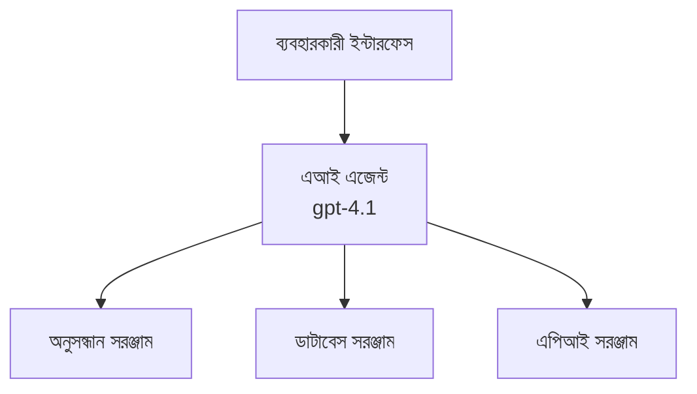
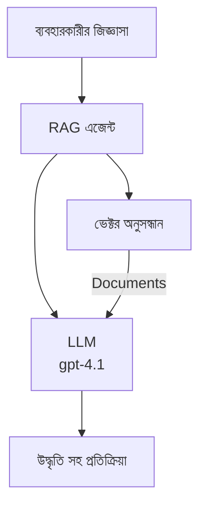
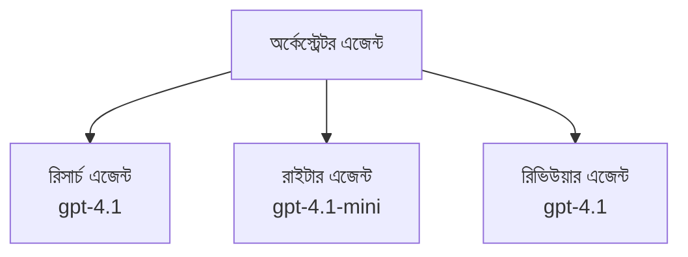

# Azure Developer CLI দিয়ে AI এজেন্ট

**অধ্যায় নেভিগেশন:**
- **📚 কোর্স হোম**: [AZD শিখুন নবীনদের জন্য](../../README.md)
- **📖 বর্তমান অধ্যায়**: অধ্যায় ২ - AI-প্রথম উন্নয়ন
- **⬅️ পূর্ববর্তী**: [Microsoft Foundry ইন্টিগ্রেশন](microsoft-foundry-integration.md)
- **➡️ পরবর্তী**: [AI মডেল ডিপ্লয়মেন্ট](ai-model-deployment.md)
- **🚀 উন্নত**: [মাল্টি-এজেন্ট সলিউশন](../../examples/retail-scenario.md)

---

## পরিচিতি

AI এজেন্ট হলো স্বয়ংক্রিয় প্রোগ্রাম যা তাদের পরিবেশকে বুঝতে পারে, সিদ্ধান্ত নিতে পারে এবং নির্দিষ্ট লক্ষ্য পূরণের জন্য পদক্ষেপ নিতে পারে। সাধারণ চ্যাটবটের থেকে আলাদা যেগুলো শুধু প্রশ্নের উত্তর দেয়, এজেন্টগুলি পারে:

- **টুলস ব্যবহার করা** - API কল করা, ডাটাবেস অনুসন্ধান করা, কোড চালানো
- **পরিকল্পনা ও যুক্তি করা** - জটিল কাজগুলো ধাপে ধাপে ভাগ করা
- **প্রসঙ্গ থেকে শেখা** - মেমোরি বজায় রাখা এবং আচরণ মানিয়ে নেওয়া
- **সহযোগিতা করা** - অন্যান্য এজেন্টদের সাথে কাজ করা (মাল্টি-এজেন্ট সিস্টেম)

এই গাইডটি দেখায় কীভাবে Azure Developer CLI (azd) ব্যবহার করে Azure-এ AI এজেন্ট ডিপ্লয় করবেন।

> **যাচাইয়ের নোট (2026-07-13):** এই গাইডটি `azd` `1.27.1` এবং `azure.ai.agents` `1.0.0-beta.5` অনুযায়ী পর্যালোচনা করা হয়েছে। `azd ai` অভিজ্ঞতা এখনও প্রিভিউ অবস্থায়, তাই আপনার ইনস্টল করা ফ্ল্যাগ ভিন্ন হলে এক্সটেনশনের সাহায্য দেখুন।

## শেখার লক্ষ্য

এই গাইড শেষ করার মাধ্যমে আপনি:
- AI এজেন্ট কি এবং তারা চ্যাটবট থেকে কিভাবে ভিন্ন তা বুঝতে পারবেন
- AZD দিয়ে প্রি-বিল্ট AI এজেন্ট টেমপ্লেট ডিপ্লয় করতে পারবেন
- কাস্টম এজেন্টের জন্য Foundry Agents কনফিগার করতে পারবেন
- মৌলিক এজেন্ট প্যাটার্ন (টুল ব্যবহার, RAG, মাল্টি-এজেন্ট) বাস্তবায়ন করতে পারবেন
- ডিপ্লয় করা এজেন্ট মনিটর ও ডিবাগ করতে পারবেন

## শেখার ফলাফল

সম্পূর্ণ করার পর আপনি সক্ষম হবেন:
- এক কমান্ডে Azure-এ AI এজেন্ট অ্যাপ্লিকেশন ডিপ্লয় করতে
- এজেন্ট টুলস ও সক্ষমতা কনফিগার করতে
- এজেন্টের জন্য রিট্রিভাল-অগমেন্টেড জেনারেশন (RAG) বাস্তবায়ন করতে
- জটিল কর্মপ্রবাহের জন্য মাল্টি-এজেন্ট আর্কিটেকচার ডিজাইন করতে
- সাধারণ এজেন্ট ডিপ্লয়মেন্ট সমস্যাগুলো সমাধান করতে

---

## 🤖 এজেন্ট কীভাবে চ্যাটবট থেকে আলাদা?

| বৈশিষ্ট্য | চ্যাটবট | AI এজেন্ট |
|---------|---------|----------|
| **আচরণ** | প্রম্পটের জবাবে প্রতিক্রিয়া | স্বয়ংক্রিয় পদক্ষেপ গ্রহণ করে |
| **টুলস** | নেই | API কল করতে পারে, অনুসন্ধান করতে পারে, কোড চালাতে পারে |
| **মেমোরি** | সেশনের মধ্যে সীমাবদ্ধ | সেশন জুড়ে স্থায়ী মেমোরি থাকে |
| **পরিকল্পনা** | একক প্রতিক্রিয়া | একাধিক ধাপে যুক্তি করা |
| **সহযোগিতা** | একক সত্তা | অন্যান্য এজেন্টদের সাথে কাজ করতে পারে |

### সরল উদাহরণ

- **চ্যাটবট** = একটি তথ্য ডেস্কে প্রশ্নের উত্তর দেওয়া একটি সহায়ক ব্যক্তি
- **AI এজেন্ট** = একজন ব্যক্তিগত সহকারী যিনি কল করতে পারেন, অ্যাপয়েন্টমেন্ট বুক করতে পারেন এবং কাজ সম্পন্ন করতে পারেন

---

## 🚀 দ্রুত শুরু: আপনার প্রথম এজেন্ট ডিপ্লয় করুন

### বিকল্প ১: Foundry Agents টেমপ্লেট (সুপারিশকৃত)

```bash
# AI এজেন্টদের টেমপ্লেট শুরু করুন
azd init --template get-started-with-ai-agents

# আজুরে মোতায়েন করুন
azd up
```

**কী ডিপ্লয় হয়:**
- ✅ Foundry Agents
- ✅ Microsoft Foundry মডেলস (gpt-4.1)
- ✅ Azure AI Search (RAG এর জন্য)
- ✅ Azure Container Apps (ওয়েব ইন্টারফেস)
- ✅ Application Insights (মনিটরিং)

**সময়:** ~১৫-২০ মিনিট
**খরচ:** ~$১০০-১৫০/মাস (উন্নয়ন)

### বিকল্প ২: Prompty সহ OpenAI এজেন্ট

```bash
# Prompty-ভিত্তিক এজেন্ট টেম্পলেট ইনিশিয়ালাইজ করুন
azd init --template agent-openai-python-prompty

# Azure-এ ডিপ্লয় করুন
azd up
```

**কী ডিপ্লয় হয়:**
- ✅ Azure Functions (সার্ভারলেস এজেন্ট এক্সিকিউশন)
- ✅ Microsoft Foundry মডেলস
- ✅ Prompty কনফিগারেশন ফাইলস
- ✅ নমুনা এজেন্ট ইমপ্লিমেন্টেশন

**সময়:** ~১০-১৫ মিনিট
**খরচ:** ~$৫০-১০০/মাস (উন্নয়ন)

### বিকল্প ৩: RAG চ্যাট এজেন্ট

```bash
# RAG চ্যাট টেমপ্লেট শুরু করুন
azd init --template azure-search-openai-demo

# আজুরে মোতায়েন করুন
azd up
```

**কী ডিপ্লয় হয়:**
- ✅ Microsoft Foundry মডেলস
- ✅ নমুনা ডাটা সহ Azure AI Search
- ✅ ডকুমেন্ট প্রসেসিং পাইপলাইন
- ✅ ইনসিরেশনসহ চ্যাট ইন্টারফেস

**সময়:** ~১৫-২৫ মিনিট
**খরচ:** ~$৮০-১৫০/মাস (উন্নয়ন)

### বিকল্প ৪: AZD AI Agent Init (ম্যানিফেস্ট বা টেমপ্লেট ভিত্তিক প্রিভিউ)

যদি আপনার কাছে এজেন্ট ম্যানিফেস্ট ফাইল থাকে, আপনি সরাসরি `azd ai` কমান্ড দিয়ে Foundry Agent Service প্রজেক্ট স্ক্যাফোল্ড করতে পারেন। সাম্প্রতিক প্রিভিউ রিলিজগুলো টেমপ্লেট-ভিত্তিক ইনিশিয়ালাইজেশন সাপোর্ট যোগ করেছে, তাই ইনস্টল করা এক্সটেনশনের সংস্করণের ওপর নির্ভর করে সঠিক প্রম্পট ফ্লো সামান্য ভিন্ন হতে পারে।

```bash
# এআই এজেন্ট এক্সটেনশন ইনস্টল করুন
azd extension install azure.ai.agents

# ঐচ্ছিক: ইনস্টল করা প্রিভিউ সংস্করণ যাচাই করুন
azd extension show azure.ai.agents

# একটি এজেন্ট ম্যানিফেস্ট থেকে আরম্ভ করুন
azd ai agent init -m agent-manifest.yaml

# আজুরে স্থাপন করুন
azd up

# স্থাপিত এজেন্ট পরীক্ষা করুন (প্রতিক্রিয়া সময় + প্রথম বাইটের সময় প্রদর্শন করে)
azd ai agent invoke
```

**`azd ai agent init` এবং `azd init --template` কখন ব্যবহার করবেন:**

| পদ্ধতি | শ্রেষ্ঠ | কিভাবে কাজ করে |
|----------|----------|------|
| `azd init --template` | একটি কাজ করা স্যাম্পল অ্যাপ থেকে শুরু করা | সম্পূর্ণ টেমপ্লেট রিপো কোড + ইন্ফ্রা সহ ক্লোন করে |
| `azd ai agent init -m` | নিজের এজেন্ট ম্যানিফেস্ট থেকে তৈরি করা | আপনার এজেন্ট সংজ্ঞা থেকে প্রজেক্ট কাঠামো তৈরি করে |

> **টিপ:** শেখার সময় `azd init --template` (উপরের ১-৩ বিকল্প) ব্যবহার করুন। নিজের ম্যানিফেস্ট দিয়ে প্রোডাকশন এজেন্ট বানানোর সময় `azd ai agent init` ব্যবহার করুন।

`azd up` এর পরে, একই এক্সটেনশন আপনাকে এজেন্ট লাইফসাইকেলের বাকি অংশে নিয়ে যাবে: `azd ai agent invoke` দিয়ে পরীক্ষা, `azd ai agent eval generate` এবং `azd ai agent optimize` দিয়ে গুণমান মাপা ও উন্নত করা, এবং `azd ai agent delete` দিয়ে পরিষ্কার করা। সম্পূর্ণ রেফারেন্সের জন্য দেখুন [AZD AI CLI Commands](../chapter-08-production/production-ai-practices.md#azd-ai-cli-commands-and-extensions)।

---

## 🏗️ এজেন্ট আর্কিটেকচার প্যাটার্নস

### প্যাটার্ন ১: টুলস সহ একক এজেন্ট

সবচেয়ে সহজ এজেন্ট প্যাটার্ন - একটি এজেন্ট যা একাধিক টুল ব্যবহার করতে পারে।



**সেরা জন্য:**
- কাস্টমার সাপোর্ট বটস
- গবেষণা সহকারী
- ডেটা বিশ্লেষণ এজেন্ট

**AZD টেমপ্লেট:** `azure-search-openai-demo`

### প্যাটার্ন ২: RAG এজেন্ট (রিট্রিভাল-অগমেন্টেড জেনারেশন)

একটি এজেন্ট যা সঠিক ডকুমেন্টগুলি উদ্ধার করে তারপর উত্তর তৈরি করে।



**সেরা জন্য:**
- এন্টারপ্রাইজ নলেজ বেস
- ডকুমেন্ট প্রশ্নোত্তর সিস্টেম
- কমপ্লায়েন্স ও আইনি গবেষণা

**AZD টেমপ্লেট:** `azure-search-openai-demo`

### প্যাটার্ন ৩: মাল্টি-এজেন্ট সিস্টেম

একাধিক বিশেষায়িত এজেন্ট মিলিত হয়ে জটিল কাজ সম্পন্ন করে।



**সেরা জন্য:**
- জটিল কন্টেন্ট জেনারেশন
- একাধিক ধাপের কর্মপ্রবাহ
- বিভিন্ন দক্ষতা প্রয়োজন এমন কাজ

**আরও শিখুন:** [মাল্টি-এজেন্ট সমন্বয় প্যাটার্নস](../chapter-06-pre-deployment/coordination-patterns.md)

---

## ⚙️ এজেন্ট টুলস কনফিগারেশন

এজেন্টগুলি শক্তিশালী হয় যখন তারা টুল ব্যবহার করতে পারে। সাধারণ টুলস কীভাবে কনফিগার করবেন:

### Foundry Agents এ টুল কনফিগারেশন

```python
# agent_config.py
from azure.ai.projects import AIProjectClient
from azure.ai.projects.models import FunctionTool, CodeInterpreterTool

# কাস্টম টুল সংজ্ঞায়িত করুন
search_tool = FunctionTool(
    name="search_knowledge_base",
    description="Search the company knowledge base for relevant documents",
    parameters={
        "type": "object",
        "properties": {
            "query": {
                "type": "string",
                "description": "The search query"
            }
        },
        "required": ["query"]
    }
)

# টুলস সহ এজেন্ট তৈরি করুন
agent = project_client.agents.create_agent(
    model="gpt-4.1",
    name="Support Agent",
    instructions="You are a helpful support agent. Use the search tool to find relevant information.",
    tools=[search_tool, CodeInterpreterTool()]
)
```

### পরিবেশ কনফিগারেশন

```bash
# এজেন্ট-নির্দিষ্ট পরিবেশ ভেরিয়েবল সেট করুন
azd env set AZURE_OPENAI_MODEL "gpt-4.1"
azd env set AGENT_INSTRUCTIONS "You are a helpful assistant..."
azd env set ENABLE_CODE_INTERPRETER "true"
azd env set ENABLE_FILE_SEARCH "true"

# আপডেট করা কনফিগারেশন সহ ডিপ্লয় করুন
azd deploy
```

---

## 📊 এজেন্ট মনিটরিং

### অ্যাপ্লিকেশন ইনসাইটস ইন্টিগ্রেশন

সমস্ত AZD এজেন্ট টেমপ্লেটে মনিটরিং এর জন্য Application Insights অন্তর্ভুক্ত থাকে:

```bash
# মনিটরিং ড্যাশবোর্ড খুলুন
azd monitor --overview

# লাইভ লগ দেখুন
azd monitor --logs

# লাইভ মেট্রিক্স দেখুন
azd monitor --live
```

### অনুসরণ করার প্রধান মেট্রিকস

| মেট্রিক | বর্ণনা | লক্ষ্য |
|--------|-------------|--------|
| প্রতিক্রিয়া বিলম্ব | প্রতিক্রিয়া তৈরি করার সময় | < ৫ সেকেন্ড |
| টোকেন ব্যবহারের পরিমাণ | প্রতি অনুরোধ টোকেন | খরচ মনিটরিং জন্য |
| টুল কল সফলতার হার | সফল টুল এক্সিকিউশনের শতাংশ | > ৯৫% |
| ত্রুটি হার | ব্যর্থ এজেন্ট অনুরোধ | < ১% |
| ব্যবহারকারী সন্তুষ্টি | প্রতিক্রিয়া স্কোর | > ৪.০/৫.০ |

### এজেন্টদের জন্য কাস্টম লগিং

```python
import os
from azure.monitor.opentelemetry import configure_azure_monitor
from opentelemetry import trace

# OpenTelemetry সহ Azure Monitor কনফিগার করুন
configure_azure_monitor(
    connection_string=os.environ["APPLICATIONINSIGHTS_CONNECTION_STRING"]
)

tracer = trace.get_tracer(__name__)

def log_agent_interaction(user_query, agent_response, tools_used, latency_ms):
    with tracer.start_as_current_span("agent_interaction") as span:
        span.set_attributes({
            "user_query": user_query,
            "response_length": len(agent_response),
            "tools_used": tools_used,
            "latency_ms": latency_ms
        })
```

> **নোট:** প্রয়োজনীয় প্যাকেজ ইনস্টল করুন: `pip install azure-monitor-opentelemetry opentelemetry`

---

## 💰 খরচ বিবেচনা

### প্যাটার্ন অনুসারে মাসিক আনুমানিক খরচ

| প্যাটার্ন | ডেভ এনভায়রনমেন্ট | প্রোডাকশন |
|---------|-----------------|------------|
| একক এজেন্ট | $৫০-১০০ | $২০০-৫০০ |
| RAG এজেন্ট | $৮০-১৫০ | $৩০০-৮০০ |
| মাল্টি-এজেন্ট (২-৩ এজেন্ট) | $১৫০-৩০০ | $৫০০-১,৫০০ |
| এন্টারপ্রাইজ মাল্টি-এজেন্ট | $৩০০-৫০০ | $১,৫০০-৫,০০০+ |

### খরচ অপ্টিমাইজেশন টিপস

১. **সহজ কাজের জন্য gpt-4.1-mini ব্যবহার করুন**
   ```bash
   azd env set AZURE_OPENAI_MODEL "gpt-4.1-mini"
   ```

২. **পুনরাবৃত্ত প্রশ্নের জন্য ক্যাশিং বাস্তবায়ন করুন**
   ```python
   from functools import lru_cache
   
   @lru_cache(maxsize=1000)
   def get_cached_response(query_hash):
       return agent.run(query_hash)
   ```

৩. **প্রতিটি রান এর জন্য টোকেন সীমা নির্ধারণ করুন**
   ```python
   # এজেন্ট চালানোর সময় max_completion_tokens সেট করুন, তৈরির সময় নয়
   run = project_client.agents.create_run(
       thread_id=thread.id,
       agent_id=agent.id,
       max_completion_tokens=1000  # প্রতিক্রিয়ার দৈর্ঘ্য সীমিত করুন
   )
   ```

৪. **ব্যবহার না হলে শূন্যে স্কেল করুন**
   ```bash
   # কন্টেইনার অ্যাপ্লিকেশনগুলি স্বয়ংক্রিয়ভাবে শূন্যে স্কেল করে
   azd env set MIN_REPLICAS "0"
   ```

---

## 🔧 এজেন্ট সমস্যা সমাধান

### সাধারণ সমস্যা ও সমাধান

<details>
<summary><strong>❌ এজেন্ট টুল কলের জবাব দিচ্ছে না</strong></summary>

```bash
# টুলগুলি সঠিকভাবে নিবন্ধিত হয়েছে কিনা পরীক্ষা করুন
azd show

# OpenAI ডিপ্লয়মেন্ট যাচাই করুন
az cognitiveservices account deployment list \
  --name $AZURE_OPENAI_NAME \
  --resource-group $RG_NAME

# এজেন্ট লগগুলি পরীক্ষা করুন
azd monitor --logs
```

**সাধারণ কারণ:**
- টুল ফাংশনের সিগন্যাচার মিলছে না
- প্রয়োজনীয় অনুমতি অনুপস্থিত
- API এন্ডপয়েন্ট অ্যাক্সেসযোগ্য নয়
</details>

<details>
<summary><strong>❌ এজেন্টের প্রতিক্রিয়ায় উচ্চ বিলম্ব</strong></summary>

```bash
# বোতল গলাগুলির জন্য অ্যাপ্লিকেশন ইনসাইটস পরীক্ষা করুন
azd monitor --live

# একটি দ্রুততর মডেল ব্যবহার করার কথা বিবেচনা করুন
azd env set AZURE_OPENAI_MODEL "gpt-4.1-mini"
azd deploy
```

**অপ্টিমাইজেশন টিপস:**
- স্ট্রিমিং প্রতিক্রিয়া ব্যবহার করুন
- প্রতিক্রিয়া ক্যাশিং বাস্তবায়ন করুন
- প্রসঙ্গ উইন্ডোর আকার ছোট করুন
</details>

<details>
<summary><strong>❌ এজেন্ট ভুল বা কাল্পনিক তথ্য প্রদান করছে</strong></summary>

```python
# উন্নত সিস্টেম প্রম্পট দিয়ে উন্নতি করুন
instructions = """
You are a helpful assistant. IMPORTANT:
- Only answer based on provided context
- If you don't know, say "I don't know"
- Always cite your sources
- Never make up information
"""

# গ্রাউন্ডিংয়ের জন্য অনুসন্ধান যোগ করুন
agent = project_client.agents.create_agent(
    model="gpt-4.1",
    instructions=instructions,
    tools=[FileSearchTool()]  # প্রতিক্রিয়াগুলোকে নথিপত্রে ভিত্তি করুন
)
```
</details>

<details>
<summary><strong>❌ টোকেন সীমা অতিক্রমের ত্রুটি</strong></summary>

```python
# প্রসঙ্গ উইন্ডো ব্যবস্থাপনা বাস্তবায়ন করুন
def truncate_context(messages, max_tokens=8000, model="gpt-4.1"):
    """Keep only recent messages within token limit."""
    import tiktoken
    encoding = tiktoken.encoding_for_model(model)
    total_tokens = 0
    truncated = []
    
    for msg in reversed(messages):
        msg_tokens = len(encoding.encode(msg.content))
        if total_tokens + msg_tokens > max_tokens:
            break
        truncated.insert(0, msg)
        total_tokens += msg_tokens
    
    return truncated
```
</details>

---

## 🎓 হাতেকলমে অনুশীলন

### অনুশীলন ১: একটি মৌলিক এজেন্ট ডিপ্লয় করুন (২০ মিনিট)

**লক্ষ্য:** AZD ব্যবহার করে আপনার প্রথম AI এজেন্ট ডিপ্লয় করা

```bash
# ধাপ ১: টেমপ্লেট আরম্ভ করুন
azd init --template get-started-with-ai-agents

# ধাপ ২: অ্যাজিউরে লগইন করুন
azd auth login
# যদি আপনি বিভিন্ন টেন্যান্টে কাজ করেন, তাহলে --tenant-id <tenant-id> যোগ করুন

# ধাপ ৩: ডিপ্লয় করুন
azd up

# ধাপ ৪: এজেন্ট পরীক্ষা করুন
# ডিপ্লয়মেন্টের পর প্রত্যাশিত আউটপুট:
#   ডিপ্লয়মেন্ট সম্পন্ন!
#   এন্ডপয়েন্ট: https://<app-name>.<region>.azurecontainerapps.io
# আউটপুটে দেখানো URL খুলুন এবং একটি প্রশ্ন করতে চেষ্টা করুন

# ধাপ ৫: মনিটরিং দেখুন
azd monitor --overview

# ধাপ ৬: পরিষ্কার করুন
azd down --force --purge
```

**সফলতার মাপদণ্ড:**
- [ ] এজেন্ট প্রশ্নের উত্তর দেয়
- [ ] `azd monitor` দিয়ে মনিটরিং ড্যাশবোর্ড অ্যাক্সেস করতে পারে
- [ ] সম্পদ সফলভাবে পরিষ্কার করা হয়েছে

### অনুশীলন ২: একটি কাস্টম টুল যোগ করুন (৩০ মিনিট)

**লক্ষ্য:** একটি কাস্টম টুল দিয়ে এজেন্টকে বর্ধিত করা

১. এজেন্ট টেমপ্লেট ডিপ্লয় করুন:
   ```bash
   azd init --template get-started-with-ai-agents
   azd up
   ```
২. এজেন্ট কোডে নতুন টুল ফাংশন তৈরি করুন:
   ```python
   def get_weather(location: str) -> str:
       """Get current weather for a location."""
       # আবহাওয়া সেবায় এপিআই কল
       return f"Weather in {location}: Sunny, 72°F"
   ```
৩. এজেন্টের সাথে টুল রেজিস্টার করুন:
   ```python
   from azure.ai.projects.models import FunctionTool

   weather_tool = FunctionTool(
       name="get_weather",
       description="Get current weather for a location",
       parameters={
           "type": "object",
           "properties": {
               "location": {"type": "string", "description": "City name"}
           },
           "required": ["location"]
       }
   )

   agent = project_client.agents.create_agent(
       model="gpt-4.1",
       name="Weather Agent",
       tools=[weather_tool]
   )
   ```
৪. পুনরায় ডিপ্লয় করুন এবং পরীক্ষা করুন:
   ```bash
   azd deploy
   # জিজ্ঞাসা: "সিয়্যাটলে কেমন আবহাওয়া?"
   # প্রত্যাশিত: এজেন্ট get_weather("Seattle") কল করে এবং আবহাওয়ার তথ্য প্রদান করে
   ```

**সফলতার মাপদণ্ড:**
- [ ] এজেন্ট আবহাওয়া সম্পর্কিত প্রশ্ন শনাক্ত করে
- [ ] টুল সঠিকভাবে কল হয়
- [ ] প্রতিক্রিয়ায় আবহাওয়ার তথ্য থাকে

### অনুশীলন ৩: একটি RAG এজেন্ট তৈরি করুন (৪৫ মিনিট)

**লক্ষ্য:** একটি এজেন্ট তৈরি করা যা আপনার ডকুমেন্ট থেকে প্রশ্নের উত্তর দেয়

```bash
# পদক্ষেপ ১: RAG টেম্পলেট স্থাপন করুন
azd init --template azure-search-openai-demo
azd up

# পদক্ষেপ ২: আপনার ডকুমেন্ট আপলোড করুন
# PDF/TXT ফাইলগুলো data/ ডিরেক্টরিতে রাখুন, তারপর চালান:
python scripts/prepdocs.py

# পদক্ষেপ ৩: ডোমেইন-নির্দিষ্ট প্রশ্নের সাথে পরীক্ষা করুন
# azd up আউটপুট থেকে ওয়েব অ্যাপ URL খুলুন
# আপনার আপলোডকৃত ডকুমেন্ট সম্পর্কে প্রশ্ন জিজ্ঞাসা করুন
# উত্তরগুলিতে [doc.pdf] এর মত উদ্ধৃতি রেফারেন্স অন্তর্ভুক্ত থাকা উচিত
```

**সফলতার মাপদণ্ড:**
- [ ] এজেন্ট আপলোড করা ডকুমেন্ট থেকে উত্তর দেয়
- [ ] প্রতিক্রিয়ায় উদ্ধৃতি থাকে
- [ ] সীমার বাইরে প্রশ্নে কোনো ভুল তথ্য দেয় না

---

## 📚 পরবর্তী ধাপসমূহ

এখন যখন আপনি AI এজেন্ট সম্পর্কে বুঝেছেন, এই উন্নত বিষয়গুলো অন্বেষণ করুন:

| বিষয় | বিবরণ | লিঙ্ক |
|-------|-------------|------|
| **মাল্টি-এজেন্ট সিস্টেম** | একাধিক সহযোগী এজেন্ট দিয়ে সিস্টেম তৈরি করা | [খুচরা মাল্টি-এজেন্ট উদাহরণ](../../examples/retail-scenario.md) |
| **সমন্বয় প্যাটার্নস** | অর্কেস্ট্রেশন এবং যোগাযোগ প্যাটার্ন শিখুন | [সমন্বয় প্যাটার্নস](../chapter-06-pre-deployment/coordination-patterns.md) |
| **প্রোডাকশন ডিপ্লয়মেন্ট** | এন্টারপ্রাইজ প্রস্তুত এজেন্ট ডিপ্লয়মেন্ট | [প্রোডাকশন AI অনুশীলন](../chapter-08-production/production-ai-practices.md) |
| **এজেন্ট মূল্যায়ন** | এজেন্ট পারফরম্যান্স পরীক্ষা ও মূল্যায়ন | [AI সমস্যা সমাধান](../chapter-07-troubleshooting/ai-troubleshooting.md) |
| **AI ওয়ার্কশপ ল্যাব** | হাতেকলমে: আপনার AI সলিউশন AZD-রেডি করুন | [AI ওয়ার্কশপ ল্যাব](ai-workshop-lab.md) |

---

## 📖 অতিরিক্ত সম্পদ

### অফিসিয়াল ডকুমেন্টেশন
- [Microsoft Foundry Agent Service](https://learn.microsoft.com/azure/ai-services/agents/)
- [Microsoft Foundry Agent Service Quickstart](https://learn.microsoft.com/azure/ai-services/agents/quickstart)
- [Semantic Kernel Agent Framework](https://learn.microsoft.com/semantic-kernel/)

### এজেন্টের জন্য AZD টেমপ্লেটসমূহ
- [AI এজেন্টের সাথে শুরু করুন](https://github.com/Azure-Samples/get-started-with-ai-agents)
- [Agent OpenAI Python Prompty](https://github.com/Azure-Samples/agent-openai-python-prompty)
- [Azure Search OpenAI ডেমো](https://github.com/Azure-Samples/azure-search-openai-demo)

### কমিউনিটি রিসোর্স
- [Awesome AZD - Agent টেমপ্লেটস](https://azure.github.io/awesome-azd/?tags=ai-agents)
- [Azure AI Discord](https://discord.gg/microsoft-azure)
- [Microsoft Foundry Discord](https://discord.gg/nTYy5BXMWG)

### আপনার এডিটরের জন্য এজেন্ট দক্ষতা
- [**Microsoft Azure Agent Skills**](https://skills.sh/microsoft/github-copilot-for-azure) - গিটহাবে Copilot, Cursor, বা যেকোন সমর্থিত এজেন্টে Azure উন্নয়নের জন্য পুনর্ব্যবহারযোগ্য AI এজেন্ট দক্ষতা ইনস্টল করুন। এতে অন্তর্ভুক্ত রয়েছে [Azure AI](https://skills.sh/microsoft/github-copilot-for-azure/azure-ai), [Microsoft Foundry](https://skills.sh/microsoft/github-copilot-for-azure/microsoft-foundry), [ডিপ্লয়মেন্ট](https://skills.sh/microsoft/github-copilot-for-azure/azure-deploy), এবং [ডায়াগনস্টিকস](https://skills.sh/microsoft/github-copilot-for-azure/azure-diagnostics) দক্ষতাসমূহ:
  ```bash
  npx skills add microsoft/github-copilot-for-azure
  ```

---

**নেভিগেশন**
- **পূর্ববর্তী পাঠ**: [Microsoft Foundry ইন্টিগ্রেশন](microsoft-foundry-integration.md)
- **পরবর্তী পাঠ**: [AI মডেল ডিপ্লয়মেন্ট](ai-model-deployment.md)

---

<!-- CO-OP TRANSLATOR DISCLAIMER START -->
**অস্বীকৃতি**:
এই নথিটি AI অনুবাদ পরিষেবা [Co-op Translator](https://github.com/Azure/co-op-translator) ব্যবহার করে অনূদিত হয়েছে। যদিও আমরা শুদ্ধতার জন্য চেষ্টা করি, অনুগ্রহ করে মনে রাখবেন যে স্বয়ংক্রিয় অনুবাদে ত্রুটি বা অসঙ্গতি থাকতে পারে। মূল নথিটি তার স্বভাষায় কর্তৃত্বপূর্ণ উৎস হিসেবে বিবেচিত হওয়া উচিত। গুরুত্বপূর্ণ তথ্যের জন্য পেশাদার মানব অনুবাদ সুপারিশ করা হয়। এই অনুবাদের ব্যবহারে প্রয়োজনীয় ভুল বোঝাবুঝি বা ভুল ব্যাখ্যার জন্য আমরা দায়বদ্ধ নই।
<!-- CO-OP TRANSLATOR DISCLAIMER END -->