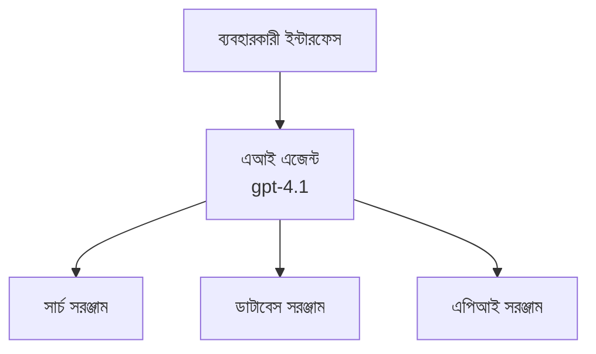
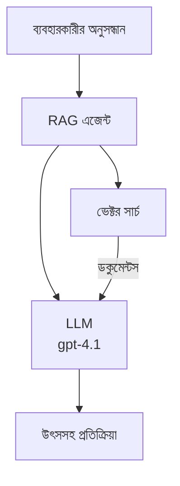
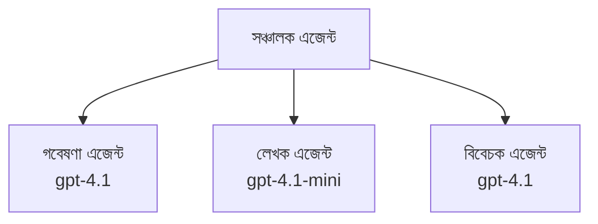

# Azure Developer CLI সহ AI এজেন্টস

**অধ্যায় নেভিগেশন:**
- **📚 কোর্স হোম**: [শুরু করার জন্য AZD](../../README.md)
- **📖 চলমান অধ্যায়**: অধ্যায় ২ - AI-প্রথম উন্নয়ন
- **⬅️ পূর্ববর্তী**: [Microsoft Foundry ইন্টিগ্রেশন](microsoft-foundry-integration.md)
- **➡️ পরবর্তী**: [AI মডেল ডিপ্লয়মেন্ট](ai-model-deployment.md)
- **🚀 উন্নত**: [মাল্টি-এজেন্ট সলিউশনস](../../examples/retail-scenario.md)

---

## প্রবর্তনা

AI এজেন্টগুলি স্বায়ত্তশাসিত প্রোগ্রাম যা তাদের পরিবেশ অনুধাবন করতে পারে, সিদ্ধান্ত নিতে পারে, এবং নির্দিষ্ট লক্ষ্য পূরণে পদক্ষেপ নিতে পারে। সাধারণ চ্যাটবটের মতো শুধু প্রম্পটে উত্তর দেওয়ার পরিবর্তে, এজেন্টগুলি করতে পারে:

- **টুল ব্যবহার** - API কল করা, ডেটাবেস সার্চ, কোড চালানো
- **পরিকল্পনা ও যুক্তি স্থাপন** - জটিল কাজগুলো ধাপে ভাগ করা
- **প্রসঙ্গ থেকে শিখন** - স্মৃতি বজায় রাখা এবং আচরণ মানিয়ে নেওয়া
- **সহযোগিতা** - অন্য এজেন্টদের সঙ্গে কাজ করা (মাল্টি-এজেন্ট সিস্টেম)

এই নির্দেশিকাটি আপনাকে দেখাবে কিভাবে Azure Developer CLI (azd) ব্যবহার করে Azure-এ AI এজেন্টস ডিপ্লয় করবেন।

> **যাচাই নোট (২০২৬-০৩-২৫):** এই নির্দেশিকা `azd` `1.23.12` এবং `azure.ai.agents` `0.1.18-preview` এর সঙ্গে পরীক্ষা করা হয়েছে। `azd ai` অভিজ্ঞতা এখনও প্রিভিউ-মূলক, সুতরাং ইনস্টল করা ফ্ল্যাগ ভিন্ন হলে এক্সটেনশন সাহায্য দেখুন।

## শেখার লক্ষ্যসমূহ

এই নির্দেশিকা সম্পূর্ণ করার পর আপনি:
- বুঝতে পারবেন AI এজেন্ট কি এবং চ্যাটবট থেকে কিভাবে আলাদা
- AZD ব্যবহার করে প্রস্তুত AI এজেন্ট টেমপ্লেট ডিপ্লয় করতে পারবেন
- কাস্টম এজেন্টের জন্য Foundry Agents কনফিগার করতে পারবেন
- বেসিক এজেন্ট প্যাটার্ন যেমন টুল ব্যবহার, RAG, মাল্টি-এজেন্ট বাস্তবায়ন করতে পারবেন
- ডিপ্লয়কৃত এজেন্ট মনিটর ও ডিবাগ করতে পারবেন

## শেখার ফলাফল

সম্পূর্ণ করার পর আপনি পারবেন:
- এক কমান্ডে Azure-এ AI এজেন্ট অ্যাপ্লিকেশন ডিপ্লয় করা
- এজেন্ট টুল ও ক্ষমতাসমূহ কনফিগার করা
- এজেন্টদের সাথে রিট্রিভাল-অগমেন্টেড জেনারেশন (RAG) বাস্তবায়ন করা
- জটিল ওয়ার্কফ্লোর জন্য মাল্টি-এজেন্ট আর্কিটেকচার ডিজাইন করা
- সাধারণ এজেন্ট ডিপ্লয়মেন্ট সমস্যাগুলো সমাধান করা

---

## 🤖 এজেন্ট কতটা ভিন্ন চ্যাটবট থেকে?

| বৈশিষ্ট্য | চ্যাটবট | AI এজেন্ট |
|---------|---------|------------|
| **আচরণ** | প্রম্পটের উত্তর দেয় | স্বায়ত্তশাসিত পদক্ষেপ নেয় |
| **টুলস** | কোনো না | API কল করতে পারে, সার্চ ও কোড চালাতে পারে |
| **স্মৃতি** | সেশন-ভিত্তিক মাত্র | সেশন পেরিয়ে স্থায়ী স্মৃতি |
| **পরিকল্পনা** | একক উত্তর | বহু-ধাপ যুক্তি |
| **সহযোগিতা** | একক সত্তা | অন্য এজেন্টদের সঙ্গে কাজ করতে পারে |

### সহজ উপমা

- **চ্যাটবট** = তথ্য ডেস্কে সাহায্য করে এমন একজন ব্যক্তি
- **AI এজেন্ট** = ব্যক্তিগত সহকারী যিনি ফোন করতে, অ্যাপয়েন্টমেন্ট বুক করতে ও কাজ সম্পন্ন করতে পারে

---

## 🚀 দ্রুত শুরু: আপনার প্রথম এজেন্ট ডিপ্লয় করুন

### বিকল্প ১: Foundry Agents টেমপ্লেট (প্রস্তাবিত)

```bash
# AI এজেন্ট টেমপ্লেট আরম্ভ করুন
azd init --template get-started-with-ai-agents

# Azure এ স্থাপন করুন
azd up
```

**যা ডিপ্লয় হয়:**
- ✅ Foundry Agents
- ✅ Microsoft Foundry মডেলসমূহ (gpt-4.1)
- ✅ Azure AI সার্চ (RAG এর জন্য)
- ✅ Azure Container Apps (ওয়েব ইন্টারফেস)
- ✅ Application Insights (মনিটরিং)

**সময়:** ~১৫-২০ মিনিট
**ব্যয়:** ~$১০০-১৫০/মাস (উন্নয়ন)

### বিকল্প ২: Prompty সহ OpenAI Agent

```bash
# Prompty-ভিত্তিক এজেন্ট টেমপ্লেট initialized করুন
azd init --template agent-openai-python-prompty

# Azure-এ প্রয়োগ করুন
azd up
```

**যা ডিপ্লয় হয়:**
- ✅ Azure Functions (সার্ভারহীন এজেন্ট এক্সিকিউশন)
- ✅ Microsoft Foundry মডেল
- ✅ Prompty কনফিগারেশন ফাইল
- ✅ নমুনা এজেন্ট বাস্তবায়ন

**সময়:** ~১০-১৫ মিনিট
**ব্যয়:** ~$৫০-১০০/মাস (উন্নয়ন)

### বিকল্প ৩: RAG চ্যাট এজেন্ট

```bash
# RAG চ্যাট টেমপ্লেট শুরু করুন
azd init --template azure-search-openai-demo

# আজুরে নিযুক্ত করুন
azd up
```

**যা ডিপ্লয় হয়:**
- ✅ Microsoft Foundry মডেলসমূহ
- ✅ নমুনা ডেটাসহ Azure AI সার্চ
- ✅ ডকুমেন্ট প্রসেসিং পাইপলাইন
- ✅ উক্তিসহ চ্যাট ইন্টারফেস

**সময়:** ~১৫-২৫ মিনিট
**ব্যয়:** ~$৮০-১৫০/মাস (উন্নয়ন)

### বিকল্প ৪: AZD AI Agent Init (ম্যানিফেস্ট বা টেমপ্লেট ভিত্তিক প্রিভিউ)

যদি আপনার কাছে এজেন্ট ম্যানিফেস্ট ফাইল থাকে, আপনি `azd ai` কমান্ড দিয়ে সরাসরি Foundry Agent Service প্রকল্প স্ক্যাফোল্ড করতে পারেন। সাম্প্রতিক প্রিভিউ রিলিজে টেমপ্লেট-ভিত্তিক ইনিশিয়ালাইজেশনের সমর্থন এসেছে, তাই ইনস্টল করা এক্সটেনশনের সংস্করণের উপর প্রম্পট ফ্লো সামান্য ভিন্ন হতে পারে।

```bash
# AI এজেন্ট এক্সটেনশন ইনস্টল করুন
azd extension install azure.ai.agents

# ঐচ্ছিক: ইনস্টলকৃত প্রিভিউ সংস্করণ যাচাই করুন
azd extension show azure.ai.agents

# একটি এজেন্ট ম্যানিফেস্ট থেকে আরম্ভ করুন
azd ai agent init -m agent-manifest.yaml

# Azure এ মোতায়েন করুন
azd up
```

**`azd ai agent init` বনাম `azd init --template` কখন ব্যবহার করবেন:**

| পদ্ধতি | কে-এর জন্য উত্তম | কিভাবে কাজ করে |
|----------|------------------|----------------|
| `azd init --template` | কার্যকর নমুনা অ্যাপ থেকে শুরু | পূর্ণ টেমপ্লেট রিপো ক্লোন করে কোড ও ইনফ্রা সহ |
| `azd ai agent init -m` | নিজের এজেন্ট ম্যানিফেস্ট থেকে নির্মাণ | এজেন্ট ডেফিনিশন থেকে প্রকল্প কাঠামো তৈরি করে |

> **টিপ:** শেখার জন্য (উপরের অপশন ১-৩) `azd init --template` ব্যবহার করুন। নিজের ম্যানিফেস্ট দিয়ে প্রোডাকশন এজেন্ট বানাতে `azd ai agent init` ব্যবহার করুন। পূর্ণ রেফারেন্সের জন্য দেখুন [AZD AI CLI Commands](../chapter-08-production/production-ai-practices.md#azd-ai-cli-commands-and-extensions)।

---

## 🏗️ এজেন্ট আর্কিটেকচার প্যাটার্নসমূহ

### প্যাটার্ন ১: টুল সহ একক এজেন্ট

সরলতম এজেন্ট প্যাটার্ন - একটি এজেন্ট যা একাধিক টুল ব্যবহার করতে পারে।


**সেরা ব্যবহারের ক্ষেত্র:**
- গ্রাহক সাপোর্ট বট
- গবেষণা সহকারী
- ডেটা বিশ্লেষণ এজেন্ট

**AZD টেমপ্লেট:** `azure-search-openai-demo`

### প্যাটার্ন ২: RAG এজেন্ট (রিট্রিভাল-অগমেন্টেড জেনারেশন)

একটি এজেন্ট যা উত্তর দেওয়ার আগে প্রাসঙ্গিক ডকুমেন্ট খুঁজে নিয়ে আসে।


**সেরা ব্যবহারের ক্ষেত্র:**
- এন্টারপ্রাইজ জ্ঞানভাণ্ডার
- ডকুমেন্ট প্রশ্নোত্তর সিস্টেম
- নিয়ম-কানুন ও আইনি গবেষণা

**AZD টেমপ্লেট:** `azure-search-openai-demo`

### প্যাটার্ন ৩: মাল্টি-এজেন্ট সিস্টেম

একাধিক বিশেষায়িত এজেন্ট জটিল কাজ নিয়ে একসাথে কাজ করে।


**সেরা ব্যবহারের ক্ষেত্র:**
- জটিল বিষয়বস্তু নির্মাণ
- বহু-ধাপ ওয়ার্কফ্লো
- বিভিন্ন দক্ষতা প্রয়োজন এমন কাজসমূহ

**আরো জানুন:** [মাল্টি-এজেন্ট সমন্বয় প্যাটার্ন](../chapter-06-pre-deployment/coordination-patterns.md)

---

## ⚙️ এজেন্ট টুল কনফিগারেশন

এজেন্টগুলি শক্তিশালী হয় যখন তারা টুল ব্যবহার করতে পারে। সাধারণ টুলস কনফিগার করার পদ্ধতি:

### Foundry Agents-এ টুল কনফিগারেশন

```python
# agent_config.py
from azure.ai.projects import AIProjectClient
from azure.ai.projects.models import FunctionTool, CodeInterpreterTool

# কাস্টম টুলস সংজ্ঞায়িত করুন
search_tool = FunctionTool(
    name="search_knowledge_base",
    description="Search the company knowledge base for relevant documents",
    parameters={
        "type": "object",
        "properties": {
            "query": {
                "type": "string",
                "description": "The search query"
            }
        },
        "required": ["query"]
    }
)

# টুলস দিয়ে এজেন্ট তৈরি করুন
agent = project_client.agents.create_agent(
    model="gpt-4.1",
    name="Support Agent",
    instructions="You are a helpful support agent. Use the search tool to find relevant information.",
    tools=[search_tool, CodeInterpreterTool()]
)
```

### পরিবেশ কনফিগারেশন

```bash
# এজেন্ট-নির্দিষ্ট পরিবেশ ভেরিয়েবল সেট করুন
azd env set AZURE_OPENAI_MODEL "gpt-4.1"
azd env set AGENT_INSTRUCTIONS "You are a helpful assistant..."
azd env set ENABLE_CODE_INTERPRETER "true"
azd env set ENABLE_FILE_SEARCH "true"

# হালনাগাদ কনফিগারেশন সহ ডিপ্লয় করুন
azd deploy
```

---

## 📊 এজেন্ট মনিটরিং

### Application Insights ইন্টিগ্রেশন

প্রতিটি AZD এজেন্ট টেমপ্লেটে Application Insights অন্তর্ভুক্ত থাকে মনিটরিংয়ের জন্য:

```bash
# মনিটরিং ড্যাশবোর্ড খুলুন
azd monitor --overview

# লাইভ লগ দেখুন
azd monitor --logs

# লাইভ মেট্রিক্স দেখুন
azd monitor --live
```

### পর্যবেক্ষণের জন্য মূল মেট্রিক্স

| মেট্রিক | বিবরণ | লক্ষ্য |
|--------|---------|-------|
| উত্তর বিলম্ব | উত্তর উৎপাদনের সময় | < ৫ সেকেন্ড |
| টোকেন ব্যবহার | অনুরোধ প্রতি টোকেন | খরচ মনিটর করুন |
| টুল কল সফলতা হার | সফল টুল এক্সিকিউশন শতাংশ | > ৯৫% |
| ত্রুটি হার | ব্যর্থ এজেন্ট অনুরোধ | < ১% |
| ব্যবহারকারীর সন্তুষ্টি | প্রতিক্রিয়া স্কোর | > ৪.০/৫.০ |

### এজেন্টের জন্য কাস্টম লগিং

```python
import os
from azure.monitor.opentelemetry import configure_azure_monitor
from opentelemetry import trace

# OpenTelemetry দিয়ে Azure মনিটর কনফিগার করুন
configure_azure_monitor(
    connection_string=os.environ["APPLICATIONINSIGHTS_CONNECTION_STRING"]
)

tracer = trace.get_tracer(__name__)

def log_agent_interaction(user_query, agent_response, tools_used, latency_ms):
    with tracer.start_as_current_span("agent_interaction") as span:
        span.set_attributes({
            "user_query": user_query,
            "response_length": len(agent_response),
            "tools_used": tools_used,
            "latency_ms": latency_ms
        })
```

> **নোট:** প্রয়োজনীয় প্যাকেজ ইনস্টল করুন: `pip install azure-monitor-opentelemetry opentelemetry`

---

## 💰 খরচ বিবেচনা

### প্যাটার্ন অনুযায়ী মাসিক আনুমানিক খরচ

| প্যাটার্ন | ডেভ পরিবেশ | প্রোডাকশন |
|---------|-------------|-----------|
| একক এজেন্ট | $৫০-১০০ | $২০০-৫০০ |
| RAG এজেন্ট | $৮০-১৫০ | $৩০০-৮০০ |
| মাল্টি-এজেন্ট (২-৩ এজেন্ট) | $১৫০-৩০০ | $৫০০-১,৫০০ |
| এন্টারপ্রাইজ মাল্টি-এজেন্ট | $৩০০-৫০০ | $১,৫০০-৫,০০০+ |

### খরচ কমানোর টিপস

1. **সরল কাজের জন্য gpt-4.1-mini ব্যবহার করুন**
   ```bash
   azd env set AZURE_OPENAI_MODEL "gpt-4.1-mini"
   ```

2. **বিরতিপূর্ণ প্রশ্নের জন্য ক্যাশিং ব্যবহার করুন**
   ```python
   from functools import lru_cache
   
   @lru_cache(maxsize=1000)
   def get_cached_response(query_hash):
       return agent.run(query_hash)
   ```

3. **প্রতি রান টোকেন সীমা নির্ধারণ করুন**
   ```python
   # এজেন্ট চালানোর সময় max_completion_tokens সেট করুন, তৈরির সময় নয়
   run = project_client.agents.create_run(
       thread_id=thread.id,
       agent_id=agent.id,
       max_completion_tokens=1000  # প্রতিক্রিয়ার দৈর্ঘ্য সীমাবদ্ধ করুন
   )
   ```

4. **অপ্রয়োজনীয় হলে স্কেল টু জিরো করুন**
   ```bash
   # কন্টেইনার অ্যাপস স্বয়ংক্রিয়ভাবে শূন্য পর্যন্ত স্কেল করে
   azd env set MIN_REPLICAS "0"
   ```

---

## 🔧 এজেন্ট সমস্যা সমাধান

### সাধারণ সমস্যা ও সমাধান

<details>
<summary><strong>❌ এজেন্ট টুল কলের উত্তর দিচ্ছে না</strong></summary>

```bash
# সরঞ্জামগুলি সঠিকভাবে নিবন্ধিত হয়েছে কিনা পরীক্ষা করুন
azd show

# OpenAI স্থাপনাটি যাচাই করুন
az cognitiveservices account deployment list \
  --name $AZURE_OPENAI_NAME \
  --resource-group $RG_NAME

# এজেন্ট লগগুলি পরীক্ষা করুন
azd monitor --logs
```

**সাধারণ কারণসমূহ:**
- টুল ফাংশন সইনেচার মেলেনা
- প্রয়োজনীয় অনুমতি অনুপস্থিত
- API এন্ডপয়েন্ট অ্যাক্সেসযোগ্য নয়
</details>

<details>
<summary><strong>❌ এজেন্ট উত্তর প্রদানে বিলম্ব বেশি</strong></summary>

```bash
# বটলনেকের জন্য অ্যাপ্লিকেশন ইনসাইটস পরীক্ষা করুন
azd monitor --live

# একটি দ্রুততর মডেল ব্যবহারের কথা বিবেচনা করুন
azd env set AZURE_OPENAI_MODEL "gpt-4.1-mini"
azd deploy
```

**অপটিমাইজেশন টিপস:**
- স্ট্রিমিং উত্তর ব্যবহার করুন
- উত্তর ক্যাশিং বাস্তবায়ন করুন
- প্রসঙ্গ উইন্ডোর আকার কমান
</details>

<details>
<summary><strong>❌ এজেন্ট ভুল বা কাল্পনিক তথ্য প্রদান করছে</strong></summary>

```python
# সিস্টেম প্রম্পটগুলি উন্নত করুন
instructions = """
You are a helpful assistant. IMPORTANT:
- Only answer based on provided context
- If you don't know, say "I don't know"
- Always cite your sources
- Never make up information
"""

# গ্রাউন্ডিংয়ের জন্য রিট্রিভাল যোগ করুন
agent = project_client.agents.create_agent(
    model="gpt-4.1",
    instructions=instructions,
    tools=[FileSearchTool()]  # ডকুমেন্টগুলিতে উত্তরগুলি গ্রাউন্ড করুন
)
```
</details>

<details>
<summary><strong>❌ টোকেন সীমা ছাড়িয়ে গিয়েছে ত্রুটি</strong></summary>

```python
# প্রসঙ্গ উইন্ডো ব্যবস্থাপনা বাস্তবায়ন করুন
def truncate_context(messages, max_tokens=8000, model="gpt-4.1"):
    """Keep only recent messages within token limit."""
    import tiktoken
    encoding = tiktoken.encoding_for_model(model)
    total_tokens = 0
    truncated = []
    
    for msg in reversed(messages):
        msg_tokens = len(encoding.encode(msg.content))
        if total_tokens + msg_tokens > max_tokens:
            break
        truncated.insert(0, msg)
        total_tokens += msg_tokens
    
    return truncated
```
</details>

---

## 🎓 হাতে কলম কাজ

### অনুশীলন ১: একটি মৌলিক এজেন্ট ডিপ্লয় করুন (২০ মিনিট)

**লক্ষ্য:** AZD ব্যবহার করে আপনার প্রথম AI এজেন্ট ডিপ্লয় করা

```bash
# ধাপ ১: টেমপ্লেট শুরু করুন
azd init --template get-started-with-ai-agents

# ধাপ ২: Azure এ লগইন করুন
azd auth login
# যদি আপনি ভিন্ন ভিন্ন টেন্যান্টে কাজ করেন, তাহলে --tenant-id <tenant-id> যোগ করুন

# ধাপ ৩: ডিপ্লয় করুন
azd up

# ধাপ ৪: এজেন্ট পরীক্ষা করুন
# ডিপ্লয়মেন্ট এর পরে প্রত্যাশিত আউটপুট:
#   ডিপ্লয়মেন্ট সম্পন্ন হয়েছে!
#   এন্ডপয়েন্ট: https://<app-name>.<region>.azurecontainerapps.io
# আউটপুটে প্রদর্শিত URL টি খুলুন এবং একটি প্রশ্ন করার চেষ্টা করুন

# ধাপ ৫: মনিটরিং দেখা
azd monitor --overview

# ধাপ ৬: পরিষ্কার করুন
azd down --force --purge
```

**সফলতার মানদণ্ড:**
- [ ] এজেন্ট প্রশ্নের উত্তর দেয়
- [ ] `azd monitor` দিয়ে মনিটরিং ড্যাশবোর্ডে অ্যাক্সেস পায়
- [ ] সম্পদ সফলভাবে পরিষ্কার হয়েছে

### অনুশীলন ২: কাস্টম টুল যোগ করুন (৩০ মিনিট)

**লক্ষ্য:** এজেন্টকে একটি কাস্টম টুল দিয়ে সম্প্রসারিত করা

1. এজেন্ট টেমপ্লেট ডিপ্লয় করুন:
   ```bash
   azd init --template get-started-with-ai-agents
   azd up
   ```
2. এজেন্ট কোডে একটি নতুন টুল ফাংশন তৈরি করুন:
   ```python
   def get_weather(location: str) -> str:
       """Get current weather for a location."""
       # আবহাওয়া সেবায় API কল
       return f"Weather in {location}: Sunny, 72°F"
   ```
3. টুলটি এজেন্টে নিবন্ধন করুন:
   ```python
   from azure.ai.projects.models import FunctionTool

   weather_tool = FunctionTool(
       name="get_weather",
       description="Get current weather for a location",
       parameters={
           "type": "object",
           "properties": {
               "location": {"type": "string", "description": "City name"}
           },
           "required": ["location"]
       }
   )

   agent = project_client.agents.create_agent(
       model="gpt-4.1",
       name="Weather Agent",
       tools=[weather_tool]
   )
   ```
4. পুনরায় ডিপ্লয় করে পরীক্ষা করুন:
   ```bash
   azd deploy
   # জিজ্ঞাসা করুন: "সিয়াটলে আবহাওয়া কেমন?"
   # প্রত্যাশিত: এজেন্ট get_weather("Seattle") কল করে এবং আবহাওয়ার তথ্য প্রদান করে
   ```

**সফলতার মানদণ্ড:**
- [ ] এজেন্ট আবহাওয়া সম্পর্কিত প্রশ্ন চিনতে পারে
- [ ] টুল সঠিকভাবে কল হচ্ছে
- [ ] উত্তরে আবহাওয়ার তথ্য অন্তর্ভুক্ত

### অনুশীলন ৩: RAG এজেন্ট তৈরি করুন (৪৫ মিনিট)

**লক্ষ্য:** এমন একটি এজেন্ট তৈরি করা যা আপনার ডকুমেন্ট থেকে প্রশ্নের উত্তর দেয়

```bash
# ধাপ ১: RAG টেমপ্লেট স্থাপন করুন
azd init --template azure-search-openai-demo
azd up

# ধাপ ২: আপনার ডকুমেন্ট আপলোড করুন
# PDF/TXT ফাইলগুলি data/ ডিরেক্টরিতে রাখুন, তারপর চালান:
python scripts/prepdocs.py

# ধাপ ৩: ডোমেইন-নির্দিষ্ট প্রশ্ন দিয়ে পরীক্ষা করুন
# azd up আউটপুট থেকে ওয়েব অ্যাপ URL খুলুন
# আপনার আপলোড করা ডকুমেন্ট সম্পর্কে প্রশ্ন করুন
# উত্তরগুলিতে [doc.pdf] এর মতো উত্স উল্লেখ থাকা উচিত
```

**সফলতার মানদণ্ড:**
- [ ] এজেন্ট আপলোডকৃত ডকুমেন্ট থেকে উত্তর দেয়
- [ ] উত্তরে উক্তি অন্তর্ভুক্ত থাকে
- [ ] সীমা ছাড়িয়ে প্রশ্নে ভুল তথ্য নেই

---

## 📚 পরবর্তী ধাপসমূহ

এখন যেহেতু আপনি AI এজেন্ট বুঝতে পেরেছেন, এগুলো উন্নত বিষয়গুলি অন্বেষণ করুন:

| বিষয় | বিবরণ | লিঙ্ক |
|-------|--------|------|
| **মাল্টি-এজেন্ট সিস্টেম** | একাধিক সম্মিলিত এজেন্টের সিস্টেম নির্মাণ | [রিটেইল মাল্টি-এজেন্ট উদাহরণ](../../examples/retail-scenario.md) |
| **সমন্বয় প্যাটার্ন** | অর্কেস্ট্রেশন ও যোগাযোগের প্যাটার্ন শেখা | [সমন্বয় প্যাটার্ন](../chapter-06-pre-deployment/coordination-patterns.md) |
| **প্রোডাকশন ডিপ্লয়মেন্ট** | এন্টারপ্রাইজ-উপযোগী এজেন্ট ডিপ্লয়মেন্ট | [প্রোডাকশন AI পদ্ধতি](../chapter-08-production/production-ai-practices.md) |
| **এজেন্ট মূল্যায়ন** | এজেন্ট পারফরম্যান্স পরীক্ষা ও মূল্যায়ন | [AI সমস্যা সমাধান](../chapter-07-troubleshooting/ai-troubleshooting.md) |
| **AI ওয়ার্কশপ ল্যাব** | হাতে কলম: আপনার AI সমাধান AZD-র জন্য প্রস্তুত করুন | [AI ওয়ার্কশপ ল্যাব](ai-workshop-lab.md) |

---

## 📖 অতিরিক্ত সম্পদ

### অফিসিয়াল ডকুমেন্টেশন
- [Azure AI Agent Service](https://learn.microsoft.com/azure/ai-services/agents/)
- [Azure AI Foundry Agent Service Quickstart](https://learn.microsoft.com/azure/ai-services/agents/quickstart)
- [Semantic Kernel Agent Framework](https://learn.microsoft.com/semantic-kernel/)

### AZD Agent টেমপ্লেট
- [AI Agents শুরু করুন](https://github.com/Azure-Samples/get-started-with-ai-agents)
- [Agent OpenAI Python Prompty](https://github.com/Azure-Samples/agent-openai-python-prompty)
- [Azure Search OpenAI Demo](https://github.com/Azure-Samples/azure-search-openai-demo)

### কমিউনিটি রিসোর্সেস
- [Awesome AZD - Agent Templates](https://azure.github.io/awesome-azd/?tags=ai-agents)
- [Azure AI Discord](https://discord.gg/microsoft-azure)
- [Microsoft Foundry Discord](https://discord.gg/nTYy5BXMWG)

### এজেন্ট স্কিলস আপনার এডিটরের জন্য
- [**Microsoft Azure Agent Skills**](https://skills.sh/microsoft/github-copilot-for-azure) - GitHub Copilot, Cursor বা যেকোনো সমর্থিত এজেন্টে Azure উন্নয়নের জন্য পুনর্ব্যবহারযোগ্য AI এজেন্ট স্কিলস ইনস্টল করুন। অন্তর্ভুক্ত স্কিলস [Azure AI](https://skills.sh/microsoft/github-copilot-for-azure/azure-ai), [Microsoft Foundry](https://skills.sh/microsoft/github-copilot-for-azure/microsoft-foundry), [ডিপ্লয়মেন্ট](https://skills.sh/microsoft/github-copilot-for-azure/azure-deploy), এবং [ডায়াগনস্টিক্স](https://skills.sh/microsoft/github-copilot-for-azure/azure-diagnostics):
  ```bash
  npx skills add microsoft/github-copilot-for-azure
  ```

---

**নেভিগেশন**
- **পূর্ববর্তী পাঠ**: [Microsoft Foundry ইন্টিগ্রেশন](microsoft-foundry-integration.md)
- **পরবর্তী পাঠ**: [AI মডেল ডিপ্লয়মেন্ট](ai-model-deployment.md)

---

<!-- CO-OP TRANSLATOR DISCLAIMER START -->
**অস্বীকৃতি**:  
এই নথিটি AI অনুবাদ সেবা [Co-op Translator](https://github.com/Azure/co-op-translator) ব্যবহার করে অনূদিত হয়েছে। আমরা যথাসাধ্য সঠিকতার জন্য চেষ্টা করি, তবে দয়া করে বুঝতে হবে যে স্বয়ংক্রিয় অনুবাদে ত্রুটি বা ভুল থাকতে পারে। মূল নথি তার স্থানীয় ভাষায় সর্বাধিক বিশ্বাসযোগ্য উৎস হিসেবে বিবেচিত হওয়া উচিত। গুরুত্বপূর্ণ তথ্যের জন্য পেশাদার মানব অনুবাদের পরামর্শ দেওয়া হচ্ছে। এই অনুবাদের ব্যবহারে হওয়া কোনো ভুল বোঝাবুঝি বা ভুল ব্যাখ্যার জন্য আমরা দায়ী নই।
<!-- CO-OP TRANSLATOR DISCLAIMER END -->