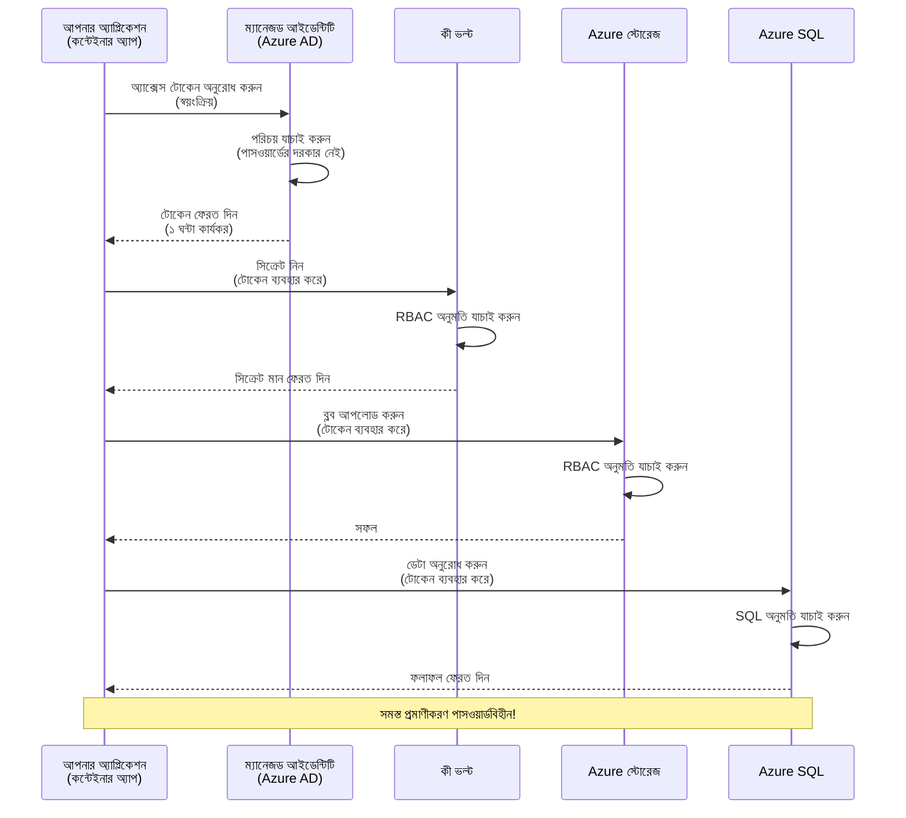
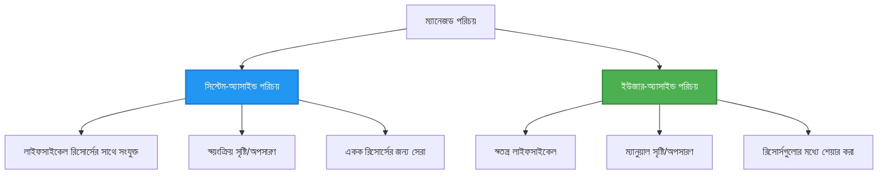

# প্রমাণীকরণ প্যাটার্ন এবং ম্যানেজড আইডেন্টিটি

⏱️ **Estimated Time**: 45-60 মিনিট | 💰 **Cost Impact**: বিনামূল্যে (কোনও অতিরিক্ত চার্জ নেই) | ⭐ **Complexity**: মধ্যবর্তী

**📚 শিক্ষা পথ:**
- ← পূর্ববর্তী: [Configuration Management](configuration.md) - পরিবেশ ভেরিয়েবল এবং সিক্রেটগুলো পরিচালনা
- 🎯 **আপনি এখানে আছেন**: প্রমাণীকরণ ও সুরক্ষা (Managed Identity, Key Vault, নিরাপদ প্যাটার্ন)
- → পরবর্তী: [First Project](first-project.md) - আপনার প্রথম AZD অ্যাপ্লিকেশন তৈরি করুন
- 🏠 [কোর্স হোম](../../README.md)

---

## আপনি যা শিখবেন

By completing this lesson, you will:
- Azure-এর প্রমাণীকরণ প্যাটার্ন (কী, কানেকশন স্ট্রিং, Managed Identity) বোঝা
- পাসওয়ার্ডবিহীন প্রমাণীকরণের জন্য **Managed Identity** বাস্তবায়ন করা
- **Azure Key Vault** ইন্টিগ্রেশনের মাধ্যমে সিক্রেট সুরক্ষিত করা
- AZD ডিপ্লয়মেন্টের জন্য **ভূমিকা-ভিত্তিক অ্যাক্সেস কন্ট্রোল (RBAC)** কনফিগার করা
- Container Apps এবং Azure সার্ভিসে সিকিউরিটি সর্বোত্তম অনুশীলন প্রয়োগ করা
- কী-ভিত্তিক থেকে আইডেন্টিটি-ভিত্তিক প্রমাণীকরণে মাইগ্রেট করা

## কেন Managed Identity গুরুত্বপূর্ণ

### সমস্যা: প্রচলিত প্রমাণীকরণ

**Managed Identity-এর আগে:**
```javascript
// ❌ সিকিউরিটি ঝুঁকি: কোডে হার্ডকোড করা গোপন তথ্য
const connectionString = "Server=mydb.database.windows.net;User=admin;Password=P@ssw0rd123";
const storageKey = "xK7mN9pQ2wR5tY8uI0oP3aS6dF1gH4jK...";
const cosmosKey = "C2x7B9n4M1p8Q5w3E6r0T2y5U8i1O4p7...";
```

**সমস্যাসমূহ:**
- 🔴 **প্রকাশিত সিক্রেট** কোডে, কনফিগ ফাইলগুলোতে, পরিবেশ ভেরিয়েবলগুলোতে
- 🔴 **ক্রেডেনশিয়াল রোটেশন** কোড পরিবর্তন এবং পুনঃডিপ্লয়মেন্ট প্রয়োজন
- 🔴 **অডিট কষ্টকরতা** - কে কখন কী অ্যাক্সেস করেছে?
- 🔴 **Sprawl** - সিক্রেটগুলো একাধিক সিস্টেমে ছড়িয়ে থাকে
- 🔴 **কমপ্লায়েন্স ঝুঁকি** - সিকিউরিটি অডিটে ব্যর্থতা

### সমাধান: Managed Identity

**Managed Identity-এর পরে:**
```javascript
// ✅ নিরাপদ: কোডে কোনো গোপন তথ্য নেই
const credential = new DefaultAzureCredential();
const client = new BlobServiceClient(
  "https://mystorageaccount.blob.core.windows.net",
  credential  // Azure স্বয়ংক্রিয়ভাবে প্রমাণীকরণ পরিচালনা করে
);
```

**সুবিধাসমূহ:**
- ✅ কোড বা কনফিগে **কোনও সিক্রেট নেই**
- ✅ **অটোমেটিক রোটেশন** - Azure এটি পরিচালনা করে
- ✅ Azure AD লগে **পূর্ণ অডিট ট্রেইল**
- ✅ **কেন্দ্রীকৃত সিকিউরিটি** - Azure Portal-এ পরিচালনা করুন
- ✅ **কমপ্লায়েন্স প্রস্তুত** - সিকিউরিটি স্ট্যান্ডার্ড পূরণ করে

**উপমা**: প্রচলিত প্রমাণীকরণ বিভিন্ন দরজার জন্য একাধিক ভৌত চাবি বহনের মতো। Managed Identity হলো এমন একটি সিকিউরিটি ব্যাজ যার মাধ্যমে আপনার পরিচয় অনুসারে স্বয়ংক্রিয়ভাবে অ্যাক্সেস দেয়া হয়—কোনও চাবি হারানোর, অনুলিপি করার বা ঘুরানোর ঝামেলা নেই।

---

## স্থাপত্য ওভারভিউ

### Managed Identity সহ প্রমাণীকরণ ফ্লো


### Managed Identity-এর প্রকারভেদ


| বৈশিষ্ট্য | সিস্টেম-অ্যাসাইনড | ইউজার-অ্যাসাইনড |
|---------|----------------|---------------|
| **লাইফসাইকেল** | রিসোর্সের সাথে সংযুক্ত | স্বতন্ত্র |
| **সৃষ্টি** | রিসোর্সের সাথে স্বয়ংক্রিয়ভাবে | ম্যানুয়ালি তৈরি করা |
| **মুছে ফেলা** | রিসোর্স মুছে গেলে মুছে যায় | রিসোর্স মুছে গেলেও টিকে থাকে |
| **শেয়ারিং** | শুধুমাত্র একটি রিসোর্স | একাধিক রিসোর্স |
| **ব্যবহার কেস** | সাধারণ পরিস্থিতি | জটিল মাল্টি-রিসোর্স পরিস্থিতি |
| **AZD ডিফল্ট** | ✅ সুপারিশকৃত | ঐচ্ছিক |

---

## প্রয়োজনীয়তা

### প্রয়োজনীয় সরঞ্জাম

আপনার কাছে এগুলো আগের পাঠ থেকে ইতিমধ্যে ইন্সটল করা থাকা উচিত:

```bash
# Azure Developer CLI যাচাই করুন
azd version
# ✅ প্রত্যাশিত: azd সংস্করণ 1.0.0 বা তার বেশি

# Azure CLI যাচাই করুন
az --version
# ✅ প্রত্যাশিত: azure-cli 2.50.0 বা তার বেশি
```

### Azure প্রয়োজনীয়তা

- সক্রিয় Azure সাবস্ক্রিপশন
- অনুমতিসমূহ:
  - Managed identities তৈরি করার অনুমতি
  - RBAC ভূমিকা অ্যাসাইন করার অনুমতি
  - Key Vault রিসোর্স তৈরি করার অনুমতি
  - Container Apps ডিপ্লয় করার অনুমতি

### প্রয়োজনীয় পূর্বজ্ঞান

আপনাকে এগুলো সম্পন্ন করা উচিত:
- [Installation Guide](installation.md) - AZD সেটআপ
- [AZD Basics](azd-basics.md) - মূল ধারণা
- [Configuration Management](configuration.md) - পরিবেশ ভেরিয়েবল

---

## পাঠ ১: প্রমাণীকরণ প্যাটার্ন বোঝা

### প্যাটার্ন ১: কানেকশন স্ট্রিং (লেগেসি - এড়িয়ে চলুন)

**কিভাবে কাজ করে:**
```bash
# সংযোগ স্ট্রিংয়ে লগইন তথ্য আছে
STORAGE_CONNECTION_STRING="DefaultEndpointsProtocol=https;AccountName=myaccount;AccountKey=xK7mN9pQ2wR5..."
COSMOS_CONNECTION_STRING="AccountEndpoint=https://myaccount.documents.azure.com:443/;AccountKey=C2x7..."
SQL_CONNECTION_STRING="Server=myserver.database.windows.net;User=admin;Password=P@ssw0rd..."
```

**সমস্যাসমূহ:**
- ❌ সিক্রেটগুলো পরিবেশ ভেরিয়েবলগুলোতে দৃশ্যমান
- ❌ ডিপ্লয়মেন্ট সিস্টেমগুলিতে লগ হয়ে থাকে
- ❌ রোটেট করা কঠিন
- ❌ অ্যাক্সেসের কোনও অডিট ট্রেইল নেই

**কখন ব্যবহার করবেন:** শুধুমাত্র লোকাল ডেভেলপমেন্টের জন্য, কখনো প্রোডাকশনে নয়।

---

### প্যাটার্ন ২: Key Vault রেফারেন্স (ভাল)

**কিভাবে কাজ করে:**
```bicep
// Store secret in Key Vault
resource keyVault 'Microsoft.KeyVault/vaults@2023-02-01' = {
  name: 'mykv'
  properties: {
    enableRbacAuthorization: true
  }
}

// Reference in Container App
env: [
  {
    name: 'STORAGE_KEY'
    secretRef: 'storage-key'  // References Key Vault
  }
]
```

**সুবিধাসমূহ:**
- ✅ সিক্রেটগুলো Key Vault-এ নিরাপদভাবে সংরক্ষিত
- ✅ কেন্দ্রিক সিক্রেট ব্যবস্থাপনা
- ✅ কোড পরিবর্তন ছাড়াই রোটেশন

**সীমাবদ্ধতা:**
- ⚠️ এখনো কী/পাসওয়ার্ড ব্যবহার করা হচ্ছে
- ⚠️ Key Vault অ্যাক্সেস পরিচালনা করতে হবে

**কখন ব্যবহার করবেন:** কানেকশন স্ট্রিং থেকে Managed Identity-তে রূপান্তরের মাঝপথের ধাপ।

---

### প্যাটার্ন ৩: Managed Identity (সেরা অনুশীলন)

**কিভাবে কাজ করে:**
```bicep
// Enable managed identity
resource containerApp 'Microsoft.App/containerApps@2023-05-01' = {
  name: 'myapp'
  identity: {
    type: 'SystemAssigned'  // Automatically creates identity
  }
}

// Grant permissions
resource roleAssignment 'Microsoft.Authorization/roleAssignments@2022-04-01' = {
  scope: storageAccount
  properties: {
    roleDefinitionId: storageBlobDataContributorRole
    principalId: containerApp.identity.principalId
  }
}
```

**অ্যাপ্লিকেশন কোড:**
```javascript
// কোনও গোপনীয়তা প্রয়োজন নেই!
const { DefaultAzureCredential } = require('@azure/identity');
const { BlobServiceClient } = require('@azure/storage-blob');

const credential = new DefaultAzureCredential();
const blobServiceClient = new BlobServiceClient(
  'https://mystorageaccount.blob.core.windows.net',
  credential
);
```

**সুবিধাসমূহ:**
- ✅ কোড/কনফিগে কোন সিক্রেট নেই
- ✅ স্বয়ংক্রিয় ক্রেডেনশিয়াল রোটেশন
- ✅ পূর্ণ অডিট ট্রেইল
- ✅ RBAC-ভিত্তিক অনুমতিসমূহ
- ✅ কমপ্লায়েন্স প্রস্তুত

**কখন ব্যবহার করবেন:** সর্বদা, প্রোডাকশন অ্যাপ্লিকেশনগুলির জন্য।

---

## পাঠ ২: AZD-সহ Managed Identity বাস্তবায়ন

### ধাপে ধাপে বাস্তবায়ন

চলুন একটি নিরাপদ Container App তৈরি করি যা Azure Storage এবং Key Vault-এ অ্যাক্সেস পেতে managed identity ব্যবহার করে।

### প্রকল্প কাঠামো

```
secure-app/
├── azure.yaml                 # AZD configuration
├── infra/
│   ├── main.bicep            # Main infrastructure
│   ├── core/
│   │   ├── identity.bicep    # Managed identity setup
│   │   ├── keyvault.bicep    # Key Vault configuration
│   │   └── storage.bicep     # Storage with RBAC
│   └── app/
│       └── container-app.bicep
└── src/
    ├── app.js                # Application code
    ├── package.json
    └── Dockerfile
```

### ১. AZD কনফিগার করুন (azure.yaml)

```yaml
name: secure-app
metadata:
  template: secure-app@1.0.0

services:
  api:
    project: ./src
    language: js
    host: containerapp

# Enable managed identity (AZD handles this automatically)
```

### ২. অবকাঠামো: Managed Identity সক্ষম করুন

**ফাইল: `infra/main.bicep`**

```bicep
targetScope = 'subscription'

param environmentName string
param location string = 'eastus'

var tags = { 'azd-env-name': environmentName }

// Resource group
resource rg 'Microsoft.Resources/resourceGroups@2021-04-01' = {
  name: 'rg-${environmentName}'
  location: location
  tags: tags
}

// Storage Account
module storage './core/storage.bicep' = {
  name: 'storage'
  scope: rg
  params: {
    name: 'st${uniqueString(rg.id)}'
    location: location
    tags: tags
  }
}

// Key Vault
module keyVault './core/keyvault.bicep' = {
  name: 'keyvault'
  scope: rg
  params: {
    name: 'kv-${uniqueString(rg.id)}'
    location: location
    tags: tags
  }
}

// Container App with Managed Identity
module containerApp './app/container-app.bicep' = {
  name: 'container-app'
  scope: rg
  params: {
    name: 'ca-${environmentName}'
    location: location
    tags: tags
    storageAccountName: storage.outputs.name
    keyVaultName: keyVault.outputs.name
  }
}

// Grant Container App access to Storage
module storageRoleAssignment './core/role-assignment.bicep' = {
  name: 'storage-role'
  scope: rg
  params: {
    principalId: containerApp.outputs.identityPrincipalId
    roleDefinitionId: 'ba92f5b4-2d11-453d-a403-e96b0029c9fe'  // Storage Blob Data Contributor
    targetResourceId: storage.outputs.id
  }
}

// Grant Container App access to Key Vault
module kvRoleAssignment './core/role-assignment.bicep' = {
  name: 'kv-role'
  scope: rg
  params: {
    principalId: containerApp.outputs.identityPrincipalId
    roleDefinitionId: '4633458b-17de-408a-b874-0445c86b69e6'  // Key Vault Secrets User
    targetResourceId: keyVault.outputs.id
  }
}

// Outputs
output AZURE_STORAGE_ACCOUNT_NAME string = storage.outputs.name
output AZURE_KEY_VAULT_NAME string = keyVault.outputs.name
output APP_URL string = containerApp.outputs.url
```

### ৩. System-Assigned Identity সহ Container App

**ফাইল: `infra/app/container-app.bicep`**

```bicep
param name string
param location string
param tags object = {}
param storageAccountName string
param keyVaultName string

resource containerApp 'Microsoft.App/containerApps@2023-05-01' = {
  name: name
  location: location
  tags: tags
  identity: {
    type: 'SystemAssigned'  // 🔑 Enable managed identity
  }
  properties: {
    configuration: {
      ingress: {
        external: true
        targetPort: 3000
      }
    }
    template: {
      containers: [
        {
          name: 'api'
          image: 'myregistry.azurecr.io/api:latest'
          resources: {
            cpu: json('0.5')
            memory: '1Gi'
          }
          env: [
            {
              name: 'AZURE_STORAGE_ACCOUNT_NAME'
              value: storageAccountName
            }
            {
              name: 'AZURE_KEY_VAULT_NAME'
              value: keyVaultName
            }
            // 🔑 No secrets - managed identity handles authentication!
          ]
        }
      ]
    }
  }
}

// Output the identity for RBAC assignments
output identityPrincipalId string = containerApp.identity.principalId
output id string = containerApp.id
output url string = 'https://${containerApp.properties.configuration.ingress.fqdn}'
```

### ৪. RBAC ভূমিকা অ্যাসাইনমেন্ট মডিউল

**ফাইল: `infra/core/role-assignment.bicep`**

```bicep
param principalId string
param roleDefinitionId string  // Azure built-in role ID
param targetResourceId string

resource roleAssignment 'Microsoft.Authorization/roleAssignments@2022-04-01' = {
  name: guid(principalId, roleDefinitionId, targetResourceId)
  scope: resourceId('Microsoft.Resources/resourceGroups', resourceGroup().name)
  properties: {
    roleDefinitionId: subscriptionResourceId('Microsoft.Authorization/roleDefinitions', roleDefinitionId)
    principalId: principalId
    principalType: 'ServicePrincipal'
  }
}

output id string = roleAssignment.id
```

### ৫. Managed Identity সহ অ্যাপ্লিকেশন কোড

**ফাইল: `src/app.js`**

```javascript
const express = require('express');
const { DefaultAzureCredential } = require('@azure/identity');
const { BlobServiceClient } = require('@azure/storage-blob');
const { SecretClient } = require('@azure/keyvault-secrets');

const app = express();
const PORT = process.env.PORT || 3000;

// 🔑 ক্রেডেনশিয়াল আরম্ভ করুন (ম্যানেজড আইডেন্টিটির সাথে স্বয়ংক্রিয়ভাবে কাজ করে)
const credential = new DefaultAzureCredential();

// Azure স্টোরেজ সেটআপ
const storageAccountName = process.env.AZURE_STORAGE_ACCOUNT_NAME;
const blobServiceClient = new BlobServiceClient(
  `https://${storageAccountName}.blob.core.windows.net`,
  credential  // কোনো কী প্রয়োজন নেই!
);

// Key Vault সেটআপ
const keyVaultName = process.env.AZURE_KEY_VAULT_NAME;
const secretClient = new SecretClient(
  `https://${keyVaultName}.vault.azure.net`,
  credential  // কোনো কী প্রয়োজন নেই!
);

// স্বাস্থ্য পরীক্ষা
app.get('/health', (req, res) => {
  res.json({ status: 'healthy', authentication: 'managed-identity' });
});

// ব্লব স্টোরেজে ফাইল আপলোড করুন
app.post('/upload', async (req, res) => {
  try {
    const containerClient = blobServiceClient.getContainerClient('uploads');
    await containerClient.createIfNotExists();
    
    const blobName = `file-${Date.now()}.txt`;
    const blockBlobClient = containerClient.getBlockBlobClient(blobName);
    
    await blockBlobClient.upload('Hello from managed identity!', 30);
    
    res.json({
      success: true,
      blobName: blobName,
      message: 'File uploaded using managed identity!'
    });
  } catch (error) {
    console.error('Upload error:', error);
    res.status(500).json({ error: error.message });
  }
});

// Key Vault থেকে গোপন মান নিন
app.get('/secret/:name', async (req, res) => {
  try {
    const secretName = req.params.name;
    const secret = await secretClient.getSecret(secretName);
    
    res.json({
      name: secretName,
      value: secret.value,
      message: 'Secret retrieved using managed identity!'
    });
  } catch (error) {
    console.error('Secret error:', error);
    res.status(500).json({ error: error.message });
  }
});

// ব্লব কনটেইনারের তালিকা (পঠন অনুমতি প্রদর্শন করে)
app.get('/containers', async (req, res) => {
  try {
    const containers = [];
    for await (const container of blobServiceClient.listContainers()) {
      containers.push(container.name);
    }
    
    res.json({
      containers: containers,
      count: containers.length,
      message: 'Containers listed using managed identity!'
    });
  } catch (error) {
    console.error('List error:', error);
    res.status(500).json({ error: error.message });
  }
});

app.listen(PORT, () => {
  console.log(`Secure API listening on port ${PORT}`);
  console.log('Authentication: Managed Identity (passwordless)');
});
```

**ফাইল: `src/package.json`**

```json
{
  "name": "secure-app",
  "version": "1.0.0",
  "dependencies": {
    "express": "^4.18.2",
    "@azure/identity": "^4.0.0",
    "@azure/storage-blob": "^12.17.0",
    "@azure/keyvault-secrets": "^4.7.0"
  },
  "scripts": {
    "start": "node app.js"
  }
}
```

### ৬. ডিপ্লয় এবং পরীক্ষা করুন

```bash
# AZD পরিবেশ শুরু করুন
azd init

# ইনফ্রাস্ট্রাকচার এবং অ্যাপ্লিকেশন স্থাপন করুন
azd up

# অ্যাপের URL পান
APP_URL=$(azd env get-values | grep APP_URL | cut -d '=' -f2 | tr -d '"')

# স্বাস্থ্য যাচাই পরীক্ষা করুন
curl $APP_URL/health
```

**✅ প্রত্যাশিত আউটপুট:**
```json
{
  "status": "healthy",
  "authentication": "managed-identity"
}
```

**ব্লব আপলোড পরীক্ষা:**
```bash
curl -X POST $APP_URL/upload
```

**✅ প্রত্যাশিত আউটপুট:**
```json
{
  "success": true,
  "blobName": "file-1700404800000.txt",
  "message": "File uploaded using managed identity!"
}
```

**কন্টেইনার তালিকা পরীক্ষা:**
```bash
curl $APP_URL/containers
```

**✅ প্রত্যাশিত আউটপুট:**
```json
{
  "containers": ["uploads"],
  "count": 1,
  "message": "Containers listed using managed identity!"
}
```

---

## সাধারণ Azure RBAC ভূমিকা

### Managed Identity-র জন্য বিল্ট-ইন রোল আইডি

| সার্ভিস | রোল নাম | রোল আইডি | অনুমতিসমূহ |
|---------|-----------|---------|-------------|
| **Storage** | Storage Blob Data Reader | `2a2b9908-6b94-4a3d-8e5a-a7d8f8cc8a12` | ব্লব ও কন্টেইনার পড়তে পারা |
| **Storage** | Storage Blob Data Contributor | `ba92f5b4-2d11-453d-a403-e96b0029c9fe` | ব্লব পড়া, লেখা, মুছা |
| **Storage** | Storage Queue Data Contributor | `974c5e8b-45b9-4653-ba55-5f855dd0fb88` | কিউ মেসেজ পড়া, লেখা, মুছা |
| **Key Vault** | Key Vault Secrets User | `4633458b-17de-408a-b874-0445c86b69e6` | সিক্রেট পড়া |
| **Key Vault** | Key Vault Secrets Officer | `b86a8fe4-44ce-4948-aee5-eccb2c155cd7` | সিক্রেট পড়া, লেখা, মুছা |
| **Cosmos DB** | Cosmos DB Built-in Data Reader | `00000000-0000-0000-0000-000000000001` | Cosmos DB ডেটা পড়া |
| **Cosmos DB** | Cosmos DB Built-in Data Contributor | `00000000-0000-0000-0000-000000000002` | Cosmos DB ডেটা পড়া, লেখা |
| **SQL Database** | SQL DB Contributor | `9b7fa17d-e63e-47b0-bb0a-15c516ac86ec` | SQL ডাটাবেস পরিচালনা করা |
| **Service Bus** | Azure Service Bus Data Owner | `090c5cfd-751d-490a-894a-3ce6f1109419` | মেসেজ পাঠানো, গ্রহণ করা, পরিচালনা করা |

### কীভাবে রোল আইডি খুঁজবেন

```bash
# সমস্ত বিল্ট-ইন ভূমিকা তালিকা করুন
az role definition list --query "[].{Name:roleName, ID:name}" --output table

# নির্দিষ্ট ভূমিকা অনুসন্ধান করুন
az role definition list --query "[?contains(roleName, 'Storage Blob')].{Name:roleName, ID:name}" --output table

# ভূমিকার বিবরণ পান
az role definition list --name "Storage Blob Data Contributor"
```

---

## বাস্তব অনুশীলন

### অনুশীলন ১: বিদ্যমান অ্যাপের জন্য Managed Identity সক্ষম করুন ⭐⭐ (মধ্যম)

**লক্ষ্য**: বিদ্যমান Container App ডিপ্লয়মেন্টে managed identity যোগ করা

**পরিস্থিতি**: আপনার কাছে একটি Container App আছে যা কানেকশন স্ট্রিং ব্যবহার করছে। এটিকে managed identity-তে রূপান্তর করুন।

**শুরু বিন্দু**: নিম্নলিখিত কনফিগারেশনের সাথে Container App:

```bicep
// ❌ Current: Using connection string
env: [
  {
    name: 'STORAGE_CONNECTION_STRING'
    secretRef: 'storage-connection'
  }
]
```

**ধাপসমূহ**:

1. **Bicep-এ managed identity সক্ষম করুন:**

```bicep
resource containerApp 'Microsoft.App/containerApps@2023-05-01' = {
  name: 'myapp'
  identity: {
    type: 'SystemAssigned'  // Add this
  }
  // ... rest of configuration
}
```

2. **Storage অ্যাক্সেস প্রদান করুন:**

```bicep
// Get storage account reference
resource storageAccount 'Microsoft.Storage/storageAccounts@2023-01-01' existing = {
  name: storageAccountName
}

// Assign role
resource roleAssignment 'Microsoft.Authorization/roleAssignments@2022-04-01' = {
  name: guid(containerApp.id, 'ba92f5b4-2d11-453d-a403-e96b0029c9fe', storageAccount.id)
  scope: storageAccount
  properties: {
    roleDefinitionId: subscriptionResourceId('Microsoft.Authorization/roleDefinitions', 'ba92f5b4-2d11-453d-a403-e96b0029c9fe')
    principalId: containerApp.identity.principalId
    principalType: 'ServicePrincipal'
  }
}
```

3. **অ্যাপ্লিকেশন কোড আপডেট করুন:**

**আগে (কানেকশন স্ট্রিং):**
```javascript
const { BlobServiceClient } = require('@azure/storage-blob');

const blobServiceClient = BlobServiceClient.fromConnectionString(
  process.env.STORAGE_CONNECTION_STRING
);
```

**পরে (managed identity):**
```javascript
const { DefaultAzureCredential } = require('@azure/identity');
const { BlobServiceClient } = require('@azure/storage-blob');

const credential = new DefaultAzureCredential();
const blobServiceClient = new BlobServiceClient(
  `https://${process.env.STORAGE_ACCOUNT_NAME}.blob.core.windows.net`,
  credential
);
```

4. **পরিবেশ ভেরিয়েবল আপডেট করুন:**

```bicep
env: [
  {
    name: 'STORAGE_ACCOUNT_NAME'
    value: storageAccountName  // Just the name, no secrets!
  }
  // Remove STORAGE_CONNECTION_STRING
]
```

5. **ডিপ্লয় এবং পরীক্ষা করুন:**

```bash
# পুনরায় স্থাপন
azd up

# এটি এখনও কাজ করে কিনা পরীক্ষা করুন
curl https://myapp.azurecontainerapps.io/upload
```

**✅ সফলতার মানদণ্ড:**
- ✅ অ্যাপ্লিকেশন ত্রুটি ছাড়াই ডিপ্লয় হয়
- ✅ Storage অপারেশন কাজ করে (আপলোড, তালিকা, ডাউনলোড)
- ✅ পরিবেশ ভেরিয়েবলগুলোতে কোনো কানেকশন স্ট্রিং নেই
- ✅ Azure Portal-এ "Identity" ব্লেডে আইডেন্টিটি দৃশ্যমান

**যাচাইকরণ:**

```bash
# ম্যানেজড আইডেন্টিটি সক্রিয় আছে কি না পরীক্ষা করুন
az containerapp show \
  --name myapp \
  --resource-group rg-myapp \
  --query "identity.type"
# ✅ প্রত্যাশিত: "SystemAssigned"

# রোল অ্যাসাইনমেন্ট পরীক্ষা করুন
az role assignment list \
  --assignee $(az containerapp show --name myapp --resource-group rg-myapp --query "identity.principalId" -o tsv) \
  --scope /subscriptions/{sub-id}/resourceGroups/rg-myapp/providers/Microsoft.Storage/storageAccounts/mystorageaccount
# ✅ প্রত্যাশিত: "Storage Blob Data Contributor" রোল দেখায়
```

**সময়**: 20-30 মিনিট

---

### অনুশীলন ২: User-Assigned Identity দিয়ে মাল্টি-সার্ভিস অ্যাক্সেস ⭐⭐⭐ (উন্নত)

**লক্ষ্য**: একাধিক Container Apps-এ শেয়ার করা একটি user-assigned identity তৈরি করা

**পরিস্থিতি**: আপনার কাছে ৩টি মাইক্রোসার্ভিস আছে যেগুলো একই Storage অ্যাকাউন্ট এবং Key Vault-এ অ্যাক্সেস প্রয়োজন।

**ধাপসমূহ**:

1. **user-assigned identity সৃষ্টি করুন:**

**ফাইল: `infra/core/identity.bicep`**

```bicep
param name string
param location string
param tags object = {}

resource userAssignedIdentity 'Microsoft.ManagedIdentity/userAssignedIdentities@2023-01-31' = {
  name: name
  location: location
  tags: tags
}

output id string = userAssignedIdentity.id
output principalId string = userAssignedIdentity.properties.principalId
output clientId string = userAssignedIdentity.properties.clientId
```

2. **user-assigned identity-কে রোলসমূহ অ্যাসাইন করুন:**

```bicep
// In main.bicep
module userIdentity './core/identity.bicep' = {
  name: 'user-identity'
  scope: rg
  params: {
    name: 'id-${environmentName}'
    location: location
    tags: tags
  }
}

// Grant Storage access
resource storageRoleAssignment 'Microsoft.Authorization/roleAssignments@2022-04-01' = {
  name: guid(userIdentity.outputs.principalId, 'storage-contributor')
  scope: storageAccount
  properties: {
    roleDefinitionId: subscriptionResourceId('Microsoft.Authorization/roleDefinitions', 'ba92f5b4-2d11-453d-a403-e96b0029c9fe')
    principalId: userIdentity.outputs.principalId
    principalType: 'ServicePrincipal'
  }
}

// Grant Key Vault access
resource kvRoleAssignment 'Microsoft.Authorization/roleAssignments@2022-04-01' = {
  name: guid(userIdentity.outputs.principalId, 'kv-secrets-user')
  scope: keyVault
  properties: {
    roleDefinitionId: subscriptionResourceId('Microsoft.Authorization/roleDefinitions', '4633458b-17de-408a-b874-0445c86b69e6')
    principalId: userIdentity.outputs.principalId
    principalType: 'ServicePrincipal'
  }
}
```

3. **একাধিক Container Apps-এ identity অ্যাসাইন করুন:**

```bicep
resource apiGateway 'Microsoft.App/containerApps@2023-05-01' = {
  name: 'api-gateway'
  identity: {
    type: 'UserAssigned'
    userAssignedIdentities: {
      '${userIdentity.outputs.id}': {}
    }
  }
  // ... rest of config
}

resource productService 'Microsoft.App/containerApps@2023-05-01' = {
  name: 'product-service'
  identity: {
    type: 'UserAssigned'
    userAssignedIdentities: {
      '${userIdentity.outputs.id}': {}
    }
  }
  // ... rest of config
}

resource orderService 'Microsoft.App/containerApps@2023-05-01' = {
  name: 'order-service'
  identity: {
    type: 'UserAssigned'
    userAssignedIdentities: {
      '${userIdentity.outputs.id}': {}
    }
  }
  // ... rest of config
}
```

4. **অ্যাপ্লিকেশন কোড (সব সার্ভিস একই প্যাটার্ন ব্যবহার করে):**

```javascript
const { DefaultAzureCredential, ManagedIdentityCredential } = require('@azure/identity');

// ইউজার-অ্যাসাইন করা পরিচয়ের জন্য ক্লায়েন্ট আইডি নির্দিষ্ট করুন
const credential = new ManagedIdentityCredential(
  process.env.AZURE_CLIENT_ID  // ইউজার-অ্যাসাইন করা পরিচয়ের ক্লায়েন্ট আইডি
);

// অথবা DefaultAzureCredential ব্যবহার করুন (স্বয়ংক্রিয়ভাবে সনাক্ত করে)
const credential = new DefaultAzureCredential();

const blobServiceClient = new BlobServiceClient(
  `https://${process.env.STORAGE_ACCOUNT_NAME}.blob.core.windows.net`,
  credential
);
```

5. **ডিপ্লয় করে যাচাই করুন:**

```bash
azd up

# সব সেবাগুলো স্টোরেজে অ্যাক্সেস করতে পারে কিনা পরীক্ষা করুন
curl https://api-gateway.azurecontainerapps.io/upload
curl https://product-service.azurecontainerapps.io/upload
curl https://order-service.azurecontainerapps.io/upload
```

**✅ সফলতার মানদণ্ড:**
- ✅ ৩টি সার্ভিস জুড়ে একটি identity শেয়ার করা হয়েছে
- ✅ সব সার্ভিস Storage এবং Key Vault-এ অ্যাক্সেস করতে পারে
- ✅ একটি সার্ভিস মুছে ফেললেও identity টিকে থাকে
- ✅ কেন্দ্রিক অনুমতি ব্যবস্থাপনা

**User-Assigned Identity-এর সুবিধা:**
- পরিচালনার জন্য একক identity
- সার্ভিসগুলোর মধ্যে ধারাবাহিক অনুমতিসমূহ
- সার্ভিস মুছে ফেললে টিকে থাকে
- জটিল আর্কিটেকচারের জন্য ভালো

**সময়**: 30-40 মিনিট

---

### অনুশীলন ৩: Key Vault সিক্রেট রোটেশন বাস্তবায়ন ⭐⭐⭐ (উন্নত)

**লক্ষ্য**: তৃতীয়-পক্ষের API কীগুলো Key Vault-এ সংরক্ষণ করা এবং managed identity ব্যবহার করে সেগুলোতে অ্যাক্সেস করা

**পরিস্থিতি**: আপনার অ্যাপকে এমন একটি এক্সটার্নাল API (OpenAI, Stripe, SendGrid) কল করতে হবে যা API কী চায়।

**ধাপসমূহ**:

1. **RBAC সহ Key Vault তৈরি করুন:**

**ফাইল: `infra/core/keyvault.bicep`**

```bicep
param name string
param location string
param tags object = {}

resource keyVault 'Microsoft.KeyVault/vaults@2023-02-01' = {
  name: name
  location: location
  tags: tags
  properties: {
    enableRbacAuthorization: true  // Use RBAC instead of access policies
    sku: {
      family: 'A'
      name: 'standard'
    }
    tenantId: subscription().tenantId
    enableSoftDelete: true
    softDeleteRetentionInDays: 90
  }
}

// Allow Container App to read secrets
output id string = keyVault.id
output name string = keyVault.name
output uri string = keyVault.properties.vaultUri
```

2. **Key Vault-এ সিক্রেট সংরক্ষণ করুন:**

```bash
# Key Vault-এর নাম পান
KV_NAME=$(azd env get-values | grep AZURE_KEY_VAULT_NAME | cut -d '=' -f2 | tr -d '"')

# তৃতীয় পক্ষের API কী সংরক্ষণ করুন
az keyvault secret set \
  --vault-name $KV_NAME \
  --name "OpenAI-ApiKey" \
  --value "sk-proj-xxxxxxxxxxxxx"

az keyvault secret set \
  --vault-name $KV_NAME \
  --name "Stripe-ApiKey" \
  --value "sk_live_xxxxxxxxxxxxx"

az keyvault secret set \
  --vault-name $KV_NAME \
  --name "SendGrid-ApiKey" \
  --value "SG.xxxxxxxxxxxxx"
```

3. **সিক্রেট রিট্রিভ করার অ্যাপ্লিকেশন কোড:**

**ফাইল: `src/config.js`**

```javascript
const { DefaultAzureCredential } = require('@azure/identity');
const { SecretClient } = require('@azure/keyvault-secrets');

class Config {
  constructor() {
    this.credential = new DefaultAzureCredential();
    this.secretClient = new SecretClient(
      `https://${process.env.AZURE_KEY_VAULT_NAME}.vault.azure.net`,
      this.credential
    );
    this.cache = {};
  }

  async getSecret(secretName) {
    // প্রথমে ক্যাশ পরীক্ষা করুন
    if (this.cache[secretName]) {
      return this.cache[secretName];
    }

    try {
      const secret = await this.secretClient.getSecret(secretName);
      this.cache[secretName] = secret.value;
      console.log(`✅ Retrieved secret: ${secretName}`);
      return secret.value;
    } catch (error) {
      console.error(`❌ Failed to get secret ${secretName}:`, error.message);
      throw error;
    }
  }

  async getOpenAIKey() {
    return this.getSecret('OpenAI-ApiKey');
  }

  async getStripeKey() {
    return this.getSecret('Stripe-ApiKey');
  }

  async getSendGridKey() {
    return this.getSecret('SendGrid-ApiKey');
  }
}

module.exports = new Config();
```

4. **অ্যাপ্লিকেশনে সিক্রেট ব্যবহার করুন:**

**ফাইল: `src/app.js`**

```javascript
const express = require('express');
const config = require('./config');
const { OpenAI } = require('openai');

const app = express();

// Key Vault থেকে কী ব্যবহার করে OpenAI ইনিশিয়ালাইজ করুন
let openaiClient;

async function initializeServices() {
  const openaiKey = await config.getOpenAIKey();
  openaiClient = new OpenAI({ apiKey: openaiKey });
  console.log('✅ Services initialized with secrets from Key Vault');
}

// স্টার্টআপে কল করুন
initializeServices().catch(console.error);

app.post('/chat', async (req, res) => {
  try {
    const completion = await openaiClient.chat.completions.create({
      model: 'gpt-4.1',
      messages: [{ role: 'user', content: 'Hello!' }]
    });
    
    res.json({
      response: completion.choices[0].message.content,
      authentication: 'Key from Key Vault via Managed Identity'
    });
  } catch (error) {
    res.status(500).json({ error: error.message });
  }
});

app.listen(3000, () => {
  console.log('Secure API with Key Vault integration running');
});
```

5. **ডিপ্লয় এবং পরীক্ষা করুন:**

```bash
azd up

# পরীক্ষা করুন যে API কীগুলো কাজ করে
curl -X POST https://myapp.azurecontainerapps.io/chat \
  -H "Content-Type: application/json" \
  -d '{"message":"Hello AI"}'
```

**✅ সফলতার মানদণ্ড:**
- ✅ কোড বা পরিবেশ ভেরিয়েবলগুলোতে কোনও API কী নেই
- ✅ অ্যাপ্লিকেশন Key Vault থেকে কী রিট্রিভ করে
- ✅ তৃতীয়-পক্ষের APIগুলো সঠিকভাবে কাজ করে
- ✅ কোড পরিবর্তন ছাড়াই কী রোটেট করা যায়

**একটি সিক্রেট রোটেট করুন:**

```bash
# Key Vault-এ সিক্রেট আপডেট করুন
az keyvault secret set \
  --vault-name $KV_NAME \
  --name "OpenAI-ApiKey" \
  --value "sk-proj-NEW_KEY_HERE"

# নতুন কী গ্রহণ করতে অ্যাপটি পুনরায় চালু করুন
az containerapp revision restart \
  --name myapp \
  --resource-group rg-myapp
```

**সময়**: 25-35 মিনিট

---

## জ্ঞান যাচাইকরণ বিন্দু

### ১. প্রমাণীকরণ প্যাটার্ন ✓

আপনার বোঝার পরীক্ষা:

- [ ] **Q1**: তিনটি প্রধান প্রমাণীকরণ প্যাটার্ন কী কী? 
  - **A**: কানেকশন স্ট্রিং (লেগেসি), Key Vault রেফারেন্স (রূপান্তর), Managed Identity (সেরা)

- [ ] **Q2**: Managed Identity কেন কানেকশন স্ট্রিংয়ের চেয়ে ভালো?
  - **A**: কোডে সিক্রেট নেই, স্বয়ংক্রিয় রোটেশন, পূর্ণ অডিট ট্রেইল, RBAC অনুমতিসমূহ

- [ ] **Q3**: কখন আপনি system-assigned-এর পরিবর্তে user-assigned identity ব্যবহার করবেন?
  - **A**: যখন একাধিক রিসোর্সে identity শেয়ার করতে হবে অথবা যখন identity-এর লাইফসাইকেল রিসোর্সের লাইফসাইকেলের সাথে স্বাধীন

**হ্যান্ডস-অন যাচাইকরণ:**
```bash
# আপনার অ্যাপ কোন ধরনের পরিচয় ব্যবহার করে তা পরীক্ষা করুন
az containerapp show \
  --name myapp \
  --resource-group rg-myapp \
  --query "identity.type"

# পরিচয়ের জন্য সব রোল অ্যাসাইনমেন্ট তালিকাভুক্ত করুন
az role assignment list \
  --assignee $(az containerapp show --name myapp --resource-group rg-myapp --query "identity.principalId" -o tsv)
```

---

### ২. RBAC এবং অনুমতিসমূহ ✓

আপনার বোঝা পরীক্ষা:

- [ ] **Q1**: "Storage Blob Data Contributor" এর রোল আইডি কী?
  - **A**: `ba92f5b4-2d11-453d-a403-e96b0029c9fe`

- [ ] **Q2**: "Key Vault Secrets User" কোন অনুমতি দেয়?
  - **A**: সিক্রেট পড়ার একমাত্র অ্যাক্সেস (তৈরি করা, আপডেট বা মুছতে পারে না)

- [ ] **Q3**: আপনি কিভাবে একটি Container App-কে Azure SQL-এ অ্যাক্সেস দেবেন?
  - **A**: "SQL DB Contributor" রোল অ্যাসাইন করুন অথবা SQL-এর জন্য Azure AD প্রমাণীকরণ কনফিগার করুন

**হ্যান্ডস-অন যাচাইকরণ:**
```bash
# নির্দিষ্ট ভূমিকা খুঁজুন
az role definition list --name "Storage Blob Data Contributor"

# আপনার পরিচয়ে কোন কোন ভূমিকা বরাদ্দ আছে তা পরীক্ষা করুন
PRINCIPAL_ID=$(az containerapp show --name myapp --resource-group rg-myapp --query "identity.principalId" -o tsv)
az role assignment list --assignee $PRINCIPAL_ID --output table
```

---

### ৩. Key Vault ইন্টিগ্রেশন ✓

আপনার বোঝা পরীক্ষা করুন:
- [ ] **Q1**: আপনি কীভাবে Key Vault-এর জন্য অ্যাক্সেস পলিসির বদলে RBAC সক্ষম করবেন?
  - **A**: Bicep-এ `enableRbacAuthorization: true` সেট করুন

- [ ] **Q2**: কোন Azure SDK লাইব্রেরি managed identity authentication পরিচালনা করে?
  - **A**: `@azure/identity` `DefaultAzureCredential` ক্লাস সহ

- [ ] **Q3**: Key Vault সিক্রেটগুলি ক্যাশে কতদিন থাকে?
  - **A**: অ্যাপ্লিকেশন-নির্ভর; আপনার নিজের ক্যাশিং কৌশল বাস্তবায়ন করুন

**হাতেকলমে যাচাইকরণ:**
```bash
# Key Vault অ্যাক্সেস পরীক্ষা
az keyvault secret show \
  --vault-name $KV_NAME \
  --name "OpenAI-ApiKey" \
  --query "value"

# নিশ্চিত করুন যে RBAC সক্রিয় আছে
az keyvault show \
  --name $KV_NAME \
  --query "properties.enableRbacAuthorization"
# ✅ প্রত্যাশিত: true
```

---

## নিরাপত্তার সেরা অনুশীলন

### ✅ করণীয়:

1. **প্রোডাকশনে সর্বদা Managed Identity ব্যবহার করুন**
   ```bicep
   identity: {
     type: 'SystemAssigned'
   }
   ```

2. **কম-থেকে-কম অনুমতিসম্পন্ন RBAC রোল ব্যবহার করুন**
   - সম্ভব হলে "Reader" রোল ব্যবহার করুন
   - অপরিহার্য না হলে "Owner" বা "Contributor" এড়িয়ে চলুন

3. **তৃতীয়-পক্ষের কীসমূহ Key Vault-এ সংরক্ষণ করুন**
   ```javascript
   const apiKey = await secretClient.getSecret('ThirdPartyApiKey');
   ```

4. **অডিট লগিং সক্রিয় করুন**
   ```bicep
   diagnosticSettings: {
     logs: [{ category: 'AuditEvent', enabled: true }]
   }
   ```

5. **dev/staging/prod-এর জন্য আলাদা identities ব্যবহার করুন**
   ```bash
   azd env new dev
   azd env new staging
   azd env new prod
   ```

6. **নিয়মিত সিক্রেট রোটেট করুন**
   - Key Vault সিক্রেটগুলিতে মেয়াদ শেষ হওয়ার তারিখ সেট করুন
   - Azure Functions দিয়ে رোটেশন স্বয়ংক্রিয় করুন

### ❌ করবেন না:

1. **কখনও সিক্রেটস হার্ডকোড করবেন না**
   ```javascript
   // ❌ খারাপ
   const apiKey = "sk-proj-xxxxxxxxxxxxx";
   ```

2. **প্রোডাকশনে connection strings ব্যবহার করবেন না**
   ```javascript
   // ❌ খারাপ
   BlobServiceClient.fromConnectionString(process.env.STORAGE_CONNECTION_STRING)
   ```

3. **অত্যধিক অনুমতি দেবেন না**
   ```bicep
   // ❌ BAD - too much access
   roleDefinitionId: 'Owner'
   
   // ✅ GOOD - least privilege
   roleDefinitionId: 'Storage Blob Data Reader'
   ```

4. **সিক্রেট লগ করবেন না**
   ```javascript
   // ❌ খারাপ
   console.log('API Key:', apiKey);
   
   // ✅ ভালো
   console.log('API Key retrieved successfully');
   ```

5. **প্রোডাকশন identities বিভিন্ন এনভায়রনমেন্টে শেয়ার করবেন না**
   ```bicep
   // ❌ BAD - same identity for dev and prod
   // ✅ GOOD - separate identities per environment
   ```

---

## সমস্যা সমাধান গাইড

### সমস্যা: Azure Storage-এ অ্যাক্সেস করার সময় "Unauthorized"

**উপসর্গসমূহ:**
```
Error: Unauthorized (403)
AuthorizationPermissionMismatch: This request is not authorized to perform this operation
```

**নির্ণয়:**

```bash
# যাচাই করুন ম্যানেজড আইডেন্টিটি সক্ষম আছে কি না
az containerapp show \
  --name myapp \
  --resource-group rg-myapp \
  --query "identity.type"
# ✅ প্রত্যাশিত: "SystemAssigned" অথবা "UserAssigned"

# রোল অ্যাসাইনমেন্টগুলি যাচাই করুন
PRINCIPAL_ID=$(az containerapp show --name myapp --resource-group rg-myapp --query "identity.principalId" -o tsv)
az role assignment list --assignee $PRINCIPAL_ID

# প্রত্যাশিত: "Storage Blob Data Contributor" অথবা অনুরূপ রোল দেখা উচিত
```

**সমাধানসমূহ:**

1. **সঠিক RBAC রোল প্রদান করুন:**
```bash
STORAGE_ID=$(az storage account show --name mystorageaccount --resource-group rg-myapp --query "id" -o tsv)
az role assignment create \
  --assignee $PRINCIPAL_ID \
  --role "Storage Blob Data Contributor" \
  --scope $STORAGE_ID
```

2. **প্রোপাগেশনের জন্য অপেক্ষা করুন (৫-১০ মিনিট সময় লাগতে পারে):**
```bash
# রোল অ্যাসাইনমেন্টের অবস্থা পরীক্ষা করুন
az role assignment list --assignee $PRINCIPAL_ID --scope $STORAGE_ID
```

3. **যাচাই করুন যে অ্যাপ্লিকেশন কোড সঠিক ক্রেডেনশিয়াল ব্যবহার করছে:**
```javascript
// নিশ্চিত করুন যে আপনি DefaultAzureCredential ব্যবহার করছেন
const credential = new DefaultAzureCredential();
```

---

### সমস্যা: Key Vault অ্যাক্সেস অস্বীকৃত

**উপসর্গসমূহ:**
```
Error: Forbidden (403)
The user, group or application does not have secrets get permission
```

**নির্ণয়:**

```bash
# Key Vault RBAC সক্রিয় আছে কিনা যাচাই করুন
az keyvault show \
  --name $KV_NAME \
  --query "properties.enableRbacAuthorization"
# ✅ প্রত্যাশিত: সত্য

# রোল অ্যাইসাইনমেন্টগুলো যাচাই করুন
az role assignment list \
  --assignee $PRINCIPAL_ID \
  --scope /subscriptions/{sub-id}/resourceGroups/rg-myapp/providers/Microsoft.KeyVault/vaults/$KV_NAME
```

**সমাধানসমূহ:**

1. **Key Vault-এ RBAC সক্রিয় করুন:**
```bash
az keyvault update \
  --name $KV_NAME \
  --enable-rbac-authorization true
```

2. **Key Vault Secrets User রোল প্রদান করুন:**
```bash
KV_ID=$(az keyvault show --name $KV_NAME --query "id" -o tsv)
az role assignment create \
  --assignee $PRINCIPAL_ID \
  --role "Key Vault Secrets User" \
  --scope $KV_ID
```

---

### সমস্যা: DefaultAzureCredential লোকালি ব্যর্থ হচ্ছে

**উপসর্গসমূহ:**
```
Error: DefaultAzureCredential failed to retrieve a token
CredentialUnavailableError: No credential available
```

**নির্ণয়:**

```bash
# যাচাই করুন আপনি লগ ইন করেছেন কিনা
az account show

# Azure CLI প্রমাণীকরণ যাচাই করুন
az ad signed-in-user show
```

**সমাধানসমূহ:**

1. **Azure CLI-তে লগইন করুন:**
```bash
az login
```

2. **Azure subscription সেট করুন:**
```bash
az account set --subscription "Your Subscription Name"
```

3. **লোকাল ডেভেলপমেন্টে environment variables ব্যবহার করুন:**
```bash
export AZURE_TENANT_ID="your-tenant-id"
export AZURE_CLIENT_ID="your-client-id"
export AZURE_CLIENT_SECRET="your-client-secret"
```

4. **অথবা লোকালি ভিন্ন ক্রেডেনশিয়াল ব্যবহার করুন:**
```javascript
const { DefaultAzureCredential, AzureCliCredential } = require('@azure/identity');

// লোকাল ডেভেলপমেন্টের জন্য AzureCliCredential ব্যবহার করুন
const credential = process.env.NODE_ENV === 'production' 
  ? new DefaultAzureCredential()
  : new AzureCliCredential();
```

---

### সমস্যা: রোল অ্যাসাইনমেন্ট প্রোপাগেট হতে অনেক সময় নিচ্ছে

**উপসর্গসমূহ:**
- রোল সফলভাবে অ্যাসাইন হয়েছে
- এখনও 403 ত্রুটি পাচ্ছেন
- অনিয়মিত অ্যাক্সেস (কখনও কাজ করে, কখনও করে না)

**ব্যাখ্যা:**
Azure RBAC পরিবর্তনগুলো বিশ্বব্যাপী প্রোপাগেট হতে ৫-১০ মিনিট লাগতে পারে।

**সমাধান:**

```bash
# অপেক্ষা করুন এবং আবার চেষ্টা করুন
echo "Waiting for RBAC propagation..."
sleep 300  # 5 মিনিট অপেক্ষা করুন

# অ্যাক্সেস পরীক্ষা করুন
curl https://myapp.azurecontainerapps.io/upload

# যদি এখনও ব্যর্থ হয়, অ্যাপটি পুনরায় চালু করুন
az containerapp revision restart \
  --name myapp \
  --resource-group rg-myapp
```

---

## খরচ বিবেচ্য বিষয়সমূহ

### Managed Identity খরচ

| রিসোর্স | খরচ |
|----------|------|
| **Managed Identity** | 🆓 **FREE** - কোন চার্জ নেই |
| **RBAC Role Assignments** | 🆓 **FREE** - কোন চার্জ নেই |
| **Azure AD Token Requests** | 🆓 **FREE** - অন্তর্ভুক্ত |
| **Key Vault Operations** | $0.03 প্রতি 10,000 অপারেশন |
| **Key Vault Storage** | $0.024 প্রতি সিক্রেট প্রতি মাসে |

**Managed identity নিম্নোক্ত কারণে টাকা বাঁচায়:**
- ✅ সার্ভিস-টু-সার্ভিস অথেনটিকেশনের জন্য Key Vault অপারেশনগুলো বাদ দেয়
- ✅ নিরাপত্তা ঘটনার সংখ্যা কমায় (ক্রেডেনশিয়াল লিক হয় না)
- ✅ অপারেশনাল ওভারহেড কমায় (ম্যানুয়াল রোটেশন নেই)

**উদাহরণমূলক খরচ তুলনা (মাসিক):**

| পরিস্থিতি | Connection Strings | Managed Identity | সাশ্রয় |
|----------|-------------------|-----------------|---------|
| ছোট অ্যাপ (1M অনুরোধ) | ~$50 (Key Vault + ops) | ~$0 | $50/মাস |
| মাঝারি অ্যাপ (10M অনুরোধ) | ~$200 | ~$0 | $200/মাস |
| বড় অ্যাপ (100M অনুরোধ) | ~$1,500 | ~$0 | $1,500/মাস |

---

## আরও জানুন

### অফিসিয়াল ডকুমেন্টেশন
- [Azure Managed Identity](https://learn.microsoft.com/entra/identity/managed-identities-azure-resources/overview)
- [Azure RBAC](https://learn.microsoft.com/azure/role-based-access-control/overview)
- [Azure Key Vault](https://learn.microsoft.com/azure/key-vault/general/overview)
- [DefaultAzureCredential](https://learn.microsoft.com/dotnet/api/azure.identity.defaultazurecredential)

### SDK Documentation
- [@azure/identity (Node.js)](https://www.npmjs.com/package/@azure/identity)
- [Azure.Identity (C#)](https://www.nuget.org/packages/Azure.Identity/)
- [azure-identity (Python)](https://pypi.org/project/azure-identity/)

### এই কোর্সে পরবর্তী ধাপসমূহ
- ← পূর্ববর্তী: [কনফিগারেশন ব্যবস্থাপনা](configuration.md)
- → পরবর্তী: [প্রথম প্রকল্প](first-project.md)
- 🏠 [কোর্স হোম](../../README.md)

### সম্পর্কিত উদাহরণসমূহ
- [Microsoft Foundry Models Chat উদাহরণ](../../../../examples/azure-openai-chat) - Microsoft Foundry Models-এর জন্য managed identity ব্যবহার করে
- [মাইক্রোসার্ভিসেস উদাহরণ](../../../../examples/microservices) - বহু-সার্ভিস অথেনটিকেশন প্যাটার্ন

---

## সারসংক্ষেপ

**আপনি যা শিখেছেন:**
- ✅ তিনটি অথেনটিকেশন প্যাটার্ন (connection strings, Key Vault, managed identity)
- ✅ AZD-এ managed identity কীভাবে সক্ষম এবং কনফিগার করবেন
- ✅ Azure সার্ভিসগুলোর জন্য RBAC রোল অ্যাসাইনমেন্ট
- ✅ তৃতীয়-পক্ষের সিক্রেটগুলোর জন্য Key Vault ইন্টিগ্রেশন
- ✅ ইউজার-অ্যাসাইনড বনাম সিস্টেম-অ্যাসাইনড identities
- ✅ নিরাপত্তার সেরা অনুশীলন এবং সমস্যা সমাধান

**প্রধান বিষয়সমূহ:**
1. **প্রোডাকশনে সর্বদা Managed Identity ব্যবহার করুন** - শূন্য সিক্রেট, স্বয়ংক্রিয় রোটেশন
2. **কম-থেকে-কম অনুমতিসম্পন্ন RBAC রোল ব্যবহার করুন** - শুধুমাত্র প্রয়োজনীয় অনুমতি দিন
3. **তৃতীয়-পক্ষের কীগুলো Key Vault-এ সংরক্ষণ করুন** - কেন্দ্রীভূত সিক্রেট পরিচালনা
4. **প্রতিটি পরিবেশের জন্য আলাদা identities রাখুন** - Dev, staging, prod আলাদা করুন
5. **অডিট লগিং সক্রিয় করুন** - কারা কী অ্যাক্সেস করেছে তা ট্র্যাক করুন

**পরবর্তী ধাপসমূহ:**
1. উপরের ব্যবহারিক অনুশীলন সম্পন্ন করুন
2. একটি বিদ্যমান অ্যাপকে connection strings থেকে managed identity-তে মাইগ্রেট করুন
3. প্রথম দিন থেকেই নিরাপত্তা বিবেচনা করে আপনার প্রথম AZD প্রোজেক্ট তৈরি করুন: [প্রথম প্রকল্প](first-project.md)

---

<!-- CO-OP TRANSLATOR DISCLAIMER START -->
অস্বীকৃতি:
এই নথিটি AI অনুবাদ সেবা Co-op Translator (https://github.com/Azure/co-op-translator) ব্যবহার করে অনুবাদ করা হয়েছে। আমরা সঠিকতার জন্য সর্বোচ্চ চেষ্টা করি, তবে অনুগ্রহ করে মনে রাখবেন যে স্বয়ংক্রিয় অনুবাদে ত্রুটি বা ভুল থাকতে পারে। মৌলিক ভাষায় থাকা মূল নথিটিকেই নির্ভরযোগ্য উৎস হিসেবে বিবেচনা করা উচিত। গুরুত্বপূর্ণ তথ্যের জন্য পেশাদার মানব অনুবাদ গ্রহণ করার পরামর্শ দেয়া হয়। এই অনুবাদ ব্যবহারের ফলে উদ্ভূত কোনো ভুল বোঝাবুঝি বা ভুল ব্যাখ্যার জন্য আমরা দায়ী নই।
<!-- CO-OP TRANSLATOR DISCLAIMER END -->