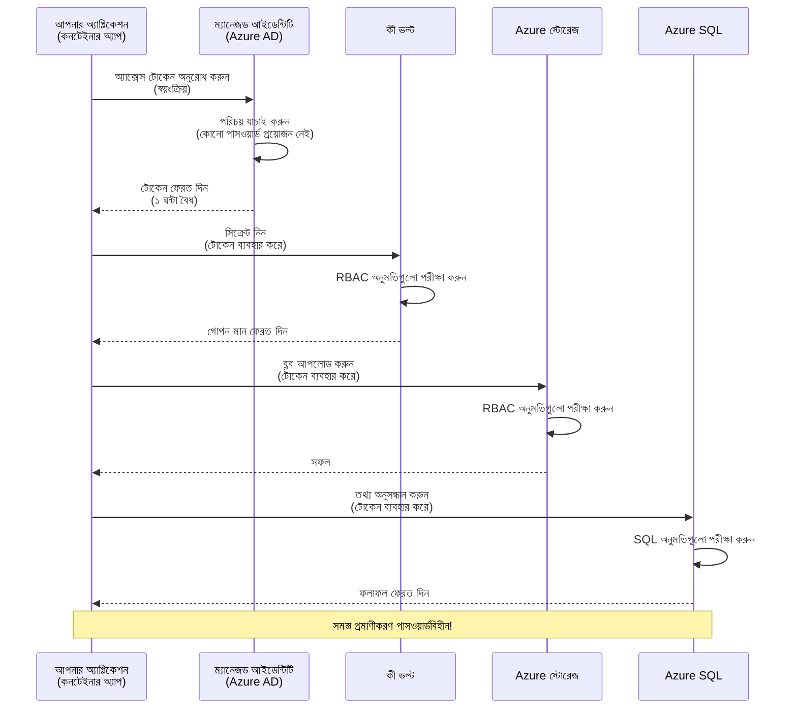
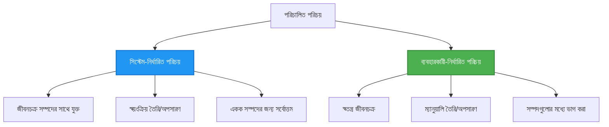

# Authentication Patterns and Managed Identity

⏱️ **Estimated Time**: 45-60 minutes | 💰 **Cost Impact**: Free (no additional charges) | ⭐ **Complexity**: Intermediate

**📚 Learning Path:**
- ← Previous: [কনফিগারেশন ম্যানেজমেন্ট](configuration.md) - পরিবেশ ভেরিয়েবল এবং সিক্রেটস পরিচালনা
- 🎯 **আপনি এখানে আছেন**: Authentication & Security (Managed Identity, Key Vault, secure patterns)
- → Next: [প্রথম প্রকল্প](first-project.md) - আপনার প্রথম AZD অ্যাপ্লিকেশন তৈরি করুন
- 🏠 [কোর্স হোম](../../README.md)

---

## আপনি কি শিখবেন

এই পাঠ শেষ করলে আপনি:
- Azure authentication প্যাটার্নসমূহ (keys, connection strings, managed identity) বুঝতে পারবেন
- পাসওয়ার্ডবিহীন authentication-এর জন্য **Managed Identity** বাস্তবায়ন করতে পারবেন
- **Azure Key Vault** ইন্টিগ্রেশন দিয়ে সিক্রেটস নিরাপদে রাখতে পারবেন
- AZD ডিপ্লয়মেন্টগুলোর জন্য **রোল-ভিত্তিক অ্যাক্সেস কন্ট্রোল (RBAC)** কনফিগার করতে পারবেন
- Container Apps এবং Azure সার্ভিসগুলিতে নিরাপত্তার সেরা অনুশীলন প্রয়োগ করবেন
- কী-ভিত্তিক থেকে পরিচয়-ভিত্তিক authentication এ মাইগ্রেট করতে পারবেন

## কেন Managed Identity গুরুত্বপূর্ণ

### সমস্যা: ঐতিহ্যবাহী Authentication

**Managed Identity-এর আগে:**
```javascript
// ❌ নিরাপত্তার ঝুঁকি: কোডে হার্ডকোড করা গোপন তথ্য
const connectionString = "Server=mydb.database.windows.net;User=admin;Password=P@ssw0rd123";
const storageKey = "xK7mN9pQ2wR5tY8uI0oP3aS6dF1gH4jK...";
const cosmosKey = "C2x7B9n4M1p8Q5w3E6r0T2y5U8i1O4p7...";
```

**সমস্যাগুলো:**
- 🔴 **কোডে বা কনফিগে সিক্রেটস প্রকাশিত** থাকে
- 🔴 **ক্রেডেনশিয়াল রোটেশন** করতে কোড পরিবর্তন ও পুনরায় ডিপ্লয় করতে হয়
- 🔴 **অডিট সমস্যার সৃষ্টি** - কে কী কখন অ্যাক্সেস করেছে?
- 🔴 **বিভাজন** - সিক্রেটস অনেক সিস্টেমে ছড়িয়ে আছে
- 🔴 **কমপ্লায়েন্স ঝুঁকি** - সিকিউরিটি অডিটে ব্যর্থ হওয়ার সম্ভাবনা

### সমাধান: Managed Identity

**Managed Identity-এর পরে:**
```javascript
// ✅ নিরাপদ: কোডে কোনো গোপন নেই
const credential = new DefaultAzureCredential();
const client = new BlobServiceClient(
  "https://mystorageaccount.blob.core.windows.net",
  credential  // Azure স্বয়ংক্রিয়ভাবে প্রমাণীকরণ পরিচালনা করে
);
```

**সুবিধাসমূহ:**
- ✅ **কোড বা কনফিগে কোন সিক্রেট নেই**
- ✅ **স্বয়ংক্রিয় রোটেশন** - Azure এটি পরিচালনা করে
- ✅ **পুরো অডিট ট্রেইল** Azure AD লগে থাকে
- ✅ **কেন্দ্রীভূত নিরাপত্তা** - Azure পোর্টালে পরিচালনা করা যায়
- ✅ **কমপ্লায়েন্স-রেডি** - নিরাপত্তা মান পূরণ করে

**উপমা**: ঐতিহ্যবাহী authentication অনেক দরজার জন্য বিভিন্ন ফিজিক্যাল চাবি বহন করার মত। Managed Identity হলো একটি সিকিউরিটি ব্যাজ যা স্বয়ংক্রিয়ভাবে আপনার পরিচয়ের উপর ভিত্তি করে অ্যাক্সেস দেয় — কোন চাবি হারানোর, কপি করার বা রোটেট করার প্রয়োজন নেই।

---

## স্থাপত্য সংক্ষিপ্ত আলোচনা

### Managed Identity সহ Authentication ফ্লো


### Managed Identities-এর ধরন


| Feature | System-Assigned | User-Assigned |
|---------|----------------|---------------|
| **Lifecycle** | রিসোর্সের সাথে যুক্ত | স্বাধীন |
| **Creation** | রিসোর্সের সাথে স্বয়ংক্রিয় | ম্যানুয়ালি তৈরি করা হয় |
| **Deletion** | রিসোর্স মুছলে মুছে যায় | রিসোর্স মুছে গেলে থেকেও থাকে |
| **Sharing** | শুধুমাত্র একটি রিসোর্স | একাধিক রিসোর্সে শেয়ার করা যায় |
| **Use Case** | সহজ পরিস্থিতির জন্য | জটিল বহু-রিসোর্স পরিস্থিতির জন্য |
| **AZD Default** | ✅ সুপারিশকৃত | ঐচ্ছিক |

---

## পূর্বশর্ত

### প্রয়োজনীয় টুলস

আপনার কাছে আগের পাঠ থেকে নিচেরগুলো ইনস্টল করা থাকতে হবে:

```bash
# Azure Developer CLI যাচাই করুন
azd version
# ✅ প্রত্যাশিত: azd সংস্করণ 1.0.0 বা তার উচ্চতর

# Azure CLI যাচাই করুন
az --version
# ✅ প্রত্যাশিত: azure-cli সংস্করণ 2.50.0 বা তার উচ্চতর
```

### Azure প্রয়োজনীয়তা

- সক্রিয় Azure সাবস্ক্রিপশন
- অনুমতিসমূহ:
  - Managed identities তৈরি করার ক্ষমতা
  - RBAC রোল নিয়োগ করার ক্ষমতা
  - Key Vault রিসোর্স তৈরি করার ক্ষমতা
  - Container Apps ডিপ্লয় করার ক্ষমতা

### জ্ঞানের পূর্বশর্ত

আপনি নিম্নলিখিতগুলো সম্পন্ন করে থাকতে হবে:
- [ইনস্টলেশন গাইড](installation.md) - AZD সেটআপ
- [AZD বেসিকস](azd-basics.md) - মূল ধারণাগুলো
- [কনফিগারেশন ম্যানেজমেন্ট](configuration.md) - পরিবেশ ভেরিয়েবলস

---

## পাঠ 1: Authentication প্যাটার্নগুলো বোঝা

### প্যাটার্ন 1: Connection Strings (পূরোনো - এড়িয়ে চলুন)

**এটি কীভাবে কাজ করে:**
```bash
# সংযোগ স্ট্রিং-এ শংসাপত্র রয়েছে
STORAGE_CONNECTION_STRING="DefaultEndpointsProtocol=https;AccountName=myaccount;AccountKey=xK7mN9pQ2wR5..."
COSMOS_CONNECTION_STRING="AccountEndpoint=https://myaccount.documents.azure.com:443/;AccountKey=C2x7..."
SQL_CONNECTION_STRING="Server=myserver.database.windows.net;User=admin;Password=P@ssw0rd..."
```

**সমস্যাগুলো:**
- ❌ পরিবেশ ভেরিয়েবলস-এ সিক্রেটস দৃশ্যমান
- ❌ ডিপ্লয়মেন্ট সিস্টেমে লগ হওয়া
- ❌ রোটেট করা কঠিন
- ❌ অ্যাক্সেসের কোন অডিট ট্রেইল নেই

**কখন ব্যবহার করবেন:** শুধুমাত্র লোকাল ডেভেলপমেন্টের জন্য, কখনো প্রোডাকশনে নয়।

---

### প্যাটার্ন 2: Key Vault References (ভাল)

**এটি কীভাবে কাজ করে:**
```bicep
// Store secret in Key Vault
resource keyVault 'Microsoft.KeyVault/vaults@2023-02-01' = {
  name: 'mykv'
  properties: {
    enableRbacAuthorization: true
  }
}

// Reference in Container App
env: [
  {
    name: 'STORAGE_KEY'
    secretRef: 'storage-key'  // References Key Vault
  }
]
```

**সুবিধাসমূহ:**
- ✅ সিক্রেটস Key Vault-এ নিরাপদে সংরক্ষিত থাকে
- ✅ কেন্দ্রীভূত সিক্রেট ব্যবস্থাপনা
- ✅ কোড পরিবর্তন ছাড়া রোটেশন সম্ভব

**সীমাবদ্ধতা:**
- ⚠️ এখনও কী/পাসওয়ার্ড ব্যবহার করা হচ্ছে
- ⚠️ Key Vault অ্যাক্সেস পরিচালনা করতে হবে

**কখন ব্যবহার করবেন:** connection strings থেকে managed identity তে ট্রানজিশন করার ধাপ হিসেবে।

---

### প্যাটার্ন 3: Managed Identity (সেরা অনুশীলন)

**এটি কীভাবে কাজ করে:**
```bicep
// Enable managed identity
resource containerApp 'Microsoft.App/containerApps@2023-05-01' = {
  name: 'myapp'
  identity: {
    type: 'SystemAssigned'  // Automatically creates identity
  }
}

// Grant permissions
resource roleAssignment 'Microsoft.Authorization/roleAssignments@2022-04-01' = {
  scope: storageAccount
  properties: {
    roleDefinitionId: storageBlobDataContributorRole
    principalId: containerApp.identity.principalId
  }
}
```

**অ্যাপ্লিকেশন কোড:**
```javascript
// কোনও গোপন তথ্যের দরকার নেই!
const { DefaultAzureCredential } = require('@azure/identity');
const { BlobServiceClient } = require('@azure/storage-blob');

const credential = new DefaultAzureCredential();
const blobServiceClient = new BlobServiceClient(
  'https://mystorageaccount.blob.core.windows.net',
  credential
);
```

**সুবিধাসমূহ:**
- ✅ কোড/কনফিগে কোন সিক্রেট নেই
- ✅ স্বয়ংক্রিয় ক্রেডেনশিয়াল রোটেশন
- ✅ পূর্ণ অডিট ট্রেইল
- ✅ RBAC-ভিত্তিক অনুমতিসমূহ
- ✅ কমপ্লায়েন্স-রেডি

**কখন ব্যবহার করবেন:** সর্বদা, প্রোডাকশন অ্যাপ্লিকেশনগুলোর জন্য।

---

## পাঠ 2: AZD সহ Managed Identity বাস্তবায়ন

### ধাপে ধাপে বাস্তবায়ন

চলুন একটি নিরাপদ Container App তৈরি করি যা managed identity ব্যবহার করে Azure Storage এবং Key Vault-এ অ্যাক্সেস করে।

### প্রকল্প গঠন

```
secure-app/
├── azure.yaml                 # AZD configuration
├── infra/
│   ├── main.bicep            # Main infrastructure
│   ├── core/
│   │   ├── identity.bicep    # Managed identity setup
│   │   ├── keyvault.bicep    # Key Vault configuration
│   │   └── storage.bicep     # Storage with RBAC
│   └── app/
│       └── container-app.bicep
└── src/
    ├── app.js                # Application code
    ├── package.json
    └── Dockerfile
```

### 1. AZD কনফিগার করুন (azure.yaml)

```yaml
name: secure-app
metadata:
  template: secure-app@1.0.0

services:
  api:
    project: ./src
    language: js
    host: containerapp

# Enable managed identity (AZD handles this automatically)
```

### 2. ইনফ্রাস্ট্রাকচার: Managed Identity সক্রিয় করা

**File: `infra/main.bicep`**

```bicep
targetScope = 'subscription'

param environmentName string
param location string = 'eastus'

var tags = { 'azd-env-name': environmentName }

// Resource group
resource rg 'Microsoft.Resources/resourceGroups@2021-04-01' = {
  name: 'rg-${environmentName}'
  location: location
  tags: tags
}

// Storage Account
module storage './core/storage.bicep' = {
  name: 'storage'
  scope: rg
  params: {
    name: 'st${uniqueString(rg.id)}'
    location: location
    tags: tags
  }
}

// Key Vault
module keyVault './core/keyvault.bicep' = {
  name: 'keyvault'
  scope: rg
  params: {
    name: 'kv-${uniqueString(rg.id)}'
    location: location
    tags: tags
  }
}

// Container App with Managed Identity
module containerApp './app/container-app.bicep' = {
  name: 'container-app'
  scope: rg
  params: {
    name: 'ca-${environmentName}'
    location: location
    tags: tags
    storageAccountName: storage.outputs.name
    keyVaultName: keyVault.outputs.name
  }
}

// Grant Container App access to Storage
module storageRoleAssignment './core/role-assignment.bicep' = {
  name: 'storage-role'
  scope: rg
  params: {
    principalId: containerApp.outputs.identityPrincipalId
    roleDefinitionId: 'ba92f5b4-2d11-453d-a403-e96b0029c9fe'  // Storage Blob Data Contributor
    targetResourceId: storage.outputs.id
  }
}

// Grant Container App access to Key Vault
module kvRoleAssignment './core/role-assignment.bicep' = {
  name: 'kv-role'
  scope: rg
  params: {
    principalId: containerApp.outputs.identityPrincipalId
    roleDefinitionId: '4633458b-17de-408a-b874-0445c86b69e6'  // Key Vault Secrets User
    targetResourceId: keyVault.outputs.id
  }
}

// Outputs
output AZURE_STORAGE_ACCOUNT_NAME string = storage.outputs.name
output AZURE_KEY_VAULT_NAME string = keyVault.outputs.name
output APP_URL string = containerApp.outputs.url
```

### 3. System-Assigned Identity সহ Container App

**File: `infra/app/container-app.bicep`**

```bicep
param name string
param location string
param tags object = {}
param storageAccountName string
param keyVaultName string

resource containerApp 'Microsoft.App/containerApps@2023-05-01' = {
  name: name
  location: location
  tags: tags
  identity: {
    type: 'SystemAssigned'  // 🔑 Enable managed identity
  }
  properties: {
    configuration: {
      ingress: {
        external: true
        targetPort: 3000
      }
    }
    template: {
      containers: [
        {
          name: 'api'
          image: 'myregistry.azurecr.io/api:latest'
          resources: {
            cpu: json('0.5')
            memory: '1Gi'
          }
          env: [
            {
              name: 'AZURE_STORAGE_ACCOUNT_NAME'
              value: storageAccountName
            }
            {
              name: 'AZURE_KEY_VAULT_NAME'
              value: keyVaultName
            }
            // 🔑 No secrets - managed identity handles authentication!
          ]
        }
      ]
    }
  }
}

// Output the identity for RBAC assignments
output identityPrincipalId string = containerApp.identity.principalId
output id string = containerApp.id
output url string = 'https://${containerApp.properties.configuration.ingress.fqdn}'
```

### 4. RBAC রোল অ্যাসাইনমেন্ট মডিউল

**File: `infra/core/role-assignment.bicep`**

```bicep
param principalId string
param roleDefinitionId string  // Azure built-in role ID
param targetResourceId string

resource roleAssignment 'Microsoft.Authorization/roleAssignments@2022-04-01' = {
  name: guid(principalId, roleDefinitionId, targetResourceId)
  scope: resourceId('Microsoft.Resources/resourceGroups', resourceGroup().name)
  properties: {
    roleDefinitionId: subscriptionResourceId('Microsoft.Authorization/roleDefinitions', roleDefinitionId)
    principalId: principalId
    principalType: 'ServicePrincipal'
  }
}

output id string = roleAssignment.id
```

### 5. Managed Identity সহ অ্যাপ্লিকেশন কোড

**File: `src/app.js`**

```javascript
const express = require('express');
const { DefaultAzureCredential } = require('@azure/identity');
const { BlobServiceClient } = require('@azure/storage-blob');
const { SecretClient } = require('@azure/keyvault-secrets');

const app = express();
const PORT = process.env.PORT || 3000;

// 🔑 প্রমাণপত্র আরম্ভ করুন (ম্যানেজড আইডেন্টিটির মাধ্যমে স্বয়ংক্রিয়ভাবে কাজ করে)
const credential = new DefaultAzureCredential();

// Azure স্টোরেজ সেটআপ
const storageAccountName = process.env.AZURE_STORAGE_ACCOUNT_NAME;
const blobServiceClient = new BlobServiceClient(
  `https://${storageAccountName}.blob.core.windows.net`,
  credential  // কোনো কী প্রয়োজন নেই!
);

// Key Vault সেটআপ
const keyVaultName = process.env.AZURE_KEY_VAULT_NAME;
const secretClient = new SecretClient(
  `https://${keyVaultName}.vault.azure.net`,
  credential  // কোনো কী প্রয়োজন নেই!
);

// স্বাস্থ্য পরীক্ষা
app.get('/health', (req, res) => {
  res.json({ status: 'healthy', authentication: 'managed-identity' });
});

// ব্লব স্টোরেজে ফাইল আপলোড করুন
app.post('/upload', async (req, res) => {
  try {
    const containerClient = blobServiceClient.getContainerClient('uploads');
    await containerClient.createIfNotExists();
    
    const blobName = `file-${Date.now()}.txt`;
    const blockBlobClient = containerClient.getBlockBlobClient(blobName);
    
    await blockBlobClient.upload('Hello from managed identity!', 30);
    
    res.json({
      success: true,
      blobName: blobName,
      message: 'File uploaded using managed identity!'
    });
  } catch (error) {
    console.error('Upload error:', error);
    res.status(500).json({ error: error.message });
  }
});

// Key Vault থেকে সিক্রেট নিন
app.get('/secret/:name', async (req, res) => {
  try {
    const secretName = req.params.name;
    const secret = await secretClient.getSecret(secretName);
    
    res.json({
      name: secretName,
      value: secret.value,
      message: 'Secret retrieved using managed identity!'
    });
  } catch (error) {
    console.error('Secret error:', error);
    res.status(500).json({ error: error.message });
  }
});

// ব্লব কনটেইনারগুলির তালিকা (পঠন অ্যাক্সেস প্রদর্শন করে)
app.get('/containers', async (req, res) => {
  try {
    const containers = [];
    for await (const container of blobServiceClient.listContainers()) {
      containers.push(container.name);
    }
    
    res.json({
      containers: containers,
      count: containers.length,
      message: 'Containers listed using managed identity!'
    });
  } catch (error) {
    console.error('List error:', error);
    res.status(500).json({ error: error.message });
  }
});

app.listen(PORT, () => {
  console.log(`Secure API listening on port ${PORT}`);
  console.log('Authentication: Managed Identity (passwordless)');
});
```

**File: `src/package.json`**

```json
{
  "name": "secure-app",
  "version": "1.0.0",
  "dependencies": {
    "express": "^4.18.2",
    "@azure/identity": "^4.0.0",
    "@azure/storage-blob": "^12.17.0",
    "@azure/keyvault-secrets": "^4.7.0"
  },
  "scripts": {
    "start": "node app.js"
  }
}
```

### 6. ডিপ্লয় এবং টেস্ট

```bash
# AZD পরিবেশ শুরু করুন
azd init

# অবকাঠামো এবং অ্যাপ্লিকেশন স্থাপন করুন
azd up

# অ্যাপের URL পান
APP_URL=$(azd env get-values | grep APP_URL | cut -d '=' -f2 | tr -d '"')

# হেলথ চেক পরীক্ষা করুন
curl $APP_URL/health
```

**✅ প্রত্যাশিত আউটপুট:**
```json
{
  "status": "healthy",
  "authentication": "managed-identity"
}
```

**ব্লব আপলোড টেস্ট:**
```bash
curl -X POST $APP_URL/upload
```

**✅ প্রত্যাশিত আউটপুট:**
```json
{
  "success": true,
  "blobName": "file-1700404800000.txt",
  "message": "File uploaded using managed identity!"
}
```

**কন্টেইনার তালিকা টেস্ট:**
```bash
curl $APP_URL/containers
```

**✅ প্রত্যাশিত আউটপুট:**
```json
{
  "containers": ["uploads"],
  "count": 1,
  "message": "Containers listed using managed identity!"
}
```

---

## সাধারণ Azure RBAC রোলসমূহ

### Managed Identity-এর জন্য বিল্ট-ইন রোল আইডি

| Service | Role Name | Role ID | Permissions |
|---------|-----------|---------|-------------|
| **Storage** | Storage Blob Data Reader | `2a2b9908-6b94-4a3d-8e5a-a7d8f8cc8a12` | ব্লব এবং কন্টেইনার পড়া |
| **Storage** | Storage Blob Data Contributor | `ba92f5b4-2d11-453d-a403-e96b0029c9fe` | ব্লবগুলি পড়া, লেখা, মুছা |
| **Storage** | Storage Queue Data Contributor | `974c5e8b-45b9-4653-ba55-5f855dd0fb88` | কিউ মেসেজ পড়া, লেখা, মুছা |
| **Key Vault** | Key Vault Secrets User | `4633458b-17de-408a-b874-0445c86b69e6` | সিক্রেটস পড়ার অনুমতি |
| **Key Vault** | Key Vault Secrets Officer | `b86a8fe4-44ce-4948-aee5-eccb2c155cd7` | সিক্রেটস পড়া, লেখা, মুছা |
| **Cosmos DB** | Cosmos DB Built-in Data Reader | `00000000-0000-0000-0000-000000000001` | Cosmos DB ডেটা পড়া |
| **Cosmos DB** | Cosmos DB Built-in Data Contributor | `00000000-0000-0000-0000-000000000002` | Cosmos DB ডেটা পড়া, লেখা |
| **SQL Database** | SQL DB Contributor | `9b7fa17d-e63e-47b0-bb0a-15c516ac86ec` | SQL ডেটাবেস পরিচালনা |
| **Service Bus** | Azure Service Bus Data Owner | `090c5cfd-751d-490a-894a-3ce6f1109419` | মেসেজ পাঠানো, গ্রহন, পরিচালনা করা |

### কিভাবে রোল আইডি খুঁজে পাবেন

```bash
# সমস্ত বিল্ট-ইন রোল তালিকাভুক্ত করুন
az role definition list --query "[].{Name:roleName, ID:name}" --output table

# নির্দিষ্ট রোল অনুসন্ধান করুন
az role definition list --query "[?contains(roleName, 'Storage Blob')].{Name:roleName, ID:name}" --output table

# রোলের বিস্তারিত তথ্য পান
az role definition list --name "Storage Blob Data Contributor"
```

---

## ব্যবহারিক অনুশীলন

### অনুশীলন 1: বিদ্যমান অ্যাপে Managed Identity সক্রিয় করুন ⭐⭐ (মাঝারি)

**লক্ষ্য**: বিদ্যমান Container App ডিপ্লয়মেন্টে managed identity যোগ করা

**পটভূমি**: আপনার কাছে একটি Container App আছে যা connection strings ব্যবহার করছে। এটিকে managed identity-তে রূপান্তর করুন।

**শুরু করার পয়েন্ট**: নিম্নলিখিত কনফিগারেশন সহ Container App:

```bicep
// ❌ Current: Using connection string
env: [
  {
    name: 'STORAGE_CONNECTION_STRING'
    secretRef: 'storage-connection'
  }
]
```

**ধাপসমূহ**:

1. **Bicep-এ managed identity সক্ষম করুন:**

```bicep
resource containerApp 'Microsoft.App/containerApps@2023-05-01' = {
  name: 'myapp'
  identity: {
    type: 'SystemAssigned'  // Add this
  }
  // ... rest of configuration
}
```

2. **Storage অ্যাক্সেস দিন:**

```bicep
// Get storage account reference
resource storageAccount 'Microsoft.Storage/storageAccounts@2023-01-01' existing = {
  name: storageAccountName
}

// Assign role
resource roleAssignment 'Microsoft.Authorization/roleAssignments@2022-04-01' = {
  name: guid(containerApp.id, 'ba92f5b4-2d11-453d-a403-e96b0029c9fe', storageAccount.id)
  scope: storageAccount
  properties: {
    roleDefinitionId: subscriptionResourceId('Microsoft.Authorization/roleDefinitions', 'ba92f5b4-2d11-453d-a403-e96b0029c9fe')
    principalId: containerApp.identity.principalId
    principalType: 'ServicePrincipal'
  }
}
```

3. **অ্যাপ্লিকেশন কোড আপডেট করুন:**

**আগে (connection string):**
```javascript
const { BlobServiceClient } = require('@azure/storage-blob');

const blobServiceClient = BlobServiceClient.fromConnectionString(
  process.env.STORAGE_CONNECTION_STRING
);
```

**পরে (managed identity):**
```javascript
const { DefaultAzureCredential } = require('@azure/identity');
const { BlobServiceClient } = require('@azure/storage-blob');

const credential = new DefaultAzureCredential();
const blobServiceClient = new BlobServiceClient(
  `https://${process.env.STORAGE_ACCOUNT_NAME}.blob.core.windows.net`,
  credential
);
```

4. **পরিবেশ ভেরিয়েবল আপডেট করুন:**

```bicep
env: [
  {
    name: 'STORAGE_ACCOUNT_NAME'
    value: storageAccountName  // Just the name, no secrets!
  }
  // Remove STORAGE_CONNECTION_STRING
]
```

5. **ডিপ্লয় এবং টেস্ট করুন:**

```bash
# পুনরায় স্থাপন
azd up

# এটি এখনও কাজ করছে কিনা পরীক্ষা করুন
curl https://myapp.azurecontainerapps.io/upload
```

**✅ সফলতা মানদণ্ড:**
- ✅ অ্যাপ্লিকেশন ত্রুটি ছাড়া ডিপ্লয় হয়
- ✅ Storage অপারেশন কাজ করে (আপলোড, তালিকা, ডাউনলোড)
- ✅ পরিবেশ ভেরিয়েবলস-এ কোন connection strings নেই
- ✅ Azure Portal-এ "Identity" ব্লেডে আইডেন্টিটি দৃশ্যমান

**যাচাইবাছাই:**

```bash
# নিশ্চিত করুন ম্যানেজড আইডেন্টিটি সক্রিয় আছে
az containerapp show \
  --name myapp \
  --resource-group rg-myapp \
  --query "identity.type"
# ✅ প্রত্যাশিত: "SystemAssigned"

# রোল অ্যাসাইনমেন্ট পরীক্ষা করুন
az role assignment list \
  --assignee $(az containerapp show --name myapp --resource-group rg-myapp --query "identity.principalId" -o tsv) \
  --scope /subscriptions/{sub-id}/resourceGroups/rg-myapp/providers/Microsoft.Storage/storageAccounts/mystorageaccount
# ✅ প্রত্যাশিত: "Storage Blob Data Contributor" ভূমিকা প্রদর্শন করে
```

**সময়**: 20-30 মিনিট

---

### অনুশীলন 2: User-Assigned Identity দিয়ে বহু-সার্ভিস অ্যাক্সেস ⭐⭐⭐ (অ্যাডভান্সড)

**লক্ষ্য**: একাধিক Container App-এ শেয়ার করার জন্য একটি user-assigned identity তৈরি করা

**পটভূমি**: আপনার কাছে 3টি মাইক্রোসার্ভিস আছে যা একই Storage অ্যাকাউন্ট এবং Key Vault অ্যাক্সেস করতে হবে।

**ধাপসমূহ**:

1. **user-assigned identity তৈরি করুন:**

**File: `infra/core/identity.bicep`**

```bicep
param name string
param location string
param tags object = {}

resource userAssignedIdentity 'Microsoft.ManagedIdentity/userAssignedIdentities@2023-01-31' = {
  name: name
  location: location
  tags: tags
}

output id string = userAssignedIdentity.id
output principalId string = userAssignedIdentity.properties.principalId
output clientId string = userAssignedIdentity.properties.clientId
```

2. **user-assigned identity-কে রোল অ্যাসাইন করুন:**

```bicep
// In main.bicep
module userIdentity './core/identity.bicep' = {
  name: 'user-identity'
  scope: rg
  params: {
    name: 'id-${environmentName}'
    location: location
    tags: tags
  }
}

// Grant Storage access
resource storageRoleAssignment 'Microsoft.Authorization/roleAssignments@2022-04-01' = {
  name: guid(userIdentity.outputs.principalId, 'storage-contributor')
  scope: storageAccount
  properties: {
    roleDefinitionId: subscriptionResourceId('Microsoft.Authorization/roleDefinitions', 'ba92f5b4-2d11-453d-a403-e96b0029c9fe')
    principalId: userIdentity.outputs.principalId
    principalType: 'ServicePrincipal'
  }
}

// Grant Key Vault access
resource kvRoleAssignment 'Microsoft.Authorization/roleAssignments@2022-04-01' = {
  name: guid(userIdentity.outputs.principalId, 'kv-secrets-user')
  scope: keyVault
  properties: {
    roleDefinitionId: subscriptionResourceId('Microsoft.Authorization/roleDefinitions', '4633458b-17de-408a-b874-0445c86b69e6')
    principalId: userIdentity.outputs.principalId
    principalType: 'ServicePrincipal'
  }
}
```

3. ** একাধিক Container Apps-এ identity নিয়োগ করুন:**

```bicep
resource apiGateway 'Microsoft.App/containerApps@2023-05-01' = {
  name: 'api-gateway'
  identity: {
    type: 'UserAssigned'
    userAssignedIdentities: {
      '${userIdentity.outputs.id}': {}
    }
  }
  // ... rest of config
}

resource productService 'Microsoft.App/containerApps@2023-05-01' = {
  name: 'product-service'
  identity: {
    type: 'UserAssigned'
    userAssignedIdentities: {
      '${userIdentity.outputs.id}': {}
    }
  }
  // ... rest of config
}

resource orderService 'Microsoft.App/containerApps@2023-05-01' = {
  name: 'order-service'
  identity: {
    type: 'UserAssigned'
    userAssignedIdentities: {
      '${userIdentity.outputs.id}': {}
    }
  }
  // ... rest of config
}
```

4. **অ্যাপ্লিকেশন কোড (সব সার্ভিস একই প্যাটার্ন ব্যবহার করবে):**

```javascript
const { DefaultAzureCredential, ManagedIdentityCredential } = require('@azure/identity');

// ব্যবহারকারী-নির্ধারিত আইডেন্টিটির জন্য ক্লায়েন্ট আইডি নির্দিষ্ট করুন
const credential = new ManagedIdentityCredential(
  process.env.AZURE_CLIENT_ID  // ব্যবহারকারী-নির্ধারিত আইডেন্টিটির ক্লায়েন্ট আইডি
);

// অথবা DefaultAzureCredential ব্যবহার করুন (স্বয়ংক্রিয়ভাবে সনাক্ত করে)
const credential = new DefaultAzureCredential();

const blobServiceClient = new BlobServiceClient(
  `https://${process.env.STORAGE_ACCOUNT_NAME}.blob.core.windows.net`,
  credential
);
```

5. **ডিপ্লয় ও যাচাই করুন:**

```bash
azd up

# সব পরিষেবা স্টোরেজে অ্যাক্সেস করতে পারে কিনা পরীক্ষা করুন
curl https://api-gateway.azurecontainerapps.io/upload
curl https://product-service.azurecontainerapps.io/upload
curl https://order-service.azurecontainerapps.io/upload
```

**✅ সফলতা মানদণ্ড:**
- ✅ 3টি সার্ভিস জুড়ে একটি আইডেন্টিটি শেয়ার করা হয়েছে
- ✅ সব সার্ভিস Storage এবং Key Vault অ্যাক্সেস করতে পারে
- ✅ একটি সার্ভিস মুছে দিলেও আইডেন্টিটি টিকেই থাকে
- ✅ কেন্দ্রিয়কৃত অনুমতি পরিচালনা সম্ভব

**User-Assigned Identity-এর সুবিধা:**
- একটি আইডেন্টিটি ব্যবস্থাপনা করার জন্য
- সার্ভিসগুলোর মধ্যে নিরবচ্ছিন্ন অনুমতিসমতা
- সার্ভিস মুছে গেলে টিকে থাকে
- জটিল আর্কিটেকচারের জন্য ভালো

**সময়**: 30-40 মিনিট

---

### অনুশীলন 3: Key Vault সিক্রেট রোটেশন বাস্তবায়ন করুন ⭐⭐⭐ (অ্যাডভান্সড)

**লক্ষ্য**: তৃতীয়-পর্যায়ের API কীগুলো Key Vault-এ সংরক্ষণ করে managed identity দিয়ে অ্যাক্সেস করা

**পটভূমি**: আপনার অ্যাপ একটি বাহ্যিক API (OpenAI, Stripe, SendGrid) কল করে যা API কী প্রয়োজন।

**ধাপসমূহ**:

1. **RBAC সহ Key Vault তৈরি করুন:**

**File: `infra/core/keyvault.bicep`**

```bicep
param name string
param location string
param tags object = {}

resource keyVault 'Microsoft.KeyVault/vaults@2023-02-01' = {
  name: name
  location: location
  tags: tags
  properties: {
    enableRbacAuthorization: true  // Use RBAC instead of access policies
    sku: {
      family: 'A'
      name: 'standard'
    }
    tenantId: subscription().tenantId
    enableSoftDelete: true
    softDeleteRetentionInDays: 90
  }
}

// Allow Container App to read secrets
output id string = keyVault.id
output name string = keyVault.name
output uri string = keyVault.properties.vaultUri
```

2. **Key Vault-এ সিক্রেটস সংরক্ষণ করুন:**

```bash
# Key Vault নাম নিন
KV_NAME=$(azd env get-values | grep AZURE_KEY_VAULT_NAME | cut -d '=' -f2 | tr -d '"')

# তৃতীয় পক্ষের API কী সংরক্ষণ করুন
az keyvault secret set \
  --vault-name $KV_NAME \
  --name "OpenAI-ApiKey" \
  --value "sk-proj-xxxxxxxxxxxxx"

az keyvault secret set \
  --vault-name $KV_NAME \
  --name "Stripe-ApiKey" \
  --value "sk_live_xxxxxxxxxxxxx"

az keyvault secret set \
  --vault-name $KV_NAME \
  --name "SendGrid-ApiKey" \
  --value "SG.xxxxxxxxxxxxx"
```

3. **সিক্রেটস রিট্রিভ করার জন্য অ্যাপ্লিকেশন কোড:**

**File: `src/config.js`**

```javascript
const { DefaultAzureCredential } = require('@azure/identity');
const { SecretClient } = require('@azure/keyvault-secrets');

class Config {
  constructor() {
    this.credential = new DefaultAzureCredential();
    this.secretClient = new SecretClient(
      `https://${process.env.AZURE_KEY_VAULT_NAME}.vault.azure.net`,
      this.credential
    );
    this.cache = {};
  }

  async getSecret(secretName) {
    // প্রথমে ক্যাশ পরীক্ষা করুন
    if (this.cache[secretName]) {
      return this.cache[secretName];
    }

    try {
      const secret = await this.secretClient.getSecret(secretName);
      this.cache[secretName] = secret.value;
      console.log(`✅ Retrieved secret: ${secretName}`);
      return secret.value;
    } catch (error) {
      console.error(`❌ Failed to get secret ${secretName}:`, error.message);
      throw error;
    }
  }

  async getOpenAIKey() {
    return this.getSecret('OpenAI-ApiKey');
  }

  async getStripeKey() {
    return this.getSecret('Stripe-ApiKey');
  }

  async getSendGridKey() {
    return this.getSecret('SendGrid-ApiKey');
  }
}

module.exports = new Config();
```

4. **অ্যাপ্লিকেশনে সিক্রেটস ব্যবহার করুন:**

**File: `src/app.js`**

```javascript
const express = require('express');
const config = require('./config');
const { OpenAI } = require('openai');

const app = express();

// Key Vault থেকে কী ব্যবহার করে OpenAI ইনিশিয়ালাইজ করুন
let openaiClient;

async function initializeServices() {
  const openaiKey = await config.getOpenAIKey();
  openaiClient = new OpenAI({ apiKey: openaiKey });
  console.log('✅ Services initialized with secrets from Key Vault');
}

// স্টার্টআপে কল করুন
initializeServices().catch(console.error);

app.post('/chat', async (req, res) => {
  try {
    const completion = await openaiClient.chat.completions.create({
      model: 'gpt-4',
      messages: [{ role: 'user', content: 'Hello!' }]
    });
    
    res.json({
      response: completion.choices[0].message.content,
      authentication: 'Key from Key Vault via Managed Identity'
    });
  } catch (error) {
    res.status(500).json({ error: error.message });
  }
});

app.listen(3000, () => {
  console.log('Secure API with Key Vault integration running');
});
```

5. **ডিপ্লয় ও টেস্ট করুন:**

```bash
azd up

# পরীক্ষা করুন যে API কীগুলো কাজ করে
curl -X POST https://myapp.azurecontainerapps.io/chat \
  -H "Content-Type: application/json" \
  -d '{"message":"Hello AI"}'
```

**✅ সফলতা মানদণ্ড:**
- ✅ কোড বা পরিবেশ ভেরিয়েবলসে কোন API কী নেই
- ✅ অ্যাপ্লিকেশন Key Vault থেকে কীগুলো রিট্রিভ করে
- ✅ তৃতীয়-পর্যায়ের API সঠিকভাবে কাজ করে
- ✅ কী রোটেশন কোড পরিবর্তন ছাড়া করা যায়

**একটি সিক্রেট রোটেট করুন:**

```bash
# Key Vault-এ সিক্রেট আপডেট করুন
az keyvault secret set \
  --vault-name $KV_NAME \
  --name "OpenAI-ApiKey" \
  --value "sk-proj-NEW_KEY_HERE"

# নতুন কী গ্রহণ করার জন্য অ্যাপটি পুনরায় চালু করুন
az containerapp revision restart \
  --name myapp \
  --resource-group rg-myapp
```

**সময়**: 25-35 মিনিট

---

## জ্ঞান যাচাই পয়েন্ট

### 1. Authentication প্যাটার্ন ✓

আপনার বোঝাপড়া পরীক্ষা করুন:

- [ ] **Q1**: তিনটি প্রধান authentication প্যাটার্ন কী কী? 
  - **A**: Connection strings (পূরোনো), Key Vault references (ট্রানজিশন), Managed Identity (সেরা)

- [ ] **Q2**: managed identity কেন connection strings থেকে ভাল?
  - **A**: কোডে কোন সিক্রেট নেই, স্বয়ংক্রিয় রোটেশন, পূর্ণ অডিট ট্রেইল, RBAC অনুমতিসমূহ

- [ ] **Q3**: কখন আপনি system-assigned-এর পরিবর্তে user-assigned identity ব্যবহার করবেন?
  - **A**: যখন একাধিক রিসোর্সে আইডেন্টিটি শেয়ার করতে হয় অথবা আইডেন্টিটির লাইফসাইকেল রিসোর্সের লাইফসাইকেল থেকে স্বাধীন হওয়া প্রয়োজন

**হ্যান্ডস-অন ভেরিফিকেশন:**
```bash
# আপনার অ্যাপ কোন ধরণের পরিচয় ব্যবহার করে তা পরীক্ষা করুন
az containerapp show \
  --name myapp \
  --resource-group rg-myapp \
  --query "identity.type"

# পরিচয়ের জন্য সমস্ত ভূমিকা বরাদ্দ তালিকাভুক্ত করুন
az role assignment list \
  --assignee $(az containerapp show --name myapp --resource-group rg-myapp --query "identity.principalId" -o tsv)
```

---

### 2. RBAC এবং অনুমতিসমূহ ✓

আপনার বোঝাপড়া পরীক্ষা করুন:

- [ ] **Q1**: "Storage Blob Data Contributor" এর রোল আইডি কী?
  - **A**: `ba92f5b4-2d11-453d-a403-e96b0029c9fe`

- [ ] **Q2**: "Key Vault Secrets User" কি অনুমতি দেয়?
  - **A**: সিক্রেটস পড়ার রিড-ওনলি অ্যাক্সেস (ক্রিয়েট, আপডেট, মুছতে পারবে না)

- [ ] **Q3**: আপনি কিভাবে একটি Container App-কে Azure SQL অ্যাক্সেস দিবেন?
  - **A**: "SQL DB Contributor" রোল অ্যাসাইন করুন বা SQL-এর জন্য Azure AD authentication কনফিগার করুন

**হ্যান্ডস-অন ভেরিফিকেশন:**
```bash
# নির্দিষ্ট ভূমিকা খুঁজুন
az role definition list --name "Storage Blob Data Contributor"

# আপনার পরিচয়কে কোন কোন ভূমিকা বরাদ্দ করা হয়েছে তা পরীক্ষা করুন
PRINCIPAL_ID=$(az containerapp show --name myapp --resource-group rg-myapp --query "identity.principalId" -o tsv)
az role assignment list --assignee $PRINCIPAL_ID --output table
```

---

### 3. Key Vault ইন্টিগ্রেশন ✓
- [ ] **Q1**: কীভাবে আপনি access policies-এর পরিবর্তে Key Vault-এর জন্য RBAC সক্ষম করবেন?
  - **A**: Bicep-এ `enableRbacAuthorization: true` সেট করুন

- [ ] **Q2**: কোন Azure SDK লাইব্রেরি ম্যানেজড আইডেন্টিটি প্রমাণীকরণ পরিচালনা করে?
  - **A**: `@azure/identity` এবং `DefaultAzureCredential` ক্লাস

- [ ] **Q3**: Key Vault সিক্রেটগুলো ক্যাশে কতক্ষণ থাকে?
  - **A**: অ্যাপ্লিকেশন-নির্ভর; আপনার নিজস্ব ক্যাশিং কৌশল বাস্তবায়ন করুন

**প্রায়োগিক যাচাই:**
```bash
# Key Vault অ্যাক্সেস পরীক্ষা করুন
az keyvault secret show \
  --vault-name $KV_NAME \
  --name "OpenAI-ApiKey" \
  --query "value"

# RBAC সক্রিয় আছে কি না পরীক্ষা করুন
az keyvault show \
  --name $KV_NAME \
  --query "properties.enableRbacAuthorization"
# ✅ প্রত্যাশিত: true
```

---

## নিরাপত্তার সেরা অনুশীলন

### ✅ করণীয়:

1. **প্রোডাকশনে সর্বদা ম্যানেজড আইডেন্টিটি ব্যবহার করুন**
   ```bicep
   identity: {
     type: 'SystemAssigned'
   }
   ```

2. **কম-অনুমতির RBAC রোল ব্যবহার করুন**
   - সম্ভব হলে "Reader" রোল ব্যবহার করুন
   - প্রয়োজন না হলে "Owner" বা "Contributor" এড়িয়ে চলুন

3. **তৃতীয়-পক্ষের কী Key Vault-এ সংরক্ষণ করুন**
   ```javascript
   const apiKey = await secretClient.getSecret('ThirdPartyApiKey');
   ```

4. **অডিট লগিং সক্ষম করুন**
   ```bicep
   diagnosticSettings: {
     logs: [{ category: 'AuditEvent', enabled: true }]
   }
   ```

5. **dev/staging/prod এর জন্য আলাদা আইডেন্টিটি ব্যবহার করুন**
   ```bash
   azd env new dev
   azd env new staging
   azd env new prod
   ```

6. **নিয়মিত সিক্রেট রোটেট করুন**
   - Key Vault সিক্রেটগুলিতে মেয়াদ নির্ধারণ করুন
   - Azure Functions দিয়ে রোটেশন স্বয়ংক্রিয় করুন

### ❌ করবেন না:

1. **কখনও সিক্রেট হার্ডকোড করবেন না**
   ```javascript
   // ❌ খারাপ
   const apiKey = "sk-proj-xxxxxxxxxxxxx";
   ```

2. **প্রোডাকশনে কানেকশন স্ট্রিং ব্যবহার করবেন না**
   ```javascript
   // ❌ খারাপ
   BlobServiceClient.fromConnectionString(process.env.STORAGE_CONNECTION_STRING)
   ```

3. **অতিরিক্ত অনুমতি দেবেন না**
   ```bicep
   // ❌ BAD - too much access
   roleDefinitionId: 'Owner'
   
   // ✅ GOOD - least privilege
   roleDefinitionId: 'Storage Blob Data Reader'
   ```

4. **সিক্রেট লগ করবেন না**
   ```javascript
   // ❌ খারাপ
   console.log('API Key:', apiKey);
   
   // ✅ ভালো
   console.log('API Key retrieved successfully');
   ```

5. **প্রোডাকশন আইডেন্টিটিগুলো পরিবেশগুলোর মধ্যে শেয়ার করবেন না**
   ```bicep
   // ❌ BAD - same identity for dev and prod
   // ✅ GOOD - separate identities per environment
   ```

---

## সমস্যা সমাধান নির্দেশিকা

### সমস্যা: Azure Storage-এ অ্যাক্সেস করার সময় "Unauthorized"

**লক্ষণসমূহ:**
```
Error: Unauthorized (403)
AuthorizationPermissionMismatch: This request is not authorized to perform this operation
```

**নির্ণয়:**

```bash
# ম্যানেজড আইডেন্টিটি সক্রিয় আছে কি না পরীক্ষা করুন
az containerapp show \
  --name myapp \
  --resource-group rg-myapp \
  --query "identity.type"
# ✅ প্রত্যাশিত: "SystemAssigned" অথবা "UserAssigned"

# রোল অ্যাসাইনমেন্ট পরীক্ষা করুন
PRINCIPAL_ID=$(az containerapp show --name myapp --resource-group rg-myapp --query "identity.principalId" -o tsv)
az role assignment list --assignee $PRINCIPAL_ID

# প্রত্যাশিত: "Storage Blob Data Contributor" বা অনুরূপ রোল দেখা উচিত
```

**সমাধানসমূহ:**

1. **সঠিক RBAC রোল প্রদান করুন:**
```bash
STORAGE_ID=$(az storage account show --name mystorageaccount --resource-group rg-myapp --query "id" -o tsv)
az role assignment create \
  --assignee $PRINCIPAL_ID \
  --role "Storage Blob Data Contributor" \
  --scope $STORAGE_ID
```

2. **প্রচার অপেক্ষা করুন (প্রচারে 5-10 মিনিট লাগতে পারে):**
```bash
# ভূমিকা বরাদ্দের অবস্থা যাচাই করুন
az role assignment list --assignee $PRINCIPAL_ID --scope $STORAGE_ID
```

3. **অ্যাপ্লিকেশন কোড সঠিক ক্রেডেনশিয়াল ব্যবহার করছে কিনা যাচাই করুন:**
```javascript
// নিশ্চিত করুন যে আপনি DefaultAzureCredential ব্যবহার করছেন
const credential = new DefaultAzureCredential();
```

---

### সমস্যা: Key Vault অ্যাক্সেস অস্বীকৃত

**লক্ষণসমূহ:**
```
Error: Forbidden (403)
The user, group or application does not have secrets get permission
```

**নির্ণয়:**

```bash
# Key Vault RBAC সক্রিয় আছে কিনা পরীক্ষা করুন
az keyvault show \
  --name $KV_NAME \
  --query "properties.enableRbacAuthorization"
# ✅ প্রত্যাশিত: true

# রোল বরাদ্দগুলি পরীক্ষা করুন
az role assignment list \
  --assignee $PRINCIPAL_ID \
  --scope /subscriptions/{sub-id}/resourceGroups/rg-myapp/providers/Microsoft.KeyVault/vaults/$KV_NAME
```

**সমাধানসমূহ:**

1. **Key Vault-এ RBAC সক্ষম করুন:**
```bash
az keyvault update \
  --name $KV_NAME \
  --enable-rbac-authorization true
```

2. **Key Vault Secrets User রোল প্রদান করুন:**
```bash
KV_ID=$(az keyvault show --name $KV_NAME --query "id" -o tsv)
az role assignment create \
  --assignee $PRINCIPAL_ID \
  --role "Key Vault Secrets User" \
  --scope $KV_ID
```

---

### সমস্যা: DefaultAzureCredential স্থানীয়ভাবে ব্যর্থ

**লক্ষণসমূহ:**
```
Error: DefaultAzureCredential failed to retrieve a token
CredentialUnavailableError: No credential available
```

**নির্ণয়:**

```bash
# আপনি লগ ইন করেছেন কি না যাচাই করুন
az account show

# Azure CLI প্রমাণীকরণ যাচাই করুন
az ad signed-in-user show
```

**সমাধানসমূহ:**

1. **Azure CLI-তে লগইন করুন:**
```bash
az login
```

2. **Azure সাবস্ক্রিপশন সেট করুন:**
```bash
az account set --subscription "Your Subscription Name"
```

3. **লোকাল ডেভেলপমেন্টের জন্য পরিবেশ ভেরিয়েবল ব্যবহার করুন:**
```bash
export AZURE_TENANT_ID="your-tenant-id"
export AZURE_CLIENT_ID="your-client-id"
export AZURE_CLIENT_SECRET="your-client-secret"
```

4. **অথবা স্থানীয়ভাবে ভিন্ন ক্রেডেনশিয়াল ব্যবহার করুন:**
```javascript
const { DefaultAzureCredential, AzureCliCredential } = require('@azure/identity');

// লোকাল ডেভেলপমেন্টের জন্য AzureCliCredential ব্যবহার করুন
const credential = process.env.NODE_ENV === 'production' 
  ? new DefaultAzureCredential()
  : new AzureCliCredential();
```

---

### সমস্যা: রোল অ্যাসাইনমেন্ট প্রচার হতে খুব বেশি সময় নিচ্ছে

**লক্ষণসমূহ:**
- রোল সফলভাবে অ্যাসাইন হয়েছে
- এখনও 403 ত্রুটি পাচ্ছেন
- অনিয়মিত অ্যাক্সেস (কখনও কাজ করে, কখনও করে না)

**ব্যাখ্যা:**
Azure RBAC পরিবর্তনগুলি বিশ্বব্যাপী প্রচার হতে 5-10 মিনিট নিতে পারে।

**সমাধান:**

```bash
# অপেক্ষা করুন এবং পুনরায় চেষ্টা করুন
echo "Waiting for RBAC propagation..."
sleep 300  # ৫ মিনিট অপেক্ষা করুন

# অ্যাক্সেস পরীক্ষা করুন
curl https://myapp.azurecontainerapps.io/upload

# যদি এখনও ব্যর্থ হয়, অ্যাপটি পুনরায় চালু করুন
az containerapp revision restart \
  --name myapp \
  --resource-group rg-myapp
```

---

## খরচের বিবেচনা

### ম্যানেজড আইডেন্টিটি খরচ

| Resource | Cost |
|----------|------|
| **ম্যানেজড আইডেন্টিটি** | 🆓 **FREE** - কোন চার্জ নেই |
| **RBAC Role Assignments** | 🆓 **FREE** - কোন চার্জ নেই |
| **Azure AD Token Requests** | 🆓 **FREE** - অন্তর্ভুক্ত |
| **Key Vault Operations** | $0.03 per 10,000 operations |
| **Key Vault Storage** | $0.024 per secret per month |

**ম্যানেজড আইডেন্টিটি অর্থ সাশ্রয় করে:**
- ✅ সার্ভিস-টু-সার্ভিস প্রমাণীকরণের জন্য Key Vault অপারেশনগুলি অপসারণ করে
- ✅ নিরাপত্তা ঘটনার সংখ্যা কমায় (কোনও ক্রেডেনশিয়াল ফাঁস নেই)
- ✅ অপারেশনাল ওভারহেড কমায় (কোনও ম্যানুয়াল রোটেশন নেই)

**উদাহরণমূলক খরচ তুলনা (মাসিক):**

| পরিস্থিতি | কানেকশন স্ট্রিংস | ম্যানেজড আইডেন্টিটি | সাশ্রয় |
|----------|-------------------|---------------------|---------|
| ছোট অ্যাপ (1M অনুরোধ) | ~$50 (Key Vault + অপারেশনস) | ~$0 | $50/মাস |
| মাঝারি অ্যাপ (10M অনুরোধ) | ~$200 | ~$0 | $200/মাস |
| বড় অ্যাপ (100M অনুরোধ) | ~$1,500 | ~$0 | $1,500/মাস |

---

## আরও জানুন

### অফিসিয়াল ডকুমেন্টেশন
- [Azure Managed Identity](https://learn.microsoft.com/entra/identity/managed-identities-azure-resources/overview)
- [Azure RBAC](https://learn.microsoft.com/azure/role-based-access-control/overview)
- [Azure Key Vault](https://learn.microsoft.com/azure/key-vault/general/overview)
- [DefaultAzureCredential](https://learn.microsoft.com/dotnet/api/azure.identity.defaultazurecredential)

### SDK ডকুমেন্টেশন
- [@azure/identity (Node.js)](https://www.npmjs.com/package/@azure/identity)
- [Azure.Identity (C#)](https://www.nuget.org/packages/Azure.Identity/)
- [azure-identity (Python)](https://pypi.org/project/azure-identity/)

### এই কোর্সের পরবর্তী ধাপ
- ← Previous: [কনফিগারেশন ব্যবস্থাপনা](configuration.md)
- → Next: [প্রথম প্রকল্প](first-project.md)
- 🏠 [কোর্স হোম](../../README.md)

### সম্পর্কিত উদাহরণসমূহ
- [Azure OpenAI Chat Example](../../../../examples/azure-openai-chat) - Azure OpenAI-এর জন্য ম্যানেজড আইডেন্টিটি ব্যবহার করে
- [Microservices Example](../../../../examples/microservices) - বহুসার্ভিস প্রমাণীকরণ প্যাটার্নসমূহ

---

## সারাংশ

**আপনি যা শিখেছেন:**
- ✅ তিনটি প্রমাণীকরণ প্যাটার্ন (কানেকশন স্ট্রিংস, Key Vault, ম্যানেজড আইডেন্টিটি)
- ✅ AZD-এ ম্যানেজড আইডেন্টিটি কিভাবে সক্ষম ও কনফিগার করবেন
- ✅ Azure সেবার জন্য RBAC রোল অ্যাসাইনমেন্ট
- ✅ তৃতীয়-পক্ষ সিক্রেটগুলির জন্য Key Vault ইন্টিগ্রেশন
- ✅ User-assigned বনাম system-assigned আইডেন্টিটি
- ✅ নিরাপত্তার সেরা অনুশীলন এবং সমস্যাসমাধান

**মুখ্য বিষয়গুলো:**
1. **প্রোডাকশনে সর্বদা ম্যানেজড আইডেন্টিটি ব্যবহার করুন** - শূন্য সিক্রেট, স্বয়ংক্রিয় রোটেশন
2. **নূন্যতম-অনুমতির RBAC রোল ব্যবহার করুন** - কেবল প্রয়োজনীয় অনুমতিগুলো দিন
3. **তৃতীয় পক্ষের কী Key Vault-এ সংরক্ষণ করুন** - কেন্দ্রীভূত সিক্রেট ব্যবস্থাপনা
4. **প্রতিটি পরিবেশের জন্য আলাদা আইডেন্টিটি রাখুন** - Dev, staging, prod বিচ্ছিন্নতা
5. **অডিট লগিং সক্ষম করুন** - কে কী অ্যাক্সেস করেছে তা ট্র্যাক করুন

**পরবর্তী ধাপ:**
1. উপরের প্রায়োগিক অনুশীলন সম্পূর্ণ করুন
2. একটি বিদ্যমান অ্যাপকে কানেকশন স্ট্রিংস থেকে ম্যানেজড আইডেন্টিটিতে মাইগ্রেট করুন
3. প্রথম দিন থেকেই নিরাপত্তা সহ আপনার প্রথম AZD প্রকল্প তৈরি করুন: [প্রথম প্রকল্প](first-project.md)

---

<!-- CO-OP TRANSLATOR DISCLAIMER START -->
দায়-অস্বীকৃতি:
এই নথিটি AI অনুবাদ পরিষেবা [Co-op Translator](https://github.com/Azure/co-op-translator) ব্যবহার করে অনুবাদ করা হয়েছে। যদিও আমরা সঠিকতার জন্য যত্নশীল, অনুগ্রহ করে মনে রাখবেন যে স্বয়ংক্রিয় অনুবাদে ত্রুটি বা ভুল থাকতে পারে। মূল ভাষায় থাকা মূল নথিটিকেই প্রামাণিক উৎস হিসেবে বিবেচনা করা উচিত। গুরুত্বপূর্ণ তথ্যের জন্য পেশাদার মানব অনুবাদ সুপারিশ করা হয়। এই অনুবাদ ব্যবহারের ফলে উদ্ভূত কোনো ভুল বোঝাবুঝি বা ভুল ব্যাখ্যার জন্য আমরা দায়ী নই।
<!-- CO-OP TRANSLATOR DISCLAIMER END -->