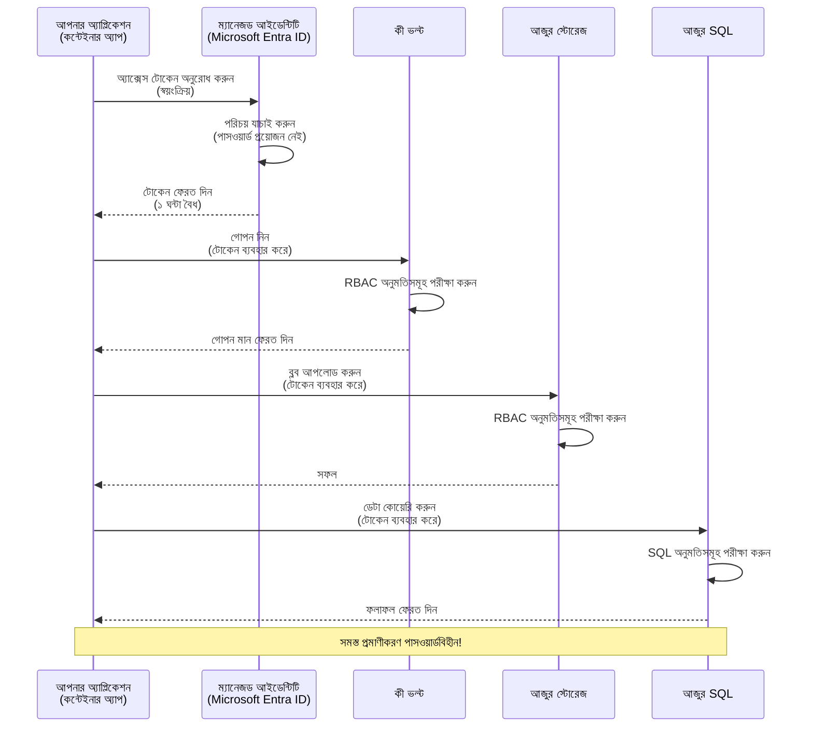
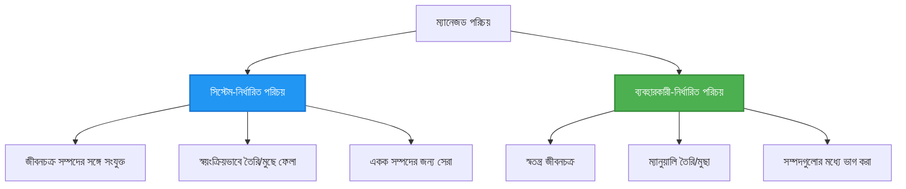

# Authentication Patterns and Managed Identity

⏱️ **Estimated Time**: 45-60 minutes | 💰 **Cost Impact**: Free (no additional charges) | ⭐ **Complexity**: Intermediate

**📚 Learning Path:**
- ← Previous: [কনফিগারেশন ব্যবস্থাপনা](configuration.md) - পরিবেশ ভেরিয়েবল এবং সিক্রেটস পরিচালনা
- 🎯 **You Are Here**: Authentication & Security (Managed Identity, Key Vault, secure patterns)
- → Next: [First Project](first-project.md) - আপনার প্রথম AZD অ্যাপ্লিকেশন তৈরি করুন
- 🏠 [Course Home](../../README.md)

---

## What You'll Learn

By completing this lesson, you will:
- Understand Azure authentication patterns (keys, connection strings, managed identity)
- Implement **Managed Identity** for passwordless authentication
- Secure secrets with **Azure Key Vault** integration
- Configure **role-based access control (RBAC)** for AZD deployments
- Apply security best practices in Container Apps and Azure services
- Migrate from key-based to identity-based authentication

## Why Managed Identity Matters

### The Problem: Traditional Authentication

**Before Managed Identity:**
```javascript
// ❌ নিরাপত্তা ঝুঁকি: কোডে হার্ডকোড করা গোপন তথ্য
const connectionString = "Server=mydb.database.windows.net;User=admin;Password=P@ssw0rd123";
const storageKey = "xK7mN9pQ2wR5tY8uI0oP3aS6dF1gH4jK...";
const cosmosKey = "C2x7B9n4M1p8Q5w3E6r0T2y5U8i1O4p7...";
```

**Problems:**
- 🔴 **Exposed secrets** in code, config files, environment variables
- 🔴 **Credential rotation** requires code changes and redeployment
- 🔴 **Audit nightmares** - who accessed what, when?
- 🔴 **Sprawl** - secrets scattered across multiple systems
- 🔴 **Compliance risks** - fails security audits

### The Solution: Managed Identity

**After Managed Identity:**
```javascript
// ✅ নিরাপদ: কোডে কোনো গোপন তথ্য নেই
const credential = new DefaultAzureCredential();
const client = new BlobServiceClient(
  "https://mystorageaccount.blob.core.windows.net",
  credential  // Azure স্বয়ংক্রিয়ভাবে প্রমাণীকরণ পরিচালনা করে
);
```

**Benefits:**
- ✅ **Zero secrets** in code or configuration
- ✅ **Automatic rotation** - Azure handles it
- ✅ **Full audit trail** in Microsoft Entra ID logs
- ✅ **Centralized security** - manage in Azure Portal
- ✅ **Compliance ready** - meets security standards

**Analogy**: Traditional authentication is like carrying multiple physical keys for different doors. Managed Identity is like having a security badge that automatically grants access based on who you are—no keys to lose, copy, or rotate.

---

## Architecture Overview

### Authentication Flow with Managed Identity



### Types of Managed Identities



| বৈশিষ্ট্য | সিস্টেম-অ্যাসাইনড | ইউজার-অ্যাসাইনড |
|---------|----------------|---------------|
| **Lifecycle** | রিসোর্সের সাথে বাঁধা | স্বাধীন |
| **Creation** | রিসোর্সের সাথে স্বয়ংক্রিয় | ম্যানুয়াল তৈরি |
| **Deletion** | রিসোর্স ডিলেট হলে মুছে যায় | রিসোর্স ডিলেটের পরও থাকে |
| **Sharing** | শুধুমাত্র এক রিসোর্স | একাধিক রিসোর্সে ভাগ করা যায় |
| **Use Case** | সিম্পল সিচুয়েশনগুলোর জন্য | জটিল মাল্টি-রিসোর্স সিচুয়েশনগুলোর জন্য |
| **AZD Default** | ✅ পরামর্শকৃত | ঐচ্ছিক |

---

## Prerequisites

### Required Tools

You should already have these installed from previous lessons:

```bash
# Azure Developer CLI যাচাই করুন
azd version
# ✅ প্রত্যাশিত: azd সংস্করণ 1.0.0 বা তার বেশি

# Azure CLI যাচাই করুন
az --version
# ✅ প্রত্যাশিত: azure-cli 2.50.0 বা তার বেশি
```

### Azure Requirements

- Active Azure subscription
- Permissions to:
  - Create managed identities
  - Assign RBAC roles
  - Create Key Vault resources
  - Deploy Container Apps

### Knowledge Prerequisites

You should have completed:
- [Installation Guide](installation.md) - AZD setup
- [AZD Basics](azd-basics.md) - Core concepts
- [Configuration Management](configuration.md) - Environment variables

---

## Lesson 1: Understanding Authentication Patterns

### Pattern 1: Connection Strings (Legacy - Avoid)

**How it works:**
```bash
# সংযোগ স্ট্রিংতে প্রমাণীকরণ তথ্য রয়েছে
STORAGE_CONNECTION_STRING="DefaultEndpointsProtocol=https;AccountName=myaccount;AccountKey=xK7mN9pQ2wR5..."
COSMOS_CONNECTION_STRING="AccountEndpoint=https://myaccount.documents.azure.com:443/;AccountKey=C2x7..."
SQL_CONNECTION_STRING="Server=myserver.database.windows.net;User=admin;Password=P@ssw0rd..."
```

**Problems:**
- ❌ Secrets visible in environment variables
- ❌ Logged in deployment systems
- ❌ Difficult to rotate
- ❌ No audit trail of access

**When to use:** Only for local development, never production.

---

### Pattern 2: Key Vault References (Better)

**How it works:**
```bicep
// Store secret in Key Vault
resource keyVault 'Microsoft.KeyVault/vaults@2023-02-01' = {
  name: 'mykv'
  properties: {
    enableRbacAuthorization: true
  }
}

// Reference in Container App
env: [
  {
    name: 'STORAGE_KEY'
    secretRef: 'storage-key'  // References Key Vault
  }
]
```

**Benefits:**
- ✅ Secrets stored securely in Key Vault
- ✅ Centralized secret management
- ✅ Rotation without code changes

**Limitations:**
- ⚠️ Still using keys/passwords
- ⚠️ Need to manage Key Vault access

**When to use:** Transition step from connection strings to managed identity.

---

### Pattern 3: Managed Identity (Best Practice)

**How it works:**
```bicep
// Enable managed identity
resource containerApp 'Microsoft.App/containerApps@2023-05-01' = {
  name: 'myapp'
  identity: {
    type: 'SystemAssigned'  // Automatically creates identity
  }
}

// Grant permissions
resource roleAssignment 'Microsoft.Authorization/roleAssignments@2022-04-01' = {
  scope: storageAccount
  properties: {
    roleDefinitionId: storageBlobDataContributorRole
    principalId: containerApp.identity.principalId
  }
}
```

**Application code:**
```javascript
// কোনও গোপনীয়তা প্রয়োজন নেই!
const { DefaultAzureCredential } = require('@azure/identity');
const { BlobServiceClient } = require('@azure/storage-blob');

const credential = new DefaultAzureCredential();
const blobServiceClient = new BlobServiceClient(
  'https://mystorageaccount.blob.core.windows.net',
  credential
);
```

**Benefits:**
- ✅ Zero secrets in code/config
- ✅ Automatic credential rotation
- ✅ Full audit trail
- ✅ RBAC-based permissions
- ✅ Compliance ready

**When to use:** Always, for production applications.

---

### Pattern 4: Service Principals (CI/CD & Automation)

Managed identity is the gold standard *for resources running inside Azure*. But what about things running **outside** Azure—like a CI/CD pipeline on a build agent, or a script on your laptop that can't use your interactive login? That's where a **service principal** comes in: a non-human identity with its own credentials that an automated process can sign in as.

**How it works:**

Create a service principal scoped to a resource group (least privilege):

```bash
az ad sp create-for-rbac \
  --name "myapp-cicd" \
  --role contributor \
  --scopes /subscriptions/<sub-id>/resourceGroups/<rg-name>
```

This prints a client ID, client secret, and tenant ID. azd can sign in with them non-interactively:

```bash
azd auth login \
  --client-id "<appId>" \
  --client-secret "<password>" \
  --tenant-id "<tenant>"
```

**Prefer federated credentials (OIDC) over secrets.** Instead of a long-lived client secret, configure a federated credential so the pipeline exchanges a short-lived token—no secret to leak or rotate:

```bash
azd auth login \
  --client-id "<appId>" \
  --federated-credential-provider "github" \
  --tenant-id "<tenant>"
```

> `azd pipeline config` sets this up for you automatically. See the CI/CD walkthroughs in [চ্যাপ্টার 8](../chapter-08-production/production-ai-practices.md).

**Benefits:**
- ✅ Works outside Azure (build agents, on-prem, other clouds)
- ✅ Can be scoped to a single resource group with one role
- ✅ Federated (OIDC) variant uses no stored secret

**Trade-offs:**
- ⚠️ Secret-based variant requires careful storage and rotation
- ⚠️ A leaked secret grants whatever the SP can do—keep scopes tight

**When to use:** CI/CD pipelines and automation that can't use managed identity. Always prefer the **federated/OIDC** variant over a client secret, and prefer managed identity whenever the workload runs inside Azure.

**Storing credentials safely:**
- Never commit secrets—use your pipeline's secret store (GitHub Actions secrets, Azure DevOps variable groups / Key Vault).
- Scope the SP to the smallest role and resource group it needs.
- Set an expiry and rotate, or eliminate the secret entirely with OIDC.

---

## Lesson 2: Implementing Managed Identity with AZD

### Step-by-Step Implementation

Let's build a secure Container App that uses managed identity to access Azure Storage and Key Vault.

### Project Structure

```
secure-app/
├── azure.yaml                 # AZD configuration
├── infra/
│   ├── main.bicep            # Main infrastructure
│   ├── core/
│   │   ├── identity.bicep    # Managed identity setup
│   │   ├── keyvault.bicep    # Key Vault configuration
│   │   └── storage.bicep     # Storage with RBAC
│   └── app/
│       └── container-app.bicep
└── src/
    ├── app.js                # Application code
    ├── package.json
    └── Dockerfile
```

### 1. Configure AZD (azure.yaml)

```yaml
name: secure-app
metadata:
  template: secure-app@1.0.0

services:
  api:
    project: ./src
    language: js
    host: containerapp

# Enable managed identity (AZD handles this automatically)
```

### 2. Infrastructure: Enable Managed Identity

**File: `infra/main.bicep`**

```bicep
targetScope = 'subscription'

param environmentName string
param location string = 'eastus'

var tags = { 'azd-env-name': environmentName }

// Resource group
resource rg 'Microsoft.Resources/resourceGroups@2021-04-01' = {
  name: 'rg-${environmentName}'
  location: location
  tags: tags
}

// Storage Account
module storage './core/storage.bicep' = {
  name: 'storage'
  scope: rg
  params: {
    name: 'st${uniqueString(rg.id)}'
    location: location
    tags: tags
  }
}

// Key Vault
module keyVault './core/keyvault.bicep' = {
  name: 'keyvault'
  scope: rg
  params: {
    name: 'kv-${uniqueString(rg.id)}'
    location: location
    tags: tags
  }
}

// Container App with Managed Identity
module containerApp './app/container-app.bicep' = {
  name: 'container-app'
  scope: rg
  params: {
    name: 'ca-${environmentName}'
    location: location
    tags: tags
    storageAccountName: storage.outputs.name
    keyVaultName: keyVault.outputs.name
  }
}

// Grant Container App access to Storage
module storageRoleAssignment './core/role-assignment.bicep' = {
  name: 'storage-role'
  scope: rg
  params: {
    principalId: containerApp.outputs.identityPrincipalId
    roleDefinitionId: 'ba92f5b4-2d11-453d-a403-e96b0029c9fe'  // Storage Blob Data Contributor
    targetResourceId: storage.outputs.id
  }
}

// Grant Container App access to Key Vault
module kvRoleAssignment './core/role-assignment.bicep' = {
  name: 'kv-role'
  scope: rg
  params: {
    principalId: containerApp.outputs.identityPrincipalId
    roleDefinitionId: '4633458b-17de-408a-b874-0445c86b69e6'  // Key Vault Secrets User
    targetResourceId: keyVault.outputs.id
  }
}

// Outputs
output AZURE_STORAGE_ACCOUNT_NAME string = storage.outputs.name
output AZURE_KEY_VAULT_NAME string = keyVault.outputs.name
output APP_URL string = containerApp.outputs.url
```

### 3. Container App with System-Assigned Identity

**File: `infra/app/container-app.bicep`**

```bicep
param name string
param location string
param tags object = {}
param storageAccountName string
param keyVaultName string

resource containerApp 'Microsoft.App/containerApps@2023-05-01' = {
  name: name
  location: location
  tags: tags
  identity: {
    type: 'SystemAssigned'  // 🔑 Enable managed identity
  }
  properties: {
    configuration: {
      ingress: {
        external: true
        targetPort: 3000
      }
    }
    template: {
      containers: [
        {
          name: 'api'
          image: 'myregistry.azurecr.io/api:latest'
          resources: {
            cpu: json('0.5')
            memory: '1Gi'
          }
          env: [
            {
              name: 'AZURE_STORAGE_ACCOUNT_NAME'
              value: storageAccountName
            }
            {
              name: 'AZURE_KEY_VAULT_NAME'
              value: keyVaultName
            }
            // 🔑 No secrets - managed identity handles authentication!
          ]
        }
      ]
    }
  }
}

// Output the identity for RBAC assignments
output identityPrincipalId string = containerApp.identity.principalId
output id string = containerApp.id
output url string = 'https://${containerApp.properties.configuration.ingress.fqdn}'
```

### 4. RBAC Role Assignment Module

**File: `infra/core/role-assignment.bicep`**

```bicep
param principalId string
param roleDefinitionId string  // Azure built-in role ID
param targetResourceId string

resource roleAssignment 'Microsoft.Authorization/roleAssignments@2022-04-01' = {
  name: guid(principalId, roleDefinitionId, targetResourceId)
  scope: resourceId('Microsoft.Resources/resourceGroups', resourceGroup().name)
  properties: {
    roleDefinitionId: subscriptionResourceId('Microsoft.Authorization/roleDefinitions', roleDefinitionId)
    principalId: principalId
    principalType: 'ServicePrincipal'
  }
}

output id string = roleAssignment.id
```

### 5. Application Code with Managed Identity

**File: `src/app.js`**

```javascript
const express = require('express');
const { DefaultAzureCredential } = require('@azure/identity');
const { BlobServiceClient } = require('@azure/storage-blob');
const { SecretClient } = require('@azure/keyvault-secrets');

const app = express();
const PORT = process.env.PORT || 3000;

// 🔑 শংসাপত্র আরম্ভ করুন (ম্যানেজড আইডেন্টিটির মাধ্যমে স্বয়ংক্রিয়ভাবে কাজ করে)
const credential = new DefaultAzureCredential();

// Azure Storage সেটআপ
const storageAccountName = process.env.AZURE_STORAGE_ACCOUNT_NAME;
const blobServiceClient = new BlobServiceClient(
  `https://${storageAccountName}.blob.core.windows.net`,
  credential  // কোন কী প্রয়োজন নেই!
);

// Key Vault সেটআপ
const keyVaultName = process.env.AZURE_KEY_VAULT_NAME;
const secretClient = new SecretClient(
  `https://${keyVaultName}.vault.azure.net`,
  credential  // কোন কী প্রয়োজন নেই!
);

// স্বাস্থ্য পরীক্ষা
app.get('/health', (req, res) => {
  res.json({ status: 'healthy', authentication: 'managed-identity' });
});

// ব্লব স্টোরেজে ফাইল আপলোড করুন
app.post('/upload', async (req, res) => {
  try {
    const containerClient = blobServiceClient.getContainerClient('uploads');
    await containerClient.createIfNotExists();
    
    const blobName = `file-${Date.now()}.txt`;
    const blockBlobClient = containerClient.getBlockBlobClient(blobName);
    
    await blockBlobClient.upload('Hello from managed identity!', 30);
    
    res.json({
      success: true,
      blobName: blobName,
      message: 'File uploaded using managed identity!'
    });
  } catch (error) {
    console.error('Upload error:', error);
    res.status(500).json({ error: error.message });
  }
});

// Key Vault থেকে সিক্রেট পান
app.get('/secret/:name', async (req, res) => {
  try {
    const secretName = req.params.name;
    const secret = await secretClient.getSecret(secretName);
    
    res.json({
      name: secretName,
      value: secret.value,
      message: 'Secret retrieved using managed identity!'
    });
  } catch (error) {
    console.error('Secret error:', error);
    res.status(500).json({ error: error.message });
  }
});

// ব্লব কনটেইনারগুলির তালিকা (পড়ার অ্যাক্সেস প্রদর্শন করে)
app.get('/containers', async (req, res) => {
  try {
    const containers = [];
    for await (const container of blobServiceClient.listContainers()) {
      containers.push(container.name);
    }
    
    res.json({
      containers: containers,
      count: containers.length,
      message: 'Containers listed using managed identity!'
    });
  } catch (error) {
    console.error('List error:', error);
    res.status(500).json({ error: error.message });
  }
});

app.listen(PORT, () => {
  console.log(`Secure API listening on port ${PORT}`);
  console.log('Authentication: Managed Identity (passwordless)');
});
```

**File: `src/package.json`**

```json
{
  "name": "secure-app",
  "version": "1.0.0",
  "dependencies": {
    "express": "^4.18.2",
    "@azure/identity": "^4.0.0",
    "@azure/storage-blob": "^12.17.0",
    "@azure/keyvault-secrets": "^4.7.0"
  },
  "scripts": {
    "start": "node app.js"
  }
}
```

### 6. Deploy and Test

```bash
# AZD পরিবেশ প্রাথমিকীকরণ করুন
azd init

# ইনফ্রাস্ট্রাকচার এবং অ্যাপ্লিকেশন স্থাপন করুন
azd up

# অ্যাপের URL পান
APP_URL=$(azd env get-values | grep APP_URL | cut -d '=' -f2 | tr -d '"')

# হেলথ চেক পরীক্ষা করুন
curl $APP_URL/health
```

**✅ Expected output:**
```json
{
  "status": "healthy",
  "authentication": "managed-identity"
}
```

**Test blob upload:**
```bash
curl -X POST $APP_URL/upload
```

**✅ Expected output:**
```json
{
  "success": true,
  "blobName": "file-1700404800000.txt",
  "message": "File uploaded using managed identity!"
}
```

**Test container listing:**
```bash
curl $APP_URL/containers
```

**✅ Expected output:**
```json
{
  "containers": ["uploads"],
  "count": 1,
  "message": "Containers listed using managed identity!"
}
```

---

## Common Azure RBAC Roles

### Built-in Role IDs for Managed Identity

| Service | Role Name | Role ID | Permissions |
|---------|-----------|---------|-------------|
| **Storage** | Storage Blob Data Reader | `2a2b9908-6b94-4a3d-8e5a-a7d8f8cc8a12` | Read blobs and containers |
| **Storage** | Storage Blob Data Contributor | `ba92f5b4-2d11-453d-a403-e96b0029c9fe` | Read, write, delete blobs |
| **Storage** | Storage Queue Data Contributor | `974c5e8b-45b9-4653-ba55-5f855dd0fb88` | Read, write, delete queue messages |
| **Key Vault** | Key Vault Secrets User | `4633458b-17de-408a-b874-0445c86b69e6` | Read secrets |
| **Key Vault** | Key Vault Secrets Officer | `b86a8fe4-44ce-4948-aee5-eccb2c155cd7` | Read, write, delete secrets |
| **Cosmos DB** | Cosmos DB Built-in Data Reader | `00000000-0000-0000-0000-000000000001` | Read Cosmos DB data |
| **Cosmos DB** | Cosmos DB Built-in Data Contributor | `00000000-0000-0000-0000-000000000002` | Read, write Cosmos DB data |
| **SQL Database** | SQL DB Contributor | `9b7fa17d-e63e-47b0-bb0a-15c516ac86ec` | Manage SQL databases |
| **Service Bus** | Azure Service Bus Data Owner | `090c5cfd-751d-490a-894a-3ce6f1109419` | Send, receive, manage messages |

### How to Find Role IDs

```bash
# সমস্ত বিল্ট-ইন রোল তালিকাভুক্ত করুন
az role definition list --query "[].{Name:roleName, ID:name}" --output table

# নির্দিষ্ট রোল খুঁজুন
az role definition list --query "[?contains(roleName, 'Storage Blob')].{Name:roleName, ID:name}" --output table

# রোলের বিস্তারিত তথ্য পান
az role definition list --name "Storage Blob Data Contributor"
```

---

## Practical Exercises

### Exercise 1: Enable Managed Identity for Existing App ⭐⭐ (Medium)

**Goal**: Add managed identity to an existing Container App deployment

**Scenario**: You have a Container App using connection strings. Convert it to managed identity.

**Starting Point**: Container App with this configuration:

```bicep
// ❌ Current: Using connection string
env: [
  {
    name: 'STORAGE_CONNECTION_STRING'
    secretRef: 'storage-connection'
  }
]
```

**Steps**:

1. **Enable managed identity in Bicep:**

```bicep
resource containerApp 'Microsoft.App/containerApps@2023-05-01' = {
  name: 'myapp'
  identity: {
    type: 'SystemAssigned'  // Add this
  }
  // ... rest of configuration
}
```

2. **Grant Storage access:**

```bicep
// Get storage account reference
resource storageAccount 'Microsoft.Storage/storageAccounts@2023-01-01' existing = {
  name: storageAccountName
}

// Assign role
resource roleAssignment 'Microsoft.Authorization/roleAssignments@2022-04-01' = {
  name: guid(containerApp.id, 'ba92f5b4-2d11-453d-a403-e96b0029c9fe', storageAccount.id)
  scope: storageAccount
  properties: {
    roleDefinitionId: subscriptionResourceId('Microsoft.Authorization/roleDefinitions', 'ba92f5b4-2d11-453d-a403-e96b0029c9fe')
    principalId: containerApp.identity.principalId
    principalType: 'ServicePrincipal'
  }
}
```

3. **Update application code:**

**Before (connection string):**
```javascript
const { BlobServiceClient } = require('@azure/storage-blob');

const blobServiceClient = BlobServiceClient.fromConnectionString(
  process.env.STORAGE_CONNECTION_STRING
);
```

**After (managed identity):**
```javascript
const { DefaultAzureCredential } = require('@azure/identity');
const { BlobServiceClient } = require('@azure/storage-blob');

const credential = new DefaultAzureCredential();
const blobServiceClient = new BlobServiceClient(
  `https://${process.env.STORAGE_ACCOUNT_NAME}.blob.core.windows.net`,
  credential
);
```

4. **Update environment variables:**

```bicep
env: [
  {
    name: 'STORAGE_ACCOUNT_NAME'
    value: storageAccountName  // Just the name, no secrets!
  }
  // Remove STORAGE_CONNECTION_STRING
]
```

5. **Deploy and test:**

```bash
# পুনরায় স্থাপন
azd up

# পরীক্ষা করুন যে এটি এখনও কাজ করে
curl https://myapp.azurecontainerapps.io/upload
```

**✅ Success Criteria:**
- ✅ Application deploys without errors
- ✅ Storage operations work (upload, list, download)
- ✅ No connection strings in environment variables
- ✅ Identity visible in Azure Portal under "Identity" blade

**Verification:**

```bash
# যাচাই করুন যে ম্যানেজড আইডেন্টিটি সক্রিয় আছে
az containerapp show \
  --name myapp \
  --resource-group rg-myapp \
  --query "identity.type"
# ✅ প্রত্যাশিত: "SystemAssigned"

# রোল অ্যাসাইনমেন্ট পরীক্ষা করুন
az role assignment list \
  --assignee $(az containerapp show --name myapp --resource-group rg-myapp --query "identity.principalId" -o tsv) \
  --scope /subscriptions/{sub-id}/resourceGroups/rg-myapp/providers/Microsoft.Storage/storageAccounts/mystorageaccount
# ✅ প্রত্যাশিত: "Storage Blob Data Contributor" রোল দেখায়
```

**Time**: 20-30 minutes

---

### Exercise 2: Multi-Service Access with User-Assigned Identity ⭐⭐⭐ (Advanced)

**Goal**: Create a user-assigned identity shared across multiple Container Apps

**Scenario**: You have 3 microservices that all need access to the same Storage account and Key Vault.

**Steps**:

1. **Create user-assigned identity:**

**File: `infra/core/identity.bicep`**

```bicep
param name string
param location string
param tags object = {}

resource userAssignedIdentity 'Microsoft.ManagedIdentity/userAssignedIdentities@2023-01-31' = {
  name: name
  location: location
  tags: tags
}

output id string = userAssignedIdentity.id
output principalId string = userAssignedIdentity.properties.principalId
output clientId string = userAssignedIdentity.properties.clientId
```

2. **Assign roles to user-assigned identity:**

```bicep
// In main.bicep
module userIdentity './core/identity.bicep' = {
  name: 'user-identity'
  scope: rg
  params: {
    name: 'id-${environmentName}'
    location: location
    tags: tags
  }
}

// Grant Storage access
resource storageRoleAssignment 'Microsoft.Authorization/roleAssignments@2022-04-01' = {
  name: guid(userIdentity.outputs.principalId, 'storage-contributor')
  scope: storageAccount
  properties: {
    roleDefinitionId: subscriptionResourceId('Microsoft.Authorization/roleDefinitions', 'ba92f5b4-2d11-453d-a403-e96b0029c9fe')
    principalId: userIdentity.outputs.principalId
    principalType: 'ServicePrincipal'
  }
}

// Grant Key Vault access
resource kvRoleAssignment 'Microsoft.Authorization/roleAssignments@2022-04-01' = {
  name: guid(userIdentity.outputs.principalId, 'kv-secrets-user')
  scope: keyVault
  properties: {
    roleDefinitionId: subscriptionResourceId('Microsoft.Authorization/roleDefinitions', '4633458b-17de-408a-b874-0445c86b69e6')
    principalId: userIdentity.outputs.principalId
    principalType: 'ServicePrincipal'
  }
}
```

3. **Assign identity to multiple Container Apps:**

```bicep
resource apiGateway 'Microsoft.App/containerApps@2023-05-01' = {
  name: 'api-gateway'
  identity: {
    type: 'UserAssigned'
    userAssignedIdentities: {
      '${userIdentity.outputs.id}': {}
    }
  }
  // ... rest of config
}

resource productService 'Microsoft.App/containerApps@2023-05-01' = {
  name: 'product-service'
  identity: {
    type: 'UserAssigned'
    userAssignedIdentities: {
      '${userIdentity.outputs.id}': {}
    }
  }
  // ... rest of config
}

resource orderService 'Microsoft.App/containerApps@2023-05-01' = {
  name: 'order-service'
  identity: {
    type: 'UserAssigned'
    userAssignedIdentities: {
      '${userIdentity.outputs.id}': {}
    }
  }
  // ... rest of config
}
```

4. **Application code (all services use same pattern):**

```javascript
const { DefaultAzureCredential, ManagedIdentityCredential } = require('@azure/identity');

// ব্যবহারকারী-নিযুক্ত পরিচয়ের জন্য, ক্লায়েন্ট আইডি নির্দিষ্ট করুন
const credential = new ManagedIdentityCredential(
  process.env.AZURE_CLIENT_ID  // ব্যবহারকারী-নিযুক্ত পরিচয়ের ক্লায়েন্ট আইডি
);

// অথবা DefaultAzureCredential ব্যবহার করুন (স্বয়ংক্রিয়ভাবে সনাক্ত করে)
const credential = new DefaultAzureCredential();

const blobServiceClient = new BlobServiceClient(
  `https://${process.env.STORAGE_ACCOUNT_NAME}.blob.core.windows.net`,
  credential
);
```

5. **Deploy and verify:**

```bash
azd up

# সব সার্ভিসগুলো স্টোরেজে অ্যাক্সেস করতে পারে কিনা পরীক্ষা করুন
curl https://api-gateway.azurecontainerapps.io/upload
curl https://product-service.azurecontainerapps.io/upload
curl https://order-service.azurecontainerapps.io/upload
```

**✅ Success Criteria:**
- ✅ One identity shared across 3 services
- ✅ All services can access Storage and Key Vault
- ✅ Identity persists if you delete one service
- ✅ Centralized permission management

**Benefits of User-Assigned Identity:**
- Single identity to manage
- Consistent permissions across services
- Survives service deletion
- Better for complex architectures

**Time**: 30-40 minutes

---

### Exercise 3: Implement Key Vault Secret Rotation ⭐⭐⭐ (Advanced)

**Goal**: Store third-party API keys in Key Vault and access them using managed identity

**Scenario**: Your app needs to call an external API (OpenAI, Stripe, SendGrid) that requires API keys.

**Steps**:

1. **Create Key Vault with RBAC:**

**File: `infra/core/keyvault.bicep`**

```bicep
param name string
param location string
param tags object = {}

resource keyVault 'Microsoft.KeyVault/vaults@2023-02-01' = {
  name: name
  location: location
  tags: tags
  properties: {
    enableRbacAuthorization: true  // Use RBAC instead of access policies
    sku: {
      family: 'A'
      name: 'standard'
    }
    tenantId: subscription().tenantId
    enableSoftDelete: true
    softDeleteRetentionInDays: 90
  }
}

// Allow Container App to read secrets
output id string = keyVault.id
output name string = keyVault.name
output uri string = keyVault.properties.vaultUri
```

2. **Store secrets in Key Vault:**

```bash
# Key Vault-এর নাম নিন
KV_NAME=$(azd env get-values | grep AZURE_KEY_VAULT_NAME | cut -d '=' -f2 | tr -d '"')

# তৃতীয় পক্ষের API কীগুলো সংরক্ষণ করুন
az keyvault secret set \
  --vault-name $KV_NAME \
  --name "OpenAI-ApiKey" \
  --value "sk-proj-xxxxxxxxxxxxx"

az keyvault secret set \
  --vault-name $KV_NAME \
  --name "Stripe-ApiKey" \
  --value "sk_live_xxxxxxxxxxxxx"

az keyvault secret set \
  --vault-name $KV_NAME \
  --name "SendGrid-ApiKey" \
  --value "SG.xxxxxxxxxxxxx"
```

3. **Application code to retrieve secrets:**

**File: `src/config.js`**

```javascript
const { DefaultAzureCredential } = require('@azure/identity');
const { SecretClient } = require('@azure/keyvault-secrets');

class Config {
  constructor() {
    this.credential = new DefaultAzureCredential();
    this.secretClient = new SecretClient(
      `https://${process.env.AZURE_KEY_VAULT_NAME}.vault.azure.net`,
      this.credential
    );
    this.cache = {};
  }

  async getSecret(secretName) {
    // প্রথমে ক্যাশ চেক করুন
    if (this.cache[secretName]) {
      return this.cache[secretName];
    }

    try {
      const secret = await this.secretClient.getSecret(secretName);
      this.cache[secretName] = secret.value;
      console.log(`✅ Retrieved secret: ${secretName}`);
      return secret.value;
    } catch (error) {
      console.error(`❌ Failed to get secret ${secretName}:`, error.message);
      throw error;
    }
  }

  async getOpenAIKey() {
    return this.getSecret('OpenAI-ApiKey');
  }

  async getStripeKey() {
    return this.getSecret('Stripe-ApiKey');
  }

  async getSendGridKey() {
    return this.getSecret('SendGrid-ApiKey');
  }
}

module.exports = new Config();
```

4. **Use secrets in application:**

**File: `src/app.js`**

```javascript
const express = require('express');
const config = require('./config');
const { OpenAI } = require('openai');

const app = express();

// Key Vault থেকে কী ব্যবহার করে OpenAI ইনিশিয়ালাইজ করুন
let openaiClient;

async function initializeServices() {
  const openaiKey = await config.getOpenAIKey();
  openaiClient = new OpenAI({ apiKey: openaiKey });
  console.log('✅ Services initialized with secrets from Key Vault');
}

// স্টার্টআপে কল করুন
initializeServices().catch(console.error);

app.post('/chat', async (req, res) => {
  try {
    const completion = await openaiClient.chat.completions.create({
      model: 'gpt-4.1',
      messages: [{ role: 'user', content: 'Hello!' }]
    });
    
    res.json({
      response: completion.choices[0].message.content,
      authentication: 'Key from Key Vault via Managed Identity'
    });
  } catch (error) {
    res.status(500).json({ error: error.message });
  }
});

app.listen(3000, () => {
  console.log('Secure API with Key Vault integration running');
});
```

5. **Deploy and test:**

```bash
azd up

# API কীগুলো কাজ করছে কি না পরীক্ষা করুন
curl -X POST https://myapp.azurecontainerapps.io/chat \
  -H "Content-Type: application/json" \
  -d '{"message":"Hello AI"}'
```

**✅ Success Criteria:**
- ✅ কোড বা পরিবেশ ভেরিয়েবলে কোন API কী নেই
- ✅ অ্যাপ্লিকেশন Key Vault থেকে কী পুনরুদ্ধার করে
- ✅ তৃতীয়-পক্ষ API গুলো সঠিকভাবে কাজ করে
- ✅ কোড পরিবর্তন ছাড়াই কী রোটেট করা যায়

**একটি সিক্রেট রোটেট করুন:**

```bash
# Key Vault-এ সিক্রেট আপডেট করুন
az keyvault secret set \
  --vault-name $KV_NAME \
  --name "OpenAI-ApiKey" \
  --value "sk-proj-NEW_KEY_HERE"

# নতুন কী কার্যকর করার জন্য অ্যাপটি পুনরায় চালু করুন
az containerapp revision restart \
  --name myapp \
  --resource-group rg-myapp
```

**সময়**: 25-35 মিনিট

---

## জ্ঞান যাচাইকরণ

### 1. প্রমাণীকরণ প্যাটার্ন ✓

আপনার বোঝাপড়া পরীক্ষা করুন:

- [ ] **Q1**: প্রধান তিনটি প্রমাণীকরণ প্যাটার্ন কী কী? 
  - **A**: Connection strings (legacy), Key Vault references (transition), Managed Identity (best)

- [ ] **Q2**: কেন Managed Identity connection strings-এর তুলনায় ভালো?
  - **A**: কোডে কোন সিক্রেট নেই, স্বয়ংক্রিয় রোটেশন, পূর্ণ অডিট ট্রেইল, RBAC অনুমতিসমূহ

- [ ] **Q3**: কখন user-assigned identity ব্যবহার করবেন system-assigned-এর পরিবর্তে?
  - **A**: যখন একাধিক রিসোর্সে আইডেন্টিটি শেয়ার করা হয় অথবা যখন আইডেন্টিটির লাইফসাইকেল রিসোর্সের লাইফসাইকেলের থেকে স্বাধীন থাকে

**Hands-On Verification:**
```bash
# আপনার অ্যাপ কোন ধরনের পরিচয় ব্যবহার করে তা যাচাই করুন
az containerapp show \
  --name myapp \
  --resource-group rg-myapp \
  --query "identity.type"

# পরিচয়ের জন্য সমস্ত ভূমিকা নিয়োগসমূহ তালিকাভুক্ত করুন
az role assignment list \
  --assignee $(az containerapp show --name myapp --resource-group rg-myapp --query "identity.principalId" -o tsv)
```

---

### 2. RBAC এবং অনুমতিসমূহ ✓

আপনার বোঝাপড়া পরীক্ষা করুন:

- [ ] **Q1**: "Storage Blob Data Contributor" এর role ID কী?
  - **A**: `ba92f5b4-2d11-453d-a403-e96b0029c9fe`

- [ ] **Q2**: "Key Vault Secrets User" কী অনুমতি দিয়ে থাকে?
  - **A**: সিক্রেটগুলিতে রিড-ওনলি অ্যাক্সেস (তৈরি, আপডেট বা মুছতে পারবে না)

- [ ] **Q3**: কিভাবে একটি Container App-কে Azure SQL-এ অ্যাক্সেস দেওয়া হয়?
  - **A**: "SQL DB Contributor" রোল অ্যাসাইন করুন অথবা SQL-এর জন্য Microsoft Entra ID authentication কনফিগার করুন

**Hands-On Verification:**
```bash
# নির্দিষ্ট ভূমিকা খুঁজুন
az role definition list --name "Storage Blob Data Contributor"

# আপনার পরিচয়কে কোন কোন ভূমিকা বরাদ্দ করা হয়েছে তা পরীক্ষা করুন
PRINCIPAL_ID=$(az containerapp show --name myapp --resource-group rg-myapp --query "identity.principalId" -o tsv)
az role assignment list --assignee $PRINCIPAL_ID --output table
```

---

### 3. Key Vault ইন্টিগ্রেশন ✓

আপনার বোঝাপড়া পরীক্ষা করুন:

- [ ] **Q1**: অ্যাক্সেস পলিসির পরিবর্তে Key Vault-এর জন্য RBAC কিভাবে সক্রিয় করবেন?
  - **A**: Bicep-এ `enableRbacAuthorization: true` সেট করুন

- [ ] **Q2**: কোন Azure SDK লাইব্রেরি managed identity authentication হ্যান্ডেল করে?
  - **A**: `@azure/identity` with `DefaultAzureCredential` class

- [ ] **Q3**: Key Vault সিক্রেটগুলি কতক্ষণ ক্যাশে থাকে?
  - **A**: এটি অ্যাপ্লিকেশন-নির্ভর; আপনার নিজের ক্যাশিং কৌশল বাস্তবায়ন করুন

**Hands-On Verification:**
```bash
# Key Vault অ্যাক্সেস পরীক্ষা
az keyvault secret show \
  --vault-name $KV_NAME \
  --name "OpenAI-ApiKey" \
  --query "value"

# যাচাই করুন যে RBAC সক্রিয় আছে
az keyvault show \
  --name $KV_NAME \
  --query "properties.enableRbacAuthorization"
# ✅ প্রত্যাশিত: true
```

---

## নিরাপত্তা সেরা অনুশীলন

### ✅ করণীয়:

1. **প্রোডাকশনে সবসময় Managed Identity ব্যবহার করুন**
   ```bicep
   identity: {
     type: 'SystemAssigned'
   }
   ```

2. **কম-প্রিভিলেজ RBAC রোল ব্যবহার করুন**
   - সম্ভব হলে "Reader" রোল ব্যবহার করুন
   - প্রয়োজন না হলে "Owner" বা "Contributor" এড়িয়ে চলুন

3. **তৃতীয়-পক্ষ কীগুলো Key Vault-এ সংরক্ষণ করুন**
   ```javascript
   const apiKey = await secretClient.getSecret('ThirdPartyApiKey');
   ```

4. **অডিট লগিং সক্ষম করুন**
   ```bicep
   diagnosticSettings: {
     logs: [{ category: 'AuditEvent', enabled: true }]
   }
   ```

5. **dev/staging/prod-এর জন্য আলাদা পরিচয় ব্যবহার করুন**
   ```bash
   azd env new dev
   azd env new staging
   azd env new prod
   ```

6. **নিয়মিত সিক্রেট রোটেট করুন**
   - Key Vault সিক্রেটগুলিতে মেয়াদসীমা (expiration dates) সেট করুন
   - Azure Functions দিয়ে রোটেশন স্বয়ংক্রিয় করুন

### ❌ করবেন না:

1. **কোনও অবস্থাতেই সিক্রেট হার্ডকোড করবেন না**
   ```javascript
   // ❌ খারাপ
   const apiKey = "sk-proj-xxxxxxxxxxxxx";
   ```

2. **প্রোডাকশনে connection strings ব্যবহার করবেন না**
   ```javascript
   // ❌ খারাপ
   BlobServiceClient.fromConnectionString(process.env.STORAGE_CONNECTION_STRING)
   ```

3. **অতিরিক্ত অনুমতি দেবেন না**
   ```bicep
   // ❌ BAD - too much access
   roleDefinitionId: 'Owner'
   
   // ✅ GOOD - least privilege
   roleDefinitionId: 'Storage Blob Data Reader'
   ```

4. **সিক্রেট লগ করবেন না**
   ```javascript
   // ❌ খারাপ
   console.log('API Key:', apiKey);
   
   // ✅ ভালো
   console.log('API Key retrieved successfully');
   ```

5. **প্রোডাকশন পরিচয়গুলি পরিবেশগুলোর মধ্যে শেয়ার করবেন না**
   ```bicep
   // ❌ BAD - same identity for dev and prod
   // ✅ GOOD - separate identities per environment
   ```

---

## ট্রাবলশুটিং গাইড

### সমস্যা: Azure Storage-এ অ্যাক্সেস করার সময় "Unauthorized"

**লক্ষণ:**
```
Error: Unauthorized (403)
AuthorizationPermissionMismatch: This request is not authorized to perform this operation
```

**রোগনিদান:**

```bash
# ম্যানেজড আইডেন্টিটি সক্রিয় আছে কি না পরীক্ষা করুন
az containerapp show \
  --name myapp \
  --resource-group rg-myapp \
  --query "identity.type"
# ✅ প্রত্যাশিত: "SystemAssigned" অথবা "UserAssigned"

# রোল বরাদ্দ পরীক্ষা করুন
PRINCIPAL_ID=$(az containerapp show --name myapp --resource-group rg-myapp --query "identity.principalId" -o tsv)
az role assignment list --assignee $PRINCIPAL_ID

# প্রত্যাশিত: "Storage Blob Data Contributor" বা অনুরূপ কোনো রোল দেখা উচিত
```

**সমাধানসমূহ:**

1. **সঠিক RBAC রোল প্রদান করুন:**
```bash
STORAGE_ID=$(az storage account show --name mystorageaccount --resource-group rg-myapp --query "id" -o tsv)
az role assignment create \
  --assignee $PRINCIPAL_ID \
  --role "Storage Blob Data Contributor" \
  --scope $STORAGE_ID
```

2. **প্রচারের জন্য অপেক্ষা করুন (5-10 মিনিট লাগতে পারে):**
```bash
# ভূমিকা বরাদ্দের অবস্থা পরীক্ষা করুন
az role assignment list --assignee $PRINCIPAL_ID --scope $STORAGE_ID
```

3. **নিশ্চিত করুন অ্যাপ্লিকেশন কোড সঠিক credential ব্যবহার করছে:**
```javascript
// নিশ্চিত করুন যে আপনি DefaultAzureCredential ব্যবহার করছেন
const credential = new DefaultAzureCredential();
```

---

### সমস্যা: Key Vault অ্যাক্সেস প্রত্যাখ্যান

**লক্ষণ:**
```
Error: Forbidden (403)
The user, group or application does not have secrets get permission
```

**রোগনিদান:**

```bash
# Key Vault RBAC সক্রিয় আছে কিনা পরীক্ষা করুন
az keyvault show \
  --name $KV_NAME \
  --query "properties.enableRbacAuthorization"
# ✅ প্রত্যাশিত: true

# রোল অ্যাসাইনমেন্টগুলো পরীক্ষা করুন
az role assignment list \
  --assignee $PRINCIPAL_ID \
  --scope /subscriptions/{sub-id}/resourceGroups/rg-myapp/providers/Microsoft.KeyVault/vaults/$KV_NAME
```

**সমাধানসমূহ:**

1. **Key Vault-এ RBAC সক্ষম করুন:**
```bash
az keyvault update \
  --name $KV_NAME \
  --enable-rbac-authorization true
```

2. **Key Vault Secrets User রোল প্রদান করুন:**
```bash
KV_ID=$(az keyvault show --name $KV_NAME --query "id" -o tsv)
az role assignment create \
  --assignee $PRINCIPAL_ID \
  --role "Key Vault Secrets User" \
  --scope $KV_ID
```

---

### সমস্যা: লোকালে DefaultAzureCredential ব্যর্থ হচ্ছে

**লক্ষণ:**
```
Error: DefaultAzureCredential failed to retrieve a token
CredentialUnavailableError: No credential available
```

**রোগনিদান:**

```bash
# আপনি লগ ইন করেছেন কিনা যাচাই করুন
az account show

# Azure CLI প্রমাণীকরণ যাচাই করুন
az ad signed-in-user show
```

**সমাধানসমূহ:**

1. **Azure CLI-তে লগইন করুন:**
```bash
az login
```

2. **Azure সাবস্ক্রিপশন সেট করুন:**
```bash
az account set --subscription "Your Subscription Name"
```

3. **লোকাল ডেভেলপমেন্টের জন্য environment variables ব্যবহার করুন:**
```bash
export AZURE_TENANT_ID="your-tenant-id"
export AZURE_CLIENT_ID="your-client-id"
export AZURE_CLIENT_SECRET="your-client-secret"
```

4. **বা লোকালি ভিন্ন credential ব্যবহার করুন:**
```javascript
const { DefaultAzureCredential, AzureCliCredential } = require('@azure/identity');

// স্থানীয় ডেভেলপমেন্টের জন্য AzureCliCredential ব্যবহার করুন
const credential = process.env.NODE_ENV === 'production' 
  ? new DefaultAzureCredential()
  : new AzureCliCredential();
```

---

### সমস্যা: রোল অ্যাসাইনমেন্ট প্রচার হতে অনেকক্ষণ সময় নেয়

**লক্ষণ:**
- রোল সফলভাবে অ্যাসাইন করা হয়েছে
- তবুও 403 ত্রুটি দেখা যাচ্ছে
- মাঝে মাঝে অ্যাক্সেস (কখনও কাজ করে, কখনও করে না)

**ব্যাখ্যা:**
Azure RBAC পরিবর্তনগুলি বিশ্বব্যাপী প্রচার হতে 5-10 মিনিট সময় নিতে পারে।

**সমাধান:**

```bash
# অপেক্ষা করুন এবং পুনরায় চেষ্টা করুন
echo "Waiting for RBAC propagation..."
sleep 300  # ৫ মিনিট অপেক্ষা করুন

# অ্যাক্সেস পরীক্ষা করুন
curl https://myapp.azurecontainerapps.io/upload

# যদি এখনও ব্যর্থ হয়, অ্যাপটি পুনরায় চালু করুন
az containerapp revision restart \
  --name myapp \
  --resource-group rg-myapp
```

---

## খরচ বিবেচনা

### Managed Identity খরচ

| রিসোর্স | খরচ |
|----------|------|
| **Managed Identity** | 🆓 **FREE** - চার্জ নেই |
| **RBAC Role Assignments** | 🆓 **FREE** - চার্জ নেই |
| **Microsoft Entra ID Token Requests** | 🆓 **FREE** - অন্তর্ভুক্ত |
| **Key Vault Operations** | $0.03 প্রতি 10,000 অপারেশন |
| **Key Vault Storage** | $0.024 প্রতি সিক্রেট প্রতি মাস |

**Managed identity টাকায় সাশ্রয় করে কারণ:**
- ✅ সার্ভিস-টু-সার্ভিস প্রমাণীকরণের জন্য Key Vault অপারেশন বাদ দেওয়া
- ✅ নিরাপত্তা ঘটনার হ্রাস (কোনও credentials লিক হয় না)
- ✅ অপারেশনাল ওভারহেড কমানো (কোনও ম্যানুয়াল রোটেশন নেই)

**উদাহরণ খরচ তুলনা (মাসিক):**

| সিনারিও | Connection Strings | Managed Identity | সঞ্চয় |
|----------|-------------------|-----------------|---------|
| ছোট অ্যাপ (1M requests) | ~$50 (Key Vault + ops) | ~$0 | $50/মাস |
| মাঝারি অ্যাপ (10M requests) | ~$200 | ~$0 | $200/মাস |
| বড় অ্যাপ (100M requests) | ~$1,500 | ~$0 | $1,500/মাস |

---

## আরও জানুন

### অফিসিয়াল ডকুমেন্টেশন
- [Azure Managed Identity](https://learn.microsoft.com/entra/identity/managed-identities-azure-resources/overview)
- [Azure RBAC](https://learn.microsoft.com/azure/role-based-access-control/overview)
- [Azure Key Vault](https://learn.microsoft.com/azure/key-vault/general/overview)
- [DefaultAzureCredential](https://learn.microsoft.com/dotnet/api/azure.identity.defaultazurecredential)

### SDK ডকুমেন্টেশন
- [@azure/identity (Node.js)](https://www.npmjs.com/package/@azure/identity)
- [Azure.Identity (C#)](https://www.nuget.org/packages/Azure.Identity/)
- [azure-identity (Python)](https://pypi.org/project/azure-identity/)

### এই কোর্সে পরবর্তী ধাপসমূহ
- ← পূর্ববর্তী: [কনফিগারেশন ম্যানেজমেন্ট](configuration.md)
- → পরবর্তী: [প্রথম প্রকল্প](first-project.md)
- 🏠 [কোর্স হোম](../../README.md)

### সম্পর্কিত উদাহরণ
- [Microsoft Foundry Models Chat Example](../../../../examples/azure-openai-chat) - Microsoft Foundry Models-এর জন্য managed identity ব্যবহার করে
- [Microservices Example](../../../../examples/microservices) - বহু-সার্ভিস প্রমাণীকরণ প্যাটার্ন

---

## সারাংশ

**আপনি যা শিখলেন:**
- ✅ তিনটি প্রমাণীকরণ প্যাটার্ন (connection strings, Key Vault, managed identity)
- ✅ AZD-এ Managed Identity কীভাবে সক্ষম ও কনফিগার করবেন
- ✅ Azure সার্ভিসগুলোর জন্য RBAC রোল অ্যাসাইনমেন্ট
- ✅ তৃতীয়-পক্ষ সিক্রেটের জন্য Key Vault ইন্টিগ্রেশন
- ✅ User-assigned বনাম system-assigned identities
- ✅ নিরাপত্তা সেরা অনুশীলন এবং ট্রাবলশুটিং

**মূল বার্তাগুলো:**
1. **প্রোডাকশনে সবসময় Managed Identity ব্যবহার করুন** - কোন সিক্রেট নেই, স্বয়ংক্রিয় রোটেশন
2. **কম-প্রিভিলেজ RBAC রোল ব্যবহার করুন** - শুধুমাত্র প্রয়োজনীয় অনুমতি দিন
3. **তৃতীয়-পক্ষ কীগুলো Key Vault-এ সংরক্ষণ করুন** - কেন্দ্রীভূত সিক্রেট ম্যানেজমেন্ট
4. **প্রতিটি পরিবেশের জন্য আলাদা পরিচয় রাখুন** - Dev, staging, prod আলাদা করুন
5. **অডিট লগিং সক্ষম করুন** - কে কী অ্যাক্সেস করেছে তা ট্র্যাক করুন

**পরবর্তী ধাপসমূহ:**
1. উপরের বাস্তব অনুশীলনগুলো সম্পন্ন করুন
2. একটি বিদ্যমান অ্যাপ connection strings থেকে managed identity-তে মাইগ্রেট করুন
3. প্রথম দিন থেকেই নিরাপত্তা নিয়ে আপনার প্রথম AZD প্রকল্প তৈরি করুন: [প্রথম প্রকল্প](first-project.md)

---

<!-- CO-OP TRANSLATOR DISCLAIMER START -->
**অস্বীকৃতি**:
এই নথিটি AI অনুবাদ পরিষেবা [Co-op Translator](https://github.com/Azure/co-op-translator) ব্যবহার করে অনূদিত হয়েছে। যদিও আমরা শুদ্ধতার জন্য চেষ্টা করি, অনুগ্রহ করে মনে রাখবেন যে স্বয়ংক্রিয় অনুবাদে ত্রুটি বা অসঙ্গতি থাকতে পারে। মূল নথিটি তার স্বভাষায় কর্তৃত্বপূর্ণ উৎস হিসেবে বিবেচিত হওয়া উচিত। গুরুত্বপূর্ণ তথ্যের জন্য পেশাদার মানব অনুবাদ সুপারিশ করা হয়। এই অনুবাদের ব্যবহারে প্রয়োজনীয় ভুল বোঝাবুঝি বা ভুল ব্যাখ্যার জন্য আমরা দায়বদ্ধ নই।
<!-- CO-OP TRANSLATOR DISCLAIMER END -->