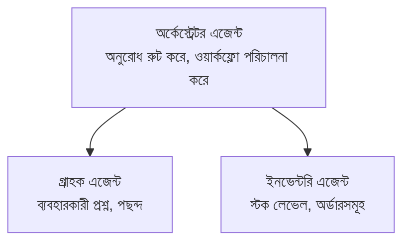

# অধ্যায় ৫: মাল্টি-এজেন্ট এআই সলিউশন

**📚 কোর্স**: [AZD ফর বিগিনার্স](../../README.md) | **⏱️ সময়কাল**: ২-৩ ঘণ্টা | **⭐ জটিলতা**: উন্নত

---

## ওভারভিউ

এই অধ্যায়ে উন্নত মাল্টি-এজেন্ট আর্কিটেকচার প্যাটার্ন, এজেন্ট অর্কেস্ট্রেশন, এবং জটিল পরিস্থিতির জন্য উৎপাদন-সামর্থ্য এআই ডিপ্লয়মেন্টগুলি কভার করা হয়েছে।

> বৈধকরণ করা হয়েছে `azd 1.23.12` এর বিপরীতে মার্চ ২০২৬ সালে।

## শেখার উদ্দেশ্য

এই অধ্যায় সম্পূর্ণ করার মাধ্যমে আপনি:
- মাল্টি-এজেন্ট আর্কিটেকচার প্যাটার্নগুলি বুঝতে পারবেন
- সমন্বিত এআই এজেন্ট সিস্টেম ডিপ্লয় করতে পারবেন
- এজেন্ট থেকে এজেন্টের সাথে যোগাযোগ বাস্তবায়ন করতে পারবেন
- উৎপাদন-সামর্থ্য মাল্টি-এজেন্ট সলিউশন নির্মাণ করতে পারবেন

---

## 📚 পাঠ

| # | পাঠ | বর্ণনা | সময় |
|---|--------|-------------|------|
| ১ | [রিটেইল মাল্টি-এজেন্ট সলিউশন](../../examples/retail-scenario.md) | সম্পূর্ণ বাস্তবায়ন গাইড | ৯০ মিনিট |
| ২ | [সমন্বয় প্যাটার্ন](../chapter-06-pre-deployment/coordination-patterns.md) | এজেন্ট অর্কেস্ট্রেশন কৌশল | ৩০ মিনিট |
| ৩ | [ARM টেম্পলেট ডিপ্লয়মেন্ট](../../examples/retail-multiagent-arm-template/README.md) | এক-ক্লিক ডিপ্লয়মেন্ট | ৩০ মিনিট |

---

## 🚀 দ্রুত শুরু

```bash
# বিকল্প ১: একটি টেমপ্লেট থেকে স্থাপন করুন
azd init --template agent-openai-python-prompty
azd up

# বিকল্প ২: একটি এজেন্ট ম্যানিফেস্ট থেকে স্থাপন করুন (azure.ai.agents এক্সটেনশন প্রয়োজন)
azd extension install azure.ai.agents
azd ai agent init -m agent-manifest.yaml
azd up
```

> **কোন পদ্ধতি?** `azd init --template` ব্যবহার করে কাজ করার নমুনা থেকে শুরু করুন। যখন আপনার নিজস্ব এজেন্ট ম্যানিফেস্ট থাকে তখন `azd ai agent init` ব্যবহার করুন। সম্পূর্ণ বিবরণের জন্য [AZD AI CLI রেফারেন্স](../chapter-08-production/production-ai-practices.md#azd-ai-cli-commands-and-extensions) দেখুন।

---

## 🤖 মাল্টি-এজেন্ট আর্কিটেকচার


---

## 🎯 প্রধান সলিউশন: রিটেইল মাল্টি-এজেন্ট

[রিটেইল মাল্টি-এজেন্ট সলিউশন](../../examples/retail-scenario.md) দেখায়:

- **কাস্টমার এজেন্ট**: ব্যবহারকারীর ইন্টারঅ্যাকশন এবং পছন্দ পরিচালনা করে
- **ইনভেন্টরি এজেন্ট**: স্টক এবং অর্ডার প্রসেসিং নিয়ন্ত্রণ করে
- **অর্কেস্ট্রেটর**: এজেন্টদের মাঝে সমন্বয় সাধন করে
- **শেয়ার্ড মেমোরি**: এজেন্টদের মাঝে কনটেক্সট ব্যবস্থাপনা

### ব্যবহৃত পরিষেবাসমূহ

| পরিষেবা | উদ্দেশ্য |
|---------|---------|
| Microsoft Foundry Models | ভাষা বোঝাপড়া |
| Azure AI Search | পণ্য ক্যাটালগ |
| Cosmos DB | এজেন্ট অবস্থা এবং মেমোরি |
| Container Apps | এজেন্ট হোস্টিং |
| Application Insights | পর্যবেক্ষণ |

---

## 🔗 নেভিগেশন

| দিকনির্দেশনা | অধ্যায় |
|-----------|---------|
| **পূর্ববর্তী** | [অধ্যায় ৪: অবকাঠামো](../chapter-04-infrastructure/README.md) |
| **পরবর্তী** | [অধ্যায় ৬: প্রি-ডিপ্লয়মেন্ট](../chapter-06-pre-deployment/README.md) |

---

## 📖 সংশ্লিষ্ট সম্পদ

- [এআই এজেন্ট গাইড](../chapter-02-ai-development/agents.md)
- [উৎপাদন এআই অনুশীলন](../chapter-08-production/production-ai-practices.md)
- [এআই সমস্যার সমাধান](../chapter-07-troubleshooting/ai-troubleshooting.md)

---

<!-- CO-OP TRANSLATOR DISCLAIMER START -->
**অস্বীকৃতি**:  
এই নথিটি AI অনুবাদ সেবা [Co-op Translator](https://github.com/Azure/co-op-translator) ব্যবহার করে অনূদিত হয়েছে। যদিও আমরা সঠিকতার জন্য প্রচেষ্টা চালিয়ে থাকি, স্বয়ংক্রিয় অনুবাদে ত্রুটি বা অসত্যতা থাকতে পারে। মূল নথি তার নিজস্ব ভাষায় Authority-যুক্ত উৎস হিসাবে বিবেচিত হওয়া উচিত। গুরুত্বপূর্ণ তথ্যের জন্য পেশাদার মানব অনুবাদের পরামর্শ দেওয়া হয়। এই অনুবাদের ব্যবহারে সৃষ্ট কোনও ভুল বোঝাবুঝি বা ব্যাখ্যার জন্য আমরা দায়িত্ব গ্রহণ করিনা।
<!-- CO-OP TRANSLATOR DISCLAIMER END -->