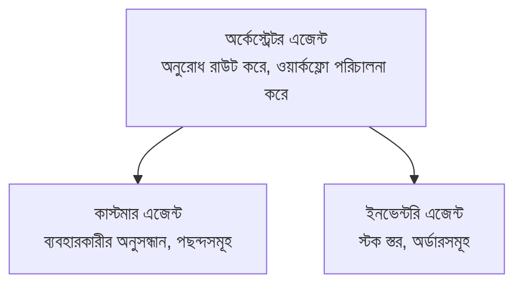

# অধ্যায় ৫: মাল্টি-এজেন্ট AI সমাধান

**📚 কোর্স**: [AZD ফর বিগিনার্স](../../README.md) | **⏱️ সময়কাল**: ২-৩ ঘণ্টা | **⭐ জটিলতা**: উন্নত

---

## ওভারভিউ

এই অধ্যায়ে উন্নত মাল্টি-এজেন্ট আর্কিটেকচার প্যাটার্ন, এজেন্ট অর্কেস্ট্রেশন, এবং জটিল পরিস্থিতির জন্য প্রোডাকশন-রেডি AI ডিপ্লয়মেন্ট সম্পর্কে আলোচনা করা হয়েছে।

> `azd 1.27.1` এর বিরুদ্ধে যাচাই করা হয়েছে জুলাই ২০২৬ এ।

## শেখার উদ্দেশ্য

এই অধ্যায় সম্পন্ন করে আপনি:
- মাল্টি-এজেন্ট আর্কিটেকচার প্যাটার্নগুলো বুঝতে পারবেন
- সমন্বিত AI এজেন্ট সিস্টেম ডিপ্লয় করতে পারবেন
- এজেন্ট-টু-এজেন্ট যোগাযোগ বাস্তবায়ন করতে পারবেন
- প্রোডাকশন-রেডি মাল্টি-এজেন্ট সমাধান গড়ে তুলতে পারবেন

---

## 📚 পাঠগুলি

| # | পাঠ | বর্ণনা | সময় |
|---|--------|-------------|------|
| 1 | [মাল্টি-এজেন্ট বেসিকস](multi-agent-basics.md) | হাতে-কলমে: `azd up` দিয়ে একটি কার্যকর মাল্টি-এজেন্ট অ্যাপ ডিপ্লয় করুন | ৪৫ মিনিট |
| 2 | [সমন্বয় প্যাটার্ন](../chapter-06-pre-deployment/coordination-patterns.md) | এজেন্ট অর্কেস্ট্রেশন কৌশল (অধ্যায় ৬ এ চালিয়ে যাওয়া) | ৩০ মিনিট |
| 3 | [ARM টেমপ্লেট ডিপ্লয়মেন্ট](../../examples/retail-multiagent-arm-template/README.md) | এক-ক্লিক ডিপ্লয়মেন্ট উদাহরণ | ৩০ মিনিট |

> **পাঠ ১ থেকে শুরু করুন।** এটি শুধুমাত্র সম্পূর্ণ হাতে-কলমে, ডিপ্লয়যোগ্য পাঠ এই অধ্যায়ে। পাঠ ২ অধ্যায় ৬ এ আছে (এটি প্রি-ডিপ্লয়মেন্ট পরিকল্পনার সাথে শেয়ার করা হয়েছে), এবং [রিটেইল মাল্টি-এজেন্ট সমাধান](../../examples/retail-scenario.md) একটি আর্কিটেকচার ব্লুপ্রিন্ট — একটি ডিজাইন রেফারেন্স, এক-কমান্ড টেমপ্লেট নয়।

---

## 🚀 দ্রুত শুরু

```bash
# বিকল্প ১: একটি টেমপ্লেট থেকে ডিপ্লয় করুন
azd init --template agent-openai-python-prompty
azd up

# বিকল্প ২: একটি এজেন্ট ম্যানিফেস্ট থেকে ডিপ্লয় করুন (azure.ai.agents এক্সটেনশন প্রয়োজন)
azd extension install azure.ai.agents
azd ai agent init -m agent-manifest.yaml
azd up
```

> **কোন পন্থা?** `azd init --template` ব্যবহার করুন একটি প্রস্তুত নমুনা থেকে শুরু করতে। আপনার নিজস্ব এজেন্ট ম্যানিফেস্ট থাকলে `azd ai agent init` ব্যবহার করুন। সম্পূর্ণ বিবরণের জন্য [AZD AI CLI রেফারেন্স](../chapter-08-production/production-ai-practices.md#azd-ai-cli-commands-and-extensions) দেখুন।

---

## 🤖 মাল্টি-এজেন্ট আর্কিটেকচার



---

## 🎯 নির্বাচিত সমাধান: রিটেইল মাল্টি-এজেন্ট

[রিটেইল মাল্টি-এজেন্ট সমাধান](../../examples/retail-scenario.md) প্রদর্শন করে:

- **কাস্টমার এজেন্ট**: ব্যবহারকারীর ইন্টার‌্যাকশন এবং পছন্দসমূহ পরিচালনা করে
- **ইনভেন্টরি এজেন্ট**: স্টক এবং অর্ডার প্রক্রিয়াকরণ পরিচালনা করে
- **অর্কেস্ট্রেটর**: এজেন্টদের মধ্যে সমন্বয় সাধন করে
- **শেয়ার্ড মেমোরি**: ক্রস-এজেন্ট প্রসঙ্গ ব্যবস্থাপনা

### ব্যবহৃত সেবা

| সেবা | উদ্দেশ্য |
|---------|---------|
| মাইক্রোসফট ফাউন্ড্রি মডেলস | ভাষা বোঝাপড়া |
| আজুর AI সার্চ | পণ্য ক্যাটালগ |
| কসমস DB | এজেন্ট স্টেট এবং মেমোরি |
| কন্টেইনার অ্যাপস | এজেন্ট হোস্টিং |
| অ্যাপ্লিকেশন ইনসাইটস | পর্যবেক্ষণ |

---

## 🔗 নেভিগেশন

| দিকনির্দেশ | অধ্যায় |
|-----------|---------|
| **পূর্ববর্তী** | [অধ্যায় ৪: ইনফ্রাস্ট্রাকচার](../chapter-04-infrastructure/README.md) |
| **পরবর্তী** | [অধ্যায় ৬: প্রি-ডিপ্লয়মেন্ট](../chapter-06-pre-deployment/README.md) |

---

## 📖 সম্পর্কিত রিসোর্স

- [AI এজেন্ট গাইড](../chapter-02-ai-development/agents.md)
- [প্রোডাকশন AI অনুশীলন](../chapter-08-production/production-ai-practices.md)
- [AI ত্রুটি সমস্যার সমাধান](../chapter-07-troubleshooting/ai-troubleshooting.md)

---

<!-- CO-OP TRANSLATOR DISCLAIMER START -->
**অস্বীকৃতি**:
এই নথিটি AI অনুবাদ পরিষেবা [Co-op Translator](https://github.com/Azure/co-op-translator) ব্যবহার করে অনূদিত হয়েছে। যদিও আমরা শুদ্ধতার জন্য চেষ্টা করি, অনুগ্রহ করে মনে রাখবেন যে স্বয়ংক্রিয় অনুবাদে ত্রুটি বা অসঙ্গতি থাকতে পারে। মূল নথিটি তার স্বভাষায় কর্তৃত্বপূর্ণ উৎস হিসেবে বিবেচিত হওয়া উচিত। গুরুত্বপূর্ণ তথ্যের জন্য পেশাদার মানব অনুবাদ সুপারিশ করা হয়। এই অনুবাদের ব্যবহারে প্রয়োজনীয় ভুল বোঝাবুঝি বা ভুল ব্যাখ্যার জন্য আমরা দায়বদ্ধ নই।
<!-- CO-OP TRANSLATOR DISCLAIMER END -->