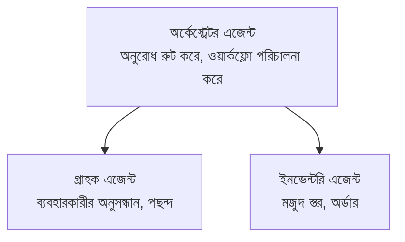

# Chapter 5: মাল্টি-এজেন্ট এআই সমাধান

**📚 Course**: [AZD ফর বিগিনার্স](../../README.md) | **⏱️ Duration**: 2-3 ঘন্টা | **⭐ Complexity**: উন্নত

---

## সারসংক্ষেপ

এই অধ্যায়টি জটিল পরিস্থিতির জন্য উন্নত মাল্টি-এজেন্ট আর্কিটেকচার প্যাটার্ন, এজেন্ট অর্কেস্ট্রেশন, এবং প্রোডাকশন-রেডি এআই ডিপ্লয়মেন্টগুলি কভার করে।

## শিখার লক্ষ্য

এই অধ্যায় সম্পন্ন করার মাধ্যমে, আপনি:
- মাল্টি-এজেন্ট আর্কিটেকচার প্যাটার্নগুলি বোঝা
- সমন্বিত এআই এজেন্ট সিস্টেম ডিপ্লয় করা
- এজেন্ট-থেকে-এজেন্ট যোগাযোগ বাস্তবায়ন করা
- প্রোডাকশন-রেডি মাল্টি-এজেন্ট সমাধান নির্মাণ করা

---

## 📚 পাঠসমূহ

| # | পাঠ | বর্ণনা | সময় |
|---|--------|-------------|------|
| 1 | [রিটেইল মাল্টি-এজেন্ট সমাধান](../../examples/retail-scenario.md) | সম্পূর্ণ বাস্তবায়নের ধাপে ধাপে নির্দেশিকা | 90 মিনিট |
| 2 | [সমন্বয় প্যাটার্ন](../chapter-06-pre-deployment/coordination-patterns.md) | এজেন্ট অর্কেস্ট্রেশন কৌশল | 30 মিনিট |
| 3 | [ARM টেমপ্লেট ডিপ্লয়মেন্ট](../../examples/retail-multiagent-arm-template/README.md) | এক-ক্লিক ডিপ্লয়মেন্ট | 30 মিনিট |

---

## 🚀 দ্রুত শুরু

```bash
# বিকল্প 1: একটি টেমপ্লেট থেকে স্থাপন
azd init --template agent-openai-python-prompty
azd up

# বিকল্প 2: একটি এজেন্ট ম্যানিফেস্ট থেকে স্থাপন (প্রয়োজন: azure.ai.agents এক্সটেনশন)
azd extension install azure.ai.agents
azd ai agent init -m agent-manifest.yaml
azd up
```

> **কোন পদ্ধতি?** কাজ করা স্যাম্পল থেকে শুরু করতে `azd init --template` ব্যবহার করুন। আপনার নিজস্ব এজেন্ট ম্যানিফেস্ট থাকলে `azd ai agent init` ব্যবহার করুন। সম্পূর্ণ বিবরণের জন্য [AZD AI CLI রেফারেন্স](../chapter-08-production/production-ai-practices.md#azd-ai-cli-commands-and-extensions) দেখুন।

---

## 🤖 মাল্টি-এজেন্ট আর্কিটেকচার


---

## 🎯 বৈশিষ্ট্যযুক্ত সমাধান: রিটেইল মাল্টি-এজেন্ট

এই [রিটেইল মাল্টি-এজেন্ট সমাধান](../../examples/retail-scenario.md) প্রদর্শন করে:

- **গ্রাহক এজেন্ট**: ব্যবহারকারীর ইন্টারঅ্যাকশন এবং পছন্দসমূহ পরিচালনা করে
- **ইনভেন্টরি এজেন্ট**: স্টক এবং অর্ডার প্রক্রিয়াকরণ পরিচালনা করে
- **অর্কেস্ট্রেটর**: এজেন্টদের মধ্যে সমন্বয় করে
- **শেয়ার্ড মেমরি**: এজেন্টগুলোর মধ্যে প্রসঙ্গ (context) পরিচালনা করে

### ব্যবহৃত সার্ভিসসমূহ

| সার্ভিস | উদ্দেশ্য |
|---------|---------|
| Microsoft Foundry Models | ভাষা বোঝাপড়া |
| Azure AI Search | পণ্যের ক্যাটালগ |
| Cosmos DB | এজেন্টের স্টেট এবং মেমরি |
| Container Apps | এজেন্ট হোস্টিং |
| Application Insights | পর্যবেক্ষণ |

---

## 🔗 নেভিগেশন

| দিক | অধ্যায় |
|-----------|---------|
| **পূর্ববর্তী** | [অধ্যায় 4: অবকাঠামো](../chapter-04-infrastructure/README.md) |
| **পরবর্তী** | [অধ্যায় 6: প্রি-ডিপ্লয়মেন্ট](../chapter-06-pre-deployment/README.md) |

---

## 📖 সম্পর্কিত রিসোর্স

- [এআই এজেন্ট গাইড](../chapter-02-ai-development/agents.md)
- [প্রোডাকশন এআই অনুশীলন](../chapter-08-production/production-ai-practices.md)
- [এআই সমস্যা সমাধান](../chapter-07-troubleshooting/ai-troubleshooting.md)

---

<!-- CO-OP TRANSLATOR DISCLAIMER START -->
অস্বীকৃতি:
এই দলিলটি AI অনুবাদ সেবা Co-op Translator (https://github.com/Azure/co-op-translator) ব্যবহার করে অনুবাদ করা হয়েছে। আমরা যথাসাধ্য সঠিকতা নিশ্চিত করার চেষ্টা করি, তবে অনুগ্রহ করে মনে রাখবেন যে স্বয়ংক্রিয় অনুবাদে ত্রুটি বা অসঙ্গতি থাকতে পারে। মূল নথিটি তার নিজ ভাষায়ই প্রামাণিক উৎস হিসেবে বিবেচিত হওয়া উচিত। গুরুত্বপূর্ণ তথ্যের ক্ষেত্রে পেশাদার মানব অনুবাদের পরামর্শ দেওয়া হয়। এই অনুবাদের ব্যবহারের ফলে যে কোনো ভুল বোঝাবুঝি বা ভুল ব্যাখ্যার জন্য আমরা দায়ী নই।
<!-- CO-OP TRANSLATOR DISCLAIMER END -->