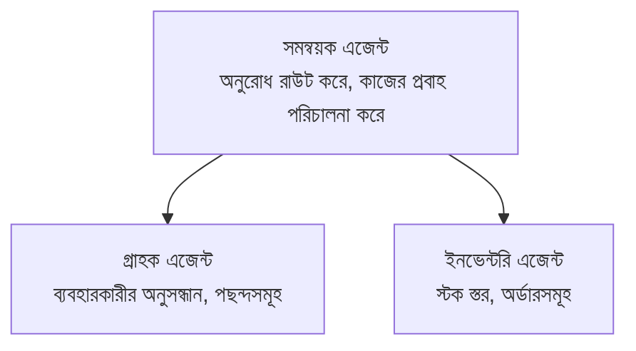

# Chapter 5: মাল্টি-এজেন্ট এআই সমাধান

**📚 পাঠ্যক্রম**: [AZD For Beginners](../../README.md) | **⏱️ সময়কাল**: 2-3 ঘণ্টা | **⭐ জটিলতা**: উন্নত

---

## সংক্ষিপ্ত বিবরণ

এই অধ্যায়ে উন্নত মাল্টি-এজেন্ট আর্কিটেকচার প্যাটার্ন, এজেন্ট সমন্বয়, এবং জটিল পরিস্থিতির জন্য প্রোডাকশন-রেডি এআই ডিপ্লয়মেন্টসমূহ আলোচনা করা হয়েছে।

> `azd 1.25.6`-এর বিরুদ্ধে জুন 2026-এ যাচাইকৃত।

## শিখন লক্ষ্য

এই অধ্যায় সম্পন্ন করলে আপনি:
- মাল্টি-এজেন্ট আর্কিটেকচার প্যাটার্নগুলো বুঝতে পারবেন
- সমন্বিত এআই এজেন্ট সিস্টেম ডিপ্লয় করতে সক্ষম হবেন
- এজেন্ট-থেকে-এজেন্ট কমিউনিকেশন বাস্তবায়ন করতে পারবেন
- প্রোডাকশন-রেডি মাল্টি-এজেন্ট সমাধান তৈরি করতে পারবেন

---

## 📚 পাঠসমূহ

| # | পাঠ | বর্ণনা | সময় |
|---|--------|-------------|------|
| 1 | [মাল্টি-এজেন্ট বেসিক্স](multi-agent-basics.md) | প্রায়োগিক: `azd up` দিয়ে কার্যরত একটি মাল্টি-এজেন্ট অ্যাপ ডিপ্লয় করুন | 45 মিনিট |
| 2 | [সমন্বয় প্যাটার্ন](../chapter-06-pre-deployment/coordination-patterns.md) | এজেন্ট সমন্বয় কৌশল (অধ্যায় 6-এ চলবে) | 30 মিনিট |
| 3 | [ARM টেমপ্লেট ডিপ্লয়মেন্ট](../../examples/retail-multiagent-arm-template/README.md) | এক-ক্লিকে ডিপ্লয়মেন্ট উদাহরণ | 30 মিনিট |

> **পাঠ 1 দিয়ে শুরু করুন।** এটি এই অধ্যায়ের একমাত্র সম্পূর্ণ প্রায়োগিক ও ডিপ্লয়েবল পাঠ। পাঠ 2 অধ্যায় 6-এ আছে (এটি প্রি-ডিপ্লয়মেন্ট পরিকল্পনার সঙ্গে শেয়ার করা), এবং [রিটেইল মাল্টি-এজেন্ট সলিউশন](../../examples/retail-scenario.md) একটি আর্কিটেকচার ব্লুপ্রিন্ট—একটি ডিজাইন রেফারেন্স, এক-কমান্ড টেমপ্লেট নয়।

---

## 🚀 দ্রুত শুরু

```bash
# বিকল্প 1: একটি টেমপ্লেট থেকে ডিপ্লয় করুন
azd init --template agent-openai-python-prompty
azd up

# বিকল্প 2: একটি এজেন্ট ম্যানিফেস্ট থেকে ডিপ্লয় করুন (azure.ai.agents এক্সটেনশন প্রয়োজন)
azd extension install azure.ai.agents
azd ai agent init -m agent-manifest.yaml
azd up
```

> **কোন পদ্ধতি?** `azd init --template` ব্যবহার করুন একটি কার্যরত স্যাম্পল থেকে শুরু করার জন্য। `azd ai agent init` ব্যবহার করুন যখন আপনার নিজের এজেন্ট ম্যানিফেস্ট থাকে। পূর্ণ বিবরণের জন্য [AZD AI CLI রেফারেন্স](../chapter-08-production/production-ai-practices.md#azd-ai-cli-commands-and-extensions) দেখুন।

---

## 🤖 মাল্টি-এজেন্ট আর্কিটেকচার



---

## 🎯 বৈশিষ্ট্যযুক্ত সমাধান: রিটেইল মাল্টি-এজেন্ট

[রিটেইল মাল্টি-এজেন্ট সলিউশন](../../examples/retail-scenario.md) প্রদর্শন করে:

- **কাস্টমার এজেন্ট**: ব্যবহারকারীর ইন্টারঅ্যাকশন এবং পছন্দগুলি পরিচালনা করে
- **ইনভেন্টরি এজেন্ট**: স্টক এবং অর্ডার প্রক্রিয়াকরণ পরিচালনা করে
- **অর্কেস্ট্রেটর**: এজেন্টগুলোর মধ্যে সমন্বয় করে
- **শেয়ারড মেমোরি**: এজেন্টগুলোর মধ্যে প্রসঙ্গ ভাগাভাগি করে পরিচালনা

### ব্যবহৃত সার্ভিসসমূহ

| সার্ভিস | উদ্দেশ্য |
|---------|---------|
| Microsoft Foundry Models | ভাষা বোঝার জন্য |
| Azure AI Search | পণ্যের ক্যাটালগ |
| Cosmos DB | এজেন্টের স্টেট এবং মেমরি |
| Container Apps | এজেন্ট হোস্টিং |
| Application Insights | মনিটরিং |

---

## 🔗 নেভিগেশন

| দিক | অধ্যায় |
|-----------|---------|
| **পূর্ববর্তী** | [অধ্যায় 4: ইনফ্রাস্ট্রাকচার](../chapter-04-infrastructure/README.md) |
| **পরবর্তী** | [অধ্যায় 6: প্রি-ডিপ্লয়মেন্ট](../chapter-06-pre-deployment/README.md) |

---

## 📖 সম্পর্কিত রিসোর্স

- [এআই এজেন্ট গাইড](../chapter-02-ai-development/agents.md)
- [প্রোডাকশন এআই অনুশীলন](../chapter-08-production/production-ai-practices.md)
- [এআই ত্রুটিনির্ণয়](../chapter-07-troubleshooting/ai-troubleshooting.md)

---

<!-- CO-OP TRANSLATOR DISCLAIMER START -->
**অস্বীকৃতি**:
এই নথিটি AI অনুবাদ পরিষেবা [Co-op Translator](https://github.com/Azure/co-op-translator) ব্যবহার করে অনূদিত হয়েছে। যদিও আমরা শুদ্ধতার জন্য চেষ্টা করি, অনুগ্রহ করে মনে রাখবেন যে স্বয়ংক্রিয় অনুবাদে ত্রুটি বা অসঙ্গতি থাকতে পারে। মূল নথিটি তার স্বভাষায় কর্তৃত্বপূর্ণ উৎস হিসেবে বিবেচিত হওয়া উচিত। গুরুত্বপূর্ণ তথ্যের জন্য পেশাদার মানব অনুবাদ সুপারিশ করা হয়। এই অনুবাদের ব্যবহারে প্রয়োজনীয় ভুল বোঝাবুঝি বা ভুল ব্যাখ্যার জন্য আমরা দায়বদ্ধ নই।
<!-- CO-OP TRANSLATOR DISCLAIMER END -->