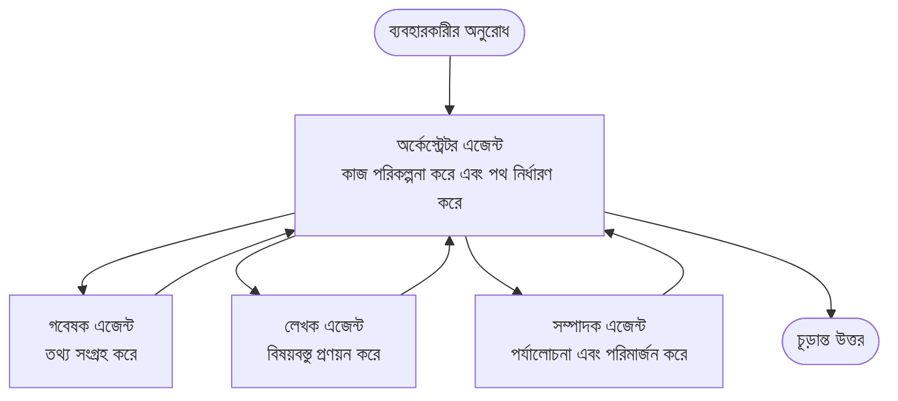

# মাল্টি-এজেন্ট বেসিকস - আপনার প্রথম সমন্বিত AI সিস্টেম স্থাপন করুন

**অধ্যায় নেভিগেশন:**
- **📚 কোর্স হোম**: [AZD ফর বিগিনার্স](../../README.md)
- **📖 বর্তমান অধ্যায়**: অধ্যায় ৫ - মাল্টি-এজেন্ট AI সলিউশন
- **⬅️ পূর্ববর্তী**: [অধ্যায় ৪: ইনফ্রাস্ট্রাকচার](../chapter-04-infrastructure/README.md)
- **➡️ পরবর্তী**: [সমন্বয় প্যাটার্নস](../chapter-06-pre-deployment/coordination-patterns.md)

> `azd 1.27.1` এর বিরুদ্ধে বৈধকরণ করা হয়েছে জুলাই ২০২৬ সালে।

## পরিচিতি

আগের অধ্যায়গুলোতে আপনি একটি একক অ্যাপ্লিকেশন স্থাপন করেছেন—এবং অধ্যায় ২-তে একটি একক AI এজেন্ট স্থাপন করেছেন। এই পাঠটি পরবর্তী পদক্ষেপ নিয়ে: একটি **মাল্টি-এজেন্ট সিস্টেম** স্থাপন, যেখানে বেশ কয়েকটি বিশেষায়িত এজেন্ট একসঙ্গে কাজ করে একটি সমস্যা সমাধান করে যা একক এজেন্ট নিজেরাই ভালভাবে করতে পারত না।

নবীনদের জন্য সুখবর: **আপনাকে নতুন কমান্ড শিখতে হবে না।** একটি মাল্টি-এজেন্ট সলিউশন এখনও একটি azd প্রকল্প। আপনি `azd init`, `azd up`, পরীক্ষা, এবং `azd down` করবেন—ঠিক সেই ওয়ার্কফ্লো যা আপনি ইতিমধ্যে জানেন। যা পরিবর্তিত হয় তা হল অ্যাপের *আকার* এর মধ্যে।

## শেখার লক্ষ্য

এই পাঠের শেষে, আপনি:
- বুঝতে পারবেন "মাল্টি-এজেন্ট" মানে কী এবং কখন অতিরিক্ত জটিলতা যুক্ত করা উচিত
- একটি মাল্টি-এজেন্ট সিস্টেমে সাধারণ ভূমিকা চিনতে পারবেন (অর্কেস্ট্রেটর + বিশেষজ্ঞরা)
- `azd up` দিয়ে একটি বাস্তব, ক্রিয়াশীল মাল্টি-এজেন্ট টেমপ্লেট স্থাপন করতে পারবেন
- মাল্টি-এজেন্ট অ্যাপকে ব্যাকআপ করার Azure রিসোর্সগুলো বুঝতে পারবেন
- সলিউশনটি নিরাপদে যাচাই, কাস্টমাইজ এবং বন্ধ করার উপায় জানবেন

## শেখার ফলাফল

এই পাঠ শেষ করার পর, আপনি সক্ষম হবেন:
- একক এজেন্ট এবং মাল্টি-এজেন্ট সিস্টেমের পার্থক্য ব্যাখ্যা করতে
- টুলসসহ একক এজেন্ট এবং একটি প্রকৃত মাল্টি-এজেন্ট ডিজাইনের মধ্যে নির্বাচন করতে
- azd দিয়ে মাল্টি-এজেন্ট টেমপ্লেট সম্পূর্ণরূপে স্থাপন ও পরীক্ষা করতে
- নির্ধারণ করতে কোথায় প্রতিটি এজেন্ট চলে এবং তারা কিভাবে যোগাযোগ করে
- সমস্ত রিসোর্স পরিষ্কার করতে যাতে চলমান চার্জ না হয়

---

## মাল্টি-এজেন্ট সিস্টেম কী?

একটি একক AI এজেন্ট হল একটি মডেল যার সাথে নির্দেশাবলী এবং (ঐচ্ছিক) কিছু টুলস থাকে। এটি ফোকাসড কাজের জন্য ভালো কাজ করে। কিন্তু যখন কাজ বাড়ে—গবেষণা, তারপর লেখালেখি, তারপর সম্পাদনা, তারপর সত্যতা যাচাই—ততক্ষণ সবকিছু একটি প্রম্পটে রাখলে এজেন্ট ধীর হয়ে যায়, কম নির্ভরযোগ্য হয় এবং ডিবাগ করা কঠিন হয়।

একটি **মাল্টি-এজেন্ট সিস্টেম** কাজ ভেঙে দেয় বিশেষজ্ঞদের মধ্যে যারা প্রতিটি একটি কাজ ভালভাবে করে, যিনি একটি অর্কেস্ট্রেটর দ্বারা সমন্বিত:



### দুইটি ভূমিকা যা আপনি সর্বদা দেখবেন

| ভূমিকা | কাজ | উদাহরণ |
|------|-----|---------|
| **অর্কেস্ট্রেটর** | সিদ্ধান্ত নেয় *পরবর্তী কী হবে* এবং এজেন্টদের মধ্যে কাজ বিতরণ করে | "প্রথম গবেষণা, তারপর লেখা, তারপর সম্পাদনা" |
| **বিশেষজ্ঞ** | একটি কেন্দ্রীভূত কাজ করে এবং ফলাফল দেয় | শুধুমাত্র তথ্য সংগ্রহকারী "গবেষক" |

### আপনার কি প্রকৃতপক্ষে একাধিক এজেন্টের প্রয়োজন?

সাদামাটা শুরু করুন। মাল্টি-এজেন্ট **শুধুমাত্র** নিন যখন নিচের কোনটি সত্য হয়:

- ✅ কাজের **স্বতন্ত্র ধাপ** আছে যা ভিন্ন নির্দেশনার সাহায্য পায় (গবেষণা বনাম লেখা বনাম পর্যালোচনা)
- ✅ আপনি চান বিশেষজ্ঞরা **সমান্তরালে** কাজ করুক সময় বাঁচাতে
- ✅ বিভিন্ন ধাপের জন্য **ভিন্ন টুলস বা ডেটা সোর্স** প্রয়োজন
- ✅ আপনি চান প্রতিটি ধাপ **স্বতন্ত্রভাবে পরীক্ষা এবং ডিবাগযোগ্য** হোক

আপনার কাজ যদি একটি একক প্রশ্নোত্তর বা একটি সাধারণ টুল কল হয়, তবে একটি **টুলসসহ একক এজেন্ট** (অধ্যায় ২) সহজ, সস্তা এবং পরিচালনায় সহজ।

> **শিক্ষানবিশদের টিপস:** "আরো এজেন্ট" মানে "ভালো" নয়। প্রতিটি এজেন্টে লেটেন্সি, খরচ আর একটি নতুন পর্যবেক্ষণের বিষয় যুক্ত হয়। শুধুমাত্র যখন সমস্যা স্পষ্টভাবে ভাগ হয়ে যায় তখন এজেন্ট যোগ করুন।

---

## Azure এ মাল্টি-এজেন্ট তৈরি করার দুই উপায়

| পদ্ধতি | এটি কী | সেরা জন্য |
|----------|-----------|----------|
| **একক এজেন্ট + টুলস** | একটি Foundry এজেন্ট যে ফাংশন/টুলস কল করে | সহজ ওয়ার্কফ্লো, শুরু করা |
| **একাধিক সমন্বিত এজেন্ট** | বেশ কয়েকটি এজেন্ট একটি অর্কেস্ট্রেটরের সঙ্গে | স্বতন্ত্র ধাপ, সমান্তরাল কাজ, বিশেষীকরণ |

এই পাঠটি দ্বিতীয় পদ্ধতিটির উপর কেন্দ্র করে **প্রস্তুত টেমপ্লেট** ব্যবহার করে, যাতে আপনি নিজে তৈরি করার আগে একটি বাস্তব মাল্টি-এজেন্ট সিস্টেম দেখতে পান।

---

## হাতে কলমে: একটি কার্যকর মাল্টি-এজেন্ট অ্যাপ স্থাপন

আমরা স্থাপন করব **Contoso Creative Writer**, একটি অফিসিয়াল Azure নমুনা যা একাধিক এজেন্ট (গবেষক, লেখক, সম্পাদক) ব্যবহার করে যেটি একটি প্রবন্ধ তৈরির জন্য সমন্বিত। এটি একটি চমৎকার প্রথম মাল্টি-এজেন্ট অ্যাপ কারণ ভূমিকা সহজে বোঝা যায়।

### ধাপ ১: টেমপ্লেট ইনিশিয়ালাইজ করুন

```bash
# একটি কার্যকারী ফোল্ডার তৈরি করুন
mkdir creative-writer && cd creative-writer

# অফিসিয়াল মাল্টি-এজেন্ট টেমপ্লেট থেকে আরম্ভ করুন
azd init --template contoso-creative-writer
```

> কখনো যে কোনো সময় আরও মাল্টি-এজেন্ট টেমপ্লেট ব্রাউজ করুন [Awesome AZD AI গ্যালারি](https://azure.github.io/awesome-azd/?tags=ai)-এ। অন্যান্য শিক্ষানবিশ-বান্ধব বিকল্পগুলির মধ্যে রয়েছে `get-started-with-ai-agents` এবং `azure-ai-travel-agents`।

### ধাপ ২: প্রমাণীকরণ করুন

```bash
# azd ওয়ার্কফ্লোর জন্য প্রয়োজনীয়
azd auth login
```

### ধাপ ৩: একটি পরিবেশ তৈরি করুন

```bash
azd env new dev
```

### ধাপ ৪: প্রিভিউ করুন, তারপর স্থাপন করুন

```bash
# কিছু খরচ করার আগে কি তৈরি হবে তা দেখুন (সুপারিশকৃত)
azd provision --preview

# এক ধাপে পরিকাঠামো সরবরাহ করুন এবং সমস্ত এজেন্ট মোতায়েন করুন
azd up
```

`azd up` সাবস্ক্রিপশন এবং অঞ্চল সম্পর্কে তথ্য চাইবে, তারপর Azure রিসোর্স প্রস্তুত করবে এবং অ্যাপ্লিকেশন স্থাপন করবে। AI ডিপ্লয়মেন্ট একটি সাধারণ ওয়েব অ্যাপের থেকে বেশি সময় নিতে পারে—যদি আপনি বড় মডেল স্থাপন করছেন, তাহলে আপনি ডিপ্লয় টাইমআউট বাড়াতে পারেন:

```bash
azd deploy --timeout 1800
```

> **খরচ এবং ক্ষমতা সম্পর্কে সতর্কতা:** মাল্টি-এজেন্ট অ্যাপগুলি AI মডেল স্থাপন করে যা কোটা ব্যবহার করে এবং খরচ বাড়ায়। যদি `azd up` মডেল কোটায় ব্যর্থ হয়, তাহলে [AI Troubleshooting](../chapter-07-troubleshooting/ai-troubleshooting.md) দেখুন অঞ্চল এবং কোটা সংশোধনের জন্য, এবং অধ্যায় ৬ [ক্যাপাসিটি প্ল্যানিং](../chapter-06-pre-deployment/capacity-planning.md)।

---

## আপনি যা স্থাপন করেছেন তা বোঝা

এমন একটি স্বাভাবিক মাল্টি-এজেন্ট অ্যাপ একটি Azure রিসোর্স সেট প্রস্তুত করে যা উপরের চিত্রের দায়িত্বগুলোর সাথে সরাসরি যুক্ত:

| রিসোর্স | কেন সেটি রয়েছে |
|----------|----------------|
| **Microsoft Foundry / মডেলস** | প্রতিটি এজেন্ট ব্যবহার করা ভাষার মডেল হোস্ট করে |
| **Azure AI Search** | গবেষক এজেন্টকে অনুসন্ধানের জন্য ভিত্তিপ্রদান তথ্য দেয় |
| **কন্টেনার অ্যাপস** (বা অ্যাপ সার্ভিস) | অর্কেস্ট্রেটর এবং এজেন্ট কোড হোস্ট করে |
| **কসমস ডিবি** (কিছু নমুনায়) | এজেন্টদের মধ্যে ভাগ করা অবস্থা/স্মৃতি সংরক্ষণ করে |
| **অ্যাপ্লিকেশন ইনসাইটস** | এজেন্টদের মধ্যে অনুরোধ *ট্রেস* করে যাতে আপনি প্রবাহ ডিবাগ করতে পারেন |

### এজেন্টরা কিভাবে একে অপরের সঙ্গে কথা বলে

বেশিরভাগ azd মাল্টি-এজেন্ট নমুনায়, **অর্কেস্ট্রেটর আপনার অ্যাপ্লিকেশন কোডে চলে** (উদাহরণস্বরূপ, Semantic Kernel বা Microsoft Agent Framework এর মতো ফ্রেমওয়ার্ক ব্যবহার করে)। অর্কেস্ট্রেটর পর্যায়ক্রমে প্রতিটি বিশেষজ্ঞ এজেন্ট কল করে, ফলাফল পাস করে এবং চূড়ান্ত উত্তর গঠন করে। এজেন্টরা প্রেক্ষাপট শেয়ার করে:

- **ফাংশন/টুল কলস** — অর্কেস্ট্রেটর বিশেষজ্ঞকে ডাকে এবং ফলাফল ফিরে পায়
- **শেয়ার্ড মেমোরি** — একটি ডাটাবেস (অধিকাংশ সময় কসমস ডিবি) রয়েছে যা উভয় এজেন্ট পড়তে পারে
- **বার্তা/ইভেন্টস** — ঢিলা সংযোগের জন্য, এজেন্টরা কিউ বা সার্ভিস বাসের মাধ্যমে যোগাযোগ করে

> **ডিবাগিং এর জন্য কেন এটা গুরুত্বপূর্ণ:** কারণ প্রতিটি ধাপ আলাদা, অ্যাপ্লিকেশন ইনসাইটস দেখায় *কোন* এজেন্ট ধীরে চলেছে বা ব্যর্থ হয়েছে। এটিই মূল কারণ কাজ ভাগ করে এজেন্টদের মধ্যে বিভক্ত করা।

---

## স্থাপন যাচাই করুন

এগিয়ে যাওয়ার আগে নিশ্চিত করুন সিস্টেমটি সত্যিই কাজ করছে:

```bash
# নির্মিত এন্ডপয়েন্টগুলি দেখান
azd show

# অ্যাপটির মনিটরিং ড্যাশবোর্ড খুলুন
azd monitor

# যদি কিছু ভুল মনে হয় তবে লগগুলি অনুসরণ করুন
azd monitor --logs
```

তারপর `azd show` থেকে অ্যাপ URL খুলুন এবং একটি অনুরোধ দিন যা সব এজেন্টকে কাজে লাগায় (Creative Writer এর জন্য, একটি বিষয় নিয়ে একটি সংক্ষিপ্ত প্রবন্ধ লেখার জন্য বলুন)। অ্যাপ্লিকেশন ইনসাইটস **ট্রানজেকশন সার্চে**, আপনি দেখতে পাবেন অনুরোধ গবেষক, লেখক, এবং সম্পাদক ধাপগুলোর মধ্যে ছড়িয়ে পড়েছে।

**সফলতার মানদণ্ড:**
- ✅ `azd show` একটি পৌঁছাতে পারা এন্ডপয়েন্ট তালিকা করে
- ✅ একটি অনুরোধ একটি ফলাফল দেয় যা স্পষ্টভাবে একাধিক ধাপ পার হয়েছে
- ✅ অ্যাপ্লিকেশন ইনসাইটস একাধিক এজেন্ট ধাপের ট্রেস দেখায়

---

## কাস্টমাইজ করুন: একটি এজেন্ট যোগ করুন বা সমন্বয় করুন

কারণ প্রতিটি এজেন্ট কেবল নির্দেশাবলী এবং টুলস নিয়ে গঠিত, কাস্টমাইজেশন সহজ:

১. **টেমপ্লেটের মধ্যে এজেন্ট সংজ্ঞাগুলো খুঁজুন** (অধিকাংশ সময় `prompts/`, `agents/`, অথবা `*.prompty` ফাইলসেট)
২. **একটি এজেন্টের নির্দেশনা টিউন করুন** — উদাহরণস্বরূপ, সম্পাদক এজেন্টকে একটি নির্দিষ্ট টোন বা শব্দ সংখ্যা বজায় রাখতে বলুন
৩. **শুধুমাত্র কোড পুনরায় স্থাপন করুন** (ইনফ্রাস্ট্রাকচার অপরিবর্তিত থাকবে):

   ```bash
   azd deploy
   ```

আরও দূর পর্যন্ত যেতে এবং আপনার *নিজস্ব* ম্যানিফেস্ট থেকে এজেন্ট তৈরি করতে, এজেন্ট এক্সটেনশন এবং তার সম্পূর্ণ লাইফসাইকেল ব্যবহার করুন:

```bash
azd extension install azure.ai.agents
azd ai agent init -m agent-manifest.yaml
azd up
azd ai agent invoke      # পরীক্ষা, প্রতিক্রিয়া সময় সহ
```

[অধ্যায় ২: এজেন্টস](../chapter-02-ai-development/agents.md) এবং [AZD AI CLI রেফারেন্স](../chapter-08-production/production-ai-practices.md#azd-ai-cli-commands-and-extensions) দেখুন সম্পূর্ণ এজেন্ট লাইফসাইকেলের জন্য (`invoke`, `eval generate`, `optimize`, `delete`)।

---

## পরিষ্কার করুন

মাল্টি-এজেন্ট অ্যাপস অনেক বিলযোগ্য সার্ভিস চালায়। কাজ শেষ হলে সবকিছু বন্ধ করুন:

```bash
azd down --force --purge
```

`--purge` ফ্ল্যাগ সফট-ডিলিটেড AI রিসোর্স (যেমন Foundry/Azure AI সার্ভিস অ্যাকাউন্ট) মুছে দেয় যাতে তারা ভবিষ্যতের পুনরায় স্থাপনে বাধা না দেয় বা খরচ বাড়ায় না।

---

## প্রোডাকশন মাল্টি-এজেন্ট সিস্টেম সম্পর্কে একটি নোট

এই রিপোজিটরির [Retail Multi-Agent Solution](../../examples/retail-scenario.md) একটি **আর্কিটেকচার ব্লুপ্রিন্ট**, এক কমান্ড টেমপ্লেট নয়—এটি নথিভুক্ত করে কিভাবে একটি প্রোডাকশন রিটেইল সিস্টেম *তৈরি* হবে (এবং স্পষ্ট করে দেয় যে পূর্ণ নির্মাণ একটি বৃহৎ প্রচেষ্টা)। এটি ব্যবহার করুন একটি ডিজাইন রেফারেন্স হিসেবে *যখন* আপনি এখানে একটি কাজ করে এমন নমুনা স্থাপন করেছেন। প্রোডাকশন সংক্রান্ত বিষয় (সহনশীলতা, খরচ, পর্যবেক্ষণ, পরিচালনা) জন্য, কীভাবে আরএসএন্ড দিয়ে অধ্যায় ৮: প্রোডাকশন AI অনুশীলন চালিয়ে যান (../chapter-08-production/production-ai-practices.md)।

---

## সংক্ষিপ্ত বিবরণ

- একটি মাল্টি-এজেন্ট সিস্টেম কাজ ভাগ করে দেয় বিশেষজ্ঞদের মধ্যে যাকে একটি অর্কেস্ট্রেটর সমন্বয় করে।
- এটি ব্যবহার করুন শুধুমাত্র যখন কাজের স্বতন্ত্র ধাপ, সমান্তরালতা, অথবা প্রতিটি ধাপে ভিন্ন টুলস প্রয়োজন—অন্যথায় একটি একক এজেন্ট পছন্দ করুন।
- azd ওয়ার্কফ্লো অপরিবর্তিত: `azd init` → `azd up` → পরীক্ষা → `azd down`।
- একটি বাস্তব টেমপ্লেট যেমন `contoso-creative-writer` আপনাকে আজই একটি কার্যকর মাল্টি-এজেন্ট অ্যাপ দেখতে এবং কাস্টমাইজ করতে দেয়।
- এজেন্টদের মধ্যে অ্যাপ্লিকেশন ইনসাইটস ট্রেসিং মাল্টি-এজেন্ট ডিজাইনের একটি বড় ব্যবহারিক সুবিধা।

---

## 🔗 নেভিগেশন

| দিকনির্দেশ | পাঠ |
|-----------|--------|
| **পূর্ববর্তী** | [অধ্যায় ৪: ইনফ্রাস্ট্রাকচার](../chapter-04-infrastructure/README.md) |
| **পরবর্তী** | [সমন্বয় প্যাটার্নস](../chapter-06-pre-deployment/coordination-patterns.md) |

## 📖 সম্পর্কিত সম্পদ

- [AI এজেন্ট গাইড](../chapter-02-ai-development/agents.md)
- [সমন্বয় প্যাটার্নস](../chapter-06-pre-deployment/coordination-patterns.md)
- [প্রোডাকশন AI অনুশীলন](../chapter-08-production/production-ai-practices.md)
- [AI সমস্যার সমাধান](../chapter-07-troubleshooting/ai-troubleshooting.md)

---

<!-- CO-OP TRANSLATOR DISCLAIMER START -->
**অস্বীকৃতি**:
এই নথিটি AI অনুবাদ পরিষেবা [Co-op Translator](https://github.com/Azure/co-op-translator) ব্যবহার করে অনূদিত হয়েছে। যদিও আমরা শুদ্ধতার জন্য চেষ্টা করি, অনুগ্রহ করে মনে রাখবেন যে স্বয়ংক্রিয় অনুবাদে ত্রুটি বা অসঙ্গতি থাকতে পারে। মূল নথিটি তার স্বভাষায় কর্তৃত্বপূর্ণ উৎস হিসেবে বিবেচিত হওয়া উচিত। গুরুত্বপূর্ণ তথ্যের জন্য পেশাদার মানব অনুবাদ সুপারিশ করা হয়। এই অনুবাদের ব্যবহারে প্রয়োজনীয় ভুল বোঝাবুঝি বা ভুল ব্যাখ্যার জন্য আমরা দায়বদ্ধ নই।
<!-- CO-OP TRANSLATOR DISCLAIMER END -->