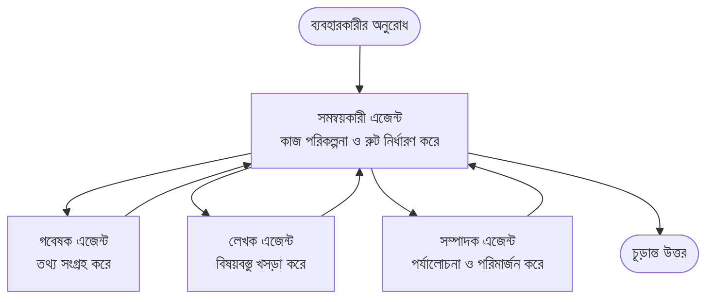

# Multi-Agent Basics - আপনার প্রথম সমন্বিত AI সিস্টেম স্থাপন

**অধ্যায় নেভিগেশন:**
- **📚 কোর্স হোম**: [নতুনদের জন্য AZD](../../README.md)
- **📖 বর্তমান অধ্যায়**: অধ্যায় 5 - মাল্টি-এজেন্ট AI সমাধান
- **⬅️ পূর্ববর্তী**: [অধ্যায় 4: ইনফ্রাস্ট্রাকচার](../chapter-04-infrastructure/README.md)
- **➡️ পরবর্তী**: [সমন্বয় প্যাটার্ন](../chapter-06-pre-deployment/coordination-patterns.md)

> `azd 1.25.6`-এর বিরুদ্ধে 2026 সালের জুনে যাচাই করা হয়েছে।

## ভূমিকা

আগের অধ্যায়গুলিতে আপনি একটি একক অ্যাপ্লিকেশন ডিপ্লয় করেছেন—এবং অধ্যায় 2-এ আপনি একটি একক AI এজেন্ট ডিপ্লয় করেছিলেন। এই পাঠটি পরবর্তী ধাপ গ্রহণ করে: একটি **মাল্টি-এজেন্ট সিস্টেম** স্থাপন করা, যেখানে একাধিক বিশেষায়িত এজেন্ট একসাথে কাজ করে এমন একটি সমস্যা সমাধান করে যা একটি একক এজেন্ট নিজেরাই ভালোভাবে মোকাবিলা করতে পারত না।

ভাল খবর নবাগতদের জন্য: **আপনাকে নতুন কমান্ডের দরকার নেই।** একটি মাল্টি-এজেন্ট সমাধান এখনও একটি azd প্রকল্প। আপনি `azd init`, `azd up`, পরীক্ষা করবেন, এবং `azd down`—ঠিকই সেই ওয়ার্কফ্লো যা আপনি ইতিমধ্যেই জানেন। পরিবর্তন হয় কেবল অ্যাপের ভিতরের *আকৃতিতে*।

## শেখার লক্ষ্য

By the end of this lesson, you will:
- বুঝতে পারবেন "মাল্টি-এজেন্ট" কী বোঝায় এবং কখন অতিরিক্ত জটিলতা গ্রহণ করা মূল্যবান
- একটি মাল্টি-এজেন্ট সিস্টেমে সাধারণ ভূমিকাগুলো চেনতে পারবেন (অর্চেস্ট্রেটর + বিশেষজ্ঞরা)
- `azd up` দিয়ে একটি কাজ করা বাস্তব মাল্টি-এজেন্ট টেমপ্লেট ডিপ্লয় করতে
- বোঝতে পারবেন কোন Azure রিসোর্সগুলো একটি মাল্টি-এজেন্ট অ্যাপকে সমর্থন করে
- জানবেন কিভাবে সমাধানটি নিরাপদে যাচাই, কাস্টমাইজ এবং পরিষ্কার করতে হয়

## শেখার ফলাফল

এই পাঠটি সম্পন্ন করার পরে, আপনি সক্ষম হবেন:
- একটি একক এজেন্ট এবং একটি মাল্টি-এজেন্ট সিস্টেমের মধ্যে পার্থক্য ব্যাখ্যা করতে
- টুলসহ একটি একক এজেন্ট বনাম একটি প্রকৃত মাল্টি-এজেন্ট ডিজাইনের মধ্যে নির্বাচন করতে
- azd ব্যবহার করে একটি মাল্টি-এজেন্ট টেমপ্লেট সম্পূর্ণরূপে ডিপ্লয় ও পরীক্ষা করতে
- চিহ্নিত করতে পারার যে প্রতিটি এজেন্ট কোথায় চলে এবং তারা কীভাবে যোগাযোগ করে
- চলমান খরচ এড়াতে সমস্ত রিসোর্স পরিষ্কার করতে

---

## মাল্টি-এজেন্ট সিস্টেম কী?

একটি একক AI এজেন্ট হলো একটি মডেল যার একটি নির্দেশনার সেট এবং (ঐচ্ছিকভাবে) কিছু টুল থাকে। এটি ফোকাস করা কাজগুলোর জন্য ভালো কাজ করে। কিন্তু যখন একটি কাজ বড় হয়—গবেষণা, তারপর লেখা, তারপর সম্পাদনা, তারপর তথ্য যাচাই—সবকিছু একটি প্রম্পটে টুকে দেয়ার ফলে এজেন্ট ধীর, কম নির্ভরযোগ্য এবং ডিবাগ করা কঠিন হয়ে যায়।

একটি **মাল্টি-এজেন্ট সিস্টেম** কাজটি বিশেষজ্ঞদের মধ্যে ভাগ করে দেয়, যারা প্রতিটি একটি কাজ ভালোভাবে করে, এবং একটি অর্চেস্ট্রেটর দ্বারা সমন্বয় করা হয়:



### আপনি যা সবসময় দেখবেন এমন দুটি ভূমিকা

| ভূমিকা | কাজ | উদাহরণ |
|------|-----|---------|
| **অর্চেস্ট্রেটর** | নির্ধারণ করে *পরবর্তী কি হবে* এবং এজেন্টদের মধ্যে কাজ রুট করে | "প্রথম গবেষণা, তারপর লেখা, তারপর সম্পাদনা" |
| **বিশেষজ্ঞ** | একটি নিবন্ধিত কাজ করে এবং একটি ফলাফল ফেরত দেয় | একটি "গবেষক" যারা শুধু তথ্য সংগ্রহ করে |

### আপনার কি প্রকৃতপক্ষে একাধিক এজেন্টের প্রয়োজন?

সহজ থেকে শুরু করুন। মাল্টি-এজেন্ট ব্যবহার করুন **শুধুমাত্র** যখন নিম্নের কোনটি সত্য:

- ✅ কাজটির **স্পষ্ট ধাপ** আছে যা বিভিন্ন নির্দেশনার ফলে উপকৃত হয় (গবেষণা বনাম লেখা বনাম পর্যালোচনা)
- ✅ আপনি চান বিশেষজ্ঞরা **সমান্তরালভাবে** চলুক যাতে সময় বাঁচে
- ✅ বিভিন্ন ধাপের জন্য **বিভিন্ন টুল বা ডেটা উৎস** প্রয়োজন
- ✅ আপনি চান প্রতিটি ধাপ **স্বতন্ত্রভাবে পরীক্ষাযোগ্য ও ডিবাগযোগ্য** হোক

If your task is a single question-and-answer or a simple tool call, a **single agent with tools** (Chapter 2) is simpler, cheaper, and easier to operate.

> **নবাগত টিপস:** "আরও এজেন্ট" মানে "ভালো" নয়। প্রতিটি এজেন্টে লেটেন্সি, খরচ, এবং মনিটর করার জন্য একটি নতুন বিষয় যোগ হয়। কেবল তখনি এজেন্ট যোগ করুন যখন সমস্যা স্পষ্টভাবে অংশে বিভক্ত হয়।

---

## Azure-এ মাল্টি-এজেন্ট নির্মাণের দুইটি উপায়

| পদ্ধতি | এটি কী | আদর্শ পরিস্থিতি |
|----------|-----------|----------|
| **একক এজেন্ট + টুলস** | একটি Foundry এজেন্ট যা ফাংশন/টুল কল করে | সরল ওয়ার্কফ্লো, শুরু করার জন্য |
| **একাধিক সমন্বিত এজেন্ট** | একাধিক এজেন্ট একটি অর্চেস্ট্রেটরের সাথে | স্বতন্ত্র ধাপ, সমান্তরাল কাজ, বিশেষীকরণ |

এই পাঠ দ্বিতীয় পদ্ধতিটিকেই কেন্দ্র করে একটি **প্রস্তুত-টেমপ্লেট** ব্যবহার করে, যাতে আপনি একটি বাস্তব মাল্টি-এজেন্ট সিস্টেম চালাতে দেখতে পারেন তারপরে নিজেরটি তৈরি করার আগে।

---

## হাতে-কলমে: একটি কার্যকর মাল্টি-এজেন্ট অ্যাপ ডিপ্লয় করুন

আমরা **Contoso Creative Writer** ডিপ্লয় করবো, যা একটি অফিসিয়াল Azure উদাহরণ এবং এতে একাধিক এজেন্ট (গবেষক, লেখক, সম্পাদক) রয়েছে যারা একটি নিবন্ধ তৈরি করতে সমন্বিতভাবে কাজ করে। এটা প্রথম মাল্টি-এজেন্ট অ্যাপ হিসেবে বেশ ভালো কারণ ভূমিকাগুলো বোঝা সহজ।

### ধাপ 1: টেমপ্লেট ইনিশিয়ালাইজ করুন

```bash
# একটি কাজের ফোল্ডার তৈরি করুন
mkdir creative-writer && cd creative-writer

# অফিসিয়াল মাল্টি-এজেন্ট টেমপ্লেট থেকে ইনিশিয়ালাইজ করুন
azd init --template contoso-creative-writer
```

> যেকোন সময় আরও মাল্টি-এজেন্ট টেমপ্লেট ব্রাউজ করুন [Awesome AZD AI gallery](https://azure.github.io/awesome-azd/?tags=ai)-এ। অন্যান্য নবীন-সামঞ্জস্যপূর্ণ অপশনগুলির মধ্যে রয়েছে `get-started-with-ai-agents` এবং `azure-ai-travel-agents`।

### ধাপ 2: প্রমাণীকরণ

```bash
# azd ওয়ার্কফ্লোগুলির জন্য প্রয়োজনীয়
azd auth login
```

### ধাপ 3: একটি এনভায়রনমেন্ট তৈরি করুন

```bash
azd env new dev
```

### ধাপ 4: পূর্বদর্শন করুন, তারপর ডিপ্লয় করুন

```bash
# কিছু খরচ করার আগে কী তৈরি হবে তা দেখুন (প্রস্তাবিত)
azd provision --preview

# এক ধাপে অবকাঠামো প্রস্তুত করুন এবং সব এজেন্ট স্থাপন করুন
azd up
```

`azd up` আপনাকে সাবস্ক্রিপশন এবং রিজিয়ন সম্পর্কে জিজ্ঞাসা করবে, তারপর Azure রিসোর্সগুলো প্রোভিশন করবে এবং অ্যাপ্লিকেশন ডিপ্লয় করবে। AI ডিপ্লয়মেন্টগুলি একটি সাধারণ ওয়েব অ্যাপের থেকে বেশি সময় নিতে পারে—যদি আপনি বড় মডেল ডিপ্লয় করে থাকেন, তবে আপনি ডিপ্লয় টাইমআউট বাড়াতে পারেন:

```bash
azd deploy --timeout 1800
```

> **খরচ ও সক্ষমতা সম্পর্কে সতর্কতা:** মাল্টি-এজেন্ট অ্যাপগুলো AI মডেল ডিপ্লয় করে যা কোটা ব্যবহার করে এবং খরচ ধার্য করে। যদি `azd up` মডেল কোটা নিয়ে ব্যর্থ হয়, তাহলে অঞ্চলের এবং কোটা সংশোধনের জন্য [AI ত্রুটিসমাধান](../chapter-07-troubleshooting/ai-troubleshooting.md) দেখুন, এবং অধ্যায় 6 [ক্ষমতা পরিকল্পনা](../chapter-06-pre-deployment/capacity-planning.md)।

---

## আপনি কী ডিপ্লয় করেছেন তা বোঝা

এ ধরনের একটি সাধারণ মাল্টি-এজেন্ট অ্যাপ Azure রিসোর্সগুলোর একটি সেট প্রোভিশন করে যা উপরের ডায়াগ্রামের দায়িত্বগুলোর সাথে সরাসরি মিল আছে:

| রিসোর্স | কেন এটি আছে |
|----------|----------------|
| **Microsoft Foundry / Models** | প্রতিটি এজেন্ট যে ভাষার মডেল ব্যবহার করে সেগুলো হোস্ট করে |
| **Azure AI Search** | গবেষক এজেন্টকে অনুসন্ধান করার জন্য ভিত্তিভূত ডেটা দেয় |
| **Container Apps** (or App Service) | অর্চেস্ট্রেটর এবং এজেন্ট কোড হোস্ট করে |
| **Cosmos DB** (in some samples) | এজেন্টদের মধ্যে ভাগ করা স্টেট/মেমোরি সংরক্ষণ করে |
| **Application Insights** | এজেন্টগুলোর মধ্যে অনুরোধগুলোর ট্রেস করে যাতে আপনি প্রবাহটি ডিবাগ করতে পারেন |

### এজেন্টগুলো একে অপরের সাথে কীভাবে কথা বলে

বেশিরভাগ azd মাল্টি-এজেন্ট নমুনায়, **অর্চেস্ট্রেটর আপনার অ্যাপ্লিকেশন কোডে চলে** (উদাহরণস্বরূপ, Semantic Kernel বা Microsoft Agent Framework-এর মত একটি ফ্রেমওয়ার্ক ব্যবহার করে)। অর্চেস্ট্রেটর পালাক্রমে প্রতিটি বিশেষজ্ঞ এজেন্টকে কল করে, ফলাফলগুলি ফরওয়ার্ড করে, এবং চূড়ান্ত উত্তর সাজায়। এজেন্টগুলি প্রাসঙ্গিকতা শেয়ার করে নিম্নলিখিত উপায়ে:

- **ফাংশন/টুল কল** — অর্চেস্ট্রেটর একটি বিশেষজ্ঞকে আহ্বান করে এবং একটি ফলাফল ফেরত পায়
- **ভাগ করা মেমোরি** — একটি ডেটাবেস (প্রায়ই Cosmos DB) এমন স্টেট রাখে যা উভয় এজেন্ট পড়তে পারে
- **মেসেজ/ইভেন্ট** — ঢিলা coupling-এর জন্য, এজেন্টগুলি একটি কিউ বা Service Bus-এর মাধ্যমে যোগাযোগ করে

> **ডিবাগিং-এর জন্য কেন এটি গুরুত্বপূর্ণ:** কারণ প্রতিটি ধাপ আলাদা, Application Insights আপনাকে দেখায় *কোন* এজেন্ট ধীর ছিল বা ব্যর্থ হয়েছে। এটাই প্রথম থেকেই কাজকে এজেন্টগুলোর মধ্যে ভাগ করার একটি প্রধান কারণ।

---

## ডিপ্লয়মেন্ট যাচাই করুন

অগ্রসর হওয়ার আগে সিস্টেমটি সত্যিই কাজ করছে কি না নিশ্চিত করুন:

```bash
# ডিপ্লয় করা এন্ডপয়েন্টগুলি দেখান
azd show

# অ্যাপের মনিটরিং ড্যাশবোর্ড খুলুন
azd monitor

# কিছু অস্বাভাবিক দেখলে লগগুলো টেইল করুন
azd monitor --logs
```

তারপর `azd show` থেকে অ্যাপ URL খুলুন এবং এমন একটি অনুরোধ চেষ্টা করুন যা সকল এজেন্টকে ব্যবহার করে (Creative Writer-এর জন্য, এটি একটি বিষয় নিয়ে একটি সংক্ষিপ্ত নিবন্ধ লিখতে বলুন)। Application Insights-এর **transaction search**-এ, আপনি দেখতে পাবেন অনুরোধটি গবেষক, লেখক, এবং সম্পাদক ধাপগুলোর মধ্যে ছড়িয়ে পড়েছে।

**সফলতার মানদণ্ড:**
- ✅ `azd show` একটি অ্যাক্সেসযোগ্য এন্ডপয়েন্ট তালিকাভুক্ত করে
- ✅ একটি অনুরোধ এমন ফলাফল দেয় যা স্পষ্টভাবে একাধিক ধাপের মধ্য দিয়ে গেছে
- ✅ Application Insights একাধিক এজেন্ট ধাপের ট্রেস প্রদর্শন করে

---

## কাস্টমাইজ: একটি এজেন্ট যোগ বা সমন্বয় করুন

কারণ প্রতিটি এজেন্ট কেবল নির্দেশনা এবং টুলসের সমন্বয়, তাই কাস্টমাইজ করা সহজলভ্য:

1. **এজেন্ট সংজ্ঞাগুলো খুঁজুন** টেমপ্লেটে (প্রায়ই `prompts/`, `agents/`, বা `*.prompty` ফাইল সেটে)।
2. **একটি এজেন্টের নির্দেশনা টিউন করুন** — উদাহরণস্বরূপ, সম্পাদক এজেন্টকে একটি নির্দিষ্ট টোন বা শব্দসংখ্যা প্রয়োগ করতে বলুন।
3. **শুধুমাত্র কোড পুনরায় ডিপ্লয় করুন** (ইনফ্রাসট্রাকচার অপরিবর্তিত):

   ```bash
   azd deploy
   ```

আরও এগিয়ে যেতে এবং আপনার *নিজের* ম্যানিফেস্ট থেকে এজেন্ট নির্মাণ করতে, agent extension এবং এর পূর্ণ লাইফসাইকেল ব্যবহার করুন:

```bash
azd extension install azure.ai.agents
azd ai agent init -m agent-manifest.yaml
azd up
azd ai agent invoke      # পরীক্ষা, প্রতিক্রিয়ার সময়সহ
```

সম্পূর্ণ এজেন্ট লাইফসাইকেলের জন্য দেখুন [অধ্যায় 2: Agents](../chapter-02-ai-development/agents.md) এবং [AZD AI CLI রেফারেন্স](../chapter-08-production/production-ai-practices.md#azd-ai-cli-commands-and-extensions) — (`invoke`, `eval generate`, `optimize`, `delete`)।

---

## পরিষ্কার করা

মাল্টি-এজেন্ট অ্যাপগুলো একাধিক বিলযোগ্য সার্ভিস চালায়। কাজ শেষ হলে সবকিছু বন্ধ করুন:

```bash
azd down --force --purge
```

`--purge` ফ্ল্যাগটি নরমালি-মুছে ফেলা AI রিসোর্সগুলোকেও (যেমন Foundry/Azure AI Services অ্যাকাউন্ট) সরিয়ে দেয় যাতে সেগুলো ভবিষ্যতে পুনরায় ডিপ্লয় ব্লক না করে বা খরচ চালিয়ে না রাখে।

---

## প্রোডাকশনে মাল্টি-এজেন্ট সিস্টেম সম্পর্কে একটি নোট

এই repo-র [Retail Multi-Agent Solution](../../examples/retail-scenario.md) একটি **আর্কিটেকচার ব্লুপ্রিন্ট**, এক-কমান্ডের টেমপ্লেট নয়—এটি নথিভুক্ত করে কিভাবে একটি প্রোডাকশন রিটেইল সিস্টেম *তৈরি* করা হবে (এবং স্পষ্টভাবে উল্লেখ করে যে একটি পূর্ণ বিল্ড একটি উল্লেখযোগ্য প্রচেষ্টা)। এখানে কাজ করা একটি স্যাম্পল ডিপ্লয় করার পর এটিকে ডিজাইন রেফারেন্স হিসেবে ব্যবহার করুন। প্রোডাকশনের বিষয়গুলো (সচলতা, খরচ, মনিটরিং, গভর্ন্যান্স) সম্পর্কে জানতে, [অধ্যায় 8: Production AI Practices](../chapter-08-production/production-ai-practices.md) দেখুন।

---

## সংক্ষিপ্তসার

- একটি মাল্টি-এজেন্ট সিস্টেম কাজকে বিশেষজ্ঞদের মধ্যে ভাগ করে দেয় যা একটি অর্চেস্ট্রেটর দ্বারা সমন্বিত।
- এটি শুধুমাত্র ব্যবহার করুন যখন কাজের স্পষ্ট ধাপ, সমান্তরালতা, বা প্রতিটি ধাপে আলাদা টুলের প্রয়োজন থাকে—অন্যথায় একটি একক এজেন্ট ব্যবহার করুন।
- azd ওয়ার্কফ্লো অপরিবর্তিত: `azd init` → `azd up` → পরীক্ষা → `azd down`।
- `contoso-creative-writer` মত একটি বাস্তব টেমপ্লেট আপনাকে আজই একটি কাজ করা মাল্টি-এজেন্ট অ্যাপ দেখতে ও কাস্টমাইজ করতে দেয়।
- এজেন্টগুলোর মধ্যকার Application Insights ট্রেসিং হল মাল্টি-এজেন্ট ডিজাইনের সবচেয়ে বড় ব্যবহারিক সুবিধাগুলোর একটি।

---

## 🔗 নেভিগেশন

| দিক | পাঠ |
|-----------|--------|
| **পূর্ববর্তী** | [অধ্যায় 4: ইনফ্রাস্ট্রাকচার](../chapter-04-infrastructure/README.md) |
| **পরবর্তী** | [সমন্বয় প্যাটার্ন](../chapter-06-pre-deployment/coordination-patterns.md) |

## 📖 সম্পর্কিত রিসোর্স

- [AI এজেন্ট গাইড](../chapter-02-ai-development/agents.md)
- [সমন্বয় প্যাটার্ন](../chapter-06-pre-deployment/coordination-patterns.md)
- [প্রোডাকশন AI অনুশীলন](../chapter-08-production/production-ai-practices.md)
- [AI ত্রুটিসমাধান](../chapter-07-troubleshooting/ai-troubleshooting.md)

---

<!-- CO-OP TRANSLATOR DISCLAIMER START -->
**অস্বীকৃতি**:
এই নথিটি AI অনুবাদ পরিষেবা [Co-op Translator](https://github.com/Azure/co-op-translator) ব্যবহার করে অনূদিত হয়েছে। যদিও আমরা শুদ্ধতার জন্য চেষ্টা করি, অনুগ্রহ করে মনে রাখবেন যে স্বয়ংক্রিয় অনুবাদে ত্রুটি বা অসঙ্গতি থাকতে পারে। মূল নথিটি তার স্বভাষায় কর্তৃত্বপূর্ণ উৎস হিসেবে বিবেচিত হওয়া উচিত। গুরুত্বপূর্ণ তথ্যের জন্য পেশাদার মানব অনুবাদ সুপারিশ করা হয়। এই অনুবাদের ব্যবহারে প্রয়োজনীয় ভুল বোঝাবুঝি বা ভুল ব্যাখ্যার জন্য আমরা দায়বদ্ধ নই।
<!-- CO-OP TRANSLATOR DISCLAIMER END -->