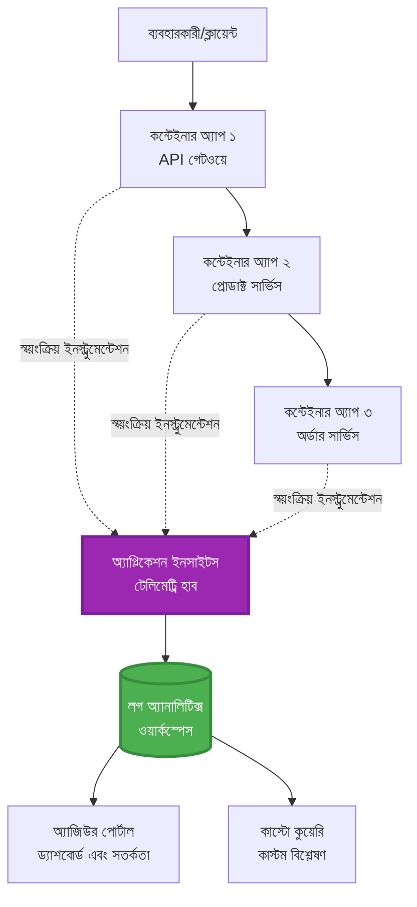
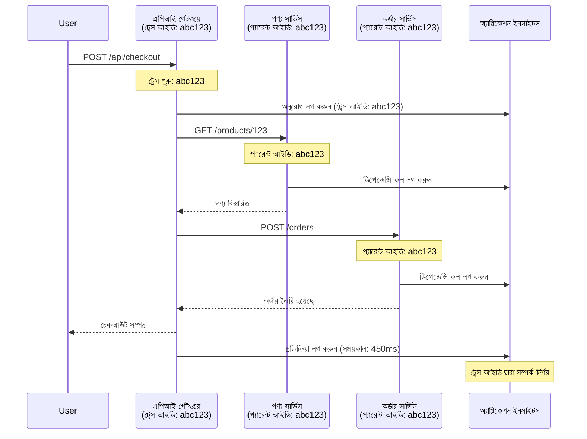

# Application Insights Integration with AZD

⏱️ **Estimated Time**: 40-50 minutes | 💰 **Cost Impact**: ~$5-15/month | ⭐ **Complexity**: Intermediate

**📚 Learning Path:**
- ← Previous: [প্রিফ্লাইট চেকস](preflight-checks.md) - ডিপ্লয়মেন্ট পূর্ববর্তী ভ্যালিডেশন
- 🎯 **You Are Here**: Application Insights Integration (নিরীক্ষণ, টেলিমেট্রি, ডিবাগিং)
- → Next: [Deployment Guide](../chapter-04-infrastructure/deployment-guide.md) - Azure-এ ডিপ্লয় করুন
- 🏠 [Course Home](../../README.md)

---

## What You'll Learn

এই লেসন সম্পন্ন করে আপনি:
- AZD প্রকল্পগুলিতে স্বয়ংক্রিয়ভাবে **Application Insights** ইন্টিগ্রেট করবেন
- মাইক্রোসার্ভিসগুলির জন্য **distribuated tracing** কনফিগার করবেন
- **কাস্টম টেলিমেট্রি** (মেট্রিক্স, ইভেন্ট, ডিপেন্ডেন্সি) প্রয়োগ করবেন
- রিয়েল-টাইম মনিটরিং-এর জন্য **live metrics** সেটআপ করবেন
- AZD ডিপ্লয়মেন্ট থেকে **অ্যালার্ট এবং ড্যাশবোর্ড** তৈরি করবেন
- **টেলিমেট্রি কুয়েরি** ব্যবহার করে প্রোডাকশন সমস্যা ডিবাগ করবেন
- **খরচ এবং স্যাম্পলিং** কৌশল অপ্টিমাইজ করবেন
- **AI/LLM অ্যাপ্লিকেশন** মনিটর করবেন (টোকেন, ল্যাটেন্সি, খরচ)

## Why Application Insights with AZD Matters

### The Challenge: Production Observability

**Without Application Insights:**
```
❌ No visibility into production behavior
❌ Manual log aggregation across services
❌ Reactive debugging (wait for customer complaints)
❌ No performance metrics
❌ Cannot trace requests across services
❌ Unknown failure rates and bottlenecks
```

**With Application Insights + AZD:**
```
✅ Automatic telemetry collection
✅ Centralized logs from all services
✅ Proactive issue detection
✅ End-to-end request tracing
✅ Performance metrics and insights
✅ Real-time dashboards
✅ AZD provisions everything automatically
```

**Analogy**: Application Insights আপনার অ্যাপ্লিকেশনের জন্য একটি "ব্ল্যাক বক্স" ফ্লাইট রেকর্ডার + ককপিট ড্যাশবোর্ডের মতো। আপনি রিয়েল-টাইমে যা কিছু ঘটছে সব দেখতে পারবেন এবং কোনো ইন্সিডেন্ট পুনরায় চালানো যাবে।

---

## Architecture Overview

### Application Insights in AZD Architecture


### What Gets Monitored Automatically

| Telemetry Type | What It Captures | Use Case |
|----------------|------------------|----------|
| **Requests** | HTTP অনুরোধ, স্ট্যাটাস কোড, সময়কাল | API পারফরম্যান্স মনিটরিং |
| **Dependencies** | বাইরের কল (DB, APIs, স্টোরেজ) | বোতল নেক শনাক্ত করা |
| **Exceptions** | অনহ্যান্ডেলড এরর সহ স্ট্যাক ট্রেস | ফেইলিউর ডিবাগিং |
| **Custom Events** | ব্যবসায়িক ইভেন্ট (সাইনআপ, ক্রয়) | এনালিটিক্স ও ফানেলস |
| **Metrics** | পারফরম্যান্স কাউন্টার, কাস্টম মেট্রিক্স | ক্যাপাসিটি প্ল্যানিং |
| **Traces** | সেভেরিটি সহ লগ বার্তা | ডিবাগিং ও অডিটিং |
| **Availability** | আপটাইম এবং রেসপন্স টাইম টেস্ট | SLA মনিটরিং |

---

## Prerequisites

### Required Tools

```bash
# Azure Developer CLI যাচাই করুন
azd version
# ✅ প্রত্যাশিত: azd সংস্করণ 1.0.0 বা তার বেশি

# Azure CLI যাচাই করুন
az --version
# ✅ প্রত্যাশিত: azure-cli 2.50.0 বা তার বেশি
```

### Azure Requirements

- সক্রিয় Azure সাবস্ক্রিপশন
- নিম্নলিখিত তৈরি করার অনুমতি:
  - Application Insights রিসোর্স
  - Log Analytics ওয়ার্কস্পেস
  - Container Apps
  - Resource groups

### Knowledge Prerequisites

আপনি নিম্নলিখিত সম্পন্ন করে থাকতে হবে:
- [AZD Basics](../chapter-01-foundation/azd-basics.md) - AZD এর মূল ধারণা
- [Configuration](../chapter-03-configuration/configuration.md) - পরিবেশ সেটআপ
- [First Project](../chapter-01-foundation/first-project.md) - বেসিক ডিপ্লয়মেন্ট

---

## Lesson 1: Automatic Application Insights with AZD

### How AZD Provisions Application Insights

AZD ডিপ্লয় করার সময় স্বয়ংক্রিয়ভাবে Application Insights তৈরি ও কনফিগার করে। চলুন দেখি এটা কিভাবে কাজ করে।

### Project Structure

```
monitored-app/
├── azure.yaml                     # AZD configuration
├── infra/
│   ├── main.bicep                # Main infrastructure
│   ├── core/
│   │   └── monitoring.bicep      # Application Insights + Log Analytics
│   └── app/
│       └── api.bicep             # Container App with monitoring
└── src/
    ├── app.py                    # Application with telemetry
    ├── requirements.txt
    └── Dockerfile
```

---

### Step 1: Configure AZD (azure.yaml)

**File: `azure.yaml`**

```yaml
name: monitored-app
metadata:
  template: monitored-app@1.0.0

services:
  api:
    project: ./src
    language: python
    host: containerapp

# AZD automatically provisions monitoring!
```

**এটুকুই!** AZD ডিফল্ট হিসেবে Application Insights তৈরি করবে। বেসিক মনিটরিং-এর জন্য আর কোনো অতিরিক্ত কনফিগারেশন প্রয়োজন নেই।

---

### Step 2: Monitoring Infrastructure (Bicep)

**File: `infra/core/monitoring.bicep`**

```bicep
param logAnalyticsName string
param applicationInsightsName string
param location string = resourceGroup().location
param tags object = {}

// Log Analytics Workspace (required for Application Insights)
resource logAnalytics 'Microsoft.OperationalInsights/workspaces@2022-10-01' = {
  name: logAnalyticsName
  location: location
  tags: tags
  properties: {
    sku: {
      name: 'PerGB2018'  // Pay-as-you-go pricing
    }
    retentionInDays: 30  // Keep logs for 30 days
    features: {
      enableLogAccessUsingOnlyResourcePermissions: true
    }
  }
}

// Application Insights
resource applicationInsights 'Microsoft.Insights/components@2020-02-02' = {
  name: applicationInsightsName
  location: location
  tags: tags
  kind: 'web'
  properties: {
    Application_Type: 'web'
    WorkspaceResourceId: logAnalytics.id
    IngestionMode: 'LogAnalytics'
    publicNetworkAccessForIngestion: 'Enabled'
    publicNetworkAccessForQuery: 'Enabled'
  }
}

// Outputs for Container Apps
output logAnalyticsWorkspaceId string = logAnalytics.id
output logAnalyticsWorkspaceName string = logAnalytics.name
output applicationInsightsConnectionString string = applicationInsights.properties.ConnectionString
output applicationInsightsInstrumentationKey string = applicationInsights.properties.InstrumentationKey
output applicationInsightsName string = applicationInsights.name
```

---

### Step 3: Connect Container App to Application Insights

**File: `infra/app/api.bicep`**

```bicep
param name string
param location string
param tags object = {}
param containerAppsEnvironmentName string
param applicationInsightsConnectionString string

resource containerApp 'Microsoft.App/containerApps@2023-05-01' = {
  name: name
  location: location
  tags: tags
  properties: {
    configuration: {
      ingress: {
        external: true
        targetPort: 8000
      }
      secrets: [
        {
          name: 'appinsights-connection-string'
          value: applicationInsightsConnectionString
        }
      ]
    }
    template: {
      containers: [
        {
          name: 'api'
          image: 'myregistry.azurecr.io/api:latest'
          resources: {
            cpu: json('0.5')
            memory: '1Gi'
          }
          env: [
            {
              name: 'APPLICATIONINSIGHTS_CONNECTION_STRING'
              secretRef: 'appinsights-connection-string'
            }
            {
              name: 'APPLICATIONINSIGHTS_ENABLED'
              value: 'true'
            }
          ]
        }
      ]
    }
  }
}

output uri string = 'https://${containerApp.properties.configuration.ingress.fqdn}'
```

---

### Step 4: Application Code with Telemetry

**File: `src/app.py`**

```python
from flask import Flask, request, jsonify
from opencensus.ext.azure.log_exporter import AzureLogHandler
from opencensus.ext.azure.trace_exporter import AzureExporter
from opencensus.ext.flask.flask_middleware import FlaskMiddleware
from opencensus.trace.samplers import ProbabilitySampler
import logging
import os

app = Flask(__name__)

# Application Insights সংযোগ স্ট্রিং পান
connection_string = os.environ.get('APPLICATIONINSIGHTS_CONNECTION_STRING')

if connection_string:
    # বিতরণকৃত ট্রেসিং কনফিগার করুন
    middleware = FlaskMiddleware(
        app,
        exporter=AzureExporter(connection_string=connection_string),
        sampler=ProbabilitySampler(rate=1.0)  # ডেভের জন্য 100% স্যাম্পলিং
    )
    
    # লগিং কনফিগার করুন
    logger = logging.getLogger(__name__)
    logger.addHandler(AzureLogHandler(connection_string=connection_string))
    logger.setLevel(logging.INFO)
    
    print("✅ Application Insights enabled")
else:
    logger = logging.getLogger(__name__)
    logger.setLevel(logging.INFO)
    print("⚠️ Application Insights not configured")

@app.route('/health')
def health():
    logger.info('Health check endpoint called')
    return jsonify({'status': 'healthy', 'monitoring': 'enabled'})

@app.route('/api/products')
def get_products():
    logger.info('Fetching products')
    
    # ডেটাবেস কল সিমুলেট করুন (স্বয়ংক্রিয়ভাবে নির্ভরশীলতা হিসেবে ট্র্যাক করা হবে)
    products = [
        {'id': 1, 'name': 'Laptop', 'price': 999.99},
        {'id': 2, 'name': 'Mouse', 'price': 29.99},
        {'id': 3, 'name': 'Keyboard', 'price': 79.99}
    ]
    
    logger.info(f'Returned {len(products)} products')
    return jsonify(products)

@app.route('/api/error-test')
def error_test():
    """Test error tracking"""
    logger.error('Testing error tracking')
    try:
        raise ValueError('This is a test exception')
    except Exception as e:
        logger.exception('Exception occurred in error-test endpoint')
        return jsonify({'error': str(e)}), 500

@app.route('/api/slow')
def slow_endpoint():
    """Test performance tracking"""
    import time
    logger.info('Slow endpoint called')
    time.sleep(3)  # ধীর অপারেশন সিমুলেট করুন
    logger.warning('Endpoint took 3 seconds to respond')
    return jsonify({'message': 'Slow operation completed'})

if __name__ == '__main__':
    app.run(host='0.0.0.0', port=8000)
```

**File: `src/requirements.txt`**

```txt
Flask==3.0.0
opencensus-ext-azure==1.1.13
opencensus-ext-flask==0.8.1
gunicorn==21.2.0
```

---

### Step 5: Deploy and Verify

```bash
# AZD ইনিশিয়ালাইজ করুন
azd init

# ডিপ্লয় (Application Insights স্বয়ংক্রিয়ভাবে সেট আপ করে)
azd up

# অ্যাপের URL পান
APP_URL=$(azd env get-values | grep API_URL | cut -d '=' -f2 | tr -d '"')

# টেলিমেট্রি তৈরি করুন
curl $APP_URL/health
curl $APP_URL/api/products
curl $APP_URL/api/error-test
curl $APP_URL/api/slow
```

**✅ Expected output:**
```json
{
  "status": "healthy",
  "monitoring": "enabled"
}
```

---

### Step 6: View Telemetry in Azure Portal

```bash
# Application Insights-এর বিস্তারিত তথ্য পান
azd env get-values | grep APPLICATIONINSIGHTS

# Azure পোর্টালে খুলুন
az monitor app-insights component show \
  --app $(azd env get-values | grep APPLICATIONINSIGHTS_NAME | cut -d '=' -f2 | tr -d '"') \
  --resource-group $(azd env get-values | grep AZURE_RESOURCE_GROUP | cut -d '=' -f2 | tr -d '"') \
  --query "appId" -o tsv
```

**Navigate to Azure Portal → Application Insights → Transaction Search**

আপনি দেখতে পাবেন:
- ✅ HTTP অনুরোধগুলো স্ট্যাটাস কোড সহ
- ✅ অনুরোধের সময়কাল (উদাহরণ: `/api/slow` এর জন্য 3+ সেকেন্ড)
- ✅ `/api/error-test` থেকে Exception-এর বিস্তারিত
- ✅ কাস্টম লগ মেসেজ

---

## Lesson 2: Custom Telemetry and Events

### Track Business Events

চলুন ব্যবসায়িকভাবে গুরুত্বপূর্ণ ইভেন্টগুলোর জন্য কাস্টম টেলিমেট্রি যোগ করি।

**File: `src/telemetry.py`**

```python
from opencensus.ext.azure import metrics_exporter
from opencensus.stats import aggregation as aggregation_module
from opencensus.stats import measure as measure_module
from opencensus.stats import stats as stats_module
from opencensus.stats import view as view_module
from opencensus.tags import tag_map as tag_map_module
from opencensus.ext.azure.log_exporter import AzureLogHandler
from opencensus.ext.azure.trace_exporter import AzureExporter
from opencensus.trace import tracer as tracer_module
import logging
import os

class TelemetryClient:
    """Custom telemetry client for Application Insights"""
    
    def __init__(self, connection_string=None):
        self.connection_string = connection_string or os.environ.get('APPLICATIONINSIGHTS_CONNECTION_STRING')
        
        if not self.connection_string:
            print("⚠️ Application Insights connection string not found")
            return
        
        # লগার সেটআপ করুন
        self.logger = logging.getLogger(__name__)
        self.logger.addHandler(AzureLogHandler(connection_string=self.connection_string))
        self.logger.setLevel(logging.INFO)
        
        # মেট্রিক্স এক্সপোর্টার সেটআপ করুন
        self.stats = stats_module.stats
        self.view_manager = self.stats.view_manager
        self.stats_recorder = self.stats.stats_recorder
        
        exporter = metrics_exporter.new_metrics_exporter(
            connection_string=self.connection_string
        )
        self.view_manager.register_exporter(exporter)
        
        # ট্রেসার সেটআপ করুন
        self.tracer = tracer_module.Tracer(
            exporter=AzureExporter(connection_string=self.connection_string)
        )
        
        print("✅ Custom telemetry client initialized")
    
    def track_event(self, event_name: str, properties: dict = None):
        """Track custom business event"""
        properties = properties or {}
        self.logger.info(
            f"CustomEvent: {event_name}",
            extra={
                'custom_dimensions': {
                    'event_name': event_name,
                    **properties
                }
            }
        )
    
    def track_metric(self, metric_name: str, value: float, properties: dict = None):
        """Track custom metric"""
        properties = properties or {}
        self.logger.info(
            f"CustomMetric: {metric_name} = {value}",
            extra={
                'custom_dimensions': {
                    'metric_name': metric_name,
                    'value': value,
                    **properties
                }
            }
        )
    
    def track_dependency(self, name: str, dependency_type: str, duration: float, success: bool):
        """Track external dependency call"""
        with self.tracer.span(name=name) as span:
            span.add_attribute('dependency.type', dependency_type)
            span.add_attribute('duration', duration)
            span.add_attribute('success', success)

# গ্লোবাল টেলিমেট্রি ক্লায়েন্ট
telemetry = TelemetryClient()
```

### Update Application with Custom Events

**File: `src/app.py` (enhanced)**

```python
from flask import Flask, request, jsonify
from telemetry import telemetry
import time
import random

app = Flask(__name__)

@app.route('/api/purchase', methods=['POST'])
def purchase():
    """Track purchase event with custom telemetry"""
    data = request.json
    product_id = data.get('product_id')
    quantity = data.get('quantity', 1)
    price = data.get('price', 0)
    
    # ব্যবসায়িক ইভেন্ট ট্র্যাক করুন
    telemetry.track_event('Purchase', {
        'product_id': product_id,
        'quantity': quantity,
        'total_amount': price * quantity,
        'user_id': request.headers.get('X-User-Id', 'anonymous')
    })
    
    # রাজস্ব মেট্রিক ট্র্যাক করুন
    telemetry.track_metric('Revenue', price * quantity, {
        'product_id': product_id,
        'currency': 'USD'
    })
    
    return jsonify({
        'order_id': f'ORD-{random.randint(1000, 9999)}',
        'status': 'confirmed',
        'total': price * quantity
    })

@app.route('/api/search')
def search():
    """Track search queries"""
    query = request.args.get('q', '')
    
    start_time = time.time()
    
    # সার্চ সিমুলেট করুন (বাস্তবে এটি একটি ডাটাবেস কোয়েরি হবে)
    results = [{'id': 1, 'name': f'Result for {query}'}]
    
    duration = (time.time() - start_time) * 1000  # মিলিসেকেন্ডে রূপান্তর করুন
    
    # সার্চ ইভেন্ট ট্র্যাক করুন
    telemetry.track_event('Search', {
        'query': query,
        'results_count': len(results),
        'duration_ms': duration
    })
    
    # সার্চ পারফরম্যান্স মেট্রিক ট্র্যাক করুন
    telemetry.track_metric('SearchDuration', duration, {
        'query_length': len(query)
    })
    
    return jsonify({'results': results, 'count': len(results)})

@app.route('/api/external-call')
def external_call():
    """Track external API dependency"""
    import requests
    
    start_time = time.time()
    success = True
    
    try:
        # বাহ্যিক API কল সিমুলেট করুন
        response = requests.get('https://api.example.com/data', timeout=5)
        result = response.json()
    except Exception as e:
        success = False
        result = {'error': str(e)}
    
    duration = (time.time() - start_time) * 1000
    
    # নির্ভরশীলতা ট্র্যাক করুন
    telemetry.track_dependency(
        name='ExternalAPI',
        dependency_type='HTTP',
        duration=duration,
        success=success
    )
    
    return jsonify(result)

if __name__ == '__main__':
    app.run(host='0.0.0.0', port=8000)
```

### Test Custom Telemetry

```bash
# ক্রয় ইভেন্ট ট্র্যাক করুন
curl -X POST $APP_URL/api/purchase \
  -H "Content-Type: application/json" \
  -H "X-User-Id: user123" \
  -d '{"product_id": 1, "quantity": 2, "price": 29.99}'

# অনুসন্ধান ইভেন্ট ট্র্যাক করুন
curl "$APP_URL/api/search?q=laptop"

# বহ্যিক নির্ভরতা ট্র্যাক করুন
curl $APP_URL/api/external-call
```

**View in Azure Portal:**

Azure Portal → Application Insights → Logs এ যান, তারপর চালান:

```kusto
// View purchase events
traces
| where customDimensions.event_name == "Purchase"
| project 
    timestamp,
    product_id = tostring(customDimensions.product_id),
    total_amount = todouble(customDimensions.total_amount),
    user_id = tostring(customDimensions.user_id)
| order by timestamp desc

// View revenue metrics
traces
| where customDimensions.metric_name == "Revenue"
| summarize TotalRevenue = sum(todouble(customDimensions.value)) by bin(timestamp, 1h)
| render timechart

// View search performance
traces
| where customDimensions.event_name == "Search"
| summarize 
    AvgDuration = avg(todouble(customDimensions.duration_ms)),
    SearchCount = count()
  by bin(timestamp, 5m)
| render timechart
```

---

## Lesson 3: Distributed Tracing for Microservices

### Enable Cross-Service Tracing

মাইক্রোসার্ভিসগুলির জন্য, Application Insights স্বয়ংক্রিয়ভাবে সার্ভিসগুলির মধ্যে রিকোয়েস্ট কোরিলেট করে।

**File: `infra/main.bicep`**

```bicep
targetScope = 'subscription'

param environmentName string
param location string = 'eastus'

var tags = { 'azd-env-name': environmentName }

resource rg 'Microsoft.Resources/resourceGroups@2021-04-01' = {
  name: 'rg-${environmentName}'
  location: location
  tags: tags
}

// Monitoring (shared by all services)
module monitoring './core/monitoring.bicep' = {
  name: 'monitoring'
  scope: rg
  params: {
    logAnalyticsName: 'log-${environmentName}'
    applicationInsightsName: 'appi-${environmentName}'
    location: location
    tags: tags
  }
}

// API Gateway
module apiGateway './app/api-gateway.bicep' = {
  name: 'api-gateway'
  scope: rg
  params: {
    name: 'ca-gateway-${environmentName}'
    location: location
    tags: union(tags, { 'azd-service-name': 'gateway' })
    applicationInsightsConnectionString: monitoring.outputs.applicationInsightsConnectionString
  }
}

// Product Service
module productService './app/product-service.bicep' = {
  name: 'product-service'
  scope: rg
  params: {
    name: 'ca-products-${environmentName}'
    location: location
    tags: union(tags, { 'azd-service-name': 'products' })
    applicationInsightsConnectionString: monitoring.outputs.applicationInsightsConnectionString
  }
}

// Order Service
module orderService './app/order-service.bicep' = {
  name: 'order-service'
  scope: rg
  params: {
    name: 'ca-orders-${environmentName}'
    location: location
    tags: union(tags, { 'azd-service-name': 'orders' })
    applicationInsightsConnectionString: monitoring.outputs.applicationInsightsConnectionString
  }
}

output APPLICATIONINSIGHTS_CONNECTION_STRING string = monitoring.outputs.applicationInsightsConnectionString
output GATEWAY_URL string = apiGateway.outputs.uri
```

### View End-to-End Transaction


**Query end-to-end trace:**

```kusto
// Find complete request flow
let traceId = "abc123...";  // Get from response header
dependencies
| union requests
| where operation_Id == traceId
| project 
    timestamp,
    type = itemType,
    name,
    duration,
    success,
    cloud_RoleName
| order by timestamp asc
```

---

## Lesson 4: Live Metrics and Real-Time Monitoring

### Enable Live Metrics Stream

Live Metrics রিয়েল-টাইম টেলিমেট্রি দেয় <1 সেকেন্ড ল্যাটেন্সি সহ।

**Access Live Metrics:**

```bash
# Application Insights রিসোর্স পান
APPI_NAME=$(azd env get-values | grep APPLICATIONINSIGHTS_NAME | cut -d '=' -f2 | tr -d '"')

# রিসোর্স গ্রুপ পান
RG_NAME=$(azd env get-values | grep AZURE_RESOURCE_GROUP | cut -d '=' -f2 | tr -d '"')

echo "Navigate to: Azure Portal → Resource Groups → $RG_NAME → $APPI_NAME → Live Metrics"
```

**রিয়েল-টাইমে আপনি যা দেখতে পাবেন:**
- ✅ ইনকামিং রিকোয়েস্ট রেট (requests/sec)
- ✅ আউটগোয়িং dependency কল
- ✅ Exception গণনা
- ✅ CPU এবং মেমরি ব্যবহারে
- ✅ সক্রিয় সার্ভার সংখ্যা
- ✅ স্যাম্পল টেলিমেট্রি

### Generate Load for Testing

```bash
# লাইভ মেট্রিক্স দেখতে লোড তৈরি করুন
for i in {1..100}; do
  curl $APP_URL/api/products &
  curl $APP_URL/api/search?q=test$i &
done

# Azure পোর্টালে লাইভ মেট্রিক্স দেখুন
# আপনি অনুরোধের হারের স্পাইক দেখতে পাবেন
```

---

## Practical Exercises

### Exercise 1: Set Up Alerts ⭐⭐ (Medium)

**উদ্দেশ্য**: উচ্চ এরর রেট এবং ধীর রেসপন্সের জন্য অ্যালার্ট তৈরি করা।

**ধাপসমূহ:**

1. **এরর রেট-এর জন্য অ্যালার্ট তৈরি করুন:**

```bash
# Application Insights রিসোর্স আইডি পান
APPI_ID=$(az monitor app-insights component show \
  --app $APPI_NAME \
  --resource-group $RG_NAME \
  --query "id" -o tsv)

# বিফল অনুরোধগুলির জন্য মেট্রিক সতর্কতা তৈরি করুন
az monitor metrics alert create \
  --name "High-Error-Rate" \
  --resource-group $RG_NAME \
  --scopes $APPI_ID \
  --condition "count requests/failed > 10" \
  --window-size 5m \
  --evaluation-frequency 1m \
  --description "Alert when error rate exceeds 10 per 5 minutes"
```

2. **ধীর রেসপন্স-এর জন্য অ্যালার্ট তৈরি করুন:**

```bash
az monitor metrics alert create \
  --name "Slow-Responses" \
  --resource-group $RG_NAME \
  --scopes $APPI_ID \
  --condition "avg requests/duration > 3000" \
  --window-size 5m \
  --evaluation-frequency 1m \
  --description "Alert when average response time exceeds 3 seconds"
```

3. **Bicep দিয়ে অ্যালার্ট তৈরি করুন (AZD-এর জন্য প্রেফার করা):**

**File: `infra/core/alerts.bicep`**

```bicep
param applicationInsightsId string
param actionGroupId string = ''
param location string = resourceGroup().location

// High error rate alert
resource errorRateAlert 'Microsoft.Insights/metricAlerts@2018-03-01' = {
  name: 'high-error-rate'
  location: 'global'
  properties: {
    description: 'Alert when error rate exceeds threshold'
    severity: 2
    enabled: true
    scopes: [
      applicationInsightsId
    ]
    evaluationFrequency: 'PT1M'
    windowSize: 'PT5M'
    criteria: {
      'odata.type': 'Microsoft.Azure.Monitor.SingleResourceMultipleMetricCriteria'
      allOf: [
        {
          name: 'Error rate'
          metricName: 'requests/failed'
          operator: 'GreaterThan'
          threshold: 10
          timeAggregation: 'Count'
        }
      ]
    }
    actions: actionGroupId != '' ? [
      {
        actionGroupId: actionGroupId
      }
    ] : []
  }
}

// Slow response alert
resource slowResponseAlert 'Microsoft.Insights/metricAlerts@2018-03-01' = {
  name: 'slow-responses'
  location: 'global'
  properties: {
    description: 'Alert when response time is too high'
    severity: 3
    enabled: true
    scopes: [
      applicationInsightsId
    ]
    evaluationFrequency: 'PT1M'
    windowSize: 'PT5M'
    criteria: {
      'odata.type': 'Microsoft.Azure.Monitor.SingleResourceMultipleMetricCriteria'
      allOf: [
        {
          name: 'Response duration'
          metricName: 'requests/duration'
          operator: 'GreaterThan'
          threshold: 3000
          timeAggregation: 'Average'
        }
      ]
    }
  }
}

output errorAlertId string = errorRateAlert.id
output slowResponseAlertId string = slowResponseAlert.id
```

4. **অ্যালার্ট টেস্ট করুন:**

```bash
# ত্রুটি তৈরি করুন
for i in {1..20}; do
  curl $APP_URL/api/error-test
done

# ধীর প্রতিক্রিয়া তৈরি করুন
for i in {1..10}; do
  curl $APP_URL/api/slow
done

# অ্যালার্টের অবস্থা পরীক্ষা করুন (5-10 মিনিট অপেক্ষা করুন)
az monitor metrics alert list \
  --resource-group $RG_NAME \
  --query "[].{Name:name, Enabled:enabled, State:properties.enabled}" \
  --output table
```

**✅ সফলতার মানদণ্ড:**
- ✅ অ্যালার্টগুলো সফলভাবে তৈরি হয়েছে
- ✅ থ্রেশহোল্ড অতিক্রম করলে অ্যালার্ট ফায়ার করে
- ✅ Azure Portal-এ অ্যালার্ট ইতিহাস দেখা যায়
- ✅ AZD ডিপ্লয়মেন্টের সাথে ইন্টিগ্রেটেড

**সময়**: 20-25 মিনিট

---

### Exercise 2: Create Custom Dashboard ⭐⭐ (Medium)

**উদ্দেশ্য**: মূল অ্যাপ্লিকেশন মেট্রিক্সগুলো দেখানোর জন্য একটি ড্যাশবোর্ড তৈরি করা।

**ধাপসমূহ:**

1. **Azure Portal থেকে ড্যাশবোর্ড তৈরি করুন:**

Navigate to: Azure Portal → Dashboards → New Dashboard

2. **কী মেট্রিক্সগুলোর টাইল যোগ করুন:**

- অনুরোধের সংখ্যা (গত 24 ঘন্টায়)
- গড় রেসপন্স টাইম
- এরর রেট
- শীর্ষ 5 ধীরতম অপারেশন
- ব্যবহারকারীর ভৌগোলিক বন্টন

3. **Bicep দিয়ে ড্যাশবোর্ড তৈরি করুন:**

**File: `infra/core/dashboard.bicep`**

```bicep
param dashboardName string
param applicationInsightsId string
param location string = resourceGroup().location

resource dashboard 'Microsoft.Portal/dashboards@2020-09-01-preview' = {
  name: dashboardName
  location: location
  properties: {
    lenses: [
      {
        order: 0
        parts: [
          // Request count
          {
            position: { x: 0, y: 0, rowSpan: 4, colSpan: 6 }
            metadata: {
              type: 'Extension/Microsoft_OperationsManagementSuite_Workspace/PartType/LogsDashboardPart'
              inputs: [
                {
                  name: 'resourceId'
                  value: applicationInsightsId
                }
                {
                  name: 'query'
                  value: '''
                    requests
                    | summarize RequestCount = count() by bin(timestamp, 1h)
                    | render timechart
                  '''
                }
              ]
            }
          }
          // Error rate
          {
            position: { x: 6, y: 0, rowSpan: 4, colSpan: 6 }
            metadata: {
              type: 'Extension/Microsoft_OperationsManagementSuite_Workspace/PartType/LogsDashboardPart'
              inputs: [
                {
                  name: 'resourceId'
                  value: applicationInsightsId
                }
                {
                  name: 'query'
                  value: '''
                    requests
                    | summarize 
                        Total = count(),
                        Failed = countif(success == false)
                    | extend ErrorRate = (Failed * 100.0) / Total
                    | project ErrorRate
                  '''
                }
              ]
            }
          }
        ]
      }
    ]
  }
}

output dashboardId string = dashboard.id
```

4. **ড্যাশবোর্ড ডিপ্লয় করুন:**

```bash
# main.bicep-এ যোগ করুন
module dashboard './core/dashboard.bicep' = {
  name: 'dashboard'
  scope: rg
  params: {
    dashboardName: 'dashboard-${environmentName}'
    applicationInsightsId: monitoring.outputs.applicationInsightsId
    location: location
  }
}

# ডিপ্লয় করুন
azd up
```

**✅ সফলতার মানদণ্ড:**
- ✅ ড্যাশবোর্ড মূল মেট্রিক্স দেখাচ্ছে
- ✅ Azure Portal হোম-এ পিন করা যাবে
- ✅ রিয়েল-টাইমে আপডেট করে
- ✅ AZD দিয়ে ডিপ্লয়যোগ্য

**সময়**: 25-30 মিনিট

---

### Exercise 3: Monitor AI/LLM Application ⭐⭐⭐ (Advanced)

**উদ্দেশ্য**: Microsoft Foundry Models ব্যবহার ট্র্যাক করা (টোকেন, খরচ, ল্যাটেন্সি)।

**ধাপসমূহ:**

1. **AI মনিটরিং র‍্যাপার তৈরি করুন:**

**File: `src/ai_telemetry.py`**

```python
from telemetry import telemetry
from openai import AzureOpenAI
import time

class MonitoredAzureOpenAI:
    """Microsoft Foundry Models client with automatic telemetry"""
    
    def __init__(self, api_key, endpoint, api_version="2024-02-01"):
        self.client = AzureOpenAI(
            api_key=api_key,
            api_version=api_version,
            azure_endpoint=endpoint
        )
    
    def chat_completion(self, model: str, messages: list, **kwargs):
        """Track chat completion with telemetry"""
        start_time = time.time()
        
        try:
            # Microsoft Foundry মডেলগুলোকে কল করুন
            response = self.client.chat.completions.create(
                model=model,
                messages=messages,
                **kwargs
            )
            
            duration = (time.time() - start_time) * 1000  # ms
            
            # ব্যবহার বের করুন
            usage = response.usage
            prompt_tokens = usage.prompt_tokens
            completion_tokens = usage.completion_tokens
            total_tokens = usage.total_tokens
            
            # খরচ গণনা করুন (gpt-4.1 মূল্য)
            prompt_cost = (prompt_tokens / 1000) * 0.03  # $0.03 প্রতি 1K টোকেন
            completion_cost = (completion_tokens / 1000) * 0.06  # $0.06 প্রতি 1K টোকেন
            total_cost = prompt_cost + completion_cost
            
            # কাস্টম ইভেন্ট ট্র্যাক করুন
            telemetry.track_event('OpenAI_Request', {
                'model': model,
                'prompt_tokens': prompt_tokens,
                'completion_tokens': completion_tokens,
                'total_tokens': total_tokens,
                'duration_ms': duration,
                'cost_usd': total_cost,
                'success': True
            })
            
            # মেট্রিক্স ট্র্যাক করুন
            telemetry.track_metric('OpenAI_Tokens', total_tokens, {
                'model': model,
                'type': 'total'
            })
            
            telemetry.track_metric('OpenAI_Cost', total_cost, {
                'model': model,
                'currency': 'USD'
            })
            
            telemetry.track_metric('OpenAI_Duration', duration, {
                'model': model
            })
            
            return response
            
        except Exception as e:
            duration = (time.time() - start_time) * 1000
            
            telemetry.track_event('OpenAI_Request', {
                'model': model,
                'duration_ms': duration,
                'success': False,
                'error': str(e)
            })
            
            raise
```

2. **মনিটরড ক্লায়েন্ট ব্যবহার করুন:**

```python
from flask import Flask, request, jsonify
from ai_telemetry import MonitoredAzureOpenAI
import os

app = Flask(__name__)

# মনিটর করা OpenAI ক্লায়েন্ট প্রাথমিককরণ করুন
openai_client = MonitoredAzureOpenAI(
    api_key=os.environ['AZURE_OPENAI_API_KEY'],
    endpoint=os.environ['AZURE_OPENAI_ENDPOINT']
)

@app.route('/api/chat', methods=['POST'])
def chat():
    data = request.json
    user_message = data.get('message')
    
    # স্বয়ংক্রিয় মনিটরিং সহ কল করুন
    response = openai_client.chat_completion(
        model='gpt-4.1',
        messages=[
            {'role': 'user', 'content': user_message}
        ]
    )
    
    return jsonify({
        'response': response.choices[0].message.content,
        'tokens': response.usage.total_tokens
    })
```

3. **AI মেট্রিক্স কুয়েরি করুন:**

```kusto
// Total AI spend over time
traces
| where customDimensions.event_name == "OpenAI_Request"
| where customDimensions.success == "True"
| summarize TotalCost = sum(todouble(customDimensions.cost_usd)) by bin(timestamp, 1h)
| render timechart

// Token usage by model
traces
| where customDimensions.event_name == "OpenAI_Request"
| summarize 
    TotalTokens = sum(toint(customDimensions.total_tokens)),
    RequestCount = count()
  by Model = tostring(customDimensions.model)

// Average latency
traces
| where customDimensions.event_name == "OpenAI_Request"
| summarize AvgDuration = avg(todouble(customDimensions.duration_ms))
| project AvgDurationSeconds = AvgDuration / 1000

// Cost per request
traces
| where customDimensions.event_name == "OpenAI_Request"
| extend Cost = todouble(customDimensions.cost_usd)
| summarize 
    TotalCost = sum(Cost),
    RequestCount = count(),
    AvgCostPerRequest = avg(Cost)
```

**✅ সফলতার মানদণ্ড:**
- ✅ প্রতিটি OpenAI কল স্বয়ংক্রিয়ভাবে ট্র্যাক হয়
- ✅ টোকেন ব্যবহার এবং খরচ দৃশ্যমান
- ✅ ল্যাটেন্সি মনিটর করা হয়
- ✅ বাজেট অ্যালার্ট সেট করা যায়

**সময়**: 35-45 মিনিট

---

## Cost Optimization

### Sampling Strategies

টেলিমেট্রি স্যাম্পল করে খরচ নিয়ন্ত্রণ করুন:

```python
from opencensus.trace.samplers import ProbabilitySampler

# ডেভেলপমেন্ট: ১০০% স্যাম্পলিং
sampler = ProbabilitySampler(rate=1.0)

# প্রোডাকশন: ১০% স্যাম্পলিং (খরচ ৯০% কমায়)
sampler = ProbabilitySampler(rate=0.1)

# অ্যাডাপটিভ স্যাম্পলিং (স্বয়ংক্রিয়ভাবে সামঞ্জস্য করে)
from opencensus.trace.samplers import AdaptiveSampler
sampler = AdaptiveSampler()
```

**In Bicep:**

```bicep
resource applicationInsights 'Microsoft.Insights/components@2020-02-02' = {
  name: applicationInsightsName
  properties: {
    SamplingPercentage: 10  // 10% sampling
  }
}
```

### Data Retention

```bicep
resource logAnalytics 'Microsoft.OperationalInsights/workspaces@2022-10-01' = {
  name: logAnalyticsName
  properties: {
    retentionInDays: 30  // Minimum (cheapest)
    // Options: 30, 31, 60, 90, 120, 180, 270, 365, 550, 730
  }
}
```

### Monthly Cost Estimates

| Data Volume | Retention | Monthly Cost |
|-------------|-----------|--------------|
| 1 GB/month | 30 days | ~$2-5 |
| 5 GB/month | 30 days | ~$10-15 |
| 10 GB/month | 90 days | ~$25-40 |
| 50 GB/month | 90 days | ~$100-150 |

**Free tier**: 5 GB/month included

---

## Knowledge Checkpoint

### 1. Basic Integration ✓

আপনার বোঝাপড়া পরীক্ষা করুন:

- [ ] **Q1**: AZD কীভাবে Application Insights প্রদান করে?
  - **A**: `infra/core/monitoring.bicep`-এ Bicep টেমপ্লেটের মাধ্যমে স্বয়ংক্রিয়ভাবে

- [ ] **Q2**: কোন এনভায়রনমেন্ট ভ্যারিয়েবল Application Insights সক্রিয় করে?
  - **A**: `APPLICATIONINSIGHTS_CONNECTION_STRING`

- [ ] **Q3**: তিনটি প্রধান টেলিমেট্রি টাইপ কি কি?
  - **A**: Requests (HTTP কল), Dependencies (বাইরের কল), Exceptions (এরর)

**Hands-On Verification:**
```bash
# যাচাই করুন যে Application Insights কনফিগার করা আছে কি না
azd env get-values | grep APPLICATIONINSIGHTS

# যাচাই করুন টেলিমেট্রি প্রবাহিত হচ্ছে কি না
az monitor app-insights metrics show \
  --app $APPI_NAME \
  --resource-group $RG_NAME \
  --metric "requests/count"
```

---

### 2. Custom Telemetry ✓

আপনার বোঝাপড়া পরীক্ষা করুন:

- [ ] **Q1**: কিভাবে কাস্টম ব্যবসায়িক ইভেন্ট ট্র্যাক করবেন?
  - **A**: `custom_dimensions` সহ লগার ব্যবহার করুন বা `TelemetryClient.track_event()` ব্যবহার করুন

- [ ] **Q2**: ইভেন্ট এবং মেট্রিক্সে কি পার্থক্য?
  - **A**: ইভেন্টগুলি পৃথক ঘটনা, মেট্রিক্স হলো সংখ্যাসূচক পরিমাপ

- [ ] **Q3**: সার্ভিসগুলির মধ্যে টেলিমেট্রি কিভাবে কোরিলেট করা যায়?
  - **A**: Application Insights স্বয়ংক্রিয়ভাবে কোরিলেশন জন্য `operation_Id` ব্যবহার করে

**Hands-On Verification:**
```kusto
// Verify custom events
traces
| where customDimensions.event_name != ""
| summarize count() by tostring(customDimensions.event_name)
```

---

### 3. Production Monitoring ✓

আপনার বোঝাপড়া পরীক্ষা করুন:

- [ ] **Q1**: স্যাম্পলিং কী এবং কেন ব্যবহার করবেন?
  - **A**: স্যাম্পলিং ডেটা ভলিউম (এবং খরচ) কমায়, কেবল একটি শতাংশ টেলিমেট্রি ক্যাপচার করে

- [ ] **Q2**: কিভাবে অ্যালার্ট সেট আপ করবেন?
  - **A**: Application Insights মেট্রিক্সের উপর ভিত্তি করে Bicep বা Azure Portal-এ মেট্রিক এলার্ট ব্যবহার করুন

- [ ] **Q3**: Log Analytics এবং Application Insights-এর মধ্যে পার্থক্য কী?
  - **A**: Application Insights ডেটা Log Analytics ওয়ার্কস্পেসে সংরক্ষণ করে; App Insights অ্যাপ্লিকেশন-নির্দিষ্ট ভিউ প্রদান করে

**Hands-On Verification:**
```bash
# স্যাম্পলিং কনফিগারেশন পরীক্ষা করুন
az monitor app-insights component show \
  --app $APPI_NAME \
  --resource-group $RG_NAME \
  --query "properties.SamplingPercentage"
```

---

## Best Practices

### ✅ DO:

1. **Use correlation IDs**
   ```python
   logger.info('Processing order', extra={
       'custom_dimensions': {
           'order_id': order_id,
           'user_id': user_id
       }
   })
   ```

2. **Set up alerts for critical metrics**
   ```bicep
   // Error rate, slow responses, availability
   ```

3. **Use structured logging**
   ```python
   # ✅ ভাল: কাঠামোবদ্ধ
   logger.info('User signup', extra={'custom_dimensions': {'user_id': 123}})
   
   # ❌ খারাপ: অসংগঠিত
   logger.info(f'User 123 signed up')
   ```

4. **Monitor dependencies**
   ```python
   # ডাটাবেস কল, HTTP অনুরোধ ইত্যাদি স্বয়ংক্রিয়ভাবে ট্র্যাক করুন।
   ```

5. **Use Live Metrics during deployments**

### ❌ DON'T:

1. **Don't log sensitive data**
   ```python
   # ❌ খারাপ
   logger.info(f'Login: {username}:{password}')
   
   # ✅ ভালো
   logger.info('Login attempt', extra={'custom_dimensions': {'username': username}})
   ```

2. **Don't use 100% sampling in production**
   ```python
   # ❌ দামী
   sampler = ProbabilitySampler(rate=1.0)
   
   # ✅ খরচ-সাশ্রয়ী
   sampler = ProbabilitySampler(rate=0.1)
   ```

3. **Don't ignore dead letter queues**

4. **Don't forget to set data retention limits**

---

## Troubleshooting

### Problem: No telemetry appearing

**Diagnosis:**
```bash
# সংযোগ স্ট্রিংটি সেট করা আছে কিনা পরীক্ষা করুন
azd env get-values | grep APPLICATIONINSIGHTS

# Azure Monitor-এর মাধ্যমে অ্যাপ্লিকেশন লগ পরীক্ষা করুন
azd monitor --logs

# অথবা Container Apps-এর জন্য Azure CLI ব্যবহার করুন:
az containerapp logs show --name $APP_NAME --resource-group $RG_NAME --tail 50
```

**Solution:**
```bash
# কনটেইনার অ্যাপে সংযোগ স্ট্রিং যাচাই করুন
az containerapp show \
  --name $APP_NAME \
  --resource-group $RG_NAME \
  --query "properties.template.containers[0].env" \
  | grep -i applicationinsights
```

---

### Problem: High costs

**Diagnosis:**
```bash
# ডেটা গ্রহণ পরীক্ষা করুন
az monitor app-insights metrics show \
  --app $APPI_NAME \
  --resource-group $RG_NAME \
  --metric "availabilityResults/count"
```

**Solution:**
- স্যাম্পলিং রেট কমান
- রিটেনশন পিরিয়ড কমান
- ভেব্রোজ (verbose) লগিং সরান

---

## Learn More

### Official Documentation
- [Application Insights Overview](https://learn.microsoft.com/azure/azure-monitor/app/app-insights-overview)
- [Application Insights for Python](https://learn.microsoft.com/azure/azure-monitor/app/opencensus-python)
- [Kusto Query Language](https://learn.microsoft.com/azure/data-explorer/kusto/query/)
- [AZD Monitoring](https://learn.microsoft.com/azure/developer/azure-developer-cli/monitor-your-app)

### Next Steps in This Course
- ← Previous: [প্রিফ্লাইট চেকস](preflight-checks.md)
- → Next: [Deployment Guide](../chapter-04-infrastructure/deployment-guide.md)
- 🏠 [Course Home](../../README.md)

### Related Examples
- [Microsoft Foundry Models Example](../../../../examples/azure-openai-chat) - AI টেলিমেট্রি
- [Microservices Example](../../../../examples/microservices) - ডিসট্রিবিউটেড ট্রেসিং

---

## Summary

**You've learned:**
- ✅ AZD দ্বারা Automatic Application Insights provisioning
- ✅ কাস্টম টেলিমেট্রি (ইভেন্ট, মেট্রিক্স, ডিপেন্ডেন্সি)
- ✅ মাইক্রোসার্ভিস জুড়ে ডিসট্রিবিউটেড ট্রেসিং
- ✅ লাইভ মেট্রিক্স এবং রিয়েল-টাইম মনিটরিং
- ✅ অ্যালার্ট এবং ড্যাশবোর্ড
- ✅ AI/LLM অ্যাপ্লিকেশন মনিটরিং
- ✅ খরচ অপ্টিমাইজেশন কৌশল

**Key Takeaways:**
1. **AZD স্বয়ংক্রিয়ভাবে মনিটরিং প্রদান করে** - ম্যানুয়াল সেটআপ প্রয়োজন নেই
2. **কাঠামোগত লগিং ব্যবহার করুন** - কোয়েরি করা সহজ করে
3. **ব্যবসায়িক ঘটনাগুলি ট্র্যাক করুন** - শুধু প্রযুক্তিগত মেট্রিক্স নয়
4. **AI খরচ পর্যবেক্ষণ করুন** - টোকেন এবং ব্যয় ট্র্যাক করুন
5. **অ্যালার্ট সেট আপ করুন** - প্রতিক্রিয়াশীল নয়, সক্রিয়ভাবে ব্যবস্থা নিন
6. **খরচ অপ্টিমাইজ করুন** - স্যাম্পলিং এবং সংরক্ষণ সীমা ব্যবহার করুন

**পরবর্তী পদক্ষেপ:**
1. ব্যবহারিক অনুশীলনগুলি সম্পন্ন করুন
2. আপনার AZD প্রকল্পগুলিতে Application Insights যোগ করুন
3. আপনার দলের জন্য কাস্টম ড্যাশবোর্ড তৈরি করুন
4. শিখুন [ডিপ্লয়মেন্ট গাইড](../chapter-04-infrastructure/deployment-guide.md)

---

<!-- CO-OP TRANSLATOR DISCLAIMER START -->
দায়-অস্বীকৃতি:
এই নথিটি AI অনুবাদ সেবা [Co-op Translator](https://github.com/Azure/co-op-translator) ব্যবহার করে অনূদিত করা হয়েছে। যদিও আমরা সঠিকতার চেষ্টা করি, তবু দয়া করে মনে রাখবেন যে স্বয়ংক্রিয় অনুবাদে ত্রুটি বা অসংগতি থাকতে পারে। মূল নথিটিকে তার আদি ভাষায়ই কর্তৃত্বপ্রাপ্ত উৎস হিসেবে ধরা উচিত। গুরুত্বপূর্ণ তথ্যের জন্য পেশাদার মানব অনুবাদ গ্রহণ করার পরামর্শ দেওয়া হয়। এই অনুবাদ ব্যবহারের ফলে যেকোনো ভুল বোঝাবুঝি বা ভুল ব্যাখ্যার জন্য আমরা দায়ী নই।
<!-- CO-OP TRANSLATOR DISCLAIMER END -->