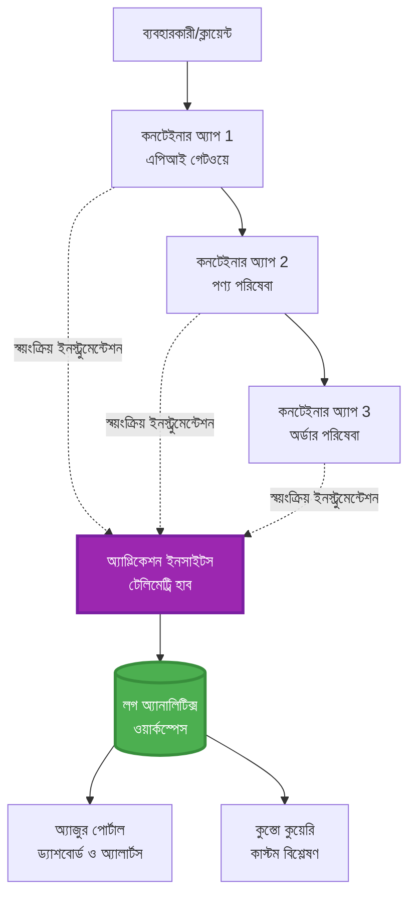
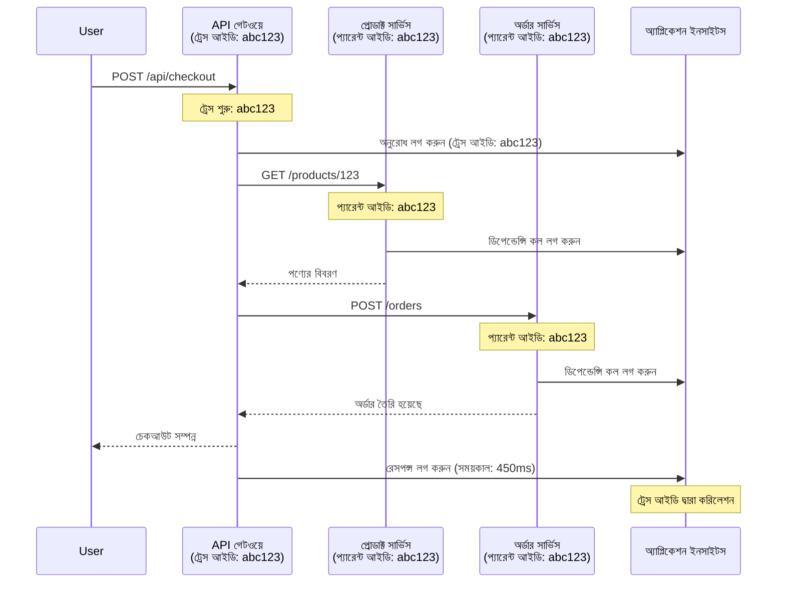

# AZD-এ Application Insights একীকরণ

⏱️ **আনুমানিক সময়**: 40-50 মিনিট | 💰 **খরচের প্রভাব**: ~$5-15/মাস | ⭐ **জটিলতা**: মধ্যম

**📚 শেখার পথ:**
- ← পূর্ববর্তী: [Preflight Checks](preflight-checks.md) - পূর্ব-ডিপ্লয়মেন্ট ভ্যালিডেশন
- 🎯 **আপনি এখানে আছেন**: Application Insights একীকরণ (মনিটরিং, টেলিমেট্রি, ডিবাগিং)
- → পরবর্তী: [Deployment Guide](../chapter-04-infrastructure/deployment-guide.md) - Azure-এ ডেপ্লয় করুন
- 🏠 [Course Home](../../README.md)

---

## আপনি যা শিখবেন

By completing this lesson, you will:
- AZD প্রকল্পে **Application Insights** স্বয়ংক্রিয়ভাবে একীভূত করুন
- মাইক্রোসার্ভিসগুলোর জন্য **distributed tracing** কনফিগার করুন
- **কাস্টম টেলিমেট্রি** (মেট্রিক্স, ইভেন্ট, ডিপেন্ডেন্সি) বাস্তবায়ন করুন
- রিয়েল-টাইম মনিটরিংয়ের জন্য **live metrics** সেটআপ করুন
- AZD ডিপ্লয়মেন্ট থেকে **অ্যালার্ট এবং ড্যাশবোর্ড** তৈরি করুন
- **টেলিমেট্রি কুয়েরি** ব্যবহার করে প্রোডাকশন সমস্যাগুলো ডিবাগ করুন
- **খরচ এবং স্যাম্পলিং** কৌশল অপ্টিমাইজ করুন
- **AI/LLM অ্যাপ্লিকেশন** মনিটর করুন (টোকেন, ল্যাটেন্সি, খরচ)

## কেন AZD-এ Application Insights গুরুত্বপূর্ণ

### চ্যালেঞ্জ: প্রোডাকশন পর্যবেক্ষণযোগ্যতা

**Application Insights ছাড়া:**
```
❌ No visibility into production behavior
❌ Manual log aggregation across services
❌ Reactive debugging (wait for customer complaints)
❌ No performance metrics
❌ Cannot trace requests across services
❌ Unknown failure rates and bottlenecks
```

**Application Insights + AZD সহ:**
```
✅ Automatic telemetry collection
✅ Centralized logs from all services
✅ Proactive issue detection
✅ End-to-end request tracing
✅ Performance metrics and insights
✅ Real-time dashboards
✅ AZD provisions everything automatically
```

**উপমা**: Application Insights আপনার অ্যাপ্লিকেশনের জন্য একটি "black box" ফ্লাইট রেকর্ডার + ককপিট ড্যাশবোর্ড রাখার মতো। আপনি রিয়েল-টাইমে যা ঘটছে তা সমস্তই দেখতে পারেন এবং যেকোনো ঘটনাকে পুনরায় প্লে করতে পারেন।

---

## স্থাপত্য ওভারভিউ

### AZD স্থাপত্যে Application Insights


### কোনগুলো স্বয়ংক্রিয়ভাবে মনিটর করা হয়

| টেলিমেট্রি টাইপ | এটি কী ধারণ করে | ব্যবহারের ক্ষেত্রে |
|----------------|------------------|----------|
| **অনুরোধ** | HTTP অনুরোধ, স্ট্যাটাস কোড, সময়কাল | API পারফরম্যান্স মনিটরিং |
| **নির্ভরশীলতা** | বহির্গত কল (DB, APIs, storage) | বটলনেক সনাক্ত করা |
| **এক্সসেপশন** | স্ট্যাক ট্রেসসহ হ্যান্ডেল না করা ত্রুটি | ত্রুটি ডিবাগিং |
| **কাস্টম ইভেন্ট** | বিজনেস ইভেন্ট (সাইনআপ, ক্রয়) | অ্যানালিটিক্স এবং ফানেল |
| **মেট্রিক্স** | পারফরম্যান্স কাউন্টার, কাস্টম মেট্রিক্স | ক্যাপাসিটি প্ল্যানিং |
| **ট্রেস** | সেভারিটি সহ লগ বার্তা | ডিবাগিং এবং অডিটিং |
| **উপলব্ধতা** | আপটাইম এবং রেসপন্স টাইম টেস্ট | SLA মনিটরিং |

---

## পূর্বশর্তসমূহ

### প্রয়োজনীয় টুলস

```bash
# Azure Developer CLI যাচাই করুন
azd version
# ✅ প্রত্যাশিত: azd সংস্করণ 1.0.0 বা তার উপরে

# Azure CLI যাচাই করুন
az --version
# ✅ প্রত্যাশিত: azure-cli 2.50.0 বা তার উপরে
```

### Azure প্রয়োজনীয়তা

- সক্রিয় Azure সাবস্ক্রিপশন
- তৈরি করার অনুমতি:
  - Application Insights রিসোর্স
  - Log Analytics ওয়ার্কস্পেস
  - Container Apps
  - রিসোর্স গ্রুপ

### জ্ঞানগত পূর্বশর্ত

আপনাকে নিম্নলিখিতগুলো সম্পন্ন করে রাখা উচিত:
- [AZD বেসিকস](../chapter-01-foundation/azd-basics.md) - AZD-এর মূল ধারণা
- [কনফিগারেশন](../chapter-03-configuration/configuration.md) - পরিবেশ সেটআপ
- [প্রথম প্রজেক্ট](../chapter-01-foundation/first-project.md) - বেসিক ডিপ্লয়মেন্ট

---

## লেসন ১: AZD-ে স্বয়ংক্রিয় Application Insights

### AZD কীভাবে Application Insights প্রোভিশন করে

ডিপ্লয় করার সময় AZD স্বয়ংক্রিয়ভাবে Application Insights তৈরি ও কনফিগার করে। চলুন দেখি এটি কীভাবে কাজ করে।

### প্রকল্পের কাঠামো

```
monitored-app/
├── azure.yaml                     # AZD configuration
├── infra/
│   ├── main.bicep                # Main infrastructure
│   ├── core/
│   │   └── monitoring.bicep      # Application Insights + Log Analytics
│   └── app/
│       └── api.bicep             # Container App with monitoring
└── src/
    ├── app.py                    # Application with telemetry
    ├── requirements.txt
    └── Dockerfile
```

---

### ধাপ ১: AZD কনফিগার করুন (azure.yaml)

**ফাইল: `azure.yaml`**

```yaml
name: monitored-app
metadata:
  template: monitored-app@1.0.0

services:
  api:
    project: ./src
    language: python
    host: containerapp

# AZD automatically provisions monitoring!
```

**শুধু এটুকুই!** AZD ডিফল্টভাবে Application Insights তৈরি করবে। মৌলিক মনিটরিংয়ের জন্য অতিরিক্ত কনফিগারেশন প্রয়োজন নেই।

---

### ধাপ ২: মনিটরিং ইনফ্রাস্ট্রাকচার (Bicep)

**ফাইল: `infra/core/monitoring.bicep`**

```bicep
param logAnalyticsName string
param applicationInsightsName string
param location string = resourceGroup().location
param tags object = {}

// Log Analytics Workspace (required for Application Insights)
resource logAnalytics 'Microsoft.OperationalInsights/workspaces@2022-10-01' = {
  name: logAnalyticsName
  location: location
  tags: tags
  properties: {
    sku: {
      name: 'PerGB2018'  // Pay-as-you-go pricing
    }
    retentionInDays: 30  // Keep logs for 30 days
    features: {
      enableLogAccessUsingOnlyResourcePermissions: true
    }
  }
}

// Application Insights
resource applicationInsights 'Microsoft.Insights/components@2020-02-02' = {
  name: applicationInsightsName
  location: location
  tags: tags
  kind: 'web'
  properties: {
    Application_Type: 'web'
    WorkspaceResourceId: logAnalytics.id
    IngestionMode: 'LogAnalytics'
    publicNetworkAccessForIngestion: 'Enabled'
    publicNetworkAccessForQuery: 'Enabled'
  }
}

// Outputs for Container Apps
output logAnalyticsWorkspaceId string = logAnalytics.id
output logAnalyticsWorkspaceName string = logAnalytics.name
output applicationInsightsConnectionString string = applicationInsights.properties.ConnectionString
output applicationInsightsInstrumentationKey string = applicationInsights.properties.InstrumentationKey
output applicationInsightsName string = applicationInsights.name
```

---

### ধাপ ৩: Container App-কে Application Insights-এর সাথে সংযুক্ত করুন

**ফাইল: `infra/app/api.bicep`**

```bicep
param name string
param location string
param tags object = {}
param containerAppsEnvironmentName string
param applicationInsightsConnectionString string

resource containerApp 'Microsoft.App/containerApps@2023-05-01' = {
  name: name
  location: location
  tags: tags
  properties: {
    configuration: {
      ingress: {
        external: true
        targetPort: 8000
      }
      secrets: [
        {
          name: 'appinsights-connection-string'
          value: applicationInsightsConnectionString
        }
      ]
    }
    template: {
      containers: [
        {
          name: 'api'
          image: 'myregistry.azurecr.io/api:latest'
          resources: {
            cpu: json('0.5')
            memory: '1Gi'
          }
          env: [
            {
              name: 'APPLICATIONINSIGHTS_CONNECTION_STRING'
              secretRef: 'appinsights-connection-string'
            }
            {
              name: 'APPLICATIONINSIGHTS_ENABLED'
              value: 'true'
            }
          ]
        }
      ]
    }
  }
}

output uri string = 'https://${containerApp.properties.configuration.ingress.fqdn}'
```

---

### ধাপ ৪: টেলিমেট্রি সহ অ্যাপ্লিকেশন কোড

**ফাইল: `src/app.py`**

```python
from flask import Flask, request, jsonify
from opencensus.ext.azure.log_exporter import AzureLogHandler
from opencensus.ext.azure.trace_exporter import AzureExporter
from opencensus.ext.flask.flask_middleware import FlaskMiddleware
from opencensus.trace.samplers import ProbabilitySampler
import logging
import os

app = Flask(__name__)

# Application Insights সংযোগ স্ট্রিং পান
connection_string = os.environ.get('APPLICATIONINSIGHTS_CONNECTION_STRING')

if connection_string:
    # বিতরণকৃত ট্রেসিং কনফিগার করুন
    middleware = FlaskMiddleware(
        app,
        exporter=AzureExporter(connection_string=connection_string),
        sampler=ProbabilitySampler(rate=1.0)  # উন্নয়নের জন্য ১০০% স্যাম্পলিং
    )
    
    # লগিং কনফিগার করুন
    logger = logging.getLogger(__name__)
    logger.addHandler(AzureLogHandler(connection_string=connection_string))
    logger.setLevel(logging.INFO)
    
    print("✅ Application Insights enabled")
else:
    logger = logging.getLogger(__name__)
    logger.setLevel(logging.INFO)
    print("⚠️ Application Insights not configured")

@app.route('/health')
def health():
    logger.info('Health check endpoint called')
    return jsonify({'status': 'healthy', 'monitoring': 'enabled'})

@app.route('/api/products')
def get_products():
    logger.info('Fetching products')
    
    # ডাটাবেস কল অনুকরণ করুন (স্বয়ংক্রিয়ভাবে নির্ভরশীলতা হিসেবে ট্র্যাক করা হবে)
    products = [
        {'id': 1, 'name': 'Laptop', 'price': 999.99},
        {'id': 2, 'name': 'Mouse', 'price': 29.99},
        {'id': 3, 'name': 'Keyboard', 'price': 79.99}
    ]
    
    logger.info(f'Returned {len(products)} products')
    return jsonify(products)

@app.route('/api/error-test')
def error_test():
    """Test error tracking"""
    logger.error('Testing error tracking')
    try:
        raise ValueError('This is a test exception')
    except Exception as e:
        logger.exception('Exception occurred in error-test endpoint')
        return jsonify({'error': str(e)}), 500

@app.route('/api/slow')
def slow_endpoint():
    """Test performance tracking"""
    import time
    logger.info('Slow endpoint called')
    time.sleep(3)  # ধীর অপারেশন অনুকরণ করুন
    logger.warning('Endpoint took 3 seconds to respond')
    return jsonify({'message': 'Slow operation completed'})

if __name__ == '__main__':
    app.run(host='0.0.0.0', port=8000)
```

**ফাইল: `src/requirements.txt`**

```txt
Flask==3.0.0
opencensus-ext-azure==1.1.13
opencensus-ext-flask==0.8.1
gunicorn==21.2.0
```

---

### ধাপ ৫: ডিপ্লয় এবং যাচাই করুন

```bash
# AZD প্রাথমিককরণ
azd init

# ডিপ্লয় করুন (Application Insights স্বয়ংক্রিয়ভাবে প্রদান করে)
azd up

# অ্যাপের URL পান
APP_URL=$(azd env get-values | grep API_URL | cut -d '=' -f2 | tr -d '"')

# টেলিমেট্রি তৈরি করুন
curl $APP_URL/health
curl $APP_URL/api/products
curl $APP_URL/api/error-test
curl $APP_URL/api/slow
```

**✅ প্রত্যাশিত আউটপুট:**
```json
{
  "status": "healthy",
  "monitoring": "enabled"
}
```

---

### ধাপ ৬: Azure পোর্টালে টেলিমেট্রি দেখুন

```bash
# Application Insights-এর বিস্তারিত তথ্য পান
azd env get-values | grep APPLICATIONINSIGHTS

# Azure পোর্টালে খুলুন
az monitor app-insights component show \
  --app $(azd env get-values | grep APPLICATIONINSIGHTS_NAME | cut -d '=' -f2 | tr -d '"') \
  --resource-group $(azd env get-values | grep AZURE_RESOURCE_GROUP | cut -d '=' -f2 | tr -d '"') \
  --query "appId" -o tsv
```

**Azure পোর্টালে যান → Application Insights → Transaction Search**

আপনি দেখতে পাবেন:
- ✅ স্ট্যাটাস কোডসহ HTTP অনুরোধ
- ✅ অনুরোধের সময়কাল (`/api/slow` এর জন্য 3+ সেকেন্ড)
- ✅ `/api/error-test` থেকে এক্সসেপশন বিস্তারিত
- ✅ কাস্টম লগ বার্তা

---

## লেসন ২: কাস্টম টেলিমেট্রি এবং ইভেন্টস

### ব্যবসায়িক ইভেন্ট ট্র্যাক করুন

চলুন ব্যবসায়িকভাবে সমালোচনামূলক ইভেন্টগুলোর জন্য কাস্টম টেলিমেট্রি যোগ করি।

**ফাইল: `src/telemetry.py`**

```python
from opencensus.ext.azure import metrics_exporter
from opencensus.stats import aggregation as aggregation_module
from opencensus.stats import measure as measure_module
from opencensus.stats import stats as stats_module
from opencensus.stats import view as view_module
from opencensus.tags import tag_map as tag_map_module
from opencensus.ext.azure.log_exporter import AzureLogHandler
from opencensus.ext.azure.trace_exporter import AzureExporter
from opencensus.trace import tracer as tracer_module
import logging
import os

class TelemetryClient:
    """Custom telemetry client for Application Insights"""
    
    def __init__(self, connection_string=None):
        self.connection_string = connection_string or os.environ.get('APPLICATIONINSIGHTS_CONNECTION_STRING')
        
        if not self.connection_string:
            print("⚠️ Application Insights connection string not found")
            return
        
        # লগার সেটআপ করুন
        self.logger = logging.getLogger(__name__)
        self.logger.addHandler(AzureLogHandler(connection_string=self.connection_string))
        self.logger.setLevel(logging.INFO)
        
        # মেট্রিক্স এক্সপোর্টার সেটআপ করুন
        self.stats = stats_module.stats
        self.view_manager = self.stats.view_manager
        self.stats_recorder = self.stats.stats_recorder
        
        exporter = metrics_exporter.new_metrics_exporter(
            connection_string=self.connection_string
        )
        self.view_manager.register_exporter(exporter)
        
        # ট্রেসার সেটআপ করুন
        self.tracer = tracer_module.Tracer(
            exporter=AzureExporter(connection_string=self.connection_string)
        )
        
        print("✅ Custom telemetry client initialized")
    
    def track_event(self, event_name: str, properties: dict = None):
        """Track custom business event"""
        properties = properties or {}
        self.logger.info(
            f"CustomEvent: {event_name}",
            extra={
                'custom_dimensions': {
                    'event_name': event_name,
                    **properties
                }
            }
        )
    
    def track_metric(self, metric_name: str, value: float, properties: dict = None):
        """Track custom metric"""
        properties = properties or {}
        self.logger.info(
            f"CustomMetric: {metric_name} = {value}",
            extra={
                'custom_dimensions': {
                    'metric_name': metric_name,
                    'value': value,
                    **properties
                }
            }
        )
    
    def track_dependency(self, name: str, dependency_type: str, duration: float, success: bool):
        """Track external dependency call"""
        with self.tracer.span(name=name) as span:
            span.add_attribute('dependency.type', dependency_type)
            span.add_attribute('duration', duration)
            span.add_attribute('success', success)

# গ্লোবাল টেলিমেট্রি ক্লায়েন্ট
telemetry = TelemetryClient()
```

### কাস্টম ইভেন্ট যোগ করে অ্যাপ্লিকেশন আপডেট করুন

**ফাইল: `src/app.py` (উন্নত)**

```python
from flask import Flask, request, jsonify
from telemetry import telemetry
import time
import random

app = Flask(__name__)

@app.route('/api/purchase', methods=['POST'])
def purchase():
    """Track purchase event with custom telemetry"""
    data = request.json
    product_id = data.get('product_id')
    quantity = data.get('quantity', 1)
    price = data.get('price', 0)
    
    # ব্যবসায়িক ইভেন্ট ট্র্যাক করুন
    telemetry.track_event('Purchase', {
        'product_id': product_id,
        'quantity': quantity,
        'total_amount': price * quantity,
        'user_id': request.headers.get('X-User-Id', 'anonymous')
    })
    
    # রাজস্ব মেট্রিক ট্র্যাক করুন
    telemetry.track_metric('Revenue', price * quantity, {
        'product_id': product_id,
        'currency': 'USD'
    })
    
    return jsonify({
        'order_id': f'ORD-{random.randint(1000, 9999)}',
        'status': 'confirmed',
        'total': price * quantity
    })

@app.route('/api/search')
def search():
    """Track search queries"""
    query = request.args.get('q', '')
    
    start_time = time.time()
    
    # অনুসন্ধান অনুকরণ করুন (বাস্তবে এটি একটি ডাটাবেস কোয়েরি হবে)
    results = [{'id': 1, 'name': f'Result for {query}'}]
    
    duration = (time.time() - start_time) * 1000  # মিলিসেকেন্ডে রূপান্তর করুন
    
    # অনুসন্ধান ইভেন্ট ট্র্যাক করুন
    telemetry.track_event('Search', {
        'query': query,
        'results_count': len(results),
        'duration_ms': duration
    })
    
    # অনুসন্ধান কর্মক্ষমতা মেট্রিক ট্র্যাক করুন
    telemetry.track_metric('SearchDuration', duration, {
        'query_length': len(query)
    })
    
    return jsonify({'results': results, 'count': len(results)})

@app.route('/api/external-call')
def external_call():
    """Track external API dependency"""
    import requests
    
    start_time = time.time()
    success = True
    
    try:
        # বহিরাগত API কল অনুকরণ করুন
        response = requests.get('https://api.example.com/data', timeout=5)
        result = response.json()
    except Exception as e:
        success = False
        result = {'error': str(e)}
    
    duration = (time.time() - start_time) * 1000
    
    # নির্ভরতা ট্র্যাক করুন
    telemetry.track_dependency(
        name='ExternalAPI',
        dependency_type='HTTP',
        duration=duration,
        success=success
    )
    
    return jsonify(result)

if __name__ == '__main__':
    app.run(host='0.0.0.0', port=8000)
```

### কাস্টম টেলিমেট্রি পরীক্ষা করুন

```bash
# ক্রয় ইভেন্ট ট্র্যাক করুন
curl -X POST $APP_URL/api/purchase \
  -H "Content-Type: application/json" \
  -H "X-User-Id: user123" \
  -d '{"product_id": 1, "quantity": 2, "price": 29.99}'

# অনুসন্ধান ইভেন্ট ট্র্যাক করুন
curl "$APP_URL/api/search?q=laptop"

# বহিরাগত নির্ভরতা ট্র্যাক করুন
curl $APP_URL/api/external-call
```

**Azure পোর্টাল-এ দেখুন:**

Application Insights → Logs-এ যান, তারপর চালান:

```kusto
// View purchase events
traces
| where customDimensions.event_name == "Purchase"
| project 
    timestamp,
    product_id = tostring(customDimensions.product_id),
    total_amount = todouble(customDimensions.total_amount),
    user_id = tostring(customDimensions.user_id)
| order by timestamp desc

// View revenue metrics
traces
| where customDimensions.metric_name == "Revenue"
| summarize TotalRevenue = sum(todouble(customDimensions.value)) by bin(timestamp, 1h)
| render timechart

// View search performance
traces
| where customDimensions.event_name == "Search"
| summarize 
    AvgDuration = avg(todouble(customDimensions.duration_ms)),
    SearchCount = count()
  by bin(timestamp, 5m)
| render timechart
```

---

## লেসন ৩: মাইক্রোসার্ভিসের জন্য Distributed Tracing

### ক্রস-সার্ভিস ট্রেসিং সক্ষম করুন

মাইক্রোসার্ভিসগুলির জন্য, Application Insights স্বয়ংক্রিয়ভাবে সার্ভিসগুলোর মধ্যে অনুরোধগুলিকে করেলেট করে।

**ফাইল: `infra/main.bicep`**

```bicep
targetScope = 'subscription'

param environmentName string
param location string = 'eastus'

var tags = { 'azd-env-name': environmentName }

resource rg 'Microsoft.Resources/resourceGroups@2021-04-01' = {
  name: 'rg-${environmentName}'
  location: location
  tags: tags
}

// Monitoring (shared by all services)
module monitoring './core/monitoring.bicep' = {
  name: 'monitoring'
  scope: rg
  params: {
    logAnalyticsName: 'log-${environmentName}'
    applicationInsightsName: 'appi-${environmentName}'
    location: location
    tags: tags
  }
}

// API Gateway
module apiGateway './app/api-gateway.bicep' = {
  name: 'api-gateway'
  scope: rg
  params: {
    name: 'ca-gateway-${environmentName}'
    location: location
    tags: union(tags, { 'azd-service-name': 'gateway' })
    applicationInsightsConnectionString: monitoring.outputs.applicationInsightsConnectionString
  }
}

// Product Service
module productService './app/product-service.bicep' = {
  name: 'product-service'
  scope: rg
  params: {
    name: 'ca-products-${environmentName}'
    location: location
    tags: union(tags, { 'azd-service-name': 'products' })
    applicationInsightsConnectionString: monitoring.outputs.applicationInsightsConnectionString
  }
}

// Order Service
module orderService './app/order-service.bicep' = {
  name: 'order-service'
  scope: rg
  params: {
    name: 'ca-orders-${environmentName}'
    location: location
    tags: union(tags, { 'azd-service-name': 'orders' })
    applicationInsightsConnectionString: monitoring.outputs.applicationInsightsConnectionString
  }
}

output APPLICATIONINSIGHTS_CONNECTION_STRING string = monitoring.outputs.applicationInsightsConnectionString
output GATEWAY_URL string = apiGateway.outputs.uri
```

### এন্ড-টু-এন্ড ট্রানজ্যাকশন দেখুন


**এন্ড-টু-এন্ড ট্রেস কুয়েরি করুন:**

```kusto
// Find complete request flow
let traceId = "abc123...";  // Get from response header
dependencies
| union requests
| where operation_Id == traceId
| project 
    timestamp,
    type = itemType,
    name,
    duration,
    success,
    cloud_RoleName
| order by timestamp asc
```

---

## লেসন ৪: লাইভ মেট্রিক্স এবং রিয়েল-টাইম মনিটরিং

### লাইভ মেট্রিক্স স্ট্রীম সক্ষম করুন

লাইভ মেট্রিক্স <1 সেকেন্ড ল্যাটেন্সির সাথে রিয়েল-টাইম টেলিমেট্রি প্রদান করে।

**লাইভ মেট্রিক্স অ্যাক্সেস করুন:**

```bash
# Application Insights রিসোর্স পান
APPI_NAME=$(azd env get-values | grep APPLICATIONINSIGHTS_NAME | cut -d '=' -f2 | tr -d '"')

# রিসোর্স গ্রুপ পান
RG_NAME=$(azd env get-values | grep AZURE_RESOURCE_GROUP | cut -d '=' -f2 | tr -d '"')

echo "Navigate to: Azure Portal → Resource Groups → $RG_NAME → $APPI_NAME → Live Metrics"
```

**রিয়েল-টাইমে আপনি যা দেখতে পাবেন:**
- ✅ ইনকামিং অনুরোধ হার (অনুরোধ/সেকেন্ড)
- ✅ আউটগোয়িং ডিপেন্ডেন্সি কল
- ✅ এক্সসেপশন গণনা
- ✅ CPU এবং মেমরি ব্যবহার
- ✅ সক্রিয় সার্ভার গণনা
- ✅ নমুনা টেলিমেট্রি

### টেস্টিং-এর জন্য লোড জেনারেট করুন

```bash
# লাইভ মেট্রিক্স দেখতে লোড তৈরি করুন
for i in {1..100}; do
  curl $APP_URL/api/products &
  curl $APP_URL/api/search?q=test$i &
done

# Azure পোর্টালে লাইভ মেট্রিক্স দেখুন
# আপনি অনুরোধের রেটে তীব্র বৃদ্ধি দেখতে পাবেন
```

---

## ব্যবহারিক অনুশীলনসমূহ

### অনুশীলন ১: অ্যালার্ট সেটআপ করুন ⭐⭐ (মাঝারি)

**লক্ষ্য**: উচ্চ ত্রুটি হার এবং ধীর রেসপন্সের জন্য অ্যালার্ট তৈরি করুন।

**ধাপসমূহ:**

1. **ত্রুটি হারের জন্য অ্যালার্ট তৈরি করুন:**

```bash
# অ্যাপ্লিকেশন ইনসাইটস রিসোর্স আইডি পান
APPI_ID=$(az monitor app-insights component show \
  --app $APPI_NAME \
  --resource-group $RG_NAME \
  --query "id" -o tsv)

# ব্যর্থ অনুরোধগুলোর জন্য মেট্রিক সতর্কতা তৈরি করুন
az monitor metrics alert create \
  --name "High-Error-Rate" \
  --resource-group $RG_NAME \
  --scopes $APPI_ID \
  --condition "count requests/failed > 10" \
  --window-size 5m \
  --evaluation-frequency 1m \
  --description "Alert when error rate exceeds 10 per 5 minutes"
```

2. **ধীর রেসপন্সের জন্য অ্যালার্ট তৈরি করুন:**

```bash
az monitor metrics alert create \
  --name "Slow-Responses" \
  --resource-group $RG_NAME \
  --scopes $APPI_ID \
  --condition "avg requests/duration > 3000" \
  --window-size 5m \
  --evaluation-frequency 1m \
  --description "Alert when average response time exceeds 3 seconds"
```

3. **Bicep এর মাধ্যমে অ্যালার্ট তৈরি করুন (AZD-এ প্রাধান্যযোগ্য):**

**ফাইল: `infra/core/alerts.bicep`**

```bicep
param applicationInsightsId string
param actionGroupId string = ''
param location string = resourceGroup().location

// High error rate alert
resource errorRateAlert 'Microsoft.Insights/metricAlerts@2018-03-01' = {
  name: 'high-error-rate'
  location: 'global'
  properties: {
    description: 'Alert when error rate exceeds threshold'
    severity: 2
    enabled: true
    scopes: [
      applicationInsightsId
    ]
    evaluationFrequency: 'PT1M'
    windowSize: 'PT5M'
    criteria: {
      'odata.type': 'Microsoft.Azure.Monitor.SingleResourceMultipleMetricCriteria'
      allOf: [
        {
          name: 'Error rate'
          metricName: 'requests/failed'
          operator: 'GreaterThan'
          threshold: 10
          timeAggregation: 'Count'
        }
      ]
    }
    actions: actionGroupId != '' ? [
      {
        actionGroupId: actionGroupId
      }
    ] : []
  }
}

// Slow response alert
resource slowResponseAlert 'Microsoft.Insights/metricAlerts@2018-03-01' = {
  name: 'slow-responses'
  location: 'global'
  properties: {
    description: 'Alert when response time is too high'
    severity: 3
    enabled: true
    scopes: [
      applicationInsightsId
    ]
    evaluationFrequency: 'PT1M'
    windowSize: 'PT5M'
    criteria: {
      'odata.type': 'Microsoft.Azure.Monitor.SingleResourceMultipleMetricCriteria'
      allOf: [
        {
          name: 'Response duration'
          metricName: 'requests/duration'
          operator: 'GreaterThan'
          threshold: 3000
          timeAggregation: 'Average'
        }
      ]
    }
  }
}

output errorAlertId string = errorRateAlert.id
output slowResponseAlertId string = slowResponseAlert.id
```

4. **অ্যালার্ট পরীক্ষা করুন:**

```bash
# ত্রুটি তৈরি করুন
for i in {1..20}; do
  curl $APP_URL/api/error-test
done

# ধীর প্রতিক্রিয়া তৈরি করুন
for i in {1..10}; do
  curl $APP_URL/api/slow
done

# অ্যালার্টের অবস্থা পরীক্ষা করুন (৫-১০ মিনিট অপেক্ষা করুন)
az monitor metrics alert list \
  --resource-group $RG_NAME \
  --query "[].{Name:name, Enabled:enabled, State:properties.enabled}" \
  --output table
```

**✅ সফলতার মানদণ্ড:**
- ✅ অ্যালার্ট সফলভাবে তৈরি হয়েছে
- ✅ থ্রেশহোল্ড লঙ্ঘিত হলে অ্যালার্ট ট্রিগার হয়
- ✅ Azure পোর্টালে অ্যালার্ট ইতিহাস দেখা যায়
- ✅ AZD ডিপ্লয়মেন্টের সাথে ইন্টিগ্রেটেড

**সময়**: 20-25 মিনিট

---

### অনুশীলন ২: কাস্টম ড্যাশবোর্ড তৈরি করুন ⭐⭐ (মাঝারি)

**লক্ষ্য**: প্রধান অ্যাপ্লিকেশন মেট্রিক্স প্রদর্শনকারী একটি ড্যাশবোর্ড তৈরি করা।

**ধাপসমূহ:**

1. **Azure পোর্টাল থেকে ড্যাশবোর্ড তৈরি করুন:**

নেভিগেট করুন: Azure পোর্টাল → Dashboards → New Dashboard

2. **কী মেট্রিক্সের জন্য টাইল যোগ করুন:**

- অনুরোধ সংখ্যা (গত ২৪ ঘন্টা)
- গড় রেসপন্স সময়
- ত্রুটি হার
- শীর্ষ ৫ ধীরতম অপারেশন
- ব্যবহারকারীদের ভৌগলিক বিভাজন

3. **Bicep মাধ্যমে ড্যাশবোর্ড তৈরি করুন:**

**ফাইল: `infra/core/dashboard.bicep`**

```bicep
param dashboardName string
param applicationInsightsId string
param location string = resourceGroup().location

resource dashboard 'Microsoft.Portal/dashboards@2020-09-01-preview' = {
  name: dashboardName
  location: location
  properties: {
    lenses: [
      {
        order: 0
        parts: [
          // Request count
          {
            position: { x: 0, y: 0, rowSpan: 4, colSpan: 6 }
            metadata: {
              type: 'Extension/Microsoft_OperationsManagementSuite_Workspace/PartType/LogsDashboardPart'
              inputs: [
                {
                  name: 'resourceId'
                  value: applicationInsightsId
                }
                {
                  name: 'query'
                  value: '''
                    requests
                    | summarize RequestCount = count() by bin(timestamp, 1h)
                    | render timechart
                  '''
                }
              ]
            }
          }
          // Error rate
          {
            position: { x: 6, y: 0, rowSpan: 4, colSpan: 6 }
            metadata: {
              type: 'Extension/Microsoft_OperationsManagementSuite_Workspace/PartType/LogsDashboardPart'
              inputs: [
                {
                  name: 'resourceId'
                  value: applicationInsightsId
                }
                {
                  name: 'query'
                  value: '''
                    requests
                    | summarize 
                        Total = count(),
                        Failed = countif(success == false)
                    | extend ErrorRate = (Failed * 100.0) / Total
                    | project ErrorRate
                  '''
                }
              ]
            }
          }
        ]
      }
    ]
  }
}

output dashboardId string = dashboard.id
```

4. **ড্যাশবোর্ড ডিপ্লয় করুন:**

```bash
# main.bicep-এ যোগ করুন
module dashboard './core/dashboard.bicep' = {
  name: 'dashboard'
  scope: rg
  params: {
    dashboardName: 'dashboard-${environmentName}'
    applicationInsightsId: monitoring.outputs.applicationInsightsId
    location: location
  }
}

# ডিপ্লয় করুন
azd up
```

**✅ সফলতার মানদণ্ড:**
- ✅ ড্যাশবোর্ড প্রাথমিক মেট্রিক্স দেখায়
- ✅ Azure পোর্টাল হোমে পিন করা যায়
- ✅ রিয়েল-টাইমে আপডেট হয়
- ✅ AZD-এর মাধ্যমে ডিপ্লয়যোগ্য

**সময়**: 25-30 মিনিট

---

### অনুশীলন ৩: AI/LLM অ্যাপ্লিকেশন মনিটর করুন ⭐⭐⭐ (উন্নত)

**লক্ষ্য**: Azure OpenAI ব্যবহার ট্র্যাক করা (টোকেন, খরচ, ল্যাটেন্সি)।

**ধাপসমূহ:**

1. **AI মনিটরিং র‍্যাপার তৈরি করুন:**

**ফাইল: `src/ai_telemetry.py`**

```python
from telemetry import telemetry
from openai import AzureOpenAI
import time

class MonitoredAzureOpenAI:
    """Azure OpenAI client with automatic telemetry"""
    
    def __init__(self, api_key, endpoint, api_version="2024-02-01"):
        self.client = AzureOpenAI(
            api_key=api_key,
            api_version=api_version,
            azure_endpoint=endpoint
        )
    
    def chat_completion(self, model: str, messages: list, **kwargs):
        """Track chat completion with telemetry"""
        start_time = time.time()
        
        try:
            # Azure OpenAI-কে কল করুন
            response = self.client.chat.completions.create(
                model=model,
                messages=messages,
                **kwargs
            )
            
            duration = (time.time() - start_time) * 1000  # মিলিসেকেন্ড
            
            # ব্যবহার বের করুন
            usage = response.usage
            prompt_tokens = usage.prompt_tokens
            completion_tokens = usage.completion_tokens
            total_tokens = usage.total_tokens
            
            # খরচ হিসাব করুন (GPT-4 মূল্য)
            prompt_cost = (prompt_tokens / 1000) * 0.03  # $0.03 প্রতি 1K টোকেনের জন্য
            completion_cost = (completion_tokens / 1000) * 0.06  # $0.06 প্রতি 1K টোকেনের জন্য
            total_cost = prompt_cost + completion_cost
            
            # কাস্টম ইভেন্ট ট্র্যাক করুন
            telemetry.track_event('OpenAI_Request', {
                'model': model,
                'prompt_tokens': prompt_tokens,
                'completion_tokens': completion_tokens,
                'total_tokens': total_tokens,
                'duration_ms': duration,
                'cost_usd': total_cost,
                'success': True
            })
            
            # মেট্রিক্স ট্র্যাক করুন
            telemetry.track_metric('OpenAI_Tokens', total_tokens, {
                'model': model,
                'type': 'total'
            })
            
            telemetry.track_metric('OpenAI_Cost', total_cost, {
                'model': model,
                'currency': 'USD'
            })
            
            telemetry.track_metric('OpenAI_Duration', duration, {
                'model': model
            })
            
            return response
            
        except Exception as e:
            duration = (time.time() - start_time) * 1000
            
            telemetry.track_event('OpenAI_Request', {
                'model': model,
                'duration_ms': duration,
                'success': False,
                'error': str(e)
            })
            
            raise
```

2. **মনিটর করা ক্লায়েন্ট ব্যবহার করুন:**

```python
from flask import Flask, request, jsonify
from ai_telemetry import MonitoredAzureOpenAI
import os

app = Flask(__name__)

# পর্যবেক্ষণকৃত OpenAI ক্লায়েন্ট প্রারম্ভ করুন
openai_client = MonitoredAzureOpenAI(
    api_key=os.environ['AZURE_OPENAI_API_KEY'],
    endpoint=os.environ['AZURE_OPENAI_ENDPOINT']
)

@app.route('/api/chat', methods=['POST'])
def chat():
    data = request.json
    user_message = data.get('message')
    
    # স্বয়ংক্রিয় পর্যবেক্ষণের সাথে কল করুন
    response = openai_client.chat_completion(
        model='gpt-4',
        messages=[
            {'role': 'user', 'content': user_message}
        ]
    )
    
    return jsonify({
        'response': response.choices[0].message.content,
        'tokens': response.usage.total_tokens
    })
```

3. **AI মেট্রিক্স কুয়েরি করুন:**

```kusto
// Total AI spend over time
traces
| where customDimensions.event_name == "OpenAI_Request"
| where customDimensions.success == "True"
| summarize TotalCost = sum(todouble(customDimensions.cost_usd)) by bin(timestamp, 1h)
| render timechart

// Token usage by model
traces
| where customDimensions.event_name == "OpenAI_Request"
| summarize 
    TotalTokens = sum(toint(customDimensions.total_tokens)),
    RequestCount = count()
  by Model = tostring(customDimensions.model)

// Average latency
traces
| where customDimensions.event_name == "OpenAI_Request"
| summarize AvgDuration = avg(todouble(customDimensions.duration_ms))
| project AvgDurationSeconds = AvgDuration / 1000

// Cost per request
traces
| where customDimensions.event_name == "OpenAI_Request"
| extend Cost = todouble(customDimensions.cost_usd)
| summarize 
    TotalCost = sum(Cost),
    RequestCount = count(),
    AvgCostPerRequest = avg(Cost)
```

**✅ সফলতার মানদণ্ড:**
- ✅ প্রতিটি OpenAI কল স্বয়ংক্রিয়ভাবে ট্র্যাক করা হয়
- ✅ টোকেন ব্যবহার এবং খরচ দৃশ্যমান
- ✅ ল্যাটেন্সি মনিটর করা হয়
- ✅ বাজেট অ্যালার্ট সেট করা যায়

**সময়**: 35-45 মিনিট

---

## খরচ অপ্টিমাইজেশন

### স্যাম্পলিং কৌশল

টেলিমেট্রির স্যাম্পলিং করে খরচ নিয়ন্ত্রণ করুন:

```python
from opencensus.trace.samplers import ProbabilitySampler

# উন্নয়ন: 100% নমুনা সংগ্রহ
sampler = ProbabilitySampler(rate=1.0)

# উৎপাদন: 10% নমুনা সংগ্রহ (খরচ 90% পর্যন্ত কমায়)
sampler = ProbabilitySampler(rate=0.1)

# অভিযোজিত নমুনা সংগ্রহ (স্বয়ংক্রিয়ভাবে সামঞ্জস্য করে)
from opencensus.trace.samplers import AdaptiveSampler
sampler = AdaptiveSampler()
```

**Bicep-এ:**

```bicep
resource applicationInsights 'Microsoft.Insights/components@2020-02-02' = {
  name: applicationInsightsName
  properties: {
    SamplingPercentage: 10  // 10% sampling
  }
}
```

### ডেটা রিটেনশন

```bicep
resource logAnalytics 'Microsoft.OperationalInsights/workspaces@2022-10-01' = {
  name: logAnalyticsName
  properties: {
    retentionInDays: 30  // Minimum (cheapest)
    // Options: 30, 31, 60, 90, 120, 180, 270, 365, 550, 730
  }
}
```

### মাসিক খরচের আনুমানিকতা

| ডেটা ভলিউম | রিটেনশন | মাসিক খরচ |
|-------------|-----------|--------------|
| 1 GB/মাস | 30 দিন | ~$2-5 |
| 5 GB/মাস | 30 দিন | ~$10-15 |
| 10 GB/মাস | 90 দিন | ~$25-40 |
| 50 GB/মাস | 90 দিন | ~$100-150 |

**ফ্রি টিয়ার**: 5 GB/মাস অন্তর্ভুক্ত

---

## জ্ঞান যাচাইকরণ

### ১। মৌলিক ইন্টিগ্রেশন ✓

আপনার বোঝাপড়া পরীক্ষা করুন:

- [ ] **Q1**: AZD কীভাবে Application Insights প্রোভিশন করে?
  - **A**: স্বয়ংক্রিয়ভাবে Bicep টেমপ্লেটের মাধ্যমে `infra/core/monitoring.bicep`

- [ ] **Q2**: কোন এনভায়রনমেন্ট ভেরিয়েবল Application Insights সক্ষম করে?
  - **A**: `APPLICATIONINSIGHTS_CONNECTION_STRING`

- [ ] **Q3**: তিনটি প্রধান টেলিমেট্রি টাইপ কী কী?
  - **A**: অনুরোধ (HTTP কল), নির্ভরশীলতা (বহির্গত কল), এক্সসেপশন (ত্রুটি)

**হ্যান্ডস-অন যাচাইকরণ:**
```bash
# Application Insights কনফিগার করা আছে কিনা পরীক্ষা করুন
azd env get-values | grep APPLICATIONINSIGHTS

# টেলিমেট্রি প্রবাহিত হচ্ছে কি না যাচাই করুন
az monitor app-insights metrics show \
  --app $APPI_NAME \
  --resource-group $RG_NAME \
  --metric "requests/count"
```

---

### ২। কাস্টম টেলিমেট্রি ✓

আপনার বোঝাপড়া পরীক্ষা করুন:

- [ ] **Q1**: কিভাবে কাস্টম ব্যবসায়িক ইভেন্টগুলো ট্র্যাক করবেন?
  - **A**: লগার ব্যবহার করে `custom_dimensions` বা `TelemetryClient.track_event()`

- [ ] **Q2**: ইভেন্ট এবং মেট্রিক্সের মধ্যে পার্থক্য কি?
  - **A**: ইভেন্টগুলো আলাদা আলাদা ঘটনা, মেট্রিক্সগুলো সাংখ্যিক পরিমাপ

- [ ] **Q3**: আপনি কীভাবে সার্ভিসগুলোর মধ্যে টেলিমেট্রিকে করেলেট করবেন?
  - **A**: Application Insights স্বয়ংক্রিয়ভাবে করেলেশনের জন্য `operation_Id` ব্যবহার করে

**হ্যান্ডস-অন যাচাইকরণ:**
```kusto
// Verify custom events
traces
| where customDimensions.event_name != ""
| summarize count() by tostring(customDimensions.event_name)
```

---

### ৩। প্রোডাকশন মনিটরিং ✓

আপনার বোঝাপড়া পরীক্ষা করুন:

- [ ] **Q1**: স্যাম্পলিং কি এবং কেন ব্যবহার করা হয়?
  - **A**: স্যাম্পলিং ডেটার পরিমাণ (এবং খরচ) কমায় কারণ এটি কেবল টেলিমেট্রির একটি শতাংশই ক্যাপচার করে

- [ ] **Q2**: কীভাবে আপনি অ্যালার্ট সেটআপ করবেন?
  - **A**: Application Insights মেট্রিক্সের ভিত্তিতে Bicep বা Azure পোর্টালে মেট্রিক অ্যালার্ট ব্যবহার করুন

- [ ] **Q3**: Log Analytics এবং Application Insights এর মধ্যে কি পার্থক্য?
  - **A**: Application Insights ডেটা Log Analytics ওয়ার্কস্পেসে স্টোর করে; App Insights অ্যাপ্লিকেশন-নির্দিষ্ঠ ভিউ প্রদান করে

**হ্যান্ডস-অন যাচাইকরণ:**
```bash
# স্যাম্পলিং কনফিগারেশন পরীক্ষা করুন
az monitor app-insights component show \
  --app $APPI_NAME \
  --resource-group $RG_NAME \
  --query "properties.SamplingPercentage"
```

---

## সেরা অনুশীলন

### ✅ করুন:

1. **কোরেলেশন আইডি ব্যবহার করুন**
   ```python
   logger.info('Processing order', extra={
       'custom_dimensions': {
           'order_id': order_id,
           'user_id': user_id
       }
   })
   ```

2. **সমালোচনামূলক মেট্রিক্সের জন্য অ্যালার্ট সেটআপ করুন**
   ```bicep
   // Error rate, slow responses, availability
   ```

3. **স্ট্রাকচার্ড লগিং ব্যবহার করুন**
   ```python
   # ✅ ভাল: সংগঠিত
   logger.info('User signup', extra={'custom_dimensions': {'user_id': 123}})
   
   # ❌ খারাপ: অসংগঠিত
   logger.info(f'User 123 signed up')
   ```

4. **ডিপেন্ডেন্সি মনিটর করুন**
   ```python
   # স্বয়ংক্রিয়ভাবে ডাটাবেস কল, HTTP অনুরোধ ইত্যাদি ট্র্যাক করুন।
   ```

5. **ডিপ্লয়মেন্ট চলাকালীন লাইভ মেট্রিক্স ব্যবহার করুন**

### ❌ করবেন না:

1. **সংবেদনশীল ডেটা লগ করবেন না**
   ```python
   # ❌ খারাপ
   logger.info(f'Login: {username}:{password}')
   
   # ✅ ভালো
   logger.info('Login attempt', extra={'custom_dimensions': {'username': username}})
   ```

2. **প্রোডাকশনে 100% স্যাম্পলিং ব্যবহার করবেন না**
   ```python
   # ❌ দামী
   sampler = ProbabilitySampler(rate=1.0)
   
   # ✅ খরচ-কার্যকর
   sampler = ProbabilitySampler(rate=0.1)
   ```

3. **ডেড লেটার কিউ উপেক্ষা করবেন না**

4. **ডেটা রিটেনশন সীমা সেট করতে ভুলবেন না**

---

## সমস্যা সমাধান

### সমস্যা: কোনো টেলিমেট্রি দেখা যাচ্ছে না

**নির্ণয়:**
```bash
# সংযোগ স্ট্রিং সেট করা আছে কিনা যাচাই করুন
azd env get-values | grep APPLICATIONINSIGHTS

# Azure Monitor ব্যবহার করে অ্যাপ্লিকেশন লগ পরীক্ষা করুন
azd monitor --logs

# অথবা Container Apps-এর জন্য Azure CLI ব্যবহার করুন:
az containerapp logs show --name $APP_NAME --resource-group $RG_NAME --tail 50
```

**সমাধান:**
```bash
# কন্টেইনার অ্যাপ-এ সংযোগ স্ট্রিং যাচাই করুন
az containerapp show \
  --name $APP_NAME \
  --resource-group $RG_NAME \
  --query "properties.template.containers[0].env" \
  | grep -i applicationinsights
```

---

### সমস্যা: উচ্চ খরচ

**নির্ণয়:**
```bash
# ডেটা ইনজেশন পরীক্ষা করুন
az monitor app-insights metrics show \
  --app $APPI_NAME \
  --resource-group $RG_NAME \
  --metric "availabilityResults/count"
```

**সমাধান:**
- স্যাম্পলিং রেট কমান
- রিটেনশন পিরিয়ড কমান
- ভেরবোস লগিং সরান

---

## আরও শিখুন

### অফিসিয়াল ডকুমেন্টেশন
- [Application Insights ওভারভিউ](https://learn.microsoft.com/azure/azure-monitor/app/app-insights-overview)
- [Python-এর জন্য Application Insights](https://learn.microsoft.com/azure/azure-monitor/app/opencensus-python)
- [Kusto Query Language](https://learn.microsoft.com/azure/data-explorer/kusto/query/)
- [AZD মনিটরিং](https://learn.microsoft.com/azure/developer/azure-developer-cli/monitor-your-app)

### এই কোর্সে পরবর্তী ধাপগুলো
- ← পূর্ববর্তী: [Preflight Checks](preflight-checks.md)
- → পরবর্তী: [Deployment Guide](../chapter-04-infrastructure/deployment-guide.md)
- 🏠 [Course Home](../../README.md)

### সম্পর্কিত উদাহরণ
- [Azure OpenAI উদাহরণ](../../../../examples/azure-openai-chat) - AI টেলিমেট্রি
- [মাইক্রোসার্ভিস উদাহরণ](../../../../examples/microservices) - ডিস্ট্রিবিউটেড ট্রেসিং

---

## সারসংক্ষেপ

**আপনি শিখেছেন:**
- ✅ AZD-এ স্বয়ংক্রিয়ভাবে Application Insights প্রোভিশনিং
- ✅ কাস্টম টেলিমেট্রি (ইভেন্ট, মেট্রিক্স, ডিপেন্ডেন্সি)
- ✅ মাইক্রোসার্ভিস জুড়ে ডিস্ট্রিবিউটেড ট্রেসিং
- ✅ লাইভ মেট্রিক্স এবং রিয়েল-টাইম মনিটরিং
- ✅ অ্যালার্ট এবং ড্যাশবোর্ড
- ✅ AI/LLM অ্যাপ্লিকেশন মনিটরিং
- ✅ খরচ অপ্টিমাইজেশন কৌশল

**মূল বিষয়সমূহ:**
1. **AZD স্বয়ংক্রিয়ভাবে মনিটরিং প্রদান করে** - ম্যানুয়াল সেটআপের প্রয়োজন নেই
2. **স্ট্রাকচার্ড লগিং ব্যবহার করুন** - কোয়েরি করা সহজ হয়
3. **ব্যবসায়িক ইভেন্ট ট্র্যাক করুন** - শুধুই প্রযুক্তিগত মেট্রিক্স নয়
4. **AI-এর খরচ পর্যবেক্ষণ করুন** - টোকেন ও ব্যয় ট্র্যাক করুন
5. **অ্যালার্ট সেট আপ করুন** - প্রতিক্রিয়াশীল নয়, প্রোঅ্যাকটিভ হন
6. **খরচ অনুকূলিত করুন** - স্যাম্পলিং এবং রিটেনশন সীমা ব্যবহার করুন

**পরবর্তী পদক্ষেপ:**
1. ব্যবহারিক অনুশীলন সম্পন্ন করুন
2. আপনার AZD প্রকল্পে Application Insights যোগ করুন
3. আপনার দলের জন্য কাস্টম ড্যাশবোর্ড তৈরি করুন
4. শিখুন [ডিপ্লয়মেন্ট গাইড](../chapter-04-infrastructure/deployment-guide.md)

---

<!-- CO-OP TRANSLATOR DISCLAIMER START -->
অস্বীকৃতি:
এই দলিলটি AI অনুবাদ সেবা [Co-op Translator](https://github.com/Azure/co-op-translator) ব্যবহার করে অনুবাদ করা হয়েছে। যদিও আমরা যথাসাধ্য সঠিকতা বজায় রাখার চেষ্টা করি, স্বয়ংক্রিয় অনুবাদে ত্রুটি বা অসঙ্গতি থাকতে পারে বলে অনুগ্রহ করে মনে রাখুন। মূল দলিলটি তার নিজ ভাষায় প্রামাণিক উৎস হিসেবে বিবেচনা করা উচিত। গুরুত্বপূর্ণ তথ্যের ক্ষেত্রে পেশাদার মানব অনুবাদ গ্রহণ করা প্রস্তাব করা হয়। এই অনুবাদ ব্যবহারের ফলে উদ্ভূত কোনো ভুল বোঝাবুঝি বা ভ্রান্ত ব্যাখ্যার জন্য আমরা দায়ী নই।
<!-- CO-OP TRANSLATOR DISCLAIMER END -->