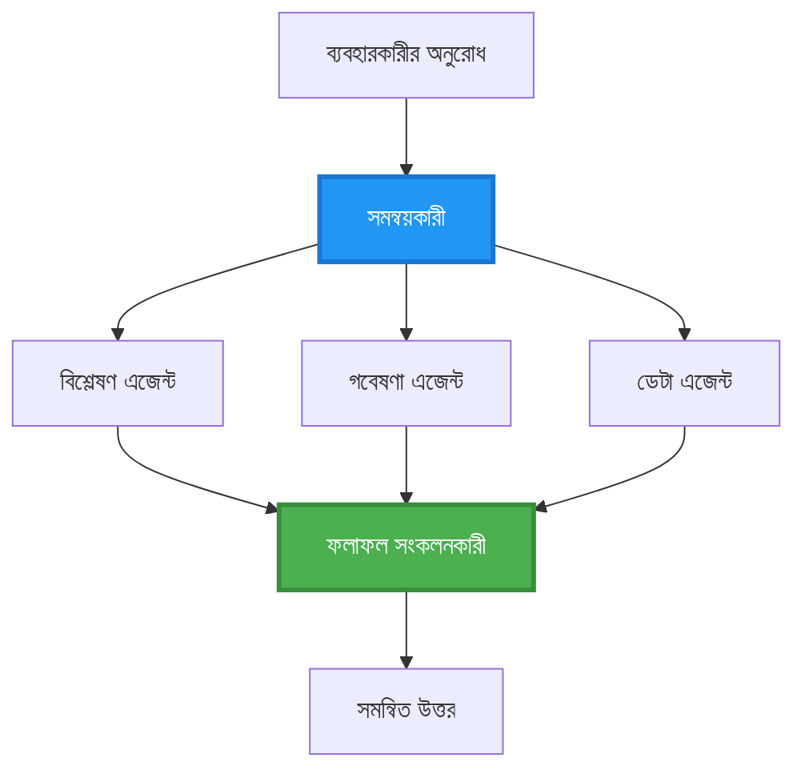
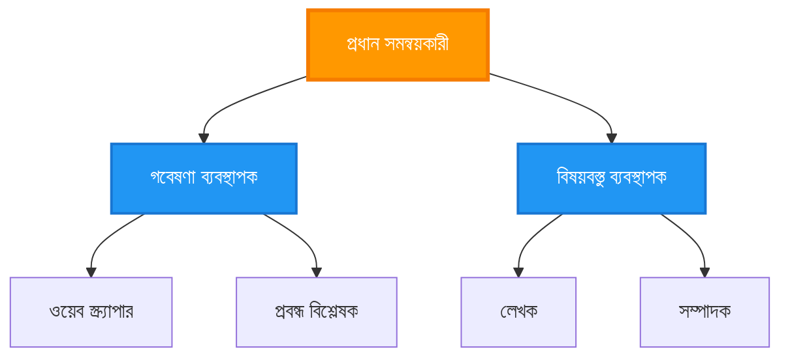
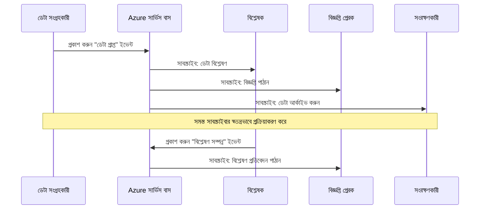
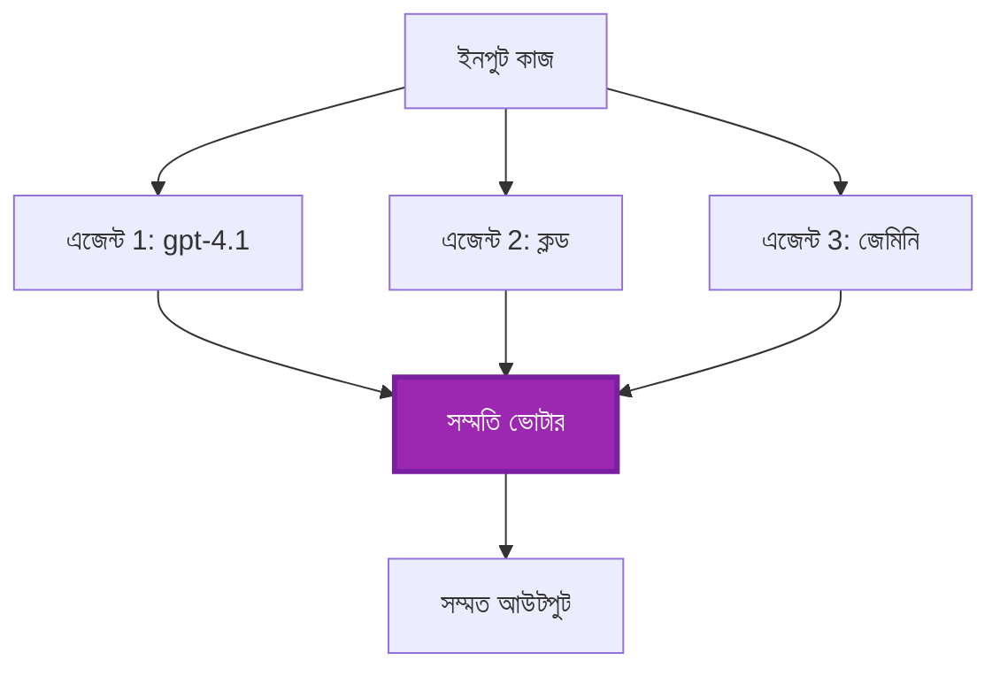
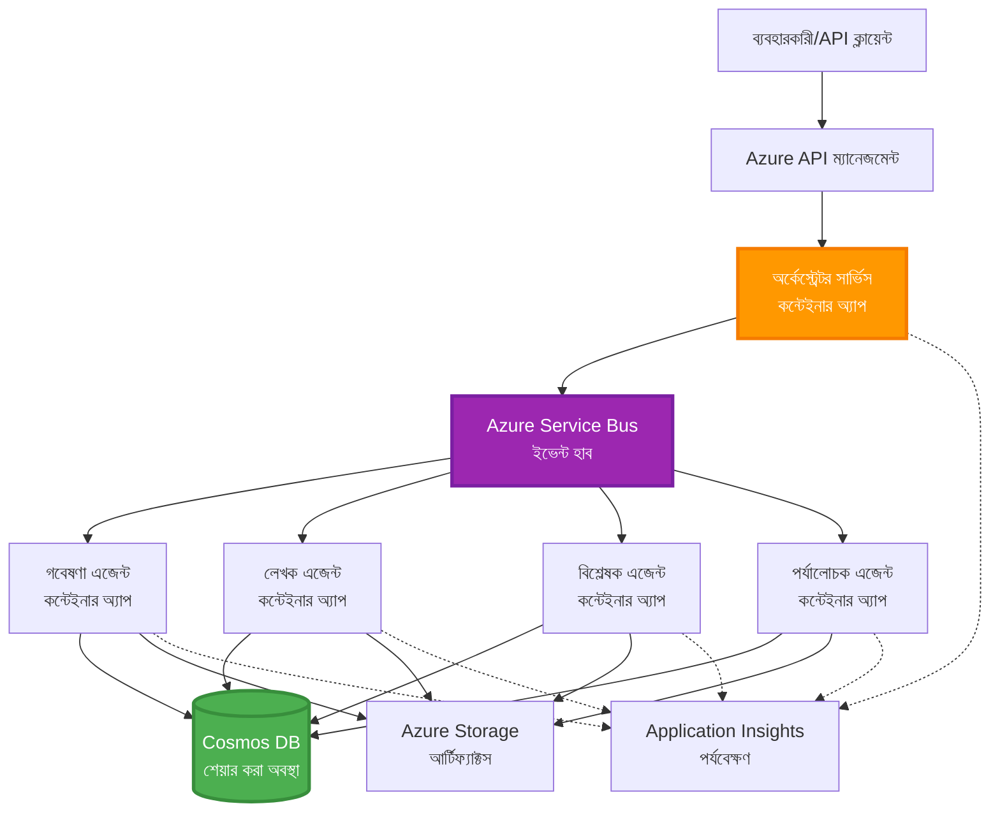

# মাল্টি-এজেন্ট সমন্বয় প্যাটার্ন

⏱️ **আনুমানিক সময়**: 60-75 মিনিট | 💰 **আনুমানিক খরচ**: ~$100-300/মাস | ⭐ **জটিলতা**: উন্নত

**📚 শেখার পথ:**
- ← Previous: [ক্যাপাসিটি পরিকল্পনা](capacity-planning.md) - রিসোর্স সাইজিং এবং স্কেলিং কৌশল
- 🎯 **আপনি এখানে আছেন**: মাল্টি-এজেন্ট সমন্বয় প্যাটার্ন (অরকেস্ট্রেশন, যোগাযোগ, স্টেট ব্যবস্থাপনা)
- → Next: [SKU Selection](sku-selection.md) - সঠিক Azure সেবা নির্বাচন করা
- 🏠 [Course Home](../../README.md)

---

## আপনি কী শিখবেন

এই লেসনটি শেষ করে আপনি:
- বুঝবেন **মাল্টি-এজেন্ট আর্কিটেকচার** প্যাটার্ন এবং কখন এগুলো ব্যবহার করবেন
- প্রয়োগ করবেন **অরকেস্ট্রেশন প্যাটার্ন** (কেন্দ্রীভূত, বিকেন্দ্রীভূত, শৃঙ্খলাবদ্ধ)
- ডিজাইন করবেন **এজেন্ট যোগাযোগ** কৌশল (সিনক্রোনাস, অ্যাসিনক্রোনাস, ইভেন্ট-চালিত)
- বিতরণ করা এজেন্টদের মধ্যে **শেয়ার্ড স্টেট** পরিচালনা করবেন
- AZD ব্যবহার করে Azure-এ **মাল্টি-এজেন্ট সিস্টেম** ডিপ্লয় করবেন
- বাস্তব-জগতের AI পরিস্থিতির জন্য **সমন্বয় প্যাটার্ন** প্রয়োগ করবেন
- বিতরণকৃত এজেন্ট সিস্টেম মনিটর ও ডিবাগ করবেন

## কেন মাল্টি-এজেন্ট সমন্বয় গুরুত্বপূর্ণ

### বিবর্তন: একক এজেন্ট থেকে মাল্টি-এজেন্ট পর্যন্ত

**একক এজেন্ট (সাধারণ):**
```
User → Agent → Response
```
- ✅ বোঝা এবং বাস্তবায়ন করা সহজ
- ✅ সাদাসিধা কাজগুলির জন্য দ্রুত
- ❌ একক মডেলের ক্ষমতা দ্বারা সীমাবদ্ধ
- ❌ জটিল কাজগুলিকে প্যারালাইজ করা যায় না
- ❌ বিশেষায়ন নেই

**মাল্টি-এজেন্ট সিস্টেম (উন্নত):**
```mermaid
graph TD
    Orchestrator[অর্কেস্ট্রেটর] --> Agent1[এজেন্ট1<br/>পরিকল্পনা]
    Orchestrator --> Agent2[এজেন্ট2<br/>কোড]
    Orchestrator --> Agent3[এজেন্ট3<br/>পর্যালোচনা]
```- ✅ নির্দিষ্ট কাজগুলির জন্য বিশেষায়িত এজেন্ট
- ✅ গতি বৃদ্ধির জন্য প্যারালাল এক্সিকিউশন
- ✅ মডুলার এবং রক্ষণাবেক্ষণযোগ্য
- ✅ জটিল ওয়ার্কফ্লোতে আরও ভাল
- ⚠️ সমন্বয় লজিক প্রয়োজন

**উপমা**: একক এজেন্ট এমন এক ব্যক্তি যেমন সব কাজই করে। মাল্টি-এজেন্ট এমন এক দল যেখানে প্রতিটি সদস্যের বিশেষায়িত দক্ষতা আছে (গবেষক, কোডার, পর্যালোচক, লেখক) এবং তারা একসাথে কাজ করে।

---

## মূল সমন্বয় প্যাটার্ন

### প্যাটার্ন 1: ক্রমান্বয়ে সমন্বয় (দায়বদ্ধতার চেইন)

**কখন ব্যবহার করবেন**: কাজগুলো নির্দিষ্ট ক্রমে সম্পন্ন হতে হবে, প্রতিটি এজেন্ট আগের আউটপুটের উপরে নির্মিত করে।

```mermaid
sequenceDiagram
    participant User
    participant Orchestrator
    participant Agent1 as গবেষণা এজেন্ট
    participant Agent2 as লেখক এজেন্ট
    participant Agent3 as সম্পাদক এজেন্ট
    
    User->>Orchestrator: "এআই সম্পর্কে একটি নিবন্ধ লিখুন"
    Orchestrator->>Agent1: বিষয় গবেষণা করুন
    Agent1-->>Orchestrator: গবেষণার ফলাফল
    Orchestrator->>Agent2: খসড়া লিখুন (গবেষণা ব্যবহার করে)
    Agent2-->>Orchestrator: নিবন্ধের খসড়া
    Orchestrator->>Agent3: সম্পাদনা করুন এবং উন্নত করুন
    Agent3-->>Orchestrator: চূড়ান্ত নিবন্ধ
    Orchestrator-->>User: পরিমার্জিত নিবন্ধ
    
    Note over User,Agent3: ক্রমিক: প্রতিটি ধাপ পূর্ববর্তীটির জন্য অপেক্ষা করে
```
**উপকারিতা:**
- ✅ স্পষ্ট ডেটা ফ্লো
- ✅ ডিবাগ করা সহজ
- ✅ পূর্বানুমানযোগ্য এক্সিকিউশন অর্ডার

**সীমাবদ্ধতা:**
- ❌ ধীর (কোন প্যারালালিজম নেই)
- ❌ একটি ব্যর্থতা পুরো চেইন ব্লক করে
- ❌ আন্তঃনির্ভর কাজ পরিচালনা করতে পারে না

**উদাহরণ ব্যবহার কেস:**
- কনটেন্ট তৈরির পাইপলাইন (গবেষণা → লিখুন → সম্পাদনা → প্রকাশ)
- কোড জেনারেশন (পরিকল্পনা → বাস্তবায়ন → টেস্ট → ডিপ্লয়)
- রিপোর্ট জেনারেশন (ডেটা সংগ্রহ → বিশ্লেষণ → ভিজ্যুয়ালাইজেশন → সারসংক্ষেপ)

---

### প্যাটার্ন 2: সমান্তরাল সমন্বয় (ফ্যান-আউট/ফ্যান-ইন)

**কখন ব্যবহার করবেন**: স্বাধীন কাজগুলো একই সাথে চালানো যায়, শেষে ফলাফলগুলো একত্রিত করা হয়।


**উপকারিতা:**
- ✅ দ্রুত (প্যারালাল এক্সিকিউশন)
- ✅ ফল-সহনশীল (আংশিক ফলাফল গ্রহণযোগ্য)
- ✅ হরিজন্টালভাবে স্কেল করে

**সীমাবদ্ধতা:**
- ⚠️ ফলাফলগুলো অর্ডারের বাইরে পৌঁছাতে পারে
- ⚠️ অ্যাগ্রেগেশন লজিক প্রয়োজন
- ⚠️ জটিল স্টেট ব্যবস্থাপনা

**উদাহরণ ব্যবহার কেস:**
- বহু-উৎস ডেটা সংগ্রহ (APIs + ডাটাবেস + ওয়েব স্ক্র্যাপিং)
- প্রতিযোগিতামূলক বিশ্লেষণ (একাধিক মডেল সমাধান জেনারেট করে, সেরা নির্বাচন)
- অনুবাদ পরিষেবা (একাধিক ভাষায় সমান্তরাল অনুবাদ)

---

### প্যাটার্ন 3: শৃঙ্খলাবদ্ধ সমন্বয় (ম্যানেজার-ওয়ার্কার)

**কখন ব্যবহার করবেন**: সাব-টাস্কসহ জটিল ওয়ার্কফ্লো, ডেলিগেশন প্রয়োজন।


**উপকারিতা:**
- ✅ জটিল ওয়ার্কফ্লো পরিচালনা করতে সক্ষম
- ✅ মডুলার এবং রক্ষণাবেক্ষণযোগ্য
- ✅ দায়িত্বের পরিষ্কার সীমানা

**সীমাবদ্ধতা:**
- ⚠️ আরও জটিল আর্কিটেকচার
- ⚠️ উচ্চতর ল্যাটেন্সি (বহু সমন্বয় স্তর)
- ⚠️ সূক্ষ্ম অরকেস্ট্রেশন প্রয়োজন

**উদাহরণ ব্যবহার কেস:**
- এন্টারপ্রাইজ ডকুমেন্ট প্রসেসিং (ক্লাসিফাই → রুট → প্রসেস → আর্কাইভ)
- বহু-ধাপের ডেটা পাইপলাইন (ইনজেস্ট → ক্লিন → ট্রান্সফর্ম → বিশ্লেষণ → রিপোর্ট)
- জটিল অটোমেশন ওয়ার্কফ্লো (পরিকল্পনা → রিসোর্স বরাদ্দ → এক্সিকিউশন → মনিটরিং)

---

### প্যাটার্ন 4: ইভেন্ট-চালিত সমন্বয় (প্রকাশ-সাবস্ক্রাইব)

**কখন ব্যবহার করবেন**: এজেন্টদের ইভেন্টে প্রতিক্রিয়া জানাতে হবে, লুজ কাপলিং প্রয়োজন।


**উপকারিতা:**
- ✅ এজেন্টদের মধ্যে শিথিল সংযুক্তি
- ✅ নতুন এজেন্ট যোগ করা সহজ (শুধু সাবস্ক্রাইব করুন)
- ✅ অ্যাসিনক্রোনাস প্রসেসিং
- ✅ টেকসই (মেসেজ পারসিস্টেন্স)

**সীমাবদ্ধতা:**
- ⚠️ অবশেষে কনসিসটেন্সি (eventual consistency)
- ⚠️ ডিবাগিং জটিল
- ⚠️ মেসেজ অর্ডারিং চ্যালেঞ্জ

**উদাহরণ ব্যবহার কেস:**
- রিয়েল-টাইম মনিটরিং সিস্টেম (অ্যালার্ট, ড্যাশবোর্ড, লগ)
- বহু-চ্যানেল নোটিফিকেশন (ইমেইল, SMS, পুশ, Slack)
- ডেটা প্রসেসিং পাইপলাইন (একই ডেটার বহু কনসিউমার)

---

### প্যাটার্ন 5: কনসেনসাস-ভিত্তিক সমন্বয় (ভোটিং/কোয়ারাম)

**কখন ব্যবহার করবেন**: এগিয়ে যাওয়ার আগে একাধিক এজেন্ট থেকে সম্মতি প্রয়োজন।


**উপকারিতা:**
- ✅ উচ্চতর সঠিকতা (একাধিক মতামত)
- ✅ ফল-সহনশীল (সংখ্যালঘু ব্যর্থতা গ্রহণযোগ্য)
- ✅ মান নিয়ন্ত্রণ অন্তর্ভুক্ত

**সীমাবদ্ধতা:**
- ❌ ব্যয়বহুল (একাধিক মডেল কল)
- ❌ ধীর (সকল এজেন্টের জন্য অপেক্ষা)
- ⚠️ সংঘর্ষ নিরসনের প্রয়োজন

**উদাহরণ ব্যবহার কেস:**
- কনটেন্ট মডারেশন (একাধিক মডেল কনটেন্ট পর্যালোচনা করে)
- কোড রিভিউ (একাধিক লিন্টার/বিশ্লেষক)
- মেডিকেল ডায়াগনোসিস (একাধিক AI মডেল, বিশেষজ্ঞ যাচাইকরণ)

---

## আর্কিটেকচার ওভারভিউ

### Azure-এ সম্পূর্ণ মাল্টি-এজেন্ট সিস্টেম


**মূল উপাদানসমূহ:**

| উপাদান | উদ্দেশ্য | Azure সেবা |
|-----------|---------|---------------|
| **API Gateway** | এন্ট্রি পয়েন্ট, রেট সীমা, প্রমাণীকরণ | API Management |
| **Orchestrator** | এজেন্ট ওয়ার্কফ্লো সমন্বয় করে | Container Apps |
| **Message Queue** | অ্যাসিঙ্ক্রোনাস যোগাযোগ | Service Bus / Event Hubs |
| **Agents** | বিশেষায়িত AI কর্মী | Container Apps / Functions |
| **State Store** | শেয়ার্ড স্টেট, টাস্ক ট্র্যাকিং | Cosmos DB |
| **Artifact Storage** | ডকুমেন্ট, ফলাফল, লগ | Blob Storage |
| **Monitoring** | বিতরণকৃত ট্রেসিং ও লগ | Application Insights |

---

## প্রয়োজনীয়তা

### প্রয়োজনীয় টুলস

```bash
# Azure Developer CLI যাচাই করুন
azd version
# ✅ প্রত্যাশিত: azd সংস্করণ 1.0.0 বা এর উপরে

# Azure CLI যাচাই করুন
az --version
# ✅ প্রত্যাশিত: azure-cli 2.50.0 বা এর উপরে

# Docker যাচাই করুন (স্থানীয় পরীক্ষার জন্য)
docker --version
# ✅ প্রত্যাশিত: Docker সংস্করণ 20.10 বা এর উপরে
```

### Azure প্রয়োজনীয়তা

- সক্রিয় Azure সাবস্ক্রিপশন
- তৈরি করার অনুমতি:
  - Container Apps
  - Service Bus namespaces
  - Cosmos DB accounts
  - Storage accounts
  - Application Insights

### প্রাথমিক জ্ঞান

আপনি নিচেরগুলি সম্পন্ন করে থাকতে হবে:
- [Configuration Management](../chapter-03-configuration/configuration.md)
- [Authentication & Security](../chapter-03-configuration/authsecurity.md)
- [Microservices Example](../../../../examples/microservices)

---

## বাস্তবায়ন গাইড

### প্রকল্প কাঠামো

```
multi-agent-system/
├── azure.yaml                    # AZD configuration
├── infra/
│   ├── main.bicep               # Main infrastructure
│   ├── core/
│   │   ├── servicebus.bicep     # Message queue
│   │   ├── cosmos.bicep         # State store
│   │   ├── storage.bicep        # Artifact storage
│   │   └── monitoring.bicep     # Application Insights
│   └── app/
│       ├── orchestrator.bicep   # Orchestrator service
│       └── agent.bicep          # Agent template
└── src/
    ├── orchestrator/            # Orchestration logic
    │   ├── app.py
    │   ├── workflows.py
    │   └── Dockerfile
    ├── agents/
    │   ├── research/            # Research agent
    │   ├── writer/              # Writer agent
    │   ├── analyst/             # Analyst agent
    │   └── reviewer/            # Reviewer agent
    └── shared/
        ├── state_manager.py     # Shared state logic
        └── message_handler.py   # Message handling
```

---

## পাঠ ১: ক্রমান্বয়ে সমন্বয় প্যাটার্ন

### বাস্তবায়ন: কনটেন্ট তৈরি পাইপলাইন

চলুন একটি ক্রমান্বয়ে পাইপলাইন তৈরি করি: গবেষণা → লিখুন → সম্পাদনা → প্রকাশ

### 1. AZD কনফিগারেশন

**ফাইল: `azure.yaml`**

```yaml
name: content-pipeline
metadata:
  template: multi-agent-sequential@1.0.0

services:
  orchestrator:
    project: ./src/orchestrator
    language: python
    host: containerapp
  
  research-agent:
    project: ./src/agents/research
    language: python
    host: containerapp
  
  writer-agent:
    project: ./src/agents/writer
    language: python
    host: containerapp
  
  editor-agent:
    project: ./src/agents/editor
    language: python
    host: containerapp
```

### 2. ইনফ্রা: সমন্বয়ের জন্য Service Bus

**ফাইল: `infra/core/servicebus.bicep`**

```bicep
param name string
param location string
param tags object = {}

resource serviceBusNamespace 'Microsoft.ServiceBus/namespaces@2022-10-01-preview' = {
  name: name
  location: location
  tags: tags
  sku: {
    name: 'Standard'
    tier: 'Standard'
  }
  properties: {
    minimumTlsVersion: '1.2'
  }
}

// Queue for orchestrator → research agent
resource researchQueue 'Microsoft.ServiceBus/namespaces/queues@2022-10-01-preview' = {
  parent: serviceBusNamespace
  name: 'research-tasks'
  properties: {
    maxDeliveryCount: 3
    lockDuration: 'PT5M'
    deadLetteringOnMessageExpiration: true
  }
}

// Queue for research agent → writer agent
resource writerQueue 'Microsoft.ServiceBus/namespaces/queues@2022-10-01-preview' = {
  parent: serviceBusNamespace
  name: 'writer-tasks'
  properties: {
    maxDeliveryCount: 3
    lockDuration: 'PT5M'
  }
}

// Queue for writer agent → editor agent
resource editorQueue 'Microsoft.ServiceBus/namespaces/queues@2022-10-01-preview' = {
  parent: serviceBusNamespace
  name: 'editor-tasks'
  properties: {
    maxDeliveryCount: 3
    lockDuration: 'PT5M'
  }
}

output namespace string = serviceBusNamespace.name
output connectionString string = listKeys('${serviceBusNamespace.id}/AuthorizationRules/RootManageSharedAccessKey', serviceBusNamespace.apiVersion).primaryConnectionString
```

### 3. শেয়ার্ড স্টেট ম্যানেজার

**ফাইল: `src/shared/state_manager.py`**

```python
from azure.cosmos import CosmosClient, PartitionKey
from datetime import datetime
import os

class StateManager:
    """Manages shared state across agents using Cosmos DB"""
    
    def __init__(self):
        endpoint = os.environ['COSMOS_ENDPOINT']
        key = os.environ['COSMOS_KEY']
        
        self.client = CosmosClient(endpoint, key)
        self.database = self.client.get_database_client('agent-state')
        self.container = self.database.get_container_client('tasks')
    
    def create_task(self, task_id: str, task_type: str, input_data: dict):
        """Create a new task"""
        task = {
            'id': task_id,
            'type': task_type,
            'status': 'pending',
            'input': input_data,
            'created_at': datetime.utcnow().isoformat(),
            'steps': []
        }
        self.container.create_item(task)
        return task
    
    def update_task_step(self, task_id: str, step_name: str, result: dict):
        """Update task with completed step"""
        task = self.container.read_item(task_id, partition_key=task_id)
        
        task['steps'].append({
            'name': step_name,
            'completed_at': datetime.utcnow().isoformat(),
            'result': result
        })
        
        self.container.replace_item(task_id, task)
        return task
    
    def complete_task(self, task_id: str, final_result: dict):
        """Mark task as complete"""
        task = self.container.read_item(task_id, partition_key=task_id)
        task['status'] = 'completed'
        task['result'] = final_result
        task['completed_at'] = datetime.utcnow().isoformat()
        self.container.replace_item(task_id, task)
        return task
    
    def get_task(self, task_id: str):
        """Retrieve task state"""
        return self.container.read_item(task_id, partition_key=task_id)
```

### 4. অরকেস্ট্রেটর সার্ভিস

**ফাইল: `src/orchestrator/app.py`**

```python
from flask import Flask, request, jsonify
from azure.servicebus import ServiceBusClient, ServiceBusMessage
import json
import uuid
import os
from shared.state_manager import StateManager

app = Flask(__name__)
state_manager = StateManager()

# সার্ভিস বাস সংযোগ
servicebus_connection_str = os.environ['SERVICEBUS_CONNECTION_STRING']
servicebus_client = ServiceBusClient.from_connection_string(servicebus_connection_str)

@app.route('/health', methods=['GET'])
def health():
    return jsonify({'status': 'healthy', 'service': 'orchestrator'})

@app.route('/create-content', methods=['POST'])
def create_content():
    """
    Sequential workflow: Research → Write → Edit → Publish
    """
    data = request.json
    topic = data.get('topic')
    
    if not topic:
        return jsonify({'error': 'Topic required'}), 400
    
    # স্টেট স্টোরে টাস্ক তৈরি করুন
    task_id = str(uuid.uuid4())
    task = state_manager.create_task(
        task_id=task_id,
        task_type='content_creation',
        input_data={'topic': topic}
    )
    
    # গবেষণা এজেন্টকে বার্তা পাঠান (প্রথম ধাপ)
    sender = servicebus_client.get_queue_sender('research-tasks')
    message = ServiceBusMessage(
        body=json.dumps({
            'task_id': task_id,
            'topic': topic,
            'next_queue': 'writer-tasks'  # ফলাফল কোথায় পাঠাবেন
        }),
        content_type='application/json'
    )
    
    with sender:
        sender.send_messages(message)
    
    return jsonify({
        'task_id': task_id,
        'status': 'started',
        'workflow': 'sequential',
        'steps': ['research', 'write', 'edit', 'publish'],
        'message': 'Content creation pipeline initiated'
    }), 202

@app.route('/task/<task_id>', methods=['GET'])
def get_task_status(task_id):
    """Check task status"""
    try:
        task = state_manager.get_task(task_id)
        return jsonify(task)
    except Exception as e:
        return jsonify({'error': str(e)}), 404

if __name__ == '__main__':
    app.run(host='0.0.0.0', port=8080)
```

### 5. গবেষণা এজেন্ট

**ফাইল: `src/agents/research/app.py`**

```python
from azure.servicebus import ServiceBusClient, ServiceBusMessage
from openai import AzureOpenAI
import json
import os
import time
from shared.state_manager import StateManager

# ক্লায়েন্টগুলো শুরু করুন
state_manager = StateManager()
servicebus_client = ServiceBusClient.from_connection_string(
    os.environ['SERVICEBUS_CONNECTION_STRING']
)

openai_client = AzureOpenAI(
    api_key=os.environ['AZURE_OPENAI_API_KEY'],
    api_version="2024-02-01",
    azure_endpoint=os.environ['AZURE_OPENAI_ENDPOINT']
)

def process_research_task(message_data):
    """Process research request and pass to writer"""
    task_id = message_data['task_id']
    topic = message_data['topic']
    next_queue = message_data['next_queue']
    
    print(f"🔬 Researching: {topic}")
    
    # গবেষণার জন্য Microsoft Foundry মডেলগুলো কল করুন
    response = openai_client.chat.completions.create(
        model="gpt-4.1",
        messages=[
            {"role": "system", "content": "You are a research assistant. Provide comprehensive research on the given topic."},
            {"role": "user", "content": f"Research this topic thoroughly: {topic}"}
        ],
        max_tokens=1500
    )
    
    research_results = response.choices[0].message.content
    
    # অবস্থা আপডেট করুন
    state_manager.update_task_step(
        task_id=task_id,
        step_name='research',
        result={'research': research_results}
    )
    
    # পরবর্তী এজেন্ট (লেখক)কে পাঠান
    sender = servicebus_client.get_queue_sender(next_queue)
    message = ServiceBusMessage(
        body=json.dumps({
            'task_id': task_id,
            'topic': topic,
            'research': research_results,
            'next_queue': 'editor-tasks'
        }),
        content_type='application/json'
    )
    
    with sender:
        sender.send_messages(message)
    
    print(f"✅ Research complete for task {task_id}")

def main():
    """Listen to research queue"""
    receiver = servicebus_client.get_queue_receiver('research-tasks')
    
    print("🔬 Research Agent started, listening for tasks...")
    
    with receiver:
        while True:
            messages = receiver.receive_messages(max_wait_time=5)
            for message in messages:
                try:
                    message_data = json.loads(str(message))
                    process_research_task(message_data)
                    receiver.complete_message(message)
                except Exception as e:
                    print(f"❌ Error processing message: {e}")
                    receiver.abandon_message(message)

if __name__ == '__main__':
    main()
```

### 6. লেখক এজেন্ট

**ফাইল: `src/agents/writer/app.py`**

```python
from azure.servicebus import ServiceBusClient, ServiceBusMessage
from openai import AzureOpenAI
import json
import os
from shared.state_manager import StateManager

state_manager = StateManager()
servicebus_client = ServiceBusClient.from_connection_string(
    os.environ['SERVICEBUS_CONNECTION_STRING']
)

openai_client = AzureOpenAI(
    api_key=os.environ['AZURE_OPENAI_API_KEY'],
    api_version="2024-02-01",
    azure_endpoint=os.environ['AZURE_OPENAI_ENDPOINT']
)

def process_writing_task(message_data):
    """Write article based on research"""
    task_id = message_data['task_id']
    topic = message_data['topic']
    research = message_data['research']
    next_queue = message_data['next_queue']
    
    print(f"✍️ Writing article: {topic}")
    
    # নিবন্ধ লিখতে Microsoft Foundry মডেলগুলোকে কল করুন
    response = openai_client.chat.completions.create(
        model="gpt-4.1",
        messages=[
            {"role": "system", "content": "You are a professional writer. Write engaging, well-structured articles."},
            {"role": "user", "content": f"Based on this research:\n\n{research}\n\nWrite a comprehensive article about: {topic}"}
        ],
        max_tokens=2000
    )
    
    article_draft = response.choices[0].message.content
    
    # অবস্থা আপডেট করুন
    state_manager.update_task_step(
        task_id=task_id,
        step_name='writing',
        result={'draft': article_draft}
    )
    
    # সম্পাদককে পাঠান
    sender = servicebus_client.get_queue_sender(next_queue)
    message = ServiceBusMessage(
        body=json.dumps({
            'task_id': task_id,
            'topic': topic,
            'draft': article_draft
        }),
        content_type='application/json'
    )
    
    with sender:
        sender.send_messages(message)
    
    print(f"✅ Article draft complete for task {task_id}")

def main():
    """Listen to writer queue"""
    receiver = servicebus_client.get_queue_receiver('writer-tasks')
    
    print("✍️ Writer Agent started, listening for tasks...")
    
    with receiver:
        while True:
            messages = receiver.receive_messages(max_wait_time=5)
            for message in messages:
                try:
                    message_data = json.loads(str(message))
                    process_writing_task(message_data)
                    receiver.complete_message(message)
                except Exception as e:
                    print(f"❌ Error: {e}")
                    receiver.abandon_message(message)

if __name__ == '__main__':
    main()
```

### 7. সম্পাদক এজেন্ট

**ফাইল: `src/agents/editor/app.py`**

```python
from azure.servicebus import ServiceBusClient
from openai import AzureOpenAI
import json
import os
from shared.state_manager import StateManager

state_manager = StateManager()
servicebus_client = ServiceBusClient.from_connection_string(
    os.environ['SERVICEBUS_CONNECTION_STRING']
)

openai_client = AzureOpenAI(
    api_key=os.environ['AZURE_OPENAI_API_KEY'],
    api_version="2024-02-01",
    azure_endpoint=os.environ['AZURE_OPENAI_ENDPOINT']
)

def process_editing_task(message_data):
    """Edit and finalize article"""
    task_id = message_data['task_id']
    topic = message_data['topic']
    draft = message_data['draft']
    
    print(f"📝 Editing article: {topic}")
    
    # সম্পাদনা করতে Microsoft Foundry মডেলগুলোকে কল করুন
    response = openai_client.chat.completions.create(
        model="gpt-4.1",
        messages=[
            {"role": "system", "content": "You are an expert editor. Improve grammar, clarity, and structure."},
            {"role": "user", "content": f"Edit and improve this article:\n\n{draft}"}
        ],
        max_tokens=2000
    )
    
    final_article = response.choices[0].message.content
    
    # কাজটি সম্পন্ন হিসেবে চিহ্নিত করুন
    state_manager.complete_task(
        task_id=task_id,
        final_result={
            'topic': topic,
            'final_article': final_article,
            'word_count': len(final_article.split())
        }
    )
    
    print(f"✅ Article finalized for task {task_id}")

def main():
    """Listen to editor queue"""
    receiver = servicebus_client.get_queue_receiver('editor-tasks')
    
    print("📝 Editor Agent started, listening for tasks...")
    
    with receiver:
        while True:
            messages = receiver.receive_messages(max_wait_time=5)
            for message in messages:
                try:
                    message_data = json.loads(str(message))
                    process_editing_task(message_data)
                    receiver.complete_message(message)
                except Exception as e:
                    print(f"❌ Error: {e}")
                    receiver.abandon_message(message)

if __name__ == '__main__':
    main()
```

### 8. ডিপ্লয় এবং পরীক্ষা

```bash
# বিকল্প A: টেমপ্লেট-ভিত্তিক স্থাপন
azd init
azd up

# বিকল্প B: এজেন্ট ম্যানিফেস্ট-ভিত্তিক স্থাপন (এক্সটেনশন প্রয়োজন)
azd extension install azure.ai.agents
azd ai agent init -m agent-manifest.yaml
azd up
```

> দেখুন [AZD AI CLI কমান্ডসমূহ](../chapter-08-production/production-ai-practices.md#azd-ai-cli-commands-and-extensions) সমস্ত `azd ai` ফ্ল্যাগ এবং অপশনগুলির জন্য।

```bash
# অর্কেস্ট্রেটরের URL পান
ORCHESTRATOR_URL=$(azd env get-values | grep ORCHESTRATOR_URL | cut -d '=' -f2 | tr -d '"')

# বিষয়বস্তু তৈরি করুন
curl -X POST $ORCHESTRATOR_URL/create-content \
  -H "Content-Type: application/json" \
  -d '{"topic": "The Future of AI in Healthcare"}'
```

**✅ প্রত্যাশিত আউটপুট:**
```json
{
  "task_id": "a1b2c3d4-e5f6-7890-abcd-ef1234567890",
  "status": "started",
  "workflow": "sequential",
  "steps": ["research", "write", "edit", "publish"],
  "message": "Content creation pipeline initiated"
}
```

**টাস্কের অগ্রগতি চেক করুন:**
```bash
TASK_ID="a1b2c3d4-e5f6-7890-abcd-ef1234567890"
curl $ORCHESTRATOR_URL/task/$TASK_ID
```

**✅ প্রত্যাশিত আউটপুট (সম্পন্ন):**
```json
{
  "id": "a1b2c3d4-e5f6-7890-abcd-ef1234567890",
  "type": "content_creation",
  "status": "completed",
  "steps": [
    {
      "name": "research",
      "completed_at": "2025-11-19T10:30:00Z",
      "result": {"research": "..."}
    },
    {
      "name": "writing",
      "completed_at": "2025-11-19T10:32:00Z",
      "result": {"draft": "..."}
    }
  ],
  "result": {
    "topic": "The Future of AI in Healthcare",
    "final_article": "...",
    "word_count": 1500
  }
}
```

---

## পাঠ ২: সমান্তরাল সমন্বয় প্যাটার্ন

### বাস্তবায়ন: বহু-উৎস গবেষণা সংগ্রাহক

চলুন একটি সমান্তরাল সিস্টেম তৈরি করি যা একাধিক উৎস থেকে একই সময়ে তথ্য সংগ্রহ করে।

### সমান্তরাল অরকেস্ট্রেটর

**ফাইল: `src/orchestrator/parallel_workflow.py`**

```python
from flask import Flask, request, jsonify
from azure.servicebus import ServiceBusClient, ServiceBusMessage
import json
import uuid
import os
from shared.state_manager import StateManager

app = Flask(__name__)
state_manager = StateManager()

servicebus_client = ServiceBusClient.from_connection_string(
    os.environ['SERVICEBUS_CONNECTION_STRING']
)

@app.route('/research-parallel', methods=['POST'])
def research_parallel():
    """
    Parallel workflow: Multiple agents work simultaneously
    """
    data = request.json
    query = data.get('query')
    
    task_id = str(uuid.uuid4())
    task = state_manager.create_task(
        task_id=task_id,
        task_type='parallel_research',
        input_data={
            'query': query,
            'agents': ['web', 'academic', 'news', 'social']
        }
    )
    
    # ফ্যান-আউট: একযোগে সকল এজেন্টকে পাঠান
    agents = [
        ('web-research-queue', 'web'),
        ('academic-research-queue', 'academic'),
        ('news-research-queue', 'news'),
        ('social-research-queue', 'social')
    ]
    
    for queue_name, agent_type in agents:
        sender = servicebus_client.get_queue_sender(queue_name)
        message = ServiceBusMessage(
            body=json.dumps({
                'task_id': task_id,
                'query': query,
                'agent_type': agent_type,
                'result_queue': 'aggregation-queue'
            }),
            content_type='application/json'
        )
        
        with sender:
            sender.send_messages(message)
    
    return jsonify({
        'task_id': task_id,
        'status': 'started',
        'workflow': 'parallel',
        'agents_dispatched': 4,
        'message': 'Parallel research initiated'
    }), 202

if __name__ == '__main__':
    app.run(host='0.0.0.0', port=8080)
```

### সংগঠন লজিক

**ফাইল: `src/agents/aggregator/app.py`**

```python
from azure.servicebus import ServiceBusClient
import json
import os
from collections import defaultdict
from shared.state_manager import StateManager

state_manager = StateManager()
servicebus_client = ServiceBusClient.from_connection_string(
    os.environ['SERVICEBUS_CONNECTION_STRING']
)

# প্রতিটি কাজের জন্য ফলাফল ট্র্যাক করুন
task_results = defaultdict(list)
expected_agents = 4  # ওয়েব, একাডেমিক, সংবাদ, সামাজিক

def process_result(message_data):
    """Aggregate results from parallel agents"""
    task_id = message_data['task_id']
    agent_type = message_data['agent_type']
    result = message_data['result']
    
    # ফলাফল সংরক্ষণ করুন
    task_results[task_id].append({
        'agent': agent_type,
        'data': result
    })
    
    print(f"📊 Received result from {agent_type} agent ({len(task_results[task_id])}/{expected_agents})")
    
    # যাচাই করুন যে সব এজেন্ট সম্পন্ন করেছে কি না (ফ্যান-ইন)
    if len(task_results[task_id]) == expected_agents:
        print(f"✅ All agents completed for task {task_id}. Aggregating...")
        
        # ফলাফল একত্রিত করুন
        aggregated = {
            'query': message_data['query'],
            'sources': task_results[task_id],
            'summary': generate_summary(task_results[task_id])
        }
        
        # সমাপ্ত হিসেবে চিহ্নিত করুন
        state_manager.complete_task(task_id, aggregated)
        
        # পরিষ্কার করুন
        del task_results[task_id]
        
        print(f"✅ Aggregation complete for task {task_id}")

def generate_summary(results):
    """Generate summary from all sources"""
    summaries = [r['data'].get('summary', '') for r in results]
    return '\n\n'.join(summaries)

def main():
    """Listen to aggregation queue"""
    receiver = servicebus_client.get_queue_receiver('aggregation-queue')
    
    print("📊 Aggregator started, listening for results...")
    
    with receiver:
        while True:
            messages = receiver.receive_messages(max_wait_time=5)
            for message in messages:
                try:
                    message_data = json.loads(str(message))
                    process_result(message_data)
                    receiver.complete_message(message)
                except Exception as e:
                    print(f"❌ Error: {e}")
                    receiver.abandon_message(message)

if __name__ == '__main__':
    main()
```

**সমান্তরাল প্যাটার্নের সুবিধাসমূহ:**
- ⚡ **4x দ্রুততর** (এজেন্টগুলো একযোগে চলে)
- 🔄 **ফল-সহনশীল** (আংশিক ফলাফল গ্রহণযোগ্য)
- 📈 **স্কেলেবল** (সহজে আরও এজেন্ট যোগ করা যায়)

---

## প্রায়োগিক অনুশীলন

### অনুশীলন ১: টাইমআউট হ্যান্ডলিং যোগ করুন ⭐⭐ (মাঝারি)

**লক্ষ্য**: এমন টাইমআউট লজিক বাস্তবায়ন করা যাতে অ্যাগ্রিগেটর ধীর এজেন্টদের জন্য অনন্তকাল অপেক্ষা না করে।

**ধাপসমূহ**:

1. **অ্যাগ্রিগেটরে টাইমআউট ট্র্যাকিং যোগ করুন:**

```python
from datetime import datetime, timedelta

task_timeouts = {}  # task_id -> expiration_time

def process_result(message_data):
    task_id = message_data['task_id']
    
    # প্রথম ফলাফলের জন্য সময়সীমা নির্ধারণ করুন
    if task_id not in task_timeouts:
        task_timeouts[task_id] = datetime.utcnow() + timedelta(seconds=30)
    
    task_results[task_id].append({
        'agent': message_data['agent_type'],
        'data': message_data['result']
    })
    
    # যাচাই করুন এটি সম্পন্ন হয়েছে কি বা সময়সীমা পেরিয়ে গেছে কি
    if len(task_results[task_id]) == expected_agents or \
       datetime.utcnow() > task_timeouts[task_id]:
        
        print(f"📊 Aggregating with {len(task_results[task_id])}/{expected_agents} results")
        
        aggregated = {
            'query': message_data['query'],
            'sources': task_results[task_id],
            'completed_agents': len(task_results[task_id]),
            'timed_out': len(task_results[task_id]) < expected_agents
        }
        
        state_manager.complete_task(task_id, aggregated)
        
        # পরিষ্কার করা
        del task_results[task_id]
        del task_timeouts[task_id]
```

2. **কৃত্রিম বিলম্ব দিয়ে পরীক্ষা করুন:**

```python
# একটি এজেন্টে ধীর প্রক্রিয়াকরণ অনুকরণ করতে বিলম্ব যোগ করুন
import time
time.sleep(35)  # ৩০ সেকেন্ডের টাইমআউট অতিক্রম করে
```

3. **ডিপ্লয় করুন এবং যাচাই করুন:**

```bash
azd deploy aggregator

# টাস্ক জমা করুন
curl -X POST $ORCHESTRATOR_URL/research-parallel \
  -H "Content-Type: application/json" \
  -d '{"query": "AI safety research"}'

# 30 সেকেন্ড পরে ফলাফল পরীক্ষা করুন
curl $ORCHESTRATOR_URL/task/$TASK_ID
```

**✅ সফলতার মানদণ্ড:**
- ✅ এজেন্ট অসম্পূর্ণ থাকলেও টাস্ক 30 সেকেন্ড পরে সম্পন্ন হবে
- ✅ রেসপন্সে আংশিক ফলাফল নির্দেশ করে (`"timed_out": true`)
- ✅ পাওয়া ফলাফলগুলো ফেরত পাঠানো হয় (৪টির মধ্যে ৩টি এজেন্ট)

**সময়**: 20-25 মিনিট

---

### অনুশীলন ২: রিট্রি লজিক বাস্তবায়ন করুন ⭐⭐⭐ (উন্নত)

**লক্ষ্য**: ব্যর্থ এজেন্ট টাস্কগুলোকে আটোমেটিকভাবে পুনরায় চেষ্টা করান যতক্ষণ না ছেড়ে দেওয়া হয়।

**ধাপসমূহ**:

1. **অরকেস্ট্রেটে রিট্রি ট্র্যাকিং যোগ করুন:**

```python
from dataclasses import dataclass
from typing import Dict

@dataclass
class RetryConfig:
    max_retries: int = 3
    backoff_seconds: int = 5

retry_counts: Dict[str, int] = {}  # message_id থেকে retry_count

def send_with_retry(queue_name: str, message_data: dict, retry_config: RetryConfig):
    """Send message with retry metadata"""
    message_id = message_data.get('message_id', str(uuid.uuid4()))
    message_data['message_id'] = message_id
    message_data['retry_count'] = retry_counts.get(message_id, 0)
    message_data['max_retries'] = retry_config.max_retries
    
    sender = servicebus_client.get_queue_sender(queue_name)
    message = ServiceBusMessage(
        body=json.dumps(message_data),
        content_type='application/json',
        message_id=message_id
    )
    
    with sender:
        sender.send_messages(message)
```

2. **এজেন্টগুলিতে রিট্রি হ্যান্ডলার যোগ করুন:**

```python
def process_with_retry(message, receiver, process_func):
    """Process message with automatic retry on failure"""
    try:
        message_data = json.loads(str(message))
        
        # বার্তাটি প্রক্রিয়াজাত করুন
        process_func(message_data)
        
        # সফল - সম্পন্ন
        receiver.complete_message(message)
        
    except Exception as e:
        message_id = message.message_id
        retry_count = message_data.get('retry_count', 0)
        max_retries = message_data.get('max_retries', 3)
        
        if retry_count < max_retries:
            # পুনরায় চেষ্টা: পরিত্যাগ করে গণনা বাড়িয়ে পুনরায় কিউতে যুক্ত করুন
            print(f"⚠️ Retry {retry_count + 1}/{max_retries} for message {message_id}")
            
            message_data['retry_count'] = retry_count + 1
            
            # একই কিউতে বিলম্বসহ ফিরিয়ে পাঠান
            time.sleep(5 * (retry_count + 1))  # এক্সপোনেনশিয়াল ব্যাকঅফ
            send_with_retry(queue_name, message_data, RetryConfig())
            
            receiver.complete_message(message)  # মূলটি অপসারণ করুন
        else:
            # সর্বোচ্চ পুনরায়চেষ্টা অতিক্রম করেছে - ডেড লেটার কিউতে স্থানান্তর করুন
            print(f"❌ Max retries exceeded for message {message_id}")
            receiver.dead_letter_message(
                message,
                reason="MaxRetriesExceeded",
                error_description=str(e)
            )
```

3. **ডেড লেটার কিউ মনিটর করুন:**

```python
def monitor_dead_letters():
    """Check dead letter queue for failed messages"""
    receiver = servicebus_client.get_queue_receiver(
        'research-queue',
        sub_queue='deadletter'
    )
    
    with receiver:
        messages = receiver.receive_messages(max_wait_time=5)
        for message in messages:
            print(f"☠️ Dead letter: {message.message_id}")
            print(f"Reason: {message.dead_letter_reason}")
            print(f"Description: {message.dead_letter_error_description}")
```

**✅ সফলতার মানদণ্ড:**
- ✅ ব্যর্থ টাস্কগুলো স্বয়ংক্রিয়ভাবে পুনরায় চেষ্টা করে (সর্বোচ্চ 3 বার)
- ✅ রিট্রির মধ্যে এক্সপোনেনশিয়াল ব্যাকঅফ (5s, 10s, 15s)
- ✅ সর্বোচ্চ রিট্রির পরে মেসেজগুলো ডেড লেটার কিউতে যায়
- ✅ ডেড লেটার কিউ মনিটর করে রিপ্লে করা যায়

**সময়**: 30-40 মিনিট

---

### অনুশীলন ৩: সার্কিট ব্রেকার বাস্তবায়ন করুন ⭐⭐⭐ (উন্নত)

**লক্ষ্য**: ব্যর্থ এজেন্টদের কাছে অনুরোধ বন্ধ করে ক্যাসকেডিং ব্যর্থতা প্রতিরোধ করা।

**ধাপসমূহ**:

1. **সার্কিট ব্রেকার ক্লাস তৈরি করুন:**

```python
from enum import Enum
from datetime import datetime, timedelta

class CircuitState(Enum):
    CLOSED = "closed"      # স্বাভাবিক কার্যক্রম
    OPEN = "open"          # ব্যর্থ হচ্ছে, অনুরোধগুলি প্রত্যাখ্যান করুন
    HALF_OPEN = "half_open"  # পুনরুদ্ধার হয়েছে কিনা পরীক্ষা করা হচ্ছে

class CircuitBreaker:
    def __init__(self, failure_threshold=5, timeout_seconds=60):
        self.failure_threshold = failure_threshold
        self.timeout_seconds = timeout_seconds
        self.failure_count = 0
        self.last_failure_time = None
        self.state = CircuitState.CLOSED
    
    def call(self, func):
        """Execute function with circuit breaker protection"""
        if self.state == CircuitState.OPEN:
            # টাইমআউট মেয়াদ শেষ হয়েছে কিনা পরীক্ষা করুন
            if datetime.utcnow() - self.last_failure_time > timedelta(seconds=self.timeout_seconds):
                self.state = CircuitState.HALF_OPEN
                print("🔄 Circuit breaker: HALF_OPEN (testing)")
            else:
                raise Exception(f"Circuit breaker OPEN for agent. Try again in {self.timeout_seconds}s")
        
        try:
            result = func()
            
            # সফল
            if self.state == CircuitState.HALF_OPEN:
                self.state = CircuitState.CLOSED
                self.failure_count = 0
                print("✅ Circuit breaker: CLOSED (recovered)")
            
            return result
            
        except Exception as e:
            self.failure_count += 1
            self.last_failure_time = datetime.utcnow()
            
            if self.failure_count >= self.failure_threshold:
                self.state = CircuitState.OPEN
                print(f"🔴 Circuit breaker: OPEN (too many failures)")
            
            raise e
```

2. **এজেন্ট কলগুলিতে প্রয়োগ করুন:**

```python
# অর্কেস্ট্রেটরে
agent_circuits = {
    'web': CircuitBreaker(failure_threshold=5, timeout_seconds=60),
    'academic': CircuitBreaker(failure_threshold=5, timeout_seconds=60),
    'news': CircuitBreaker(failure_threshold=5, timeout_seconds=60),
    'social': CircuitBreaker(failure_threshold=5, timeout_seconds=60)
}

def send_to_agent(agent_type, message_data):
    """Send with circuit breaker protection"""
    circuit = agent_circuits[agent_type]
    
    try:
        circuit.call(lambda: send_message(agent_type, message_data))
    except Exception as e:
        print(f"⚠️ Skipping {agent_type} agent: {e}")
        # অন্যান্য এজেন্টদের সাথে চালিয়ে যান
```

3. **সার্কিট ব্রেকার পরীক্ষা করুন:**

```bash
# পুনরায় কয়েকবার ব্যর্থতা অনুকরণ করুন (একটি এজেন্ট বন্ধ করুন)
az containerapp stop --name web-research-agent --resource-group rg-agents

# একাধিক অনুরোধ পাঠান
for i in {1..10}; do
  curl -X POST $ORCHESTRATOR_URL/research-parallel \
    -H "Content-Type: application/json" \
    -d '{"query": "test query '$i'"}'
  sleep 2
done

# লগ পরীক্ষা করুন - 5টি ব্যর্থতার পরে সার্কিট খোলা দেখা উচিত
# Container App লগগুলির জন্য Azure CLI ব্যবহার করুন:
az containerapp logs show --name orchestrator --resource-group $RG_NAME --tail 50
```

**✅ সফলতার মানদণ্ড:**
- ✅ 5 বার ব্যর্থতার পরে সার্কিট খোলে (অনুরোধ প্রত্যাখ্যান করে)
- ✅ 60 সেকেন্ড পরে সার্কিট হাফ-ওপেন হয় (পুনরুদ্ধার পরীক্ষা করে)
- ✅ অন্যান্য এজেন্টগুলি স্বাভাবিকভাবে কাজ চালিয়ে যায়
- ✅ এজেন্ট পুনরুদ্ধার হলে সার্কিট স্বয়ংক্রিয়ভাবে বন্ধ হয়

**সময়**: 40-50 মিনিট

---

## মনিটরিং এবং ডিবাগিং

### Application Insights দিয়ে বিতরণকৃত ট্রেসিং

**ফাইল: `src/shared/tracing.py`**

```python
from opencensus.ext.azure.log_exporter import AzureLogHandler
from opencensus.ext.azure.trace_exporter import AzureExporter
from opencensus.trace import config_integration
from opencensus.trace.tracer import Tracer
from opencensus.trace.samplers import AlwaysOnSampler
import logging
import os

# ট্রেসিং কনফিগার করুন
config_integration.trace_integrations(['requests', 'logging'])

connection_string = os.environ.get('APPLICATIONINSIGHTS_CONNECTION_STRING')

# ট্রেসার তৈরি করুন
tracer = Tracer(
    exporter=AzureExporter(connection_string=connection_string),
    sampler=AlwaysOnSampler()
)

# লগিং কনফিগার করুন
logger = logging.getLogger(__name__)
logger.addHandler(AzureLogHandler(connection_string=connection_string))
logger.setLevel(logging.INFO)

def trace_agent_call(agent_name, task_id, operation):
    """Trace agent operations"""
    with tracer.span(name=f'{agent_name}.{operation}') as span:
        span.add_attribute('agent', agent_name)
        span.add_attribute('task_id', task_id)
        span.add_attribute('operation', operation)
        
        try:
            result = operation()
            span.add_attribute('status', 'success')
            return result
        except Exception as e:
            span.add_attribute('status', 'error')
            span.add_attribute('error', str(e))
            raise
```

### Application Insights কুয়েরি

**মাল্টি-এজেন্ট ওয়ার্কফ্লো ট্র্যাক করুন:**

```kusto
// Trace complete workflow for a task
traces
| where customDimensions.task_id == "a1b2c3d4-..."
| project timestamp, message, customDimensions.agent, customDimensions.operation
| order by timestamp asc
```

**এজেন্ট পারফরম্যান্স তুলনা:**

```kusto
// Compare agent execution times
dependencies
| where name contains "agent"
| summarize 
    avg_duration = avg(duration),
    p95_duration = percentile(duration, 95),
    count = count()
  by agent = tostring(customDimensions.agent)
| order by avg_duration desc
```

**ব্যর্থতা বিশ্লেষণ:**

```kusto
// Find which agents fail most
exceptions
| where customDimensions.agent != ""
| summarize 
    failure_count = count(),
    unique_errors = dcount(outerMessage)
  by agent = tostring(customDimensions.agent)
| order by failure_count desc
```

---

## খরচ বিশ্লেষণ

### মাল্টি-এজেন্ট সিস্টেমের খরচ (মাসিক আনুমানিক)

| উপাদান | কনফিগারেশন | খরচ |
|-----------|--------------|------|
| **Orchestrator** | 1 Container App (1 vCPU, 2GB) | $30-50 |
| **4 Agents** | 4 Container Apps (0.5 vCPU, 1GB each) | $60-120 |
| **Service Bus** | Standard tier, 10M messages | $10-20 |
| **Cosmos DB** | Serverless, 5GB storage, 1M RUs | $25-50 |
| **Blob Storage** | 10GB storage, 100K operations | $5-10 |
| **Application Insights** | 5GB ingestion | $10-15 |
| **Microsoft Foundry Models** | gpt-4.1, 10M tokens | $100-300 |
| **Total** | | **$240-565/month** |

### খরচ অপ্টিমাইজেশন কৌশল

1. **সম্ভব হলে সার্ভারলেস ব্যবহার করুন:**
   ```bicep
   // Cosmos DB serverless (no minimum cost)
   properties: {
     databaseAccountOfferType: 'Standard'
     capabilities: [{ name: 'EnableServerless' }]
   }
   ```

2. **আইডল হওয়ার সময় এজেন্টগুলোকে শূন্যে স্কেল করুন:**
   ```bicep
   scale: {
     minReplicas: 0  // Scale to zero when no messages
     maxReplicas: 10
   }
   ```

3. **Service Bus এর জন্য ব্যাচিং ব্যবহার করুন:**
   ```python
   # ব্যাচে বার্তা পাঠান (কম খরচে)
   sender.send_messages([message1, message2, message3])
   ```

4. **ঘনভাবে ব্যবহৃত ফলাফলগুলো ক্যাশ করুন:**
   ```python
   # Azure Cache for Redis ব্যবহার করুন
   if cache.exists(query_hash):
       return cache.get(query_hash)
   ```

---

## সেরা অনুশীলন

### ✅ করণীয়:

1. **আইডেম্পটেন্ট অপারেশন ব্যবহার করুন**
   ```python
   # এজেন্ট একই বার্তাটি একাধিকবার নিরাপদে প্রক্রিয়াজাত করতে পারে
   def process_task(task_id):
       if state_manager.task_exists(task_id):
           print(f"Task {task_id} already processed, skipping")
           return
       # কাজটি প্রক্রিয়াকরণ করা হচ্ছে...
   ```

2. **সম্পূর্ণ লগিং প্রয়োগ করুন**
   ```python
   logger.info(f"Agent: {agent_name}, Task: {task_id}, Action: {action}")
   ```

3. **করিলেশন আইডি ব্যবহার করুন**
   ```python
   # সমগ্র ওয়ার্কফ্লো জুড়ে task_id পাঠান
   message_data = {
       'task_id': task_id,  # করেলেশন আইডি
       'timestamp': datetime.utcnow().isoformat()
   }
   ```

4. **মেসেজ TTL (time-to-live) সেট করুন**
   ```bicep
   properties: {
     defaultMessageTimeToLive: 'PT1H'  // 1 hour max
   }
   ```

5. **ডেড লেটার কিউ মনিটর করুন**
   ```python
   # ব্যর্থ বার্তাগুলির নিয়মিত পর্যবেক্ষণ
   monitor_dead_letters()
   ```

### ❌ করবোনা:

1. **চক্রাকার নির্ভরতাগুলি তৈরি করবেন না**
   ```python
   # ❌ খারাপ: এজেন্ট A → এজেন্ট B → এজেন্ট A (অসীম লুপ)
   # ✅ ভাল: একটি স্পষ্ট নির্দেশিত অচক্রীয় গ্রাফ (DAG) সংজ্ঞায়িত করুন
   ```

2. **এজেন্ট থ্রেড ব্লক করবেন না**
   ```python
   # ❌ BAD: Synchronous wait
   while not task_complete:
       time.sleep(1)
   
   # ✅ GOOD: Use message queue callbacks
   ```

3. **আংশিক ব্যর্থতাকে উপেক্ষা করবেন না**
   ```python
   # ❌ খারাপ: যদি কোনো একটি এজেন্ট ব্যর্থ হয় তবে পুরো ওয়ার্কফ্লো ব্যর্থ করে দিন
   # ✅ ভাল: ত্রুটি নির্দেশকসহ আংশিক ফলাফল ফেরত দিন
   ```

4. **অসীম পুনরায় চেষ্টা ব্যবহার করবেন না**
   ```python
   # ❌ খারাপ: অবিরতভাবে পুনরায় চেষ্টা করা
   # ✅ ভালো: max_retries = 3, তারপর ডেড লেটার
   ```

---

## সমস্যা সমাধান নির্দেশিকা

### সমস্যা: বার্তাগুলো কিউতে আটকে আছে

**লক্ষণসমূহ:**
- বার্তাগুলো কিউতে জমা হচ্ছে
- এজেন্টগুলো প্রক্রিয়াকরণ করছে না
- টাস্কের স্ট্যাটাস "pending"-এ আটকে আছে

**নির্ণয়:**
```bash
# কিউ গভীরতা পরীক্ষা করুন
az servicebus queue show \
  --namespace-name mybus \
  --name research-tasks \
  --query "countDetails"

# Azure CLI ব্যবহার করে এজেন্ট লগগুলি পরীক্ষা করুন
az containerapp logs show --name research-agent --resource-group $RG_NAME --tail 50
```

**সমাধানসমূহ:**

1. **এজেন্ট রেপ্লিকা বাড়ান:**
   ```bash
   az containerapp update \
     --name research-agent \
     --min-replicas 3 \
     --max-replicas 10
   ```

2. **ডেড লেটার কিউ পরীক্ষা করুন:**
   ```bash
   az servicebus queue show \
     --namespace-name mybus \
     --name research-tasks \
     --query "countDetails.deadLetterMessageCount"
   ```

---

### সমস্যা: টাস্ক টাইমআউট/কখনই সম্পন্ন হয় না

**লক্ষণসমূহ:**
- টাস্ক স্ট্যাটাস "in_progress" থাকে
- কিছু এজেন্ট সম্পন্ন করে, অন্যগুলো করে না
- কোন ত্রুটি বার্তা নেই

**নির্ণয়:**
```bash
# টাস্কের অবস্থা পরীক্ষা করুন
curl $ORCHESTRATOR_URL/task/$TASK_ID

# Application Insights পরীক্ষা করুন
# কোয়েরি চালান: traces | where customDimensions.task_id == "..."
```

**সমাধানসমূহ:**

1. **অ্যাগ্রিগেটরে টাইমআউট বাস্তবায়ন করুন (Exercise 1)**

2. **Azure Monitor ব্যবহার করে এজেন্ট ব্যর্থতা পরীক্ষা করুন:**
   ```bash
   # azd monitor ব্যবহার করে লগ দেখুন
   azd monitor --logs
   
   # অথবা নির্দিষ্ট কনটেইনার অ্যাপের লগ পরীক্ষা করতে Azure CLI ব্যবহার করুন
   az containerapp logs show --name <agent-name> --resource-group $RG_NAME --follow | grep "ERROR\|FAIL"
   ```

3. **নিশ্চিত করুন যে সব এজেন্ট চলছে:**
   ```bash
   az containerapp list \
     --resource-group rg-agents \
     --query "[].{name:name, status:properties.runningStatus}"
   ```

---

## আরও জানুন

### অফিসিয়াল ডকুমেন্টেশন
- [Azure Service Bus](https://learn.microsoft.com/azure/service-bus-messaging/service-bus-messaging-overview)
- [Cosmos DB](https://learn.microsoft.com/azure/cosmos-db/introduction)
- [Container Apps DAPR](https://learn.microsoft.com/azure/container-apps/dapr-overview)
- [Multi-Agent Design Patterns](https://learn.microsoft.com/azure/architecture/guide/ai/multi-agent-systems)

### এই কোর্সে পরবর্তী পদক্ষেপগুলো
- ← পূর্ববর্তী: [Capacity Planning](capacity-planning.md)
- → পরবর্তী: [SKU Selection](sku-selection.md)
- 🏠 [কোর্স হোম](../../README.md)

### সম্পর্কিত উদাহরণসমূহ
- [Microservices Example](../../../../examples/microservices) - সার্ভিস যোগাযোগ প্যাটার্ন
- [Microsoft Foundry Models Example](../../../../examples/azure-openai-chat) - AI ইন্টিগ্রেশন

---

## সারাংশ

**আপনি যা শিখেছেন:**
- ✅ পাঁচটি সমন্বয় প্যাটার্ন (ক্রমিক, সমান্তরাল, হায়ারার্কিক্যাল, ইভেন্ট-চালিত, কনসেনসাস)
- ✅ Azure-এ মাল্টি-এজেন্ট আর্কিটেকচার (Service Bus, Cosmos DB, Container Apps)
- ✅ বিতরণকৃত এজেন্টগুলির মধ্যে স্টেট ব্যবস্থাপনা
- ✅ টাইমআউট হ্যান্ডলিং, রিট্রাই, এবং সার্কিট ব্রেকার
- ✅ বিতরণকৃত সিস্টেমের মনিটরিং এবং ডিবাগিং
- ✅ খরচ অপ্টিমাইজেশন কৌশলসমূহ

**মূল বিষয়গুলো:**
1. **সঠিক প্যাটার্ন বেছে নিন** - অর্ডারযুক্ত ওয়ার্কফ্লোর জন্য ক্রমিক, দ্রুততার জন্য সমান্তরাল, নমনীয়তার জন্য ইভেন্ট-চালিত
2. **স্টেট সাবধানে পরিচালনা করুন** - ভাগ করা স্টেটের জন্য Cosmos DB বা অনুরূপ ব্যবহার করুন
3. **ব্যর্থতাগুলো সুন্দরভাবে পরিচালনা করুন** - টাইমআউট, রিট্রাই, সার্কিট ব্রেকার, ডেড লেটার কিউ
4. **সবকিছু পর্যবেক্ষণ করুন** - ডিবাগিং-এর জন্য বিতরণকৃত ট্রেসিং অপরিহার্য
5. **খরচ অপ্টিমাইজ করুন** - জিরো পর্যন্ত স্কেল করুন, সার্ভারলেস ব্যবহার করুন, ক্যাশিং বাস্তবায়ন করুন

**পরবর্তী ধাপগুলি:**
1. ব্যবহারিক অনুশীলনগুলো সম্পূর্ণ করুন
2. আপনার ব্যবহারের ক্ষেত্রে একটি মাল্টি-এজেন্ট সিস্টেম তৈরি করুন
3. কর্মসম্পাদন ও খরচ অপ্টিমাইজ করতে [SKU Selection](sku-selection.md) অধ্যয়ন করুন

---

<!-- CO-OP TRANSLATOR DISCLAIMER START -->
অস্বীকার:
এই নথিটি AI অনুবাদ পরিষেবা Co-op Translator (https://github.com/Azure/co-op-translator) ব্যবহার করে অনুবাদ করা হয়েছে। যদিও আমরা সঠিকতার জন্য সর্বাত্মক চেষ্টা করি, তবুও অনুগ্রহ করে মনে রাখুন যে স্বয়ংক্রিয় অনুবাদে ত্রুটি বা অসঙ্গতি থাকতে পারে। মূল নথিটি তার নিজ ভাষায়ই কর্তৃত্বপূর্ণ উৎস হিসেবে বিবেচিত হবে। গুরুত্বপূর্ণ তথ্যের জন্য পেশাদার মানব অনুবাদ সুপারিশ করা হয়। এই অনুবাদ ব্যবহারের ফলে যে কোনও ভুল বোঝাবুঝি বা ভুল ব্যাখ্যার জন্য আমরা দায়ী নই।
<!-- CO-OP TRANSLATOR DISCLAIMER END -->