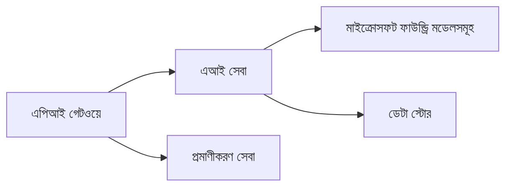
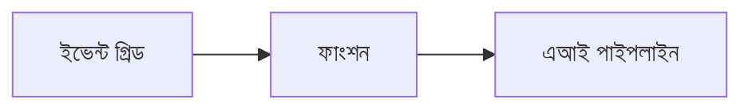

# অধ্যায় 8: প্রোডাকশন ও এন্টারপ্রাইজ প্যাটার্ন

**📚 কোর্স**: [AZD নবীনদের জন্য](../../README.md) | **⏱️ সময়কাল**: 2-3 ঘন্টা | **⭐ জটিলতা**: উন্নত

---

## ওভারভিউ

এই অধ্যায়টি প্রোডাকশন AI ওয়ার্কলোডের জন্য এন্টারপ্রাইজ-রেডি ডিপ্লয়মেন্ট প্যাটার্ন, নিরাপত্তা শক্তায়ন, মনিটরিং এবং খরচ অনুকূলকরণ কভার করে।

## শিখন উদ্দেশ্য

এই অধ্যায় সম্পন্ন করার মাধ্যমে আপনি:
- মাল্টি-রিজিয়ন প্রতিরোধী অ্যাপ্লিকেশন ডিপ্লয় করবেন
- এন্টারপ্রাইজ নিরাপত্তা প্যাটার্ন বাস্তবায়ন করবেন
- ব্যাপক মনিটরিং কনফিগার করবেন
- বৃহৎ পরিসরে খরচ অনুকূলকরণ করবেন
- AZD দিয়ে CI/CD পাইপলাইন সেটআপ করবেন

---

## 📚 পাঠসমূহ

| # | পাঠ | বিবরণ | সময় |
|---|--------|-------------|------|
| 1 | [প্রোডাকশন AI অনুশীলন](production-ai-practices.md) | এন্টারপ্রাইজ ডিপ্লয়মেন্ট প্যাটার্ন | 90 মিনিট |

---

## 🚀 প্রোডাকশন চেকলিস্ট

- [ ] প্রতিরোধক্ষমতার জন্য মাল্টি-রিজিয়ন ডিপ্লয়মেন্ট
- [ ] প্রমাণীকরণের জন্য ম্যানেজড আইডেন্টিটি (কোনো কী নেই)
- [ ] মনিটরিং-এর জন্য Application Insights
- [ ] খরচ বাজেট এবং অ্যালার্ট কনফিগার করা
- [ ] নিরাপত্তা স্ক্যানিং সক্রিয় করা
- [ ] CI/CD পাইপলাইন ইন্টিগ্রেশন
- [ ] ডিসাস্টার রিকভারি পরিকল্পনা

---

## 🏗️ আর্কিটেকচার প্যাটার্ন

### প্যাটার্ন 1: মাইক্রো সার্ভিসেস AI


### প্যাটার্ন 2: ইভেন্ট-ড্রিভেন AI


---

## 🔐 নিরাপত্তা সেরা অনুশীলন

```bicep
// Use managed identity
identity: {
  type: 'SystemAssigned'
}

// Private endpoints for AI services
properties: {
  publicNetworkAccess: 'Disabled'
  networkAcls: {
    defaultAction: 'Deny'
  }
}
```

---

## 💰 খরচ অনুকূলকরণ

| কৌশল | সাশ্রয় |
|----------|---------|
| জিরোতে স্কেল করা (Container Apps) | 60-80% |
| ডেভেলপমেন্টে কনজাম্পশন টিয়ার ব্যবহার করা | 50-70% |
| নির্ধারিত স্কেলিং | 30-50% |
| সংরক্ষিত ক্ষমতা | 20-40% |

```bash
# বাজেট সতর্কতা সেট করুন
az consumption budget create \
  --budget-name "AI-Budget" \
  --amount 500 \
  --category Cost \
  --time-grain Monthly
```

---

## 📊 মনিটরিং সেটআপ

```bash
# স্ট্রিম লগগুলি
azd monitor --logs

# Application Insights পরীক্ষা করুন
azd monitor

# মেট্রিক্স দেখুন
az monitor metrics list --resource <resource-id>
```

---

## 🔗 নেভিগেশন

| দিক | অধ্যায় |
|-----------|---------|
| **পূর্ববর্তী** | [অধ্যায় 7: সমস্যা সমাধান](../chapter-07-troubleshooting/README.md) |
| **কোর্স সম্পন্ন** | [কোর্স হোম](../../README.md) |

---

## 📖 সম্পর্কিত রিসোর্স

- [AI Agents Guide](../chapter-02-ai-development/agents.md)
- [Application Insights](../chapter-06-pre-deployment/application-insights.md)
- [মাল্টি-এজেন্ট সমাধান](../chapter-05-multi-agent/README.md)
- [মাইক্রোসার্ভিস উদাহরণ](../../examples/microservices/README.md)

---

<!-- CO-OP TRANSLATOR DISCLAIMER START -->
অস্বীকৃতি:
এই নথিটি AI অনুবাদ সেবা [Co-op Translator](https://github.com/Azure/co-op-translator) ব্যবহার করে অনুবাদ করা হয়েছে। যদিও আমরা সঠিকতা নিশ্চিত করার জন্য চেষ্টা করি, তবু স্বয়ংক্রিয় অনুবাদে ত্রুটি বা ভুল থাকা সম্ভব। মূল ভাষায় থাকা মূল নথিকেই প্রামাণ্য উৎস হিসেবে বিবেচনা করা উচিত। গুরুত্বপূর্ণ তথ্যের জন্য পেশাদার মানব অনুবাদ লোভনীয়। এই অনুবাদ ব্যবহারে সৃষ্ট কোনো বিভ্রান্তি বা ভুল ব্যাখ্যার জন্য আমরা দায়ী নই।
<!-- CO-OP TRANSLATOR DISCLAIMER END -->