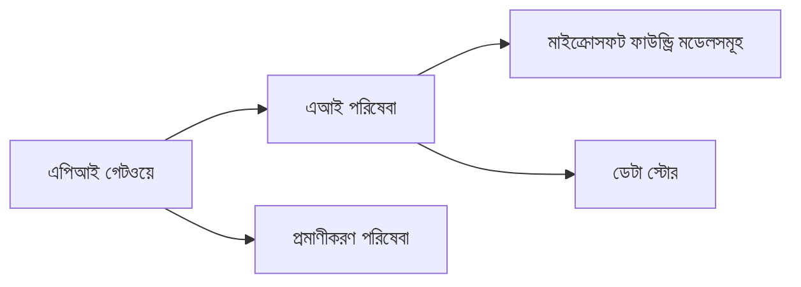
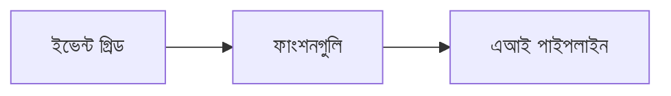

# Chapter 8: উৎপাদন ও এন্টারপ্রাইজ প্যাটার্ন

**📚 কোর্স**: [AZD For Beginners](../../README.md) | **⏱️ সময়কাল**: ২-৩ ঘন্টা | **⭐ জটিলতা**: উন্নত

---

## ওভারভিউ

এই অধ্যায়ে এন্টারপ্রাইজ-সাবে ডিপ্লয়মেন্ট প্যাটার্ন, নিরাপত্তা শক্তিশালীকরণ, মনিটরিং এবং উৎপাদন AI ওয়ার্কলোডের জন্য খরচ অপ্টিমাইজেশন আলোচিত হয়েছে।

> মার্চ ২০২৬-এ `azd 1.23.12` এর বিরুদ্ধে যাচাই করা হয়েছে।

## শেখার উদ্দেশ্য

এই অধ্যায় সম্পন্ন করার মাধ্যমে আপনি পারবেন:
- মাল্টি-রিজিয়ন রেজিলিয়েন্ট অ্যাপ্লিকেশন স্থাপন করা
- এন্টারপ্রাইজ নিরাপত্তা প্যাটার্ন বাস্তবায়ন করা
- ব্যাপক মনিটরিং কনফিগার করা
- খরচ স্কেলে অপ্টিমাইজ করা
- AZD সহ CI/CD পাইপলাইন সেটআপ করা

---

## 📚 পাঠসমূহ

| # | পাঠ | বিবরণ | সময় |
|---|--------|-------------|------|
| 1 | [উৎপাদন AI অনুশীলন](production-ai-practices.md) | এন্টারপ্রাইজ ডিপ্লয়মেন্ট প্যাটার্ন | ৯০ মিনিট |

---

## 🚀 উৎপাদন চেকলিস্ট

- [ ] রেজিলিয়েন্সের জন্য মাল্টি-রিজিয়ন ডিপ্লয়মেন্ট
- [ ] প্রমাণীকরণের জন্য পরিচালিত পরিচয় (কোনো কী নয়)
- [ ] মনিটরিংয়ের জন্য অ্যাপ্লিকেশন ইনসাইটস
- [ ] খরচ বাজেট এবং অ্যালার্ট সেট করা হয়েছে
- [ ] নিরাপত্তা স্ক্যানিং সক্রিয়
- [ ] CI/CD পাইপলাইন ইন্টিগ্রেশন
- [ ] দুর্যোগ পুনরুদ্ধার পরিকল্পনা

---

## 🏗️ আর্কিটেকচার প্যাটার্ন

### প্যাটার্ন ১: মাইক্রোসার্ভিসেস AI


### প্যাটার্ন ২: ইভেন্ট-চালিত AI


---

## 🔐 নিরাপত্তার সর্বোত্তম অনুশীলন

```bicep
// Use managed identity
identity: {
  type: 'SystemAssigned'
}

// Private endpoints for AI services
properties: {
  publicNetworkAccess: 'Disabled'
  networkAcls: {
    defaultAction: 'Deny'
  }
}
```

---

## 💰 খরচ অপ্টিমাইজেশন

| কৌশল | সঞ্চয় |
|----------|---------|
| শূন্যে স্কেল (কন্টেনার অ্যাপস) | ৬০-৮০% |
| ডেভেলপমেন্টের জন্য কনজাম্পশন টিয়ার্স ব্যবহার | ৫০-৭০% |
| নির্ধারিত স্কেলিং | ৩০-৫০% |
| রিজার্ভড ক্যাপাসিটি | ২০-৪০% |

```bash
# বাজেট সতর্কতা সেট করুন
az consumption budget create \
  --budget-name "AI-Budget" \
  --amount 500 \
  --category Cost \
  --time-grain Monthly
```

---

## 📊 মনিটরিং সেটআপ

```bash
# লগ স্ট্রিম করুন
azd monitor --logs

# অ্যাপ্লিকেশন ইনসাইটস চেক করুন
azd monitor --overview

# মেট্রিক্স দেখুন
az monitor metrics list --resource <resource-id>
```

---

## 🔗 নেভিগেশন

| দিকনির্দেশ | অধ্যায় |
|-----------|---------|
| **পূর্ববর্তী** | [অধ্যায় ৭: ট্রাবলশুটিং](../chapter-07-troubleshooting/README.md) |
| **কোর্স সম্পূর্ণ** | [কোর্স হোম](../../README.md) |

---

## 📖 সম্পর্কিত সম্পদ

- [AI এজেন্ট গাইড](../chapter-02-ai-development/agents.md)
- [অ্যাপ্লিকেশন ইনসাইটস](../chapter-06-pre-deployment/application-insights.md)
- [মাল্টি-এজেন্ট সমাধান](../chapter-05-multi-agent/README.md)
- [মাইক্রোসার্ভিস উদাহরণ](../../examples/microservices/README.md)

---

<!-- CO-OP TRANSLATOR DISCLAIMER START -->
**অস্বীকার**:
এই ডকুমেন্টটি AI অনুবাদ সেবা [Co-op Translator](https://github.com/Azure/co-op-translator) ব্যবহার করে অনূদিত হয়েছে। আমরা যথাসাধ্য সঠিকতার চেষ্টা করি, তবে স্বয়ংক্রিয় অনুবাদে ভুল বা অসত্যতা থাকতে পারে। মূল ভাষায় থাকা মূল ডকুমেন্টটিকেই কর্তৃপক্ষপূ্র্ণ উৎস হিসাবে বিবেচনা করা উচিত। গুরুত্বপূর্ণ তথ্যের জন্য পেশাদার মানব অনুবাদ করার পরামর্শ দেওয়া হয়। এই অনুবাদের ব্যবহারে কোনো ভুল বোঝাবুঝি বা ভুল ব্যাখ্যার জন্য আমরা দায়বদ্ধ না।
<!-- CO-OP TRANSLATOR DISCLAIMER END -->