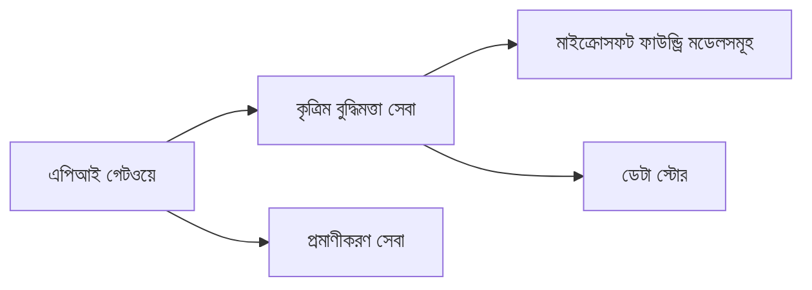
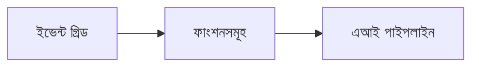

# Chapter 8: প্রোডাকশন ও এন্টারপ্রাইজ প্যাটার্নস

**📚 কোর্স**: [AZD For Beginners](../../README.md) | **⏱️ সময়কাল**: 2-3 ঘন্টা | **⭐ জটিলতা**: উন্নত

---

## ওভারভিউ

এই অধ্যায়টি প্রোডাকশন AI ওয়ার্কলোডের জন্য এন্টারপ্রাইজ-রেডি ডিপ্লয়মেন্ট প্যাটার্ন, সিকিউরিটি হার্ডেনিং, মনিটরিং, এবং খরচ অপ্টিমাইজেশন কভার করে।

> `azd 1.25.6` অনুযায়ী যাচাইকৃত, জুন ২০২৬-এ।

## শেখার লক্ষ্যাবলি

এই অধ্যায়টি সম্পন্ন করলে, আপনি:
- বহু-রিজিয়ন রেজিলিয়েন্ট অ্যাপ্লিকেশন ডিপ্লয় করতে পারবেন
- এন্টারপ্রাইজ সিকিউরিটি প্যাটার্ন বাস্তবায়ন করতে পারবেন
- ব্যাপক মনিটরিং কনফিগার করতে পারবেন
- স্কেলে খরচ অপ্টিমাইজ করতে পারবেন
- AZD দিয়ে CI/CD পাইপলাইন সেট আপ করতে পারবেন

---

## 📚 পাঠসমূহ

| # | পাঠ | বিবরণ | সময় |
|---|--------|-------------|------|
| 1 | [Production AI Practices](production-ai-practices.md) | এন্টারপ্রাইজ ডিপ্লয়মেন্ট প্যাটার্ন | 90 মিনিট |

---

## 🚀 প্রোডাকশন চেকলিস্ট

- [ ] মাল্টি-রিজিয়ন ডিপ্লয়মেন্ট প্রদান করে রেজিলিয়েন্স
- [ ] প্রমাণীকরণের জন্য ম্যানেজড আইডেন্টিটি (কোনো কী নয়)
- [ ] মনিটরিং-এর জন্য Application Insights
- [ ] খরচ বাজেট এবং সতর্কতা কনফিগার করা
- [ ] সিকিউরিটি স্ক্যানিং সক্রিয়
- [ ] CI/CD পাইপলাইন ইন্টিগ্রেশন
- [ ] ডিজাস্টার রিকভারি পরিকল্পনা

---

## 🏗️ আর্কিটেকচার প্যাটার্নস

### প্যাটার্ন 1: মাইক্রোসার্ভিসেস AI



### প্যাটার্ন 2: ইভেন্ট-ড্রিভেন AI



---

## 🔐 সিকিউরিটি সেরা অনুশীলন

```bicep
// Use managed identity
identity: {
  type: 'SystemAssigned'
}

// Private endpoints for AI services
properties: {
  publicNetworkAccess: 'Disabled'
  networkAcls: {
    defaultAction: 'Deny'
  }
}
```

---

## 💰 খরচ অপ্টিমাইজেশন

| কৌশল | সাশ্রয় |
|----------|---------|
| জিরো পর্যন্ত স্কেল করা (Container Apps) | 60-80% |
| ডেভের জন্য কনজাম্পশন টিয়ার ব্যবহার করা | 50-70% |
| নির্ধারিত স্কেলিং | 30-50% |
| রিজার্ভড ক্যাপাসিটি | 20-40% |

```bash
# বাজেট সতর্কতা সেট করুন
az consumption budget create \
  --budget-name "AI-Budget" \
  --amount 500 \
  --category Cost \
  --time-grain Monthly
```

---

## 📊 মনিটরিং সেটআপ

```bash
# লগ স্ট্রিম করুন
azd monitor --logs

# Application Insights পরীক্ষা করুন
azd monitor --overview

# মেট্রিক্স দেখুন
az monitor metrics list --resource <resource-id>
```

---

## 🔗 নেভিগেশন

| Direction | Chapter |
|-----------|---------|
| **পূর্ববর্তী** | [Chapter 7: Troubleshooting](../chapter-07-troubleshooting/README.md) |
| **কোর্স সম্পন্ন** | [Course Home](../../README.md) |

---

## 📖 সম্পর্কিত রিসোর্সসমূহ

- [AI Agents Guide](../chapter-02-ai-development/agents.md)
- [Application Insights](../chapter-06-pre-deployment/application-insights.md)
- [Multi-Agent Solutions](../chapter-05-multi-agent/README.md)
- [Microservices Example](../../examples/microservices/README.md)

---

<!-- CO-OP TRANSLATOR DISCLAIMER START -->
**অস্বীকৃতি**:
এই নথিটি AI অনুবাদ পরিষেবা [Co-op Translator](https://github.com/Azure/co-op-translator) ব্যবহার করে অনূদিত হয়েছে। যদিও আমরা শুদ্ধতার জন্য চেষ্টা করি, অনুগ্রহ করে মনে রাখবেন যে স্বয়ংক্রিয় অনুবাদে ত্রুটি বা অসঙ্গতি থাকতে পারে। মূল নথিটি তার স্বভাষায় কর্তৃত্বপূর্ণ উৎস হিসেবে বিবেচিত হওয়া উচিত। গুরুত্বপূর্ণ তথ্যের জন্য পেশাদার মানব অনুবাদ সুপারিশ করা হয়। এই অনুবাদের ব্যবহারে প্রয়োজনীয় ভুল বোঝাবুঝি বা ভুল ব্যাখ্যার জন্য আমরা দায়বদ্ধ নই।
<!-- CO-OP TRANSLATOR DISCLAIMER END -->