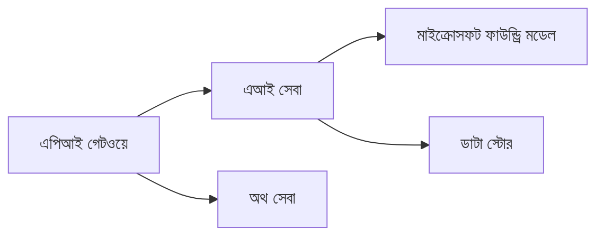
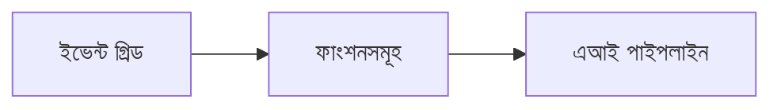

# অধ্যায় ৮: উৎপাদন ও এন্টারপ্রাইজ প্যাটার্ন

**📚 কোর্স**: [AZD ফর বিগিনার্স](../../README.md) | **⏱️ সময়কাল**: ২-৩ ঘণ্টা | **⭐ জটিলতা**: উন্নত

---

## ওভারভিউ

এই অধ্যায়ে এন্টারপ্রাইজ-প্রস্তুত ডিপ্লয়মেন্ট প্যাটার্ন, সিকিউরিটি হার্ডেনিং, মনিটরিং এবং উৎপাদন AI ওয়ার্কলোডের জন্য খরচ অপ্টিমাইজেশন আলোচনা করা হয়েছে।

> `azd 1.27.1` এর বিরুদ্ধে জুলাই ২০২৬ এ যাচাই করা হয়েছে।

## শেখার উদ্দেশ্য

এই অধ্যায় সম্পন্ন করার মাধ্যমে আপনি:
- মাল্টি-রিজিয়ন রেজিলিয়েন্ট অ্যাপ্লিকেশন ডিপ্লয় করবেন
- এন্টারপ্রাইজ সিকিউরিটি প্যাটার্ন বাস্তবায়ন করবেন
- ব্যাপক মনিটরিং কনফিগার করবেন
- পরিমাণে খরচ অপ্টিমাইজ করবেন
- AZD দিয়ে CI/CD পাইপলাইন সেটআপ করবেন

---

## 📚 পাঠ

| # | পাঠ | বর্ণনা | সময় |
|---|--------|-------------|------|
| 1 | [উৎপাদন AI অনুশীলন](production-ai-practices.md) | এন্টারপ্রাইজ ডিপ্লয়মেন্ট প্যাটার্ন | ৯০ মিনিট |

---

## 🚀 উৎপাদন চেকলিস্ট

- [ ] রেজিলিয়েন্সের জন্য মাল্টি-রিজিয়ন ডিপ্লয়মেন্ট
- [ ] অথেন্টিকেশনের জন্য ম্যানেজড আইডেন্টিটি (কী ব্যবহার নেই)
- [ ] মনিটরিং এর জন্য অ্যাপ্লিকেশন ইনসাইটস
- [ ] খরচের বাজেট ও এলার্ট কনফিগারেশন
- [ ] সিকিউরিটি স্ক্যানিং সক্রিয়
- [ ] CI/CD পাইপলাইন ইন্টিগ্রেশন
- [ ] দুর্যোগ পুনরুদ্ধারের পরিকল্পনা

---

## 🏗️ আর্কিটেকচার প্যাটার্ন

### প্যাটার্ন ১: মাইক্রোসার্ভিসেস AI



### প্যাটার্ন ২: ইভেন্ট-ড্রিভেন AI



---

## 🔐 সিকিউরিটির সেরা অনুশীলন

```bicep
// Use managed identity
identity: {
  type: 'SystemAssigned'
}

// Private endpoints for AI services
properties: {
  publicNetworkAccess: 'Disabled'
  networkAcls: {
    defaultAction: 'Deny'
  }
}
```

---

## 💰 খরচ অপ্টিমাইজেশন

| কৌশল | সাশ্রয় |
|----------|---------|
| জিরো পর্যন্ত স্কেল (কন্টেইনার অ্যাপস) | ৬০-৮০% |
| ডেভেলপমেন্টের জন্য কনজাম্পশন টিয়ার ব্যবহার | ৫০-৭০% |
| নির্ধারিত স্কেলিং | ৩০-৫০% |
| রিজার্ভড ক্যাপাসিটি | ২০-৪০% |

```bash
# বাজেট সতর্কতা সেট করুন
az consumption budget create \
  --budget-name "AI-Budget" \
  --amount 500 \
  --category Cost \
  --time-grain Monthly
```

---

## 📊 মনিটরিং সেটআপ

```bash
# লগ স্ট্রিম করুন
azd monitor --logs

# অ্যাপ্লিকেশন ইনসাইটস পরীক্ষা করুন
azd monitor --overview

# মেট্রিক্স দেখুন
az monitor metrics list --resource <resource-id>
```

---

## 🔗 নেভিগেশন

| দিক | অধ্যায় |
|-----------|---------|
| **পূর্ববর্তী** | [অধ্যায় ৭: ত্রুটিমুক্তকরণ](../chapter-07-troubleshooting/README.md) |
| **কোর্স সম্পন্ন** | [কোর্স হোম](../../README.md) |

---

## 📖 সম্পর্কিত সম্পদ

- [AI এজেন্ট গাইড](../chapter-02-ai-development/agents.md)
- [অ্যাপ্লিকেশন ইনসাইটস](../chapter-06-pre-deployment/application-insights.md)
- [মাল্টি-এজেন্ট সলিউশন](../chapter-05-multi-agent/README.md)
- [মাইক্রোসার্ভিসেস উদাহরণ](../../examples/microservices/README.md)

---

<!-- CO-OP TRANSLATOR DISCLAIMER START -->
**অস্বীকৃতি**:
এই নথিটি AI অনুবাদ পরিষেবা [Co-op Translator](https://github.com/Azure/co-op-translator) ব্যবহার করে অনূদিত হয়েছে। যদিও আমরা শুদ্ধতার জন্য চেষ্টা করি, অনুগ্রহ করে মনে রাখবেন যে স্বয়ংক্রিয় অনুবাদে ত্রুটি বা অসঙ্গতি থাকতে পারে। মূল নথিটি তার স্বভাষায় কর্তৃত্বপূর্ণ উৎস হিসেবে বিবেচিত হওয়া উচিত। গুরুত্বপূর্ণ তথ্যের জন্য পেশাদার মানব অনুবাদ সুপারিশ করা হয়। এই অনুবাদের ব্যবহারে প্রয়োজনীয় ভুল বোঝাবুঝি বা ভুল ব্যাখ্যার জন্য আমরা দায়বদ্ধ নই।
<!-- CO-OP TRANSLATOR DISCLAIMER END -->