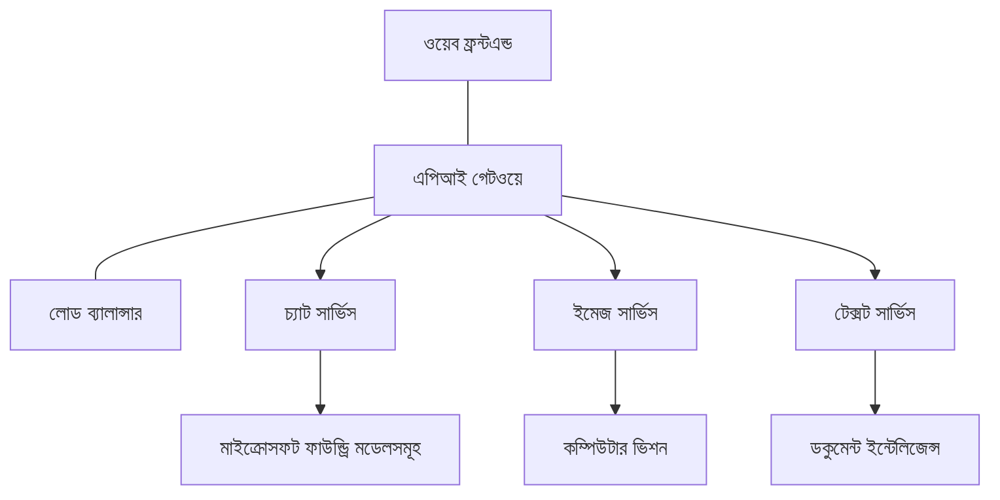

# প্রোডাকশন AI ওয়ার্কলোড বেস্ট প্র্যাকটিসেস উইথ AZD

**চ্যাপ্টার নেভিগেশন:**
- **📚 কোর্স হোম**: [AZD For Beginners](../../README.md)
- **📖 বর্তমান চ্যাপ্টার**: চ্যাপ্টার 8 - প্রোডাকশন ও এন্টারপ্রাইজ প্যাটার্নস
- **⬅️ পূর্ববর্তী চ্যাপ্টার**: [Chapter 7: Troubleshooting](../chapter-07-troubleshooting/debugging.md)
- **⬅️ এছাড়াও সম্পর্কিত**: [AI Workshop Lab](ai-workshop-lab.md)
- **🎯 কোর্স সম্পূর্ণ**: [AZD For Beginners](../../README.md)

## ওভারভিউ

এই গাইডটি Azure Developer CLI (AZD) ব্যবহার করে প্রোডাকশন-রেডি AI ওয়ার্কলোড ডিপ্লয় করার জন্য বিস্তৃত বেস্ট প্র্যাকটিস প্রদান করে। Microsoft Foundry Discord কমিউনিটি এবং বাস্তব গ্রাহক ডিপ্লয়মেন্ট থেকে প্রাপ্ত প্রতিক্রিয়ার ভিত্তিতে, এই প্র্যাকটিসগুলো প্রোডাকশন AI সিস্টেমে সবচেয়ে সাধারণ চ্যালেঞ্জগুলোর মোকাবেলা করে।

## মূল চ্যালেঞ্জসমূহ যেগুলো সমাধান করা হয়েছে

আমাদের কমিউনিটি পোল ফলাফলের ভিত্তিতে, ডেভেলপারদের সম্মুখীন হওয়া শীর্ষ চ্যালেঞ্জগুলো হল:

- **45%** মাল্টি-সার্ভিস AI ডিপ্লয়মেন্ট নিয়ে সমস্যায় পড়ে
- **38%** ক্রেডেনশিয়াল ও সিক্রেট ম্যানেজমেন্টে সমস্যা অনুভব করে  
- **35%** প্রোডাকশন রিডিনেস ও স্কেলিং কঠিন মনে করে
- **32%** ভাল খরচ অপ্টিমাইজেশন স্ট্র্যাটেজি প্রয়োজন
- **29%** মনিটরিং ও ট্রাবলশুটিং উন্নত করার প্রয়োজন

## প্রোডাকশন AI-এর জন্য আর্কিটেকচার প্যাটার্নস

### প্যাটার্ন 1: মাইক্রোসার্ভিসেস AI আর্কিটেকচার

**কখন ব্যবহার করবেন**: বহু ক্ষমতাসম্পন্ন জটিল AI অ্যাপ্লিকেশনগুলোর জন্য


**AZD ইমপ্লিমেন্টেশন**:

```yaml
# azure.yaml
name: enterprise-ai-platform
services:
  web:
    project: ./web
    host: staticwebapp
  api-gateway:
    project: ./api-gateway
    host: containerapp
  chat-service:
    project: ./services/chat
    host: containerapp
  vision-service:
    project: ./services/vision
    host: containerapp
  text-service:
    project: ./services/text
    host: containerapp
```

### প্যাটার্ন 2: ইভেন্ট-ড্রিভেন AI প্রসেসিং

**কখন ব্যবহার করবেন**: ব্যাচ প্রসেসিং, ডকুমেন্ট অ্যানালাইসিস, অ্যাসিঙ্ক ওয়ার্কফ্লোসমূহের জন্য

```bicep
// Event Hub for AI processing pipeline
resource eventHub 'Microsoft.EventHub/namespaces@2023-01-01-preview' = {
  name: eventHubNamespaceName
  location: location
  sku: {
    name: 'Standard'
    tier: 'Standard'
    capacity: 1
  }
}

// Service Bus for reliable message processing
resource serviceBus 'Microsoft.ServiceBus/namespaces@2022-10-01-preview' = {
  name: serviceBusNamespaceName
  location: location
  sku: {
    name: 'Premium'
    tier: 'Premium'
    capacity: 1
  }
}

// Function App for processing
resource functionApp 'Microsoft.Web/sites@2023-01-01' = {
  name: functionAppName
  location: location
  kind: 'functionapp,linux'
  properties: {
    siteConfig: {
      appSettings: [
        {
          name: 'FUNCTIONS_EXTENSION_VERSION'
          value: '~4'
        }
        {
          name: 'AZURE_OPENAI_ENDPOINT'
          value: '@Microsoft.KeyVault(VaultName=${keyVault.name};SecretName=openai-endpoint)'
        }
      ]
    }
  }
}
```

## AI এজেন্ট হেলথ নিয়ে চিন্তা করা

যখন একটি প্রচলিত ওয়েব অ্যাপ ভেঙে যায়, লক্ষণগুলো পরিচিত: একটি পেজ লোড হয় না, একটি API ত্রুটি দেয়, বা একটি ডিপ্লয়মেন্ট ব্যর্থ হয়। AI-চালিত অ্যাপ্লিকেশনগুলোও একইভাবে ভেঙে যেতে পারে—কিন্তু এগুলো আরও সূক্ষ্মভাবে আচরণ করতে পারে যেগুলো স্পষ্ট ত্রুটি বার্তা তৈরি করে না।

এই সেকশনটি আপনাকে AI ওয়ার্কলোড মনিটর করার জন্য একটি মানসিক মডেল গড়তে সাহায্য করে যাতে আপনি জানেন কখন কিছু ঠিক না থাকলে কোথায় খোঁজ করতে হবে।

### কীভাবে এজেন্ট হেলথ প্রচলিত অ্যাপ হেলথ থেকে ভিন্ন

একটি প্রচলিত অ্যাপ বা তো কাজ করে বা তো করে না। একটি AI এজেন্ট কাজ করছে বলে দেখা যেতে পারে কিন্তু খারাপ ফলাফল প্রদান করতে পারে। এজেন্ট হেলথকে দুটি স্তরে ভাবুন:

| Layer | What to Watch | Where to Look |
|-------|--------------|---------------|
| **Infrastructure health** | সার্ভিস কি চলছে? রিসোর্সগুলো provision হয়েছে কি? এন্ডপয়েন্টগুলো কি পৌঁছনীয়? | `azd monitor`, Azure Portal resource health, container/app logs |
| **Behavior health** | এজেন্ট কি সঠিকভাবে প্রতিক্রিয়া দিচ্ছে? প্রতিক্রিয়াগুলি সময়োপযোগী কি? মডেল কি সঠিকভাবে কল হচ্ছে? | Application Insights traces, model call latency metrics, response quality logs |

ইনফ্রাসট্রাকচার হেলথ পরিচিত—এটি যেকোনো azd অ্যাপের জন্য সমান। বিহেভিয়র হেলথ হল নতুন স্তর যা AI ওয়ার্কলোড উত্থাপন করে।

### AI অ্যাপ প্রত্যাশা অনুযায়ী আচরণ না করলে কোথায় খোঁজ করবেন

যদি আপনার AI অ্যাপ প্রত্যাশিত ফলাফল দিচ্ছে না, তাহলে এখানে একটি ধারণাগত চেকলিস্ট আছে:

1. **মৌলিক বিষয়গুলো দিয়ে শুরু করুন।** অ্যাপ চলছে কি? এটি কি তার ডিপেনডেন্সিগুলিতে পৌঁছাতে পারে? যেভাবে আপনি যেকোনো অ্যাপের জন্য করবেন তেমনি `azd monitor` এবং রিসোর্স হেলথ চেক করুন।
2. **মডেল কানেকশন চেক করুন।** আপনার অ্যাপ কি সফলভাবে AI মডেলকে কল করছে? ব্যর্থ বা টাইমআউট হওয়া মডেল কলগুলো AI অ্যাপ ইস্যুদের সবচেয়ে সাধারণ কারণ এবং এগুলো আপনার অ্যাপ্লিকেশন লগে দেখাবে।
3. **মডেল কী পেয়েছে তা দেখুন।** AI প্রতিক্রিয়াগুলি ইনপুট (প্রম্পট এবং যেকোনো রিট্রিভ করা কনটেক্সট) এর উপর নির্ভর করে। যদি আউটপুট ভুল হয়, ইনপুট সাধারণত ভুল থাকে। চেক করুন আপনার অ্যাপ মডেলকে সঠিক ডাটা পাঠাচ্ছে কি না।
4. **প্রতিক্রিয়া লেটেন্সি পরিদর্শন করুন।** AI মডেল কলগুলো সাধারণ API কলের থেকে ধীর। যদি আপনার অ্যাপ ধীর মনে হয়, চেক করুন মডেল প্রতিক্রিয়া সময় বাড়ছে কিনা—এটি থ্রটলিং, সক্ষমতা সীমা, বা রিজন-স্তরের কনজেশন নির্দেশ করতে পারে।
5. **খরচ সংকেতগুলোর প্রতি সতর্ক থাকুন।** টোকেন ব্যবহার বা API কলের অনাকাঙ্ক্ষিত স্পাইক একটি লুপ, ভুল কনফিগার করা প্রম্পট, অথবা অতিরিক্ত রিট্রাই নির্দেশ করতে পারে।

আপনাকে অবিলম্বে অবজার্ভেবিলিটি টুলিংয়ে দক্ষ হতে হবে না। মূল উপলব্ধি হল AI অ্যাপ্লিকেশনগুলোর পর্যবেক্ষণের জন্য একটি অতিরিক্ত বিহেভিয়র স্তর আছে, এবং azd-এর বিল্ট-ইন মনিটরিং (`azd monitor`) আপনাকে উভয় স্তর তদন্তের জন্য একটি শুরু দান করে।

---

## সিকিউরিটি বেস্ট প্র্যাকটিসেস

### 1. জিরো-ট্রাস্ট সিকিউরিটি মডেল

**ইমপ্লিমেন্টেশন স্ট্র্যাটেজি**:
- অথেনটিকেশন ছাড়া সার্ভিস-টু-সার্ভিস যোগাযোগ নেই
- সমস্ত API কল ম্যানেজড আইডেন্টিটিজ ব্যবহার করে
- প্রাইভেট এন্ডপয়েন্ট দিয়ে নেটওয়ার্ক আইসোলেশন
- লিস্ট প্রিভিলেজ অ্যাক্সেস কন্ট্রোল

```bicep
// Managed Identity for each service
resource chatServiceIdentity 'Microsoft.ManagedIdentity/userAssignedIdentities@2023-01-31' = {
  name: 'chat-service-identity'
  location: location
}

// Role assignments with minimal permissions
resource openAIUserRole 'Microsoft.Authorization/roleAssignments@2022-04-01' = {
  scope: openAIAccount
  name: guid(openAIAccount.id, chatServiceIdentity.id, openAIUserRoleDefinitionId)
  properties: {
    roleDefinitionId: subscriptionResourceId('Microsoft.Authorization/roleDefinitions', '5e0bd9bd-7b93-4f28-af87-19fc36ad61bd')
    principalId: chatServiceIdentity.properties.principalId
    principalType: 'ServicePrincipal'
  }
}
```

### 2. সিকিউর সিক্রেট ম্যানেজমেন্ট

**Key Vault ইন্টিগ্রেশন প্যাটার্ন**:

```bicep
// Key Vault with proper access policies
resource keyVault 'Microsoft.KeyVault/vaults@2023-02-01' = {
  name: keyVaultName
  location: location
  properties: {
    tenantId: tenant().tenantId
    sku: {
      family: 'A'
      name: 'premium'  // Use premium for production
    }
    enableRbacAuthorization: true  // Use RBAC instead of access policies
    enablePurgeProtection: true    // Prevent accidental deletion
    enableSoftDelete: true
    softDeleteRetentionInDays: 90
  }
}

// Store all AI service credentials
resource openAIKeySecret 'Microsoft.KeyVault/vaults/secrets@2023-02-01' = {
  parent: keyVault
  name: 'openai-api-key'
  properties: {
    value: openAIAccount.listKeys().key1
    attributes: {
      enabled: true
    }
  }
}
```

### 3. নেটওয়ার্ক সিকিউরিটি

**প্রাইভেট এন্ডপয়েন্ট কনফিগারেশন**:

```bicep
// Virtual Network for AI services
resource virtualNetwork 'Microsoft.Network/virtualNetworks@2023-04-01' = {
  name: vnetName
  location: location
  properties: {
    addressSpace: {
      addressPrefixes: ['10.0.0.0/16']
    }
    subnets: [
      {
        name: 'ai-services-subnet'
        properties: {
          addressPrefix: '10.0.1.0/24'
          privateEndpointNetworkPolicies: 'Disabled'
        }
      }
      {
        name: 'app-services-subnet'
        properties: {
          addressPrefix: '10.0.2.0/24'
          delegations: [
            {
              name: 'Microsoft.Web/serverFarms'
              properties: {
                serviceName: 'Microsoft.Web/serverFarms'
              }
            }
          ]
        }
      }
    ]
  }
}

// Private endpoints for all AI services
resource openAIPrivateEndpoint 'Microsoft.Network/privateEndpoints@2023-04-01' = {
  name: '${openAIAccountName}-pe'
  location: location
  properties: {
    subnet: {
      id: virtualNetwork.properties.subnets[0].id
    }
    privateLinkServiceConnections: [
      {
        name: 'openai-connection'
        properties: {
          privateLinkServiceId: openAIAccount.id
          groupIds: ['account']
        }
      }
    ]
  }
}
```

## পারফরম্যান্স এবং স্কেলিং

### 1. অটো-স্কেলিং স্ট্র্যাটেজিস

**কন্টেইনার অ্যাপস অটো-স্কেলিং**:

```bicep
resource containerApp 'Microsoft.App/containerApps@2023-05-01' = {
  name: containerAppName
  location: location
  properties: {
    configuration: {
      ingress: {
        external: true
        targetPort: 8000
        transport: 'http'
      }
    }
    template: {
      scale: {
        minReplicas: 2  // Always have 2 instances minimum
        maxReplicas: 50 // Scale up to 50 for high load
        rules: [
          {
            name: 'http-scaling'
            http: {
              metadata: {
                concurrentRequests: '20'  // Scale when >20 concurrent requests
              }
            }
          }
          {
            name: 'cpu-scaling'
            custom: {
              type: 'cpu'
              metadata: {
                type: 'Utilization'
                value: '70'  // Scale when CPU >70%
              }
            }
          }
        ]
      }
    }
  }
}
```

### 2. ক্যাশিং স্ট্র্যাটেজিস

**AI প্রতিক্রিয়ার জন্য Redis Cache**:

```bicep
// Redis Premium for production workloads
resource redisCache 'Microsoft.Cache/redis@2023-04-01' = {
  name: redisCacheName
  location: location
  properties: {
    sku: {
      name: 'Premium'
      family: 'P'
      capacity: 1
    }
    enableNonSslPort: false
    minimumTlsVersion: '1.2'
    redisConfiguration: {
      'maxmemory-policy': 'allkeys-lru'
    }
    // Enable clustering for high availability
    redisVersion: '6.0'
    shardCount: 2
  }
}

// Cache configuration in application
var cacheConnectionString = '${redisCache.properties.hostName}:6380,password=${redisCache.listKeys().primaryKey},ssl=True,abortConnect=False'
```

### 3. লোড ব্যালান্সিং এবং ট্রাফিক ম্যানেজমেন্ট

**WAF সহ Application Gateway**:

```bicep
// Application Gateway with Web Application Firewall
resource applicationGateway 'Microsoft.Network/applicationGateways@2023-04-01' = {
  name: appGatewayName
  location: location
  properties: {
    sku: {
      name: 'WAF_v2'
      tier: 'WAF_v2'
      capacity: 2
    }
    webApplicationFirewallConfiguration: {
      enabled: true
      firewallMode: 'Prevention'
      ruleSetType: 'OWASP'
      ruleSetVersion: '3.2'
    }
    // Backend pools for AI services
    backendAddressPools: [
      {
        name: 'ai-services-pool'
        properties: {
          backendAddresses: [
            {
              fqdn: '${containerApp.properties.configuration.ingress.fqdn}'
            }
          ]
        }
      }
    ]
  }
}
```

## 💰 খরচ অপ্টিমাইজেশন

### 1. রিসোর্স রাইট-সাইজিং

**এনভায়রনমেন্ট-স্পেসিফিক কনফিগারেশনস**:

```bash
# উন্নয়ন পরিবেশ
azd env new development
azd env set AZURE_OPENAI_SKU "S0"
azd env set AZURE_OPENAI_CAPACITY 10
azd env set AZURE_SEARCH_SKU "basic"
azd env set CONTAINER_CPU 0.5
azd env set CONTAINER_MEMORY 1.0

# প্রোডাকশন পরিবেশ
azd env new production
azd env set AZURE_OPENAI_SKU "S0"
azd env set AZURE_OPENAI_CAPACITY 100
azd env set AZURE_SEARCH_SKU "standard"
azd env set CONTAINER_CPU 2.0
azd env set CONTAINER_MEMORY 4.0
```

### 2. খরচ মনিটরিং এবং বাজেটস

```bicep
// Cost management and budgets
resource budget 'Microsoft.Consumption/budgets@2023-05-01' = {
  name: 'ai-workload-budget'
  properties: {
    timePeriod: {
      startDate: '2024-01-01'
      endDate: '2024-12-31'
    }
    timeGrain: 'Monthly'
    amount: 2000  // $2000 monthly budget
    category: 'Cost'
    notifications: {
      warning: {
        enabled: true
        operator: 'GreaterThan'
        threshold: 80
        contactEmails: [
          'finance@company.com'
          'engineering@company.com'
        ]
        contactRoles: [
          'Owner'
          'Contributor'
        ]
      }
      critical: {
        enabled: true
        operator: 'GreaterThan'
        threshold: 95
        contactEmails: [
          'cto@company.com'
        ]
      }
    }
  }
}
```

### 3. টোকেন ব্যবহার অপ্টিমাইজেশন

**OpenAI খরচ ম্যানেজমেন্ট**:

```typescript
// অ্যাপ্লিকেশন-স্তরের টোকেন অপ্টিমাইজেশন
class TokenOptimizer {
  private readonly maxTokens = 4000;
  private readonly reserveTokens = 500;
  
  optimizePrompt(userInput: string, context: string): string {
    const availableTokens = this.maxTokens - this.reserveTokens;
    const estimatedTokens = this.estimateTokens(userInput + context);
    
    if (estimatedTokens > availableTokens) {
      // প্রসঙ্গ ছাঁটুন, ব্যবহারকারীর ইনপুট নয়
      context = this.truncateContext(context, availableTokens - this.estimateTokens(userInput));
    }
    
    return `${context}\n\nUser: ${userInput}`;
  }
  
  private estimateTokens(text: string): number {
    // মোটামুটি অনুমান: 1 টোকেন ≈ 4 অক্ষর
    return Math.ceil(text.length / 4);
  }
}
```

## মনিটরিং এবং অবজার্ভেবিলিটি

### 1. ব্যাপক Application Insights

```bicep
// Application Insights with advanced features
resource applicationInsights 'Microsoft.Insights/components@2020-02-02' = {
  name: applicationInsightsName
  location: location
  kind: 'web'
  properties: {
    Application_Type: 'web'
    WorkspaceResourceId: logAnalyticsWorkspace.id
    SamplingPercentage: 100  // Full sampling for AI apps
    DisableIpMasking: false  // Enable for security
  }
}

// Custom metrics for AI operations
resource aiMetricAlerts 'Microsoft.Insights/metricAlerts@2018-03-01' = {
  name: 'ai-high-error-rate'
  location: 'global'
  properties: {
    description: 'Alert when AI service error rate is high'
    severity: 2
    enabled: true
    scopes: [
      applicationInsights.id
    ]
    evaluationFrequency: 'PT1M'
    windowSize: 'PT5M'
    criteria: {
      'odata.type': 'Microsoft.Azure.Monitor.SingleResourceMultipleMetricCriteria'
      allOf: [
        {
          name: 'high-error-rate'
          metricName: 'requests/failed'
          operator: 'GreaterThan'
          threshold: 10
          timeAggregation: 'Count'
        }
      ]
    }
  }
}
```

### 2. AI-স্পেসিফিক মনিটরিং

**AI মেট্রিক্সের জন্য কাস্টম ড্যাশবোর্ডস**:

```json
// Dashboard configuration for AI workloads
{
  "dashboard": {
    "name": "AI Application Monitoring",
    "tiles": [
      {
        "name": "OpenAI Request Volume",
        "query": "requests | where name contains 'openai' | summarize count() by bin(timestamp, 5m)"
      },
      {
        "name": "AI Response Latency",
        "query": "requests | where name contains 'openai' | summarize avg(duration) by bin(timestamp, 5m)"
      },
      {
        "name": "Token Usage",
        "query": "customMetrics | where name == 'openai_tokens_used' | summarize sum(value) by bin(timestamp, 1h)"
      },
      {
        "name": "Cost per Hour",
        "query": "customMetrics | where name == 'openai_cost' | summarize sum(value) by bin(timestamp, 1h)"
      }
    ]
  }
}
```

### 3. হেলথ চেকস এবং আপটাইম মনিটরিং

```bicep
// Application Insights availability tests
resource availabilityTest 'Microsoft.Insights/webtests@2022-06-15' = {
  name: 'ai-app-availability-test'
  location: location
  tags: {
    'hidden-link:${applicationInsights.id}': 'Resource'
  }
  properties: {
    SyntheticMonitorId: 'ai-app-availability-test'
    Name: 'AI Application Availability Test'
    Description: 'Tests AI application endpoints'
    Enabled: true
    Frequency: 300  // 5 minutes
    Timeout: 120    // 2 minutes
    Kind: 'ping'
    Locations: [
      {
        Id: 'us-east-2-azr'
      }
      {
        Id: 'us-west-2-azr'
      }
    ]
    Configuration: {
      WebTest: '''
        <WebTest Name="AI Health Check" 
                 Id="8d2de8d2-a2b0-4c2e-9a0d-8f9c9a0b8c8d" 
                 Enabled="True" 
                 CssProjectStructure="" 
                 CssIteration="" 
                 Timeout="120" 
                 WorkItemIds="" 
                 xmlns="http://microsoft.com/schemas/VisualStudio/TeamTest/2010" 
                 Description="" 
                 CredentialUserName="" 
                 CredentialPassword="" 
                 PreAuthenticate="True" 
                 Proxy="default" 
                 StopOnError="False" 
                 RecordedResultFile="" 
                 ResultsLocale="">
          <Items>
            <Request Method="GET" 
                     Guid="a5f10126-e4cd-570d-961c-cea43999a200" 
                     Version="1.1" 
                     Url="${webApp.properties.defaultHostName}/health" 
                     ThinkTime="0" 
                     Timeout="120" 
                     ParseDependentRequests="True" 
                     FollowRedirects="True" 
                     RecordResult="True" 
                     Cache="False" 
                     ResponseTimeGoal="0" 
                     Encoding="utf-8" 
                     ExpectedHttpStatusCode="200" 
                     ExpectedResponseUrl="" 
                     ReportingName="" 
                     IgnoreHttpStatusCode="False" />
          </Items>
        </WebTest>
      '''
    }
  }
}
```

## ডিজাস্টার রিকভারি এবং হাই অ্যাভিলেবিলিটি

### 1. মাল্টি-রিজন ডিপ্লয়মেন্ট

```yaml
# azure.yaml - Multi-region configuration
name: ai-app-multiregion
services:
  api-primary:
    project: ./api
    host: containerapp
    env:
      - AZURE_REGION=eastus
  api-secondary:
    project: ./api
    host: containerapp
    env:
      - AZURE_REGION=westus2
```

```bicep
// Traffic Manager for global load balancing
resource trafficManager 'Microsoft.Network/trafficManagerProfiles@2022-04-01' = {
  name: trafficManagerProfileName
  location: 'global'
  properties: {
    profileStatus: 'Enabled'
    trafficRoutingMethod: 'Priority'
    dnsConfig: {
      relativeName: trafficManagerProfileName
      ttl: 30
    }
    monitorConfig: {
      protocol: 'HTTPS'
      port: 443
      path: '/health'
      intervalInSeconds: 30
      toleratedNumberOfFailures: 3
      timeoutInSeconds: 10
    }
    endpoints: [
      {
        name: 'primary-endpoint'
        type: 'Microsoft.Network/trafficManagerProfiles/azureEndpoints'
        properties: {
          targetResourceId: primaryAppService.id
          endpointStatus: 'Enabled'
          priority: 1
        }
      }
      {
        name: 'secondary-endpoint'
        type: 'Microsoft.Network/trafficManagerProfiles/azureEndpoints'
        properties: {
          targetResourceId: secondaryAppService.id
          endpointStatus: 'Enabled'
          priority: 2
        }
      }
    ]
  }
}
```

### 2. ডাটা ব্যাকআপ এবং রিকভারি

```bicep
// Backup configuration for critical data
resource backupVault 'Microsoft.DataProtection/backupVaults@2023-05-01' = {
  name: backupVaultName
  location: location
  identity: {
    type: 'SystemAssigned'
  }
  properties: {
    storageSettings: [
      {
        datastoreType: 'VaultStore'
        type: 'LocallyRedundant'
      }
    ]
  }
}

// Backup policy for AI models and data
resource backupPolicy 'Microsoft.DataProtection/backupVaults/backupPolicies@2023-05-01' = {
  parent: backupVault
  name: 'ai-data-backup-policy'
  properties: {
    policyRules: [
      {
        backupParameters: {
          backupType: 'Full'
          objectType: 'AzureBackupParams'
        }
        trigger: {
          schedule: {
            repeatingTimeIntervals: [
              'R/2024-01-01T02:00:00+00:00/P1D'  // Daily at 2 AM
            ]
          }
          objectType: 'ScheduleBasedTriggerContext'
        }
        dataStore: {
          datastoreType: 'VaultStore'
          objectType: 'DataStoreInfoBase'
        }
        name: 'BackupDaily'
        objectType: 'AzureBackupRule'
      }
    ]
  }
}
```

## ডেভওপস এবং CI/CD ইন্টিগ্রেশন

### 1. GitHub Actions ওয়ার্কফ্লো

```yaml
# .github/workflows/deploy-ai-app.yml
name: Deploy AI Application

on:
  push:
    branches: [main]
  pull_request:
    branches: [main]

jobs:
  test:
    runs-on: ubuntu-latest
    steps:
      - uses: actions/checkout@v4
      
      - name: Setup Python
        uses: actions/setup-python@v4
        with:
          python-version: '3.11'
          
      - name: Install dependencies
        run: |
          pip install -r requirements.txt
          pip install pytest
          
      - name: Run tests
        run: pytest tests/
        
      - name: AI Safety Tests
        run: |
          python scripts/test_ai_safety.py
          python scripts/validate_prompts.py

  deploy-staging:
    needs: test
    if: github.event_name == 'pull_request'
    runs-on: ubuntu-latest
    steps:
      - uses: actions/checkout@v4
      
      - name: Setup AZD
        uses: Azure/setup-azd@v1.0.0
        
      - name: Login to Azure
        uses: azure/login@v1
        with:
          creds: ${{ secrets.AZURE_CREDENTIALS }}
          
      - name: Deploy to Staging
        run: |
          azd env select staging
          azd deploy

  deploy-production:
    needs: test
    if: github.ref == 'refs/heads/main'
    runs-on: ubuntu-latest
    steps:
      - uses: actions/checkout@v4
      
      - name: Setup AZD
        uses: Azure/setup-azd@v1.0.0
        
      - name: Login to Azure
        uses: azure/login@v1
        with:
          creds: ${{ secrets.AZURE_CREDENTIALS }}
          
      - name: Deploy to Production
        run: |
          azd env select production
          azd deploy
          
      - name: Run Production Health Checks
        run: |
          python scripts/health_check.py --env production
```

### 2. ইনফ্রাসট্রাকচার ভ্যালিডেশন

```bash
# scripts/validate_infrastructure.sh
#!/bin/bash

echo "Validating AI infrastructure deployment..."

# সমস্ত প্রয়োজনীয় সার্ভিস চালু আছে কি না পরীক্ষা করুন
services=("openai" "search" "storage" "keyvault")
for service in "${services[@]}"; do
    echo "Checking $service..."
    if ! az resource list --resource-type "Microsoft.CognitiveServices/accounts" --query "[?contains(name, '$service')]" -o tsv; then
        echo "ERROR: $service not found"
        exit 1
    fi
done

# OpenAI মডেল ডেপ্লয়মেন্ট যাচাই করুন
echo "Validating OpenAI model deployments..."
models=$(az cognitiveservices account deployment list --name $AZURE_OPENAI_NAME --resource-group $AZURE_RESOURCE_GROUP --query "[].name" -o tsv)
if [[ ! $models == *"gpt-35-turbo"* ]]; then
    echo "ERROR: Required model gpt-35-turbo not deployed"
    exit 1
fi

# AI সার্ভিসের সংযোগ পরীক্ষা করুন
echo "Testing AI service connectivity..."
python scripts/test_connectivity.py

echo "Infrastructure validation completed successfully!"
```

## প্রোডাকশন রিডিনেস চেকলিস্ট

### সিকিউরিটি ✅
- [ ] সমস্ত সার্ভিস ম্যানেজড আইডেন্টিটিজ ব্যবহার করে
- [ ] সিক্রেটস Key Vault-এ সংরক্ষিত
- [ ] প্রাইভেট এন্ডপয়েন্ট কনফিগার করা হয়েছে
- [ ] নেটওয়ার্ক সিকিউরিটি গ্রুপগুলো বাস্তবায়িত
- [ ] RBAC লিস্ট প্রিভিলেজসহ
- [ ] পাবলিক এন্ডপয়েন্টে WAF সক্রিয়

### পারফরম্যান্স ✅
- [ ] অটো-স্কেলিং কনফিগার করা হয়েছে
- [ ] ক্যাশিং প্রয়োগ করা হয়েছে
- [ ] লোড ব্যালান্সিং সেটআপ করা হয়েছে
- [ ] স্ট্যাটিক কনটেন্টের জন্য CDN
- [ ] ডাটাবেস কানেকশন পুলিং
- [ ] টোকেন ব্যবহার অপ্টিমাইজেশন

### মনিটরিং ✅
- [ ] Application Insights কনফিগার করা হয়েছে
- [ ] কাস্টম মেট্রিক্স সংজ্ঞায়িত
- [ ] এলার্টিং রুল সেটআপ করা হয়েছে
- [ ] ড্যাশবোর্ড তৈরি করা হয়েছে
- [ ] হেলথ চেকস বাস্তবায়িত
- [ ] লগ রিটেনশন নীতিমালা

### রিলায়েবিলিটি ✅
- [ ] মাল্টি-রিজন ডিপ্লয়মেন্ট
- [ ] ব্যাকআপ এবং রিকভারি প্ল্যান
- [ ] সার্কিট ব্রেকারস বাস্তবায়িত
- [ ] রিট্রাই পলিসি কনফিগার করা হয়েছে
- [ ] গ্রেসফুল ডিগ্রেডেশন
- [ ] হেলথ চেক এন্ডপয়েন্টস

### খরচ ব্যবস্থাপনা ✅
- [ ] বাজেট এলার্ট কনফিগার করা হয়েছে
- [ ] রিসোর্স রাইট-সাইজিং
- [ ] ডেভ/টেস্ট ডিসকাউন্ট প্রয়োগ করা হয়েছে
- [ ] রিজার্ভড ইনস্টান্স কেনা হয়েছে
- [ ] খরচ মনিটরিং ড্যাশবোর্ড
- [ ] নিয়মিত খরচ পর্যালোচনা

### কমপ্লায়েন্স ✅
- [ ] ডাটা রেসিডেন্সি প্রয়োজনীয়তা পূরণ হয়েছে
- [ ] অডিট লগিং সক্রিয়
- [ ] কমপ্লায়েন্স পলিসি প্রয়োগ
- [ ] সিকিউরিটি বেসলাইনস বাস্তবায়িত
- [ ] নিয়মিত সিকিউরিটি মূল্যায়ন
- [ ] ইনসিডেন্ট রেসপন্স প্ল্যান

## পারফরম্যান্স বেঞ্চমার্কস

### সাধারণ প্রোডাকশন মেট্রিক্স

| Metric | Target | Monitoring |
|--------|--------|------------|
| **Response Time** | < 2 seconds | Application Insights |
| **Availability** | 99.9% | Uptime monitoring |
| **Error Rate** | < 0.1% | Application logs |
| **Token Usage** | < $500/month | Cost management |
| **Concurrent Users** | 1000+ | Load testing |
| **Recovery Time** | < 1 hour | Disaster recovery tests |

### লোড টেস্টিং

```bash
# এআই অ্যাপ্লিকেশনের জন্য লোড টেস্টিং স্ক্রিপ্ট
python scripts/load_test.py \
  --endpoint https://your-ai-app.azurewebsites.net \
  --concurrent-users 100 \
  --duration 300 \
  --ramp-up 60
```

## 🤝 কমিউনিটি বেস্ট প্র্যাকটিসেস

Microsoft Foundry Discord কমিউনিটির প্রতিক্রিয়ার উপর ভিত্তি করে:

### কমিউনিটির শীর্ষ সুপারিশসমূহ:

1. **ছোট থেকে শুরু করুন, ধীরে ধীরে স্কেল করুন**: বেসিক SKU দিয়ে শুরু করুন এবং বাস্তব ব্যবহার অনুসারে স্কেল করুন
2. **সবকিছু মনিটর করুন**: প্রথম দিন থেকেই ব্যাপক মনিটরিং সেট আপ করুন
3. **সিকিউরিটি অটোমেট করুন**: ধারাবাহিক সিকিউরিটির জন্য ইনফ্রাস্ট্রাকচার অ্যাজ কোড ব্যবহার করুন
4. **টেস্ট সম্পূর্ণভাবে করুন**: আপনার পাইপলাইনে AI-নির্দিষ্ট টেস্টিং অন্তর্ভুক্ত করুন
5. **খরচের পরিকল্পনা করুন**: টোকেন ব্যবহার মনিটর করুন এবং শীঘ্রই বাজেট এলার্ট সেট করুন

### সাধারণ ফাঁদগুলো এড়িয়ে চলুন:

- ❌ API কী কোডে হার্ডকোড করা
- ❌ সঠিক মনিটরিং সেট আপ না করা
- ❌ খরচ অপ্টিমাইজেশন উপেক্ষা করা
- ❌ ফেইলিউর সিনারিওগুলোর টেস্ট না করা
- ❌ হেলথ চেক ছাড়া ডিপ্লয় করা

## AZD AI CLI কমান্ডস এবং এক্সটেনশনস

AZD AI-স্পেসিফিক কমান্ডস এবং এক্সটেনশনসের একটি বাড়ন্ত সেট অন্তর্ভুক্ত করে যা প্রোডাকশন AI ওয়ার্কফ্লোসমূহকে সহজ করে। এই টুলগুলো লোকাল ডেভেলপমেন্ট এবং প্রোডাকশনের মধ্যে ব্রিজ তৈরি করে AI ওয়ার্কলোডগুলোর জন্য।

### AI-এর জন্য AZD এক্সটেনশনস

AZD একটি এক্সটেনশন সিস্টেম ব্যবহার করে AI-স্পেসিফিক ক্যাপাবিলিটিজ যোগ করতে। এক্সটেনশন ইনস্টল ও ম্যানেজ করুন:

```bash
# সমস্ত উপলব্ধ এক্সটেনশন তালিকাভুক্ত করুন (AI সহ)
azd extension list

# Foundry এজেন্টের এক্সটেনশন ইনস্টল করুন
azd extension install azure.ai.agents

# ফাইন-টিউনিং এক্সটেনশন ইনস্টল করুন
azd extension install azure.ai.finetune

# কাস্টম মডেল এক্সটেনশন ইনস্টল করুন
azd extension install azure.ai.models

# ইনস্টল করা সমস্ত এক্সটেনশন আপগ্রেড করুন
azd extension upgrade --all
```

**উপলব্ধ AI এক্সটেনশনস:**

| Extension | Purpose | Status |
|-----------|---------|--------|
| `azure.ai.agents` | Foundry Agent Service ম্যানেজমেন্ট | Preview |
| `azure.ai.finetune` | Foundry মডেল ফাইন-টিউনিং | Preview |
| `azure.ai.models` | Foundry কাস্টম মডেলস | Preview |
| `azure.coding-agent` | Coding agent কনফিগারেশন | Available |

### `azd ai agent init` দিয়ে এজেন্ট প্রজেক্ট ইনিশিয়ালাইজ করা

`azd ai agent init` কমান্ডটি Microsoft Foundry Agent Service-এর সাথে ইন্টিগ্রেটেড একটি প্রোডাকশন-রেডি AI এজেন্ট প্রজেক্ট scaffold করে:

```bash
# এজেন্ট ম্যানিফেস্ট থেকে একটি নতুন এজেন্ট প্রকল্প শুরু করুন
azd ai agent init -m <manifest-path-or-uri>

# একটি নির্দিষ্ট Foundry প্রকল্প শুরু করুন এবং সেটিকে লক্ষ্য করুন
azd ai agent init -m agent-manifest.yaml --project-id <foundry-project-id>

# কাস্টম সোর্স ডিরেক্টরি ব্যবহার করে ইনিশিয়ালাইজ করুন
azd ai agent init -m agent-manifest.yaml --src ./agents/my-agent

# Container Apps-কে হোস্ট হিসেবে লক্ষ্য করুন
azd ai agent init -m agent-manifest.yaml --host containerapp
```

**কী ফ্ল্যাগস:**

| Flag | Description |
|------|-------------|
| `-m, --manifest` | আপনার প্রজেক্টে যোগ করার জন্য একটি এজেন্ট ম্যানিফেস্টের পাথ বা URI |
| `-p, --project-id` | আপনার azd এনভায়রনমেন্টের জন্য বিদ্যমান Microsoft Foundry Project ID |
| `-s, --src` | এজেন্ট ডেফিনিশন ডাউনলোড করার ডিরেক্টরি (ডিফল্ট `src/<agent-id>`) |
| `--host` | ডিফল্ট হোস্ট ওভাররাইড করুন (উদাহরণ: `containerapp`) |
| `-e, --environment` | ব্যবহার করার azd এনভায়রনমেন্ট |

**প্রোডাকশন টিপ**: শুরু থেকেই আপনার এজেন্ট কোড এবং ক্লাউড রিসোর্সগুলো লিঙ্ক রাখতে বিদ্যমান Foundry প্রজেক্টে সরাসরি সংযোগ করার জন্য `--project-id` ব্যবহার করুন।

### `azd mcp` সহ Model Context Protocol (MCP)

AZD বিল্ট-ইন MCP সার্ভার সাপোর্ট (Alpha) অন্তর্ভুক্ত করে, যা AI এজেন্ট এবং টুলগুলোকে একটি স্ট্যান্ডার্ডাইজড প্রোটোকলের মাধ্যমে আপনার Azure রিসোর্সগুলোর সঙ্গে ইন্টারঅ্যাক্ট করতে সক্ষম করে:

```bash
# আপনার প্রকল্পের জন্য MCP সার্ভার শুরু করুন
azd mcp start

# MCP অপারেশনের জন্য টুল সম্মতি পরিচালনা করুন
azd mcp consent
```

MCP সার্ভার আপনার azd প্রজেক্ট কনটেক্সট—এনভায়রনমেন্টস, সার্ভিসেস, এবং Azure রিসোর্স—AI-চালিত ডেভেলপমেন্ট টুলগুলোর কাছে এক্সপোজ করে। এর ফলে সক্ষম হয়:

- **AI-সহায়িত ডিপ্লয়মেন্ট**: কোডিং এজেন্টগুলো আপনার প্রজেক্ট স্টেট কোয়েরি করে এবং ডিপ্লয়মেন্ট ট্রিগার করতে পারে
- **রিসোর্স ডিসকভারি**: AI টুলগুলো আপনার প্রজেক্ট কোন Azure রিসোর্স ব্যবহার করে তা আবিষ্কার করতে পারে
- **এনভায়রনমেন্ট ম্যানেজমেন্ট**: এজেন্টগুলো dev/staging/production এনভায়রনমেন্টগুলোর মধ্যে সুইচ করতে পারে

### `azd infra generate` দিয়ে ইনফ্রাসট্রাকচার জেনারেশন

প্রোডাকশন AI ওয়ার্কলোডগুলির জন্য, আপনি অটোম্যাটিক provisioning-এ নির্ভর না করে ইনফ্রাস্ট্রাকচার অ্যাজ কোড জেনারেট ও কাস্টমাইজ করতে পারেন:

```bash
# আপনার প্রকল্প সংজ্ঞা থেকে Bicep/Terraform ফাইল তৈরি করুন
azd infra generate
```

এটি ডিস্কে IaC লিখে যাতে আপনি:
- ডিপ্লয় করার আগে ইনফ্রাস্ট্রাকচার রিভিউ ও অডিট করতে পারেন
- কাস্টম সিকিউরিটি পলিসি (নেটওয়ার্ক রুল, প্রাইভেট এন্ডপয়েন্ট) যোগ করতে পারেন
- বিদ্যমান IaC রিভিউ প্রসেসগুলোর সাথে ইন্টিগ্রেট করতে পারেন
- অ্যাপ্লিকেশন কোড থেকে আলাদা করে ইনফ্রাস্ট্রাকচার পরিবর্তনগুলো ভার্সন কন্ট্রোল করতে পারেন

### প্রোডাকশন লাইফসাইকেল হুকস

AZD হুকস আপনাকে ডিপ্লয়মেন্ট লাইফসাইকেলের প্রতিটি ধাপে কাস্টম লজিক ইঞ্জেক্ট করতে দেয়—যা প্রোডাকশন AI ওয়ার্কফ্লোর জন্য গুরুত্বপূর্ণ:

```yaml
# azure.yaml - Production hooks example
name: ai-production-app
hooks:
  preprovision:
    shell: sh
    run: scripts/validate-quotas.sh    # Check AI model quota before provisioning
  postprovision:
    shell: sh
    run: scripts/configure-networking.sh  # Set up private endpoints
  predeploy:
    shell: sh
    run: scripts/run-ai-safety-tests.sh  # Run prompt safety checks
  postdeploy:
    shell: sh
    run: scripts/smoke-test.sh           # Verify agent responses post-deploy
services:
  agent-api:
    project: ./src/agent
    host: containerapp
    hooks:
      predeploy:
        shell: sh
        run: scripts/validate-model-access.sh  # Per-service hook
```

```bash
# উন্নয়নের সময় একটি নির্দিষ্ট হুক ম্যানুয়ালি চালান
azd hooks run predeploy
```

**AI ওয়ার্কলোডগুলোর জন্য সুপারিশকৃত প্রোডাকশন হুকস:**

| Hook | Use Case |
|------|----------|
| `preprovision` | AI মডেল ক্যাপাসিটি জন্য সাবস্ক্রিপশন কোটা ভ্যালিডেট করা |
| `postprovision` | প্রাইভেট এন্ডপয়েন্ট কনফিগার করা, মডেল ওয়েটস ডিপ্লয় করা |
| `predeploy` | AI সেফটি টেস্ট চালানো, প্রম্পট টেমপ্লেটগুলো ভ্যালিডেট করা |
| `postdeploy` | এজেন্ট প্রতিক্রিয়া স্মোক টেস্ট করা, মডেল কানেক্টিভিটি যাচাই করা |

### CI/CD পাইপলাইন কনফিগারেশন

নিরাপদ Azure অ্uthentication-সহ আপনার প্রজেক্টকে GitHub Actions বা Azure Pipelines-এ সংযোগ করতে `azd pipeline config` ব্যবহার করুন:

```bash
# CI/CD পাইপলাইন কনফিগার করুন (ইন্টারঅ্যাকটিভ)
azd pipeline config

# নির্দিষ্ট প্রোভাইডারের সাথে কনফিগার করুন
azd pipeline config --provider github
```

এই কমান্ডটি:
- লিস্ট প্রিভিলেজ অ্যাক্সেস সহ একটি সার্ভিস প্রিন্সিপাল তৈরি করে
- ফেডারেটেড ক্রিডেনশিয়াল কনফিগার করে (কোন স্টোরড সিক্রেট নেই)
- আপনার পাইপলাইন ডেফিনিশন ফাইল জেনারেট বা আপডেট করে
- আপনার CI/CD সিস্টেমে প্রয়োজনীয় এনভায়রনমেন্ট ভ্যারিয়েবল সেট করে

**পাইপলাইন কনফিগ সহ প্রোডাকশন ওয়ার্কফ্লো**:

```bash
# 1. প্রোডাকশন পরিবেশ সেট আপ করুন
azd env new production
azd env set AZURE_OPENAI_CAPACITY 100

# 2. পাইপলাইন কনফিগার করুন
azd pipeline config --provider github

# 3. পাইপলাইন main-এ প্রতিটি push-এ azd deploy চালায়
```

### `azd add` দিয়ে কম্পোনেন্ট যোগ করা

একটি বিদ্যমান প্রজেক্টে ধীরে ধীরে Azure সার্ভিস যোগ করুন:

```bash
# ইন্টারেকটিভভাবে একটি নতুন সার্ভিস কম্পোনেন্ট যোগ করুন
azd add
```

এটি প্রোডাকশন AI অ্যাপ্লিকেশন সম্প্রসারণের জন্য বিশেষভাবে উপকারী—উদাহরণস্বরূপ, একটি ভেক্টর সার্চ সার্ভিস, একটি নতুন এজেন্ট এন্ডপয়েন্ট, বা একটি মনিটরিং কম্পোনেন্ট একটি বিদ্যমান ডিপ্লয়মেন্টে যোগ করা।

## অতিরিক্ত রিসোর্সস
- **Azure ওয়েল-আর্কিটেক্টেড ফ্রেমওয়ার্ক**: [AI ওয়ার্কলোড নির্দেশিকা](https://learn.microsoft.com/azure/well-architected/ai/)
- **Microsoft Foundry ডকুমেন্টেশন**: [অফিশিয়াল ডকুমেন্টেশন](https://learn.microsoft.com/azure/ai-studio/)
- **কমিউনিটি টেমপ্লেট**: [Azure নমুনা](https://github.com/Azure-Samples)
- **Discord কমিউনিটি**: [#Azure চ্যানেল](https://discord.gg/microsoft-azure)
- **Azure-এর জন্য এজেন্ট স্কিলস**: [microsoft/github-copilot-for-azure on skills.sh](https://skills.sh/microsoft/github-copilot-for-azure) - Azure AI, Foundry, deployment, cost optimization, and diagnostics- এর জন্য 37টি ওপেন এজেন্ট স্কিল। আপনার এডিটরে ইনস্টল করুন:
  ```bash
  npx skills add microsoft/github-copilot-for-azure
  ```

---

**চ্যাপ্টার নেভিগেশন:**
- **📚 কোর্স হোম**: [AZD নবীনদের জন্য](../../README.md)
- **📖 বর্তমান অধ্যায়**: অধ্যায় 8 - Production & Enterprise Patterns
- **⬅️ পূর্বের অধ্যায়**: [অধ্যায় 7: ত্রুটি নির্ণয়](../chapter-07-troubleshooting/debugging.md)
- **⬅️ এছাড়াও সম্পর্কিত**: [AI ওয়ার্কশপ ল্যাব](ai-workshop-lab.md)
- **� কোর্স সম্পূর্ণ**: [AZD নবীনদের জন্য](../../README.md)

**মনে রাখবেন**: প্রোডাকশন AI ওয়ার্কলোডের জন্য সযত্নভাবে পরিকল্পনা, পর্যবেক্ষণ, এবং ধারাবাহিক অপ্টিমাইজেশন প্রয়োজন। এই প্যাটার্নগুলো দিয়ে শুরু করুন এবং আপনার নির্দিষ্ট চাহিদা অনুযায়ী এগুলোকে মানিয়ে নিন।

---

<!-- CO-OP TRANSLATOR DISCLAIMER START -->
অস্বীকৃতি:
এই নথিটি AI অনুবাদ সেবা [Co-op Translator](https://github.com/Azure/co-op-translator) ব্যবহার করে অনুবাদ করা হয়েছে। যদিও আমরা যথাসাধ্য সঠিকতার চেষ্টা করি, তবুও অনুগ্রহ করে মনে রাখবেন যে স্বয়ংক্রিয় অনুবাদে ত্রুটি বা অসামঞ্জস্য থাকতে পারে। মূল নথিটি তার নিজ ভাষায়ই প্রামাণিক উৎস হিসেবে বিবেচিত হবে। গুরুত্বপূর্ণ তথ্যের জন্য পেশাদার মানব অনুবাদ গ্রহণ করার পরামর্শ দেওয়া হয়। এই অনুবাদ ব্যবহারের ফলে সৃষ্ট যেকোনো ভুল বোঝাবুঝি বা ভুল ব্যাখ্যার জন্য আমরা দায়ী নই।
<!-- CO-OP TRANSLATOR DISCLAIMER END -->