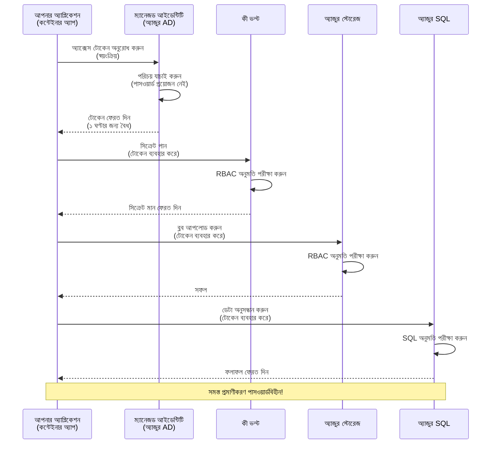
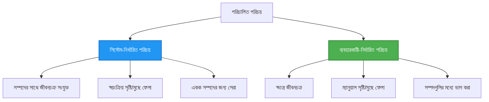

<!--
CO_OP_TRANSLATOR_METADATA:
{
  "original_hash": "e13ff6e1197e0a7462ed0aede7df9f23",
  "translation_date": "2025-11-20T16:15:00+00:00",
  "source_file": "docs/getting-started/authsecurity.md",
  "language_code": "bn"
}
-->
# প্রমাণীকরণ প্যাটার্ন এবং ম্যানেজড আইডেন্টিটি

⏱️ **আনুমানিক সময়**: ৪৫-৬০ মিনিট | 💰 **খরচ প্রভাব**: বিনামূল্যে (অতিরিক্ত চার্জ নেই) | ⭐ **জটিলতা**: মধ্যম

**📚 শেখার পথ:**
- ← পূর্ববর্তী: [কনফিগারেশন ম্যানেজমেন্ট](configuration.md) - পরিবেশ ভেরিয়েবল এবং সিক্রেট পরিচালনা
- 🎯 **আপনি এখানে আছেন**: প্রমাণীকরণ ও নিরাপত্তা (ম্যানেজড আইডেন্টিটি, কী ভল্ট, নিরাপদ প্যাটার্ন)
- → পরবর্তী: [প্রথম প্রকল্প](first-project.md) - আপনার প্রথম AZD অ্যাপ্লিকেশন তৈরি করুন
- 🏠 [কোর্স হোম](../../README.md)

---

## আপনি কী শিখবেন

এই পাঠটি সম্পন্ন করার মাধ্যমে আপনি:
- অ্যাজুর প্রমাণীকরণ প্যাটার্ন (কী, কানেকশন স্ট্রিং, ম্যানেজড আইডেন্টিটি) বুঝতে পারবেন
- পাসওয়ার্ডবিহীন প্রমাণীকরণের জন্য **ম্যানেজড আইডেন্টিটি** বাস্তবায়ন করবেন
- **অ্যাজুর কী ভল্ট** ইন্টিগ্রেশনের মাধ্যমে সিক্রেট সুরক্ষিত করবেন
- AZD ডিপ্লয়মেন্টের জন্য **রোল-ভিত্তিক অ্যাক্সেস কন্ট্রোল (RBAC)** কনফিগার করবেন
- কন্টেইনার অ্যাপ এবং অ্যাজুর সার্ভিসে নিরাপত্তার সেরা অনুশীলন প্রয়োগ করবেন
- কী-ভিত্তিক থেকে আইডেন্টিটি-ভিত্তিক প্রমাণীকরণে স্থানান্তর করবেন

## কেন ম্যানেজড আইডেন্টিটি গুরুত্বপূর্ণ

### সমস্যা: ঐতিহ্যবাহী প্রমাণীকরণ

**ম্যানেজড আইডেন্টিটির আগে:**
```javascript
// ❌ নিরাপত্তা ঝুঁকি: কোডে হার্ডকোড করা গোপনীয় তথ্য
const connectionString = "Server=mydb.database.windows.net;User=admin;Password=P@ssw0rd123";
const storageKey = "xK7mN9pQ2wR5tY8uI0oP3aS6dF1gH4jK...";
const cosmosKey = "C2x7B9n4M1p8Q5w3E6r0T2y5U8i1O4p7...";
```

**সমস্যাসমূহ:**
- 🔴 **কোড, কনফিগ ফাইল, পরিবেশ ভেরিয়েবলে প্রকাশিত সিক্রেট**
- 🔴 **ক্রেডেনশিয়াল রোটেশন** কোড পরিবর্তন এবং পুনরায় ডিপ্লয়মেন্ট প্রয়োজন
- 🔴 **অডিটের দুঃস্বপ্ন** - কে কখন কী অ্যাক্সেস করেছে?
- 🔴 **বিক্ষিপ্ততা** - বিভিন্ন সিস্টেমে ছড়িয়ে থাকা সিক্রেট
- 🔴 **কমপ্লায়েন্স ঝুঁকি** - নিরাপত্তা অডিটে ব্যর্থ

### সমাধান: ম্যানেজড আইডেন্টিটি

**ম্যানেজড আইডেন্টিটির পরে:**
```javascript
// ✅ নিরাপদ: কোডে কোনো গোপনীয়তা নেই
const credential = new DefaultAzureCredential();
const client = new BlobServiceClient(
  "https://mystorageaccount.blob.core.windows.net",
  credential  // Azure স্বয়ংক্রিয়ভাবে প্রমাণীকরণ পরিচালনা করে
);
```

**সুবিধাসমূহ:**
- ✅ **কোড বা কনফিগে কোনো সিক্রেট নেই**
- ✅ **স্বয়ংক্রিয় রোটেশন** - অ্যাজুর এটি পরিচালনা করে
- ✅ **পূর্ণ অডিট ট্রেইল** অ্যাজুর AD লগে
- ✅ **কেন্দ্রীভূত নিরাপত্তা** - অ্যাজুর পোর্টালে পরিচালনা করুন
- ✅ **কমপ্লায়েন্স প্রস্তুত** - নিরাপত্তা মান পূরণ করে

**উপমা**: ঐতিহ্যবাহী প্রমাণীকরণ অনেকগুলো দরজার জন্য আলাদা চাবি বহনের মতো। ম্যানেজড আইডেন্টিটি একটি নিরাপত্তা ব্যাজের মতো যা স্বয়ংক্রিয়ভাবে আপনার পরিচয়ের উপর ভিত্তি করে অ্যাক্সেস প্রদান করে—কোনো চাবি হারানোর, কপি করার বা রোটেট করার প্রয়োজন নেই।

---

## আর্কিটেকচার ওভারভিউ

### ম্যানেজড আইডেন্টিটির সাথে প্রমাণীকরণ প্রবাহ


### ম্যানেজড আইডেন্টিটির ধরন


| বৈশিষ্ট্য | সিস্টেম-অ্যাসাইনড | ইউজার-অ্যাসাইনড |
|---------|----------------|---------------|
| **লাইফসাইকেল** | রিসোর্সের সাথে সংযুক্ত | স্বাধীন |
| **তৈরি** | রিসোর্সের সাথে স্বয়ংক্রিয় | ম্যানুয়াল তৈরি |
| **মুছে ফেলা** | রিসোর্সের সাথে মুছে ফেলা | রিসোর্স মুছে ফেলার পরেও থাকে |
| **শেয়ারিং** | শুধুমাত্র একটি রিসোর্স | একাধিক রিসোর্স |
| **ব্যবহার কেস** | সহজ পরিস্থিতি | জটিল বহু-রিসোর্স পরিস্থিতি |
| **AZD ডিফল্ট** | ✅ সুপারিশকৃত | ঐচ্ছিক |

---

## প্রয়োজনীয়তা

### প্রয়োজনীয় টুলস

আপনার কাছে আগের পাঠ থেকে এগুলো ইনস্টল করা থাকা উচিত:

```bash
# অ্যাজুর ডেভেলপার CLI যাচাই করুন
azd version
# ✅ প্রত্যাশিত: azd সংস্করণ 1.0.0 বা তার বেশি

# অ্যাজুর CLI যাচাই করুন
az --version
# ✅ প্রত্যাশিত: azure-cli 2.50.0 বা তার বেশি
```

### অ্যাজুর প্রয়োজনীয়তা

- সক্রিয় অ্যাজুর সাবস্ক্রিপশন
- অনুমতি:
  - ম্যানেজড আইডেন্টিটি তৈরি করতে
  - RBAC রোল অ্যাসাইন করতে
  - কী ভল্ট রিসোর্স তৈরি করতে
  - কন্টেইনার অ্যাপ ডিপ্লয় করতে

### জ্ঞান প্রয়োজনীয়তা

আপনার সম্পন্ন করা উচিত:
- [ইনস্টলেশন গাইড](installation.md) - AZD সেটআপ
- [AZD বেসিকস](azd-basics.md) - মূল ধারণা
- [কনফিগারেশন ম্যানেজমেন্ট](configuration.md) - পরিবেশ ভেরিয়েবল

---

## পাঠ ১: প্রমাণীকরণ প্যাটার্ন বোঝা

### প্যাটার্ন ১: কানেকশন স্ট্রিং (পুরানো - এড়িয়ে চলুন)

**কীভাবে কাজ করে:**
```bash
# সংযোগ স্ট্রিংয়ে শংসাপত্র রয়েছে
STORAGE_CONNECTION_STRING="DefaultEndpointsProtocol=https;AccountName=myaccount;AccountKey=xK7mN9pQ2wR5..."
COSMOS_CONNECTION_STRING="AccountEndpoint=https://myaccount.documents.azure.com:443/;AccountKey=C2x7..."
SQL_CONNECTION_STRING="Server=myserver.database.windows.net;User=admin;Password=P@ssw0rd..."
```

**সমস্যাসমূহ:**
- ❌ পরিবেশ ভেরিয়েবলে সিক্রেট দৃশ্যমান
- ❌ ডিপ্লয়মেন্ট সিস্টেমে লগ করা হয়
- ❌ রোটেট করা কঠিন
- ❌ অ্যাক্সেসের কোনো অডিট ট্রেইল নেই

**কখন ব্যবহার করবেন:** শুধুমাত্র স্থানীয় ডেভেলপমেন্টের জন্য, কখনো প্রোডাকশনে নয়।

---

### প্যাটার্ন ২: কী ভল্ট রেফারেন্স (ভালো)

**কীভাবে কাজ করে:**
```bicep
// Store secret in Key Vault
resource keyVault 'Microsoft.KeyVault/vaults@2023-02-01' = {
  name: 'mykv'
  properties: {
    enableRbacAuthorization: true
  }
}

// Reference in Container App
env: [
  {
    name: 'STORAGE_KEY'
    secretRef: 'storage-key'  // References Key Vault
  }
]
```

**সুবিধাসমূহ:**
- ✅ কী ভল্টে সিক্রেট নিরাপদে সংরক্ষিত
- ✅ কেন্দ্রীভূত সিক্রেট ম্যানেজমেন্ট
- ✅ কোড পরিবর্তন ছাড়াই রোটেশন

**সীমাবদ্ধতা:**
- ⚠️ এখনও কী/পাসওয়ার্ড ব্যবহার করা হচ্ছে
- ⚠️ কী ভল্ট অ্যাক্সেস পরিচালনা করতে হবে

**কখন ব্যবহার করবেন:** কানেকশন স্ট্রিং থেকে ম্যানেজড আইডেন্টিটিতে স্থানান্তরের জন্য একটি মধ্যবর্তী ধাপ।

---

### প্যাটার্ন ৩: ম্যানেজড আইডেন্টিটি (সেরা অনুশীলন)

**কীভাবে কাজ করে:**
```bicep
// Enable managed identity
resource containerApp 'Microsoft.App/containerApps@2023-05-01' = {
  name: 'myapp'
  identity: {
    type: 'SystemAssigned'  // Automatically creates identity
  }
}

// Grant permissions
resource roleAssignment 'Microsoft.Authorization/roleAssignments@2022-04-01' = {
  scope: storageAccount
  properties: {
    roleDefinitionId: storageBlobDataContributorRole
    principalId: containerApp.identity.principalId
  }
}
```

**অ্যাপ্লিকেশন কোড:**
```javascript
// কোনো গোপনীয়তা প্রয়োজন নেই!
const { DefaultAzureCredential } = require('@azure/identity');
const { BlobServiceClient } = require('@azure/storage-blob');

const credential = new DefaultAzureCredential();
const blobServiceClient = new BlobServiceClient(
  'https://mystorageaccount.blob.core.windows.net',
  credential
);
```

**সুবিধাসমূহ:**
- ✅ কোড/কনফিগে কোনো সিক্রেট নেই
- ✅ স্বয়ংক্রিয় ক্রেডেনশিয়াল রোটেশন
- ✅ পূর্ণ অডিট ট্রেইল
- ✅ RBAC-ভিত্তিক অনুমতি
- ✅ কমপ্লায়েন্স প্রস্তুত

**কখন ব্যবহার করবেন:** সর্বদা, প্রোডাকশন অ্যাপ্লিকেশনের জন্য।

---

## পাঠ ২: AZD এর সাথে ম্যানেজড আইডেন্টিটি বাস্তবায়ন

### ধাপে ধাপে বাস্তবায়ন

চলুন একটি নিরাপদ কন্টেইনার অ্যাপ তৈরি করি যা ম্যানেজড আইডেন্টিটি ব্যবহার করে অ্যাজুর স্টোরেজ এবং কী ভল্ট অ্যাক্সেস করে।

### প্রকল্প কাঠামো

```
secure-app/
├── azure.yaml                 # AZD configuration
├── infra/
│   ├── main.bicep            # Main infrastructure
│   ├── core/
│   │   ├── identity.bicep    # Managed identity setup
│   │   ├── keyvault.bicep    # Key Vault configuration
│   │   └── storage.bicep     # Storage with RBAC
│   └── app/
│       └── container-app.bicep
└── src/
    ├── app.js                # Application code
    ├── package.json
    └── Dockerfile
```

### ১. AZD কনফিগার করুন (azure.yaml)

```yaml
name: secure-app
metadata:
  template: secure-app@1.0.0

services:
  api:
    project: ./src
    language: js
    host: containerapp

# Enable managed identity (AZD handles this automatically)
```

### ২. অবকাঠামো: ম্যানেজড আইডেন্টিটি সক্রিয় করুন

**ফাইল: `infra/main.bicep`**

```bicep
targetScope = 'subscription'

param environmentName string
param location string = 'eastus'

var tags = { 'azd-env-name': environmentName }

// Resource group
resource rg 'Microsoft.Resources/resourceGroups@2021-04-01' = {
  name: 'rg-${environmentName}'
  location: location
  tags: tags
}

// Storage Account
module storage './core/storage.bicep' = {
  name: 'storage'
  scope: rg
  params: {
    name: 'st${uniqueString(rg.id)}'
    location: location
    tags: tags
  }
}

// Key Vault
module keyVault './core/keyvault.bicep' = {
  name: 'keyvault'
  scope: rg
  params: {
    name: 'kv-${uniqueString(rg.id)}'
    location: location
    tags: tags
  }
}

// Container App with Managed Identity
module containerApp './app/container-app.bicep' = {
  name: 'container-app'
  scope: rg
  params: {
    name: 'ca-${environmentName}'
    location: location
    tags: tags
    storageAccountName: storage.outputs.name
    keyVaultName: keyVault.outputs.name
  }
}

// Grant Container App access to Storage
module storageRoleAssignment './core/role-assignment.bicep' = {
  name: 'storage-role'
  scope: rg
  params: {
    principalId: containerApp.outputs.identityPrincipalId
    roleDefinitionId: 'ba92f5b4-2d11-453d-a403-e96b0029c9fe'  // Storage Blob Data Contributor
    targetResourceId: storage.outputs.id
  }
}

// Grant Container App access to Key Vault
module kvRoleAssignment './core/role-assignment.bicep' = {
  name: 'kv-role'
  scope: rg
  params: {
    principalId: containerApp.outputs.identityPrincipalId
    roleDefinitionId: '4633458b-17de-408a-b874-0445c86b69e6'  // Key Vault Secrets User
    targetResourceId: keyVault.outputs.id
  }
}

// Outputs
output AZURE_STORAGE_ACCOUNT_NAME string = storage.outputs.name
output AZURE_KEY_VAULT_NAME string = keyVault.outputs.name
output APP_URL string = containerApp.outputs.url
```

### ৩. সিস্টেম-অ্যাসাইনড আইডেন্টিটির সাথে কন্টেইনার অ্যাপ

**ফাইল: `infra/app/container-app.bicep`**

```bicep
param name string
param location string
param tags object = {}
param storageAccountName string
param keyVaultName string

resource containerApp 'Microsoft.App/containerApps@2023-05-01' = {
  name: name
  location: location
  tags: tags
  identity: {
    type: 'SystemAssigned'  // 🔑 Enable managed identity
  }
  properties: {
    configuration: {
      ingress: {
        external: true
        targetPort: 3000
      }
    }
    template: {
      containers: [
        {
          name: 'api'
          image: 'myregistry.azurecr.io/api:latest'
          resources: {
            cpu: json('0.5')
            memory: '1Gi'
          }
          env: [
            {
              name: 'AZURE_STORAGE_ACCOUNT_NAME'
              value: storageAccountName
            }
            {
              name: 'AZURE_KEY_VAULT_NAME'
              value: keyVaultName
            }
            // 🔑 No secrets - managed identity handles authentication!
          ]
        }
      ]
    }
  }
}

// Output the identity for RBAC assignments
output identityPrincipalId string = containerApp.identity.principalId
output id string = containerApp.id
output url string = 'https://${containerApp.properties.configuration.ingress.fqdn}'
```

### ৪. RBAC রোল অ্যাসাইনমেন্ট মডিউল

**ফাইল: `infra/core/role-assignment.bicep`**

```bicep
param principalId string
param roleDefinitionId string  // Azure built-in role ID
param targetResourceId string

resource roleAssignment 'Microsoft.Authorization/roleAssignments@2022-04-01' = {
  name: guid(principalId, roleDefinitionId, targetResourceId)
  scope: resourceId('Microsoft.Resources/resourceGroups', resourceGroup().name)
  properties: {
    roleDefinitionId: subscriptionResourceId('Microsoft.Authorization/roleDefinitions', roleDefinitionId)
    principalId: principalId
    principalType: 'ServicePrincipal'
  }
}

output id string = roleAssignment.id
```

### ৫. ম্যানেজড আইডেন্টিটির সাথে অ্যাপ্লিকেশন কোড

**ফাইল: `src/app.js`**

```javascript
const express = require('express');
const { DefaultAzureCredential } = require('@azure/identity');
const { BlobServiceClient } = require('@azure/storage-blob');
const { SecretClient } = require('@azure/keyvault-secrets');

const app = express();
const PORT = process.env.PORT || 3000;

// 🔑 পরিচিতি প্রাথমিকীকরণ (পরিচালিত পরিচয়ের সাথে স্বয়ংক্রিয়ভাবে কাজ করে)
const credential = new DefaultAzureCredential();

// Azure Storage সেটআপ
const storageAccountName = process.env.AZURE_STORAGE_ACCOUNT_NAME;
const blobServiceClient = new BlobServiceClient(
  `https://${storageAccountName}.blob.core.windows.net`,
  credential  // কোনো কী প্রয়োজন নেই!
);

// Key Vault সেটআপ
const keyVaultName = process.env.AZURE_KEY_VAULT_NAME;
const secretClient = new SecretClient(
  `https://${keyVaultName}.vault.azure.net`,
  credential  // কোনো কী প্রয়োজন নেই!
);

// স্বাস্থ্য পরীক্ষা
app.get('/health', (req, res) => {
  res.json({ status: 'healthy', authentication: 'managed-identity' });
});

// ব্লব স্টোরেজে ফাইল আপলোড করুন
app.post('/upload', async (req, res) => {
  try {
    const containerClient = blobServiceClient.getContainerClient('uploads');
    await containerClient.createIfNotExists();
    
    const blobName = `file-${Date.now()}.txt`;
    const blockBlobClient = containerClient.getBlockBlobClient(blobName);
    
    await blockBlobClient.upload('Hello from managed identity!', 30);
    
    res.json({
      success: true,
      blobName: blobName,
      message: 'File uploaded using managed identity!'
    });
  } catch (error) {
    console.error('Upload error:', error);
    res.status(500).json({ error: error.message });
  }
});

// Key Vault থেকে গোপন তথ্য পান
app.get('/secret/:name', async (req, res) => {
  try {
    const secretName = req.params.name;
    const secret = await secretClient.getSecret(secretName);
    
    res.json({
      name: secretName,
      value: secret.value,
      message: 'Secret retrieved using managed identity!'
    });
  } catch (error) {
    console.error('Secret error:', error);
    res.status(500).json({ error: error.message });
  }
});

// ব্লব কন্টেইনার তালিকা করুন (পড়ার অ্যাক্সেস প্রদর্শন করে)
app.get('/containers', async (req, res) => {
  try {
    const containers = [];
    for await (const container of blobServiceClient.listContainers()) {
      containers.push(container.name);
    }
    
    res.json({
      containers: containers,
      count: containers.length,
      message: 'Containers listed using managed identity!'
    });
  } catch (error) {
    console.error('List error:', error);
    res.status(500).json({ error: error.message });
  }
});

app.listen(PORT, () => {
  console.log(`Secure API listening on port ${PORT}`);
  console.log('Authentication: Managed Identity (passwordless)');
});
```

**ফাইল: `src/package.json`**

```json
{
  "name": "secure-app",
  "version": "1.0.0",
  "dependencies": {
    "express": "^4.18.2",
    "@azure/identity": "^4.0.0",
    "@azure/storage-blob": "^12.17.0",
    "@azure/keyvault-secrets": "^4.7.0"
  },
  "scripts": {
    "start": "node app.js"
  }
}
```

### ৬. ডিপ্লয় এবং পরীক্ষা করুন

```bash
# AZD পরিবেশ আরম্ভ করুন
azd init

# অবকাঠামো এবং অ্যাপ্লিকেশন স্থাপন করুন
azd up

# অ্যাপ URL পান
APP_URL=$(azd env get-values | grep APP_URL | cut -d '=' -f2 | tr -d '"')

# স্বাস্থ্য পরীক্ষা করুন
curl $APP_URL/health
```

**✅ প্রত্যাশিত আউটপুট:**
```json
{
  "status": "healthy",
  "authentication": "managed-identity"
}
```

**ব্লব আপলোড পরীক্ষা করুন:**
```bash
curl -X POST $APP_URL/upload
```

**✅ প্রত্যাশিত আউটপুট:**
```json
{
  "success": true,
  "blobName": "file-1700404800000.txt",
  "message": "File uploaded using managed identity!"
}
```

**কন্টেইনার তালিকা পরীক্ষা করুন:**
```bash
curl $APP_URL/containers
```

**✅ প্রত্যাশিত আউটপুট:**
```json
{
  "containers": ["uploads"],
  "count": 1,
  "message": "Containers listed using managed identity!"
}
```

---

## সাধারণ অ্যাজুর RBAC রোল

### ম্যানেজড আইডেন্টিটির জন্য বিল্ট-ইন রোল আইডি

| সার্ভিস | রোল নাম | রোল আইডি | অনুমতি |
|---------|-----------|---------|-------------|
| **স্টোরেজ** | স্টোরেজ ব্লব ডেটা রিডার | `2a2b9908-6b94-4a3d-8e5a-a7d8f8cc8a12` | ব্লব এবং কন্টেইনার পড়ুন |
| **স্টোরেজ** | স্টোরেজ ব্লব ডেটা কন্ট্রিবিউটর | `ba92f5b4-2d11-453d-a403-e96b0029c9fe` | ব্লব পড়া, লেখা, মুছে ফেলা |
| **স্টোরেজ** | স্টোরেজ কিউ ডেটা কন্ট্রিবিউটর | `974c5e8b-45b9-4653-ba55-5f855dd0fb88` | কিউ মেসেজ পড়া, লেখা, মুছে ফেলা |
| **কী ভল্ট** | কী ভল্ট সিক্রেটস ইউজার | `4633458b-17de-408a-b874-0445c86b69e6` | সিক্রেট পড়ুন |
| **কী ভল্ট** | কী ভল্ট সিক্রেটস অফিসার | `b86a8fe4-44ce-4948-aee5-eccb2c155cd7` | সিক্রেট পড়া, লেখা, মুছে ফেলা |
| **কসমস ডিবি** | কসমস ডিবি বিল্ট-ইন ডেটা রিডার | `00000000-0000-0000-0000-000000000001` | কসমস ডিবি ডেটা পড়ুন |
| **কসমস ডিবি** | কসমস ডিবি বিল্ট-ইন ডেটা কন্ট্রিবিউটর | `00000000-0000-0000-0000-000000000002` | কসমস ডিবি ডেটা পড়া, লেখা |
| **SQL ডাটাবেস** | SQL DB কন্ট্রিবিউটর | `9b7fa17d-e63e-47b0-bb0a-15c516ac86ec` | SQL ডাটাবেস পরিচালনা |
| **সার্ভিস বাস** | অ্যাজুর সার্ভিস বাস ডেটা ওনার | `090c5cfd-751d-490a-894a-3ce6f1109419` | মেসেজ পাঠানো, গ্রহণ, পরিচালনা |

### রোল আইডি কীভাবে খুঁজে পাবেন

```bash
# সমস্ত বিল্ট-ইন ভূমিকা তালিকাভুক্ত করুন
az role definition list --query "[].{Name:roleName, ID:name}" --output table

# নির্দিষ্ট ভূমিকা অনুসন্ধান করুন
az role definition list --query "[?contains(roleName, 'Storage Blob')].{Name:roleName, ID:name}" --output table

# ভূমিকার বিবরণ পান
az role definition list --name "Storage Blob Data Contributor"
```

---

## ব্যবহারিক অনুশীলন

### অনুশীলন ১: বিদ্যমান অ্যাপের জন্য ম্যানেজড আইডেন্টিটি সক্রিয় করুন ⭐⭐ (মধ্যম)

**লক্ষ্য**: একটি বিদ্যমান কন্টেইনার অ্যাপ ডিপ্লয়মেন্টে ম্যানেজড আইডেন্টিটি যোগ করুন

**পরিস্থিতি**: আপনার একটি কন্টেইনার অ্যাপ রয়েছে যা কানেকশন স্ট্রিং ব্যবহার করছে। এটিকে ম্যানেজড আইডেন্টিটিতে রূপান্তর করুন।

**শুরু করার পয়েন্ট**: এই কনফিগারেশনের সাথে একটি কন্টেইনার অ্যাপ:

```bicep
// ❌ Current: Using connection string
env: [
  {
    name: 'STORAGE_CONNECTION_STRING'
    secretRef: 'storage-connection'
  }
]
```

**ধাপসমূহ**:

1. **বাইসেপে ম্যানেজড আইডেন্টিটি সক্রিয় করুন:**

```bicep
resource containerApp 'Microsoft.App/containerApps@2023-05-01' = {
  name: 'myapp'
  identity: {
    type: 'SystemAssigned'  // Add this
  }
  // ... rest of configuration
}
```

2. **স্টোরেজ অ্যাক্সেস প্রদান করুন:**

```bicep
// Get storage account reference
resource storageAccount 'Microsoft.Storage/storageAccounts@2023-01-01' existing = {
  name: storageAccountName
}

// Assign role
resource roleAssignment 'Microsoft.Authorization/roleAssignments@2022-04-01' = {
  name: guid(containerApp.id, 'ba92f5b4-2d11-453d-a403-e96b0029c9fe', storageAccount.id)
  scope: storageAccount
  properties: {
    roleDefinitionId: subscriptionResourceId('Microsoft.Authorization/roleDefinitions', 'ba92f5b4-2d11-453d-a403-e96b0029c9fe')
    principalId: containerApp.identity.principalId
    principalType: 'ServicePrincipal'
  }
}
```

3. **অ্যাপ্লিকেশন কোড আপডেট করুন:**

**আগে (কানেকশন স্ট্রিং):**
```javascript
const { BlobServiceClient } = require('@azure/storage-blob');

const blobServiceClient = BlobServiceClient.fromConnectionString(
  process.env.STORAGE_CONNECTION_STRING
);
```

**পরে (ম্যানেজড আইডেন্টিটি):**
```javascript
const { DefaultAzureCredential } = require('@azure/identity');
const { BlobServiceClient } = require('@azure/storage-blob');

const credential = new DefaultAzureCredential();
const blobServiceClient = new BlobServiceClient(
  `https://${process.env.STORAGE_ACCOUNT_NAME}.blob.core.windows.net`,
  credential
);
```

4. **পরিবেশ ভেরিয়েবল আপডেট করুন:**

```bicep
env: [
  {
    name: 'STORAGE_ACCOUNT_NAME'
    value: storageAccountName  // Just the name, no secrets!
  }
  // Remove STORAGE_CONNECTION_STRING
]
```

5. **ডিপ্লয় এবং পরীক্ষা করুন:**

```bash
# পুনরায় স্থাপন করুন
azd up

# পরীক্ষা করুন যে এটি এখনও কাজ করে
curl https://myapp.azurecontainerapps.io/upload
```

**✅ সাফল্যের মানদণ্ড:**
- ✅ অ্যাপ্লিকেশন কোনো ত্রুটি ছাড়াই ডিপ্লয় হয়
- ✅ স্টোরেজ অপারেশন কাজ করে (আপলোড, তালিকা, ডাউনলোড)
- ✅ পরিবেশ ভেরিয়েবলে কোনো কানেকশন স্ট্রিং নেই
- ✅ আইডেন্টিটি অ্যাজুর পোর্টালে "আইডেন্টিটি" ব্লেডে দৃশ্যমান

**যাচাই:**

```bash
# পরিচালিত পরিচয় সক্রিয় আছে কিনা পরীক্ষা করুন
az containerapp show \
  --name myapp \
  --resource-group rg-myapp \
  --query "identity.type"
# ✅ প্রত্যাশিত: "SystemAssigned"

# ভূমিকা বরাদ্দ পরীক্ষা করুন
az role assignment list \
  --assignee $(az containerapp show --name myapp --resource-group rg-myapp --query "identity.principalId" -o tsv) \
  --scope /subscriptions/{sub-id}/resourceGroups/rg-myapp/providers/Microsoft.Storage/storageAccounts/mystorageaccount
# ✅ প্রত্যাশিত: "Storage Blob Data Contributor" ভূমিকা দেখায়
```

**সময়**: ২০-৩০ মিনিট

---

### অনুশীলন ২: ইউজার-অ্যাসাইনড আইডেন্টিটির সাথে বহু-সার্ভিস অ্যাক্সেস ⭐⭐⭐ (উন্নত)

**লক্ষ্য**: একাধিক কন্টেইনার অ্যাপের মধ্যে ভাগ করা একটি ইউজার-অ্যাসাইনড আইডেন্টিটি তৈরি করুন

**পরিস্থিতি**: আপনার ৩টি মাইক্রোসার্ভিস রয়েছে যা একই স্টোরেজ অ্যাকাউন্ট এবং কী ভল্ট অ্যাক্সেস করতে হবে।

**ধাপসমূহ**:

1. **ইউজার-অ্যাসাইনড আইডেন্টিটি তৈরি করুন:**

**ফাইল: `infra/core/identity.bicep`**

```bicep
param name string
param location string
param tags object = {}

resource userAssignedIdentity 'Microsoft.ManagedIdentity/userAssignedIdentities@2023-01-31' = {
  name: name
  location: location
  tags: tags
}

output id string = userAssignedIdentity.id
output principalId string = userAssignedIdentity.properties.principalId
output clientId string = userAssignedIdentity.properties.clientId
```

2. **ইউজার-অ্যাসাইনড আইডেন্টিটিতে রোল অ্যাসাইন করুন:**

```bicep
// In main.bicep
module userIdentity './core/identity.bicep' = {
  name: 'user-identity'
  scope: rg
  params: {
    name: 'id-${environmentName}'
    location: location
    tags: tags
  }
}

// Grant Storage access
resource storageRoleAssignment 'Microsoft.Authorization/roleAssignments@2022-04-01' = {
  name: guid(userIdentity.outputs.principalId, 'storage-contributor')
  scope: storageAccount
  properties: {
    roleDefinitionId: subscriptionResourceId('Microsoft.Authorization/roleDefinitions', 'ba92f5b4-2d11-453d-a403-e96b0029c9fe')
    principalId: userIdentity.outputs.principalId
    principalType: 'ServicePrincipal'
  }
}

// Grant Key Vault access
resource kvRoleAssignment 'Microsoft.Authorization/roleAssignments@2022-04-01' = {
  name: guid(userIdentity.outputs.principalId, 'kv-secrets-user')
  scope: keyVault
  properties: {
    roleDefinitionId: subscriptionResourceId('Microsoft.Authorization/roleDefinitions', '4633458b-17de-408a-b874-0445c86b69e6')
    principalId: userIdentity.outputs.principalId
    principalType: 'ServicePrincipal'
  }
}
```

3. **একাধিক কন্টেইনার অ্যাপে আইডেন্টিটি অ্যাসাইন করুন:**

```bicep
resource apiGateway 'Microsoft.App/containerApps@2023-05-01' = {
  name: 'api-gateway'
  identity: {
    type: 'UserAssigned'
    userAssignedIdentities: {
      '${userIdentity.outputs.id}': {}
    }
  }
  // ... rest of config
}

resource productService 'Microsoft.App/containerApps@2023-05-01' = {
  name: 'product-service'
  identity: {
    type: 'UserAssigned'
    userAssignedIdentities: {
      '${userIdentity.outputs.id}': {}
    }
  }
  // ... rest of config
}

resource orderService 'Microsoft.App/containerApps@2023-05-01' = {
  name: 'order-service'
  identity: {
    type: 'UserAssigned'
    userAssignedIdentities: {
      '${userIdentity.outputs.id}': {}
    }
  }
  // ... rest of config
}
```

4. **অ্যাপ্লিকেশন কোড (সব সার্ভিস একই প্যাটার্ন ব্যবহার করে):**

```javascript
const { DefaultAzureCredential, ManagedIdentityCredential } = require('@azure/identity');

// ব্যবহারকারী-নির্ধারিত পরিচয়ের জন্য, ক্লায়েন্ট আইডি নির্দিষ্ট করুন
const credential = new ManagedIdentityCredential(
  process.env.AZURE_CLIENT_ID  // ব্যবহারকারী-নির্ধারিত পরিচয়ের ক্লায়েন্ট আইডি
);

// অথবা DefaultAzureCredential ব্যবহার করুন (স্বয়ংক্রিয়ভাবে সনাক্ত করে)
const credential = new DefaultAzureCredential();

const blobServiceClient = new BlobServiceClient(
  `https://${process.env.STORAGE_ACCOUNT_NAME}.blob.core.windows.net`,
  credential
);
```

5. **ডিপ্লয় এবং যাচাই করুন:**

```bash
azd up

# সমস্ত পরিষেবা স্টোরেজে অ্যাক্সেস করতে পারে কিনা পরীক্ষা করুন
curl https://api-gateway.azurecontainerapps.io/upload
curl https://product-service.azurecontainerapps.io/upload
curl https://order-service.azurecontainerapps.io/upload
```

**✅ সাফল্যের মানদণ্ড:**
- ✅ ৩টি সার্ভিসের মধ্যে একটি আইডেন্টিটি ভাগ করা
- ✅ সব সার্ভিস স্টোরেজ এবং কী ভল্ট অ্যাক্সেস করতে পারে
- ✅ একটি সার্ভিস মুছে ফেললে আইডেন্টিটি থাকে
- ✅ কেন্দ্রীভূত অনুমতি পরিচালনা

**ইউজার-অ্যাসাইনড আইডেন্টিটির সুবিধা:**
- পরিচালনার জন্য একটি আইডেন্টিটি
- সার্ভিস জুড়ে সামঞ্জস্যপূর্ণ অনুমতি
- সার্ভিস মুছে ফেললেও টিকে থাকে
- জটিল আর্কিটেকচারের জন্য ভালো

**সময়**: ৩০-৪০ মিনিট

---

### অনুশীলন ৩: কী ভল্ট সিক্রেট রোটেশন বাস্তবায়ন ⭐⭐⭐ (উন্নত)

**লক্ষ্য**: কী ভল্টে তৃতীয় পক্ষের API কী সংরক্ষণ করুন এবং ম্যানেজড আইডেন্টিটি ব্যবহার করে সেগুলো অ্যাক্সেস করুন

**পরিস্থিতি**: আপনার অ্যাপকে একটি বাহ্যিক API (OpenAI, Stripe, SendGrid) কল করতে হবে যা API কী প্রয়োজন।

**ধাপসমূহ**:

1. **RBAC সহ কী ভল্ট তৈরি করুন:**

**ফাইল: `infra/core/keyvault.bicep`**

```bicep
param name string
param location string
param tags object = {}

resource keyVault 'Microsoft.KeyVault/vaults@2023-02-01' = {
  name: name
  location: location
  tags: tags
  properties: {
    enableRbacAuthorization: true  // Use RBAC instead of access policies
    sku: {
      family: 'A'
      name: 'standard'
    }
    tenantId: subscription().tenantId
    enableSoftDelete: true
    softDeleteRetentionInDays: 90
  }
}

// Allow Container App to read secrets
output id string = keyVault.id
output name string = keyVault.name
output uri string = keyVault.properties.vaultUri
```

2. **কী ভল্টে সিক্রেট সংরক্ষণ করুন:**

```bash
# কী ভল্ট নাম পান
KV_NAME=$(azd env get-values | grep AZURE_KEY_VAULT_NAME | cut -d '=' -f2 | tr -d '"')

# তৃতীয় পক্ষের API কী সংরক্ষণ করুন
az keyvault secret set \
  --vault-name $KV_NAME \
  --name "OpenAI-ApiKey" \
  --value "sk-proj-xxxxxxxxxxxxx"

az keyvault secret set \
  --vault-name $KV_NAME \
  --name "Stripe-ApiKey" \
  --value "sk_live_xxxxxxxxxxxxx"

az keyvault secret set \
  --vault-name $KV_NAME \
  --name "SendGrid-ApiKey" \
  --value "SG.xxxxxxxxxxxxx"
```

3. **সিক্রেট পুনরুদ্ধারের জন্য অ্যাপ্লিকেশন কোড:**

**ফাইল: `src/config.js`**

```javascript
const { DefaultAzureCredential } = require('@azure/identity');
const { SecretClient } = require('@azure/keyvault-secrets');

class Config {
  constructor() {
    this.credential = new DefaultAzureCredential();
    this.secretClient = new SecretClient(
      `https://${process.env.AZURE_KEY_VAULT_NAME}.vault.azure.net`,
      this.credential
    );
    this.cache = {};
  }

  async getSecret(secretName) {
    // প্রথমে ক্যাশ পরীক্ষা করুন
    if (this.cache[secretName]) {
      return this.cache[secretName];
    }

    try {
      const secret = await this.secretClient.getSecret(secretName);
      this.cache[secretName] = secret.value;
      console.log(`✅ Retrieved secret: ${secretName}`);
      return secret.value;
    } catch (error) {
      console.error(`❌ Failed to get secret ${secretName}:`, error.message);
      throw error;
    }
  }

  async getOpenAIKey() {
    return this.getSecret('OpenAI-ApiKey');
  }

  async getStripeKey() {
    return this.getSecret('Stripe-ApiKey');
  }

  async getSendGridKey() {
    return this.getSecret('SendGrid-ApiKey');
  }
}

module.exports = new Config();
```

4. **অ্যাপ্লিকেশনে সিক্রেট ব্যবহার করুন:**

**ফাইল: `src/app.js`**

```javascript
const express = require('express');
const config = require('./config');
const { OpenAI } = require('openai');

const app = express();

// কী ভল্ট থেকে কী দিয়ে ওপেনএআই আরম্ভ করুন
let openaiClient;

async function initializeServices() {
  const openaiKey = await config.getOpenAIKey();
  openaiClient = new OpenAI({ apiKey: openaiKey });
  console.log('✅ Services initialized with secrets from Key Vault');
}

// স্টার্টআপে কল করুন
initializeServices().catch(console.error);

app.post('/chat', async (req, res) => {
  try {
    const completion = await openaiClient.chat.completions.create({
      model: 'gpt-4',
      messages: [{ role: 'user', content: 'Hello!' }]
    });
    
    res.json({
      response: completion.choices[0].message.content,
      authentication: 'Key from Key Vault via Managed Identity'
    });
  } catch (error) {
    res.status(500).json({ error: error.message });
  }
});

app.listen(3000, () => {
  console.log('Secure API with Key Vault integration running');
});
```

5. **ডিপ্লয় এবং পরীক্ষা করুন:**

```bash
azd up

# API কী কাজ করে তা পরীক্ষা করুন
curl -X POST https://myapp.azurecontainerapps.io/chat \
  -H "Content-Type: application/json" \
  -d '{"message":"Hello AI"}'
```

**✅ সাফল্যের মানদণ্ড:**
- ✅ কোড বা পরিবেশ ভেরিয়েবলে কোনো API কী নেই
- ✅ অ্যাপ্লিকেশন কী ভল্ট থেকে কী পুনরুদ্ধার করে
- ✅ তৃতীয় পক্ষের API সঠিকভাবে কাজ করে
- ✅ কোড পরিবর্তন ছাড়াই কী রোটেট করা যায়

**একটি সিক্রেট রোটেট করুন:**

```bash
# কী ভল্টে গোপনীয়তা আপডেট করুন
az keyvault secret set \
  --vault-name $KV_NAME \
  --name "OpenAI-ApiKey" \
  --value "sk-proj-NEW_KEY_HERE"

# নতুন কী গ্রহণ করতে অ্যাপটি পুনরায় চালু করুন
az containerapp revision restart \
  --name myapp \
  --resource-group rg-myapp
```

**সময়**: ২৫-৩৫ মিনিট

---

## জ্ঞান যাচাই

### ১. প্রমাণীকরণ প্যাটার্ন ✓

আপনার বোঝাপড়া পরীক্ষা করুন:

- [ ] **প্রশ্ন ১**: প্রধান তিনটি প্রমাণীকরণ প্যাটার্ন কী কী? 
  - **উত্তর**: কানেকশন স্ট্রিং (পুরানো), কী ভল্ট রেফারেন্স (মধ্যবর্তী), ম্যানেজ
- [ ] **প্রশ্ন ১**: কীভাবে Key Vault-এ RBAC সক্রিয় করবেন access policies-এর পরিবর্তে?
  - **উত্তর**: Bicep-এ `enableRbacAuthorization: true` সেট করুন

- [ ] **প্রশ্ন ২**: কোন Azure SDK লাইব্রেরি managed identity authentication পরিচালনা করে?
  - **উত্তর**: `@azure/identity` এবং `DefaultAzureCredential` ক্লাস

- [ ] **প্রশ্ন ৩**: Key Vault সিক্রেট কতক্ষণ ক্যাশে থাকে?
  - **উত্তর**: অ্যাপ্লিকেশন-নির্ভর; নিজস্ব ক্যাশিং কৌশল প্রয়োগ করুন

**হ্যান্ডস-অন যাচাইকরণ:**
```bash
# কী ভল্ট অ্যাক্সেস পরীক্ষা করুন
az keyvault secret show \
  --vault-name $KV_NAME \
  --name "OpenAI-ApiKey" \
  --query "value"

# RBAC সক্রিয় আছে কিনা পরীক্ষা করুন
az keyvault show \
  --name $KV_NAME \
  --query "properties.enableRbacAuthorization"
# ✅ প্রত্যাশিত: সত্য
```

---

## নিরাপত্তা সেরা অনুশীলন

### ✅ করণীয়:

1. **প্রোডাকশনে সর্বদা managed identity ব্যবহার করুন**
   ```bicep
   identity: {
     type: 'SystemAssigned'
   }
   ```

2. **সর্বনিম্ন-প্রয়োজনীয় RBAC ভূমিকা ব্যবহার করুন**
   - সম্ভব হলে "Reader" ভূমিকা ব্যবহার করুন
   - "Owner" বা "Contributor" এড়িয়ে চলুন যদি না একান্ত প্রয়োজন হয়

3. **তৃতীয় পক্ষের কী Key Vault-এ সংরক্ষণ করুন**
   ```javascript
   const apiKey = await secretClient.getSecret('ThirdPartyApiKey');
   ```

4. **অডিট লগিং সক্রিয় করুন**
   ```bicep
   diagnosticSettings: {
     logs: [{ category: 'AuditEvent', enabled: true }]
   }
   ```

5. **ডেভ/স্টেজিং/প্রোড-এর জন্য ভিন্ন পরিচয় ব্যবহার করুন**
   ```bash
   azd env new dev
   azd env new staging
   azd env new prod
   ```

6. **নিয়মিত সিক্রেট ঘোরান**
   - Key Vault সিক্রেটের জন্য মেয়াদ শেষ হওয়ার তারিখ নির্ধারণ করুন
   - Azure Functions দিয়ে ঘোরানো স্বয়ংক্রিয় করুন

### ❌ করণীয় নয়:

1. **সিক্রেট কখনো হার্ডকোড করবেন না**
   ```javascript
   // ❌ খারাপ
   const apiKey = "sk-proj-xxxxxxxxxxxxx";
   ```

2. **প্রোডাকশনে কানেকশন স্ট্রিং ব্যবহার করবেন না**
   ```javascript
   // ❌ খারাপ
   BlobServiceClient.fromConnectionString(process.env.STORAGE_CONNECTION_STRING)
   ```

3. **অতিরিক্ত অনুমতি প্রদান করবেন না**
   ```bicep
   // ❌ BAD - too much access
   roleDefinitionId: 'Owner'
   
   // ✅ GOOD - least privilege
   roleDefinitionId: 'Storage Blob Data Reader'
   ```

4. **সিক্রেট লগ করবেন না**
   ```javascript
   // ❌ খারাপ
   console.log('API Key:', apiKey);
   
   // ✅ ভালো
   console.log('API Key retrieved successfully');
   ```

5. **প্রোডাকশনের পরিচয় বিভিন্ন পরিবেশে শেয়ার করবেন না**
   ```bicep
   // ❌ BAD - same identity for dev and prod
   // ✅ GOOD - separate identities per environment
   ```

---

## সমস্যা সমাধানের নির্দেশিকা

### সমস্যা: Azure Storage অ্যাক্সেস করার সময় "Unauthorized"

**লক্ষণ:**
```
Error: Unauthorized (403)
AuthorizationPermissionMismatch: This request is not authorized to perform this operation
```

**নির্ণয়:**

```bash
# যাচাই করুন পরিচালিত পরিচয় সক্রিয় আছে কিনা
az containerapp show \
  --name myapp \
  --resource-group rg-myapp \
  --query "identity.type"
# ✅ প্রত্যাশিত: "SystemAssigned" বা "UserAssigned"

# ভূমিকা বরাদ্দগুলি যাচাই করুন
PRINCIPAL_ID=$(az containerapp show --name myapp --resource-group rg-myapp --query "identity.principalId" -o tsv)
az role assignment list --assignee $PRINCIPAL_ID

# প্রত্যাশিত: "Storage Blob Data Contributor" বা অনুরূপ ভূমিকা দেখতে হবে
```

**সমাধানসমূহ:**

1. **সঠিক RBAC ভূমিকা প্রদান করুন:**
```bash
STORAGE_ID=$(az storage account show --name mystorageaccount --resource-group rg-myapp --query "id" -o tsv)
az role assignment create \
  --assignee $PRINCIPAL_ID \
  --role "Storage Blob Data Contributor" \
  --scope $STORAGE_ID
```

2. **প্রচার হতে অপেক্ষা করুন (৫-১০ মিনিট সময় লাগতে পারে):**
```bash
# ভূমিকা বরাদ্দের স্থিতি পরীক্ষা করুন
az role assignment list --assignee $PRINCIPAL_ID --scope $STORAGE_ID
```

3. **অ্যাপ্লিকেশন কোড সঠিক credential ব্যবহার করছে কিনা যাচাই করুন:**
```javascript
// নিশ্চিত করুন যে আপনি DefaultAzureCredential ব্যবহার করছেন
const credential = new DefaultAzureCredential();
```

---

### সমস্যা: Key Vault অ্যাক্সেস অস্বীকৃত

**লক্ষণ:**
```
Error: Forbidden (403)
The user, group or application does not have secrets get permission
```

**নির্ণয়:**

```bash
# কী ভল্ট RBAC সক্রিয় আছে কিনা পরীক্ষা করুন
az keyvault show \
  --name $KV_NAME \
  --query "properties.enableRbacAuthorization"
# ✅ প্রত্যাশিত: সত্য

# ভূমিকা বরাদ্দগুলি পরীক্ষা করুন
az role assignment list \
  --assignee $PRINCIPAL_ID \
  --scope /subscriptions/{sub-id}/resourceGroups/rg-myapp/providers/Microsoft.KeyVault/vaults/$KV_NAME
```

**সমাধানসমূহ:**

1. **Key Vault-এ RBAC সক্রিয় করুন:**
```bash
az keyvault update \
  --name $KV_NAME \
  --enable-rbac-authorization true
```

2. **Key Vault Secrets User ভূমিকা প্রদান করুন:**
```bash
KV_ID=$(az keyvault show --name $KV_NAME --query "id" -o tsv)
az role assignment create \
  --assignee $PRINCIPAL_ID \
  --role "Key Vault Secrets User" \
  --scope $KV_ID
```

---

### সমস্যা: DefaultAzureCredential স্থানীয়ভাবে ব্যর্থ হচ্ছে

**লক্ষণ:**
```
Error: DefaultAzureCredential failed to retrieve a token
CredentialUnavailableError: No credential available
```

**নির্ণয়:**

```bash
# আপনি লগ ইন করেছেন কিনা পরীক্ষা করুন
az account show

# Azure CLI প্রমাণীকরণ পরীক্ষা করুন
az ad signed-in-user show
```

**সমাধানসমূহ:**

1. **Azure CLI-তে লগইন করুন:**
```bash
az login
```

2. **Azure সাবস্ক্রিপশন সেট করুন:**
```bash
az account set --subscription "Your Subscription Name"
```

3. **স্থানীয় ডেভেলপমেন্টের জন্য পরিবেশ ভেরিয়েবল ব্যবহার করুন:**
```bash
export AZURE_TENANT_ID="your-tenant-id"
export AZURE_CLIENT_ID="your-client-id"
export AZURE_CLIENT_SECRET="your-client-secret"
```

4. **অথবা স্থানীয়ভাবে ভিন্ন credential ব্যবহার করুন:**
```javascript
const { DefaultAzureCredential, AzureCliCredential } = require('@azure/identity');

// স্থানীয় ডেভেলপমেন্টের জন্য AzureCliCredential ব্যবহার করুন
const credential = process.env.NODE_ENV === 'production' 
  ? new DefaultAzureCredential()
  : new AzureCliCredential();
```

---

### সমস্যা: ভূমিকা অ্যাসাইনমেন্ট প্রচারে অনেক সময় নিচ্ছে

**লক্ষণ:**
- ভূমিকা সফলভাবে অ্যাসাইন করা হয়েছে
- এখনও ৪০৩ ত্রুটি দেখাচ্ছে
- মাঝে মাঝে অ্যাক্সেস হচ্ছে (কখনো কাজ করছে, কখনো করছে না)

**ব্যাখ্যা:**
Azure RBAC পরিবর্তনগুলি বিশ্বব্যাপী প্রচারে ৫-১০ মিনিট সময় নিতে পারে।

**সমাধান:**

```bash
# অপেক্ষা করুন এবং পুনরায় চেষ্টা করুন
echo "Waiting for RBAC propagation..."
sleep 300  # ৫ মিনিট অপেক্ষা করুন

# অ্যাক্সেস পরীক্ষা করুন
curl https://myapp.azurecontainerapps.io/upload

# যদি এখনও ব্যর্থ হয়, অ্যাপটি পুনরায় চালু করুন
az containerapp revision restart \
  --name myapp \
  --resource-group rg-myapp
```

---

## খরচ বিবেচনা

### Managed Identity খরচ

| রিসোর্স | খরচ |
|----------|------|
| **Managed Identity** | 🆓 **ফ্রি** - কোনো চার্জ নেই |
| **RBAC ভূমিকা অ্যাসাইনমেন্ট** | 🆓 **ফ্রি** - কোনো চার্জ নেই |
| **Azure AD টোকেন অনুরোধ** | 🆓 **ফ্রি** - অন্তর্ভুক্ত |
| **Key Vault অপারেশন** | $0.03 প্রতি ১০,০০০ অপারেশন |
| **Key Vault স্টোরেজ** | $0.024 প্রতি সিক্রেট প্রতি মাসে |

**Managed identity অর্থ সাশ্রয় করে:**
- ✅ সেবা-থেকে-সেবা প্রমাণীকরণের জন্য Key Vault অপারেশন বাদ দেয়
- ✅ নিরাপত্তা ঘটনার সংখ্যা কমায় (কোনো ফাঁস হওয়া credential নেই)
- ✅ পরিচালন ব্যয় কমায় (কোনো ম্যানুয়াল ঘোরানো নেই)

**উদাহরণ খরচ তুলনা (মাসিক):**

| পরিস্থিতি | কানেকশন স্ট্রিং | Managed Identity | সাশ্রয় |
|----------|-------------------|-----------------|---------|
| ছোট অ্যাপ (১M অনুরোধ) | ~$50 (Key Vault + অপারেশন) | ~$0 | $50/মাস |
| মাঝারি অ্যাপ (১০M অনুরোধ) | ~$200 | ~$0 | $200/মাস |
| বড় অ্যাপ (১০০M অনুরোধ) | ~$1,500 | ~$0 | $1,500/মাস |

---

## আরও জানুন

### অফিসিয়াল ডকুমেন্টেশন
- [Azure Managed Identity](https://learn.microsoft.com/entra/identity/managed-identities-azure-resources/overview)
- [Azure RBAC](https://learn.microsoft.com/azure/role-based-access-control/overview)
- [Azure Key Vault](https://learn.microsoft.com/azure/key-vault/general/overview)
- [DefaultAzureCredential](https://learn.microsoft.com/dotnet/api/azure.identity.defaultazurecredential)

### SDK ডকুমেন্টেশন
- [@azure/identity (Node.js)](https://www.npmjs.com/package/@azure/identity)
- [Azure.Identity (C#)](https://www.nuget.org/packages/Azure.Identity/)
- [azure-identity (Python)](https://pypi.org/project/azure-identity/)

### এই কোর্সে পরবর্তী ধাপ
- ← পূর্ববর্তী: [Configuration Management](configuration.md)
- → পরবর্তী: [প্রথম প্রকল্প](first-project.md)
- 🏠 [কোর্স হোম](../../README.md)

### সম্পর্কিত উদাহরণ
- [Azure OpenAI Chat Example](../../../../examples/azure-openai-chat) - Azure OpenAI-এর জন্য managed identity ব্যবহার করে
- [Microservices Example](../../../../examples/microservices) - বহু-সেবা প্রমাণীকরণ প্যাটার্ন

---

## সারসংক্ষেপ

**আপনি শিখেছেন:**
- ✅ তিনটি প্রমাণীকরণ প্যাটার্ন (কানেকশন স্ট্রিং, Key Vault, managed identity)
- ✅ AZD-তে managed identity সক্রিয় এবং কনফিগার করার পদ্ধতি
- ✅ Azure সেবার জন্য RBAC ভূমিকা অ্যাসাইনমেন্ট
- ✅ তৃতীয় পক্ষের সিক্রেটের জন্য Key Vault ইন্টিগ্রেশন
- ✅ User-assigned এবং system-assigned পরিচয়ের মধ্যে পার্থক্য
- ✅ নিরাপত্তা সেরা অনুশীলন এবং সমস্যা সমাধান

**মূল বিষয়:**
1. **প্রোডাকশনে সর্বদা managed identity ব্যবহার করুন** - কোনো সিক্রেট নেই, স্বয়ংক্রিয় ঘোরানো
2. **সর্বনিম্ন-প্রয়োজনীয় RBAC ভূমিকা ব্যবহার করুন** - শুধুমাত্র প্রয়োজনীয় অনুমতি প্রদান করুন
3. **তৃতীয় পক্ষের কী Key Vault-এ সংরক্ষণ করুন** - কেন্দ্রীয় সিক্রেট ব্যবস্থাপনা
4. **প্রতিটি পরিবেশের জন্য আলাদা পরিচয় ব্যবহার করুন** - ডেভ, স্টেজিং, প্রোড আলাদা রাখুন
5. **অডিট লগিং সক্রিয় করুন** - কে কী অ্যাক্সেস করেছে তা ট্র্যাক করুন

**পরবর্তী ধাপ:**
1. উপরের ব্যবহারিক অনুশীলন সম্পন্ন করুন
2. একটি বিদ্যমান অ্যাপ কানেকশন স্ট্রিং থেকে managed identity-তে স্থানান্তর করুন
3. প্রথম AZD প্রকল্প তৈরি করুন এবং প্রথম দিন থেকেই নিরাপত্তা নিশ্চিত করুন: [প্রথম প্রকল্প](first-project.md)

---

<!-- CO-OP TRANSLATOR DISCLAIMER START -->
**অস্বীকৃতি**:  
এই নথিটি AI অনুবাদ পরিষেবা [Co-op Translator](https://github.com/Azure/co-op-translator) ব্যবহার করে অনুবাদ করা হয়েছে। আমরা যথাসাধ্য সঠিকতার জন্য চেষ্টা করি, তবে অনুগ্রহ করে মনে রাখবেন যে স্বয়ংক্রিয় অনুবাদে ত্রুটি বা অসঙ্গতি থাকতে পারে। মূল ভাষায় থাকা নথিটিকে প্রামাণিক উৎস হিসেবে বিবেচনা করা উচিত। গুরুত্বপূর্ণ তথ্যের জন্য, পেশাদার মানব অনুবাদ সুপারিশ করা হয়। এই অনুবাদ ব্যবহারের ফলে কোনো ভুল বোঝাবুঝি বা ভুল ব্যাখ্যা হলে আমরা দায়বদ্ধ থাকব না।
<!-- CO-OP TRANSLATOR DISCLAIMER END -->