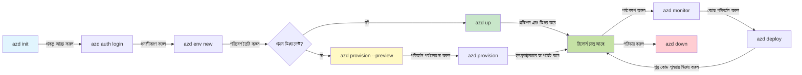
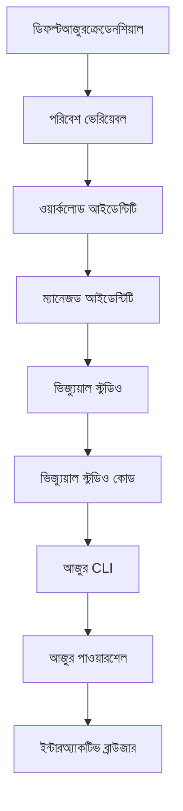

<!--
CO_OP_TRANSLATOR_METADATA:
{
  "original_hash": "e855e899d2705754fe85b04190edd0f0",
  "translation_date": "2025-11-20T12:16:52+00:00",
  "source_file": "docs/getting-started/azd-basics.md",
  "language_code": "bn"
}
-->
# AZD বেসিকস - Azure Developer CLI বোঝা

# AZD বেসিকস - মূল ধারণা এবং ভিত্তি

**অধ্যায় নেভিগেশন:**
- **📚 কোর্স হোম**: [AZD For Beginners](../../README.md)
- **📖 বর্তমান অধ্যায়**: অধ্যায় ১ - ভিত্তি ও দ্রুত শুরু
- **⬅️ পূর্ববর্তী**: [কোর্স ওভারভিউ](../../README.md#-chapter-1-foundation--quick-start)
- **➡️ পরবর্তী**: [ইনস্টলেশন ও সেটআপ](installation.md)
- **🚀 পরবর্তী অধ্যায়**: [অধ্যায় ২: AI-প্রথম ডেভেলপমেন্ট](../microsoft-foundry/microsoft-foundry-integration.md)

## পরিচিতি

এই পাঠে Azure Developer CLI (azd) এর সাথে পরিচয় করানো হবে, একটি শক্তিশালী কমান্ড-লাইন টুল যা স্থানীয় ডেভেলপমেন্ট থেকে Azure-এ ডিপ্লয়মেন্ট পর্যন্ত আপনার যাত্রাকে ত্বরান্বিত করে। আপনি মৌলিক ধারণা, মূল বৈশিষ্ট্যগুলি শিখবেন এবং বুঝবেন কীভাবে azd ক্লাউড-নেটিভ অ্যাপ্লিকেশন ডিপ্লয়মেন্টকে সহজ করে তোলে।

## শেখার লক্ষ্য

এই পাঠ শেষে, আপনি:
- Azure Developer CLI কী এবং এর প্রধান উদ্দেশ্য বুঝতে পারবেন
- টেমপ্লেট, এনভায়রনমেন্ট এবং সার্ভিসের মূল ধারণাগুলি শিখবেন
- টেমপ্লেট-চালিত ডেভেলপমেন্ট এবং Infrastructure as Code সহ মূল বৈশিষ্ট্যগুলি অন্বেষণ করবেন
- azd প্রকল্পের গঠন এবং কর্মপ্রবাহ বুঝতে পারবেন
- আপনার ডেভেলপমেন্ট এনভায়রনমেন্টের জন্য azd ইনস্টল এবং কনফিগার করতে প্রস্তুত হবেন

## শেখার ফলাফল

এই পাঠ সম্পন্ন করার পরে, আপনি:
- আধুনিক ক্লাউড ডেভেলপমেন্ট কর্মপ্রবাহে azd এর ভূমিকা ব্যাখ্যা করতে পারবেন
- azd প্রকল্পের গঠনের উপাদানগুলি চিহ্নিত করতে পারবেন
- টেমপ্লেট, এনভায়রনমেন্ট এবং সার্ভিস কীভাবে একসাথে কাজ করে তা বর্ণনা করতে পারবেন
- azd এর সাথে Infrastructure as Code এর সুবিধাগুলি বুঝতে পারবেন
- বিভিন্ন azd কমান্ড এবং তাদের উদ্দেশ্য চিনতে পারবেন

## Azure Developer CLI (azd) কী?

Azure Developer CLI (azd) একটি কমান্ড-লাইন টুল যা স্থানীয় ডেভেলপমেন্ট থেকে Azure-এ ডিপ্লয়মেন্ট পর্যন্ত আপনার যাত্রাকে ত্বরান্বিত করতে ডিজাইন করা হয়েছে। এটি Azure-এ ক্লাউড-নেটিভ অ্যাপ্লিকেশন তৈরি, ডিপ্লয় এবং পরিচালনা করার প্রক্রিয়াকে সহজ করে তোলে।

### 🎯 কেন AZD ব্যবহার করবেন? বাস্তব-জীবনের তুলনা

চলুন একটি সাধারণ ওয়েব অ্যাপ ডাটাবেস সহ ডিপ্লয় করার তুলনা করি:

#### ❌ AZD ছাড়া: ম্যানুয়াল Azure ডিপ্লয়মেন্ট (৩০+ মিনিট)

```bash
# ধাপ ১: রিসোর্স গ্রুপ তৈরি করুন
az group create --name myapp-rg --location eastus

# ধাপ ২: অ্যাপ সার্ভিস প্ল্যান তৈরি করুন
az appservice plan create --name myapp-plan \
  --resource-group myapp-rg \
  --sku B1 --is-linux

# ধাপ ৩: ওয়েব অ্যাপ তৈরি করুন
az webapp create --name myapp-web-unique123 \
  --resource-group myapp-rg \
  --plan myapp-plan \
  --runtime "NODE:18-lts"

# ধাপ ৪: কসমস ডিবি অ্যাকাউন্ট তৈরি করুন (১০-১৫ মিনিট)
az cosmosdb create --name myapp-cosmos-unique123 \
  --resource-group myapp-rg \
  --kind MongoDB

# ধাপ ৫: ডাটাবেস তৈরি করুন
az cosmosdb mongodb database create \
  --account-name myapp-cosmos-unique123 \
  --resource-group myapp-rg \
  --name tododb

# ধাপ ৬: সংগ্রহ তৈরি করুন
az cosmosdb mongodb collection create \
  --account-name myapp-cosmos-unique123 \
  --resource-group myapp-rg \
  --database-name tododb \
  --name todos

# ধাপ ৭: সংযোগ স্ট্রিং পান
CONN_STR=$(az cosmosdb keys list \
  --name myapp-cosmos-unique123 \
  --resource-group myapp-rg \
  --type connection-strings \
  --query "connectionStrings[0].connectionString" -o tsv)

# ধাপ ৮: অ্যাপ সেটিংস কনফিগার করুন
az webapp config appsettings set \
  --name myapp-web-unique123 \
  --resource-group myapp-rg \
  --settings MONGODB_URI="$CONN_STR"

# ধাপ ৯: লগিং সক্রিয় করুন
az webapp log config --name myapp-web-unique123 \
  --resource-group myapp-rg \
  --application-logging filesystem \
  --detailed-error-messages true

# ধাপ ১০: অ্যাপ্লিকেশন ইনসাইটস সেট আপ করুন
az monitor app-insights component create \
  --app myapp-insights \
  --location eastus \
  --resource-group myapp-rg

# ধাপ ১১: অ্যাপ ইনসাইটসকে ওয়েব অ্যাপের সাথে সংযুক্ত করুন
INSTRUMENTATION_KEY=$(az monitor app-insights component show \
  --app myapp-insights \
  --resource-group myapp-rg \
  --query "instrumentationKey" -o tsv)

az webapp config appsettings set \
  --name myapp-web-unique123 \
  --resource-group myapp-rg \
  --settings APPINSIGHTS_INSTRUMENTATIONKEY="$INSTRUMENTATION_KEY"

# ধাপ ১২: অ্যাপ্লিকেশন লোকালভাবে তৈরি করুন
npm install
npm run build

# ধাপ ১৩: ডিপ্লয়মেন্ট প্যাকেজ তৈরি করুন
zip -r app.zip . -x "*.git*" "node_modules/*"

# ধাপ ১৪: অ্যাপ্লিকেশন ডিপ্লয় করুন
az webapp deployment source config-zip \
  --resource-group myapp-rg \
  --name myapp-web-unique123 \
  --src app.zip

# ধাপ ১৫: অপেক্ষা করুন এবং প্রার্থনা করুন এটি কাজ করে 🙏
# (কোনো স্বয়ংক্রিয় যাচাইকরণ নেই, ম্যানুয়াল টেস্টিং প্রয়োজন)
```

**সমস্যা:**
- ❌ ১৫+ কমান্ড মনে রাখা এবং সঠিকভাবে চালানো
- ❌ ৩০-৪৫ মিনিটের ম্যানুয়াল কাজ
- ❌ ভুল করার সম্ভাবনা (টাইপো, ভুল প্যারামিটার)
- ❌ টার্মিনাল ইতিহাসে সংযোগ স্ট্রিং প্রকাশিত
- ❌ কিছু ব্যর্থ হলে স্বয়ংক্রিয় রোলব্যাক নেই
- ❌ টিম সদস্যদের জন্য পুনরায় তৈরি করা কঠিন
- ❌ প্রতিবার ভিন্ন (পুনরুত্পাদনযোগ্য নয়)

#### ✅ AZD সহ: স্বয়ংক্রিয় ডিপ্লয়মেন্ট (৫ কমান্ড, ১০-১৫ মিনিট)

```bash
# ধাপ ১: টেমপ্লেট থেকে প্রাথমিককরণ করুন
azd init --template todo-nodejs-mongo

# ধাপ ২: প্রমাণীকরণ করুন
azd auth login

# ধাপ ৩: পরিবেশ তৈরি করুন
azd env new dev

# ধাপ ৪: পরিবর্তনগুলি প্রিভিউ করুন (ঐচ্ছিক কিন্তু সুপারিশকৃত)
azd provision --preview

# ধাপ ৫: সবকিছু মোতায়েন করুন
azd up

# ✨ সম্পন্ন! সবকিছু মোতায়েন, কনফিগার এবং পর্যবেক্ষণ করা হয়েছে
```

**সুবিধা:**
- ✅ **৫ কমান্ড** বনাম ১৫+ ম্যানুয়াল ধাপ
- ✅ **১০-১৫ মিনিট** মোট সময় (মূলত Azure এর জন্য অপেক্ষা)
- ✅ **শূন্য ত্রুটি** - স্বয়ংক্রিয় এবং পরীক্ষিত
- ✅ **Key Vault এর মাধ্যমে সিক্রেটগুলি নিরাপদে পরিচালিত**
- ✅ **ব্যর্থতার ক্ষেত্রে স্বয়ংক্রিয় রোলব্যাক**
- ✅ **সম্পূর্ণ পুনরুত্পাদনযোগ্য** - প্রতিবার একই ফলাফল
- ✅ **টিম-রেডি** - যে কেউ একই কমান্ড দিয়ে ডিপ্লয় করতে পারে
- ✅ **Infrastructure as Code** - ভার্সন কন্ট্রোলড Bicep টেমপ্লেট
- ✅ **বিল্ট-ইন মনিটরিং** - Application Insights স্বয়ংক্রিয়ভাবে কনফিগার করা

### 📊 সময় ও ত্রুটি হ্রাস

| মেট্রিক | ম্যানুয়াল ডিপ্লয়মেন্ট | AZD ডিপ্লয়মেন্ট | উন্নতি |
|:-------|:------------------|:---------------|:------------|
| **কমান্ড** | ১৫+ | ৫ | ৬৭% কম |
| **সময়** | ৩০-৪৫ মিনিট | ১০-১৫ মিনিট | ৬০% দ্রুত |
| **ত্রুটি হার** | ~৪০% | <৫% | ৮৮% হ্রাস |
| **সঙ্গতি** | কম (ম্যানুয়াল) | ১০০% (স্বয়ংক্রিয়) | নিখুঁত |
| **টিম অনবোর্ডিং** | ২-৪ ঘণ্টা | ৩০ মিনিট | ৭৫% দ্রুত |
| **রোলব্যাক সময়** | ৩০+ মিনিট (ম্যানুয়াল) | ২ মিনিট (স্বয়ংক্রিয়) | ৯৩% দ্রুত |

## মূল ধারণা

### টেমপ্লেট
টেমপ্লেটগুলি azd এর ভিত্তি। এগুলিতে অন্তর্ভুক্ত:
- **অ্যাপ্লিকেশন কোড** - আপনার সোর্স কোড এবং ডিপেন্ডেন্সি
- **ইনফ্রাস্ট্রাকচার সংজ্ঞা** - Bicep বা Terraform-এ সংজ্ঞায়িত Azure রিসোর্স
- **কনফিগারেশন ফাইল** - সেটিংস এবং এনভায়রনমেন্ট ভেরিয়েবল
- **ডিপ্লয়মেন্ট স্ক্রিপ্ট** - স্বয়ংক্রিয় ডিপ্লয়মেন্ট কর্মপ্রবাহ

### এনভায়রনমেন্ট
এনভায়রনমেন্টগুলি বিভিন্ন ডিপ্লয়মেন্ট টার্গেটকে উপস্থাপন করে:
- **ডেভেলপমেন্ট** - টেস্টিং এবং ডেভেলপমেন্টের জন্য
- **স্টেজিং** - প্রি-প্রোডাকশন এনভায়রনমেন্ট
- **প্রোডাকশন** - লাইভ প্রোডাকশন এনভায়রনমেন্ট

প্রতিটি এনভায়রনমেন্ট বজায় রাখে:
- Azure রিসোর্স গ্রুপ
- কনফিগারেশন সেটিংস
- ডিপ্লয়মেন্ট স্টেট

### সার্ভিস
সার্ভিসগুলি আপনার অ্যাপ্লিকেশনের বিল্ডিং ব্লক:
- **ফ্রন্টএন্ড** - ওয়েব অ্যাপ্লিকেশন, SPAs
- **ব্যাকএন্ড** - APIs, মাইক্রোসার্ভিস
- **ডাটাবেস** - ডেটা স্টোরেজ সলিউশন
- **স্টোরেজ** - ফাইল এবং ব্লব স্টোরেজ

## মূল বৈশিষ্ট্য

### ১. টেমপ্লেট-চালিত ডেভেলপমেন্ট
```bash
# উপলব্ধ টেমপ্লেটগুলি ব্রাউজ করুন
azd template list

# একটি টেমপ্লেট থেকে আরম্ভ করুন
azd init --template <template-name>
```

### ২. Infrastructure as Code
- **Bicep** - Azure এর ডোমেইন-স্পেসিফিক ল্যাঙ্গুয়েজ
- **Terraform** - মাল্টি-ক্লাউড ইনফ্রাস্ট্রাকচার টুল
- **ARM টেমপ্লেট** - Azure Resource Manager টেমপ্লেট

### ৩. ইন্টিগ্রেটেড কর্মপ্রবাহ
```bash
# সম্পূর্ণ ডিপ্লয়মেন্ট ওয়ার্কফ্লো
azd up            # প্রভিশন + ডিপ্লয় এটি প্রথমবার সেটআপের জন্য সম্পূর্ণ হাতছাড়া

# 🧪 নতুন: ডিপ্লয়মেন্টের আগে অবকাঠামো পরিবর্তনের প্রিভিউ দেখুন (নিরাপদ)
azd provision --preview    # অবকাঠামো ডিপ্লয়মেন্ট সিমুলেট করুন পরিবর্তন না করে

azd provision     # আজুর রিসোর্স তৈরি করুন যদি আপনি অবকাঠামো আপডেট করেন এটি ব্যবহার করুন
azd deploy        # অ্যাপ্লিকেশন কোড ডিপ্লয় করুন বা আপডেটের পরে অ্যাপ্লিকেশন কোড পুনরায় ডিপ্লয় করুন
azd down          # রিসোর্স পরিষ্কার করুন
```

#### 🛡️ নিরাপদ ইনফ্রাস্ট্রাকচার পরিকল্পনা প্রিভিউ সহ
`azd provision --preview` কমান্ডটি নিরাপদ ডিপ্লয়মেন্টের জন্য একটি গেম-চেঞ্জার:
- **ড্রাই-রান বিশ্লেষণ** - কী তৈরি, পরিবর্তন বা মুছে ফেলা হবে তা দেখায়
- **শূন্য ঝুঁকি** - আপনার Azure এনভায়রনমেন্টে কোনও প্রকৃত পরিবর্তন হয় না
- **টিম সহযোগিতা** - ডিপ্লয়মেন্টের আগে প্রিভিউ ফলাফল শেয়ার করুন
- **খরচ অনুমান** - প্রতিশ্রুতির আগে রিসোর্স খরচ বুঝুন

```bash
# উদাহরণ প্রিভিউ ওয়ার্কফ্লো
azd provision --preview           # কী পরিবর্তন হবে তা দেখুন
# আউটপুট পর্যালোচনা করুন, টিমের সাথে আলোচনা করুন
azd provision                     # আত্মবিশ্বাসের সাথে পরিবর্তন প্রয়োগ করুন
```

### 📊 ভিজ্যুয়াল: AZD ডেভেলপমেন্ট কর্মপ্রবাহ


**কর্মপ্রবাহ ব্যাখ্যা:**
1. **Init** - টেমপ্লেট বা নতুন প্রকল্প দিয়ে শুরু করুন
2. **Auth** - Azure এর সাথে প্রমাণীকরণ করুন
3. **Environment** - বিচ্ছিন্ন ডিপ্লয়মেন্ট এনভায়রনমেন্ট তৈরি করুন
4. **Preview** - 🆕 ইনফ্রাস্ট্রাকচার পরিবর্তনগুলি সর্বদা প্রথমে প্রিভিউ করুন (নিরাপদ অভ্যাস)
5. **Provision** - Azure রিসোর্স তৈরি/আপডেট করুন
6. **Deploy** - আপনার অ্যাপ্লিকেশন কোড পুশ করুন
7. **Monitor** - অ্যাপ্লিকেশন পারফরম্যান্স পর্যবেক্ষণ করুন
8. **Iterate** - পরিবর্তন করুন এবং কোড পুনরায় ডিপ্লয় করুন
9. **Cleanup** - কাজ শেষ হলে রিসোর্স সরান

### ৪. এনভায়রনমেন্ট ম্যানেজমেন্ট
```bash
# পরিবেশ তৈরি এবং পরিচালনা করুন
azd env new <environment-name>
azd env select <environment-name>
azd env list
```

## 📁 প্রকল্প গঠন

একটি সাধারণ azd প্রকল্প গঠন:
```
my-app/
├── .azd/                    # azd configuration
│   └── config.json
├── .azure/                  # Azure deployment artifacts
├── .devcontainer/          # Development container config
├── .github/workflows/      # GitHub Actions
├── .vscode/               # VS Code settings
├── infra/                 # Infrastructure code
│   ├── main.bicep        # Main infrastructure template
│   ├── main.parameters.json
│   └── modules/          # Reusable modules
├── src/                  # Application source code
│   ├── api/             # Backend services
│   └── web/             # Frontend application
├── azure.yaml           # azd project configuration
└── README.md
```

## 🔧 কনফিগারেশন ফাইল

### azure.yaml
প্রধান প্রকল্প কনফিগারেশন ফাইল:
```yaml
name: my-awesome-app
metadata:
  template: my-template@1.0.0

services:
  web:
    project: ./src/web
    language: js
    host: appservice
  api:
    project: ./src/api
    language: js
    host: appservice

hooks:
  preprovision:
    shell: pwsh
    run: echo "Preparing to provision..."
```

### .azure/config.json
এনভায়রনমেন্ট-নির্দিষ্ট কনফিগারেশন:
```json
{
  "version": 1,
  "defaultEnvironment": "dev",
  "environments": {
    "dev": {
      "subscriptionId": "your-subscription-id",
      "location": "eastus"
    }
  }
}
```

## 🎪 সাধারণ কর্মপ্রবাহ হাতে-কলমে অনুশীলন

> **💡 শেখার টিপ:** এই অনুশীলনগুলি ক্রমানুসারে অনুসরণ করুন যাতে আপনার AZD দক্ষতা ধাপে ধাপে বৃদ্ধি পায়।

### 🎯 অনুশীলন ১: আপনার প্রথম প্রকল্পটি শুরু করুন

**লক্ষ্য:** একটি AZD প্রকল্প তৈরি করুন এবং এর গঠন অন্বেষণ করুন

**ধাপ:**
```bash
# একটি প্রমাণিত টেমপ্লেট ব্যবহার করুন
azd init --template todo-nodejs-mongo

# তৈরি করা ফাইলগুলি অন্বেষণ করুন
ls -la  # সমস্ত ফাইল দেখুন, লুকানো ফাইল সহ

# তৈরি করা প্রধান ফাইলগুলি:
# - azure.yaml (প্রধান কনফিগারেশন)
# - infra/ (ইনফ্রাস্ট্রাকচার কোড)
# - src/ (অ্যাপ্লিকেশন কোড)
```

**✅ সফলতা:** আপনার কাছে azure.yaml, infra/, এবং src/ ডিরেক্টরি থাকবে

---

### 🎯 অনুশীলন ২: Azure-এ ডিপ্লয় করুন

**লক্ষ্য:** সম্পূর্ণ এন্ড-টু-এন্ড ডিপ্লয়মেন্ট সম্পন্ন করুন

**ধাপ:**
```bash
# ১. প্রমাণীকরণ করুন
az login && azd auth login

# ২. পরিবেশ তৈরি করুন
azd env new dev
azd env set AZURE_LOCATION eastus

# ৩. পরিবর্তনগুলি প্রিভিউ করুন (প্রস্তাবিত)
azd provision --preview

# ৪. সবকিছু মোতায়েন করুন
azd up

# ৫. মোতায়েন যাচাই করুন
azd show    # আপনার অ্যাপের URL দেখুন
```

**প্রত্যাশিত সময়:** ১০-১৫ মিনিট  
**✅ সফলতা:** অ্যাপ্লিকেশন URL ব্রাউজারে খুলবে

---

### 🎯 অনুশীলন ৩: একাধিক এনভায়রনমেন্ট

**লক্ষ্য:** dev এবং staging-এ ডিপ্লয় করুন

**ধাপ:**
```bash
# ইতিমধ্যে ডেভ আছে, স্টেজিং তৈরি করুন
azd env new staging
azd env set AZURE_LOCATION westus2
azd up

# তাদের মধ্যে সুইচ করুন
azd env list
azd env select dev
```

**✅ সফলতা:** Azure পোর্টালে দুটি পৃথক রিসোর্স গ্রুপ

---

### 🛡️ ক্লিন স্লেট: `azd down --force --purge`

যখন সম্পূর্ণরূপে রিসেট করার প্রয়োজন হয়:

```bash
azd down --force --purge
```

**এটি কী করে:**
- `--force`: কোনও নিশ্চিতকরণ প্রম্পট নেই
- `--purge`: সমস্ত স্থানীয় স্টেট এবং Azure রিসোর্স মুছে দেয়

**যখন ব্যবহার করবেন:**
- ডিপ্লয়মেন্ট মাঝপথে ব্যর্থ হয়েছে
- প্রকল্প পরিবর্তন করছেন
- নতুন শুরু দরকার

---

## 🎪 মূল কর্মপ্রবাহ রেফারেন্স

### একটি নতুন প্রকল্প শুরু করা
```bash
# পদ্ধতি ১: বিদ্যমান টেমপ্লেট ব্যবহার করুন
azd init --template todo-nodejs-mongo

# পদ্ধতি ২: শুরু থেকে শুরু করুন
azd init

# পদ্ধতি ৩: বর্তমান ডিরেক্টরি ব্যবহার করুন
azd init .
```

### ডেভেলপমেন্ট চক্র
```bash
# ডেভেলপমেন্ট পরিবেশ সেট আপ করুন
azd auth login
azd env new dev
azd env select dev

# সবকিছু ডিপ্লয় করুন
azd up

# পরিবর্তন করুন এবং পুনরায় ডিপ্লয় করুন
azd deploy

# কাজ শেষ হলে পরিষ্কার করুন
azd down --force --purge # Azure Developer CLI-তে কমান্ডটি আপনার পরিবেশের জন্য একটি **হার্ড রিসেট**—বিশেষত ব্যর্থ ডিপ্লয়মেন্ট সমস্যা সমাধান, অনাথ রিসোর্স পরিষ্কার করা, বা নতুন করে পুনরায় ডিপ্লয় করার জন্য উপযোগী।
```

## `azd down --force --purge` বোঝা
`azd down --force --purge` কমান্ডটি আপনার azd এনভায়রনমেন্ট এবং সমস্ত সংশ্লিষ্ট রিসোর্স সম্পূর্ণরূপে সরিয়ে ফেলার একটি শক্তিশালী উপায়। এখানে প্রতিটি ফ্ল্যাগ কী করে তার বিশ্লেষণ:
```
--force
```
- নিশ্চিতকরণ প্রম্পট এড়িয়ে যায়।
- অটোমেশন বা স্ক্রিপ্টিংয়ের জন্য উপযোগী যেখানে ম্যানুয়াল ইনপুট সম্ভব নয়।
- CLI অসঙ্গতি সনাক্ত করলেও টিয়ারডাউন বাধাহীনভাবে এগিয়ে যায়।

```
--purge
```
**সমস্ত সংশ্লিষ্ট মেটাডেটা** মুছে দেয়, যার মধ্যে রয়েছে:
এনভায়রনমেন্ট স্টেট
স্থানীয় `.azure` ফোল্ডার
ক্যাশড ডিপ্লয়মেন্ট তথ্য
আগের ডিপ্লয়মেন্ট "মনে রাখা" থেকে azd কে বাধা দেয়, যা মিসম্যাচড রিসোর্স গ্রুপ বা পুরানো রেজিস্ট্রি রেফারেন্সের মতো সমস্যার কারণ হতে পারে।

### কেন উভয় ব্যবহার করবেন?
যখন `azd up` এর সাথে লেগে গেছেন অবশিষ্ট স্টেট বা আংশিক ডিপ্লয়মেন্টের কারণে, এই কম্বো একটি **ক্লিন স্লেট** নিশ্চিত করে।

এটি বিশেষভাবে সহায়ক ম্যানুয়াল রিসোর্স মুছে ফেলার পরে Azure পোর্টালে বা টেমপ্লেট, এনভায়রনমেন্ট বা রিসোর্স গ্রুপ নামকরণ কনভেনশন পরিবর্তন করার সময়।

### একাধিক এনভায়রনমেন্ট পরিচালনা
```bash
# স্টেজিং পরিবেশ তৈরি করুন
azd env new staging
azd env select staging
azd up

# ডেভে ফিরে যান
azd env select dev

# পরিবেশগুলি তুলনা করুন
azd env list
```

## 🔐 প্রমাণীকরণ এবং ক্রেডেনশিয়াল

সফল azd ডিপ্লয়মেন্টের জন্য প্রমাণীকরণ বোঝা গুরুত্বপূর্ণ। Azure একাধিক প্রমাণীকরণ পদ্ধতি ব্যবহার করে এবং azd অন্যান্য Azure টুল দ্বারা ব্যবহৃত একই ক্রেডেনশিয়াল চেইন ব্যবহার করে।

### Azure CLI প্রমাণীকরণ (`az login`)

azd ব্যবহার করার আগে, আপনাকে Azure-এ প্রমাণীকরণ করতে হবে। সবচেয়ে সাধারণ পদ্ধতি হল Azure CLI ব্যবহার করা:

```bash
# ইন্টারেক্টিভ লগইন (ব্রাউজার খুলবে)
az login

# নির্দিষ্ট টেন্যান্ট দিয়ে লগইন করুন
az login --tenant <tenant-id>

# সার্ভিস প্রিন্সিপাল দিয়ে লগইন করুন
az login --service-principal -u <app-id> -p <password> --tenant <tenant-id>

# বর্তমান লগইন স্ট্যাটাস পরীক্ষা করুন
az account show

# উপলব্ধ সাবস্ক্রিপশনগুলির তালিকা দেখুন
az account list --output table

# ডিফল্ট সাবস্ক্রিপশন সেট করুন
az account set --subscription <subscription-id>
```

### প্রমাণীকরণ প্রবাহ
1. **ইন্টারঅ্যাকটিভ লগইন**: প্রমাণীকরণের জন্য আপনার ডিফল্ট ব্রাউজার খুলবে
2. **ডিভাইস কোড প্রবাহ**: ব্রাউজার অ্যাক্সেস ছাড়া এনভায়রনমেন্টের জন্য
3. **সার্ভিস প্রিন্সিপাল**: অটোমেশন এবং CI/CD দৃশ্যের জন্য
4. **ম্যানেজড আইডেন্টিটি**: Azure-হোস্টেড অ্যাপ্লিকেশনের জন্য

### DefaultAzureCredential চেইন

`DefaultAzureCredential` একটি ক্রেডেনশিয়াল টাইপ যা নির্দিষ্ট ক্রমে একাধিক ক্রেডেনশিয়াল সোর্স স্বয়ংক্রিয়ভাবে চেষ্টা করে একটি সরলীকৃত প্রমাণীকরণ অভিজ্ঞতা প্রদান করে:

#### ক্রেডেনশিয়াল চেইন ক্রম

#### ১. এনভায়রনমেন্ট ভেরিয়েবল
```bash
# পরিষেবা প্রিন্সিপালের জন্য পরিবেশ ভেরিয়েবল সেট করুন
export AZURE_CLIENT_ID="<app-id>"
export AZURE_CLIENT_SECRET="<password>"
export AZURE_TENANT_ID="<tenant-id>"
```

#### ২. ওয়ার্কলোড আইডেন্টিটি (Kubernetes/GitHub Actions)
স্বয়ংক্রিয়ভাবে ব্যবহৃত:
- Azure Kubernetes Service (AKS) ওয়ার্কলোড আইডেন্টিটি সহ
- GitHub Actions OIDC ফেডারেশনের সাথে
- অন্যান্য ফেডারেটেড আইডেন্টিটি দৃশ্য

#### ৩. ম্যানেজড আইডেন্টিটি
Azure রিসোর্সের জন্য যেমন:
- ভার্চুয়াল মেশিন
- অ্যাপ সার্ভিস
- Azure ফাংশন
- কন্টেইনার ইনস্ট্যান্স

```bash
# আজুর রিসোর্সে ম্যানেজড আইডেন্টিটি দিয়ে চলছে কিনা পরীক্ষা করুন
az account show --query "user.type" --output tsv
# ফেরত দেয়: "servicePrincipal" যদি ম্যানেজড আইডেন্টিটি ব্যবহার করা হয়
```

#### ৪. ডেভেলপার টুল ইন্টিগ্রেশন
- **Visual Studio**: স্বয়ংক্রিয়ভাবে সাইন-ইন করা অ্যাকাউন্ট ব্যবহার করে
- **VS Code**: Azure Account এক্সটেনশন ক্রেডেনশিয়াল ব্যবহার করে
- **Azure CLI**: `az login` ক্রেডেনশিয়াল ব্যবহার করে (স্থানীয় ডেভেলপমেন্টের জন্য সবচেয়ে সাধারণ)

### AZD প্রমাণীকরণ সেটআপ

```bash
# পদ্ধতি ১: Azure CLI ব্যবহার করুন (উন্নয়নের জন্য সুপারিশকৃত)
az login
azd auth login  # বিদ্যমান Azure CLI শংসাপত্র ব্যবহার করে

# পদ্ধতি ২: সরাসরি azd প্রমাণীকরণ
azd auth login --use-device-code  # হেডলেস পরিবেশের জন্য

# পদ্ধতি ৩: প্রমাণীকরণ স্থিতি পরীক্ষা করুন
azd auth login --check-status

# পদ্ধতি ৪: লগআউট করুন এবং পুনরায় প্রমাণীকরণ করুন
azd auth logout
azd auth login
```

### প্রমাণীকরণ সেরা অনুশীলন

#### স্থানীয় ডেভেলপমেন্টের জন্য
```bash
# 1. Azure CLI দিয়ে লগইন করুন
az login

# 2. সঠিক সাবস্ক্রিপশন যাচাই করুন
az account show
az account set --subscription "Your Subscription Name"

# 3. বিদ্যমান ক্রেডেনশিয়াল দিয়ে azd ব্যবহার করুন
azd auth login
```

#### CI/CD পাইপলাইনের জন্য
```yaml
# GitHub Actions example
- name: Azure Login
  uses: azure/login@v1
  with:
    creds: ${{ secrets.AZURE_CREDENTIALS }}

- name: Deploy with azd
  run: |
    azd auth login --client-id ${{ secrets.AZURE_CLIENT_ID }} \
                    --client-secret ${{ secrets.AZURE_CLIENT_SECRET }} \
                    --tenant-id ${{ secrets.AZURE_TENANT_ID }}
    azd up --no-prompt
```

#### প্রোডাকশন এনভায়রনমেন্টের জন্য
- Azure রিসোর্সে চলার সময় **ম্যানেজড আইডেন্টিটি** ব্যবহার করুন
- অটোমেশন দৃশ্যের জন্য **সার্ভিস প্রিন্সিপাল** ব্যবহার করুন
- কোড বা কনফিগারেশন ফাইলে ক্রেডেনশিয়াল সংরক্ষণ এড়িয়ে চলুন
- সংবেদনশীল কনফিগারেশনের জন্য **Azure Key Vault** ব্যবহার করুন

### সাধারণ প্রমাণীকরণ সমস্যা এবং সমাধান

#### সমস্যা: "কোনো সাবস্ক্রিপশন পাওয়া যায়নি"
```bash
# সমাধান: ডিফল্ট সাবস্ক্রিপশন সেট করুন
az account list --output table
az account set --subscription "<subscription-id>"
azd env set AZURE_SUBSCRIPTION_ID "<subscription-id>"
```

#### সমস্যা: "অপর্যাপ্ত অনুমতি"
```bash
# সমাধান: প্রয়োজনীয় ভূমিকা পরীক্ষা করুন এবং বরাদ্দ করুন
az role assignment list --assignee $(az account show --query user.name --output tsv)

# সাধারণ প্রয়োজনীয় ভূমিকা:
# - অবদানকারী (সম্পদ ব্যবস্থাপনার জন্য)
# - ব্যবহারকারী অ্যাক্সেস প্রশাসক (ভূমিকা বরাদ্দের জন্য)
```

#### সমস্যা: "টোকেন মেয়াদোত্তীর্ণ"
```bash
# সমাধান: পুনরায় প্রমাণীকরণ করুন
az logout
az login
azd auth logout
azd auth login
```

### বিভিন্ন দৃশ্যে প্রমাণীকরণ

#### স্থানীয় ডেভেলপমেন্ট
```bash
# ব্যক্তিগত উন্নয়ন অ্যাকাউন্ট
az login
azd auth login
```

#### টিম ডেভেলপমেন্ট
```bash
# সংগঠনের জন্য নির্দিষ্ট ভাড়াটিয়া ব্যবহার করুন
az login --tenant contoso.onmicrosoft.com
azd auth login
```

#### মাল্টি-টেন
- [ইনস্টলেশন ও সেটআপ](installation.md) - AZD ইনস্টল এবং কনফিগার করুন
- [আপনার প্রথম প্রকল্প](first-project.md) - সম্পূর্ণ হাতে-কলমে টিউটোরিয়াল
- [কনফিগারেশন গাইড](configuration.md) - উন্নত কনফিগারেশন অপশন

**🎯 পরবর্তী অধ্যায়ের জন্য প্রস্তুত?**
- [অধ্যায় ২: AI-প্রথম ডেভেলপমেন্ট](../microsoft-foundry/microsoft-foundry-integration.md) - AI অ্যাপ্লিকেশন তৈরি শুরু করুন

## অতিরিক্ত রিসোর্স

- [Azure Developer CLI ওভারভিউ](https://learn.microsoft.com/en-us/azure/developer/azure-developer-cli/)
- [টেমপ্লেট গ্যালারি](https://azure.github.io/awesome-azd/)
- [কমিউনিটি স্যাম্পল](https://github.com/Azure-Samples)

---

## 🙋 প্রায়শই জিজ্ঞাসিত প্রশ্নাবলী

### সাধারণ প্রশ্ন

**প্রশ্ন: AZD এবং Azure CLI এর মধ্যে পার্থক্য কী?**

উত্তর: Azure CLI (`az`) ব্যবহার করা হয় পৃথক Azure রিসোর্স পরিচালনার জন্য। AZD (`azd`) ব্যবহৃত হয় সম্পূর্ণ অ্যাপ্লিকেশন পরিচালনার জন্য:

```bash
# Azure CLI - নিম্ন-স্তরের রিসোর্স ব্যবস্থাপনা
az webapp create --name myapp --resource-group rg
az sql server create --name myserver --resource-group rg
# ...আরও অনেক কমান্ড প্রয়োজন

# AZD - অ্যাপ্লিকেশন-স্তরের ব্যবস্থাপনা
azd up  # সম্পূর্ণ অ্যাপ সমস্ত রিসোর্স সহ ডিপ্লয় করে
```

**এভাবে ভাবুন:**
- `az` = পৃথক লেগো ব্রিকসের উপর কাজ করা
- `azd` = সম্পূর্ণ লেগো সেটের সাথে কাজ করা

---

**প্রশ্ন: AZD ব্যবহার করতে Bicep বা Terraform জানতে হবে কি?**

উত্তর: না! টেমপ্লেট দিয়ে শুরু করুন:
```bash
# বিদ্যমান টেমপ্লেট ব্যবহার করুন - IaC জ্ঞানের প্রয়োজন নেই
azd init --template todo-nodejs-mongo
azd up
```

আপনি পরে Bicep শিখে অবকাঠামো কাস্টমাইজ করতে পারেন। টেমপ্লেটগুলি শেখার জন্য কার্যকর উদাহরণ প্রদান করে।

---

**প্রশ্ন: AZD টেমপ্লেট চালানোর খরচ কত?**

উত্তর: টেমপ্লেট অনুযায়ী খরচ পরিবর্তিত হয়। বেশিরভাগ ডেভেলপমেন্ট টেমপ্লেটের খরচ $50-150/মাস:

```bash
# স্থাপন করার আগে খরচগুলি প্রিভিউ করুন
azd provision --preview

# ব্যবহার না করলে সর্বদা পরিষ্কার করুন
azd down --force --purge  # সমস্ত সম্পদ সরিয়ে দেয়
```

**প্রো টিপ:** যেখানে সম্ভব ফ্রি টিয়ার ব্যবহার করুন:
- অ্যাপ সার্ভিস: F1 (ফ্রি) টিয়ার
- Azure OpenAI: প্রতি মাসে ৫০,০০০ টোকেন ফ্রি
- Cosmos DB: ১০০০ RU/s ফ্রি টিয়ার

---

**প্রশ্ন: আমি কি বিদ্যমান Azure রিসোর্সের সাথে AZD ব্যবহার করতে পারি?**

উত্তর: হ্যাঁ, তবে নতুন করে শুরু করা সহজ। AZD সম্পূর্ণ লাইফসাইকেল পরিচালনা করার সময় সবচেয়ে ভালো কাজ করে। বিদ্যমান রিসোর্সের জন্য:

```bash
# বিকল্প ১: বিদ্যমান সম্পদ আমদানি করুন (উন্নত)
azd init
# তারপর infra/ পরিবর্তন করুন বিদ্যমান সম্পদের উল্লেখ করতে

# বিকল্প ২: নতুনভাবে শুরু করুন (প্রস্তাবিত)
azd init --template matching-your-stack
azd up  # নতুন পরিবেশ তৈরি করে
```

---

**প্রশ্ন: আমি কীভাবে আমার প্রকল্প টিমমেটদের সাথে শেয়ার করব?**

উত্তর: AZD প্রকল্পটি Git-এ কমিট করুন (কিন্তু .azure ফোল্ডার নয়):

```bash
# ডিফল্টভাবে ইতিমধ্যে .gitignore এ রয়েছে
.azure/        # গোপনীয়তা এবং পরিবেশের ডেটা ধারণ করে
*.env          # পরিবেশ ভেরিয়েবল

# তারপর দলের সদস্যরা:
git clone <your-repo>
azd auth login
azd env new <their-name>-dev
azd up
```

সবাই একই টেমপ্লেট থেকে অভিন্ন অবকাঠামো পাবে।

---

### সমস্যার সমাধান সম্পর্কিত প্রশ্ন

**প্রশ্ন: "azd up" মাঝপথে ব্যর্থ হয়েছে। এখন কী করব?**

উত্তর: ত্রুটি পরীক্ষা করুন, ঠিক করুন, তারপর পুনরায় চেষ্টা করুন:

```bash
# বিস্তারিত লগ দেখুন
azd show

# সাধারণ সমাধানসমূহ:

# ১. যদি কোটার সীমা অতিক্রম হয়:
azd env set AZURE_LOCATION "westus2"  # ভিন্ন অঞ্চল চেষ্টা করুন

# ২. যদি রিসোর্স নামের দ্বন্দ্ব হয়:
azd down --force --purge  # নতুনভাবে শুরু করুন
azd up  # পুনরায় চেষ্টা করুন

# ৩. যদি অনুমোদন মেয়াদোত্তীর্ণ হয়:
az login
azd auth login
azd up
```

**সবচেয়ে সাধারণ সমস্যা:** ভুল Azure সাবস্ক্রিপশন নির্বাচন করা
```bash
az account list --output table
az account set --subscription "<correct-subscription>"
```

---

**প্রশ্ন: আমি কীভাবে শুধুমাত্র কোড পরিবর্তন ডিপ্লয় করব, অবকাঠামো পুনরায় প্রভিশন না করে?**

উত্তর: `azd up` এর পরিবর্তে `azd deploy` ব্যবহার করুন:

```bash
azd up          # প্রথমবার: প্রভিশন + ডিপ্লয় (ধীর)

# কোড পরিবর্তন করুন...

azd deploy      # পরবর্তী সময়: শুধুমাত্র ডিপ্লয় (দ্রুত)
```

গতি তুলনা:
- `azd up`: ১০-১৫ মিনিট (অবকাঠামো প্রভিশন করে)
- `azd deploy`: ২-৫ মিনিট (শুধু কোড)

---

**প্রশ্ন: আমি কি অবকাঠামো টেমপ্লেট কাস্টমাইজ করতে পারি?**

উত্তর: হ্যাঁ! `infra/` এর Bicep ফাইলগুলি সম্পাদনা করুন:

```bash
# আজেড আরম্ভ করার পরে
cd infra/
code main.bicep  # ভিএস কোডে সম্পাদনা করুন

# পরিবর্তনের পূর্বরূপ দেখুন
azd provision --preview

# পরিবর্তনগুলি প্রয়োগ করুন
azd provision
```

**টিপ:** ছোট থেকে শুরু করুন - প্রথমে SKUs পরিবর্তন করুন:
```bicep
// infra/main.bicep
sku: {
  name: 'B1'  // Change to 'P1V2' for production
}
```

---

**প্রশ্ন: AZD তৈরি করা সবকিছু কীভাবে মুছে ফেলব?**

উত্তর: একটি কমান্ড সব রিসোর্স সরিয়ে দেয়:

```bash
azd down --force --purge

# এটি মুছে দেয়:
# - সমস্ত Azure সম্পদ
# - রিসোর্স গ্রুপ
# - স্থানীয় পরিবেশের অবস্থা
# - ক্যাশ করা ডিপ্লয়মেন্ট ডেটা
```

**এটি চালান যখন:**
- একটি টেমপ্লেট পরীক্ষা শেষ হয়েছে
- ভিন্ন প্রকল্পে স্যুইচ করা হচ্ছে
- নতুন করে শুরু করতে চান

**খরচ সাশ্রয়:** অব্যবহৃত রিসোর্স মুছে ফেলা = $0 চার্জ

---

**প্রশ্ন: যদি আমি Azure পোর্টালে রিসোর্স ভুল করে মুছে ফেলি তাহলে কী হবে?**

উত্তর: AZD স্টেট সিঙ্ক থেকে বেরিয়ে যেতে পারে। পরিষ্কার স্লেট পদ্ধতি:

```bash
# ১. স্থানীয় অবস্থা সরান
azd down --force --purge

# ২. নতুনভাবে শুরু করুন
azd up

# বিকল্প: AZD সনাক্ত এবং ঠিক করতে দিন
azd provision  # অনুপস্থিত সম্পদ তৈরি করবে
```

---

### উন্নত প্রশ্ন

**প্রশ্ন: আমি কি AZD CI/CD পাইপলাইনে ব্যবহার করতে পারি?**

উত্তর: হ্যাঁ! GitHub Actions উদাহরণ:

```yaml
# .github/workflows/deploy.yml
name: Deploy with AZD

on:
  push:
    branches: [main]

jobs:
  deploy:
    runs-on: ubuntu-latest
    steps:
      - uses: actions/checkout@v2
      
      - name: Install azd
        run: curl -fsSL https://aka.ms/install-azd.sh | bash
      
      - name: Azure Login
        run: |
          azd auth login \
            --client-id ${{ secrets.AZURE_CLIENT_ID }} \
            --client-secret ${{ secrets.AZURE_CLIENT_SECRET }} \
            --tenant-id ${{ secrets.AZURE_TENANT_ID }}
      
      - name: Deploy
        run: azd up --no-prompt
```

---

**প্রশ্ন: আমি কীভাবে সিক্রেট এবং সংবেদনশীল ডেটা পরিচালনা করব?**

উত্তর: AZD স্বয়ংক্রিয়ভাবে Azure Key Vault এর সাথে ইন্টিগ্রেট করে:

```bash
# গোপনীয় তথ্য কোডে নয়, কী ভল্টে সংরক্ষিত হয়
azd env set DATABASE_PASSWORD "$(openssl rand -base64 32)"

# AZD স্বয়ংক্রিয়ভাবে:
# 1. কী ভল্ট তৈরি করে
# 2. গোপনীয় তথ্য সংরক্ষণ করে
# 3. ম্যানেজড আইডেন্টিটির মাধ্যমে অ্যাপ অ্যাক্সেস প্রদান করে
# 4. রানটাইমে ইনজেক্ট করে
```

**কখনো কমিট করবেন না:**
- `.azure/` ফোল্ডার (পরিবেশ ডেটা ধারণ করে)
- `.env` ফাইল (লোকাল সিক্রেট)
- কানেকশন স্ট্রিং

---

**প্রশ্ন: আমি কি একাধিক অঞ্চলে ডিপ্লয় করতে পারি?**

উত্তর: হ্যাঁ, প্রতি অঞ্চলে একটি পরিবেশ তৈরি করুন:

```bash
# পূর্ব মার্কিন যুক্তরাষ্ট্র পরিবেশ
azd env new prod-eastus
azd env set AZURE_LOCATION eastus
azd up

# পশ্চিম ইউরোপ পরিবেশ
azd env new prod-westeurope
azd env set AZURE_LOCATION westeurope
azd up

# প্রতিটি পরিবেশ স্বাধীন
azd env list
```

সত্যিকারের মাল্টি-রিজিওন অ্যাপের জন্য, Bicep টেমপ্লেট কাস্টমাইজ করুন যাতে একাধিক অঞ্চলে একসাথে ডিপ্লয় করা যায়।

---

**প্রশ্ন: যদি আমি আটকে যাই, সাহায্য কোথায় পাব?**

1. **AZD ডকুমেন্টেশন:** https://learn.microsoft.com/azure/developer/azure-developer-cli/
2. **GitHub Issues:** https://github.com/Azure/azure-dev/issues
3. **Discord:** [Azure Discord](https://discord.gg/microsoft-azure) - #azure-developer-cli চ্যানেল
4. **Stack Overflow:** ট্যাগ `azure-developer-cli`
5. **এই কোর্স:** [সমস্যা সমাধান গাইড](../troubleshooting/common-issues.md)

**প্রো টিপ:** প্রশ্ন করার আগে চালান:
```bash
azd show       # বর্তমান অবস্থা প্রদর্শন করে
azd version    # আপনার সংস্করণ প্রদর্শন করে
```
আপনার প্রশ্নে এই তথ্য অন্তর্ভুক্ত করুন দ্রুত সাহায্যের জন্য।

---

## 🎓 পরবর্তী কী?

আপনি এখন AZD এর মৌলিক বিষয়গুলি বুঝতে পেরেছেন। আপনার পথ নির্বাচন করুন:

### 🎯 নবীনদের জন্য:
1. **পরবর্তী:** [ইনস্টলেশন ও সেটআপ](installation.md) - আপনার মেশিনে AZD ইনস্টল করুন
2. **তারপর:** [আপনার প্রথম প্রকল্প](first-project.md) - আপনার প্রথম অ্যাপ ডিপ্লয় করুন
3. **অনুশীলন:** এই পাঠের সব ৩টি অনুশীলন সম্পূর্ণ করুন

### 🚀 AI ডেভেলপারদের জন্য:
1. **স্কিপ করুন:** [অধ্যায় ২: AI-প্রথম ডেভেলপমেন্ট](../microsoft-foundry/microsoft-foundry-integration.md)
2. **ডিপ্লয় করুন:** `azd init --template get-started-with-ai-chat` দিয়ে শুরু করুন
3. **শিখুন:** ডিপ্লয় করার সময় তৈরি করুন

### 🏗️ অভিজ্ঞ ডেভেলপারদের জন্য:
1. **পর্যালোচনা করুন:** [কনফিগারেশন গাইড](configuration.md) - উন্নত সেটিংস
2. **অন্বেষণ করুন:** [ইনফ্রাস্ট্রাকচার অ্যাজ কোড](../deployment/provisioning.md) - Bicep গভীরভাবে জানুন
3. **তৈরি করুন:** আপনার স্ট্যাকের জন্য কাস্টম টেমপ্লেট তৈরি করুন

---

**অধ্যায় নেভিগেশন:**
- **📚 কোর্স হোম**: [AZD নবীনদের জন্য](../../README.md)
- **📖 বর্তমান অধ্যায়**: অধ্যায় ১ - ভিত্তি ও দ্রুত শুরু  
- **⬅️ পূর্ববর্তী**: [কোর্স ওভারভিউ](../../README.md#-chapter-1-foundation--quick-start)
- **➡️ পরবর্তী**: [ইনস্টলেশন ও সেটআপ](installation.md)
- **🚀 পরবর্তী অধ্যায়**: [অধ্যায় ২: AI-প্রথম ডেভেলপমেন্ট](../microsoft-foundry/microsoft-foundry-integration.md)

---

<!-- CO-OP TRANSLATOR DISCLAIMER START -->
**অস্বীকৃতি**:  
এই নথিটি AI অনুবাদ পরিষেবা [Co-op Translator](https://github.com/Azure/co-op-translator) ব্যবহার করে অনুবাদ করা হয়েছে। আমরা যথাসাধ্য সঠিকতার জন্য চেষ্টা করি, তবে অনুগ্রহ করে সচেতন থাকুন যে স্বয়ংক্রিয় অনুবাদে ত্রুটি বা অসঙ্গতি থাকতে পারে। মূল ভাষায় থাকা নথিটিকে প্রামাণিক উৎস হিসেবে বিবেচনা করা উচিত। গুরুত্বপূর্ণ তথ্যের জন্য, পেশাদার মানব অনুবাদ সুপারিশ করা হয়। এই অনুবাদ ব্যবহারের ফলে কোনো ভুল বোঝাবুঝি বা ভুল ব্যাখ্যার জন্য আমরা দায়বদ্ধ নই।
<!-- CO-OP TRANSLATOR DISCLAIMER END -->