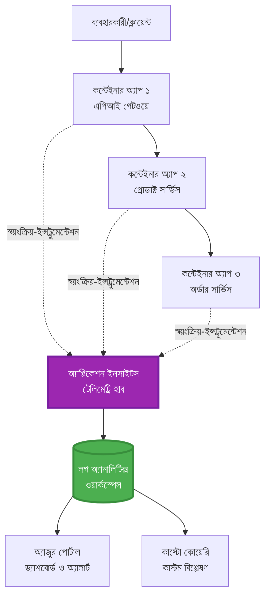
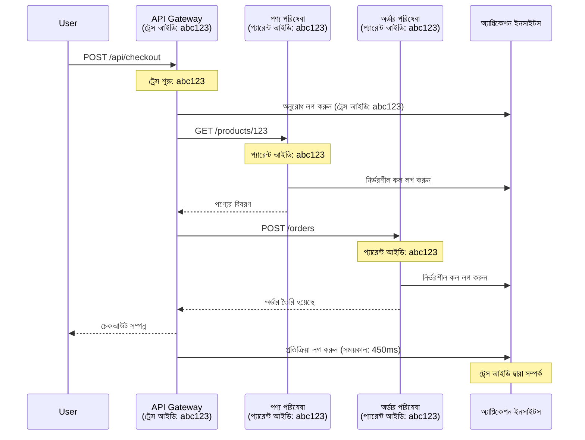

# AZD এর সাথে অ্যাপ্লিকেশন ইনসাইটস ইন্টিগ্রেশন

⏱️ **আনুমানিক সময়**: ৪০-৫০ মিনিট | 💰 **খরচের প্রভাব**: ~৫-১৫ ডলার/মাস | ⭐ **জটিলতা**: মধ্যম

**📚 শেখার পথ:**
- ← পূর্ববর্তী: [প্রিফ্লাইট চেক](preflight-checks.md) - প্রি-ডিপ্লয়মেন্ট যাচাই
- 🎯 **আপনি এখানে আছেন**: অ্যাপ্লিকেশন ইনসাইটস ইন্টিগ্রেশন (মনিটরিং, টেলিমেট্রি, ডিবাগিং)
- → পরবর্তী: [ডিপ্লয়মেন্ট গাইড](../deployment/deployment-guide.md) - অ্যাজুরে ডিপ্লয় করুন
- 🏠 [কোর্স হোম](../../README.md)

---

## আপনি কী শিখবেন

এই পাঠটি সম্পন্ন করার মাধ্যমে আপনি:
- **অ্যাপ্লিকেশন ইনসাইটস** AZD প্রকল্পে স্বয়ংক্রিয়ভাবে ইন্টিগ্রেট করবেন
- মাইক্রোসার্ভিসের জন্য **ডিস্ট্রিবিউটেড ট্রেসিং** কনফিগার করবেন
- **কাস্টম টেলিমেট্রি** (মেট্রিক্স, ইভেন্ট, ডিপেন্ডেন্সি) বাস্তবায়ন করবেন
- **লাইভ মেট্রিক্স** সেটআপ করবেন রিয়েল-টাইম মনিটরিংয়ের জন্য
- AZD ডিপ্লয়মেন্ট থেকে **অ্যালার্ট এবং ড্যাশবোর্ড** তৈরি করবেন
- **টেলিমেট্রি কোয়েরি** ব্যবহার করে প্রোডাকশন সমস্যাগুলি ডিবাগ করবেন
- **খরচ এবং স্যাম্পলিং** কৌশল অপ্টিমাইজ করবেন
- **AI/LLM অ্যাপ্লিকেশন** (টোকেন, লেটেন্সি, খরচ) মনিটর করবেন

## AZD এর সাথে অ্যাপ্লিকেশন ইনসাইটস কেন গুরুত্বপূর্ণ

### চ্যালেঞ্জ: প্রোডাকশন অবজারভেবিলিটি

**অ্যাপ্লিকেশন ইনসাইটস ছাড়া:**
```
❌ No visibility into production behavior
❌ Manual log aggregation across services
❌ Reactive debugging (wait for customer complaints)
❌ No performance metrics
❌ Cannot trace requests across services
❌ Unknown failure rates and bottlenecks
```

**অ্যাপ্লিকেশন ইনসাইটস + AZD সহ:**
```
✅ Automatic telemetry collection
✅ Centralized logs from all services
✅ Proactive issue detection
✅ End-to-end request tracing
✅ Performance metrics and insights
✅ Real-time dashboards
✅ AZD provisions everything automatically
```

**উপমা**: অ্যাপ্লিকেশন ইনসাইটস আপনার অ্যাপ্লিকেশনের জন্য একটি "ব্ল্যাক বক্স" ফ্লাইট রেকর্ডার + ককপিট ড্যাশবোর্ডের মতো। আপনি রিয়েল-টাইমে যা ঘটছে তা দেখতে পারেন এবং যেকোনো ঘটনা পুনরায় চালাতে পারেন।

---

## আর্কিটেকচার ওভারভিউ

### AZD আর্কিটেকচারে অ্যাপ্লিকেশন ইনসাইটস


### স্বয়ংক্রিয়ভাবে কী মনিটর করা হয়

| টেলিমেট্রি টাইপ | এটি কী ক্যাপচার করে | ব্যবহারের ক্ষেত্র |
|----------------|------------------|----------|
| **রিকোয়েস্ট** | HTTP রিকোয়েস্ট, স্ট্যাটাস কোড, সময়কাল | API পারফরম্যান্স মনিটরিং |
| **ডিপেন্ডেন্সি** | এক্সটার্নাল কল (ডাটাবেস, API, স্টোরেজ) | বটলনেক চিহ্নিত করা |
| **এক্সসেপশন** | আনহ্যান্ডলড এরর এবং স্ট্যাক ট্রেস | ব্যর্থতা ডিবাগ করা |
| **কাস্টম ইভেন্ট** | বিজনেস ইভেন্ট (সাইনআপ, পারচেজ) | অ্যানালিটিক্স এবং ফানেল |
| **মেট্রিক্স** | পারফরম্যান্স কাউন্টার, কাস্টম মেট্রিক্স | ক্যাপাসিটি প্ল্যানিং |
| **ট্রেস** | লগ মেসেজ এবং সিভিয়ারিটি | ডিবাগিং এবং অডিটিং |
| **অ্যাভেইলেবিলিটি** | আপটাইম এবং রেসপন্স টাইম টেস্ট | SLA মনিটরিং |

---

## প্রয়োজনীয়তা

### প্রয়োজনীয় টুলস

```bash
# অ্যাজুর ডেভেলপার CLI যাচাই করুন
azd version
# ✅ প্রত্যাশিত: azd সংস্করণ 1.0.0 বা তার বেশি

# অ্যাজুর CLI যাচাই করুন
az --version
# ✅ প্রত্যাশিত: azure-cli 2.50.0 বা তার বেশি
```

### অ্যাজুর প্রয়োজনীয়তা

- সক্রিয় অ্যাজুর সাবস্ক্রিপশন
- নিম্নলিখিত তৈরি করার অনুমতি:
  - অ্যাপ্লিকেশন ইনসাইটস রিসোর্স
  - লগ অ্যানালিটিক্স ওয়ার্কস্পেস
  - কন্টেইনার অ্যাপ
  - রিসোর্স গ্রুপ

### জ্ঞানের প্রয়োজনীয়তা

আপনার সম্পন্ন করা উচিত:
- [AZD বেসিকস](../getting-started/azd-basics.md) - AZD এর মূল ধারণা
- [কনফিগারেশন](../getting-started/configuration.md) - পরিবেশ সেটআপ
- [প্রথম প্রকল্প](../getting-started/first-project.md) - বেসিক ডিপ্লয়মেন্ট

---

## পাঠ ১: AZD এর সাথে স্বয়ংক্রিয় অ্যাপ্লিকেশন ইনসাইটস

### AZD কীভাবে অ্যাপ্লিকেশন ইনসাইটস প্রভিশন করে

AZD ডিপ্লয় করার সময় স্বয়ংক্রিয়ভাবে অ্যাপ্লিকেশন ইনসাইটস তৈরি এবং কনফিগার করে। চলুন দেখি এটি কীভাবে কাজ করে।

### প্রকল্পের কাঠামো

```
monitored-app/
├── azure.yaml                     # AZD configuration
├── infra/
│   ├── main.bicep                # Main infrastructure
│   ├── core/
│   │   └── monitoring.bicep      # Application Insights + Log Analytics
│   └── app/
│       └── api.bicep             # Container App with monitoring
└── src/
    ├── app.py                    # Application with telemetry
    ├── requirements.txt
    └── Dockerfile
```

---

### ধাপ ১: AZD কনফিগার করুন (azure.yaml)

**ফাইল: `azure.yaml`**

```yaml
name: monitored-app
metadata:
  template: monitored-app@1.0.0

services:
  api:
    project: ./src
    language: python
    host: containerapp

# AZD automatically provisions monitoring!
```

**এটাই!** AZD ডিফল্টভাবে অ্যাপ্লিকেশন ইনসাইটস তৈরি করবে। বেসিক মনিটরিংয়ের জন্য অতিরিক্ত কনফিগারেশন প্রয়োজন নেই।

---

### ধাপ ২: মনিটরিং ইনফ্রাস্ট্রাকচার (Bicep)

**ফাইল: `infra/core/monitoring.bicep`**

```bicep
param logAnalyticsName string
param applicationInsightsName string
param location string = resourceGroup().location
param tags object = {}

// Log Analytics Workspace (required for Application Insights)
resource logAnalytics 'Microsoft.OperationalInsights/workspaces@2022-10-01' = {
  name: logAnalyticsName
  location: location
  tags: tags
  properties: {
    sku: {
      name: 'PerGB2018'  // Pay-as-you-go pricing
    }
    retentionInDays: 30  // Keep logs for 30 days
    features: {
      enableLogAccessUsingOnlyResourcePermissions: true
    }
  }
}

// Application Insights
resource applicationInsights 'Microsoft.Insights/components@2020-02-02' = {
  name: applicationInsightsName
  location: location
  tags: tags
  kind: 'web'
  properties: {
    Application_Type: 'web'
    WorkspaceResourceId: logAnalytics.id
    IngestionMode: 'LogAnalytics'
    publicNetworkAccessForIngestion: 'Enabled'
    publicNetworkAccessForQuery: 'Enabled'
  }
}

// Outputs for Container Apps
output logAnalyticsWorkspaceId string = logAnalytics.id
output logAnalyticsWorkspaceName string = logAnalytics.name
output applicationInsightsConnectionString string = applicationInsights.properties.ConnectionString
output applicationInsightsInstrumentationKey string = applicationInsights.properties.InstrumentationKey
output applicationInsightsName string = applicationInsights.name
```

---

### ধাপ ৩: কন্টেইনার অ্যাপকে অ্যাপ্লিকেশন ইনসাইটসের সাথে সংযুক্ত করুন

**ফাইল: `infra/app/api.bicep`**

```bicep
param name string
param location string
param tags object = {}
param containerAppsEnvironmentName string
param applicationInsightsConnectionString string

resource containerApp 'Microsoft.App/containerApps@2023-05-01' = {
  name: name
  location: location
  tags: tags
  properties: {
    configuration: {
      ingress: {
        external: true
        targetPort: 8000
      }
      secrets: [
        {
          name: 'appinsights-connection-string'
          value: applicationInsightsConnectionString
        }
      ]
    }
    template: {
      containers: [
        {
          name: 'api'
          image: 'myregistry.azurecr.io/api:latest'
          resources: {
            cpu: json('0.5')
            memory: '1Gi'
          }
          env: [
            {
              name: 'APPLICATIONINSIGHTS_CONNECTION_STRING'
              secretRef: 'appinsights-connection-string'
            }
            {
              name: 'APPLICATIONINSIGHTS_ENABLED'
              value: 'true'
            }
          ]
        }
      ]
    }
  }
}

output uri string = 'https://${containerApp.properties.configuration.ingress.fqdn}'
```

---

### ধাপ ৪: টেলিমেট্রির সাথে অ্যাপ্লিকেশন কোড

**ফাইল: `src/app.py`**

```python
from flask import Flask, request, jsonify
from opencensus.ext.azure.log_exporter import AzureLogHandler
from opencensus.ext.azure.trace_exporter import AzureExporter
from opencensus.ext.flask.flask_middleware import FlaskMiddleware
from opencensus.trace.samplers import ProbabilitySampler
import logging
import os

app = Flask(__name__)

# অ্যাপ্লিকেশন ইনসাইটস সংযোগ স্ট্রিং পান
connection_string = os.environ.get('APPLICATIONINSIGHTS_CONNECTION_STRING')

if connection_string:
    # বিতরণকৃত ট্রেসিং কনফিগার করুন
    middleware = FlaskMiddleware(
        app,
        exporter=AzureExporter(connection_string=connection_string),
        sampler=ProbabilitySampler(rate=1.0)  # ডেভেলপমেন্টের জন্য ১০০% স্যাম্পলিং
    )
    
    # লগিং কনফিগার করুন
    logger = logging.getLogger(__name__)
    logger.addHandler(AzureLogHandler(connection_string=connection_string))
    logger.setLevel(logging.INFO)
    
    print("✅ Application Insights enabled")
else:
    logger = logging.getLogger(__name__)
    logger.setLevel(logging.INFO)
    print("⚠️ Application Insights not configured")

@app.route('/health')
def health():
    logger.info('Health check endpoint called')
    return jsonify({'status': 'healthy', 'monitoring': 'enabled'})

@app.route('/api/products')
def get_products():
    logger.info('Fetching products')
    
    # ডাটাবেস কল সিমুলেট করুন (স্বয়ংক্রিয়ভাবে নির্ভরতা হিসাবে ট্র্যাক করা হয়)
    products = [
        {'id': 1, 'name': 'Laptop', 'price': 999.99},
        {'id': 2, 'name': 'Mouse', 'price': 29.99},
        {'id': 3, 'name': 'Keyboard', 'price': 79.99}
    ]
    
    logger.info(f'Returned {len(products)} products')
    return jsonify(products)

@app.route('/api/error-test')
def error_test():
    """Test error tracking"""
    logger.error('Testing error tracking')
    try:
        raise ValueError('This is a test exception')
    except Exception as e:
        logger.exception('Exception occurred in error-test endpoint')
        return jsonify({'error': str(e)}), 500

@app.route('/api/slow')
def slow_endpoint():
    """Test performance tracking"""
    import time
    logger.info('Slow endpoint called')
    time.sleep(3)  # ধীর অপারেশন সিমুলেট করুন
    logger.warning('Endpoint took 3 seconds to respond')
    return jsonify({'message': 'Slow operation completed'})

if __name__ == '__main__':
    app.run(host='0.0.0.0', port=8000)
```

**ফাইল: `src/requirements.txt`**

```txt
Flask==3.0.0
opencensus-ext-azure==1.1.13
opencensus-ext-flask==0.8.1
gunicorn==21.2.0
```

---

### ধাপ ৫: ডিপ্লয় এবং যাচাই করুন

```bash
# AZD আরম্ভ করুন
azd init

# ডিপ্লয় করুন (স্বয়ংক্রিয়ভাবে অ্যাপ্লিকেশন ইনসাইটস প্রভিশন করে)
azd up

# অ্যাপ URL পান
APP_URL=$(azd env get-values | grep API_URL | cut -d '=' -f2 | tr -d '"')

# টেলিমেট্রি তৈরি করুন
curl $APP_URL/health
curl $APP_URL/api/products
curl $APP_URL/api/error-test
curl $APP_URL/api/slow
```

**✅ প্রত্যাশিত আউটপুট:**
```json
{
  "status": "healthy",
  "monitoring": "enabled"
}
```

---

### ধাপ ৬: অ্যাজুর পোর্টালে টেলিমেট্রি দেখুন

```bash
# অ্যাপ্লিকেশন ইনসাইটসের বিবরণ পান
azd env get-values | grep APPLICATIONINSIGHTS

# আজুর পোর্টালে খুলুন
az monitor app-insights component show \
  --app $(azd env get-values | grep APPLICATIONINSIGHTS_NAME | cut -d '=' -f2 | tr -d '"') \
  --resource-group $(azd env get-values | grep AZURE_RESOURCE_GROUP | cut -d '=' -f2 | tr -d '"') \
  --query "appId" -o tsv
```

**অ্যাজুর পোর্টালে যান → অ্যাপ্লিকেশন ইনসাইটস → ট্রানজেকশন সার্চ**

আপনি দেখতে পাবেন:
- ✅ HTTP রিকোয়েস্ট এবং স্ট্যাটাস কোড
- ✅ রিকোয়েস্টের সময়কাল (৩+ সেকেন্ড `/api/slow` এর জন্য)
- ✅ `/api/error-test` থেকে এক্সসেপশন ডিটেইলস
- ✅ কাস্টম লগ মেসেজ

---

## পাঠ ২: কাস্টম টেলিমেট্রি এবং ইভেন্ট

### বিজনেস ইভেন্ট ট্র্যাক করুন

চলুন বিজনেস-ক্রিটিক্যাল ইভেন্টের জন্য কাস্টম টেলিমেট্রি যোগ করি।

**ফাইল: `src/telemetry.py`**

```python
from opencensus.ext.azure import metrics_exporter
from opencensus.stats import aggregation as aggregation_module
from opencensus.stats import measure as measure_module
from opencensus.stats import stats as stats_module
from opencensus.stats import view as view_module
from opencensus.tags import tag_map as tag_map_module
from opencensus.ext.azure.log_exporter import AzureLogHandler
from opencensus.ext.azure.trace_exporter import AzureExporter
from opencensus.trace import tracer as tracer_module
import logging
import os

class TelemetryClient:
    """Custom telemetry client for Application Insights"""
    
    def __init__(self, connection_string=None):
        self.connection_string = connection_string or os.environ.get('APPLICATIONINSIGHTS_CONNECTION_STRING')
        
        if not self.connection_string:
            print("⚠️ Application Insights connection string not found")
            return
        
        # লগার সেটআপ করুন
        self.logger = logging.getLogger(__name__)
        self.logger.addHandler(AzureLogHandler(connection_string=self.connection_string))
        self.logger.setLevel(logging.INFO)
        
        # মেট্রিক্স এক্সপোর্টার সেটআপ করুন
        self.stats = stats_module.stats
        self.view_manager = self.stats.view_manager
        self.stats_recorder = self.stats.stats_recorder
        
        exporter = metrics_exporter.new_metrics_exporter(
            connection_string=self.connection_string
        )
        self.view_manager.register_exporter(exporter)
        
        # ট্রেসার সেটআপ করুন
        self.tracer = tracer_module.Tracer(
            exporter=AzureExporter(connection_string=self.connection_string)
        )
        
        print("✅ Custom telemetry client initialized")
    
    def track_event(self, event_name: str, properties: dict = None):
        """Track custom business event"""
        properties = properties or {}
        self.logger.info(
            f"CustomEvent: {event_name}",
            extra={
                'custom_dimensions': {
                    'event_name': event_name,
                    **properties
                }
            }
        )
    
    def track_metric(self, metric_name: str, value: float, properties: dict = None):
        """Track custom metric"""
        properties = properties or {}
        self.logger.info(
            f"CustomMetric: {metric_name} = {value}",
            extra={
                'custom_dimensions': {
                    'metric_name': metric_name,
                    'value': value,
                    **properties
                }
            }
        )
    
    def track_dependency(self, name: str, dependency_type: str, duration: float, success: bool):
        """Track external dependency call"""
        with self.tracer.span(name=name) as span:
            span.add_attribute('dependency.type', dependency_type)
            span.add_attribute('duration', duration)
            span.add_attribute('success', success)

# গ্লোবাল টেলিমেট্রি ক্লায়েন্ট
telemetry = TelemetryClient()
```

### কাস্টম ইভেন্ট সহ অ্যাপ্লিকেশন আপডেট করুন

**ফাইল: `src/app.py` (উন্নত)**

```python
from flask import Flask, request, jsonify
from telemetry import telemetry
import time
import random

app = Flask(__name__)

@app.route('/api/purchase', methods=['POST'])
def purchase():
    """Track purchase event with custom telemetry"""
    data = request.json
    product_id = data.get('product_id')
    quantity = data.get('quantity', 1)
    price = data.get('price', 0)
    
    # ব্যবসায়িক ইভেন্ট ট্র্যাক করুন
    telemetry.track_event('Purchase', {
        'product_id': product_id,
        'quantity': quantity,
        'total_amount': price * quantity,
        'user_id': request.headers.get('X-User-Id', 'anonymous')
    })
    
    # রাজস্ব মেট্রিক ট্র্যাক করুন
    telemetry.track_metric('Revenue', price * quantity, {
        'product_id': product_id,
        'currency': 'USD'
    })
    
    return jsonify({
        'order_id': f'ORD-{random.randint(1000, 9999)}',
        'status': 'confirmed',
        'total': price * quantity
    })

@app.route('/api/search')
def search():
    """Track search queries"""
    query = request.args.get('q', '')
    
    start_time = time.time()
    
    # অনুসন্ধান সিমুলেট করুন (বাস্তব ডাটাবেস প্রশ্ন হবে)
    results = [{'id': 1, 'name': f'Result for {query}'}]
    
    duration = (time.time() - start_time) * 1000  # মিলিসেকেন্ডে রূপান্তর করুন
    
    # অনুসন্ধান ইভেন্ট ট্র্যাক করুন
    telemetry.track_event('Search', {
        'query': query,
        'results_count': len(results),
        'duration_ms': duration
    })
    
    # অনুসন্ধান কর্মক্ষমতা মেট্রিক ট্র্যাক করুন
    telemetry.track_metric('SearchDuration', duration, {
        'query_length': len(query)
    })
    
    return jsonify({'results': results, 'count': len(results)})

@app.route('/api/external-call')
def external_call():
    """Track external API dependency"""
    import requests
    
    start_time = time.time()
    success = True
    
    try:
        # বাহ্যিক API কল সিমুলেট করুন
        response = requests.get('https://api.example.com/data', timeout=5)
        result = response.json()
    except Exception as e:
        success = False
        result = {'error': str(e)}
    
    duration = (time.time() - start_time) * 1000
    
    # নির্ভরতা ট্র্যাক করুন
    telemetry.track_dependency(
        name='ExternalAPI',
        dependency_type='HTTP',
        duration=duration,
        success=success
    )
    
    return jsonify(result)

if __name__ == '__main__':
    app.run(host='0.0.0.0', port=8000)
```

### কাস্টম টেলিমেট্রি পরীক্ষা করুন

```bash
# ক্রয় ইভেন্ট ট্র্যাক করুন
curl -X POST $APP_URL/api/purchase \
  -H "Content-Type: application/json" \
  -H "X-User-Id: user123" \
  -d '{"product_id": 1, "quantity": 2, "price": 29.99}'

# অনুসন্ধান ইভেন্ট ট্র্যাক করুন
curl "$APP_URL/api/search?q=laptop"

# বাহ্যিক নির্ভরতা ট্র্যাক করুন
curl $APP_URL/api/external-call
```

**অ্যাজুর পোর্টালে দেখুন:**

অ্যাপ্লিকেশন ইনসাইটস → লগস-এ যান, তারপর চালান:

```kusto
// View purchase events
traces
| where customDimensions.event_name == "Purchase"
| project 
    timestamp,
    product_id = tostring(customDimensions.product_id),
    total_amount = todouble(customDimensions.total_amount),
    user_id = tostring(customDimensions.user_id)
| order by timestamp desc

// View revenue metrics
traces
| where customDimensions.metric_name == "Revenue"
| summarize TotalRevenue = sum(todouble(customDimensions.value)) by bin(timestamp, 1h)
| render timechart

// View search performance
traces
| where customDimensions.event_name == "Search"
| summarize 
    AvgDuration = avg(todouble(customDimensions.duration_ms)),
    SearchCount = count()
  by bin(timestamp, 5m)
| render timechart
```

---

## পাঠ ৩: মাইক্রোসার্ভিসের জন্য ডিস্ট্রিবিউটেড ট্রেসিং

### ক্রস-সার্ভিস ট্রেসিং সক্রিয় করুন

মাইক্রোসার্ভিসের জন্য, অ্যাপ্লিকেশন ইনসাইটস স্বয়ংক্রিয়ভাবে সার্ভিসগুলির মধ্যে রিকোয়েস্টগুলিকে সংযুক্ত করে।

**ফাইল: `infra/main.bicep`**

```bicep
targetScope = 'subscription'

param environmentName string
param location string = 'eastus'

var tags = { 'azd-env-name': environmentName }

resource rg 'Microsoft.Resources/resourceGroups@2021-04-01' = {
  name: 'rg-${environmentName}'
  location: location
  tags: tags
}

// Monitoring (shared by all services)
module monitoring './core/monitoring.bicep' = {
  name: 'monitoring'
  scope: rg
  params: {
    logAnalyticsName: 'log-${environmentName}'
    applicationInsightsName: 'appi-${environmentName}'
    location: location
    tags: tags
  }
}

// API Gateway
module apiGateway './app/api-gateway.bicep' = {
  name: 'api-gateway'
  scope: rg
  params: {
    name: 'ca-gateway-${environmentName}'
    location: location
    tags: union(tags, { 'azd-service-name': 'gateway' })
    applicationInsightsConnectionString: monitoring.outputs.applicationInsightsConnectionString
  }
}

// Product Service
module productService './app/product-service.bicep' = {
  name: 'product-service'
  scope: rg
  params: {
    name: 'ca-products-${environmentName}'
    location: location
    tags: union(tags, { 'azd-service-name': 'products' })
    applicationInsightsConnectionString: monitoring.outputs.applicationInsightsConnectionString
  }
}

// Order Service
module orderService './app/order-service.bicep' = {
  name: 'order-service'
  scope: rg
  params: {
    name: 'ca-orders-${environmentName}'
    location: location
    tags: union(tags, { 'azd-service-name': 'orders' })
    applicationInsightsConnectionString: monitoring.outputs.applicationInsightsConnectionString
  }
}

output APPLICATIONINSIGHTS_CONNECTION_STRING string = monitoring.outputs.applicationInsightsConnectionString
output GATEWAY_URL string = apiGateway.outputs.uri
```

### এন্ড-টু-এন্ড ট্রানজেকশন দেখুন


**এন্ড-টু-এন্ড ট্রেস কোয়েরি করুন:**

```kusto
// Find complete request flow
let traceId = "abc123...";  // Get from response header
dependencies
| union requests
| where operation_Id == traceId
| project 
    timestamp,
    type = itemType,
    name,
    duration,
    success,
    cloud_RoleName
| order by timestamp asc
```

---

## পাঠ ৪: লাইভ মেট্রিক্স এবং রিয়েল-টাইম মনিটরিং

### লাইভ মেট্রিক্স স্ট্রিম সক্রিয় করুন

লাইভ মেট্রিক্স <১ সেকেন্ড লেটেন্সি সহ রিয়েল-টাইম টেলিমেট্রি প্রদান করে।

**লাইভ মেট্রিক্স অ্যাক্সেস করুন:**

```bash
# অ্যাপ্লিকেশন ইনসাইটস রিসোর্স পান
APPI_NAME=$(azd env get-values | grep APPLICATIONINSIGHTS_NAME | cut -d '=' -f2 | tr -d '"')

# রিসোর্স গ্রুপ পান
RG_NAME=$(azd env get-values | grep AZURE_RESOURCE_GROUP | cut -d '=' -f2 | tr -d '"')

echo "Navigate to: Azure Portal → Resource Groups → $RG_NAME → $APPI_NAME → Live Metrics"
```

**আপনি রিয়েল-টাইমে যা দেখবেন:**
- ✅ ইনকামিং রিকোয়েস্ট রেট (রিকোয়েস্ট/সেকেন্ড)
- ✅ আউটগোয়িং ডিপেন্ডেন্সি কল
- ✅ এক্সসেপশন কাউন্ট
- ✅ CPU এবং মেমোরি ব্যবহার
- ✅ সক্রিয় সার্ভার কাউন্ট
- ✅ স্যাম্পল টেলিমেট্রি

### পরীক্ষার জন্য লোড তৈরি করুন

```bash
# লাইভ মেট্রিক্স দেখতে লোড তৈরি করুন
for i in {1..100}; do
  curl $APP_URL/api/products &
  curl $APP_URL/api/search?q=test$i &
done

# Azure পোর্টালে লাইভ মেট্রিক্স দেখুন
# আপনি অনুরোধের হার বৃদ্ধি দেখতে পাবেন
```

---

## ব্যবহারিক অনুশীলন

### অনুশীলন ১: অ্যালার্ট সেটআপ করুন ⭐⭐ (মধ্যম)

**লক্ষ্য**: উচ্চ ত্রুটি হার এবং ধীর প্রতিক্রিয়ার জন্য অ্যালার্ট তৈরি করুন।

**ধাপসমূহ:**

1. **ত্রুটি হারের জন্য অ্যালার্ট তৈরি করুন:**

```bash
# অ্যাপ্লিকেশন ইনসাইটস রিসোর্স আইডি পান
APPI_ID=$(az monitor app-insights component show \
  --app $APPI_NAME \
  --resource-group $RG_NAME \
  --query "id" -o tsv)

# ব্যর্থ অনুরোধগুলির জন্য মেট্রিক অ্যালার্ট তৈরি করুন
az monitor metrics alert create \
  --name "High-Error-Rate" \
  --resource-group $RG_NAME \
  --scopes $APPI_ID \
  --condition "count requests/failed > 10" \
  --window-size 5m \
  --evaluation-frequency 1m \
  --description "Alert when error rate exceeds 10 per 5 minutes"
```

2. **ধীর প্রতিক্রিয়ার জন্য অ্যালার্ট তৈরি করুন:**

```bash
az monitor metrics alert create \
  --name "Slow-Responses" \
  --resource-group $RG_NAME \
  --scopes $APPI_ID \
  --condition "avg requests/duration > 3000" \
  --window-size 5m \
  --evaluation-frequency 1m \
  --description "Alert when average response time exceeds 3 seconds"
```

3. **Bicep এর মাধ্যমে অ্যালার্ট তৈরি করুন (AZD এর জন্য প্রেফার্ড):**

**ফাইল: `infra/core/alerts.bicep`**

```bicep
param applicationInsightsId string
param actionGroupId string = ''
param location string = resourceGroup().location

// High error rate alert
resource errorRateAlert 'Microsoft.Insights/metricAlerts@2018-03-01' = {
  name: 'high-error-rate'
  location: 'global'
  properties: {
    description: 'Alert when error rate exceeds threshold'
    severity: 2
    enabled: true
    scopes: [
      applicationInsightsId
    ]
    evaluationFrequency: 'PT1M'
    windowSize: 'PT5M'
    criteria: {
      'odata.type': 'Microsoft.Azure.Monitor.SingleResourceMultipleMetricCriteria'
      allOf: [
        {
          name: 'Error rate'
          metricName: 'requests/failed'
          operator: 'GreaterThan'
          threshold: 10
          timeAggregation: 'Count'
        }
      ]
    }
    actions: actionGroupId != '' ? [
      {
        actionGroupId: actionGroupId
      }
    ] : []
  }
}

// Slow response alert
resource slowResponseAlert 'Microsoft.Insights/metricAlerts@2018-03-01' = {
  name: 'slow-responses'
  location: 'global'
  properties: {
    description: 'Alert when response time is too high'
    severity: 3
    enabled: true
    scopes: [
      applicationInsightsId
    ]
    evaluationFrequency: 'PT1M'
    windowSize: 'PT5M'
    criteria: {
      'odata.type': 'Microsoft.Azure.Monitor.SingleResourceMultipleMetricCriteria'
      allOf: [
        {
          name: 'Response duration'
          metricName: 'requests/duration'
          operator: 'GreaterThan'
          threshold: 3000
          timeAggregation: 'Average'
        }
      ]
    }
  }
}

output errorAlertId string = errorRateAlert.id
output slowResponseAlertId string = slowResponseAlert.id
```

4. **অ্যালার্ট পরীক্ষা করুন:**

```bash
# ত্রুটি তৈরি করুন
for i in {1..20}; do
  curl $APP_URL/api/error-test
done

# ধীর প্রতিক্রিয়া তৈরি করুন
for i in {1..10}; do
  curl $APP_URL/api/slow
done

# সতর্কতার স্থিতি পরীক্ষা করুন (৫-১০ মিনিট অপেক্ষা করুন)
az monitor metrics alert list \
  --resource-group $RG_NAME \
  --query "[].{Name:name, Enabled:enabled, State:properties.enabled}" \
  --output table
```

**✅ সফলতার মানদণ্ড:**
- ✅ অ্যালার্ট সফলভাবে তৈরি হয়েছে
- ✅ থ্রেশহোল্ড অতিক্রম করলে অ্যালার্ট ফায়ার হয়
- ✅ অ্যাজুর পোর্টালে অ্যালার্ট ইতিহাস দেখা যায়
- ✅ AZD ডিপ্লয়মেন্টের সাথে ইন্টিগ্রেটেড

**সময়**: ২০-২৫ মিনিট

---

### অনুশীলন ২: কাস্টম ড্যাশবোর্ড তৈরি করুন ⭐⭐ (মধ্যম)

**লক্ষ্য**: মূল অ্যাপ্লিকেশন মেট্রিক্স দেখানোর জন্য একটি ড্যাশবোর্ড তৈরি করুন।

**ধাপসমূহ:**

1. **অ্যাজুর পোর্টালের মাধ্যমে ড্যাশবোর্ড তৈরি করুন:**

অ্যাজুর পোর্টাল → ড্যাশবোর্ড → নতুন ড্যাশবোর্ডে যান

2. **মূল মেট্রিক্সের জন্য টাইল যোগ করুন:**

- রিকোয়েস্ট কাউন্ট (শেষ ২৪ ঘণ্টা)
- গড় প্রতিক্রিয়া সময়
- ত্রুটি হার
- শীর্ষ ৫ ধীরতম অপারেশন
- ব্যবহারকারীদের ভৌগোলিক বিতরণ

3. **Bicep এর মাধ্যমে ড্যাশবোর্ড তৈরি করুন:**

**ফাইল: `infra/core/dashboard.bicep`**

```bicep
param dashboardName string
param applicationInsightsId string
param location string = resourceGroup().location

resource dashboard 'Microsoft.Portal/dashboards@2020-09-01-preview' = {
  name: dashboardName
  location: location
  properties: {
    lenses: [
      {
        order: 0
        parts: [
          // Request count
          {
            position: { x: 0, y: 0, rowSpan: 4, colSpan: 6 }
            metadata: {
              type: 'Extension/Microsoft_OperationsManagementSuite_Workspace/PartType/LogsDashboardPart'
              inputs: [
                {
                  name: 'resourceId'
                  value: applicationInsightsId
                }
                {
                  name: 'query'
                  value: '''
                    requests
                    | summarize RequestCount = count() by bin(timestamp, 1h)
                    | render timechart
                  '''
                }
              ]
            }
          }
          // Error rate
          {
            position: { x: 6, y: 0, rowSpan: 4, colSpan: 6 }
            metadata: {
              type: 'Extension/Microsoft_OperationsManagementSuite_Workspace/PartType/LogsDashboardPart'
              inputs: [
                {
                  name: 'resourceId'
                  value: applicationInsightsId
                }
                {
                  name: 'query'
                  value: '''
                    requests
                    | summarize 
                        Total = count(),
                        Failed = countif(success == false)
                    | extend ErrorRate = (Failed * 100.0) / Total
                    | project ErrorRate
                  '''
                }
              ]
            }
          }
        ]
      }
    ]
  }
}

output dashboardId string = dashboard.id
```

4. **ড্যাশবোর্ড ডিপ্লয় করুন:**

```bash
# প্রধান.bicep এ যোগ করুন
module dashboard './core/dashboard.bicep' = {
  name: 'dashboard'
  scope: rg
  params: {
    dashboardName: 'dashboard-${environmentName}'
    applicationInsightsId: monitoring.outputs.applicationInsightsId
    location: location
  }
}

# স্থাপন করুন
azd up
```

**✅ সফলতার মানদণ্ড:**
- ✅ ড্যাশবোর্ড মূল মেট্রিক্স প্রদর্শন করে
- ✅ অ্যাজুর পোর্টাল হোমে পিন করা যায়
- ✅ রিয়েল-টাইমে আপডেট হয়
- ✅ AZD এর মাধ্যমে ডিপ্লয় করা যায়

**সময়**: ২৫-৩০ মিনিট

---

### অনুশীলন ৩: AI/LLM অ্যাপ্লিকেশন মনিটর করুন ⭐⭐⭐ (উন্নত)

**লক্ষ্য**: অ্যাজুর ওপেনএআই ব্যবহার (টোকেন, খরচ, লেটেন্সি) ট্র্যাক করুন।

**ধাপসমূহ:**

1. **AI মনিটরিং র‍্যাপার তৈরি করুন:**

**ফাইল: `src/ai_telemetry.py`**

```python
from telemetry import telemetry
from openai import AzureOpenAI
import time

class MonitoredAzureOpenAI:
    """Azure OpenAI client with automatic telemetry"""
    
    def __init__(self, api_key, endpoint, api_version="2024-02-01"):
        self.client = AzureOpenAI(
            api_key=api_key,
            api_version=api_version,
            azure_endpoint=endpoint
        )
    
    def chat_completion(self, model: str, messages: list, **kwargs):
        """Track chat completion with telemetry"""
        start_time = time.time()
        
        try:
            # অ্যাজুর ওপেনএআই কল করুন
            response = self.client.chat.completions.create(
                model=model,
                messages=messages,
                **kwargs
            )
            
            duration = (time.time() - start_time) * 1000  # এমএস
            
            # ব্যবহার নির্যাস করুন
            usage = response.usage
            prompt_tokens = usage.prompt_tokens
            completion_tokens = usage.completion_tokens
            total_tokens = usage.total_tokens
            
            # খরচ গণনা করুন (GPT-4 মূল্য নির্ধারণ)
            prompt_cost = (prompt_tokens / 1000) * 0.03  # প্রতি ১কে টোকেন $0.03
            completion_cost = (completion_tokens / 1000) * 0.06  # প্রতি ১কে টোকেন $0.06
            total_cost = prompt_cost + completion_cost
            
            # কাস্টম ইভেন্ট ট্র্যাক করুন
            telemetry.track_event('OpenAI_Request', {
                'model': model,
                'prompt_tokens': prompt_tokens,
                'completion_tokens': completion_tokens,
                'total_tokens': total_tokens,
                'duration_ms': duration,
                'cost_usd': total_cost,
                'success': True
            })
            
            # মেট্রিক্স ট্র্যাক করুন
            telemetry.track_metric('OpenAI_Tokens', total_tokens, {
                'model': model,
                'type': 'total'
            })
            
            telemetry.track_metric('OpenAI_Cost', total_cost, {
                'model': model,
                'currency': 'USD'
            })
            
            telemetry.track_metric('OpenAI_Duration', duration, {
                'model': model
            })
            
            return response
            
        except Exception as e:
            duration = (time.time() - start_time) * 1000
            
            telemetry.track_event('OpenAI_Request', {
                'model': model,
                'duration_ms': duration,
                'success': False,
                'error': str(e)
            })
            
            raise
```

2. **মনিটরড ক্লায়েন্ট ব্যবহার করুন:**

```python
from flask import Flask, request, jsonify
from ai_telemetry import MonitoredAzureOpenAI
import os

app = Flask(__name__)

# মনিটর করা ওপেনএআই ক্লায়েন্ট আরম্ভ করুন
openai_client = MonitoredAzureOpenAI(
    api_key=os.environ['AZURE_OPENAI_API_KEY'],
    endpoint=os.environ['AZURE_OPENAI_ENDPOINT']
)

@app.route('/api/chat', methods=['POST'])
def chat():
    data = request.json
    user_message = data.get('message')
    
    # স্বয়ংক্রিয় মনিটরিং সহ কল করুন
    response = openai_client.chat_completion(
        model='gpt-4',
        messages=[
            {'role': 'user', 'content': user_message}
        ]
    )
    
    return jsonify({
        'response': response.choices[0].message.content,
        'tokens': response.usage.total_tokens
    })
```

3. **AI মেট্রিক্স কোয়েরি করুন:**

```kusto
// Total AI spend over time
traces
| where customDimensions.event_name == "OpenAI_Request"
| where customDimensions.success == "True"
| summarize TotalCost = sum(todouble(customDimensions.cost_usd)) by bin(timestamp, 1h)
| render timechart

// Token usage by model
traces
| where customDimensions.event_name == "OpenAI_Request"
| summarize 
    TotalTokens = sum(toint(customDimensions.total_tokens)),
    RequestCount = count()
  by Model = tostring(customDimensions.model)

// Average latency
traces
| where customDimensions.event_name == "OpenAI_Request"
| summarize AvgDuration = avg(todouble(customDimensions.duration_ms))
| project AvgDurationSeconds = AvgDuration / 1000

// Cost per request
traces
| where customDimensions.event_name == "OpenAI_Request"
| extend Cost = todouble(customDimensions.cost_usd)
| summarize 
    TotalCost = sum(Cost),
    RequestCount = count(),
    AvgCostPerRequest = avg(Cost)
```

**✅ সফলতার মানদণ্ড:**
- ✅ প্রতিটি ওপেনএআই কল স্বয়ংক্রিয়ভাবে ট্র্যাক হয়
- ✅ টোকেন ব্যবহার এবং খরচ দৃশ্যমান
- ✅ লেটেন্সি মনিটর করা হয়
- ✅ বাজেট অ্যালার্ট সেট করা যায়

**সময়**: ৩৫-৪৫ মিনিট

---

## খরচ অপ্টিমাইজেশন

### স্যাম্পলিং কৌশল

টেলিমেট্রি স্যাম্পলিংয়ের মাধ্যমে খরচ নিয়ন্ত্রণ করুন:

```python
from opencensus.trace.samplers import ProbabilitySampler

# উন্নয়ন: ১০০% নমুনা সংগ্রহ
sampler = ProbabilitySampler(rate=1.0)

# উৎপাদন: ১০% নমুনা সংগ্রহ (খরচ ৯০% কমান)
sampler = ProbabilitySampler(rate=0.1)

# অভিযোজনযোগ্য নমুনা সংগ্রহ (স্বয়ংক্রিয়ভাবে সামঞ্জস্য করে)
from opencensus.trace.samplers import AdaptiveSampler
sampler = AdaptiveSampler()
```

**Bicep এ:**

```bicep
resource applicationInsights 'Microsoft.Insights/components@2020-02-02' = {
  name: applicationInsightsName
  properties: {
    SamplingPercentage: 10  // 10% sampling
  }
}
```

### ডেটা রিটেনশন

```bicep
resource logAnalytics 'Microsoft.OperationalInsights/workspaces@2022-10-01' = {
  name: logAnalyticsName
  properties: {
    retentionInDays: 30  // Minimum (cheapest)
    // Options: 30, 31, 60, 90, 120, 180, 270, 365, 550, 730
  }
}
```

### মাসিক খরচের অনুমান

| ডেটা ভলিউম | রিটেনশন | মাসিক খরচ |
|-------------|-----------|--------------|
| ১ GB/মাস | ৩০ দিন | ~২-৫ ডলার |
| ৫ GB/মাস | ৩০ দিন | ~১০-১৫ ডলার |
| ১০ GB/মাস | ৯০ দিন | ~২৫-৪০ ডলার |
| ৫০ GB/মাস | ৯০ দিন | ~১০০-১৫০ ডলার |

**ফ্রি টিয়ার**: ৫ GB/মাস অন্তর্ভুক্ত

---

## জ্ঞান যাচাই

### ১. বেসিক ইন্টিগ্রেশন ✓

আপনার বোঝাপড়া পরীক্ষা করুন:

- [ ] **প্রশ্ন ১**: AZD কীভাবে অ্যাপ্লিকেশন ইনসাইটস প্রভিশন করে?
  - **উত্তর**: স্বয়ংক্রিয়ভাবে `infra/core/monitoring.bicep` এর Bicep টেমপ্লেটের মাধ্যমে

- [ ] **প্রশ্ন ২**: কোন পরিবেশ ভেরিয়েবল অ্যাপ্লিকেশন ইনসাইটস সক্রিয় করে?
  - **উত্তর**: `APPLICATIONINSIGHTS_CONNECTION_STRING`

- [ ] **প্রশ্ন ৩**: তিনটি প্রধান টেলিমেট্রি টাইপ কী কী?
  - **উত্তর**: রিকোয়েস্ট (HTTP কল), ডিপেন্ডেন্সি (এক্সটার্নাল কল), এক্সসেপশন (এরর)

**হ্যান্ডস-অন যাচাই:**
```bash
# অ্যাপ্লিকেশন ইনসাইটস কনফিগার করা হয়েছে কিনা পরীক্ষা করুন
azd env get-values | grep APPLICATIONINSIGHTS

# টেলিমেট্রি প্রবাহিত হচ্ছে কিনা যাচাই করুন
az monitor app-insights metrics show \
  --app $APPI_NAME \
  --resource-group $RG_NAME \
  --metric "requests/count"
```

---

### ২. কাস্টম টেলিমেট্রি ✓

আপনার বোঝাপড়া পরীক্ষা করুন:

- [ ] **প্রশ্ন ১**: কাস্টম বিজনেস ইভেন্ট কীভাবে ট্র্যাক করবেন?
  - **উত্তর**: `custom_dimensions` সহ লগার বা `TelemetryClient.track_event()` ব্যবহার করুন

- [ ] **প্রশ্ন ২**: ইভেন্ট এবং মেট্রিক্সের মধ্যে পার্থক্য কী?
  - **উত্তর**: ইভেন্ট হলো পৃথক ঘটনা, মেট্রিক্স হলো সংখ্যাগত পরিমাপ

- [ ] **প্রশ্ন ৩**: সার্ভিসগুলির মধ্যে টেলিমেট্রি কীভাবে সংযুক্ত করবেন?
  - **উত্তর**: অ্যাপ্লিকেশন ইনসাইটস স্বয়ংক্রিয়ভাবে `operation_Id` ব্যবহার করে সংযোগ করে

**হ্যান্ডস-অন যাচাই:**
```kusto
// Verify custom events
traces
| where customDimensions.event_name != ""
| summarize count() by tostring(customDimensions.event_name)
```

---

### ৩. প্রোডাকশন মনিটরিং ✓

আপনার বোঝাপড়া পরীক্ষা করুন:

- [ ] **প্রশ্ন ১**: স্যাম্পলিং কী এবং এটি কেন ব্যবহার করবেন?
  - **উত্তর**: স্যাম্পলিং ডেটা ভলিউম (এবং খরচ) কমায় টেলিমেট্রির একটি শতাংশ ক্যাপচার করে

- [ ] **প্রশ্ন ২**: অ্যালার্ট কীভাবে সেট করবেন?
  - **উত্তর**: অ্যাপ্লিকেশন ইনসাইটস মেট্রিক্সের উপর ভিত্তি করে Bicep বা অ্যাজুর পোর্টালে মেট্রিক অ্যালার্ট ব্যবহার করুন

- [ ] **প্রশ্ন ৩**: লগ অ্যানালিটিক্স এবং অ্যাপ্লিকেশন ইনসাইটসের মধ্যে পার্থক্য কী?
  - **উত্তর**: অ্যাপ্লিকেশন ইনসাইটস ডেটা লগ অ্যানালিটিক্স ওয়ার্কস্পেসে সংরক্ষণ করে; অ্যাপ ইনসাইটস অ্যাপ্লিকেশন-নির্দিষ্ট ভিউ প্রদান করে

**হ্যান্ডস-অন যাচাই:**
```bash
# নমুনা কনফিগারেশন পরীক্ষা করুন
az monitor app-insights component show \
  --app $APPI_NAME \
  --resource-group $RG_NAME \
  --query "properties.SamplingPercentage"
```

---

## সেরা অনুশীলন

### ✅ করবেন:

1. **করেলেশন আইডি ব্যবহার করুন**
   ```python
   logger.info('Processing order', extra={
       'custom_dimensions': {
           'order_id': order_id,
           'user_id': user_id
       }
   })
   ```

2. **গুরুত্বপূর্ণ মেট্রিক্সের জন্য অ্যালার্ট সেট করুন**
   ```bicep
   // Error rate, slow responses, availability
   ```

3. **স্ট্রাকচার্ড লগিং ব্যবহার করুন**
   ```python
   # ✅ ভালো: গঠনমূলক
   logger.info('User signup', extra={'custom_dimensions': {'user_id': 123}})
   
   # ❌ খারাপ: অগঠিত
   logger.info(f'User 123 signed up')
   ```

4. **ডিপেন্ডেন্সি মনিটর করুন**
   ```python
   # স্বয়ংক্রিয়ভাবে ডাটাবেস কল, HTTP অনুরোধ ইত্যাদি ট্র্যাক করুন।
   ```

5. **ডিপ্লয়মেন্টের সময় লাইভ মেট্রিক্স ব্যবহার করুন**

### ❌ করবেন না:

1. **সংবেদনশীল ডেটা লগ করবেন না**
   ```python
   # ❌ খারাপ
   logger.info(f'Login: {username}:{password}')
   
   # ✅ ভালো
   logger.info('Login attempt', extra={'custom_dimensions': {'username': username}})
   ```

2. **প্রোডাকশনে ১০০% স্যাম্পলিং ব্যবহার করবেন না**
   ```python
   # ❌ ব্যয়বহুল
   sampler = ProbabilitySampler(rate=1.0)
   
   # ✅ সাশ্রয়ী
   sampler = ProbabilitySampler(rate=0.1)
   ```

3. **ডেড লেটার কিউ উপেক্ষা করবেন না**

4. **ডেট
- ✅ এআই/এলএলএম অ্যাপ্লিকেশন মনিটরিং  
- ✅ খরচ অপ্টিমাইজেশন কৌশল  

**মূল বিষয়সমূহ:**  
1. **AZD স্বয়ংক্রিয়ভাবে মনিটরিং প্রভিশন করে** - ম্যানুয়াল সেটআপের প্রয়োজন নেই  
2. **স্ট্রাকচার্ড লগিং ব্যবহার করুন** - কুয়েরি করা সহজ হয়  
3. **ব্যবসায়িক ইভেন্ট ট্র্যাক করুন** - শুধুমাত্র টেকনিক্যাল মেট্রিক নয়  
4. **এআই খরচ মনিটর করুন** - টোকেন এবং খরচ ট্র্যাক করুন  
5. **অ্যালার্ট সেট আপ করুন** - প্রতিক্রিয়াশীল নয়, সক্রিয় হোন  
6. **খরচ অপ্টিমাইজ করুন** - স্যাম্পলিং এবং রিটেনশন সীমা ব্যবহার করুন  

**পরবর্তী পদক্ষেপ:**  
1. ব্যবহারিক অনুশীলন সম্পন্ন করুন  
2. আপনার AZD প্রকল্পে অ্যাপ্লিকেশন ইনসাইটস যোগ করুন  
3. আপনার দলের জন্য কাস্টম ড্যাশবোর্ড তৈরি করুন  
4. [ডিপ্লয়মেন্ট গাইড](../deployment/deployment-guide.md) শিখুন  

---

<!-- CO-OP TRANSLATOR DISCLAIMER START -->
**অস্বীকৃতি**:  
এই নথিটি AI অনুবাদ পরিষেবা [Co-op Translator](https://github.com/Azure/co-op-translator) ব্যবহার করে অনুবাদ করা হয়েছে। আমরা যথাসাধ্য সঠিকতার জন্য চেষ্টা করি, তবে অনুগ্রহ করে মনে রাখবেন যে স্বয়ংক্রিয় অনুবাদে ত্রুটি বা অসঙ্গতি থাকতে পারে। মূল ভাষায় থাকা নথিটিকে প্রামাণিক উৎস হিসেবে বিবেচনা করা উচিত। গুরুত্বপূর্ণ তথ্যের জন্য, পেশাদার মানব অনুবাদ সুপারিশ করা হয়। এই অনুবাদ ব্যবহারের ফলে কোনো ভুল বোঝাবুঝি বা ভুল ব্যাখ্যার জন্য আমরা দায়ী থাকব না।
<!-- CO-OP TRANSLATOR DISCLAIMER END -->