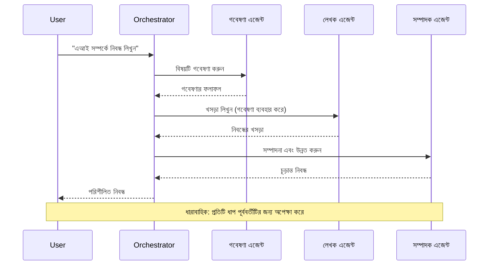
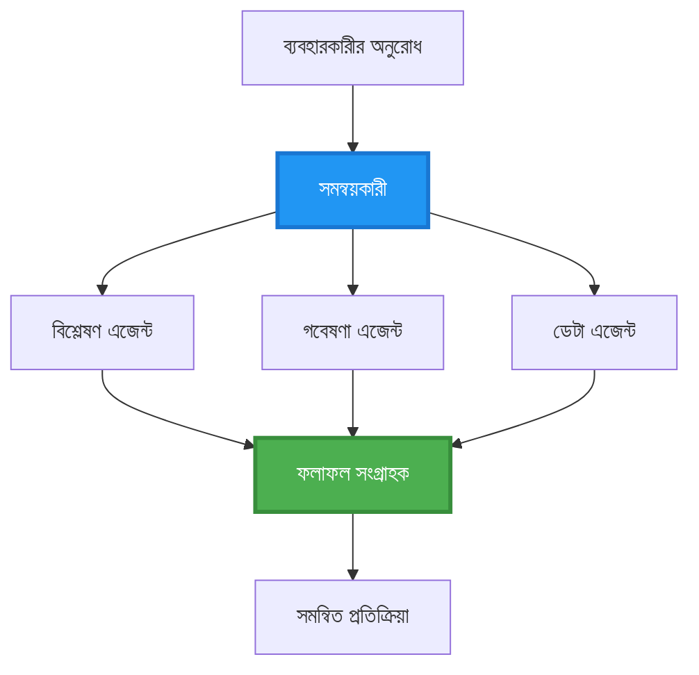
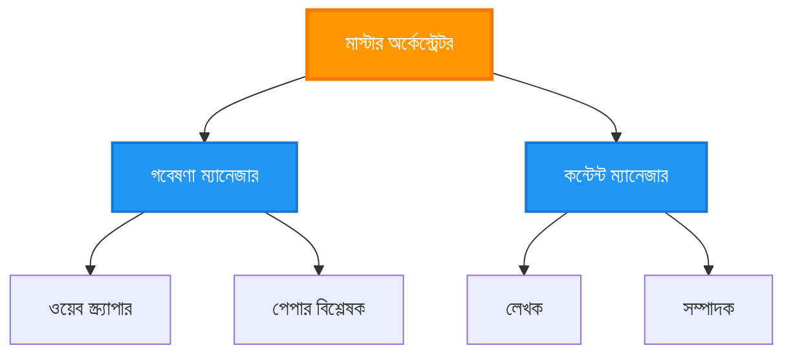
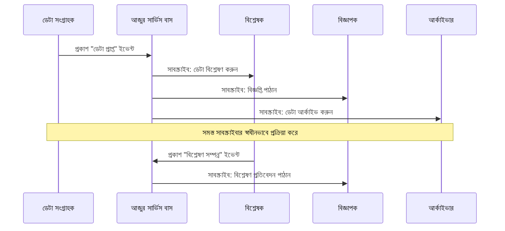
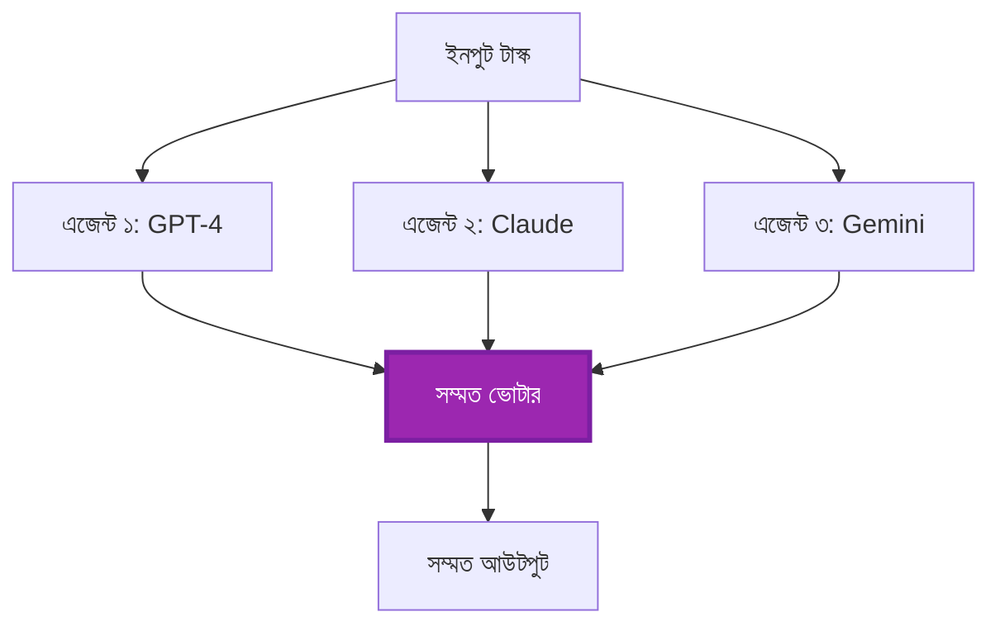
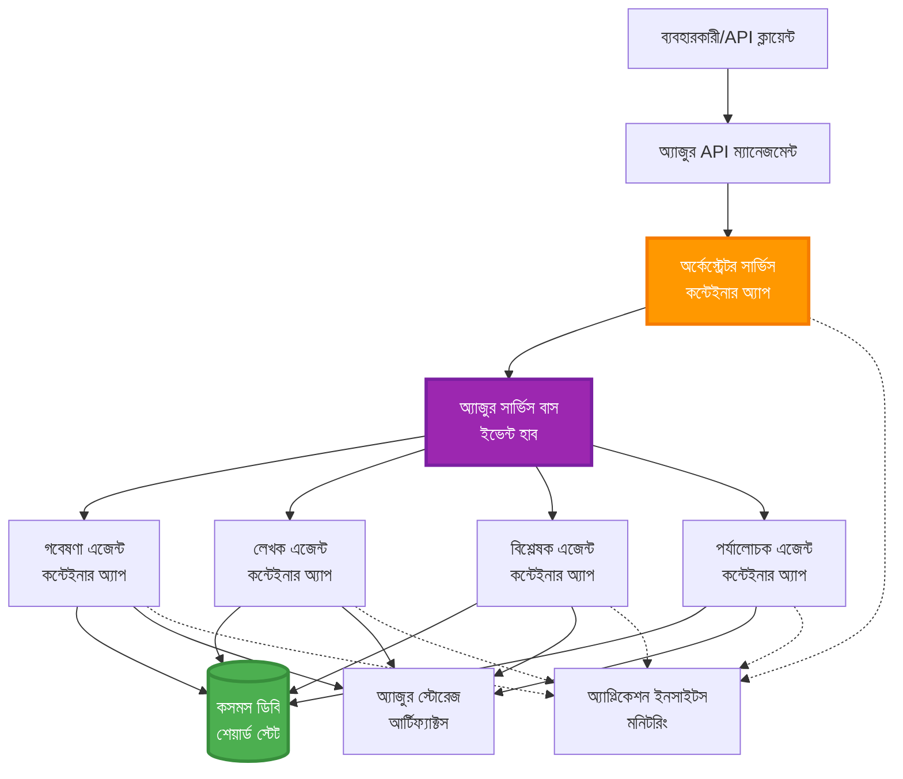

<!--
CO_OP_TRANSLATOR_METADATA:
{
  "original_hash": "bcefbd5d0107691ef3e6e33ba694d6f4",
  "translation_date": "2025-11-20T15:27:07+00:00",
  "source_file": "docs/pre-deployment/coordination-patterns.md",
  "language_code": "bn"
}
-->
# মাল্টি-এজেন্ট সমন্বয় প্যাটার্ন

⏱️ **আনুমানিক সময়**: ৬০-৭৫ মিনিট | 💰 **আনুমানিক খরচ**: ~$১০০-৩০০/মাস | ⭐ **জটিলতা**: উন্নত

**📚 শেখার পথ:**
- ← পূর্ববর্তী: [ক্ষমতা পরিকল্পনা](capacity-planning.md) - রিসোর্স সাইজিং এবং স্কেলিং কৌশল
- 🎯 **আপনি এখানে আছেন**: মাল্টি-এজেন্ট সমন্বয় প্যাটার্ন (অর্কেস্ট্রেশন, যোগাযোগ, স্টেট ম্যানেজমেন্ট)
- → পরবর্তী: [SKU নির্বাচন](sku-selection.md) - সঠিক Azure পরিষেবা নির্বাচন
- 🏠 [কোর্স হোম](../../README.md)

---

## আপনি কী শিখবেন

এই পাঠটি সম্পন্ন করার মাধ্যমে আপনি:
- **মাল্টি-এজেন্ট আর্কিটেকচার** প্যাটার্ন এবং সেগুলি কখন ব্যবহার করবেন তা বুঝতে পারবেন
- **অর্কেস্ট্রেশন প্যাটার্ন** (কেন্দ্রীভূত, বিকেন্দ্রীভূত, শ্রেণিবদ্ধ) বাস্তবায়ন করতে পারবেন
- **এজেন্ট যোগাযোগ** কৌশল ডিজাইন করতে পারবেন (সিঙ্ক্রোনাস, অ্যাসিঙ্ক্রোনাস, ইভেন্ট-ড্রিভেন)
- বিতরণকৃত এজেন্টদের মধ্যে **শেয়ার্ড স্টেট** পরিচালনা করতে পারবেন
- AZD ব্যবহার করে **মাল্টি-এজেন্ট সিস্টেম** ডিপ্লয় করতে পারবেন
- বাস্তব জীবনের AI পরিস্থিতির জন্য **সমন্বয় প্যাটার্ন** প্রয়োগ করতে পারবেন
- বিতরণকৃত এজেন্ট সিস্টেম মনিটর এবং ডিবাগ করতে পারবেন

## কেন মাল্টি-এজেন্ট সমন্বয় গুরুত্বপূর্ণ

### বিবর্তন: একক এজেন্ট থেকে মাল্টি-এজেন্ট

**একক এজেন্ট (সহজ):**
```
User → Agent → Response
```
- ✅ বোঝা এবং বাস্তবায়ন সহজ
- ✅ সহজ কাজের জন্য দ্রুত
- ❌ একক মডেলের ক্ষমতার মধ্যে সীমাবদ্ধ
- ❌ জটিল কাজ সমান্তরালভাবে করতে পারে না
- ❌ বিশেষায়িত নয়

**মাল্টি-এজেন্ট সিস্টেম (উন্নত):**
```
           ┌─────────────┐
           │ Orchestrator│
           └──────┬──────┘
        ┌─────────┼─────────┐
        │         │         │
    ┌───▼──┐  ┌──▼───┐  ┌──▼────┐
    │Agent1│  │Agent2│  │Agent3 │
    │(Plan)│  │(Code)│  │(Review)│
    └──────┘  └──────┘  └───────┘
```
- ✅ নির্দিষ্ট কাজের জন্য বিশেষায়িত এজেন্ট
- ✅ গতি বাড়ানোর জন্য সমান্তরাল কার্যক্রম
- ✅ মডুলার এবং রক্ষণাবেক্ষণযোগ্য
- ✅ জটিল ওয়ার্কফ্লোতে আরও কার্যকর
- ⚠️ সমন্বয় লজিক প্রয়োজন

**উপমা**: একক এজেন্ট হলো একজন ব্যক্তি যিনি সব কাজ করেন। মাল্টি-এজেন্ট হলো একটি দল যেখানে প্রতিটি সদস্যের নির্দিষ্ট দক্ষতা রয়েছে (গবেষক, কোডার, রিভিউয়ার, লেখক) এবং তারা একসঙ্গে কাজ করে।

---

## মূল সমন্বয় প্যাটার্ন

### প্যাটার্ন ১: ক্রমানুসার সমন্বয় (চেইন অফ রেসপন্সিবিলিটি)

**কখন ব্যবহার করবেন**: কাজগুলো নির্দিষ্ট ক্রমে সম্পন্ন করতে হবে, প্রতিটি এজেন্ট পূর্ববর্তী আউটপুটের উপর ভিত্তি করে কাজ করে।


**সুবিধা:**
- ✅ পরিষ্কার ডেটা প্রবাহ
- ✅ ডিবাগ করা সহজ
- ✅ পূর্বানুমানযোগ্য কার্যক্রম ক্রম

**সীমাবদ্ধতা:**
- ❌ ধীর (সমান্তরালতা নেই)
- ❌ একটি ব্যর্থতা পুরো চেইনকে ব্লক করে
- ❌ আন্তঃনির্ভরশীল কাজ পরিচালনা করতে পারে না

**উদাহরণ ব্যবহার ক্ষেত্র:**
- কন্টেন্ট তৈরি পাইপলাইন (গবেষণা → লেখা → সম্পাদনা → প্রকাশ)
- কোড জেনারেশন (পরিকল্পনা → বাস্তবায়ন → পরীক্ষা → ডিপ্লয়)
- রিপোর্ট তৈরি (ডেটা সংগ্রহ → বিশ্লেষণ → ভিজ্যুয়ালাইজেশন → সারাংশ)

---

### প্যাটার্ন ২: সমান্তরাল সমন্বয় (ফ্যান-আউট/ফ্যান-ইন)

**কখন ব্যবহার করবেন**: স্বাধীন কাজগুলো একসঙ্গে চালানো যায়, ফলাফল শেষে একত্রিত হয়।


**সুবিধা:**
- ✅ দ্রুত (সমান্তরাল কার্যক্রম)
- ✅ ফল্ট-টলারেন্ট (আংশিক ফলাফল গ্রহণযোগ্য)
- ✅ অনুভূমিকভাবে স্কেলযোগ্য

**সীমাবদ্ধতা:**
- ⚠️ ফলাফল অর্ডারবিহীন আসতে পারে
- ⚠️ একত্রিত করার লজিক প্রয়োজন
- ⚠️ জটিল স্টেট ম্যানেজমেন্ট

**উদাহরণ ব্যবহার ক্ষেত্র:**
- মাল্টি-সোর্স ডেটা সংগ্রহ (API + ডাটাবেস + ওয়েব স্ক্র্যাপিং)
- প্রতিযোগিতামূলক বিশ্লেষণ (বিভিন্ন মডেল সমাধান তৈরি করে, সেরা নির্বাচন করা হয়)
- অনুবাদ পরিষেবা (একসঙ্গে বিভিন্ন ভাষায় অনুবাদ)

---

### প্যাটার্ন ৩: শ্রেণিবদ্ধ সমন্বয় (ম্যানেজার-ওয়ার্কার)

**কখন ব্যবহার করবেন**: জটিল ওয়ার্কফ্লো যেখানে সাব-টাস্ক এবং ডেলিগেশন প্রয়োজন।


**সুবিধা:**
- ✅ জটিল ওয়ার্কফ্লো পরিচালনা করে
- ✅ মডুলার এবং রক্ষণাবেক্ষণযোগ্য
- ✅ পরিষ্কার দায়িত্বের সীমানা

**সীমাবদ্ধতা:**
- ⚠️ আরও জটিল আর্কিটেকচার
- ⚠️ বেশি লেটেন্সি (বহু সমন্বয় স্তর)
- ⚠️ উন্নত অর্কেস্ট্রেশন প্রয়োজন

**উদাহরণ ব্যবহার ক্ষেত্র:**
- এন্টারপ্রাইজ ডকুমেন্ট প্রসেসিং (শ্রেণিবদ্ধ → রুট → প্রসেস → আর্কাইভ)
- মাল্টি-স্টেজ ডেটা পাইপলাইন (ইনজেস্ট → ক্লিন → ট্রান্সফর্ম → বিশ্লেষণ → রিপোর্ট)
- জটিল অটোমেশন ওয়ার্কফ্লো (পরিকল্পনা → রিসোর্স বরাদ্দ → কার্যক্রম → মনিটরিং)

---

### প্যাটার্ন ৪: ইভেন্ট-ড্রিভেন সমন্বয় (পাবলিশ-সাবস্ক্রাইব)

**কখন ব্যবহার করবেন**: এজেন্টদের ইভেন্টে প্রতিক্রিয়া জানাতে হবে, লুজ কাপলিং প্রয়োজন।


**সুবিধা:**
- ✅ এজেন্টদের মধ্যে লুজ কাপলিং
- ✅ নতুন এজেন্ট যোগ করা সহজ (শুধু সাবস্ক্রাইব করুন)
- ✅ অ্যাসিঙ্ক্রোনাস প্রসেসিং
- ✅ রেজিলিয়েন্ট (মেসেজ পারসিস্টেন্স)

**সীমাবদ্ধতা:**
- ⚠️ ইভেন্টুয়াল কনসিস্টেন্সি
- ⚠️ জটিল ডিবাগিং
- ⚠️ মেসেজ অর্ডারিং চ্যালেঞ্জ

**উদাহরণ ব্যবহার ক্ষেত্র:**
- রিয়েল-টাইম মনিটরিং সিস্টেম (অ্যালার্ট, ড্যাশবোর্ড, লগ)
- মাল্টি-চ্যানেল নোটিফিকেশন (ইমেইল, এসএমএস, পুশ, স্ল্যাক)
- ডেটা প্রসেসিং পাইপলাইন (একই ডেটার একাধিক কনজিউমার)

---

### প্যাটার্ন ৫: কনসেনসাস-ভিত্তিক সমন্বয় (ভোটিং/কোয়ারাম)

**কখন ব্যবহার করবেন**: একাধিক এজেন্টের সম্মতি প্রয়োজন।


**সুবিধা:**
- ✅ উচ্চতর নির্ভুলতা (বহু মতামত)
- ✅ ফল্ট-টলারেন্ট (সংখ্যালঘু ব্যর্থতা গ্রহণযোগ্য)
- ✅ গুণগত নিশ্চয়তা অন্তর্ভুক্ত

**সীমাবদ্ধতা:**
- ❌ ব্যয়বহুল (বহু মডেল কল)
- ❌ ধীর (সব এজেন্টের জন্য অপেক্ষা)
- ⚠️ দ্বন্দ্ব সমাধান প্রয়োজন

**উদাহরণ ব্যবহার ক্ষেত্র:**
- কন্টেন্ট মডারেশন (বহু মডেল কন্টেন্ট রিভিউ করে)
- কোড রিভিউ (বহু লিন্টার/অ্যানালাইজার)
- মেডিকেল ডায়াগনোসিস (বহু AI মডেল, বিশেষজ্ঞ যাচাই)

---

## আর্কিটেকচার ওভারভিউ

### সম্পূর্ণ মাল্টি-এজেন্ট সিস্টেম Azure-এ


**মূল উপাদান:**

| উপাদান | উদ্দেশ্য | Azure পরিষেবা |
|--------|----------|---------------|
| **API গেটওয়ে** | এন্ট্রি পয়েন্ট, রেট লিমিটিং, অথ | API ম্যানেজমেন্ট |
| **অর্কেস্ট্রেটর** | এজেন্ট ওয়ার্কফ্লো সমন্বয় করে | কন্টেইনার অ্যাপস |
| **মেসেজ কিউ** | অ্যাসিঙ্ক্রোনাস যোগাযোগ | সার্ভিস বাস / ইভেন্ট হাব |
| **এজেন্ট** | বিশেষায়িত AI কর্মী | কন্টেইনার অ্যাপস / ফাংশন |
| **স্টেট স্টোর** | শেয়ার্ড স্টেট, টাস্ক ট্র্যাকিং | কসমস ডিবি |
| **আর্টিফ্যাক্ট স্টোরেজ** | ডকুমেন্ট, ফলাফল, লগ | ব্লব স্টোরেজ |
| **মনিটরিং** | বিতরণকৃত ট্রেসিং, লগ | অ্যাপ্লিকেশন ইনসাইটস |

--- 

## প্রয়োজনীয়তা

### প্রয়োজনীয় টুলস

```bash
# অ্যাজুর ডেভেলপার CLI যাচাই করুন
azd version
# ✅ প্রত্যাশিত: azd সংস্করণ 1.0.0 বা তার বেশি

# অ্যাজুর CLI যাচাই করুন
az --version
# ✅ প্রত্যাশিত: azure-cli 2.50.0 বা তার বেশি

# ডকার যাচাই করুন (স্থানীয় পরীক্ষার জন্য)
docker --version
# ✅ প্রত্যাশিত: ডকার সংস্করণ 20.10 বা তার বেশি
```

### Azure প্রয়োজনীয়তা

- সক্রিয় Azure সাবস্ক্রিপশন
- তৈরি করার অনুমতি:
  - কন্টেইনার অ্যাপস
  - সার্ভিস বাস নেমস্পেস
  - কসমস ডিবি অ্যাকাউন্ট
  - স্টোরেজ অ্যাকাউন্ট
  - অ্যাপ্লিকেশন ইনসাইটস

### জ্ঞান প্রয়োজনীয়তা

আপনার সম্পন্ন করা উচিত:
- [কনফিগারেশন ম্যানেজমেন্ট](../getting-started/configuration.md)
- [অথেন্টিকেশন ও সিকিউরিটি](../getting-started/authsecurity.md)
- [মাইক্রোসার্ভিস উদাহরণ](../../../../examples/microservices)

--- 

## বাস্তবায়ন গাইড

### প্রকল্প কাঠামো

```
multi-agent-system/
├── azure.yaml                    # AZD configuration
├── infra/
│   ├── main.bicep               # Main infrastructure
│   ├── core/
│   │   ├── servicebus.bicep     # Message queue
│   │   ├── cosmos.bicep         # State store
│   │   ├── storage.bicep        # Artifact storage
│   │   └── monitoring.bicep     # Application Insights
│   └── app/
│       ├── orchestrator.bicep   # Orchestrator service
│       └── agent.bicep          # Agent template
└── src/
    ├── orchestrator/            # Orchestration logic
    │   ├── app.py
    │   ├── workflows.py
    │   └── Dockerfile
    ├── agents/
    │   ├── research/            # Research agent
    │   ├── writer/              # Writer agent
    │   ├── analyst/             # Analyst agent
    │   └── reviewer/            # Reviewer agent
    └── shared/
        ├── state_manager.py     # Shared state logic
        └── message_handler.py   # Message handling
```

--- 

## পাঠ ১: ক্রমানুসার সমন্বয় প্যাটার্ন

### বাস্তবায়ন: কন্টেন্ট তৈরি পাইপলাইন

চলুন একটি ক্রমানুসার পাইপলাইন তৈরি করি: গবেষণা → লেখা → সম্পাদনা → প্রকাশ

### ১. AZD কনফিগারেশন

**ফাইল: `azure.yaml`**

```yaml
name: content-pipeline
metadata:
  template: multi-agent-sequential@1.0.0

services:
  orchestrator:
    project: ./src/orchestrator
    language: python
    host: containerapp
  
  research-agent:
    project: ./src/agents/research
    language: python
    host: containerapp
  
  writer-agent:
    project: ./src/agents/writer
    language: python
    host: containerapp
  
  editor-agent:
    project: ./src/agents/editor
    language: python
    host: containerapp
```

### ২. অবকাঠামো: সমন্বয়ের জন্য সার্ভিস বাস

**ফাইল: `infra/core/servicebus.bicep`**

```bicep
param name string
param location string
param tags object = {}

resource serviceBusNamespace 'Microsoft.ServiceBus/namespaces@2022-10-01-preview' = {
  name: name
  location: location
  tags: tags
  sku: {
    name: 'Standard'
    tier: 'Standard'
  }
  properties: {
    minimumTlsVersion: '1.2'
  }
}

// Queue for orchestrator → research agent
resource researchQueue 'Microsoft.ServiceBus/namespaces/queues@2022-10-01-preview' = {
  parent: serviceBusNamespace
  name: 'research-tasks'
  properties: {
    maxDeliveryCount: 3
    lockDuration: 'PT5M'
    deadLetteringOnMessageExpiration: true
  }
}

// Queue for research agent → writer agent
resource writerQueue 'Microsoft.ServiceBus/namespaces/queues@2022-10-01-preview' = {
  parent: serviceBusNamespace
  name: 'writer-tasks'
  properties: {
    maxDeliveryCount: 3
    lockDuration: 'PT5M'
  }
}

// Queue for writer agent → editor agent
resource editorQueue 'Microsoft.ServiceBus/namespaces/queues@2022-10-01-preview' = {
  parent: serviceBusNamespace
  name: 'editor-tasks'
  properties: {
    maxDeliveryCount: 3
    lockDuration: 'PT5M'
  }
}

output namespace string = serviceBusNamespace.name
output connectionString string = listKeys('${serviceBusNamespace.id}/AuthorizationRules/RootManageSharedAccessKey', serviceBusNamespace.apiVersion).primaryConnectionString
```

### ৩. শেয়ার্ড স্টেট ম্যানেজার

**ফাইল: `src/shared/state_manager.py`**

```python
from azure.cosmos import CosmosClient, PartitionKey
from datetime import datetime
import os

class StateManager:
    """Manages shared state across agents using Cosmos DB"""
    
    def __init__(self):
        endpoint = os.environ['COSMOS_ENDPOINT']
        key = os.environ['COSMOS_KEY']
        
        self.client = CosmosClient(endpoint, key)
        self.database = self.client.get_database_client('agent-state')
        self.container = self.database.get_container_client('tasks')
    
    def create_task(self, task_id: str, task_type: str, input_data: dict):
        """Create a new task"""
        task = {
            'id': task_id,
            'type': task_type,
            'status': 'pending',
            'input': input_data,
            'created_at': datetime.utcnow().isoformat(),
            'steps': []
        }
        self.container.create_item(task)
        return task
    
    def update_task_step(self, task_id: str, step_name: str, result: dict):
        """Update task with completed step"""
        task = self.container.read_item(task_id, partition_key=task_id)
        
        task['steps'].append({
            'name': step_name,
            'completed_at': datetime.utcnow().isoformat(),
            'result': result
        })
        
        self.container.replace_item(task_id, task)
        return task
    
    def complete_task(self, task_id: str, final_result: dict):
        """Mark task as complete"""
        task = self.container.read_item(task_id, partition_key=task_id)
        task['status'] = 'completed'
        task['result'] = final_result
        task['completed_at'] = datetime.utcnow().isoformat()
        self.container.replace_item(task_id, task)
        return task
    
    def get_task(self, task_id: str):
        """Retrieve task state"""
        return self.container.read_item(task_id, partition_key=task_id)
```

### ৪. অর্কেস্ট্রেটর সার্ভিস

**ফাইল: `src/orchestrator/app.py`**

```python
from flask import Flask, request, jsonify
from azure.servicebus import ServiceBusClient, ServiceBusMessage
import json
import uuid
import os
from shared.state_manager import StateManager

app = Flask(__name__)
state_manager = StateManager()

# সার্ভিস বাস সংযোগ
servicebus_connection_str = os.environ['SERVICEBUS_CONNECTION_STRING']
servicebus_client = ServiceBusClient.from_connection_string(servicebus_connection_str)

@app.route('/health', methods=['GET'])
def health():
    return jsonify({'status': 'healthy', 'service': 'orchestrator'})

@app.route('/create-content', methods=['POST'])
def create_content():
    """
    Sequential workflow: Research → Write → Edit → Publish
    """
    data = request.json
    topic = data.get('topic')
    
    if not topic:
        return jsonify({'error': 'Topic required'}), 400
    
    # স্টেট স্টোরে টাস্ক তৈরি করুন
    task_id = str(uuid.uuid4())
    task = state_manager.create_task(
        task_id=task_id,
        task_type='content_creation',
        input_data={'topic': topic}
    )
    
    # গবেষণা এজেন্টকে বার্তা পাঠান (প্রথম ধাপ)
    sender = servicebus_client.get_queue_sender('research-tasks')
    message = ServiceBusMessage(
        body=json.dumps({
            'task_id': task_id,
            'topic': topic,
            'next_queue': 'writer-tasks'  # ফলাফল কোথায় পাঠাতে হবে
        }),
        content_type='application/json'
    )
    
    with sender:
        sender.send_messages(message)
    
    return jsonify({
        'task_id': task_id,
        'status': 'started',
        'workflow': 'sequential',
        'steps': ['research', 'write', 'edit', 'publish'],
        'message': 'Content creation pipeline initiated'
    }), 202

@app.route('/task/<task_id>', methods=['GET'])
def get_task_status(task_id):
    """Check task status"""
    try:
        task = state_manager.get_task(task_id)
        return jsonify(task)
    except Exception as e:
        return jsonify({'error': str(e)}), 404

if __name__ == '__main__':
    app.run(host='0.0.0.0', port=8080)
```

### ৫. গবেষণা এজেন্ট

**ফাইল: `src/agents/research/app.py`**

```python
from azure.servicebus import ServiceBusClient, ServiceBusMessage
from openai import AzureOpenAI
import json
import os
import time
from shared.state_manager import StateManager

# ক্লায়েন্টদের সূচনা করুন
state_manager = StateManager()
servicebus_client = ServiceBusClient.from_connection_string(
    os.environ['SERVICEBUS_CONNECTION_STRING']
)

openai_client = AzureOpenAI(
    api_key=os.environ['AZURE_OPENAI_API_KEY'],
    api_version="2024-02-01",
    azure_endpoint=os.environ['AZURE_OPENAI_ENDPOINT']
)

def process_research_task(message_data):
    """Process research request and pass to writer"""
    task_id = message_data['task_id']
    topic = message_data['topic']
    next_queue = message_data['next_queue']
    
    print(f"🔬 Researching: {topic}")
    
    # গবেষণার জন্য Azure OpenAI কল করুন
    response = openai_client.chat.completions.create(
        model="gpt-4",
        messages=[
            {"role": "system", "content": "You are a research assistant. Provide comprehensive research on the given topic."},
            {"role": "user", "content": f"Research this topic thoroughly: {topic}"}
        ],
        max_tokens=1500
    )
    
    research_results = response.choices[0].message.content
    
    # অবস্থা আপডেট করুন
    state_manager.update_task_step(
        task_id=task_id,
        step_name='research',
        result={'research': research_results}
    )
    
    # পরবর্তী এজেন্ট (লেখক) এর কাছে পাঠান
    sender = servicebus_client.get_queue_sender(next_queue)
    message = ServiceBusMessage(
        body=json.dumps({
            'task_id': task_id,
            'topic': topic,
            'research': research_results,
            'next_queue': 'editor-tasks'
        }),
        content_type='application/json'
    )
    
    with sender:
        sender.send_messages(message)
    
    print(f"✅ Research complete for task {task_id}")

def main():
    """Listen to research queue"""
    receiver = servicebus_client.get_queue_receiver('research-tasks')
    
    print("🔬 Research Agent started, listening for tasks...")
    
    with receiver:
        while True:
            messages = receiver.receive_messages(max_wait_time=5)
            for message in messages:
                try:
                    message_data = json.loads(str(message))
                    process_research_task(message_data)
                    receiver.complete_message(message)
                except Exception as e:
                    print(f"❌ Error processing message: {e}")
                    receiver.abandon_message(message)

if __name__ == '__main__':
    main()
```

### ৬. লেখক এজেন্ট

**ফাইল: `src/agents/writer/app.py`**

```python
from azure.servicebus import ServiceBusClient, ServiceBusMessage
from openai import AzureOpenAI
import json
import os
from shared.state_manager import StateManager

state_manager = StateManager()
servicebus_client = ServiceBusClient.from_connection_string(
    os.environ['SERVICEBUS_CONNECTION_STRING']
)

openai_client = AzureOpenAI(
    api_key=os.environ['AZURE_OPENAI_API_KEY'],
    api_version="2024-02-01",
    azure_endpoint=os.environ['AZURE_OPENAI_ENDPOINT']
)

def process_writing_task(message_data):
    """Write article based on research"""
    task_id = message_data['task_id']
    topic = message_data['topic']
    research = message_data['research']
    next_queue = message_data['next_queue']
    
    print(f"✍️ Writing article: {topic}")
    
    # অ্যাজুর ওপেনএআই কল করুন নিবন্ধ লেখার জন্য
    response = openai_client.chat.completions.create(
        model="gpt-4",
        messages=[
            {"role": "system", "content": "You are a professional writer. Write engaging, well-structured articles."},
            {"role": "user", "content": f"Based on this research:\n\n{research}\n\nWrite a comprehensive article about: {topic}"}
        ],
        max_tokens=2000
    )
    
    article_draft = response.choices[0].message.content
    
    # অবস্থা আপডেট করুন
    state_manager.update_task_step(
        task_id=task_id,
        step_name='writing',
        result={'draft': article_draft}
    )
    
    # সম্পাদককে পাঠান
    sender = servicebus_client.get_queue_sender(next_queue)
    message = ServiceBusMessage(
        body=json.dumps({
            'task_id': task_id,
            'topic': topic,
            'draft': article_draft
        }),
        content_type='application/json'
    )
    
    with sender:
        sender.send_messages(message)
    
    print(f"✅ Article draft complete for task {task_id}")

def main():
    """Listen to writer queue"""
    receiver = servicebus_client.get_queue_receiver('writer-tasks')
    
    print("✍️ Writer Agent started, listening for tasks...")
    
    with receiver:
        while True:
            messages = receiver.receive_messages(max_wait_time=5)
            for message in messages:
                try:
                    message_data = json.loads(str(message))
                    process_writing_task(message_data)
                    receiver.complete_message(message)
                except Exception as e:
                    print(f"❌ Error: {e}")
                    receiver.abandon_message(message)

if __name__ == '__main__':
    main()
```

### ৭. সম্পাদক এজেন্ট

**ফাইল: `src/agents/editor/app.py`**

```python
from azure.servicebus import ServiceBusClient
from openai import AzureOpenAI
import json
import os
from shared.state_manager import StateManager

state_manager = StateManager()
servicebus_client = ServiceBusClient.from_connection_string(
    os.environ['SERVICEBUS_CONNECTION_STRING']
)

openai_client = AzureOpenAI(
    api_key=os.environ['AZURE_OPENAI_API_KEY'],
    api_version="2024-02-01",
    azure_endpoint=os.environ['AZURE_OPENAI_ENDPOINT']
)

def process_editing_task(message_data):
    """Edit and finalize article"""
    task_id = message_data['task_id']
    topic = message_data['topic']
    draft = message_data['draft']
    
    print(f"📝 Editing article: {topic}")
    
    # Azure OpenAI-কে সম্পাদনার জন্য কল করুন
    response = openai_client.chat.completions.create(
        model="gpt-4",
        messages=[
            {"role": "system", "content": "You are an expert editor. Improve grammar, clarity, and structure."},
            {"role": "user", "content": f"Edit and improve this article:\n\n{draft}"}
        ],
        max_tokens=2000
    )
    
    final_article = response.choices[0].message.content
    
    # কাজটি সম্পন্ন হিসাবে চিহ্নিত করুন
    state_manager.complete_task(
        task_id=task_id,
        final_result={
            'topic': topic,
            'final_article': final_article,
            'word_count': len(final_article.split())
        }
    )
    
    print(f"✅ Article finalized for task {task_id}")

def main():
    """Listen to editor queue"""
    receiver = servicebus_client.get_queue_receiver('editor-tasks')
    
    print("📝 Editor Agent started, listening for tasks...")
    
    with receiver:
        while True:
            messages = receiver.receive_messages(max_wait_time=5)
            for message in messages:
                try:
                    message_data = json.loads(str(message))
                    process_editing_task(message_data)
                    receiver.complete_message(message)
                except Exception as e:
                    print(f"❌ Error: {e}")
                    receiver.abandon_message(message)

if __name__ == '__main__':
    main()
```

### ৮. ডিপ্লয় এবং পরীক্ষা

```bash
# আরম্ভ করুন এবং স্থাপন করুন
azd init
azd up

# অর্কেস্ট্রেটর URL পান
ORCHESTRATOR_URL=$(azd env get-values | grep ORCHESTRATOR_URL | cut -d '=' -f2 | tr -d '"')

# বিষয়বস্তু তৈরি করুন
curl -X POST $ORCHESTRATOR_URL/create-content \
  -H "Content-Type: application/json" \
  -d '{"topic": "The Future of AI in Healthcare"}'
```

**✅ প্রত্যাশিত আউটপুট:**
```json
{
  "task_id": "a1b2c3d4-e5f6-7890-abcd-ef1234567890",
  "status": "started",
  "workflow": "sequential",
  "steps": ["research", "write", "edit", "publish"],
  "message": "Content creation pipeline initiated"
}
```

**টাস্ক অগ্রগতি পরীক্ষা করুন:**
```bash
TASK_ID="a1b2c3d4-e5f6-7890-abcd-ef1234567890"
curl $ORCHESTRATOR_URL/task/$TASK_ID
```

**✅ প্রত্যাশিত আউটপুট (সম্পন্ন):**
```json
{
  "id": "a1b2c3d4-e5f6-7890-abcd-ef1234567890",
  "type": "content_creation",
  "status": "completed",
  "steps": [
    {
      "name": "research",
      "completed_at": "2025-11-19T10:30:00Z",
      "result": {"research": "..."}
    },
    {
      "name": "writing",
      "completed_at": "2025-11-19T10:32:00Z",
      "result": {"draft": "..."}
    }
  ],
  "result": {
    "topic": "The Future of AI in Healthcare",
    "final_article": "...",
    "word_count": 1500
  }
}
```

--- 

## পাঠ ২: সমান্তরাল সমন্বয় প্যাটার্ন

### বাস্তবায়ন: মাল্টি-সোর্স গবেষণা সংগ্রাহক

চলুন একটি সমান্তরাল সিস্টেম তৈরি করি যা একসঙ্গে বিভিন্ন উৎস থেকে তথ্য সংগ্রহ করে।

### সমান্তরাল অর্কেস্ট্রেটর

**ফাইল: `src/orchestrator/parallel_workflow.py`**

```python
from flask import Flask, request, jsonify
from azure.servicebus import ServiceBusClient, ServiceBusMessage
import json
import uuid
import os
from shared.state_manager import StateManager

app = Flask(__name__)
state_manager = StateManager()

servicebus_client = ServiceBusClient.from_connection_string(
    os.environ['SERVICEBUS_CONNECTION_STRING']
)

@app.route('/research-parallel', methods=['POST'])
def research_parallel():
    """
    Parallel workflow: Multiple agents work simultaneously
    """
    data = request.json
    query = data.get('query')
    
    task_id = str(uuid.uuid4())
    task = state_manager.create_task(
        task_id=task_id,
        task_type='parallel_research',
        input_data={
            'query': query,
            'agents': ['web', 'academic', 'news', 'social']
        }
    )
    
    # ফ্যান-আউট: সমস্ত এজেন্টদের একসাথে পাঠান
    agents = [
        ('web-research-queue', 'web'),
        ('academic-research-queue', 'academic'),
        ('news-research-queue', 'news'),
        ('social-research-queue', 'social')
    ]
    
    for queue_name, agent_type in agents:
        sender = servicebus_client.get_queue_sender(queue_name)
        message = ServiceBusMessage(
            body=json.dumps({
                'task_id': task_id,
                'query': query,
                'agent_type': agent_type,
                'result_queue': 'aggregation-queue'
            }),
            content_type='application/json'
        )
        
        with sender:
            sender.send_messages(message)
    
    return jsonify({
        'task_id': task_id,
        'status': 'started',
        'workflow': 'parallel',
        'agents_dispatched': 4,
        'message': 'Parallel research initiated'
    }), 202

if __name__ == '__main__':
    app.run(host='0.0.0.0', port=8080)
```

### একত্রিত করার লজিক

**ফাইল: `src/agents/aggregator/app.py`**

```python
from azure.servicebus import ServiceBusClient
import json
import os
from collections import defaultdict
from shared.state_manager import StateManager

state_manager = StateManager()
servicebus_client = ServiceBusClient.from_connection_string(
    os.environ['SERVICEBUS_CONNECTION_STRING']
)

# প্রতিটি কাজের ফলাফল ট্র্যাক করুন
task_results = defaultdict(list)
expected_agents = 4  # ওয়েব, একাডেমিক, সংবাদ, সামাজিক

def process_result(message_data):
    """Aggregate results from parallel agents"""
    task_id = message_data['task_id']
    agent_type = message_data['agent_type']
    result = message_data['result']
    
    # ফলাফল সংরক্ষণ করুন
    task_results[task_id].append({
        'agent': agent_type,
        'data': result
    })
    
    print(f"📊 Received result from {agent_type} agent ({len(task_results[task_id])}/{expected_agents})")
    
    # পরীক্ষা করুন সমস্ত এজেন্ট সম্পন্ন করেছে কিনা (ফ্যান-ইন)
    if len(task_results[task_id]) == expected_agents:
        print(f"✅ All agents completed for task {task_id}. Aggregating...")
        
        # ফলাফল একত্রিত করুন
        aggregated = {
            'query': message_data['query'],
            'sources': task_results[task_id],
            'summary': generate_summary(task_results[task_id])
        }
        
        # সম্পন্ন হিসাবে চিহ্নিত করুন
        state_manager.complete_task(task_id, aggregated)
        
        # পরিষ্কার করুন
        del task_results[task_id]
        
        print(f"✅ Aggregation complete for task {task_id}")

def generate_summary(results):
    """Generate summary from all sources"""
    summaries = [r['data'].get('summary', '') for r in results]
    return '\n\n'.join(summaries)

def main():
    """Listen to aggregation queue"""
    receiver = servicebus_client.get_queue_receiver('aggregation-queue')
    
    print("📊 Aggregator started, listening for results...")
    
    with receiver:
        while True:
            messages = receiver.receive_messages(max_wait_time=5)
            for message in messages:
                try:
                    message_data = json.loads(str(message))
                    process_result(message_data)
                    receiver.complete_message(message)
                except Exception as e:
                    print(f"❌ Error: {e}")
                    receiver.abandon_message(message)

if __name__ == '__main__':
    main()
```

**সমান্তরাল প্যাটার্নের সুবিধা:**
- ⚡ **৪x দ্রুত** (এজেন্ট একসঙ্গে চলে)
- 🔄 **ফল্ট-টলারেন্ট** (আংশিক ফলাফল গ্রহণযোগ্য)
- 📈 **স্কেলযোগ্য** (সহজেই আরও এজেন্ট যোগ করুন)

--- 

## ব্যবহারিক অনুশীলন

### অনুশীলন ১: টাইমআউট হ্যান্ডলিং যোগ করুন ⭐⭐ (মাঝারি)

**লক্ষ্য**: টাইমআউট লজিক বাস্তবায়ন করুন যাতে সংগ্রাহক ধীর এজেন্টদের জন্য চিরকাল অপেক্ষা না করে।

**ধাপসমূহ**:

1. **সংগ্রাহকে টাইমআউট ট্র্যাকিং যোগ করুন:**

```python
from datetime import datetime, timedelta

task_timeouts = {}  # টাস্ক_আইডি -> মেয়াদ শেষ হওয়ার সময়

def process_result(message_data):
    task_id = message_data['task_id']
    
    # প্রথম ফলাফলের উপর টাইমআউট সেট করুন
    if task_id not in task_timeouts:
        task_timeouts[task_id] = datetime.utcnow() + timedelta(seconds=30)
    
    task_results[task_id].append({
        'agent': message_data['agent_type'],
        'data': message_data['result']
    })
    
    # সম্পূর্ণ হয়েছে কিনা অথবা সময় শেষ হয়েছে কিনা পরীক্ষা করুন
    if len(task_results[task_id]) == expected_agents or \
       datetime.utcnow() > task_timeouts[task_id]:
        
        print(f"📊 Aggregating with {len(task_results[task_id])}/{expected_agents} results")
        
        aggregated = {
            'query': message_data['query'],
            'sources': task_results[task_id],
            'completed_agents': len(task_results[task_id]),
            'timed_out': len(task_results[task_id]) < expected_agents
        }
        
        state_manager.complete_task(task_id, aggregated)
        
        # পরিষ্কার করুন
        del task_results[task_id]
        del task_timeouts[task_id]
```

2. **কৃত্রিম বিলম্ব দিয়ে পরীক্ষা করুন:**

```python
# একটি এজেন্টে, ধীর প্রক্রিয়াকরণ অনুকরণ করতে বিলম্ব যোগ করুন
import time
time.sleep(35)  # ৩০-সেকেন্ড টাইমআউট অতিক্রম করে
```

3. **ডিপ্লয় এবং যাচাই করুন:**

```bash
azd deploy aggregator

# কাজ জমা দিন
curl -X POST $ORCHESTRATOR_URL/research-parallel \
  -H "Content-Type: application/json" \
  -d '{"query": "AI safety research"}'

# ৩০ সেকেন্ড পরে ফলাফল পরীক্ষা করুন
curl $ORCHESTRATOR_URL/task/$TASK_ID
```

**✅ সাফল্যের মানদণ্ড:**
- ✅ ৩০ সেকেন্ড পরে টাস্ক সম্পন্ন হয়, এমনকি এজেন্ট অসম্পূর্ণ থাকলেও
- ✅ প্রতিক্রিয়ায় আংশিক ফলাফল নির্দেশ করে (`"timed_out": true`)
- ✅ উপলব্ধ ফলাফল ফেরত দেওয়া হয় (৪ এজেন্টের মধ্যে ৩টি)

**সময়**: ২০-২৫ মিনিট

--- 

### অনুশীলন ২: রিট্রাই লজিক বাস্তবায়ন করুন ⭐⭐⭐ (উন্নত)

**লক্ষ্য**: ব্যর্থ এজেন্ট টাস্ক স্বয়ংক্রিয়ভাবে পুনরায় চেষ্টা করুন।

**ধাপসমূহ**:

1. **অর্কেস্ট্রেটরে রিট্রাই ট্র্যাকিং যোগ করুন:**

```python
from dataclasses import dataclass
from typing import Dict

@dataclass
class RetryConfig:
    max_retries: int = 3
    backoff_seconds: int = 5

retry_counts: Dict[str, int] = {}  # বার্তা_আইডি -> পুনরায় চেষ্টা গণনা

def send_with_retry(queue_name: str, message_data: dict, retry_config: RetryConfig):
    """Send message with retry metadata"""
    message_id = message_data.get('message_id', str(uuid.uuid4()))
    message_data['message_id'] = message_id
    message_data['retry_count'] = retry_counts.get(message_id, 0)
    message_data['max_retries'] = retry_config.max_retries
    
    sender = servicebus_client.get_queue_sender(queue_name)
    message = ServiceBusMessage(
        body=json.dumps(message_data),
        content_type='application/json',
        message_id=message_id
    )
    
    with sender:
        sender.send_messages(message)
```

2. **এজেন্টে রিট্রাই হ্যান্ডলার যোগ করুন:**

```python
def process_with_retry(message, receiver, process_func):
    """Process message with automatic retry on failure"""
    try:
        message_data = json.loads(str(message))
        
        # বার্তাটি প্রক্রিয়া করুন
        process_func(message_data)
        
        # সফল - সম্পন্ন
        receiver.complete_message(message)
        
    except Exception as e:
        message_id = message.message_id
        retry_count = message_data.get('retry_count', 0)
        max_retries = message_data.get('max_retries', 3)
        
        if retry_count < max_retries:
            # পুনরায় চেষ্টা করুন: ত্যাগ করুন এবং গণনা বৃদ্ধি করে পুনরায় সারিবদ্ধ করুন
            print(f"⚠️ Retry {retry_count + 1}/{max_retries} for message {message_id}")
            
            message_data['retry_count'] = retry_count + 1
            
            # একই সারিতে বিলম্ব সহ ফেরত পাঠান
            time.sleep(5 * (retry_count + 1))  # সূচকীয় ব্যাকঅফ
            send_with_retry(queue_name, message_data, RetryConfig())
            
            receiver.complete_message(message)  # মূলটি সরান
        else:
            # সর্বাধিক পুনরায় চেষ্টা অতিক্রম করেছে - মৃত চিঠি সারিতে স্থানান্তর করুন
            print(f"❌ Max retries exceeded for message {message_id}")
            receiver.dead_letter_message(
                message,
                reason="MaxRetriesExceeded",
                error_description=str(e)
            )
```

3. **ডেড লেটার কিউ মনিটর করুন:**

```python
def monitor_dead_letters():
    """Check dead letter queue for failed messages"""
    receiver = servicebus_client.get_queue_receiver(
        'research-queue',
        sub_queue='deadletter'
    )
    
    with receiver:
        messages = receiver.receive_messages(max_wait_time=5)
        for message in messages:
            print(f"☠️ Dead letter: {message.message_id}")
            print(f"Reason: {message.dead_letter_reason}")
            print(f"Description: {message.dead_letter_error_description}")
```

**✅ সাফল্যের মানদণ্ড:**
- ✅ ব্যর্থ টাস্ক স্বয়ংক্রিয়ভাবে পুনরায় চেষ্টা করে (৩ বার পর্যন্ত)
- ✅ রিট্রাইয়ের মধ্যে এক্সপোনেনশিয়াল ব্যাকঅফ (৫সেকেন্ড, ১০সেকেন্ড, ১৫সেকেন্ড)
- ✅ সর্বাধিক রিট্রাইয়ের পরে, মেসেজ ডেড লেটার কিউতে যায়
- ✅ ডেড লেটার কিউ মনিটর এবং পুনরায় চালানো যায়

**সময়**: ৩০-৪০ মিনিট

--- 

### অনুশীলন ৩: সার্কিট ব্রেকার বাস্তবায়ন করুন ⭐⭐⭐ (উন্নত)

**লক্ষ্য**: ব্যর্থ এজেন্টদের অনুরোধ বন্ধ করে ক্যাসকেডিং ব্যর্থতা প্রতিরোধ করুন।

**ধাপসমূহ**:

1. **সার্কিট ব্রেকার ক্লাস তৈরি করুন:**

```python
from enum import Enum
from datetime import datetime, timedelta

class CircuitState(Enum):
    CLOSED = "closed"      # স্বাভাবিক অপারেশন
    OPEN = "open"          # ব্যর্থ, অনুরোধগুলি প্রত্যাখ্যান করুন
    HALF_OPEN = "half_open"  # পুনরুদ্ধার হয়েছে কিনা পরীক্ষা করুন

class CircuitBreaker:
    def __init__(self, failure_threshold=5, timeout_seconds=60):
        self.failure_threshold = failure_threshold
        self.timeout_seconds = timeout_seconds
        self.failure_count = 0
        self.last_failure_time = None
        self.state = CircuitState.CLOSED
    
    def call(self, func):
        """Execute function with circuit breaker protection"""
        if self.state == CircuitState.OPEN:
            # টাইমআউট শেষ হয়েছে কিনা পরীক্ষা করুন
            if datetime.utcnow() - self.last_failure_time > timedelta(seconds=self.timeout_seconds):
                self.state = CircuitState.HALF_OPEN
                print("🔄 Circuit breaker: HALF_OPEN (testing)")
            else:
                raise Exception(f"Circuit breaker OPEN for agent. Try again in {self.timeout_seconds}s")
        
        try:
            result = func()
            
            # সফল
            if self.state == CircuitState.HALF_OPEN:
                self.state = CircuitState.CLOSED
                self.failure_count = 0
                print("✅ Circuit breaker: CLOSED (recovered)")
            
            return result
            
        except Exception as e:
            self.failure_count += 1
            self.last_failure_time = datetime.utcnow()
            
            if self.failure_count >= self.failure_threshold:
                self.state = CircuitState.OPEN
                print(f"🔴 Circuit breaker: OPEN (too many failures)")
            
            raise e
```

2. **এজেন্ট কলগুলিতে প্রয়োগ করুন:**

```python
# অর্কেস্ট্রেটরে
agent_circuits = {
    'web': CircuitBreaker(failure_threshold=5, timeout_seconds=60),
    'academic': CircuitBreaker(failure_threshold=5, timeout_seconds=60),
    'news': CircuitBreaker(failure_threshold=5, timeout_seconds=60),
    'social': CircuitBreaker(failure_threshold=5, timeout_seconds=60)
}

def send_to_agent(agent_type, message_data):
    """Send with circuit breaker protection"""
    circuit = agent_circuits[agent_type]
    
    try:
        circuit.call(lambda: send_message(agent_type, message_data))
    except Exception as e:
        print(f"⚠️ Skipping {agent_type} agent: {e}")
        # অন্যান্য এজেন্টদের সাথে চালিয়ে যান
```

3. **সার্কিট ব্রেকার পরীক্ষা করুন:**

```bash
# বারবার ব্যর্থতা সিমুলেট করুন (একটি এজেন্ট বন্ধ করুন)
az containerapp stop --name web-research-agent --resource-group rg-agents

# একাধিক অনুরোধ পাঠান
for i in {1..10}; do
  curl -X POST $ORCHESTRATOR_URL/research-parallel \
    -H "Content-Type: application/json" \
    -d '{"query": "test query '$i'"}'
  sleep 2
done

# লগ পরীক্ষা করুন - ৫টি ব্যর্থতার পরে সার্কিট খোলা দেখতে হবে
azd logs orchestrator --tail 50
```

**✅ সাফল্যের মানদণ্ড:**
- ✅ ৫টি ব্যর্থতার পরে, সার্কিট ওপেন হয় (অনুরোধ প্রত্যাখ্যান করে)
- ✅ ৬০ সেকেন্ড পরে, সার্কিট হাফ-ওপেন হয় (পুনরুদ্ধার পরীক্ষা করে)
- ✅ অন্যান্য এজেন্ট স্বাভাবিকভাবে কাজ চালিয়ে যায়
- ✅ এজেন্ট পুনরুদ্ধার হলে সার্কিট স্বয়ংক্রিয়ভাবে বন্ধ হয়

**সময়**: ৪০-৫০ মিনিট

--- 

## মনিটরিং এবং ডিবাগিং

### অ্যাপ্লিকেশন ইনসাইটস দিয়ে বিতরণকৃত ট্রেসিং

**ফাইল: `src/shared/tracing.py`**

```python
from opencensus.ext.azure.log_exporter import AzureLogHandler
from opencensus.ext.azure.trace_exporter import AzureExporter
from opencensus.trace import config_integration
from opencensus.trace.tracer import Tracer
from opencensus.trace.samplers import AlwaysOnSampler
import logging
import os

# ট্রেসিং কনফিগার করুন
config_integration.trace_integrations(['requests', 'logging'])

connection_string = os.environ.get('APPLICATIONINSIGHTS_CONNECTION_STRING')

# ট্রেসার তৈরি করুন
tracer = Tracer(
    exporter=AzureExporter(connection_string=connection_string),
    sampler=AlwaysOnSampler()
)

# লগিং কনফিগার করুন
logger = logging.getLogger(__name__)
logger.addHandler(AzureLogHandler(connection_string=connection_string))
logger.setLevel(logging.INFO)

def trace_agent_call(agent_name, task_id, operation):
    """Trace agent operations"""
    with tracer.span(name=f'{agent_name}.{operation}') as span:
        span.add_attribute('agent', agent_name)
        span.add_attribute('task_id', task_id)
        span.add_attribute('operation', operation)
        
        try:
            result = operation()
            span.add_attribute('status', 'success')
            return result
        except Exception as e:
            span.add_attribute('status', 'error')
            span.add_attribute('error', str(e))
            raise
```

### অ্যাপ্লিকেশন ইনসাইটস কোয়েরি

**মাল্টি-এজেন্ট ওয়ার্কফ্লো ট্র্যাক করুন:**

```kusto
// Trace complete workflow for a task
traces
| where customDimensions.task_id == "a1b2c3d4-..."
| project timestamp, message, customDimensions.agent, customDimensions.operation
| order by timestamp asc
```

**এজেন্ট পারফরম্যান্স তুলনা:**

```kusto
// Compare agent execution times
dependencies
| where name contains "agent"
| summarize 
    avg_duration = avg(duration),
    p95_duration = percentile(duration, 95),
    count = count()
  by agent = tostring(customDimensions.agent)
| order by avg_duration desc
```

**ব্যর্থতা বিশ্লেষণ:**

```kusto
// Find which agents fail most
exceptions
| where customDimensions.agent != ""
| summarize 
    failure_count = count(),
    unique_errors = dcount(outerMessage)
  by agent = tostring(customDimensions.agent)
| order by failure_count desc
```

--- 

## খরচ বিশ্লেষণ

### মাল্টি-এজেন্ট সিস্টেম খরচ (মাসিক আনুমানিক)

| উপাদান | কনফিগারেশন | খরচ |
|--------|------------|------|
| **অর্কেস্ট্রেটর** | ১ কন্টেইনার অ্যাপ (১ vCPU, ২GB) | $৩০-৫০ |
| **৪ এজেন্ট** | ৪ কন্টেইনার অ্যাপ (০.৫ vCPU, ১GB প্রতিটি) | $৬০-১২০ |
| **সার্ভিস বাস** | স্ট্যান্ডার্ড টিয়ার, ১০M মেসেজ | $১০-২০ |
| **
## সমস্যা সমাধানের গাইড

### সমস্যা: বার্তা কিউতে আটকে আছে

**লক্ষণ:**
- বার্তাগুলো কিউতে জমা হচ্ছে
- এজেন্টরা প্রক্রিয়াকরণ করছে না
- টাস্ক স্ট্যাটাস "pending"-এ আটকে আছে

**নির্ণয়:**
```bash
# কিউ গভীরতা পরীক্ষা করুন
az servicebus queue show \
  --namespace-name mybus \
  --name research-tasks \
  --query "countDetails"

# এজেন্টের স্বাস্থ্য পরীক্ষা করুন
azd logs research-agent --tail 50
```

**সমাধান:**

1. **এজেন্ট রিপ্লিকা বৃদ্ধি করুন:**
   ```bash
   az containerapp update \
     --name research-agent \
     --min-replicas 3 \
     --max-replicas 10
   ```

2. **ডেড লেটার কিউ পরীক্ষা করুন:**
   ```bash
   az servicebus queue show \
     --namespace-name mybus \
     --name research-tasks \
     --query "countDetails.deadLetterMessageCount"
   ```

---

### সমস্যা: টাস্ক টাইমআউট/কখনো সম্পন্ন হয় না

**লক্ষণ:**
- টাস্ক স্ট্যাটাস "in_progress"-এ থাকে
- কিছু এজেন্ট সম্পন্ন করে, অন্যরা করে না
- কোনো ত্রুটি বার্তা নেই

**নির্ণয়:**
```bash
# টাস্কের অবস্থা পরীক্ষা করুন
curl $ORCHESTRATOR_URL/task/$TASK_ID

# অ্যাপ্লিকেশন ইনসাইটস পরীক্ষা করুন
# কুয়েরি চালান: traces | where customDimensions.task_id == "..."
```

**সমাধান:**

1. **অ্যাগ্রিগেটরে টাইমআউট প্রয়োগ করুন (অনুশীলন ১)**

2. **এজেন্ট ব্যর্থতা পরীক্ষা করুন:**
   ```bash
   azd logs --follow | grep "ERROR\|FAIL"
   ```

3. **সব এজেন্ট চালু আছে কিনা যাচাই করুন:**
   ```bash
   az containerapp list \
     --resource-group rg-agents \
     --query "[].{name:name, status:properties.runningStatus}"
   ```

---

## আরও জানুন

### অফিসিয়াল ডকুমেন্টেশন
- [Azure Service Bus](https://learn.microsoft.com/azure/service-bus-messaging/service-bus-messaging-overview)
- [Cosmos DB](https://learn.microsoft.com/azure/cosmos-db/introduction)
- [Container Apps DAPR](https://learn.microsoft.com/azure/container-apps/dapr-overview)
- [Multi-Agent Design Patterns](https://learn.microsoft.com/azure/architecture/guide/ai/multi-agent-systems)

### এই কোর্সে পরবর্তী ধাপ
- ← পূর্ববর্তী: [Capacity Planning](capacity-planning.md)
- → পরবর্তী: [SKU Selection](sku-selection.md)
- 🏠 [কোর্স হোম](../../README.md)

### সম্পর্কিত উদাহরণ
- [Microservices Example](../../../../examples/microservices) - সার্ভিস যোগাযোগের প্যাটার্ন
- [Azure OpenAI Example](../../../../examples/azure-openai-chat) - AI ইন্টিগ্রেশন

---

## সারসংক্ষেপ

**আপনি শিখেছেন:**
- ✅ পাঁচটি সমন্বয় প্যাটার্ন (সিকোয়েন্সিয়াল, প্যারালাল, হায়ারারকিকাল, ইভেন্ট-ড্রিভেন, কনসেনসাস)
- ✅ Azure-এ মাল্টি-এজেন্ট আর্কিটেকচার (Service Bus, Cosmos DB, Container Apps)
- ✅ বিতরণকৃত এজেন্টদের মধ্যে স্টেট ম্যানেজমেন্ট
- ✅ টাইমআউট হ্যান্ডলিং, পুনরায় চেষ্টা, এবং সার্কিট ব্রেকার
- ✅ বিতরণকৃত সিস্টেম মনিটরিং এবং ডিবাগিং
- ✅ খরচ অপ্টিমাইজেশন কৌশল

**মূল বিষয়:**
1. **সঠিক প্যাটার্ন নির্বাচন করুন** - সিকোয়েন্সিয়াল অর্ডারড ওয়ার্কফ্লো, প্যারালাল গতি, ইভেন্ট-ড্রিভেন নমনীয়তার জন্য
2. **স্টেট সাবধানে পরিচালনা করুন** - Cosmos DB বা অনুরূপ ব্যবহার করুন শেয়ারড স্টেটের জন্য
3. **ত্রুটি দক্ষতার সাথে পরিচালনা করুন** - টাইমআউট, পুনরায় চেষ্টা, সার্কিট ব্রেকার, ডেড লেটার কিউ
4. **সবকিছু মনিটর করুন** - বিতরণকৃত ট্রেসিং ডিবাগিংয়ের জন্য অপরিহার্য
5. **খরচ অপ্টিমাইজ করুন** - স্কেল টু জিরো, সার্ভারলেস ব্যবহার করুন, ক্যাশিং প্রয়োগ করুন

**পরবর্তী ধাপ:**
1. ব্যবহারিক অনুশীলন সম্পন্ন করুন
2. আপনার ব্যবহারের ক্ষেত্রে একটি মাল্টি-এজেন্ট সিস্টেম তৈরি করুন
3. [SKU Selection](sku-selection.md) অধ্যয়ন করুন পারফরম্যান্স এবং খরচ অপ্টিমাইজ করতে

---

<!-- CO-OP TRANSLATOR DISCLAIMER START -->
**অস্বীকৃতি**:  
এই নথিটি AI অনুবাদ পরিষেবা [Co-op Translator](https://github.com/Azure/co-op-translator) ব্যবহার করে অনুবাদ করা হয়েছে। আমরা যথাসাধ্য সঠিকতার জন্য চেষ্টা করি, তবে অনুগ্রহ করে মনে রাখবেন যে স্বয়ংক্রিয় অনুবাদে ত্রুটি বা অসঙ্গতি থাকতে পারে। মূল ভাষায় থাকা নথিটিকে প্রামাণিক উৎস হিসেবে বিবেচনা করা উচিত। গুরুত্বপূর্ণ তথ্যের জন্য, পেশাদার মানব অনুবাদ সুপারিশ করা হয়। এই অনুবাদ ব্যবহারের ফলে কোনো ভুল বোঝাবুঝি বা ভুল ব্যাখ্যার জন্য আমরা দায়ী থাকব না।
<!-- CO-OP TRANSLATOR DISCLAIMER END -->