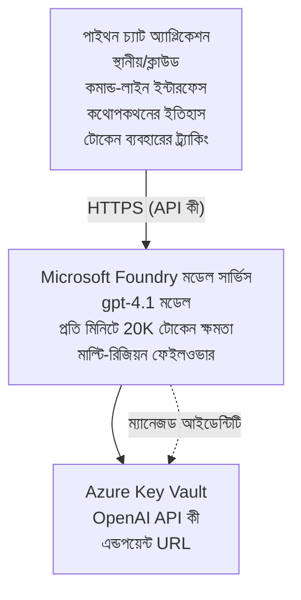

# Microsoft Foundry Models চ্যাট অ্যাপ্লিকেশন

**শিখন পথ:** মধ্যম ⭐⭐ | **সময়:** 35-45 minutes | **খরচ:** $50-200/month

Azure Developer CLI (azd) ব্যবহার করে মোতায়েন করা একটি সম্পূর্ণ Microsoft Foundry Models চ্যাট অ্যাপ্লিকেশন। এই উদাহরণে gpt-4.1 মোডেলের মোতায়েন, নিরাপদ API অ্যাক্সেস, এবং একটি সহজ চ্যাট ইন্টারফেস প্রদর্শিত হয়েছে।

## 🎯 আপনি যা শিখবেন

- gpt-4.1 মোডেল সহ Microsoft Foundry Models সার্ভিস মোতায়েন করা
- Key Vault দিয়ে OpenAI API কী নিরাপদ রাখা
- Python দিয়ে একটি সহজ চ্যাট ইন্টারফেস তৈরি করা
- টোকেন ব্যবহার ও খরচ মনিটর করা
- রেট লিমিটিং এবং ত্রুটি পরিচালনা বাস্তবায়ন করা

## 📦 অন্তর্ভুক্ত বিষয়সমূহ

✅ **Microsoft Foundry Models Service** - gpt-4.1 model deployment  
✅ **Python Chat App** - Simple command-line chat interface  
✅ **Key Vault Integration** - Secure API key storage  
✅ **ARM Templates** - Complete infrastructure as code  
✅ **Cost Monitoring** - Token usage tracking  
✅ **Rate Limiting** - Prevent quota exhaustion  

## Architecture



## প্রয়োজনীয়তা

### প্রয়োজনীয়

- **Azure Developer CLI (azd)** - [ইনস্টল নির্দেশিকা](https://learn.microsoft.com/azure/developer/azure-developer-cli/install-azd)
- **Azure subscription** with OpenAI access - [Request access](https://aka.ms/oai/access)
- **Python 3.9+** - [Install Python](https://www.python.org/downloads/)

### প্রয়োজনীয়তা যাচাই করুন

```bash
# azd সংস্করণ পরীক্ষা করুন (1.5.0 বা তার বেশি প্রয়োজন)
azd version

# Azure লগইন যাচাই করুন
azd auth login

# Python সংস্করণ পরীক্ষা করুন
python --version  # অথবা python3 --version

# OpenAI অ্যাক্সেস যাচাই করুন (Azure পোর্টালে পরীক্ষা করুন)
az cognitiveservices account list-skus \
  --kind OpenAI \
  --location eastus
```

> **⚠️ গুরুত্বপূর্ণ:** Microsoft Foundry Models অ্যাপ্লিকেশন অনুমোদন প্রয়োজন। যদি আপনি আবেদন না করে থাকেন, যান [aka.ms/oai/access](https://aka.ms/oai/access)। অনুমোদন সাধারণত 1-2 কর্মদিবস সময় নেয়।

## ⏱️ মোতায়েন সময়রেখা

| ধাপ | সময়কাল | কী ঘটে |
|-------|----------|--------------|
| প্রয়োজনীয়তা যাচাইকরণ | 2-3 minutes | OpenAI কোটা উপলব্ধতা যাচাই করুন |
| ইনফ্রাস্ট্রাকচার মোতায়েন | 8-12 minutes | OpenAI, Key Vault, এবং মডেল মোতায়েন তৈরি করা |
| অ্যাপ্লিকেশন কনফিগার করুন | 2-3 minutes | পরিবেশ এবং নির্ভরশীলতা সেটআপ করা |
| **মোট** | **12-18 minutes** | gpt-4.1 দিয়ে চ্যাট করার জন্য প্রস্তুত |

**দ্রষ্টব্য:** প্রথমবারের জন্য OpenAI মোতায়েন মডেল প্রোভিশনিং-এর কারণে বেশি সময় লাগতে পারে।

## দ্রুত শুরু

```bash
# উদাহরণে যান
cd examples/azure-openai-chat

# পরিবেশ ইনিশিয়ালাইজ করুন
azd env new myopenai

# সবকিছু ডেপ্লয় করুন (ইনফ্রাস্ট্রাকচার + কনফিগারেশন)
azd up
# আপনাকে অনুরোধ করা হবে:
# 1. Azure সাবস্ক্রিপশন নির্বাচন করুন
# 2. OpenAI উপলব্ধ অবস্থান নির্বাচন করুন (উদাহরণস্বরূপ: eastus, eastus2, westus)
# 3. ডেপ্লয়মেন্টের জন্য 12-18 মিনিট অপেক্ষা করুন

# Python নির্ভরশীলতা ইনস্টল করুন
pip install -r requirements.txt

# চ্যাট শুরু করুন!
python chat.py
```

**প্রত্যাশিত আউটপুট:**
```
🤖 Microsoft Foundry Models Chat Application
Connected to: gpt-4.1 (eastus)
Type your message (or 'quit' to exit)

You: Hello! Tell me about Microsoft Foundry Models.
Assistant: Microsoft Foundry Models Service provides REST API access to OpenAI's powerful language models including gpt-4.1, GPT-3.5-Turbo, and Embeddings...

[Tokens used: 145 | Estimated cost: $0.0044]
```

## ✅ মোতায়েন যাচাই করুন

### ধাপ 1: Azure রিসোর্স চেক করুন

```bash
# ডিপ্লয় করা রিসোর্স দেখুন
azd show

# প্রত্যাশিত আউটপুট দেখায়:
# - OpenAI সেবা: (রিসোর্স নাম)
# - কী ভল্ট: (রিসোর্স নাম)
# - ডিপ্লয়মেন্ট: gpt-4.1
# - অবস্থান: eastus (অথবা আপনার নির্বাচিত অঞ্চল)
```

### ধাপ 2: OpenAI API পরীক্ষা করুন

```bash
# OpenAI এন্ডপয়েন্ট এবং কী প্রাপ্ত করুন
OPENAI_ENDPOINT=$(azd env get-value AZURE_OPENAI_ENDPOINT)
OPENAI_KEY=$(azd env get-value AZURE_OPENAI_API_KEY)

# API কল পরীক্ষা করুন
curl "$OPENAI_ENDPOINT/openai/deployments/gpt-4.1/chat/completions?api-version=2024-08-01-preview" \
  -H "Content-Type: application/json" \
  -H "api-key: $OPENAI_KEY" \
  -d '{
    "messages": [{"role": "user", "content": "Say hello!"}],
    "max_tokens": 50
  }'
```

**প্রত্যাশিত উত্তর:**
```json
{
  "choices": [
    {
      "message": {
        "role": "assistant",
        "content": "Hello! How can I assist you today?"
      }
    }
  ],
  "usage": {
    "prompt_tokens": 8,
    "completion_tokens": 9,
    "total_tokens": 17
  }
}
```

### ধাপ 3: Key Vault অ্যাক্সেস যাচাই করুন

```bash
# Key Vault-এ সিক্রেটগুলো তালিকা করুন
KV_NAME=$(azd env get-value AZURE_KEY_VAULT_NAME)

az keyvault secret list \
  --vault-name $KV_NAME \
  --query "[].name" \
  --output table
```

**প্রত্যাশিত সিক্রেটস:**
- `openai-api-key`
- `openai-endpoint`

**সাফল্যের মানদণ্ড:**
- ✅ OpenAI পরিষেবা gpt-4.1 দিয়ে মোতায়েন করা হয়েছে
- ✅ API কল বৈধ সম্পূর্ণ উত্তর ফেরত দেয়
- ✅ সিক্রেটগুলো Key Vault-এ সংরক্ষিত
- ✅ টোকেন ব্যবহার ট্র্যাকিং কাজ করছে

## প্রকল্পের কাঠামো

```
azure-openai-chat/
├── README.md                   ✅ This guide
├── azure.yaml                  ✅ AZD configuration
├── infra/                      ✅ Infrastructure as Code
│   ├── main.bicep             ✅ Main Bicep template
│   ├── main.parameters.json   ✅ Parameters
│   └── openai.bicep           ✅ OpenAI resource definition
├── src/                        ✅ Application code
│   ├── chat.py                ✅ Chat interface
│   ├── config.py              ✅ Configuration loader
│   └── requirements.txt       ✅ Python dependencies
└── .gitignore                  ✅ Git ignore rules
```

## অ্যাপ্লিকেশনের বৈশিষ্ট্যসমূহ

### চ্যাট ইন্টারফেস (`chat.py`)

চ্যাট অ্যাপ্লিকেশনে রয়েছে:

- **Conversation History** - মেসেজগুলোর মধ্যে প্রসঙ্গ বজায় রাখে
- **Token Counting** - ব্যবহার ট্র্যাক করে এবং খরচ অনুমান করে
- **Error Handling** - রেট লিমিট ও API ত্রুটিগুলি যথাযথভাবে পরিচালনা করে
- **Cost Estimation** - প্রতিটি মেসেজের জন্য রিয়েল-টাইম খরচ গণনা
- **Streaming Support** - ঐচ্ছিক স্ট্রিমিং উত্তরসমূহ

### কমান্ডসমূহ

চ্যাট করার সময়, আপনি ব্যবহার করতে পারেন:
- `quit` or `exit` - সেশন শেষ করুন
- `clear` - আলাপচারিতার ইতিহাস মুছুন
- `tokens` - মোট টোকেন ব্যবহারের পরিমাণ দেখান
- `cost` - মোট আনুমানিক খরচ দেখান

### কনফিগারেশন (`config.py`)

পরিবেশ ভেরিয়েবল থেকে কনফিগারেশন লোড করে:
```python
AZURE_OPENAI_ENDPOINT  # কী ভল্ট থেকে
AZURE_OPENAI_API_KEY   # কী ভল্ট থেকে
AZURE_OPENAI_MODEL     # ডিফল্ট: gpt-4.1
AZURE_OPENAI_MAX_TOKENS # ডিফল্ট: 800
```

## ব্যবহারের উদাহরণ

### মৌলিক চ্যাট

```bash
python chat.py
```

### কাস্টম মডেলের সাথে চ্যাট

```bash
export AZURE_OPENAI_MODEL=gpt-35-turbo
python chat.py
```

### স্ট্রিমিং সহ চ্যাট

```bash
python chat.py --stream
```

### উদাহরণ কথোপকথন

```
You: Explain Microsoft Foundry Models Service in 3 sentences.
Assistant: Microsoft Foundry Models Service is Microsoft Azure's cloud platform offering 
that provides access to OpenAI's powerful language models. It enables developers 
to integrate capabilities like gpt-4.1 into their applications with enterprise-grade 
security and compliance. The service includes features for content filtering, 
abuse monitoring, and responsible AI practices.

[Tokens used: 89 | Estimated cost: $0.0027]

You: What models are available?
Assistant: Microsoft Foundry Models Service offers several model families including gpt-4.1 
(most capable), GPT-3.5-Turbo (faster and cost-effective), and Embeddings models 
for vector search. Each model has different capabilities, pricing, and token limits.

[Tokens used: 67 | Estimated cost: $0.0020]

Total session: 156 tokens | $0.0047
```

## খরচ ব্যবস্থাপনা

### টোকেন মূল্য (gpt-4.1)

| মডেল | ইনপুট (প্রতি 1K টোকেন) | আউটপুট (প্রতি 1K টোকেন) |
|-------|----------------------|------------------------|
| gpt-4.1 | $0.03 | $0.06 |
| GPT-3.5-Turbo | $0.0015 | $0.002 |

### অনুমানকৃত মাসিক খরচ

ব্যবহারের ধরণ অনুযায়ী:

| ব্যবহার স্তর | বার্তা/দিন | টোকেন/দিন | মাসিক খরচ |
|-------------|--------------|------------|--------------|
| **Light** | 20 বার্তা | 3,000 টোকেন | $3-5 |
| **Moderate** | 100 বার্তা | 15,000 টোকেন | $15-25 |
| **Heavy** | 500 বার্তা | 75,000 টোকেন | $75-125 |

**মৌলিক ইনফ্রাস্ট্রাকচার খরচ:** $1-2/month (Key Vault + নূন্যতম compute)

### খরচ অপ্টিমাইজেশনের টিপস

```bash
# 1. সহজ কাজের জন্য GPT-3.5-Turbo ব্যবহার করুন (২০ গুণ সস্তা)
export AZURE_OPENAI_MODEL=gpt-35-turbo

# 2. সংক্ষিপ্ত উত্তরগুলির জন্য সর্বোচ্চ টোকেন কমান
export AZURE_OPENAI_MAX_TOKENS=400

# 3. টোকেন ব্যবহার নিরীক্ষণ করুন
python chat.py --show-tokens

# 4. বাজেট সতর্কতা সেট আপ করুন
az consumption budget create \
  --budget-name "openai-budget" \
  --amount 50 \
  --time-grain Monthly
```

## মনিটরিং

### টোকেন ব্যবহার দেখুন

```bash
# Azure পোর্টালে:
# OpenAI রিসোর্স → মেট্রিক্স → "Token Transaction" নির্বাচন করুন

# অথবা Azure CLI ব্যবহার করে:
az monitor metrics list \
  --resource $(azd env get-value AZURE_OPENAI_RESOURCE_ID) \
  --metric "TokenTransaction" \
  --start-time $(date -u -d '1 hour ago' '+%Y-%m-%dT%H:%M:%S') \
  --interval PT1M
```

### API লগ দেখুন

```bash
# স্ট্রিম ডায়াগনস্টিক লগগুলি
az monitor diagnostic-settings create \
  --resource $(azd env get-value AZURE_OPENAI_RESOURCE_ID) \
  --name openai-logs \
  --logs '[{"category": "Audit", "enabled": true}]' \
  --workspace $(azd env get-value LOG_ANALYTICS_WORKSPACE_ID)

# কোয়েরি লগগুলি
az monitor log-analytics query \
  --workspace $(azd env get-value LOG_ANALYTICS_WORKSPACE_ID) \
  --analytics-query "AzureDiagnostics | where Category == 'Audit' | top 10 by TimeGenerated"
```

## সমস্যা সমাধান

### সমস্যা: "Access Denied" Error

**লক্ষণ:** 403 Forbidden যখন API কল করার সময়

**সমাধানসমূহ:**
```bash
# 1. নিশ্চিত করুন যে OpenAI অ্যাক্সেস অনুমোদিত
az cognitiveservices account show \
  --name $(azd env get-value AZURE_OPENAI_NAME) \
  --resource-group $(azd env get-value AZURE_RESOURCE_GROUP)

# 2. যাচাই করুন যে API কী সঠিক
azd env get-value AZURE_OPENAI_API_KEY

# 3. যাচাই করুন এন্ডপয়েন্ট URL-এর ফরম্যাট
azd env get-value AZURE_OPENAI_ENDPOINT
# হওয়া উচিত: https://[name].openai.azure.com/
```

### সমস্যা: "Rate Limit Exceeded"

**লক্ষণ:** 429 Too Many Requests

**সমাধানসমূহ:**
```bash
# 1. বর্তমান কোটা পরীক্ষা করুন
az cognitiveservices account deployment show \
  --name $(azd env get-value AZURE_OPENAI_NAME) \
  --resource-group $(azd env get-value AZURE_RESOURCE_GROUP) \
  --deployment-name gpt-4.1

# 2. কোটা বৃদ্ধির অনুরোধ করুন (প্রয়োজনে)
# Azure পোর্টালে যান → OpenAI রিসোর্স → কোটা → বৃদ্ধির অনুরোধ

# 3. পুনরায় চেষ্টা করার লজিক বাস্তবায়ন করুন (ইতিমধ্যে chat.py-এ আছে)
# অ্যাপ্লিকেশনটি স্বয়ংক্রিয়ভাবে এক্সপোনেনশিয়াল ব্যাকঅফ ব্যবহার করে পুনরায় চেষ্টা করে
```

### সমস্যা: "Model Not Found"

**লক্ষণ:** ডেপ্লয়মেন্টের জন্য 404 ত্রুটি

**সমাধানসমূহ:**
```bash
# 1. উপলব্ধ ডিপ্লয়মেন্টগুলি তালিকাভুক্ত করুন
az cognitiveservices account deployment list \
  --name $(azd env get-value AZURE_OPENAI_NAME) \
  --resource-group $(azd env get-value AZURE_RESOURCE_GROUP)

# 2. পরিবেশে মডেলের নাম যাচাই করুন
echo $AZURE_OPENAI_MODEL

# 3. সঠিক ডিপ্লয়মেন্টের নাম দিয়ে আপডেট করুন
export AZURE_OPENAI_MODEL=gpt-4.1  # অথবা gpt-35-turbo
```

### সমস্যা: উচ্চ লেটেন্সি

**লক্ষণ:** ধীর প্রতিক্রিয়া সময় (>5 seconds)

**সমাধানসমূহ:**
```bash
# 1. আঞ্চলিক লেটেন্সি পরীক্ষা করুন
# ব্যবহারকারীদের সবচেয়ে কাছের অঞ্চলে ডিপ্লয় করুন

# 2. দ্রুত প্রতিক্রিয়া পেতে max_tokens কমান
export AZURE_OPENAI_MAX_TOKENS=400

# 3. উন্নত UX-এর জন্য স্ট্রিমিং ব্যবহার করুন
python chat.py --stream
```

## নিরাপত্তা সেরা অনুশীলন

### 1. API কী সুরক্ষিত রাখুন

```bash
# কখনও কীগুলো সোর্স কন্ট্রোলে কমিট করবেন না
# Key Vault ব্যবহার করুন (ইতিমধ্যে কনফিগার করা আছে)

# কীসমূহ নিয়মিত পরিবর্তন করুন
az cognitiveservices account keys regenerate \
  --name $(azd env get-value AZURE_OPENAI_NAME) \
  --resource-group $(azd env get-value AZURE_RESOURCE_GROUP) \
  --key-name key1
```

### 2. কন্টেন্ট ফিল্টারিং বাস্তবায়ন করুন

```python
# Microsoft Foundry Models-এ বিল্টইন কনটেন্ট ফিল্টারিং রয়েছে
# Azure পোর্টালে কনফিগার করুন:
# OpenAI রিসোর্স → কনটেন্ট ফিল্টারসমূহ → কাস্টম ফিল্টার তৈরি করুন

# বিভাগ: ঘৃণা, যৌন, সহিংসতা, আত্মহানি
# স্তর: কম, মাঝারি, উচ্চ ফিল্টারিং
```

### 3. Managed Identity ব্যবহার করুন (প্রোডাকশনে)

```bash
# প্রোডাকশন ডিপ্লয়মেন্টের জন্য ম্যানেজড আইডেন্টিটি ব্যবহার করুন
# API কী-এর পরিবর্তে (অ্যাপটি Azure-এ হোস্ট করা প্রয়োজন)

# infra/openai.bicep আপডেট করুন যাতে এতে নিম্নোক্তটি অন্তর্ভুক্ত থাকে:
# identity: { type: 'SystemAssigned' }
```

## ডেভেলপমেন্ট

### লোকালি চালান

```bash
# নির্ভরতা ইনস্টল করুন
pip install -r src/requirements.txt

# পরিবেশ চলক সেট করুন
export AZURE_OPENAI_ENDPOINT="https://[name].openai.azure.com/"
export AZURE_OPENAI_API_KEY="your-api-key"
export AZURE_OPENAI_MODEL="gpt-4.1"

# অ্যাপ্লিকেশন চালান
python src/chat.py
```

### টেস্ট চালান

```bash
# টেস্ট নির্ভরতাগুলো ইনস্টল করুন
pip install pytest pytest-cov

# টেস্ট চালান
pytest tests/ -v

# কভারেজ সহ
pytest tests/ --cov=src --cov-report=html
```

### মডেল ডেপ্লয়মেন্ট আপডেট করুন

```bash
# মডেলের একটি ভিন্ন সংস্করণ মোতায়েন করুন
az cognitiveservices account deployment create \
  --name $(azd env get-value AZURE_OPENAI_NAME) \
  --resource-group $(azd env get-value AZURE_RESOURCE_GROUP) \
  --deployment-name gpt-35-turbo \
  --model-name gpt-35-turbo \
  --model-version "0613" \
  --model-format OpenAI \
  --sku-capacity 20 \
  --sku-name "Standard"
```

## পরিষ্কার করুন

```bash
# সমস্ত Azure রিসোর্স মুছে ফেলুন
azd down --force --purge

# এটি নিম্নলিখিতগুলি মুছে ফেলে:
# - OpenAI সেবা
# - Key Vault (90 দিনের সফট ডিলিটসহ)
# - রিসোর্স গ্রুপ
# - সমস্ত ডিপ্লয়মেন্ট এবং কনফিগারেশন
```

## পরবর্তী ধাপসমূহ

### এই উদাহরণটি বিস্তৃত করুন

1. **ওয়েব ইন্টারফেস যোগ করুন** - React/Vue ফ্রন্টএন্ড তৈরি করুন
   ```bash
   # azure.yaml-এ ফ্রন্টএন্ড সার্ভিস যোগ করুন
   # Azure Static Web Apps-এ ডিপ্লয় করুন
   ```

2. **RAG বাস্তবায়ন করুন** - Azure AI Search দিয়ে ডকুমেন্ট সার্চ যোগ করুন
   ```python
   # Azure AI Search একীভূত করুন
   # ডকুমেন্ট আপলোড করুন এবং ভেক্টর ইনডেক্স তৈরি করুন
   ```

3. **Function Calling যোগ করুন** - টুল ব্যবহারের সক্ষমতা যুক্ত করুন
   ```python
   # chat.py-এ ফাংশনগুলো সংজ্ঞায়িত করুন
   # gpt-4.1কে বাহ্যিক API-গুলো কল করতে দিন
   ```

4. **মাল্টি-মডেল সাপোর্ট** - একাধিক মডেল মোতায়েন করুন
   ```bash
   # gpt-35-turbo এবং এমবেডিং মডেল যোগ করুন
   # মডেল রাউটিং লজিক বাস্তবায়ন করুন
   ```

### সম্পর্কিত উদাহরণ

- **[Retail Multi-Agent](../retail-scenario.md)** - উন্নত মাল্টি-এজেন্ট আর্কিটেকচার
- **[Database App](../../../../examples/database-app)** - স্থায়ী স্টোরেজ যোগ করুন
- **[Container Apps](../../../../examples/container-app)** - কন্টেইনারাইজড সার্ভিস হিসেবে মোতায়েন করুন

### শেখার উপকরণ

- 📚 [AZD For Beginners Course](../../README.md) - প্রধান কোর্স হোম
- 📚 [Microsoft Foundry Models Documentation](https://learn.microsoft.com/azure/ai-services/openai/) - অফিসিয়াল ডকুমেন্টেশন
- 📚 [OpenAI API Reference](https://platform.openai.com/docs/api-reference) - API বিস্তারিত
- 📚 [Responsible AI](https://www.microsoft.com/ai/responsible-ai) - সেরা অনুশীলনসমূহ

## অতিরিক্ত উপকরণ

### ডকুমেন্টেশন
- **[Microsoft Foundry Models Service](https://learn.microsoft.com/azure/ai-services/openai/)** - সম্পূর্ণ নির্দেশিকা
- **[gpt-4.1 Models](https://learn.microsoft.com/azure/ai-services/openai/concepts/models)** - মডেলের ক্ষমতা
- **[Content Filtering](https://learn.microsoft.com/azure/ai-services/openai/concepts/content-filter)** - সেফটি ফিচারসমূহ
- **[Azure Developer CLI](https://learn.microsoft.com/azure/developer/azure-developer-cli/)** - azd রেফারেন্স

### টিউটোরিয়াল
- **[OpenAI Quickstart](https://learn.microsoft.com/azure/ai-services/openai/quickstart)** - প্রথম মোতায়েন
- **[Chat Completions](https://learn.microsoft.com/azure/ai-services/openai/how-to/chatgpt)** - চ্যাট অ্যাপ তৈরি করা
- **[Function Calling](https://learn.microsoft.com/azure/ai-services/openai/how-to/function-calling)** - উন্নত ফিচারসমূহ

### টুলস
- **[Microsoft Foundry Models Studio](https://oai.azure.com/)** - ওয়েব-ভিত্তিক প্লেগ্রাউন্ড
- **[Prompt Engineering Guide](https://platform.openai.com/docs/guides/prompt-engineering)** - উন্নত প্রম্পট লেখা
- **[Token Calculator](https://platform.openai.com/tokenizer)** - টোকেন ব্যবহারের অনুমান

### কমিউনিটি
- **[Azure AI Discord](https://discord.gg/azure)** - কমিউনিটি থেকে সাহায্য নিন
- **[GitHub Discussions](https://github.com/Azure-Samples/openai/discussions)** - প্রশ্নোত্তর ফোরাম
- **[Azure Blog](https://azure.microsoft.com/blog/tag/azure-openai-service/)** - সাম্প্রতিক আপডেট

---

**🎉 সফলতা!** আপনি Microsoft Foundry Models মোতায়েন করেছেন এবং একটি কার্যকরী চ্যাট অ্যাপ্লিকেশন তৈরি করেছেন। gpt-4.1-র ক্ষমতাগুলো অন্বেষণ করা শুরু করুন এবং বিভিন্ন প্রম্পট ও ব্যবহার ক্ষেত্রে পরীক্ষা করুন।

**প্রশ্ন আছে?** [ইস্যু খুলুন](https://github.com/microsoft/AZD-for-beginners/issues) অথবা [প্রশ্নোত্তর](../../resources/faq.md) দেখুন

**খরচ সতর্কতা:** পরীক্ষা শেষ হলে চলমান চার্জ এড়াতে `azd down` চালাতে ভুলবেন না (~$50-100/month for active usage).

---

<!-- CO-OP TRANSLATOR DISCLAIMER START -->
**অস্বীকৃতি**:
এই নথিটি AI অনুবাদ পরিষেবা [Co-op Translator](https://github.com/Azure/co-op-translator) ব্যবহার করে অনূদিত হয়েছে। যদিও আমরা শুদ্ধতার জন্য চেষ্টা করি, অনুগ্রহ করে মনে রাখবেন যে স্বয়ংক্রিয় অনুবাদে ত্রুটি বা অসঙ্গতি থাকতে পারে। মূল নথিটি তার স্বভাষায় কর্তৃত্বপূর্ণ উৎস হিসেবে বিবেচিত হওয়া উচিত। গুরুত্বপূর্ণ তথ্যের জন্য পেশাদার মানব অনুবাদ সুপারিশ করা হয়। এই অনুবাদের ব্যবহারে প্রয়োজনীয় ভুল বোঝাবুঝি বা ভুল ব্যাখ্যার জন্য আমরা দায়বদ্ধ নই।
<!-- CO-OP TRANSLATOR DISCLAIMER END -->