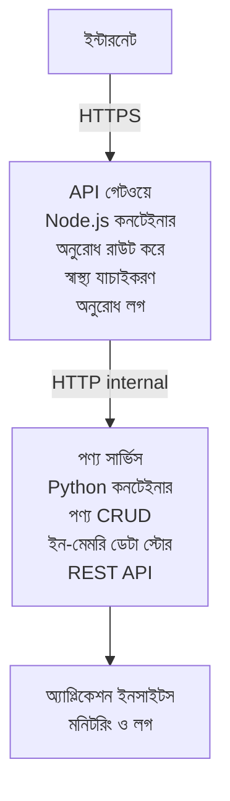

# মাইক্রোসার্ভিস আর্কিটেকচার - কন্টেইনার অ্যাপ উদাহরণ

⏱️ **আনুমানিক সময়**: 25-35 মিনিট | 💰 **আনুমানিক খরচ**: ~$50-100/মাস | ⭐ **জটিলতা**: উন্নত

AZD CLI ব্যবহার করে Azure Container Apps-এ ডিপ্লয় করা একটি **সরলীকৃত কিন্তু কার্যকরী** মাইক্রোসার্ভিস আর্কিটেকচার। এই উদাহরণটি সার্ভিস-টু-সার্ভিস যোগাযোগ, কন্টেইনার অর্কেস্ট্রেশন, এবং মনিটরিং প্রদর্শন করে একটি ব্যবহারিক ২-সার্ভিস কনফিগারেশনের মাধ্যমে।

> **📚 শেখার পদ্ধতি**: এই উদাহরণটি একটি নূন্যতম ২-সার্ভিস আর্কিটেকচার (API Gateway + Backend Service) দিয়ে শুরু করে যা আপনি সত্যিই ডিপ্লয় করে শিখতে পারবেন। এই ভিত্তি আয়ত্ত করার পরে, আমরা একটি পূর্ণ মাইক্রোসার্ভিস ইকোসিস্টেমে বিস্তারের জন্য নির্দেশনা প্রদান করি।

## আপনি কী শিখবেন

By completing this example, you will:
- একাধিক কন্টেইনার Azure Container Apps-এ ডিপ্লয় করা
- অভ্যন্তরীণ নেটওয়ার্কিং ব্যবহার করে সার্ভিস-টু-সার্ভিস যোগাযোগ বাস্তবায়ন করা
- পরিবেশভিত্তিক স্কেলিং এবং হেলথ চেক কনফিগার করা
- Application Insights দিয়ে বিতরণকৃত অ্যাপ্লিকেশন মনিটর করা
- মাইক্রোসার্ভিস ডিপ্লয়মেন্ট প্যাটার্ন এবং শ্রেষ্ঠ অনুশীলনগুলো বোঝা
- সহজ থেকে জটিল আর্কিটেকচারে ধাপে ধাপে সম্প্রসারণ শেখা

## আর্কিটেকচার

### ধাপ ১: আমরা যা তৈরি করছি (এই উদাহরণে অন্তর্ভুক্ত)


**কেন সহজভাবে শুরু করবেন?**
- ✅ দ্রুত ডিপ্লয় ও বোঝা যায় (25-35 মিনিট)
- ✅ জটিলতা ছাড়াই মূল মাইক্রোসার্ভিস প্যাটার্ন শিখুন
- ✅ কার্যকরী কোড যা আপনি পরিবর্তন করে পরীক্ষা করতে পারবেন
- ✅ শেখার জন্য নিম্ন খরচ (~$50-100/মাস বনাম $300-1400/মাস)
- ✅ ডাটাবেস এবং মেসেজ কিউ যোগ করার আগে আত্মবিশ্বাস গড়ে তোলা

**উপমা**: এটিকে ড্রাইভিং শেখার মত মনে করুন। আপনি একটি খালি পার্কিং লট (2 সার্ভিস) দিয়ে শুরু করেন, মৌলিক বিষয়গুলো আয়ত্ত করেন, তারপর শহরের ট্র্যাফিকে (5+ সার্ভিস ডাটাবেসসহ) অগ্রসর হন।

### ধাপ ২: ভবিষ্যৎ সম্প্রসারণ (রেফারেন্স আর্কিটেকচার)

Once you master the 2-service architecture, you can expand to:

```
Full Architecture (Not Included - For Reference)
├── API Gateway (✅ Included)
├── Product Service (✅ Included)
├── Order Service (🔜 Add next)
├── User Service (🔜 Add next)
├── Notification Service (🔜 Add last)
├── Azure Service Bus (🔜 For async communication)
├── Cosmos DB (🔜 For product persistence)
├── Azure SQL (🔜 For order management)
└── Azure Storage (🔜 For file storage)
```

See "Expansion Guide" section at the end for step-by-step instructions.

## অন্তর্ভুক্ত বৈশিষ্ট্য

✅ **Service Discovery**: কন্টেইনারগুলোর মধ্যে স্বয়ংক্রিয় DNS-ভিত্তিক আবিষ্কার  
✅ **Load Balancing**: রেপ্লিকার মধ্যে বিল্টইন লোড ব্যালান্সিং  
✅ **Auto-scaling**: HTTP রিকুয়েস্ট ভিত্তিক সার্ভিসভিত্তিক স্বাধীন স্কেলিং  
✅ **Health Monitoring**: উভয় সার্ভিসের জন্য লিভনেস এবং রেডিনেস প্রোব  
✅ **Distributed Logging**: Application Insights দিয়ে কেন্দ্রীভূত লগিং  
✅ **Internal Networking**: সুরক্ষিত সার্ভিস-টু-সার্ভিস যোগাযোগ  
✅ **Container Orchestration**: স্বয়ংক্রিয় ডিপ্লয়মেন্ট এবং স্কেলিং  
✅ **Zero-Downtime Updates**: রোলিং আপডেট এবং রিভিশন ম্যানেজমেন্ট  

## পূর্বশর্ত

### প্রয়োজনীয় সরঞ্জাম

Before starting, verify you have these tools installed:

1. **[Azure Developer CLI (azd)](https://learn.microsoft.com/azure/developer/azure-developer-cli/install-azd)** (সংস্করণ 1.0.0 বা তার বেশি)
   ```bash
   azd version
   # প্রত্যাশিত আউটপুট: azd সংস্করণ 1.0.0 বা তার উচ্চতর
   ```

2. **[Azure CLI](https://learn.microsoft.com/cli/azure/install-azure-cli)** (সংস্করণ 2.50.0 বা তার বেশি)
   ```bash
   az --version
   # প্রত্যাশিত আউটপুট: azure-cli 2.50.0 বা তার উচ্চতর
   ```

3. **[Docker](https://www.docker.com/get-started)** (লোকাল ডেভেলপমেন্ট/টেস্টিং-এর জন্য - ঐচ্ছিক)
   ```bash
   docker --version
   # প্রত্যাশিত আউটপুট: Docker সংস্করণ 20.10 বা তার উপরে
   ```

### Azure এর প্রয়োজনীয়তাসমূহ

- একটি সক্রিয় **Azure subscription** ([বিনামূল্যে একটি অ্যাকাউন্ট তৈরি করুন](https://azure.microsoft.com/free/))
- আপনার সাবস্ক্রিপশনে রিসোর্স তৈরি করার অনুমতি
- সাবস্ক্রিপশন বা রিসোর্স গ্রুপে **Contributor** রোল

### জ্ঞানগত পূর্বশর্ত

This is an **advanced-level** example. You should have:
- [Simple Flask API example](../../../../../examples/container-app/simple-flask-api) সম্পন্ন করেছেন 
- মাইক্রোসার্ভিস আর্কিটেকচারের মৌলিক ধারণা
- REST API এবং HTTP সম্পর্কে পরিচিতি
- কন্টেইনার ধারণাগুলোর জ্ঞান

**Container Apps-এ নতুন?** মৌলিক জ্ঞান শেখার জন্য প্রথমে [Simple Flask API example](../../../../../examples/container-app/simple-flask-api) দেখুন।

## দ্রুত শুরু (ধাপ-বাই-ধাপ)

### ধাপ ১: ক্লোন এবং নেভিগেট

```bash
git clone https://github.com/microsoft/AZD-for-beginners.git
cd AZD-for-beginners/examples/container-app/microservices
```

**✓ সফলতার পরীক্ষা**: নিশ্চিত করুন আপনি `azure.yaml` দেখছেন:
```bash
ls
# প্রত্যাশিত: README.md, azure.yaml, infra/, src/
```

### ধাপ ২: Azure-এ প্রমাণীকরণ

```bash
azd auth login
```

এটি Azure প্রমাণীকরণের জন্য আপনার ব্রাউজার খুলবে। আপনার Azure ক্রেডেনশিয়াল দিয়ে সাইন ইন করুন।

**✓ সফলতার পরীক্ষা**: আপনি নিচেরটা দেখবেন:
```
Logged in to Azure.
```

### ধাপ ৩: পরিবেশ ইনিশিয়ালাইজ করুন

```bash
azd init
```

**আপনি যে প্রম্পটগুলো দেখবেন**:
- **Environment name**: একটি সংক্ষিপ্ত নাম লিখুন (উদাহরণ: `microservices-dev`)
- **Azure subscription**: আপনার সাবস্ক্রিপশন নির্বাচন করুন
- **Azure location**: একটি রিজিয়ন বেছে নিন (উদাহরণ: `eastus`, `westeurope`)

**✓ সফলতার পরীক্ষা**: আপনি নিচেরটা দেখবেন:
```
SUCCESS: New project initialized!
```

### ধাপ ৪: ইনফ্রাস্ট্রাকচার এবং সার্ভিস ডিপ্লয় করুন

```bash
azd up
```

**কি হয়** (প্রায় 8-12 মিনিট সময় লাগে):
1. Container Apps পরিবেশ তৈরি করে
2. মনিটরিংয়ের জন্য Application Insights তৈরি করে
3. API Gateway কন্টেইনার তৈরি করে (Node.js)
4. Product Service কন্টেইনার তৈরি করে (Python)
5. উভয় কন্টেইনার Azure-এ ডিপ্লয় করে
6. নেটওয়ার্কিং এবং হেলথ চেক কনফিগার করে
7. মনিটরিং এবং লগিং সেটআপ করে

**✓ সফলতার পরীক্ষা**: আপনি নিচেরটা দেখবেন:
```
SUCCESS: Your application was deployed to Azure in X minutes Y seconds.
Endpoint: https://api-gateway-<unique-id>.azurecontainerapps.io
```

**⏱️ সময়**: 8-12 মিনিট

### ধাপ ৫: ডিপ্লয়মেন্ট পরীক্ষা করুন

```bash
# গেটওয়ে এন্ডপয়েন্ট পান
GATEWAY_URL=$(azd env get-values | grep API_GATEWAY_URL | cut -d '=' -f2 | tr -d '"')

# API গেটওয়ের স্বাস্থ্য পরীক্ষা করুন
curl $GATEWAY_URL/health

# প্রত্যাশিত আউটপুট:
# {"status":"সুস্থ","service":"api-gateway","timestamp":"2025-11-19T10:30:00Z"}
```

**গেটওয়ের মাধ্যমে প্রোডাক্ট সার্ভিস পরীক্ষা করুন**:
```bash
# পণ্য তালিকা
curl $GATEWAY_URL/api/products

# প্রত্যাশিত আউটপুট:
# [
#   {"id":1,"name":"Laptop","price":999.99,"stock":50},
#   {"id":2,"name":"Mouse","price":29.99,"stock":200},
#   {"id":3,"name":"Keyboard","price":79.99,"stock":150}
# ]
```

**✓ সফলতার পরীক্ষা**: উভয় এন্ডপয়েন্ট ত্রুটিমুক্ত JSON ডেটা ফেরত দিচ্ছে।

---

**🎉 অভিনন্দন!** আপনি Azure-এ একটি মাইক্রোসার্ভিস আর্কিটেকচার ডিপ্লয় করেছেন!

## প্রকল্প স্ট্রাকচার

All implementation files are included—this is a complete, working example:

```
microservices/
│
├── README.md                         # This file
├── azure.yaml                        # AZD configuration
├── .gitignore                        # Git ignore patterns
│
├── infra/                           # Infrastructure as Code (Bicep)
│   ├── main.bicep                   # Main orchestration
│   ├── abbreviations.json           # Naming conventions
│   ├── core/                        # Shared infrastructure
│   │   ├── container-apps-environment.bicep  # Container environment + registry
│   │   └── monitor.bicep            # Application Insights + Log Analytics
│   └── app/                         # Service definitions
│       ├── api-gateway.bicep        # API Gateway container app
│       └── product-service.bicep    # Product Service container app
│
└── src/                             # Application source code
    ├── api-gateway/                 # Node.js API Gateway
    │   ├── app.js                   # Express server with routing
    │   ├── package.json             # Node dependencies
    │   └── Dockerfile               # Container definition
    └── product-service/             # Python Product Service
        ├── main.py                  # Flask API with product data
        ├── requirements.txt         # Python dependencies
        └── Dockerfile               # Container definition
```

**প্রতিটি কম্পোনেন্ট কী কাজ করে:**

**ইনফ্রাস্ট্রাকচার (infra/)**:
- `main.bicep`: সব Azure রিসোর্স এবং তাদের ডিপেন্ডেন্সি সমন্বয় করে
- `core/container-apps-environment.bicep`: Container Apps পরিবেশ এবং Azure Container Registry তৈরি করে
- `core/monitor.bicep`: বিতরণকৃত লগিংয়ের জন্য Application Insights সেটআপ করে
- `app/*.bicep`: স্কেলিং এবং হেলথ চেকসহ পৃথক কন্টেইনার অ্যাপ ডেফিনিশনসমূহ

**API Gateway (src/api-gateway/)**:
- ব্যাকএন্ড সার্ভিসগুলিতে রিকুয়েস্ট রাউট করে এমন পাবলিক-ফেসিং সার্ভিস
- লগিং, এরর হ্যান্ডলিং, এবং রিকুয়েস্ট ফরওয়ার্ডিং বাস্তবায়ন করে
- সার্ভিস-টু-সার্ভিস HTTP যোগাযোগ প্রদর্শন করে

**Product Service (src/product-service/)**:
- পণ্য ক্যাটালগ সহ ইন্টারনাল সার্ভিস (সরলতার জন্য ইন-মেমরি)
- হেলথ চেকসহ REST API
- ব্যাকএন্ড মাইক্রোসার্ভিস প্যাটার্নের উদাহরণ

## সার্ভিসের সংক্ষিপ্ত পরিচিতি

### API Gateway (Node.js/Express)

**Port**: 8080  
**Access**: Public (external ingress)  
**Purpose**: আগত রিকুয়েস্টগুলোকে উপযুক্ত ব্যাকএন্ড সার্ভিসে রাউট করে  

**Endpoints**:
- `GET /` - সার্ভিস সম্পর্কিত তথ্য
- `GET /health` - হেলথ চেক এন্ডপয়েন্ট
- `GET /api/products` - প্রোডাক্ট সার্ভিসে ফরওয়ার্ড করে (সমস্ত তালিকা)
- `GET /api/products/:id` - প্রোডাক্ট সার্ভিসে ফরওয়ার্ড করে (ID অনুযায়ী নেয়)

**প্রধান বৈশিষ্ট্যসমূহ**:
- axios দিয়ে রিকুয়েস্ট রাউটিং
- কেন্দ্রীভূত লগিং
- এরর হ্যান্ডলিং এবং টাইমআউট ব্যবস্থাপনা
- পরিবেশ ভেরিয়েবলগুলোর মাধ্যমে সার্ভিস ডিসকভারি
- Application Insights ইন্টিগ্রেশন

**কোড হাইলাইট** (`src/api-gateway/app.js`):
```javascript
// অভ্যন্তরীণ সার্ভিস যোগাযোগ
app.get('/api/products', async (req, res) => {
  const response = await axios.get(`${PRODUCT_SERVICE_URL}/products`);
  res.json(response.data);
});
```

### Product Service (Python/Flask)

**Port**: 8000  
**Access**: শুধুমাত্র ইন্টারনাল (কোনো এক্সটার্নাল ইনগ্রেস নেই)  
**Purpose**: ইন-মেমরি ডেটা দিয়ে প্রোডাক্ট ক্যাটালগ পরিচালনা করে  

**Endpoints**:
- `GET /` - সার্ভিস সম্পর্কিত তথ্য
- `GET /health` - হেলথ চেক এন্ডপয়েন্ট
- `GET /products` - সমস্ত প্রোডাক্ট তালিকা
- `GET /products/<id>` - ID অনুযায়ী প্রোডাক্ট নিন

**প্রধান বৈশিষ্ট্যসমূহ**:
- Flask দিয়ে RESTful API
- ইন-মেমরি প্রোডাক্ট স্টোর (সরল, কোনো ডাটাবেস প্রয়োজন নেই)
- প্রোব-এর মাধ্যমে হেলথ মনিটরিং
- স্ট্রাকচার্ড লগিং
- Application Insights ইন্টিগ্রেশন

**ডেটা মডেল**:
```python
{
  "id": 1,
  "name": "Laptop",
  "description": "High-performance laptop",
  "price": 999.99,
  "stock": 50
}
```

**কেন শুধু ইন্টারনাল?**
প্রোডাক্ট সার্ভিস পাবলিকভাবে এক্সপোজ্ করা হয় না। সমস্ত অনুরোধ API Gateway এর মাধ্যমে যেতে হবে, যা দেয়:
- Security: নিয়ন্ত্রিত প্রবেশ পয়েন্ট
- Flexibility: ক্লায়েন্টদের প্রভাবিত করা ছাড়াই ব্যাকএন্ড বদলানো যায়
- Monitoring: কেন্দ্রীভূত রিকুয়েস্ট লগিং

## সার্ভিস যোগাযোগ বোঝা

### সার্ভিসগুলো কিভাবে একে অপরের সাথে কথা বলে

In this example, the API Gateway communicates with the Product Service using **internal HTTP calls**:

```javascript
// API গেটওয়ে (src/api-gateway/app.js)
const PRODUCT_SERVICE_URL = process.env.PRODUCT_SERVICE_URL;

// অভ্যন্তরীণ HTTP অনুরোধ করুন
const response = await axios.get(`${PRODUCT_SERVICE_URL}/products`);
```

**প্রধান পয়েন্টগুলো**:

1. **DNS-Based Discovery**: Container Apps স্বয়ংক্রিয়ভাবে ইন্টারনাল সার্ভিসগুলোর জন্য DNS প্রদান করে
   - Product Service FQDN: `product-service.internal.<environment>.azurecontainerapps.io`
   - সরলীকৃত: `http://product-service` (Container Apps এটি রেজলভ করে)

2. **No Public Exposure**: Product Service Bicep-এ `external: false` আছে
   - শুধুমাত্র Container Apps পরিবেশের মধ্যে অ্যাক্সেসযোগ্য
   - ইন্টারনেট থেকে 접근 করা যায় না

3. **Environment Variables**: সার্ভিস URL গুলো ডিপ্লয়মেন্ট সময় ইনজেক্ট করা হয়
   - Bicep গেটওয়েতে ইন্টারনাল FQDN প্যাস করে
   - অ্যাপ্লিকেশন কোডে হার্ডকোড করা URL নেই

**উপমা**: এটিকে অফিস রুমের মতো ভাবুন। API Gateway হলো রিসেপশন ডেস্ক (পাবলিক-ফেসিং), আর Product Service হলো একটি অফিস রুম (শুধু ইন্টারনাল)। যে কোনো অফিসে পৌঁছাতে ভিজিটরদের রিসেপশনের মধ্য দিয়ে যেতে হয়।

## ডিপ্লয়মেন্ট অপশনসমূহ

### পূর্ণ ডিপ্লয়মেন্ট (প্রস্তাবিত)

```bash
# ইনফ্রাস্ট্রাকচার এবং উভয় সার্ভিস ডিপ্লয় করুন
azd up
```

This deploys:
1. Container Apps পরিবেশ
2. Application Insights
3. Container Registry
4. API Gateway কন্টেইনার
5. Product Service কন্টেইনার

**সময়**: 8-12 মিনিট

### একক সার্ভিস ডিপ্লয় করা

```bash
# শুধুমাত্র একটি সার্ভিস ডিপ্লয় করুন (প্রাথমিক azd up চালানোর পরে)
azd deploy api-gateway

# অথবা প্রোডাক্ট সার্ভিস ডিপ্লয় করুন
azd deploy product-service
```

**ব্যবহার কেস**: যখন আপনি একটি সার্ভিসে কোড আপডেট করেছেন এবং কেবল সেই সার্ভিসটি পুনরায় ডিপ্লয় করতে চান।

### কনফিগারেশন আপডেট করুন

```bash
# স্কেলিং প্যারামিটার পরিবর্তন করুন
azd env set GATEWAY_MAX_REPLICAS 30

# নতুন কনফিগারেশন দিয়ে পুনরায় ডিপ্লয় করুন
azd up
```

## কনফিগারেশন

### স্কেলিং কনফিগারেশন

উভয় সার্ভিস তাদের Bicep ফাইলে HTTP-ভিত্তিক অটোস্কেলিং দিয়ে কনফিগার করা আছে:

**API Gateway**:
- Min replicas: 2 (কোনো অবস্থায়ও উপলব্ধতার জন্য সর্বনিম্ন 2)
- Max replicas: 20
- Scale trigger: প্রতি রেপ্লিকায় 50 সমান্তরাল রিকুয়েস্ট

**Product Service**:
- Min replicas: 1 (প্রয়োজন হলে শূন্যে স্কেল হতে পারে)
- Max replicas: 10
- Scale trigger: প্রতি রেপ্লিকায় 100 সমান্তরাল রিকুয়েস্ট

**স্কেলিং কাস্টমাইজ করুন** (`infra/app/*.bicep`):
```bicep
scale: {
  minReplicas: 1
  maxReplicas: 10
  rules: [
    {
      name: 'http-scale-rule'
      http: {
        metadata: {
          concurrentRequests: '100'  // Adjust this
        }
      }
    }
  ]
}
```

### রিসোর্স বরাদ্দ

**API Gateway**:
- CPU: 1.0 vCPU
- Memory: 2 GiB
- কারণ: সমস্ত বাইরের ট্র্যাফিক হ্যান্ডেল করে

**Product Service**:
- CPU: 0.5 vCPU
- Memory: 1 GiB
- কারণ: হালকা ইন-মেমরি অপারেশন

### হেলথ চেকস

উভয় সার্ভিসে লিভনেস এবং রেডিনেস প্রোব অন্তর্ভুক্ত আছে:

```bicep
probes: [
  {
    type: 'Liveness'
    httpGet: {
      path: '/health'
      port: 8080
    }
    initialDelaySeconds: 10
    periodSeconds: 30
  }
  {
    type: 'Readiness'
    httpGet: {
      path: '/health'
      port: 8080
    }
    initialDelaySeconds: 5
    periodSeconds: 10
  }
]
```

**এর অর্থ কী**:
- **Liveness**: যদি হেলথ চেক ব্যর্থ হয়, Container Apps কন্টেইনারটি রিস্টার্ট করে
- **Readiness**: যদি রেডি না থাকে, Container Apps সেই রেপ্লিকায় ট্র্যাফিক রাউটিং বন্ধ করে


## মনিটরিং ও পর্যবেক্ষণ

### সার্ভিস লগ দেখুন

```bash
# azd monitor ব্যবহার করে লগ দেখুন
azd monitor --logs

# অথবা নির্দিষ্ট Container Apps-এর জন্য Azure CLI ব্যবহার করুন:
# API Gateway থেকে লগ স্ট্রিম করুন
az containerapp logs show --name api-gateway --resource-group $RG_NAME --follow

# সাম্প্রতিক product service লগ দেখুন
az containerapp logs show --name product-service --resource-group $RG_NAME --tail 100
```

**প্রত্যাশিত আউটপুট**:
```
[api-gateway] API Gateway listening on port 8080
[api-gateway] Product Service URL: http://product-service
[api-gateway] GET /api/products 200 - 45ms
[product-service] Retrieved 5 products
```

### Application Insights কোয়েরি

Azure পোর্টালে Application Insights-এ যান, তারপর এই কোয়েরিগুলো চালান:

**ধীর রিকুয়েস্টগুলো খুঁজুন**:
```kusto
requests
| where timestamp > ago(1h)
| where duration > 1000  // Requests taking >1 second
| summarize count() by name, cloud_RoleName
| order by count_ desc
```

**সার্ভিস-টু-সার্ভিস কল ট্র্যাক করুন**:
```kusto
dependencies
| where timestamp > ago(1h)
| where type == "Http"
| project timestamp, name, target, duration, success
| order by timestamp desc
```

**সার্ভিস অনুযায়ী এরর রেট**:
```kusto
exceptions
| where timestamp > ago(24h)
| summarize errorCount = count() by cloud_RoleName, type
| order by errorCount desc
```

**সময় অনুযায়ী রিকুয়েস্ট ভলিউম**:
```kusto
requests
| where timestamp > ago(1h)
| summarize requestCount = count() by bin(timestamp, 5m), cloud_RoleName
| render timechart
```

### মনিটরিং ড্যাশবোর্ডে অ্যাক্সেস

```bash
# Application Insights-এর বিবরণ নিন
azd env get-values | grep APPLICATIONINSIGHTS

# Azure Portal-এর মনিটরিং খুলুন
az monitor app-insights component show \
  --app $(azd env get-values | grep APPLICATIONINSIGHTS_CONNECTION_STRING | cut -d '=' -f2) \
  --resource-group $(azd env get-values | grep AZURE_RESOURCE_GROUP | cut -d '=' -f2) \
  --query "appId" -o tsv
```

### লাইভ মেট্রিক্স

1. Azure পোর্টালে Application Insights-এ যান
2. "Live Metrics" ক্লিক করুন
3. রিয়েল-টাইম রিকুয়েস্ট, ব্যর্থতা, এবং পারফরম্যান্স দেখুন
4. নিচেরটি চালিয়ে পরীক্ষা করুন: `curl $(azd env get-values | grep API_GATEWAY_URL | cut -d '=' -f2 | tr -d '"')/api/products`

## ব্যবহারিক অনুশীলন

[নোট: বিস্তারিত ধাপে ধাপে অনুশীলনগুলোর জন্য উপরের "Practical Exercises" অংশটি দেখুন, যেখানে ডিপ্লয়মেন্ট যাচাই, ডেটা পরিবর্তন, অটোস্কেলিং টেস্ট, এরর হ্যান্ডলিং, এবং তৃতীয় সার্ভিস যোগ করার মতো অনুশীলন রয়েছে।]

## খরচ বিশ্লেষণ

### আনুমানিক মাসিক খরচ (এই ২-সার্ভিস উদাহরণটির জন্য)

| রিসোর্স | কনফিগারেশন | আনুমানিক খরচ |
|----------|--------------|----------------|
| API Gateway | 2-20 রেপ্লিকা, 1 vCPU, 2GB RAM | $30-150 |
| Product Service | 1-10 রেপ্লিকা, 0.5 vCPU, 1GB RAM | $15-75 |
| Container Registry | বেসিক টিয়ার | $5 |
| Application Insights | 1-2 GB/মাস | $5-10 |
| Log Analytics | 1 GB/মাস | $3 |
| **মোট** | | **$58-243/মাস** |

**ব্যবহারের ভিত্তিতে খরচ বিভাজন**:
- **হালকা ট্র্যাফিক** (টেস্টিং/শেখা): প্রায় $60/মাস
- **মধ্যম ট্র্যাফিক** (ছোট প্রোডাকশন): প্রায় $120/মাস
- **উচ্চ ট্র্যাফিক** (ব্যস্ত সময়): প্রায় $240/মাস

### খরচ অপ্টিমাইজেশন টিপস

1. **ডেভেলপমেন্টে জিরোতে স্কেল করুন**:
   ```bicep
   scale: {
     minReplicas: 0  // Save $30-40/month when not in use
     maxReplicas: 10
   }
   ```

2. **Cosmos DB-এর জন্য Consumption Plan ব্যবহার করুন** (যখন আপনি এটি যোগ করবেন):
   - আপনি যা ব্যবহার করবেন মাত্র তার জন্যই অর্থ দিন
   - কোনো ন্যূনতম চার্জ নেই

3. **Application Insights স্যাম্পলিং সেট করুন**:
   ```javascript
   appInsights.defaultClient.config.samplingPercentage = 50; // অনুরোধগুলির ৫০% নমুনা নিন
   ```

4. **প্রয়োজন না হলে পরিষ্কার করে দিন**:
   ```bash
   azd down
   ```

### ফ্রি টিয়ার অপশনসমূহ

শেখা/টেস্টিং-এর জন্য বিবেচনা করুন:
- Azure-এর ফ্রি ক্রেডিট ব্যবহার করুন (প্রথম ৩০ দিন)
- ন্যূনতম রিপ্লিকা রাখুন
- পরীক্ষার পরে মুছে ফেলুন (কোনো চলমান খরচ থাকবে না)

---

## পরিস্কার

চলমান চার্জ এড়াতে, সমস্ত রিসোর্স মুছে ফেলুন:

```bash
azd down --force --purge
```

**নিশ্চিতকরণ প্রম্পট**:
```
? Total resources to delete: 6, are you sure you want to continue? (y/N)
```

নিশ্চিত করতে `y` টাইপ করুন।

**কী মুছে ফেলা হবে**:
- Container Apps Environment
- Both Container Apps (gateway & product service)
- Container Registry
- Application Insights
- Log Analytics Workspace
- Resource Group

**✓ ক্লিনআপ যাচাই করুন**:
```bash
az group list --query "[?starts_with(name,'rg-microservices')]" --output table
```

ফলাফল খালি হওয়া উচিত।

---

## সম্প্রসারণ গাইড: 2টি থেকে 5+ সার্ভিস পর্যন্ত

একবার আপনি এই 2-সার্ভিস আর্কিটেকচারটি আয়ত্ত করলে, এটি কীভাবে সম্প্রসারিত করবেন:

### ধাপ ১: ডাটাবেস স্থায়িত্ব যোগ করুন (পরবর্তী ধাপ)

**প্রোডাক্ট সার্ভিসের জন্য Cosmos DB যোগ করুন**:

1. তৈরি করুন `infra/core/cosmos.bicep`:
   ```bicep
   resource cosmosAccount 'Microsoft.DocumentDB/databaseAccounts@2023-04-15' = {
     name: name
     location: location
     kind: 'GlobalDocumentDB'
     properties: {
       databaseAccountOfferType: 'Standard'
       locations: [{ locationName: location, failoverPriority: 0 }]
     }
   }
   ```

2. প্রোডাক্ট সার্ভিস আপডেট করুন যেন ইন-মেমরি ডেটার বদলে Cosmos DB ব্যবহার করে

3. আনুমানিক অতিরিক্ত খরচ: ~ $25/মাস (serverless)

### ধাপ ২: তৃতীয় সার্ভিস যোগ করুন (অর্ডার ম্যানেজমেন্ট)

**অর্ডার সার্ভিস তৈরি করুন**:

1. নতুন ফোল্ডার: `src/order-service/` (Python/Node.js/C#)
2. নতুন Bicep: `infra/app/order-service.bicep`
3. API গেটওয়ে আপডেট করুন যাতে `/api/orders` রুট করে
4. অর্ডার পার্সিস্টেন্সের জন্য Azure SQL Database যোগ করুন

**আর্কিটেকচার হবে**:
```
API Gateway → Product Service (Cosmos DB)
           → Order Service (Azure SQL)
```

### ধাপ ৩: অ্যাসিঙ্ক যোগাযোগ যোগ করুন (Service Bus)

**ইভেন্ট-চালিত আর্কিটেকচার বাস্তবায়ন করুন**:

1. Azure Service Bus যোগ করুন: `infra/core/servicebus.bicep`
2. প্রোডাক্ট সার্ভিস "ProductCreated" ইভেন্ট প্রকাশ করবে
3. অর্ডার সার্ভিস প্রোডাক্ট ইভেন্টে সাবস্ক্রাইব করবে
4. ইভেন্ট প্রক্রিয়াকরণের জন্য Notification Service যোগ করুন

**প্যাটার্ন**: অনুরোধ/প্রতিক্রিয়া (HTTP) + ইভেন্ট-চালিত (Service Bus)

### ধাপ ৪: ইউজার প্রমাণীকরণ যোগ করুন

**ইউজার সার্ভিস বাস্তবায়ন করুন**:

1. তৈরি করুন `src/user-service/` (Go/Node.js)
2. Azure AD B2C অথবা কাস্টম JWT প্রমাণীকরণ যোগ করুন
3. API গেটওয়ে টোকেন যাচাই করবে
4. সার্ভিসগুলো ব্যবহারকারীর অনুমতি যাচাই করবে

### ধাপ ৫: প্রোডাকশনের জন্য প্রস্তুতি

**এই উপাদানগুলো যোগ করুন**:
- Azure Front Door (গ্লোবাল লোড ব্যালান্সিং)
- Azure Key Vault (সিক্রেট ম্যানেজমেন্ট)
- Azure Monitor Workbooks (কাস্টম ড্যাশবোর্ড)
- CI/CD পাইপলাইন (GitHub Actions)
- ব্লু-গ্রিন ডিপ্লয়মেন্টস
- সকল সার্ভিসের জন্য Managed Identity

**পূর্ণ প্রোডাকশন আর্কিটেকচার খরচ**: ~ $300-1,400/মাস

---

## আরও জানুন

### প্রাসঙ্গিক ডকুমেন্টেশন
- [Azure Container Apps ডকুমেন্টেশন](https://learn.microsoft.com/azure/container-apps/)
- [মাইক্রোসার্ভিস আর্কিটেকচার গাইড](https://learn.microsoft.com/azure/architecture/guide/architecture-styles/microservices)
- [Distributed Tracing-এর জন্য Application Insights](https://learn.microsoft.com/azure/azure-monitor/app/distributed-tracing)
- [Azure Developer CLI ডকুমেন্টেশন](https://learn.microsoft.com/azure/developer/azure-developer-cli/)

### এই কোর্সের পরবর্তী ধাপসমূহ
- ← পূর্ববর্তী: [সহজ Flask API](../../../../../examples/container-app/simple-flask-api) - বিগিনার একক-কন্টেইনার উদাহরণ
- → পরবর্তী: [AI Integration Guide](../../../../../examples/docs/ai-foundry) - AI ক্ষমতা যোগ করুন
- 🏠 [কোর্স হোম](../../README.md)

### তুলনা: কোনটিতে কখন ব্যবহার করবেন

**একক কন্টেইনার অ্যাপ** (সহজ Flask API উদাহরণ):
- ✅ সরল অ্যাপ্লিকেশন
- ✅ মনোলিথিক আর্কিটেকচার
- ✅ দ্রুত ডিপ্লয় করা যায়
- ❌ সীমিত স্কেলিং সক্ষমতা
- **খরচ**: ~ $15-50/মাস

**মাইক্রোসার্ভিসেস** (এই উদাহরণ):
- ✅ জটিল অ্যাপ্লিকেশন
- ✅ প্রতিটি সার্ভিসের জন্য স্বাধীন স্কেলিং
- ✅ টিম স্বাধীনতা (বিভিন্ন সার্ভিস, বিভিন্ন টিম)
- ❌ ম্যানেজ করা বেশি জটিল
- **খরচ**: ~ $60-250/মাস

**কুবেরনেটস (AKS)**:
- ✅ সর্বোচ্চ নিয়ন্ত্রণ ও নমনীয়তা
- ✅ একাধিক ক্লাউডে স্থানান্তরযোগ্যতা
- ✅ উন্নত নেটওয়ার্কিং
- ❌ কুবেরনেটস দক্ষতা প্রয়োজন
- **খরচ**: ~ $150-500/মাস ন্যূনতম

**সুপারিশ**: Container Apps দিয়ে শুরু করুন (এই উদাহরণ), কেবল তখনই AKS-এ যান যদি আপনাকে কুবেরনেটস-নির্দিষ্ট ফিচারগুলো প্রয়োজন।

---

## প্রায়শই জিজ্ঞাস্য প্রশ্নাবলি

**Q: 5+ টির বদলে কেন কেবল 2টি সার্ভিস?**  
A: শিক্ষামূলক ধাপ। জটিলতা বাড়ানোর আগে একটি সহজ উদাহরণের মাধ্যমে মৌলিক বিষয়গুলো (সার্ভিস কমিউনিকেশন, মনিটরিং, স্কেলিং) আয়ত্ত করুন। এখানে শেখা প্যাটার্নগুলো 100-সার্ভিস আর্কিটেকচারের ক্ষেত্রেও প্রযোজ্য।

**Q: আমি কি নিজে আরও সার্ভিস যোগ করতে পারি?**  
A: অবশ্যই! উপরের সম্প্রসারণ গাইড অনুসরণ করুন। প্রতিটি নতুন সার্ভিস একই প্যাটার্ন অনুসরণ করে: src ফোল্ডার তৈরি করুন, Bicep ফাইল তৈরি করুন, azure.yaml আপডেট করুন, ডিপ্লয় করুন।

**Q: এটা প্রোডাকশন-রেডি কি?**  
A: এটা একটি শক্ত ভিত্তি। প্রোডাকশনের জন্য, managed identity, Key Vault, পারসিস্টেন্ট ডাটাবেস, CI/CD পাইপলাইন, মনিটরিং এলার্ট, এবং ব্যাকআপ স্ট্র্যাটেজি যোগ করুন।

**Q: কেন Dapr বা অন্য কোনো সার্ভিস মেশ ব্যবহার করা হচ্ছে না?**  
A: শেখার জন্য সহজ রাখুন। একবার আপনি নেটিভ Container Apps নেটওয়ার্কিং বুঝে ফেললে, জটিল পরিস্থিতির জন্য Dapr যোগ করতে পারবেন।

**Q: লোকালি কীভাবে ডিবাগ করব?**  
A: Docker দিয়ে সার্ভিসগুলো লোকালি চালান:
```bash
cd src/api-gateway
docker build -t local-gateway .
docker run -p 8080:8080 -e PRODUCT_SERVICE_URL=http://localhost:8000 local-gateway
```

**Q: আমি কি বিভিন্ন প্রোগ্রামিং ভাষা ব্যবহার করতে পারি?**  
A: হ্যাঁ! এই উদাহরণে Node.js (gateway) + Python (product service) দেখানো হয়েছে। আপনি যে কোনো ভাষা মিশ্রিত করতে পারেন যেগুলো কন্টেইনারে চলবে।

**Q: আমার কাছে Azure ক্রেডিট না থাকলে কী করব?**  
A: নতুন অ্যাকাউন্টের জন্য Azure ফ্রি টিয়ার ব্যবহার করুন (প্রথম ৩০ দিন) অথবা সংক্ষিপ্ত পরীক্ষার সময়ের জন্য ডিপ্লয় করে সঙ্গে সঙ্গে মুছে ফেলুন।

---

> **🎓 লার্নিং পাথ সারসংক্ষেপ**: আপনি স্বয়ংক্রিয় স্কেলিং, অভ্যন্তরীণ নেটওয়ার্কিং, কেন্দ্রীভূত মনিটরিং, এবং প্রোডাকশন-রেডি প্যাটার্নসহ একটি মাল্টি-সার্ভিস আর্কিটেকচার ডিপ্লয় করতে শিখেছে। এই ভিত্তি আপনাকে জটিল বিতরণকৃত সিস্টেম এবং এন্টারপ্রাইজ মাইক্রোসার্ভিস আর্কিটেকচারের জন্য প্রস্তুত করে।

**📚 কোর্স নেভিগেশন:**
- ← পূর্ববর্তী: [সহজ Flask API](../../../../../examples/container-app/simple-flask-api)
- → পরবর্তী: [ডাটাবেস ইন্টিগ্রেশন উদাহরণ](../../../../../examples/database-app)
- 🏠 [কোর্স হোম](../../../README.md)
- 📖 [Container Apps Best Practices](../../../docs/chapter-04-infrastructure/deployment-guide.md)

---

<!-- CO-OP TRANSLATOR DISCLAIMER START -->
অস্বীকার্য:
এই নথিটি AI অনুবাদ সেবা Co-op Translator (https://github.com/Azure/co-op-translator) ব্যবহার করে অনুবাদ করা হয়েছে। আমরা যথাসাধ্য সঠিকতার চেষ্টা করি, তবুও স্বয়ংক্রিয় অনুবাদে ত্রুটি বা ভুল থাকতে পারে। মূল ভাষায় থাকা মূল নথিকেই কর্তৃত্বপ্রাপ্ত উৎস হিসেবে বিবেচনা করা উচিত। গুরুত্বপূর্ণ তথ্যের জন্য পেশাদার মানব অনুবাদ নেওয়া উচিৎ। এই অনুবাদ ব্যবহারের ফলে হওয়া কোনো ভুল বোঝাবুঝি বা ভ্রান্ত ব্যাখ্যার জন্য আমরা দায়বদ্ধ নই।
<!-- CO-OP TRANSLATOR DISCLAIMER END -->