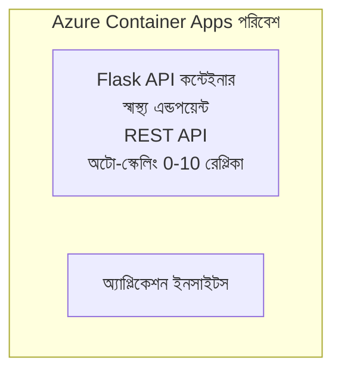

# সরল Flask API - Container App উদাহরণ

**শিখন পথ:** শুরুতর ⭐ | **সময়:** 25-35 মিনিট | **খরচ:** $0-15/মাস

একটি সম্পূর্ণ, কার্যকর Python Flask REST API যা Azure Developer CLI (azd) ব্যবহার করে Azure Container Apps-এ ডিপ্লয় করা হয়েছে। এই উদাহরণটি কনটেইনার ডিপ্লয়মেন্ট, অটো-স্কেলিং, এবং মনিটরিং বেসিক্স প্রদর্শন করে।

## 🎯 আপনি যা শিখবেন

- কনটেইনারাইজড Python অ্যাপ্লিকেশন Azure-এ ডিপ্লয় করা
- scale-to-zero সহ অটো-স্কেলিং কনফিগার করা
- হেলথ প্রোবস এবং রেডিনেস চেক বাস্তবায়ন করা
- অ্যাপ্লিকেশন লগ এবং মেট্রিক মনিটর করা
- দ্রুত ডিপ্লয়মেন্টের জন্য Azure Developer CLI ব্যবহার করা

## 📦 এতে রয়েছে

✅ **Flask অ্যাপ্লিকেশন** - CRUD অপারেশনসহ সম্পূর্ণ REST API (`src/app.py`)  
✅ **Dockerfile** - প্রোডাকশন-সিদ্ধ কন্টেইনার কনফিগারেশন  
✅ **Bicep Infrastructure** - Container Apps পরিবেশ ও API স্থাপন  
✅ **AZD কনফিগারেশন** - এক-কম্যান্ড ডিপ্লয়মেন্ট সেটআপ  
✅ **হেলথ প্রোবস** - লিভনেস ও রেডিনেস চেক কনফিগার করা আছে  
✅ **অটো-স্কেলিং** - HTTP লোডের উপর ভিত্তি করে 0-10 রেপ্লিকা  

## Architecture



## পূর্বশর্ত

### প্রয়োজনীয়
- **Azure Developer CLI (azd)** - [ইনস্টল গাইড](https://learn.microsoft.com/azure/developer/azure-developer-cli/install-azd)
- **Azure সাবস্ক্রিপশন** - [নিঃশুল্ক অ্যাকাউন্ট](https://azure.microsoft.com/free/)
- **Docker Desktop** - [Docker ইনস্টল করুন](https://www.docker.com/products/docker-desktop/) (লোকাল টেস্টিংয়ের জন্য)

### পূর্বশর্তগুলি যাচাই করুন

```bash
# azd সংস্করণ যাচাই করুন (প্রয়োজন 1.5.0 বা উচ্চতর)
azd version

# Azure লগইন যাচাই করুন
azd auth login

# Docker পরীক্ষা করুন (ঐচ্ছিক, স্থানীয় পরীক্ষার জন্য)
docker --version
```

## ⏱️ ডিপ্লয়মেন্ট টাইমলাইন

| ধাপ | সময়কাল | কী ঘটছে |
|-------|----------|--------------||
| Environment setup | 30 seconds | Create azd environment |
| Build container | 2-3 minutes | Docker দিয়ে Flask অ্যাপ বিল্ড |
| Provision infrastructure | 3-5 minutes | Container Apps, registry, monitoring তৈরি করুন |
| Deploy application | 2-3 minutes | ইমেজ পুশ করে Container Apps-এ ডিপ্লয় |
| **মোট** | **8-12 মিনিট** | সম্পূর্ণ ডিপ্লয়মেন্ট প্রস্তুত |

## দ্রুত শুরু

```bash
# উদাহরণে যান
cd examples/container-app/simple-flask-api

# পরিবেশ শুরু করুন (একটি অনন্য নাম নির্বাচন করুন)
azd env new myflaskapi

# সবকিছু ডিপ্লয় করুন (অবকাঠামো + অ্যাপ্লিকেশন)
azd up
# আপনাকে অনুরোধ করা হবে:
# 1. Azure সাবস্ক্রিপশন নির্বাচন করুন
# 2. অবস্থান নির্বাচন করুন (যেমন: eastus2)
# 3. ডিপ্লয়ের জন্য 8-12 মিনিট অপেক্ষা করুন

# আপনার API এন্ডপয়েন্ট পান
azd env get-values

# API পরীক্ষা করুন
curl $(azd env get-value API_ENDPOINT)/health
```

**প্রত্যাশিত আউটপুট:**
```json
{
  "status": "healthy",
  "timestamp": "2025-11-19T10:30:00Z",
  "service": "simple-flask-api",
  "version": "1.0.0"
}
```

## ✅ ডিপ্লয়মেন্ট যাচাই করুন

### ধাপ ১: ডিপ্লয়মেন্ট স্থিতি পরীক্ষা করুন

```bash
# ডিপ্লয় করা সার্ভিসগুলো দেখুন
azd show

# প্রত্যাশিত আউটপুট দেখায়:
# - সার্ভিস: api
# - এন্ডপয়েন্ট: https://ca-api-[env].xxx.azurecontainerapps.io
# - স্ট্যাটাস: চলমান
```

### ধাপ ২: API এন্ডপয়েন্ট পরীক্ষা করুন

```bash
# API এন্ডপয়েন্ট পান
API_URL=$(azd env get-value API_ENDPOINT)

# হেলথ পরীক্ষা করুন
curl $API_URL/health

# মূল এন্ডপয়েন্ট পরীক্ষা করুন
curl $API_URL/

# একটি আইটেম তৈরি করুন
curl -X POST $API_URL/api/items \
  -H "Content-Type: application/json" \
  -d '{"name": "Test Item", "description": "My first item"}'

# সমস্ত আইটেম পান
curl $API_URL/api/items
```

**সফলতার মানদণ্ড:**
- ✅ হেলথ এন্ডপয়েন্ট HTTP 200 রিটার্ন করবে
- ✅ রুট এন্ডপয়েন্ট API তথ্য প্রদর্শন করে
- ✅ POST আইটেম তৈরি করে এবং HTTP 201 রিটার্ন করে
- ✅ GET তৈরি করা আইটেমগুলো রিটার্ন করে

### ধাপ ৩: লগ দেখুন

```bash
# azd monitor ব্যবহার করে লাইভ লগ স্ট্রিম করুন
azd monitor --logs

# অথবা Azure CLI ব্যবহার করুন:
az containerapp logs show --name api --resource-group $RG_NAME --follow

# আপনি দেখতে পাবেন:
# - Gunicorn স্টার্টআপ বার্তা
# - HTTP অনুরোধ লগ
# - অ্যাপ্লিকেশন তথ্য লগ
```

## প্রজেক্ট স্ট্রাকচার

```
simple-flask-api/
├── azure.yaml              # AZD configuration
├── infra/
│   ├── main.bicep         # Main infrastructure
│   ├── main.parameters.json
│   └── app/
│       ├── container-env.bicep
│       └── api.bicep
└── src/
    ├── app.py             # Flask application
    ├── requirements.txt
    └── Dockerfile
```

## API এন্ডপয়েন্টস

| এন্ডপয়েন্ট | মেথড | বর্ণনা |
|----------|--------|-------------|
| `/health` | GET | হেলথ চেক |
| `/api/items` | GET | সব আইটেম তালিকা |
| `/api/items` | POST | নতুন আইটেম তৈরি করুন |
| `/api/items/{id}` | GET | নির্দিষ্ট আইটেম পান |
| `/api/items/{id}` | PUT | আইটেম আপডেট করুন |
| `/api/items/{id}` | DELETE | আইটেম মুছুন |

## কনফিগারেশন

### পরিবেশ ভেরিয়েবল

```bash
# কাস্টম কনফিগারেশন সেট করুন
azd env set PORT 8000
azd env set LOG_LEVEL info
azd env set MAX_REPLICAS 20
```

### স্কেলিং কনফিগারেশন

API স্বয়ংক্রিয়ভাবে HTTP ট্র্যাফিকের উপর ভিত্তি করে স্কেল করে:
- **নূন্যতম রেপ্লিকা**: 0 (নিষ্ক্রিয় হলে জিরোতে স্কেল করে)
- **সর্বোচ্চ রেপ্লিকা**: 10
- **প্রতি রেপ্লিকা সমান্তরাল অনুরোধ**: 50

## ডেভেলপমেন্ট

### লোকালে চালান

```bash
# নির্ভরশীলতা ইনস্টল করুন
cd src
pip install -r requirements.txt

# অ্যাপ চালান
python app.py

# স্থানীয়ভাবে পরীক্ষা করুন
curl http://localhost:8000/health
```

### কনটেইনার বিল্ড ও টেস্ট করুন

```bash
# Docker ইমেজ তৈরি করুন
docker build -t flask-api:local ./src

# স্থানীয়ভাবে কন্টেইনার চালান
docker run -p 8000:8000 flask-api:local

# কন্টেইনার পরীক্ষা করুন
curl http://localhost:8000/health
```

## ডিপ্লয়মেন্ট

### সম্পূর্ণ ডিপ্লয়মেন্ট

```bash
# অবকাঠামো এবং অ্যাপ্লিকেশন স্থাপন করুন
azd up
```

### কেবল কোড ডিপ্লয়মেন্ট

```bash
# শুধুমাত্র অ্যাপ্লিকেশন কোড স্থাপন করুন (ইনফ্রাস্ট্রাকচার অপরিবর্তিত)
azd deploy api
```

### কনফিগারেশন আপডেট করুন

```bash
# পরিবেশ ভেরিয়েবলগুলো আপডেট করুন
azd env set API_KEY "new-api-key"

# নতুন কনফিগারেশন সহ পুনরায় স্থাপন করুন
azd deploy api
```

## মনিটরিং

### লগ দেখুন

```bash
# azd monitor ব্যবহার করে লাইভ লগ স্ট্রিম করুন
azd monitor --logs

# অথবা Container Apps-এর জন্য Azure CLI ব্যবহার করুন:
az containerapp logs show --name api --resource-group $RG_NAME --follow

# শেষ ১০০টি লাইন দেখুন
az containerapp logs show --name api --resource-group $RG_NAME --tail 100
```

### মেট্রিক্স মনিটর করুন

```bash
# Azure Monitor ড্যাশবোর্ড খুলুন
azd monitor --overview

# নির্দিষ্ট মেট্রিকগুলি দেখুন
az monitor metrics list \
  --resource $(azd show --output json | jq -r '.services.api.resourceId') \
  --metric "Requests,ResponseTime"
```

## টেস্টিং

### হেলথ চেক

```bash
curl $(azd show --output json | jq -r '.services.api.endpoint')/health
```

প্রত্যাশিত রেসপন্স:
```json
{
  "status": "healthy",
  "timestamp": "2025-11-19T10:30:00Z"
}
```

### আইটেম তৈরি করুন

```bash
curl -X POST $(azd show --output json | jq -r '.services.api.endpoint')/api/items \
  -H "Content-Type: application/json" \
  -d '{"name": "Test Item", "description": "A test item"}'
```

### সব আইটেম পান

```bash
curl $(azd show --output json | jq -r '.services.api.endpoint')/api/items
```

## খরচ অপ্টিমাইজেশন

এই ডিপ্লয়মেন্টে স্কেল-টু-জিরো ব্যবহৃত হচ্ছে, তাই API অনুরোধ প্রক্রিয়াকরণ করার সময়ই আপনি অর্থ দেবেন:

- **নিষ্ক্রিয় খরচ**: ~$0/মাস (জিরোতে স্কেল করা হয়)
- **সক্রিয় খরচ**: ~$0.000024/সেকেন্ড প্রতি রেপ্লিকা
- **প্রত্যাশিত মাসিক খরচ** (হালকা ব্যবহার): $5-15

### খরচ আরও কমান

```bash
# ডেভের জন্য সর্বোচ্চ রেপ্লিকা কমান
azd env set MAX_REPLICAS 3

# সংক্ষিপ্ত আইডল টাইমআউট ব্যবহার করুন
azd env set SCALE_TO_ZERO_TIMEOUT 300  # ৫ মিনিট
```

## সমস্যা সমাধান

### কনটেইনার শুরু হচ্ছে না

```bash
# Azure CLI ব্যবহার করে কনটেইনার লগ পরীক্ষা করুন
az containerapp logs show --name api --resource-group $RG_NAME --tail 100

# Docker ইমেজ স্থানীয়ভাবে বিল্ড হয় কিনা যাচাই করুন
docker build -t test ./src
```

### API অ্যাক্সেসযোগ্য নয়

```bash
# ইনগ্রেসটি বাহ্যিক কি না যাচাই করুন
az containerapp show --name api --resource-group rg-simple-flask-api \
  --query properties.configuration.ingress.external
```

### উচ্চ রেসপন্স সময়

```bash
# CPU/মেমরি ব্যবহার পরীক্ষা করুন
az monitor metrics list \
  --resource $(azd show --output json | jq -r '.services.api.resourceId') \
  --metric "CPUPercentage,MemoryPercentage"

# প্রয়োজনে রিসোর্স বাড়ান
az containerapp update --name api --resource-group rg-simple-flask-api \
  --cpu 1.0 --memory 2Gi
```

## পরিষ্কার করুন

```bash
# সমস্ত রিসোর্স মুছুন
azd down --force --purge
```

## পরবর্তী ধাপ

### এই উদাহরণটি বাড়ান

1. **ডাটাবেস যোগ করুন** - Azure Cosmos DB বা SQL Database ইন্টিগ্রেট করুন
   ```bash
   # infra/main.bicep-এ Cosmos DB মডিউল যোগ করুন
   # app.py-এ ডাটাবেস সংযোগসহ আপডেট করুন
   ```

2. **অথেন্টিকেশন যোগ করুন** - Microsoft Entra ID বা API কী বাস্তবায়ন করুন
   ```python
   # app.py-এ প্রমাণীকরণ মিডলওয়্যার যোগ করুন
   from functools import wraps
   ```

3. **CI/CD সেট আপ করুন** - GitHub Actions ওয়ার্কফ্লো
   ```yaml
   # Create .github/workflows/deploy.yml
   name: Deploy to Azure
   on: [push]
   ```

4. **Managed Identity যোগ করুন** - Azure পরিষেবাগুলিতে নিরাপদ অ্যাক্সেস
   ```bicep
   # Update infra/app/api.bicep
   identity: { type: 'SystemAssigned' }
   ```

### সম্পর্কিত উদাহরণসমূহ

- **[ডাটাবেস অ্যাপ](../../../../../examples/database-app)** - SQL ডাটাবেসসহ সম্পূর্ণ উদাহরণ
- **[মাইক্রোসার্ভিসেস](../../../../../examples/container-app/microservices)** - বহু-সার্ভিস আর্কিটেকচার
- **[Container Apps মাস্টার গাইড](../README.md)** - সকল কন্টেইনার প্যাটার্ন

### শেখার সম্পদ

- 📚 [AZD নবীনদের জন্য কোর্স](../../../README.md) - প্রধান কোর্স হোম
- 📚 [Container Apps প্যাটার্ন](../README.md) - আরও ডিপ্লয়মেন্ট প্যাটার্ন
- 📚 [AZD টেমপ্লেট গ্যালারি](https://azure.github.io/awesome-azd/) - কমিউনিটি টেমপ্লেট

## অতিরিক্ত সম্পদ

### ডকুমেন্টেশন
- **[Flask ডকুমেন্টেশন](https://flask.palletsprojects.com/)** - Flask ফ্রেমওয়ার্ক গাইড
- **[Azure Container Apps](https://learn.microsoft.com/azure/container-apps/)** - অফিসিয়াল Azure ডকস
- **[Azure Developer CLI](https://learn.microsoft.com/azure/developer/azure-developer-cli/)** - azd কমান্ড রেফারেন্স

### টিউটোরিয়াল
- **[Container Apps কুইকস্টার্ট](https://learn.microsoft.com/azure/container-apps/quickstart-portal)** - আপনার প্রথম অ্যাপ ডিপ্লয় করুন
- **[Azure-এ Python](https://learn.microsoft.com/azure/developer/python/)** - পাইথন ডেভেলপমেন্ট গাইড
- **[Bicep Language](https://learn.microsoft.com/azure/azure-resource-manager/bicep/)** - ইনফ্রাস্ট্রাকচার অ্যাজ কোড

### টুলস
- **[Azure পোর্টাল](https://portal.azure.com)** - ভিজ্যুয়ালি রিসোর্স ম্যানেজ করুন
- **[VS Code Azure এক্সটেনশন](https://marketplace.visualstudio.com/items?itemName=ms-azuretools.vscode-azurecontainerapps)** - IDE ইন্টিগ্রেশন

---

**🎉 অভিনন্দন!** আপনি স্বয়ংক্রিয়-স্কেলিং এবং মনিটরিং সহ একটি প্রোডাকশন-রেডি Flask API Azure Container Apps-এ ডিপ্লয় করেছেন।

**প্রশ্ন আছে?** [ইস্যু খুলুন](https://github.com/microsoft/AZD-for-beginners/issues) বা [প্রশ্নোত্তর](../../../resources/faq.md) দেখুন

---

<!-- CO-OP TRANSLATOR DISCLAIMER START -->
**অস্বীকৃতি**:
এই নথিটি AI অনুবাদ পরিষেবা [Co-op Translator](https://github.com/Azure/co-op-translator) ব্যবহার করে অনূদিত হয়েছে। যদিও আমরা শুদ্ধতার জন্য চেষ্টা করি, অনুগ্রহ করে মনে রাখবেন যে স্বয়ংক্রিয় অনুবাদে ত্রুটি বা অসঙ্গতি থাকতে পারে। মূল নথিটি তার স্বভাষায় কর্তৃত্বপূর্ণ উৎস হিসেবে বিবেচিত হওয়া উচিত। গুরুত্বপূর্ণ তথ্যের জন্য পেশাদার মানব অনুবাদ সুপারিশ করা হয়। এই অনুবাদের ব্যবহারে প্রয়োজনীয় ভুল বোঝাবুঝি বা ভুল ব্যাখ্যার জন্য আমরা দায়বদ্ধ নই।
<!-- CO-OP TRANSLATOR DISCLAIMER END -->