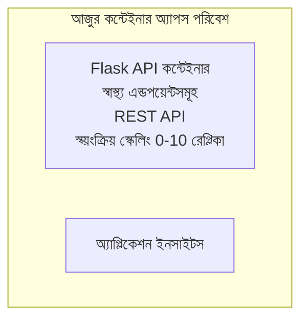

# Simple Flask API - Container App Example

**শেখার পথ:** শুরু ⭐ | **সময়:** 25-35 মিনিট | **খরচ:** $0-15/মাস

একটি সম্পূর্ণ, কাজ করা Python Flask REST API যা Azure Developer CLI (azd) ব্যবহার করে Azure Container Apps-এ ডিপ্লয় করা হয়েছে। এই উদাহরণটি কনটেইনার ডিপ্লয়মেন্ট, অটো-স্কেলিং এবং মনিটরিং বেসিকগুলি প্রদর্শন করে।

## 🎯 আপনি কী শিখবেন

- কনটেইনারাইজড Python অ্যাপ Azure-এ ডিপ্লয় করতে
- scale-to-zero সহ অটো-স্কেলিং কনফিগার করতে
- হেলথ প্রোব এবং রেডিনেস চেক বাস্তবায়ন করতে
- অ্যাপ্লিকেশন লগ এবং মেট্রিক মনিটর করতে
- দ্রুত ডিপ্লয়মেন্টের জন্য Azure Developer CLI ব্যবহার করতে

## 📦 কী অন্তর্ভুক্ত

✅ **Flask Application** - CRUD অপারেশন সহ সম্পূর্ণ REST API (`src/app.py`)  
✅ **Dockerfile** - প্রোডাকশন-রেডি কনটেইনার কনফিগারেশন  
✅ **Bicep Infrastructure** - Container Apps পরিবেশ এবং API ডিপ্লয়মেন্ট  
✅ **AZD Configuration** - এক-কমান্ড ডিপ্লয়মেন্ট সেটআপ  
✅ **Health Probes** - Liveness এবং readiness চেক কনফিগার করা হয়েছে  
✅ **Auto-scaling** - HTTP লোডের ভিত্তিতে 0-10 রেপ্লিকা

## আর্কিটেকচার


## প্রয়োজনীয়তা

### প্রয়োজনীয়
- **Azure Developer CLI (azd)** - [ইনস্টল নির্দেশিকা](https://learn.microsoft.com/azure/developer/azure-developer-cli/install-azd)
- **Azure subscription** - [Free account](https://azure.microsoft.com/free/)
- **Docker Desktop** - [Install Docker](https://www.docker.com/products/docker-desktop/) (স্থানীয় পরীক্ষার জন্য)

### প্রয়োজনীয়তা যাচাই করুন

```bash
# azd সংস্করণ পরীক্ষা করুন (প্রয়োজন 1.5.0 বা তার বেশি)
azd version

# Azure লগইন যাচাই করুন
azd auth login

# Docker পরীক্ষা করুন (ঐচ্ছিক, স্থানীয় পরীক্ষার জন্য)
docker --version
```

## ⏱️ ডিপ্লয়মেন্ট সময়রেখা

| ধাপ | সময়কাল | কি ঘটে |
|-------|----------|--------------||
| Environment setup | 30 seconds | azd পরিবেশ তৈরি করুন |
| Build container | 2-3 minutes | Docker ব্যবহার করে Flask অ্যাপ বিল্ড |
| Provision infrastructure | 3-5 minutes | Container Apps, registry, monitoring তৈরি করা |
| Deploy application | 2-3 minutes | ইমেজ পুশ করে Container Apps-এ ডিপ্লয় |
| **মোট** | **8-12 minutes** | সম্পূর্ণ ডিপ্লয়মেন্ট প্রস্তুত |

## দ্রুত শুরু

```bash
# উদাহরণে যান
cd examples/container-app/simple-flask-api

# পরিবেশ ইনিশিয়ালাইজ করুন (একটি অনন্য নাম নির্বাচন করুন)
azd env new myflaskapi

# সবকিছু ডিপ্লয় করুন (ইনফ্রাস্ট্রাকচার + অ্যাপ্লিকেশন)
azd up
# আপনাকে অনুরোধ করা হবে:
# 1. Azure সাবস্ক্রিপশন নির্বাচন করুন
# 2. অবস্থান নির্বাচন করুন (যেমন, eastus2)
# 3. ডিপ্লয়মেন্টের জন্য 8-12 মিনিট অপেক্ষা করুন

# আপনার API এন্ডপয়েন্ট পান
azd env get-values

# API পরীক্ষা করুন
curl $(azd env get-value API_ENDPOINT)/health
```

**প্রত্যাশিত আউটপুট:**
```json
{
  "status": "healthy",
  "timestamp": "2025-11-19T10:30:00Z",
  "service": "simple-flask-api",
  "version": "1.0.0"
}
```

## ✅ ডিপ্লয়মেন্ট যাচাই করুন

### ধাপ 1: ডিপ্লয়মেন্ট স্থিতি যাচাই করুন

```bash
# ডিপ্লয় করা সার্ভিসগুলো দেখুন
azd show

# প্রত্যাশিত আউটপুট দেখায়:
# - সার্ভিস: api
# - এন্ডপয়েন্ট: https://ca-api-[env].xxx.azurecontainerapps.io
# - স্ট্যাটাস: চলছে
```

### ধাপ 2: API এন্ডপয়েন্ট পরীক্ষা করুন

```bash
# API এন্ডপয়েন্ট নিন
API_URL=$(azd env get-value API_ENDPOINT)

# স্বাস্থ্য পরীক্ষা করুন
curl $API_URL/health

# রুট এন্ডপয়েন্ট পরীক্ষা করুন
curl $API_URL/

# একটি আইটেম তৈরি করুন
curl -X POST $API_URL/api/items \
  -H "Content-Type: application/json" \
  -d '{"name": "Test Item", "description": "My first item"}'

# সমস্ত আইটেম নিন
curl $API_URL/api/items
```

**সফলতার মানদণ্ড:**
- ✅ হেলথ এন্ডপয়েন্ট HTTP 200 রিটার্ন করে
- ✅ রুট এন্ডপয়েন্ট API তথ্য প্রদর্শন করে
- ✅ POST আইটেম তৈরি করে এবং HTTP 201 রিটার্ন করে
- ✅ GET তৈরি করা আইটেমগুলো রিটার্ন করে

### ধাপ 3: লগ দেখুন

```bash
# azd monitor ব্যবহার করে লাইভ লগ স্ট্রিম করুন
azd monitor --logs

# অথবা Azure CLI ব্যবহার করুন:
az containerapp logs show --name api --resource-group $RG_NAME --follow

# আপনি দেখতে পাবেন:
# - Gunicorn স্টার্টআপ বার্তাগুলি
# - HTTP অনুরোধ লগ
# - অ্যাপ্লিকেশন তথ্য লগ
```

## প্রকল্পের কাঠামো

```
simple-flask-api/
├── azure.yaml              # AZD configuration
├── infra/
│   ├── main.bicep         # Main infrastructure
│   ├── main.parameters.json
│   └── app/
│       ├── container-env.bicep
│       └── api.bicep
└── src/
    ├── app.py             # Flask application
    ├── requirements.txt
    └── Dockerfile
```

## API এন্ডপয়েন্ট

| এন্ডপয়েন্ট | মেথড | বর্ণনা |
|----------|--------|-------------|
| `/health` | GET | স্বাস্থ্য পরীক্ষা |
| `/api/items` | GET | সমস্ত আইটেম তালিকা |
| `/api/items` | POST | নতুন আইটেম তৈরি করুন |
| `/api/items/{id}` | GET | নির্দিষ্ট আইটেম পান |
| `/api/items/{id}` | PUT | আইটেম আপডেট করুন |
| `/api/items/{id}` | DELETE | আইটেম মুছুন |

## কনফিগারেশন

### পরিবেশ ভেরিয়েবল

```bash
# কাস্টম কনফিগারেশন সেট করুন
azd env set PORT 8000
azd env set LOG_LEVEL info
azd env set MAX_REPLICAS 20
```

### স্কেলিং কনফিগারেশন

API স্বয়ংক্রিয়ভাবে HTTP ট্রাফিকের ভিত্তিতে স্কেল হবে:
- **সর্বনিম্ন রেপ্লিকা**: 0 (নিষ্ক্রিয় হলে শূন্যে স্কেল করে)
- **সর্বোচ্চ রেপ্লিকা**: 10
- **প্রতি রেপ্লিকা সমান্তরাল অনুরোধ**: 50

## ডেভেলপমেন্ট

### লোকালি চালান

```bash
# নির্ভরশীলতাগুলো ইনস্টল করুন
cd src
pip install -r requirements.txt

# অ্যাপ চালান
python app.py

# স্থানীয়ভাবে পরীক্ষা করুন
curl http://localhost:8000/health
```

### কন্টেইনার তৈরি ও পরীক্ষা করুন

```bash
# Docker ইমেজ তৈরি করুন
docker build -t flask-api:local ./src

# কনটেইনার লোকালি চালান
docker run -p 8000:8000 flask-api:local

# কনটেইনার পরীক্ষা করুন
curl http://localhost:8000/health
```

## ডিপ্লয়মেন্ট

### সম্পূর্ণ ডিপ্লয়মেন্ট

```bash
# ইনফ্রাস্ট্রাকচার এবং অ্যাপ্লিকেশন মোতায়েন করুন
azd up
```

### কেবল কোড ডিপ্লয়মেন্ট

```bash
# শুধুমাত্র অ্যাপলিকেশন কোড ডিপ্লয় করুন (ইনফ্রাস্ট্রাকচার অপরিবর্তিত)
azd deploy api
```

### কনফিগারেশন আপডেট করুন

```bash
# পরিবেশ ভেরিয়েবলগুলো আপডেট করুন
azd env set API_KEY "new-api-key"

# নতুন কনফিগারেশনের সাথে পুনরায় ডিপ্লয় করুন
azd deploy api
```

## মনিটরিং

### লগ দেখুন

```bash
# azd monitor ব্যবহার করে লাইভ লগ স্ট্রিম করুন
azd monitor --logs

# অথবা Container Apps-এর জন্য Azure CLI ব্যবহার করুন:
az containerapp logs show --name api --resource-group $RG_NAME --follow

# শেষ ১০০ লাইন দেখুন
az containerapp logs show --name api --resource-group $RG_NAME --tail 100
```

### মেট্রিক্স পর্যবেক্ষণ করুন

```bash
# Azure Monitor ড্যাশবোর্ড খুলুন
azd monitor --overview

# নির্দিষ্ট মেট্রিকগুলো দেখুন
az monitor metrics list \
  --resource $(azd show --output json | jq -r '.services.api.resourceId') \
  --metric "Requests,ResponseTime"
```

## পরীক্ষা

### হেলথ চেক

```bash
curl $(azd show --output json | jq -r '.services.api.endpoint')/health
```

প্রত্যাশিত উত্তর:
```json
{
  "status": "healthy",
  "timestamp": "2025-11-19T10:30:00Z"
}
```

### আইটেম তৈরি করুন

```bash
curl -X POST $(azd show --output json | jq -r '.services.api.endpoint')/api/items \
  -H "Content-Type: application/json" \
  -d '{"name": "Test Item", "description": "A test item"}'
```

### সমস্ত আইটেম পান

```bash
curl $(azd show --output json | jq -r '.services.api.endpoint')/api/items
```

## খরচ অপ্টিমাইজেশন

এই ডিপ্লয়মেন্টটি scale-to-zero ব্যবহার করে, তাই API অনুরোধ প্রক্রিয়াকরণ করার সময়ই আপনি খরচ দেবেন:

- **অচল খরচ**: ~$0/মাস (শূন্যে স্কেল করা)
- **সক্রিয় খরচ**: ~$0.000024/সেকেন্ড প্রতি রেপ্লিকা
- **প্রত্যাশিত মাসিক খরচ** (হালকা ব্যবহারে): $5-15

### আরও খরচ কমান

```bash
# ডেভের জন্য সর্বোচ্চ রিপ্লিকা কমান
azd env set MAX_REPLICAS 3

# সংক্ষিপ্ত নিষ্ক্রিয় সময়সীমা ব্যবহার করুন
azd env set SCALE_TO_ZERO_TIMEOUT 300  # ৫ মিনিট
```

## সমস্যার সমাধান

### কন্টেইনার শুরু হবে না

```bash
# Azure CLI ব্যবহার করে কনটেইনার লগ পরীক্ষা করুন
az containerapp logs show --name api --resource-group $RG_NAME --tail 100

# লোকালি Docker ইমেজ বিল্ড হচ্ছে কি না যাচাই করুন
docker build -t test ./src
```

### API অ্যাক্সেসযোগ্য নয়

```bash
# ইনগ্রেসটি বাহ্যিক কিনা যাচাই করুন
az containerapp show --name api --resource-group rg-simple-flask-api \
  --query properties.configuration.ingress.external
```

### উচ্চ প্রতিক্রিয়া সময়

```bash
# CPU/মেমরি ব্যবহার পরীক্ষা করুন
az monitor metrics list \
  --resource $(azd show --output json | jq -r '.services.api.resourceId') \
  --metric "CPUPercentage,MemoryPercentage"

# প্রয়োজনে সম্পদ বৃদ্ধি করুন
az containerapp update --name api --resource-group rg-simple-flask-api \
  --cpu 1.0 --memory 2Gi
```

## পরিষ্কার করুন

```bash
# সমস্ত সম্পদ মুছুন
azd down --force --purge
```

## পরবর্তী ধাপ

### এই উদাহরণটি সম্প্রসারিত করুন

1. **ডাটাবেস যোগ করুন** - Azure Cosmos DB বা SQL Database ইন্টিগ্রেট করুন
   ```bash
   # infra/main.bicep-এ Cosmos DB মডিউল যোগ করুন
   # app.py-এ ডেটাবেস সংযোগ আপডেট করুন
   ```

2. **অথেনটিকেশন যোগ করুন** - Azure AD বা API কী বাস্তবায়ন করুন
   ```python
   # app.py-এ প্রমাণীকরণ মিডলওয়্যার যোগ করুন
   from functools import wraps
   ```

3. **CI/CD সেটআপ করুন** - GitHub Actions ওয়ার্কফ্লো
   ```yaml
   # Create .github/workflows/deploy.yml
   name: Deploy to Azure
   on: [push]
   ```

4. **Managed Identity যোগ করুন** - Azure সার্ভিসে নিরাপদ অ্যাক্সেস
   ```bicep
   # Update infra/app/api.bicep
   identity: { type: 'SystemAssigned' }
   ```

### সম্পর্কিত উদাহরণ

- **[ডাটাবেস অ্যাপ](../../../../../examples/database-app)** - SQL Database সহ সম্পূর্ণ উদাহরণ
- **[মাইক্রোসার্ভিসেস](../../../../../examples/container-app/microservices)** - মাল্টি-সার্ভিস স্থাপত্য
- **[Container Apps Master Guide](../README.md)** - সমস্ত কনটেইনার প্যাটার্ন

### শেখার সম্পদ

- 📚 [AZD For Beginners Course](../../../README.md) - মূল কোর্স হোম
- 📚 [Container Apps Patterns](../README.md) - আরও ডিপ্লয়মেন্ট প্যাটার্ন
- 📚 [AZD Templates Gallery](https://azure.github.io/awesome-azd/) - কমিউনিটি টেমপ্লেট

## অতিরিক্ত সম্পদ

### ডকুমেন্টেশন
- **[Flask Documentation](https://flask.palletsprojects.com/)** - Flask ফ্রেমওয়ার্ক গাইড
- **[Azure Container Apps](https://learn.microsoft.com/azure/container-apps/)** - Azure অফিসিয়াল ডকস
- **[Azure Developer CLI](https://learn.microsoft.com/azure/developer/azure-developer-cli/)** - azd কমান্ড রেফারেন্স

### টিউটোরিয়াল
- **[Container Apps Quickstart](https://learn.microsoft.com/azure/container-apps/quickstart-portal)** - আপনার প্রথম অ্যাপ ডিপ্লয় করুন
- **[Python on Azure](https://learn.microsoft.com/azure/developer/python/)** - Python ডেভেলপমেন্ট গাইড
- **[Bicep Language](https://learn.microsoft.com/azure/azure-resource-manager/bicep/)** - ইনফ্রাস্ট্রাকচার অ্যাজ কোড

### টুলস
- **[Azure Portal](https://portal.azure.com)** - রিসোর্স ভিজ্যুয়ালি ম্যানেজ করুন
- **[VS Code Azure Extension](https://marketplace.visualstudio.com/items?itemName=ms-azuretools.vscode-azurecontainerapps)** - IDE ইন্টিগ্রেশন

---

**🎉 অভিনন্দন!** আপনি একটি প্রোডাকশন-রেডি Flask API Azure Container Apps-এ অটো-স্কেলিং এবং মনিটরিং সহ ডিপ্লয় করেছেন।

**প্রশ্ন আছে?** [ইস্যু খুলুন](https://github.com/microsoft/AZD-for-beginners/issues) অথবা [প্রশ্নোত্তর (FAQ)](../../../resources/faq.md) দেখুন

---

<!-- CO-OP TRANSLATOR DISCLAIMER START -->
দায়-অস্বীকৃতি:
এই দলিলটি AI অনুবাদ সেবা [Co-op Translator](https://github.com/Azure/co-op-translator) ব্যবহার করে অনুবাদ করা হয়েছে। আমরা যথাসাধ্য সঠিকতা বজায় রাখার চেষ্টা করি; তবুও স্বয়ংক্রিয় অনুবাদে ভুল বা অসঙ্গতি থাকতে পারে। মূল নথিটি তার মৌলিক ভাষায়ই কর্তৃত্বপূর্ণ উৎস হিসেবে বিবেচিত হওয়া উচিত। গুরুত্বপূর্ণ তথ্যের জন্য পেশাদার মানব অনুবাদ গ্রহণ করা উচিৎ। এই অনুবাদ ব্যবহারের ফলে সৃষ্ট কোনো ভুল বোঝাবুঝি বা ভুল ব্যাখ্যার জন্য আমরা দায়ী নই।
<!-- CO-OP TRANSLATOR DISCLAIMER END -->