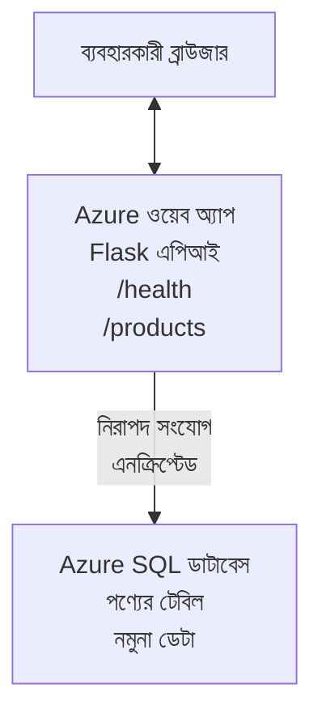

# AZD দিয়ে Microsoft SQL ডাটাবেস এবং ওয়েব অ্যাপ ডিপ্লয় করা

⏱️ **আনুমানিক সময়**: 20-30 মিনিট | 💰 **আনুমানিক ব্যয়**: ~$15-25/মাস | ⭐ **জটিলতা**: মাঝারি

এই **সম্পূর্ণ, কার্যকর উদাহরণটি** দেখায় কীভাবে [Azure Developer CLI (azd)](https://learn.microsoft.com/azure/developer/azure-developer-cli/) ব্যবহার করে একটি Python Flask ওয়েব অ্যাপ এবং Microsoft SQL ডাটাবেস Azure-এ ডিপ্লয় করা যায়। সমস্ত কোড অন্তর্ভুক্ত এবং পরীক্ষিত—কোনো বাহ্যিক নির্ভরতায় প্রয়োজন নেই।

## আপনি যা শিখবেন

এই উদাহরণটি সম্পন্ন করে আপনি:
- ইনফ্রাস্ট্রাকচার-এ-কোড ব্যবহার করে মাল্টি-টিয়ার অ্যাপ্লিকেশন (ওয়েব অ্যাপ + ডাটাবেস) ডিপ্লয় করতে পারবেন
- গোপন তথ্য হার্ডকোড না করে নিরাপদভাবে ডাটাবেস সংযোগ কনফিগার করতে পারবেন
- Application Insights দিয়ে অ্যাপ্লিকেশন হেলথ মনিটর করতে পারবেন
- AZD CLI দিয়ে Azure রিসোর্স কার্যকরভাবে পরিচালনা করতে পারবেন
- নিরাপত্তা, খরচ অপ্টিমাইজেশন, এবং পর্যবেক্ষণ সংক্রান্ত Azure সেরা অনুশীলন অনুসরণ করবেন

## দৃশ্যপট সংক্ষিপ্ত

- **ওয়েব অ্যাপ**: ডাটাবেস সংযোগ সহ Python Flask REST API
- **ডাটাবেস**: নমুনা ডেটা সহ Azure SQL Database
- **ইনফ্রাস্ট্রাকচার**: Bicep ব্যবহার করে প্রভিশন (মডুলার, পুনঃব্যবহারযোগ্য টেম্পলেট)
- **ডিপ্লয়মেন্ট**: `azd` কমান্ডগুলি দিয়ে সম্পূর্ণ স্বয়ংক্রিয়
- **মনিটরিং**: লগ এবং টেলিমেট্রির জন্য Application Insights

## প্রয়োজনীয়তা

### প্রয়োজনীয় টুলস

শুরুর আগে নিশ্চিত করুন আপনার কাছে এই টুলসগুলি ইনস্টল আছে:

1. **[Azure CLI](https://learn.microsoft.com/cli/azure/install-azure-cli)** (সংস্করণ 2.50.0 বা তারও উপরে)
   ```sh
   az --version
   # প্রত্যাশিত আউটপুট: azure-cli 2.50.0 বা তার উপরে
   ```

2. **[Azure Developer CLI (azd)](https://learn.microsoft.com/azure/developer/azure-developer-cli/install-azd)** (সংস্করণ 1.0.0 বা তারও উপরে)
   ```sh
   azd version
   # প্রত্যাশিত আউটপুট: azd সংস্করণ 1.0.0 বা তার ঊর্ধ্বে
   ```

3. **[Python 3.8+](https://www.python.org/downloads/)** (লোকাল ডেভেলপমেন্টের জন্য)
   ```sh
   python --version
   # প্রত্যাশিত আউটপুট: Python 3.8 বা তার উপরে
   ```

4. **[Docker](https://www.docker.com/get-started)** (ঐচ্ছিক, লোকাল কন্টেইনারাইজড ডেভেলপমেন্টের জন্য)
   ```sh
   docker --version
   # প্রত্যাশিত আউটপুট: Docker সংস্করণ 20.10 বা উচ্চতর
   ```

### Azure শর্তাবলী

- একটি সক্রিয় **Azure subscription** ([create a free account](https://azure.microsoft.com/free/))
- আপনার subscription-এ রিসোর্স তৈরি করার অনুমতি
- Subscription বা resource group এ **Owner** বা **Contributor** ভূমিকা

### জ্ঞানের প্রয়োজনীয়তা

এটি একটি **মধ্যম-স্তরের** উদাহরণ। আপনার জানা উচিত:
- বেসিক কমান্ড-লাইন অপারেশন
- ক্লাউডের মৌলিক ধারণা (রিসোর্স, resource groups)
- ওয়েব অ্যাপ এবং ডাটাবেস সম্পর্কে বেসিক ধারণা

**AZD নতুন?** প্রথমে [Getting Started guide](../../docs/chapter-01-foundation/azd-basics.md) দেখে নিন।

## আর্কিটেকচার

এই উদাহরণটি একটি দুই-টিয়ার আর্কিটেকচার ডিপ্লয় করে, একটি ওয়েব অ্যাপ এবং একটি SQL ডাটাবেস:


**রিসোর্স ডিপ্লয়মেন্ট:**
- **Resource Group**: সমস্ত রিসোর্সের জন্য কনটেইনার
- **App Service Plan**: Linux-ভিত্তিক হোস্টিং (খরচ সাশ্রয়ের জন্য B1 টিয়ার)
- **Web App**: Python 3.11 রানটাইম সহ Flask অ্যাপ্লিকেশন
- **SQL Server**: TLS 1.2 ন্যূনতম সহ ম্যানেজড ডাটাবেস সার্ভার
- **SQL Database**: Basic টিয়ার (2GB, ডেভ/টেস্টিং-এ উপযোগী)
- **Application Insights**: মনিটরিং ও লগিং
- **Log Analytics Workspace**: কেন্দ্রীভূত লগ স্টোরেজ

**উপমা**: এটিকে একটি রেস্টুরেন্ট (ওয়েব অ্যাপ) হিসেবে ভাবুন যার একটি ওয়াক-ইন ফ্রিজার (ডাটাবেস) আছে। গ্রাহকরা মেনু থেকে অর্ডার করে (API endpoints), এবং কিচেন (Flask অ্যাপ) ফ্রিজার থেকে উপকরণ (ডেটা) নিয়ে আসে। রেস্টুরেন্ট ম্যানেজার (Application Insights) ঘটে যাওয়া সবকিছু ট্র্যাক করে।

## ফোল্ডার স্ট্রাকচার

এই উদাহরণে সমস্ত ফাইল অন্তর্ভুক্ত—কোনো বাহ্যিক নির্ভরতা নেই:

```
examples/database-app/
│
├── README.md                    # This file
├── azure.yaml                   # AZD configuration file
├── .env.sample                  # Sample environment variables
├── .gitignore                   # Git ignore patterns
│
├── infra/                       # Infrastructure as Code (Bicep)
│   ├── main.bicep              # Main orchestration template
│   ├── abbreviations.json      # Azure naming conventions
│   └── resources/              # Modular resource templates
│       ├── sql-server.bicep    # SQL Server configuration
│       ├── sql-database.bicep  # Database configuration
│       ├── app-service-plan.bicep  # Hosting plan
│       ├── app-insights.bicep  # Monitoring setup
│       └── web-app.bicep       # Web application
│
└── src/
    └── web/                    # Application source code
        ├── app.py              # Flask REST API
        ├── requirements.txt    # Python dependencies
        └── Dockerfile          # Container definition
```

**প্রতিটি ফাইলের কাজ:**
- **azure.yaml**: AZD-কে কী ডিপ্লয় করতে হবে এবং কোথায় সেটা বলে
- **infra/main.bicep**: সমস্ত Azure রিসোর্স অর্কেস্ট্রেট করে
- **infra/resources/*.bicep**: পৃথক রিসোর্স ডেফিনেশন (পুনঃব্যবহারের জন্য মডুলার)
- **src/web/app.py**: ডাটাবেস লজিক সহ Flask অ্যাপ্লিকেশন
- **requirements.txt**: Python প্যাকেজ নির্ভরতা
- **Dockerfile**: ডিপ্লয়মেন্টের জন্য কন্টেইনারাইজেশন নির্দেশিকা

## দ্রুত শুরু (ধাপে ধাপে)

### ধাপ 1: ক্লোন ও নেভিগেট

```sh
git clone https://github.com/microsoft/AZD-for-beginners.git
cd AZD-for-beginners/examples/database-app
```

**✓ সফলতা যাচাই**: নিশ্চিত করুন আপনি `azure.yaml` এবং `infra/` ফোল্ডার দেখতে পাচ্ছেন:
```sh
ls
# প্রত্যাশিত: README.md, azure.yaml, infra/, src/
```

### ধাপ 2: Azure-এ প্রমাণীকরণ (Authenticate)

```sh
azd auth login
```

এটি আপনার ব্রাউজার খুলে Azure প্রমাণীকরণের জন্য নির্দেশ করবে। আপনার Azure ক্রেডেনশিয়াল দিয়ে সাইন ইন করুন।

**✓ সফলতা যাচাই**: আপনি দেখতে পাবেন:
```
Logged in to Azure.
```

### ধাপ 3: এনভায়রনমেন্ট ইনিশিয়ালাইজ করুন

```sh
azd init
```

**কি ঘটে**: AZD আপনার ডিপ্লয়মেন্টের জন্য লোকাল কনফিগারেশন তৈরি করে।

**আপনি যেসব প্রম্পট দেখবেন**:
- **Environment name**: একটি সংক্ষিপ্ত নাম লিখুন (উদাহরণ: `dev`, `myapp`)
- **Azure subscription**: তালিকা থেকে আপনার subscription নির্বাচন করুন
- **Azure location**: একটি রিজিয়ন নির্বাচন করুন (উদাহরণ: `eastus`, `westeurope`)

**✓ সফলতা যাচাই**: আপনি দেখতে পাবেন:
```
SUCCESS: New project initialized!
```

### ধাপ 4: Azure রিসোর্স প্রভিশন করুন

```sh
azd provision
```

**কি ঘটে**: AZD সমস্ত ইনফ্রাস্ট্রাকচার ডিপ্লয় করে (প্রায় 5-8 মিনিট লাগে):
1. Resource group তৈরি করে
2. SQL Server এবং Database তৈরি করে
3. App Service Plan তৈরি করে
4. Web App তৈরি করে
5. Application Insights তৈরি করে
6. নেটওয়ার্কিং এবং সিকিউরিটি কনফিগার করে

**আপনাকে যা প্রবেশ করাতে বলা হতে পারে**:
- **SQL admin username**: একটি ইউজারনেম দিন (উদাহরণ: `sqladmin`)
- **SQL admin password**: একটি শক্তিশালী পাসওয়ার্ড দিন (এটি সংরক্ষণ করুন!)

**✓ সফলতা যাচাই**: আপনি দেখতে পাবেন:
```
SUCCESS: Your application was provisioned in Azure in X minutes Y seconds.
You can view the resources created under the resource group rg-<env-name> in Azure Portal:
https://portal.azure.com/#@/resource/subscriptions/.../resourceGroups/rg-<env-name>
```

**⏱️ সময়**: 5-8 মিনিট

### ধাপ 5: অ্যাপ্লিকেশন ডিপ্লয় করুন

```sh
azd deploy
```

**কি ঘটে**: AZD আপনার Flask অ্যাপ্লিকেশন বিল্ড এবং ডিপ্লয় করে:
1. Python অ্যাপ্লিকেশন প্যাকেজ করে
2. Docker কন্টেইনার বিল্ড করে
3. Azure Web App-এ পুশ করে
4. ডাটাবেসে নমুনা ডেটা ইনিশিয়ালাইজ করে
5. অ্যাপ্লিকেশন শুরু করে

**✓ সফলতা যাচাই**: আপনি দেখতে পাবেন:
```
SUCCESS: Your application was deployed to Azure in X minutes Y seconds.
You can view the resources created under the resource group rg-<env-name> in Azure Portal:
https://portal.azure.com/#@/resource/subscriptions/.../resourceGroups/rg-<env-name>
```

**⏱️ সময়**: 3-5 মিনিট

### ধাপ 6: অ্যাপ্লিকেশন ব্রাউজ করুন

```sh
azd browse
```

এটি আপনার ডিপ্লয় করা ওয়েব অ্যাপকে ব্রাউজারে খুলবে, ঠিকানায় `https://app-<unique-id>.azurewebsites.net`

**✓ সফলতা যাচাই**: আপনি JSON আউটপুট দেখতে পাবেন:
```json
{
  "message": "Welcome to the Database App API",
  "endpoints": {
    "/": "This help message",
    "/health": "Health check endpoint",
    "/products": "List all products",
    "/products/<id>": "Get product by ID"
  }
}
```

### ধাপ 7: API এন্ডপয়েন্টগুলো টেস্ট করুন

**Health Check** (ডাটাবেস সংযোগ যাচাই করুন):
```sh
curl https://app-<your-id>.azurewebsites.net/health
```

**প্রত্যাশিত রেসপন্স**:
```json
{
  "status": "healthy",
  "database": "connected"
}
```

**List Products** (নমুনা ডেটা):
```sh
curl https://app-<your-id>.azurewebsites.net/products
```

**প্রত্যাশিত রেসপন্স**:
```json
[
  {
    "id": 1,
    "name": "Laptop",
    "description": "High-performance laptop",
    "price": 1299.99,
    "created_at": "2025-11-19T10:30:00"
  },
  ...
]
```

**একটি পণ্যের তথ্য নিন**:
```sh
curl https://app-<your-id>.azurewebsites.net/products/1
```

**✓ সফলতা যাচাই**: সব এন্ডপয়েন্ট ত্রুটিবিহীনভাবে JSON ডেটা রিটার্ন করছে।

---

**🎉 অভিনন্দন!** আপনি সফলভাবে AZD ব্যবহার করে Azure-এ একটি ওয়েব অ্যাপ এবং ডাটাবেস ডিপ্লয় করেছেন।

## কনফিগারেশন গভীর বিশ্লেষণ

### পরিবেশ ভেরিয়েবলসমূহ

গোপন তথ্যগুলো নিরাপদভাবে Azure App Service কনফিগারেশনে ম্যানেজ করা হয়—**কখনই সোর্স কোডে হার্ডকোড করবেন না**।

**AZD দ্বারা স্বয়ংক্রিয়ভাবে কনফিগার করা হয়**:
- `SQL_CONNECTION_STRING`: এনক্রিপ্টেড ক্রেডেনশিয়ালসহ ডাটাবেস কানেকশন
- `APPLICATIONINSIGHTS_CONNECTION_STRING`: মনিটরিং টেলিমেট্রি এন্ডপয়েন্ট
- `SCM_DO_BUILD_DURING_DEPLOYMENT`: ডিপ্লয়মেন্টকালে স্বয়ংক্রিয় নির্ভরতা ইনস্টলেশন সক্ষম করে

**গোপন তথ্য কোথায় স্টোর করা হয়**:
1. `azd provision` চলাকালীন, আপনি প্রম্পটের মাধ্যমে SQL ক্রেডেনশিয়াল দেবেন
2. AZD এগুলো আপনার লোকাল `.azure/<env-name>/.env` ফাইলে সংরক্ষণ করে (git-ignored)
3. AZD এগুলো Azure App Service কনফিগারেশনে ইনজেক্ট করে (রেস্টে এনক্রিপ্টেড)
4. অ্যাপ্লিকেশন runtime-এ `os.getenv()` দ্বারা এগুলো পড়ে

### লোকাল ডেভেলপমেন্ট

লোকাল টেস্টিংয়ের জন্য, নমুনা থেকে একটি `.env` ফাইল তৈরি করুন:

```sh
cp .env.sample .env
# আপনার লোকাল ডাটাবেস সংযোগ দিয়ে .env ফাইলটি সম্পাদনা করুন
```

**লোকাল ডেভেলপমেন্ট ওয়ার্কফ্লো**:
```sh
# নির্ভরশীল প্যাকেজসমূহ ইনস্টল করুন
cd src/web
pip install -r requirements.txt

# পরিবেশ ভেরিয়েবল সেট করুন
export SQL_CONNECTION_STRING="your-local-connection-string"

# অ্যাপ্লিকেশন চালান
python app.py
```

**লোকালি টেস্ট করুন**:
```sh
curl http://localhost:8000/health
# প্রত্যাশিত: {"অবস্থা": "সুস্থ", "ডাটাবেস": "সংযুক্ত"}
```

### ইনফ্রাস্ট্রাকচার অ্যাজ কোড

সমস্ত Azure রিসোর্স **Bicep টেম্পলেটসমূহে** (`infra/` ফোল্ডার) সংজ্ঞায়িত:

- **মডুলার ডিজাইন**: প্রতিটি রিসোর্স টাইপের নিজস্ব ফাইল রয়েছে পুনঃব্যবহারের জন্য
- **প্যারামিটারাইজড**: SKU, রিজিয়ন, নামকরণ কনভেনশন কাস্টমাইজ করুন
- **সেরা অনুশীলন**: Azure নামকরণ স্ট্যান্ডার্ড এবং সিকিউরিটি ডিফল্ট অনুসরণ করে
- **ভার্সন কন্ট্রোল**: ইনফ্রাস্ট্রাকচার পরিবর্তনগুলি Git-এ ট্র্যাক করা হয়

**কাস্টমাইজেশন উদাহরণ**:
ডাটাবেস টিয়ার পরিবর্তন করতে, edit করুন `infra/resources/sql-database.bicep`:
```bicep
sku: {
  name: 'Standard'  // Changed from 'Basic'
  tier: 'Standard'
  capacity: 10
}
```

## নিরাপত্তা সেরা অনুশীলন

এই উদাহরণটি Azure সিকিউরিটি সেরা অনুশীলন অনুসরণ করে:

### 1. **সোর্স কোডে কোনো সিক্রেট নেই**
- ✅ ক্রেডেনশিয়ালগুলো Azure App Service কনফিগারেশনে সংরক্ষিত (এনক্রিপ্টেড)
- ✅ `.env` ফাইলগুলো `.gitignore` দ্বারা Git থেকে বাদ দেওয়া হয়েছে
- ✅ প্রভিশনিংকালে সিক্রেটগুলো সুরক্ষিত প্যারামিটার হিসাবে পাস করা হয়

### 2. **এনক্রিপ্টেড সংযোগ**
- ✅ SQL Server-এ TLS 1.2 ন্যূনতম
- ✅ Web App-এ শুধুমাত্র HTTPS চালু
- ✅ ডাটাবেস সংযোগ এনক্রিপ্টেড চ্যানেল ব্যবহার করে

### 3. **নেটওয়ার্ক সিকিউরিটি**
- ✅ SQL Server ফায়ারওয়াল কনফিগার করা যাতে কেবল Azure সার্ভিসসমূহকে অনুমতি থাকে
- ✅ পাবলিক নেটওয়ার্ক অ্যাক্সেস সীমিত (Private Endpoints দিয়ে আরও লকডাউন করা যায়)
- ✅ Web App-এ FTPS অক্ষম

### 4. **অথেন্টিকেশন ও অথরাইজেশন**
- ⚠️ **বর্তমান**: SQL অথেন্টিকেশন (ইউজারনেম/পাসওয়ার্ড)
- ✅ **প্রডাকশনের সুপারিশ**: পাসওয়ার্ডবিহীন অথেন্টিকেশনের জন্য Azure Managed Identity ব্যবহার করুন

**Managed Identity-তে আপগ্রেড করার ধাপ** (প্রডাকশনের জন্য):
1. Web App-এ managed identity সক্ষম করুন
2. আইডেন্টিটিকে SQL অনুমতি দিন
3. কানেকশন স্ট্রিং আপডেট করে managed identity ব্যবহার করুন
4. পাসওয়ার্ড-ভিত্তিক অথেন্টিকেশন অপসারণ করুন

### 5. **অডিটিং ও কমপ্লায়েন্স**
- ✅ Application Insights সব রিকোয়েস্ট ও এরর লগ করে
- ✅ SQL Database অডিটিং সক্ষম (কমপ্লায়েন্সের জন্য কনফিগারযোগ্য)
- ✅ সমস্ত রিসোর্স গভর্নেন্সের জন্য ট্যাগ করা আছে

**প্রডাকশনের আগে সিকিউরিটি চেকলিস্ট**:
- [ ] Azure Defender for SQL সক্ষম করুন
- [ ] SQL Database-এর জন্য Private Endpoints কনফিগার করুন
- [ ] Web Application Firewall (WAF) সক্ষম করুন
- [ ] সিক্রেট রোটেশনের জন্য Azure Key Vault বাস্তবায়ন করুন
- [ ] Azure AD অথেন্টিকেশন কনফিগার করুন
- [ ] সমস্ত রিসোর্সের জন্য ডায়াগনস্টিক লগিং সক্ষম করুন

## খরচ অপ্টিমাইজেশন

**আনুমানিক মাসিক খরচ** (নভেম্বর 2025 অনুযায়ী):

| Resource | SKU/Tier | Estimated Cost |
|----------|----------|----------------|
| App Service Plan | B1 (Basic) | ~$13/month |
| SQL Database | Basic (2GB) | ~$5/month |
| Application Insights | Pay-as-you-go | ~$2/month (low traffic) |
| **Total** | | **~$20/month** |

**💡 খরচ-সংরক্ষণের টিপস**:

1. **শেখার জন্য ফ্রি টিয়ার ব্যবহার করুন**:
   - App Service: F1 টিয়ার (ফ্রি, সীমিত ঘন্টা)
   - SQL Database: Azure SQL Database serverless ব্যবহার করুন
   - Application Insights: 5GB/মাস ফ্রি ইনজেশন

2. **ব্যবহার না হলে রিসোর্সগুলি বন্ধ করুন**:
   ```sh
   # ওয়েব অ্যাপ বন্ধ করুন (ডাটাবেসের খরচ তখনও চলবে)
   az webapp stop --name <app-name> --resource-group <rg-name>
   
   # প্রয়োজনে পুনরায় চালু করুন
   az webapp start --name <app-name> --resource-group <rg-name>
   ```

3. **টেস্টিং শেষে সবকিছু মুছে ফেলুন**:
   ```sh
   azd down
   ```
   এটি সমস্ত রিসোর্স সরিয়ে দেয় এবং চার্জ বন্ধ করে দেয়।

4. **ডেভেলপমেন্ট বনাম প্রডাকশনের SKU**:
   - **ডেভেলপমেন্ট**: Basic টিয়ার (এই উদাহরণে ব্যবহৃত)
   - **প্রডাকশন**: Standard/Premium টিয়ার সহ redundancy

**খরচ মনিটরিং**:
- [Azure Cost Management](https://portal.azure.com/#view/Microsoft_Azure_CostManagement) এ খরচ দেখুন
- অপ্রত্যাশিত চার্জ এড়াতে খরচ এলার্ট সেট করুন
- ট্র্যাকিংয়ের জন্য সমস্ত রিসোর্সে `azd-env-name` ট্যাগ যোগ করুন

**ফ্রি টিয়ার বিকল্প**:
শেখার উদ্দেশ্যে, আপনি `infra/resources/app-service-plan.bicep` পরিবর্তন করতে পারেন:
```bicep
sku: {
  name: 'F1'  // Free tier
  tier: 'Free'
}
```
**দ্রষ্টব্য**: ফ্রি টিয়ারের সীমাবদ্ধতা আছে (প্রতিদিন 60 মিনিট CPU, always-on নেই)।

## মনিটরিং ও পর্যবেক্ষণযোগ্যতা

### Application Insights ইন্টিগ্রেশন

এই উদাহরণে বিস্তৃত মনিটরিংয়ের জন্য **Application Insights** অন্তর্ভুক্ত:

**কি মনিটর করা হয়**:
- ✅ HTTP রিকোয়েস্ট (ল্যাটেন্সি, স্ট্যাটাস কোড, এন্ডপয়েন্ট)
- ✅ অ্যাপ্লিকেশন এরর এবং এক্সসেপশন
- ✅ Flask অ্যাপ থেকে কাস্টম লগিং
- ✅ ডাটাবেস সংযোগের হেলথ
- ✅ পারফরম্যান্স মেট্রিক্স (CPU, মেমরি)

**Application Insights অ্যাক্সেস করুন**:
1. [Azure Portal](https://portal.azure.com) খুলুন
2. আপনার resource group-এ যান (`rg-<env-name>`)
3. Application Insights রিসোর্স (`appi-<unique-id>`) ক্লিক করুন

**সহায়ক কুয়েরিগুলো** (Application Insights → Logs):

**সমস্ত রিকোয়েস্ট দেখুন**:
```kusto
requests
| where timestamp > ago(1h)
| order by timestamp desc
| project timestamp, name, url, resultCode, duration
```

**এরর খুঁজুন**:
```kusto
exceptions
| where timestamp > ago(24h)
| order by timestamp desc
| project timestamp, type, outerMessage, operation_Name
```

**হেলথ এন্ডপয়েন্ট চেক করুন**:
```kusto
requests
| where name contains "health"
| summarize count() by resultCode, bin(timestamp, 1h)
```

### SQL Database অডিটিং

**SQL Database অডিটিং সক্ষম করা রয়েছে** যাতে নিম্নলিখিত ট্র্যাক করা যায়:
- ডাটাবেস অ্যাক্সেস প্যাটার্ন
- ব্যর্থ লগইন প্রচেষ্টা
- স্কিমা পরিবর্তন
- ডেটা অ্যাক্সেস (কমপ্লায়েন্সের জন্য)

**অডিট লগস অ্যাক্সেস করুন**:
1. Azure Portal → SQL Database → Auditing
2. Log Analytics workspace-এ লগস দেখুন

### রিয়েল-টাইম মনিটরিং

**লাইভ মেট্রিক্স দেখুন**:
1. Application Insights → Live Metrics
2. রিয়েল-টাইমে রিকোয়েস্ট, ফেলিয়ার, এবং পারফরম্যান্স দেখুন

**অলার্ট সেট আপ করুন**:
ক্রিটিক্যাল ইভেন্টগুলির জন্য অলার্ট তৈরি করুন:
- HTTP 500 এরর > 5 বার 5 মিনিটে
- ডাটাবেস কানেকশন ফেলিয়ার
- উচ্চ রেসপন্স টাইম (>2 সেকেন্ড)

**অলার্ট তৈরি করার উদাহরণ**:
```sh
az monitor metrics alert create \
  --name "High-Response-Time" \
  --resource-group <rg-name> \
  --scopes <app-insights-resource-id> \
  --condition "avg requests/duration > 2000" \
  --description "Alert when response time exceeds 2 seconds"
```

## সমস্যা সমাধান
### সাধারণ সমস্যা এবং সমাধান

#### 1. `azd provision` ব্যর্থ হয় "Location not available"

**লক্ষণ**:
```
Error: The subscription is not registered for the resource type 'components' in the location 'centralus'.
```

**সমাধান**:
আরেকটি Azure অঞ্চল নির্বাচন করুন অথবা রিসোর্স প্রোভাইডার রেজিস্টার করুন:
```sh
az provider register --namespace Microsoft.Insights
```

#### 2. ডিপ্লয়মেন্ট চলাকালে SQL সংযোগ ব্যর্থ হয়

**লক্ষণ**:
```
pyodbc.OperationalError: ('08001', '[08001] [Microsoft][ODBC Driver 18 for SQL Server]TCP Provider...')
```

**সমাধান**:
- যাচাই করুন SQL Server ফায়ারওয়াল Azure সার্ভিসগুলোকে অনুমতি দেয় (স্বয়ংক্রিয়ভাবে কনফিগার করা হয়)
- যাচাই করুন SQL admin পাসওয়ার্ডটি `azd provision` চলাকালে সঠিকভাবে প্রবেশ করা হয়েছে
- নিশ্চিত করুন SQL Server সম্পূর্ণভাবে provision হয়েছে (২-৩ মিনিট সময় লাগতে পারে)

**সংযোগ যাচাই করুন**:
```sh
# Azure Portal থেকে SQL Database → Query editor-এ যান
# আপনার প্রমাণীকরণ তথ্য ব্যবহার করে সংযোগ করার চেষ্টা করুন
```

#### 3. Web App দেখায় "Application Error"

**লক্ষণ**:
ব্রাউজার সাধারণ ত্রুটি পৃষ্ঠা প্রদর্শন করে।

**সমাধান**:
অ্যাপ্লিকেশন লগ চেক করুন:
```sh
# সাম্প্রতিক লগগুলি দেখুন
az webapp log tail --name <app-name> --resource-group <rg-name>
```

**সাধারণ কারণগুলো**:
- পরিবেশ ভেরিয়েবল অনুপস্থিত (App Service → Configuration চেক করুন)
- Python প্যাকেজ ইনস্টলেশন ব্যর্থ হয়েছে (deployment লগ চেক করুন)
- ডাটাবেস ইনিশিয়ালাইজেশন ত্রুটি (SQL সংযোগ চেক করুন)

#### 4. `azd deploy` ব্যর্থ হয় "Build Error"

**লক্ষণ**:
```
Error: Failed to build project
```

**সমাধান**:
- নিশ্চিত করুন `requirements.txt`-এ কোন syntax ত্রুটি নেই
- চেক করুন Python 3.11 `infra/resources/web-app.bicep`-এ নির্দিষ্ট আছে
- যাচাই করুন Dockerfile-এ সঠিক base image আছে

**লোকালি ডিবাগ করুন**:
```sh
cd src/web
docker build -t test-app .
docker run -p 8000:8000 test-app
```

#### 5. AZD কমান্ড চালানোর সময় "Unauthorized"

**লক্ষণ**:
```
ERROR: (Unauthorized) The client '<id>' with object id '<id>' does not have authorization
```

**সমাধান**:
Azure-এ পুনরায় প্রমাণীকরণ করুন:
```sh
azd auth login
az login
```

যাচাই করুন আপনার কাছে subscription-এ সঠিক অনুমতিসমূহ আছে (Contributor রোল)।

#### 6. উচ্চ ডাটাবেস খরচ

**লক্ষণ**:
অপ্রত্যাশিত Azure বিল।

**সমাধান**:
- চেক করুন আপনি টেস্টের পরে `azd down` চালাতে ভুলেননি কিনা
- যাচাই করুন SQL Database Basic টিয়ার ব্যবহার করছে (Premium নয়)
- Azure Cost Management-এ খরচ পর্যালোচনা করুন
- খরচ সতর্কতা সেটআপ করুন

### সাহায্য পাওয়া

**সমস্ত AZD পরিবেশ ভেরিয়েবল দেখুন**:
```sh
azd env get-values
```

**ডিপ্লয়মেন্ট স্থিতি চেক করুন**:
```sh
az webapp show --name <app-name> --resource-group <rg-name> --query state
```

**অ্যাপ্লিকেশন লগ অ্যাক্সেস করুন**:
```sh
az webapp log download --name <app-name> --resource-group <rg-name> --log-file app-logs.zip
```

**আরো সাহায্য দরকার?**
- [AZD Troubleshooting Guide](../../docs/chapter-07-troubleshooting/common-issues.md)
- [Azure App Service সমস্যার সমাধান](https://learn.microsoft.com/azure/app-service/troubleshoot-diagnostic-logs)
- [Azure SQL সমস্যা সমাধান](https://learn.microsoft.com/azure/azure-sql/database/troubleshoot-common-errors-issues)

## ব্যবহারিক অনুশীলন

### অনুশীলন ১: আপনার ডিপ্লয়মেন্ট যাচাই করুন (শুরুকারী)

**লক্ষ্য**: নিশ্চিত করুন সব রিসোর্স ডিপ্লয় হয়েছে এবং অ্যাপ্লিকেশনটি কাজ করছে।

**ধাপসমূহ**:
1. আপনার resource group-এ সব রিসোর্স তালিকা করুন:
   ```sh
   az resource list --resource-group rg-<env-name> --output table
   ```
   **প্রত্যাশিত**: 6-7 রিসোর্স (Web App, SQL Server, SQL Database, App Service Plan, Application Insights, Log Analytics)

2. সব API endpoint টেস্ট করুন:
   ```sh
   curl https://app-<your-id>.azurewebsites.net/
   curl https://app-<your-id>.azurewebsites.net/health
   curl https://app-<your-id>.azurewebsites.net/products
   curl https://app-<your-id>.azurewebsites.net/products/1
   ```
   **প্রত্যাশিত**: সবগুলো বৈধ JSON রিটার্ন করবে, ত্রুটি ছাড়া

3. Application Insights চেক করুন:
   - Azure Portal-এ Application Insights-এ যান
   - "Live Metrics"-এ যান
   - ওয়েব অ্যাপে আপনার ব্রাউজার রিফ্রেশ করুন
   **প্রত্যাশিত**: অনুরোধগুলো রিয়েল-টাইমে দেখা যাবে

**সাফল্যের মানদণ্ড**: সব 6-7 রিসোর্স আছে, সব endpoint ডেটা রিটার্ন করে, Live Metrics ক্রিয়াকলাপ দেখায়।

---

### অনুশীলন ২: একটি নতুন API Endpoint যোগ করুন (মধ্যবর্তী)

**লক্ষ্য**: Flask অ্যাপ্লিকেশনটিতে একটি নতুন endpoint যোগ করুন।

**শুরু কোড**: বর্তমান endpoint গুলি `src/web/app.py`-এ

**ধাপসমূহ**:
1. `src/web/app.py` সম্পাদনা করুন এবং `get_product()` ফাংশনের পরে একটি নতুন endpoint যোগ করুন:
   ```python
   @app.route('/products/search/<keyword>')
   def search_products(keyword):
       """Search products by name or description."""
       try:
           conn = get_db_connection()
           cursor = conn.cursor()
           cursor.execute(
               "SELECT id, name, description, price, created_at FROM products WHERE name LIKE ? OR description LIKE ?",
               (f'%{keyword}%', f'%{keyword}%')
           )
           
           products = []
           for row in cursor.fetchall():
               products.append({
                   'id': row[0],
                   'name': row[1],
                   'description': row[2],
                   'price': float(row[3]) if row[3] else None,
                   'created_at': row[4].isoformat() if row[4] else None
               })
           
           cursor.close()
           conn.close()
           
           logger.info(f"Search for '{keyword}' returned {len(products)} results")
           return jsonify(products), 200
           
       except Exception as e:
           logger.error(f"Error searching products: {str(e)}")
           return jsonify({'error': str(e)}), 500
   ```

2. আপডেট করা অ্যাপ্লিকেশন ডিপ্লয় করুন:
   ```sh
   azd deploy
   ```

3. নতুন endpoint টেস্ট করুন:
   ```sh
   curl https://app-<your-id>.azurewebsites.net/products/search/laptop
   ```
   **প্রত্যাশিত**: "laptop"-এর সাথে মিলছে এমন পণ্য রিটার্ন করে

**সাফল্যের মানদণ্ড**: নতুন endpoint কাজ করে, ফিল্টার করা ফলাফল রিটার্ন করে, Application Insights লগে দেখা যায়।

---

### অনুশীলন ৩: মনিটরিং এবং সতর্কতা যোগ করুন (উন্নত)

**লক্ষ্য**: সতর্কতা সহ প্রোঅ্যাকটিভ মনিটরিং সেটআপ করুন।

**ধাপসমূহ**:
1. HTTP 500 ত্রুটির জন্য একটি সতর্কতা তৈরি করুন:
   ```sh
   # Application Insights রিসোর্সের আইডি প্রাপ্ত করুন
   AI_ID=$(az monitor app-insights component show \
     --app appi-<your-id> \
     --resource-group rg-<env-name> \
     --query id -o tsv)
   
   # অ্যালার্ট তৈরি করুন
   az monitor metrics alert create \
     --name "High-Error-Rate" \
     --resource-group rg-<env-name> \
     --scopes $AI_ID \
     --condition "count requests/failed > 5" \
     --window-size 5m \
     --evaluation-frequency 1m \
     --description "Alert when >5 failed requests in 5 minutes"
   ```

2. ত্রুটি তৈরি করে সতর্কতা ট্রিগার করুন:
   ```sh
   # অস্তিত্বহীন পণ্য অনুরোধ করুন
   for i in {1..10}; do curl https://app-<your-id>.azurewebsites.net/products/999; done
   ```

3. সতর্কতা ফায়ার হয়েছে কি না চেক করুন:
   - Azure Portal → Alerts → Alert Rules
   - আপনার ইমেইল চেক করুন (যদি কনফিগার করা থাকে)

**সাফল্যের মানদণ্ড**: সতর্কতা নিয়ম তৈরি হয়েছে, ত্রুটিতে ট্রিগার করে, নোটিফিকেশন পাওয়া যায়।

---

### অনুশীলন ৪: ডাটাবেস স্কিমা পরিবর্তন (উন্নত)

**লক্ষ্য**: একটি নতুন টেবিল যোগ করুন এবং অ্যাপ্লিকেশনকে এটি ব্যবহার করার জন্য পরিবর্তন করুন।

**ধাপসমূহ**:
1. Azure Portal Query Editor ব্যবহার করে SQL Database-এ কানেক্ট করুন

2. একটি নতুন `categories` টেবিল তৈরি করুন:
   ```sql
   CREATE TABLE categories (
       id INT PRIMARY KEY IDENTITY(1,1),
       name NVARCHAR(50) NOT NULL,
       description NVARCHAR(200)
   );
   
   INSERT INTO categories (name, description) VALUES
   ('Electronics', 'Electronic devices and accessories'),
   ('Office Supplies', 'Office equipment and supplies');
   
   -- Add category to products table
   ALTER TABLE products ADD category_id INT;
   UPDATE products SET category_id = 1; -- Set all to Electronics
   ```

3. `src/web/app.py` আপডেট করুন যাতে রেসপন্সে category তথ্য অন্তর্ভুক্ত থাকে

4. ডিপ্লয় এবং টেস্ট করুন

**সাফল্যের মানদণ্ড**: নতুন টেবিল আছে, পণ্যগুলোতে category তথ্য দেখায়, অ্যাপ্লিকেশন এখনও কাজ করে।

---

### অনুশীলন ৫: ক্যাশিং বাস্তবায়ন করুন (বিশেষজ্ঞ)

**লক্ষ্য**: পারফরম্যান্স উন্নত করতে Azure Redis Cache যোগ করুন।

**ধাপসমূহ**:
1. `infra/main.bicep`-এ Redis Cache যোগ করুন
2. `src/web/app.py` আপডেট করুন যাতে product query গুলি ক্যাশ করে
3. Application Insights দিয়ে পারফরম্যান্স উন্নতি পরিমাপ করুন
4. ক্যাশিং-এর আগে/পরে রেসপন্স সময় তুলনা করুন

**সাফল্যের মানদণ্ড**: Redis ডিপ্লয় হয়েছে, ক্যাশিং কাজ করে, রেসপন্স সময় >50% উন্নত হয়েছে।

**ইঙ্গিত**: শুরু করুন [Azure Cache for Redis ডকুমেন্টেশন](https://learn.microsoft.com/azure/azure-cache-for-redis/)।

---

## ক্লিনআপ

চলমান চার্জ এড়াতে, কাজ শেষ হলে সব রিসোর্স মুছে ফেলুন:

```sh
azd down
```

**নিশ্চিতকরণ প্রম্পট**:
```
? Total resources to delete: 7, are you sure you want to continue? (y/N)
```

নিশ্চিত করতে `y` টাইপ করুন।

**✓ সফলতা যাচাই**: 
- Azure Portal-এ সব রিসোর্স মুছে ফেলা হয়েছে
- কোন চলমান চার্জ নেই
- লোকাল `.azure/<env-name>` ফোল্ডার মুছে ফেলা যেতে পারে

**বিকল্প** (ইনফ্রাসট্রাকচার রাখুন, ডেটা মুছে ফেলুন):
```sh
# শুধুমাত্র রিসোর্স গ্রুপ মুছে ফেলুন (AZD কনফিগ রাখুন)
az group delete --name rg-<env-name> --yes
```
## আরও জানুন

### সম্পর্কিত ডকুমেন্টেশন
- [Azure Developer CLI ডকুমেন্টেশন](https://learn.microsoft.com/azure/developer/azure-developer-cli/)
- [Azure SQL Database ডকুমেন্টেশন](https://learn.microsoft.com/azure/azure-sql/database/)
- [Azure App Service ডকুমেন্টেশন](https://learn.microsoft.com/azure/app-service/)
- [Application Insights ডকুমেন্টেশন](https://learn.microsoft.com/azure/azure-monitor/app/app-insights-overview)
- [Bicep ভাষা রেফারেন্স](https://learn.microsoft.com/azure/azure-resource-manager/bicep/)

### এই কোর্সে পরবর্তী ধাপ
- **[Container Apps Example](../../../../examples/container-app)**: Azure Container Apps দিয়ে মাইক্রোসার্ভিস ডিপ্লয় করুন
- **[AI Integration Guide](../../../../docs/ai-foundry)**: আপনার অ্যাপে AI ক্ষমতা যোগ করুন
- **[Deployment Best Practices](../../docs/chapter-04-infrastructure/deployment-guide.md)**: প্রোডাকশন ডিপ্লয়মেন্ট প্যাটার্নসমূহ

### উন্নত বিষয়সমূহ
- **Managed Identity**: পাসওয়ার্ড দূর করুন এবং Azure AD authentication ব্যবহার করুন
- **Private Endpoints**: ভার্চুয়াল নেটওয়ার্কের মধ্যে ডাটাবেস কানেকশন নিরাপদ করুন
- **CI/CD Integration**: GitHub Actions বা Azure DevOps দিয়ে ডিপ্লয়মেন্ট স্বয়ংক্রিয় করুন
- **Multi-Environment**: dev, staging, এবং production পরিবেশ সেট আপ করুন
- **Database Migrations**: স্কিমা ভার্সনিংয়ের জন্য Alembic বা Entity Framework ব্যবহার করুন

### অন্যান্য পদ্ধতির সাথে তুলনা

**AZD বনাম ARM Templates**:
- ✅ AZD: উচ্চ-স্তরের আবস্ট্র্যাকশন, সহজ কমান্ড
- ⚠️ ARM: বেশি বর্ণনামূলক, সূক্ষ্ম নিয়ন্ত্রণ

**AZD বনাম Terraform**:
- ✅ AZD: Azure-নেটিভ, Azure সার্ভিসগুলোর সাথে ইন্টিগ্রেটেড
- ⚠️ Terraform: মাল্টি-ক্লাউড সাপোর্ট, বড় ইকোসিস্টেম

**AZD বনাম Azure Portal**:
- ✅ AZD: পুনরাবৃত্তিযোগ্য, ভার্সন-কন্ট্রোল্ড, স্বয়ংক্রিয়করণযোগ্য
- ⚠️ Portal: ম্যানুয়াল ক্লিক, পুনরুত্পাদন কঠিন

**AZD-কে ভাবুন**: Azure-এর জন্য Docker Compose—জটিল ডিপ্লয়মেন্টের জন্য সরলীকৃত কনফিগারেশন।

---

## প্রায়শই জিজ্ঞাসিত প্রশ্ন

**প্রশ্ন: আমি কি ভিন্ন প্রোগ্রামিং ভাষা ব্যবহার করতে পারি?**  
উত্তর: হ্যাঁ! `src/web/` কে Node.js, C#, Go, বা যেকোনো ভাষায় প্রতিস্থাপন করুন। `azure.yaml` এবং Bicep প্রয়োজনমত আপডেট করুন।

**প্রশ্ন: আমি কি আরো ডাটাবেস যোগ করতে পারি?**  
উত্তর: `infra/main.bicep`-এ আরেকটি SQL Database মডিউল যোগ করুন অথবা Azure Database সার্ভিস থেকে PostgreSQL/MySQL ব্যবহার করুন।

**প্রশ্ন: আমি কি এটি প্রোডাকশনে ব্যবহার করতে পারি?**  
উত্তর: এটা একটি শুরু পয়েন্ট। প্রোডাকশনের জন্য যোগ করুন: managed identity, private endpoints, redundancy, backup strategy, WAF, এবং উন্নত মনিটরিং।

**প্রশ্ন: যদি আমি কোড ডিপ্লয়মেন্টের পরিবর্তে কনটেইনার ব্যবহার করতে চাই কি?**  
উত্তর: দেখুন [Container Apps Example](../../../../examples/container-app) যা সারাদেশে Docker কন্টেইনার ব্যবহার করে।

**প্রশ্ন: আমি কিভাবে আমার লোকাল মেশিন থেকে ডাটাবেসে কানেক্ট করব?**  
উত্তর: আপনার IP-কে SQL Server ফায়ারওয়ালে যোগ করুন:
```sh
az sql server firewall-rule create \
  --resource-group rg-<env-name> \
  --server sql-<unique-id> \
  --name AllowMyIP \
  --start-ip-address <your-ip> \
  --end-ip-address <your-ip>
```

**প্রশ্ন: আমি কি নতুন তৈরি না করে বিদ্যমান ডাটাবেস ব্যবহার করতে পারি?**  
উত্তর: হ্যাঁ, `infra/main.bicep` পরিবর্তন করে বিদ্যমান SQL Server রেফারেন্স করুন এবং connection string প্যারামিটার আপডেট করুন।

---

> **নোট:** এই উদাহরণটি AZD ব্যবহার করে একটি ডাটাবেসসহ ওয়েব অ্যাপ ডিপ্লয় করার শ্রেষ্ঠ অনুশীলন প্রদর্শন করে। এতে কাজের কোড, বিস্তৃত ডকুমেন্টেশন, এবং শেখাকে দৃঢ় করার জন্য ব্যবহারিক অনুশীলন অন্তর্ভুক্ত আছে। প্রোডাকশন ডিপ্লয়মেন্টের জন্য, আপনার সংস্থার নির্দিষ্ট সিকিউরিটি, স্কেলিং, সম্মতি, এবং খরচের প্রয়োজনীয়তাগুলি পর্যালোচনা করুন।

**📚 কোর্স নেভিগেশন:**
- ← পূর্ববর্তী: [Container Apps Example](../../../../examples/container-app)
- → পরবর্তী: [AI Integration Guide](../../../../docs/ai-foundry)
- 🏠 [কোর্স হোম](../../README.md)

---

<!-- CO-OP TRANSLATOR DISCLAIMER START -->
অস্বীকৃতি:
এই নথিটি AI অনুবাদ সেবা [Co-op Translator](https://github.com/Azure/co-op-translator) ব্যবহার করে অনুবাদ করা হয়েছে। যদিও আমরা যথাসম্ভব সঠিকতা বজায় রাখার চেষ্টা করি, অনুগ্রহ করে মনে রাখবেন যে স্বয়ংক্রিয় অনুবাদে ত্রুটি বা অসঙ্গতি থাকতে পারে। মূল ভাষায় থাকা নথিকেই কর্তৃত্বপূর্ণ উৎস হিসেবে বিবেচনা করা উচিত। গুরুত্বপূর্ণ তথ্যের জন্য পেশাদার মানব অনুবাদের পরামর্শ দেওয়া হয়। এই অনুবাদ ব্যবহারের ফলে উদ্ভূত কোনো ভুল বোঝাবুঝি বা ভুল ব্যাখ্যার জন্য আমরা দায়ী নই।
<!-- CO-OP TRANSLATOR DISCLAIMER END -->