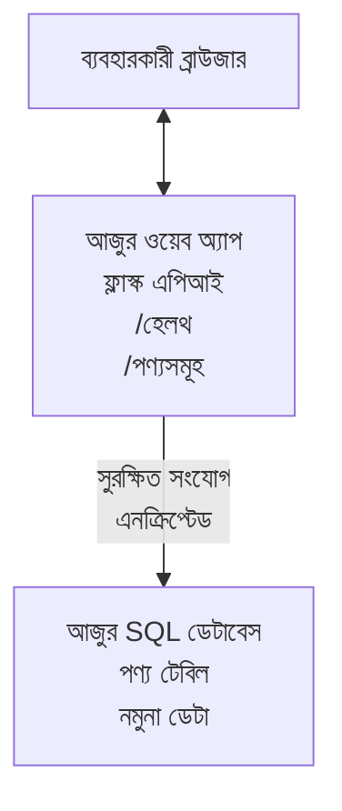

# AZD সহ Microsoft SQL ডাটাবেস এবং ওয়েব অ্যাপ ডেপ্লয় করা

⏱️ **অনুমানিত সময়**: ২০-৩০ মিনিট | 💰 **অনুমানিত খরচ**: ~$১৫-২৫/মাস | ⭐ **জটিলতা**: মাঝামাঝি

এই **সম্পূর্ণ, কার্যকর উদাহরণ** দেখায় কিভাবে [Azure Developer CLI (azd)](https://learn.microsoft.com/azure/developer/azure-developer-cli/) ব্যবহার করে একটি Python Flask ওয়েব অ্যাপ্লিকেশন Microsoft SQL ডাটাবেস সহ Azure-এ ডেপ্লয় করতে হয়। সমস্ত কোড অন্তর্ভুক্ত এবং পরীক্ষা করা হয়েছে—কোনো বাহ্যিক নির্ভরতা প্রয়োজন নেই।

## আপনি কী শিখবেন

এই উদাহরণ সম্পন্ন করে, আপনি পারবেন:
- মাল্টি-টিয়ার অ্যাপ্লিকেশন (ওয়েব অ্যাপ + ডাটাবেস) ইনফ্রাস্ট্রাকচার-অ্যাস-কোড ব্যবহার করে ডেপ্লয় করা
- গোপনীয়তা হার্ডকোড না করে নিরাপদ ডাটাবেস সংযোগ কনফিগার করা
- অ্যাপ্লিকেশন হেলথ Application Insights দিয়ে পর্যবেক্ষণ করা
- AZD CLI দিয়ে Azure রিসোর্স কার্যকরভাবে পরিচালনা করা
- নিরাপত্তা, খরচ অপ্টিমাইজেশন এবং পর্যবেক্ষণ জন্য Azure এর সেরা অনুশীলন অনুসরণ করা

## পরিস্থিতির সারাংশ
- **ওয়েব অ্যাপ**: ডাটাবেস সংযোগের সাথে Python Flask REST API
- **ডাটাবেস**: নমুনা ডাটা সহ Azure SQL Database
- **ইনফ্রাস্ট্রাকচার**: Bicep ব্যবহার করে প্রকৃতিস্থাপিত (মডুলার, পুনরায় ব্যবহারযোগ্য টেমপ্লেট)
- **ডেপ্লয়মেন্ট**: সম্পূর্ণ স্বয়ংক্রিয় `azd` কমান্ড দিয়ে
- **পর্যবেক্ষণ**: লগ এবং টেলিমেট্রির জন্য Application Insights

## পূর্বশর্ত

### প্রয়োজনীয় সরঞ্জাম

শুরু করার আগে, নিশ্চিত করুন আপনার কাছে নিচের সরঞ্জামসমূহ ইনস্টল করা আছে:

1. **[Azure CLI](https://learn.microsoft.com/cli/azure/install-azure-cli)** (ভার্সন ২.৫০.০ বা উচ্চতর)
   ```sh
   az --version
   # প্রত্যাশিত আউটপুট: azure-cli 2.50.0 বা তার উপরে
   ```

2. **[Azure Developer CLI (azd)](https://learn.microsoft.com/azure/developer/azure-developer-cli/install-azd)** (ভার্সন ১.০.০ বা উচ্চতর)
   ```sh
   azd version
   # প্রত্যাশিত আউটপুট: azd সংস্করণ 1.0.0 বা তার উপরে
   ```

3. **[Python ৩.৮+](https://www.python.org/downloads/)** (স্থানীয় ডেভেলপমেন্টের জন্য)
   ```sh
   python --version
   # প্রত্যাশিত আউটপুট: পাইথন ৩.৮ অথবা তার উপরে
   ```

4. **[Docker](https://www.docker.com/get-started)** (ঐচ্ছিক, স্থানীয় কন্টেইনারাইজড ডেভেলপমেন্টের জন্য)
   ```sh
   docker --version
   # প্রত্যাশিত আউটপুট: Docker সংস্করণ 20.10 বা তার বেশি
   ```

### Azure প্রয়োজনীয়তা

- একটি সক্রিয় **Azure সাবস্ক্রিপশন** ([ফ্রি অ্যাকাউন্ট তৈরি করুন](https://azure.microsoft.com/free/))
- সাবস্ক্রিপশনে রিসোর্স তৈরি করার অনুমতি
- সাবস্ক্রিপশন বা রিসোর্স গ্রুপের উপর **Owner** অথবা **Contributor** ভূমিকা

### জ্ঞানের পূর্বশর্ত

এটি একটি **মাঝারি স্তরের** উদাহরণ। আপনার জানা উচিত:
- মৌলিক কমান্ড-লাইন অপারেশন
- ক্লাউডের মৌলিক ধারণা (রিসোর্স, রিসোর্স গ্রুপ)
- ওয়েব অ্যাপ্লিকেশন এবং ডাটাবেস সম্পর্কিত মৌলিক ধারণা

**AZD নতুন?** প্রথমে [শুরু করার গাইড](../../docs/chapter-01-foundation/azd-basics.md) পড়ুন।

## আর্কিটেকচার

এই উদাহরণটি একটি দুই-স্তর আর্কিটেকচার ডেপ্লয় করে যেখানে একটি ওয়েব অ্যাপ্লিকেশন এবং SQL ডাটাবেস রয়েছে:


**রিসোর্স ডেপ্লয়মেন্ট:**
- **Resource Group**: সমস্ত রিসোর্সের জন্য কন্টেইনার
- **App Service Plan**: লিনাক্স ভিত্তিক হোস্টিং (খরচ-সাশ্রয়ী B1 টিয়ার)
- **Web App**: Python ৩.১১ রানটাইম সহ Flask অ্যাপ্লিকেশন
- **SQL Server**: TLS 1.2 ন্যূনতমসহ ব্যবস্থাপিত ডাটাবেস সার্ভার
- **SQL Database**: বেসিক টিয়ার (২জি বি, ডেভেলপমেন্ট/পরীক্ষার জন্য উপযুক্ত)
- **Application Insights**: পর্যবেক্ষণ এবং লগিং
- **Log Analytics Workspace**: কেন্দ্রীভূত লগ স্টোরেজ

**অনুরূপতা**: ভাবুন এটা একটি রেস্টুরেন্ট (ওয়েব অ্যাপ) যার একটি ওয়াক-ইন ফ্রিজার (ডাটাবেস)। গ্রাহকরা মেনু থেকে অর্ডার করে (API endpoints), রান্নাঘর (Flask অ্যাপ) ফ্রিজার থেকে উপকরণ (ডাটা) আনে। রেস্টুরেন্ট ম্যানেজার (Application Insights) সবকিছু পর্যবেক্ষণ করে।

## ফোল্ডার স্ট্রাকচার

এই উদাহরণে সমস্ত ফাইল অন্তর্ভুক্ত—কোনো বাহ্যিক নির্ভরতা প্রয়োজন নেই:

```
examples/database-app/
│
├── README.md                    # This file
├── azure.yaml                   # AZD configuration file
├── .env.sample                  # Sample environment variables
├── .gitignore                   # Git ignore patterns
│
├── infra/                       # Infrastructure as Code (Bicep)
│   ├── main.bicep              # Main orchestration template
│   ├── abbreviations.json      # Azure naming conventions
│   └── resources/              # Modular resource templates
│       ├── sql-server.bicep    # SQL Server configuration
│       ├── sql-database.bicep  # Database configuration
│       ├── app-service-plan.bicep  # Hosting plan
│       ├── app-insights.bicep  # Monitoring setup
│       └── web-app.bicep       # Web application
│
└── src/
    └── web/                    # Application source code
        ├── app.py              # Flask REST API
        ├── requirements.txt    # Python dependencies
        └── Dockerfile          # Container definition
```

**প্রতিটি ফাইলের কাজ:**
- **azure.yaml**: AZD কে কি ডেপ্লয় করতে হবে এবং কোথায় নির্দেশ করে
- **infra/main.bicep**: সমস্ত Azure রিসোর্স সংযোজিত করে
- **infra/resources/*.bicep**: পৃথক রিসোর্স সংজ্ঞা (মডুলার এবং পুনর্ব্যবহারযোগ্য)
- **src/web/app.py**: ডাটাবেস লজিক সহ Flask অ্যাপ্লিকেশন
- **requirements.txt**: পাইথন প্যাকেজ নির্ভরতা
- **Dockerfile**: ডেপ্লয়মেন্টের জন্য কন্টেইনারাইজেশন নির্দেশনা

## দ্রুত শুরু (ধাপে ধাপে)

### ধাপ ১: ক্লোন এবং নেভিগেট

```sh
git clone https://github.com/microsoft/AZD-for-beginners.git
cd AZD-for-beginners/examples/database-app
```

**✓ সফলতা পরীক্ষা**: নিশ্চিত করুন `azure.yaml` এবং `infra/` ফোল্ডার দেখা যাচ্ছে:
```sh
ls
# প্রত্যাশিত: README.md, azure.yaml, infra/, src/
```

### ধাপ ২: Azure-এ প্রমাণীকরণ

```sh
azd auth login
```

এটি আপনার ব্রাউজার খুলবে Azure প্রমাণীকরণের জন্য। Azure ক্রেডেনশিয়াল দিয়ে সাইন ইন করুন।

**✓ সফলতা পরীক্ষা**: আপনি দেখতে পাবেন:
```
Logged in to Azure.
```

### ধাপ ৩: পরিবেশ ইনিশিয়ালাইজ করা

```sh
azd init
```

**কি হয়**: AZD আপনার ডেপ্লয়মেন্টের জন্য একটি স্থানীয় কনফিগারেশন তৈরি করে।

**প্রম্পট গুলো যা দেখতে পাবেন**:
- **পরিবেশের নাম**: একটি সংক্ষিপ্ত নাম দিন (যেমন `dev`, `myapp`)
- **Azure সাবস্ক্রিপশন**: তালিকা থেকে আপনার সাবস্ক্রিপশন নির্বাচন করুন
- **Azure লোকেশন**: একটি অঞ্চল বাছাই করুন (যেমন `eastus`, `westeurope`)

**✓ সফলতা পরীক্ষা**: আপনি দেখতে পাবেন:
```
SUCCESS: New project initialized!
```

### ধাপ ৪: Azure রিসোর্স প্রোভিশন করুন

```sh
azd provision
```

**কি হয়**: AZD সমস্ত ইনফ্রাস্ট্রাকচার ডেপ্লয় করে (৫-৮ মিনিট সময় নেয়):
১. রিসোর্স গ্রুপ তৈরি করে
২. SQL সার্ভার এবং ডাটাবেস তৈরি করে
৩. অ্যাপ সার্ভিস প্ল্যান তৈরি করে
৪. ওয়েব অ্যাপ তৈরি করে
৫. Application Insights তৈরি করে
৬. নেটওয়ার্কিং এবং নিরাপত্তা কনফিগার করে

**আপনার থেকে প্রম্পট চাওয়া হবে**:
- **SQL অ্যাডমিন ইউজারনেম**: একটি ইউজারনেম দিন (যেমন `sqladmin`)
- **SQL অ্যাডমিন পাসওয়ার্ড**: একটি শক্তিশালী পাসওয়ার্ড দিন (সংরক্ষণ করুন!)

**✓ সফলতা পরীক্ষা**: আপনি দেখতে পাবেন:
```
SUCCESS: Your application was provisioned in Azure in X minutes Y seconds.
You can view the resources created under the resource group rg-<env-name> in Azure Portal:
https://portal.azure.com/#@/resource/subscriptions/.../resourceGroups/rg-<env-name>
```

**⏱️ সময়**: ৫-৮ মিনিট

### ধাপ ৫: অ্যাপ্লিকেশন ডেপ্লয় করুন

```sh
azd deploy
```

**কি হয়**: AZD আপনার Flask অ্যাপ্লিকেশন বিল্ড এবং ডেপ্লয় করে:
১. পাইথন অ্যাপ্লিকেশন প্যাকেজ করে
২. Docker কন্টেইনার তৈরি করে
৩. Azure Web App-এ Push করে
৪. নমুনা ডাটাসহ ডাটাবেস ইনিশিয়ালাইজ করে
৫. অ্যাপ্লিকেশন চালু করে

**✓ সফলতা পরীক্ষা**: আপনি দেখতে পাবেন:
```
SUCCESS: Your application was deployed to Azure in X minutes Y seconds.
You can view the resources created under the resource group rg-<env-name> in Azure Portal:
https://portal.azure.com/#@/resource/subscriptions/.../resourceGroups/rg-<env-name>
```

**⏱️ সময়**: ৩-৫ মিনিট

### ধাপ ৬: অ্যাপ্লিকেশন ব্রাউজ করুন

```sh
azd browse
```

এটি আপনার ডেপ্লয় করা ওয়েব অ্যাপ ব্রাউজারে খুলবে `https://app-<unique-id>.azurewebsites.net` এ

**✓ সফলতা পরীক্ষা**: আপনি JSON আউটপুট দেখতে পাবেন:
```json
{
  "message": "Welcome to the Database App API",
  "endpoints": {
    "/": "This help message",
    "/health": "Health check endpoint",
    "/products": "List all products",
    "/products/<id>": "Get product by ID"
  }
}
```

### ধাপ ৭: API Endpoints পরীক্ষা করুন

**হেলথ চেক** (ডাটাবেস সংযোগ যাচাই করুন):
```sh
curl https://app-<your-id>.azurewebsites.net/health
```

**প্রত্যাশিত উত্তর**:
```json
{
  "status": "healthy",
  "database": "connected"
}
```

**প্রোডাক্ট তালিকা** (নমুনা ডাটা):
```sh
curl https://app-<your-id>.azurewebsites.net/products
```

**প্রত্যাশিত উত্তর**:
```json
[
  {
    "id": 1,
    "name": "Laptop",
    "description": "High-performance laptop",
    "price": 1299.99,
    "created_at": "2025-11-19T10:30:00"
  },
  ...
]
```

**একক প্রোডাক্ট পাওয়া**:
```sh
curl https://app-<your-id>.azurewebsites.net/products/1
```

**✓ সফলতা পরীক্ষা**: সমস্ত এন্ডপয়েন্ট কোনো ত্রুটি ছাড়াই JSON ডাটা রিটার্ন করবে।

---

**🎉 অভিনন্দন!** আপনি সফলভাবে AZD ব্যবহার করে Azure-এ ডাটাবেস সহ একটি ওয়েব অ্যাপ ডেপ্লয় করেছেন।

## কনফিগারেশন বিস্তারিত

### পরিবেশ ভেরিয়েবল

গোপনীয়তা নিরাপদে Azure App Service কনফিগারেশনে রাখা হয়—**কখনো সোর্স কোডে হার্ডকোড করবেন না**।

**AZD দ্বারা স্বয়ংক্রিয় কনফিগারেশন**:
- `SQL_CONNECTION_STRING`: এনক্রিপ্টেড ক্রেডেনশিয়ালসহ ডাটাবেস সংযোগ
- `APPLICATIONINSIGHTS_CONNECTION_STRING`: মনিটরিং টেলিমেট্রি এন্ডপয়েন্ট
- `SCM_DO_BUILD_DURING_DEPLOYMENT`: স্বয়ংক্রিয় নির্ভরতা ইনস্টলেশন সক্রিয় করে

**কোথায় সিক্রেট সঞ্চিত থাকে**:
১. `azd provision` চলাকালে আপনি SQL ক্রেডেনশিয়াল নিরাপদ প্রম্পটের মাধ্যমে প্রদান করেন
২. AZD এগুলো আপনার স্থানীয় `.azure/<env-name>/.env` ফাইলে সংরক্ষণ করে (git-ignored)
৩. AZD এগুলো Azure App Service কনফিগারেশনে ইনজেক্ট করে (বিশ্রামে এনক্রিপ্টেড)
৪. অ্যাপ্লিকেশন রানটাইমে `os.getenv()` এর মাধ্যমে এগুলো পড়ে

### স্থানীয় ডেভেলপমেন্ট

স্থানীয় পরীক্ষা নিরীক্ষার জন্য, নমুনা থেকে একটি `.env` ফাইল তৈরি করুন:

```sh
cp .env.sample .env
# আপনার লোকাল ডাটাবেস সংযোগ সহ .env সম্পাদনা করুন
```

**স্থানীয় ডেভেলপমেন্ট ওয়ার্কফ্লো**:
```sh
# নির্ভরশীলতা ইনস্টল করুন
cd src/web
pip install -r requirements.txt

# পরিবেশের পরিবর্তনশীল সেট করুন
export SQL_CONNECTION_STRING="your-local-connection-string"

# অ্যাপ্লিকেশন চালান
python app.py
```

**স্থানীয়ভাবে পরীক্ষা করুন**:
```sh
curl http://localhost:8000/health
# প্রত্যাশিত: {"status": "healthy", "database": "connected"}
```

### ইনফ্রাস্ট্রাকচার অ্যাজ কোড

সমস্ত Azure রিসোর্স Bicep টেমপ্লেট (`infra/` ফোল্ডার) এ সংজ্ঞায়িত:

- **মডুলার ডিজাইন**: প্রতিটি রিসোর্স টাইপের আলাদা ফাইল পুনঃব্যবহারের জন্য
- **প্যারামিটারাইজড**: SKU, অঞ্চল, নামকরণ নিয়ম ইচ্ছেমতো পরিবর্তনযোগ্য
- **সেরা অনুশীলন**: Azure এর নামকরণ স্ট্যান্ডার্ড এবং নিরাপত্তা ডিফল্ট অনুসরণ করে
- **ভার্সন কন্ট্রোল**: Git এ পরিবর্তন ট্র্যাক করা হয়

**কাস্টমাইজেশন উদাহরণ**:
ডাটাবেস টিয়ার পরিবর্তনের জন্য, `infra/resources/sql-database.bicep` সম্পাদনা করুন:
```bicep
sku: {
  name: 'Standard'  // Changed from 'Basic'
  tier: 'Standard'
  capacity: 10
}
```

## নিরাপত্তার সেরা অনুশীলন

এই উদাহরণ Azure নিরাপত্তার সেরা অনুশীলন অনুসরণ করে:

### ১. **কোডে সিক্রেট নেই**
- ✅ Azure App Service কনফিগারেশনে ক্রেডেনশিয়াল (এনক্রিপ্টেড) সংরক্ষণ
- ✅ `.env` ফাইল `.gitignore` দিয়ে Git থেকে বাদ দেওয়া
- ✅ প্রোভিশনিং এর সময় নিরাপদ প্যারামিটার মাধ্যমে সিক্রেট প্রদান

### ২. **এনক্রিপ্টেড সংযোগগুলো**
- ✅ SQL সার্ভারের জন্য TLS 1.2 ন্যূনতম বাধ্যতামূলক
- ✅ Web App এর জন্য শুধুমাত্র HTTPS অনুমোদিত
- ✅ ডাটাবেস সংযোগ এনক্রিপ্টেড চ্যানেল ব্যবহার করে

### ৩. **নেটওয়ার্ক নিরাপত্তা**
- ✅ SQL সার্ভারের ফায়ারওয়াল কনফিগার করা হয় শুধু Azure সার্ভিসের জন্য
- ✅ পাবলিক নেটওয়ার্ক অ্যাক্সেস সীমাবদ্ধ (প্রাইভেট এন্ডপয়েন্ট এর মাধ্যমে আরো সুরক্ষিত করা যায়)
- ✅ Web App এ FTPS নিষ্ক্রিয়

### ৪. **প্রমাণীকরণ ও অনুমোদন**
- ⚠️ **বর্তমান**: SQL প্রমাণীকরণ (ইউজারনেম/পাসওয়ার্ড)
- ✅ **প্রোডাকশন সুপারিশ**: Azure Managed Identity ব্যবহার করুন পাসওয়ার্ডবিহীন প্রমাণীকরণের জন্য

**Managed Identity তে আপগ্রেড করার জন্য** (প্রোডাকশনের জন্য):
১. Web App এ Managed Identity সক্রিয় করুন  
২. আইডেন্টিটিকে SQL পারমিশন দিন  
৩. কনেকশন স্ট্রিং আপডেট করুন Managed Identity ব্যবহার করতে  
৪. পাসওয়ার্ড-ভিত্তিক প্রমাণীকরণ সরান  

### ৫. **অডিটিং ও সম্মতি**
- ✅ Application Insights সব অনুরোধ এবং ত্রুটি লগ করে
- ✅ SQL Database auditing সক্রিয় (কমপ্লায়েন্সের জন্য কনফিগারেবল)
- ✅ সমস্ত রিসোর্স গভর্নেন্সের জন্য ট্যাগ করা হয়

**প্রোডাকশনের আগে নিরাপত্তা চেকলিস্ট**:
- [ ] SQL এর জন্য Azure Defender সক্রিয় করুন
- [ ] SQL Database এর জন্য Private Endpoints কনফিগার করুন
- [ ] Web Application Firewall (WAF) সক্রিয় করুন
- [ ] সিক্রেট রোটেশনের জন্য Azure Key Vault প্রয়োগ করুন
- [ ] Azure AD প্রমাণীকরণ কনফিগার করুন
- [ ] সমস্ত রিসোর্সের জন্য ডায়াগনস্টিক লগিং সক্রিয় করুন

## খরচ অপ্টিমাইজেশন

**অনুমানিত মাসিক খরচ** (নভেম্বর ২০২৫ অনুযায়ী):

| রিসোর্স | SKU/টিয়ার | অনুমানিত খরচ |
|----------|------------|--------------|
| App Service Plan | B1 (বেসিক) | ~$১৩/মাস |
| SQL Database | Basic (২জিবি) | ~$৫/মাস |
| Application Insights | Pay-as-you-go | ~$২/মাস (কম ট্রাফিক) |
| **মোট** | | **~$২০/মাস** |

**💡 খরচ সাশ্রয়ের টিপস**:

১. **শিখতে ফ্রি টিয়ার ব্যবহার করুন**:
  - App Service: F1 টিয়ার (ফ্রি, সীমিত সময়)
  - SQL Database: Azure SQL Database serverless ব্যবহার করুন
  - Application Insights: ৫জিবি/মাস ফ্রি ইনজেকশন

২. **ব্যবহার না করলে রিসোর্স বন্ধ করুন**:
   ```sh
   # ওয়েব অ্যাপ বন্ধ করুন (ডাটাবেস এখনও চার্জ করে)
   az webapp stop --name <app-name> --resource-group <rg-name>
   
   # প্রয়োজন হলে পুনরায় চালু করুন
   az webapp start --name <app-name> --resource-group <rg-name>
   ```

৩. **পরীক্ষার পর সব কিছু মুছে ফেলুন**:
   ```sh
   azd down
   ```
   এটি সমস্ত রিসোর্স মুছে ফেলবে এবং চার্জ বন্ধ করবে।

৪. **ডেভেলপমেন্ট বনাম প্রোডাকশন SKU**:
  - **ডেভেলপমেন্ট**: বেসিক টিয়ার (এই উদাহরণে ব্যবহৃত)
  - **প্রোডাকশন**: স্ট্যান্ডার্ড/প্রিমিয়াম টিয়ার সহ রিডানডেন্সি

**খরচ পর্যবেক্ষণ**:
- [Azure Cost Management](https://portal.azure.com/#view/Microsoft_Azure_CostManagement) এ খরচ দেখুন
- অপ্রত্যাশিত বিল এড়াতে খরচ সতর্কতা সেট করুন
- ট্র্যাকিং জন্য সব রিসোর্সে `azd-env-name` ট্যাগ দিন

**বিকল্প ফ্রি টিয়ার**:
শিক্ষার জন্য, আপনি `infra/resources/app-service-plan.bicep` পরিবর্তন করতে পারেন:
```bicep
sku: {
  name: 'F1'  // Free tier
  tier: 'Free'
}
```
**নোট**: ফ্রি টিয়ারের কিছু সীমাবদ্ধতা আছে (দৈনিক ৬০ মিনিট CPU, সবসময় অন নয়)।

## পর্যবেক্ষণ ও দৃশ্যমানতা

### Application Insights ইন্টিগ্রেশন

এই উদাহরণে অন্তর্ভুক্ত হয়েছে **Application Insights** দানীয় পর্যবেক্ষণের জন্য:

**পর্যবেক্ষণ বিষয়সমূহ**:
- ✅ HTTP অনুরোধ (লেন্থসি, স্ট্যাটাস কোড, এন্ডপয়েন্ট)
- ✅ অ্যাপ্লিকেশন ত্রুটি ও এক্সসেপ্টশন
- ✅ Flask অ্যাপ থেকে কাস্টম লগিং
- ✅ ডাটাবেস সংযোগ স্থিতি
- ✅ কর্মক্ষমতা পরিমাপ (CPU, মেমোরি)

**Application Insights অ্যাক্সেস**:
১. [Azure Portal](https://portal.azure.com) খুলুন  
২. আপনার রিসোর্স গ্রুপে যান (`rg-<env-name>`)  
৩. Application Insights রিসোর্সে ক্লিক করুন (`appi-<unique-id>`)  

**উপযোগী ক্যোয়ারিজ** (Application Insights → লগ):

**সমস্ত অনুরোধ দেখুন**:
```kusto
requests
| where timestamp > ago(1h)
| order by timestamp desc
| project timestamp, name, url, resultCode, duration
```

**ত্রুটি অনুসন্ধান**:
```kusto
exceptions
| where timestamp > ago(24h)
| order by timestamp desc
| project timestamp, type, outerMessage, operation_Name
```

**হেলথ এন্ডপয়েন্ট চেক করুন**:
```kusto
requests
| where name contains "health"
| summarize count() by resultCode, bin(timestamp, 1h)
```

### SQL Database অডিটিং

**SQL Database auditing সক্রিয় করা হয়েছে** যা ট্র্যাক করে:  
- ডাটাবেস অ্যাক্সেস প্যাটার্ন  
- ব্যর্থ লগইন চেষ্টা  
- স্কিমা পরিবর্তন  
- ডাটা অ্যাক্সেস (কমপ্লায়েন্সের জন্য)

**অডিট লগ অ্যাক্সেস করুন**:  
১. Azure Portal → SQL Database → Auditing  
২. Log Analytics ওয়ার্কস্পেসে লগ দেখুন  

### রিয়েল-টাইম পর্যবেক্ষণ

**লাইভ মেট্রিক্স দেখুন**:  
১. Application Insights → Live Metrics  
২. অনুরোধ, ব্যর্থতা এবং কর্মক্ষমতা রিয়েল-টাইমে দেখুন  

**সতর্কতা সেট করুন**:  
গুরুত্বপূর্ণ ইভেন্টগুলোর জন্য সতর্কতা তৈরি করুন:  
- HTTP ৫০০ এ্রর > ৫ বার ৫ মিনিটে  
- ডাটাবেস সংযোগ ব্যর্থতা  
- উচ্চ প্রতিক্রিয়া সময় (>২ সেকেন্ড)  

**সতর্কতা তৈরি উদাহরণ**:
```sh
az monitor metrics alert create \
  --name "High-Response-Time" \
  --resource-group <rg-name> \
  --scopes <app-insights-resource-id> \
  --condition "avg requests/duration > 2000" \
  --description "Alert when response time exceeds 2 seconds"
```

## সমস্যা সমাধান


### সাধারণ সমস্যা এবং সমাধান

#### ১. `azd provision` "Location not available" এর সাথে ব্যর্থ হয়

**লক্ষণ**:  
```
Error: The subscription is not registered for the resource type 'components' in the location 'centralus'.
```
  
**সমাধান**:  
অন্য একটি Azure অঞ্চল নির্বাচন করুন অথবা রিসোর্স প্রোভাইডার নিবন্ধন করুন:  
```sh
az provider register --namespace Microsoft.Insights
```
  
#### ২. মোতায়েনকালে SQL সংযোগ ব্যর্থ হয়

**লক্ষণ**:  
```
pyodbc.OperationalError: ('08001', '[08001] [Microsoft][ODBC Driver 18 for SQL Server]TCP Provider...')
```
  
**সমাধান**:  
- নিশ্চিত করুন SQL সার্ভার ফায়ারওয়াল Azure সেবাগুলোকে অনুমতি দেয় (স্বয়ংক্রিয়ভাবে কনফিগার করা হয়)  
- `azd provision` চালানোর সময় SQL অ্যাডমিন পাসওয়ার্ড সঠিকভাবে প্রবেশ করানো হয়েছে কিনা পরীক্ষা করুন  
- নিশ্চিত করুন SQL সার্ভার সম্পূর্ণরূপে প্রোভিশন করা হয়েছে (২-৩ মিনিট সময় লাগতে পারে)  

**সংযোগ যাচাই করুন**:  
```sh
# Azure Portal থেকে, SQL Database → Query editor এ যান
# আপনার তথ্য দিয়ে সংযোগ করার চেষ্টা করুন
```
  
#### ৩. ওয়েব অ্যাপ "Application Error" দেখায়

**লক্ষণ**:  
ব্রাউজার সাধারণ দুর্নীতির পাতা দেখায়।  

**সমাধান**:  
অ্যাপ্লিকেশন লগ চেক করুন:  
```sh
# সাম্প্রতিক লগগুলি দেখুন
az webapp log tail --name <app-name> --resource-group <rg-name>
```
  
**সাধারণ কারণসমূহ**:  
- পরিবেশগত ভেরিয়েবল অনুপস্থিত (App Service → Configuration চেক করুন)  
- পাইথন প্যাকেজ ইনস্টলেশন ব্যর্থ (মোতায়েন লগ চেক করুন)  
- ডাটাবেস ইনিশিয়ালাইজেশন ত্রুটি (SQL সংযোগ যাচাই করুন)  

#### ৪. `azd deploy` "Build Error" নিয়ে ব্যর্থ হয়

**লক্ষণ**:  
```
Error: Failed to build project
```
  
**সমাধান**:  
- নিশ্চিত করুন `requirements.txt` এ কোন সিনট্যাক্স ত্রুটি নেই  
- `infra/resources/web-app.bicep` এ Python 3.11 নির্দিষ্ট আছে কিনা যাচাই করুন  
- Dockerfile এ সঠিক বেস ইমেজ আছে কিনা পরীক্ষা করুন  

**লোকালি ডিবাগ করুন**:  
```sh
cd src/web
docker build -t test-app .
docker run -p 8000:8000 test-app
```
  
#### ৫. AZD কমান্ড চালানোর সময় "Unauthorized"

**লক্ষণ**:  
```
ERROR: (Unauthorized) The client '<id>' with object id '<id>' does not have authorization
```
  
**সমাধান**:  
Azure এ পুনরায় প্রমাণীকরণ করুন:  
```sh
# AZD ওয়ার্কফ্লো জন্য প্রয়োজনীয়
azd auth login

# আপনি যদি সরাসরি Azure CLI কমান্ডও ব্যবহার করেন তবে এটি ঐচ্ছিক
az login
```
  
আপনার কাছে সাবস্ক্রিপশনে সঠিক অনুমতি আছে কিনা (Contributor ভূমিকা) যাচাই করুন।  

#### ৬. উচ্চ ডাটাবেস খরচ

**লক্ষণ**:  
অপ্রত্যাশিত Azure বিল।  

**সমাধান**:  
- পরীক্ষা শেষে `azd down` চালাতে ভুল হয়েছে কিনা দেখুন  
- নিশ্চিত করুন SQL ডাটাবেস Basic স্তর ব্যবহার করছে (Premium নয়)  
- Azure Cost Management-এ খরচ পর্যালোচনা করুন  
- খরচ সতর্কতা সেটআপ করুন  

### সাহায্য নেওয়া

**সমস্ত AZD পরিবেশ ভেরিয়েবল দেখুন**:  
```sh
azd env get-values
```
  
**মোতায়েন অবস্থা পরীক্ষা করুন**:  
```sh
az webapp show --name <app-name> --resource-group <rg-name> --query state
```
  
**অ্যাপ্লিকেশন লগ অ্যাক্সেস করুন**:  
```sh
az webapp log download --name <app-name> --resource-group <rg-name> --log-file app-logs.zip
```
  
**অধিক সাহায্যের প্রয়োজন?**  
- [AZD সমস্যা সমাধান গাইড](../../docs/chapter-07-troubleshooting/common-issues.md)  
- [Azure App Service সমস্যা সমাধান](https://learn.microsoft.com/azure/app-service/troubleshoot-diagnostic-logs)  
- [Azure SQL সমস্যা সমাধান](https://learn.microsoft.com/azure/azure-sql/database/troubleshoot-common-errors-issues)  

## ব্যবহারিক অনুশীলনসমূহ

### অনুশীলন ১: আপনার মোতায়েন যাচাই করুন (শুরুয়াতি)

**লক্ষ্য**: সব রিসোর্স মোতায়েন হয়েছে এবং অ্যাপ্লিকেশন কাজ করছে কিনা নিশ্চিত করুন।  

**ধাপসমূহ**:  
১. আপনার রিসোর্স গ্রুপের সব রিসোর্স তালিকা করুন:  
   ```sh
   az resource list --resource-group rg-<env-name> --output table
   ```
   **প্রত্যাশিত**: ৬-৭টি রিসোর্স (ওয়েব অ্যাপ, SQL সার্ভার, SQL ডাটাবেস, অ্যাপ সার্ভিস প্ল্যান, অ্যাপ্লিকেশন ইনসাইটস, লগ অ্যানালিটিকস)  

২. সব API এন্ডপয়েন্ট পরীক্ষা করুন:  
   ```sh
   curl https://app-<your-id>.azurewebsites.net/
   curl https://app-<your-id>.azurewebsites.net/health
   curl https://app-<your-id>.azurewebsites.net/products
   curl https://app-<your-id>.azurewebsites.net/products/1
   ```
   **প্রত্যাশিত**: সব গুলো সঠিক JSON রিটার্ন করে, কোনো ত্রুটি ছাড়াই  

৩. অ্যাপ্লিকেশন ইনসাইটস পরীক্ষা করুন:  
   - Azure পোর্টালে অ্যাপ্লিকেশন ইনসাইটসে যান  
   - "লাইভ মেট্রিক্স" এ যান  
   - ওয়েব অ্যাপে ব্রাউজার রিফ্রেশ করুন  
   **প্রত্যাশিত**: রিয়েল-টাইমে রিকোয়েস্ট আসতে দেখা যাবে  

**সফলতার মানদণ্ড**: সব ৬-৭টি রিসোর্স আছে, সব এন্ডপয়েন্ট ডেটা রিটার্ন করে, লাইভ মেট্রিক্সে কার্যকলাপ দেখা যায়।  

---

### অনুশীলন ২: নতুন API এন্ডপয়েন্ট যোগ করুন (মধ্যবর্তী)

**লক্ষ্য**: ফ্লাস্ক অ্যাপ্লিকেশনে একটি নতুন এন্ডপয়েন্ট যুক্ত করা।  

**শুরুর কোড**: বর্তমান এন্ডপয়েন্ট `src/web/app.py` ফাইলে  

**ধাপসমূহ**:  
১. `src/web/app.py` এডিট করুন এবং `get_product()` ফাংশনের পরে নতুন এন্ডপয়েন্ট যুক্ত করুন:  
   ```python
   @app.route('/products/search/<keyword>')
   def search_products(keyword):
       """Search products by name or description."""
       try:
           conn = get_db_connection()
           cursor = conn.cursor()
           cursor.execute(
               "SELECT id, name, description, price, created_at FROM products WHERE name LIKE ? OR description LIKE ?",
               (f'%{keyword}%', f'%{keyword}%')
           )
           
           products = []
           for row in cursor.fetchall():
               products.append({
                   'id': row[0],
                   'name': row[1],
                   'description': row[2],
                   'price': float(row[3]) if row[3] else None,
                   'created_at': row[4].isoformat() if row[4] else None
               })
           
           cursor.close()
           conn.close()
           
           logger.info(f"Search for '{keyword}' returned {len(products)} results")
           return jsonify(products), 200
           
       except Exception as e:
           logger.error(f"Error searching products: {str(e)}")
           return jsonify({'error': str(e)}), 500
   ```
  
২. আপডেট করা অ্যাপ্লিকেশন মোতায়েন করুন:  
   ```sh
   azd deploy
   ```
  
৩. নতুন এন্ডপয়েন্ট পরীক্ষা করুন:  
   ```sh
   curl https://app-<your-id>.azurewebsites.net/products/search/laptop
   ```
   **প্রত্যাশিত**: "laptop" মিলে এমন পণ্য রিটার্ন করে  

**সফলতার মানদণ্ড**: নতুন এন্ডপয়েন্ট কাজ করে, ফিল্টারকৃত ফলাফল রিটার্ন করে, অ্যাপ্লিকেশন ইনসাইটস লগে দেখা যায়।  

---

### অনুশীলন ৩: মনিটরিং ও অ্যালার্ট যোগ করুন (উন্নত)

**লক্ষ্য**: অ্যালার্টের মাধ্যমে প্রোঅ্যাকটিভ মনিটরিং স্থাপন করা।  

**ধাপসমূহ**:  
১. HTTP ৫০০ এরর জন্য একটি অ্যালার্ট তৈরি করুন:  
   ```sh
   # অ্যাপ্লিকেশন ইনসাইটস রিসোর্স আইডি পান
   AI_ID=$(az monitor app-insights component show \
     --app appi-<your-id> \
     --resource-group rg-<env-name> \
     --query id -o tsv)
   
   # সতর্কতা তৈরি করুন
   az monitor metrics alert create \
     --name "High-Error-Rate" \
     --resource-group rg-<env-name> \
     --scopes $AI_ID \
     --condition "count requests/failed > 5" \
     --window-size 5m \
     --evaluation-frequency 1m \
     --description "Alert when >5 failed requests in 5 minutes"
   ```
  
২. এরর করে অ্যালার্ট ট্রিগার করুন:  
   ```sh
   # একটি অস্থিতিশীল পণ্য অনুরোধ করুন
   for i in {1..10}; do curl https://app-<your-id>.azurewebsites.net/products/999; done
   ```
  
৩. অ্যালার্ট fired হয়েছে কিনা যাচাই করুন:  
   - Azure পোর্টাল → Alerts → Alert Rules  
   - আপনার ইমেইল চেক করুন (যদি কনফিগার থাকে)  

**সফলতার মানদণ্ড**: অ্যালার্ট রুল তৈরি হয়েছে, এরর ট্রিগার করলে কাজ করে, নোটিফিকেশন মেলে।  

---

### অনুশীলন ৪: ডাটাবেস স্কিমা পরিবর্তন (উন্নত)

**লক্ষ্য**: নতুন টেবিল যোগ করে অ্যাপ্লিকেশনকে তা ব্যবহার করার জন্য পরিবর্তন করুন।  

**ধাপসমূহ**:  
১. Azure পোর্টালের Query Editor ব্যবহার করে SQL ডাটাবেসে সংযোগ করুন  

২. নতুন `categories` টেবিল তৈরি করুন:  
   ```sql
   CREATE TABLE categories (
       id INT PRIMARY KEY IDENTITY(1,1),
       name NVARCHAR(50) NOT NULL,
       description NVARCHAR(200)
   );
   
   INSERT INTO categories (name, description) VALUES
   ('Electronics', 'Electronic devices and accessories'),
   ('Office Supplies', 'Office equipment and supplies');
   
   -- Add category to products table
   ALTER TABLE products ADD category_id INT;
   UPDATE products SET category_id = 1; -- Set all to Electronics
   ```
  
৩. `src/web/app.py` আপডেট করুন ক্যাটাগরি তথ্যের জন্য  

৪. মোতায়েন করুন এবং পরীক্ষা করুন  

**সফলতার মানদণ্ড**: নতুন টেবিল আছে, পণ্যগুলোর ক্যাটাগরি তথ্য দেখায়, অ্যাপ্লিকেশন কাজ করছে।  

---

### অনুশীলন ৫: ক্যাশিং প্রয়োগ করুন (বিশেষজ্ঞ)

**লক্ষ্য**: পারফরম্যান্স উন্নত করতে Azure Redis Cache যোগ করা।  

**ধাপসমূহ**:  
১. `infra/main.bicep` এ Redis Cache যোগ করুন  
২. `src/web/app.py` আপডেট করুন পণ্য ক্যোয়ারীগুলো ক্যাশ করার জন্য  
৩. Application Insights দিয়ে পারফরম্যান্স উন্নতি পরিমাপ করুন  
৪. ক্যাশিংয়ের আগে এবং পরে রেসপন্স টাইম তুলনা করুন  

**সফলতার মানদণ্ড**: Redis মোতায়েন হয়েছে, ক্যাশিং কাজ করে, রেসপন্স টাইম ৫০% তেও বেশি উন্নতি হয়েছে।  

**বিঃদ্রঃ**: শুরু করতে [Azure Cache for Redis ডকুমেন্টেশন](https://learn.microsoft.com/azure/azure-cache-for-redis/) দেখুন।  

---

## পরিস্কার-পরিচ্ছন্নতা

অব্যাহত চার্জ এড়াতে কাজ শেষ হলে সব রিসোর্স মুছে ফেলুন:  

```sh
azd down
```
  
**নিশ্চিতকরণ প্রম্পট**:  
```
? Total resources to delete: 7, are you sure you want to continue? (y/N)
```
  
`y` টাইপ করে নিশ্চিত করুন।  

**✓ সফলতা পরীক্ষা**:  
- Azure পোর্টাল থেকে সব রিসোর্স মুছে ফেলা হয়েছে  
- কোন চলমান চার্জ নেই  
- স্থানীয় `.azure/<env-name>` ফোল্ডার মুছে ফেলা যাবে  

**বিকল্প** (ইনফ্রাস্ট্রাকচার রাখুন, শুধুমাত্র ডেটা মুছুন):  
```sh
# শুধুমাত্র রিসোর্স গ্রুপ মুছে ফেলুন (AZD কনফিগ বজায় রাখুন)
az group delete --name rg-<env-name> --yes
```
## আরো জানুন

### সম্পর্কিত ডকুমেন্টেশন  
- [Azure Developer CLI ডকুমেন্টেশন](https://learn.microsoft.com/azure/developer/azure-developer-cli/)  
- [Azure SQL Database ডকুমেন্টেশন](https://learn.microsoft.com/azure/azure-sql/database/)  
- [Azure App Service ডকুমেন্টেশন](https://learn.microsoft.com/azure/app-service/)  
- [Application Insights ডকুমেন্টেশন](https://learn.microsoft.com/azure/azure-monitor/app/app-insights-overview)  
- [Bicep ভাষার রেফারেন্স](https://learn.microsoft.com/azure/azure-resource-manager/bicep/)  

### এই কোর্সের পরবর্তী ধাপ  
- **[Container Apps উদাহরণ](../../../../examples/container-app)**: Azure Container Apps দিয়ে মাইক্রোসার্ভিস মোতায়েন  
- **[AI ইন্টিগ্রেশন গাইড](../../../../docs/ai-foundry)**: আপনার অ্যাপে AI ক্ষমতা যোগ করুন  
- **[মোতায়েনের সেরা অনুশীলন](../../docs/chapter-04-infrastructure/deployment-guide.md)**: প্রোডাকশন মোতায়েনের ধরণসমূহ  

### উন্নত বিষয়সমূহ  
- **Managed Identity**: পাসওয়ার্ড বাদ দিয়ে Azure AD প্রমাণীকরণ ব্যবহার করুন  
- **Private Endpoints**: ভার্চুয়াল নেটওয়ার্কের মধ্যে নিরাপদ ডাটাবেস সংযোগ  
- **CI/CD ইন্টিগ্রেশন**: GitHub Actions বা Azure DevOps দিয়ে মোতায়েন স্বয়ংক্রিয় করুন  
- **মাল্টি-এনভায়রনমেন্ট**: ডেভ, স্টেজিং ও প্রোডাকশন এনভায়রনমেন্ট সেটআপ করুন  
- **ডাটাবেস মাইগ্রেশনস**: Alembic বা Entity Framework দিয়ে স্কিমা ভার্সন নিয়ন্ত্রণ  

### অন্যান্য পদ্ধতির সাথে তুলনা

**AZD বনাম ARM টেমপ্লেট**:  
- ✅ AZD: উচ্চ-স্তরের সারসংক্ষেপ, সহজ কমান্ড  
- ⚠️ ARM: বিশদ, সূক্ষ্ম নিয়ন্ত্রণ  

**AZD বনাম Terraform**:  
- ✅ AZD: Azure-নেটিভ, Azure সেবার সাথে ইন্টিগ্রেটেড  
- ⚠️ Terraform: মাল্টিক্লাউড সাপোর্ট, বড় ইকোসিস্টেম  

**AZD বনাম Azure Portal**:  
- ✅ AZD: পুনরাবৃত্তিযোগ্য, সংস্করণ নিয়ন্ত্রিত, স্বয়ংক্রিয়যোগ্য  
- ⚠️ Portal: ম্যানুয়াল ক্লিক, পুনরুত্পাদন কঠিন  

**AZD ভাবুন এভাবে**: Azure এর জন্য Docker Compose — জটিল মোতায়েনের জন্য সহজ কনফিগারেশন।  

---

## প্রায়শই জিজ্ঞাসিত প্রশ্ন

**প্রশ্ন: আমি কি অন্য প্রোগ্রামিং ভাষা ব্যবহার করতে পারি?**  
উত্তর: হ্যাঁ! `src/web/` রিপ্লেস করুন Node.js, C#, Go অথবা অন্য যেকোনো ভাষা দিয়ে। `azure.yaml` ও Bicep আপডেট করুন।  

**প্রশ্ন: আমি কি আরও ডাটাবেস যোগ করতে পারি?**  
উত্তর: হ্যাঁ, `infra/main.bicep` এ আরেকটি SQL ডাটাবেস মডিউল যোগ করুন অথবা Azure Database এ PostgreSQL/MySQL ব্যবহার করুন।  

**প্রশ্ন: আমি কি প্রোডাকশনের জন্য ব্যবহার করতে পারি?**  
উত্তর: এটি একটি শুরু পয়েন্ট। প্রোডাকশনের জন্য যোগ করুন: managed identity, private endpoints, redundancy, ব্যাকআপ কৌশল, WAF, উন্নত মনিটরিং।  

**প্রশ্ন: আমি কি কোড ডিপ্লয়মেন্টের পরিবর্তে কন্টেইনার ব্যবহার করতে চাইলে?**  
উত্তর: [Container Apps Example](../../../../examples/container-app) দেখুন, যা পুরোপুরি Docker কন্টেইনার ব্যবহার করে।  

**প্রশ্ন: আমি কীভাবে আমার লোকাল মেশিন থেকে ডাটাবেসে সংযোগ করব?**  
উত্তর: আপনার আইপি SQL সার্ভারের ফায়ারওয়াল এ যোগ করুন:  
```sh
az sql server firewall-rule create \
  --resource-group rg-<env-name> \
  --server sql-<unique-id> \
  --name AllowMyIP \
  --start-ip-address <your-ip> \
  --end-ip-address <your-ip>
```
  
**প্রশ্ন: আমি কি নতুন তৈরি না করে একটি বিদ্যমান ডাটাবেস ব্যবহার করতে পারি?**  
উত্তর: হ্যাঁ, `infra/main.bicep` এ বিদ্যমান SQL সার্ভার রেফারেন্স করুন এবং সংযোগ স্ট্রিং প্যারামিটার আপডেট করুন।  

---

> **দ্রষ্টব্য:** এই উদাহরণটি AZD ব্যবহার করে ডাটাবেস সহ ওয়েব অ্যাপ মোতায়েনের সেরা অনুশীলন প্রদর্শন করে। এতে কাজ করা কোড, বিস্তৃত ডকুমেন্টেশন এবং ব্যবহারের জন্য ব্যবহারিক অনুশীলন রয়েছে। প্রোডাকশন মোতায়েনের জন্য আপনার সংস্থার নিরাপত্তা, স্কেলিং, নিয়মাবলী এবং খরচের প্রয়োজনীয়তা পর্যালোচনা করুন।  

**📚 কোর্স নেভিগেশন:**  
- ← পূর্ববর্তী: [Container Apps Example](../../../../examples/container-app)  
- → পরবর্তী: [AI Integration Guide](../../../../docs/ai-foundry)  
- 🏠 [কোর্স হোম](../../README.md)

---

<!-- CO-OP TRANSLATOR DISCLAIMER START -->
**অস্বীকৃতি**:  
এই নথিটি AI অনুবাদ পরিষেবা [Co-op Translator](https://github.com/Azure/co-op-translator) ব্যবহার করে অনূদিত হয়েছে। আমরা যথাসাধ্য সঠিকতা নিশ্চিত করার চেষ্টা করি, তবে স্বয়ংক্রিয় অনুবাদে ভুল বা অসঙ্গতি থাকতে পারে তা অনুগ্রহ করে বুঝে নিন। প্রাথমিক নথি তার নিজস্ব ভাষায় সবচেয়ে নির্ভরযোগ্য উৎস হিসেবে বিবেচিত হওয়া উচিত। গুরুত্বপূর্ণ তথ্যের জন্য পেশাদার মানব অনুবাদের পরামর্শ দেওয়া হয়। এই অনুবাদের ব্যবহারে সৃষ্ট কোনও ভুল বোঝাবুঝি বা ভুল ব্যাখ্যার জন্য আমরা দায়ী নই।
<!-- CO-OP TRANSLATOR DISCLAIMER END -->