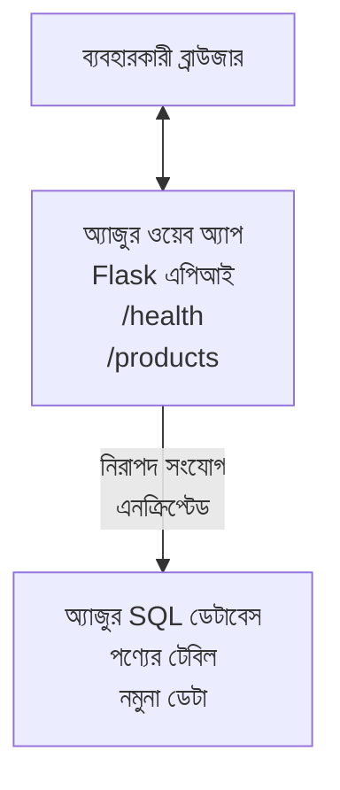

# AZD-এর সাথে Microsoft SQL ডাটাবেস এবং ওয়েব অ্যাপ ডিপ্লয় করা

⏱️ **আনুমানিক সময়**: 20-30 মিনিট | 💰 **আনুমানিক খরচ**: ~$15-25/মাস | ⭐ **জটিলতা**: মধ্যবর্তী

এই **সম্পূর্ণ, কাজ করা উদাহরণটি** দেখায় কিভাবে [Azure Developer CLI (azd)](https://learn.microsoft.com/azure/developer/azure-developer-cli/) ব্যবহার করে একটি Python Flask ওয়েব অ্যাপ্লিকেশন Microsoft SQL ডাটাবেসসহ Azure-এ ডিপ্লয় করতে হয়। সমস্ত কোড অন্তর্ভুক্ত এবং পরীক্ষা করা হয়েছে—কোনো বাহ্যিক নির্ভরশীলতা দরকার নেই।

## আপনি কি শিখবেন

এই উদাহরণটি সমাপ্ত করলে আপনি:
- ইনফ্রাস্ট্রাকচার-অ্যাজ-কোড ব্যবহার করে একটি মাল্টি-টিয়ার অ্যাপ্লিকেশন (ওয়েব অ্যাপ + ডাটাবেস) ডিপ্লয় করবেন
- কোনো সিক্রেট হার্ডকোড না করে সুরক্ষিত ডাটাবেস সংযোগ কনফিগার করবেন
- Application Insights দিয়ে অ্যাপ্লিকেশন হেল্থ মনিটর করবেন
- AZD CLI দিয়ে Azure রিসোর্স দক্ষতার সাথে ম্যানেজ করবেন
- নিরাপত্তা, খরচ অপটিমাইজেশন এবং অবজার্ভেবিলিটির জন্য Azure সেরা অভ্যাস অনুসরণ করবেন

## দৃশ্যপট সারাংশ
- **ওয়েব অ্যাপ**: ডাটাবেস সংযুক্তির সাথে Python Flask REST API
- **ডাটাবেস**: নমুনা ডেটাসহ Azure SQL Database
- **ইনফ্রাস্ট্রাকচার**: Bicep ব্যবহার করে provision (মডুলার, পুনঃব্যবহারযোগ্য টেমপ্লেট)
- **ডিপ্লয়মেন্ট**: `azd` কমান্ড দিয়ে সম্পূর্ণ অটোমেটেড
- **মনিটরিং**: লগ এবং টেলিমেট্রির জন্য Application Insights

## প্রয়োজনীয়তা

### প্রয়োজনীয় টুলস

শুরু করার আগে নিশ্চিত করুন আপনার কাছে নিম্নলিখিত টুলস ইনস্টল করা আছে:

1. **[Azure CLI](https://learn.microsoft.com/cli/azure/install-azure-cli)** (সংস্করণ 2.50.0 বা তার বেশি)
   ```sh
   az --version
   # প্রত্যাশিত আউটপুট: azure-cli 2.50.0 বা তার চেয়ে উচ্চতর
   ```

2. **[Azure Developer CLI (azd)](https://learn.microsoft.com/azure/developer/azure-developer-cli/install-azd)** (সংস্করণ 1.0.0 বা তার বেশি)
   ```sh
   azd version
   # প্রত্যাশিত আউটপুট: azd সংস্করণ 1.0.0 বা তার বেশি
   ```

3. **[Python 3.8+](https://www.python.org/downloads/)** (লোকাল ডেভেলপমেন্টের জন্য)
   ```sh
   python --version
   # প্রত্যাশিত আউটপুট: Python 3.8 বা তার উচ্চতর
   ```

4. **[Docker](https://www.docker.com/get-started)** (ঐচ্ছিক, লোকাল কন্টেইনারাইজড ডেভেলপমেন্টের জন্য)
   ```sh
   docker --version
   # প্রত্যাশিত আউটপুট: Docker সংস্করণ 20.10 বা তার বেশি
   ```

### Azure প্রয়োজনীয়তা

- একটি সক্রিয় **Azure subscription** ([একটি ফ্রি অ্যাকাউন্ট তৈরি করুন](https://azure.microsoft.com/free/))
- আপনার সাবস্ক্রিপশনে রিসোর্স তৈরি করার অনুমতি
- সাবস্ক্রিপশন বা রিসোর্স গ্রুপে **Owner** বা **Contributor** রোল

### জ্ঞানগত পূর্বশর্ত

এটি একটি **মধ্যবর্তী-স্তরের** উদাহরণ। আপনার নিচের বিষয়গুলোর সাথে পরিচিত হওয়া উচিত:
- বেসিক কমান্ড-লাইন অপারেশন
- ক্লাউডের মৌলিক ধারণা (রিসোর্স, রিসোর্স গ্রুপ)
- ওয়েব অ্যাপ্লিকেশন এবং ডাটাবেসগুলোর বেসিক বোঝাপড়া

**AZD-এ নতুন?** প্রথমে [Getting Started guide](../../docs/chapter-01-foundation/azd-basics.md) অনুসরণ করুন।

## স্থাপত্য

এই উদাহরণটি একটি দুই-টিয়ার স্থাপত্য ডিপ্লয় করে যেখানে একটি ওয়েব অ্যাপ এবং SQL ডাটাবেস আছে:



**রিসোর্স ডিপ্লয়মেন্ট:**
- **Resource Group**: সমস্ত রিসোর্সের কনটেইনার
- **App Service Plan**: Linux-ভিত্তিক হোস্টিং (খরচ সাশ্রয়ের জন্য B1 টিয়ার)
- **Web App**: Python 3.11 runtime সহ Flask অ্যাপ্লিকেশন
- **SQL Server**: TLS 1.2 ন্যূনতম সহ Managed ডাটাবেস সার্ভার
- **SQL Database**: Basic টিয়ার (2GB, ডেভেলপমেন্ট/টেস্টিং-এর জন্য উপযুক্ত)
- **Application Insights**: মনিটরিং এবং লগিং
- **Log Analytics Workspace**: কেন্দ্রীভূত লগ স্টোরেজ

**উপমা**: এটিকে একটি রেস্তোরাঁ (ওয়েব অ্যাপ) এবং একটি ওয়াক-ইন ফ্রিজ (ডাটাবেস) হিসেবে ভাবুন। গ্রাহকরা মেনু থেকে অর্ডার করে (API endpoints), এবং রান্নাঘর (Flask অ্যাপ) ফ্রিজ থেকে উপকরণ (ডেটা) নিয়ে আসে। রেস্তোরাঁ ম্যানেজার (Application Insights) সবকিছুর ট্র্যাক রাখে।

## ফোল্ডার কাঠামো

এই উদাহরণে সমস্ত ফাইল অন্তর্ভুক্ত আছে—কোনো বাহ্যিক নির্ভরশীলতা প্রয়োজন নেই:

```
examples/database-app/
│
├── README.md                    # This file
├── azure.yaml                   # AZD configuration file
├── .env.sample                  # Sample environment variables
├── .gitignore                   # Git ignore patterns
│
├── infra/                       # Infrastructure as Code (Bicep)
│   ├── main.bicep              # Main orchestration template
│   ├── abbreviations.json      # Azure naming conventions
│   └── resources/              # Modular resource templates
│       ├── sql-server.bicep    # SQL Server configuration
│       ├── sql-database.bicep  # Database configuration
│       ├── app-service-plan.bicep  # Hosting plan
│       ├── app-insights.bicep  # Monitoring setup
│       └── web-app.bicep       # Web application
│
└── src/
    └── web/                    # Application source code
        ├── app.py              # Flask REST API
        ├── requirements.txt    # Python dependencies
        └── Dockerfile          # Container definition
```

**প্রতিটি ফাইল কী করে:**
- **azure.yaml**: AZD-কে বলে কি ডিপ্লয় করতে হবে এবং কোথায়
- **infra/main.bicep**: সমস্ত Azure রিসোর্স সমন্বয় করে
- **infra/resources/*.bicep**: পৃথক রিসোর্স ডেফিনিশন (পুনঃব্যবহারের জন্য মডুলার)
- **src/web/app.py**: ডাটাবেস লজিক সহ Flask অ্যাপ্লিকেশন
- **requirements.txt**: Python প্যাকেজ নির্ভরশীলতাগুলো
- **Dockerfile**: ডিপ্লয়মেন্টের জন্য কন্টেইনারাইজেশন নির্দেশাবলী

## দ্রুত শুরু (ধাপে ধাপে)

### ধাপ 1: ক্লোন এবং নেভিগেট

```sh
git clone https://github.com/microsoft/AZD-for-beginners.git
cd AZD-for-beginners/examples/database-app
```

**✓ সফলতার পরীক্ষা**: নিশ্চিত করুন আপনি `azure.yaml` এবং `infra/` ফোল্ডার দেখছেন:
```sh
ls
# প্রত্যাশিত: README.md, azure.yaml, infra/, src/
```

### ধাপ 2: Azure-এ Authenticate করুন

```sh
azd auth login
```

এটি আপনার ব্রাউজার খুলবে Azure authentication-এর জন্য। আপনার Azure ক্রিডেনশিয়ালে সাইন ইন করুন।

**✓ সফলতার পরীক্ষা**: আপনি দেখতে পারবেন:
```
Logged in to Azure.
```

### ধাপ 3: পরিবেশ ইনিশিয়ালাইজ করুন

```sh
azd init
```

**কি হয়**: AZD আপনার ডিপ্লয়মেন্টের জন্য একটি লোকাল কনফিগারেশন তৈরি করে।

**প্রম্পট যা দেখবেন**:
- **Environment name**: একটি ছোট নাম দিন (উদাহরণ: `dev`, `myapp`)
- **Azure subscription**: তালিকা থেকে আপনার সাবস্ক্রিপশন নির্বাচন করুন
- **Azure location**: একটি রিজিয়ন নির্বাচন করুন (উদাহরণ: `eastus`, `westeurope`)

**✓ সফলতার পরীক্ষা**: আপনি দেখতে পারেন:
```
SUCCESS: New project initialized!
```

### ধাপ 4: Azure রিসোর্স প্রোভিশন করুন

```sh
azd provision
```

**কি হয়**: AZD সমস্ত ইনফ্রাস্ট্রাকচার ডিপ্লয় করে (প্রায় 5-8 মিনিট সময় লাগে):
1. Resource group তৈরি করে
2. SQL Server এবং Database তৈরি করে
3. App Service Plan তৈরি করে
4. Web App তৈরি করে
5. Application Insights তৈরি করে
6. নেটওয়ার্কিং এবং সিকিউরিটি কনফিগার করে

**আপনাকে জিজ্ঞাসা করা হবে**:
- **SQL admin username**: একটি ইউজারনেম লিখুন (উদাহরণ: `sqladmin`)
- **SQL admin password**: একটি শক্তিশালী পাসওয়ার্ড দিন (এটি সংরক্ষণ করুন!)

**✓ সফলতার পরীক্ষা**: আপনি দেখতে পারবেন:
```
SUCCESS: Your application was provisioned in Azure in X minutes Y seconds.
You can view the resources created under the resource group rg-<env-name> in Azure Portal:
https://portal.azure.com/#@/resource/subscriptions/.../resourceGroups/rg-<env-name>
```

**⏱️ সময়**: 5-8 মিনিট

### ধাপ 5: অ্যাপ্লিকেশন ডিপ্লয় করুন

```sh
azd deploy
```

**কি হয়**: AZD আপনার Flask অ্যাপ্লিকেশন বিল্ড ও ডিপ্লয় করে:
1. Python অ্যাপ্লিকেশন প্যাকেজ করে
2. Docker কন্টেইনার তৈরি করে
3. Azure Web App-এ পাঠায়
4. নমুনা ডেটা দিয়ে ডাটাবেস ইনিশিয়ালাইজ করে
5. অ্যাপ্লিকেশন চালু করে

**✓ সফলতার পরীক্ষা**: আপনি দেখতে পারবেন:
```
SUCCESS: Your application was deployed to Azure in X minutes Y seconds.
You can view the resources created under the resource group rg-<env-name> in Azure Portal:
https://portal.azure.com/#@/resource/subscriptions/.../resourceGroups/rg-<env-name>
```

**⏱️ সময়**: 3-5 মিনিট

### ধাপ 6: অ্যাপ্লিকেশন ব্রাউজ করুন

```sh
azd browse
```

এটি আপনার ডিপ্লয় করা ওয়েব অ্যাপ ব্রাউজারে খুলবে ঠিকানায় `https://app-<unique-id>.azurewebsites.net`

**✓ সফলতার পরীক্ষা**: আপনি JSON আউটপুট দেখতে পাবেন:
```json
{
  "message": "Welcome to the Database App API",
  "endpoints": {
    "/": "This help message",
    "/health": "Health check endpoint",
    "/products": "List all products",
    "/products/<id>": "Get product by ID"
  }
}
```

### ধাপ 7: API Endpoints পরীক্ষা করুন

**হেলথ চেক** (ডাটাবেস সংযোগ যাচাই করুন):
```sh
curl https://app-<your-id>.azurewebsites.net/health
```

**প্রত্যাশিত উত্তর**:
```json
{
  "status": "healthy",
  "database": "connected"
}
```

**প্রডাক্ট তালিকা** (নমুনা ডেটা):
```sh
curl https://app-<your-id>.azurewebsites.net/products
```

**প্রত্যাশিত উত্তর**:
```json
[
  {
    "id": 1,
    "name": "Laptop",
    "description": "High-performance laptop",
    "price": 1299.99,
    "created_at": "2025-11-19T10:30:00"
  },
  ...
]
```

**একটি একক প্রডাক্ট পেতে**:
```sh
curl https://app-<your-id>.azurewebsites.net/products/1
```

**✓ সফলতার পরীক্ষা**: সমস্ত এন্ডপয়েন্ট কোনো ত্রুটি ছাড়া JSON ডেটা রিটার্ন করে।

---

**🎉 অভিনন্দন!** আপনি সফলভাবে AZD ব্যবহার করে একটি ডাটাবেসসহ ওয়েব অ্যাপ্লিকেশন Azure-এ ডিপ্লয় করেছেন।

## কনফিগারেশন ডিপ-ডাইভ

### পরিবেশ ভেরিয়েবলসমূহ

সিক্রেটগুলো Azure App Service কনফিগারেশনের মাধ্যমে সুরক্ষিতভাবে ব্যবস্থাপনা করা হয়—**কখনো সোর্স কোডে হার্ডকোড করবেন না**।

**AZD দ্বারা স্বয়ংক্রিয়ভাবে কনফিগার করা হয়**:
- `SQL_CONNECTION_STRING`: এনক্রিপ্ট করা ক্রেডেনশিয়াল সহ ডাটাবেস সংযোগ
- `APPLICATIONINSIGHTS_CONNECTION_STRING`: মনিটরিং টেলিমেট্রি এন্ডপয়েন্ট
- `SCM_DO_BUILD_DURING_DEPLOYMENT`: স্বয়ংক্রিয় নির্ভরশীলতা ইনস্টলেশন সক্ষম করে

**কোথায় সিক্রেটগুলো সংরক্ষণ করা হয়**:
1. `azd provision` চলাকালে, আপনি সুরক্ষিত প্রম্পটের মাধ্যমে SQL ক্রেডেনশিয়াল প্রদান করেন
2. AZD এগুলো আপনার লোকাল `.azure/<env-name>/.env` ফাইলে (git-ignored) সংরক্ষণ করে
3. AZD এগুলো Azure App Service কনফিগারেশনে ইনজেক্ট করে (at rest এনক্রিপ্ট করা)
4. অ্যাপ্লিকেশন রানটাইমে এগুলো `os.getenv()` দিয়ে পড়ে

### লোকাল ডেভেলপমেন্ট

লোকাল টেস্টিং-এর জন্য নমুনা থেকে একটি `.env` ফাইল তৈরি করুন:

```sh
cp .env.sample .env
# আপনার লোকাল ডাটাবেস সংযোগ অনুযায়ী .env ফাইলটি সম্পাদনা করুন
```

**লোকাল ডেভেলপমেন্ট ওয়ার্কফ্লো**:
```sh
# নির্ভরশীল প্যাকেজসমূহ ইনস্টল করুন
cd src/web
pip install -r requirements.txt

# পরিবেশ ভেরিয়েবল সেট করুন
export SQL_CONNECTION_STRING="your-local-connection-string"

# অ্যাপ্লিকেশন চালান
python app.py
```

**লোকাল টেস্ট করুন**:
```sh
curl http://localhost:8000/health
# প্রত্যাশিত: {"status": "healthy", "database": "connected"}
```

### ইনফ্রাস্ট্রাকচার অ্যাজ কোড

সমস্ত Azure রিসোর্স **Bicep টেমপ্লেট**-এ (`infra/` ফোল্ডার) 정의 করা আছে:

- **মডুলার ডিজাইন**: প্রতিটি রিসোর্স টাইপের জন্য আলাদা ফাইল রয়েছে পুনঃব্যবহার করার জন্য
- **প্যারামেটারাইজড**: SKU, রিজিয়ন, নামকরণ কনভেনশন কাস্টমাইজ করা যায়
- **সেরা অভ্যাস**: Azure নামকরণ স্ট্যান্ডার্ড এবং সিকিউরিটি ডিফল্ট অনুসরণ করে
- **ভার্সন কন্ট্রোলড**: ইনফ্রাস্ট্রাকচার পরিবর্তনগুলি Git-এ ট্র্যাক করা হয়

**কাস্টমাইজেশন উদাহরণ**:
ডাটাবেস টিয়ার পরিবর্তন করতে, এডিট করুন `infra/resources/sql-database.bicep`:
```bicep
sku: {
  name: 'Standard'  // Changed from 'Basic'
  tier: 'Standard'
  capacity: 10
}
```

## সিকিউরিটি সেরা অভ্যাস

এই উদাহরণটি Azure সিকিউরিটি সেরা অভ্যাস অনুসরণ করে:

### 1. **সোর্স কোডে কোনো সিক্রেট নেই**
- ✅ ক্রেডেনশিয়ালগুলো Azure App Service কনফিগারেশনে সংরক্ষিত (এনক্রিপ্ট করা)
- ✅ `.env` ফাইলগুলো `.gitignore` দ্বারা Git থেকে বাদ দেয়া হয়েছে
- ✅ প্রোভিশনিং চলাকালে সিকিউরেটগুলো সিকিউর প্যারামেটের মাধ্যমে পাস করা হয়

### 2. **এনক্রিপ্টেড সংযোগ**
- ✅ SQL Server-এর জন্য TLS 1.2 ন্যূনতম
- ✅ Web App-এর জন্য শুধুমাত্র HTTPS বাধ্যতামূলক
- ✅ ডাটাবেস সংযোগ এনক্রিপ্টেড চ্যানেল ব্যবহার করে

### 3. **নেটওয়ার্ক সিকিউরিটি**
- ✅ SQL Server ফায়ারওয়াল কনফিগার করা যাতে শুধুমাত্র Azure সার্ভিসগুলো অনুমোদিত
- ✅ পাবলিক নেটওয়ার্ক অ্যাক্সেস সীমিত (Private Endpoints দিয়ে আরও লকডাউন করা যায়)
- ✅ Web App-এ FTPS অক্ষম

### 4. **অথেন্টিকেশন ও অথরাইজেশন**
- ⚠️ **বর্তমান**: SQL অথেণ্টিকেশন (username/password)
- ✅ **প্রোডাকশনের সুপারিশ**: পাসওয়ার্ডবিহীন অথেণ্টিকেশনের জন্য Azure Managed Identity ব্যবহার করুন

**Managed Identity-তে আপগ্রেড করার ধাপগুলো** (প্রোডাকশনের জন্য):
1. Web App-এ managed identity সক্ষম করুন
2. সেই আইডেন্টিটিকে SQL অনুমতি দিন
3. connection string আপডেট করে managed identity ব্যবহার করুন
4. পাসওয়ার্ড-ভিত্তিক অথেন্টিকেশন সরিয়ে দিন

### 5. **অডিটিং ও কমপ্লায়েন্স**
- ✅ Application Insights সমস্ত রিকোয়েস্ট এবং এরর লগ করে
- ✅ SQL Database অডিটিং সক্ষম (কমপ্লায়েন্সের জন্য কনফিগার করা যায়)
- ✅ সমস্ত রিসোর্স গভর্নেন্সের জন্য ট্যাগ করা হয়েছে

**প্রোডাকশনের আগে সিকিউরিটি চেকলিস্ট**:
- [ ] Azure Defender for SQL সক্ষম করুন
- [ ] SQL Database-এর জন্য Private Endpoints কনফিগার করুন
- [ ] Web Application Firewall (WAF) সক্ষম করুন
- [ ] সিক্রেট রোটেশনের জন্য Azure Key Vault বাস্তবায়ন করুন
- [ ] Microsoft Entra ID অথেন্টিকেশন কনফিগার করুন
- [ ] সমস্ত রিসোর্সের জন্য ডায়াগনস্টিক লগিং সক্ষম করুন

## খরচ অপ্টিমাইজেশন

**আনুমানিক মাসিক খরচ** (নভেম্বর 2025 অনুযায়ী):

| Resource | SKU/Tier | Estimated Cost |
|----------|----------|----------------|
| App Service Plan | B1 (Basic) | ~$13/month |
| SQL Database | Basic (2GB) | ~$5/month |
| Application Insights | Pay-as-you-go | ~$2/month (low traffic) |
| **Total** | | **~$20/month** |

**💡 খরচ-বাঁচানোর টিপস**:

1. **শিক্ষার জন্য ফ্রি টিয়ার ব্যবহার করুন**:
   - App Service: F1 টিয়ার (ফ্রি, সীমিত ঘন্টা)
   - SQL Database: Azure SQL Database serverless ব্যবহার করুন
   - Application Insights: 5GB/মাস ফ্রি ইনজেশন

2. **অব্যবহারের সময় রিসোর্স বন্ধ করুন**:
   ```sh
   # ওয়েব অ্যাপ বন্ধ করুন (ডাটাবেসের জন্য এখনও চার্জ থাকবে)
   az webapp stop --name <app-name> --resource-group <rg-name>
   
   # প্রয়োজন হলে পুনরায় চালু করুন
   az webapp start --name <app-name> --resource-group <rg-name>
   ```

3. **টেস্টিং শেষে সবকিছু মুছে ফেলুন**:
   ```sh
   azd down
   ```
   এটি সমস্ত রিসোর্স সরিয়ে দেবে এবং চার্জ বন্ধ করে দেবে।

4. **Development বনাম Production SKUs**:
   - **Development**: Basic টিয়ার (এই উদাহরণে ব্যবহৃত)
   - **Production**: Standard/Premium টিয়ার যার সঙ্গে redundancy আছে

**খরচ মনিটরিং**:
- [Azure Cost Management](https://portal.azure.com/#view/Microsoft_Azure_CostManagement) এ খরচ দেখুন
- অপ্রত্যাশিত চার্জ এড়াতে খরচ অ্যালার্ট সেটআপ করুন
- ট্র্যাকিংয়ের জন্য সব রিসোর্সে `azd-env-name` ট্যাগ যোগ করুন

**ফ্রি টিয়ারের বিকল্প**:
শিক্ষার উদ্দেশ্যে, আপনি `infra/resources/app-service-plan.bicep` কাস্টমাইজ করতে পারেন:
```bicep
sku: {
  name: 'F1'  // Free tier
  tier: 'Free'
}
```
**দ্রষ্টব্য**: ফ্রি টিয়ারের সীমাবদ্ধতা রয়েছে (প্রতিদিন 60 মিনিট CPU, always-on নেই)।

## মনিটরিং ও অবজার্ভেবিলিটি

### Application Insights ইন্টিগ্রেশন

এই উদাহরণে বিস্তৃত মনিটরিংয়ের জন্য **Application Insights** অন্তর্ভুক্ত আছে:

**কি মনিটর করা হয়**:
- ✅ HTTP অনুরোধ (লেটেন্সি, স্ট্যাটাস কোড, এন্ডপয়েন্ট)
- ✅ অ্যাপ্লিকেশন এরর এবং এক্সসেপশন
- ✅ Flask অ্যাপ থেকে কাস্টম লগিং
- ✅ ডাটাবেস সংযোগের স্বাস্থ্য
- ✅ পারফরম্যান্স মেট্রিক্স (CPU, মেমরি)

**Application Insights অ্যাক্সেস করুন**:
1. [Azure Portal](https://portal.azure.com) খুলুন
2. আপনার রিসোর্স গ্রুপে নেভিগেট করুন (`rg-<env-name>`)
3. Application Insights রিসোর্সে ক্লিক করুন (`appi-<unique-id>`)

**উপযোগী কুয়েরি** (Application Insights → Logs):

**সব অনুরোধ দেখুন**:
```kusto
requests
| where timestamp > ago(1h)
| order by timestamp desc
| project timestamp, name, url, resultCode, duration
```

**এরর খুঁজুন**:
```kusto
exceptions
| where timestamp > ago(24h)
| order by timestamp desc
| project timestamp, type, outerMessage, operation_Name
```

**হেলথ এন্ডপয়েন্ট চেক করুন**:
```kusto
requests
| where name contains "health"
| summarize count() by resultCode, bin(timestamp, 1h)
```

### SQL Database অডিটিং

**SQL Database অডিটিং সক্ষম আছে** ট্র্যাক করার জন্য:
- ডাটাবেস অ্যাক্সেস প্যাটার্ন
- ব্যর্থ লগইন প্রচেষ্টা
- স্কিমা পরিবর্তন
- ডেটা অ্যাক্সেস (কমপ্লায়েন্সের জন্য)

**অডিট লগ অ্যাক্সেস করুন**:
1. Azure Portal → SQL Database → Auditing
2. Log Analytics workspace-এ লগ দেখুন

### রিয়েল-টাইম মনিটরিং

**লাইভ মেট্রিক্স দেখুন**:
1. Application Insights → Live Metrics
2. রিয়েল-টাইমে অনুরোধ, ব্যর্থতা এবং পারফরম্যান্স দেখুন

**অ্যালার্ট সেটআপ করুন**:
গুরুত্বপূর্ণ ইভেন্টগুলোর জন্য অ্যালার্ট তৈরি করুন:
- HTTP 500 এরর > 5 টি 5 মিনিটে
- ডাটাবেস সংযোগ ব্যর্থতা
- উচ্চ রেসপন্স টাইম (>2 সেকেন্ড)

**অ্যালার্ট তৈরির উদাহরণ**:
```sh
az monitor metrics alert create \
  --name "High-Response-Time" \
  --resource-group <rg-name> \
  --scopes <app-insights-resource-id> \
  --condition "avg requests/duration > 2000" \
  --description "Alert when response time exceeds 2 seconds"
```

## ট্রাবলশুটিং
### সাধারণ সমস্যা এবং সমাধান

#### 1. `azd provision` "Location not available" ত্রুটিতে ব্যর্থ

**লক্ষণ**:
```
Error: The subscription is not registered for the resource type 'components' in the location 'centralus'.
```

**সমাধান**:
একটি ভিন্ন Azure অঞ্চল নির্বাচন করুন বা রিসোর্স প্রোভাইডার রেজিস্টার করুন:
```sh
az provider register --namespace Microsoft.Insights
```

#### 2. ডিপ্লয়মেন্ট চলাকালীন SQL সংযোগ ব্যর্থ

**লক্ষণ**:
```
pyodbc.OperationalError: ('08001', '[08001] [Microsoft][ODBC Driver 18 for SQL Server]TCP Provider...')
```

**সমাধান**:
- যাচাই করুন SQL Server ফায়ারওয়াল Azure সার্ভিসগুলিকে অনুমতি দেয় (স্বয়ংক্রিয়ভাবে কনফিগার করা হয়)
- পরীক্ষা করুন `azd provision` চলাকালীন SQL অ্যাডমিন পাসওয়ার্ড সঠিকভাবে প্রবেশ করানো হয়েছে
- নিশ্চিত করুন SQL Server সম্পূর্ণভাবে প্রোভিশন হয়েছে (2-3 মিনিট সময় লাগতে পারে)

**সংযোগ যাচাই করুন**:
```sh
# Azure পোর্টাল থেকে SQL ডাটাবেস → কোয়েরি এডিটরে যান
# আপনার লগইন তথ্য দিয়ে সংযোগ করার চেষ্টা করুন
```

#### 3. Web App "Application Error" দেখায়

**লক্ষণ**:
ব্রাউজার সাধারণ ত্রুটি পৃষ্ঠা দেখায়।

**সমাধান**:
অ্যাপ্লিকেশন লগ পরীক্ষা করুন:
```sh
# সাম্প্রতিক লগ দেখুন
az webapp log tail --name <app-name> --resource-group <rg-name>
```

**সাধারণ কারণসমূহ**:
- পরিবেশ ভেরিয়েবল অনুপস্থিত (App Service → Configuration পরীক্ষা করুন)
- Python প্যাকেজ ইনস্টলেশন ব্যর্থ হয়েছে (ডিপ্লয়মেন্ট লগ পরীক্ষা করুন)
- ডাটাবেস ইনিশিয়ালাইজেশন ত্রুটি (SQL সংযোগ পরীক্ষা করুন)

#### 4. `azd deploy` "Build Error" ত্রুটিতে ব্যর্থ

**লক্ষণ**:
```
Error: Failed to build project
```

**সমাধান**:
- নিশ্চিত করুন `requirements.txt`-এ কোনো সিনট্যাক্স ত্রুটি নেই
- যাচাই করুন `infra/resources/web-app.bicep`-এ Python 3.11 উল্লেখ আছে
- নিশ্চিত করুন Dockerfile-এ সঠিক base image আছে

**লোকালিতে ডিবাগ করুন**:
```sh
cd src/web
docker build -t test-app .
docker run -p 8000:8000 test-app
```

#### 5. AZD কমান্ড চালানোর সময় "Unauthorized"

**লক্ষণ**:
```
ERROR: (Unauthorized) The client '<id>' with object id '<id>' does not have authorization
```

**সমাধান**:
Azure-এ পুনরায় প্রমাণীকরণ করুন:
```sh
# AZD ওয়ার্কফ্লোদের জন্য প্রয়োজনীয়
azd auth login

# আপনি যদি সরাসরি Azure CLI কমান্ডও ব্যবহার করেন তবে এটি ঐচ্ছিক
az login
```

নিশ্চিত করুন আপনার সাবস্ক্রিপশনে সঠিক অনুমতি (Contributor ভূমিকা) আছে।

#### 6. উচ্চ ডাটাবেস খরচ

**লক্ষণ**:
অপ্রত্যাশিত Azure বিল।

**সমাধান**:
- পরীক্ষা করুন আপনি পরীক্ষার পরে `azd down` চালাতে ভুল করেননি
- যাচাই করুন SQL Database Basic টিয়ার ব্যবহার করছে (Premium নয়)
- Azure Cost Management-এ খরচ পর্যালোচনা করুন
- কস্ট অ্যালার্ট সেট আপ করুন

### সহায়তা

**সমস্ত AZD পরিবেশ ভেরিয়েবল দেখুন**:
```sh
azd env get-values
```

**ডিপ্লয়মেন্ট স্ট্যাটাস পরীক্ষা করুন**:
```sh
az webapp show --name <app-name> --resource-group <rg-name> --query state
```

**অ্যাপ্লিকেশন লগ অ্যাক্সেস করুন**:
```sh
az webapp log download --name <app-name> --resource-group <rg-name> --log-file app-logs.zip
```

**আরও সহায়তা দরকার?**
- [AZD সমস্যা সমাধান গাইড](../../docs/chapter-07-troubleshooting/common-issues.md)
- [Azure App Service সমস্যা সমাধান](https://learn.microsoft.com/azure/app-service/troubleshoot-diagnostic-logs)
- [Azure SQL সমস্যা সমাধান](https://learn.microsoft.com/azure/azure-sql/database/troubleshoot-common-errors-issues)

## ব্যবহারিক অনুশীলন

### অনুশীলন 1: আপনার ডিপ্লয়মেন্ট যাচাই করুন (শিক্ষানবিশ)

**লক্ষ্য**: নিশ্চিত করুন সমস্ত রিসোর্স ডিপ্লয় হয়েছে এবং অ্যাপ্লিকেশন কাজ করছে।

**ধাপসমূহ**:
1. আপনার রিসোর্স গ্রুপে সমস্ত রিসোর্স তালিকাভুক্ত করুন:
   ```sh
   az resource list --resource-group rg-<env-name> --output table
   ```
   **Expected**: 6-7 resources (Web App, SQL Server, SQL Database, App Service Plan, Application Insights, Log Analytics)

2. সমস্ত API এন্ডপয়েন্ট পরীক্ষা করুন:
   ```sh
   curl https://app-<your-id>.azurewebsites.net/
   curl https://app-<your-id>.azurewebsites.net/health
   curl https://app-<your-id>.azurewebsites.net/products
   curl https://app-<your-id>.azurewebsites.net/products/1
   ```
   **Expected**: All return valid JSON without errors

3. Application Insights পরীক্ষা করুন:
   - Azure Portal-এ Application Insights-এ যান
   - "Live Metrics" এ যান
   - ওয়েব অ্যাপে আপনার ব্রাউজার রিফ্রেশ করুন
   **Expected**: রিয়েল-টাইমে রিকোয়েস্ট দেখা যায়

**সাফল্যের মানদণ্ড**: সমস্ত 6-7 রিসোর্স আছে, সকল এন্ডপয়েন্ট ডেটা রিটার্ন করে, Live Metrics-এ কার্যকলাপ দেখা যায়।

---

### অনুশীলন 2: একটি নতুন API এন্ডপয়েন্ট যোগ করুন (মধ্যবর্তী)

**লক্ষ্য**: Flask অ্যাপ্লিকেশনকে একটি নতুন এন্ডপয়েন্ট দিয়ে সম্প্রসারিত করা।

**স্টার্টার কোড**: বর্তমান এন্ডপয়েন্টগুলো `src/web/app.py`-এ

**ধাপসমূহ**:
1. `src/web/app.py` সম্পাদনা করুন এবং `get_product()` ফাংশনের পরে একটি নতুন এন্ডপয়েন্ট যোগ করুন:
   ```python
   @app.route('/products/search/<keyword>')
   def search_products(keyword):
       """Search products by name or description."""
       try:
           conn = get_db_connection()
           cursor = conn.cursor()
           cursor.execute(
               "SELECT id, name, description, price, created_at FROM products WHERE name LIKE ? OR description LIKE ?",
               (f'%{keyword}%', f'%{keyword}%')
           )
           
           products = []
           for row in cursor.fetchall():
               products.append({
                   'id': row[0],
                   'name': row[1],
                   'description': row[2],
                   'price': float(row[3]) if row[3] else None,
                   'created_at': row[4].isoformat() if row[4] else None
               })
           
           cursor.close()
           conn.close()
           
           logger.info(f"Search for '{keyword}' returned {len(products)} results")
           return jsonify(products), 200
           
       except Exception as e:
           logger.error(f"Error searching products: {str(e)}")
           return jsonify({'error': str(e)}), 500
   ```

2. আপডেট করা অ্যাপ্লিকেশন ডিপ্লয় করুন:
   ```sh
   azd deploy
   ```

3. নতুন এন্ডপয়েন্ট পরীক্ষা করুন:
   ```sh
   curl https://app-<your-id>.azurewebsites.net/products/search/laptop
   ```
   **Expected**: Returns products matching "laptop"

**সাফল্যের মানদণ্ড**: নতুন এন্ডপয়েন্ট কাজ করে, ফিল্টারকৃত ফলাফল রিটার্ন করে, Application Insights লগে দেখা যায়।

---

### অনুশীলন 3: মনিটরিং এবং অ্যালার্ট যোগ করুন (উন্নত)

**লক্ষ্য**: অ্যালার্টের মাধ্যমে প্রোঅ্যাকটিভ মনিটরিং সেট আপ করা।

**ধাপসমূহ**:
1. HTTP 500 ত্রুটির জন্য একটি অ্যালার্ট তৈরি করুন:
   ```sh
   # Application Insights রিসোর্স আইডি নিন
   AI_ID=$(az monitor app-insights component show \
     --app appi-<your-id> \
     --resource-group rg-<env-name> \
     --query id -o tsv)
   
   # অ্যালার্ট তৈরি করুন
   az monitor metrics alert create \
     --name "High-Error-Rate" \
     --resource-group rg-<env-name> \
     --scopes $AI_ID \
     --condition "count requests/failed > 5" \
     --window-size 5m \
     --evaluation-frequency 1m \
     --description "Alert when >5 failed requests in 5 minutes"
   ```

2. ত্রুটি সৃষ্টি করে অ্যালার্ট ট্রিগার করুন:
   ```sh
   # একটি অস্তিত্বহীন পণ্য অনুরোধ করুন
   for i in {1..10}; do curl https://app-<your-id>.azurewebsites.net/products/999; done
   ```

3. দেখুন অ্যালার্ট ফায়ার হয়েছে কি না:
   - Azure Portal → Alerts → Alert Rules
   - আপনার ইমেল চেক করুন (যদি কনফিগার করা থাকে)

**সাফল্যের মানদণ্ড**: অ্যালার্ট রুল তৈরি হয়েছে, ত্রুটিতে ট্রিগার হয়, নোটিফিকেশন গৃহীত হয়।

---

### অনুশীলন 4: ডাটাবেস স্কিমা পরিবর্তন (উন্নত)

**লক্ষ্য**: একটি নতুন টেবিল যোগ করা এবং অ্যাপ্লিকেশনটি তা ব্যবহার করার জন্য পরিবর্তন করা।

**ধাপসমূহ**:
1. Azure Portal Query Editor-এর মাধ্যমে SQL Database-এ সংযুক্ত হন

2. একটি নতুন `categories` টেবিল তৈরি করুন:
   ```sql
   CREATE TABLE categories (
       id INT PRIMARY KEY IDENTITY(1,1),
       name NVARCHAR(50) NOT NULL,
       description NVARCHAR(200)
   );
   
   INSERT INTO categories (name, description) VALUES
   ('Electronics', 'Electronic devices and accessories'),
   ('Office Supplies', 'Office equipment and supplies');
   
   -- Add category to products table
   ALTER TABLE products ADD category_id INT;
   UPDATE products SET category_id = 1; -- Set all to Electronics
   ```

3. `src/web/app.py` আপডেট করুন যাতে রেসপন্সে ক্যাটেগরি তথ্য অন্তর্ভুক্ত থাকে

4. ডিপ্লয় ও পরীক্ষা করুন

**সাফল্যের মানদণ্ড**: নতুন টেবিল আছে, প্রোডাক্টগুলো ক্যাটেগরি তথ্য দেখায়, অ্যাপ্লিকেশন কাজ করছে।

---

### অনুশীলন 5: ক্যাশিং বাস্তবায়ন (বিশেষজ্ঞ)

**লক্ষ্য**: পারফরম্যান্স বৃদ্ধি করতে Azure Redis Cache যোগ করা।

**ধাপসমূহ**:
1. `infra/main.bicep`-এ Redis Cache যোগ করুন
2. `src/web/app.py` আপডেট করুন যাতে প্রোডাক্ট কুয়েরি ক্যাশ করা হয়
3. Application Insights দিয়ে পারফরম্যান্স উন্নতি মাপুন
4. ক্যাশিংয়ের আগে/পরে রেসপন্স টাইম তুলনা করুন

**সাফল্যের মানদণ্ড**: Redis ডিপ্লয় হয়েছে, ক্যাশিং কাজ করে, রেসপন্স টাইম >50% উন্নতি পেয়েছে।

**ইঙ্গিত**: শুরু করুন [Azure Cache for Redis documentation](https://learn.microsoft.com/azure/azure-cache-for-redis/) থেকে।

---

## ক্লিনআপ

চলমান বিল এড়াতে, কাজ শেষ হলে সমস্ত রিসোর্স মুছে ফেলুন:

```sh
azd down
```

**নিশ্চিতকরণ অনুরোধ**:
```
? Total resources to delete: 7, are you sure you want to continue? (y/N)
```

নিশ্চিত করতে `y` টাইপ করুন।

**✓ সফলতা যাচাই**: 
- Azure Portal- থেকে সমস্ত রিসোর্স মুছে গেছে
- কোন চলমান চার্জ নেই
- লোকাল `.azure/<env-name>` ফোল্ডার মুছে ফেলা যেতে পারে

**বিকল্প** (অবকাঠামো রাখুন, ডেটা মুছুন):
```sh
# শুধুমাত্র রিসোর্স গ্রুপ মুছে ফেলুন (AZD কনফিগ রাখুন)
az group delete --name rg-<env-name> --yes
```
## আরও জানুন

### সম্পর্কিত ডকুমেন্টেশন
- [Azure Developer CLI ডকুমেন্টেশন](https://learn.microsoft.com/azure/developer/azure-developer-cli/)
- [Azure SQL Database ডকুমেন্টেশন](https://learn.microsoft.com/azure/azure-sql/database/)
- [Azure App Service ডকুমেন্টেশন](https://learn.microsoft.com/azure/app-service/)
- [Application Insights ডকুমেন্টেশন](https://learn.microsoft.com/azure/azure-monitor/app/app-insights-overview)
- [Bicep Language Reference](https://learn.microsoft.com/azure/azure-resource-manager/bicep/)

### কোর্সে পরবর্তী ধাপ
- **[Container Apps উদাহরণ](../../../../examples/container-app)**: Azure Container Apps দিয়ে মাইক্রোসার্ভিস ডিপ্লয় করুন
- **[AI ইন্টিগ্রেশন গাইড](../../../../docs/ai-foundry)**: আপনার অ্যাপে AI ক্ষমতা যোগ করুন
- **[ডিপ্লয়মেন্ট সেরা অনুশীলন](../../docs/chapter-04-infrastructure/deployment-guide.md)**: প্রডাকশন ডিপ্লয়মেন্ট প্যাটার্নসমূহ

### উন্নত বিষয়সমূহ
- **Managed Identity**: পাসওয়ার্ড সরান এবং Microsoft Entra ID প্রমাণীকরণ ব্যবহার করুন
- **Private Endpoints**: ভার্চুয়াল নেটওয়ার্কের ভিতরে ডাটাবেস সংযোগ সুরক্ষিত করুন
- **CI/CD Integration**: GitHub Actions বা Azure DevOps দিয়ে ডিপ্লয়মেন্ট স্বয়ংক্রিয় করুন
- **Multi-Environment**: dev, staging, এবং production পরিবেশ সেট আপ করুন
- **Database Migrations**: স্কিমা ভার্সনিংয়ের জন্য Alembic বা Entity Framework ব্যবহার করুন

### অন্যান্য পদ্ধতির সাথে তুলনা

**AZD vs. ARM Templates**:
- ✅ AZD: উচ্চ-স্তরের আবস্ট্রাকশন, সহজ কমান্ড
- ⚠️ ARM: বেশি বিস্তৃত, সূক্ষ্ম নিয়ন্ত্রণ

**AZD vs. Terraform**:
- ✅ AZD: Azure-নেটিভ, Azure সার্ভিসের সাথে ইন্টিগ্রেটেড
- ⚠️ Terraform: মাল্টি-ক্লাউড সাপোর্ট, বড় ইকোসিস্টেম

**AZD vs. Azure Portal**:
- ✅ AZD: পুনরাবৃত্তিযোগ্য, ভার্সন-কন্ট্রোলযোগ্য, স্বয়ংক্রিয়যোগ্য
- ⚠️ Portal: ম্যানুয়াল ক্লিক, পুনরায় তৈরি করা কঠিন

**AZD-কে ভাবুন**: Azure-এর জন্য Docker Compose — জটিল ডিপ্লয়মেন্টগুলির জন্য সরল কনফিগারেশন।

---

## প্রায়শই জিজ্ঞাসিত প্রশ্নাবলী

**Q: Can I use a different programming language?**  
A: Yes! Replace `src/web/` with Node.js, C#, Go, or any language. Update `azure.yaml` and Bicep accordingly.

**Q: How do I add more databases?**  
A: Add another SQL Database module in `infra/main.bicep` or use PostgreSQL/MySQL from Azure Database services.

**Q: Can I use this for production?**  
A: This is a starting point. For production, add: managed identity, private endpoints, redundancy, backup strategy, WAF, and enhanced monitoring.

**Q: What if I want to use containers instead of code deployment?**  
A: Check out the [Container Apps উদাহরণ](../../../../examples/container-app) which uses Docker containers throughout.

**Q: How do I connect to the database from my local machine?**  
A: আপনার IP-কে SQL Server ফায়ারওয়ালে যোগ করুন:
```sh
az sql server firewall-rule create \
  --resource-group rg-<env-name> \
  --server sql-<unique-id> \
  --name AllowMyIP \
  --start-ip-address <your-ip> \
  --end-ip-address <your-ip>
```

**Q: Can I use an existing database instead of creating a new one?**  
A: Yes, modify `infra/main.bicep` to reference an existing SQL Server and update the connection string parameters.

---

> **নোট:** এই উদাহরণটি AZD ব্যবহার করে একটি ওয়েব অ্যাপ ডিপ্লয় করার সেরা অনুশীলনগুলো প্রদর্শন করে। এতে কার্যকর কোড, বিস্তৃত ডকুমেন্টেশন, এবং শেখার জন্য ব্যবহারিক অনুশীলন রয়েছে। প্রডাকশন ডিপ্লয়মেন্টের জন্য, আপনার প্রতিষ্ঠানের নির্দিষ্ট নিরাপত্তা, স্কেলিং, সম্মতি, এবং খরচের প্রয়োজনীয়তাগুলি পর্যালোচনা করুন।

**📚 কোর্স নেভিগেশন:**
- ← পূর্ববর্তী: [Container Apps উদাহরণ](../../../../examples/container-app)
- → পরবর্তী: [AI ইন্টিগ্রেশন গাইড](../../../../docs/ai-foundry)
- 🏠 [কোর্স হোম](../../README.md)

---

<!-- CO-OP TRANSLATOR DISCLAIMER START -->
**অস্বীকৃতি**:
এই নথিটি AI অনুবাদ পরিষেবা [Co-op Translator](https://github.com/Azure/co-op-translator) ব্যবহার করে অনূদিত হয়েছে। যদিও আমরা শুদ্ধতার জন্য চেষ্টা করি, অনুগ্রহ করে মনে রাখবেন যে স্বয়ংক্রিয় অনুবাদে ত্রুটি বা অসঙ্গতি থাকতে পারে। মূল নথিটি তার স্বভাষায় কর্তৃত্বপূর্ণ উৎস হিসেবে বিবেচিত হওয়া উচিত। গুরুত্বপূর্ণ তথ্যের জন্য পেশাদার মানব অনুবাদ সুপারিশ করা হয়। এই অনুবাদের ব্যবহারে প্রয়োজনীয় ভুল বোঝাবুঝি বা ভুল ব্যাখ্যার জন্য আমরা দায়বদ্ধ নই।
<!-- CO-OP TRANSLATOR DISCLAIMER END -->