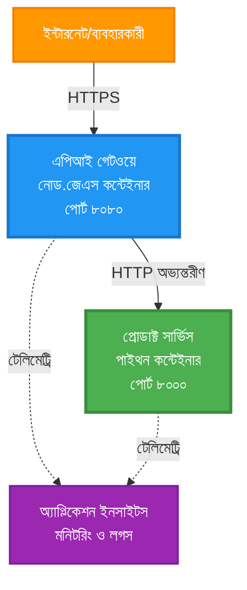
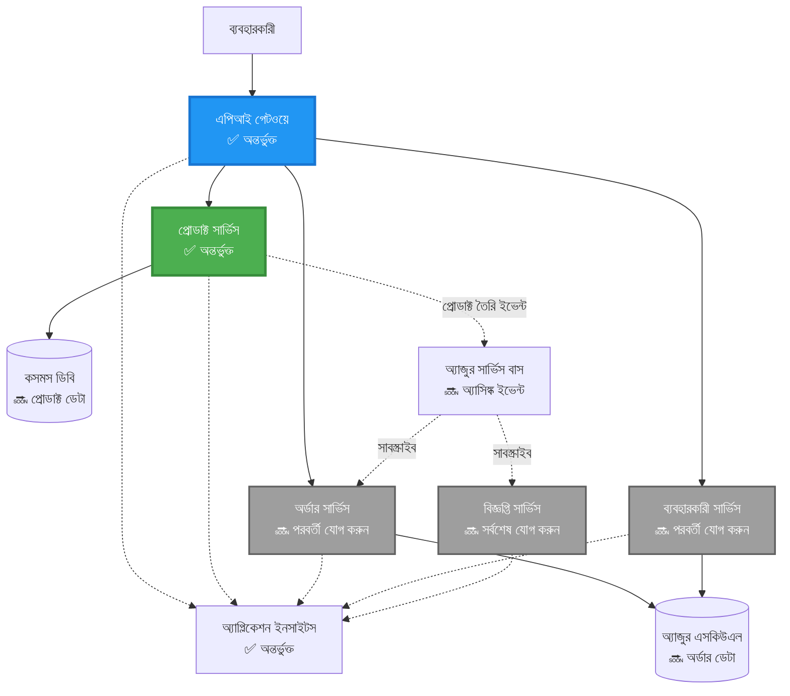

<!--
CO_OP_TRANSLATOR_METADATA:
{
  "original_hash": "eb3a4803a1e80a7f2e64f6bf63738c0f",
  "translation_date": "2025-11-20T15:00:30+00:00",
  "source_file": "examples/microservices/README.md",
  "language_code": "bn"
}
-->
# মাইক্রোসার্ভিস আর্কিটেকচার - কন্টেইনার অ্যাপ উদাহরণ

⏱️ **আনুমানিক সময়**: ২৫-৩৫ মিনিট | 💰 **আনুমানিক খরচ**: ~$৫০-১০০/মাস | ⭐ **জটিলতা**: উন্নত

**📚 শেখার পথ:**
- ← পূর্ববর্তী: [সাধারণ Flask API](../../../../examples/container-app/simple-flask-api) - একক কন্টেইনারের বেসিক
- 🎯 **আপনি এখানে আছেন**: মাইক্রোসার্ভিস আর্কিটেকচার (২-সার্ভিস ভিত্তি)
- → পরবর্তী: [এআই ইন্টিগ্রেশন](../../../../docs/ai-foundry) - আপনার সার্ভিসে বুদ্ধিমত্তা যোগ করুন
- 🏠 [কোর্স হোম](../../README.md)

---

একটি **সরল কিন্তু কার্যকরী** মাইক্রোসার্ভিস আর্কিটেকচার যা AZD CLI ব্যবহার করে Azure Container Apps-এ ডিপ্লয় করা হয়েছে। এই উদাহরণটি সার্ভিস-টু-সার্ভিস যোগাযোগ, কন্টেইনার অর্কেস্ট্রেশন এবং মনিটরিং প্রদর্শন করে একটি বাস্তব ২-সার্ভিস সেটআপের মাধ্যমে।

> **📚 শেখার পদ্ধতি**: এই উদাহরণটি একটি ন্যূনতম ২-সার্ভিস আর্কিটেকচার (API Gateway + Backend Service) দিয়ে শুরু হয় যা আপনি বাস্তবে ডিপ্লয় করতে এবং শিখতে পারবেন। এই ভিত্তি আয়ত্ত করার পরে, আমরা একটি পূর্ণ মাইক্রোসার্ভিস ইকোসিস্টেমে প্রসারিত করার জন্য নির্দেশনা প্রদান করি।

## আপনি কী শিখবেন

এই উদাহরণটি সম্পন্ন করার মাধ্যমে আপনি:
- Azure Container Apps-এ একাধিক কন্টেইনার ডিপ্লয় করবেন
- অভ্যন্তরীণ নেটওয়ার্কিং সহ সার্ভিস-টু-সার্ভিস যোগাযোগ বাস্তবায়ন করবেন
- পরিবেশ-ভিত্তিক স্কেলিং এবং স্বাস্থ্য পরীক্ষা কনফিগার করবেন
- Application Insights দিয়ে বিতরণকৃত অ্যাপ্লিকেশন মনিটর করবেন
- মাইক্রোসার্ভিস ডিপ্লয়মেন্ট প্যাটার্ন এবং সেরা অনুশীলন বুঝবেন
- সরল থেকে জটিল আর্কিটেকচারে প্রগতিশীল সম্প্রসারণ শিখবেন

## আর্কিটেকচার

### ধাপ ১: আমরা যা তৈরি করছি (এই উদাহরণে অন্তর্ভুক্ত)


**উপাদানের বিবরণ:**

| উপাদান | উদ্দেশ্য | অ্যাক্সেস | রিসোর্স |
|--------|----------|----------|----------|
| **API Gateway** | বহিরাগত অনুরোধগুলো ব্যাকএন্ড সার্ভিসে রুট করে | পাবলিক (HTTPS) | ১ vCPU, ২GB RAM, ২-২০ রেপ্লিকা |
| **Product Service** | ইন-মেমোরি ডেটা সহ প্রোডাক্ট ক্যাটালগ পরিচালনা করে | শুধুমাত্র অভ্যন্তরীণ | ০.৫ vCPU, ১GB RAM, ১-১০ রেপ্লিকা |
| **Application Insights** | কেন্দ্রীয় লগিং এবং বিতরণকৃত ট্রেসিং | Azure পোর্টাল | ১-২ GB/মাস ডেটা ইনজেশন |

**কেন সরল দিয়ে শুরু করবেন?**
- ✅ দ্রুত ডিপ্লয় এবং বোঝা যায় (২৫-৩৫ মিনিট)
- ✅ জটিলতা ছাড়াই মূল মাইক্রোসার্ভিস প্যাটার্ন শিখুন
- ✅ কাজের কোড যা আপনি পরিবর্তন এবং পরীক্ষা করতে পারেন
- ✅ শেখার জন্য কম খরচ (~$৫০-১০০/মাস বনাম $৩০০-১৪০০/মাস)
- ✅ ডাটাবেস এবং মেসেজ কিউ যোগ করার আগে আত্মবিশ্বাস তৈরি করুন

**উপমা**: এটি ড্রাইভিং শেখার মতো। আপনি একটি খালি পার্কিং লট (২ সার্ভিস) দিয়ে শুরু করেন, বেসিক আয়ত্ত করেন, তারপর শহরের ট্রাফিকে (৫+ সার্ভিস ডাটাবেস সহ) অগ্রসর হন।

### ধাপ ২: ভবিষ্যৎ সম্প্রসারণ (রেফারেন্স আর্কিটেকচার)

যখন আপনি ২-সার্ভিস আর্কিটেকচার আয়ত্ত করবেন, তখন আপনি এটি প্রসারিত করতে পারবেন:


"Expansion Guide" সেকশনে ধাপে ধাপে নির্দেশনা দেখুন।

## অন্তর্ভুক্ত বৈশিষ্ট্য

✅ **সার্ভিস ডিসকভারি**: কন্টেইনারগুলোর মধ্যে স্বয়ংক্রিয় DNS-ভিত্তিক ডিসকভারি  
✅ **লোড ব্যালেন্সিং**: রেপ্লিকাগুলোর মধ্যে বিল্ট-ইন লোড ব্যালেন্সিং  
✅ **অটো-স্কেলিং**: HTTP অনুরোধের উপর ভিত্তি করে প্রতিটি সার্ভিসের স্বাধীন স্কেলিং  
✅ **স্বাস্থ্য মনিটরিং**: উভয় সার্ভিসের জন্য লাইভনেস এবং রেডিনেস প্রোব  
✅ **বিতরণকৃত লগিং**: Application Insights দিয়ে কেন্দ্রীয় লগিং  
✅ **অভ্যন্তরীণ নেটওয়ার্কিং**: নিরাপদ সার্ভিস-টু-সার্ভিস যোগাযোগ  
✅ **কন্টেইনার অর্কেস্ট্রেশন**: স্বয়ংক্রিয় ডিপ্লয়মেন্ট এবং স্কেলিং  
✅ **জিরো-ডাউনটাইম আপডেট**: রোলিং আপডেট রিভিশন ম্যানেজমেন্ট সহ  

## প্রয়োজনীয়তা

### প্রয়োজনীয় টুলস

শুরু করার আগে, নিশ্চিত করুন যে আপনার কাছে এই টুলগুলো ইনস্টল করা আছে:

1. **[Azure Developer CLI (azd)](https://learn.microsoft.com/azure/developer/azure-developer-cli/install-azd)** (ভার্সন ১.০.০ বা তার বেশি)
   ```bash
   azd version
   # প্রত্যাশিত আউটপুট: azd সংস্করণ 1.0.0 বা তার বেশি
   ```

2. **[Azure CLI](https://learn.microsoft.com/cli/azure/install-azure-cli)** (ভার্সন ২.৫০.০ বা তার বেশি)
   ```bash
   az --version
   # প্রত্যাশিত আউটপুট: azure-cli 2.50.0 বা তার বেশি
   ```

3. **[Docker](https://www.docker.com/get-started)** (লোকাল ডেভেলপমেন্ট/পরীক্ষার জন্য - ঐচ্ছিক)
   ```bash
   docker --version
   # প্রত্যাশিত আউটপুট: ডকার সংস্করণ ২০.১০ বা তার বেশি
   ```

### আপনার সেটআপ যাচাই করুন

এই কমান্ডগুলো চালান নিশ্চিত করতে যে আপনি প্রস্তুত:

```bash
# অ্যাজুর ডেভেলপার CLI পরীক্ষা করুন
azd version
# ✅ প্রত্যাশিত: azd সংস্করণ 1.0.0 বা তার বেশি

# অ্যাজুর CLI পরীক্ষা করুন
az --version
# ✅ প্রত্যাশিত: azure-cli 2.50.0 বা তার বেশি

# ডকার পরীক্ষা করুন (ঐচ্ছিক)
docker --version
# ✅ প্রত্যাশিত: ডকার সংস্করণ 20.10 বা তার বেশি
```

**সফলতার মানদণ্ড**: সব কমান্ড ভার্সন নম্বর ফেরত দেয় যা ন্যূনতম বা তার বেশি।

### Azure প্রয়োজনীয়তা

- একটি সক্রিয় **Azure সাবস্ক্রিপশন** ([একটি ফ্রি অ্যাকাউন্ট তৈরি করুন](https://azure.microsoft.com/free/))
- আপনার সাবস্ক্রিপশনে রিসোর্স তৈরি করার অনুমতি
- সাবস্ক্রিপশন বা রিসোর্স গ্রুপে **Contributor** ভূমিকা

### জ্ঞানের প্রয়োজনীয়তা

এটি একটি **উন্নত-স্তরের** উদাহরণ। আপনার থাকা উচিত:
- [Simple Flask API উদাহরণ](../../../../examples/container-app/simple-flask-api) সম্পন্ন
- মাইক্রোসার্ভিস আর্কিটেকচারের মৌলিক ধারণা
- REST API এবং HTTP সম্পর্কে পরিচিতি
- কন্টেইনার ধারণার বোঝাপড়া

**কন্টেইনার অ্যাপে নতুন?** বেসিক শিখতে প্রথমে [Simple Flask API উদাহরণ](../../../../examples/container-app/simple-flask-api) দিয়ে শুরু করুন।

## দ্রুত শুরু (ধাপে ধাপে)

### ধাপ ১: ক্লোন এবং নেভিগেট করুন

```bash
git clone https://github.com/microsoft/AZD-for-beginners.git
cd AZD-for-beginners/examples/microservices
```

**✓ সফলতার পরীক্ষা**: নিশ্চিত করুন আপনি `azure.yaml` দেখতে পাচ্ছেন:
```bash
ls
# প্রত্যাশিত: README.md, azure.yaml, infra/, src/
```

### ধাপ ২: Azure-এ প্রমাণীকরণ করুন

```bash
azd auth login
```

এটি Azure প্রমাণীকরণের জন্য আপনার ব্রাউজার খুলবে। আপনার Azure শংসাপত্র দিয়ে সাইন ইন করুন।

**✓ সফলতার পরীক্ষা**: আপনি দেখতে পাবেন:
```
Logged in to Azure.
```

### ধাপ ৩: পরিবেশ ইনিশিয়ালাইজ করুন

```bash
azd init
```

**আপনি যা দেখতে পাবেন**:
- **পরিবেশের নাম**: একটি সংক্ষিপ্ত নাম লিখুন (যেমন, `microservices-dev`)
- **Azure সাবস্ক্রিপশন**: আপনার সাবস্ক্রিপশন নির্বাচন করুন
- **Azure অবস্থান**: একটি অঞ্চল নির্বাচন করুন (যেমন, `eastus`, `westeurope`)

**✓ সফলতার পরীক্ষা**: আপনি দেখতে পাবেন:
```
SUCCESS: New project initialized!
```

### ধাপ ৪: অবকাঠামো এবং সার্ভিস ডিপ্লয় করুন

```bash
azd up
```

**কি ঘটছে** (৮-১২ মিনিট সময় নেয়):

```mermaid
graph LR
    A[azd up] --> B[রিসোর্স গ্রুপ তৈরি করুন]
    B --> C[কন্টেইনার রেজিস্ট্রি ডিপ্লয় করুন]
    C --> D[লগ অ্যানালিটিক্স ডিপ্লয় করুন]
    D --> E[অ্যাপ ইনসাইটস ডিপ্লয় করুন]
    E --> F[কন্টেইনার পরিবেশ তৈরি করুন]
    F --> G[এপিআই গেটওয়ে ইমেজ তৈরি করুন]
    F --> H[প্রোডাক্ট সার্ভিস ইমেজ তৈরি করুন]
    G --> I[রেজিস্ট্রিতে পুশ করুন]
    H --> I
    I --> J[এপিআই গেটওয়ে ডিপ্লয় করুন]
    I --> K[প্রোডাক্ট সার্ভিস ডিপ্লয় করুন]
    J --> L[ইনগ্রেস এবং হেলথ চেক কনফিগার করুন]
    K --> L
    L --> M[ডিপ্লয়মেন্ট সম্পন্ন ✓]
    
    style A fill:#2196F3,stroke:#1976D2,stroke-width:3px,color:#fff
    style M fill:#4CAF50,stroke:#388E3C,stroke-width:3px,color:#fff
```


**✓ সফলতার পরীক্ষা**: আপনি দেখতে পাবেন:
```
SUCCESS: Your application was deployed to Azure in X minutes Y seconds.
Endpoint: https://api-gateway-<unique-id>.azurecontainerapps.io
```

**⏱️ সময়**: ৮-১২ মিনিট

### ধাপ ৫: ডিপ্লয়মেন্ট পরীক্ষা করুন

```bash
# গেটওয়ে এন্ডপয়েন্ট পান
GATEWAY_URL=$(azd env get-values | grep API_GATEWAY_URL | cut -d '=' -f2 | tr -d '"')

# API গেটওয়ে স্বাস্থ্য পরীক্ষা করুন
curl $GATEWAY_URL/health
```

**✅ প্রত্যাশিত আউটপুট:**
```json
{
  "status": "healthy",
  "service": "api-gateway",
  "timestamp": "2025-11-19T10:30:00Z"
}
```

**গেটওয়ের মাধ্যমে প্রোডাক্ট সার্ভিস পরীক্ষা করুন**:
```bash
# পণ্য তালিকা
curl $GATEWAY_URL/api/products
```

**✅ প্রত্যাশিত আউটপুট:**
```json
[
  {"id":1,"name":"Laptop","price":999.99,"stock":50},
  {"id":2,"name":"Mouse","price":29.99,"stock":200},
  {"id":3,"name":"Keyboard","price":79.99,"stock":150}
]
```

**✓ সফলতার পরীক্ষা**: উভয় এন্ডপয়েন্ট কোনো ত্রুটি ছাড়াই JSON ডেটা ফেরত দেয়।

---

**🎉 অভিনন্দন!** আপনি Azure-এ একটি মাইক্রোসার্ভিস আর্কিটেকচার ডিপ্লয় করেছেন!
3. উভয় সার্ভিস পুনরায় ডিপ্লয় করুন:

```bash
azd deploy product-service
azd deploy api-gateway
```

4. নতুন এন্ডপয়েন্ট পরীক্ষা করুন:

```bash
GATEWAY_URL=$(azd env get-values | grep API_GATEWAY_URL | cut -d '=' -f2 | tr -d '"')

# একটি নতুন পণ্য তৈরি করুন
curl -X POST $GATEWAY_URL/api/products \
  -H "Content-Type: application/json" \
  -d '{"name":"USB Cable","price":9.99,"stock":500}'
```

**✅ প্রত্যাশিত আউটপুট:**
```json
{"id":6,"name":"USB Cable","description":"","price":9.99,"stock":500}
```

5. নিশ্চিত করুন এটি তালিকায় প্রদর্শিত হচ্ছে:

```bash
curl $GATEWAY_URL/api/products
# এখন ৬টি পণ্য দেখানো উচিত, যার মধ্যে নতুন ইউএসবি কেবল অন্তর্ভুক্ত।
```

**সফলতার মানদণ্ড**:
- ✅ POST অনুরোধ HTTP 201 ফেরত দেয়
- ✅ নতুন প্রোডাক্ট GET /api/products তালিকায় প্রদর্শিত হয়
- ✅ প্রোডাক্টের অটো-ইনক্রিমেন্টেড ID থাকে

**সময়**: ১০-১৫ মিনিট

---

### অনুশীলন ২: অটোস্কেলিং নিয়ম পরিবর্তন ⭐⭐ (মাঝারি)

**লক্ষ্য**: প্রোডাক্ট সার্ভিসকে আরও আক্রমণাত্মকভাবে স্কেল করার জন্য পরিবর্তন করুন

**শুরু করার পয়েন্ট**: `infra/app/product-service.bicep`

**ধাপসমূহ**:

1. `infra/app/product-service.bicep` খুলুন এবং `scale` ব্লকটি খুঁজুন (প্রায় ৯৫ নম্বর লাইনে)

2. এটি পরিবর্তন করুন:
```bicep
scale: {
  minReplicas: 1
  maxReplicas: 10
  rules: [
    {
      name: 'http-scale-rule'
      http: {
        metadata: {
          concurrentRequests: '100'  // OLD
        }
      }
    }
  ]
}
```

এইটিতে:
```bicep
scale: {
  minReplicas: 2  // Always have 2 running
  maxReplicas: 20  // Allow more scaling
  rules: [
    {
      name: 'http-scale-rule'
      http: {
        metadata: {
          concurrentRequests: '20'  // Scale at lower threshold
        }
      }
    }
  ]
}
```

3. অবকাঠামো পুনরায় ডিপ্লয় করুন:

```bash
azd up
```

4. নতুন স্কেলিং কনফিগারেশন যাচাই করুন:

```bash
az containerapp show \
  --name $(azd env get-values | grep PRODUCT_SERVICE | head -1 | cut -d '/' -f5) \
  --resource-group $(azd env get-values | grep AZURE_RESOURCE_GROUP | cut -d '=' -f2 | tr -d '"') \
  --query "properties.template.scale" -o json
```

**✅ প্রত্যাশিত আউটপুট:**
```json
{
  "minReplicas": 2,
  "maxReplicas": 20,
  "rules": [...]
}
```

5. লোড দিয়ে অটোস্কেলিং পরীক্ষা করুন:

```bash
# একযোগে অনুরোধ তৈরি করুন
for i in {1..500}; do curl $GATEWAY_URL/api/products & done

# স্কেলিং ঘটতে দেখুন
azd logs product-service --follow
# দেখুন: কন্টেইনার অ্যাপস স্কেলিং ইভেন্টগুলি
```

**সফলতার মানদণ্ড**:
- ✅ প্রোডাক্ট সার্ভিস সর্বদা কমপক্ষে ২টি রিপ্লিকা চালায়
- ✅ লোডের সময় ২টির বেশি রিপ্লিকায় স্কেল করে
- ✅ Azure পোর্টালে নতুন স্কেলিং নিয়ম প্রদর্শিত হয়

**সময়**: ১৫-২০ মিনিট

---

### অনুশীলন ৩: কাস্টম মনিটরিং কুয়েরি যোগ করুন ⭐⭐ (মাঝারি)

**লক্ষ্য**: প্রোডাক্ট API পারফরম্যান্স ট্র্যাক করার জন্য একটি কাস্টম অ্যাপ্লিকেশন ইনসাইটস কুয়েরি তৈরি করুন

**ধাপসমূহ**:

1. Azure পোর্টালে অ্যাপ্লিকেশন ইনসাইটসে যান:
   - Azure পোর্টালে যান
   - আপনার রিসোর্স গ্রুপ (rg-microservices-*) খুঁজুন
   - অ্যাপ্লিকেশন ইনসাইটস রিসোর্সে ক্লিক করুন

2. বাম মেনুতে "Logs" এ ক্লিক করুন

3. এই কুয়েরি তৈরি করুন:

```kusto
requests
| where timestamp > ago(1h)
| where name contains "products"
| summarize 
    RequestCount = count(),
    AvgDuration = avg(duration),
    P95Duration = percentile(duration, 95),
    SuccessRate = 100.0 * countif(success == true) / count()
  by bin(timestamp, 5m)
| render timechart
```

4. কুয়েরি চালানোর জন্য "Run" এ ক্লিক করুন

5. কুয়েরি সংরক্ষণ করুন:
   - "Save" এ ক্লিক করুন
   - নাম: "Product API Performance"
   - ক্যাটাগরি: "Performance"

6. টেস্ট ট্রাফিক তৈরি করুন:

```bash
for i in {1..100}; do curl $GATEWAY_URL/api/products; sleep 1; done
```

7. ডেটা দেখতে কুয়েরি রিফ্রেশ করুন

**✅ প্রত্যাশিত আউটপুট:**
- সময়ের সাথে অনুরোধের সংখ্যা দেখানো চার্ট
- গড় সময়কাল < ৫০০ms
- সফলতার হার = ১০০%
- ৫ মিনিটের টাইম বিন

**সফলতার মানদণ্ড**:
- ✅ কুয়েরি ১০০+ অনুরোধ দেখায়
- ✅ সফলতার হার ১০০%
- ✅ গড় সময়কাল < ৫০০ms
- ✅ চার্ট ৫ মিনিটের টাইম বিন দেখায়

**শিক্ষার ফলাফল**: কাস্টম কুয়েরি দিয়ে সার্ভিস পারফরম্যান্স মনিটর করা শিখুন

**সময়**: ১০-১৫ মিনিট

---

### অনুশীলন ৪: রিট্রাই লজিক প্রয়োগ করুন ⭐⭐⭐ (উন্নত)

**লক্ষ্য**: প্রোডাক্ট সার্ভিস সাময়িকভাবে অনুপলব্ধ হলে API গেটওয়েতে রিট্রাই লজিক যোগ করুন

**শুরু করার পয়েন্ট**: `src/api-gateway/app.js`

**ধাপসমূহ**:

1. রিট্রাই লাইব্রেরি ইনস্টল করুন:

```bash
cd src/api-gateway
npm install axios-retry --save
cd ../..
```

2. `src/api-gateway/app.js` আপডেট করুন (axios ইমপোর্টের পরে যোগ করুন):

```javascript
const axiosRetry = require('axios-retry');

// পুনরায় চেষ্টা করার লজিক কনফিগার করুন
axiosRetry(axios, {
  retries: 3,
  retryDelay: (retryCount) => {
    return retryCount * 1000; // ১সেকেন্ড, ২সেকেন্ড, ৩সেকেন্ড
  },
  retryCondition: (error) => {
    // নেটওয়ার্ক ত্রুটি বা ৫xx প্রতিক্রিয়ার উপর পুনরায় চেষ্টা করুন
    return axiosRetry.isNetworkOrIdempotentRequestError(error) ||
           (error.response && error.response.status >= 500);
  }
});

console.log('Retry logic configured: 3 retries with exponential backoff');
```

3. API গেটওয়ে পুনরায় ডিপ্লয় করুন:

```bash
azd deploy api-gateway
```

4. সার্ভিস ব্যর্থতা সিমুলেট করে রিট্রাই আচরণ পরীক্ষা করুন:

```bash
# পণ্য পরিষেবাকে 0 স্কেলে নিয়ে যান (ব্যর্থতা অনুকরণ করুন)
az containerapp update \
  --name $(azd env get-values | grep PRODUCT_SERVICE | head -1 | cut -d '/' -f5) \
  --resource-group $(azd env get-values | grep AZURE_RESOURCE_GROUP | cut -d '=' -f2 | tr -d '"') \
  --min-replicas 0 \
  --max-replicas 0

# পণ্যগুলিতে অ্যাক্সেস করার চেষ্টা করুন (৩ বার পুনরায় চেষ্টা করবে)
time curl -v $GATEWAY_URL/api/products
# লক্ষ্য করুন: প্রতিক্রিয়া ~৬ সেকেন্ড সময় নেয় (১স + ২স + ৩স পুনরায় চেষ্টা)

# পণ্য পরিষেবা পুনরুদ্ধার করুন
az containerapp update \
  --name $(azd env get-values | grep PRODUCT_SERVICE | head -1 | cut -d '/' -f5) \
  --resource-group $(azd env get-values | grep AZURE_RESOURCE_GROUP | cut -d '=' -f2 | tr -d '"') \
  --min-replicas 1 \
  --max-replicas 10
```

5. রিট্রাই লগ দেখুন:

```bash
azd logs api-gateway --tail 50
# পুনরায় চেষ্টা করার বার্তাগুলি সন্ধান করুন
```

**✅ প্রত্যাশিত আচরণ:**
- অনুরোধ ব্যর্থ হওয়ার আগে ৩ বার রিট্রাই করে
- প্রতিটি রিট্রাইয়ের মধ্যে অপেক্ষার সময় বাড়ে (১সেকেন্ড, ২সেকেন্ড, ৩সেকেন্ড)
- সার্ভিস পুনরায় চালু হওয়ার পরে সফল অনুরোধ
- লগে রিট্রাই প্রচেষ্টাগুলি প্রদর্শিত হয়

**সফলতার মানদণ্ড**:
- ✅ অনুরোধ ব্যর্থ হওয়ার আগে ৩ বার রিট্রাই করে
- ✅ প্রতিটি রিট্রাইয়ের মধ্যে অপেক্ষার সময় বৃদ্ধি পায় (এক্সপোনেনশিয়াল ব্যাকঅফ)
- ✅ সার্ভিস পুনরায় চালু হওয়ার পরে সফল অনুরোধ
- ✅ লগে রিট্রাই প্রচেষ্টাগুলি প্রদর্শিত হয়

**শিক্ষার ফলাফল**: মাইক্রোসার্ভিসে রেজিলিয়েন্স প্যাটার্ন (সার্কিট ব্রেকার, রিট্রাই, টাইমআউট) বোঝা

**সময়**: ২০-২৫ মিনিট

---

## জ্ঞান যাচাই

এই উদাহরণ সম্পন্ন করার পরে, আপনার জ্ঞান যাচাই করুন:

### ১. সার্ভিস কমিউনিকেশন ✓

আপনার জ্ঞান পরীক্ষা করুন:
- [ ] আপনি কি ব্যাখ্যা করতে পারবেন API গেটওয়ে কীভাবে প্রোডাক্ট সার্ভিস আবিষ্কার করে? (DNS-ভিত্তিক সার্ভিস ডিসকভারি)
- [ ] প্রোডাক্ট সার্ভিস ডাউন থাকলে কী হয়? (গেটওয়ে 503 ত্রুটি ফেরত দেয়)
- [ ] আপনি কীভাবে তৃতীয় সার্ভিস যোগ করবেন? (নতুন Bicep ফাইল তৈরি করুন, main.bicep-এ যোগ করুন, src ফোল্ডার তৈরি করুন)

**হ্যান্ডস-অন যাচাই:**
```bash
# পরিষেবার ব্যর্থতা সিমুলেট করুন
az containerapp update --name <product-service-name> --min-replicas 0 --max-replicas 0
curl $GATEWAY_URL/api/products
# ✅ প্রত্যাশিত: 503 পরিষেবা উপলব্ধ নয়

# পরিষেবা পুনরুদ্ধার করুন
az containerapp update --name <product-service-name> --min-replicas 1 --max-replicas 10
```

### ২. মনিটরিং ও পর্যবেক্ষণ ✓

আপনার জ্ঞান পরীক্ষা করুন:
- [ ] আপনি কোথায় ডিস্ট্রিবিউটেড লগ দেখতে পাবেন? (Azure পোর্টালে অ্যাপ্লিকেশন ইনসাইটস)
- [ ] আপনি কীভাবে ধীর অনুরোধ ট্র্যাক করবেন? (Kusto কুয়েরি: `requests | where duration > 1000`)
- [ ] আপনি কীভাবে নির্ধারণ করবেন কোন সার্ভিস ত্রুটি সৃষ্টি করেছে? (লগে `cloud_RoleName` ফিল্ড চেক করুন)

**হ্যান্ডস-অন যাচাই:**
```bash
# ধীর অনুরোধ সিমুলেশন তৈরি করুন
curl "$GATEWAY_URL/api/products?delay=2000"

# ধীর অনুরোধের জন্য অ্যাপ্লিকেশন ইনসাইটস অনুসন্ধান করুন
# Azure পোর্টাল → অ্যাপ্লিকেশন ইনসাইটস → লগ-এ যান
# চালান: requests | where duration > 1000 | project timestamp, name, duration, cloud_RoleName
```

### ৩. স্কেলিং ও পারফরম্যান্স ✓

আপনার জ্ঞান পরীক্ষা করুন:
- [ ] কী ট্রিগার করে অটোস্কেলিং? (HTTP কনকারেন্ট রিকোয়েস্ট নিয়ম: গেটওয়ের জন্য ৫০, প্রোডাক্টের জন্য ১০০)
- [ ] এখন কতটি রিপ্লিকা চলছে? (চেক করুন `az containerapp revision list` দিয়ে)
- [ ] আপনি কীভাবে প্রোডাক্ট সার্ভিসকে ৫টি রিপ্লিকায় স্কেল করবেন? (Bicep-এ minReplicas আপডেট করুন)

**হ্যান্ডস-অন যাচাই:**
```bash
# অটোস্কেলিং পরীক্ষা করার জন্য লোড তৈরি করুন
for i in {1..1000}; do curl $GATEWAY_URL/api/products & done

# প্রতিলিপি বৃদ্ধি দেখুন
azd logs api-gateway --follow
# ✅ প্রত্যাশিত: লগে স্কেলিং ইভেন্টগুলি দেখুন
```

**সফলতার মানদণ্ড**: আপনি সমস্ত প্রশ্নের উত্তর দিতে পারবেন এবং হ্যান্ডস-অন কমান্ড দিয়ে যাচাই করতে পারবেন।

---

## খরচ বিশ্লেষণ

### আনুমানিক মাসিক খরচ (এই ২-সার্ভিস উদাহরণের জন্য)

| রিসোর্স | কনফিগারেশন | আনুমানিক খরচ |
|----------|--------------|----------------|
| API গেটওয়ে | ২-২০ রিপ্লিকা, ১ vCPU, ২GB RAM | $৩০-১৫০ |
| প্রোডাক্ট সার্ভিস | ১-১০ রিপ্লিকা, ০.৫ vCPU, ১GB RAM | $১৫-৭৫ |
| কন্টেইনার রেজিস্ট্রি | বেসিক টিয়ার | $৫ |
| অ্যাপ্লিকেশন ইনসাইটস | ১-২ GB/মাস | $৫-১০ |
| লগ অ্যানালিটিক্স | ১ GB/মাস | $৩ |
| **মোট** | | **$৫৮-২৪৩/মাস** |

### ব্যবহার অনুযায়ী খরচ বিশ্লেষণ

**হালকা ট্রাফিক** (পরীক্ষা/শেখা): ~$৬০/মাস
- API গেটওয়ে: ২ রিপ্লিকা × ২৪/৭ = $৩০
- প্রোডাক্ট সার্ভিস: ১ রিপ্লিকা × ২৪/৭ = $১৫
- মনিটরিং + রেজিস্ট্রি = $১৩

**মাঝারি ট্রাফিক** (ছোট প্রোডাকশন): ~$১২০/মাস
- API গেটওয়ে: ৫ গড় রিপ্লিকা = $৭৫
- প্রোডাক্ট সার্ভিস: ৩ গড় রিপ্লিকা = $৪৫
- মনিটরিং + রেজিস্ট্রি = $১৩

**উচ্চ ট্রাফিক** (ব্যস্ত সময়): ~$২৪০/মাস
- API গেটওয়ে: ১৫ গড় রিপ্লিকা = $২২৫
- প্রোডাক্ট সার্ভিস: ৮ গড় রিপ্লিকা = $১২০
- মনিটরিং + রেজিস্ট্রি = $১৩

### খরচ সাশ্রয়ের টিপস

1. **ডেভেলপমেন্টের জন্য জিরোতে স্কেল করুন**:
   ```bicep
   scale: {
     minReplicas: 0  // Save $30-40/month when not in use
     maxReplicas: 10
   }
   ```

2. **Cosmos DB-এর জন্য কনজাম্পশন প্ল্যান ব্যবহার করুন** (যখন এটি যোগ করবেন):
   - আপনি যা ব্যবহার করেন তার জন্যই কেবল অর্থ প্রদান করুন
   - ন্যূনতম চার্জ নেই

3. **অ্যাপ্লিকেশন ইনসাইটস স্যাম্পলিং সেট করুন**:
   ```javascript
   appInsights.defaultClient.config.samplingPercentage = 50; // অনুরোধগুলির ৫০% নমুনা সংগ্রহ করুন
   ```

4. **প্রয়োজন না হলে পরিষ্কার করুন**:
   ```bash
   azd down --force --purge
   ```

### ফ্রি টিয়ার অপশন

শেখা/পরীক্ষার জন্য বিবেচনা করুন:
- ✅ Azure ফ্রি ক্রেডিট ব্যবহার করুন (নতুন অ্যাকাউন্টের জন্য প্রথম ৩০ দিনে $২০০)
- ✅ সর্বনিম্ন রিপ্লিকায় থাকুন (প্রায় ৫০% খরচ সাশ্রয় করে)
- ✅ পরীক্ষার পরে মুছে ফেলুন (কোনও চলমান চার্জ নেই)
- ✅ শেখার সেশনের মধ্যে জিরোতে স্কেল করুন

**উদাহরণ**: এই উদাহরণটি ২ ঘণ্টা/দিন × ৩০ দিন চালানো = ~$৫/মাস, $৬০/মাসের পরিবর্তে

---

## সমস্যা সমাধানের দ্রুত রেফারেন্স

### সমস্যা: `azd up` "Subscription not found" ত্রুটি দেখায়

**সমাধান**:
```bash
# স্পষ্ট সাবস্ক্রিপশন দিয়ে আবার লগইন করুন
az account set --subscription <your-subscription-id>
azd env set AZURE_SUBSCRIPTION_ID <your-subscription-id>
azd up
```

### সমস্যা: API গেটওয়ে 503 "Product service unavailable" ফেরত দেয়

**ডায়াগনসিস**:
```bash
# পণ্য পরিষেবা লগ পরীক্ষা করুন
azd logs product-service --tail 50

# পণ্য পরিষেবা স্বাস্থ্য পরীক্ষা করুন
az containerapp show \
  --name $(azd env get-values | grep PRODUCT_SERVICE | head -1 | cut -d '/' -f5) \
  --resource-group $(azd env get-values | grep AZURE_RESOURCE_GROUP | cut -d '=' -f2 | tr -d '"') \
  --query "properties.runningStatus"
```

**সাধারণ কারণসমূহ**:
1. প্রোডাক্ট সার্ভিস শুরু হয়নি (Python ত্রুটির জন্য লগ চেক করুন)
2. হেলথ চেক ব্যর্থ হচ্ছে (নিশ্চিত করুন `/health` এন্ডপয়েন্ট কাজ করছে)
3. কন্টেইনার ইমেজ বিল্ড ব্যর্থ হয়েছে (রেজিস্ট্রিতে ইমেজ চেক করুন)

### সমস্যা: অটোস্কেলিং কাজ করছে না

**ডায়াগনসিস**:
```bash
# বর্তমান প্রতিলিপি সংখ্যা পরীক্ষা করুন
az containerapp revision list \
  --name $(azd env get-values | grep API_GATEWAY | head -1 | cut -d '/' -f5) \
  --resource-group $(azd env get-values | grep AZURE_RESOURCE_GROUP | cut -d '=' -f2 | tr -d '"') \
  --query "[].properties.replicas"

# পরীক্ষা করার জন্য লোড তৈরি করুন
for i in {1..1000}; do curl $GATEWAY_URL/api/products & done

# স্কেলিং ইভেন্টগুলি পর্যবেক্ষণ করুন
azd logs api-gateway --follow | grep -i scale
```

**সাধারণ কারণসমূহ**:
1. লোড স্কেল নিয়ম ট্রিগার করার জন্য যথেষ্ট নয় (৫০টির বেশি কনকারেন্ট অনুরোধ প্রয়োজন)
2. সর্বাধিক রিপ্লিকা ইতিমধ্যে পৌঁছেছে (Bicep কনফিগারেশন চেক করুন)
3. Bicep-এ স্কেল নিয়ম ভুল কনফিগার করা হয়েছে (concurrentRequests মান যাচাই করুন)

### সমস্যা: অ্যাপ্লিকেশন ইনসাইটস লগ দেখাচ্ছে না

**ডায়াগনসিস**:
```bash
# সংযোগ স্ট্রিং সেট করা হয়েছে কিনা যাচাই করুন
azd env get-values | grep APPLICATIONINSIGHTS

# পরিষেবাগুলি টেলিমেট্রি পাঠাচ্ছে কিনা পরীক্ষা করুন
az monitor app-insights component show \
  --app $(azd env get-values | grep APPLICATIONINSIGHTS_NAME | cut -d '=' -f2 | tr -d '"') \
  --resource-group $(azd env get-values | grep AZURE_RESOURCE_GROUP | cut -d '=' -f2 | tr -d '"') \
  --query "properties.InstrumentationKey"
```

**সাধারণ কারণসমূহ**:
1. কন্টেইনারে কানেকশন স্ট্রিং পাস করা হয়নি (পরিবেশ ভেরিয়েবল চেক করুন)
2. অ্যাপ্লিকেশন ইনসাইটস SDK কনফিগার করা হয়নি (কোডে ইমপোর্ট যাচাই করুন)
3. টেলিমেট্রি ব্লক করছে ফায়ারওয়াল (বিরল, নেটওয়ার্ক নিয়ম চেক করুন)

### সমস্যা: লোকাল ডকার বিল্ড ব্যর্থ হচ্ছে

**ডায়াগনসিস**:
```bash
# API গেটওয়ে বিল্ড পরীক্ষা করুন
cd src/api-gateway
docker build -t test-gateway .

# প্রোডাক্ট সার্ভিস বিল্ড পরীক্ষা করুন
cd ../product-service
docker build -t test-product .
```

**সাধারণ কারণসমূহ**:
1. package.json/requirements.txt-এ ডিপেন্ডেন্সি নেই
2. Dockerfile সিনট্যাক্স ত্রুটি
3. ডিপেন্ডেন্সি ডাউনলোড করার সময় নেটওয়ার্ক সমস্যা

**এখনও আটকে আছেন?** দেখুন [Common Issues Guide](../../docs/troubleshooting/common-issues.md) অথবা [Azure Container Apps Troubleshooting](https://learn.microsoft.com/azure/container-apps/troubleshooting)

---

## ক্লিনআপ

চলমান চার্জ এড়াতে, সমস্ত রিসোর্স মুছে ফেলুন:

```bash
azd down --force --purge
```

**নিশ্চিতকরণ প্রম্পট**:
```
? Total resources to delete: 6, are you sure you want to continue? (y/N)
```

`y` টাইপ করে নিশ্চিত করুন।

**কি মুছে ফেলা হবে**:
- কন্টেইনার অ্যাপ এনভায়রনমেন্ট
- উভয় কন্টেইনার অ্যাপ (গেটওয়ে ও প্রোডাক্ট সার্ভিস)
- কন্টেইনার রেজিস্ট্রি
- অ্যাপ্লিকেশন ইনসাইটস
- লগ অ্যানালিটিক্স ওয়ার্কস্পেস
- রিসোর্স গ্রুপ

**✓ ক্লিনআপ যাচাই করুন**:
```bash
az group list --query "[?starts_with(name,'rg-microservices')]" --output table
```

খালি ফেরত আসা উচিত।

---

## সম্প্রসারণ গাইড: ২ থেকে ৫+ সার্ভিস

এই ২-সার্ভিস আর্কিটেকচার আয়ত্ত করার পরে, সম্প্রসারণের জন্য এগিয়ে যান:

### ধাপ ১: ডাটাবেস পার্সিস্টেন্স যোগ করুন (পরবর্তী ধাপ)

**প্রোডাক্ট সার্ভিসের জন্য Cosmos DB যোগ করুন**:

1. `infra/core/cosmos.bicep` তৈরি করুন:
   ```bicep
   resource cosmosAccount 'Microsoft.DocumentDB/databaseAccounts@2023-04-15' = {
     name: name
     location: location
     kind: 'GlobalDocumentDB'
     properties: {
       databaseAccountOfferType: 'Standard'
       consistencyPolicy: { defaultConsistencyLevel: 'Session' }
       locations: [{ locationName: location, failoverPriority: 0 }]
     }
   }
   ```

2. ইন-মেমোরি ডেটার পরিবর্তে Azure Cosmos DB Python SDK ব্যবহার করতে প্রোডাক্ট সার্ভিস আপডেট করুন

3. আনুমানিক অতিরিক্ত খরচ: ~$২৫/মাস (সার্ভারলেস)

### ধাপ ২: তৃতীয় সার্ভিস যোগ করুন (অর্ডার ম্যানেজমেন্ট)

**অর্ডার সার্ভিস তৈরি করুন**:

1. নতুন ফোল্ডার: `src/order-service/` (Python/Node.js/C#)
2. নতুন Bicep: `infra/app/order-service.bicep`
3. API গেটওয়েতে `/api/orders` রুট আপডেট করুন
4. অর্ডার পার্সিস্টেন্সের জন্য Azure SQL ডাটাবেস যোগ করুন

**আর্কিটেকচার হয়ে যায়**:
```
API Gateway → Product Service (Cosmos DB)
           → Order Service (Azure SQL)
```

### ধাপ ৩: অ্যাসিঙ্ক কমিউনিকেশন যোগ করুন (সার্ভিস বাস)

**ইভেন্ট-ড্রিভেন আর্কিটেকচার প্রয়োগ করুন**:

1. Azure সার্ভিস বাস যোগ করুন: `infra/core/servicebus.bicep`
2. প্রোডাক্ট সার্ভিস "ProductCreated" ইভেন্ট প্রকাশ করে
3. অর্ডার সার্ভিস প্রোডাক্ট ইভেন্ট সাবস্ক্রাইব করে
4. ইভেন্ট প্রক্রিয়াকরণের জন্য নোটিফিকেশন সার্ভিস যোগ করুন

**প্যাটার্ন**: রিকোয়েস্ট/রেসপন্স (HTTP) + ইভেন্ট-ড্রিভেন (সার্ভিস বাস)

### ধাপ ৪: ইউজার অথেন্টিকেশন যোগ করুন

**ইউজার সার্ভিস প্রয়োগ করুন**:

1. `src/user-service/` তৈরি করুন (Go/Node.js)
2. Azure AD B2C বা কাস্টম JWT অথেন্টিকেশন যোগ করুন
3. API গেটওয়ে টোকেন যাচাই করে রুটিংয়ের আগে
4. সার্ভিসগুলো ইউজার পারমিশন চেক করে

### ধাপ ৫: প্রোডাকশন প্রস্তুতি

**এই উপাদানগুলো যোগ করুন**:
- ✅ Azure Front Door (গ্লোবাল লোড ব্যালেন্সিং)
- ✅ Azure Key Vault (সিক্রেট ম্যানেজমেন্ট)
- ✅ Azure Monitor Workbooks (কাস্টম ড্যাশবোর্ড)
- ✅ CI/CD পাইপলাইন (GitHub Actions)
- ✅ ব্লু-গ্রিন ডিপ্লয়মেন্ট
- ✅ সমস্ত সার্ভিসের জন্য ম্যানেজড আইডেন্টিটি

**পূর্ণ প্রোডাকশন আর্কিটেকচার খরচ**: ~$৩০০-১,৪০০/মাস

---

## আরও জানুন

### সম্পর্কিত ডকুমেন্টেশন
- [Azure Container Apps Documentation](https://learn.microsoft.com/azure/container-apps/)
- [Microservices
| **সেরা ব্যবহার** | MVPs, প্রোটোটাইপ | প্রোডাকশন অ্যাপ | মাল্টি-ক্লাউড, উন্নত নেটওয়ার্কিং |

**প্রস্তাবনা**: Container Apps দিয়ে শুরু করুন (এই উদাহরণ), AKS-এ যান শুধুমাত্র যদি Kubernetes-নির্দিষ্ট বৈশিষ্ট্যের প্রয়োজন হয়।

---

## প্রায়শই জিজ্ঞাসিত প্রশ্নাবলী

**প্রশ্ন: কেন শুধুমাত্র ২টি সার্ভিস, ৫+ নয়?**  
উত্তর: শিক্ষামূলক অগ্রগতি। জটিলতা যোগ করার আগে একটি সহজ উদাহরণের মাধ্যমে মৌলিক বিষয়গুলি (সার্ভিস যোগাযোগ, মনিটরিং, স্কেলিং) শিখুন। এখানে আপনি যে প্যাটার্ন শিখছেন তা ১০০-সার্ভিস আর্কিটেকচারের জন্যও প্রযোজ্য।

**প্রশ্ন: আমি কি নিজে আরও সার্ভিস যোগ করতে পারি?**  
উত্তর: অবশ্যই! উপরের সম্প্রসারণ গাইড অনুসরণ করুন। প্রতিটি নতুন সার্ভিস একই প্যাটার্ন অনুসরণ করে: src ফোল্ডার তৈরি করুন, Bicep ফাইল তৈরি করুন, azure.yaml আপডেট করুন, ডিপ্লয় করুন।

**প্রশ্ন: এটি কি প্রোডাকশন-রেডি?**  
উত্তর: এটি একটি শক্ত ভিত্তি। প্রোডাকশনের জন্য যোগ করুন: managed identity, Key Vault, স্থায়ী ডাটাবেস, CI/CD পাইপলাইন, মনিটরিং অ্যালার্ট এবং ব্যাকআপ কৌশল।

**প্রশ্ন: কেন Dapr বা অন্য সার্ভিস মেশ ব্যবহার করা হয়নি?**  
উত্তর: শেখার জন্য সহজ রাখুন। একবার আপনি Container Apps নেটওয়ার্কিং বুঝে গেলে, উন্নত পরিস্থিতির জন্য Dapr (state management, pub/sub, bindings) যোগ করতে পারেন।

**প্রশ্ন: আমি কীভাবে লোকাল ডিবাগ করব?**  
উত্তর: Docker দিয়ে লোকাল সার্ভিস চালান:  
```bash
cd src/api-gateway
docker build -t local-gateway .
docker run -p 8080:8080 -e PRODUCT_SERVICE_URL=http://localhost:8000 local-gateway
```
  
**প্রশ্ন: আমি কি বিভিন্ন প্রোগ্রামিং ভাষা ব্যবহার করতে পারি?**  
উত্তর: হ্যাঁ! এই উদাহরণটি Node.js (gateway) + Python (product service) দেখায়। আপনি যেকোনো ভাষা মিশ্রিত করতে পারেন যা কন্টেইনারে চলে: C#, Go, Java, Ruby, PHP ইত্যাদি।

**প্রশ্ন: যদি আমার Azure ক্রেডিট না থাকে?**  
উত্তর: Azure ফ্রি টিয়ার ব্যবহার করুন (নতুন অ্যাকাউন্টের প্রথম ৩০ দিনে $২০০ ক্রেডিট পাওয়া যায়) অথবা সংক্ষিপ্ত পরীক্ষার জন্য ডিপ্লয় করুন এবং সাথে সাথে মুছে ফেলুন। এই উদাহরণটির খরচ প্রায় $২/দিন।

**প্রশ্ন: এটি Azure Kubernetes Service (AKS)-এর থেকে কীভাবে আলাদা?**  
উত্তর: Container Apps সহজতর (Kubernetes জ্ঞান প্রয়োজন নেই) কিন্তু কম নমনীয়। AKS আপনাকে সম্পূর্ণ Kubernetes নিয়ন্ত্রণ দেয় কিন্তু আরও দক্ষতা প্রয়োজন। Container Apps দিয়ে শুরু করুন, প্রয়োজন হলে AKS-এ যান।

**প্রশ্ন: আমি কি এটি বিদ্যমান Azure সার্ভিসের সাথে ব্যবহার করতে পারি?**  
উত্তর: হ্যাঁ! আপনি বিদ্যমান ডাটাবেস, স্টোরেজ অ্যাকাউন্ট, Service Bus ইত্যাদির সাথে সংযোগ করতে পারেন। নতুন রিসোর্স তৈরি করার পরিবর্তে বিদ্যমান রিসোর্স রেফারেন্স করতে Bicep ফাইল আপডেট করুন।

---

> **🎓 শেখার পথের সারসংক্ষেপ**: আপনি স্বয়ংক্রিয় স্কেলিং, অভ্যন্তরীণ নেটওয়ার্কিং, কেন্দ্রীয় মনিটরিং এবং প্রোডাকশন-রেডি প্যাটার্ন সহ একটি মাল্টি-সার্ভিস আর্কিটেকচার ডিপ্লয় করতে শিখেছেন। এই ভিত্তি আপনাকে জটিল বিতরণকৃত সিস্টেম এবং এন্টারপ্রাইজ মাইক্রোসার্ভিস আর্কিটেকচারের জন্য প্রস্তুত করে।

**📚 কোর্স নেভিগেশন:**
- ← পূর্ববর্তী: [Simple Flask API](../../../../examples/container-app/simple-flask-api)
- → পরবর্তী: [Database Integration Example](../../../../database-app)
- 🏠 [কোর্স হোম](../../README.md)
- 📖 [Container Apps Best Practices](../../docs/deployment/deployment-guide.md)

---

**✨ অভিনন্দন!** আপনি মাইক্রোসার্ভিস উদাহরণ সম্পন্ন করেছেন। এখন আপনি Azure Container Apps-এ বিতরণকৃত অ্যাপ্লিকেশন তৈরি, ডিপ্লয় এবং মনিটর করতে পারেন। AI ক্ষমতা যোগ করতে প্রস্তুত? [AI Integration Guide](../../../../docs/ai-foundry) দেখুন!

---

<!-- CO-OP TRANSLATOR DISCLAIMER START -->
**অস্বীকৃতি**:  
এই নথিটি AI অনুবাদ পরিষেবা [Co-op Translator](https://github.com/Azure/co-op-translator) ব্যবহার করে অনুবাদ করা হয়েছে। আমরা যথাসাধ্য সঠিকতা নিশ্চিত করার চেষ্টা করি, তবে অনুগ্রহ করে মনে রাখবেন যে স্বয়ংক্রিয় অনুবাদে ত্রুটি বা অসঙ্গতি থাকতে পারে। নথিটির মূল ভাষায় থাকা আসল সংস্করণকে প্রামাণিক উৎস হিসেবে বিবেচনা করা উচিত। গুরুত্বপূর্ণ তথ্যের জন্য, পেশাদার মানব অনুবাদ সুপারিশ করা হয়। এই অনুবাদ ব্যবহারের ফলে কোনো ভুল বোঝাবুঝি বা ভুল ব্যাখ্যা হলে আমরা দায়বদ্ধ থাকব না।
<!-- CO-OP TRANSLATOR DISCLAIMER END -->